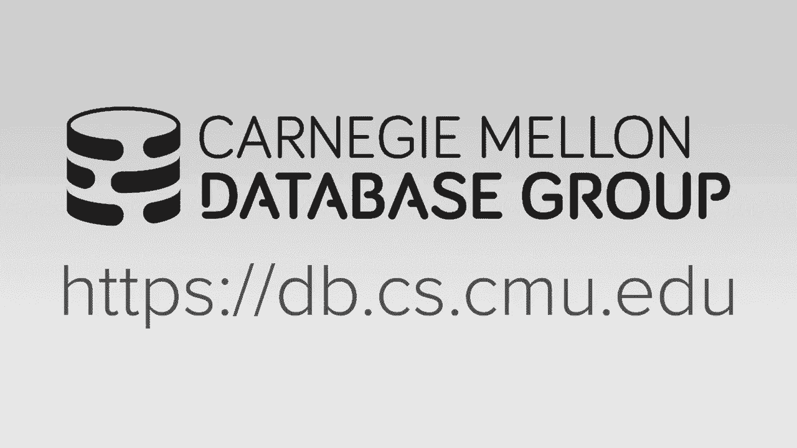
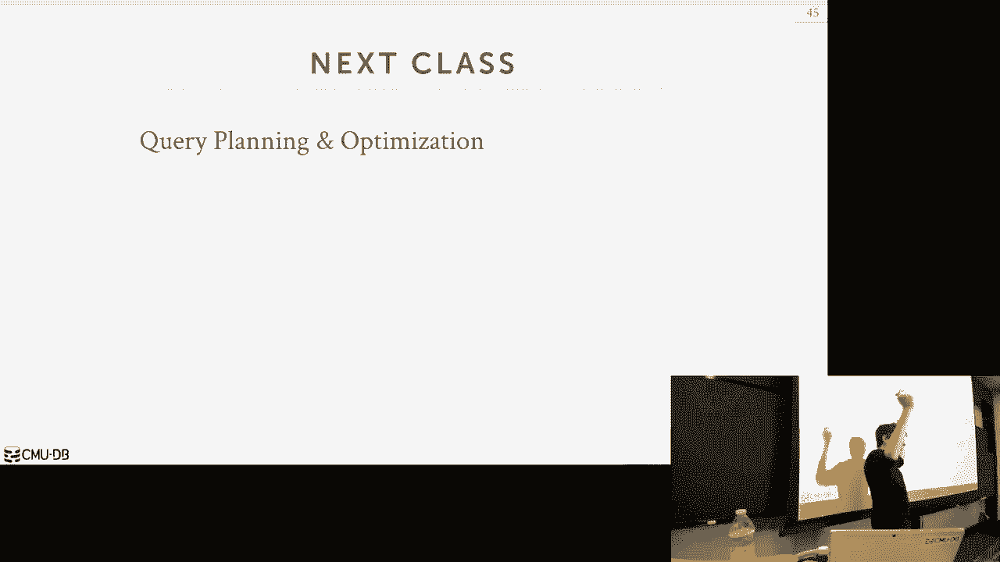

# 【双语字幕+资料下载】CMU 14-455 ｜ 数据库系统导论(2019·完整版) - P13：L13- 查询执行 2 - ShowMeAI - BV1qf4y1J7mX

去吧。

好的，让我们开始吧，今天有很多要讨论的，所以再一次，谢谢DJ，今天请我们出去，所以你下课后马上飞出去，对呀，你去哪儿？呃，我的孩子，呃，史蒂夫有一个对冲基金，我是你儿子，这有一个对冲基金，是啊，是啊。

我研究史蒂夫，他想做的是，就像区块链一样，你知道，所以区块链，是啊，是啊，就像他试图用，就像，所以说，就像某种听起来很粗略的多重，是啊，是啊，所有的权利，别没事，所有的权利，那是他的问题，所有的权利。

你的问题是这些东西，三号作业今天要交，从今天开始一个星期后期中考试又要在这里上课了，在本课结束时，我们会回顾一下你所知道的，你期中考试的大纲，项目2将在周日期中考试后上交，十月二十日。

任何关于这些事情的高级问题，好的，所以让我们跳进去，上一堂我们开始讨论查询执行的课，我们说我们要在查询计划中有这些运算符，然后我们展示了将数据从上到下移动的不同方法，从下到上。

然后我们还展示了有时你可以发送一个元组，你可以发一批元组，或者一部歌剧到下一部歌剧的所有元组，所以在这次讨论中，我们做了一个很大的假设，或者我甚至没有谈论你知道这些操作员是如何被执行的。

我们只是在高层说，它们相邻调用这些函数，他们把它传来传去，所以我们今天要讲的是，数据系统如何正确地执行这些事情，这些是什么，你知道我们会让这些工人，他们可以使用这些运算符并执行它们并产生一些结果。

所以在上一堂课的大部分时间里，你可以假设我们说的是单线程执行，这意味着我有一个线程将在根部调用下一个，假设您在做迭代器模型，从上到下呼叫下一个直到我们得到一些数据，然后你知道一根线做了一切。

但是当我们花了很多其他的讲座来讨论，我们知道如何构建线程，保存并发数据结构，我们可以有多个工作者或多个线程或进程运行，或者同时为我们执行这些任务，然后在最后我们，你知道的，我们把所有的东西组合在一起。

把它变成一个单一的结果，我们将其交还给应用程序或终端，不管是谁调用了查询，这就是我们今天要讲的，我们讨论了如何并行执行查询，所以它向我们展示了一种明显的，为什么你会在现代关心并行执行。

今天的CPU是什么样子的，或者Gpus，我们也有更多的核心可用，所以我们希望能够利用它们，所以我们在数据库系统中得到的好处，如果我们能支持并行执行，你会得到明显更好的性能，但并不总是，但通常都是这样。

还是你想这样，这可能是为了更好的吞吐量，这意味着我们每秒可以运行更多的查询，每秒处理更多数据，我们会得到更好的潜伏期，意味着我们执行一个，查询可切可切，及时削减，因为我们可以得到，我们可以并行运行事物。

这样做的另一个好处是我们也会变得更好，系统的响应性或可用性，这意味着系统会感觉更活跃，对我们的，再次回应我们的要求，想想，记住，我们说的是面向磁盘的数据库系统，记住我说过，任何时候对于所有这些数据结构。

我们到目前为止谈到的，或者像桌子堆，任何时候查询都可以访问页面，那不在记忆中，它不在缓冲池中，因此，当，你知道的，我们从磁盘上获取它，并将其带到我们的缓冲池，所以如果我们的系统中只有一个线程在执行。

或者我们整个系统的一个过程，每次我们不得不从磁盘上接触数据，这将是一个漫长的停顿，而我们去获取我们需要的数据，所以系统看起来没有反应，但如此，但是允许我们有并发操作或当前执行，我们可以有一个线程块。

因为它将在磁盘上使用，但是其他线程可以继续运行，并希望对已经在记忆中的东西进行操作，并继续取得进展，在一天结束的时候，这一切加起来会是什么，它将降低总成本，我们数据库系统的拥有成本或TCO。

所以TCO通常是企业世界的人所思考的，数据库系统的成本，对呀，这不仅仅是买机器的费用，或支付软件许可证的费用，这是实际运行这个东西的总成本，你知道有一段时间，这包括软件许可证，包括硬件，它还包括。

劳动力成本实际上设置了软件，把机器架好，实际运行服务器的能源成本，所以如果我们能用更少的硬件做更多的工作，那么这将大大减少这一点，所以这对我们来说也是一个巨大的胜利。

所以这意味着如果我们买一台有更多核心的新机器，我们希望我们的数据能够利用它，所以我们也需要区分的东西，在我们开始谈论并行执行之前，今天是能够区分分布式执行还是分布式数据库，所以在高水平上。

他们都试图做同样的事情，所以在并行数据库和分布式数据库中，这个想法是，你有一个分布在多个资源上的数据库，允许您再次改进数据库系统的不同特性，在大多数成本延迟之前，诸如此类的事情。

所以我在这里强调资源这个词，因为我不一定说这意味着另一台机器或多台机器，对呀，可能是多个CPU可能是多个磁盘，对呀，所有这些都包括一个分布式并行数据库系统，从应用程序的角度来看，喜欢的，从那个人那里。

其实你知道，打开终端，编写后续查询并将其发送到我们的数据库系统，他们应该知道不应该在乎，不管我们是并行分布式数据库还是单节点数据库系统，这就是陈述性语言的美妙之处，续集，我写我的精选语句。

我不在乎我的数据实际上存储在哪里，我不在乎它是否必须加入，你知道在网络上移动数据或者在不同的套接字上移动数据，再次，续集查询是不知道这些事情的，所以如果我们有一个新的数据库系统，然后我们开始扩展它。

使其并行或分布式，那我们就不必去了，我们不应该回去重写我们的申请，重写所有续集语句，一切都应该正常，所以这是最终目标，我们又要在这里做什么，具有逻辑层与物理层的断开连接或抽象层。

我们可以根据需要移动物理东西，逻辑部分不变，对我们来说，这似乎是显而易见的，但就像那是一件大事，事实上，这对几年前的新续集系统来说也是一件大事，但这在二十世纪七十年代是件大事，对吧，因此。

并行数据库中分布式例程的区别如下，所以这就是我的定义，我不知道课本上是怎么说的，但对我来说，这是最有意义的，这种情况如下，以及学术文献中的内容，嗯，术语并行分布是，通常术语经常混在一起。

但在大多数情况下，人们意味着大多数人都有这种系统，但很多系统还是这样，因此，并行数据库是一个，我们可用的资源，系统中的人将在物理上相互靠近，就像一个有两个CPU插座的单机架单元机器，对呀。

所以CPU插座有核心可以为我们查询，那些东西真的靠得很近，因为他们正在通过我们非常快速和高带宽的互连，这就是资源再次相互交流的方式，不管是CPU，什么是计算或存储，现在无所谓了，对于今天的讨论来说。

最重要的是，我们要假设，那个，这些不同资源之间的交流将不仅仅是快速和廉价的，但也有可靠的意义，如果我将消息从一个CPU套接字发送到另一个CPU套接字，它不会掉下来的。

因为这意味着我在互连上失去了缓存流量，我还有一大堆其他问题不仅仅是丢失数据库消息，好像整个系统都分崩离析了，在分布式数据库中，资源可以相距甚远，所以这可能意味着在同一个机架上有不同的机器。

同一数据中心的不同机器，或者世界不同地方的不同机器，美国东海岸和西海岸的数据中心，因此，为了在这些不同的资源之间进行通信，我们必须通过一个较慢的通信通道，如公共广域网。

而这个东西可以像CPU插座之间的互连，这样就快多了，因此，因为我们正在检查这个不可靠的互连，我们不能假设我们的旧信息会很快出现，并以我们期望的正确顺序出现，或者你根本就出现了。

所以我们还有一大堆其他棘手的问题要处理，当我们在学期末谈论分布式数据库时，所以我们现在要忽略所有这些，我们将专注于并行数据库，为此，你可以假设这是一个，这是一台有一堆插座的机器，一堆核心。

可以同时操作的，或者他们也在对着同一个磁盘说话，那是本地机器人，那是本地的，所以今天我们首先讨论过程模型，这就是我们要如何组织系统，以便实际上有工人来执行我们的查询。

然后我们将讨论如何实际支持查询计划的并行执行，然后我们将讨论获得并行性的另一种选择，就是做我o，平行度，这两个人在计算和存储之间的区别，然后就像我说的，我们会在最后结束谈话。

对预期的事情做一个快速的回顾，然后在中期，对呀，所以这个，数据库系统过程模型，就是，我们将如何组织或构建，系统有多个工作人员运行并发请求，我们必须这么做的原因是我们要么有一个应用程序，发送非常大的请求。

我们希望在多个员工之间分配，或者我们可以让应用程序再次同时发送多个请求，我们想把不同的工人分开，所以在OTP的情况下，会有一堆小请求，所以我们想在OLAP中并行运行这些，是的是的，传统上，你知道的。

少量请求，但是这些请求然后我们想分开并同时并行运行，所以我们稍后会讨论这种类型的并行性的区别，这就是我们要接受请求的总体想法，并在多个工人之间运行它们，所以我用工人这个词，只是指系统中的某个组件。

它能够承担一些任务，系统的其他部分告诉你要做什么，就像网络层收到请求一样，我们通过查询优化器运行它，现在我们有了一个查询计划，查询计划是一个任务，我们想交给一个或多个工人，让他们执行这个东西。

所以我用工人这个词的原因，因为这可能是一个过程，可能是一根线，对呀，我们可以是，但在高水平上，基本思路还是一样的，而这项工作传统上负责，对于给定的任务，有一些东西会把它交还给应用程序，并说你知道。

这是您执行的查询的结果，所以我们可以有三种不同的过程模型，是呀，好的，是呀，问题是，我们能说工人是一根线吗，是呀，工人要么是一个过程，要么是一根线，取决于您使用的流程模型，是呀，应用程序必须被调用给您。

先生，这个问题是应用程序是否需要更容易，现在可能是，但一切都是OLTP，是呀，对，就像我有一个网页，我有多个用户访问我的网页，每一次页面加载都会在服务器端引发一堆代码。

像PHP JavaScript Python，该代码将执行一系列请求，你知道的，从数据库中获取数据，然后将html呈现给您，所以我有多个用户访问我的网页，然后它们中的每一个都从这个代码中起飞。

然后发出不同的请求，或者它可以像一个单一的仪表板或分析应用程序，其中一个用户提交了一堆查询，你知道一次一个，但我们想让它们并行运行，可能是任何一个，所以在我们的数据库系统中可以有三种不同的过程模型。

首先，我们将有一个单一的过程，每个工人，然后我们可以有一个过程池，然后扰流板是最常见的是这里的最后一个，至少在较新的系统中，我们实际上是一个多线程系统，我们每个工人一根线。

所以我们将一个接一个地讨论这些例子，每个工人的过程是最基本的一种方法，我们将有一个工人，由单个操作系统进程表示，所以发生的事情是你的应用程序发送一个请求说嘿，我想执行一个查询，打开到数据库系统的连接。

有一些集中的协调员或调度员得到最初的请求，然后现在就可以分出一个工人这是一个单独的过程，负责处理这个连接，所以现在发生的事情是调度员说好吧，我给你找了个工人，这是您可以与之通信的端口号。

现在应用程序只与工人直接通信，工人负责做你知道的任何事情，执行查询所需的任何请求，问题将是，我们会有多个工人，他们将是独立的过程，现在他们再次假设我们是一个面向磁盘的系统。

现在他们可以在自己的缓冲池中从磁盘中获取页面，并把他们铭记在心，因为现在我们不想在同一页上有多个副本，在这些独立的过程中，因为现在我们必须在它们之间进行协调，这将是昂贵的，如果你有相同的信息来回。

那就有点浪费内存了，因为我们又会有多余的东西副本，所以解决这个问题的方法是，你可以使用共享内存，那个，它将允许这些不同的过程，通常在内存中有自己单独的地址空间。

他们中的许多人共享对这些全局数据结构的访问，操作系统是促进这一点的原因，所以你也可以从这种方法中得到的一个好处是，如果您担心系统的弹性，如果你的工作代码中有一个bug，它崩溃了，它最终不会摧毁整个系统。

因为只有一个进程崩溃了，操作系统知道它是从调度员那里分掉的，但如果这一个人失败了，它不会摧毁整个系统，对我来说，理解共享内存问题并不那么简单，就像我们有不同的几个过程，是呀，好的，对呀。

所以共享内存是一个做，他们在5月13日涵盖了这一点，两个十三个还是没有，是啊，是啊，好的，所以共享内存是一种结构，操作系统提供说，这里有一些记忆区域，所以通常我在我的过程中称之为Malloc，那是我的。

那是在我的私人地址空间，只有我才能用共享内存读写那个内存，你告诉操作系统，嘿，马洛克，给我一堆空间，然后在共享内存组中有权限的任何人，也可以对它读写，通常操作系统不会让你这么做，那是，你知道的。

这是操作系统提供的保护之一，所以除非我有共同的记忆，那么每个工人都会有自己的缓冲池，它会带来只是复制的页面，其他工人池，或者其他工人，他们带来了同样的页面，因此，几乎所有旧的数据库系统都使用这种方法。

或者20世纪70年代制造的每一个系统，二十世纪八十年代，可能是二十世纪九十年代初，正在使用这种方法，有人猜猜看吗？为什么，你为什么要处理这些线程，也许没有设置，就是，他说，也许还没有线很近。

所以当时有线程，不如我们现在有一个好，但是没有标准的线程API，像这样像这样像1980年以前的假设，P线程右，所以我有所有这些不同的UNIX变体，所有这些不同的操作系统变体，所以如果我有我的数据库系统。

我想让它继续运行，你对VAX的了解，和所有其他操作系统，我不得不重写我的应用程序，我的数据库系统现在为所有这些不同的操作系统使用线程API，用p线程和Linux，成为每个人都使用的主要UNIX变体。

那对每个人来说都足够好了，所以在过去，不像我们现在这样，每个人都有自己的线程包，这不是一个标准的API，我们必须重写所有内容但每个人都有分叉和连接，这是基本的操作系统原语。

所以如果您使用这个过程模型构建了一个数据库系统，那么它几乎在任何地方都有效，因此，它的扩展称为进程池，所以在这种情况下，我们仍然分叉我们的过程，但这个想法是，与其分叉一个过程，对于每一个出现的连接。

我们只是有一群工人坐在那里，我们是调度员可以坐，可以选择其中一个说，好吧，现在你负责执行这个查询，你现在还可以做的是因为你有一个游泳池，你意识到周围还有其他过程可以帮助你做工作，现在你实际上可以做一些。

获取一些查询并行性，因为现在你可以说好了，我需要实际执行这个查询，对我来说，这样做需要太多的工作，也许我会把一半的工作交给另一个过程，让它在单个进程，最后一张幻灯片中工作者的单个过程模型。

你不知道还有什么在运行，你想分叉，你在运行时也知道一个过程，因为那会很贵，而这家伙周围有可靠重用的东西，所以是的，数据库管理系统的这一部分也是如此，像沃克一样，应用程序的这一部分，所以今天的问题就像。

什么是数据库系统数据系统是这里的一切，这里的一切，那么这是什么应用程序，这就像，这就像你的网站，这就是你所知道的，与数据库对话的桌面应用程序，所以这是发送续集查询，这个电池是用来，把他们交出来，是啊。

是啊，所以这里有一条分界线说，数据库系统侧面的一切，对此要了解的重要事情，虽然在上一张幻灯片中的这张幻灯片中，这些又是，这些都是成熟的操作系统流程，所以我们没有在数据库系统中自己做任何调度。

操作系统负责所有的调度，现在我们可以给它漂亮的标志或优先标志，并试图说这一个应该得到更高的优先级或更多的运行时，这另一个过程，但在高水平上，我们无法控制安排好的事情，所以一旦我们移交工作，它只是运行。

是呀，你有不止一个的想法，你的这个问题是，您是否有一个以上的工人池，否，你有一个，你知道只有固定数量的正确，他的问题是你在工作簿中有固定数量的处理，是呀，所以这是你可以定义的，当你，当您打开数据集时。

你说有多少，我允许有多少个工作进程，因为它永远分叉，如果你一直有联系，然后系统就会不堪重负，那么通常你所做的是，在现实系统中你总是有一个，你总是有一个工人，像特殊的工人一样，所以如果你把系统锁住了。

总有一个工作人员可以从管理帐户接收传入的请求，这样你就可以开始杀人，清理东西，它说这个过程是如何处理的，有多少工作要做，它恰到好处地坐着，实际上这是嗯我们实际上讨论过这个，在我们昨天的开发人员会议上。

我们正在建设我们的旧，自从我们在CMU建造以来，我们以前有过这个问题，我们扔掉了旧系统中所有的代码，如果没有工作可做，我们的CT仍然会旋转到60%，就像在做无用的事情，但它在投票，理想情况下你想要这样。

如果没有工作可做，您希望cp利用率为1%，百分之二，对于我的一个系统，我用于所有的演示，我像续集服务器一样运行，我在运行MongoDB，我在运行Postgres，我的续集，玛丽B和你没有，你知道的。

其中一些像CPU尖峰就像10%，当他们无所事事的时候，大多数都像以百分之一的速度运行，所以它还在做一些事情，只是因为它在检查，说嘿，有工作要我做吗，但你不想燃烧燃烧循环，对一些工作是的，比如偷工作。

一定要增加是的，这个问题是做一些做一些工人政策使用工作窃取，在高端系统中，通常发生的是，我应该为这个做一个幻灯片，在高端系统中，像调度员或协调员，它知道谁在做什么工作，所以如果它能在飞行中，我认识，哦。

这个工人是，也许读取一堆数据需要很长时间，它有一堆东西在排队，还需要处理，所以也许我会把它的工作拿出来交给别人，你有高端系统可以做到这一点，所有的权利，所以我，这是使用的方法，那是用在。

ibm db two，Postgres在2015年切换到这个模型，回到了这里的前一张幻灯片，又对了，Postgres，甲骨文和和结核病二，这些都是旧系统，就像从八七十年代开始。

我认为Sybase和Format也可能以这种方式工作，也是从二十世纪八十年代开始的，嗯，大多数现代系统都是这样做的，最后一种方法是多线程的，所以现在的基本想法是我们，只是没有一堆不同的过程。

他们都在做不同的任务，我们只有一个数据库系统的进程，里面有自己的线，他们可以决定如何根据需要调度东西，再喜欢一次，这只是我们只是使用p线程或其他什么，和在窗户里一样，所以在这种环境下，现在会发生的是。

因为我们现在完全控制了，我们知道任务是什么，我们知道我们有什么线程，我们现在可以做得更好，更容易理解，或者所有线程不同的全局视图，做，正在做，我们有什么任务可做，然后我们现在对单个线程做出调度决策。

我们在过程模型中，我们有点把东西交给操作系统了，让操作系统把事情弄清楚，依我看，多线程模型是必由之路，从工程的角度来看，这更容易处理，因为不是你不处理这件事，所有这些共享内存的操作系统语义。

或者处理过程管理，间接费用，我也在做一个上下文切换，在多线程环境中要低得多，如果您仍然在从一个线程切换到下一个线程时支付罚款，然后同样的过程，但它不像在一个重量级，从一个过程到另一个过程。

因为他们需要所有的安全和保护机制，对于进程的内存表示或内存存储中的内存，所以我无法从科学上证明这一点，但总的来说，多线程进程将是，其中数据库系统将比多进程系统更快，所以要指出的是，不过。

这只是因为我们要进行多线程处理，模型方法并不意味着我们将自动获得并行查询执行，特别是，我们可能不一定得到介绍查询并行性，我将在更多的幻灯片中讨论这一点，意思是喜欢并不能保证。

即使我们的数据系统可以使用多个线程运行，如果我给它一个单一的查询，它不能将查询分解为多个并行运行所有这些查询的朋友，所以我的续集，五点七是一个多线程数据库系统，但它不能做到介绍查询并行性。

这可能在八分钟内就修好了，我忘了查今天的事，对我来说就像我的理解，数据库世界里有什么，据我所知没有数据库系统，在过去十年里建造的，无论是从学术的角度还是从商业的角度，就像一个初创企业系统，据我所知。

没有任何系统，这就变成了多过程模型，他们很少用叉子或Postgres，这实际上是一个非常常见的方法，每个人都喜欢，有很多数据系统，他们会拿Postgres BSD许可证。

所以你可以用它做任何你想做的事情，它实际上写得很好，我和我的续集相比，但您可以重写Postgres的部分，对于您的特定应用程序来说很慢，并将其作为您的新数据库系统，就像垂直，绿梅时间尺度。

所有这些所有这些都这样做，所以发生的事情是，他们继承了Postgres上的遗留流程模型架构，如果你沿着这条路走下去，但是任何从零开始的人，对于新的代码库来说，几乎总是以多线程告终，对呀。

我们简短地谈到的另一件事，呃，我们今天没有时间讨论的是日程安排，我们都在谈论，我们已经和我们谈了一点关于，你有，调度员或协调员，能理解我需要执行的任务是什么，我有什么资源或工人。

然后它可以决定您知道将一个查询分成多少个任务，在那里您知道哪些CPU内核应该执行这些任务，哪个线程应该为另一个线程暂停，对，然后一旦它产生任务的输出，输出实际上去了哪里，所有这些我们要担心的事情。

如果我们想在并行数据库系统中做，嗯，但你知道，总的来说，没有一种方法比另一种方法更好，这取决于你工作的环境，取决于要支持哪种目标工作负载，但正如我在整个学期多次说过的那样。

数据库系统总是比操作系统运行得更好，所以我们总能对所有这些事情做出更好的决定，是呀，因为你并不总是由叙利亚人来决定，不是调度进程线程的核心，总是由他的问题决定，对于给定的线程，不是这样吗。

操作系统决定什么法庭运行不，这个叫做Neuma Control在我们的Linux测试集中，你可以完全控制知道，说我的线程要在这个核心上运行，这些核心是对的，操作系统会为你强制执行，如果你什么都不做。

然后操作系统会试着弄清楚，您正在访问这个中的内存，你知道一个多套接字，CPU有两个CPU插座，在现代像Numa系统中，ACCPU套接字具有本地内存权限，靠近它的暗淡，所以如果你的线程在这里运行。

您正在访问另一个套接字上的内存，操作系统或CPU可以自动将您迁移到，但在高端系统中，我们确切地知道我们要接触的数据是什么，我们可以提前把自己固定住，或者强迫自己说好吧。

我们知道我们有一个线程运行这个核心，它只能读存储器，从这个内存位置读取数据，所以所有触及内存位置的任务都去那里，我们可以自己做这一切，我们可以做得比操作系统更好，所有的权利，让我们来谈谈快速并行查询。

所以有两种类型的平行，我们要支持，有内部查询并行性和介绍查询并行性，所以我会把这两个都过一遍，但我们今天会花大部分时间来讨论这个问题，对吗，所以内部查询并行性是我们实际上可以执行多个查询。

同时做不同的事情，这将再次提高我们系统的吞吐量和延迟，然后对于介绍查询并行性，我要回答一个问题，并将其分解为子任务或片段，并同时在不同的资源上并行运行它们，所以内部查询并行性是我已经说过的，这个想法是。

我们有多个请求来自我们的应用程序，而不是在一个线程上一个接一个地运行它们，我们将有多个工作者或多个线程同时运行它们，这样我们就能更快地得到回应，你知道他们想要的结果，所以说。

如果我们需要执行的所有查询都是只读的，意思是他们不做插入，更新或删除，他们只是在做精选的陈述，那这就超级容易做了，因为不会有任何冲突，不会有任何问题，你知道，我正试图更新相同的哈希表，当你读它的时候。

只是有点管用，非常好，所以这个超级简单，但这并不总是那么常见，对我们来说很难的是，如果我们有多个线程同时更新数据库，现在我们要担心我们谈到的所有并发控制的东西，对于B加树和哈希表。

但现在我们也要担心这个，对于实际数据本身，例如，如果两个查询试图同时更新相同的元组，应该发生什么，所以对你们来说好消息是，我们要赌到期中考试之后，因为这完全是另一回事，你知道吗，蜡球，我们得处理。

超级硬超级牛逼，嗯等，我们基本上会花两周的时间在精疲力竭的情况下讨论这个问题，这就是我超级兴奋的事情，这就像，这是我最喜欢的关于数据库系统的部分之一，就是他们能做到这些，同时进行这些并行操作，但这是。

但这是超级难做到这一点，我们期中考试后再讨论这个，对呀，所以对于这门课来说，我说过我们专注于介绍查询并行性，这对于分析查询很有用，我们有多种资源或多种工人可用，我们将把查询分成片段或子任务。

同时并行运行，所以在这里讨论，我们将关注计算并行性，这意味着我有多个工作者，他们有多个线程或核心可供我使用，我要用它们来做同样的查询，所以思考我们将如何组织的方式，这是就是在我们的查询查询计划中。

我们有这些操作员，我们已经讨论过他们如何拥有下一个可以移动数据的功能，你知道你下一个问，它给你一个数据块或单个元组，所以我们可以从生产者消费者范式的角度来思考，其中每个运算符是，不仅是数据的生产者。

就像如果你在上面叫下一个，我会给你一些数据，但它也可能会消耗运行在它下面的一些操作员的数据，这样我们就可以考虑如何组织查询计划，在这种特殊的消费模式中，我们可以看到我们如何以不同的方式并行运行这些东西。

所以我也要说的第一件事，对于我们谈到的所有运算符算法，都有平行的版本，但他们会有所不同，基于是否有多个线程，同时更新一些集中的数据结构，就像我在并行地做一个联合哈希联合。

我可以让多个线程更新并构建我的哈希表，然后多个线程可以探测该哈希表，或者我可以把它分开，或者将我正在使用的输入数据从我的，我下面的操作员，并让他们每个人都在孤立的或个性化的数据块上工作，或数据分区。

然后现在我不需要在这些不同的工人之间进行协调，同时奔跑，所以从概念上来说，这很容易思考，对吧，所以这个是一样的，这是我们在恩典分治前谈到的同一个哈希连接，哈希连接，之前我说的是。

我们将在两边都有这个哈希函数，在构建或内部和外部表上，他们会在不同的水平上拼凑到这些桶里，所以现在我们想做一个连接来组合这些，这些桶我们只需要这个，你知道我们只需要检查这个级别的元组。

另一边同级别的元组，因为我们把它分成了，所以并行运行这个的方法，现在超级简单，我们只有一个工人只是采取自己的水平，现在执行连接并产生输出，所以你可以看到我们如何做到这一点。

对于我们在排序合并之前讨论过的所有不同的事情，加入任何类型的顺序扫描，我们可以把它分开，把工作分开，让它们并行运行，棘手的事情，不过，现在正在把这些数据放回一起，不同的方法，所以这就是我们要关注的。

所以三种类型的介绍查询并行性可以是运算符内并行性，也称为水平平行，算子内、间并行度或垂直并行度，然后是浓密的平行，我想是在课本上，它只是其他这些的延伸，但我想尽快向你展示这一点是值得的，它是什么。

以防你再看到它，我会说，我也是，对于所有这些方法，它们不是相互排斥的意思，如果要并行运行查询，你知道你不能从这三个中挑一个，你实际上可以把它们结合起来，这就是数据系统可以为你计算的，所有的权利。

我的硬件是这样的，我的数据是这样的，我的查询如下所示，我可以使用这些技术的一些不同组合来获得最佳性能，你知道我的工作量，所以再一次，让我们一个一个地看一下，所以在内部运算符中。

并行性是指我们将运算符分解成独立的片段，每个片段都会做任何事情，它是操作员希望我们对输入数据的某些部分做的，所以如果我在桌子上有一个扫描操作员，我可能会有多个扫描实例在不同的线程上运行不同的片段。

他们每个人都要扫描桌子的不同部分，他们都会把数据输送到，所以我们要结合这些数据的方式，现在是所谓的交换运算符，Exchange运算符是查询计划中，数据库系统人为地注入，当它生成查询计划时，上面写着好吧。

这是交换操作员，我需要能够把他们的结果结合在一起，因为我需要一个单一的流或单一的，你知道的，向上到下一个运算符的数据流，所以交换运算符实际上是由同一个人发明的，我们上节课讲到的火山迭代器模型。

做B+树纸的同一个人，或者B B G书，我是我胡言乱语对吧，2。他在北平有一篇论文，它呈现这个交换运算符，这和这差不多，这里的这种方法是每个系统正在做的并行执行，甚至分布式执行正在做这样的事情。

尽管他们可能并不总是确切地称之为交换运算符，让我们看一个非常简单的例子，所以我们有一个单一的选择语句，从选择开始，点值大于999或999的，所以查询计划超级简单，对一个进行顺序扫描。

我们将其输入过滤器操作员，所以要并行运行这个，我们要做的是，我们现在就分头行动，跨不同片段的查询计划，或者用扫描和过滤器进行扫描，然后我们现在把数据库分开，已经是，你知道吗，总的来说，它已经是了。

因为它是一个，它已经被分成几页了，所以我们现在能拥有的，在给定的计划片段中，对不起，我们可以给它做手术，独特的一页，所以上面的Exchange运算符IS有自己的下一个函数，就像任何其他操作员一样。

所以如果我们做火山模型，迭代器模型，我们下一个打电话的地方，然后下去，外汇接线员说我下一个打电话给我的接线员在这里，然后在扫描时调用下一个，然后现在我要开始提供数据，我要从一个特定的页面检索。

我们对所有其他碎片也这样做，对，他们每个人都要在不同的页面上操作，然后交换运算符，然后合并它从这三个不同的片段中获得的数据，这三个不同的工人，然后将它们组合成一个单一的结果。

然后我们将其作为应用程序的输出，对呀，因为查询的最终结果总是需要是，你知道的，一个单一的结果，我们不能说你的数据在这里，这里和这里，因为他们有三个不同的工人，我们必须总是产生一个单一的结果，是呀。

所以作为交换，随机选择一个工人，不不，没有问题的名字是，1。明年外汇占款情况如何？它在平行地呼唤它们，它知道我下面有三个碎片，因此，我接下来需要呼吁他们所有人，它在不同的工人中激发他们。

所以你可以打电话，呃，下一个交换一次，但在所有的树上都叫它下一个，它刚刚积累的数据子集，然后等待下一个电话，然后稍后编辑那个，是啊，是啊，所以他的问题就像，如果我打电话给这里的下一个。

它是如何渗入到这些其他的，你可以在上面有一个协调员，然后说，我知道，我需要从其他人那里得到数据，不停地打电话给下一个，直到他们什么也没有，但可能会发生其中一个被挡住的情况，另外两个在提供数据权。

所以所以所以把它想象成这里的碎片，这是单独运行的，对呀，它就像一个生产者消费者，这东西是异步的，说嘿，给我一些数据，然后下一次它开火并产生结果，然后是其他必须回来说的话，去获取更多数据，是啊，是啊。

快回来，是的，你觉得这些就像溪流，对呀，正在产生结果，挤向下一个人，取决于它的实现方式，这东西不能，我会不停地把数据塞进去，直到有人叫我停下来，或者我能做到，每当我被召唤，不同的系统，做不同的事情。

是的，在这个问题中发生的片段是片段的调用，像这个部分这里是平行的，是呀，你能让它们平行运行吗，从交易所打到，像这样，那个呃，这个东西叫做权利，所以又喜欢了，就像这样，他们都平行地被发射。

他们都在同时工作，同时在不同的核心上，我是说我在想，他们会不会在同样的地方做手术，他们怎么，哦耶，所以他的问题是，我如何确保他们读的不是同一页，所以作为这里查询计划的一部分，嗯。

有两种方法可以做到这一点，你可以说这是暗示，我需要做一堆工作，假设在这种情况下，的，第一个和第二个线程完成了这些页面，他们说好吧，让我去排队拿下一页，我没看错，你就一直这么做，直到你用完页面。

然后你停下来，或者你可以做预分区，我们以后会讨论的，你可以说好，第一个人要给一二三做手术，第二个人在四个小时内手术，五六等等，这只是盲目地抓住不同的页面，或者你可以理解实际上的语义，桌子上有什么，说好。

我想看看这是一张小桌子，所以说，就像，我想有一个线程进程，值小于1000的所有数据，然后一个处理所有值小于2000的数据，对，然后他们可能在读同一页，但现在他们只是处理数据的不同部分。

做所有这些事情有不同的方法，主要的外卖，你所拥有的是理解，就像这个交换运算符是一种进一步合并或分解数据的方法，是呀，所以我想就像在记忆中一样，这不像保证订货，但如果有保证订购，我是说，我向你保证，是啊。

是啊，我不知道，我只是在想，如果你还需要像一个人一样去，我们不是很好，如果排序顺序很重要，并且群集表上的群集索引，嗯，如果如果，如果处理数据的顺序很重要，那你就不会想做这种平行的事情了，对。

因为如果我不能喜欢，在第一页处理好之前，我不能处理第二页，反正那是零线程执行，所以我不想做这些，设置所有这些线程，因为那是浪费时间，你知道的，浪费资源做某事，你知道的，一件事妨碍另一件事，所有的权利。

我给你看的交换是一个基本的交换，叫做集合，基本的想法是，我们将来自，不同于不同的工作线程，操作员产生的不同输出，然后我们将产生一个单一的输出流，我们在上面分发，所以这可能是我在这里的最后一个例子。

就像这样，这是我们发送给客户机的输出，调用该查询的人，所以总是需要组合成一个单一的输出，还有其他时候，也许你想拿一堆不同的输出流，然后现在把它们分发给其他工作线程，假设我同时做扫描。

我将根据值的范围进行除法，我可以并行运行扫描，然后把它通过重新分区交换，然后现在怎么了，然后是什么把它分开了，根据我看到的实际值，最后一个是分发，其中我们有一个单一的输入流，然后我们将把它们分开。

分发给不同的输出流，这可能就是我们为格蕾丝哈希连接所做的，对呀，当我们从表中的单个输入流开始时，我们建立了哈希表，现在它分散了哈希桶的不同级别，到两个不同的线程，所以我在这里用的这个说法。

所以这个命名法，这实际上是续集服务器使用的，嗯，因为续集服务器显式地在查询计划中显示Exchange运算符，及其文件，所以对我来说，这是最简单的推理方法，甲骨文DB两个Postgres，所有的高端。

你知道，支持并行执行的系统，他们都有一些看起来像交换的东西，可能不会用这个，这个术语，但它很高，它的工作原理是一样的，是呀，所以说喜欢，假设我在查询计划中对此有所了解，现在想做一个小组，根据值。

所以如果我，如果我，这个交换拉出一个单一的流，然后我会有一个工人线程，但也许取而代之的是什么，我能做的就是，然后我可以分头说好，如果值是偶数，就往这个方向走，如果值是奇数，往那个方向走。

现在我有了一个单独的工作线程，可以为那些东西做团购，我不需要协调，因为我在做小组，然后我在它们上面有另一个交换，它将结果组合到一个单一的输出中，这是一种获取多个流并产生新的其他多个流的方法。

但以不同的方式分裂，所有的权利，让我们看一个稍微复杂一点的例子，所以现在我们在a和b之间做一个双向连接，所以我们要做的第一件事是并行扫描，因此，我们将分配这两个三个不同的代理线程。

然后在我们的计划片段里，我们实际上是在做，你知道我们会做扫描的，做过滤器，然后他们会建立哈希表，这个哈希表可以是，在这种情况下，它必须是一个全局哈希表，因为我不知道表中的值是多少，当我扫描他们的时候。

所以如果我把，如果我对每个片段都有不同的哈希表，然后当我做连接的时候，我得检查所有的哈希表，这将是昂贵的，这将是缓慢的，所以这些都在构建相同的哈希表，但我有交换操作员，基本上说我等到他们都更新我的哈希。

当我做完B上的扫描后，我可以在两个核心或两个工作线程上运行，他们只是做过滤器，现在他们要对数据进行分区和拆分，现在他们有了自己的交易所运营商，然后现在我做了连接，这可能是一个，这可以是单线程的。

也可以是多线程的，这个箱子，让我们把它变成多线程，所以现在我可以在里面分开，连接之后，我可以有他们不同的线程，现在探测一下这里的分区，对呀，所以你可以看到你如何把这些东西组合在一起。

我们可以让这些不同的工人生成这些，这些输出然后在多个线程中拆分，然后你可以把它们组合在一起，然后把它们分开，你可以把它们写给这个新闻巨人，你知道吗，现在可以并行运行的树结构，对了。

这又是运算符内的并行性，其思想是在单个运算符中，就像对一个，我可以让它在不同的片段中并行运行，内部运算符并行性是指我们将有不同的运算符，同时在不同的线程中运行，对呀，这也叫做垂直平行，因为这个想法是。

我们可以为树中的每个操作符排序，我们可以让他们作为一个单独的工人运行，他们只是在提供数据，你知道吗，一个的输出被馈送到另一个的输入，所以它基本上是这样工作的，因此，并保存连接部分。

在这里我可以有一个核心，一个工人只做连接，对呀，它只是从它的，从其子运算符，然后它做连接，然后一旦它连接，它把它发射到另一个工人身上，这个工人只是接受这个人发送的任何东西，然后做谓词，或者你知道投影。

然后将其发送到查询计划的更高位置，所以现在这些家伙只是在旋转，再说一遍，这是制片人，消费模式，这家伙在输入上旋转，它是从下面的人那里得到的，然后它传递任何与这个家伙匹配的元组，然后他为此旋转重物。

所以这又是，这就是协调的东西实际上很重要的地方，因为如果现在我如果你知道，如果这个东西要吐出的元组数，会很低，那么这个东西基本上会坐很长时间什么也不做，所以现在我给一个核心分配了一个任务。

它不会浪费循环，因为我可以阻止任何进入的队列，但你知道它占据了，你知道吗，承担一项任务以获得资源，在那里可能会更好，只是为了把这两者结合在一起，形成一个单一的管道，再说一次，他们不是借口。

我可以把水平和垂直一起做，我可以有这个连接，与……，你知道的，用这个垂直平行的，呃这里的投影，但我也可以让多个工人同时做这件事，我说的最后一个又是浓密的并行性，在我看来，这只是运算符间并行性的扩展。

这不是什么明显的东西，但我再次认为教科书和其他在线指南都谈到了这一点，所以基本的想法是，我们只是有不同的工作人员同时操作查询计划的不同部分，我们仍然使用交换运算符作为交换，在它们之间移动数据。

假设我在做一个非常愚蠢的，在三张桌子上四路连接，所以我能拥有的是，如果我像这样组成我的联合算法，我可以将查询计划的这一部分作为一个片段，实际上对一对一的工人执行，然后这两个在这里连接，对另一个工人执行。

他们只是平行运行，将数据推送到我们上面的交换运营商，然后我们有其他工人在他们身上操作，这就是为什么我对我说，这只是内部运算符并行性的扩展，因为它只是查询计划的不同部分同时运行，是呀，呃，是呀，但是呃。

第三个和第四个过程仍然必须等待两个过程中的一个的结果，对呀，他的问题是这里的第三和第四位工人，他们是否停止了对一两个结果的等待，是呀，在这个，在这种情况下，是呀，这取决于它，嗯。

取决于交易所是如何设置的，对呀，所以在你做了连接之后，这产生的任何东西，然后它被推到这个家伙身上，当它出来的时候，它可以开始用元组构建哈希表，你可以等，你没有，你不必取决于它是如何设置的，是呀，回到。

所以这是一个，所以问题是，平行在哪里，这里的平行度在哪里，所以我有一个工人在运行这个连接，我有另一个工作人员在运行投影，所以这个东西在旋转，做连接，一切都会找到它找到并匹配它，把手从元组上拿开。

作为它的输出，把它交给这个人他现在可以开始做投影了，现在像超级简单操作这样的预测，所以没那么贵，但这个想法是，与其拥有这个东西，做连接，然后做投影，然后回去做下一个连接，而这个东西在这里做投影。

它可以回去做下一个连接，特斯拉画它，呃，哈希表本身多余部分的操作数间，这将是瓶颈，好的，因为在某个时候，只有其中一个状态可以正确地更新哈希表，所以你的问题就像回到这里，把这个哈希放在那里，他说。

只有一个线程可以同时更新哈希，没有权利，因为他们在说话，他们访问不同的页面，我可以并行处理，你可以把每个人都放在同一个哈希表中，或者你可以做一个分区，现在就像现在你在做多个阶段。

所以现在我可以有第一张通行证，我是说你仍然在访问同一个页面，虽然像第一关，对不起，仍然访问相同的哈希表，但就像第一遍一样，你有不同的线程，更新不同的桶，对，但当你把它捣碎的时候，但你最终可能会散列。

你知道两个线程可能会散列到同一个桶里，那么你必须处理不可避免的事情，然后下一阶段，虽然你可以并行运行，但不必在其中任何一个之间协调，或者你可以做，你知道一个威胁可以通过，构建哈希桶。

然后你瘫痪了不同的系统，做不同的事情，嗯，如果您假设您的磁盘非常慢，并且不是所有的东西都适合内存，然后让一个线程构建哈希表，做第一次扫描可能是更好的方法，因为这样你就做了尽可能多的顺序i o。

磁头没有和SSD一起跳来跳去，您可以同时执行多个请求，所以你可以只并行地构建一个哈希表，是呀，呃，我们不构建哈希表的任何特殊原因，那么我们有什么理由不构建哈希表并在这里，是啊，是啊，就像克里斯。

就像我的意思，这就是分区的样子，分区在某种程度上打破了这一点，分割；分割，然后多个流现在可以做探测，这就像是把数据分成不同的分区，就像这就像种族哈希连接，但我们仍然在访问一个哈希表，是啊，是啊。

那么内部和机器有什么区别呢，那么内部运算符和浓密连接有什么区别呢，这就是我要说的，对我来说，这是一回事，浓密算子的定义，爱出风头的，相似之处是树的一部分变得茂密，因为它就像一棵茂密的树。

当我们谈论下一堂课的连接时，这将更有意义，就像有右深左深的树对，但这就像一棵茂密的树，因为我在做联合，在这里连接两张桌子在这里连接两张桌子，所以我可以有一根线，在这里做这个关节，还有一件事。

我在那边做这个，在这一点上，我不需要他们两个之间的协调，直到我们交换后，所以对我来说是的，这和我在这里展示的术中并行是一样的，但他们称之为浓密的平行线，而不是只做一个正确的，是啊，是啊，是啊，是啊。

或者有一个操作员，做自己，和工人，你看到的这种方法很像这样，有点像每个操作员都是自己的工人，你经常看到这个，像火花流这样的流系统，阿帕奇，我是菲·弗林克，比特、风暴或卡夫卡，他们有。

这是他们通常使用的体系结构，但你可以在数据库系统中做的事情可能会做一些更浓密的事情，因为你想有一个，你知道一个任务，您有尽可能多的工作与元组，在树上尽可能地往上走，是呀，所以这里有一个工人。

一个会把任何给定的人发射给任何一个工人，对你的工作，正确，是呀，你如何决定你是哪一个，所以说，这个问题在这个交换运算符中，在这里进行这一次交换，它可以将数据推送到这个运算符或这个运算符中，我如何决定。

所以这是我们在查询计划中烘焙的东西，你会说你知道，这里是，我想根据这个属性对我的数据进行分区，就做循环赛，只要做散列，我们会在课程结束时讨论这个问题，但你可以听到一些逻辑，决定他们帮忙。

您决定在哪里包装数据，最简单的就是循环赛，但实际上对于这个特定的例子，你不会想做循环赛的，因为你需要知道这里有一些元组，从这边来的，如果它要与这里的元组匹配，您希望它们去同一个分区，不是，你知道的。

不是不同的，否则你会有假底片，是啊，是啊，下一个应该是我，我稍后会把幻灯片弄得更清楚，好的，所以右边，这就是计算并行性，再次在高水平上，以不同方式支持查询并行性的数据。

将以某种形式支持Exchange运算符，他们有多老练，取决于系统的复杂程度，不过，我提到的是，如果我们在慢速磁盘上运行，我们所有的线程都被阻塞了，因为他们需要的东西不在缓冲池中，我们得去磁盘把它们。

然后所有这些额外的核心，我们正在做的所有这些额外的交换运营商对我们没有任何帮助，因为他们总是会成为瓶颈，这样做，做那个请求，所以四处走动的方式，这是通过IO并行性，这里的基本思想是我们要打破数据库。

存储设备上跨不同位置的系统文件和数据，我们可以用很多不同的方法来做到这一点，每个数据库可以有多个磁盘，我们可以每个磁盘做一个，我们每个磁盘做一个关系，或再次跨多个磁盘拆分，从续集的角度来看。

从应用的角度来看，我们不知道，我们不在乎，这一切都是如何设置的，数据系统为我们隐藏了所有这些，这个问题就像突袭一样，是呀，所以这里有谁听说过突袭，你们中的大多数人，好的，所以Ray代表一个冗余的数组。

所以我知道它以前叫什么，我不知道它叫什么，现在是独立磁盘的冗余突袭，它以前被称为，我们做了一些便宜的光盘，然后磁盘制造商想用射线，但不喜欢，被称为廉价，因为他们想，他们不希望他们的产品便宜。

所以他们回去换了一下，它是一个独立的，你看，这里的想法是我们可以配置系统，这样将出现多个存储设备，作为数据库系统的单个逻辑设备，我们可以这样做，通过我们主板上的一个特殊硬件控制器。

我们可以通过软件本身来做到这一点，就像Linux内核支持RAID配置一样，或者我们有一个存储设备为我们提供这种功能，我们有一个快速的互连到我们的系统，但主要的收获是，在很大程度上，用于突袭设置。

这将完全独立于数据库系统，它不知道，不在乎磁盘是否已分解成多个设备，或者我的存储在多个设备上中断，在这里的这个箱子里，这是数据库系统管理的东西，和，因此，它可以聪明地做出关于，它将如何计划查询。

因为它知道数据实际上是如何在不同的设备上布局的，它知道那些设备的速度，假设我们这里有一个非常简单的例子，我们有一个有六页的数据库，所以这是一个零突袭的例子，只是，这就是所谓的条纹，所以发生的事情是。

当数据系统创建这些页面并写入它们时，这里有个控制员，然后决定，或者你去这里，你去那里，我决定采用循环赛的方式，将其写入哪个设备，它内心知道，它有自己的元数据可以说，哦，我需要第一页。

我知道它就在这张磁盘上，我来我去拿，但同样，数据系统不知道这些事情，另一种最常见的方法是进行镜像，基本上现在每个设备都有每一页的完整副本，您可以有一些擦除编码或其他方法来确保我，你知道的。

如果一个磁盘坏了，你可以重新创建它，但从其他页面来看，是呀，有点你得协调，他的问题是雷一号，写起来有点慢，是阅读，没有因为阅读，我可以说好吧，嗯，假设我的心，好的，所以我可以去任何一个。

现在我可以有一个线程阅读第一页，和另一个线程在单独的设备上读取第二页，这对权利来说都很好，我需要确保它在所有的人中传播，所以这就更贵了，还有更多，这是你需要的关于突袭的最基本的东西，还有更复杂的设置。

比如第五次突袭，突袭一个零，但他们可以你知道的，这些不同事物的组合，是呀，圆圆的拉面就像一个赞，你在玩牌，你只是每个人都有一个，然后当你到达终点的时候，你回去再做一遍，我不知道圆圆的石头。

我不知道知更鸟在这种情况下代表什么，当我们玩的时候，就像孩子们长大，我们玩游戏，你循环往复，只是，你知道，按那个顺序分发东西，是啊，是啊，我我说，美国口语，好的，我们刚才说的突袭的事。

这对数据库系统来说都是透明的，我们可以聪明的事情，不过，这是我们到目前为止讨论过的分区的东西，所以数据库分区的想法，就是，我们将能够把数据库分成不相交的子集，然后可以分配给离散磁盘，现在发生的事情是。

数据系统缓冲池管理器知道，如果我需要阅读一页，它知道哪个分区或哪个磁盘位置会有正在寻找的数据，所以做这种分区的最简单的方法，如果您的数据库系统支持，你知道的，每个数据库每个文件一个数据库。

每个数据库一个目录，你可以设置SIM卡链接来拥有这些不同的目录，指向不同的磁盘，嗯，高端系统实际上可以知道那些不同的设备可以为你做映射，你知道就像一个，作为管理员，您知道一个集中的位置。

但像我的续集一样又快又脏的东西，比如说，只是移动数据，放一些链接，准备好，设置日志文件，虽然，是棘手的部分，我们稍后会讨论什么是日志文件，但这基本上是我们所做的所有改变的记录。

通常需要存储在一个集中的位置，但如果你现在，如果您有不同的设备，并且需要切分日志文件，这是数据系统必须为你做的事情，这不是你可以用文件系统伪造的东西，所以让我们快速地讨论一下分区。

这将有助于了解我们如何分配交易所运营商的工作，然后我们会花更多的时间在分布式数据库中讨论这个问题，因为这是他们利用的关键想法，所以分区的想法是我们不，我们想取一个逻辑表，然后分裂成不相交的子集。

然后可以在我们不同的存储设备上单独存储和管理，理想情况下，我们希望分区对应用程序是透明的，有些会让你告诉它你想如何分区，所有的系统都会自动为你做这件事，我们不想让别人认识到。

当他们写一个关于他们的数据实际位于哪里的续集查询时，在分布式数据库中并不总是这样，因为你这很好，是很好的，很高兴知道，如果我在跑步，连接两个表和那个表，其中一张桌子在偏远的位置，也许我不想写续集查询。

因为，那要花我很长时间才能得到数据，我需要处理它，一般来说，我们不希望我们的最终用户知道任何事情，关于数据实际存储在哪里，有两种分区方法，有垂直分区和水平分区，水平分区是人们最熟悉的，如果你。

如果您了解分布式数据库，你知道切分吗，这就是水平分区，垂直分区只是列存储的东西，我们已经讨论过了，所以我有一张桌子，它有四个属性，所以我可以把这个属性放在这里，然后把它存储在一个单独的分区中。

在单独的文件中，在单独的磁盘和单独的存储设备上，所以会发生的是，如果我的大部分查询只需要这里的触摸数据，这三个属性是超快的，因为我只是在准确地读取我需要的数据，但每当我有一个查询想把这两件事结合起来。

就像在专栏商店里一样，我得去提取这些不同的地点，把它缝回原来的样子，所以有些系统支持垂直分区，作为一种近似列存储的方法，但不完全一样，因为这样做的系统没有利用，就像你知道这些列都是相同的值。

可以进行压缩，你可以有一个，你知道查询执行方法是可以优化的，或对柱进行操作，但这是让你，列存储的一些好处，但又不完全是一回事，正如我所说，然后我们要把桌子分开，基于某种属性，一些价值。

这样单个元组的所有数据都将与它一起定位，在单个分区中，所以现在我有一个查询说去给我元组一，我去这个隔板拿，如果我有另一个问题说，去给我找分区或元组三，我去这个分区拿，现在我可以让多个工人并行运行。

同时在这些不同的分区上操作，所以现在你如何做这个水平分区可能会在这些不同的系统中有所不同，我们将在讨论分布式数据库时更多地讨论这一点，只是为了快点完成，所以并行执行很重要，到处都是。

每个主要系统都将支持一些不同的并行执行，以及这是否意味着同时运行多个查询，或者接受一个查询并将其分割，以及你如何分割它，可能是运算符内并行性，浓密的东西的相互操作并行性，超级难做对的事情。

是我们已经掩盖的事情，我们这学期到目前为止，我们稍后会讨论更多，向前看就是，我们如何协调多个线程，你知道，同时在同一件事上操作，没有任何不正确的结果，我们会更专注于这种方式，当我们谈论事务和并发控制时。

但只读之类的，这没什么大不了的对吧，并行执行的任何高级问题，你能解释一下专栏和派对吗，这个问题是com排序和垂直分区有什么区别，这就像它就像一个，是啊，是啊，但您仍然可以在列存储中这样做。

只是处于一个很高的水平，同样的事情，但通常情况下，垂直分区将是，您可以在行存储系统中这样做，但你会这么做，但就像当您实际处理查询时，你没有以一种对专栏商店有效的方式来做这件事。

就像你可能还在做迭代器模型一样，一次一个元组，或者你不压缩这个数据，因为你知道它的价值是一样的，它只是说我只是在这里，这是我的属性，你到这里来，你去那里，然后鲍勃身上的其他东西看起来还是一样的。

是不是在这个阶段我们还没有关于桌子的任何信息，所以我们正在划分的，它可能是同一列本身的一部分，就像两个隔板，可能是同一列，列作为非常大的数据，你的问题是分区，所以在这一点上重复你的问题。

我们不会有确切的信息摆在桌面上，党的权利，可能会发生列本身被跨多方分区的情况，不不不不，所以没有，所以我想他的问题是，我怎么做，2。我怎么才能把这笔钱分到哪儿呢？你知道这个，你知道你知道模式是什么。

你知道的，哦，我想为，我知道每一个元组，这是它的偏移量，所以我很清楚如何分开并把它移到那里，你不会把这东西一分为二的，不小心对了，你是在每元组的基础上这样做的，你不是盲目地只拿一大块数据。

我认为这是连续记忆或连续页面，所以我知道如何跳转到元组一的这个偏移量，我们呆在这里对其他的人做同样的事情，除非你离开或喜欢数据库，问题是这个用户是定义的吗，或者这是数据系统可以自动做的事情吗。

这通常是用户定义的，没有理由不能是自动的，所以高端系统有工具来帮助解决这个问题，但总的来说，这是这是用户定义的，这个也一样，这通常是用户定义的，但不一定是，中期，让我们谈谈那个，那很有趣，对呀。

所以谁需要拿你，下周三你打算什么时候参加期中考试？十二点在这个房间里，以及为什么这个视频会回答生活中所有的问题，好的，所以考试会涵盖一切，包括我们今天讲的一切，查询执行第二部分。

它将不包括我们周一讨论的任何关于查询优化的内容，好的，如果你需要特殊的住宿，请尽快与我联系，你们中的一些人已经这样做了，我们会照顾你的，然后有一个嗯，如果你转到这里的URL。

这将带你到我在这里显示的相同的信息，学习指南，还包括练习考试，和解决方案，我将上传今天晚些时候今晚晚些时候，我还没有那样做，所有的权利，那么你需要带什么来你的CMU ID，你需要带一个计算器，对。

因为如果你做了家庭作业，你知道你必须做一些基本的日志来计算数学，然后你可以有一个八分之一，你知道的，标准的八分半乘十一张纸，手写笔记，双面，不要拿幻灯片，只是追踪他们，超级小，一切都得手写。

同样你可以用两边，把你想要的东西都放上去，好的，所以这个名单每年都在扩大，这里有什么不能带的，第一年有人带了一只活的动物，去年不要那样做，有人把他们的湿衣服，或者两年前是一家湿洗衣店，我有点奇怪，就像。

哦，哦，你有衣服要洗，你为什么带着这个，哦，因为我在洗衣服，我没时间把烘干机，我不想在考试前把它留在那里，所以他开始把衣服摊开，去年别这么做，这孩子带来了，呃，我不知道有这个，就像一个。

就像一支神圣的蜡烛，但上面有詹妮弗·洛佩兹，别带那个来，他甚至不想喜欢他喜欢，我喜欢这味道，别那样做，好的，所有的权利，那么你需要做什么，因为您需要了解关系模型的基础知识，我们关注完整性约束的关系代数。

有外键意味着什么，拥有主键意味着什么，二级键，我为续集做了一些基本的事情，我们显然不会让你写原始的续集，在考试中，因为这是一个痛苦的分数，但如果我们给你看续集声明，你应该明白它是做什么的，它意味着什么。

对吧，所以我们要关心的更复杂的操作将是连接，合计数，和公共表表达式，您不需要担心窗口函数，CTE子查询，像那样用来储存的东西，我们谈到了不同的置换政策，对于缓冲区，池管理，lru和时钟。

我们讨论了表示堆文件的不同方法，我说，霓虹灯磁盘文件，这要么是表堆，要么是链表，然后是页面布局，它可以是插槽页，也可以是日志结构，再一次，这就像是关于一个与另一个的影响的高级问题，不喜欢，你知道的。

给我画一个日志结构页面的图表，或者插槽页是什么样子的，对于哈希表，我们用静态哈希和动态哈希方案讨论过，所以我们讨论了线性程序哈希，罗宾汉哈希和布谷鸟哈希，什么是，这些有什么影响，为什么一个比另一个好。

他们想解决什么问题，对呀，它们更适合读还是写，动态哈希方案，可持续散列，线性散列，然后桶散列也应该在里面，我会解决的，为什么你想用其中一个而不是另一个，你想什么时候用，然后加入的时候。

您想在什么时候使用一个索引，比如关于这些事情的高级问题，我们讨论了很多关于树索引的问题，特别是B加树，如何进行插入，删除，劈叉，出现了，B树和A树和B树的区别，在磁盘或数据库系统中，这对性能有什么影响。

在那里一切可能都不适合记忆，如何进行闩锁和耦合，如何沿叶节点进行遍历或扫描，如何处理死锁，我们又谈到了一些关于基数树或后缀树的问题，会问你高水平的问题，不喜欢，你知道的，给我画一张某物的确切图表。

用于分拣，我们谈论不同的算法，双向外部合并排序和通用合并剑，所以了解成本，如果我给你一堆缓冲页，我给了你一堆数据页，做那种事的代价是什么，对于连接，嵌套循环连接的不同变体，排序，合并，加入。

再次哈希连接，做这些连接的成本是多少，一个比另一个好，一种极端的情况，比如如果所有的东西都是相同的值，哪一个会比另一个好，对呀，我们如何处理多个键或复合键，并在这些东西上进行连接。

然后我们今天完成的是处理模型，迭代器模型的优点和缺点是什么，相对于物化模型相对于矢量化模型自上而下相对于自下而上，并行查询执行的不同方法有什么不同的优点，算子间并行性，算子间并行性与浓密并行性。

对期中考试有什么问题吗？是呀，我们有责任吗，他的问题是，你认为他的问题的答案是什么？对任何抄送加号代码负责，你认为答案是什么？因为我怎么才能给它打分呢，孩子们通过编译器，我们不会那样做的，没那么残忍。

好的，任何其他问题，是呀，做，我关心逆，只要我们能读懂，否，是呀，但今晚晚些时候试着把样品放上去，耶又来了，你需要带什么CMU IDE计算器，如果你不需要，你的电话，就像一个真正的。

就像一个普通的独立计算器，和一张二分之一乘十一的手写笔记，你可以用两边，什么不要带活的动物，蜡烛，湿衣服，你可以带食物，如果你想，我不在乎，下一节课，我们将讨论查询计划，立即查询优化。

所以我们把一切都放在一起，终于拍了续集。

查询并生成其中一个查询计划，我们看看怎么做，好的，嗨伙计们，享受你的周末，星期一见，打它，哦，我们通过了，米歇尔和船员。

我也是，派人去拿箱子，给我说，不是在破碎的瓶子和压碎的混合物中，除了健身房里的牛或开车，他在我的系统里有胜算，敲开另一个，我很幸运，我们去拿下一个，然后克服的对象是停留，所以A所以躺在沙发上，更好。

趴下，我们不要压力太大，我们永远不可能是太阳，我可以说果冻为了一艘船去了熟食店，一个自然祝福的人，是呀，我的说唱就像激光束，巴林，灌木丛，连国王都没有裂开，一瓶同样的，不想喝的人，只对喝醉的你。

你不能丢下人，还活着的人，同时，不知道的，一罐痛苦。