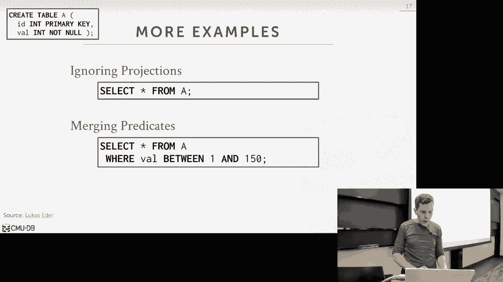
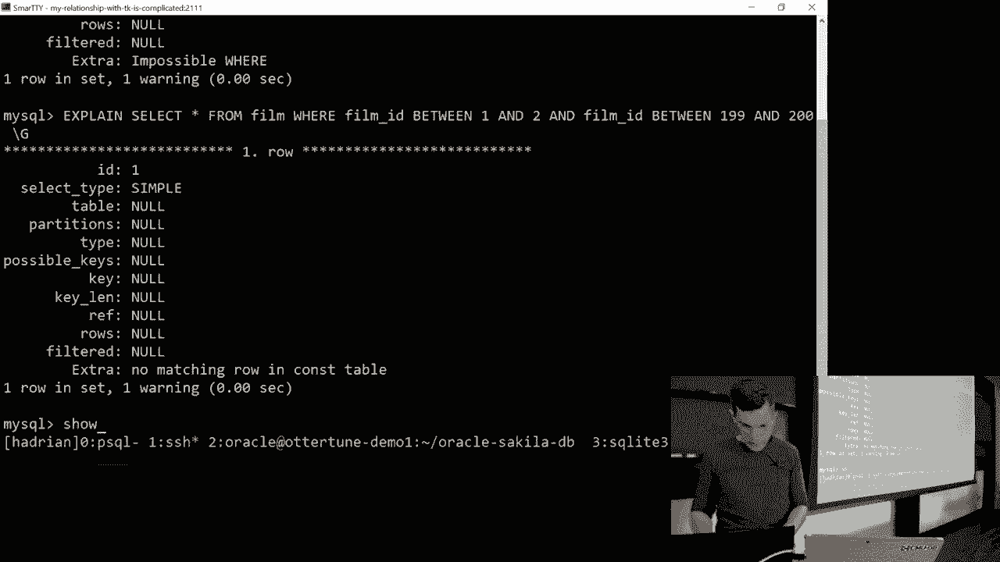
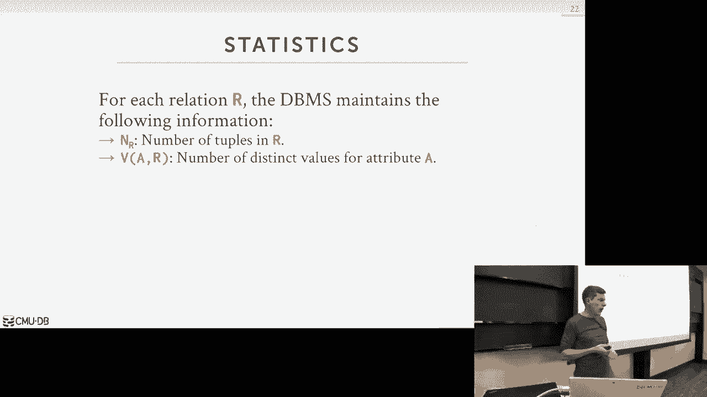

# 【双语字幕+资料下载】CMU 14-455 ｜ 数据库系统导论(2019·完整版) - P14：L14- 查询规划与优化 1 - ShowMeAI - BV1qf4y1J7mX

okay jump right into it so the schedule，for you guys，the major thing obviously two days from。

now on Wednesday in this classroom we，will have the midterm exam study guy。

who's been online since last week but，also the practice exam，I've also uploaded all the lectures all。

the lecture notes and all the slides，from everything that's covered in exam。

over this weekend and then there's，additional problems in the textbook。

solutions for the odd ones are available，online so any high-level questions about。

the midterm you need to bring your CMU，ID because it's a class of a hundred。

people I don't know everyone I should，bring a calculator if you can't do logs。

in your head and you're not have a one，one eight half I let me sheet of paper。

double-sided with handwritten notes no，shrunk it down slideshows hunker down。

let your notes know slowly shrunken down，textbook everything I'll be written by。

hand you'll get more out of that way so，okay good and then project two will be。

due on on Sunday at midnight as well I'd，like you I posted on Piazza what。

questions things like that right and，then the tears are helping as needed。

okay all right so we have a lot to，discuss today I don't think I'm gonna，get through all of it。

so it might spill over to next week，after the exam，plot there and see what happens so today。

we're talkin and query planning so the，high-level idea what we're trying to do。

today is that given that sequel was，declarative meaning the the application。

that sent us the query the query says，what answer they want us to compute。

right select this from this table，produce all the employees that have this。

particular attribute I and they and it's，not telling us how we actually supposed。

to compute this right doesn't say do a，hash join，let's look join although you can do。

hints like that but we can ignore that，for now right it's it's just them。

telling us what answer they want and so，it's up for us now inside the database。

system people actually building but they，have a system software it's our。

responsibility to take that simple query，and figure out the the best way the most。

efficient way to execute it and so if we，saw from from last week or the previous。

weeks when we talked about joint，algorithms but they can be quite a big。

difference in performance depending on，what album you choose，we had stupid mess of loop join would。

take one point three hours for a table，of six megabytes but if you do it in the。

hash join worst case scenario was 0。5，seconds so you know eight spits for this。

one it's pretty obvious right we don't，wanna do the stupid thing we can figure。

this out when we start getting more，complex queries more complex joining。

these then figuring out how exactly go，from this to this it's not always。

obvious and that's why in this new this，is what's going to separate the the high。

end database systems that are very，expensive the oracles the db2 the。

Teradata is the sequel servers versus，like the source ones are the free ones。

Postgres is still very good but it's no，where the query optimizer is nowhere as。

sophisticated as sequel servers report，example so the idea about query。

optimizer goes back to the 1970s so I，don't think I've talked about system are。

in this class a little bit but I said，why but back in you know in the 1970s。

when Ted Cod and wrote the first paper，on the relational model there was。

basically two people or two groups that，picked it up and try to actually。

implement it because getting Ted Cod was，a theoretician it was a mathematician so。

he didn't have to have it in software he，just proposed an idea。

Haagen place the model said this is the，right way to actually build software and。

then there was a group at IBM in San，Jose and then a group at UC Berkeley who。

ended up taking that payment actually，built the you know the first two。

relational data has been assessed at，least most famous ones no one at。

Berkeley was called ingress that was you，know my post course is called Postgres，post-grad。

because it's post immigrants that's what，the name comes from I think he was my。

advisor when I was in graduate school，and then be the IBM guys they build this。

thing called system art and the project，is actually fascinating because they got。

like eight or nine people that all had，PhDs in math and computer science again。

this is early computer science but there，wasn't many people that had graduate。

degrees in computer science they put，them out of room says we're gonna build。

a relational database system and then，every person of the P sheets are carved。

off the room and part of the problem one，person who worked on the storage layer。

one person worked on the execution，engine one person worked on concurrency。

control and there was one people person，pass cylinder she kept query。

optimization Krita curry optimizer and，so back then the idea that you could。

have a database minute system take a，query a declarative language like sequel。

get Ted Cod never actually proposed a，language initially with relational model。

sequel came later on because it was，embedded by IBM the Berkeley guys had。

this other thing called quelle which，looks a lot like sequel but the syntax，is different。

Mike Stonebraker the guy wouldn't be，dressed would he claims Quayle was。

superior to sequel I disagree but you，know nobody writes it well now so but in。

the back then people argued that there's，no way of Dan basement systems gonna。

take a high-level language like a sequel，or quell and generate a query plant as。

efficient and what a human could do，right in my hand cuz that's what people。

were doing before the rational model if，you were writing this these query plans。

by hand like writing the for loops and，do joins and scans by hand and so in the。

same way that he will argued when the，the C C language came out ATT he was。

saying oh C's to high-level it's the，compiler is never gonna generate machine。

code as efficient than what humans can，write today or a human humans could。

write an assembly and of course now we，know nobody writes for the most part。

assembly by hand everyone writes in，higher-level languages even higher than。

C and compilers do a pretty good job in，those cases they can do even better than。

what the average human can do this is，what I be improved back in the 1970s。

that you could take a declared language，life sequel and have the query optimizer。

or the planner generate a quit plan that，as good if not better than what a human。

can actually do or at least the average，human right so well Tom's not about how。

the system optimizer works but what I'll，say as we go along and talk about。

different leading up to it actually how，we do the cost based search that IBM。

demented invented back in the 1970s a，lot of the designing decisions and。

assumptions that they made about what，the data looks like and what the query。

plans look like to simplify the problem，to make it tractable are still actually。

used in practice today all right and，I'll go through what those are as we go，along。

so with query optimization there's，essentially two Pro approaches to doing。

this and again this is also gets into，like what distinguishes the good up my。

bad optimizers so the first approach is，use static rules or heuristics so the。

idea here is that we can look at our，query plan and that matches a certain。

pattern like a portion of the query time，matches a pattern that we know about。

then we fire off a rule that I do some，kind of transformation or rewriting of。

the query plan took to make it more，often more right maybe like an Eevee if。

you defy stupid things where one equals，zero right then you can have a rule can。

strip that out very easily so the，important thing I'm saying on these。

rules that we may need to look at the，catalog the system kalam that tells us。

what our database looks like what our，tables were packets that the catalog an。

is the metadata about the data what，tables do I have what columns do they。

have what attributes that they have so，forth so for these rules you may have。

look at a catalog consult enough to，understand what you know what our。

underlying tables that should look like，but we never actually have a woman。

actual data itself right we can fire off，these rules without actually going to。

the table say well what did what did it，put to be what am I to was actually。

contained right be the alternative is，new costly search which is instead of。

you know you don't look at the data this，one you are gonna have to look at the。

data in some way see the idea what the，cost base search is that。

gonna do a we're going to enumerate a，bunch of different plans and different。

ways and ideally intelligent manner，around looking at redundant or stupid。

things or with a numerator a bunch of，her plans for us that we could choose to。

execute our single query and then we're，going to use some kind of cost model to，approximate。

which one is the execution cost all，these different plans of course the idea。

is that we want to always pick the one，that has the lowest cost so obviously。

getting the bat that cost minor if you，have accurate estimations is super hard。

we'll see why as we go along and then，also in the way you enumerate the plans。

is difficult to it because as I said you，don't want to look at you have a finite。

amount of time to look at about，different options and you don't want to。

spend you know hours and hours doing a，branch of bound search or a query that。

may take one second to run who it's，actually quite amazing how how how fast。

these things can actually be like every，time in this class and we'll show some。

demos later on every single time I open，up the quickly in the terminal I never。

wrote a single query I hit enter，it was doing both of these things in。

milliseconds now again for our queries，we look at they're pretty simple so it's，not that。

mind blowing but even still you know you，you can't run anything forever and find。

it you know the best possible plan are，you try to approximate it so the。

pipeline for our query optimization path，it was looking at the following so the。

very beginning we have an application，the application is connected to the。

database system and then it's going to，send us a sequel query so the first。

stage would go through our optimization，pipeline is called the sequel rewriter。

so the idea here is that we're given，sequel we can have some some some some。

transformation rules that allow us to，rewrite the sequel in certain ways so。

sometimes this occurs for distributing，databases or if you have views like The。

Hobbit ale is for a table name and this，thing can say oh I see this team when a，else。

let me annotate it with additional，information to say this particular table。

can be found on this node over here or，this disk over here so this is optional。

right this is not that common I don't，think most David students don't want to。

operate directly on sequel but you know，this is something you could do to do so。

traditional opposition here then we take，the sequel query that comes out of this。

if we have it otherwise you go back，through the application and they passed。

it through our Seco parser and this is，just getting the lexer token stuff you。

can you read a pilot class there's，nothing there's no fancy stuff we're。

doing here we're just converting a，sequel string into the activities syntax。

tree so then now we see the syntax tree，into our binder and a binder is。

responsible for converting the named，objects referenced in our sequel query。

to some kind of internal identifier so，really dude is like consulting the。

catalog so the sale I require it select，star from table food I don't want to。

have the rest of my query plan and have，to operate on the string foo I go to the。

catalog and say hey do you have a table，called foo if yes give me some internal。

identify or to allow me to find it later，on or if it doesn't have it like it says。

you know people who doesn't exist at，this point we could throw in air and say。

you know you looking up a table we don't，have common we don't have so now that。

the buyer is gonna admit is a logical，plan well explain look where do you tell。

what this is in a second but the hyoid I，think what this is there's a logical。

plan in the physical plan a logical plan，could say at a high level what the query。

wants to do I want to scan this table，I'm our mediator from this table I'm。

gonna join these two tables it doesn't，say how all you're actually going to do。

that that's the physical plan actually，specification with the Oliver you're。

using comes later on so the binders，without a logical plan it's basically a。

conversion the converted form of the，Signet reading now of internal IDs and。

we have someone in a relational algebra，approximation and then we can feed this。

now into a tree grade item again this is，optional this actually is more common。

than the sequel provider this one，actually most of some purpose because。

these are the static rules so to do the，tree right rewriting we have to go to。

the Cal attentively and ask them hey，what does our tables look like what are。

our attributes look like um but yeah we，don't have to go to the cost Monica we。

can do this as use your static world，that you want to do for every query no。

matter what the actual data looks like，so then the tree writers gets picked up。

still the same logical plan that，finder spit out so then now we feed this。

into our first night I mean this is like，the black magic part this is where we're。

actually gonna do the search to try to，use a cost model to figure out what the。

best plan for us is so they've been，using a combination of schema。

information that the Cal provides us as，well as some of these s these estimates。

that our cost model could provide us all，right this query plan is going to take X。

amount of times other party plans meant，a Y amount of time X is less than Y I。

want to pick this other one well we'll，see as we go along this this cost model。

is going to be a typically it's a，synthetic number that the database。

hasn't computes internally it has no，need to be outside world。

you can't take a cost not an expert say，oh that's really 27 that's me you know，20 minutes。

it's just internal thing that solves，this 8 this query plan is better than。

another so just used to compare，relatively inside big data system，between different plans and has no。

bearing to the outside world so if you，think Postgres this cost model it spits。

out a number my sequels cost I don't，spit out a number，you can't apples and oranges you can't。

compare them some systems will try to，have the class amount of estimates B。

term to the actual time but that that's，tricky and usually not reliable because。

hardware changes and the environment，changes and so forth all right - now the。

optimizer is going to spit out a，physical plan and the physical plan is。

what our data system can actually，execute so when we talk about very。

execution I show these plans like it's，the hash join that you know yeah doing。

torrential scans right index scans，feeding the hash drawing their choppers。

drawings do my hash aggregation or，sorting aggregation that specification。

happens here so once we get outside the，optimizer then there's not really。

anything else we have to do until none，of them is executed create fun so again。

and a high level of this is how every，single database managed system。

implements it some things like a super，driver which we write every writer you。

don't necessarily have to have but the，parts of binder and optimizer is this。

the standard package so just to，reiterate between the logic versus。

physical again the the the way to think，about is that the，I'm gonna generate a logical plan that。

is roughly equivalent to the the，relational algebra expressions within。

our within our query it's not always a，one-to-one mapping but at a high level。

you can think of it that way I want to，do a selection on this table I'm gonna。

do a filter I wanna do a projection I，would do a join right those are all be。

contained in a logical plan and all，those query plan trees that I showed。

before way I sort of just had the，relational algebra symbols it didn't。

annotate it and say what album I was，using and those have we considered。

logical plans the physical operators the，physical plan that's where we actually。

specifically define what execution，strategy we're going to use for those。

different operators in our query plan，I'm gonna do an index scan using this。

index in this order we're gonna feed my，output an index scan into a hash story。

operator right it's all the low-level，details of how we actually execute it。

and so that the bunch of different，metadata we have maintain attention a。

physical plan that we don't be care，about at this point or this class but。

like if I know I have a order by Apple，Bob and I give you a short version on。

the same join key the same by the or by，key then I can annotate my physical。

operators and my query plan to say this，data that I'm spitting out is o my way。

is sorted based on this key so then you，can reason and that you can drop the。

order by up a ball low V it's probably a，1：1 mapping from the relational algebra。

to the to the logical plan not always，true but title it is but for the visual。

plan we can't assume it's a 1：1 mapping，from the logic which is the physical。

right again if I could have a join plus，an order by but if I do assert merge。

join in my physical operator then I can，get rid of the order by operator up。

above so the the way to think about this，is that the rewriting stuff we'll talk。

about and then we get to the cost cost，based search those are all operating on。

logical plans but the final is always e，needs to be a physical plan okay so。

before we get into the nitty-gritty，details I mean to say that this is super。

hard this is the hardest part about，database systems this is actually the。

part I know the least amount this is why，I'm so fascinated and I always want to。

try to do more because like I don't know，it I don't understand it if you can do。

this if you if you're good at doing，query optimization you can get a job。

immediately move people pay you some，money to do this because like as I said。

IBM meta stuff in the 1970s there was a，lot of query optimization worked under。

late eighties early early nineties but，now it's all like crusty old people。

right we're all like retiring or moving，on you know what 21 year 21 year old。

knows about per diem ization other than，my students right so that's the one。

email I always get I should share that I，should show screenshots of this the。

email I always get from from people，friends at Davis companies I'm not。

wearing a mic maybe I pick up most of it，right right so if you can if you can do。

this you'll get paid a lot of money，because it's like super hard and it's。

hard to hire people to do this kind of，stuff，one day based company told me that if。

they can find people that have a PL，background they can they can do this。

another Davis company told me that they，have people that have backgrounds in。

high energy physics can can do query，optimization so this is joke and。

databases that says like people always，say Oh query optimization is as hard as。

rocket science and the joke is that no，if you fail at doing query optimization。

your backup career plan could do rocket，science because there's so even harder。

than that right and this is what's gonna，separate the high end guys versus the。

the open-source guys or the the the，smaller systems Oracle sequel server and。

IBM and teradata and all the the the，enterprise systems around for a long。

time they have spent millions and，millions of dollars have hired hundreds。

to hundreds of people to work on these，things and they're quite sophisticated。

and so if you know if you can do this，kind of stuff you'll you in demand so，talk about this。

class is that you may say all right well，this is like super hard K machine。

learning solve this so can a AI solve it，no but yes right so people have tried。

applying machine learning PR try apply，machine learning now more recently and。

seeing some promising results but it's，still not not no anywhere near what the。

you know the commercial systems can do，IBM actually tried something similar。

back in the early 2000s this thing，called leo the learning optimizer turns。

out it was it sucked and everybody you，know they shifted in production but。

every db2 DBA I've ever talked to says，the first thing they do when they。

install db2 is turn off that learning，crap cuz it never worked make things。

worse so just machine learning is is a，potential way to improve things but it's。

not going to be you know a magic bullet，to solve everything so as I said this is。

the one thing about data systems that，I'm most excited about and know the。

least about last semester we covered in，the advanced class we did three lectures。

on this I think I'm expanding that to，make four or five necks semester just。

because like we build our own query，optimizer at CMU it's super hard for me。

to get students come work on it but they，all get jobs immediately but like this。

is this is something we'll call a cover，more in the advanced class so yeah I。

don't know bad-mouthing any other，systems some systems are they'll create。

optimized areas total crap you know，cover that later at all fine okay all。

right so we have a lot to cover today，and like I said I don't think we're to。

get through all of it so what this might，spill over into next week I don't know。

why I just didn't break it up to two，semesters or to two lectures before this。

but it is what it is so first we'll talk，about relational algebra equivalencies。

the core underlying concept that's an，allow us to do manipulation and。

transformations of our query plans to，find better alternatives then we'll talk。

about how we do at cost estimation how，do we take a query plan and and in our。

cost model and estimator we have to do，to execute it and then won't spend more。

time talk about enumeration this is like，the search strategy define different。

options for the cost base search model，and then we'll talk about how to handle。

sub queries we oh we probably want to，get through half of this but that's okay。

all right so as I said the core，underlying concept that we're going to，take。

take advantage of when we do query，optimization is the fact that we。

understand the high-level properties of，a relational algebra and therefore can。

permute or transform the relational，algebra or a plan that's equivalent to。

some relation Auto statement in，different ways and still produce the。

same result so we're gonna say we have，two relational algebra expressions or。

two query plans so to speak that if they，produce the same set of tuples then we。

know that they're equivalent and，therefore it's it's it's it's valid for。

me to transform my original relation，algebra expression into a new expression。

so notice I'm here again I'm saying a，set of tuples because remember。

relational algebra or the relational，model is unordered so I don't care and。

let's have an order by statement or，order by clause I don't care that one。

query plan produces tuples ordered this，way and another query plan produces。

troopas order in this way，they're still equivalent and that means。

there's me more options available to us，to figure out what is the wouldn't you。

know what's a better query plan for us，to use so we can apply these sensitivity。

of the Trinity and the committed hippedy，properties of relational algebra right。

standard you know standard logic to，change the expression in different ways。

move operators around to produce a more，efficient plan so this high level。

technique is called query rewriting so，this is that rewriting step that I was。

talking about before right after the，binder we can do a tree rewriter where。

we can look at the relational algebra，representation of a logical plan and。

then move things around to produce，something that's more efficient so let's。

look a really simple example here let's，say I have two tables student and。

enrolled and I want to do a join where I，between the two tables where I want to。

get all the students that are enrolled，in the class where they got a great egg。

so if I almost take a literal，translation of the seco statement I。

would roughly come up with a relational，algebra statement like this do a join on。

student enrolled then apply the the，filter on grade and then have the。

projection where I just produce the，course ID and the name of the student。

right so what's a really stable，optimization we can do for this。

yes brain he said push the filter to be，inside and rolled right so he's exactly。

right so this technique is called，predicate push down so the reason why。

it's called he said push into I'll say，the typical term is pushed down because。

you're pushing it down into the Cory，plan so let's say this is this is the。

query plan tree and so when you take，this filter and have it be before the。

join right cuz what are we doing here，well we want to reduce the amount of。

work we have to do in our joint joint，operator so rather than having the。

filter be above the join operator where，I'm just taking all the students and all。

the enrolled records and in the doing，the joint on them then apply the filter。

it's better for me to do the filter，early think again always think of in。

extremes say my enroll table has a，billion tuples but only one student ever。

got an A in any class then I would do a，joint on a billion tuples all only the。

end up producing a single result as much，as my output but if I do my filter early。

here and now I'm doing a joint on one，tuple because then this is this is more。

expensive than this in general，I said this is the general idea what，we're trying to do here in query。

optimization we're trying to identify，cases where we can end up doing less。

work because that's what minute and of，the day that's what we want to do if you。

do less work it's an have lower cost to，faster runtimes and require potential。

less hardware yes this question is what，a query optimizer also be able to change。

this or change change left in or yes，we'll get there but not yet so his。

question is it might mice this is like a，super simple example like like I can do。

this the heuristic I have a query plan I，always want to push down the predicate I。

don't need to look at what the data，looks like to do what you're asking。

should this be the inner versus the，outer I need to know how much data is。

getting fed into this because again the，the smaller table should always be the。

outer table that requires a cost model，we can do this we can do this push down。

right so question is what does a look at，in relation out it's just moving the the。

join this so I mean there's a，parentheses so this is saying do the。

filter only rule table back standpoint，yes yeah yes correct yes yes he died。

great yeah good question okay first，question is can predicate pushdown ever。

be bad yes so in this really simple，example here like doing that something。

you know something that's easy to do，there are some predicates that can be。

expensive to compute so now this is，where the end the data systems cost。

model can try to say well so example so，sometimes there you could have will。

cover this next class on Monday next，week but there's things called。

user-defined functions so it's out of，having like a function you know it's an。

expression either touch a constant or，another another naturally and a tuple I。

can have it invoke a function that can，then be any arbitrary code like I can。

have a user-defined function written in，C or Python and that Python code makes a。

call out to a remote server does some，kind of computation maybe a pays in。

Bitcoin for the micro transaction and it，comes back so if I know that for this。

predicate here to do the join this is，super selective meaning there's not very。

many tuples coming out of this it may I，may be oak better off applying this up。

here because that this is you know，monetarily is more expensive than doing。

this so you don't always want，to push this down but in general you oh。

yes you do my microtransaction is a，far-fetched example you could do it but。

like it's stupid you wouldn't want to do，that right but there's other things too。

like if there's computing the hash or，something like that or some kind of。

crypto stuff you may want to put that up，above here here but again the data ISM。

can reason about that okay so let's go，through now a bunch of these different。

operators to talk about what kind of，optimizations we can apply for the other。

relational operators and our query plans，so we've already covered this one right。

the predicate pushdown right the idea is，that we want to do filtering as early as。

possible ignoring the cost of applying，the filter but that's gonna allow us to。

throw away data more quickly in a disk，based system applying a filter sooner。

sooner rather than later it's usually，better because then I'm not copying as。

much data up you know up above and，polluting my memory you can also reorder。

the predicates themselves so that the，more selective ones are applied first so。

let's say my last example where I had，great you know someone has a grade。

equals a but let's say I had another，predicate where age equals you know。

great age greater than 99 so find me all，students at Carnegie Mellon that have。

got an A in the class and are under，older than 99 years I don't think there。

is anybody right so it's better off for，me to apply the the age predicate first。

because that's gonna filter out way more，things before looking at the at the gray。

predicate now you may say all right ways，in that just you know a slight。

computational overhead yeah for dismay，system maybe doesn't matter that so much。

but in in other systems like a memory，yes so so his statement is like for this。

one I'm claiming that we're not looking，at selectively the data so you couldn't。

actually do this one yeah that's true，yes for this one yes you're right but。

pushing down you always want to do that，yes，breaking a predicate we better than。

emerging it ladies like merging movie，night human scan of the data once and so。

his question is why would be breaking it，up be better than just having to be all。

at once again if the computational cost，of one of the predicates is more，expensive than another。

maybe you want to break off that one and，yes if it's a column store then maybe I。

want to do a pass through the column，first toast everything out and then for。

the things that match them to the next，one yes but that is the right example。

and then for this one here again you can，simplify complex this is a simplify。

complex predicate to be more easy to，compute this is a trivial example X x。

equals y and y equals 3 well again，through through the transitivity calls。

we know that x is just this is just x，equals 3 so we can rewrite it like this。

so now what happens is that in when we，use going through a billion tuples we。

can just look at each edge with x and y，check to see whether equivalent to a to。

a constant which is way cheaper than，having to go get the reference of the y。

attribute in the tuple and then copy it，you know to some register or some。

variable and then doing the comparison，right this is like a micro optimization。

that would mostly only matters for the，in memory guys all right for projections。

we can also push them down as early as，possible and the idea here is that we。

want to minimize the amount of data we，have to copy going you know from one。

opera to the next and this mostly，matters in the rows store systems。

because if the rows really wide and I'm，moving that entire tuple up from one。

operative the next then if I can strip，out as much data that I don't need it。

early as possible then I'm copying less，data from one step to the next right so。

in say in this example here say the the，student table has a thousand columns but，needs。

and he's the student name so I can then，introduce now a projection in here。

before I feed into my joint operator so，I strip out the nine hundred ninety。

eight columns that I don't need and only，pass in the two that I do need right。

this is very actually very common in，distributed databases because moving。

data over the network is expensive and，slow so if I'm getting this is on one。

node this is on another node and I'm，doing the join on the same node that I。

rolled on then I want to strip out as，much as I can before I send that over。

the network all right so everything I've，showed you here so far these are doing。

applying optimizations on one in a，relational algebra operators relational。

algebra expressions we can apply these，same optimizations for the underlying。

predicate expressions themselves in our，queries so I'm going to show you a bunch。

of examples of how different data，systems can rewrite query plans to。

simplify them or avoid doing stupid work，and this comes from this great blog。

article over a few years ago where，somebody lifted out all here's one of。

different operations you can do that，doesn't require a cost model and we'll。

we'll give a demo of some of some of his，comparisons but it's really nice because。

he provides a there's a github，repository that has the sample database。

he uses for his analysis and it works on，sequel Server db2 Oracle like working on。

a bunch of different data systems you，can take the same database same queries。

and see how the different optimizers can，can can rewrite things and fix things。

okay so the first kind of thing we can，rewrite is to remove stupid predicates。

or unnecessary predicates so in this，case here select star from table a where。

one equals zero what is this value a，true false so what does that mean that。

means for every single tuple I'm going，to scan on table a I'm gonna check oh is。

the predicate false equal to true it，never will be equal to true so therefore。

no tuple would match right so the data，easily recognize that I have an。

impossible predicate where no tuple，could ever possibly match this it can。

just actually skip the scan entirely，and just produce you back a an empty。

result right away so you may say all，right well this is stupid Annie why。

would anybody write one equals zero，nobody would actually do this number a。

won't correct theory people you know，people shouldn't be that stupid but a。

lot of times in applications the the，queries not gonna be constructed from a。

single line of code you're not gonna，have a string variable in your in your。

application code that you then just you，know immediately send off to to the。

database server a lot of times these，sequel queries are constructed from like。

dashboards and tools where people click，from different things adding different。

options or composing the query so now a，buncha different libraries so that a。

bunch of different functions are all to，be constructing a a sequel query so。

there's not one single place you can，look in the code and see you know where。

one equals zero it may come from some，other function from some other part of。

your organization from code that you，didn't write so if the data can。

recognize this that this is stupid and，not do this this is a huge win for us。

because now we don't even have to look，at the data likewise you can do the。

opposite you can have one where，everything's gonna match one equals one。

right so in this case here every tuple，is gonna match but I don't want to。

actually I don't want actually apply，this predicate and see whether they're。

gonna match again if I have a billion，tuples I don't want to have to go。

through every single tube oh and say hey，for this tuple does one equal one true。

yes I'll put it next to but what does 1，equal 1 yeah it's true I'll put it right。

instead I can say well I don't need to，do this 1 equals 1 at all and now I just。

do a scruncho scan straight dump of the，table as the output and not worry about。

applying any predicates，alright then that's cutting down on the。

computational calls I think I says you，just rewrite it like select star from。

egg alright so these are pretty simple，but we can do this for other things more。

complex queries we do the same kind of，thing for joins so here now on my table。

a this scheme is up there the primary，key is the ID column so here I'm doing a。

self join where a as a 1 joined on a as，a 2 on a 1 to ID equals a to die ID so。

what is this query actually saying it's，saying for every single tip on a check。

to see whether it exists in a，and of course it's always gonna be true。

because we know ID is the primary key so，do I exist in this other table the。

answer is always gonna be yes so it can，identify that this predicate is entirely。

wasteful with this join is entirely，wasteful and is rewrite it as select。

star from egg and again relying on，relational algebra equivalencies we。

would know that this is equivalent to，this yes because that his question is。

wives conditioned on ID being the，primary key because you know it's unique。

and you know it's not null so therefore，you can rewrite it if it is if it could。

be null then null doesn't equal null so，therefore you wouldn't have a match。

right no it's always no like no we can，over the turban I'll try this one。

doesn't equal null actually the the，result of this one equal null is null，right。

you unknown so your question is is no，equal to null unknown is no no I think。

that one actually evaluate to true but，in this case here if it's no then it。

won't work all right so what are more，complicated things we do so we can also。

now ignore projections that are，unnecessary so in this one here this is。

sort of a rewrite of the of the last，query the self join so this is a select。

star from a and then in my where clause，I haven't exists where I just say this。

basically says return true if there's，anything that matches any any result。

inside the the inner query here so this，is saying if for every tuple in a。

produce the output if there exists a，tuple where the a dot ID equals the a2。

to ID and against the primary key so，it's always gonna match so inside of。

this we're materializing or have a，projection on the vowel column but this。

is completely unnecessary right this is，us having to do not only the waist will。

join but also copy this projection which，is copy this attribute out it's part of。

projection and that's unnecessary as，well right so in this case here we can，just rewrite this。

entirely this part here it is entirely，like a select are from a the last one is。

to emerging predicates so this one here，we have select star from a where val。

between one and a hundred and bow，between or val is between 50 and 150 so。

in this case here if you just think，think of the number line this is。

completely redundant because if it's，between 1 and 100 then it can also can。

be between 50 and 150 if it's between，50-100 so for this one here I could。

rewrite this to be a single between，cause we're 1 between 1 and 150 okay。

select so this is how you know this is，sort of obvious to see how how you want。

to do this let's see whether who，actually does it everybody loves demos。

right so as I said that blog article，that I mentioned has has source code you。

can download and includes the the schema，and insert statements for for a bunch of。

different 8 assistance so unfortunately，I broke my sequel server installation。

yesterday so I can't get to work but，I'll do a demo on Postgres my sequel。

oracle maria DB and in sequel light so，again the the schema looks like this i'm。

right so the the sample data is we're，gonna use its it's like a it's like a。

online video store but it's sort of like，the IMDB stuff you looked at there's。

actors and then people are renting，movies right but we're gonna focus on。

the actor table so again the nice thing，about this is that the they provide for。

the same you know the same database for，all these different for all all these。

different database servers right so，again there's two hundred tuples in this。

and then we'll just go into to my sequel，real quickly select star or sub count。

star from actor alright there's 200 in，every single one okay。

so the first thing we want to try out is，that impossible query where one equals。

zero so again what I'm doing here is for，Postgres right this is Postgres you have。

explained keyword will spit up the query，plan and then the impedance you put the。

aniline analyze modifier after explained，that will actually run the query but。

then still show you either the query，plan and what it actually did right so。

in this one here it says up above one，time filter is false so it recognized。

that one equals zero is always going to，evaluate to false so it applied the。

filter once installed that for the，entire table no tuple is ever gonna。

match so it didn't actually didn't，actually run and run read the data it。

said oh it's false it's nothing gives，you back nothing right away so we can do。

this in my sequel so then my sequel，explained is not as good like if you。

just do this then you get something like，like this but if you do the for whatever。

reason the - or that /g then you can，actually get a tree it is one of those。

but here you see the in the extra，parameter they say have been possible。

where so I recognize that nothing's ever，gonna match don't even bother applying。

that where clause it also has this，little warning thing here which is，annoying this is my sequel 5。

7 I I don't，know what it's been fixed in in my，sequel 8 but you have to run show。

warnings and then it spits out like what，actually happens so you see here in the。

where Clause they rewrote my 1 equals 0，that is wrote that as 0 so everything。

evaluates to false right so now we'll，so with Oracle the way it works is I say。

explain plan for and the syntax is，always slightly different and it says。

explain which now I got to go now to，another table it has the the plan that。

it got explained so the oil explained is，actually is exactly betterment then sexy。

better than post quest post best one is，very good this one is actually pretty。

good too because it shows you like you，know computational time then I'm at Rose。

and data there accessing is actually，really nice so what are they saying here。

all right so this says that it knows I'm，doing select statement and it has a。

filter and it says how I'm gonna access，the table right so the thing to point。

out though down here they have，information with the predicate so they。

say we're filter null is not null so，Oracle doesn't doesn't support boolean。

z' right so it has no way to say true or，false so it rewrote my does 1 equals 0。

to be null is not null which is always，false cuz null is null so this is their。

this is the way they're representing，false so they rewrote now the query plan。

recognize that this thing that's false，and therefore you don't actually have to，run it。

let's just go back to post us real，quickly and - well he was asking before。

right so I can say select right I can，treat the data since like a calculator。

but I can say select norm right that's，nothing but there's no equal null。

nothing it's no is no equal false no，nothing right this is falsely equal to。

false true is true you know just so，anything that any any time you say，there's no equals something。

the answer is null the empty space is，null the way to get around that is null。

is null then it's true so what Oracle is，all right so then last one would you。

seek a light again the syntax is always，different they have explained query plan。

without before and then it produces this，so this is not actually that helpful。

right this is just telling us that we're，doing some kind of scan on the actor。

table so if we removed the query plan，part then you get something that looks a。

lot different than when everybody else，should now you get something that looks。

like assembly or some kind of machine，code so without going to the details of。

wasting code light works is that they，actually convert the logical plan or the。

physical plan that the optimizer spits，out into a bunch of these op codes think。

of this is like the JVM bytecode and，then they have an interpreter that can。

they'll get and now execute these，bytecode so this is like this is。

literally the program to execute this，particular query and so from what I can。

tell right they say where r1 is not you，are - I'm not exactly what that means。

then you go to ten but in this case here，it looks like they're actually doing。

doing the scan here so the best I can，tell I'm not sure whether they're。

actually stripping this out actually no，not equals this yeah，it may be truncating it they're。

recognizing that I don't have to do a，scan all right so everybody can handle。

this this is good so let's try now the，useless predicate let's try the one。

well now it looks like it's telling us，it's actually doing it well I said he。

should do it cuz it's one equals one，right so this is just saying that I。

recognize that I can remove the filter，and I just execute the query right away。

no Annalise sorry right and this one it，figured out that it can just throw away。

the filter entirely and just scan，everything so that's good，let's try Oracle explained and then go。

back to this right the filter is，completely gone it just now it's just。

Swiss straights mental scan and then for，sequel Lite this is not helpful so we'll。

remove that query plan part and then now，you see that it's inside of this the for。

loop here where they're scanning over，the table they've removed the predicate，all right。

so let's look at an example where you，could look at the catalog and try to。

figure out what the right thing to do is，so the schema for the the actor table is。

pretty straightforward right we just，have an actor first name last name and。

last update okay so what we're gonna try，to do here is we're going to try to have。

a query where we say the where the actor，ID is null so we want to run this query。

and so what should happen here is that，we would look in the catalog and say。

well the actor ID is the primary key and，it can't be null so therefore I know。

that no tuple will match my predicate，and therefore I can remove that that。

where clause or to just end of return，back immediately the you know an empty。

set so this is an example where the，rewriting phase those rules could look。

in the catalog and understand something，about the table or the attributes that。

are being being you know it may be，accessing the predicate and start。

throwing out crap that's useless so just，to prove that that our table cannot，support。

no attributes for the idea for the in，the actor IDE if I try to insert a tuple，you know。

Postgres picked it out and says there's，an error if I try to do the same thing。

in in Oracle Oracle flips out says that，the actor IDE can't be null throws an。

error let's try this in my sequel my，sigil does have default I think we gotta。

go current timestamp actually new，default should work here let me insert。

it let's see whether that's actually in，there，we're lastname equals Pablo let me do it。

right cuz the way my secret works is the，the the actor ID is an auto increment。

key so instead of in this version of my，sequel instead of throwing an error if I。

try to insert null it says oh you're an，auto increment key so go go ahead and。

let me just run that and replace the，null with the next value whereas every。

other system will throw an error says，you trying to insert null my sequel will。

let you do it alright but let's let's，try to run our query so we know that。

that no attrex should actually null the，no-no tuple should have a null actor ID。

so we try to run this query now where is，null right，Postgres that looks like it actually is。

now she did run it right applied the，filter and remove two hundred tuples。

so Postgres was not you better recognize，that no tuple with a new tube was at。

actor ID could ever be null and not，actually run it and actually and still。

ran it let's try it in in my sequel my，pc go figure it out，impossible where and it can be like。

Amelie ignore it try it in sequel server，or sorry in or Oracle explained and then。

there's our lovely null is not null，there's our false so a recognize that。

this is this is never good actually，gonna evaluate to true and get thrown。

away so post goes actually got it wrong，my C gonna walk around it right all，right two more examples。

let's do now that range query we have，before where we want to say we want to。

get all the films that are where the，film ID is between one and two and film。

ID between 199 and 200 so this is again，another impossible we're right so。

nothing should come back we're on，explain so my post guys couldn't figure。

it out right it's doing that lookup that，that should never happen that would。

never produce any results in in my，this one I'm not sure about there's no。

matching no matching rolling Khan stable，I think this means that they were able。

to figure it out that they yeah this one，I'm not sure about this it has a warning。

though see what see whether he wrote it，to this question isn't this a status。

fearless I build a problem and which is，np-complete yes but like but for basic。

things I can I could identify that it's，never going to you know produce anything。

so this is this one or actual crisis no，no no hope for this one you could have a。

rule you could write a heuristic that，says if I have if I do all my lookups on。

on the on a given attribute right and I，have a range here between 1 and 2。

inclusive and between 199 and 200 the，sets don't intersect and it's。

conjunction where I had to have both of，them I know it'll never match I can。

throw it away that's like that one，that's not sad that's pretty，straightforward all the parts are。

satisfiable you have to do with that yes，all right so any questions about what。

I'm showing here I'm showing that you，can just reason about what the query。

looks like without actually looking at，the data without actually having to run。

anything and determine whether you know，will lead into now the discussion of a。

how are action committees estimates so，the for these symbolic demos here this。

joins a pretty straightforward，so we can you know easily maybe a reason。

about which one should be the inner，versus the outer things go bad though。

when you start having a lot more joins，because the complexity of the problem of。

making this decision is going to explode，so the number of different ways we can，do a join for。

for a query when we have n tables to，join is gonna be four to the N so this。

clearly there's no way we can enumerate，every single possible join ordering and。

for our query and try to figure out the，best one alright you know it's a large。

number when it has a name right so we're，gonna see how the data center is going。

to be able to strip down the the number，of different combinations and plans that。

have to enumerate for these joint，orderings and that's going to reduce the。

search base of the problem but before we，get there we need to understand how。

we're actually gonna estimate how much，work we're gonna do for these joins or，these different scans。

so I've already said this a little bit，before but the the cost model is gonna。

allow us to assess or an estimate how，much work we think we're gonna have to。

do in our database system and again this，is an internal synthetic number that is。

only allows us to compare the relative，performance of different query plans and。

we within the same database system we，can't compare across all of them so this。

could be a combination of a bunch of，different things we've already seen that。

when we talk about joint algorithms that，you want to do you want to base it on。

the number of disk I'm out of disk IO，that I'm gonna have to do it all so you。

betta how much DRAM how much memory，space you're gonna have to take up on。

your buffer pool as you're computing the，the query if you're gonna distribute a。

database then the number of messages is，also an important thing because the。

network IO is slow and inefficient so，the the main takeaway for this is that。

the cost models that allow us to say is，one plan better than another without。

actually having to run the query plan，because that's the only way to get the。

actually the truth the true cost is，actually run the query plan but you。

don't want to do that cuz if again I've，orderings，I can't run for dit for to the N。

different query plans for one query，because that'll take forever so a cost。

models that allow us to approximate this，you know will giving up sacrificing。

accuracy of our estimates in exchange，for efficiency now there's some database。

systems where they don't have a cost，model they don't have a query optimizer。

they actually just fire off all queries，and see which one ever comes back first。

and that's the one they pick，so the only system that I know that does。

this is actually MongoDB right and it，seems kind of stupid why would you do。

this why would you put a cost model well，they weren't supporting joins back in。

the day and they needed a cost model，they need a query optimizer。

so if I have to figure out what index to，pick and just fire fall of Aquarius。

whichever one comes back first that's，the one that's the fastest and then I。

just remember that every single time I，see that same query over and over again。

and eventually you know they'll run the，trial again and first as sort of。

simplistic as it is it actually works，quite well for them this is where their。

rights doesn't matter right what is the，right right is doing a like a index。

lookup to find something right and then，you make the modification the index。

lookup is the more expensive part，finding the data is more expensive than。

the actual right but yes if I'm updating，the table and my index is now changing。

its distribution then what they would do，is they would have to have a trigger to。

says well I've run the same query a，thousand times let me refresh and rerun。

everything again or my table is my table，in their world collection has changed，I've updated by 10%。

let me just rerun that trial again it's，just heuristics yes these questions are。

they running sequentially are they，running one after another so like。

MongoDB is a distribute database as far，as they know the way they do it is I。

have I have a query that need to run on，a bunch of nodes and they have a。

different segments or partitions of the，data and they all have the same indexes。

just based on different parts of the you，know the the table so for this one I'll。

use this index this one I'll use that，index and so forth and see which one。

actually is the fastest and then you see，the same query again that you needed to。

strip it across all of these different，nodes you just pick that same index so。

that was the fastest one for everyone，again super simple but it works pretty。

all right so the way we're going to be，able to approximate the cost of。

executing a query is the this is by，maintaining internal statistics about。

what our tables look like this has come，up multiple times throughout the。

semester where I say oh the day says we，can know something about the tables this。

is what I mean this is how they're，actually able to do this so。

inside of the system catalog we're going，to maintain metadata about what our。

indexes of what our tables look like，what the values are in the tuples and。

then how we're actually gonna maintain，this information is gonna vary based on。

the different systems so I said like，getting a simple heuristic like if my。

table changes by 10% we collect my，statistics other systems can say well。

while I run the query also look at look，at the tape look at the data as I'm。

going along and then propagate you know，information about what I see back to my。

back to my internal says sister catalog，you can also run this manually so in。

again this they all vary in the，different systems about what the syntax。

actually is but in general can analyze，so the commonality of across all of them。

you call this analyze function and that，kicks off a sequential scan that does。

looks at the date the data and again，updates this internal information about。

what the distribution looks like and，then you think it's you you could。

trigger this based on updates to the，table or like a cron job that runs every。

day or so forth and we saw about multi，version control let's talk about。

vacuuming think of that like a garbage，collection and the JVM you can run。

analyze at the same time as well because，when you're doing twitch will scans。

you're looking at everything and you can，update these things alright so in the。

sake of time I'm going to cut it off，here because now we're actually gonna。

get to the formulas of how you use the，statistics to estimate these values well。

we'll pick up on this next week and then，we'll get into actually how do you do。

the enumeration in the columns as well，okay alright so again on Wednesday in。

class we're having the exam it's real is，not a joke one year somebody was like oh。

I thought you were kidding no this is，real，bring your CMU ID bring your sheet of。

paper but notes and then bring a，calculator and I'm having office hours。

neatly afterwards but if you need to，talk to me and you know at a different，time send me an email。

I'm happy to meet with anyone okay all。

Wednesday，Oh，cool to settle the case it means a nice，little bits of broken bar goes in。

crushed up can let the cows in the demo，I'll try he's with see knives in my，system I'm blessed。

let's go get the next one get over good，there will be Sun ricochet jelly hit the。

deli for a boat one naturally bless ya，what rap is like a laser beam the boys。

in the bush say nice fella can't even，wrap the bottle of us a nice sympathy。

goes don't feel like drinking that，quality to you token can't drop cross he。

was alive and if the sake don't know。