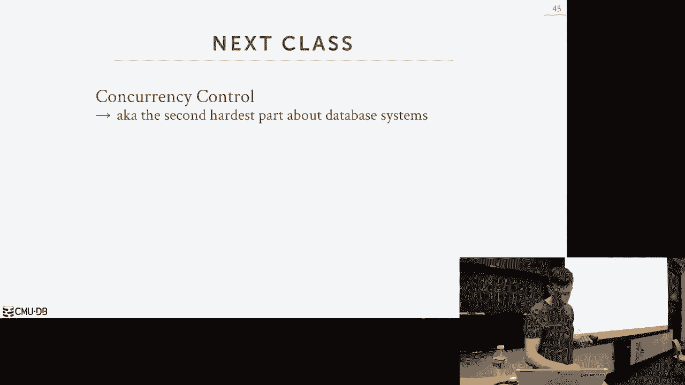
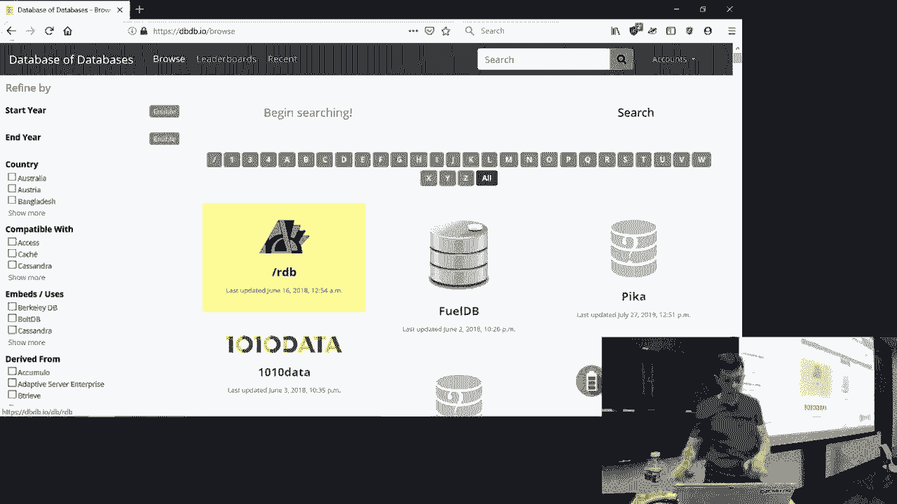

# 【双语字幕+资料下载】CMU 14-455 ｜ 数据库系统导论(2019·完整版) - P15：L15- 查询规划与优化 2 - ShowMeAI - BV1qf4y1J7mX

okay let's start it hi oh it's Thank You，DJ doctor girls okay so real quick some。

announcements for the course in terms of，projects project 3 will be released。

today ish tomorrow ish and that'll be，due in November on Sunday I just be。

doing the 15th I've updated it yesterday，announced 2 on the Sunday on the 17th。

how about 3 will be released next week，so I went to worry about that yet but。

that'll be due before the before project，3 the other major announcement too is。

that with my as I said in beginning of，the semester my wife is pregnant I think。

it's mine and so they are taking it out，of her on on Wednesday night I had him。

schedule it after the Sigma deadline on，Tuesday which is the big data based。

conference so it's happening on，Wednesday so next week I won't be here。

DJ drop tables will be here and then my，PG students will will teach those two。

lectures and then depending on what，happens I should be back maybe the。

following week or so we may adjust，there's that I think we wait they told。

me originated was coming up to 30th so I，canceled class on the 30th but now it's。

coming out whatever this Wednesday is or，Thursday so I might adjust whatever that。

that day off is but the goal is to get，all the material you'll need to do。

homework number 3 and in the next two，weeks okay any questions about this I。

will post this on Piazza with with with，you know more information it's real。

alright alright the other change also，too is that the original schedule was。

that last class before the midterm was，all about query optimization we。

obviously ran out of time so I've，decided to split that lecture now into。

two parts so this is part two and then，I've dropped the lecture on embedded。

database logic which is not really，something we need to note in or the。

build of database system it's sort of，just a，with you for you guys to understand like。

oh there's other things you can do other，than than just throwing sequel at the。

database so if you're curious about that，you know I'll send the postal link on。

Piazza you can watch last last year's，lecture on that topic query optimization。

is kind of more important so I think，it's better to spend more time on this。

okay all right so last class when we，started when query optimization we focus。

on this first part here right how to do，apply rules and heuristics to make。

changes to the to the query plan without，having to examine the data or understand。

what the what the database actually，looks like on the inside we may need to。

look at the catalog to understand what，our attributes are whether they're。

unique or not and whether we have，foreign keys but we don't need to know。

anything about you know our distribution，of values in the tables look look a。

certain way or we have this number of，tuples all right so these are all rules。

that we could do without actually，looking at understand you know what are。

tuples look like so today now we're，gonna focus on the second part here。

which is the more complicated part where，we're now we're going to use a cost。

model to allow us to assess the the，quality or the amount of work we're。

gonna have to do for a query plan，without before we even actually run it。

and the idea here is that we want to be，able to enumerate as many query plans as。

possible and then pick whatever which，one we think is the best and so the more。

accurate our cost model is the more，accurate our selection will be for what。

the best query plan is but as there，seems to go along it's this is super。

hard and everybody's gonna get this，wrong and then what I'll teach you today。

is a way so the textbook shows it tells，you how to do it which is which is。

really really wrong but we'll talk about，little help we could possibly fix these。

things but this is something we can，recover in the advanced class or if you。

take more you know you can do people，have done dissertations on this kind of。

thing and it's still still a unsolved，problem alright so today's agenda we're。

going to first talk about how to do，again plan cost estimation with our cost。

model they only talk about how to do a，numeration，how we're actually going to IntelliJ。

intelligently iterate or different，possible query plans in order to find。

the one that we think is the best right，because again this is np-hard we can't。

do an exhaustive search so we we need to，be smart about what we're at。

looking at and then we'll finish up，talking about necessaries because this。

is slightly different than everything，else and there's rules we can use to to。

rewrite them and to make them more，efficient so we already talked about。

this last class we talked this we said，that you know what is a cost estimation。

what is our cost model actually doing，and again it is essentially it's a way。

to approximate how much work or how long，it's gonna take to execute a query and。

in general you always want to pick the，one that's gonna have the lowest cost so。

this cost could be a combination of a，bunch of different underlying harbor。

metrics you know because that，corresponds to the work we're actually。

going to do so it could just be how much，CPU were actually gonna use this is。

typically very hard to do and we don't，do this for a disk based system because。

the disk is the major bottleneck but an，in-memory system would care about this。

we've already talked about how to do，counting disk i/o for our joint。

algorithm the sort algorithms this is，probably the major thing that we're。

going to focus on we also care about how，much memory we're gonna use there could。

be one algorithm uses a lot of memory，and gets faster performance but we may。

not have that much memory actually use，so therefore we want to choose a slower。

algorithm that uses less memory because，that'll be less pressure on the system。

and then for distributed databases it's，again it's the number of Network。

messages is the high pole in the tent，because sending things over the wire to。

between machines is always expensive and，so in general at a high level these are。

all going to be a proxy for are we gonna，use the number of tuples we're gonna。

access as a proxy for all these things，right essentially determining how much。

data we're got we're gonna we're going，to pass from one opera to the next and。

we can use that to derive which one we，think is the best so as I said we can't。

just you know the way to get the most，accurate estimation of what a query plan。

is gonna do is actually just execute the，query plan but if we're looking at。

thousands and thousands of different，possible query plans we can't possibly。

execute every single one so we need a，way to to approximate this and this is。

what our cost model is going to do and，the underlying concept we're going to。

use our underlying component in our，database system we're going to use to do。

these estimations is the internal Cystic，catalogs of the database system so every。

database system that does has a query，optimizer，that is using a call space search is。

gonna have this insistence module which，is gonna allow it to collect information。

about what the tables look like what are，actually what are actually inside of the。

tuples and how you collect this，information can vary based on the。

implementation so all the major systems，have a way to force the data system to。

collect new statistics right analyze，analyze table update status run stats。

this tells the de system hey do a，sequential scan on my table and update。

my statistics information some systems，also come from this and cron jobs like。

every every so often periodically just，do a pass all those systems can。

piggyback off of the queries as they run，and say all right as I'm doing sponsor。

scan I'll also update my statistics as I，go along other systems have triggers to。

say if the 10% of my or 20% my table has，changed let me go fire off the run stats。

command and update things right there's，no one way to do this better than。

another a common setup would be you like，if you're running an OLTP system you。

would disable this during the day when，you're doing most your transactions but。

then at night time you can take take，passes through and update your stats so。

during the day it's gonna be slightly，off but that's still gonna be okay。

because this is expensive to do because，this thing and this is a sequential scan。

on the entire table so let's gabble in a，little math but it's Andy math not hard，follow this。

so the basic main information we're，gonna maintain about every table it's。

just the number of tuples that they have，and the the number of distinct values。

we're gonna have for every single，attribute within our table so we're。

actually gonna maintain this as a，separate counter because we just can't。

assume that you know I have X number of，pages and therefore I can fit X you know。

why tuples in each page and it's x times，y because again not every slot in every。

page will be full and then we talk about，multi-version concurrency control we。

have multiple physical copies or，multiple physical versions of every。

single logical tuple so we can't just，you know count the number of blocks we。

have we're actually want to maintain，this as a separate count and then we'll。

talk about how we're actually going to，compute the or maintain this information。

to get the the number of distinct values，for every single attribute so now with。

this basic information we can now derive，a new statistic called the selection。

cardinality defined by this function SC，and this is just gonna be compute the。

average number of records we're going to，have or give an attribute with that same。

value so for every single distinct value，I would say you know here's how many。

times that it occurs so we just take the，number of tuples that we have and we。

divided by the number unique attributes，that we have and that tells us for every。

single attribute how many times it，occurs what's wrong with this ray says。

one like so he says one could be a，thousand one could be one and this。

formula clearly misses it absolutely so，this is one of the big assumptions we're。

going to make throughout the entire，lecture and that is we're an assumed。

that we have uniform data so this，formula basically just saying every。

single value occurs every C if every，unique value that I have in my table for。

this attribute it occurs it's the same，number of times as all other values but。

we know that's not how the real world，works all right so take like CMU for。

example see me roughly has 10，000，students it's more than that but it's。

simple math and it roughly has I think，actually does have 10 colleges so if you。

assume you have uniform data then you，would say for all of 10，000 students you，take 10。

000 divided by by 10 and that's，the number of students that are in。

college it's exactly the same for every，college but we know that's not the case。

right this school computer science where，I'm in that has way more students than。

the school Fine Arts it's a real-world，data is skewed but to make our math。

easier for what we're talking about，today we're gonna assume that everything。

is uniform but again this is another，table where the real world doesn't work。

this way real world systems have to，account for this and we'll briefly talk。

about how to do that all right so with，this selection cardinality what can we。

do with this well the goal is for us to，now figure out how many tuples were。

actually going to select during our，scans using our predicates because。

that's when we need to figure out how，many tuples each operator is going to。

spit out and feed him to the next，operator and then we can use that to。

figure out how much work they're，actually going to do how much disk。

they're going to use how much memory，they're going to use so we're using the。

selection collection cardinality to，figure out for the given input we're。

provided from our children operators how，much how much data is coming out of us。

so if we want to get for an equality，predicate on a unique key this is the。

easiest thing to do and our math will，work out great right so say we have a。

simple table the people table we have an，ID column that's the primary key so if I。

have a lookup says ib equals one two，three then that's easy I know the。

cardinality is gonna be one I'm gonna，have one tuple that's gonna match for no。

matter how many tuples I actually have，in my table because it's a primary key。

it's unique where things go get hard is，now when you have more complex。

predicates like range predicates or，conjunctions because now I need to be。

able to combine the selection，cardinality for these different。

predicates in a certain and non-trivial，ways so oh [ __ ] sorry，so the based on the selection。

cardinality now we're going to produce，this idea of selectivity of a single。

predicate so selectivity is basically a，function says for a given predicate on a。

table what is again what are the number，tuples that are actually gonna qualify。

so the form that we're gonna use to，compute this will depend on what kind of。

operation that we're actually doing all，right the last one I just showed you was。

an equality predicate on a on a unique，unique attribute but you know now we。

need to account for the case when it may，not be unique oh we're looking at non。

you know inequalities arraigned ranges，so let's look at some simple examples。

here so assume now in our people table，for the age column we only have five。

unique values right 0 through 4 I said，the thing of this is like instead of。

storing the exact age of somebody we're，putting them into two groups like。

internet advertising or advertisers do，this all the time like people under the。

age 18 18 to 35 35 to 50 and so forth so，we have five distinct values and for our。

table here we have these five people so，if we want to compute now the。

selectivity of an equality predicate，right you know where something equals a。

constant then we just take the selection，cardinality of our predicate divide that。

by the number of tuples that we have and，that's going to tell us what percentage。

of the two boys are going to match in，our table okay so in this case here for。

a selectivity of age equals two assume，we have a simple histogram of all the。

tuples we have and since we said that we，are assuming that our distribution of。

values is uniform every every every，distinct age has an exact value or same。

number of occurrences so to compute the，selectivity it's just taking this which。

is the selection cardinality of H equals，two because it's only one you're only。

looking at one value we just look in our，histogram you find exactly you know the。

number of currencies of this right so，it's just one over five again so this。

one here we're assuming uniform，distribution and we're assuming that you。

would know exactly what this value is，and therefore this math works out great。

right this is exactly what we want but，we now so do some more complex things。

like getting a range predicate so now we，say we're age is greater than equal to。

two well the formula is assumes here，that we're that were we're only looking。

at integers that are continuous we have，a continuous range of values where you。

look at so you just take the max value，divided by the minus the one you're。

looking forward divided by the the range，of the max minus min and that'll tell。

you what Ruffing with the selectivity is，so in this case here we're looking for。

everybody that's two or greater so we，take the min and the max subtract that。

that's four then we just take the the，value we're looking for and the high。

value that we want and it's 4 minus 2，that's 1 1 over 2 so this is wrong right。

the real answer is actually 3/5 but the，way the formula works out we get 1/2 so。

this is a good example where like these，formulas don't always work correctly and。

they're going to produce errors in this，case here we're under estimating the the。

selectivity it should be 3/5 not 1/2 so，this is gonna be problems when you know，when you start doing。

you know estimations of a complex，queries that have a bunch of different。

particles and about different operators，because now we have errors built on。

errors built on errors so say this is，like we're doing the scan at the bottom。

of the tree and we now we have an，underestimation of the number of two。

boys we're gonna we're gonna produce as，our output now when we do calculations。

up above now we're taking wrong inputs，or wrong estimations as our as our input。

to our operators and then doing more，wrong math on them and producing more。

errors so in many cases or the research，shows that for almost actually for every。

single database system they evaluated，for this one particular paper everybody。

underestimates the selectivity of all，these operators and you may say oh who。

cares that how's that why is that big of，a big deal but now when you start sizing。

up your you know your your data，structures you like your joint your hash。

tables for joins your buffers for，sorting now you're gonna underestimate。

what these sizes are and you may have to，correct that once you realize I have。

more data than they actually not，expected so these have real runtime。

implications for in systems and also too，we're making now wrong estimations about。

you know what plan might be better than，another all right the last thing I want。

to look at are negation this one's，pretty straightforward right it's just。

one minus whatever the selectivity of，the predicate that we want right so in。

this case here the selection cardinality，of age equals two is one so the negation。

is just the boundaries outside of that，right and you get 4/5 which is the。

correct answer for this one right，because assuming that something equals。

something so the major observation we，can make about this is that this。

selectivity estimate for predicates is，basically the same thing as a。

probability right it's just saying what，is worth the probability that a tuple is。

gonna match my given predicate so if we，make this assumption now we can use all。

the the tricks that we we learned from，you know statistics 101 to start。

combining together these these，predicates in more complex ways so let's。

say that now we want to have a，conjunction you know age equals to an。

named like you know a wild card so we，would have this computing selectivity on。

the first predicate age equals to，compute the second，selectivity on the second predicate and。

then now we just combine them or，multiply B to the two probabilities。

together and we get our intersection，here right this is where you know we'd。

say it has to be an exact match we're，sorry we have to match both and would be。

this inner part here right and so same，thing for disjunction disjunction that。

the form is slightly different but，you're getting you're just assuming that。

the that they're independent and，therefore you can use the standard math。

trick to figure out what the union is，here so I've talked about two。

assumptions so far that are problematic，but this again this is what the way，every textbook covers it。

the first is that we assume that our，data is uniform but I showed a simple。

example where that's not the case and，then here now we're assuming that our。

data is in the predicates are，independent that's also not always the，case - there's actually a third。

assumption they're always going to make，that's problematic it's called the joint。

inclusion principle so again so there's，much assumptions we're making about。

computing the cardinality of our，predicates that make the math easier but。

are going to end up having us produce，incorrect approximations so again。

uniform data assumes that everything is，always going to be the curve the same。

probability the way to get around that，for for heavy hitter so heavy hitter。

would be like if you if you're really，skewed data and there's like ten columns。

or ten values that occur you know，majority of the time you can maintain a。

separate hash table or histogram to keep，track of those guys and then everyone。

else you just assume his uniform and，derive the cardia now and it cardinality。

estimates based on that so that's the，standard trick to get around the uniform。

data issue we then we talked about the，independent predicates so that allows me。

to take two predicates and if there's a，conjunction just multiply them together。

to produce the combined cardinality and，then the inclusion principle says that。

if I'm doing a join the two tables then，for every single tuple in my inner table。

I'll have a tuple that matches in the，outer table right but that's not always。

the case but you know a way to think，about this is like why would I join two。

tables if they're if there's no way to，actually join them there's no actually。

corresponding values that would match，so we make that assumption but in the。

real world it's not always gonna be the，case could you get you could have。

dangling you know uh you could have，references that don't you know exist。

anymore in the outer table so these two，are the ones that are probably most。

problematic this one occurs and more，advanced things we don't need to worry。

about so I always like to show this one，example to sort of emphasize and show。

exactly why this is problematic and this，comes from a blog article written by a。

former IBM researcher and so guy lemon，worked on like the early one of the。

early IBM optimizers from the late 1980s，or 1990s there's actually still used。

today in db2 it was pretty influential，so he has a blog article but he likes to。

show you here's why the assumptions，we're making here are problematic let's。

say we have a database with a single，table of cars and we have two attributes。

we have the the make and the model so，the make would be like Honda Toyota。

Tesla the model would be like Camry，Accord，you know escort and then say we have a。

query that says where make equals Honda，and model equals Accord so if you make。

the assumption about the week that we've，made so far the two assumptions about。

the independence and uniformity of our，data then when we combine this these two。

predicates together we would say one，over ten because that's that we have ten。

makes and Honda's 1 so that's 1 over 10，and then we have 1 over 100 models。

because we have a hundred models accord，is one of them so we'd multiply them。

together and our cardinality estimate，would be 0。001 but we as humans know。

that these values are actually，correlated or these two predicates are。

correlated like you can't make an accord，like there's no other car manufacturer。

that's gonna make an accord it's only a，Honda so if you know the model equals。

accord you can then know that the the，make has to be Honda and so the correct。

selectivity for this particular query is，actually 1 over 100 so we're order of。

magnitude off from what the the formula，would actually tell us what we think we。

yes so a question is if you had a，foreign key would that make your life。

no but you would happen no whether the，the foreign key child is is unique。

because it could be one to N or one to，one you have to know something about。

that but even then the foreign key I，think for this pickle example doesn't。

help you I think about though but if it，is one it's one table like this is just。

like one table give me all the cars or，the make equals Honda and the model。

equals a court when it has nothing to it，like you know we're doing a joint right。

I need to think that whether whether the，joints get hurt whether foreign keys。

that help of that but we can take that，offline so again like we automatically。

start making estimations about how much，work we actually have to do for our。

query plan and sizing up our，intermediate data structures and our。

buffers and we're going to be way off so，the independent assumption and it's。

going to cause us to underestimate how，much work we're actually going to do so。

the way to get around this particular，issue and this is something that the。

only I think the high-end commercial，systems actually do is to do correlated。

column statistics so I can tell the，database system all right model is。

correlated to make right I can't make an，accord if I if I know that my model is。

an accord I know what my make is another，example would be like if I know my my。

zip code of an address field is one five，to one seven that I know the state has。

to be Pennsylvania so if you if you，declare these these columns as being。

correlated now the database is we can，you know special case it's estimations。

to avoid these pitfalls it can know that，these things are correlated therefore it。

can use the right formula to derive the，selectivity of it but as I said only the。

here question or save it is it doesn't，need to know how it's correlated just。

that they are correlated I have to go，look to see what the syntax and supports。

I think you just say they are correlated，and it should figure it out yeah like I。

think only only Oracle sequel server db2，Teradata maybe snowflake can do this but。

like my sequel and Postgres can't do，this as far as I know sequel Lite sort。

of I can't do this alright so let's talk，about now how we're actually going to。

get this information that tells us like，the number makes a number model think。

the number occurrences of every value so，I've already sort of mentioned this。

before but the the database system is，going to maintain histograms on the。

inside to keep track of e statistics so，the most simplest histogram would be for。

every single distinct value that I have，in my column I just count the number of。

occurrences that I have right so in this，case here this is our uniform data so I。

have 15 unique values and you know each，one occurs five times and so now we want。

to say you know what's the number of，tuples that are gonna match you know。

just something equal five I could look，at this and say I know it's exactly you。

know five but in real data doesn't look，like this no data is more skewed and so。

now again if we have a history in like，this this is fine because now we can say。

you know how many how many tuples have，five we would know the exact value。

every single value I have in my column，I'm storing an entry and my hash table。

from a histogram that's gonna be a lot I，assume that soon this if this count here。

is like 32 bits so my simple example，here I have 15 unique values so you know。

15 times 32 bits roughly 50 60 kilobytes，or 50 sorry 50 60 bytes to nothing but。

now if I have a billion that unique，values and I'm a 32-bit integer for。

every single unique value now 1 billion，times 32 bits is 4 gigabytes all right。

that's just the sit that's just as the，histogram from one column so now I do。

this for every single column so nobody's，actually going to store exact values。

like this except for the heavy-hitter，stuff that I talked about before so。

the heavy-hitter you would have the，exact value but you only store maybe。

like the top 10 or 20 unique values for，every single column you're not storing。

this for every single possible one so，the way to get around this is to start。

combining together these values into，buckets so that we only store a single。

value for the bucket rather than an，individual value for every single。

element of the bucket right so this，would be called an equity with histogram。

so basically was take the every three，values here compute whatever the count。

is the sum of all the occurrences for，every single value in that bucket and。

then now my new histogram just has that，aggregate value all right so I'm doing。

I'm doing buckets a size 3 but you can，even you didn't size them anyway you。

want so now the way to get an estimate，to say you know how many times does say。

the number number to occur I would look，to see what what bucket is my value that。

I'm looking for fall into so 2 is，between 1 and 3 and then I would say。

what's the count here so in this case，roughly 9 I have 3 values so I take 9。

divided by 3 and now I'm estimating that，2 occurs you know three times so again。

we're saving space for saving，computational overhead of maintaining。

our histogram but now we're again we're，introducing more errors in our。

approximations because we there's no，other way to get around this other than。

storing exact values so this is not so，great either because now I could have。

going back here between this bucket，right 8 had a high count 7 and 9 were。

much lower but then when I'm combine，them together I don't know which one。

actually had the high count all right my，heavy-hitter could handle that we can。

ignore that for now so a better way to，do this is actually use quantiles。

so with this one we're going to do is，we're gonna have the we're going to vary。

the width of our buckets so the last one，the buckles are always the same width。

but now we're going to vary the width，such that the the sum of the counts for。

each bucket is roughly the same so in，this case here I can have the first。

bucket would have values from 1 to 5 the，count goes to 2 6 7 & 8。

has has 3 3 values for the counts 12，sorry counsel 12 accounts。

12 9 and 12 and so now I have variable，length buckets but now I could，potentially have more accurate。

estimations of the the occurrences of，values within those buckets and then。

this one here I'm showing quantiles you，can do the deciles and other other。

grouping sizes so any questions about，this again this is what we're going to。

populate when we run analyze or run，stats in our database system it's going。

to generate this information for us and，store this in our catalog and it's。

durable and disk when we restart the，system we come back we don't run analyze。

again all of our statistics are still，there yes this question is if I add now。

if I add 10 more 10 more values to 5 so，now it shoots up what will happen in my。

histogram so this is blown away every，single time I run analyze I recompute。

everything so yes in that case it could，could vary the now the size of the of，the bucket correct。

so as far as you know in most systems，they don't maintain these things as you。

do inserts and updates because it's just，too expensive because again well talk。

about transactions on on Wednesday but，when I'm running a transaction I want to。

minimize the amount of work I have to do，now，I wanted I'm gonna put off till later。

because I'm holding locks on on tuples，and that's interfering with other other。

transactions running at the same time so，I don't want to maintain this as I go。

along now you could say all right I，could have like a separate background。

thread could look at recent changes from，the log and then go apply these changes。

yes you can do that some citizens might，do that but in general everyone blows。

away and research from scratch the one，system that does try to do the updates。

on the fly was was IBM db2 Zo's leo the，learning optimizer they were big it。

would run a scan they can go back and，update this thing but you know it has，issues ok。

so histograms and these and the sketches，and we did about sketching but like。

these histograms and heavy-hitter stuff，that's the way you know this is sort of。

the most data system to do this another，alternative instead of using these these。

these these additional data structures，is that we could just maintain a sample。

of the table and derive our systems from，from the sample so anything about the。

history bands is like it's a essentially，a lower-resolution copy of of the。

database of the tables right it's an，approximation of other contents so but。

rather than having these histograms and，try to derive the system's from them。

what do we actually just took a copy a，smaller copy of the table itself and。

then ran our predicates on that smaller，copy and then assumed that the。

distribution of values within that，sample is the same as it exists in the。

real table and therefore any our，selectivity estimates we derived from。

the sample will accurately reflect what，the what's in the real table so let's。

say we have and our people table we have，a billion tuples and then but let's say。

we just take a sample we're just going，to get every other tuple and copy it。

into a sample table but there's，obviously more sophisticated sampling。

algorithms you can use but for a，purposes now this is fun so now when my。

query comes along and I want to compute，me the selectivity of age equals greater。

age greater than 50 I go to my sample，and I say well bama's over the age of 50。

so therefore it's it's 1/3 and therefore，I can assume that the different values。

in this case here just like in the，histograms we could meet we could。

maintain this as we go along right as as，you know it periodically refresh it or。

we could trigger it whenever you know we，know that a large portion of the table。

has changed or would you all bulk load a，bulk bulk delete but the idea here again。

is that rather than maintaining，histograms who may could be inaccurate。

so this only occurs as far as they know，in the high-end systems so sequence over。

most famously does this and their，optimizer is probably the best one I do。

they but they actually do a combination，of the histograms and and the sampling。

which I think is the right thing to do，okay，yes Sandia what makes this more。

difficult than what this question is why，is this the case that only like the。

high-end commercial enterprise systems，actually do this versus the you know the。

open-source guys good question I think，the yeah actually good question if you。

already have analyzed you're gonna do a，spectral scan anyway to compete your。

histograms might as well just generate，this thing you actually don't don't have。

an answer it may be the case that just，like the history of ways the way it's。

always been done right it's not a very，satisfying answer I mean here's here's。

one thing so I think like with the，histograms you in the way you have in。

your optimizer you just have this cost，model actually here's tell you the right。

answer the histograms we will up way，faster right cuz again imma numerating。

all these possible different query plans，I can go to my histogram real quickly。

and derive is the the statistics I need，to estimate the the selectivity of a。

predicate or an operator where's this，thing to compute the selectivity。

estimate I have to do a sequential scan，on it that's definitely gonna be slower。

than the running through the histogram，right so we can cover this in the。

advanced class that the blade pilot，works in sequel server sequel some。

replies says if I recognize my query is，super simple just use the histograms if。

I think it's gonna be a lot of work like，it's gonna take maybe minutes or hours。

to run then who cares if I spend an，extra couple seconds doing my sync my。

sampling technique because that'll make，a you know，big difference one actually run the。

query plus pi that's the reason the，histograms gonna be faster this one。

takes more work and it's it's also sort，of weird too because like you're like。

you're doing a scan on something while，you're running the optimizer it so it's。

like a from engineering standpoint it，might be hard to set up like this is the。

model like this is super simple like，like it's what's the subcommittee this。

predicate that component of the cost，model itself is is independent I think。

of whether it's a histogram versus a，sample but yeah the yeah so up above is。

the formula today it'll say I'm gonna do，this man a disk IO I'm gonna you know。

miss this hash joint is better than this，other join yeah if that's not of all。

that other parts not very sophisticated，they may be this doesn't matter question。

over here or yes so his question is how，do you actually create a sample that is。

gonna be accurate for every single query，that you can ever possibly throw on it。

my stupid sampling here is every other，one but clearly that's like we know it's。

stupid because maybe data inserts arise，at different times and therefore the the。

data that I insert today first of the，data is sort of yesterday has different。

distribution and so I may want to sample，differently or I could look at my。

predicate and say well I its I'm only，looking at you know data that was。

inserted today so therefore I make sure，my sample only includes that this is。

this is where it gets hard and probably，the reason why the advanced advanced。

systems do this better than or do this，and the open source guys don't do like，other sampling。

there's a lot of sampling techniques to，try to come up with ways to do this。

I I don't know what the commercial，systems actually do but hopefully can。

you see why this is a query optimization，super hard because like now you need。

some you know some gnarly math to figure，out like what is the right way to sample。

this and after you write get depend on，the query some queries you know uniform。

sampling might be perfect other sampling，techniques might be better for others。

yes today hey statement from an，engineering standpoint this could be。

hard because like now you have a，separate table and then you want to be。

able to a sequential scan on it and，ideally use the same execution code that。

you have to do spectral scans and in，order to put these statistics yeah it is。

it is like a chicken for the egg I can't，run a query until I have a query plan。

but I can't get a query plan until I can，okay so this point what we have we can。

now roughly you know emphasize them，roughly we can roughly estimate the。

selectivity of our predicates what do we，actually want to do with them and again。

as I said in the beginning this is where，we're gonna do our cost cost model or。

cost based search to do query，optimization so for this one again in。

the pipeline after we do all those those，rewrites with just the rules now we're。

gonna run enter this this cost model，search cost based search to try to。

figure out how to convert the logical，plan into a physical plan。

all right the physical plan is what the，data system actually executes so the。

logical plan that says I want to join，these two tables the physical plan says。

join these two tables with this hour and，this buffer in this sort order and all。

that good stuff so for single relations，it's pretty straight forward well。

briefly talk about it the one we're，gonna spend most of our time which is。

the hardest one is the multi multi，relations or anyway joins because now。

it's not only worrying about the the you，know what joint Algrim I want to use but。

what order I want to do my join a member，I said last class the number possible。

query plans we could have this for to，were，right guys again it's for all my。

different joint algorithms I can again，join them in different orders and I can。

join them either one with the inner，versus the outer right so the search。

place explodes so because this is，incomplete and pimpy complete we don't。

want to actually do an exhaustive search，because we're never actually going to。

complete does it make sense to run our，query optimizer for an hour if our query。

is only gonna take you know one minute，to run that's not a good trade-off so we。

need a way to figure out how to sort of，shed work or cutoff query plans and we。

don't want to examine to reduce our，search space so we can make this problem。

more tractable so let's first talk about，how we want to handle sting relations。

and the most MMOs are time talk about，multiple relations so for single。

relation query plans the the the hardest，problem we have to deal with is picking。

our access method right the the fallback，option is always a sequential scan it's。

the slowest but it's always it's always，correct then we can maybe one do a。

binary search and we have a cluster，index or pick and put pick you know one。

or two one or multiple indexes to use，for index scan the other thing we can。

care about also is the order in which we，evaluate predicates like I have。

something and something if the second，predicate is more selective than the。

first one maybe I want to evaluate that，one first so I throw away more data。

sooner than later and maybe the second，predicate evaluates always you know。

always true so we you know we don't we，want to put that as the the second one。

so in most new database systems like，there's all these startups all these new。

data cells coming along the last ten，years if they have a query optimizer。

they're probably and they're you know，they're probably using heuristics that。

in order to pick these things but you，don't actually truly need a。

sophisticated cost model to do this I，just say you know what what index is the。

most selective and that's the one I，always want to pick or what predicates。

most to select them that's the one I，always want to pick so for all three。

queries this is especially easy to do，because they're not going to access much。

data and then you know they're doing you，know single table lookups for the most。

part and so for many queries the the，query planning we're going to do is。

essentially try to identify whether a，query is sergeant，and this is some terms in the 80s I。

don't know who invented it all right，sergeant we'll just means search。

argument Abel and all that basically，means is that there's an index we could。

pick for our query we know that's the，best one to use that's it so again we。

don't need to have an exhaustive search，we just look it up all our query plans。

are starting we look at all of our，possible indexes that that could satisfy。

our our query and pick the one that has，that has the best luck tivity because。

that's gonna route us to the data more，quickly again really simple I have my。

night my select star from people where I，D equals one two three I just have a。

heuristic that says oh I have a primary，key on ID but therefore I have an index。

done I just pick that as my I'm doing，index scan on that on that index right。

again most newer systems that come along，that are doing transactions are doing。

OTP stuff this is what they support，first for the joins though that for that。

that's when things is hard so again the，as the number tables were going to join。

our table then i'ma alternative plans，are gonna grow so therefore we need a。

way to prune that down so we're gonna，rely on what I'll talk about here we're。

gonna rely on a core assumption that the，IBM people did back in the 1970s with。

the system are when they built the first，quarter optimizer and that is they are。

going to only consider left deep join，treats so that means that any other。

alternative join tree structure I'll，show that looks like in the next slide。

they're just not gonna bother doing any，search or cost estimation another say。

that's we're not even gonna consider it，so a left deep trees like this where。

along the on the left side of the tree，that's we're doing all our joins right。

so we join a and B and then the output，of this joint a B is then joined with，forth。

all right this middle guy here is sort，of a hodgepodge right it's it's it's。

it's you know someone on the left some，on the right right and this one here is。

called a bushy tree where I do the joins，on you know C and E and then do the。

joins in a B and then the output of，those two joints are then then joined，together at the end。

so IBM in the system or they're just，gonna not even consider these other guys。

here they're only gonna look at this one，yes yeah this is actually again so his，same。

yes this is the beauty of relational，algebra so the join operator is。

commutative so I can put I can join，these things in any way that they want。

and the final result is always the same，it's always correct，so therefore ADA is perfectly safe for。

me to go ahead and do this everything I，guess why they do this other than just。

reducing the number of plans they have，to look at think back to when we talk。

about query processing models all right，so back then they were doing the。

iterator model the volcano model cells，are called what the pipeline model so in。

this case here at the left deep joint，tree I don't have to materialize any。

output from a joint operator right it's，always then fed into the next joint。

operator so I do my joint a and B then I，take the output of that joint and I now。

build my hash table to do or you know do，whatever kinda join I want to do on see。

if I have this bushy tree here I would，do the join and C and D that output then。

gets written out to like a temp file on，disk because now I need to go back over。

here and now do join a and B and then，now I go back and feed back back in the。

the joint I just did over here you know，read that back in build my hash table do。

whatever I want to do and then do the，joint with this other guy here so left。

deep join trees not or not always gonna，be pipelined but it makes your life。

easier and back in the 1970s they didn't，have a lot of memory so they would have。

to spill to disk a lot so you can，minimize them out amount of work if that。

amount of data to write the disk in，order if you always go left deep right。

so this is a thing I just said here so，in in today's systems not everyone makes。

this assumption but again I think every，textbook talks about this that you know。

all right so how are we actually going，to enumerate our query plans so the。

first thing we just do is name right at，the numerator at the logical level all。

the different orderings of our of our，tables we could possibly join to see。

Alan join our S&T I could join RNs first，maybe you know Tina's first I numerate。

all those things and then if each of，those I could then now enumerate all the。

different possible join outcomes I could，use hash join partners join nested loop。

join and then for all those now I can，then also now in enumerate all the。

possible query plans like a pop I could，have all right you can see how this is。

like search space is exploding so what，the IBM guys came up with in the 1970s。

was to use a technique called dynamic，programming to make it more tractable by。

breaking it up into smaller discrete，problems and we solved the smaller。

problems first and at the very end we，combined everything all together so。

let's look at really simple example here，so let's say I want to join three tables。

are an SMT so the way to think about，this is like it's a it's like a sort of。

search tree that I'm showing，horizontally so this is our starting。

point here for our logical plan where，none of the tables are joined and then。

our end goal is end up here where we，have our s and T joined together so in。

the in the in the first step we want to，figure out you know what's the first。

joint ordering we want to do so we could，possibly join R and s first or teen s。

first and then for the sake of space I'm，not showing all the other ones but for。

all other possible join no dreams for，this first join we want to do we。

enumerate them down here and then now，what we're going to do is we're now。

going to have a compute the the cost of，doing whatever join were specifying here。

in the first step with our different，joint algorithms so again for sake of。

simplicity we're saying we can either do，a server's join or a hash join and then。

now we just used all this formulas that，we talked about before to now compute。

the cost of executing each of these，these joint operators in approximating。

the amount of disk IO we're gonna have，to do and so for each node we have in。

the first step we're just gonna pick，whatever path actually has the lowest。

cost whatever joint algorithms can，actually have the lowest cost and that's。

the one we retain then now starting from，each of these notes of the next step we。

do the same thing and try to compute the，estimated cost for doing different。

joints to get to our end goal here right，and then we just end up throwing way for。

each node here we end up only keeping，the one with the lowest cost to get to。

our end point here and now we go back，and try to figure out which path is。

gonna have the the lowest cost for us，and that's the one we'll end up using。

for this query plan this is an over，simplification of actually how this。

actually works but this is the general，idea from system are that they've been。

in for dynamic programming and at a high，level，there's sort of two categories of query。

optimizers we're only talking about one，of them this one's the most common most。

systems should operate this way Postgres，does it this way my Seco does it this。

way Oracle does it this way all right，you start with the the the first node is。

always the starting point when nothing's，joined and then you work from the。

beginning to the end to figure out how，to get to my end goal where everything's。

joined together the other thing also，over simplifying here there's no。

information that tell me about what I'm，showing you about the physical。

properties of the data were you know ed，we're emitting from one operative the。

next so I'm not keeping track of whether，things need to be sorted whether things。

are compressed a roast or a column stir，all that extra kind of information。

getting you have to consider in your，search algorithm here but for our。

purposes we're ignoring that all right，so let's walk through this example more。

concretely so that's it that's the，dynamic approach arrived we're going to。

build out our search to try to figure，out which one has you know what what。

path to get me to the end goal of，everything's joined together that's。

gonna have the lowest cost but let's now，start it all put this all together and。

do the three steps we talked about so we，want two numerate all the joint。

orderings all the algorithms and all the，access methods and again emphasizes no。

data system does exactly the way I'm，showing here it's way more complicated。

but at a high level you hopefully if you，understand this you can then see how to。

apply it to more sophisticated，configurations and setups so the very。

first step to join joint are s and T I'm，just going to enumerate all the。

joyner rings that I have but we said，that for for for system or we're gonna。

prune anything that is is either a cross，product but that's not a left outer join。

are those things we can just drop，medially，so then for each of these guys so let's。

pick this one here for each of these，query plans now we're gonna go inside of。

that and now start and numerating all，the different joint algorithms we could，possibly have。

right so for to do this join our NS and，then followed by T I can either do an S。

loop join I could do a hash join so now，I'm going to numerate again all possible。

configurations of those and those are my，edges going in that dynamic program。

graph those are my edges going from one，step to the next and then we do the same。

thing for all the other the joint own，routes from the previous slide so then。

now we're gonna pick one of these guys，and now I try to you know enumerate all。

bit different possible access methods，you can have so we can either do a。

central scan or index scan and then for，each index scan become you know for each。

index we could possibly have we'd have，another enumeration of that okay you。

sort of keep fanning out and having more，and more options and then you use the。

dynamic programming technique to figure，out what the cheapest path is okay so is。

this clear roughly how this works all，right so I always like to show this。

every year so again I'm gonna show you，how Postgres has Postgres has a。

specialized optimizer but in general，what I've described here is at a high。

level how every system are based query，optimizer works they have a cost model。

that allows an estimation of as they're，doing dynamic programming search to get。

to the end goal Postgres actually has，two optimizer search algorithms against。

do they have the system r1 that I just，talked about but then they also have。

this special one called the genetic，optimizer are the geq genetic query。

optimizer GE GE qo and what happens is，that if you have a query that has less。

than 12 tables they used the system our，approach and then if you have 13 or more。

then you start using this genetic，algorithm because they can deal with you，know a larger search base。

so with Postgres they're gonna support，all different types of joint orderings。

so left deep right deep bushing doesn't，matter and as I said a and then they'll。

fall back to this genetic one when it，gets too complex so at a high level this，algorithm。

so my first generation I'm just gonna，have enumerate a bunch of different。

random configurations of my query plan，right and that's the jointer uttering。

plus the the index scan or suspension，scan plus the actual joint algorithm I。

want to use and then for each of these，I'm gonna compute the cost and then what。

happens is I pick whatever which one is，the best all right so this one has the。

lowest calls I'll keep track of that up，above and say here's the best plan I've。

ever seen and then I'm gonna throw away，the one that has the lowest cost and。

then now do a mix up of the the traits，of the ones that weren't thrown away so。

now I'm gonna do random flips of the the，genes if you will all the the components。

of the query plan to produce new query，plans right and so it's sort of like a。

random walk so now I'm do the same thing，in my second generation I find the one。

that has the lowest cost in this case，here this one up here has a cost eighty。

that now becomes the new best class I've，ever seen I throw away the one that has。

the lowest cost then I do a random mix，up of the plans that are kept around and。

I generate the next the next generation，and they'll keep doing this for until a。

certain amount of time there's a time，out says I'm not I haven't seen anything。

else or I haven't seen anything better，than what the the best one I've seen so。

far and a certain mount of time wide，exhaust Mike Mike my fixed time limit。

and then whatever comes out of this is，the best is that it's one I'm gonna use。

yes yeah a question is for simplicity，reasons I'm only showing you left deep。

trees you could mix it up with right，deep and bushy trees but you make this。

is only three tables we'd imagine you，had another three tables you want to。

join and maybe one part of it is right，deep one part is left deep I can I can。

mix and match them as needed yeah but，the question the first generation how's。

it generate this random how many，candidates I don't know how things。

probably figure well I don't know I，don't know the number is but yeah it。

can't be everyone yeah it's it's it's，some percentage of big actually probably。

some fixed amount I don't know what it，is but again the this cost estimation is。

the same thing we already talked about，before right this is it's the same。

histograms or sampling and you're just，applying this as you go across right。

Postgres is the only one that I know，that actually does this there was some。

work and doing simulated annealing other，techniques this is like a random。

algorithm right good cuz it's looking，it's not guaranteed to converge you're。

not guaranteed to see exactly the best，possible option you're doing a random。

walk in the solution space and hopefully，you land on something that that's。

reasonable so actually to his point you，obviously want to pick things that are。

and your initial candidate should be you，know reasonably good how they actually。

do that I don't know because if you have，all crap here you have ugly children and。

big first step then you have ugly，children the second step it's not gonna。

be good so there's probably some way to，figure out what your initial candidate。

should be all right so any questions，about this yes okay so this question is。

how often you often you get queries to，have 13 or more joints very often uh it。

depends for OLTP you Walt for for，all right so think about this。

so in a data warehouse a very common set，up does have what's called a snowflake。

schema and the idea is that you have，this single table that's called your，fact table。

and then you have dimension tables that，are that are around it so a fact table。

using Walmart nerds example Walmart has，a fact table that's every single item。

that anyone's ever bought at Walmart so，that table is massive it's billions of。

billions of things but you don't want to，store like the name of every single。

product the price and so forth so you，have these dimension tables on the side。

that says you know here's the product，they bought here's what store his。

location so those are all your dimension，tables so when you do a joint and say。

find me all the the finally the，best-selling item in the state of。

Pennsylvania during the winter for this，month range for people you know over the。

age of 35 those are all joins now with，his dimension tables so that thing can。

rack up very very quickly the other，thing I'll say too is like I always talk。

to the to the the data is companies and，I ask them like you know about the query。

optimizer because that's the part I'm，most interested about and the metric。

they always give me in terms of like Oh，our query optimizer is good they always。

claim the number joins that they can，support and I don't think this is a good。

metric but like I've noticed that this，is cars every single time I guess。

Malthus so I think like mem Siegel told，me once that they could do 35 table。

joins and somebody else somebody to give，you 75 and then splice machine told me。

they can do 135 snowflakes at Vega new，thousands and they have customers that。

actually do that it's hard right you're，ready to deeply into the ordering things。

it like again joins a commutative you，can join them in any any possible order。

you want you could from you them any way，you want yes，now I thought what you're going is there。

like I've shown you to a joint，algorithms，like to for loops there are multi way。

joins where you can say I'm joining our，SMT on exactly the same attribute let me。

join them exactly the same time that's，hard and only the expensive Pistons do，that。

what the same wishes that wouldn't be，made so this is actually something。

that's the human Rick urate oh I'll，cover this maybe next class or I could。

send her something on its own on our，Piazza like you would like a human would。

have to design the database to say，here's my fact table here's my dimension。

table it's not something we，automatically figure out I'm using the。

term dimension table that's that's the，vernacular for describing what that。

table looks like in a snowflake schema，you have a fact table in the middle and。

then the things around it are the called，dimension tables but there's from the。

databases perspective unless it's our，system design for OLAP queries or。

analytical queries it there's no special，designation in sequel to say oh you're a。

dimension table or oh you're a fact，table it's just as humans we use that。

term yeah I'll send I'll send slides，from from last class or from this。

yes so the idea here is like there's，like again it's a random map to，randomized algorithm but so the。

algorithm says this thing has the lowest，cost I don't know why this is the worst。

but there's something about it it's bad，so rather than propagating through the。

next generation wherever it's bad you，know deformed genes are right I'm just。

gonna throw it away and then so，something about this one has the lowest。

cost that I want to propagate forward so，that's why I'll let this thing you know。

get friendly with this guy，right and then before you know you got。

to go to the hospital Wednesday and your，wife's giving birth right like it's。

alright yeah your question is the sorry，how is what different how's this。

different than this well this is doing，this is this is right deep that's lefty。

no no that's that's the outer table this，this is the inner table so I'm doing。

hash join I'm building hash table auntie，and I'm probing with tea down here join。

matter the order matters yes yep yep dad，should be here yeah that's mistake yeah。

this is just saying that this thing this，guy is allowed to propagate forward that。

okay so let's finish up quickly at NSSL，queries so this is something we'll cover。

more in the advanced class if you take，that but the the main way to think about。

this is that the it's not like a join，because it's a sub query and we want to。

be smart about how we're actually going，to evaluate it all right because the。

dumbest thing we could do is just，evaluate that inner query the sub query。

for every single tube what we're looking，at in the end the outer query right my。

sequel used to do that and it needs to，be awful so there's two approaches we。

can do this and the idea here is some of，these can we can we can do these without。

having to run a cost based search we can，do this in part of our rewriting phase。

so the first of that we can rewrite the，query to 2d correlate it or flatten it。

out or we can extract the inner query，and run that separately as its own query。

and then feed its result into the first，query so let's look a more complicated。

example here so this is so this query，here we're trying to get all of the say。

we have a table keeps track of sailors，so this is from when we used to use the。

old textbook from Wisconsin in Wisconsin，a sailing club that's what this is。

problem so basically we're trying to get，all the sailors the name of the sailors。

where they have reserved a boat on it on，a given date so we had this inner query。

here well now we see if we're，referencing from our inner query a。

record from the outer outer query so in，that case here we know that they're。

correlated right because they're，referencing each other so we need to。

rewrite this as a join so again we can，do this in rewriting phase we can。

recognize that we have this this this，pedak up here and we can rewrite it like。

this and then we just do our call space，search to figure out whether the right。

join order is as before let's look more，complicated example so this one here。

we're trying to find for every single，sailor free sail with the highest rating。

overall our sailors get the two，reservations for red boats and then find。

the sail ID with the earliest date in，which the sailors reservation was on the。

red boat so we had the main thing is，that we had this inner query here where。

we're just trying to get the max sailor，rating or ranking for all sailors so。

worst case scenario as we do this lookup，here we're rating equals and then the。

center query for every single tuple on，the outer table on the sailor table we。

just rerun this thing over and over，again but that would be slow that that。

would suck and so what we can do is then，extract that out or we write it to so。

that we don't have to have that you know，we run that every single time so the。

first approach could be just take this，out this nested block run it up here。

store it in some kind of variable and，then substitute that value down below so。

the main thing I'm trying to show here，is that the query optimizer doesn't。

necessarily have to take a single query，and only treat it as a single query we。

could rewrite it and execute them you，know one after another in order to fill。

in the values that we actually need and，this is something that the more。

sophisticated systems can do all right，this is saying this is the outer block。

all right so the that's the ball that's，this is what we can talk about for a。

query optimization for the rest of the，semester as I said this is something。

that I'm really interested in and I plan，to cover more in the advanced class is。

this there's something during cheating，getting involved in and when I get。

started on this you know this is you，contact me because this would guarantee。

a seat in the advanced class as well so，we talk about ear selectivity。

estimations we talked about the major，assumptions we made about the uniformity。

independence and the problems with this，we talked about how to do genetic。

programming for did you join orderings，and then we we can do simple techniques。

to rewrite nested queries all right any，questions about any of this so again。

every single time you fire off a query，and sequel light or Postgres or my。

sequel whatever database you're using，it's going through all of this which is。

amazing how fast it actually is I even，though it's a really complex problem all。

right so next class I will be here and，we're gonna start talking about。

concurrency control so this is the，second hardest thing in database systems。

this is also something if you're really，good at you can also get a job this will。

cover it so we're on Monday or sorry and，Wednesday this week we'll cover the。

basics of control theory again Andy，theory not real theory and then Monday。

next week and Wednesday next week I'll，have the Pichichi students cover。

two-phase locking and timestamp ordering，because those would be the two things。

you'll need for the the fourth homework。

assignment okay okay but I was gonna do。

extra credit hmm hold up let me get the，slides so releasing the extra credit。

assignment here today so you can earn，10% extra credit for your final grade。

right now for the exams on for the，project for the final grade of an entire。

semester if you write a article about a，database management system and so you。

compete any database instance when you，want other than the ones that students。

have written about before the way you，think about this is you're writing like。

in the cyclopædia article where is that，a writing freeform text like you would。

in Wikipedia it's set up so that you can，specify exactly how different parts of。

the system are implemented there's，options to choose，like how it does concur to all what kind。

of indexes it has and then you can write，information in like a description of。

what actually it actually does so for，this one you have to provide citations。

for everything you do but again，everything wiII be explained on the。

website so I've created this website，called the database of databases DVD。

video I wanted to DV to i/o but then，that's asking for a lawsuit from IBM so。

we didn't do that so the way it，basically works is that has about。

different ways to categorize different，database systems to find what you're。

looking for so in this case here these，are all the data systems that are。

implemented in rust and then there's，again there's an article here at the。

describes exactly how everything works，and there's citations for everything。

okay so I will post a sign-up sheet on，Piazza for you to spell to select what。

database system you want to use again，people this is the second year we've。

done this so they'll be not every single，system will active you available to you。

but there's enough of them out there，that everyone shouldn't have a problem。

to actually pick what you want so to be，first come first serve so when I post it。

online when I post the signup sheet，online I will announce it on Piazza and。

then whoever gets there first you know，get to whatever system a lot Long's have。

been approved so the way think about，this that if you pick a system that's。

widely known and used like Oracle then，there's a lot of documentation there's a。

lot of information about actually how it，works so you expect to write something。

that's very comprehensive with a lot of，citations if you pick an obscure system。

then this might be problematic because，it may not be as much documentation。

available so in that case I can either，get you in touch with the people that。

actually implementing it and they can，provide the information I've had。

previous students post on the message，boards or message people on Twitter they。

askin from information how this assumed，actually works one student last year。

picked a system that only existed for，three years in the 1980s and then she。

reached out to the guy that actually，wrote it because he was MIT alum right。

it's actually kinda pressable people try，to get get this information and so what。

you get is no sign up and get an account，and it'll be a page like this you can go。

edit again you can see that it's not，free form text for everything you can。

select exactly how you know different，parts of the system or actually。

implement it so it may be what database，system I am I gonna pick right and I'll。

just say that there's enough of them，there that you should have no problem。

finding one that you want so I think I，am currently I am currently aware of 636。

different database systems so，distributed systems embedded systems。

systems written in different languages，going back to the 1968 we have one or 65。

so again you should have no problem，finding a dataset that piques whatever。

your real interest is okay yes，what's up wait some giggles yeah yeah I。

know it's not real yeah this is actually，it's not even all this is this is still。

a subset this is probably me like 400 of，them there's another 230 that I know。

about okay so how can you solve the，system you want to pick you pick the。

country of origin if you care about you，know database is written in Brazil or。

China or India we have those right based，on popularity so I know I keep track of。

what pages get to view the most right I，can tell you which one you put you。

should watch you look at there's this，one in France written in Java or。

JavaScript for whatever reason Google，picks us picks us up we get a lot of。

traffic for that whatever programming，language your isn't into then if you。

like rust you like go you're like see we，have a database in written in bash write。

like whatever you want we have something，for that you want to ship it at。

databases embedded databases single node，databases we have those discourses。

memory roast row versus column store，commercial versus open source or。

enterprise we have it we have we have it，all if we have time we can look at the。

leaderboard and see which which one，systems actually appear the most which。

you know what programming language which，country all right I got to say this。

because Lea shared this didn't happen so，do not plagiarize so there'll be two。

parts you split it in two parts the，first part will be like a checkpoint。

maybe after after Thanksgiving well，we'll look over it and give you feedback。

whether you're on the right track to you，know if you're doing the right thing and。

then there'll be the final submission，during finals week and that's where you。

get your final grade for both of those，submissions do not plagiarize last year。

we had somebody cotton pasted from，Wikipedia and they put that in there and。

the reason why we caught them is because，they didn't go delete all the brackets。

you know for the citations so we had to，go reporting to Warner Hall it was very。

very messy okay so do not plagiarize do，not copy anything do not copy images。

from the internet don't assume that it's，someone，scribes the system that their expert。

they know better than you and therefore，you you feel wrong rewriting it I don't。

care do not copy anything because your，name's gonna go in on this this this is。

public on the Internet，so you know if you play drives we have，to go report you okay yes the question。

is if you cited image I've rather not，you can get by without images yes I I。

wouldn't worry too much my images yeah，yes so it's a way to work is since。

students I've done this in the past，I will they're not they don't want all。

had the same quality so I will provide a，so yeah if I got eyes for this you。

should pick the one you should always，assume the latest version right so if。

they did something like five years ago，and got fixed I don't care about five。

years ago just describe what it does now，you can mention they used to do in a。

certain way but I would focus if you，just focus on what how it exists now yes，[Music]。

I'll be dead or you'll be gone like，don't worry about don't worry about it。

yeah actually we've had some companies，reached out to us and we allow them to。

edit the page but again it's like I'm，like curating it I wanted them to avoid。

like marketing [ __ ] like we're the，fastest database like all that crap we。

keep it on case by case basis there any，system you're in particular tooth in。

your mouth because I'm the Mongol one's，actually pretty good already okay um so。

if you gotta go you can go but let's we，can quickly look at the website and all。

right so what date what country has jet，has created the most database systems。

France and India okay all right so this，the website so we go to the leader。

boards actually let's do that so like，again you can click on any database。

system and then over here like it has，the country of origin so somebody said。

China so to tell you how many how many，do since China has so China has 28 US，has u。s。

 has 300 somebody said what was，that what said India what is with the。

Indian code in5 Russia are you 21 you're，France is less all right so again like I。

can click on this and then I can click，like programming language is to。

implement it so this one's written in，C++ right to 101 what what what is。

probably most common programming，language used for database system。

everyone sticks to missile us see the，combination C's of applause yes Java。

right so we go to write this leaderboard，thing here it says a breakdown of right。

so here's the breakdown of the countries，right Germany is number two。

Java the most common programming，language but again if you combine C++。

and and C all right then it passes it，and then also we keep track of like what。

database systems use other database，systems so these are these embedded。

databases there's like rocks TV a bunch，of systems like clock cockroach TV use。

rocks DB as the internal storage and，then they have a go thing on top of it。

there's also systems that have forked，other systems and use that as the。

invitation so there's a lot of companies，that have forked Postgres and use that。

and as well as my sequel there's the，most two common ones so again you see。

why are we trying to keep track of all，these things right and so I'm aware of。

in total as I said 630 whatever um so if，you find a system I think this would be。

super helpful if you're you know if，you're from India or China or whatever。

country you come from and there's a，database system that's written in that。

language that I don't know about let me，know right because I want to know like。

this thing just goes on forever and ever，I there's there's tons oh okay so I'll。

post is the Piazza today project 3 will，be announced either today or tomorrow。

and then well you know better we'll get，a great script set up for that and then。

we'll have class on Wednesday and then，when next week starting starting Monday。

next week will be the movie my grad，students I'll have office hours。

immediately after this if you want to，see your midterm exam but I won't be。

blessed，let's go get the next one then get over，dive dress good net will be son ricochet。

jelly hit the deli for a boat one，naturally bless ya what rap is like a。

laser beam the phones in the bush say，nothing like a chain wrap the bottle of。

us a nice sympathy go you don't feel，like drinking that boney to you drunk。

you can't drop cross and if the sake。