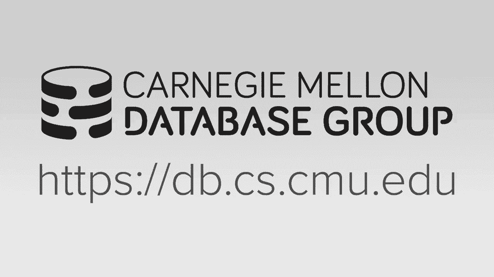
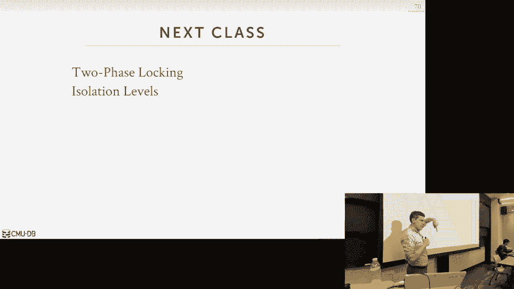

# 【双语字幕+资料下载】CMU 14-455 ｜ 数据库系统导论(2019·完整版) - P16：L16- 并发控制理论 - ShowMeAI - BV1qf4y1J7mX

去吧。

所有的权利，呃再次，谢谢DJ，为呃，保持新鲜，所有的权利，所以呃，我们有很多话要谈，嗯，再快点，对于作业，三号工程已经实施，截止日期是11月17日星期日，我将在这节课结束时简短地讲到这一点。

然后投射或说家庭作业，四应该是四，不是三个，四部将于下周上映，那将是那时，我们十三号做那件事，好吧，就像我说的，我妻子要去，我们今晚要去医院，九小时后就会发生，所以我要离开两个星期。

下星期或下星期我都没有办公时间，下周我们要上课，我的博士生将负责这些课程，然后下一个星期一，我们会再得到一个，然后我们10月30日不上课，然后时间表正确地反映了这一点，好的，所以关于这些的任何问题。

然后我会安排我的，我的管理员把所有的期中考试都放在她的办公室里，然后我们再决定什么时候你可以去她的办公室看看，再看看你的期中考试，只要带上你的学生证，所以她知道你是谁，然后如果你有。

如果你想让某样东西降级，拍张照片，你不能带着期中考试，只需给页面拍一张照片，你想让我拿到它然后给我发电子邮件，我们会处理好的，好的，所有的权利，所以我们现在在课程中，我们已经覆盖了整个堆栈。

我们已经介绍了如何在磁盘上存储东西，我们讨论了如何把事情放在一个可能的，访问方法扫描，如何执行运算符，以及如何进行查询规划，所以现在我们要看看接下来的四周，我们要回去再看一遍整个建筑。

现在考虑两个重要的组件，并发性，控制和恢复，这些概念实际上渗透到整个系统中，我们需要先了解基础知识，这就是为什么我们没有讨论这些事情，现在我们要回去看看我们是如何，你知道的，如果你想强制执行，同意。

或者确保我们的数据库可以安全地存储在磁盘上，我们如何确保我们，我们如何修改，我们已经讨论过的来解释这些事情并处理它，所以再一次，并发调用和恢复，你所知道的，他们不喜欢分开，边上的东西，就像缓冲器一样。

池管理器或索引，整个系统都需要意识到它是如何持久的，事情会怎样，交易如何安全运行，所以这就是为什么我们要去，我们将在下半学期的会议上讨论这个问题，我也想说一次，我们有这两样东西，你可以离开这个世界。

建立你自己的数据库系统，就像这样，这是我们真正构建数据库系统所需要的最后两件事，可以正确运行事务并确保一切都是安全的，我们快到了，所以为了激励，为什么我们要谈论关于恢复的并发，让我们看两个简单的场景。

假设我有一个申请，我想有两个线程，尝试更新同一表中的同一记录，在同一时间，如何做决定，关于哪一个应该成功，我们最后的改变应该是什么，这里有一个种族条件，对呀，如果一个稍微先于另一个呢，另一种情况是。

假设我有一个应用程序，为我的银行，我想从我的账户里转100美元到你的账户里，但假设你在我之前就知道了，你知道吗，等我把钱从账户里取出来，但在我把它存入你的账户之前，数据中心被闪电击中的大楼。

我们失去了所有的力量，我们的机器崩溃了，或数据库系统崩溃，所以当我们回来的时候，数据库的正确状态应该是什么，对了，我们到底应该看到什么，所以我在上面说的第一个问题，这是更新丢失的示例，如果我有两笔交易。

两个线程，尝试对同一记录进行更新，同时，我不可能错过一个，如何确保这种情况不会发生，我们要用的方式，确保这些事情正确发生是通过并发机制，第二种情况的当前协议，我的数据中心的机器着火了，我，你知道我。

我失去了力量，我的机器崩溃了，我们将使用数据库系统中的恢复机制来确保耐久性，所以控制和耐久性这两个概念，是数据库管理系统的主要卖点之一，这就是为什么如果您正在构建一个应用程序。

无论是在云端、手机还是桌面上，你不想做这些事，你自己在你的申请中，因为你可能会弄错，您可能会丢失数据或有不正确的数据，这就是为什么要使用数据Internet系统，因为他们可以有，他们有非常聪明的。

花了很多时间来确保这些事情正确发生的人，如果你也考虑一下，就像，如果你是一个初创企业，我你知道的，如果您要发送应用程序，没关系，你知道一天结束的时候，你的产品卖不出去的是什么，哦，我可以。

我可以在崩溃后恢复数据库，但你需要它作为一个功能，你绝对必须有，但这并不是您的应用程序与竞争对手的区别，对呀，所以你不想再，如果你不想自己编写数据库管理系统，除非这是你的工作，人们应该依靠，你知道的。

高质量软件，数据库系统软件，即经过审查来做这些事情，所以我们在接下来的四周里要使用的核心概念，讨论这个，这些，你知道的，运行我们的系统以确保事情以正确的顺序运行，或者运行我们所有的变化都是如此持久。

这种交易的想法是，有资产担保或资产属性的，所以这里有一个快速的举手表决，谁听说过这个首字母缩写，前资产，对大约一半，好的，所以我们会报道的，所以在我们谈论资产之前。

让我们谈谈在我们今天的世界里什么是交易，我们在这节课中讨论的，事务将是在数据库系统上执行一系列操作，执行一些更高级别的功能，所以这些操作可以看作是续集查询，或者我们对数据库所做的读写，由更高级别的职能。

我是说像这样的东西你知道一些，一些特征，我们希望我们的应用程序执行步骤，如将钱从我的帐户转移到您的帐户，那将是一个高级职能，对呀，因为这是我们将在应用程序中的事务中编程的东西，没有数据库系统会有这个。

像单个函数可以调用的特性，你知道的，向右移动资金，这是您将在上面的应用程序中编写的内容，因此，事务将是我们数据库管理系统中变化的基本单元，这意味着所有的变化都是这样发生的，在交易的内部，对呀。

不管是多个查询还是单个查询，它总是会是一个交易，我想您可以有一个零查询事务，但这并不意味着什么，但它假设这是我们想要做的一个或多个操作，所以关键概念，不过，关于交易，我们不允许。

部分事务或事务总是原子的，但这意味着如果我有五个更新的序列，我想要么五个都发生，要么一个都不发生，我不能，你知道的，有些人喜欢，你知道的，也许五个中的前三个脱离，另外两个失败对，要么全有，要么全无。

即使您有一个查询事务，单个操作事务，假设我有一个更新查询，更新了五个元组，对呀，仍然有一个查询，但在这里面，我更新了五件事，所有五个都必须更新，不是他们中的某个子集，所以事务示例是我之前谈到的那个。

我想从我的银行账户里取出100美元，进入我的可疑发起人账户，因此数据库系统在我的应用程序代码中不提供此功能，我会写执行此权利的步骤，所以在第一步我会说好，检查一下安迪是否有一百美元，他可能不对。

但如果我这么做了你可以从我的账户里取出100美元，然后再把一百块钱存入他的账户，这些是单独的步骤，没有神奇的方法可以在一个单一的地方实现金钱，在港口的最低层，自动更新一些东西，同时还有另一件事，对呀。

有一堆额外的东西，我们必须确保这是以原子的方式发生的，但从应用程序的角度来看，你知道他们调用这个事务，这一切都会发生，或者什么都没发生，所以让我们来谈谈一个非常简单的数据库系统，我们可以建立。

可以为我们做到这一点，假设我们有一个只支持单个线程的数据库系统，意味着一次只能运行一个事务和一个查询，你知道系统中是否出现了多个查询或多个事务，它只是让他们排队，有一根线，从队列中取出东西。

一个接一个地运行它们，所以现在在事务开始执行之前，他们要做什么，他们是要复制整个数据库文件还是一组文件，什么，不管它是怎么设计的，它将制作数据库的第二份副本，对该副本进行它想做的所有更改。

然后如果它成功了，我们想保存所有的更改，然后我们只是翻转一个指针说，现在数据库的新版本是我刚刚创建的第二个文件，因此，这保证了原子性属性被提及，因为如果我复制数据库，然后我写了五篇文章，但前三个发生了。

然后我崩溃了，当我回来的时候，我还有数据库的原始副本，因为我没有影响，对呀，这样你就知道，所以那里一切都很正确，那很好，东西被写到磁盘上了，所以如果我撞车了，我可以回来，那些我的磁盘没有死。

我所有的数据都还在，那么这真的有用吗，他答应了，这会很快吗，说不，为什么，你说这是为什么，你有这么多更新只是撅嘴，然后用这么多复制，它的东西，所以更新并不重要，我在事务中所做的更新量，没关系。

因为我每次都在复制文件，所以我复制了整个文件，做了一个改变，而不是一千个改变，复制成本总是一样的，但你是对的，复制部分很贵，如果它是一个千字节或对不起，我的数据库的一个4KB的页面，谁在乎。

这是一个硬件读写，我很快就能做到，但如果我现在每笔交易都有一拍字节的数据，我每次都复制一拍字节，做我的改变，然后你知道更新指针，这是一个很好的例子，我们可以设计一个系统，我们想要的属性。

特别是我们将要讨论的资产属性，但这样做会很慢，另一个问题是，我们也是用一个线程运行的，所以我没有说数据库是否适合内存，所以现在，如果我用一个线程运行并试图触摸数据，那不在记忆中，但它在磁盘里。

我得偷我的线，直到我去拿它，我不能运行其他任何东西，因为我一次只有一个线程可以做到这一点，所以我们今天要讲的，在接下来的几周里，这是一个潜在的更好的方法，我们将允许事务同时运行，然后我们会想出一个方法。

以一种我们最大化并行性的方式潜在地交织它们的操作，但仍然得到我们想要的所有安全保证，和正确性保证了我们在数据库系统中想要的，一次又一次，很明显我们为什么要这么做，因为我们以前谈过，当我们谈到闩锁的时候。

我们讨论了查询执行，如果我们能得到，我们可以允许多个查询同时运行，我们将更好地利用我们的硬件，更好的吞吐量，意味着我们可以在相同的时间内做更多的工作，然后系统会看起来更有反应和敏捷。

因为现在我不用排队了，直到我的到我的交易到达前面，然后我就可以跑了，我可能会马上开始逃跑，但现在，当然啦，棘手的是我们要怎么做，以这样的方式交织，我们不违反我们系统的任何正确性保证。

我们不会饿死你所知道的任何一笔交易，从拿走所有的资源，和其他交易不能做任何事情，所以我们今天谈论的并发是一个古老的概念，这可以追溯到二十世纪七十年代，对吧，当IBM建立系统R时，这是他们发明的第一件事。

在基于磁盘的系统中也是如此，那时候，当然啦，因为记忆有限，任何时候，一个事务都可以捕获正在进行的数据，它在磁盘上，不在内存中，因此它会失速，然后现在你可以让其他事务在今天的现代系统中同时运行。

通常用于OLTP应用程序，它们没那么大，数据库没那么大，所以我们有足够的内存可以把整个数据库放在内存中，用于分析，你还是去磁盘，但我们不在那里做交易，所以在一个现代系统中。

大多数最终数据集可以容纳在内存中，但现在英特尔给了我们越来越多的核心，所以现在我们将允许同时在不同的核心上进行交易，然后我们仍然需要保证所有这些事情，所以即使硬件与人们最初发明卷轴的时候不同，回到过去。

我们仍然有同样的问题，我们仍然希望最大限度地提高并行性，正如我已经说过几次的那样，这真的很难做到，正如我所说，最后一堂课，这可能是数据库系统中第二难做的事情，进行并发控制，这也是没有续集的人的部分原因。

当他们十年前第一次出来的时候，他们就像我们不做交易一样，好像那太难了，因为他们想跑得更快，所以对我们来说会很难，保证正确，哪个交易好吗，如果我的银行账户里有100美元会发生什么，我试着同时给两个人钱。

应该发生什么，因为我不想，你知道的，假设银行不让我透支，我你知道，我不想给钱，我其实没有，然后也很难非常有效地执行这一点，因为再一次，如果我做我一开始谈到的连环处决案，那么这将永远是正确的。

因为一次只运行一个事务，我不知道有多少担心任何内心的离开，但现在我确实想把它们交织在一起，我希望尽可能高效，要弄清楚我是否正确地运行，这将是一些开销来解决这些事情，所以我们今天要做的是。

在接下来的三年里，像三四个讲座是允许这些交错的交易操作，正如我们所看到的，当我们开始做这些交错时，我们最终可能会得到不一致的数据库，有时还好，有时候是不好的，所以有些不一致是可以的，因为它们是暂时的。

例如，如果我从我的账户里取出钱，再把你的账户放进去，在哈佛的水平上，我不能完全做到这一点，我必须这么做，你知道的，多个指令或多个操作，所以会有一个短暂的时间，在那里我从我的账户中取出100美元。

然后在我之前，我把它放在你的帐户，那一百块钱，它在任何地方都不存在，所以没关系，因为那是暂时的，这是不可避免的，外界不会看到，潜在的，看不出不一致，我们会做一些保护机制，确保他们看不到这个。

因为我们要允许，这会让我们真正让这一切运转起来，但我们想避免的是永久的不一致，又在哪里，如果我把100美元拿出来，然后我崩溃了，我拿回那一百美元，最好不要错过对吧，最好是。

最好是在另一个伯爵或我的账户里，它不能就这样消失，所以为了让我们明白我们做的事情是否正确，我们是否要把我们的交易交织在一起，实际上是正确的，我们需要一个更正式的定义来定义什么是正确的，因为很明显，对呀。

是啊，是啊，如果我，如果我从我的账户上取100美元，在我把它存入你的账户之前，我们就像撞车一样，这是显而易见的，我们知道我们不想损失100美元或任何数量的钱，但从数据库系统的角度来看。

它不知道它没有钱经营，只是看到一堆字节，它在移动它们，所以我们需要一种方法来解释我们做的事情是否正确，所以我们首先要找到的，我们实际上在做的这些操作是什么，正如我所说，已经，一个或多个操作的交易大上升。

但在高层，数据库，应用程序可以是，你知道的，更新此插入以进行这些更改，但从数据库系统的角度来看，它不知道那些高级查询，它只知道我在做低级的读写，所以我们唯一能推理的是数据库发生的事情。

这意味着如果我们的交易涉及额外的步骤或程序或操作，不是在数据库上读写的，这不在我们的职权范围内，这是我们无法控制的，我们对此无能为力，所以举个例子，让我们再说一遍，我从我的户头里取出一百元。3。

我把钱存在你的户头上了，然后我发邮件给你说转移成功，我们希望这在交易中发生，但在我提交并保存更改之前，撞车了，所以我已经发了电子邮件了，但我还没来得及保存所有的更改就崩溃了，那封邮件在网络上发出去了。

它现在在数据库之外，它在现实世界中消失了，我们不能收回，所以我们只能推理和后退，并将这些低级的读写保存到我们的数据库中，如果我们打电话给，你知道的，到外部系统或类似的东西，这是我们无法理解的。

没有系统能处理，至少从我们目前所讨论的情况来看，好的，所以我们今天要担心的数据库，将被定义为任意数据对象的固定集合，每个都有一个标签或名字，所以在这种情况下，我们只使用CD，您将只使用字母表字符。

所以这里要指出的两件事是一个，我不是在定义什么是数据库对象，它可能是一个属性，它可能是一个元组，可能是一页，可以是一张桌子，可能是一个数据库，我们今天要讲的那些事情并不重要，接下来的几节课。

它们在实践中仍然在不同的粒度上工作，大多数时候，它将基于对元组的理解，但我们会看到在某些情况下你可以开锁，您可以尝试保护数据库和表，没有人真正试图保护变得太贵的单一领域，另一件要指出的事情。

我也是说数据库是一个固定的大小，这意味着我们要做的唯一操作是读和写，读取或更新现有的东西，我们不打算谈论，我们今天不讨论删除，数据总是有相同数量的东西，因为这会让事情变得复杂。

我们将在下周一讨论这个问题，所以今天，只要假设我们总是有相同数量的对象，所以现在，数据库将看到的只是读写操作的顺序，在上面对面的这些名字上，所以我们说我们用函数r来读取，W对权利的函数。

所以这是我们在数据库系统中唯一能看到的东西，我们什么也看不见，应用程序可能正在为事务运行的任何程序逻辑，这将限制并行性的数量，我们就能得到，因为我们不明白主任何，事务实际上试图做什么的某种高级含义。

我们将在一个案例中看到，如果你知道这个，你可以得到更好的并行性，但实际上没有人这样做，我们以后再谈，所以现在从实际的角度来看，今天，您如何实际实现或使用事务、应用程序和数据库系统，所以在续集标准中。

你有这些额外的关键字，开始提交并中止，一些系统，使用回滚而不是中止，我想Postgres和我的续集都支持，因此，我们将使用begin关键字显式地启动一个新事务，然后我们进行任何查询，然后我们执行。

或该交易的一部分，然后他们打电话给我想提交或中止，所以说，如果用户说我想提交，那么可能会发生两件事，要么，事务确实提交，数据库保存您所做的所有更改，然后回来承认他们成功了。

或者数据库系统可以说你不能行动，提交，我不会让你做这些改变，我会开枪打你，把你打掉，你必须回滚，您会得到一个通知，您的事务失败了，所以说，仅仅因为应用程序调用，提交，并不意味着你真的要再次承诺。

这是一个非常重要的概念，我们以后可以依靠，如果事务中止，那么我们调用begin后所做的任何更改都将被回滚，并且它将显示为事务从未运行过，所以这就是我们如何保证。

如果我把我账户上的100美元转到你的账户上，如果在我们把钱存入你的账户之前事情失败了，事务被中止以返回，如果我们回到这个州，在我们开始交易之前，这就是我们如何保证没有部分交易，是呀，我们想写的问题是。

我们为什么要告诉数据集，你很多次都想中止，有应用程序代码，你说，拿拿拿拿，比如说，把我户头里的钱取出来，或者我在转账，所以我去看我的账户，首先我读到我有一百美元吗，是呀。

现在我要从我的账户里取出100英镑，但我会去看你的账户，和你的银行，您的帐户已被标记为欺诈，所以现在我想中止并回滚，对呀，原因很简单，我不知道这种情况多久发生一次，i，我总是说，我是说。

我想提交的最多代码，他们想去承诺对，但我们必须能够支持这一点，所以再一次，这里要指出的主要是，这次流产可能是自己造成的，意思是我们告诉自己如果我们想登机，或者数据系统告诉你必须中止。

然后如果你拿着这个回来，说你必须博，或者你流产了，然后您就可以在应用程序代码中捕捉到这一点，你会得到一个异常，说你知道你的事务失败了，它会建议你重试，你必须回到应用程序代码中，如果你真的关心这个。

然后再试一次，所有的权利，所以我们现在要在这节课中使用的正确性标准，在本学期剩下的时间里，将会被定义为，就这个酸性的首字母缩写而言，所以资产代表原子性，一致性、隔离性和耐久性，原子性是我们已经讨论过的。

我们说，事务的所有操作都必须发生，或者没有一个是对的，无部分交易，一致性有点奇怪，我将简短地谈一谈，但是它很方便，它实际上是如何，它到底意味着什么，至少对于单节点数据库系统。

所以它只是说如果交易是一致的，就像门铃，对不起，如果交易是一致的，数据库系统是一致的，然后当事务执行时，那么数据库和状态将是一致的，所以现在你就像什么是一致的，在高水平上表现良好，它意味着正确。

但这又是什么意思呢，我们将在更多的幻灯片中讨论这一点，又是这个，因为它最初是由发明这个的人定义的，这个缩写，这一个一直是一个真正的手电影一个，有些人觉得他在这里强迫了这个人，为了让首字母缩写弄清楚。

另一件事也是，数据库的传说是他编造这件事是为了取笑他的妻子，因为他妻子不喜欢糖果，或者她像个苦涩的女人什么的，所以他以她的名字命名，我不知道那是不是真的，他是德国人，也许，但还有一个叫基地。

它适用于分布式系统或新的续集系统，我们将在以后的几节课中讨论这一点，所以有酸，才是我们在这里关心的，我们稍后再讨论基地，隔离是另一个重要的因素，它意味着当我们的事务执行时，它应该有一种自己在跑的错觉。

即使其他事务可能同时运行，数据系统将很好地提供这种幻觉，然后耐久性是什么，如果我们的事务提交，我们所有的更改都被保存，我们得到一个确认，我们的交易承诺，不管数据库发生什么。

你是否知道是机器使操作系统崩溃，撞坏了机器着火了，那么我们所有的变化都应该是持久的，我应该总是能回来看看我们的变化，我们的改变可能会让它被写出来，没关系，但至少对我们的交易来说。

你知道我们知道所有的交流都是持续的，所以另一种看这些东西的简短方式是，你会说原子性只是意味着全有或全无，无交易部分，一致性意味着它对我来说是正确的，正确的将在引号中，隔离意味着你在跑步，好像你是一个人。

耐久性意味着你将在所有失败中幸存下来，所以今天的课，我们要经历，每一个都一个接一个，并在很高的水平上描述，确定我们是否实现了资产意味着什么，每封信给定属性的保证，我们将主要关注原子性和孤立性。

我将在这里简单地谈谈一致性，对于单节点系统来说，这并没有太大的意义，对于分布式系统来说更重要，然后为了耐久性，我们也不打算谈论太多，因为我们会花整整两节课，在我回到检查站和记录后。

因为这就是他们要实现的，好的，我也会说，这种酸是你在一个，如果关系数据巩固系统表示它们支持事务，这是典型的，我的意思是没有续集系统，不做事务，他们通常会牺牲，在某些情况下，通常是原子性隔离，其实。

他们中的一些人确实把一切都处理掉了，但我们会把它脱机的，让我们用原子性，正如我已经说过的，我们的交易有两个结果，要么提交，我们所有的更改都同时应用到数据库中，否则就会流产，因为一些，你知道的。

要么数据这么说，要么应用程序又这么说，我们提供的，担保，我们为应用程序提供的是，我们执行的任何事务，所有的变化都将是原子意义，它们看起来都是在同一时间发生的，所以这又一次意味着要么一切都发生了。

要么什么都不发生，所以不管发生什么，如果我说我承诺，然后我知道一切都得到了拯救，所以让我们来看看我们可能遇到问题的两种情况，原子性，然后我们会看到我们实际上想如何解决它，所以再一次。

我心爱的从我的账户中取出100美元的例子，并把它存入另一个账户，但我们把钱从我的账户里取出来，但随后事务被中止，这机器不会死机，数据系统崩溃了，我们就会流产，第二种情况是你可以把100美元拿出来。

但现在停电了，数据系统运行的一切，迷失了，我们回来，以及数据库的正确状态应该是什么，所以我们有两种方法可以处理这件事，最常见的方法是进行日志记录，所以当我说伐木的时候，我不是说喜欢。

您知道用于项目的日志调试消息，对呀，我是说就像在日志记录之前，我们实际上是在磁盘上记录我们的文件，以下是我们正在做的所有改变，所以会发生的是数据系统将运行，当它运行事务时，每一个变化，我使数据库。

每次更新或写入，我对数据库做，我要复制一份旧的价值，我在覆盖，这样，如果我崩溃或我的事务中止，我有旧的价值坐在周围，我可以回去把它放回原位，这样当我的交易被清理干净时，中止后，所有原来的值都还在，嗯。

所以这种方式是要去工作，这将是，我们要保存这些撤消记录，在内存和磁盘上，再这样，如果我们撞车，当，如果事务中止，当我们奔跑的时候，那么如果它在记忆中，我们只是很快地逆转事情，但如果东西被写入磁盘。

然后我们崩溃了，然后我们在磁盘上有日志记录，然后我们可以加载回来，当我们打开系统并调和，让我们回到正确的状态，所以在高水平上，你可以把圆木想象成飞机上的黑匣子，就像如果有一个少校，任何飞机失事。

作为一次重大坠机，但是如果一架飞机坠毁了，政府去看什么，看黑匣子好吧，因为这将记录关于实际情况的信息，你知道飞机坠毁的那一刻发生了什么吗，然后它试图找出错误是什么，出了什么故障，现在在飞机上的箱子里。

他们不能在数据库里把飞机放回一起，我们可以把它重新组合起来，这就是我们要使用的，那种形式，高水平伐木，右将被几乎每一个单一的系统使用，任何说它们很可爱的数据库系统，他们很可能在使用日志记录。

所以除了你知道，有能力回滚东西并保证，原子性测井将为我们提供额外的好处，在性能和高水平的概念或高水平的标准方面，我们可能有申请或组织，所以结果会是，当我们开始谈论日志记录时，既然你知道。

磁盘或ENA权利，我们可以通过日志将随机写入转换为顺序写入，这会使系统运行得更快，然后用于其他应用，日志实际上是，你知道的，审计线索，每一件事，您的应用程序所做的每一件事。

然后你可以用它来弄清楚发生了什么，如果你有审计或有问题，你知道吗，我的应用程序在这个时候这样做是因为，然后有一个缺口，读了什么数据或者写了什么数据，嗯，所以在很多金融公司，他们让我。

他们必须维护数据系统在过去七年中生成的日志，因为政府的一项规定，所以这是一个很好的例子，在那里我可以利用法律，还能从中获得额外的好处，所以另一种不太常见的保证原子性的方法，称为阴影分页。

这实际上是我在课程开始时提到的例子，我说过每一笔交易，我要把数据库文件复制到磁盘上，我所有的更改都转到那个副本，然后当我的事务提交时，我只是挥动一个指针，说这是现在，这是现在的母版。

这就是影子分页的本质，但不是每次都复制单个文件，他们只是复制事务运行时修改的各个页面，然后当事务再次提交时，你只要，你挥动指针说，所有的权利，所有这些卷影副本页现在都是主副本页。

所以这是数据库系统中最古老的想法之一，这是IBM在20世纪70年代在系统中的事件，这对于管理磁盘上的数据来说是超级慢和有问题的，当IBM去建造DB二号的时候。

这是继系统之后他们建立的第二个数据关系数据系统，他们什么都没做，他们采用了日志记录方法，因为你最终会得到碎片，您最终得到一个无序的数据集，它变得越来越慢，所以说，就我今天所知。

仅有的两个真正做到这一点的数据库系统是，影子分页方法是couchdb和lmdb，嗯，他们说这是出于性能原因，这并不常见，其他人都会这么做，要做伐木，所以这是一个问题是的，但不是这个，所以说，拜托了。

哦是的，这个继续这个，但我看不出有什么区别，为什么这个有这么多，所以这个是，这是同样的操作，在账户上存钱，存入你的帐户，这就像我们被流产了，就像用户说的，中止我的事务，一切都还在记忆中，我怎么回滚。

这就像一场硬碰硬，我如何从那里回来，所以我想说的是，日志信息将驻留，都在记忆中，最终也被写入磁盘，因为如果它在记忆中，然后我可以很快去拿它翻转，你知道，翻转旧的，对呀，如果我支持。

如果我做一个严重的崩溃，如果它在磁盘上，然后我就可以把事情扭转过来，当我当我当我加载系统备份，因为在一次严重的撞车后，缓冲池中的所有内容都不见了，我们需要我们在，你知道吗，我们需要弄清楚系统发生了什么。

在坠机的时候，让我们回到正确的状态，所以这个问题是，这是否需要为每个事务写入磁盘，是呀，如果你在乎这个，如果你关心不丢失数据，是呀，我们稍后再讨论，有没有什么用例。

比如做ShadowCabenefical，这就是他们捕获的原因，有没有，你为什么要这么做，我如果你，它不能正常工作，所以我们，所以我们几年前，我的第一个，我的第一个电脑学生，他和我开始建立一个新的系统。

像新的英特尔一样使用，非易失性存储器件，我们当时认为，由于存储速度非常快，我喜欢非易失性内存几乎和DRAM一样快，存储速度非常快，做随机访问，影子分页实际上是一种更好的方法，比如采用70年代的旧想法。

像今天的硬件一样运行，它不能正常工作，手，loggins总是意味着更快，因为您可以进行这些顺序写入，你知道你可以把一堆东西堆在一起，然后一次把它们从所有的磁盘中推出来，使用阴影分页，都是这些碎片。

你每次都在抄东西，它变得非常昂贵，我们将看到像这样的多版本并发巨魔，但是你在我做更改之前没有复制整页，我可能只是复制一个元组或元组的子集，所以影子分页是多虚拟控件的工作方式。

但是IBM定义的影子寻呼是没有人做的，除了这些家伙，所以第一种方法，难道不可能，你做了一个动作后就失败了，但在你真正开始伐木之前，是的，所以我不会花太多时间在用完磁盘上，但问题是如果我做了很多改变。

我在内存中创建了一些撤消撤消记录，但在它写完磁盘之前我就崩溃了，有问题吗，否，因为当我回来的时候，我所有的记忆都消失了，因此，我要重新加载数据库，根据它在磁盘上的情况，因此。

因为这些更改从未持续到磁盘上，他们在那里，仿佛从未发生过，所以他的问题，这是一个很好的观点，我有什么，就是，这意味着必须做，如果我，如果我想说我的交易已经完成，我必须做一个s ing吗。

我每次都要冲水吗，我的事务提交，现在答案是肯定的，但你不是真的在，每一次提交，你把一堆堆在一起，然后做一个小组提交，当你把他们一起冲出来的时候，这将F同步成本随时间摊销，但如果你得到。

如果您想保证您的数据实际上是持久的，你必须，你必须写磁盘，好吧，看看，所以，但棘手的是，你写到磁盘也会很重要，所以你必须确保你写了日志记录，首先对应于对数据页的更改，在将数据页写入磁盘之前，我们会覆盖。

我们也会花一整天的时间在这个上面，在这一点上，我可以使，我做了大约，哦好吧，没有续集的家伙们，不要总是提供酸，当他们有事务时，其中一些实际上甚至不会刷新到磁盘。

他们不会在你说你知道完成我的交易时刷新磁盘，他们有点，每六十秒做一次，这意味着你可能会崩溃并丢失最后60秒的数据，有些系统甚至比这更糟糕，你就直说吧，蒙戈对，Mongo的早期版本是当你做对的时候。

它会立刻回来说，是啊，是啊，我得到了你的权利，但这实际上意味着在网络层做正确的事情，说是的，我拿到了，如果你想确保你是对的，你不得不第二次回来说，你真的这么做了吗，这是他们的默认，大概四五年。

他们早期的基准数字是惊人的，因为他们会做这些权利，当然就像，是啊，是啊，是啊，是啊，我做到了没问题对吧，但实际上并没有做到，那不是芒果，它不再是默认的，好的，所以任何关于原子性的问题。

再说一遍我们要讨论的，我们如何在一秒钟内保证这一点，所以一致性，就像我之前说的，这个关于数据库正确性的模糊术语，所以在高水平上，思考这个问题的方式，数据库到底是什么，试图模拟现实世界的一些概念或方面。

就像我的，我的银行数据库，正试图建模，银行的旧时代，有人会坐在账本上，并记录你账户中实际有多少钱，它在建模一些，现实世界中的一些过程，所以我们要说，如果我们的数据库在逻辑上是正确的。

这意味着我们不关心它实际上是如何物理存储的，但是数据完整性，参照完整性，所有这些都是正确的，我们对此有什么问题吗，我们的数据库会产生正确的结果，这听起来又很模糊，所以让我更详细地说。

我们可能有两种类型的一致性，我们有数据库一致性和事务一致性，这个扰流板呢，数据库一致性是我们真正关心的问题，我们实际上不能做第二个，我们马上就会明白为什么。

我们正确的标准是我们的数据库准确地反映了现实世界的样子，那么我们如何实际执行这一点，嗯，我们为数据系统提供了完整性约束，这就是这就是我们拥有正确数据的意义，例如，如果我有一桌人或学生。

我在记录他们的年龄，我可以有一个完整性约束，说，任何人的年龄都不能小于零，对，没有消极的消极年龄，所以数据系统可以强制它，有时插入负年龄的东西，说这是你在现实世界中不能拥有的，我不能让你插入数据。

另一种思考的方式也是，所以现在，除了这些完整性约束之外，当事务开始对数据库进行更改时，将来执行的任何事务都应该能够看到更改，正确的，过去事务所做的正确更改，那么这意味着什么呢，所以说，如果我有交易。

说我想现在运行交易，我对数据库做了一些更改，如果您现在一分钟后运行事务，只要没有人覆盖我的更改，你应该可以看到我的更新，因此在单个节点数据库中，这个没有那么大，你知道的，这没什么大不了的，对吧。

所以我的事务提交，我承认我所做的一切，然后你来了，现在在同一台机器上做另一个交易，你读到，你能马上读我的权利吗，因此对于单个节点数据库，这个没有那么大，这不是真正的问题，这更重要的地方，是分布式数据库。

所以现在如果我试图在我的分布式数据库中保证很强的一致性，如果我写了一篇文章，我更新了一些账户，一毫秒后，你在另一台机器上出现，对于相同的逻辑数据库，但是在单独的物理机器上，你开始，你现在读一下。

你应该能看到我的零钱，如果我告诉外界我的交易，对呀，因此，这将比分布式数据库更重要，因为没有续集的人会有一个叫做风险一致性的东西，会说我最终会传播变化，并且不能保证每个人都看到数据库的完全相同状态。

在同一时间，但为了我们今天的目的，单节点数据库，这真的说不通，对呀，不会有问题的，所以另一种类型的一致性是事务一致性，这个又是非常手波浪的，但它基本上是说，如果数据库在事务运行前是一致的。

我们的交易是一致的，然后在我们运行事务后，数据库的结束状态应该是一致的，好吧，那么成为，你知道的，一致的或正确的，对呀，这是一个更高层次的概念，我们无法在数据库中推理，对呀。

我们可以尝试强制一些完整性约束，我们阻止交易，你知道做一些改变，但你知道如果我的申请说没有客户的账户，你知道在CMU EDU电子邮件地址，我的交易继续进行，去做，实际上试图做到这一点。

我不能在我的数据库里阻止这还不错，这不是一个很好的例子，因为我，你知道吗，这是重新措辞，让我们说，申请表上说，上这门课的人都不允许在我的这个系统上有账户，但我的数据库无法访问，不管你是否被选入这个班。

所以事务被允许继续这样做，数据说可以，你当然想做这个传感器，我被允许那样做，但这就是这个高水平的概念，这个更高级别的约束，数据系统对此一无所知，所以说，因此交易是一致的，因此，我们无法阻止这种情况。

所以再一次，这是我们不能简单地做不到的事情，在我们的数据库系统中，我们就可以，我们可以强制完整性约束，引用完整性约束，我们不能强制执行，这些高级的东西，因为我们不知道，因为这是一个人类的价值判断。

我们不能在我们的系统中编纂，所以有有，关于这件事真的没什么可说的，就像，如果你了解高层，我在说什么，那就对了，这才是最重要的，好的，所有的权利，所以我们今天关心的另一个也是隔离，所以隔离再次表明。

如果我们的交易，如果我们，如果我们有我们的用户提交，用户正在提交监视器事务，我们希望他们每个人都跑，假设他们自己跑，我们想提供这个的原因，这个保证是一个，它使在事务中编程应用程序或逻辑变得更加容易。

如果是这样的话，我们假设我们拥有对数据库的独占访问权，我们不用担心，任何中间数据都可能从其他事务中读取，然后你知道我们只需编写单线程代码，那很好，它让我们的生活更轻松，我们可以做到这一点。

我们可以通过再做一次来实现这一点，一开始我的稻草人方法，我只有一根线，其实是一个一个，但我说过，我们希望能够交织交易，实现更好的并行性和并发性，所以如果你想保证这种幻觉的性质。

但我们还是想把这个变得困难的，所以我们要提供这种方式，我们要做的，这是通过并发协议，所以我们已经稍微讨论了货币控制协议，当我们谈到索引闭锁时，我们将有一个单一的数据结构，并允许多个线程同时访问它。

我们使用锁存器来加强数据结构的正确性，所以现在我们要做同样的事情，但是对于我们的数据库对象，这就是为什么我要区分锁和闩锁，所以锁存器保护数据结构的内部，锁将保护这些数据库对象，所以你想打电话。

就像数据库系统的交通警察一样，对呀，它坐着说好吧，这个这个我们可以让这个行动过去，这个操作必须等待或者这个操作必须登机，它在试图弄清楚如何把事情交织在一起，以一种我们最终以正确的状态结束的方式。

所以我们要关心的协议有两类，然后这个会这个会我们下周再讨论，好吧，这两个都是，所以第一个是悲观的协议，我们将假设我们的交易将发生冲突，引起问题，所以我们要求他们在被允许做任何正确的事情之前获得锁。

你假设你知道自己很悲观，假设会有问题，所以你你你，你要确保有你，通过使用锁确保事情按照正确的顺序进行，乐观并发控制是假设冲突很少发生的地方，大多数时候，我的事务不会发生冲突，所以说。

而不是让它们在一开始就熄火并获得锁，我只是让他们为所欲为，然后当他们去承诺的时候，回去看看这是不是正确的做法，是否有冲突，下周星期一的课将进行两阶段锁定，这是一个悲观的协议。

下周星期三的课将按时间戳排序，这被认为是一个乐观的协议，一个乐观的协议实际上是在1980年在CMU发明的，s，所以现在让我们来看看一些，一些真实的例子，开始理解冲突实际上意味着什么，所以再一次。

这是我的银行帐户示例，我们有两个帐户，a和b，我是安迪，是庄家，嗯，所以我们想从我的账户里转100美元到我的博彩账户，但同时，银行要采取行动，它将在那里更新所有银行账户的月利息，所以我们要更新每个账户。

增加6%的利息，对吗，所以交易一是从一个，把一百美元和B，然后事务二只是计算，你知道的，两个账户加百分之六，所以如果我们再假设一次，两个银行账户都有一千美元我们想完成这两笔交易，对于数据库的状态。

我们可能会有什么结果，对，因为我们可以有一个，也许去做一对一的查询，然后切换到T 2，然后来来回回，我们有很多不同的方法来结束这些交织，但重要的是要指出，虽然，在我们执行事务后的一天结束时。

第一个和第二个，以任何可能的顺序知道我们的数据库状态是正确的，我们把这两笔账加在一起，最后的结果应该是2120。因为我有一千美元和一千美元要做，把它们加在一起，那是两千，然后第二笔交易想增加6%的利息。

所以我们想保证，无论我们如何命令或交织我们的行动，我们总是在执行完第一个和第二个后才结束，我们最终得到了2120，现在，这是关于事务和数据库系统的一个非常重要的属性，这将是稍微不同的，也许你你。

你知道的，或者以前经历过并行编程，所以在我们这里谈论的数据库系统中，即使T1可以先提交给数据系统，然后是T2，不能保证数据库系统首先运行t one，对呀，我们这么做的原因是因为。

因为我们可以有任何可能的交错或任何可能的顺序，那么这将允许我们打开更多的机会，做交错，以获得更好的并行性，如果我关心我的申请绝对必须关心，说好，“没有人绝对要先执行吗？”，然后是T二，你写代码的方式。

你提交了一个吗，只有当你回到承认，然后你提交两个，因为你不能保证现在在实践中，如果你如果你提交一个，如果你知道这需要一分钟，然后你提交两个，那基本上是一回事，但如果我和他们同时坐在一起。

那么数据就可以同时将它们交织在一起，但我们要关心的是，但是对于任何任意的交错，我们希望数据库的结束状态等效于，我们实际上用一个线程按串行顺序执行这些事务，要么一个接一个，要么两个接一个。

一天的结束状态必须是这样的，所以现在这意味着，我们可以有的可能结果的数量是对国家的，a和b可能不同，对呀，所以如果我说一个，先走一步，我要九块五，4美元在a和11 66美元和b，但我按另一个顺序去。

我有九个六十和十一个六十，但又一次，如果我把这两个加在一起，我总是得到二一二，那是，这相当于它们按串行顺序执行，如此清晰，所有的权利，所以让我们看看数据库看到了什么，所以这就是我们交易的时间表。

阅读这个的方法是从上到下寻找时间，然后对于这些列中的每一列，我们都有事务，我们有他们实际上正在做的手术，我从一号开始，我从一个，把一百美元放在b里，然后我调用提交，接下来我在这里做一个上下文切换。

现在我称之为第一，它计算了对这些人的兴趣，所以为了这个，假设我们只有一个线程可以使用一个程序计数器，我们一次只能执行一个操作，就像我们可以把它们与这些不同的交易交织在一起，但在任何给定的时间。

我们只能做一件事，在这种情况下如果我们执行t 1和t 2，我们最终得到了这个，a和b的这一数额，如果我们先执行T2然后执行T1，我们在这里以这些金额结束，所以A和这里的954不匹配这里的960。

所以它们在技术上不同于你从有限的精确数量中知道的，但从数据库援助的角度来看，我们关心的交易，你把它们加起来，你总是得到2120，所以这两个里面的残渣，这两个顺序仍然是等价的，他们是正确的，是呀。

你能以寻找为生吗，因为你知道点菜，你将能够做一个，所以我想你的问题，你的问题是，如果你知道你有这两笔交易，完全相同的时间，你能把它们组合起来吗，是呀，但没人这么做，我想这会让事情变得复杂。

让我们假设是这样，也对我在这里展示的东西说，是啊，是啊，这就是为什么这就是为什么你不能真正做到这一点，所以我今天要在这里谈论的是，1。日程安排很紧，意思是，我提前知道了，在真实的系统中。

所有事务实际上想要做什么，这不是一个真正的系统，你有像，你知道的，交易正在出现，他们在呼唤，你知道的，客户端打开，连接调用开始，然后它开始执行一堆查询，您不知道在本例中的下一个查询是什么。

关于正确性的推理，你一下子看到了一切，对呀，所以星期一，当我们谈论两相锁定时，这是协议的动态，你现在不知道查询会是什么，有些情况下，如果您对应用程序实际上试图做什么有一些反省。

然后你就可以按照你的提议去做，但这很难，没有人真的这么做，嗯，像这样，这些行动中的每一个，是不是像，客户端本质上是这样调用的，得到一台计算机，a减一百减，是啊，是啊，嗯，我们会讨论的，如此如此。

他的问题是，这是正确的，我说，在数据集只看到读写操作之前，这等于什么，减一，对呀，是呀，这将被翻译成阅读，然后是一个权利，我们一会儿就知道了，是呀，那是不是意味着，因为这些可以以某种方式交织在一起。

就像你想象的那样，你必须有自己的独立副本，当老师开始的时候，没有一个人有自己单独的副本，当它是什么时候，是啊，是啊，我们会讨论的，是啊，是啊，所以他的问题是，这个a等于a-100，在程序逻辑中。

这实际上是什么样子的，我会说做一个得到一个，进行读取并复制我的局部变量，然后我可以操作它，然后把它写回数据库，因此，这两个事务中的每一个都有自己的局部变量，这些变量是不共享的。

我们不能在交易之间留下操作，他的问题是，您能在事务之间交错操作吗，是呀，我们马上就到，是呀，呃，如果T 1和T 2以完全不同的方式接触到完全不同的类型，呃，数据库做一点点还需要序列化这两个问题是。

如果我有两个事务涉及完全不同的对象，不是元组对象，我有，我还需要连载这个，我的意思是，所以对于这个，我只是想表现出等价，如果触摸完全自由的东西，没有冲突，然后你可以把它们交织在一起，你想怎么做就怎么做。

绝对是的，那我怎么知道，另一种方式是根据她的问题是，我如何知道另一笔交易是否涉及，我又在摸同样的东西，这是一个高级示例，数据库种子和读写，所以我做了一个物体上的阅读，你读一个对象。

为了让我满足您的阅读请求，让我给你读，所以我看到了一切，但我没有看到像这样高水平的东西，我看不出你，你就是那个，你要取一个，然后再加6，所以再一次，每个人都是什么样的，我们要去，现在是能够交织这些。

这些交易对吗，将操作交织在一起，我们已经讨论过了，我们想这么做，因为这很慢，而且我们有很多CPU内核，嗯，所以这里的想法是，而不是有，你知道的，如果我们必须去磁盘，获取某物或等待获得某物的闩锁。

我们可以有一笔交易，阻止另一笔交易，继续奔跑，仍然向前迈进，所以我们试图找出一个时间表或交错，这样我们就能最大限度地提高系统的性能，我们得到了硬件的最佳利用，所以如果我们现在回到我们的例子。

所以现在我把我们的交易，对呀，一个开始，它从一个，然后有一个上下文切换，两次出发，在一个上计算6%，然后我们回去把100美元押在B上，回到这里，计算它的利息，然后我们去承诺，所以现在再来一次。

现在不是一个事务想要一次完整地运行，对呀，我们现在可以把东西交织在一起，这里的这个例子，这是正确的，这很好，因为这相当于我们交易的串行排序，对呀，数据库的结束状态是等效的，所以这里要指出的关键是。

这之所以成功，好的，然后我们最终等价，首先在给定的对象上，在我们对同样的物体做T 2的操作之前，所以我在一个，然后我计算了一个，然后我把水放回B上，然后我计算b的利息，对了，对于这个，对于这个交错。

这里是，如果我们违反了这一点，所以我从一个，我计算一个，然后我计算b的利息，然后它在B上放了100美元，所以在这种情况下，当我把这两个值相加时，我没有得到二十一，二十，我得到二十四分，所以银行输了。

你知道，十块或者六百六块，现在你在乎106美元，但如果是十亿美元，如果这是你的计数，一百元是很多，但就像你知道的，这就是为什么我们要保证我们总是对事务进行更正，尤其是当你做任何涉及到钱的事情时。

这是几年前一个著名的例子，一些比特币交易所，我忘了MongoDB在世界上的什么地方运行，MongoDB当时做了，没有支持事务，所以一些黑客发现你可以，你可以操纵API，让它耗尽每个人的账户。

所以他们在一天内摧毁了比特币交易所，因为MongoDB不做交易，故事的一部分，但是啊，他们没有交易，那是个坏主意，所以又回到他的观点，数据库系统实际上又看到了什么，它看不到这些更高级别的操作。

它只是看到这些读和写，所以本质上我们要做的是确保对于任何物体，它可以读取，或者在对象上写或读，如果另一个事务正在做同样的事情，我们总是按正确的顺序进去，以确定我们的时间表是否正确。

所以我们要解决这个问题的方法，我们找到正确的方法，为了我们今天在这里谈论的，可以说，任何任意顺序的操作的时间表都是正确的，如果它相当于串行时间表中的一个，所以我们已经讨论过的系列时间表。

序列调度只是说我们实际上一个接一个地执行事务，没有交错，然后等效策略说，如果数据库的最终状态，对象的是等价的，或者它具有与它们的等价物完全相同的另一个数据库状态的值，所以时间表的排序，嗯。

至少可以相当于一个，正好一个串行订购，也不完全是一个，一个或多个串行订单，如果数据库仍处于相同状态，但是给定的时间表可能是正确的，它仍然可以通过等价于任何可能的串行排序来序列化，所以这是以前的财产。

我们要关心我们的时间表，可序列化性，好的，它只是说一个时间表相当于一些串行执行，没关系，必须是哪一个，它必须是其中的一个，它相当于串行排序，那么我们所看到的任何时间表都被认为是可序列化的。

这是你想在数据库分钟系统中获得什么的黄金标准，这个，这是这是保证，几乎保证了你想要的所有保护，唯一不能保证的是，如果您的事务T 1先出现，然后是T 2 T 1将先提交，这被称为严格的序列化或外部一致性。

我们这里不关心这个，大多数系统都不提供这一点，唯一的系统，提供，我知道是谷歌扳手，他们需要它，你知道，有些，一些全球广告的事情，这个不要那样做，如果这些系统说这支持序列化，他们得到了，你得到了什么。

我在这里定义，又来了，如果你来自一个背景，来自并行编程，这可能看起来有点奇怪，我可以说好吧，嗯，我可以拥有，你知道数据库没有一个单一的状态，我可以说这正是应该确定的，是否正确，对呀。

可能是任何可能的事情，我们想这么做的原因是因为，如果我们有多种选择，我们想如何交织我们的操作，和多个系列订单，我们可以，我们可以渴望实现的目标，那我们就有更多的选择来决定如何安排我们的行动。

对于我们的交易，更好地理解这一点，我们现在需要形成一种方法来确定冲突意味着什么，可能违反事务的串行排序或序列化性的，所以我们要说，两个事务或两个操作将发生冲突，如果它们是，如果它们同时由不同的事务运行。

它们都在同一个物体上工作，其中至少有一个操作是权利，所以我们要关心三种类型的异常，我们读过，写，写，改为，然后写，写，为什么不读，读冲突，是啊，是啊，没关系，谁在乎，如果我如果你读了一些东西。

我也读了一些东西，我们读了同样的东西那很好，谁在乎，当我们有权利的时候，当我们遇到问题时，这是一项权利，所以让我们一个接一个地检查这些，所以第一个是读的，写冲突好吧，这有时也在可重复读取时调用。

假设我有两笔交易，一、二、一不会读一个，然后再读一遍，第二个是通过对一个文件的写来读取一个文件，所以假设我真的运行了这一个开始，A上的读数从我的银行账户中提取了十美元吗，然后有一个上下文切换。

我们开始在10美元上运行两个T两个读数，那很好，但后来它写回了十九，然后它继续提交，我们从数据库系统得到确认，说我们的交易承诺，但现在我们的交易又切换回来了，触点开关回到t 1 t 1现在读取。

它回到十九，但我第一次读到，我得到了十个，所以我试着读同一个物体，我没有得到同样的价值，所以这是不可重复的阅读，如果我试着读一些东西，我不会一遍又一遍地看到同样的事情，如果我们想保证在里面隔离。

对于我们的交易，它不应该看到这个，这边这个变化，因为如果我们在跑步，这是按顺序排序的，“难道没有人应该跑完全程，然后就完事了吗？然后T 2就会跑对，所以在连续订单下就不会发生这种情况，下一个冲突是写读。

有时也称为脏读，所以现在，我们在一个跟随上做一个阅读，我写一个A，T 2也要做一个读一个，接着写一个A T一个读鸡蛋看到十美元，然后它写回十二美元，现在两个读一个，它看到第一个人投入的12美元。

但现在它写回14美元，然后它继续提交，然后你知道我们从数据库系统得到确认，说是的，你犯了，你可以走了，但现在我们做我们的上下文，我们回到这里，现在我们的第一个男住持，所以他说没有部分交易。

所以这家伙不得不中止，所以我们需要回滚我们的更新，但问题是这里的另一个事务已经读取了我的更新，然后它犯了，它告诉外界是的，当我读到一个我卖了，我看见12美元，但那不应该发生，因为我们不能。

这是暂时的不一致，我们对一个，你知道我们必须做出改变才能真正，你知道的，应用数据库中的更改，但任何人都不应该看到这种变化，因为我们的交易没有提交，而且因为我们流产了，现在我们把一些东西泄露给外面的世界。

不应该出现的，最后一个冲突是写权，这是在覆盖未提交的数据，所以没有人在上面写一个字，放十美元，2。Don’不读就写。然后它更新b并放入Andy，然后在这里，两个或一个又开始运行了，它用比伯写的。

所以现在当我们去承诺的时候，有什么问题，嗯，我有两个对象a和b，所以对于a，我看到了T在那里写的字，它投入了十九美元，但对于对象B，我在和贾斯汀·比伯约会，因为没有人把它放进去，所以我有一个撕裂的更新。

对呀，我有我有数据，我有两个被两个不同事务修改的对象，当它们都应该由一个事务原子地修改时，这是因为你知道，这家伙得走了，得走了，而这家伙还在跑，如果我们试图保证连续订购，这就不应该发生。

所以现在考虑到这些冲突，我们需要更正式地理解，你知道如何证明某样东西是否真的可以消毒，所以为了时间，我要去，我会跳过冲突实现或对不起你，你肯定你知道一个冲突连载视频，我要去，我会跳过你的序列化，嗯。

复杂的利用视频是你需要知道的，为了家庭作业，我会在广场上发帖，去年上一节课讲座的链接，谈论你，负债，对呀，这是相同的材料，我会涵盖，但我们没时间了对吧，所以大多数数据系统都会试图给你这个。

如果他们说他们支持事务的可序列化执行，可序列化可序列化隔离级别，他们会给你这个，没人做这个，因为这需要关于应用程序试图做什么的高级信息，我们不能自动得到，所有的权利，所以现在我们要找到一个新的术语。

并说两个时间表被认为是冲突等价的，当且仅当它们参与同一组操作，和同时运行的事务，然后每对冲突的事务以相同的方式排序，所以当他们真正试图更新时，又一次出现了冲突的交易，试图对对象进行读或写，对呀。

两笔交易，一个人要么读要么写，一个人要么读要么写，他们总是必须至少有一个写，所以我们会说时间表s是可冲突序列化的，如果它的冲突相当于一些串行时间表，所以我的方式，我们要弄清楚如何确定某件事是否有冲突。

可串行化是通过交换非冲突操作的顺序，这个想法是，我们可以在我们的操作上进行这些交换步骤，这将为一笔交易把一堆操作推到顶部，把一堆操作放在底部进行另一个事务，直到我们最终得到一个连续的订单，回到这个例子。

所以我们读了一个文件，在B文件上写一个A和读一个读，我在B上写了第一个和第二个，所以我们在这里我们想从这里开始交换，所以我们在B上有一个读，在A上有一个写，所以这个案子他们碰的不是同一个物体。

所以我可以继续交换他们的订单，我可以在写同样的东西之前先读B，下一个在这里，对b的读取可以发生在对a的读取之前，我可以交换他们的订单，现在好了，我也能做同样的事，另一个。

B上的读写可以发生在交换上的读写之前，B上的权利可能发生，用于罐头交换上的读取，所以我可以这么做，所以现在我以连续订购结束，它相当于这里的这个，所以这是你不能这样做的，所以在这种情况下。

我在A上有一个权利，然后在A上写，我不能交换他们的订单，因此，它不等价于串行排序，对呀，这很简单，但当然现在这样做有点愚蠢，喜欢什么，如果我有很多交易和很多操作，这对我来说是非常昂贵的。

我们需要一个更好的方法来弄清楚，确定某物是否可序列化，而不必这样做，交换的事情，所以我们可以做到这一点的方法是通过依赖图，我想教科书上称之为优先级图，所以依存关系图只会说。

我们计划中的每一笔交易都有一个节点，这将在两个事务之间有优势，如果一个事务中的某个操作与另一个事务中的另一个操作冲突，第一个操作比另一个事务在计划中发生得更早，所以如果我看了我的整个时间表。

我生成了我的依赖图，如果我看到一个循环，然后我知道它是不可序列化的，因为我不能交换他们的订单，但如果没有循环，则冲突是可序列化的，让我们看看我们以前的这个例子，所以在这种情况下，我有权，然后是对一个。

所以写在A上和读在A上显然是冲突的，在a和t 1上的写发生在a和t 2上的读之前，所以我从第一个到第二个都有优势，我为对象标记它，这里也一样，我对B有权利，所以我在B上有一个从t 2到t 1的边。

现在在这一点上，我有一个循环，因此，我知道这个顺序不是冲突的，也不是可变形的，只看代码，这是我之前举的贾斯汀比伯的例子，我在A上读了一遍，然后在这里读了一遍，然后在一个文件上读取，在b上读。

然后在b上读右，然后读B，然后读B，所以我会从第一个开始更新到B，对a的更新将发生在t 2，这是一个撕裂的更新，所以让我们变得更疯狂，现在我们可以有任意数量的事务，所以在这个例子中，我在b上有一个读数。

在b上有一个右数，所以我在B上有一个从t 2到t 1的边，一个接一个地沿着线走下去对吗，然后我们就这样结束了，所以问题是，这被认为是等价的，是呀，因为我们可以采取任何武断的，我们接受点菜，不是一不是三。

这将以正确的零序结束，我们想要它，所以如果我们生成依赖图，看看我们是否有一个循环，这将告诉我们，我们是否文明，好的，所有的权利，其实，我们还有一点时间，我们继续前进，好的，让我们看看，让我们现在带回来。

我们在这些更高级别的事情之前所做的操作，应用程序可能想要这样做，现在我们仍然有理性的权利，但现在我向你展示的是程序实际上是什么，程序逻辑实际上是这样做的，为什么我们总是去数据库，但是任何其他操作，比如。

你知道的，b等于b加十，这些都发生在事务状态内，所以有什么变化，我使B没有写入数据库，直到我在B上做右，所以在这种情况下，另一件要指出的事情，我也是，就像我们在这里做的，我们从一个帐户中取出十美元。

然后在这个账户里放十美元，第二笔交易，我只是想计算一下，a和b中的货币总额之和，然后这就像这个假的回声命令，这不是真的，我只是演示一下，这只是打印出来给你，返回两个值的实际和，所以在这种情况下。

就在这里，我们想要生成一个依赖图，我们在A上写，在A上读，所以我们在一个上有一个从t 1到t 2的优势，在这里我们有对b的读写和对b的读，所以我们在b上有一条沿另一个方向的边，所以我们有一个循环。

所以说，因此，这不是可冲突的，其实有一个方法，如果我们能建模，我们可以潜在地修改这个应用程序，做一些不同的事情，而不仅仅是计算总和，这样我们就可以得到一些仍然跟随的东西。

最终处于与事务的串行排序相同的状态，但它实际上不是可序列化的冲突，因为这里的这个循环，所以不仅仅是我去读一个，然后添加到我的总和和阅读被添加到我的总和，如果不是给他们两个账户的确切金额，我只想知道什么。

超过零美元的账户总数是多少，我在计算一个计数器，大于零的帐户数，所以如果我重写我的申请说，如果a大于等于零，在我的柜台上加一个，那么在这种情况下，当我打印出我的计数时，或者即使我把我的。

我的事务在T一个还在运行的时候，钱不见了，假设我没有正好十美元，我没有消极，那么这个东西实际上仍然会产生正确的结果，那是怎么回事，这有点奇怪，对，我说冲突序列化，说我需要以同样的方式结束。

数据库的相同状态，所以结果就像我在运行串行排序一样，但在这种情况下，我不是复杂的消毒，但我仍然在相同的数据库状态下得到相同的结果，就像我在连续订购一样，这就是视图序列化的意义，剧透是没有人真的这么做。

因为这需要我们对，应用程序或事务在这里到底要做什么，想知道我是否可以，通过扑通一声将它们交织在一起，这些家伙在其他这些人中间，这就是我要说的，没有人真的这么做，但这实际上是一个非常有趣的概念。

最终你知道，也许五十年后，人们有更好的编程模型和编程应用框架，我们实际上可以使用Seralizability，但它确实存在，今天它已经不存在了，这只是理论上的，让我们看另一个例子。

所以我们有三个事务在运行，没有人是通过在文件上写来读取文件的，然后T 2和T 3在做所谓的盲写，所以我们写信给一个，在没有真正阅读它的情况下，我们可以再这样做一次，如果我只是通过并生成我的依赖关系图。

我们要生成一堆边缘，我们有一个循环，因此，我们知道它不是冲突序列化的，但如果我仔细看看交易，我看得很清楚，假设这些是目前唯一运行的事务，我们说我们说是这样，没有人不阅读文件，写一个t两个不在a上写。

但在一天结束的时候，数据库的结束状态，唯一重要的是第三天的最后一个字，所以这里的顺序实际上是视图视图等价于，我按这样的顺序执行它们，所以只要T3是得到的最后一个写，它被持久化到数据中。

是一个谁在乎这里的其他东西是如何交织的，但我需要知道在我的申请中，这东西是最后一个作家也没关系，正如我所说，下一节课，当我们开始谈论两相锁定时，事务在不同的时间以任意的顺序出现，你在执行过程中知道的。

你不知道他们会提前做什么，所以你不能保证，所以很快就跳过，跳过所有这些嗯，思考我们谈到的这些时间表的方式，你是否有这个宇宙中所有可能的时间表顺序，或所有可能的时间表订单。

您可以在您的应用程序中为任何事务提供任何服务，这是一个巨大的空间，任何可能的订单，但你甚至没有考虑到，你甚至没有考虑正确与否意味着什么，然后你在这里有一个较小的部分串行订购。

这些是一个接一个地执行事务的，然后围绕这一点将是可序列化的冲突，这里又是一些交错，可能不是连续的，它包括所有的串行订单，但包括那些不是，然后围绕它将是视图可序列化顺序，在上一个示例中是，是呀，往回走。

你为什么要考虑损失，我不是为了命令，又因为，所以说，这就是我得到的，我会说再运行这些交易，我不担心交易随意出现，我是说这就是我所拥有的，我现在就想运行这个，结局是什么，数据库中只有一个对象。

所以我唯一能看到的，在我运行这些交易后，这是什么，A的价值是什么，所以谁在乎呢，t 1和t 2没有写a，因为t 3会覆盖它，所以在一天结束的时候，重要的是这家伙写了什么，谁在乎这些家伙到底做了什么。

什么纠正这个在第一个例子中不起作用，第一个例子是什么，赚钱耶，从一个账户里取出钱，存入另一个帐户，计算利息，是呀，这只是为了说明这个概念，好的，所以为了交易耐久性，我将跳过所有这些，我们已经讨论过了。

日志又上来了，我们要花整整一个星期的时间来做这件事，嗯，资产属性，我们今天已经讨论了隔离，我们主要关注这两个，我们将讨论这个更分布式的数据库，我们会负责记录和检查点，但下周我们将进一步关注这两个。

所以我最后要说的是，我也是，我的广告很难，很难得到正确的答案，很难得到很好的表现，这就是为什么出现了许多较新的数据库系统，除了最近，它们最初不支持事务，因为他们说他们想获得最好的性能，他们不担心。

你知道运行事务，他们想确保系统总是可用的，你知道他们不想给自己带来交易的负担，所以我一直想指出的是，虽然是谷歌在十九或两万四，两千五，他们是先兆，还是新续集系统的先锋。

他们推出了一个叫做BigTable的东西，他们说，连接很慢，续集慢，交易缓慢，我们不会做这些的，然后七八年后，在每个人都模仿谷歌的做法之后，就像卡桑德拉·蒙戈，一堆其他关键价值商店，h基数。

他们发表了一篇关于扳手的论文，这是他们内部使用的事务数据库系统，报纸上有一句很棒的台词说，对于他们的程序员来说，他们认为最好提供一个使用事务的抽象或编程模型，因为这对他们来说更容易推理程序的正确性。

或者他们是否真的在做，你知道以正确的顺序进行正确的操作，最好有，你知道，的，未洗衣服的群众，你的平均水平，你知道，Rando JavaScript程序，或者他们在利用你，将它们都编程为使用事务编程模型。

取而代之的是一群非常聪明的人可以做系统开发，像杰夫一样，院长，他们的工作是担心如何使这些交易进行得更快，所以交易是非常重要的，他们以前没有的每一个系统现在都试图开始添加它们，因为再一次，它是。

它提供了所有这些很好的保证，您希望在您的系统中拥有，又好了，我在赶时间，我向你道歉，但我想尽快为你完成项目，真的很快，所有的权利，所以投射出来，你在建造什么，是总线浴缸的查询执行引擎。

所以你最终要实现的，是实际查询计划运算符的执行器，假设您有一个这样的查询计划，那么对于这些运算符中的每一个，您将生成这个执行器，它将遵循我们谈到的迭代器模型，在那里他们都有一个下一个功能，你知道的。

你下一个打电话给行动，在遗嘱执行人身上，它给你它的下一个元组，或者空指针来表示它是它完成了，好的，所以你们在做，这将是单线程执行，无交换运营商，你不必担心交易，你不用你不用担心，你知道吗。

进行更新或删除，那么你有什么，你要建造什么，所以我们要求你们做的第一件事是建立目录，允许您在数据库中安装表，然后回去把那些桌子从卡尔·G那里拿回来，使用名称或内部标识符，然后为插入顺序扫描构建执行器。

哈希连接和哈希聚合，您可以首先使用，你知道的，在内存哈希表中，它将为您提供，但最终目标是您希望使用线性探针哈希表，你从项目二建立的，允许您对不适合磁盘的表进行联接，所以你可以完成前两个任务而不必这样做。

有一个工作的线性探针哈希表，但最后一个需要你让那个工作，首先让目录和某些执行，因为很明显你不能做特殊的扫描，除非数据库中有数据，你不需要担心任何交易，然后把这个贴在广场上，我会再次强调这一点。

大范围并不意味着调试，我们，如果你提交，它需要半个小时才能开始运行，我们不能解决这个问题，一直到七年级，班上有一百个学生，其他学生排起了长队，它不会马上跑，所以我们为您提供了一些基本的测试作为一个框架。

以了解如何编写更多的测试，但你应该做尽可能多的开发，你想弄清楚你的问题应该在当地解决，然后如果你发现你的东西超时了，因为它运行得太慢了，您应该弄清楚为什么您的系统在本地运行缓慢，别做一堆，你知道的。

微小的变化，并不断提交给等级范围，并尝试测量网格脚本需要多长时间，你可以在当地解决这些问题，所以我们已经讨论过了，不要更改任何文件，然后一旦我们给你，你想在公共汽车上重新定位，停止主人，有一个教学广场。

怎么做，然后来到办公时间，如果你有问题，我总是要说这句话，不要抄袭，我们会毁了你对吧，因为如果你真的剽窃了，或者你从别人那里复制，大学回到我身边，说嘿，你有没有告诉你的学生不要抄袭，我给他们看视频。

就像是的，我告诉你不要抄袭，不要抄袭，那是对你不利的证据，你完蛋了，好的，所有的权利，下一节课，我会离开，是呀，你就会离开，情况不妙，所有的权利，我们所涵盖的两个是锁定。

这将建立在我们今天所讨论的基础上。

好的，嗨，伙计们，周末愉快，哦亲爱的，和米歇尔一起度过。

派人去拿箱子，给我说，不要在破碎的栅栏和压碎的中间，孩子们，让牛在健身房或晾干，在我的系统中，敲开另一个，我很幸运，我们去拿下一个，然后克服的对象是留下来，所以躺在沙发上，更好，然而现在，我们不遵循的。

伸展开来，永远不可能是太阳，我可以说果冻为了一艘船去了熟食店，一个天生受祝福的人，是呀，但是说唱歌手喜欢激光束，巴林，灌木丛，不要说，裂纹，一瓶相同的目标，你没有感觉到，只让它喝醉，你不能掉下去。

但人们还活着，不知道你的全部，一罐痛苦。