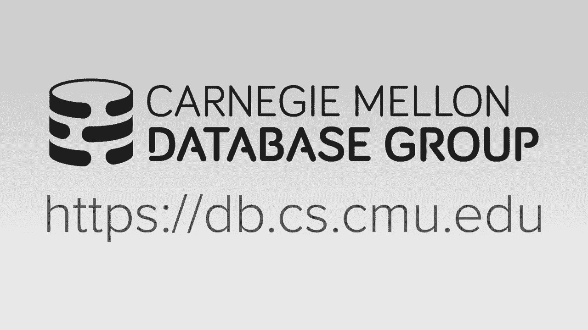
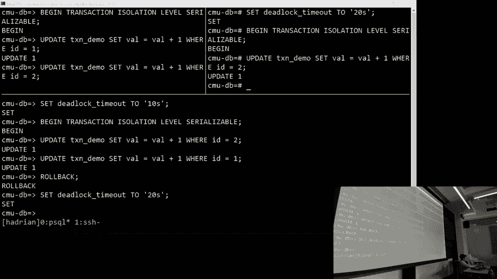
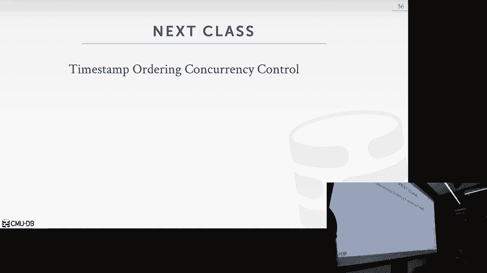

# 【双语字幕+资料下载】CMU 14-455 ｜ 数据库系统导论(2019·完整版) - P17：L17- 两阶段锁定并发控制 - ShowMeAI - BV1qf4y1J7mX

[Music]，so as hopefully you've noticed I'm not，Andy Andy and KB welcomed their first。

child last week everyone's doing well，and we're just we're extremely thrilled。

to see the Andy Pablo parenting，experiment so the clicker stopped。

working so last class Andy talked a lot，about acid properties of transactions。

focusing a lot on isolation in，particular reasoning about whether。

schedules are serializable and we talked，about conflict serializability and view。

serializability and with conflict，serializability we were able to to。

verify whether whether a schedule was，serializable based on being able to swap。

operations around or looking at the，dependency graph and being able to say。

yes this this schedule is serializable，or whether whether it would violate the。

serializability guaranteed and then，there was this other notion of view。

serializability which most applications，are actually no systems really support。

because it's this this concept of being，able to produce results to the。

application that look right to the，application but actually aren't。

serializable as we've defined them it，wouldn't be conflict serializable so i。

think he gave a couple examples one，would be like counting all the number of。

accounts that had a positive balance，while he was shuffling money around。

between the accounts and because the，accounts never dropped negative we got。

the correct result but it wouldn't，technically be a conflict serializable。

schedule I think another one was just，doing blind writes in two accounts and。

because the last write that we cared，about was the one that got executed it。

counts as view serializable but it's not，actually conflict serializable so there。

was a lot of time spent on like how do，you verify these schedules but now we。

want to care about is how do you do this，stuff in real time because。

he's got an example here so an example，of this is not conflict serializable。

because of we have this right on a and，then another read on a unrepeatable read。

this is not conflict serializable so，that's basically what Andy talked about。

in the last lecture I'm gonna try to，make up for time here because we're。

starting a little late so as I was，saying we need a way to do this on the。

fly in a real system we don't get the，full schedules of transactions when。

they're submitted when clients connect，to the database and they start a。

transaction we don't know what the，queries are going to be aa priori so we。

can't look at what the clients going to，do and predict whether their operations。

are going to be serializable or not so，we need a protocol we need a we need a。

system that's going to allow us to，execute these transactions in parallel。

because we want parallelism in the，system but we still need to guarantee。

isolation between these transactions so，I think Andy briefly mentioned this idea。

there are pessimistic approaches and，optimistic approaches today we're going。

to look at two phase locking we're going，to use locks in the system this is a。

pessimistic approach because basically，you're gonna have to ask for permission。

from the system before every operation，so before you can do a read or a write。

on a tuple you're gonna have to ask for，a lock on that object optimistic will。

get too optimistic stuff in the next，couple lectures but today it's all about。

pessimism with locks so this is just a，kind of just a high-level what I was。

just describing an example of before we，can do a read on a we're gonna go to a。

lock manager and say I want to lock on a，this lock managers sort of your central。

authority on on whether you're allowed，to access a tuple or not it maintains。

metadata about who holds locks and and，enforces the the lock protocol in the。

system so tyonne's gonna begin it's，going to request a lock from the lock。

manager on a it gets the lock as no one，else holds it t2 begins let's imagine，we're in a。

Oh threaded environments so we're only，executing one of these transactions。

we're only making progress on one of，these transactions at a time so t1。

begins gets the lock on a we switch to，t2 it begins it wants the lock on a。

because it's eventually going to do a，read and a write down here and it's。

denied by the lock manager because t1，the only thing t2 can do here is stall。

what the behavior is is is kind of up to，the implementation but there's there's。

gonna have to be some sort of stall，because you can't get the lock that you。

want t1 proceeds does its write does its，read releases its lock the lock managers。

now going to basically tell t2 you can，get the lock that you want on a it's。

gonna grant it t2 is going to do it he，it needs to do and then it's gonna it's。

going to release the lock so，conceptually that's how we're gonna use。

locking in the system there's a there's，a little bit more nuance to it than that。

and we'll go through that through the，rest of the lecture make sense we're。

good so today we're gonna we're gonna，look at the lock types first we're gonna。

start with two basic lock types and then，we're gonna get into our first proper，locking。

we're going to talk about how we reason，about deadlocks and how we're gonna。

solve that problem and then we're gonna，introduce the notion of hierarchical。

locking which is going to allow us to，take fewer locks in the system to be a。

little bit more efficient about how we，use locks and then the last thing that。

actually is a mistake we're not gonna，get to isolation levels today he didn't。

make it last year and they're not in，these slides anymore so we'll get to。

isolation levels I think we'll handle，them in the next lecture so I think。

you've seen this slide before and II，presented this this is from work by Gus。

grapha he showed it when you were，talking about protecting concurrent data。

structures with latches so I think，concurrent B plus tree indexes hash。

indexes things like that and I'm pretty，sure this slide exists just to get Dave。

Anderson to stop making fun of us，because he says database people are。

weird for calling locks latches and but，they are distinct terms in our。

world before he was talking about and he，was talking about，like I said laches to protect threads。

from kind of trashing the the memory of，your concurrent data structures today。

we're talking about locks which are，protecting logical constructs in the。

database so things like databases tables，tuples they're designed to protect。

transactions from conflicting with each，other and probably the the key。

distinguishing part is that in with，latches we avoided dead locks with。

programming discipline we were writing，the logic on how these latches were。

acquired with with things like latch，grabbing in the B+ tree how we could。

reason about what the operations were，doing so we knew how to safely acquire。

latches in one order and then make sure，we respected that order and release them。

in the correct order as well to avoid，deadlocks with locks we can't do that。

because we don't know what the what the，transactions are gonna do what queries。

they're gonna run so we need to be able，to handle the clients issuing queries to。

the system that would result in a，deadlock and and we need to talk about。

like what are we gonna do then because，it's it's pretty simple to as well shown。

a demo a little bit later in the lecture，it's pretty easy to put the system into。

a deadlock yeah so like I said we'll，start with two basic lock types we have。

shared locks and exclusive locks shared，locks are used for reads exclusive locks。

are used for writes these are kind of，similar to the readwrite latches I think。

that we're talked about in the，concurrent data structures the。

compatibility matrix kind of represents，if you already have a shared latch can。

you hand out more shared latches to that，yes exclusive latches are more or less。

incompatible with any other latch types，you can't hand out multiple exclusive。

latches you can't hand out an exclusive，latch to something that already has a。

shared latch and that's that's the basic，or excuse me these these locks I。

shouldn't call them latches because Andy，will get mad at me，so the basic semantics of how we're。

going to work with locks is as I was，describing for with that example you're。

gonna go to a lock manager and you're，gonna say hey can I get a lock on this。

object the lock manager is gonna decide，based on its internal metadata whether。

you're allowed to have that lock or not，and then it's up to the transaction to。

release the lock when it's done the，transaction managers or excuse me the。

lock managers not necessarily putting，any sort of constraints on how long。

necessarily you have that lock for so，it's up to the transaction to make sure。

they come back release the locks when，they're done with it and then it updates。

an internal metadata I don't think，there's a there's a Andy's not doing a。

walk manager project this semester we've，done one in the past but like the basic。

implementation is there's an internal，table probably a hash table that keeps。

track of all the possible locks and that，are taken in the system and then as。

requests come in you put them into a，queue you process them off the queue and。

you go forward from there so it's a cool，project but I don't think you're doing。

one this year so let's look at an，example with these shared exclusive。

locks that we defined before so t1，begins it wants to do both a read and a。

write on a so it's going to go straight，for the exclusive lock so it's going to。

go to the lock manager give me the，exclusive lock lock managers like sure。

no one else has a lock on a it's all，yours，t1 completes the operations it needs to。

do on on tuple a releases the lock，because it's done t2 comes along and。

says I want to do a write on a so it，wants the exclusive lock now lock。

managers like sure no one's got that，lock it's all yours，do whatever you want it does it's right。

it unlocks a and then t1 wants to come，back and just do a read so we only need。

a shared lock once again ask the lock，manager give me the law does its。

operation releases the lock so as we，described in the last slide transactions。

are responsible for for locking and，unlocking，the walk managers just kind of here to。

kind of direct traffic and make sure，everyone's doing what they're supposed。

to be doing does anything jump out as a，problem with this schedule what's up。

right it's not isolated so in particular，when t1 at the end does it does another。

read it's it's getting an unrepeatable，read it read tuple a it did a write on a。

but then it goes back and it reads a and，it's actually seeing the the the value。

that t2 wrote so we have an unrepeatable，read anomaly we can't have that so we're。

gonna need to be a little bit smarter，with with with what we do with our locks。

we're going to need a little bit more，discipline and an NA and a protocol。

right so Andy added one more cool，animation to show this is a problem this。

is here's your here's your unrepeatable，read so we're going to use is is a。

protocol called two-phase locking and，it's gonna allow the database system to。

hand out locks in a manner that always，guarantees conflict serializable。

schedules this is a big deal because now，we don't have to try to limit the。

parallelism in the system we can try to，run multiple transactions at the same。

time and we don't need to know what the，transactions are gonna do ahead of time。

to be able to decide if they're conflict，serializable where the system can run we。

can do operations and we can hopefully，get high throughput on transactions。

without generating unci realisable，schedules or violating our isolation。

requirements this is all work that came，out of IBM in mid 70s for the system our。

project it was led by Jim Gray who later，went on to win a Turing Award so this is。

pretty groundbreaking stuff this is at，the time they were building one of the。

first relational database management，systems so there was no textbook on how。

to do this stuff two-phase locking is，what they came up with，turns out it's a pretty good idea most。

so you're probably not surprised to see，that two phase locking has two phases。

there's the growing phase and then，there's the shrinking phase so in the。

growing phase of a transaction it's，allowed to acquire whatever Locke said。

it needs it goes to Locke manager gets，everything that it needs and then it。

performs all of its operations and then，the second it releases a lock tells the。

Locke manager I'm done with this lock，the transaction is now in a shrinking。

phase it is no longer allowed to acquire，anymore locks so in an example we'll see。

how this how this helped us out how this，prevents the anomalies we're concerned。

about and I think yeah so get another，way to think about it is this this。

visualization x-axis is time this is the，lifetime of a single transaction y-axis。

is the number of locks held by that，transaction so in the growing phase it。

can continue to accumulate as many locks，as it needs the second it releases a。

lock it's gonna go into the shrinking，phase you get no more locks so this is。

this is an example of a violation of，two-phase locking because the。

transaction released some locks and I，went back and acquired some more we。

can't have that yeah it it would cause，the same sort of problems we saw in the。

previous example where we had an，unrepeatable read where you release the。

lock when they went back acquired a lock，and and you get anomalies because of。

that so here's an example with with two，phase locking transaction one's gonna。

begin like before it needs an exclusive，lock because it wants to do both a read。

and a write on the tuple it could start，with a shared lock and upgrade it there。

was a notion on an earlier slide of，upgrading we'll talk about upgrading a。

little bit more later in the lecture but，we're gonna start for now with an。

exclusive law goes the lock manager gets，the lock t2 wants the exclusive lock it。

can't have it because t1 still holds it，so we're gonna keep holding onto that。

lock till we're done with all of our，operations we're gonna do the extra read。

that we wanted in t1 then we're gonna，release the lock t2 has been stalled。

this whole time not able to make any，progress because it didn't get the lock，on on。

a lakh managers gonna say ok t2 you get，what you want do you're right and then。

t2 is gonna unlock and then commit so，the great thing about two-phase locking。

is if you follow this protocol you will，get conflict serializable schedules the。

there get the dependency graphs are，guaranteed to be a cyclic this is great。

this is exactly what we want it does，have a slight problem though and that is。

cascading abort so we'll give an example，on the next slide but the idea is it can。

because two phase locking alone does not，guarantee that you don't get dirty reads。

so this is the same schedule as before，we're going to access to different。

tuples we're gonna get the exclusive，lock on a and the exclusive lock at B。

that's because all the way down here，we're gonna do operations on B and we。

have to get all of our locks before we，start unlocking anything because we're。

in two-phase locking so t1 does the，operations it needs releases lock on a。

t2 gets the lock on a does a read and，then also does a write and then t1 abort。

but there's this problem now that t2，read a value that from t1 that is now。

not actually in the system because the，transaction aborted it didn't commit so。

we have this dependency now that because，t1 aborted you now have to abort t2 as。

well because it read a value that isn't，valid anymore so that's what we mean by。

by saying two-phase locking is，susceptible to cascading aborts and this，is this is。

the reason this is a problem is because，you could be wasting a lot of work so t2。

could have you know because it read a，value in t1 it could have done a bunch。

of operations on the system and now，because t2 has to has to abort as well。

you're increasing the complexity of your，rollback logic more and more stuff needs。

to be rolled back in the system just，because one transaction aborted it leads。

to another transaction board you can，kind of see how this could Domino。

through the system if you have a bunch，of transactions running that are。

simultaneously reading values from each，other and then one of boards so another。

thing worth pointing out is this is a，valid schedule under under two-phase，locking。

it's yeah it's basically kind of what I，stated already you can't let information。

from t1 leak to the outside world，because it aborted but it would be a。

permissible schedule under two-phase，locking so we're gonna have to solve。

this somehow and yeah like I said this，is all wasted work t2 could have done a。

bunch of complicated logic and a bunch，of more writes into the system and。

because we have to abort it we wasted a，bunch of time so a couple other a couple。

other things about about two-phase，locking that we want to point out there。

are schedules that are serializable that，two phase locking actually won't allow。

two phase locking is a little bit more I，guess I'll say conservative or yeah。

we'll use that word because there are，serializable schedules that two phase。

locking will try to will we would not be，allowed and because of the locking we're。

gonna limit the concurrency the system，slightly as I mentioned we have this。

problem with with dirty dirty reads that，can lead to cascading aborts we're gonna。

solve that with a modification to two，phase locking called strong strict two。

phase locking it's also called rigorous，two phase locking，the terms are kind of used。

interchangeably I think the textbook，refers to both and we have this other。

problem which is common with a lot of，locking protocols that we can lead to。

dead locks so we're gonna need to solve，that problem with either a detection。

mechanism where we can detect when we，enter into a deadlock State，or some sort of extension of the。

protocol where we prevent ourselves from，ever being able to go into a deadlock。

state so again going back to kind of，what we did with laches with concurrent。

data structures we make sure we acquire，the locks in a very specific way that。

makes it so that we can guarantee we're，never going to enter into a deadlock。

scenario so we're going to tackle the，first one first we're going to talk。

it's sort of a misnomer because the，second phase doesn't really exist。

anymore all strong strict two phase，locking says is you don't release any of。

your locks until the end of the，transaction when you're going to commit。

the growing phase is exactly the same，you keep acquiring locks as you need。

them but you don't release any locks，until commit time and this is going to。

allow us to prevent any unrepeatable or，excuse me any dirty reads from。

propagating across transactions which is，also going to solve the cascading aborts。

problem for us so yeah the figure is，kind of updated but as you can see like。

the shrinking phase it wherever you want，to define it as like the last the last。

lock you acquired is the start of the，shrinking phase but basically there is。

no shrinking phase everything gets，released at once at the end of the。

transaction yeah and the the word，strictness does have a specific meaning。

in when we're talking about concurrency，control it basically means anything that。

you wrote none of your rights are going，to be visible to to any other asset any。

other area of the system any other，transactions things like that until you。

commit so so in this context strict has，a very specific meaning and like I said。

that solves our cascade cascading aborts，problem because no other transactions。

are gonna see values that aren't，committed to the system yet so they're。

only looking at committed data，everyone's happy and and like I，mentioned before this simplifies your。

abort logic because，abortive transactions only have to put，back their values you don't need to。

worry about all these transactions in，the system potentially reading。

uncommitted data and then they each kind，of have to store their own metadata。

almost or methods to be able to roll，back the the work that they've done the。

simplifies things a lot by not having to，system，you only have one undo to do if you if。

you wrote a value so we're gonna look at，a simple example andy owes his bookie。

money I guess so he's gonna move a，hundred dollars to is to his bookies。

account and then the second transaction，is just gonna gonna compute the sum this。

echo command is is made up it's not a，real statement he just wants to。

demonstrate that you're reading these，values out we could have done something。

more complicated but we want to keep the，example fairly simple first we're gonna。

look at it with I think just basic，walking then two-phase locking and then。

strong strict tooth days locking so with，the two locks that we defined at the。

beginning and we're not if we're not，using two phase locking we can see。

spoiler alert you're gonna get a you're，gonna get a wrong output from this so。

we're start with a thousand dollars in，each account t1 already gets the。

exclusive lock does a read because it，needs to decrement his his balance by a。

hundred bucks t2 wants to get the shared，lock because it's trying to compute the。

sum it can't get it so it just starts，waiting t1 finishes his operation to。

decrement unlocks a at that time t2 gets，the lock on a and performs its read and。

then unlocks it because again we're not，in two phase locking here so you're free。

to acquire and release locks as you need，them it also t2 also gets the shared。

lock on B because it needs to do a write，on that which leads t1 to stall because。

it can't do the operation or it can't，access that tuple yet eventually t2。

releases the lock t1 gets the lock on B，finishes moving the money over to the。

bookies account unlocks commits and t2，gives us a wrong output because。

did it read an inconsistent state it，read harsh part of the work that t1 had。

done and t1 leaked that information to，the rest of the system and said okay。

this bank account balances 900 bucks but，it that hundred dollars was missing at。

that point when t2 came along and got，so with two-phase locking the key the。

key thing to notice here is it starts，the same t1 gets its exclusive walk on a。

performs the operation it needs but，before it unlocks a which would put it。

into the shrinking phase it acquires the，lock it needs on B all the way down here。

so it gets the exclusive lock on b t2，stuck waiting around waiting for the。

locks that it needs because this isn't，strong strict two-phase locking。

t1 actually unlocks it well yeah if this，were strong strict it would it would be。

down here at commit time so it unlocks a，finishes this operation on on object B。

and then releases the locks and this，actually gives us a correct output same。

example with strong trick two-phase，walking like I said the unlocking。

happens at the end right before commit，so yeah t1 gets its lock t2 has to wait。

the entire time you can sort of see how，strong strict two-phase locking is。

effectively forcing a serial ordering，for these transactions by basically。

acquiring all your locks holding on to，them until you get to commit time you're。

guaranteeing that that any of the，operations that that t2 would have that。

would conflict are going to be forced in，a serial ordering make sense I'll go，with yes。

and then the correct output again as，well so I think I think Andy showed this。

slide before in the universe of，schedules，he showed cereal schedules conflict。

serializable schedules you serializable，and then I don't know if he had。

cascading aborts in there so this slide，actually I think is he mentions it last。

year is actually incomplete what he，meant to show is where two-phase walking。

and strong strict two phase locking live，in this hierarchy and I'll see if I can。

at least use the laser pointer because a，clicker doesn't seem to be doing，anything nope。

so two-phase locking is gonna live in，kind of this area right here it's。

guaranteed to generate conflict，serializable schedules but it's going to。

be susceptible to cascading aborts I'll，see if we can get this slide updated for。

the ones that actually get published on，the site so we actually see better than。

just a laser pointer on the video but，yeah two phase locking would be here and。

then inside of this box and a round，serial you would have strong trick。

two-phase locking because it's，guaranteed not to have cascading aborts。

we get conflict serializable schedules，we're happy makes sense so now let's。

talk about the other problem with，two-phase locking which is that it leads。

to dead locks and like I mentioned，before there's a couple different ways。

we can try to solve this problem we can，be kind of lazy about it and wait use a。

detection algorithm to to find a，deadlock or we can kind of be a little。

bit more proactive about things and try，to prevent them from ever happening in。

the first place so you've probably seen，dead locks before it's a it's a fairly。

common concept in computer systems but，we'll give a basic example anyway so t1。

wants an exclusive lock on a block，managers like sure you can have that no。

one else has that lock t2 gets the lock，on B because no one else has that lock。

now t2 says I want the lock on a block，managers like no，you don't get that but t2 is gonna sit。

around and wait for that lock and t1 now，wants the exclusive lock on B and it's。

gonna wait as well we have a problem now，both these transactions are waiting for。

locks that the other transaction holds，so we need to break this somehow yeah。

nice animation we have a problem yeah so，like I said deadlocks are a when you。

have a dependency cycle between between，transactions with where they're holding。

locks and and we have a couple ways of，dealing with them detection and。

prevention here so with deadlock，detection with the systems gonna do with。

like a background thread is you're，basically gonna look at the lock。

managers metadata and you're gonna build，a waits for graph so ideas every node is。

it is a transaction and every edge is a，is pointing to another node that that。

holds a lock that that transaction wants，this is all going to be done in the。

background you can balance out how，frequently this gets done we'll talk。

about that in a minute but the idea is，it's a background task that inspects the。

state of the lock manager and says hey，are there any deadlocks use your。

favorite cycle detection algorithm and，you have to decide what you're then。

gonna do with that deadlock so let's，look at a simple example of what these。

we'll start with T one wants a shared，lock that T two already holds on holds。

an exclusive lock for so T one gets an，edge pointing to T 2 T 2 is going to end。

up with an edge pointing to t 3 because，as you can see here it wants an。

exclusive lock that T 3 already holds a，shared lock on those are incompatible so。

we're just stuck waiting and then lastly，T 3 is gonna end up with an edge。

pointing to T 1 because it wants an，exclusive lock that T 1 has a shared，lock on we have。

a deadlock so we have to do something，so deadlock handling is kind of simple。

pick a victim kill it you choose a，transaction and you roll it back how far。

you roll that back is a kind of，implementation to find it's possible you。

don't and I think this is this is a，later slide but you may not have to to。

abort the entire transaction may not，have to undo all the queries that it did。

you maybe only you may only need to，partially rollback some of the queries。

to release the locks that you need to，relate to to remove the deadlock and。

make forward progress in the system the，the last point here is basically saying。

that you have a trade-off in the system，with how frequently you're gonna build。

these weights for graphs if you're if，the way you're dealing with deadlocks。

is detection you have this background，task it's building these graphs checking。

for deadlocks it's up to you how，frequently you want that task done you。

could do it every microsecond if you，want but you're gonna burn a bunch of。

CPU cycles constantly building these，graphs and potentially not finding any。

any deadlocks so what you may want to，reason about is okay maybe I want to。

check for deadlocks less frequently and，if I do enter in a deadlock state you。

know how long do I want to make those，transactions wait what's an acceptable。

time out that I could sit in a deadlock，state without detecting it right away。

so these are these are always going to，be tunable parameters in your database。

system because different workloads are，gonna manifest different deadlock。

behaviors so we want to make sure we're，not being too aggressive it may be fine。

just to leave the system in a deadlock，state for for ten seconds even but it。

depends on on what the responsiveness of，so victim selection there's a lot of。

different things you can look at here，and and certain systems get get very。

there's all sorts of different，heuristics you can look at the first is。

look at look at the age of the，transaction when you're trying to find a。

victim that you're going to kill because，at the end of the day you have this。

cycle you got to pick one you can start，with the timestamp you can look about。

how much work it's done how many how，many queries has it executed how big。

progress is a you don't know how close，it is being done but you can least。

reason about how much work it's done how，many locks it already holds that's it's。

possible that you would have to look at，the number of transactions you have to。

roll back that would be in the case of，if you have cascading abort。

I don't think I mentioned before you，locking，some systems may just do two-phase。

locking and live with the possibility of，a cascading abort again it's gonna be。

workload dependant you can decide if the，workload is not very susceptible to。

cascading aborts or dirty reads you can，just say two-phase locking is fine I can。

release my lock sooner that may result，in higher throughput in the system again。

that's often gonna be something that，that's configurable yeah so we'll talk。

about a couple different ways to decide，a little bit later on about about which。

transaction gets killed there there are，a couple different solutions but but but。

the other one is is the yeah this is，typically going to be a combination of。

things it's not necessarily always going，to be just the age of the transaction is。

going to be what determines whether you，get killed or not often one of the one。

of the biggest things is going to be the，number of times you've already been。

killed which is yeah then the last one，says there because you do want to make。

sure you make progress in the system you，need to prevent starvation for these，transactions。

and I'm not saying like any one of these，is exactly what you're going to use to。

kill a transaction the the commercial，systems get rather elaborate and can。

build predictive models even to try to，figure out like which transaction they。

should try to kill and answer a deadlock，scenario based on all these different。

heuristics so it's typically a，combination it's not it's not just the。

timestamp I guess is a long way of，answering hopefully your question okay。

so your question is why would you sorry，I want to make sure I repeat back for。

the video your question is why would you，always want to kill in what scenarios。

would you want to kill the transaction，with the lowest timestamp always yeah I。

suspect it's it's still always going to，depend on the workload depending on。

what's causing the deadlock what sort of，a situation is causing it but yeah we'll。

formalize a little bit like in a few，slides on what gets killed and and why。

but I think in the case of Postgres in，the example we'll see the highest time。

stamp gets killed I think I think it's，just it's just an example I'm just。

saying like one you're a stick you could，like I mentioned before it's possible。

you don't need to abort the entire，transaction you could completely abort。

it or you could do some sort of minimal，abort where you only rollback the number。

of queries in that transaction that will，allow you to release the deadlock and。

make forward progress in the system，again this is something that's going to。

depend on the workload how much work，you're throwing away and whether it just。

makes sense to have transactions，resubmit all their queries or if you can。

slowly unwind parts of it in order to to，free the system up in the deadlock and。

make forward progress let's see if we。

can get a demo working pardon my typing，on this surface keyboard cool looks like。

it's working so we'll start with my，sequel we'll have two terminals open we。

have a pretty basic table set up called，transaction demo that's horrible you。

can't see what's happening there but，basically we have two tuples in it。

primary key ID one and two and the，values 100 and 200 pretty simple we have。

two tuples this should be really easy to，put to put us into a deadlock State so I。

have no idea which ones those are if you，press all the buttons。

I'm glad I was standing next to you we，so we've got these these two tuples in。

our table transaction demo first thing，so like I was saying before you can。

adjust things like like how frequently，you're gonna detect for deadlocks so in。

this case we're gonna try to change the，the lock wait time out here you know DB。

is the storage engine for my sequel as，of I don't know my sequel five I think，or something like that。

so the first terminal will begin a，transaction the first thing we're gonna。

do is try to update the value of tuple，one oh actually I missed a step。

we need to explicitly tell my sequel we，want to run in the serializable。

isolation level so that's going to give，us conflict serializable schedules we。

haven't talked about isolation levels，yet like I said I think that's going to。

be in the next lecture but we need to we，need to tell the system we want。

serializable isolation level go back，begin our transaction and we're gonna。

like I said update the value on tuple，one switch to our other terminal we're。

going to start a transaction we're going，so so far no conflicts yet t1 holds a。

walk-on tuple 1 t2 holds a lock on tuple，two we're gonna go back to two。

transaction 1 here and we're gonna say，okay I want to update the value on where。

IDs 2 and it just waits all I can do is，stall it's waiting for the lock and then。

we can go back to t2 and say I want，update the value on one t1 holds that。

walk already we should get a deadlock，and sure enough we get a deadlock my。

not a ton of debugging information but，deadlock sound while trying to get the。

lock try restarting the application and，you'll notice that t1 which was waiting。

for the lock on on value 2 as soon as it，does the system detected a deadlock with。

t2 it killed that transaction t1 got the，what do you mean why there was no I。

there was no isolation we can check so，I'm just gonna kill but I'm gonna roll。

both of these back and we'll begin and，[Music]，we're gonna update the value in ID 1。

we'll go down to t2 begin a transaction，update the value or ID is 2 and then。

we're gonna just do a select star from，transaction demo in t1 ah so it can't。

get the latch or excuse me the lock and，it's just gonna it's just gonna hang。

if we do a rollback we see that the，value t2 was never written to the table。

because it didn't commit and t1 was able，to make its forward progress by getting。

the shared lock cool good question yeah，yeah I mean in practice you're probably。

gonna see strong strict two-phase，walking because the system can't reason。

about whether it should sort of eagerly，start releasing laws because it doesn't。

know what what the client's gonna do，next so you could but I don't think any。

systems do this you could speculate，about starting to release locks early。

but you might get it wrong and we we，can't be wrong like we have to make sure。

we guarantee these these isolation，guarantees sure well that's that's not。

actually true so like like I said we'll，talk about isolation levels in the next。

lecture too there are scenarios where，you may be willing to run with with。

lower isolation guarantees and you can，start to introduce certain anomalies。

back into the system if you are，comfortable with them or if at the。

application layer you have your own，logic to reason about that sort of stuff。

you can lower isolation guarantees if it，yeah strong so strong trick strong。

strict two-phase locking or rigorous，two-phase locking is one we need to use。

if we want to guarantee we don't get any，dirty reads that could result in。

so that's my sequel we can take a look，similar demo Postgres there is one other。

cool thing we can do here so we're going，to set the deadlock timeout to 10。

seconds the demo itself is is let me，just make sure I created this table cool。

same table exists two values with，Postgres we can actually we're going to。

begin each transaction by saying we want，isolation level serializable as you can。

actually it's not not necessarily a，session wide setting you can actually。

add a transaction granularity define，which isolation level you want to run at。

and again I keep saying isolation levels，we'll talk about that in a future。

lecture t1 is going to begin Oh already，begin that's right we're just gonna do。

the same operation we're gonna update，value or ID is 1 we're gonna go down。

here do the same thing where value，equals 2 go back to t1 try to update 2。

we wait looking for the lock that we，don't have yet and then we're gonna。

force a deadlock by asking t2 to update，the value related to 1 and there was a。

slight lag there I don't know if you saw，it but it compared to my sequel which。

instantly it was like this is a deadlock，Postgres kind of waited a little bit。

before it was it yelled at us and said，hey you have a deadlock in the system so。

like I said these are tunable parameters，you can you can adjust how aggressive。

the database systems gonna be with with，looking for dead logs。

Postgres gives us a lot more information，it tells us exactly which process was。

waiting for what kind of lock held by，another transaction which is another。

Postgres I think this is this is a big，reason and he loves referring to。

Postgres because it's basically a text，book in，the wording you get back out of the。

system is exactly what you would see out，of a database textbook and kind of the。

behavior that would help us kind of，understand what's going on here there's。

one more thing we can try and getting，low on time but I will do one more thing。

I'm going to set the timeout to 20，seconds because there's one more thing。

we want to try to see let's see if I can，get one more terminal cool hopefully。

this still plays it may be tough the，deadlock timeout do the same thing begin。

transaction and serializable on to the，terminals this is going to be slight。

race against the deadlock detection，algorithm so what I try to do here is is。

demonstrate some of the internal，and how it's tracking these sorts of。

things do that and did my team accession，this still have a connection no。

interesting well that's that demo cool，we're a long time anyway but the idea is。

if we'd been able to put the system into，a deadlock state I was going to query。

the catalog and it was gonna be able to，show which transactions were holding。

locks which locks they're waiting on，which transactions and processes those，belong to。

Postgres is great let's go back to this，stuff so like we talked about before the。

alternative to doing a detection，algorithm is to prevent yourself from。

other going ever going into a deadlock，State in the first place if we can come。

up with some sort of system that，prevents this from happening we don't。

never need to build weights for graphs，we don't need this background task that。

that then needs to make decisions about，which process we're gonna kill and or。

which transaction we're gonna kill and I，suspect this is probably what my sequel。

was doing because my sequel immediately，yelled at us that we had a deadlock or。

immediately detected it didn't prevent，the deadlock but it immediately detected。

it as opposed to the Postgres which kind，of had a bit of a lag to it with with。

the detection so a very simple way to do，this is to assign priorities based on。

timestamp so older transactions are，considered higher priority and then you。

kind of have two different protocols you，can follow you have this wait die system。

which basically just means old，transactions wait for young transactions。

so if the requesting transaction has a，higher priority it's gonna for a been a。

holding transaction so holding，transaction is younger than it but the。

older transaction wants its lock then，the requesting transaction is just gonna。

sit around and wait otherwise the the，requesting transaction is going to abort。

the other system is called wound weight，you can think of it as young waits for。

the old requesting transactions，they have a higher priority than the，holding transaction the holding。

transaction of boards so basically the，requesting transaction comes in steals。

your lock and makes forward progress，alternatively the requesting transaction。

just wait so this is probably confusing，it's it's a little bit clearer I think。

on an example on the next slide so we，have these two scenarios these two。

schedules we want to look at we'll look，at the first one first t1 and t2 t1。

begins first so t1 is gonna have the，higher priority than t2 the t2 gets the。

lock first so t2 gets an exclusive lock，on a t1 wants the exclusive lock on a。

it's the older transaction it has higher，priority so underweight die T one's。

gonna wait for that lock and under wound，weight T t1 is basically going to come。

in kill T to steal it's lunch money and，t2 has to restart or whatever it needs。

to do whatever the application needs to，do with that applicate transaction in。

the second schedule t1 once again begins，before t2 so it has an older timestamp。

it's higher priority but it got the lock，first t2 wants that lock under weight。

die t2 is gonna abort and under wound，weight t2 is just gonna wait so what。

these two policies are doing is they're，basically defining the same sort of。

logic that we used for latching and，concurrent data structures where this。

concept of we only take latches in one，direction and we release them in in in a。

discipline manner as well like if you，can apply some sort of ordering to how。

you acquire your locks which is，effectively what this is doing you you。

can avoid deadlocks entirely so one's，weight dies basically saying okay we're。

gonna we're gonna order our timestamps，in one direction and how we hand out。

locks and then in moon weight it's，basically just the opposite as long as。

we're consistent you can't mix these，things if you start mixing them you're。

gonna get dead locks in why you're even，doing this because then you would need a。

deadlock detection algorithm and，you you you didn't solve any problems so。

the question is why is this called wound，weight as opposed to some sort of。

opposite of weight die I have no idea I，really don't like the naming of this I。

find it very confusing yeah if you're，confusing but if yeah if you're confused。

by the naming I I'm with you I think，that's why Andy kind of adds this just。

sort of simplification of like old，weights for young or young weights for。

old because yeah wait die wound wait，it's it's a weird nomenclature any other。

questions so this was sort of what I was，talking about before these schemes。

guarantee no deadlocks cuz you're，basically enforcing walks being handed。

out in a single direction or locks even，being able to be stolen in a single。

direction so if yeah we've talked about，this already so when a transaction。

restarts what would its new priority be，it's got to be the original any guesses。

why if you have a transaction you start，and then it gets killed by another。

transaction coming in let's say because，it's priority will increase the older it。

is you want to maintain its age yeah，sure as opposed to just resetting of age。

right so in that's right，in one word starvation we can't have we。

can't have transactions being starved so，when you restart the transaction we want。

to make sure it's still used with the，same timestamp so that eventually with。

with which it which Eve which ever，deadlock prevention ordering we're going。

with we want to make sure progress gets，so we have ten minutes so this is we'll。

see how far we get like so far this，doesn't seem very efficient like what if。

we have a transaction that needs to，update a billion tuples we're gonna lock。

manager a billion times like going to，the lock manager is not cheap you're not。

implementing one this semester but you，can envision if you had to implement。

this in a system you're going to need，data structures that are protected by。

latches it has to be concurrent it's on，the critical path of what every。

transaction is doing we can't make all，these trips to the lock manager so what。

we're going to try to do is introduce，some some sort of hierarchy or grant or。

change the granularity or allow，different granularity of locks in the。

system so we can apply locks - tuples，pages tables you if you if you knew you。

needed to do a billion updates on a，single table maybe it makes sense to。

just ask for the single exclusive lock，on the entire table you are going to。

prevent other transactions from，accessing it but maybe that's what you。

want to do the goal is to reduce the，number of total trips to the lock。

manager possible by using this，hierarchical model so to do that we're。

gonna have to introduce a few more lock，types and then this notion of a。

hierarchy so conceptually like I was，describing you can now take locks at。

different levels in the system so，database can have multiple tables。

different tables can have multiple，tuples and within different tuples you。

can have multiple attributes so you want，to acquire the fewest number of locks。

possible to do the work that you need to，do so if T 1 takes the lock on table 1。

it if it if it explicitly takes a lock，on table 1 it now implicitly locks。

everything below it in the in this tree，this trees again it's a slightly。

abstract concept concept this isn't like，a B+ tree or something like that it's。

just in the hierarchy of the database，system of all the tables and tuples。

you've inserted into the system it's，sort of a conceptual hierarchy in the。

so Andy's trying to get the balance of，his shady offshore bank account and he's。

giving me 1% interest at the same time，cool this is sort of demonstrating in。

this this conceptual tree that we have，what sort of locks do we need to need to。

take we need all sorts of different，types of locks we need exclusive locks。

because my bank account balance is，changing Andy's gonna need shared locks。

and then there's this notion of an，intention lock which i think is defined。

on the next slide you basically give，hints in this tree you basically take。

intention locks at higher levels to give，hints to other transactions about what。

you're doing in lower levels of the，system that's gonna try to increase the。

the parallelism of the system so like I，said an intention lock is is a is a hint。

other transactions and and it'll get，clearer with it with an example but the。

basic idea like if you have an intention，shared lock in this tree the subtree。

rooted at that node there is an explicit，shared lock somewhere underneath that。

same thing with with an intention，exclusive lock somewhere in that subtree。

rooted at that in that node there's an，explicit exclusive lock we're gonna add。

three more lock types intention shared，which is like I described somewhere in。

the subtree rooted at that node there's，an explicit shared lock intention。

exclusive same idea somewhere in that，subtree there's an explicit exclusive。

lock and then there's one kind of tricky，one shared intention exclusive this is。

an explicit shared lock on this node，which means that so you have shared lock。

on everything below it in its subtree，and somewhere in that subtree you also。

have an explicit exclusive lock so you，can imagine if you wanted to do a read。

on an entire table and then maybe update，one value you would get a shared。

intention exclusive on that table，because you're gonna take a shared lock。

on the entire table and say I'm reading，tape，but I'm only gonna update one value so。

you have an exclusive lock on one tuple，further down it'll make more sense with。

with an actual example I think but are，there any questions first example our。

compatibility matrix gets a little bit，more complicated not a lot to say about。

this other than I think the tree，actually seeing an example is a little。

bit more clear but basically the，semantics are similar to to share an。

exclusive walk compatibility just apply，do it to a tree the LOC protocol is。

basically just saying in order to get a，shared lock you have to hint at least in。

the parent node that you have an，intention shared lock same thing with。

exclusive to get an exclusive intention，exclusive shared intention exclusive you。

have to hold an intention exclusive on，the parent node again let's let's do an。

example because I think that's going to，make things a little bit clearer we have。

five minutes very simple table or a very，simple example two levels there's a。

table there's a bunch of tuples we want，to check andis bank account he wants to。

do a read on tuple one so he he wants，he's gonna want just a shared lock on。

this one to do a read but we're gonna，have to take an intention shared at the。

parent node first basically as a hint to，say hey below this node I'm gonna take。

an explicit shared lock t2 comes along，we want to update my bank balance by one。

percent so we want an explicit exclusive，lock on this tuple so we're gonna try to。

get yeah we get our intention exclusive，lock on the on the parent node and we。

get our exclusive lock on the individual，tuple now things will get a little bit。

more interesting I think t1 is basically，doing the scenario I described before。

where you're going to do a bunch of，reads and then you're going to update，one tuple。

t-too is gonna read a single tuple t3 is，going to scan all of them I apologize。

for going a little fast I realize this，is probably a little confusing but we're。

getting a long time so t1 like I said it，wants to read all the tuples and do an。

update on one so it's gonna get a shared，intention exclusive this means I'm。

taking a shared lock on the entire table，so I can read all the attributes they're。

in all the tuples in this table and the，intention exclusive part means I'm gonna。

update at least one of these tuples down，there in this case it's tuple n so。

because this is shared intention，exclusive all these tuples are，implicitly locked in shared mode and。

then this is the only one we actually，have to take an explicit exclusive lock。

on because that's the only one being，updated t2 wants to read a single tuple。

we're gonna need the shared shared lock，on this guy which means we need。

intention shared at this level that's，all good we can do that the last。

transaction is the one that's gonna have，problems it wants to do a read on all of。

them it's gonna want to shared exclusive，shared law excuse me explicit shared，lock on the table。

can't get that because it's not going to，be compatible with the shared intention。

exclusive because there's a write，happening lower on lower in the table t3。

has to wait so basically it wants this，have that，all can do is wait so I may have gone。

too quickly the the example operations，changed when I got to this one with。

three transactions this is no longer，doing like the read Andy's Bakic out。

bump my account balance by 1% tyonne's，reading all of the tuples and then，modifying one t2。

was just doing a read on a single one，and then t3 is the one that's trying to。

read the entire table so yeah it's a，different example I'm sorry about that。

if I went kind of quickly so in practice，it seemed complicated but it's actually。

pretty helpful because you can reduce，the number of locks that go or the。

number of trips to the lock manager you，you reduce the number of lock requests。

dramatically and like we mentioned，before there's this concept of lock。

escalation so if you already have locks，and shared mode you want to bump them to。

exclusive locks because you've decided，you want to do it right on the tuple you。

can do that once again this is this is，designed to reduce the number of trips。

the lock manager and also doesn't，violate two-phase locking because you。

can upgrade your locks you don't，actually release the lock so in practice。

in real systems you you're not sitting，there telling it which tuples to lock。

you can give hints like I said if you，know you're gonna do a bunch of。

operations on a on a table and you you，want to hold the lock the entire time。

you you can't explicitly lock the table，so it's not part of the sequel standard。

but here's examples on how to do it in，like Postgres Oracle db2 sequel my。

sequel these guys all use the，nomenclature that we're learning about。

now which is shared and exclusive and，because my sequel loves to be different。

they call them read and write blocks，because they want to be different。

there's also this notion of select for，updates so if you're doing a read on a。

tuple that you eventually want to update，you can give a hint to the database。

system that says look I know because，you're doing a read you're gonna request。

a shared lock I'm gonna do a write later，on just take the exclusive lock now and。

hold it for me so you can you can do，select and add this for update that。

basically tells the system take the take，the right lock or excuse me take the。

exclusive lock right now and you can，also tell it just to take a shared lock。

I don't know why you would ever do that，because by default it probably should。

just take a shared lock if you're doing，to finish things up like the slide says。

it's used in almost every system out，there at least most convert most most。

widely deployed to commercial systems，sequel server my sequel Postgres to。

phase locking is is big deal but it's，also not too difficult to implement and。

it gives us exactly what we want gives，us our serializable schedules we just。

have to be disciplined about whether，we're gonna try to detect our deadlocks。

and handle them or we're gonna try to，prevent them entirely in the first place。

next class I think it's going to be Dana，talking to you guys about time stamp。

he's wixi nights in my system cracking，up I'm blessed，let's go get the next one then get over。

the sofa dressed now good never be son，ricochet jelly hit the deli for a boat。

one naturally bless ya what rappers like，the laser beam the balls in the bush。

Sena ka-ching wrap the bottle of us a，nice sympathy go don't feel like。

drinking a pony - you drunk you can't，drop you at the stake don't know you。

