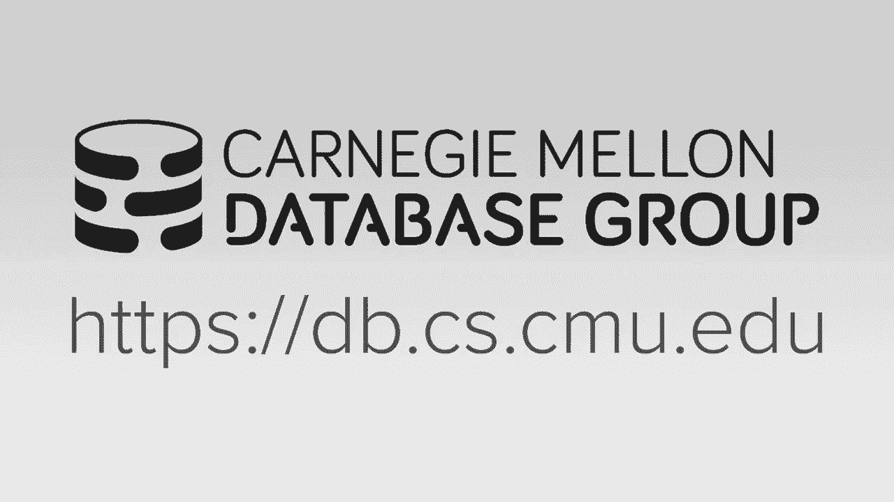
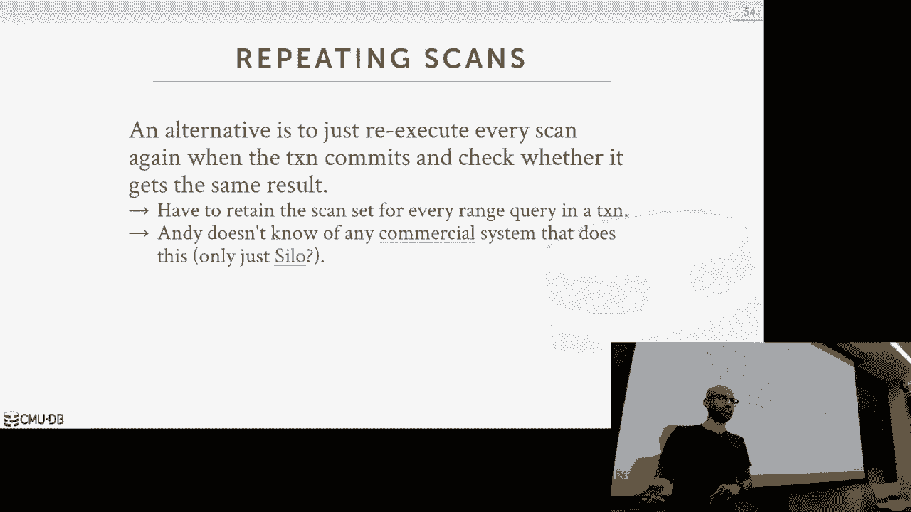

# 【双语字幕+资料下载】CMU 14-455 ｜ 数据库系统导论(2019·完整版) - P18：L18- 时间戳排序并发控制 - ShowMeAI - BV1qf4y1J7mX

去吧。

对上一课，我想马特涵盖了两相锁定，嗯，和两件式锁定，是数据库可以用来，本质上在运行时生成可序列化的计划，它依靠锁来做到这一点，今天，我们将讨论一系列协议，不要依赖锁，而是在高水平上依赖于时间戳。

也许有一个好的方式来思考这个问题，就是两相锁定，嗯，假设会有很多争论，在数据库中执行的事务的内部，对呀，所以如果有很多争论，那么这显然是有利的，嗯，要有防御性，拿很多锁，因此，无论何时。

您都可以读取或写入数据库对象，你获得这些锁，所以从这个意义上说，这是相当悲观的，另一方面，您可以将基于时间戳排序的技术视为更乐观的技术，对呀，您允许数据库在不实际获取锁的情况下操作和读写数据。

在一天结束的时候，你有点，你能够正确地调和正确的，一天结束时可序列化的时间表，我们将讨论这实际上是如何在数据库内部完成的，实际上会有两个时间戳排序协议，我们将在这节课中讨论。

其中一种实际上被称为时间戳排序或基本时间戳排序，另一个将被称为乐观并发控制，这是一个，这有点令人困惑，因为他们都很乐观，而且都在按时间戳排序，这只是社区想出的术语，嗯，所有的权利，所以让我们开始吧。

这些基于时间戳的协议的基本思想是，这是数据库可以使用的一种机制，为预定义的时间戳分配数值，这些事务的提交顺序，你可以假设这里会有一个新函数，调用TS，它给定一个事务，给您该事务的时间戳，因此。

数据库试图保证的是，如果一个事务，ti的时间戳小于事务tj，然后在串行时间表中，就好像TI在TJ之前发生在数据库中，好的，那么这个是怎么做的呢，这些时间戳是什么，看起来时间戳是一种独特的数值。

它们有几个有趣的特征，这些特征是数据库必须维护的，第一个是这些时间戳必须单调地增加，好的，所以它们必须总是在时间上前进，在时间上增加，第二件事是它们必须是独特的价值观对吧。

所以你可以有两个事务有相同的时间戳，因为这种单调增加的特性，所以再一次，假设数据库现在有了这个新功能，这个TS函数能够接受事务，ID并将该事务的时间戳返回给您，这些不同的时间戳协议有不同的机制。

和时间点，他们实际上将这些时间戳分配给事务，一个重要的特点就是，这些时间戳不一定要与挂钟时间相对应，嗯，因为它可以在事务执行期间的任何时候分配给事务，当它进入系统时。

即使是在它即将承诺的时候也不一定是对的，所以不同的协议有不同的机制，它们实际为事务分配时间戳的时间点和时间点，嗯，有一个，有几种不同的方法，您实际上为事务提供了时间戳，好吧，我已经列出了这个。

这里列出了几个，你能做的最简单的事情就是问CPU，呃，好的，当前时间是多少，对呀，因为时间总是在增加，你可以假设这种是有道理的，但是有一个，有一些缺点，有人能想到使用挂钟时间的一些缺点吗，或者实时的。

作为时间戳，是啊，是啊，呃，我们不确定计算机的时间是否正确，所以这并不重要，只要你要去同一台电脑，只要时间，时间单调增加，那你应该没事，对呀，所以这是一个很好的观点，对呀，因此。

如果您有分布式分布式数据库，那么很难保持这些时间点的同步，使用挂钟时间还有什么问题？不是单调增加，你可以把这个，你可以让时光倒流，你什么时候会让时光倒流，可能是因为同步的类型，你的电脑肯定，是啊，是啊。

所以实际的花岗岩粒度可能会有一些偏差，你跟踪时间还有另一个可能的缺点吗，是啊，是啊，你必须保留所有的时间戳，而不是像说一个事件一样，是不是，然后一个，一个事件二，然后三。

你真的不需要跟踪它之间有多长时间，这些事件中的每一个，跟踪这些数据，你可能不会这么说，你实际上不必保持时间的持续时间，你只需要一点，就像这是时间点，一个时间点2，而且还在增加，所以不一定是按持续时间。

只是一个时间点，好的，所以一个线索是它将在这个周末发生，是啊，是啊，完全正确是的，所以他们喜欢，日光似乎是对的，所以你可能知道你在周末做手术，然后随机，在一个，在随机点，你的时钟回到一个小时前。

你的时间戳几乎完蛋了，另一个选择是使用这些逻辑计数器，所以你可以考虑在CPU中有一个寄存器寄存器，致力于单调地单调地增加32位，64位值，有什么缺点吗，是啊，是啊，所以分布方面仍然是一个重要的因素，嗯。

但假设CPU有一个计数器，在不需要锁的情况下增加它真的很快，就像你可以做一个原子加法或类似的事情，使用这个逻辑计数器有什么问题吗，所以我说的是3个2比特或者64比特，如果用完三个2位值会发生什么。

然后你饱和你的版本，你向右回滚，所以你的计数器现在是时光倒流，所以这是这种方法的问题之一，所以大多数系统实际上使用这种混合方法，这就像是生理上的事情，它与物理计数器和逻辑计数器都匹配，确保一切顺利。

你能解释一下这个问题吗？系统，所以系统时钟，一个问题是你有夏令时对吧，所以在某个时间点，有一天就像，说夏令时发生在你的时间，时光倒流，或者后退一个小时，所以现在你的时间不是单调地增加，时光倒流。

好让你们大致了解一下今天的议程，所以我们将讨论一种叫做基本时间戳排序协议的东西，然后我们将讨论乐观并发协议，这也是一个基于时间戳的协议，然后我们将讨论基于分区的时间戳登机协议，那个，缓解了一些瓶颈。

定期时间戳登机协议，然后我们将讨论隔离水平，好的，所以让我们开始吧，所以有了这些时间排序方案，一般的想法是您希望事务在系统中进行，读取和写入对象而不实际获取锁，好的，使这成为可能，你知道的。

您必须向所有数据库对象添加一些额外的元数据才能做到这一点，特别是，您必须为每个元组添加两个额外的时间戳，在系统中，您必须添加读取时间戳，表示事务的时间戳，读取此项目的最近事务，和正确的时间戳。

它是写入此元组的最近事务的时间戳，并在系统中，然后作为一个事务是通过它的操作，它只是要确保它实际上可以读取这个元组，通过利用与此元组关联的时间戳，好吧，我会谈谈这是如何做到的，所以阅读，有一个不变量。

你必须确保，在实际允许从数据库系统读取值之前，您必须确保时间戳，因此，您可以读取您自己的此事务时间戳ti，你必须确保它少于正确的时间戳，对于系统中的这个元组，好的，这有道理吗，那是什么意思我，就是说。

这基本上是为了确保，没有其他事务写入系统，是啊，是啊，系统中没有其他事务，它被写进了这个元组，应该读你的，但谁是谁是谁，您没有从未来读取元组的值，对呀，以便将来有一个事务事务被覆盖，数据库值，嗯。

你现在应该读，这基本上是，那是个问题，当这种情况发生时，你基本上必须中止，当你中止时，您必须确保从较新的事务开始，一个比你有的新的时间戳，当您最初开始事务时。

每个人都明白为什么你需要分配一个更新的时间戳吗，如果你有和以前一样的时间戳会发生什么，你会遇到同样的问题，你有权利，这是因为你必须确保时间戳单调地增加，您必须获得一个新的时间戳来避免这个问题。

你有没有遇到过问题，如果最后是你的时间戳，就像，你不要试图给同一个地址写两封信，与当前时间戳相同的时间戳，所以如果您的时间戳与正确的时间戳相同，那是什么意思，也就是说你，大家可以看一下，你可以读对。

它应该重复阅读，那完全没问题，当我们谈论，呃，交易时间，当你开始概念的时候，什么都不重要，所以在这个方案中，开始时分配时间戳，那是开始交易的时候，好的，所以说，如果此不变量无效，你基本上必须中止。

但另一方面，嗯，如果你真的被允许执行读取，那你，呃，为此修改读取时间戳，对于这个元组，以获取当前读取时间戳的最大值，你自己的时间戳是多少，有人知道你为什么要最大限度地，好的，时间戳必须是单调递增的速率。

您可能有一个比更新读取时间戳更新的事务，但你不能把时间戳倒退回你曾经的样子，因为你年纪大了，正确的时间戳必须单调地增加，所以你必须在这个时候最大限度地，当你读它的时候，你自己的时间戳是什么，这很重要。

好的，所以一旦你更新了时间戳，您现在必须将此元组复制到某个本地私有工作区中，那只对你可见，这样您就可以确保获得可重复的读取，为什么我们要中止TI，我们从较新的时间步长开始，如果你发现它与，不是吗？

意思是呃，您当前的价差正在做类似于，为什么他们会尝到下面的味道，你不应该读这个值，如果您中止并重新启动它，你在看新闻，所以有一个假设，有一些，有一些元组你想读对，正确的时间戳来自比您更新的事务。

那是在未来对吧，您不应该能够读取该值，对呀，您应该读取在写入新事务之前存在的值，写的，所以这就是为什么，它在重新启动前使您无效，您本质上是在读取该值，你有，是啊，是啊。

因为您现在以不同的顺序出现在序列顺序中，对呀，你应该，因为您的时间戳比写入它的时间戳新，在您以串行顺序逻辑地出现在此事务之后之前，是啊，是啊，是啊，是啊，去吧，我确实得做一个，所以这不是。

我想这本书里没有提到，但你必须确保，你必须在本地复制，以便发出可重复读取，所以你可以想象另一个事务进来并更新系统，但您必须能够读取与最初读取的相同的值，但是如果你，但是如果。

如果允许另一个事务更新此处的值，那么您将使此无效，上面的这个不变量，你就看不懂了，但你实际上应该能读懂它，因为是你写的，你在交易中读到的，一致的状态，我们有多个趋势试图访问，也许类似于制造相同的物体。

我们可能会有一个问题，你每次都可以重新启动它，但你会得到同样的问题，是啊，是啊，那是一个很好的观点，我想你是在暗示可能会有饥荒，你在董事会中始终如一，这是这种方法的一个缺点。

我们将在稍后的演示中讨论这个问题，好的，所以这只是为了阅读，你有一个类似的故事，好的，所以如果你的交易我，如果您的时间戳小于，要写入的对象的读取时间戳，这意味着这是一笔较新的交易，嗯，读取陈旧值的。

一个应该作为事务来自您的值，但现在不是了，所以这违反了这次的步进登机协议，同样地，如果你有一个，如果您的时间戳小于，对象的另一个的正确时间戳，然后又有一个更新的交易基本上覆盖了你的价值，这再次违反了。

这个想法是，如果这些条件中的任何一个为真，你必须中止，再一次，从较新的时间戳值开始，然后再次开始整个过程，如果另一方面，这些，这是一个，这是一项有效的权利，然后您必须更新元组的正确时间戳，你本质上是。

你基本上完蛋了，您还必须在这里制作本地副本，因为为了支持可重复读取，读取本地副本，而不是返回到数据库全局状态，所以让我们通过一个例子，希望这能让事情变得更清楚一点，所以我们这里有两笔交易。

假设您只能执行一个事务，一次一个操作，所以您可以在这个数据库中假设单核单线程，我们现在已经注释了所有的元组，我们这里有所有的物体，带有读时间戳和写时间戳，好的，所以让我们开始吧，所以我们有一个和两个。

当他们进入系统时，他们被分配了一个时间戳，假设t one被分配了1的时间戳，T 2被分配了一个时间戳，第二册对，很简单，然后你读，所以t人读b，你看B的正确时间戳，是零，1大于零。

所以您更新并读取时间戳为1，然后我们做一个上下文切换到事务二和事务二，现在想做一个B的阅读，如果你看正确的时间戳，你可以走了，所以你更新阅读时间，以最大限度地利用它，这是一个和新的时间戳两个。

你得到两个，现在你写一个，所以T 2想写B，你看正确的时间戳，你的时间戳比两者都大，所以你把B的正确时间戳更新为2，好的，现在你做一个上下文，没有人想读一个，它查看1大于零的正确时间戳，因此。

您将读取时间戳更新为最大零，一个，你就可以走了，对不起，是啊，是啊，将读取时间戳更新为1，现在你回到交易二，二想读一个，你看正确的时间戳2大于零，你时不时地把时间读数时间戳更新为两个，嗯，两个想读一个。

因此，它查看，比他们两个都伟大，以便写入有效，嗯是的，所以不存在验证，不存在违反行为，所以两个交易都是安全的，你可以把他们两个都交出来，这是如此清楚，好的，好，所以让我们来看看另一个例子。

所以这里的设置是一样的，所有的趋势，所有初始时间戳为零，一号和二号不能进入系统，没有人得到交易，得到时间戳一，t 2得到时间戳2，所以在这种情况下，但是一个人想读一读，它是，它是，这是一个。

这是一本好书，所以它更新了，读取时间戳，进行上下文切换，嗯，现在两个人想写一个，它检查正确的时间戳和读取的时间戳，它是有效的，因此它将正确的时间戳更新为两个，现在没有人试图做得很好。

所以在时间戳处检查正确的时间戳，它不再有效，因为你有一个时间戳，这是一个，小于A的正确时间戳，该时间戳为2，这是违反，所以一个人实际上不能提交它必须中止，清楚了吗？你可以把它想象成按顺序。

因为它有时间戳1和2 s乘以m 2，不应该按顺序出现在第一个之前，嗯，所以这显然是违反，因为这里的阅读将被登上，所以实际上我们可以在这里做一个优化，在这种特定情况下避免登机，对呀，你可以考虑一下。

因为嗯，在物理时间里，发生的事情是对的，第二个是写东西，但后来它被一个覆盖了，我们真的需要这个吗，我认为观察是你实际上不需要它，你可以有的是因为我们有一个当地的，每个事务都维护元组汤的本地副本。

这个权利基本上可以被系统忽略，因为从外部来看，这项权利是有效的，只要这项权利对外有效，那你其实不需要这个，事务内部的外部，你还需要这个对吧，因为你必须能够阅读自己的权利，所以这个观察导致了一个优化。

您可以在这些基于时间戳的系统中应用，调用托马斯·赖特规则，这个想法是，如果你像以前一样试图写入对象x，如果您的时间戳小于该对象的读取时间戳，你还是要放弃，从一个新的趋势开始，新的更新的时间戳，嗯。

如果时间戳小于对象的正确时间戳，这意味着有一个较新的事务写入了这个对象，你实际上可以忽略，完全忽视权利，您现在可以读取写入的本地副本，但从外部来看，忽略这一权利是可以的，我们得找到当地的产权，是啊。

是啊，是啊，是啊，是呀，对呀，所以它不是，它不是真的，我实际上不必把它传播回数据库，因为它会被这个覆盖，是的，因为按照顺序，这是先发生的，然后这个臀部发生了这种情况，好的，因为这有一个交易，1的时间戳。

这个有两个时间戳，是啊，是啊，所以这个优化，它实际上在特定的这个特定的场景中非常有用，嗯，它允许你实际提交这个，这个这个这个时间表，所以这和之前的例子是一样的，A更新三个时间戳，一个字不能有两个开头。

现在我们认识到，这项权利通常是无效的，我们实际上是通过应用托马斯写规则，我们实际上不会更新正确的时间戳或值a，但我们只是维护这个本地副本，我们忽略它，并且我们允许t one继续此读取的所有后续读取。

事务1中对一个n次的所有后续读取都发生在具有此值的本地副本中，接下来的今天，我们现在要检查一下右边的情况，是啊，是啊，呃，是啊，是啊，所以这基本上是基本的时间戳排序，嗯，就像两相锁定一样。

它是数据库产生冲突的一种机制，可序列化计划，只要你不把这一点应用到托马斯·赖特规则上，好的，嗯是的，它可以完全防止死锁，因为你与两相锁的工作原理相似，对于在数据库上执行的每个操作，你要确保这是一个。

这是一个有效的操作，这有点像死锁预防，对呀，你在增量地生成这个实现图，一旦你发现，检测循环，你使，你在这里以两相锁定的方式登机，你在逐步检查每一个操作，根据这些时间戳判断它是否有效。

然后尽可能急切地中止，这里有一个缺点，我想是其中一个学生导致的，你可能有一个，你有饿死的可能，对呀，你有，您可以想到一个已经运行了很长时间的长事务，然后你有这些正在执行的短事务，存在时间很短的。

更新几个元组，然后承诺离开，这些基本上会使所有旧的事务无效，引起冲突，导致周期性中止，好的，所以嗯，所以我们在这里应该谈论的另一件事是，这些时间步长排序协议，他们允许，它们允许不可恢复的时间表，好的。

那么什么是可恢复时间表，因此时间表是可恢复的，如果嗯，事务只提交，如果它所依赖的数据来自的所有以前的事务也已提交，你可以把这看作是像瀑布一样层叠在船上，您希望确保如果从中读取一个值，由另一个事务更新的。

该事务在提交基本时间戳排序之前提交，并不能为你保证这一点，好的，所以我想谈谈这个，具体恢复，基本时间戳排序违反了特定特性，所以想象一下我们在这里有同样的设置，我们有两笔交易。

t 1和t 2 t 1有时间戳1，时间戳二，所以没有人会写一个，t two读a，然后写B，所以按顺序，第一个发生第二个发生，所以这个读现在可以读对了，这没关系，它做了一些b的权利，这是可以的。

提交是正确的，所以第二个在这一点上提交了，但是让我们假设以后在系统中，这个事务已经中止，问题是我们现在已经通知了客户，我们已经对外通知世界，这笔交易已经提交，但它从中止的事务中读取一个值。

所以这其实是无效的，现在，这不是一个，这不是一个可恢复的时间表，因为当系统回来的时候，嗯是的，我们必须认识到这是流产的，我们不应该应用这些权利，好的，所以这不是一个可恢复的时间表。

但在基本时间允许的情况下，盖章，顺序并发协议，是啊，是啊，所以在第二块板子被提交后，其中一块板子被提交，这违反了可恢复时间表的要求，好的，所以我觉得很多人都注意到了这一点，但是这个这个，嗯嗯。

这些基本的时间戳排序使得协议有很大的开销，所以每次你写或读，您现在需要将其复制到本地工作区中，所以如果你正在更新或读写数十亿个元组，您必须在本地内存空间中的每个事务生成数十亿份副本，对。

这显然是很大的开销，另一件事又被一个学生拿起了，你可能会因为长时间的负载而饿死，从长时间运行的事务，通过短期运行事务，快速更新一两个元组，然后需要长时间的跑步，要中止和重新启动的长时间运行的事务，嗯。

那么我们能做什么呢，嗯，如果你仔细想想，对呀，所以两相锁定，我刚才谈到的基本时间戳排序协议，他们也有些悲观，所以在两相锁定中，一旦从数据库中读写一个值。

您必须获得一些块来保护自己免受系统中其他事务的影响，具有基本时间戳排序，你在做同样的事情，每次要读写元组时，你必须确保时间戳对齐，以便您可以正确地执行要执行的操作，所以他们都假设，系统中有很多争论。

并努力防止这种情况，防止错误的发生，但如果你做了一个不同的假设呢，什么，如果你假设，系统中不会有太多的争论，您可以应用哪些不同类型的优化，假设那里的事务本质上是非常短暂的，基本上没有冲突，对呀。

你能更乐观一点吗，比我们到目前为止谈论的这些东西，我们将讨论一个例子，一个并发协议，它做出了这个假设，并应用了许多不同类型的优化，它叫，顾名思义，乐观并发控制，因此。

它对事务如何在系统中运行采取了非常乐观的看法，所以OCC，乐观并发控制是由hd在cmu这里编写的，功夫这个，呃，他不再是这儿的教授了，我想他在哈佛，但你知道其中一个很酷。

Premier并发控制协议实际上是在CMU这里编写的，好的，这个想法是最基本的，时间时间，时间戳编码协议，你执行的每一个操作，你要做的是先做一个，首先将该数据的本地副本复制到本地线程中，本地私人工作区。

好的，任何时候你想读一本，任何时候要从数据库中读取元素，你先从它复制一份，然后你就可以走了，如果你想对它进行更新，您首先将其复制到本地工作区中，然后将更新应用于本地副本，好的，您不再执行原地更新。

那么一旦所有这些工作都完成了，的，你准备好承诺了，你必须确保，你必须验证，那个，您所做的所有更改都是事务一致的，与系统中与您同时运行的其余事务，好的，我会谈谈如何在工作区中具体地做到这一点。

在下面的幻灯片中，对不起，所以在这个验证步骤之后，数据库已经确保嘿监听，你的交易很好，我们现在必须安装私人工作区中的所有更改，纳入全球数据库系统，我们必须原子地做到这一点，好吧，再来一次。

我会谈谈在系统中是如何做到这一点的，好的，所以OCC的工作方式是它分为三个阶段，第一阶段称为读取阶段，然后是验证阶段，这本质上是为了验证，此交易实际上仍然有效，与其他任何事情都不冲突，一旦验证阶段完成。

那么您实际上必须将您的更改从私有工作区安装到全局数据库中，对呀，所以读取阶段有点用词不当，对呀，你实际上可以在里面读和写，所以我不想让别人知道，我甚至不喜欢阅读阶段这个短语，我其实更喜欢工作阶段。

在那里你为交易做实际的工作，好的，所以在工作阶段，你要进行阅读和写作，您正在更新值，你在读价值观，都在私人工作区，在验证阶段，当牵引力，事务准备提交，数据库做了一堆，呃，你知道的，理智检查，以确保这。

这是一个有效的交易，然后在正确的阶段，您可以自动地将所有更改安装到全局数据库中，好的，所以让我们快速地通过一个例子来说明这是如何工作的，嗯好吧，所以第一件事是我们有和以前一样的数据库。

但我们已经移除了正确的时间，读取时间戳，现在我们有一个正确的时间戳，第二件事是我们现在已经划定了所有阶段的界限，我们已经，我们这样做只是为了说明，他们做的交易不会，特别是，说嘿，我想开始我的阅读阶段。

我要开始我的验证阶段，然后提交阶段，这是要做的，它将由数据库系统本身为您处理，很像数据库为您实现的两阶段锁定协议，非交易权，事务只是做了一堆理由和写，我想指出的另一件事是，与订购事务的基本时间戳不同。

当事务进入系统时，时间戳不一定被分配，好的，它们实际上被推迟到以后的时间点，我们将讨论如何做到这一点，好的，所以我们准备好开始了，我们开始交易，它现在想读一个嗯，所以它构建了一个私人工作区。

这基本上是数据库读取时的副本，它将读取或复制一个到它的私人工作区，以及它从数据库系统中读取的任何内容的正确时间戳，现在第二个开始了，它开始了它的阅读阶段，当它开始读取阶段时。

它必须为事务T 2构建这个私有工作区，嗯，它将A读入其私人工作区，以及正确的时间戳，然后我们就可以走了，所以现在我们进入验证阶段，所以这基本上是第二个，对数据库说，嘿听着，我准备好承诺它所做的是。

数据库现在将进入T2um的验证阶段，此时，将时间戳分配给，对交易，好的，所以到目前为止，这笔交易还没有时间戳，你可以假设这个时间戳在这里是无穷大的，当T 2进入验证阶段时，它得到了一个正确的时间戳。

那么它是做什么的，嗯，现在，呃，它不必做任何，任何，任何形式的验证，因为没有什么可以真正验证的，这是一个只读事务，嗯，所以它从右边开始，它进入了正确的阶段，没什么可写的，然后它提交，一切都完成了，好的。

这是一个非常简单的例子，我们做一个上下文切换回到第一个，现在有一个想写，因此它对其本地副本进行修改，它分配了一个无限的时间戳，好的，为什么时间戳必须是无限的，这个事务有时间戳吗？它没有正确的时间戳。

因为它输入了验证，只有在输入验证时才会得到时间戳，所以如果它没有时间戳，然后它不知道它的时间戳会是什么，所以它假设无限右，当它开始验证阶段时，它会填写这个，就在这里，所以它现在开始一个验证阶段。

它得到一个分配给它的时间戳两个，然后当系统中没有其他并发事务运行时，因此验证阶段完成，然后它，它现在必须编写本地副本，它对全局数据库空间的所有本地更改，当它做这个复制的时候。

它必须为这个元组更新正确的时间戳，A到分配给它的时间戳的趋势，当它开始验证时，所以两个，所以在这里写正确的时间戳2，好的，这是一个非常简单的例子，这就像是交易如何工作的一个快乐路径示例，好的。

所以工作面有点简单，随时读写值，将其复制到本地工作区中，然后单独修改本地工作空间，一旦你完成了工作阶段，现在开始验证阶段，嗯，验证阶段是数据库确保它可以生成的计划是，可序列化的，对呀，这是冲突。

可序列化的，它的方式，这就是对于每个事务，它必须确保读写设置正确，所以它修改的一组东西，不冲突，没有读写冲突，或与系统中所有其他并发事务的写写冲突，对呀，有一个机制可以做到这一点。

实际上有几种不同的机制，嗯，这些幻灯片有点乱，嗯，你这样，数据库可以确保这些事务不会，或者像布景一样，你知道正确的序列化，它需要对系统中运行的所有活动事务有一个全局视图。

如果您有系统中运行的所有事务的全局视图，您现在可以看到所有，每个事务在系统中所做的修改，好的，然后你，您使用这些读写集作为一种机制，确定系统中事务的顺序，我觉得我们想要表达的一点是，以简化。

整个协议是验证和写入是串行进行的，所以你可以考虑整个系统，因为在验证阶段有一个巨大的闩锁，报价未报价井验证阶段，以确保一次只有一个事务执行验证，这将简化一些协议，我们将使用这个，简化，我们在。

在稍后的协议中，嗯所以是的，当读取阶段，正如我之前提到的，当您试图读写一个值时，你做一个本地副本，嗯，您只更新本地副本，确保可重复读取，然后在验证阶段是当您得到，就是当你得到一个时间戳。

然后你用这个时间戳，查看系统中的所有其他并发事务，确保你不会，你不喜欢你的书，和写集不相交，以确保您有一个正确的串行顺序，所以你看着你的，你看你的时间戳，为了为了TI。

您会发现系统中所有其他比您年轻的事务，比你新的，你必须确保一系列条件成立，我是说，事实上，我们使用的是较新的事务，这并不一定是必需的，你也可以查看所有的交易，我们没有理由专门关注年轻的交易，但它简化了。

它让事情变得简单了一点，我将讨论我们可以使用的另一种方法，那个和这个略有不同，所以当你准备好验证的时候，您本质上调用提交，然后数据库执行验证阶段，所以它发现，因为它对系统中的所有事务都有全局视图。

它可以找到所有较新的事务和所有事务，并确保所有的东西都是合适的，您可以执行两种类型的验证，您可以执行前向验证或向后验证，对呀，那么什么是，这两种验证技术的区别是什么，所以在，在，在，在向后验证中。

您所看到的是事务何时准备提交，让我们假设事务T 2已经准备好提交，您查看系统中所有较旧的事务，好的，所以T 2已经准备好提交了，它的提交点在这里，你在做反向验证，你必须找到所有的交易，所以交易。

时间戳小于此时间戳并执行验证权限的事务，所以我们称之为，我们必须查看验证范围的事情的范围，这是T2的验证范围，如果我们在做反向验证，因为t 1和t 2同时运行，第一个在第二个之前犯。

所以第一个比第二个老，所有的权利，因为可能是这样，没有一个人更新了应该被第二个人阅读的东西，但我们没有，因为没有一个修改是对私人副本进行的，所有的权利，所以我们可以从数据库系统中读到一些东西。

我们应该从一开始就读，但我们实际上从主数据库中读取，因为T一个正在对自己的空间进行私人改变，所以我们必须确保这个这个，这不会发生的，如果是这样，我们必须中止一个，所以这是向后验证，我们在向后看。

所以如果有一个正确的，是啊，是啊，因为在这一点上，这已经被承诺了，我们对此无能为力，同样地，而不是倒退，你也可以向前看，所以再一次，我们正在为第二个做验证，嗯，我们发现所有尚未提交的并发运行事务。

我们对这些进行验证，所以在这个特定的场景中，t 3同时运行，我们必须确保这在事务上是安全的，因为可能是我做了更新，所以T 2更新了他当地的私人空间，而是因为它按顺序发生在T 3之前。

这个从数据库中读取了一个陈旧的值，它应该读到一些我修改的东西，就像一个，也许我在这里修改了一下，它还没有在这里读到，嗯，但它实际上读到一个陈旧的值，如果发生这种情况，我不得不放弃自己，好的。

所以这只是两种技术，我们执行验证的两种机制，这里真正重要的是什么，他们都是整个，所有事务都执行此验证，在同一个方向，你不能有，第一个执行前向验证，第二个执行向后验证，因为那会把整个系统搞砸的，是啊。

是啊，就像，呃，如果你是为了验证，然后呃，完成审定阶段，对呀，在那之后发生了什么，好像发生了什么事，关于你现在，我没在想这件事，但现在有你们两个写的东西，有人需要好好工作，因此，如果验证完成。

那你基本上就承诺了，您已经准备好写出您的更改了，就在您完成验证时，发生了一些事，喜欢你，数据中会发生一些事情，即使系统崩溃，呃，所以你是说在验证完成后，什么事都不会发生，是啊，是啊，因为验证验证成功。

数据库说这是一个有效的事务，它没有，它与其他任何东西都不冲突，所以它现在应该安装到，进入系统，所以好吧，所以在这节课剩下的时间里，让我们假设我们总是在进行前向验证，所以任何时候你想验证交易。

您将找到所有比您更新的事务，并执行此验证步骤，好的，所以我们必须涵盖几个不同的场景，好的，第一个场景是，如果您找到一个事务tj，你所有的阶段，你的阅读，你或你的工作，你的价值。

你在正确的步骤中的验证发生在TJ所做的任何事情之前，这有点像这里的简单快乐路径案例，所以这是一个例子，你有一个和两个，在两个人做任何事情之前，没有一个人完成了所有的步骤，好的。

所以这是一个非常简单的例子，你可能会崩溃成一个，现在你有一个连续的处决，所以你真的不必在这里做任何有趣的事情，这是给你的，自然，第二个，嗯，第二种情况，我们必须，嗯处理是，如果T一个完成前TJ，对不起。

ti在tj前完成，开始它的正确阶段，好的，在这种情况下，我们必须确保我们写的东西，事务中的正确集合不交互，与另一个事务的读取集相交，所以另一个事务没有读到任何东西，我们会那么奇怪，我们写的，好的。

为什么这很重要，所以让我们通过一个例子，所以在这个场景中，我们有两个事务，没有人在阅读和写作，第二个是读A，什么也不做，所以这是数据库的状态，所以没有人读过A，也没有人给它写信，假设它写的是相同的值。

一二三，它的时间戳是无穷大，第二个是红色的，所以它有一个零的时间戳，它的私人工作区中有一个本地副本，然后在这里执行验证，对呀，所以没有人必须中止，因为它是读取集，所以它有它，它的时间戳比t 2小。

因为它首先开始验证，所以它的右集和这里的读集相交，所以这违反了我们以前的不变量，所以我们必须中止这笔交易，好的，按顺序，没有人必须在两点前开始吗？但T 2读到了一个过时的值，所以我们必须中止。

但那是那是，呃，我想这是一个很简单的例子，嗯，但现在让我们稍微调整一下，现在我们将有两个人在第一个人之前开始验证，所以按顺序，t two在t one之前发生，这里面会发生什么，在这种情况下对吧。

所以没有人读A开始验证，它没有正确的设置，所以它不会，它与这笔交易没有任何交集，所以它提交了两个做同样的事情，a，它是它是正确的设置，与读取的牙齿不相交，它不与任何其他并发事务相交。

因为这是这个已经验证过的，所以另一件事就像什么都没发生一样，所以按顺序，以前不会发生两次，没有一个，它读取在此事务将读取之前最初存在的a的值，那里的值，制作本地副本，给它写信，一切都好，在这种情况下。

你的交易也不要阅读交易，所以在这个场景中，因为T 2首先开始验证，它以串行顺序出现在第一位，T一个人，是啊，是啊，在这种情况下，但我还是很困惑，为什么喜欢T一个零，所以不是两个，所以没有人必须中止。

因为按照顺序应该发生的事情，因为它首先开始验证，它是第一个认识到有问题的人，它一开始验证就识别出问题，因为它被分配了一个时间戳，它看到一个读取过时值的并发事务，有点博，呃，那怎么样。

你会给你多少钱当T 2去验证时，没有一个不再是有效的交易，所以它不会看到任何并发事务，没有什么可交叉的，而且这是一个只读事务，所以没有什么可以交叉的，我们得到了一个问题，呃，忘了好的。

但如果阅读保单的T，q one写入后的新值，哦，哦，可能是因为你读不懂x的值，两个人不能，无，直到它熄火，它就变了，因为这是私人的，私事，是啊，是啊，是啊，是啊，问题，所以在这种情况下，就像不会一样。

呃，在第一个示例本身中，好像不是时候，甚至更新为一个，它会从那里，它就会明白，验证阶段，那不是，我喜欢，它无法从无限中竞争，就在它开始验证阶段的时候，然后它就会有一个时间戳，然后只有你才能知道，是啊。

是啊，所以当这首歌开始的时候，呃，因为验证阶段，会有时间戳，我得到，我不知道一两个什么的，但这两个还没有正确的时间戳，因为它是，是啊，是啊，我是说它是无限的，它没有任何时间，因为它还没有开始验证。

但将是NO上的值，不，不，所以会有很好的，不，不，不，不，所以交易，时间戳被分配给事务，它不会假设它不从，这个元组，你在做什么，是啊，是啊，所以那只是本地的副本，好的，是啊，是啊，本地副本将有零。

当你在上面写的时候，它将有无穷大，对耶，直到您开始验证，这个会有，呃，一个当您开始验证时，它会看到有零，所以说，它还没有开始验证，因为呃，是时候了，时间与数据库相同，你是说如果T 2对这个物体行使权利。

它会得到一个，它会得到一个，它会将本地副本的正确时间戳修改为无穷大，只是检查一下，是啊，是啊，因为它和数据是一样的，所以你知道它都没有写信给它，验证也没有，开始的验证阶段，那么这个时候会喜欢工作。

别的东西，不是那个，是啊，是啊，所以如果它做了一个正确的，会有当地时间，会有时间戳，IT验证，它会在那里更新正确的时间戳，如果没有冲突，在我们的第二个例子中，嗯，我看到了，嗯，在我们的验证阶段之后。

你所做的，我们没有立即上去，有所作为，如果交易的正确阶段不是立即发生的，当它不在的时候，它不应该是对的吗，不不，你必须，你得有这个权利，原子的，所以在这个阶段，您将所有更改都写回数据库中。

但在我们验证了蛋白质之后，我们让一个正确，那只是因为我们这里的日程安排，所以我们有像，你可以把它想象成，我们开始验证，我们完成，然后我们在这里做一个上下文切换，现在我们在正确的阶段开始验证，所有的权利。

这是第二个例子，嗯，这个还有一个，您必须确保事务ti完成其读取阶段的事务，在事务tj开始读取阶段之前，所以我们必须确保我的交易的正确集合，与读取集不相交，以及属于这一类别的所有这些事务的正确集合。

其中读取面重叠，这是我们如何经历这一切的另一个例子，所以让我们在这个场景中看看，没有人在阅读和写作，哎呀，第二个是读B和读A，没有人明白它开始了验证阶段，所以它得到了一个时间戳，现在我可以承诺。

因为我的，我的右集合与事务t 2的读集合不相交，在这个时间点，好的，这样我就可以把我的更改安装回数据库中，我更新四五六或更新值四五六的A，我将正确的时间戳设置为1，这是我在验证阶段被分配的时间戳。

然后当我们回到下面，我们做一个上下文切换回到T 2，不是两个，读B吗，或者对不起读了一个，现在它可以回到主，它转到主数据库，并对T one制造的A的更新值进行本地复制，然后它可以成功地验证和写入。

因为没有并发事务，是啊，是啊，我对时间有点不清楚，你能解释一下，我们什么时候把，呃，时间为零或一的无穷大，所以如果你，如果你让我们回到这个例子，嗯，所以当你想执行一个写的权利。

将数据库对象的本地副本复制到本地私有工作区中，然后你把发送的时间设置为无穷大，你把它设置为无穷大，因为你不知道你的时间戳会是什么，因为你还没有被分配到一个，对呀，这里是零，主要是为了说明。

你可以想象在某个时候有一些时间戳为零的事务，将所有这些对象大量加载到数据库中，所以这就是为什么正确的时间戳是零，当你读到它的时候，当你读到它的时候，你读对了什么，与之相关联的任何时间戳，与该对象关联的。

是啊，是啊，所以T 2读一个，有效的，进行验证，做一个正确的，一切都很好，因为没有并发事务，比如你开始交易的时间，这样你就知道该回到哪里，是啊，是啊，你仍然需要依靠同样的时间，邮票，是啊，是啊。

所以这本质上是，我们在一些事情上有点后知后觉，关于如何实际原子地安装权限，以及如何以并行的方式进行验证，因为在一个真实的系统中，你必须进行这种并行的并行验证，但我希望主要的想法已经被理解了，不是太复杂。

有一些，到处都有诡计，但一般来说，这是相当直观的，嗯，所以有一些观察，我们应该，我们应该尽量，嗯，一直以来，步进排序和乐观并发协议可以很好地工作，当冲突很少的时候，对呀。

因为您允许事务在不获取锁的情况下进行，在工作时间不做任何重物，最后你做了一个轻量级的，半轻量级验证，以确保您的事务仍然有效，所以如果你有很少，很少冲突，嗯更好，如果您的所有事务本质上都只是做只读工作。

如果他们访问不相交的数据集，那么这些协议工作得很好，因为他们实际上根本没有做太多的工作，除了做一些本地数据复制，另一种思考方式是，如果你有一个非常大的工作空间，和非常小的交易，以及这些交易重叠的可能性。

在读写集中很低，在这个特定的场景中，这些乐观的并发协议工作得很好，另一方面，在非常有争议的工作负载中，最终发生的事情是，您有事务持续地重新启动，所以他们会做很多工作，嗯，在他们的工作阶段，假设没有。

没有争议，直到最后他们才明白，哦废话，我所做的这些工作一开始就毫无用处了，所以你推迟了很多，最后的重物，假设不会有很多重物，但在有争议的工作量中，有繁重的工作，因为你必须中止你所做的一切，嗯所以真的。

我想我认为研究表明，呃，在有争议的工作量中，嗯都是两相锁定，这些乐观的并发协议通常不起作用，它们几乎是等价的，所以在两个PL中，你基本上获得了，有很多关于锁的争论，因此您有事务等待，这些热锁。

您有正在做其所有工作的事务，几乎是浪费的工作，然后在最后登机，所以两者都不适合有争议的工作量，但是如果你的工作量是，它的争论点很低，那么总的来说，这些乐观的协议工作得更好，因为他们没有开销。

它们的开销非常非常小，除了一些本地数据副本，好的，而在两个PL协议中，您实际上必须获得锁，即使没有逻辑上的理由，你应该获得这些锁，让我们回到最后一个，我说为什么所有人都不说像四十二。

为什么不在开始时有一个时间步长，就像我想T两个开始读一个，呃，以某种方式从p 1取值，对呀，所以时间戳，时间戳在验证时分配，是啊，是啊，为什么我们不想在交易开始时找到他们，因为就像老师从这里开始。

就像这样，好像这两个，呃实际上是在同一时间开始的，但是t 2在p y d t 1之后读取值a，我想你所描述的本质上是基本的时间戳排序，对呀，所以在基本时间戳排序中，您分配时间戳，当事务开始OCC时。

只是协议规定在验证时分配时间戳，因为你想把实际检查的工作推迟到，当你准备好承诺的时候，而基本的时间戳排序是说我要执行的每一个操作，我想检查一下，以确保这是一个有效的操作，所以协议是如何工作的。

所以在基本的时间戳排序中，你也在做你自己的本地副本吗，即使你在阅读，你仍然需要制作一个本地副本，确保可重复读取，好吧，这张幻灯片本质上只是说，对于低争用工作负载，这些乐观的并发协议工作得很好。

因为与两相锁相比，它们的开销很小，你知道的，即使事务之间有不相交的工作集，你仍然必须有交易，获取锁，而这里根本没有锁，但在这里，当你阅读其他表的值时，就像你需要，呃，喜欢它，交易必须采取到那一点。

重叠的事务表，然后它必须提供某种块，对不对，这家伙，是啊，是啊，你说的对，所以你不必获得，就像锁的数据库，你仍然需要门闩，您仍然必须确保数据结构的完整性是有效的，你不能盲目地覆盖内存中的东西。

因为可以并发访问这些结构，所以我觉得你说到点子上了我们要谈谈这件事，嗯，我想在这张幻灯片里，嗯是的，所以在OCC中有一点工作开销，对呀，因为你必须维护你想读和写的所有东西的本地副本。

所以如果你更新十亿个元组，莱斯，你必须复制十亿份，每笔交易都要复制十亿份，所以这里有很多开销，嗯，另一件事是在正确的阶段进行验证，它们是连续发生的吗，对呀，一次只能验证一个事务，在现实中，你知道吗。

在实际系统中，您可以在并行写入中进行并行验证，但又一次，即使是在那些情况下，这些阶段成为一个很大的瓶颈，因为我们很乐观，我们假设我们可以用，你知道的，安全地不被其他事务打断，但在有争议的工作负载中。

这不是这样的，不是这样的吧，那个假设是无效的，所以在有争议的工作负载中，我们提前做了所有这些工作，然后我们可能会发现我们实际上必须中止，所以这些工作都白费了，我们很乐观，我们对这种乐观是错误的。

因此当事务提交时，嗯他们他们他们嗯，我想那个学生是正确地指出了这一点，嗯即使这些，即使事务在逻辑上彼此不重叠，您仍然必须确保维护数据结构的物理完整性，你将会看到，因此，作为验证页面的一部分，您必须查看。

哦，我有，你知道其他一千个趋势交易，我得看看读数里面，以一致的方式读写集，我使这个一致嗯，通过获取闩锁，对呀，所以头顶上的这个门闩，它实际上可以发挥很大的作用，即使它们在逻辑上只是物理上的分离。

他们仍然在争夺相同的数据结构，对呀，他们还在争夺读写数据集，即使它们在逻辑上是断开的，是呀，你必须这么做，所以当我做验证的时候，对呀，我有一笔交易和我，我准备好验证了，我必须进入他的读写事务集。

确保我们没有相交，但他可能在修改它，因为他还在跑，他或她还在跑，所以我得买一个门闩，阅读对它的一致看法，执行交集以确保我没事，他和另一个交易不能修改那一套，当我在读它的时候，但它实际上是在修改。

及其本地版权，但我在读当地的副本，我在读交易，工作集的本地副本，我们为什么不看看桌子呢？因为该表没有应用的所有更新，呃，这笔交易已经阅读，已经阅读和写入权利，事务具有理性权利的本地副本。

所以看看这个事务是否读取了我正在写入的值，3。我看了他的读写能力就知道，从桌子上看我不知道，所以我得看看当地的，所有其他的本地工作副本，其他事务作为我验证的一部分，我就这么做了，为了做到这一点。

以一致的方式，我得买门闩，板条是，这些闩锁可能有一些开销来产生概念睫毛，因为你确实喜欢过滤理想，像你一样只是因为像每一笔交易都像访问一小部分，你有喜欢，你知道的，我正在访问这个，这个这个，是啊，是啊。

有有，是啊，是啊，有，您可以使用许多技术来减少斜杠争用，但在一天结束的时候，就像如果你，即使你有一个平行的设置，有一些开销，所有的权利，嗯，如果我们采取一个稍微不同的观点，好吧如果我们，嗯，如果我们。

呃，对整个数据库进行分区，嗯，因此，一个事务必须处理的所有东西，仅在一个事务内，然后我可以把我所有的锁和门闩都取下来，这可能吗，所以事实证明这是一个有效的技术，它被称为基于分区的时间戳。

排序的想法是我想把我的数据库分成这些水平分区，对嗯，然后我希望能够使用时间戳来订购交易，按串行顺序在分区上，所以如果我有串行执行的事务，那就没有理由，对不起，在数据库中，根本没有理由有锁和门闩。

因为没有并发活动，如果他们是单线程操作，我不需要，我不需要锁，我不需要门闩，然后就有点复杂了，如果必须访问多个数据库分区，但是如果您只访问一个分区中的所有数据，然后它可能会非常非常快。

这就是基于分区的时间步长排序试图实现的，所以让我们来看看一个例子，所以想象一下嗯，我有一个模式，代表我正在经营的某个在线商店，我有客户订单，以及订单项，订单中的项目。

我可能会做的是因为我有这些外键参考资料，我可以存储在表的一天的一个分区内，一群顾客，他们所有的订单和他们订单的所有项目，用这个，这个这个外键引用结构，好的，所以想象一下我现在有两个数据库。

我有顾客的地方，从一千到一千一千一千到两千，在单独的数据库中，我想，我不知道，假设我想更新一个客户的名字，我想在一个客户的订单上加一个，对了，我该怎么办，所以交易，我这里有一份申请，它开始一个事务。

假设它试图更新客户客户，它掉在这里的这个分区里，好的，少了点什么，所以假设在这一行中有一个，有一个操作说，给我ID是一个的客户的名字，好的，这是一个显然属于这个分区的操作，因为这个客户属于这个分区。

然后它确实犯了，它可以安全地做到这一点，因为所有这些事务都要排队，并在一个线程中操作，在这一趋势中，在这个数据库中根本没有并发活动，同样，我也可以有另一个应用程序服务器来更新客户，一千零四个放在这里。

这两笔交易是完全不相交的，他们对不同的客户进行操作，这是我们获得并行性的一种方式，即使每个数据库都是单线程操作的，好的，我们能有这些顾客的更好的谷物，我们可以把这些，这些数据库分区。

我们能得到的并行性就越多，这样，每个单独的事务都运行得更快，因为我们不必获得锁和门闩，我们通过在，不相交的数据集，所以这是一个非常流行的协议，您仍然必须分配事务和ID，然后你按一个，呃通过这些身份证。

嗯，这种类型的基于分区的协议实际上非常，非常成功，所以安迪在一个叫做H商店的系统上工作，这是一个商业系统，现在已经商业化了，他们还在用这个，这种类型的基于时间戳的分区排序。

安迪和一个叫抗体的教授一起工作，谁在，我觉得，马里兰州，他在一个叫做Calvin的系统上做了一些初步的工作，现在已经商业化为动物，它也使用了与此非常相似的东西，有一个叫做K DB的系统。

这是一个类似于金融数据库的，他们也使用这种技术，它实际上是相当成功的，如果你，如果您的工作负载支持这种类型的基于分区的操作，您可以查看这一点的方式是，每个数据库本质上都有一个，周围有一把巨大的锁或门闩。

当事务准备提交时，它得到了这个门闩，它开始在数据库中执行完全单线程的裸机，裸金属速度，然后随着其他事务的出现，他们在这个门闩上排队，他们基本上被分配了一个时间戳，然后当他们的时间戳被打圈时。

它们开始在这个数据库中执行，变成这样，到这个数据库分区中，嗯，好的，是啊，是啊，原来如此，所以为为为读，嗯，事务现在基本上可以安全地读取他们想要的任何东西的数据库，不获取闩锁。

因为他们可以保证数据库系统，保证系统中没有其他事务在运行，嗯，这太棒了，如果您只想读取一个数据库分区内的内容，当你想试着阅读时，事情就变得复杂了，跨分区存在的行，所以在我们以前的应用服务器中。

假设您希望在一个事务中修改，来自两个不同分区的客户，这就变得复杂了，因为现在我必须获得一个分区的锁，并获得另一个分区的锁之前，我可以做任何类型的操作，通常甚至不可能知道先验，所有的分区，必须触摸。

所以有些系统，他们实际上做的是，他们会像一个，像投机或像侦察模式，找出我需要访问的所有分区，然后回滚，提前获取所有锁，然后开始执行，是啊，是啊，所以这就是我们所说的，如果我必须访问跨分区，跨分区行。

我必须中止并重新启动并获得新锁，我在执行过程中发现的一组新锁，这可能会很浪费，所以如果你，你必须小心，当您要应用基于分区的时间戳排序时，因此，与常规的时间戳订购相比，和C我现在可以应用我所有的更新到位。

对，在OC和基本时间戳排序中，我有一个私人工作区，我必须应用我的更新，这样我就不会与并发运行的其他事务冲突，他们想读我写的东西，好的，但在这里，因为系统保证一次只运行一个事务。

我可以在适当的地方应用我的更新，当然，我有一些额外的逻辑来确保当我中止时，我撤消这些更改，但我可以做到这一点，而不做本地副本，所以我减少了数据复制的开销，通常存在于OCC系统中的，就像在小写中一样。

如果我试图修改存在于不同分区中的元组，比我现在运行的，我将中止重启，锁定两个数据库系统或进行数据库分区，然后开始我的行刑，为什么你认为每个分区只有三分之一，可能会发生倍数，你知道，就像。

如果我们认为它只是一个单独的数据库，呃，我们仍然需要不不，因为每个数据库只有一个事务执行线程，每个分区都有一个事务执行线程，对这就是你想这么做的原因之一，因为你只有一根线，你不必抄袭，你不必有锁和门闩。

是不会带来光明，看起来我在努力，我这里有一把锁，我想在这里找到一把锁，另一个过渡在这里有一个锁，他想锁定，我们两个都获奖了，然后再一次，同样的事情发生了，我们继续这样做，是啊，是啊，所以我想嗯。

你可以用这种方法来补救，你有，如果你，如果你有一个确定性的顺序，你获得锁，这是缓解这个问题的一个方法，但我觉得你是在暗示，你可以在执行过程中不断学习，所以你做一点工作，意识到您必须将其获取到分区的锁中。

您没有中止重试，在执行中走得更远，意识到您必须在不同的分区中获得不同的锁，中止然后我们开始，你会逐渐成长，您必须获得的一组锁，因为你不知道先验，嗯，呃，即使只有两笔交易他们想买两块石头。

那么如果他们试图覆盖相同的锁和一个点，一个和请求，另一个他们不能，呃，获取每一个，呃，每一把锁，他们也不能做交易，因为在进行交易之前，他们需要拥有两个锁，所以他们都得上船，他们都会回来。

两人都花了一百年的时间，两者都必须获得，是啊，是啊，但是你看，所以你可以通过让这些事务获得锁来解决这个问题，以特定的顺序，以确定性的顺序，所以你有一个，假设一个分区A和B，嗯，你有一二，试图访问A和B。

他们意识到他们需要不同的分区，然后他们重新启动中止，现在他们都获得了一个，他们都获得了B，然后他们排队，他们按照这个顺序被处决，所有的权利，所有的权利，这基本上是基于分区的时间步长排序。

这是正在发生的事情的视觉说明，所以你有两个服务器都试图访问一些客户数据，在第一个分区中，发出开始请求，它们在这个事务队列中排队，他们得到分配的时间戳，假设一号服务器的时间戳是100除以2。

得到时间1 0 1，嗯，很明显，数据库系统将接受时间戳最低的事务，在本例中，服务器一号的那个，它通过获取数据库分区上的锁开始执行，它完成了它的执行，它做它对不起，它在做大量的工作，它正在获取客户ID。

它在更新东西，动画有点不稳定，但它会提交，嗯，很安全，因为没有什么，没有其他东西同时运行，所以现在这个，这个分区现在可以向上移动，将服务器2的请求放在队列中，开始执行，获取锁，然后整个循环继续，嗯。

因为我们已经谈到了一点点，这些系统显然不是灵丹妙药，对呀，他们有，他们有一些性能问题，因此，如果数据库知道事务之前需要什么分区，这些系统就会非常快，甚至开始执行，这在交互式事务协议中是不可能的，对吧。

但是您可以通过使用存储过程来解决这个问题，在短程序中，你申报你身上的一切，你不必来回旅行，数据库在服务器端运行一切，因此可以更快地确定系统在执行前或执行期间需要的所有锁，如果，如果事务只触及一个分区。

那么很明显它会很快，但是如果它必须接触多个分区，那你就得做一些执行，通过获取更多锁中止重试，然后再继续执行，对呀，所以它变慢了，但是如果您的事务只涉及一个分区中的数据，那么你基本上是在以裸机速度奔跑。

因为它是单线程的，没有锁，无插销，还有一个缺点就是，嗯，如果您有这个多分区设置，你可以有一些跨性别，一些基本上是空闲的分区，因为你有一个热的，一个热分区，好的，所以这基本上是基于分区的时间戳排序。

并尽可能快地度过难关，所以我们在整个工作中所做的假设之一，当事务执行时，他们不会真正插入新数据，他们只修改数据，读取数据，好的，所以当您现在添加需求时，数据可以在执行过程中插入、更新、删除和插入。

它违反了我们一直以来的一些假设，呃，我们在协议中所做的，我们必须处理他们，具体地说，它引入了一个有趣的问题，叫做幻影问题，所以想象一下我们在这里有相同的执行顺序，但现在我使用的是续集语句。

而不是常规的读写操作，我们有这两笔交易，第一个和第二个，我们有数据，这里的人的数据库，你知道的，姓名、年龄和一些身份，所以我有一个正在执行的事务，那是最大的，地位被点燃的最年长的人，好的。

所以让我们假设它运行，它计算出最大年龄是72岁，然后我们有这个交易，这基本上是要把它插入同一个数据库，和一个96岁的新人在一起，他也碰巧被点燃了，然后我们回到这里。

所以它是相同的t试图重新执行相同的查询，嗯，它得到了一个不同的版本，它从这个查询中得到不同的结果，所以这里有96个，这里有72个，这显然是个问题，对呀，两相锁定能解决这个问题吗，取决于两个阶段是什么。

假设元组访问是谁说不，你为什么说不，因为你会在你读对的元组上有块，如果一个新的工具会来，那你就不会有很多了，是啊，是啊，正是这样，完全正确，您只能访问存在的元组上的锁。

因为有一个新的事务插入了一个新的元组，我甚至没有什么东西可以获得一个锁在右边，这显然是个问题，我们如何解决这个问题，如果我想确保它的序列化，我必须确保我能确保我能确保可重复的读取。

所以我得解决这个幻影问题，好的，那如果嗯，而不是获取元组上的锁，我可以获得抽象对象上的锁，如果我能获得一个表达式状态点亮的锁呢，那会解决问题吗？如果我对满足条件的所有元组都有锁，状态等于盖子，谁说是。

一个说不的人，谁说他们不知道，好的，所以答案是肯定的，如果你能有一个强大的，足够强大的锁定系统，你可以在一个表达式上有一个A锁，这个表达式说状态等于盖子，你可以解决这个问题，那就能帮你解决了，但问题是。

我们在这里讨论的术语叫做谓词锁定，能够做到这一点是非常非常昂贵的，事实上，我不认为任何系统真的能做那种真正复杂的逻辑，因为它非常复杂，对呀，我给你举了一个地位等于盖子的例子。

但我们实际上谈论的是一个多维问题，因为你可以有任何任意的复杂表达式，您希望确保您正在计算的表达式，不与这个多维空间相交，所以实现起来并不简单，所以大多数系统不会这么做，是呀，上节课的锁定方案，所以这个。

是啊，是啊，这样你就可以获得，例如表级锁或页级锁，您在桌子上有一个共享锁，就像这个家伙在桌子上插入一把专属锁，所以这就是全部，对呀，是啊，是啊，所以你可以使用这些分层锁，这是绝对解决它的一个方法。

另一种解决方法是，这个谓词锁定是，我说的是，哪个更通用，还有一种叫做索引锁定，所以如果我在系统上有一个索引，对吧，假设我在status属性上有一个关于这个的索引，我能做的就是锁定索引中的插槽。

其中状态等于盖子，因此，任何新的插入都必须通过索引并进行更新，他们拿不到那把锁，好的，所以这是另一种解决方法，如果索引中甚至不存在状态点亮，我要做的是获得所谓的间隙锁，所以指数上的差距。

我锁定了那个缺口，这样如果另一个插入进来，尝试插入状态等于，索引中那个空格的盖子，不允许那样做，好的，所以这是两种基本上是两种方法，嗯是的，所以这基本上回到了前面提出的观点，如果你没有索引。

并且没有谓词锁，你可以通过锁定每一页来做到这一点，或者您可以通过锁定整个表来完成，或者嗯是的，高锁，解决这个问题的最后一个方法是通过，只要重复扫描，通过承诺，但是对不起，在提交之前。

所以我认为最流行的系统之一是黑客马拉松，这是为微软准备的，所以基本上在你承诺之前的一切，你必须确保你读到的一切，嗯在发生之前，就在你承诺，以确保您的读数一致，我想我们没时间了，最后一段比较弱，隔离等级。

也许我们会在下节课中讨论这个问题。

所有的权利，所有的权利，就是这样，哦，我们和米歇尔在一起，对我来说太简单了。

说，在破碎的螺栓和压碎的中间很好，可以让牛在工作，他和谢宁在一起，我的系统又裂开了，我很幸运，我们去拿下一个，然后克服的对象是呆在沙发上玩，现在我们不明白的是，被压得喘不过气来，我们永远做不到。

说果冻为了一艘船去了熟食店，一个天生受祝福的人，是呀，但是说唱歌手喜欢激光束，灌木丛中的球说没有气味，开一瓶同样的，你不知道你在喝酒，它不仅会破产，你不能开车送还活着的人，同时，不知道你的痛苦。

