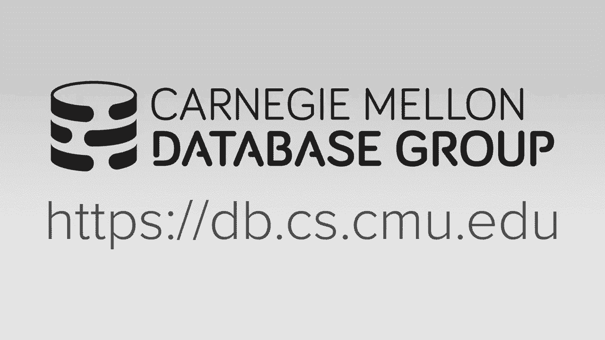

# 【双语字幕+资料下载】CMU 14-455 ｜ 数据库系统导论(2019·完整版) - P19：L19- 多版本并发控制 - ShowMeAI - BV1qf4y1J7mX

去吧。

嗨，我叫达娜，我是安迪的另一个博士生，可能会是他最后一个向你展示的博士生，在他回来之前，嗯，所以今天我要介绍，呃，光，你关于并发控制的最后一堂课，所以在我们开始几个提醒之前，首先是项目。

第三天是11月17日星期日午夜前，嗯，我们还公布了上周的家庭作业，截止日期是11月13日午夜之前，在我们开始之前，有什么问题吗？所有的权利，今天我们要讨论多版本并发控制，只要确保我只是在这里。

所以我想指出的关于多版本并发控件的第一件事，它的名字是用词不当，这可能会引起一些混乱，因为它实际上不是并发控制协议，就像你们在过去的两节课上学到的那些，就是时间戳排序，OCC与两相锁定，嗯比较。

这是一种构建系统的方法，呃，当通过维护多个版本运行并发事务时，所以回想一下上周你关于乐观汇率控制的讨论，其中事务维护私有工作区，任何时候他们读或写一个物体，他们会很好地将该对象复制到私人工作区中。

在多版本并发控制中类似于这个想法，除了这里，而不是为每个事务提供一个私人工作区，在那里我们维护这些不同的版本，我们现在将有一个版本成为全球数据库的一部分，我们将确定它的某种版本是否是视觉。

对特定事务可见，在过去的十年里，几乎每一个新的数据库系统都在使用，或者它的某种变体，嗯，但这不是一个新想法，所以说，其实，嗯，它实际上已经有几十年的历史了，第一次提到这个想法是在博士的一篇论文中。

1978年麻省理工学院的学生，直到80年代初，这是它的第一个隐含式实现真正出现的第一个，这些来自一家名为DE的公司，它们被称为我们的DB VMS，它代表VMS或VAX的关系数据库，这是一个旧的操作系统。

另一个产品叫做接口嗯，所以DEC曾经是一家主要的电脑公司，它在90年代末被康柏收购，几年后被惠普收购，所以它已经不在了，但它做了一些重大的开创性工作和数据库系统。

所以我们的数据库虚拟机和界面都是由一个叫吉姆·斯塔基的人建立的，他也被认为是斑点和触发器的发明者，所以他是个大人物，嗯，他后来继续合作找到了新的ODB，这是一个新的数据库启动，它也碰巧在密件抄送中使用。

所以十二月，我们的数据库虚拟机被甲骨文收购，现在被称为甲骨文，rdb，它是一个内部的底座，um最终在12月被出售，它通过几家不同的控股公司，最后是开源的，所以现在它以不同的名字为人所知，现在叫火鸟。

所以它可能没有我的续集或Postgres那么出名，但是有一个最早的开源数据库，安迪去年左右有一个有趣的小事实，我就直说了，所以如果你，如果你想知道为什么，火狐浏览器的火被命名为火狐，嗯。

因为它们本来叫凤凰，但后来他们不得不改变这个名字，因为它与，你知道的，与另一个系统或另一个产品，所以他们把它改成了火鸟，但后来他们不得不再次改变它，因为它与这个数据库系统冲突，所以最后它被称为火狐。

所以主要的好处又是，就像你必须明白的，MVCC是作家不会阻止读者，读者不会阻止作家，因此，只有当您有两个事务试图写入对象时，同时你必须后退，并依赖于并发并发控制协议之一，就像两相锁定。

所以你只需要这样做当你有一个正确的权利冲突，嗯，所以高层，呃，这个工作方式是，我们将为事务分配时间戳，当它们到达系统时，然后我们将为它提供数据库的一致快照，就像它当时存在的那样，呃，那笔交易到达了，嗯。

因此，这意味着他们不会看到来自尚未进行的事务的更改，尚未在其快照中提交的，只是为了澄清，这是一个虚拟快照，所以不应该和，你知道，如果物理快照，或将完整数据库复制到其他位置，然后在上面运行该事务。

所以再一次，这是嗯，这只是虚拟的，mvcc对于只读事务非常有用，因为续集方言允许您声明事务何时只读，如果你这样做，那么数据库系统就不需要您获得任何锁，或维护读写集，嗯，这又能工作了。

因为它有一个一致的快照，我们只会看到它开始时存在的变化，嗯，这使得这些只读事务非常高效，也非常快，我甚至就像我一分钟前提到的那样，就像是，它本质上只是一个维护，像版本表或版本使其数据信息。

它和OCC很相似，在那里你理解读写集，我们将详细讨论这一点，在下面的幻灯片中，这将是这堂课的主题，是啊，是啊，第一个事务读取为零，一秒钟后又有一笔交易，呃，我们就会，他们是不一样的，所以它是。

我们在这里说的是两个读数，嗯，他们会读取相同的快照，同样的版本，所以快照，你知道，更常见的是，我觉得，称为版本，您知道元组或数据库对象，好吧，可以这样，如果你能忍受我就像，你知道的，三分钟可能更少。

事实上，这是我们要讨论的第一件事，我会，之后我会回答你其他的问题，所有的权利，所以在滑梯上结束，MVCC的另一个优点是您能够支持称为，所以这些查询实际上让你询问数据库系统，比如说，数据库的状态是什么。

你知道，三天前，三年前，使用这些和使用这个版本控制，他们实际上可以回答这些，这类查询，所以时间旅行查询的想法是第一个，嗯是Postgres的一个想法，它起源于20世纪80年代的Postgres。

但是Postgres实际上从他们当前的产品中删除了这些时间旅行查询，就像，一旦你知道，学术界以外的人开始更多地使用Postgres，有人能猜到为什么，嗯，那么原因是因为，本质上。

你必须做什么来真正支持时间旅行查询，你永远不要扔掉旧版本，所以你从来不收垃圾，所以随着时间的推移，你知道越来越多的事务提交，你的磁盘很快就会被填满，最终它会满的，可能很快，取决于事务的速度，另一件事是。

许多应用程序并不真正需要时间旅行查询，就像你不能，你从来没有真正看过，你永远不会去一个网站说，好的，我想知道这个网页三天前是什么样子的，在大多数用例中没有，嗯，但安迪提到就像一个，呃。

这些时间旅行查询的常见用例是在金融业，原因是，你知道由于，我不知道，你知道的，随便啦，他们必须遵守的任何规章制度，他们必须在过去七年的交易历史中保持，嗯。

所以这些时间旅行查询实际上允许他们非常容易地查询数据库，弄清楚你所知道的，一笔钱，他们的，他们的总收入是多少，或者他们想查的任何东西，嗯，你知道的，过去七年，所有的权利，在接下来的两张幻灯片中。

我们将讨论两个例子，嗯，在我们开始之前，我真正想在这里强调的是，MVCC独立于并发控制协议吗，所以这些例子的目的只是向你展示我们是如何，你知道的，更新表中的版本和时间戳，也基本上像多么抱歉。

我们如何找出哪个版本，嗯，我们如何计算哪个版本是两个对特定的事务是可见的，正确的元组的哪个版本是物理的是可见的，嗯所以嗯，第一个例子，我们看看这是怎么回事，嗯所以现在，首先要指出的是。

现在我们有了这个版本字段，对呀，所以我们可以在这个版本字段中看到，嗯，它被分配给一个零，所以这意味着对象版本为零，所有的权利，所以我们可以假设其他事务写了值1，二三到数据库，不管是什么吸引交易写的，嗯。

时间是如何被分配为零的时间戳的，我们会过去，为什么在一秒钟内，嗯，所以我们还有一个开始和结束字段，所以这些只是时间戳，不管他们是逻辑上的物理混血儿，只要嗯，他们，你知道，它们总是在增加，然后跟着另一个。

你知道，我想我们的民谣时间戳是对的，就像你在过去的几节课上学到的那样，所有的权利，所以说，让我们开始吧，当新事务到达时，所以交易，我们将研究第一笔和第二笔交易，所以这里，没有人来吗？

它被分配了一个时间戳，所以现在我们要开始，好的，所以我们要做的第一件事是，我们要在一个，所以我们要做的是，我们要考虑，你知道时间交易一旦时间戳，这是一个，我们要看看我们的桌子，弄清楚，嗯。

哪个元组对它来说是可见的，呃，试图通过寻找来寻找，你知道它的当前时间戳在结束和开始和结束之间，所以在这个例子中，嗯，开始是零，1的时间戳在零到结束之间，也就是无穷大，对呀，所以它将继续阅读版本A零。

所有的权利，现在我们有第二个交易，我们要把它的时间戳分配给，嗯，所以我们要做的第一件事是我们要写一个所以，在这一点上，我们要做的是，我们将创建一个全新版本的，这将是一个正确的，因为我们只是在增加版本。

计数器，嗯，如此正确，所以我们要做的是开始的时间戳，将被设置为t 2的时间戳，嗯，结束时间戳将再次设置为无穷大，然后我们要做的最后一件事是，我们要更新版本的结束时间戳，一个零也是二的时间戳，交易权。

两个，所有的权利，所以你可能已经注意到我们到目前为止还缺少一件事，就像和只是，你知道的，我们在这次交易之前所掌握的信息显示，我们缺少的一件事是，我们真的不知道数据库中事务的当前状态，例如。

您知道这里的事务当前处于活动状态，但如果他们流产了呢，你知道吗，那你就得回去倒转时间戳，因此，如果流产了，对呀，大家可以看到，嗯，我们到了，我们要开始填写交易状态表，在这一点上，两个事务都处于活动状态。

最后我们要在一个，那么它会读什么版本，a零度以下，因为再一次，是时间戳，呃，仍然在这里的开始和结束之间，所以它将继续阅读版本，一个零，最后它会承诺，所以在提交之后的最后，然后事务T 2将提交。

我们将更新状态表，我们可以把它吹走，最终，对于第二个示例，我们将从相同的设置开始，对呀，所以我们有一个时间戳为1的事务，在第二笔交易中，我们发送了一个2的时间戳，它在数据库表中的状态是相同的。

到目前为止，我们刚刚开始交易，我们说它的时间戳到一个，它的状态是活跃的，所以首先我们要读一个，我觉得，在这一点上，很明显，我们将阅读版本A零，接下来我们要在一个so上再写一次，就像在上一张幻灯片中。

我们将创建一个全新的版本，嗯，将其插入我们的数据库表中，它将是价值四五六的版本一，开始时间戳将是一个正确的，不管这个时间戳是什么，最后我们将再次赋予无穷大，最后不要忘记的是，我们需要上升到零。

并将结束时间戳分配为事务的当前时间戳，没有一个，这是一个，所有的权利，现在我们开始交易二，所以我们要做的第一件事是阅读一个，那么在本例中，它将读取哪个事务，或者对不起，它会读到哪个版本，对不起。

给我一个，为什么会这样，男人和咖啡，对耶，所以我想是的，所以在这种情况下，它将是一个，哦对不起，我忘了是的，所以我们要注意的一件事，这有点棘手，现在，一开始我忘了提的一件事是我明白。

你们没时间检查隔离级别，所以安迪想让你们回顾一下幻灯片，还有去年的讲座，所以我只想提供一些关于隔离水平的高级提示，当你看那些幻灯片和家庭作业的时候，对呀，但是嗯，在这一点上可能没有完全意义。

但基本上就像在一个非常高的水平上，取决于您的隔离级别，嗯，它可以选择任何一个版本一个零一个一，但让我们假设它是一种，这是严格的序列化或对不起，可串行化隔离，这就是你们一直在用的东西，这一点它就会，呃。

它必须读一个零，因为一个人还没有承诺，所有的权利，所以现在我们要在一个，所以在这种情况下，接下来会发生什么，这里我们有一个对的对的冲突对的，所以呃，假设我们用，第二个必须安装，直到第一个提交。

所以让我们继续下去，所以现在我们回到第一条，我们要在一个，在这种情况下，它将读取相同的版本，它几分钟前写的，好的，然后它会继续并承诺好的，所以现在我们可以回到这里，嗯，我们可以继续。

现在我们要创建新版本，值七八九的二，我们要给它分配两个的时间戳，有无限的结束时间戳，我们将更新一个的结束时间戳，也要做，所以在这一点上，嗯，你知道T 2是否真的提交，实际上依赖于并发控制协议。

以及隔离级别，所以这是要记住的，但实际上这个例子，这个示例的目的只是向您展示我们如何更新对象版本，维护事务状态表，也弄清楚，呃，哪些元组是可见的，对此有什么问题吗，所有的权利，所以正如我提到的几个。

哦是的，就像你在前一张幻灯片上说的，作者在说话，读者对，所以当你更新那个版本时，所以你不需要在桌子上有积木吗，因为如果我，呃，如果我做得对，我就像更新一个值，就像我在给，我知道这是在读它。

所以这个右上角的桌子，如果我是个作家，我正在更新这张表格，有人正在阅读这张表格，那么这张桌子上不需要上锁吗，所以又是这个，这是一个非常高级的例子，实际上我们要进入，在后面的课程中，你如何存储这些信息。

所以应该手，就像，所以这将回答这个问题，基本上在某些情况下，是呀，你确实需要考虑锁，这实际上取决于您如何存储此版本信息，如果我们不在几张幻灯片中涵盖它，因为有多种方法可以做到这一点。

所以我不想现在就把它们都列出来，覆盖着几张幻灯片，请再问一遍你的问题，所有的权利，所以嗯，所以再一次，像NVCC或它的变体几乎在所有新的数据库系统中都使用，嗯，这些只是，你知道的。

VCC中使用的系统的一些示例，但我们真正想强调的是，呃，在这节课剩下的时间里，就是，在前两个示例中，你必须做出一大堆其他的设计决定，为了实际实现一个支持VCC的系统，所以我们接下来要复习这些。

那么这些设计决策到底是什么，特别是，这是您将使用的并发协议，如何维护和存储不同的版本，这与之前问的问题有关，嗯，你打算如何清理旧版本，呃，一旦它们不再对任何事务可见，以及如何确保索引指向正确的版本。

所有的权利，所以我们首先要讨论的是一个，跳过那个，好的，我也是这么想的，好的，所以我们要讨论的第一件事是并发控制协议，嗯，对呀，所以这基本上是，哦，我在看对不起，我不习惯这个主持人，看我的坏，好的。

并发控制协议，这是我们首先要考虑的，对我们的设计决策，嗯，所以说，这些是你们一直在研究的并发控制协议，在过去的两个星期里，在过去的两次讲座中，当你遇到权利冲突时，您需要使用这些协议中的一个。

不管是两相锁定，OCC或时间戳，排序以确定应该允许哪个事务写入该对象，你在什么隔离级别运行，所以我们不打算对此进行太详细的讨论，因为你最近才报道它，嗯，所以下一个，呃，考虑的是版本存储。

所以对于版本存储，我们需要做的是为一个特定的元组版本找出两个，我们应该看到的是什么，所以让我们假设，就目前而言，我们正在对整个娱乐碗进行顺序扫描，我们想知道在哪里可以找到我们想要的元组的版本。

所以我们要实现这一点的方法是，我们将维护一个内部指针字段，这将允许我们找到以前或下一个版本，我们将更多地讨论这个特定的逻辑元组，所以你可以把它看作是一个链表，在那里嗯，你你知道，你可以跳到你身上。

跳上去，头部着地，然后可以按照链表中的指针进行操作，查找它们当前维护的所有不同版本，索引总是指向链的头部，嗯，和，我的天啊，我又做了一次，我很抱歉，好的，所有的权利，所以嗯。

这里所说的索引总是指向链的头部，头部是否是最新版本的最老版本，呃，该元组的版本取决于实现，所以有不同的方法来决定我们将如何存储这些不同的版本，所以我们接下来会更深入地讨论这个问题，因此。

第一个也是最简单的方法被称为仅追加存储，所有的权利，所以这意味着每次我们创建一个新版本，我们只是将表空间中的旧版本作为新的物理元组复制，并更新它，嗯，然后我们更新，指针说这是下一个版本。

我们将讨论这三个例子，在接下来的几张幻灯片中，所以下一个方法被称为时间旅行存储，这里有一个主版本表，这总是在对象或元组的最新版本期间，然后将旧版本复制到单独的表中，我们将称之为时间旅行表。

然后在这一点上，您只需维护表的主版本中的指针，使用时间到时间旅行表的最新元组，所以最后一种方法，安迪更喜欢的是德尔塔存储，所以你可以把这看作是一个差异和Git，而不仅仅是复制旧版本，每次都更新。

你只是要保持，你知道从以前的版本修改的一个小增量，因此，我们将首先介绍一个仅追加存储的示例，所以再一次，这是最简单的方法，这也是Postgres使用的，嗯，所以每个新的物理版本都只是一个元组。

只是主表中的一个新元组，假设我们这里有一个事务，它想要更新对象A，所以它要做的第一件事是，它会在桌子空间里找到一个空的槽，然后从，这是一个对的，这是最近的值，我进了那个桌子槽，接下来。

它将把修改后的值复制到表插槽中，我们还没完吗？我们需要做的最后一件事是更新指针，从旧版本指向我们当前安装的最新版本，好的，所以我们在这里必须考虑的另一个方面，嗯，为了存储这些版本，所以说，哦，在本例中。

嗯，我们A被认为是版本链的头部，在这个例子中，我们特别地将这些年龄最大的到最小的排序，对呀，所以另一种选择是，你可以从最小的到最大的，所以如果你，如果您正在寻找最新的元组，在这种情况下，你实际上你。

你呃到了你，呃到0版本，再一次，你必须按照指针一直到最新版本，一个二，这有道理吗，所有的权利，所以嗯，就像，我刚刚说了前面的例子，从最旧的到最新的，但您也可以使用最新到最老的，两者都有性能影响和权衡。

从最老的到最新的，当有新版本时，您所需要做的就是，呃，追加到版本链的末尾，对呀，这很简单，追加新元组并更新指针以指向，更新的版本，从旧版本到新版本，这是一个非常简单的操作，但如果你做最新到最老的。

那么这意味着你必须添加条目，并更新它的指针以指向旧的头部右侧，但现在你必须更新所有的索引来指向你的新版本，因为再一次，就像我们说的，几张幻灯片前，指数，我总是指向版本链的头部，所以这意味着更多的更新。

在某些情况下，所有的权利，所以对于时间旅行存储来说，这是我们要讨论的下一个方法，这里是主桌，它总是有每个元组的最新版本，然后我们会有另一张桌子叫做时间旅行桌，这就是我们要维护旧版本和复制旧版本的地方。

当它们在数据库中被修改时，对呀，所以对于这个例子，假设事务希望再次更新对象A，与上一个例子相同，嗯，然后我们要在时间旅行表中的空闲点复制一个2，然后更新版本指针以指向元组的最早版本。

然后我们将覆盖主表中的主版本，作为新版本值，最后我们需要更新他们的新版本，最后我们需要更新指针从新版本指向三，我们刚刚安装在时间旅行表中的版本，这是一个二右，每个物体都有一个时间旅行表吗。

还是像在钢笔桌上，呃，那就是，呃，在笔桌里，好的，是啊，是啊，所有的权利，所以呃，现在我们继续，呃，我们要考虑的最后一种方法，也就是增量存储，这又是，MySQL和Oracle都使用它，就像我提到的。

安迪认为这是最好的选择，嗯，所以这里要发生的是每次你做更新，您只需将修改后的值复制到这个单独的增量存储段中，你在这里看到的，所以要更新一个，我们首先要更新它的版本值，嗯，进入三角洲存储权。

所以我们要复制它的价值，所以不是存储整个元组，我们只是要，我们只是要创建一个三角洲，各州，你知道，哪一部分，哪些属性和元组实际上被修改了，所以在这种情况下，呃，有一个属性，因此。

这现在反映在增量存储段中，嗯，然后我们将更新主表中的实际值，并将指针从新值更新到我们的增量存储中，如此相似，如果我们，如果我们现在想安装一个新值，新版本，那么我们需要做一些类似于时间旅行表的场景。

特别是，我们添加新版本，再次更新值，现在我们看到它的版本是三，对呀，但我们有，但是我们还需要把指针从3更新到现在，指向当前的最大值a 2，另外，我们需要更新2的指针以指向旧版本，现在一个一。

和时间旅行的例子一样，当你想读旧版本时，嗯，你真的，你本质上要做的是，您必须重播增量以将元组放回原来的形式，所以在这种情况下，如果我们想，如果我们想读一个，我们将从三的值开始，然后我们按照指针A 2。

应用三角形和一个二，然后把这个三角形，这将使我们回到最初的价值，对呀，所以这是读和写之间权衡的另一个很好的例子，嗯，所以在仅追加的方法中阅读旧版本真的很容易，这是一个很好的地方，很容易实现，对呀，嗯。

因为您只需找到版本，并且元组已经准备好被翻转，所以除了容易实现之外，你也不必把元组重新组合在一起，你不必应用Delta来使它回到正确的状态，嗯，但是有了Delta存储权限会快得多。

因为我们不必复制整个元组，如果我们只对属性的子集进行更改，所以你知道，如果你只有一个属性，就像我们在这里做的那样，这是，你清楚地知道一个微不足道的优化，但在许多桌子上，你可能有，你知道几十个专栏。

在这种情况下，这可能很重要，但又一次，是呀，用增量存储，那个呃，这就是好处，但是呃，缺点是你必须再次重播三角洲，将元组放回正确的值，嗯，所以你可以从，这就像我们前面提到的，乌姆·波斯特雷斯。

Postgres的读取速度会更快，对因为，嗯，嗯，海报阅读会更快，由于这个确切的原因，和我的意志将更快地写入，所有的权利，嗯，所以我们需要知道的第三件事是垃圾收集，嗯，因此，随着事务的运行和完成。

所有这些旧版本都在积累，在某个时候，呃，我们知道特定的版本不是，对任何其他活动事务都不可见，对呀，所以这意味着，如果您在考虑带有开始和结束时间戳的表，和时间戳版本，这意味着没有活动的事务。

具有适合开始和结束范围之间的时间戳，旧版本的权利，所以在这一点上，我们想继续垃圾，收集这些版本以便回收空间，所以另外两个，呃，我们要担心的事情是，我们将如何寻找过期版本，当安全的时候收回它们。

所以这些是我们在这节课中不打算讨论的主题，但他们被高级班覆盖了，如果你选择接受，所以有两种方法，呃，所以我们要研究两种方法，具体来说，第一个是元组级垃圾收集，第二个是事务级，嗯，所以说，元组级。

意味着我们基本上要对我们的桌子进行顺序扫描，并使用版本，时间戳和活动事务集，以确定版本是否过期，对呀，如果是的话，然后我们继续修剪，所以这实际上很复杂的原因，这是因为我们不仅要实际查看内存中的页面。

但我们还需要看看页面，我们已经换到磁盘上了，嗯，因为我们又一次想把一切都吸好，嗯，所以我们来看看真空背景，下一张幻灯片中的吸尘和协作清洁，嗯，所以第二种方法是事务级，我们真的不打算详细说明。

但一般的想法是，您有维护读写集的事务，嗯，你知道，当他们承诺，所以版本是对的，所以在这种情况下，您又有了事务，他们在维护我们读写集的重写，所以你很清楚他们什么时候犯，因此，你可以计算出它们何时不再可见。

并可以真空它们，所以第一个会先过去，元组级垃圾收集如何工作的示例，假设我们有两个线程在系统中运行，事务T 1被分配了12的时间戳，事务t 2被分配为2的时间戳，五个，然后在我们的版本表中。

你可以看到我们有对象对象A，它被分配到一百个版本，开始时间戳为1，结束时间戳为9，然后我们有几个其他版本的对象b嗯，所以用真空背景吸尘，呃，我们要做的是，我们有一组线程在幕后运行，他们执行吸尘。

他们周期性地对表进行全表扫描，嗯，看看哪个，呃，版本可回收，嗯，它适用于这里的任何类型的存储，所以作为背景，所以这里，嗯，所以你有一个后台线程进入um去交易，呃，线和说什么。

它基本上查询当前事务时间戳是多少，所以说，在这种情况下，它将是12和2 5，然后它会在桌子上做一个顺序扫描，来弄清楚元组是否会被他们看到，那么他们会看到一百个吗，很难说，因为我们还不知道。

但他们在阅读和写作，但是，嗯，哦，我明白了，好的，对不起，让我倒回去，所以再一次，对不起，在本例中，我们只是看开始的时间和这里的时间戳，所以我们在这里聚集，这两笔交易的时间戳是12点和25点。

然后我们再看开始和结束的时间戳，所以他们永远不能用100或100，因为时间戳不在一到九之间，然而他们有，呃，跌得很好，1。交易的时间戳在10点到20点之间，所以它可能会利用这个值，在这一点上。

我们知道这两个元组是安全的，所以我们继续这样做，嗯，所以这里有一个优化，嗯，我们可以做的一个明显的优化是，我们实际上可以为脏页面维护位图，所以任何时候你修改它，您可以只翻转您修改的页面的那一点。

所以再一次，我们正在维护数据库页面中所有页面的位图，特别是如果我们修改页面，我们会翻转那个特定的部分，表示该页已脏，嗯，所以这个你知道它需要一点额外的存储空间，但它只是数据库中所有页面的一个位，嗯。

任何时候你想要它，嗯，所以当真空或在它周围出现时，立即知道哪些页面实际上需要吸尘器，所以它会继续用吸尘器吸那一页，然后将位重置为零，所以在家里再次吸尘通常是，呃，跑了，作为周期性地运行的cron作业。

但在一些数据库系统中，比如说，Postgres um，您实际上可以从SQL提示符手动调用真空，比如说，它还有配置参数，您可以设置，这样它就会，系统基本上会启动一个真空螺纹，如果它，如果结束，你知道的。

百分之二十的书页是脏的，比如说，所以有不同的方法来实现这一点，有不同的方法来优化它以适应不同的工作负载，好的，所以另一种方法，我们要看看，嗯是合作清洁对吧所以这基本上是呃，其中的线程，当他们执行查询时。

当他们遇到旧版本时，他们知道其他人看不到，他们的工作是真正清理它们，当他们前进的时候，所以再一次，这些是，这些都是威胁，实际执行事务，他们会检查版本，他们穿越，那些是不是应该，嗯，这些是不是。

那个空间是否准备好被回收，因为它们对任何事务都不可见，如果是的话，它会继续收回这个空间，所以有一点要注意的是如果你考虑到我们之前讨论过的两个订单，最老的到最新的，最新的到最老的。

这种方法对这两者都有效吗，你把它放在一个新的，就是这样，完全正确，是啊，是啊，所以在最新最古老的情况下，呃，你不会看到任何旧的交易，所以你永远不会收回那些，所以重要的是要注意，呃。

合作清洁只适用于从旧到新的订单好的，所以现在我们将在这里经历一个类似的例子，呃，这么说吧，嗯，我们有一个索引和交易，没有人想查找对象A，现在，所以它会再次，它将落在版本链的头上，这是最古老的值。

然后它会沿着扫描，直到它弄清楚哪些版本对它来说是真正可见的，嗯，所以如果它识别出它正在寻找的版本，嗯，如果它认识到，当前遍历的版本之一对任何其他事务都不可见，嗯，然后我们继续将它们标记为已删除。

并收回空间，嗯，然后在我们的尽头，还更新索引以指向版本链的新头部，所以我们就通过这些步骤，所以在这里我们发现，呃，价值，好的，所以我们可以看到版本，一个是可以回收的，然后我们重新接上。

然后我们重新创建从索引到新版本的指针，头向右，所以排序在这里实际上很重要，和实际在，这实际上是在幻灯片上是不太正确的，所以当你实际执行这些操作时，你首先要做的是更新。

所以你要做的第一件事就是把它们标记为已删除，但你实际上并没有收回空间，然而，下一件重要的事情是，您实际上更新了索引指针，以指向一个2，在物理上删除它们或回收该空间之前，因为否则，如果有其他事务并发运行。

他们可能会找到一个空指针，什么也指向，是呀，嗯，就像用工作线程来弄清楚，就像什么是可信的，就像，会不会像一些全局变量，像早期的曲目，然后它结束了，就像在那之后，它标志着，是呀，是啊，是啊，本质上是的。

所以它会保留一些信息，这样他们就能弄清楚，所以它将知道活动事务的集合，并能够将这些时间戳与开始和结束的时间戳进行比较，在版本表中，所有的权利，所以再一次，嗯，事务级垃圾收集，嗯，我们在这里。

我们只是保持阅读，写事务集，我们用它们来找出哪些版本不再可见，然后我们声称空间，这就是我们要说的，事务级垃圾收集，所以在这之前，关于垃圾收集或其他任何问题，所以嗯，现在我们要进入最后的主题设计决定。

也就是索引管理，就像我之前提到的，主键索引总是指向版本链的头部，任何时候我们创建一个新版本，我们必须更新版本链，还是要好好更新，我们必须更新索引以指向版本链的新头部，对呀，因此，当更新主键时。

这变得很棘手，因为现在，实际上，您可能有两个版本链，对于相同的逻辑元组，实现此操作的方式是当您要删除主，呃，当您要更新主键时，您将此操作作为删除，后跟插入一个新的逻辑元组，你需要保持一些簿记。

你还需要了解必要时如何以及何时回滚，但对于二级索引，这其实更多的是，呃复杂，这将是一口井，我们将更多地讨论，所以说，有二级索引，这两种方法，嗯，我们用来确保我们的索引反映版本链中的正确值。

嗯是维护一个逻辑指针，这里有一些元组的假标识符，或者不更改元组的某种唯一标识符，然后你有一些间接层，将逻辑ID映射到物理位置的间接层，数据库，随时更新版本链，你只需要更新间接层。

而不是实际上更新每一个索引，对呀，嗯，所以实际的方法是，我想是我之前在一些幻灯片中使用的，我觉得，就是实际上，呃，使用物理指针，嗯，当你直接指向一个新版本链的头部时，所以每次版本链更新。

你必须更新每一个索引，对呀，使用物理指针和逻辑指针之间的物理区别，你基本上有这个间接表，和，间接表的好处是，您不必在每次更新版本链时更新每个索引，所以说，所有的权利，所以在这个例子中，嗯。

我们会说我们有一个简单的数据库，我们使用的是最终版本链，从最新到最老，对呀，所以对于主键索引，如果我要查找对象，a，那么这将只是一个物理地址，右为主键，它将只是一页，ID和偏移量。

这样你就知道该去哪一页了，然后你取偏移量，这就是通常的情况，嗯，它将再次指向版本链的头部，随时创建新版本，你总是用主键更新它，所有的权利，所以对于二级索引，您可以使用物理地址，嗯。

但是任何时候更新元组都会有同样的问题，您必须更新辅助索引以指向此，你知道这又像是，这类似于Delta存储的一些想法，我们前几张幻灯片看到的，嗯是的，如果你有一个属性，或者如果您有一个索引或一个辅助索引。

那这没什么大不了的，但对于OLTP数据库来说，这是很常见的，特别是有很多有很多，单个表上的一些辅助索引，嗯，所以每次你更新版本链，您必须更新所有这些辅助索引，对于LTP，您可以想象可能是12。

或者你知道几十个，然后嗯，这当然很贵，因为，比如说，如果是B加树，那你，你知道，正在穿越B树，你走的时候带着门闩，最后你必须应用更新，所以再一次，嗯，就像我们在上一张幻灯片中说的。

而不是在辅助端索引中存储物理地址，我们将考虑两种选择，所以第一个是只存储主键，它实际上只是主键作为值和辅助索引的副本，所以这个物理地址，在这里，我们去正确的，所以这里我们将有我们要存储的实际价值。

在辅助索引中，将是指向主键索引的指针，嗯，所以现在当你想找一个元组，嗯，你只要先把主键索引从辅助索引中拿出来，然后查找主键索引，就像你会，嗯，弄清楚物理地址是什么，然后呢，呃，一切都在进行。

如物理地址的第一个示例所示，嗯，我随时更新元组和版本链的头部，您只需更新主索引，并自动更新所有辅助索引，这是逻辑指针的一个例子，这就是我的续集所做的，Postgres实际上存储物理地址。

所以我忘了第二个是什么，二级索引，看看你的主键索引是否正确，哪个商店像，您的直接表的键，所以你的二级索引将，我想是指那把钥匙，所以嗯，为什么不呢？是啊，是啊，所以在这种情况下，就像如果你，嗯。

所以如果你有一张桌子，ID是您的主键，那么在表B中，你可能会引用表A到表A点，我是对的，表中的属性列，所以你可以创建第二个，这就是所谓的该特定项目的二级索引，所以如果你想更具体的东西，您有一个用户表。

您的用户有ID，嗯，您的用户有其购买的项目列表，嗯，所以对于这些项目中的每一个，您可以将用户的ID存储在其中，或者你知道它通常用于卡车，好的，任何其他问题，我想我可能有点操之过急了，好的。

所以最后一个方法，这也是使用逻辑ID的另一个示例是，基本上你只是有一个综合值，这就像一个元组ID，所以这通常是一头牛，您知道一个增量计数器u作为元组ID，然后你有一个哈希表，上面写着如何映射。

从元组ID到地址，所以嗯，所以基本上你会得到二级索引的元组思想，对呀，按地址，是啊，是啊，所以你会得到二级索引的元组思想，然后你会，然后你要弄清楚物理地址在哪里。

然后这里的哈希表将为您指出物理地址的位置，这样您就可以读取该值，一次又一次，与我们存储主文件的方法相似，主键索引，这是逻辑指针的另一个示例，这意味着如果每次我们有一个新版本，或者每次更新版本链。

我们实际上可以避免，嗯，必须更新所有的二级索引，对呀，所以我们，我们唯一要更新的，在本例中是哈希表，指针有意义吗，所有权利，所以嗯，这张桌子真的很有趣，嗯，所以这是一个。

这是安迪和其他几个学生发表的一篇论文中的一张表格，我想几年前，所以他们实际上做的是，他们研究了许多系统，所以他们研究了一些旧的系统，你知道，就像甲骨文Postgres和我的续集。

他们还研究了过去十年中一些更新的系统，嗯所以，比如说，就像超级，新的ODB，呃，Hyper将是学术系统的一个例子，所以他们试图在这里得到各种各样的系统，I和表格列表，这些设计决策中的哪一个。

这些数据库系统中的每一个都使，让我们看看安迪有没有什么令人兴奋的事情，所以我，我猜他说剧透，如果你们想要剧透，嗯，是外卖，剧透是神谕和我的续集，嗯，就像他们在PC上做的那样，他们真的发现像安迪一样。

一些学生实际上发现这种方式对OLTP工作负载来说是最快的，实际上发现Postgres是最慢的，尽管作为我续集和Postgres的用户，我很喜欢Postgres，我也不跑，你知道的，商业数据库系统。

与生产工作负载的选择，所以你知道，一旦你达到那个规模，这可能很重要，这绝对很重要，好的，所以这让我们得出了结论，所以今天我们再次讨论了多版本并发控制，正如你在过去的几张幻灯片中看到的，嗯。

还有很多事情要做，然后只是想知道，你知道，分配什么时间戳，嗯，以及不同事务可见的版本，嗯，所以你知道，当然啦，您需要弄清楚如何存储版本，如何更新它们，如何正确更新索引，我们在这里讨论的其他项目。

对下节课来说，只是为了提醒一下，别过来，星期三不要来上课，因为没人会在这里，你们下周三休息，然后我想接下来的一周安迪可能会回来，虽然这还不确定。

但我们将开始记录和恢复，哦，我们和米歇尔一起过来。

派人去拿箱子，给我说，在破碎的瓶子和压碎的混合中很好，可以让奶牛陷入困境，否则我开车，他在我的系统里有胜算，敲开另一个，我很幸运，让我们去拿下一个，克服目标是保持清醒，所以最好躺在沙发上，下来什么。

我们不要压力太大，我们永远做不到，瑞奇，果冻说，去熟食店买船，一个自然祝福的人，是呀，我的说唱就像激光束，灌木丛中的球，即使是国王，开一瓶同样的，那些不想喝的人，只是为了喝醉，你不能丢下还活着的人。

同时，不知道的一罐痛苦。