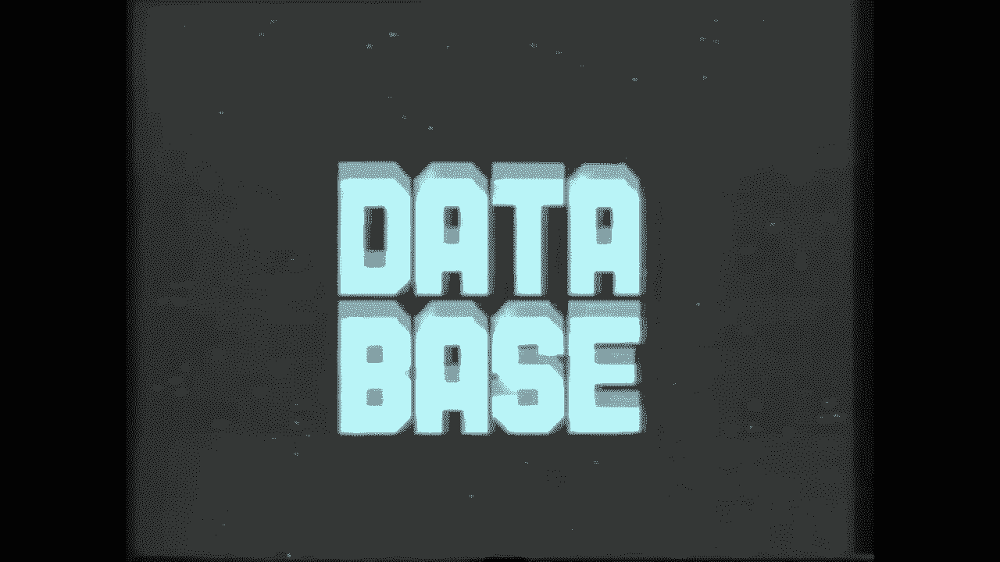
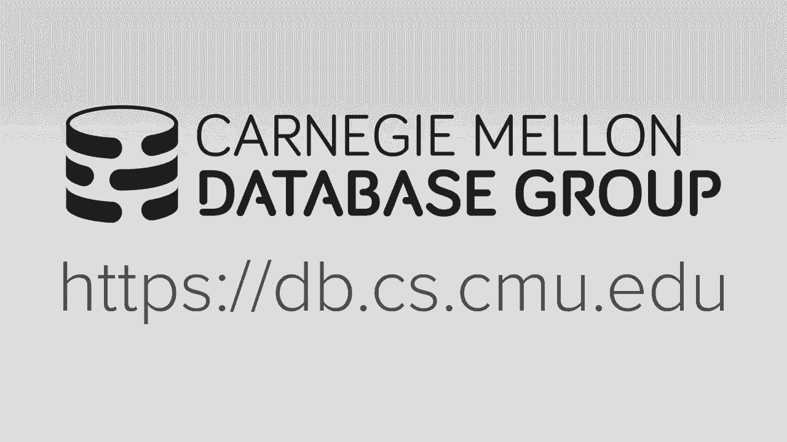
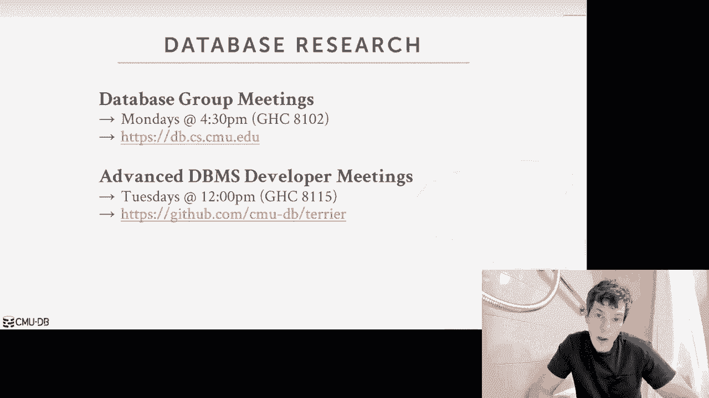
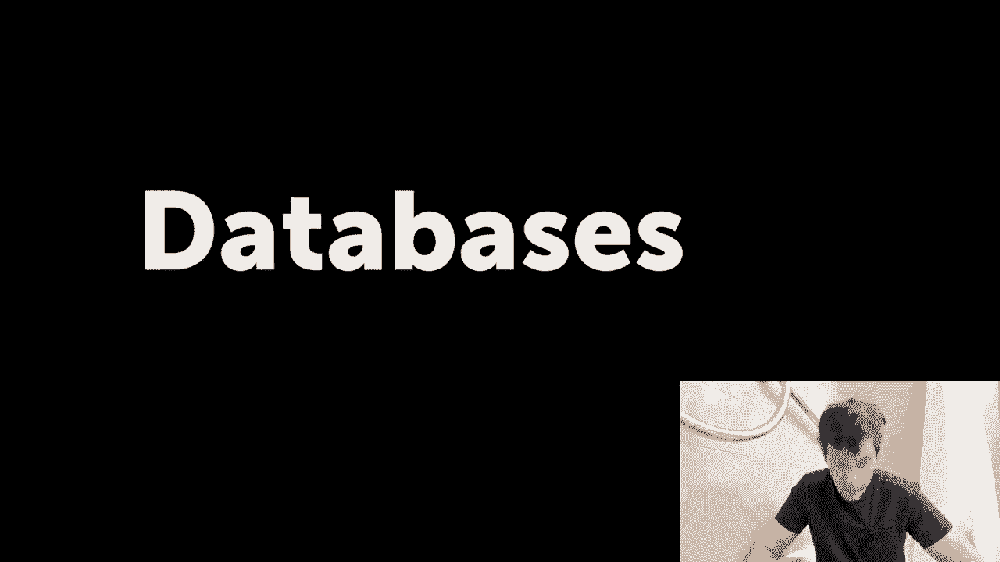
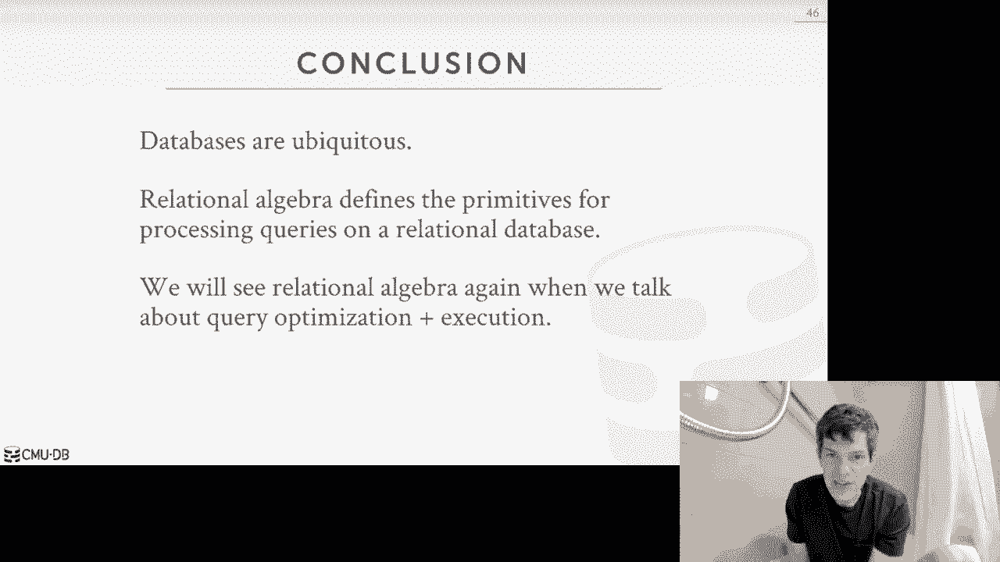

# 【双语字幕+资料下载】CMU 14-455 ｜ 数据库系统导论(2019·完整版) - P1：L1- 课程介绍与关系模型 - ShowMeAI - BV1qf4y1J7mX

[Music]，welcome to News EMU 1545 6：45，introduction to database systems my name。

is Andy I'm the instructor for this，course as I said on Piazza I can't be in。

Pittsburgh right now we are getting，ready for Matt's cage fight on Wednesday。

so we had to be out here in LA to，prepare for that fight so rather than。

just not having classes this entire，first week I wanted to record this while。

I'm on the road posted online and then，that way when we start having in-class。

lectures next week we can get started on，the good stuff so before we get into。

today's lecture I first want to talk，about how Oracle is helping us out this。

semester with course of course，development so Oracle is actually won。

the first relational database management，systems that came out in the 1970s and。

I'll explain what a relational database，is in a few slides there's one of the。

original ones but it's still widely used，and sold today right it's probably the。

second most deployed database system in，the world it's certainly the most。

deployed commercial system in the world，and so even though it's from the 1970s。

and there's other systems of the 1970s，that are still sort of around or was。

actually still under active development，and they're adding a lot of you know。

interesting new modern features to it so，this course is about me what I'll call。

it to me is traditional database，management systems or a classical design。

and the interesting to see when they，come and in the semester to give a guest。

lecture talk about some of the stuff，that they're adding to Oracle today you。

know how they sort of go beyond you know，what we'll talk about in this course and。

sort of look any more more advanced，topics so the for this lecture here I。

want to first talk about these or the，overall outline of what's expected in。

the course but you as the student taking，it and then we'll finish up giving them。

a half lecture on the relational model，and the relational algebra and this sort。

of be the background you need to have，for the various topics we'll discuss。

throughout the rest of the semester，so if you're if you're a student。

Carnegie Mellon then the probably the，foremost thing that's on your mind is。

the wait list so unfortunately this year，they gave me a smaller classroom in。

Margaret Morrison than I wanted so that，means we can't take a large number。

people I think the max it says max，capacity is 100 I think it's like 96 is。

in the room we can being flood that，number a little bit but I mean the main。

takeaway is here we can't accept，everyone so the wait list now I think is。

a 115 when I checked earlier today so，unfortunate that means that if you're。

not enrolled in the course at this point，the likelihood that you're gonna get in。

is is very low the people will drop the，course over the next week or so and then。

we'll take people off the waitlist but，unfortunately ant take everyone so。

you're more than welcome to order the，course just let me know that you're。

auditing but we can't officially hold，that have that many people so the way we。

will enroll students as current students，drop out will be just on your your。

waitlist position on s3 on a registers，website so again I'm sorry but it's just。

everything's available online so you're，more than welcome to follow along if you，want。

all right so 1545 645 is at its core the，course is about the design and。

implementation of database management，systems so that means that this is not a。

course on how to use a database to build，like an application like a website or。

something like that or have actually had，administer a database how to deploy one。

set one up we're not doing any of that，we're really focusing on how do you。

actually build and design the software，that is a database vendor system so if。

that's not what you're looking for if，you're not looking to know how to have a。

better database management system then，there's two other courses that you。

should consider at senior that are，outside of SES and the one in particular。

you may want to look at is 95 7 or 3 at，the Heinz College I think is Information。

Systems and again that's about how to，like set up and administer a database。

management system but you don't really，understand they don't really go into。

detail about how you actually built the，software the other thing too that people。

often ask is about there's a usually，another course at CMU，ooh 15 415 615 something that I and。

professor Christopher Lewis has taught，in the past that is not being offered。

the semester I don't know whether it's，gonna be offered in the spring probably，unlikely。

so right now I think the only course is，available in SES would be this course，4：

45 and then a 26 in machine learning，machine learning or cross-listed in the。

cs department so again meets there's，always there's only Christmas myself we。

can't teach everything so unfortunately，there's there's no other database class。

other than this one all right so the，course outline is that we're going to be。

going through and discussing then you，know how to build a disk oriented。

database for an assessment and I'll，explain what a dis coordinate system is。

in a few lectures which basically we're，just writing data out the disk we assume。

the database is on disk so it's sort of，broken up the outline for the the topics。

we'll be discussing is broken up and，sort of into layers of the system right。

so we'll talk at a high level what，relational databases are and then we'll。

talk about how to store them have x，equals on them how to run transactions。

on them how to recover them if there's a，crash or we need to restart the system。

so up to that point up to recovery，that's the core knowledge you need to。

have to understand how a database，management system works and then from。

there we can then build on that and，start talking about more you know more。

advanced topics like distributed，databases or various other types of，databases that are out there or。

extensions of relational databases so，again like the way to think about this。

is we'll go through every single layer，of how to actually build the system and。

we'll finish up and recovery and so at，that point that's the basic you need to。

understand of how a database system，works and then we'll talk about how to。

you know how to extend them to scale，them up or scale now of running and。

running them and in the cloud，environment so the right now the course。

website is online along with the，syllabus and the schedule so the basic。

outline there's a lecture twice a week，and then with each lecture there's a。

there's readings that go along with it，but better supplemental that extend the。

kind of things that that I'll be talking，about as well also provide some。

mention in a second so at all times，please refer to the course webpage that。

should be up-to-date you know it have，been up most up-to-date information on。

what's going on so unfortunately we，always have to talk about academic。

honestly I'll go a little bit more，detail what I mean about this as we go。

along but when you ever have a question，and you don't underst。

please contact me so that we can discuss，whether what you're doing could be。

considered you know plagiarism or，stealing somebody else's work right so。

in general again this is an advanced，course so everyone should be aware that。

you don't copy coding fine don't，randomly on the internet you don't copy。

from each other but just you know be，very careful because we will check for。

these things and as I said all the，discussion and announcements for。

projects lectures homeworks will be you，on Piazza will do grading with great。

scope your final grade will be posted on，canvas because that's what see me once。

but the the detonated discussion will be，on Piazza and there's a link on the。

course web page now a little that'll，take you to our page there is a textbook。

assigned for this for this class，database systems concepts so this is。

actually a new edition that came out，this year I've looked at pretty much。

every single database systems textbook，fit that's out there in my opinion this。

one's actually the the best one it's，it's it's the most up-to-date and as I。

said well we've above I've lecture notes，for topics that aren't covered in the。

textbook I have to MIT me I haven't，looked in a detail of the seventh。

edition to understand how much it，differs in the sixth edition so if you，with that。

I don't think there should be any major，difference I just may not know exactly。

how to you could look at last semesters，chap last semesters or starting last。

year's course and see for the different，topics with the chapter numbers because。

they have changed and I'm actually not，sure whether you can buy this book。

anymore like you can't buy it as a bound，book they sent me you know a bunch of。

page loose loose pages or you know three，three-ring hole punches in them so I。

don't know what the bookstore has I，don't know whether to available online。

it in the sixth edition but it's，probably good enough，right we won't we won't be we won't。

any homeworks or any problems out of the，book directly right well we'll provide。

everything for you all right so the，breakdown for your grade in the class，will be the following。

so homeworks will be 15% then it would，be course projects which I'll discuss in。

a second that'll be 45% so for those of，you that are CS undergrads because the。

project grade your final grade is，comprised of 45 Senate projects that's。

why this course counts for the system，software elective for for the CS。

undergrad curriculum and then there'll，be a midterm and final exam both at 20%。

and then there'll be an extra credit，which I'll announce in a few weeks when。

you can get an additional 10% bonus，points and that's that's entirely。

optional so there'll be five homeworks，throughout the semester the first one。

will be a sequel assignment you will，give you a sequel like database you have。

to write some queries for us but then，everything after that will be pencil and。

paper because it's a way to work through，those sort of more theoretical side of。

some of the things that we're talking，about but it'll be like filling out。

multiple-choice and then you just take a，picture of it and upload it to could。

great scope and will provide great that，way so again the first assignment is。

sequel just because of you know we，actually won't be writing sequel for the。

rest of the semester because the course，projects don't require it and I think。

it's good for you to guys to touch it at，least once at least my big band stuff。

we'll talk about it next neck semester，so again because is about saying all。

these homeworks should be done，individually as well as the projects but。

it's one emphasized this that like，you're not allowed to work in groups and。

try to figure things out it's not like a，Theory class yet all these are。

assignments can be done and should be，done individually alright for the。

projects this is the one I'm pretty，excited about so throughout the course。

of the semester you will build your own，database storage manager from scratch so。

you'll start adding you know pieces one，by one and start building out aids or a。

full-featured a database storage manager，so the key word there storage manager。

and not a database system because you're，not gonna be able to run sequel or have，a query parser。

but you'll be able to run queries that，are hand coded that will provide you so。

it's it's it's more complex than the，sort of that simple key value store but。

it's not like a full-fledged system so，the key thing about this is that it's。

very important for you to you know keep，keep up to date with the projects。

because every project is gonna build，after one after another so you sort of。

have to have the first project working，correctly in order for the second。

project to work correctly and the third，and so forth so this particular system。

that we're using this semester is，written entirely in c-plus 17 doesn't。

mean we're using all the advanced，features of sleep of law 17 it just。

means that it's you know it's not like，you're you know C 2099 so traditional。

single plus you may have learned in，other classes so because this is。

Carnegie Mellon and I assume this is，advanced class I'm not ignore the TAS。

are going to be teaching you or teaching，how to write or debug C++ I sent up a。

self-exam on Piazza if you feel like，you're uncomfortable with you know those。

are the gnarly aspects of C++ then you，should try to figure out how we try to。

start learning this stuff now right you，can't come to us as the TAS office hours。

and say hey you know what is the stack，trace mean you know the this time is。

really expect it to be discussing the，serve them the more high-level important。

database concepts that you're trying to，implement in your code so the all the。

projects this year will be implemented，on this new academic system that we've。

been working on called bust ugh，so all the source code will be released。

on github of course obviously it won't，have the implementation of the piece。

that you chose to implement but you sort，of fill that in so at a high level it's。

a disk based or disk wanting a data，management system that'll support。

volcano style query processing different，parts of the system have a sort of a。

pluggable API so that we can plop in，different you know replacement。

algorithms are given different index，data structures or different logging。

schemes or control schemes so it's，designed to be that way so that every。

year will switch up the project's，entirely，and have it be different form one year。

to the next and will slowly build out，the system further and further with new。

features and functionality so that you，know after a couple years we'll have a。

full-fledged database minute system so，you guys are sort of the first ones。

starting off with these first set of，projects and then next year what will。

modify them in it'll be different all，right so this for this reason we can。

make it open source because I'm not，worried about people you know people。

next year finding your your crappy，projects implementations and copying。

their code because it's all the project，of being entirely different so this is。

what I was saying before the last slide，that you're good in basically storage。

manager the database system doesn't，support Seco at this point and nor will。

and this the semester but you'll be able，to write queries but you'll write them。

in sort of physical operator form rather，than and you know in sequel and then。

translate them because it's not，something we're doing just yet so the。

name of the system is bus tub I will，explain offline what that means but we。

had a nice logo logo made and again what，announced us on github we'll post a link。

on Piazza in a week or two wellmy now，it's the first project so I'm pretty。

excited about having this the everyone，work on this this semester all right for。

the late policy for the homework and，projects every student is allotted for。

slip days so basically for any homework，or project you say I you know I found my，your account。

so the be on a on each homework and the，project submission you just say how many。

late days you use how many ladies you，left so sort of allow yourself to keep。

track of what you know have how many，late days you have so after you run out。

of slip days then it'll be you lose 25%，for every on the and the Simon's total。

points every time it's it's it's for，every 24 hours that it's late so again。

this wouldn't keep attracting us as we，go along in the semester。

obviously if there's medical munitions，or other issues that come up please。

contact me and we can accommodate you so，again as I said before now all these。

projects and the homework should be done，individually they're not group。

assignments you're not allowed to work，submission，together，you should be doing everything。

individually now some code for some，projects may be still online from from。

wish or from previous years，don't take that we're gonna run it，through boss the players plagiarism。

checker if we catch you running their，shitty code unfortunately you know we。

got to report me to Warner Hall so don't，do that because this you know you know。

it's stupid it'll [ __ ] up your life and，it makes everything harder right just。

don't don't plagiarize okay and yeah if，you're unsure check the academic policy。

or policy for academic integrity or，contact me if you're unsure about what。

to do and this includes also for the，extra credit and just because it's extra。

credit and it's optional doesn't mean，that you can't also get caught for。

plagiarism so don't do that as well and，I'll remind you every single time we put。

a new project out every single time you，know we we tell why the extra credit。

okay all right so if you want to go，beyond the kind of things we're talking。

about this this course if you really，like databases which I do you have no。

idea how much I love databases the if，you want to go beyond the course。

material there's two sort of ways to get，involved in database research or other。

database topics going on at Carnegie，Mellon so the CMU database group has our。

weekly meetings on Mondays at 4：30 in，the gates gates building own a floor and。

this is other students visitors from，companies and people in Pittsburgh from。

abroad coming and giving talks about，what you know the the kind of researcher。

kind of work that they're doing if you，want to get involved in the development。

of a sort of advanced system we have our，team meetings on Tuesdays at 12 o'clock。

also in the gates building so we're，building in addition to bust up a bust。

up sort of the academic system we have a，new sort of full-featured database。

payment system that we've been doing for，for several years now that again if you。

want to get involved in this kind of，stuff you should come check that out and。

I'll send a reminder on this Piazza，it will say also to if you want to take。

the advanced class fifteen seven twenty，one in the spring all those projects are。

based on on this this new this other，get，that and sort of learn learn how that。

system works and get involved in the。

early days of this thing no by all means，come to this okay so with that that。

that's that's it for the course I mean，please if you have questions about。

things post posted coach them on Piazza，and I'll respond all right so now let's。

talk about databases the databases are，super important in in real life because。

they're used everywhere so many but，every single complex are energy and any。

computer applications you can think of，at the end of the day，deep down inside of it there's going to。

be a database right if it's a mobile，phone application if it's running your。

desktop if it's a website right if it's，some kind of complex computer simulation。

the end of the day there's always a，database everyone has database problems。

many things can then just be reduced，down to database problems so a database。

the definition I like to use is that，it's a it's a collection of data that's。

related to gathers in some way that's，trying to model some aspect of the real。

world right it's not just a bunch of，loose files you have randomly sitting on。

your laptop right and that in some ways，that the database but it's not really。

useful one because you can't ask，questions about it so this data is。

usually related together or have some，common theme to them and it's trying to。

you know model some aspect of something，that's going on in reality so the。

example I always like to use for this，class is that say we want to have a。

digital music store by something like，Spotify or the iTunes Store right and so。

we're so backing this application will，be a database that's going to keep track。

of the various artists we have and their，albums right so the what we would put in。

this database would be basic information，about their artists and then information。

about what albums that those artists，have released all right so that's that。

cool right there that's that's that's a，database so let's see how we actually。

could build now an application that，could store this information so let's。

say that you know we don't know any my，don't know，my sequel we don't let Oracle we don't。

let post guys we don't buy any of that，so we in our own application we're gonna。

write this code ourselves so the，simplest database we could implement and。

manage in our application would be just，one where we store our data and a bunch。

of comma separated value files or CSV，files and then in our application code。

we're gonna write the the procedures the，methods to read this data and extract。

information we need to answer four，questions or queries for them right so。

the way to think what this is like for，every for every entity we have in our。

application or in our database like the，artists and the albums will store them。

in a separate file like artists CSV，albums CSV and then we'll have some code。

that knows how to open that file up you，know parts each along to extract the。

different attributes about you know that，these things these files are storing。

right so let's say again we have two to，two entities in our in our in our。

database right of the artists and，artists has a name a year in the country。

and then we have their albums we have，the name of the album the artists put。

out the element in the year that put it，out right so again if we're just joining。

this as a CSV files we would have，quotation marks for each attribute then。

commas that would separate separate them，so let's say now we want to write a。

query that could look at the artists you，know the artists file and try to figure。

out the year that Ice Cube went solo so，Ice Cube was a founding member of NWA。

here in LA and then he left them because，the money disputes anything he went solo。

so if we can we had the CSV file has，this artist information you know we。

could write some simple Python code that，would just iterate over every single。

line of the file right we would have a，function that would parse it just。

basically split the line split each line，up by by its commas and get back an。

array of attributes and then we just，check to see whether the first attribute。

equals ice cube and so then we'll，convert the second attribute to an，print that，right really simple。

coded answer this particular query so，some problems with this approach so and。

this will go through these problems of，why you don't want to manage data like。

this in your application and then，there's a motivate for why we want to。

build it sort of a general purpose or a，database minima system that can handle。

all these things so the first question，is say you know how can we ensure that。

in our application that for every single，album that an artist puts out the artist。

field in that album album file is is，guaranteed to be the same but how do we。

know that we don't have a spelling，mistake for IceCube right and then if we。

end up doing that how to be you know if，say Ice Cube changes his name how do we。

make sure we fix all those things right，the next issue is how do we ensure that。

the data we're storing is a valid is，valid for the different type right so。

the album year should be a four-digit，number but what happens if someone puts。

in a random string in that place right，maybe anybody can open up a file and。

modify it cuz it's just a regular file，on disk but now our application does。

that parsing and it sees a random string，one expects to see an integer and it's。

going to throw an error because that's，like someone modified this data in a way。

that I know is not expected and then the，next issue is what if we have now an。

album that has multiple artists well，that's problematic because the way I set。

up my file there's only one artist，expecting field right so I could try to。

store that within the quotation marks a，bunch you know a bunch of college。

separated that is inside of that thing，but now I need to go look every single。

time I'm looking at the attribute and，say is this is you know is that is the。

artist name an array itself or is it，just you know just a string so again you。

have the way all the specialized logic，to deal with these these particular。

so implementing this is not easy right，so how do we actually find a record so I。

showed my simple example was a for loop，to iterate and parse every single line。

to find the record that I was looking，for and so you know my my sample file。

had three lines so that's not big of a，deal all right so that can be done。

pretty pretty fast well you know what if，I had a billion billion Allen's do I。

really want be opening the file every，single time scanning and parsing every。

single one to answer every single query，no right because that would be really，really slow。

now next issues that would have say you，know our application in that show here。

was written in smooth it looked like，Python code but whatever now I want to。

use write another application that's，written in another language and then I。

want to use that same database all right，so let's say that the example code I。

showed you was running on a web server，open up a file parsing it producing the。

answer but now I have like a mobile，phone application that wants most access，to the same database。

well my Bowl phone application might not，be written in Python might be written。

another language therefore neither，duplicate all my logic to parse that。

file in my in my web app or whatever，other application and of course now how。

do I start sharing things right that，that becomes probably not problematic as。

well all right so again same thing what，if what if I have two threads or two。

programs a few processes running at the，same time that want to write to the file。

at the same time what's gonna happen，right if if I don't do anything special。

then the first guy will write something，then the second guy might just overwrite。

it and I'll lose no changes the first，guy so in that now I start losing data。

or my data ends up being becoming，invalid because it's getting garbled so。

that's that's problematic all right the，the last issue is how do I ensure that。

my data is safe so let's say that I'm，updating a record I open a file I start。

writing to it but then before I finish，writing my update the machine crashes my。

program crashes what happens right，should that update be there should it。

only be half updated I think how do I，reason about what the correct state，should be。

what if I again I want to say well I，don't trust the machine that I'm running。

on so therefore I want to replicate my，database my files to one two different。

machines so that if one machine crashes，the other one can just pick up and I can。

run keep running without anybody，noticing，I say All American use a distributed。

file system but you know those things，aren't general-purpose usually and that。

can be difficult to do so for a variety，of these problems as well as others this。

is why you don't want to write the kind，of stuff that we talked about a parsing。

a file and reading it in your，application you want to offload this or。

you want all that sort of complex logic，or how to manage the data in the。

database you want a day management，system to manage that for you so a，database management system is。

specialized software that allows，applications to store and analyze。

information in the database without，having to worry about the underlying。

details of how to do that right and it's，it's it's software that can be reused。

from one application to the next so that，you're not reinventing the wheel。

all over again so a general purpose the，administers from the kind of things that。

we'll talk about in this semester are，designed to allow applications to define。

create write queries against update and，minister of databases right and for our。

purposes we'll assume our databases are，stored in disks they don't necessarily。

have to be like this in memory databases，or the GPU databases or other things。

like for these we discuss those things，yeah but just just know that just be。

there's there's a variety of different，databases out there that can do a bunch。

of different things to have search be，specialized in different ways for a。

variety of applications so again I I，love databases I want I think alike。

anuses all the time I love writing my，Davis's or reading my databases um。

and you may think this is crazy why，would anybody love databases of data。

systems so much so you have to，understand and think about this at CMU。

it's a we're a large school we have，courses and everything right you know in。

this courses for operating systems，course and fernette，bringing things like that but data。

basement systems are sort of a special，class of software that are so important。

that like there's full-time people like，me that teach of course just on this。

right like a web browser is important，but there's no class I'm like how to。

build a web browser at least a little as，far as I know right whereas like。

databases are so prevalent and so widely，used everywhere that like and they're。

really hard to you know work me and，getting them that correctly that you。

know we there's an entire course in this，course and talk about how to how to。

build it so again I think they're a，unique piece of software that our class。

of software that is definitely a hot，area right now you know the end of the。

day machine learning these data you，store that in the database and you know。

so at every single application as I said，well at the end of the day there's a。

database underneath it running almost，everything so this is why of course like。

this and my opinion is super important，all right so databases are obviously。

systems are not new you know the first，one came online I think in like 1965 at。

General Electric and you know people，were sort of in the early days of。

computing and then people quickly，realized hey it'd be nice to have。

specialized software ok there's been a，system that can manage large data sets。

for us so you have to understand back in，the day it's not like how it was now in。

the early days and some things that，we'll talk about this course that we。

sort of take for granted now because oh，of course this is how you want to do。

certain things back like in the 1960s，1970s it wasn't obvious that this is the。

way to do things so in particular the，story I like to talk about is back in。

like the mid nineteen late 1960s there，was this guy Ted Cod who worked at IBM。

research he was a mathematician when he，got hired to work at IBM research in in。

New York and he noticed that people that，were working on databases spent a lot of。

their time rewriting their database，application over and over again because，the。

there was a tight coupling between the，logical layers of what's in the database。

and the physical layers of how the data，system was actually going to store it so。

what I mean by that is like say you have，a database you wanna store in this data。

system and you have to tell you David，Bennett system oh I want you to store。

this as a hash table I want you to store，this as a tree and then when you did。

that and then expose a different API for，you based on what data structure you。

chose but then now say you change your，mind on oh yeah I told you I was a hash。

table but I really want to run range，queries on that so now I want to do a I。

want to be you know stored as a tree so，what you have to do is dump all your。

data out change your application code to，now make calls for the tree it's the API。

it's at the hash table API and then you，have to reload all your data back in。

write this again that whatever you told，the data vendor system how you want it。

destroy the data so the tech con，realized that this was kind of stupid。

right this is problematic because it was，the people basically refactoring the。

code all over and over again every，single time there was ever a change like。

this so now back then humans were，cheaper than the computers and so but。

you can easily see how this was not，scalable and nowadays computing is cheap。

with Amazon and Microsoft and Google and，the cloud computing and humans are，expensive thing。

so it's this problem is eat more，problematic you know this issue is even。

more problematic today and then it was，back in the 1970s but Ted cotton you。

know quickly realized that people were，wasting their time in fixing up sulfur。

that they didn't need to，so what Ted cought proposed was this。

thing called the relational model so he，had the first paper came out on this in。

1969 but the one that everyone's cites，is this one from the communications of。

the ACM that came out in 1970 so most，people read the one that relational。

model of data for large shared data，banks but this this is sort of the。

seminal paper that started the whole，relational data model revolution of。

saying this is how you want to store the，a missplanit systems so this is very。

influential influential and this is this，is sort of the backbone of what。

in this course so there's sort of three，key tenants of the relational model that。

Ted Cobb proposed so the first that we，were going to store the database in。

simple data structures as relations so a，relation doesn't mean like you know I'm。

you know I'm related to my parents or，whatever it raisin is essentially its。

anomalous for a table it's the the，relationship can be actually stored in。

the tuple for for that given table so，again we would define at a high level。

that would store all our tables at our，database as these relations and then we。

would access to them through a，high-level language meaning we would。

write in the exact code that we want the，dataset execute in order to retrieve the。

data that we wanted we would just say，hey we want you to compute this answer。

please do it for me we wouldn't xxa，actually haven't do it so this idea was。

actually pretty was really revolutionary，because back then everyone was writing。

explicit procedural code you know here's，the for loop to iterate through the。

table and find the data that I wanted，the example that I showed in the very。

beginning this is how people write，database applications before the。

relational model and you know this is，actually pretty controversial at the。

time because everyone was saying there's，no way software can ever produce a query。

plan that's as efficient as what a human，can do this is sort of the same argument。

about that people made in nineteen，seventies about compilers and they said。

oh you know no compiler could ever write，you know generate machine code as。

efficient as handwritten assembly and of，course nowadays nobody writes or very。

few of you people write low-level，assembly everybody writes in you know in。

high-level languages and the compiler，does a pretty good job producing a a。

machine code executed more efficiently，than what is healing to do same thing。

was said back then right they a compiler，or a database system could produce a。

query planet as efficient whether human，could do and which nowadays we have very。

complex query plans now fertilizers，aren't perfect but they can probably do。

a better job and what most humans could，do and then the last key idea was that。

the the physical storage or the physical，storage strategy for a big，database was left up to the。

implementation of the database minute，system so again we define our database。

through these high-level structures as，relations but how those relations are。

actually stored is really up to the，implementation of the data system so the。

relational model doesn't say whether it，should be in memory should be on disk。

how she laid out on disk or how to，organize memory all that is is。

transparent to the application and so，now the benefit of this is that if you。

know for some applications their，database you know may 1 be stored in one。

way and then an and then over time if，the application involves it may be。

better to store it in another way and，then we don't want to rewrite our。

application because we're still writing，at a high level language like sequel and。

we're still accessing these relations，but underneath the covers this new。

system can start moving things around，for us or changing its layout or。

recompiling certain things changing data，structures and we have to change and。

their application code so we have a，clean now separate clean separation。

between the logical and physical layers，which is absolutely what we want all。

right so the relational data model is is，not the only data model though it's。

certainly the most widely used data，model and in my opinion I think it's the。

best data model but there's you know，there's different data models for。

different types of work listen it's the，relational data model sort of a。

catch-all that can come with a lot of，things it's not to say that the other。

ones are are bad or wrong it's just a，relational model nine times out of ten。

that's probably what you need so the，again the data model is the high-level。

concept of how we're going to describe，the data in our database and then the。

schema that provide for a given，collection of data in database is the。

definition of what we're actually，storing it so I'll show what I mean by。

this in a few slides but the data model，is essentially the high-level concept of。

how we organize the data and then the，schema is to say alright what the what。

did the data were actually storing with，this application for today's given data。

model so again as I said the relational，data model is just one。

of several other data models I'm sharing，a small sample here then most DBMS。

systems that you know about today and，the ones we'll cover in this course my。

Siegel Postgres Oracle db2 sequel server，sequel byte all of these are relational。

data data database systems did use the，racial data model if you're familiar。

with the term you know sequel the no，sequel systems are usually these key。

value graph document or JSON or column，family data models and again I'm not。

saying necessarily that the relational，data model is better than these other。

ones there's certain application domains，where some of these like it could better。

describe the data than the relational，data model and the relational data model。

has certainly adopted some of these some，concepts or ideas from these other data。

models in newer versions of it it's just，you know the relational data model can。

model all these things it just good，bearing with baring benefit advantages。

over there yeah sort of the basic data，models alright you can also store to。

raise matrices that's considered a data，model this is mostly what this is this。

is what people using machine learning or，there's some databases that can store。

matrices in arrays they're not that，common people usually use like data。

frames or you know sort of things，that'll be example of a matrix data。

model the hierarchal and never data，model in the multi-value data model。

there's a bunch of these other ones，these are more esoteric these are what。

the original data models were used in，the 1960s and 1970s，you know sort of around the same time。

the relational data model came out you，almost never want they almost never will。

see these things you if you're like a，new startup or building an application。

for the first time you definitely want，to use any of these things they're。

mostly and legacy applications and it's，just the remnants of old software I I。

would say this is not necessary to even，consider them so again for our purposes。

we're focused on the relational data，model that's what we care about in this。

course and that's best we're gonna focus，on cuz，again the relational data model can be。

used to model anything tonight so the，relational data model is comprised of。

three parts so again the first is the，structure of the relations this is like。

this schema how we're going to define，what are in our relation is what their。

activities are whether types are and so，forth then we'll have the integrity。

constraints that will define to specify，what is a valid instance of a database。

given given the structure than given，given the schema you provide and then。

we'll have a way to manipulate and，access the data in our database right。

how do we actually run queries that can，either extract information or or modify。

the contents so let's look let's go back，to our music store example and look at。

some you know some concrete examples of，what a relational model Davis looks like。

so again in relation is just an，unordered set of elements or records。

that have attributes that represent，entities instances of entities in a。

relation so again an artist has a name，has a year in a country and we can see。

in our relation example here wait wait，we have you know for each record is sort。

of one row in this in this diagram and，we have all the those attributes so we。

would refer to a record in the，relational data model as a tuple right。

it's going to be the set of attributes，that for that instance of an entity。

within our relation so in the original，data model sorry the original relational。

model produced written like Ted Cod in，the 1970s all these values had to be。

atomic or scalar values I mean if it，couldn't be arrays they couldn't be。

nested objects and so forth always had，to be sort of you know with one string。

one integer one one float so again，that's what the original data model。

relational data model but you know in，recent times you know you now can store。

our raise you now can store JSON objects，in relational databases that that that。

particular restraint has been，now there's also gonna be a special。

value in the domain of every Ashford，different store they'll call the null。

value that means that you know the value，is unknown so that'll cause some problem。

when we start running sequel queries but，pretty much every everyday management。

system supports reports relational，database system supports in all values。

but how do you actually store them is，left up in the implementation and。

there's a bunch of different ways to do，that which i think is pretty interesting。

all right so then just so we you have to，understand the parlance we'll say that a。

an area relation is one is a table that，has n columns right so I'll use the term。

relation and table and unchangeably they，mean the same thing for our discussions。

I'll say two pools sometimes as a record，or trying not to say row because that's。

something very specific when we actually，start to talk about storage models so。

but all of those works been used，interchangeably as well alright so one。

thing we also have in a relational model，is primary keys so primary key is going。

to be a unique attribute or set of，attributes that can uniquely identify a。

single tuple so in this example here，there's a we actually don't have a。

primary key on friend there are，attributes because there could be other。

artists called the wu-tang clan there，aren't but there could be right there's。

nothing in our in our in our in the，world that prevents somebody from，calling them calling them that。

themselves that so we can introduce a，new ID field，as a unique primary key so that you know。

if you're looking at the tuple with the，ID 1 2 3 you're explicitly looking at。

you know the original wu-tang clan so in，this example here this is like a。

synthetic key that I introduced into my，my-my-my relation my schema here right。

there in a real artist they don't have，an ID 1 2 3 this is something we're。

using in our daily basement it's system，for this particular rate relation to。

uniquely identify the tuple so there's，different ways to generate these things。

so there's some systems at least in the，sickle Siegel standard you can。

automatically generate these auto，time，certain in tubal there's some counter。

that increments by one so that that new，tube will get that unique identifier。

other systems if you don't specify a，primary key internally about crate one。

they don't really expose it to you but，like they'll use that to keep track of。

and this is the particular physical，record or physical to boat that you're。

looking at all right for this example，here it's a synthetic one that's exposed。

through the logical layer so they could，be goodness couldn't be through it auto。

increment key there's also foreign keys，in the relational data model so foreign。

key is a way to specify that an，attribute from one relation has to exist。

in at least one tuple in in another，relation so this is how you're gonna。

maintain integrity across different，relations so that you don't insert。

things that map to unknown or non，existing entities in another table so。

going back and to to our example here so，we have the artist we have the album and。

so for the album relation we may want to，store multiple artists that could all。

collaborate on a on a on an album，together so we have this artist field。

now here but in this particular example，right for this mixtape there's multiple。

artists so how do i cant encode multiple，values in the artist field because i。

said they had to be scalar so instead，I'll make this separate cross-reference。

table here where I'll have a foreign key，reference from the artist ID that is。

part of this album and then album ID，that they're involved in so now I can。

store multiple artists on a single album，and the David minimis system will keep。

track of the whether these albums and，artists IDs actually exist in the real。

relation so that prevents me from，inserting an album that has artists that。

don't actually exist right the Davison，can can can protect me from inserting。

bad data again I bought haven't，implement all that extra code and myself。

in my application which again we're，leaving from running really hard code。

alright so now we want to talk about how，we actually want to get data out of our。

database right again I show that simple，example I'm writing before loop。

but I said that was a bad idea we won't，we don't wanna have to keep doing that。

for application so what do we want to do，so the DML is a way to manipulate the。

data and and and you're accessing it or，modifying a way to produce it the result。

of I'm looking for so there's two ways，we could do this so the first is。

procedural meaning we'll specify at a，high level strategy of how the data。

system should find our particular result，that we're looking for so I don't mean。

exactly like the procedural code the，Python example I showed before but just。

sort of a high-level say hey this is，this is what we won't need to execute。

the other approach is called non，procedural or declarative and this is。

where we're gonna say this is what we，want this is the answer we want the data。

system to generate for us but we're not，gonna specify how to actually produce it。

or actually how to go about and getting，it so we're gonna say hey at a high。

level do this and we hope the data，system can do it for me to figure out an。

efficient way to do it for us so the，work talk about now is relational。

algebra this would be an example of a，procedural language and relational。

algebra is it's not hard to understand，it'll come up later on when we talk。

about query execution but you know and，this is what - what Ted controversially。

proposed in 1970s an on procedural，example would be something like。

relational calculus and so we don't need，to discuss this at all not because I。

don't you know I don't think it's，actually necessary at least for our。

purposes in this course but lay tional，cabs will come up if you be certain on。

in detail about query optimization，because you have to use calculus to to。

derive efficient query plans and do，pruning and things like that so again。

for this for this course we all need to，focus on relation algebra I'm just。

bringing up relational calculus to say，that it exists that it's out there it's。

an example of a non procedural language，but for our purposes here we don't need。

it all right so Ted Cobb proposed seven，fundamental operators in relational。

algebra so these again these are the，fundamental operations we have to。

retrieve manipulate tuples in a relation，for，that，this algebra is based on on sets so the。

set is an unordered list or unordered，collection of data where you cannot have。

unique values now when we talk about，sequel sequels not going to be based on。

said algebra even though it uses，relational algebra as the underlying。

operators for doing query execution and，I'll explain again when we talk about。

sequel next time what that means so the，way this is going to work is that each。

of our relational operators is going to，take in one or more relations as this。

input and then it's always going to，output a new relation and so the idea is。

that we're gonna compose complex queries，by chained together these relational。

operators together to produce the answer，that we're looking for so these are like。

the primitives you would use to do some，operation on the data on tuples and then。

to produce a comp more complex query and，we put them together so just select。

projection Union intersection difference，product and join so again these are the。

fundamental ones and we'll go through，each of these so the first one is select。

select is basically taking a subset of，the tuples that satisfy some selection。

predicate so you can sort of think this，is like a filter you say here's for a。

given input relation here's the，predicate that I want to evaluate for。

every single tuple and if it evaluates，to true meaning the predicate is。

satisfied particular tuple will add it，to our output output relation for this。

for the Select operator so the easy way，to remember this the word select starts。

in s and so the relational operator is a，sigma which also starts with s so you。

would say here's I want to I want to for，this given input relation here it's a。

predicate to run and may produce our，output so during a real simple example。

here say we have a simple relation has，two attributes a ID and B ID and so we。

could do a select operator like this，that says find me all the tuples where a。

ID equals a two and then our output，would be a new relation with these two。

tables and the same schema or the same，attributes as the as the input relation。

I also can combine together using，boolean logic，together more complex predicates so now。

you say where AI D equals to and B ID is，greater than 1 or 2 and again we're not。

specifying in the order in which you，apply those predicates right because it，the other。

that's all left up the Daytona system，just to decide on its own what to do。

so now if you know sequel the way this，would rewrite this in a sequel that for。

that second example if you think of the，Select operator I'd like the where。

clause right as you say we're a AI D，equals 2 and B ID is greater than 1 or 2。

right that that's the that's a，translation of that of this select。

operator into into sequel here all right，so the next operator is projection and。

and here what we're doing is we're gonna，generate a new output relation that。

contains only a subset of the specified，attributes from our input relation right。

so you would say here's my in population，and then my projection is here's the。

asteroids that I only want you to admit，to police in the output and again。

projection starts at the P it uses a，lowercase PI symbol so it's very easy to。

remember that there's no which one it is，so again here's our simple example with。

relation R with a IDBI D so in this case，here I can have a I first do a select to。

just produce all the tuples of our where，a ID equals 2 and then now in my。

projection clause I can say I want the B，ID value subtracted by a hundred and。

then well as the a ID value so I can，reorder my attributes any way that I。

want and then I can manipulate that an，energy way to want with the any kind of。

arithmetic or kind of string function，operator so again in sequel it would。

look like this so you have in the output，Clause that your Select statement you。

say be ID listen hundred in a ID and，then then the where clause is just which。

get it in the Select operator our Union，operator is where we're going to take。

two relations and we're going to produce，a new output relation that contains all。

the tuples in either the first relation，or the second relation or both of them。

right you just you just combine these，two relations imagine，right so if you do the Union on R and s。

you get a giant you know you get a，company here basically concatenated S on。

to own are as the output and so for this，particular operator you have to have the。

same attributes with the same type in，the two relations you're trying to Union。

together whereas in this case here if s，had you know had a third attribute you。

wouldn't be able to be Union because it，wouldn't match so in sequel there is a。

Union all operator so the Union one is，is not exactly the same as the Union。

operator in in relational algebra you，have to add this all qualifier to get it。

to do what exactly what you want to do，so again what we'll discuss what the。

difference of these two is in the next，lecture，there's also intersection same thing so。

now what you're doing is taking all the，you're taking for both the good for 2。

input relations you're just going to，produce the output relation that has。

tuples that appear in both the two，implications so again taking the Union R。

and s here we'll just produce a single，tuple that has no sorry a single。

relation that has one tuple a a 3 and，103 so again you have to have the same。

number atrás - the same type in the same，name in relational algebra in order for。

this evening to work and then there's，the intersect keyword and in sequel that。

would do the same thing difference is，where you take all the tuples that。

appear in the first relation but not the，second relation so again I can take the。

are the difference of RS is just all the，tuples that don't appear in an S that。

appear in R so in this case 8 a 3 1 or 3，appears both in R and s and so it's。

excluded in the output but a 1 a 2 don't，appear in s so they're in the output and。

in sequel you use the accept keyword，except except operator to perform the。

same kind of operation all right then，the second last one new is the product。

operator so this is also sometimes，called a Cartesian product or if you。

know sequel this is I think called a，cross join so basically you just want to。

generate all combinations，of all tuples from the two million，populations so you're basically just。

taking the cross product means to and，just producing a giant output of every。

single unique combination of all of them，so again in in sequel use cross join or。

if you don't actually specify that what，the joint is at all you get this output。

here like that so you may think this is，kind of stupid this is like what you not。

I don't want to do you never want to do，this but this actually appears sometimes。

in testing some testing applications，when you want to say give me all the。

unique combinations of different，configurations of the I think I'm gonna。

actually trying to test and this is a，all right the last time got to talk。

about is to do joins so this particular，joint is called a natural join it's not。

the kind of joins we'll talk about in，the future but not necessarily type of。

jewelry type in the future but this is，very explicitly talking about a natural。

join so way the natural join works is，that you for every single tuple in the。

output out one relation you see whether，it matches all the attributes in the。

other relation that have the same name，the same type so the common guys of them。

right so in this case here if I want to，do a natural join on R and s I look at a。

ID and see whether I find a match I look，at the a ID and are see where that I've。

got a ID match and s and then if I do，then I check to see whether I've also be。

ID match from R and s and then if I do，then that's produces the output here so，again a 3：103。

exists both an R and s both an S and it，compares to the output so in sequel。

there's a natural join operator like，this again notice I'm not specifying how。

I want to do the join it knows that I'm，looking to see whether ID matches based。

on just the name here so the reason why，this is different than the difference。

because there could be additional，attributes in our and ask that don't。

they don't have the same name in you，know shared across the two relations and。

so they'll they won't actually produced，in the output so the scheme is allowed。

to be different as long as there's some，common common attributes that you're。

doing then after joint on we're in the，you have it，you have to have exactly the same。

actress of the same type all right so，these again these are just the original。

main seven relational operators，relational algebra operators that Ted，Kapur pose。

since then there's been a lot of，research and a lot of additional stuff。

that people have added rights and like，there's things like doing sorting order。

pies where we know we want to do that，sequel the original relational model。

puzzle doesn't talk about these things，relational algebra proposal doesn't talk。

about these things but peanuts since，extended that relational algebra。

included clue these other ones so doing，rename assignment duplicate elimination。

aggregations of group bys sorting，division so again we may see some of。

these will see certain see aggregations，and sorting later on you know it's just。

to say that there's placeholder algebra，algebra operators that we have may have。

to consider when we start doing query，playing our doing query execution all。

right so to finish up I just want to，sort of point out one particular thing。

so the relational algebra is still，pretty high level compared to like our。

for loops as before because we're we're，not specifying anything of what good to。

have the data stored in terms of like，its data structure and so forth we're。

just saying it at a high level hey you，know scan this table and do a filter。

right but it's still at the end of the，day it's still kind of telling you what。

steps in the order would you should，perform these steps so again let's say I。

want to do a join machine RNs and then I，want to filter out any tuple where you。

know filter only produced the tuples，where the B ID equals one or two so I。

have two examples of two relational，algebra expressions to execute this。

query so the first one here I do the，natural join of R and s first and then I。

do my filter on B ID it was 102，and then in the second example here I do。

the filtering on s first where B ID，equals 102 and then I think the output。

of that relation and then I do the，natural join so again you may think at a。

high level these are at a high level，these are the same thing they're。

producing the same result but the，forms characteristics of the how。

efficient that they will execute these，two query plans to be vastly different。

right like say I have a billion tuples，in r and s and there's only one tuple in。

s where B ID equals 102 so if I do the，join first I'm gonna take a join of。

billion tuples of the billion tuples and，then I'm gonna scan through and just。

find that one tuple where B ID equals，102 whereas in the second plan I could。

do the scan on s first find that one，tuple where the ID is 102 and then now。

I'm joining that you know with that one，tuple with the billion tuples and our so。

again even though we're not going at the，low level like you run this for loop and。

do that it's it's still still specifying，relation out of the steps we actually。

want to the day 7 used execute for our，query plan so what we really want to do。

is be able to just say at a high level，tell the database system hey this is the。

answer I want you to compute and not，actually specify how you want it to。

compute it so I want to say hey go just，get me over to patron from rns or B ID。

he goes 102 didn't say whether you，should scan s first or join join with。

our first I say this is the answer that，I want and the reason why we want to do。

this is again because now in our，application we just specify this high。

level answer we want the system to，compute and in you know if our table or。

if our database is really small today，and then it grows really big a year from。

now I don't have to change out of my，code the database could figure out oh。

well you had a small team small database，before I want to execute it one way but。

now you have a billion tuples in s and，maybe I want to do the filtering first。

but I didn't have to change my，application code to make it do that。

right the day says we could do this for，me so this is what we're gonna try to do。

by in running queries and particularly，willing to run sequel and so the key。

thing to understand is that although，sequel is the standard way people，express queer。

four run the relational model it isn't，the only way you could do this it just。

happened to be the one that everyone，uses and you know standardize on and。

actually when Ted Codd wrote the the，relational model paper first in 1970 he。

actually did mean proposed sequel he，made me propose any high-level language。

he just said hey here's a relational，algebra he then later proposed his own。

language called alpha that you know it，was at a competitor sequel in 1970s。

course net you've never heard of it，because no one ever used it and actually。

the 1970 there was two other competing，there was another competing language。

let's see well there's other thing Clark，well out of Berkeley for this system。

called ingress and they both look，similar there，quele and alpha and and sequels sort of。

look similar to each other but because，the syntax is very different um it just。

so happen again sequel just sort of one，out it's what everyone uses today。

because IBM invented it so the way you，think about this is that again this is。

what I showed the very important this is，like the lowest level way you could。

actually actually this query of finding，all the the you know finding one Ice。

Cube went solo but instead I could just，write a really simple sequel query like。

this and say this is the answer that I，want you to produce and then the data。

center could then figure out oh I I want，to write it in this particular for loop。

you know cuz that's the best way to do，this okay and then if I add indexes then。

the query plan could change right so the，beauty of the relational model and。

sequel is that we can write these，high-level queries that we want and then。

over time as the database changes as the，database system self changes or our。

workload changes it can adapt and，improve itself about every us having to。

go back or change our application，against for this reason is why I'm super。

excited about the relational model and I，think it's always the right way to go。

all right so just to finish up here and，again I realize it's it's all for me。

sitting in the bathtub giving me this，lecture so I patient you guys sitting。

through this so databases are ubiquitous，databases are stupid important databases。

are everywhere so no matter what you do，throughout your life even if you don't。

go you know you know even you know going，the theater databases you know in the。

field of computer science of Cuba，programming I guarantee you throughout。

the rest your life you're gonna come，across databases and，it's gonna be important for you to。

understand how they actually work on the，inside right because when things don't。

you know things aren't working the way，they should be think they'll be working，you need to know。

oh it's written this way this is what is，actually doing so that you can figure。

out how to actually improve things so，the we discussed the relational model we。

discussed relational algebra and we，showed how we these are the primitives。

we can use to essentially use them as，the building blocks to generate queries。

that we can execute on a relational，database to update it and drive answers。

so we'll see you later on algebra again，later in the semester when we talk about。

query optimization query execution but，just in the back of your mind as you。

write sequel queries for the first，homework you should be thinking about oh。

well how would you know the database ISM，is translating these into relational。

algebra so everything about how is，actually doing it how would actually。

execute these things okay I almost，forgot one last thing the most important。

thing you need to understand about，databases throughout this through the。

rest your life is the following when you，look back at the 36 chambers understand。

who were the original nine involved in，it you have the RZA the GZA inspector。

deck Ghostface Killah masta killa you，got meth man ol Dirty Bastard Raekwon。

but the other important thing too is，Cappadonna was in jail at the time so he。

was actually original member of the clan，but because he was in jail he couldn't。

he couldn't be on the 36 chambers so，that's the most important thing you need。

to understand throughout this entire，semester okay all right guys see you。

next time in the Mexican Barrios in，crushed-up kids，I'll Drive he's misty nights in my。

system racking up I'm blessed，the net will be son ricochet jelly hit。

the deli for the boat one naturally，bless ya what rap is like a laser beam。

the phones in the bush say not even like，a chain wrap the bottle of us a nice。

nifty gold don't feel like drinking a，pony - you talk you can't talk cross。

he's alive and if the sake don't know。