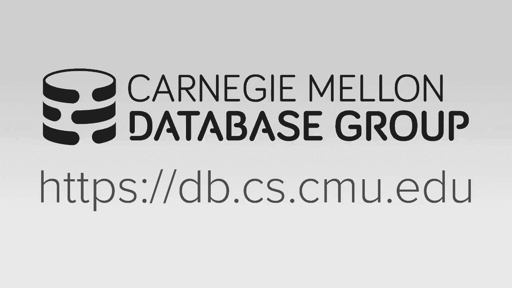
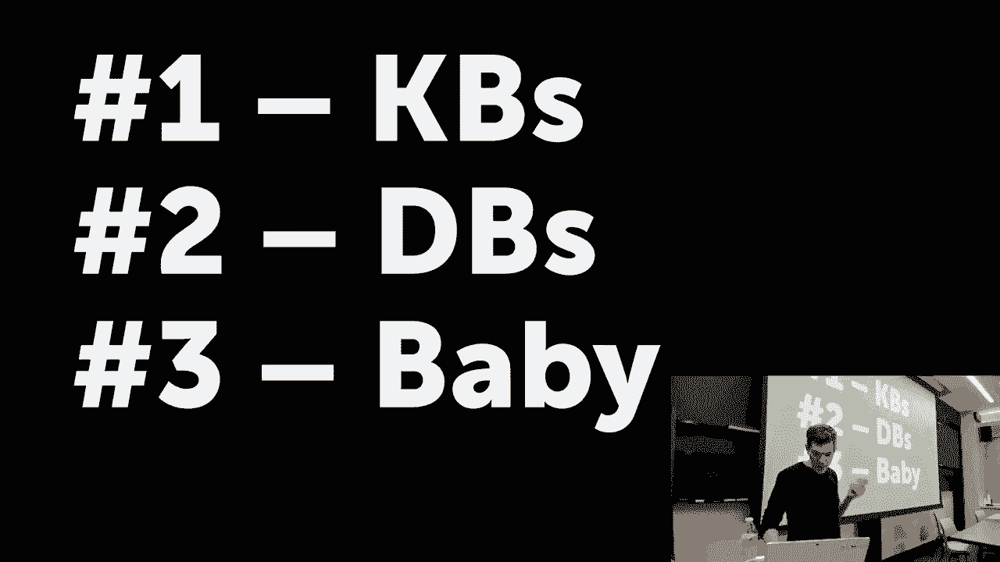
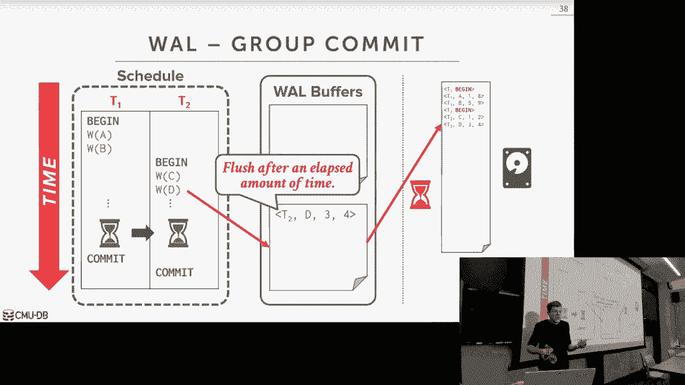
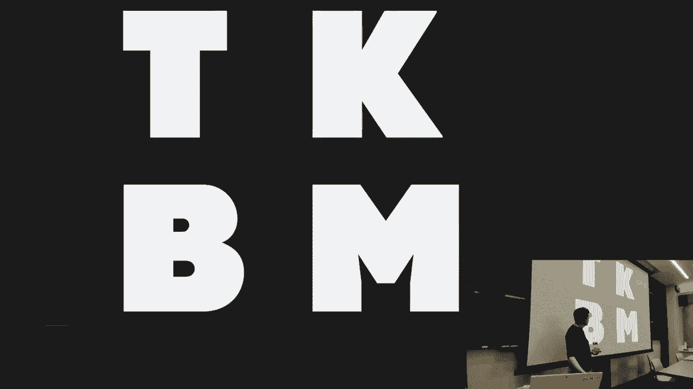
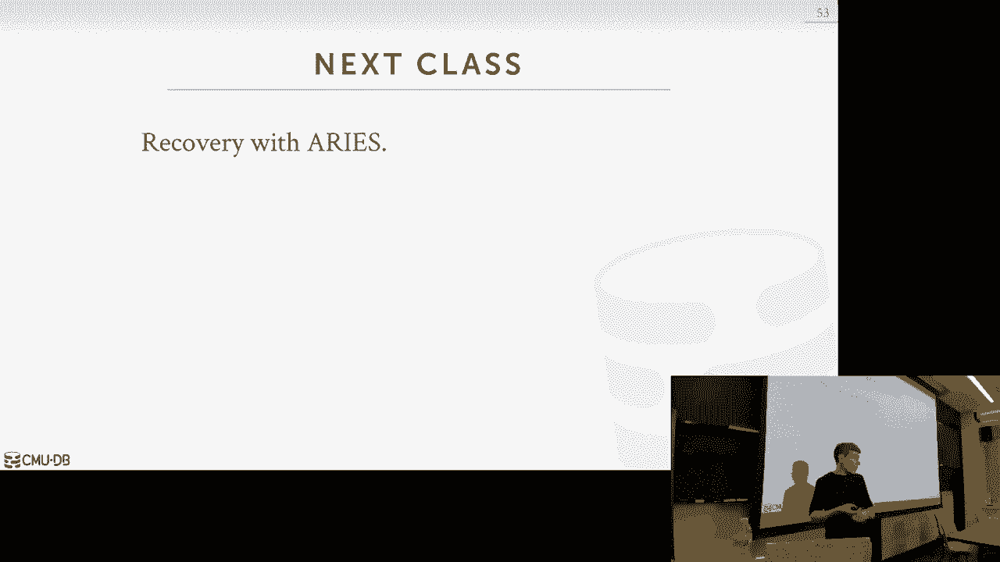

# 【双语字幕+资料下载】CMU 14-455 ｜ 数据库系统导论(2019·完整版) - P20：L20- 数据库日志记录方案 - ShowMeAI - BV1qf4y1J7mX

coming，his second girlfriend found out about，his third girlfriend so he went to Vegas。

to hide out that's his problem he has to，deal with that so all right I've been。

gone what what happened to me well my，wife had a kid and in theory yeah so。

let's be honest here it doesn't look，like me and I'm not sure it's mine yet。

so we're waiting for the paternity tests，come back so just hold off hold off your。

all's okay um the other thing I want to，update for you guys is that at the。

beginning this semester I said that I，only care about two things my life。

number one was my wife number two was，databases so I have an updated version。

for everyone now the new version is that，my wife is still number one databases。

are still number two and again depending，on the paternity test the the baby is is。

just you know sort of there okay uh I'll，say one thing to everyone here if do not。

get pregnant or getting buddy else，pregnant before you graduate school it。

is a nightmare I've done nothing for two，for the last two weeks except cleaning。

like poop diapers and like vomit stuff，like that it's it's it's awful all right。

with the kid，all right so for you guys that that，don't have any newborn children take。

care of here's what you have to do so，this is what's coming up you in in the。

next month homework 4 is due two days，from now on Wednesday at midnight。

project 3 what we do at the end of this，week on Sunday at midnight and then I'll。

announce this on Piazza and post this on，the website we'll do the first。

checkpoint for the extra credit will be，on will be on on Sunday November 24th。

after the one week after the project 3，is due and so what the checkpoint means，basically is yo-yo。

the URL to the article that you've been，working on the myself or the TAS will。

look at it give you feedback give you，suggestions tell you what looks right。

and doesn't look right and then that'll，submission，so I'll just say up front that you won't。

get full credit for the extra credit，unless you submit the check point right。

if you just Smith the check if you，submit the final thing at the very end。

without giving you know that's giving，you feedback you won't get full credit。

and I'll update the the document provide，information about all these things and。

then after that there's one more，homework and that'll be due in December。

and there's one more project and that'll，be due in December as well。

okay so Roma's done any questions okay，so let's talk about logging so the idea。

of logging and recovery is that we，obviously want to be able to persist any。

changes we make to the database and，whenever there's a crash or a failure。

so don't understand this problem let's，talk about the kind of system we've。

talked about so far see if the problems，are and then we'll go back now and add。

maldium recovery and we'll see how to，handle the issues with making sure。

everything is durable and safe let's say，I have a simple transaction t1 was your。

read on a write on AIM and it's a very，very beginning there's nothing in our。

preferable like we haven't brought，anything into memory and we only have。

one page that has the object a in it out，on disk so when our transaction starts。

it does the read on a and then we go，fetch that page from disk and bring that。

into our buffer pool that's good we know，how to do that we've talked about talked。

about about that already，so now when I want to do the right o。

name I modify the object as it exists in，the buffer pool right I make a flip that。

make me of it and make the change then，now my transaction says I wants to。

what does it commit me the application，tells us we want to commit when did we。

tell the outside world that your shows，actions actually committed well if we。

immediately say they tell us commit we，immediately say well you don't there's。

no deadlocks there's no time stamp，violations or validation issues with。

your transaction if we merely tell now，the outside world yeah your transactions。

committed what could happen well our，change is just hanging out here in。

memory again we pass it all our，commercial checks that's all fine but。

it's still sitting in memory so now if，like the most evil person for databases。

comes along like the Hitler databases，us，taps our data center or our machine and。

we lose power then all the changes that，were sitting out in involved tool memory。

are gone all right we never wrote，anything out the disk so if we tell the。

outside world that when you know，immediately hey your thing committed and。

nothing got persisted to disk we can，immediately you know we could lose power。

right away and lose all our changes and，now we totally outside where we。

committed but you come back and you're，your changes aren't there and that's bad。

so this is at a high level is what the，problem trying to deal with today。

all right called crash recovery and the，logging schemes it was a mechanism we're。

gonna use to prevent these things so the，recovery algos were talked about today。

are the techniques that the database，system is going to use to ensure that。

all the changes make the changes that，transactions make will guarantee the。

database is consistent all the changes，are atomic and all the changes are。

durable right so we care about a C and D，in the asset acronym we don't care about。

isolation for work talk might here today，cuz that's sort of handled by the，commercial protocols。

okay that's worrying about you know who，can reuse writes this is really about。

how can we make sure that our changes，are atomic consistent and durable so。

every recovery protocol our mechanism is，gonna have two parts the first of all。

the things we're gonna do at runtime，while the system is running while we're。

executing transactions and queries that，will well set us up so that if we have。

to recover after a failure we're able to，do that and not lose any any information。

so the first part is all the things we，do at runtime the，second part is if after a restart or if。

after a crash how do we use the，information that we collected from the。

first part when you're running normally，to go back and put the database back to。

the correct state so today's lecture is，focused on the first part what do we do。

at run time to make sure that we can，collect the right information so that we。

can restore the database correctly the，second part is on Wednesday if after we。

crash we look in here and figure out，what the hell we actually did and put us。

back to the correct state so for today，there's a bunch of stuff we need to talk。

about before we actually talk about the，method we're gonna use so first we gotta。

talk about what kind of failures we，could have in our system and how can we。

you know which ones we can can recover，not recover from then we're started。

talking about how we actually going to，manage memory and our buffer pool in a。

slightly different way than we've talked，about so far so that we can assure that。

we can again we can recover after a，crash then we'll talk about two。

techniques to do database recovery the，first is shadow paging the second is。

right ahead logging the spoiler would be，right ahead logging is the better way。

this way what every single data system，actually uses but it's good to know what。

shadow paging is just to see for stoical，reasons and see why this is superior。

then we'll talk about how two different，types of logging and write ahead logging。

like what's actually in the log record，itself and then we'll finish up talking。

about checkpoints what - then we'll，segue into what we talked about on。

Wednesday to do a recovery ok all right，so the the database system itself is。

going to be divided so conceptually into，different components based on what the。

underlying storage device they operate，on right the buffle manager keeps things。

in memory the disk manager keep things，on disk right ones volatile ones。

non-volatile and then so so based on，that we want to keep track of and。

understand how can these different，components fail based on or have。

problems based on the different types of，failures we can incur while we're。

running transactions while we're running，queries and in the base of that we can。

figure out what you know what do we，actually need to support in our recovery。

protocol so there's three categories of，failures and we'll go through each of。

these one by one transaction failure，system ferrars and storage media，failures so。

the spoiler or the the heads-up for what，I'm talking about we care about the。

first two the third one is impossible to，handle and we'll see why as we go along。

so transaction fares over all the things，we talked about so far when we talk。

about currency control these are things，like when like when the transaction has。

a deadlock or transaction tries to，update something that it's not allowed。

to update or update a value nor certain，way that's not update right these are。

things that we can't allow the，transaction to continue and therefore we，changes。

so again logical errors would be the，transactions trying to violate some。

internal integrity constraint that's，that's put upon the database or a。

referential referential constraint like，if you try to insert something but。

that's a foreign key preference and that，foreign key doesn't exist then the。

database system says you can't complete，your transaction has to fail we're gonna。

make sure all your your changes get，rolled back and never persist even。

though if we you know we start multiple，times internal state errors are the。

things we talked about under two-phase，locking and timestamp ordering right if。

we have a developer to between two，transactions we got to kill one of them。

and abort them rollback all its changes，and then you know make sure that then。

they don't persist after a crash，so our database is logging protocol。

needs to handle both of these I think，these are sort of obvious then we get to。

actually the system failures the，hardware failures that we can count for。

in our protocol as well so the first is，the software failure these are where the。

the database system itself is buggy，right there's some crappy code in the。

database system and like a divide by，zero and now the software it's system。

itself the David system itself crashes，right gets a six set of boards and so we。

need to be able to account for those，kind of failures in our database system。

and make sure that you know any，transaction is still running they get。

aboard and rollback correctly or any she，was actually that did commit before this。

this error occurred all this changes are，persistent the hardware failure is when。

the actual machine that our data system，is running on crashes or ceased ceases。

to operate or runs okay this could be，someone like tripped over the power cord。

or like there's a loose wire plugging，into the disk drive right the system has。

a failure and they can't keep，the operating system you know crashes。

the Davis system crashes and we need to，come back and recover the database state。

so in order for us to make this you know，be it'll handle this we have to make。

this fail stop assumption and that as we，assume that the harbor is not going to。

suffer a unrecoverable damage if we have，a hardware failure meaning like if we。

have a spin against hard drive and，there's the needle writing on the。

platter if we pull the power and the the，the needle is not gonna like Kareem into。

the platter and sort you know mess you，know messing up sectors we assume that。

if we if we crash have a heart failure，then we can always come back and recover。

the correct state so the last category，there is the ones that we can't handle。

at all in our database system simply，because the database system although。

it's you know as great piece of software，it is it can't been you know the the。

pencil is a matter to its own will so a，harbor a non repairable heart affair。

would be like the example of the needle，crashing into the platter or like find。

like the machine on fire and melt all my，disks no database system can recover。

from that right so we're not gonna，design our protocol to account for this。

we can do other things like just，replicate the database to overcome this。

or maintain archive backups that we can，recover if there's a crash but that's。

not really recovery and the same we're，talking about today like if I had to。

restore it from an archived version，that's just backup and restore that's。

you notice me loading it in from from a，you know a separate copy that's not。

doing anything extra special the kind of，things we're talking about today to。

recover the database State so again we，only care about the first few failures。

no database system can account for this，but through redundancy which we'll talk。

about with distributed databases we can，we can try to avoid this and mitigate。

the issue okay so the entire semester，we've been talking about discarding。

database systems right and so we've，already covered this already but now we。

need to sort of go over it again and see，how this is gonna be an issue when we。

talk about logging and recovery so again，and it's what a database says what says。

that the systems of design such that B，primary storage location is assumed to，be on disk。

and at anytime you want to read a record，or manipulate a record you have to first。

copy it into memory into your buffer，pool make your change and then。

eventually write it back out the disk in，order to persist it this is the bond。

omean Architecture from the 1950s it's，not specific to database systems but。

it's it's the operating assumption we're，basing our tired discussion on and there。

are some special newer hard drives that，can you know have CPU cores on the disk。

itself and you can try to manipulate the，data down there but that's just sort of。

moving the problem somewheres else for a，purposes we can ignore that and say you。

know what we want to modify something we，bring into memory make the change then。

write it back out to disk so the，question is gonna be when do we actually。

write those changes out so when you guys，built the buffer pool stuff from before。

all you're really doing is just saying，all right well this page should be。

evicted it's dirty so therefore I have，to write it back out the disk and you。

didn't worry about who actually made，that change and whether it was the right。

time to actually write that change out，the disk so that's the thing we need to。

account for in our logging protocols，today so the the basic guarantees we。

need better to ensure in order to，provide the atomicity because it's the。

in durability guarantees is that if we，tell the outside world that their。

transaction is committed meaning we send，them an acknowledgment say you've。

committed then all of those changes are，persisted and durable forever someone。

may come and overwrite those changes and，update them that's fine but you know。

before that you know those changes，should always persist forever and。

likewise if any transaction makes，changes and those changes make it out。

the disk but then that transaction，aborts or doesn't complete correctly。

before the crash we need to make sure，that we can reverse those changes as。

well so those are the two main，guarantees we need to have in our。

logging protocol and the core principles，we're going to use to Nord provide these。

guarantees or undo and redo which are，exactly as they sound，so with undo it's basically information。

we're going to maintain to allow us to，reverse any changes to an object in the。

database that a transaction has made so，it's like here's what the old guy used。

to be for this attribute for this tuple，and，store that somewhere so that if I ever。

need to reverse the change that someone，made to it I can go always go put put。

the old value back in and then redo is，the opposite of that redo is the。

information needed to reapply a change，that a transaction made to to a to an。

object in the database right here's the，information on how to say you know。

here's what the change here's the change，they made at this given time if I ever。

need to go back and make that change，again I might redo information tells me。

how to do this so based on these two，principal or primitives we can now build。

on this and I'll have to build something，more complex a logging protocol that。

allows us to generate this information，at the right time and in the right way。

to allow us to restore the database，after a crash how we're actually gonna。

use undo and redo and when this，disk，it's gonna depend on how we're gonna。

manage disks should I manage dirty pages，in our buffer pool so let's look at more。

complex example here you have t1 t2 t1，does a read on a it right on a t2 does a。

read on be right on B so in this case，here we're not worried about deadlocks。

or concur to toll we just assume that，they're allowed to acquire these locks。

into whatever they need to do we only，care about this point it like the low。

level changes they're making to these，objects so we transaction t1 starts we。

do a read or a there's only one page in，our database and so in order to do the。

read on a we got to first bring into our，buffer pool and then the transaction is。

allowed to read it then it does the，write on a and again it's already in our。

buffer pool assuming we can get the，latch on it，we can go ahead and make our change。

updated directly in place we were，ignoring multi versioning for now we。

make our change right there and then our，operation finishes now we have a context。

switch t2 starts running it does a read，on B the page is already in memory so。

that's fine that happens right away then，it doesn't write on B again already in。

memory we we assume you get the right，latch on it we can make our change and。

we're fine so now we go ahead and t2，wants to commit what needs to happen。

here well there's two decisions we have，to make，the first is in order to be able to tell。

the outside world that our transaction，is committed should we force the the。

buffer pool to flush out and write out，all the changes that it made for this。

page out the disk yes or no yes right，because you have to do theirs otherwise。

if I crash a Hitler comes along and it，takes to take this away all my changes，correct。

t1 modified a in the same page so should，I be allowed to write out a page that's。

been modified by a transaction that has，not committed yet out the disk he's。

shaking her head no well what's the，problem right bees in here T two's made。

that change but he wants to commit it's，allowed to but there's this other change。

in here from an uncommitted transaction，so let's say that all right well I take。

it's better for me to write out t choose，changes even though t1 has a committee。

yet so I write write those out the desk，but now I you know I tell the outside。

row tteyuu is committed I'll go back to，t1 but now t1 aborts so what needs to。

happen here yes right so I need to roll，back the transaction so I need to roll。

back the change it made on a I can do，that memory pretty fast right that's not。

a big deal but I've wrote out the page，two you know that existed in with the。

change that t1 made out the disk so now，I got to go make that change in here and。

then write it out again to reverse the，change that I made what's the problem of。

that exactly so he said by the time I，get my abort I maybe I've reversed the。

change here before I overwrite my change，out the disk I crash now I come back I。

don't have any of this I only have，what's on disk and now I have a change。

from t1 that I that shouldn't be there，but I don't know it shouldn't be there。

because I have no extra information to，tell me that T，t-1 did not actually commit so the two。

things we talked about here where the，two decisions we had to make we're here。

whether we should require to force the，the transaction and write out all its。

dirty pages out the disk but fourth law，to commit and whether or not we're。

allowed to copy out a page or a victim a，strimer buffer pool from a transaction。

that has not committed yet so these two，policies are called steal and force so。

the steal policy says whether，transaction they by their database。

systems allows a uncommitted transaction，to overwrite the most recent committed。

value of an object in the database ad on，disk before it's allowed to commit so if。

you say if steal if you're using a steal，policy then you're allowed to do this if。

you're using no steal then it's not，allowed the way to think about this is。

if I'm running out of space my buffer，pool from one transaction is that。

transaction allowed to steal a page in，the buffer pool or slot in the buffer。

pool from another transaction that has，not committed yet right that's why it's。

called steal the forest policy says，whether we require that all updates that。

a transaction makes to any object in the，database have to be written to disk。

first before it's allowed to commit so，if you say I'm using the forest policy。

then it's required to do this if you're，using no force then it's not required so。

forcing is gonna make it our life easier，because it's gonna allow us to recover。

rather quickly because we just come back，and we see all our changes are there。

right we don't have to you know look at，any other place to try to redo。

information to redo the changes but the，steal policies would be problematic。

because now we're clean writing out，changes or transactions that have not。

committed so let's look at one way to do，this let's look at the no steal forest。

policy right because they're sort of，they have a flippin goals and you know。

you can only choose you know two，combinations of these two things so no。

steal force means that no steal says，that any uncommitted changes any changes，made by Duncan。

action cannot be written a disk and the，force says that any change all changes。

ever turns actually may have to be，written to disk before the transactions。

allowed to commit so t1 starts does a，read on a we bring that a buffer pool，that's fine。

now we do the write on a update the the，the page and our buffer pool then we do。

a context switch of t2 t2 does a read，then does the right we update the buffer。

pool then now wants to go ahead and，commit again the forest policy says that。

all the changes for this transaction，made have to even out the disk but we。

have this this change from t1 hanging，out here as well so we need to get rid。

of that so what do we need to do right，copy the page in memory right only apply。

the change that we want or reverse this，other change we don't want and then we。

can go ahead and write that out so now，when we when we come back over here and。

we abort t1 now it's super trivial for，us to reverse the change that all the。

change that t1 made because it's just，updating this this this page in memory。

we don't have to go out the disk was you，know no dirty dirty change got written。

out there so the database system is，going to maintain some extra metadata to。

keep track of the right set over these，different transactions you guys already。

solved this under two-phase locking and，and OCC under concur to your particles。

so we already have that information，about what changes they made to what。

objects so it's not that big of a deal，or extra work we have to do to be able。

to reverse that change when you make，that copy all right and it's in memory。

so that should be pretty fast so this，seemed like a good idea or a bad idea so。

that's one what's one good thing about，this approach I've already said it。

detector right there it's super trivial，to rollback after a crash there's。

because there's nothing to rollback，because I know that anything is that。

that's on add on disk should be out on，disk because they're all from committed。

what's that sorry is there a deadlock，between two transactions so his question。

is going back here in my example here I，have one thread or one transaction wants。

to write out something disk it makes one，copy but then another transaction may be。

committing at the same time and it，modified the same page you shouldn't。

make another copy we can ignore that we，assume that I mean you have to have a。

single latch protect these things，there's no way to get around that but we。

can ignore all that here so there's，there's two problems actually three。

problems yes so you're close these first，two he said the now and your processing。

page to commit this copy here it's more，work it's on the critical path it's in。

the critical section of the commit the，commit protocol for the commercial。

mechanism that becomes more expensive，yes absolutely right yes but more than。

just CPU cost it's actually the you have，to write this thing out multiple times。

now like so say if you go back if we go，here if t1 didn't actually abort and。

actually committed then in order to get，it's changed a out the disk I'll never。

write it out again so for every，transaction that commits I potentially。

have to write out the same page over and，over again yes exactly，he's actually right so one big issue。

with this in my seabone example here I，have one page say it's four kilobytes。

the harbor I can guarantee that I can do，a four atonic four kilobyte page right。

but if I update multiple pages the，harbor can't guarantee，that for me so I could if I update four。

pages I've read out the first two then I，crashed before I get the next two now I。

come back and I don't have you know I，have a torn up dates so that see that's。

right that's one big problem there's，another big one that's a more nuanced so。

again I have one page of this this is，sort of trivial example but in this case。

here for a given transaction since I，can't write out any dirty data from。

uncommitted transaction to disk that，means I can my my right set all my。

transaction has to fit entirely in main，memory so if I have a table has 1。

billion tuples I have a single query，that wants to update all 1 billion。

tuples but I can only store 1 million，tuples in my buffer pool then I can't。

run that transaction in under this this，this this system cuz I'll hit the first。

1 million update them that's fine then I，try to get the million plus one and then。

he says can't you is there a workaround，can you write into a temporary spot yes。

give me two slides that is that is that，is the solution yes it's not a good one。

but it's one okay so no steal force is，the most easiest way to actually。

implement a recoverable correct durable，buffer pool manager and a disscourn a。

database system because I don't have to，do any redo after a crash I just come。

back my database is guaranteeing the，correct state and I never have to go you。

know undo anything from an aborted，transaction at run time because I know。

none of us changes ever made it out the，disk but as we said already that you you。

can't support transactions that have a，right set that exceed the amount of。

memory that's available to you the，commit protocol is now more expensive。

because you have to do all these extra，extra work to figure out what things。

actually should be written to disk where，it's not written disk and the and you're。

doing multiply out to disk you know for，everything that could have just been one。

right now for every single transaction，you're writing the same page over and。

over again and if you're an SSD those，things actually can't be written forever。

right you can burn out the cells on the，SSD，you know it's in the hundreds and。

thousands right Purcell but eventually，to keep doing this if you're just。

running a lot you'll burn it out in a，short amount of time so nobody actually。

does what I'm describing here right it，is the easiest way to implement it but。

nobody actually does this the thing that，he alluded to that people have tried。

before is to basically store the changes，you're making from uncommitted。

transactions in a temporary space and，then at some point when the transaction。

commits you somehow resolve the the，directory or the page table to now say。

here are actually the correct the latest，versions of our of our pages and that。

way if you crash you just ignore，anything that got modified in this can。

those temporary buffers so this is what，shadow paging is we briefly touch about。

this in the very beginning when we talk，about current control this is one way to。

do a no steal force buffle management，system that avoids some of the。

complications we talked about before so，lay shadow paging worships it's like。

it's sort of like multi versioning but，at the page level instead of the tuple。

level and there's only going to be two，copies at any given time there's always。

the master copy that's the latest most，recently committed version of of the。

database and then there's the the shadow，copy that all new transactions are going。

to end up modifying so when a，transaction commits we want a way to。

atomically switch the the shadow to，become the new master I mean we can do。

this in such a way that we don't worry，about torn rights if we're updating。

multiple pages so unlike in in Multi，versioning where we copy every single。

thing we're going to modify actually，it's like multi burgeoning but instead。

of doing a tuple of what you're doing at，a page level and you can organize the。

the directory of your pages as a tree，structure so now you only need a cat。

copy sort of portions of the tree and，then just do Pat copying to update them。

in place or apply them to the the page，table without having to recreate the。

entire hash table all over again，so at the root of this tree is gonna be。

the database root that's always gonna，point to the latest master master。

version so that means we can make a，bunch of changes to the low portion of。

the tree but update the lease to point，into our new pages that we just created。

and then when we're ready to apply the，changes to atomically across all these。

pages we just swing this database root，pointer to now point to our shadow。

portion of the tree and then all all our，changes get immediately become。

immediately visible so a high level，looks like this again there's this。

database root and it points to the，master page table and this master page。

table points to our pages out on disk so，I'm gonna briefly go with this but goof。

is sort of quickly but let me just get，this get to the example so say we have a。

transaction comes along t1 any，transaction that's read-only can go。

always go to this database root and go，to the the master copy and see a。

consistent version but if we have an，updating transaction we have to create a。

shadow page table that the the，transactions going to modify so the very。

beginning the shadow page table it just，all its entries point to the same pages。

that the master page points to the，master page table points to them so now。

as this transaction starts modifying，pages we're going to make a copy of that。

page into a new location in our，temporary space in on disk make all our。

changes there right and we keep doing，this for all all the other all the other。

pages we want to modify and then when，this transaction says I want to go ahead。

and commit all we need to do is update，this database root which is stored in a。

single page to now point to that the，this portion or this patient of the。

shadow page table so we flush that，change out the disk and then now it。

really becomes that becomes once that's，durable we then swing that pointer in。

memory and then we now know that，everyone can can follow this one so if a。

new transaction comes along and once it，wants to you know want to read what the。

latest version is of the database it，just follows this route and finds the。

questions wisely Davis root written the，desk right so they crash right so so I'm。

here byte resident transaction says I，want to commit I want to tell the。

outside world I commit it right so if I，don't update this database route I crash。

and come back and now I look at my date，of his route and he's putting to the。

master page table and all these changes，are gone correct yes it's Alama it's I。

think it's a page number two page ID，right dad has to be durable cuz if I。

crash to come back if I tell Fiats I'd，world I commit but then I crash I'm like，alright wall。

I'll assume whatever this thing was，pointing out is the is the root of the。

page table and that means I told the，house I weren't I committed but now all。

my changes I made here in the shadow pic，table are gone they're still there on。

disk it's just no one can see them there，you can't logically see them so it's as。

if they didn't exist you quit your，question is can you be clever and figure。

out a way to when you write out these，pages put a little mark in here to say。

yeah you're the latest version yeah so，all right so this guy updated three。

three pages so I need to now record that，okay you updated three three out of X。

pages or n pages to make sure that if I，crash come back I see all those changes，yeah。

essentially because you know essentially，I'm disc right now without the according。

the data make sure you have some，something like out of some out-of-date。

pages there right use except to keep，track of whichever the data major tells。

you which ones are the most up-to-date，well yes essentially whatever。

transaction commits lets you bring some，pages out to disk with those two pages。

right now for this you may know the，timestamps or the transaction or。

something sure my database is 100，petabytes that this is one page it has。

everything I need always can always，think in extremes yes excellent so he。

said and in my example here I have one，transaction what if I have a bunch of，this work。

so you either have to have only one，transaction run out of time which sequel。

light does or you you have to commit，them in a batch so I say I ignoring two。

days locking because all that is，orthogonal to this assume that you don't。

have a way to figure out who's allowed，to update what if I have multi Tunes。

actions within the same batch updating，things I have to wait until they all。

finish then they all get committed I，swing mop my database root pointer right。

and then it get all Tom I can apply so，that's one way to do this if you assume。

all transactions are going to finish in，a reason amount of time if you have one。

transaction that takes an hour then you，either need to kill it if for a certain。

amount of time or wait that one hour，before everybody goes it goes ahead and。

commits some systems do this it is rare，it's most systems don't don't operate。

this way but you most absorbing do，shadow paging all right IBM did this in。

system or in the 1970s they abandoned it，in the 1980s when they did db2 because。

you have fragmentation issues right so，now I blow a master page table I blow。

away these pages here because they're no，longer visible right so this is all that。

I have now but it doesn't match up the，ordering of pages here so now we do。

sequential scan I you know I may not be，reading things in the right order so I。

can't do clustering index is what they，were trying to do back in the day。

so nobody actually does this but you，have to be right you're there you to。

commit him to bat or have one，transaction from，a time yes you know so you're going back。

to the previous table word t1 t2 would，that handle in this case yes if you。

assume t1 t2 are committing together in，the same batch right so yes q this is。

Hanna exactly in that case because again，I have the undo information I need to。

reverse any changes that a transaction，made in memory so if as long as that。

thing has been written out the disk then，I can just reverse it here and I'm fine。

and if I crash before I flip the Davis，reporter then I'm fine okay so nobody。

actually does this so let's jump through，more quickly and get to the good stuff。

so the reason why this sucks it because，copying the entire page table is。

expensive you even if you use a tree，structure it becomes it's not cheap and。

the committe overhead is high because，you have to update flush every single。

page that you modified the page table，and the route the date becomes。

fragmented you need a background garbage，collector just like in a multi version。

cartridge hole and you either have to，commit everything in a batch or only。

have one writer out of time so as I said，the only systems I know that actually。

does do this or a couchdb but I think，CouchDB is giving is going away from。

that and doing their switching over to，Roxy ve l MV B is a tree based system。

that uses M map so that's sort of hidden，from them and then against the system。

are in the 1970s but they banded that，IBM abandoned that in 1980s it one。

system you probably have heard about，that does something similar to this as。

sequel Lite but this is what sequel I，did up until 2010 then they dished it to。

and switched to over what we'll talk，about next，the write ahead logging approach so。

what's eagle light would do is that，instead of copying the，instead of copying the page that you。

would they're gonna modify and make a，modification in the copy they have a。

copy original page write that out the，disk then make the modification to the。

master version and then if you commit，you just blow away the the copy that you。

had or if you crash before you commit，then you then you look back in that that。

separate copy file and restore the，restore the change so they would call。

this the Journal file so let's say that，my transaction was a month update page。

two so before I modify page 2 in memory，I first make a copy to it persist it on。

disk and a journal file and then when，that's done I can modify it。

same thing with page 3 before I can，modify it I make a copy into separate。

journal file then I go ahead and make my，change now let's say before this。

transaction actually commits we end up，flushing out page 2 out the disk but。

before we flush out page 3 and complete，and actually commit this thing we crash。

alright so everything gets it gets blown，away in memory so when we come back we。

would say alright well I have a journal，file so I need I need I made me make。

sure that all my changes that are in，this journal Fog cuz these the original。

versions they get written out back to，the the original disk file so again like。

I said this is what this what sequel，light did up till 2010 and then they。

abandon this for performance reasons to，use to write headlong okay so this。

shadow paging approach it'll guarantee，correctness but it has some of some。

performance issues and the main，performance issue is going to be that。

it's we're gonna do a bunch of random，i/o so in my back going back here in the。

sequel Lite example when I had to replay，the journal file I'm updating random。

locations on disk to in order to restore，the database back to the correct state。

and here's a shadow paging when I was，flushing out all my changes and say my。

transaction actually committed again I'm，doing random i/o to different locations。

to persist all the changes from this，from the shadow Shadow Copy so even then。

with it fast SSDs that we had today，sequential i/o has always be faster than，random i/o so we need。

way to convert all those random iOS into，fast sequential i/o and still have all。

the durability guarantees that we'd want，in our logging protocol so this is what。

right ahead logging is gonna is gonna，achieve for us so the idea was right。

ahead logs that we're going to maintain，a separate log file on non-volatile。

storage along with our table heap and as，transactions make changes to the。

database we're gonna make entries into，this log file that record the changes。

that were made and then when a，transaction go has goes at once and I，hope go ahead and commit。

we just need to guarantee that we，flushed the log records that they。

generated out the disk and not the，capital changes to the to the objects of。

the pages in the buffer pool so for，owner for us right head log in to say。

our transaction is committed and it's，durable we only need to flush the log we。

don't need to flush anything else and so，now the log file is just switch why oh。

because there's keep appending to this，this file you know would you know page。

after page of the page that again that's，when try always to be much faster than。

the random i/o of of writing out the the，random pages and again the reading。

reason why it's call it right ahead log，is because we make sure that any log。

record that corresponds to a change made，to an object in the database is written。

a disk before that object can be written，a disk so that's that's the very。

important most important thing to，understand about write ahead logging so。

write ahead logging at his example of，steal and no forest because we're gonna。

be allowed to write dirty pages out the，disk before transactions actually commit。

as long as their log records have been，written out first and then it's no for。

us because we don't require all the，changes that the transaction made two。

objects we burn out the disk we only，require that the law of records be。

written as a disk so again this is the，most important thing you need to。

understand in order to understand the，protocol so the way anything about this。

is like if I have a transaction that，updates a thousand tuples I potentially。

have to create a thousand blog records，so let's say that thousand tubers are。

stored in a thousand pages my log，records could just be stored in a single。

page and therefore I'll need to want to，do write one one page out to flush the。

log rather than all the pages that they，were modified so there's me a bunch of。

performance advantages we're going to，get from this approach so the database。

is going to stage all the changes that a，transaction makes in these log records。

in volatile storage this is typically，bet also backed by the buffer pool and。

then again this is we already talked，about everything gets flushed out and。

they were not considered committed until，we know that all our log records have。

been written out to disk as well so the，protocols don't work this way so when。

our transaction starts we have to write，a begin record into our log that's gonna。

tell us that hey there's this，transaction that started it exists，here's some metadata about it like。

here's the identifier for an image，transaction commits we're gonna write a。

commit record out to the log and when，you make sure that this commit record。

appears in the log after any log record，that corresponds to changes of a bet。

transaction made it's gonna be，interleaved potentially with other。

changes that other transactions are，making but for our one transaction that。

we care about at this point in time our，commit record needs to appear after all。

its changes I think they because once we，see scenes come into law we know there's。

no other change the transaction could，ever make so now in each log record。

first in the very you know it's an，initial simplistic version of the。

protocol I'm teaching right now we need，to need to record four things the unique。

transaction identifier right like the，timestamp the transaction the sign when。

it was started the object ID of the，thing that actually modified and then。

the before value with the corresponds to，the undo and then the after value that。

corresponds to the redo so this，information by itself it's enough for us。

to be able that we need to in order to，recover the database and for all。

possible errors that we talked about at，example here，so we just have t1 there's a write on a。

write on beam and so now in memory we，have our right ahead log buffer as well。

as our buffer pool so when we do the，transaction stars，begin we're going to add an entry into。

our log record that says hey there's a，transaction that just started it's。

usually not done exactly when you call，begin it's usually done unless you're。

running with auto commit turned on it's，usually done at the first right but。

different systems can do different，things so now I do write our name so the。

first thing I need to do is add our，entry to my log buffer that says here's。

that here's the change I'm making to a，right here's the Bears than before value。

and here's the after value and once，that's in my log buffer now I go ahead。

and make my change into my page in my，buffer pool all right we'll talk about。

this more that next class the reason why，you have to do this before this because。

there's gonna be this thing called a log，sequence number that's gonna get。

assigned to the log record that we had，to use to figure out what was the what's。

the log entry that course but that，changed this particular page so you may。

think who cares into the muttering out，the disk can I just update this this。

first then add this thing in here we'll，see next next next class why you have to。

do this first followed by this so then，now I do the right on B same thing I add。

my entry to my right hand a redhead log，buffer in memory then I go ahead and。

make my change here so now when I go，ahead and do a commit，I add my commit record to my redhead log。

buffer then at some point I'm gonna，flush it out the disk in this case here。

since we need to tell the outside world，that a transaction is committed will。

immediately flush this out do an F sync，and once we know that's durable and say。

from disk at this point the transaction，is considered safe to now return back。

the application and say that it's，committed so now who cares that Hitler。

comes along and kills shows our buffer，pool because everything we need to do to。

replay the changes that it made is now，safe on disk so if this page number got。

written out we can just look in that log，and replay it to update the page as。

needed to do exactly the same thing the，transaction did when it ran the first。

time so again at a high level is this，clear，yes our question is what is instead of。

storing the redhead log buffer as a，separate file what if I stored it in the，page itself。

I said you told me like a log structure，storage we talked about earlier yeah so。

in the log structure storage you don't，you don't have this on disk you only。

have this yeah it's a Volks record yet，correct and the the what your what。

you're giving up by hat not having this，is that reads are now more expensive。

because you have to replay the log to，figure out what the page I should look。

like when every read but it makes some，write super fast cuz now you don't do。

extra writes to write out dirty pages，you only keep appending things to the。

log so there's a trade-off so this will，be like rocks DB leveldb Cassandra bunch。

of systems do these log structured merge，trees log structures storage yeah for us。

we're time I here assume you have table，heaps we write everything we talked。

about we have table heaps we have，override a head log we're not doing the。

log structure stuff we talked about，before but the concept is still the same。

you just you just don't have this you，don't have a table，so his question is if I have to。

transactions and they're updating the，database are there log records and are。

mixed in the same log buffer or they，have separate log buffers they're。

intermixed again this is this is this is，independent orthogonal to the commercial。

stuff so some higher-level part of the，system that says set determines whether。

one transactions allowed to update you，know what we know this object of that。

object at this point we assume that，they're allowed to do that and they did。

do that they're going to do it and，therefore we just we just add their law。

records into the log file we don't eat，we don't maintain several log files for。

different transactions because we have a，transaction B we know who did what，yes okay。

so again if we crash there's everything，we need to restore the database is in。

the log so to sort of implementation，questions one is when should the。

database assumed write out the log，entries to disk，well the talks as we said it's whenever。

the transaction commits before we tell，the outside world our transactions going。

to go ahead you know is fully committed，we do make sure that those log records。

and the buffer are now stored out at on，disk that's all we need to be able to。

restore the database but my example here，I only showed one transaction and when。

they said commit you know I just mean，did s sync and write it out but that's。

actually gonna be super slow if I for，every single transaction I do an F sync。

when they commit to write out it's a log，buffer that's not what I'm gonna want to。

do because saying F sync takes five，milliseconds on a slower disk then I can。

only commit one transaction every five，milliseconds and that bet that's gonna。

be that's gonna be bad I can only do two，thousand transactions a second so what。

every system actually implements instead，is what's called group commit where。

you're gonna allow multiple actions to，buffer up a bunch of changes in the log。

buffer and then at some point you make a，decision all right now I'm gonna go。

ahead and write whatever's in the log，buffer out the disk and then may include，not commit。

yeah but that's fine because we know how，to undo their the undo their changes。

because we have the undo information in，you're going to end up happening。

implement in in project 4 so the way it，basically works is that in the simple。

form you instead of having one log，buffer you have to log buffers it's sort。

of like shadow paging there's the master，there's the master when everyone's。

writing to and there's the background，one that you're eventually write to next。

so when my transaction starts t1 here，doesn't write on a or you always go to。

you go to the first one first add the，begin then do the write on a to write on，right。

at t2 sentry-go right on C but now at，this point my log buffer is full so I。

can't add anything and anything else in，here so I'm gonna go ahead and write。

this out the disk all right and I have，to do F sync so that you know that's。

gonna take some time so in the meantime，now I switch over to my second log。

buffer and now any other changes that，transactions may get added to this thing。

here the idea is start your wild ones，getting read out in a disk you fill up。

the next one when that gets filled then，ideally the other ones been flushed out。

so now then you write the write the，second one out and then fill up the。

first one so just going back and forth，while ones getting flushed you fill up。

the other one but let's say for this，transaction here it stalls right it does。

something right it does additional，computation so neither transaction are。

generating new log records so instead of，just waiting till it's filled up before。

I write it out there's also a second，prop process where you you say well if。

it's been a certain amount of time since，any since I've last flushed this thing。

out let me go ahead and flush it out and，the idea is you should want to tune it。

such a way that like if you know that，what the f sync time is write something。

up the disk then you sort of set your，timeout to be to be that so like if if。

it takes me five milliseconds to write，write the first page out or the first。

blog buffer then I'll wait five，milliseconds for the second one and when。

what five milliseconds is up if I'm not，full yet I go ahead and write that out。

so again group commit basically says，instead of one transaction F sinking the。

log when it commits you back to bunch of，them together and then you amortize the。

essent costs across multiple，transactions so if you're the first。

transaction that gets added to the to，the log buffer and then you commit。

you're kind of like you're screwed，because you have to wait the longest。

before you're actually written out the，disk but if you're the last guy then。

it's as if you get that you're getting，the disk exactly to yourself because。

you're not waiting any time so on，average this works out to be much better。

all right so then the the last question，is when she'll be actually write the。

dirty records out to disk，well this depends now so now that we。

said that the law buffers everything we，need to do everything all the operations。

we need to be able to redo the changes，that transaction is made and we say that。

the log records that correspond to，changes to pages are written out to disk。

before this page is written out to disk，it's not actually immediately urgent for。

us to flush all those pages immediately，when the transaction commits because the。

law workers have been flushed so now on，our replacement policy in our buffer。

pool manager we can account for this we，can say all right well this thing is。

dirty but I the law workers been written，out for it so maybe I don't want to Vic。

this one right away Brian can evict it，right away where this other one here。

although it's probably as a higher，priority for me getting removed or。

getting evicted its log records haven't，haven't been flushed yet so maybe I。

don't want to dick that one because I，have flush the buffer first before I can。

write that out so this this idea of log，and recovery permeates throughout the。

entire system and now we need to account，for the other parts of the system but。

we've already talked about we can update，replacement policy to keep track of。

these things yes all right so so this，question is well in these example we。

don't recommit so let's say that I have，a commitment log buffer but before I。

read up at this high crash who cares，ah no no the application said commit we。

haven't told me you committed yet we，only tell them that they commit when。

that log buffer that corresponds that，commit message is written to disk that's。

the genius of this right because again，the the if we're doing OCC where we're。

doing validation after after the，transaction commits we still might end。

up getting aborted right at this point，here at the law buffer we assumed all。

that's taken care of so we see a commit，message here we don't tell you know。

there's no callback to say yeah you're，good everything's durable until the law。

buffers we've written a disk his，question is is the application hanging。

for a while yes correct but I mean like，what else would you do otherwise if you。

don't want to wait to see what you，committed that's fine but you could lose。

data right so if I don't run it a，transaction then then you know actually。

even even if you do auto commit here's a，single state by transaction I think it's。

still gonna write a write a log record，before it comes back and says your。

things actually finished I don't some，systems lottery turn allow you to turn。

off logging on a per transaction basis，so I can run a transaction that would。

say I make a bunch of changes but when I，commit don't write anything out the log。

you could do that some systems will，apply to do that by default they don't。

do we need to commit entries about，renewed transaction or we don't his。

question is do we need to commit entries，for a retailing transaction what do you。

what what would the log record beat。

there's nothing there's nothing to log，this is what I'm saying like going back。

here uh oh [ __ ] sorry guy Taemin hmm oh，that wasn't me that was PowerPoint sorry。

so I showed the the right and this in，this case here I showed that when the。

transaction started I had to begin entry，you don't have to do that right because。

if it's if it's a read-only transaction，like if this thing called begin but then。

did a bunch of reads then I'm storing，crap that I don't care about you could。

do that you don't have to though right，in some systems you can actually declare。

a turns actually read-only at the，beginning that you say begin as。

read-only or something in sequel then，you just turn off all logging and all。

control if you're doing snaps to，isolation because you just know that I'm。

for simplicity's I'm showing that here，yes I so question is when you garbage。

like the logs a few more slides will get，there yes actually is spoilers。

checkpointing but we'll get to that，okay so just to recap everything we。

talked about the way it is heard a thing，about the different methods for doing。

bustable management and recovery is in，the context of the runtime performance。

and the recovery performance so the，wrong time promise would be how fast is。

it for you know to maintain all this，information while I run transactions so。

in the case of no for steel which is，right ahead logging that's gonna be the。

fastest during run time because when I，commit I'm just committing out those log。

records I don't worry about those dirty，pages hanging my buffer pool I'll take。

care of them at some later point whereas，with shadow paging it's more expensive，the page。

that I modified and my shadow page table，then flush the database route to disk。

before I can tell the outside world I，commit him but now the downside is if I。

have to recover the database after a，crash shadow paging is the fastest。

because I don't do anything extra I just，come back and my Davis root points to my。

shadow page [ __ ] or the consistent，master the most recently committed。

version and I'm done but under write，ahead logging that's actually slower。

because I'm not the replay the logged up，to some some point which she was sort of。

alluding to with garbage collection so，because of this trade-off between。

performance and recovery time most，database system implementations choose。

the the right head logging choose the no，for steal because they'd rather be。

faster at runtime and assume failure，failures are gonna be rare which which。

you know in the grand scheme of things，they are your data systems not crashing。

every minute if you do we have other，problems so therefore they're willing to。

trade off faster runtime performance in，exchange for slower recovery there's。

only one system that I'm aware of except，for the ones that do shadow paging like。

the old sequel light there's only one，system that I can make the trade-off for。

having faster recovery time in exchange，for running slower at runtime and it was。

this system I don't know the name of it，it was a database system built in the。

1970s for the the Puerto Rican，electrical system because in Puerto Rico。

in the 1970s they had power outages like，every hour so the DA's ism was crashing。

literally every single hour so for them，it was much better to be slow at runtime。

such that for every hour when you，crashed when you lose power you could。

right another were there anything like，this at the high level to is this is。

with no undo no redo because there's，nothing to reverse and nothing to。

reapply with with right ahead logging，you need undo and redo all right so I。

showed sort of at a high level what，these long records are that there's an。

object ID and then there's a for value，in the after value but what how this is。

actually implemented so there's a couple，different approaches，so one but the one would be what it's。

called physical logging which is，basically what I've talked about so far。

is we're recording the low level byte，changes to a specific location as some。

object in the database that you made -，you know and you know how to reverse it。

so thinking this is like if you run，there for or get diff，it'sit'sit's but allows you to get out。

the before and after advantage of of the，change but the downside of this is again。

if I have to make if I update of you，know billion tuples in my transaction I。

have to have a billion log records that，corresponds to all those low-level。

physical changes another approach is do，logical logging where you just record。

the high-level operation that which of，the change you made to the database and。

that's enough for you to be able to，reapply it at run time undo is a lot。

more tricky based if you have you know，based on what the actual query is but。

let's ignore that for now so I think the，way thing like this is this is storing。

like in the diff of the change you made，this is storing actually the sequel。

query that of the change you made so the，advantage or disadvantage of each of。

them are that logical blogging allows，you to record more changes with less。

data I update a billion to post with a，single update statement I only know of。

that one update statement the downsides，gonna be with logical logging though is。

that it's gonna be tricky for me to，figure out what changes I potentially。

may made to the database that I've got，written to disk before the crash because。

I don't have that low-level information，I update a billion to blows over a。

billion pages maybe half of them got，written out the disk how do I know which。

ones I need to update and reapply the，other issues gonna be you'll see that。

however long it took me update the，database the first time when I ran the。

query with a logical logging scheme this，is gonna take that same amount of time。

the second time so my query took an hour，to run during recovery to take an hour。

to run again there's no magic because，I'm in recovery mode that's gonna make。

that go faster so although the skins，storing I'm storing less information of。

logical logging it's going to make，recovery more expensive and most systems，do not make that change。

the hybrid approach that most people use，is call it physiological logon where。

you're not going to store the low level，byte information about the changes。

you're making to the database you'll，still you're still sort like it's a low。

level enough to say here at this page，I'm modifying this object but you're not。

you're not really taking a diff as you，would under physical logging you're just。

saying here's this logical thing I want，you to make up make a change to so this。

is what most systems actually implement，so let's say we have this update query。

here so in a physical log it would be，like at this page of this offset here's。

the before and after image and we，haven't talked about indexes as well but。

indexes you basic at the log in the at，the same time you're making changes to。

the database because if my of my index，doesn't fit memory then I don't want to。

have to rebuild it from scratch upon，recovery so most data systems also。

record the log the changes you makes it，indexes logical login of query again you。

just store the Seigle statement physical，logical logging is you're saying at this。

page at this slot number here's the，change I want you to make these these。

low-level attributes and this allows you，to not have to but having these in this。

extra indirection sort of like the，slotted pages，it doesn't allows you to reorder that。

the the replay operations in such a way，that the the data it doesn't mean a byte。

for byte copy yet before and after the，crash you have some wiggle room to。

actually reapply these in different ways，and restored still restore back to the。

correct state all right so the getting，to her question is the issue of anything。

we talked about so far so far is that，these right ahead logs are gonna grow。

forever if my database system is running，for a year I'm gonna her years worth of。

logs so now if I have to crash if I，crash and come back into replay this log。

I potentially have to replay the entire，year's worth of data so logical logging。

that would be terrible right because if，the query takes the same amount of time。

it took the first time as it does during，recovery so I have a year's worth of。

data of logical log records if I crash，and come back I pretend to take a year。

for me to recover the database，so that's bad so the way we can truncate。

and the the log is to what are called，checkpoints and the idea of a checkpoint。

is that we're gonna flush out all the，pages that are dirty in our buffer pull。

out the disk and add a entry to our log，record to say at this point there's no。

dirty pages that are not durable in，disks so therefore you don't need to。

replay that far in the past potentially，from from from from my checkpoint。

because I know all those changes have，been persistent again the idea here。

again because we're doing the steal，policy or the no force policy we're not。

requiring that the dirty pages that，transaction made has to be flushed out。

the disk before the transaction is，committed so we don't know whether they。

actually made it to disk or not if we，crash whereas with the checkpoint when。

we know the checkpoint completes we know，that at that point everything has been。

written a disk so look at really simple，example here so for this one I'm going。

to use a very simplistic checkpoint，scheme that basically stops the world。

stops all transactions from running and，flushes out all their changes all the。

dirty pages out to disk and then once I，know all the dirty pages are written。

then I let them to start running again，this is called consistent consistent。

checkpointing or blocking checkpoints，most systems don't actually implement it。

this way we'll see on Wednesday how to，do it better and how things can run at。

the same time but just understand it，edit you know the very basic how the。

basic protocol works assume that's the，case so I'm gonna add this checkpoint。

entry here so what will happen is when I，take this checkpoint I stop all。

transaction from running and I flush out，any dirty pages and so now if I have a。

crash when I come back I know that I，don't need to look at net1 t1 s changes。

because t1 committed before my，checkpoint so I know all the t1 changes。

are written a disk so I don't need to，replay and look at it's long it's the。

other two guys t2 and t3 those guys get，started and could potentially make。

change before my checkpoint so I need to，go back in the log up to that point and。

figure out what they actually did to，my Davis back in the correct state so in，the case here。

t2 committed before the crash so I know，I want to reapply it changes to redo。

their exchanges t3 did not commit before，the crash so I would know I want to。

reverse its changes right so the，checkpoints basically if your skin is。

telling us that we know that at this，point in time all dirty pages from any。

transactions have been written to disk，and it's up for us to then figure out。

well what came slightly before the，checkpoint and what came after the。

checkpoint to decide who's allowed to，actually have their changes persisted so。

well game will talk about checkpoints，more on Wednesday but in my simple。

example here I stalled all the，transactions to make my life easier。

because if I have a transaction that's，updating a bunch of pages I don't want。

to have the case or it could be I had to，do some actual work to figure out well。

I'm updating 20 pages and my checkpoint，flushed out the first 10 pages that。

transaction modified but then while the，checkpoint was running it modified these。

other ones I didn't flush those things，out so I don't want to figure out which。

ones actually should be around the other，tricky thing is gonna be it's not clear。

how often we should take a checkpoint，because these checkpoints aren't free。

because we're writing out dirty pages，and that's slowing slowing the disk when。

we could be running out to a log now in，a lot of systems they'll have the disks。

the log we stored in separate discs and，the heat balls are sort of separate。

discs so when you do a net syncs on both，of them you're not slowing down each。

other but again now my checkpoint is，running out dirty pages when I could，disk。

to get new space in my buffer pool to，have other transactions keep on running。

so how often you take a checkpoint can，vary based on the implementation so the。

one approach is to say every after every，every Sura minutes or seconds take the。

checkpoint if I do that then my recovery，time is much faster because now I don't。

need to go as far back in the log debris，figure out what should be actually。

persisted because my checkpoint is，occurring more frequently because now。

the checkpoints are slowing me down so，I'm like my runtime performance suffers。

another approach which I actually think，is better is that the checkpoint only。

occurs after a certain amount of data，that ran out the law，like after I've written out 250。

megabytes of data to the log then I take，a checkpoint and that that bounds the。

amount of time you have to wait and you，don't worry about whether you're taking。

checkpoints unnecessarily because it's，your I know that I only need to look at。

me but I'd most join fifty megabytes of，the log before at the recover my。

database again I'm going over this very，very very fast cuz we're running out of。

time but we'll cover this more detail，i'm teletrac of ur e on on wednesday so。

any any high-level questions about，checkpoints saying a checkpoint is like。

garbage collection for for the right，ahead log but i know that at that at，that point of checkpoint。

I don't potentially need to look at，anything it came before of course in the。

extreme case if I have it if I would，chose action the runs for days and I'm。

taking a check one every five minutes，and I need to go back to when that。

transaction started to figure out what，all changes actually made okay so as I。

said right ahead logging is is almost，always the preferable approach that the。

better approach to handle avoiding data，loss or to make sure that our database。

ism is durable on disk and the core idea，what's gonna how it works is that it's。

gonna use steel no force buffer pool，management policy it's gonna flush all。

changes that transactions made to their，log records to disk before we tell the。

outside world that a transaction is，committed and then in the background of。

some later point we can flush out，there's those dirty pages but we have to。

write the log records first before we，can write out the dirty pages that they。

modify and so on recovery we just undo，any changes from uncommitted。

transactions and they redo the commit，changes the committed to redo the change。

of any committed transactions to make，sure that they get applied yes this。

question is we have to undo potentially，changes on recovery again we'll cover。

that on Wednesday because changes from，uncommitted transactions could have。

those dirty pages could read rid now the，disk because we're using the steal，now。

his question is this question is other，scenarios where upon recovery we would。

not have to undo because we can look at，data art changes actually make it out。

the disc the know the the spoiler would，be for Wednesday you redo everything you，times。

you're gonna redo everything but then as，you redo you say oh I see this。

transaction didn't commit then you go，back and reverse on the log and you undo。

anything that is on so you you just you，play it safe and you always undo there。

are some optimizations that I don't，think most people do them all right so。

on Wednesdays class again it would be，the second part of what we talked about。

for logging recovery is two things we do，after a crash right after a restart how。

do we use the right head log how to use，the check points to put us back in the。

correct State so this is probably the，third hardest part of database systems。

so the thing we're talking about is，Aries Aries is the gold standard of how。

you do database recovery I don't know，what the textbook calls it Aries。

but and most systems that implement，right ahead of all are not gonna call。

but they're doing Aries but everybody，that does red head logging it's me based。

on the IBM's protocol from the 1990s，whether or not they know that they're。

using their basically using Aries I'm，Graham all right I'm having office hours，now at 1：

30 and see you guys on Monday。

losing crushed up kids let the cows in，the demo I'll Drive he's with say knives。

in my system I'm blessed，let's go get the next one get over good。

there will be son ricochet jelly hit the，deli for a boat one naturally bless ya。

what rap is like a laser beam the fools，in the bush say nothing like a king wrap。

the bottle of us a nice sympathy go you，don't feel like drinking that boney to。

you drunk you can't try and if the sake，don't know your phone can tap a thing。

