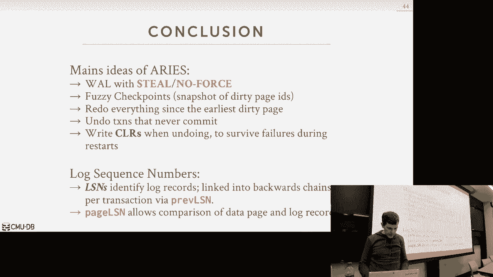
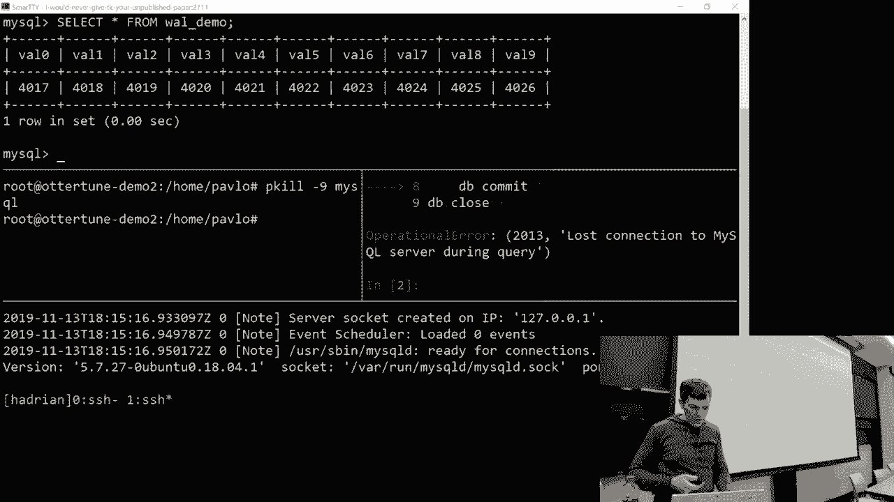
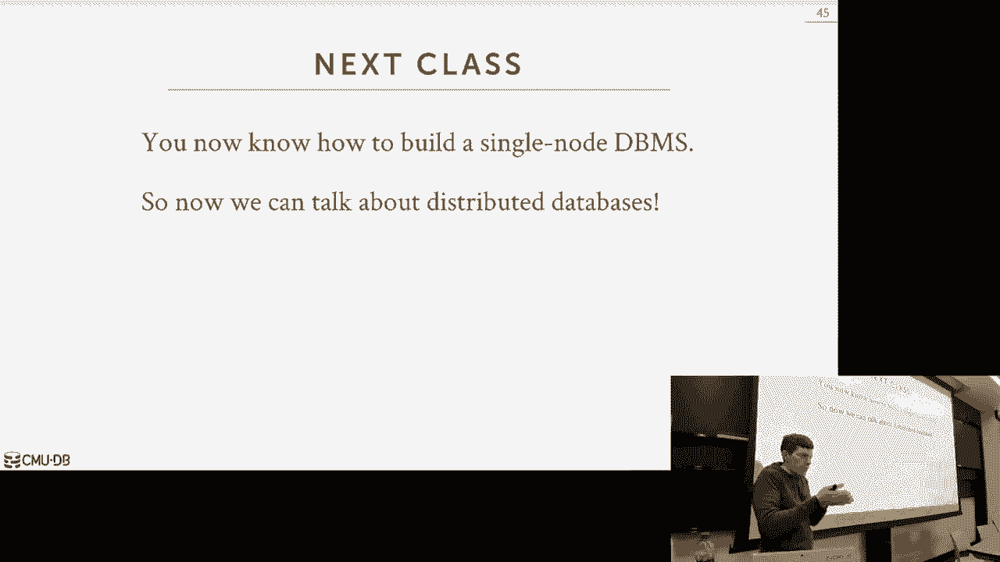

# 【双语字幕+资料下载】CMU 14-455 ｜ 数据库系统导论(2019·完整版) - P21：L21- ARIES数据库恢复 - ShowMeAI - BV1qf4y1J7mX

去吧。

今天有很多话要说，呃那个，这是一种延续，在我们所处的位置上，我们星期一的课结束的地方，我们说的是恢复，所以DJ的桌子还在拉斯维加斯，所以你不能，你今天来不了，但他星期一会回来，我说他正在处理，呃女朋友。

复数问题，嗯对，所以星期一，我们开始谈论恢复算法，我们讨论了如何让数据库系统，能够将数据库恢复到一致状态，就像系统崩溃前一样好吧，我们想这么做，确保我们提供原子性，我们所有交易的耐久性和一致性保证。

我说我们数据库系统中的每一个恢复算法，我们可能设计的有两个部分，首先是我们要做的事情，当我们处理交易时，记录额外的信息，或者以某种方式将数据冲洗到磁盘上，这样我们就可以在坠机后恢复。

所以现在我们要谈谈今天，是下半部分，如果发生撞车事故，我们如何回来重新开始我们的生活，把我们的生活捡回来，你知道的，回到一起，弄清楚发生了什么，嗯，所以我们今天要看的协议是基于，IBM开发的这项技术。

叫做白羊座，所以我不认为教科书会明确提到，在他们谈论数据库恢复的章节中，在我们今天谈论白羊座的技术中，就在你的脑海里，要明白这几乎是白羊座几乎每个人都这样做，嗯，所以Aris是在IBM研究公司开发的。

在二十世纪八十年代末，1990年初为DB二号，有一篇开创性的论文发表了，那是那是超长的，如果你睡不着，有七十页，所以去吧，给它一个裂缝，看看你能不能挺过去，你不会，嗯，但这件事涉及到痛苦的细节。

您需要处理的所有步骤和失败场景，以保证您的恢复算法是正确的，你不会丢失任何数据，这并不是说以前没有人做康复，这篇论文发表于1992年。只是说这张纸是，所以它被制定或编纂，为了正确地进行恢复。

需要注意的确切政策，然后不是今天发布的每一个数据库，那是在做检查点，并在前面写，日志记录可能没有精确到字母，白羊座做什么，但在高水平上，他们本质上在做同样的事情，右前方有模糊检查点的日志。

然后进行三相分析或三相回收，议定书，因此，数据库恢复领域的三个主要思想如下，首先，我们将使用正前方日志，记录事务对数据库中数据所做的任何更改，在这些日志记录中，我们必须把圆木冲出来，在可以写出页面之前。

与对页面的更改相对应，正如我们所说的，最后一堂课，这是使用钢铁无武力政策，那么钢铁是什么意思，斯蒂尔说，缓冲池允许将页面刷新到磁盘，已被尚未提交的事务修改的磁盘页。

没有任何力量说我们不需要冲洗所有肮脏的书页，修改事务以表示事务已正确提交，相反，我们所做的是刷新所有的日志记录，从磁盘上生成的事务，确保它们耐用和安全，在我们告诉外界我们的交易已经承诺。

这就是我们在运行时要做的，我们将有一个轻微的变化，我们将如何做到这一点，这将是不同的，当我们谈论周一，我们得看看这家店一些额外的东西以确保它能正常工作，然后在重新启动后恢复数据库。

我们将首先在日志中重播历史，重做事务所做的所有更改，这包括从中止的事务中产生的任何更改，我们也要重新应用它们，然后我们得回去撤销一堆东西，想出如何扭转这些变化，应该是持久的。

然后我们要做的另一个改变也是，当我们开始撤消更改时，在运行时和恢复期间，我们实际上也要为这些撤消操作创建日志记录，所以这也是我们到目前为止还没有讨论过的事情，因为上一堂课，我只是说嘿。

以下是我正在做的所有更新，这是相应的日志记录，然后当我登机时，是啊，是啊，你知道我没做什么特别的事，所以现在，当我们在运行时或分开时执行登录事务时，这是恢复，我们要添加额外的日志记录。

这是我们正在逆转的变化，我们需要这个来确保我们能恢复，如果我们在恢复过程中崩溃，我们可以从恢复中恢复，你可以想象这个东西是无限的，所以这是我们需要的额外步骤以确保我们可以，我们可以处理所有的情况。

所以今天的议程，我们将首先讨论执行工作量会有什么不同，在常规的正常处理过程中，事务的执行过程会略有不同，所以我们要介绍对数序列号的概念，以及我们为提交和中止所做的额外步骤，和模糊的检查站。

然后我们会结束讨论我们实际上是如何做三相恢复算法的，由ARIES定义，又好了，这是超级难的，这又是，正如我所说，这可能是数据库系统第三难的部分，所以再一次，阻止我，当我们前进的时候，如果你有问题对吧。

请随意打断，上一节课我们讨论了右头日志记录，我们说过，为了我们在这里的目的，让我们假设我们在做物理记录或生理记录，而不是逻辑日志记录，在那里你只需要记录续集声明，所以我们将有进行更改的事务ID。

他们正在改变的对象，然后重做和撤消信息，但现在我们将包括额外的元数据来跟踪订单，其中生成这些日志记录，所以我们要介绍这个新概念，称为日志序列号，LN只是一个单调递增的计数器。

我们在添加每一个日志记录时分配给它，因此，对于事务，日志序列号不需要是连续的，因为再一次，取决于我们使用的并发控制方案，我们可以把这些，他们以任何不同的方式运作，所以我可能会把日志序列一号给事务一号。

日志序列2到事务2，然后它，你知道吗，来来回回，它们不需要都是连续的，所以现在有了这些日志序列号，我们要修改系统的所有不同部分，需要知道哪些日志记录修改了数据，它们是否已经写在磁盘上。

所以我们现在想进一步扩展我们的缓冲池，认识到，这些日志序列号是什么，对应于对其页面所做更改的日志序列号是什么，它在记忆中的，所以每个日志记录都有一个日志序列号，但是整个系统都会有这些其他的日志序列号。

所以这只是一个汇总表，对于我们在剩下的课程中会遇到的日志序列号，但我们会一个接一个地讨论这些，你会看到的，那么我们最终会如何使用它们，所以同花顺ln只是一个内存计数器，它跟踪。

日志恢复刷新到磁盘的最后ln，这只是告诉我们在我们的右前方，内存中的日志缓冲区，你知道多少，有多远，你知道日志记录，多久以前，我们知道这些日志记录实际上是耐用的还是不耐用的，然后每一页我们都会有一页。

和树脂，所以页面ln将只是，修改该页的最后一条日志记录，但是该记录的最新日志序列，然后沉船LN将是修改这一页的最古老的日志记录，从上次冲到现在，所以当我把这一页带进记忆时，如果我继续。

修改它的第一个查看第一个事务，我将本地序列号添加为rec ln，然后不管我修改多少次，当它在记忆中，他们总是不计后果，而页面ln将增加，然后我要写这个数据，也把磁盘拿出来，这将去只是去头部。

这是一种额外的额外信息，以确保我们在恢复期间做了正确的事情，每笔交易都要记录上一次，因为这是最后一次，你知道的，它添加的日志记录，然后在全球范围内，我们将有一个主记录，我们要用来跟踪埃里森。

我们成功通过的最后一个关卡，我记得我说过当我们通过这些检查站时，日志中实际上有一些条目可以说嘿，我在这个时候走了一个检查站，所以再一次，这有点重复我之前说过的一切，所以每一页都有一页。

只是当对该页面进行的最新更新，我们跟踪同花顺，我想知道有多少，日志中的什么序列，或者日志中的什么点，我们已经把那些东西写在磁盘上了，就像我上节课说的，是啊，是啊，对不起，是啊，是啊。

所以我对页面和重做说，他们被写了一个磁盘，他们不必，但总的来说你有，它只是一个额外的安全机制，万一你最后失踪了，错过了什么，每个事务上次修改代码中的页面是信息权，是关于日志记录的信息对吧。

但如果你把那件事写到，那之后呢，这两条信息就变得多余了，因为一旦你写好了这一页，它说得没错，所以他的陈述是，如果你把它写出来，磁盘是，如果您将页面写入带有页面的磁盘，这难道不是多余的吗。

因为现在页面在磁盘上是持久的，它不再脏了，如果是在记忆中，那不是很好吗？我同意你的看法，我只是说这是一个额外的安全机制，我们在这里要超级保守，因为我们不想丢失任何数据，磁盘是超级的，你知道它们总是坏的。

我们只是想确保有足够的信息，如果我们必须恢复，也许我们的法律有点腐败，或者页面被破坏了，我们有足够的信息，足够的位置，我们可以弄清楚事情，是啊，是啊，现在你会看到我们所做的，实际，恢复过程，会有明显的。

我们可以做些什么来加快速度，我们会谈谈，一点点，关于他们的一点，最后我们不会在这里做，因为我们要超级谨慎，当你丢失数据时，人们会很生气，所以你不想丢失数据对吧，好的，这就是我上节课说的。

记得我之前说过的右头日志，我们可以冲洗出一个肮脏的页面，我们必须刷新制作该页的日志记录，那一页脏了，对呀，这就是我们要解决的问题，我们只是用这些贷款作为水印来计算，哦，修改此页的最后一条日志记录。

这就是，你知道一二三，但我冲出了日志序列，四五六和四五六在一二三之后，所以我知道不管是什么日志序列还是什么日志记录让我的页面很脏，也被冲出了磁盘，所以我把这一页冲出来是安全的，所以这就是我们要保证的。

所以让我们来看看一个高水平的例子，所以我们又一次记住了，我们有我们的日志缓冲区，它总是原木的尾部，它总是会像，你知道的，可能已写入磁盘或可能未写入磁盘的最新更改，在那里，然后现在挂着。

我们实际上是我们要介绍的另一件事，也是日志序列号，这些只是一个计数器，我们增加了一个，然后在我们的页面里，我们又有了页面，的最新日志序列号，修改这个的日志记录，本页，可能不是一开始弄脏它的那个，对呀。

那是阿尔桑的残骸，就是，这是因为自从我把这一页带进记忆，第一个把这东西弄脏的日志记录是什么，因为我需要知道我的界限在哪里，现在我们又有同花顺了，这只是一个指针，我们在日志里写的最后一个磁盘是什么。

主记录只是指向我们最后一次成功通过的检查点，是的，测试版，问题是，你为什么需要，这里是佩奇·隆，稍后会出现的，为什么我们需要这个，嗯，它和，当你试图弄清楚，当你重播的时候，日志是我做的事情。

我已经把这件事写出来了，我写了什么，我已经写出了肮脏的一页，和，因此，我不需要担心发生在序列号之前的任何事情，想想这就像一个边界，就像，自从我想起这件事，以下是可能修改我的页面的lns的范围。

但你刚才说这是一个使，页面脏了，嗯是的，页面不是很好，页面中心，是最后一个日志序列使页面变脏，所以它在这里，所以当我想去决定我可以在哪里刷新我的页面，我想知道对那一页做的最后一次更改是什么。

如果最后一个变化出现在同花顺和同花顺之前，如果我知道我的零钱在这里，它出现在同花顺之前，如果这东西是写在磁盘上的，那么在它被写进磁盘之前我就知道了，因此，我可以安全地删除该页面，好的，我明白了，呃。

我们需要从，对不起付给，这样，是啊，是啊，所以在恢复过程中，你在那个范围内检查，我们马上就好，到了该跑的时候，是时候冲洗这东西了，我检查LN页，又好了，主记录只是，到最后一个检查点的位置，当我们恢复时。

我们用这个来计算，我们想从哪里开始分析，看日志，弄清楚什么是正确的，因为没有主记录，没有这些检查站，我们得从头开始，因为我们不知道写了哪一页，这里说得很清楚，就像我，当缓冲池正在写入页面时，对不起。

它在冲出书页，我们不记录，所以我们不知道，潜在的，你知道磁盘上写了什么页，如果我们在坠机后恢复，我们只知道写出来的日志序列号，好吧，这实际上只是一个例子，他在问什么，假设我的页面指向这里。

在日志序列号12处，十六个点，我可以把这一页冲掉吗，对是的，因为页面ln小于同花顺n，但说第19页L点，我能写下来吗？否，因为我知道与上次对，此页不在磁盘上，因此，我离开是不安全的，再一次，你会有这个。

驱逐策略或替换策略中的逻辑，您将在缓冲池管理器中实现，以注意，同花顺贷款是多少，这些页面借出是什么，并跟踪所有这些事情，当你决定要做什么的时候，好吧，简单回顾一下，我说过所有的日志记录都有一个。

每次我们做出改变，我们首先要将条目添加到日志中，中的日志记录，或者向内存中的缓冲区添加日志记录，然后我们再进去，然后我们现在可以修改页面，这就是我们更新页面的地方，因为我们已经在页面上抓住了正确的闩锁。

因此我们可以，我们可以原子更新，然后每次我们驱逐一个页面，我们总是更新这个同花顺，我会派人去知道这在法律上有多远，我们已经把事情写出来了，然后你现在可以开始截断右边上面的日志，因为。

你不太可能在记忆中需要它，所以让我们现在谈谈当我们执行事务时，所以再一次，每笔交易都只是一系列的读写操作，在最低恢复水平，这才是我们真正关心的，我们对续集声明一无所知，当我们在做物理或生理记录时。

我们只是看到理由然后写，因此当事务完成时，完成了，当它要么提交要么中止时，所以我们要做的假设，为了简化我们今天的讨论，以下是，所以首先我们要假设，每个日志记录都可以放入一个页面中。

这只是意味着我们可以在一个页面上做一个原子右，你知道的，单个日志记录的所有内容，我们不担心我们的日志记录跨越多页，处理那件事并不难，你只需要加上一些支票，然后说这是，你知道吗。

这是此日志记录在此页上的段，就是那一页，如果你没有看到他们两个，那么它就被认为不是原子的，但为了我们的目的，我们只是假设它是一页，我们假设我们执行4千字节的原子页面写入，我们也要假设。

我们只在数据库系统中进行单一版本控制，我们只是用严格的PL，所以我们不担心奇怪的并发控制异常，和，就像我之前说的，我们也在做钢铁，没有力量，这意味着你必须拥有，为了让这一切奏效，所以当事务现在提交时。

我们就像以前一样，我们要在日志中写入提交记录，一旦提交记录持久并刷新到磁盘，然后我们可以告诉外界您的交易已经成功提交，因为一切，此事务产生的所有日志记录，我们得写到日志上，在此提交记录之前。

所以我们知道一切都是耐用的，内部交易，虽然，实际上还没有完全完成，所以即使我们告诉外界它已经完成了，我们仍然可以维护一些关于事务实际做了什么的内部元数据，我们将在更多的幻灯片中看到这一点。

比如会维护一个表，上面写着我所有活跃的交易，当我们真正完成所有这些，我们需要为该事务提供的所有元数据或内部簿记，当这一切都结束了，我们将添加一个新的特殊日志记录，称为事务结束。

这只是告诉登录恢复中的数据库系统，我们再也不会看到关于这笔交易的任何其他事情了，一旦我们看到这个交易结束，因此，我们可以从我们所有的内部簿记表中删除它，不像在承诺中，我们必须把它冲走。

在我们告诉外面我们犯了什么罪之前，我们不需要做一个硬同花顺，或事务端的f同步，我们只需将其追加到日志缓冲区，它只是作为正常过程的一部分被写出来，现在看看它是如何工作的，这是我们的一个简单的演示。

所以在这里我们看到我们做一个事务提交，然后我们把原木冲起来，现在我们更新同花顺，ln到现在指向我们生成的较少日志记录的最后一个日志序列，现在我们可以告诉外界我们的交易是安全的，我们的交易是持久的，承诺。

我们结束了，但在以后的某个时候，我们将做一些额外的处理，然后最终我们会写出一个交易和消息，这只是说在日志的这一点上，当我们做恢复的时候，我们再也不会看到这笔交易了，用于提交，没有那么多。

我们真的没什么特别的事情要做，在中止的提交和结束之间，我们会明白为什么我们需要这个，就像我之前说的，因为我们知道在这一点上这里什么都没有，我们实际上仍然需要让它在身边，就像提交的文件已经被冲洗出来一样。

我们可以修剪日志，收回这些记忆，我们用它，这就是那种乒乓球效应，上一节课我们讨论过了，当我们组提交正确的时候，一旦我知道这个日志缓冲区是空的，因为我把一切都冲走了，然后我可以用它再次装满它。

然后我读出了另一个缓冲区，所以对于机器人来说，这会和我们之前做的不一样，所以当我们有任何交易时，我们知道页面已经被写入这个无事务，就像恢复算法的内部标记一样，说你再也见不到这笔交易了。

您将永远不会看到此事务的任何其他日志记录，因为我们看到了一块板，当我们放弃的时候会更有意义，因为流产后你可以做一些事情，外面的世界看不到，它不像您执行的查询，但这是我们必须做的事情来扭转变化，是啊。

是啊，再给我几张幻灯片，是呀，什么时候像这样，因为我假设你马上写信，什么的磁盘权，所以在这一点上，什么时候冲出来，这是缓冲池替换策略，对吧，什么两条路对，所以一个是你需要腾出空间，您必须驱逐一个页面。

上面标着脏，你把它冲出来，另一个可能是背景对吧，那个，我想我们已经简单地讨论过了，在某些数据库系统中，他们只是一个单独的，嗯，您在后台有一个单独的进程或线程，偶尔穿过缓冲池，找到所有脏页。

然后提前写出来，它不会驱逐他们，它说嘿，让我把你写出来，然后我翻转你的位说你不再肮脏了，这样，当缓冲池替换策略运行时，它想驱逐一个页面，嘿嘿，我有一个，那是标有干净的艺术，我可以把它放下，不是。

必须写出来，但这与我们在这里谈论的无关，对，在某些方面又是这样，这就是右头日志的美妙之处，我们可以把政策分开，而不是我们如何驱逐东西，除了确保我们不驱逐东西，磁盘上没有日志记录。

因为我们可以将决策过程与正确的头部日志部分分开，是呀，先生，同花顺，那你就不能纠正，所以他的陈述是，如果同花顺ln小于页面，是吗？然后您可以驱逐该页面，因为你知道不管这件事。

您写的最后一条日志记录在这一条之前，因此，修改此页的日志记录不在磁盘上，然而，如果你所有的页面都是这样呢，你的缓冲池很酷，这是否意味着你必须开始冲洗你的日志，然后像这样他的问题是。

如果您的驱逐策略正在运行，你说，哦，我的同花顺，ls n is小于所有页面，我的日志里所有肮脏的一页都结束了，全部或抱歉，或缓冲池中的每日页面，我所有紫色的书页都很脏，我该怎么办，你得拖延时间。

你得把磁盘写出来，你不能，你别无他法，这就是背景作者应该是什么样的，如果我知道我有一些空闲，我可以提前把这些东西写出来，这样我就不用拖延时间了，我不在临界点上，当我再次执行事务时。

你能做的最糟糕的事情就是我在进行交易，它获得了一堆锁，然后我得做一堆磁盘，我不，因为现在只是备份每个人，一切都变慢了，所以如果我在后台做一些事情，现在它不在关键路径上，而我拿着锁，交易可以更快地完成。

但你如何平衡，就像冲这个，冲洗原木冲洗，冲洗背景材料，这是数据库系统必须弄清楚的棘手问题，我们不让操作系统为我们做这件事，好的，所以对于中止，中止会是一个，有点特殊，我们将有一些领域，我们将扭转变化。

嗯，用于交易，但我们最终会记录日志来跟踪这一点，我们扭转了这些变化，这和我们到目前为止谈论的大不相同，就像每次我们说，哦，我们买了一笔交易，回滚到更改，我们只是假设我们可以撤消内存中的一些东西，现在。

当我们反向交易时，我们需要跟踪我们正在做的一切，所以我们要在日志记录中添加一个额外的字段，叫做Pre ln，这不是必需的，但这将使您在运行时的生活更加轻松，因为现在你可以知道如何跳回去找到下一件事。

您需要对给定的事务进行反转，避免扫描的权利，扫描，一切，本质上认为这就像每笔交易一样，您正在生成一个链表，对于每一个登录的交易，这是所有更改的链表，我需要倒车，所以我需要，我知道怎么一个一个地往回走。

然后把它们倒回去，所以我们又有了这样一个简单的交易，现在我们有了LN和以前的LSM，第一次也是如此，此事务的第一个日志记录，因为在开始语句中没有前面的ln，我们只需将前一个ln设置为空，因此此事务运行。

它做了一些改变，但后来它中止了，所以现在我们需要做的是扭转这些变化，我将为这些添加日志条目，然后一旦我们知道所有这些日志条目都在磁盘中持久存在，然后我们可以再次添加事务结束消息，这就是我要说的。

这是说事务和是A是A是表示，以后的交易不会有别的结果了，我们已经逆转或做了我们需要做的一切，所以这个，这部分我们接下来要讲，我们实际上是如何记录变化的，我们一边走一边倒车，所以这些叫做补偿。

日志记录或CLLR，所以CR就像一个更新记录，但它是它是，它正在反转实际更新记录的更改，当事务实际运行时，是呀，所以我们做，嗯嗯，在神学院拿着每一个球，所以你的问题是，为什么我们甚至有以前的ln。

这到底给我们买了什么，因为你可以把一切，是啊，是啊，所以她的问题，你的陈述是，你能检查一下这个简单的例子吗，只要找到所有不适合的东西，然后找出我需要逆转的事情，是呀，但如果我像一个高端系统一样运行呢。

一秒钟做一百万笔交易，我现在崩溃了，当我崩溃的时候，我在任何给定的时间都有任何，我可能有十万笔交易在飞行中，所以为了避免一遍又一遍地扫描所有东西，你很清楚我需要逆转什么，这只是带我们去那里的帮手。

所以它不是正确所必需的，我们用它是为了方便，是呀，为什么因为为什么我们需要把任何事情逆转到这个，所以对于这个例子来说，但在现实生活中你怎么知道，在实际系统中，我说了什么，我说，我们。

我们不知道我们没有记录，我们写入磁盘的页面，我们什么都不知道，我们已经把磁盘处理掉了，因为驱逐政策在做自己的事情，这就是为什么，所以我们要安全起见，把一切都逆转，所以CR又，就像更新日志记录一样。

它的前后值，嗯，但它会与更新记录联系在一起，在交易期间实际发生的，正常寿命，然后我们要撤消下一个指针，这又是，只是为了方便，可以告诉我们下一个我们需要逆转的是什么，这样我们就知道，你知道的。

对于每一个给定的事务，我们就会知道我们是否真的处理了我们需要的所有，我们需要处理来扭转所有这些变化，因此CLLR可以添加到日志中，就像任何其他日志记录一样，但它们将在交易中止后添加。

然后一旦我们逆转一切，然后我们添加事务端，所以不像用提交提交，我得把所有的日志记录都刷新到磁盘上，之前，我告诉外面，我所做的，如果事务中止，我们立即回到应用程序，说你中止了。

他们不需要等着在磁盘上写任何东西，因为谁在乎呢，他们试着去读他们的变化，我不能那么做，只要我们使用正确的并发协议运行，所以CLLR只记录任何其他记录，然后他们就被冲出去了，你知道吗，最终，在某个时候。

所以让我们看一个例子，我们将如何使用CLLS，因为我在滑梯上的空间快用完了，因为我们有太多太多的元数据字段，我不会以表格的形式展示这个，所以这里我们有一笔交易，没有一个，它只是在右边更新，然后中止。

我们不在乎，它是如何流产的，事务应用程序是否表示中止，或者数据库系统协议说中止它，我们不在乎，都一样，所以现在当我们想开始撤消它的更改时，对呀，这是在正常执行时间内，这不是在恢复期间。

这就像我们在处理交易一样，我们要创建一个CR条目，这将与它所做的更新有关，一次又一次，它看起来和第一个一模一样，只是前后值颠倒了，所以在价值三十之前，然后更新之后是四十，所以现在我们在反转中所做的。

或者将旧值设置回三十，然后我们有这个撤消下一个记录，上面写着下一件事是什么，我们需要撤消以完全逆转此事务，在这个特定的例子中，在这里，撤消ln转到begin语句。

所以我们知道这笔交易没有其他可以逆转的了，这样我们就可以继续添加我们的交易结束记录，是呀，你说，当我们得到，呃，我们不需要把所有的原木都冲洗掉，磁盘，我们可以直接告诉用户您的交易有关于它的。

对这个问题是，我有说过当你流产的时候，您可以立即返回应用程序并说您的事务中止，你不必写信，把这些东西冲出磁盘更正，是呀，然后你做了一些改变，就像你告诉用户关于它的交易，然后你崩溃了。

你在这份声明中失去了这些定律，我是说如果你马上说出外面的话，你登机了，但是你创建这些日志记录，您反转更改，但你把你撞到这里，是啊，是啊，就像你是对的，所以你，是啊，是啊，你可能会失去这些，我们在乎吗。

他在摇头，无，为什么，嗯是的，你要上船，但喜欢更基本的东西，页面正确，所以被修改的页面，但是这个事务不在磁盘上，所以谁在乎呢，但有可能你失去了其中的一半而他们中的一半进入了名单，什么的一半，对不起。

所以从一到十一，你一到四个就被写到这个，是呀，四到十迷路，谁在乎，然后就像，当你重做的时候，那你，呃，做一到四，因为你撤销了它，因为它没有做对，所以又一次，当我们做一个完整的例子时，我们会看到这一点。

如果我不看看我是否在这里崩溃，我不知道这笔交易的最终决定是什么，罪犯中止的地方，它中止了，这就是右头日志的美妙之处，这是一个单一的来源位置告诉我们，交易中发生的事情的最终结果是什么，所以我们到了这里。

说，我们到了这里，我们中止了，我们告诉外界，我们中止了，我们以前撞车，我们做了所有这些事情谁在乎呢，因为交易中止了，我们不必保证任何东西都是耐用的，我们回来，就好像它不在那里。

因为我们将反转任何可能被写入磁盘的更改，如果你写到页面上，然后你会看到那个画笔并纠正，所以如果页面被写入磁盘，你会看到，你无论如何都要看到所有这些东西，所以我们知道如何把它放回正确的状态，如有需要。

是呀，我们将在法律发展后告诉我们的水平，是啊，是啊，这么说这么说，嗯对，所以说，他们说他们告诉我们从航站楼撤退，从应用程序，然后呢，我们可以将此日志记录追加到内存中的红发日志中，立刻回去。

告诉他们流产了，然后现在开始清理它所有的内部变化，对呀，所以我们不必，我们不必等待对它修改的东西进行任何清理，我们可以看出它流产了，马上，所以这和右边不一样，承诺，承诺说我已经承诺了。

如果数据集告诉他们你犯了，它必须保证一切都经久耐用，所以它必须是任何，与它所做的更改相对应的任何日志记录，必须将磁盘写入提交，我们不在乎交易结束，那是我们的内部，我们只需要回来，是呀。

我想为什么谁在乎我流产了，我为什么要关心你要去，做一堆事情来清理东西，我为什么要等待任何新的交易，呃，编辑同一页，他们必须等到我撤销我所做的更改，所以他的问题是我，如果任何事务需要修改。

被交易委员会修改的同一页，他们需要等到，直到修改它的日志记录被写入磁盘，没有权利，因为如果我想说我在这里寄宿，说这是这是在一页页，我在这里中止，我可以立即释放可以消耗两天锁定的东西，我打开右锁。

我在那一页上，现在任何其他交易都可以出现，开始修改它，所以他们开始修改，那会有什么用，这将创建新的日志记录，把页面向上隆起，在我的页面，因此，该页不能从磁盘上写入，直到我的新日志记录写入磁盘。

所以谁在乎呢，谁在乎这个，修改的其他事务，这很好，就像你不需要写东西就能学到很多东西一样，但就像你需要逆转价值效应一样，所以如果有人在读，所以我们不能读到关于它的值，是啊，是啊，是呀，你有，所以你纠正。

如果我试着做，如果我试图从中止的事务中读取所做的更改，我得把它们倒过来，是呀，在我被允许读之前，你不能读那一页，除非这些公司，当你说像写了一张磁盘，写了一段回忆，是啊，是啊，当然是的，你必须，是呀。

你必须扭转这种想法，那倒是真的，总是，如果是单版的话，是呀，多版本无，因为这是美丽的多版本对吧，谁在乎因为你，现在你只是有了一个不再存在的版本，你你忽略它，是呀，在单一版本中，是呀，你有。

你必须扭转这些事情，是呀，是呀，是啊，是啊，所以假设说，你有很多手术，在这种情况下说，前四个把它放进桌子里，就像第11次手术一样，你中止，所以最终你需要逆转这两件事，比如，呃，在内存和磁盘中也是对的。

是啊，是啊，所以他的陈述是，假设我有一个交易，做了很多更新，一半的更新得到一个你，您应用所有更新，但其中一半被写入磁盘，我如何逆转这些变化，因为现在他们在磁盘上，然后它，因为这是偷窃政策，我被允许承诺。

写出，我被允许冲洗脏页，是呀，当你真正这样做的时候，你必须把它们带回来并逆转它们，你是否在黑板上立即这样做，或者你是否那样做，你知道就像懒洋洋的，哦，当有人下次去读它的时候，那我就把它倒过来。

我喜欢这个问题，有个家伙在上面，嗯，YouTube上的某个家伙，抱怨，就像巴勃罗教授，我喜欢你的课，我喜欢这种材料，但是那些讨厌的学生总是打断我问问题，坏家伙，对呀，让他开始CMU，来问问题。

所有的权利，嗯好吧，所以现在我们的板算法，我们已经说过了，我们要把每笔交易都写在日志上，然后我们将回放交易，按事务的相反顺序更新，然后对于其中的一切，我们将逆转，我们在日志中添加一个CR条目。

它绑定到正常操作期间发生的原始更新，然后我们存储值的版本，然后一旦我们完成所有这些交易，CLLR，一旦我们做了，他们为这笔交易所需要做的一切，然后我们可以添加事务结束消息，所以因为永远不需要撤消。

我们只能在，在恢复期间，因为它们有点像单向更新，好的，所以现在好了，那么到目前为止我们讨论了什么，我们知道我们有很长的序列号，我们有这些CLLR，我们知道如何跟踪不同地点的LNS。

让我们弄清楚磁盘上写了什么，所以现在让我们来谈谈如何，我们会带来一些额外的元数据，弄清楚当时系统中运行的是什么，并使用它一个更好的检查点方案，所以在我们上一堂课，我说检查站对我们来说是必要的。

在什么时候，我们能弄清楚，我们能开始恢复数据库吗，因为没有检查站，我们可能要查看整个日志，如果我们有一年的日志，没有检查站，我们可能会有潜在的重播，原木一年的价值，这可能需要很长时间。

所以让我们来看看通过检查站的两种糟糕方法，我们将看到为什么模糊的检查点是更好的方法，上节课我已经讨论过其中一个不好的方法，我说，我们将要使用的技术是停止任何新事务的执行，然后走走检查站。

这将保证我的页面被写出磁盘，作为检查点的一部分是一致的，没有从运行到一半的事务中撕毁更新，所以基本上发生的事情是在前端，在网络层上，我们停止执行任何新的交易，然后我们就等着我们所有的工人。

完成执行任何已在运行的事务，所以这显然很糟糕，因为我们必须等到所有你认识的人所有的交易都完成了，我们不能开始执行任何新的东西，所以我们有一笔交易，跑五个小时，然后我们要等5个小时才能完成。

然后我们才能去检查我们的检查站，然后在这段时间里，我们不能执行任何其他事务，所以从恢复的角度来看，我们的系统看起来完全没有反应，这就是这就是这太棒了，因为检查点是一致的，正如我所说，没有中间更新。

就像你知道的那样，它只包含来自已提交事务的更改，因此，一个稍微好一点的方法是暂停事务，当他们奔跑的时候，当我们通过检查站时，所以我的意思是任何事务都有一个查询，那是修改数据库，我们就暂停一下。

任何时候他们试图获得页面上的右闩锁，我们不我们阻止，他们必须阻止任何阅读，只有事务仍然可以运行，他们想看什么就看什么，因为这不会干扰检查站，然后上面又有同意协议，弄清楚他们是否被允许阅读某些东西。

我们可以忽略这一切，但这都是正确的交易，我们只是要去，我们只是要暂停他们，所以它看起来像这样，所以说我在记忆中，我有三页纸，我在检查站有一笔交易，同时发生的，假设这个交易将更新第三页和第一页。

所以它将从这里的底部开始，将其更改应用于第三页，然后在它更新第一页之前，检查点开始，所以我们得拖延交易，对呀，它会试图在第一页获得正确的闩锁，你不能那样做，因为检查站，所以它只是停滞不前。

所以现在检查站，它真正做的只是一个顺序扫描或扫描，或者缓冲池中的每一页，这是把它们从磁盘上冲洗出来吗，所以我们的检查点会写出第一页，交易对第三页所做的修改，然后检查点就完成了，我们的事务被安装。

然后我们现在更新第一页，对呀，现在的问题是数据库中一个查询的快照，执行的事务，我们看到了他们一半的变化，所以我们的检查点或磁盘上数据库的状态是不一致的，所以为了处理这个，我们想记录一些额外的元数据。

找出当时正在运行的事务，我们通过了检查站，缓冲池中哪些页面被弄脏了，当我们通过检查站时，这样我们以后就可以利用这些信息来找出，哦好吧，这家伙更新了第一页，我错过了它或我的检查点，所以我知道。

我知道我没有确保我想重播任何日志，记录，这家伙让我回到正确的状态，在后面这里，是呀，所以在给了一步，在检查站要非常小心这里的语言，你喜欢允许交易写在页面上为我们，或者随便什么页你，因为你已经有了是。

所以他的问题在我的例子中，这里我在风险中显示，像蛮力或粗粒，整个系统的右闩锁，所以这家伙必须完成他的检查站，在这家伙被允许离开之前，或者我能说好吗，我把第一页的锁打开，然后允许他更新，是呀。

但您仍然有相同的撕裂更新问题，我得说我把这当作一根稻草，男人说你说的这是个坏主意，我们将看看如何以更好的方式做这件事，但这是一个明显的优化，是呀，你说小心什么，但我们真正关心的是虚假交易。

或者他的问题是当我说我们关心，我们关心肮脏的页面吗，这将是脏页表，我们关心暂停的事务吗，或者真实系统中的任何脏页面都是任何脏页面，因为我们妨碍了我们做模糊检查站的方式，我们实际上不会暂停交易。

是的就像你在检查站，你把一切都写对了，所以我在想这两件事不需要出现，因为你什么，你觉得，你不需要在场，和副手，所以就像你看到法律一样，您可以看到哪些操作没有提交，如果你必须从检查站恢复。

就像今天一样一切都好，现在你正在从一个检查站恢复过来，您可以看到哪些事务没有提交，你只要把它们卷回去，所以他的陈述是我，您不需要脏页表和实际事务表，因为如果你只是重播一切，然后逆转它们。

那不是让你处于正确的状态吗，是呀，我想我同意你，但那将是超级慢的，因为你，因为你得更新每一个，你要把每一页都带回来，好好修改一下，而有了这个元数据，我们可以避免这种情况，但您必须只播放逻辑中的日志。

对呀，否，不是不是真的，你得追溯到更远的地方，可能还有几张幻灯片，我们会到达那里，因为你不知道写了什么，磁盘，所有的权利，所以好吧，所以有实际的事务表和脏页表，所以我们结账的时候要记录下这些信息。

当检查点开始时，我们要用模糊的检查点把它写出来，当检查点结束时，我们会看到这两个，这两个概念又出现了，当我们做恢复的时候，我们基本上要重播日志并填充这些信息，弄清楚我们需要提交或撤消什么。

所以在实际的事务表中，这将适用于每一个正在运行的事务，在检查点开始时记录其事务的位置，ID其状态，然后这个事务创建的最后一个ln，所以状态要么是它运行的内容，它是它的承诺是正确的，所以它是承诺的。

但在我们到达交易结束之前，或者是我们认为我们必须撤销的事情，它可能要撤消，我们还不知道，对呀，因为我们是因为，我们不知道它的最终结果会是什么，一次又一次，当我们看到事务和消息时，我们就可以，我们可以。

我们可以把这个从ATT上移开，因为我们知道我们再也见不到它了，所以这就是为什么这里没有完成或完成，所以这只是挂在内存里，我们可以在检查站的时候填充这个，但它包含在检查点和消息中，我们一会儿就会看到。

然后你刚刚跟踪的脏页面，缓冲池中的所有页，缓冲池中已被弄脏的页，未提交的事务修改的，对于这一个，我们只是要记录沉船，它是，修改此页使其变脏的第一个事务，自从它被铭记在心。

所以让我们看看一个稍微好一点的检查点版本，它使用，使用此信息，所以我们现在在检查站入口看到，在我们的日志记录中，我们会有ATT，在这一点上，我们只有一个事务运行t 2，所以这是我们里面唯一的东西。

然后我们有肮脏的页表，我们有p11和p23，因为这里有P11被修改了，啊，所以我在这里修改了十一p二二p十一，这里修改了ptwo，所以我现在显示的语法是这样的，这是修改的对象，它指向页码是正确的。

所以在这种情况下，我们不记录任何关于交易的内容，因为事务T 1在我的检查点开始之前提交，所以在这一点上我不再关心它了，那么现在在第二个检查点，三号还在活动，然后我们这里有两页脏页。

因为在我们的交易开始之前有两个提交了，所以这还是不理想，因为我们还在拖延所有的交易，以便把这件事做好，所以我们在这一点上暂停一切，这些家伙是不允许修改的，所以这只是说我们写了一个检查站，但是，哦。

顺便说一句，这里有些东西，在这段时间里，它可能会被修改，确保你找到它，就像第一个一样，第一个检查站方案，我给你看了，没有人真的做这个，要么，每个人都做模糊的检查点。

或者支持高性能检查点的系统正在做模糊检查点，所以模糊检查站就是我们要去的地方，允许事务继续运行，当我们在检查站时，继续修改数据库，因此，为了记录检查站何时开始的边界，当两点结束时。

想知道什么东西能不能写出来，我们错过了，我们添加一个显式检查点，开始和检查点n日志消息，所以开始只是告诉我们检查站是什么时候开始的，结局告诉我们什么时候结束，这将包括在，在检查点执行期间。

所以我们现在回到这里，所有的权利，现在我们有了检查点开始然后是检查点，你知道的，这东西开始写东西了吗，然后在检查点末尾，我们包括事务T 2，因为第二个在检查点开始之前就开始了。

然后肮脏的页表告诉我们D11是在，在检查站也是如此，但我们不需要在这里包括三个，因为T3在我们的检查站开始之前就开始了，对不起，在我们的检查站开始后开始的，所以说，一旦我们有了检查点并成功地写出了磁盘。

我们就可以，这意味着我们把所有的页面都冲洗掉了，我们想把它带到检查站，然后我们继续更新我们的主记录，现在包括，到检查点的点开始，因为那将是我们的锚点，我们在恢复过程中开始分析，因为我们会知道在这一点上。

对呀，这是我们冲掉的所有脏页，但我们记录了一些我们可能错过的因为它们被修改了，你们的检查站在哪里？你把检查站放在哪里，什么检查站，就像你是做什么的，你把它放在哪里，你开始你开始，你决定把它放在哪里。

是啊，是啊，是啊，是啊，而且不仅仅是在政府面前，当你说当你当你喜欢日志记录，它在日志里，但当它结束时，你把它塞进去，当你，当您扫描了缓冲池时，并将所有脏页写到磁盘上，在你把它们冲出来之后，你同步对了。

因为你要确保它耐用，然后在这里添加日志项，它在承诺，我在用，提交引用，因为就像常规交易一样，我把这个的日志记录刷新到磁盘上，在检查站后写T和DVD的时候，所以我们在完整的数据库上没有保留任何块。

因为在这一点上，我们没有触及法律的任何其他内容，所以他的问题是，我是否锁定了整个数据库，我为什么要把这件事写出来，否，因为在这段时间里，我们不会就任何其他交易向法律写任何东西，呃，你在这里是什么意思。

就像你在写一个和法律代理人一样，是呀，其他一些事务可能正在进行一些更改，但既然我们现在没有把它们写到日志中，这就是为什么这并不重要，比如这些权利，它们可能发生或不可能发生，直到你写。

如果有东西写到日志上，当你在写A和DVD的时候，那就错了，对呀，因为你写得像一笔交易，2号在运行，但我认为是的，我想我想你在说什么，这里有一种停止世界的时刻，在那里你短暂地把这个东西冲出来。

但那不是那只是昙花一现，这是件小事，我是说有一个停止这个词运动，但就像它只是为了圆木，正确，是呀，他们可以改变他们想改变的任何东西，是啊，是啊，在常规缓冲区页中，是呀，在经历了这么多之后。

经过四十分钟的数字和模糊检查点的细节，让我们谈谈实际上恢复这个，然后考虑到我们所建立的一切，现在我们有了所有这些额外的元数据，我们正在记录，恢复实际上不会那么糟糕，棘手的部分是弄清楚你从哪里开始。

日志中的每一个阶段，所以分析阶段，您将查看磁盘上数据库的主记录，这将给你上一个检查站开始的位置，在日志中，所以你跳到那个位置，你向前扫描到时间，穿过时间，直到你到达日志的末尾。

然后你只需要填充DBT和T，来跟踪坠机时系统中发生了什么，然后现在它会发现，您可以使用它来确定需要中止哪些事务，您需要哪些事务来确保提交，然后在重做阶段，您将跳转到日志中的某个适当位置，你知道的，有。

可能是事务的潜在更改，这些事务不能安全地到达磁盘，您可以开始重新应用这些更改，直到你到达日志的末尾，你要为任何，每笔交易，你看，即使是那些，你知道最终会关于登机，因为在分析阶段，你看到了你所知道的一切。

所以你知道会发生什么，什么会中止，所以说，然后出于安全考虑，在重做阶段，我们只是要做，你知道的，重新应用一切，然后现在在撤消阶段，你要从最后按相反的顺序回去，从结束的开始，记录直到某个点。

以逆转没有发生的事务的任何更改，你知道没有承诺，当撤消阶段完成时，那么数据库现在处于存在的状态，坠机时存在的状态，没有来自中止事务的部分更新，并且已提交事务的所有更改都已应用于磁盘，再次三阶段分析。

我们做和撤销，所以一开始我们看开始，计算出，开始检查点在主记录中的位置，这就是我们要开始分析的地方，假设这里的日志记录是最后一个检查点的开始，因为这也在我们的主日志记录中，我们知道那在哪里。

现在我们要向前扫描时间，看看这些日志记录，建立我们的ATT和DBT，现在我们得弄清楚，重做阶段是什么，肮脏的页表中最小的残骸是什么，我们在做了正确的分析后发现，所以这告诉我们，这是第一条日志记录的位置。

修改可能未写入磁盘的页的最古老的日志记录，所以当我们重做的时候，我们在这一点上跳了起来，重新应用了所有的更改，然后现在在撤消阶段，我们从终点开始，回到过去，直到某个时候，我们知道这是最古老的事务。

它得到了一个活跃运行的边框，当我们拿着，你知道的，拿下了我们的关卡，我们逆转所有这些变化，所以箭头向你展示了距离的界限，你得在日志中回到过去，所以你知道，我将在LN的上下文中更准确地介绍这些，一个一个。

但这在高层是否清楚，我们在做什么，分析及时推进，重做及时推进，然后撤销时光倒流，用于撤消，我不可能打破所有的记录，我看到这里了，这只是为了我在ATT中识别的交易，在不应该犯的分析之后，好的。

所以这种总结更具体，我刚才说的，所以分析阶段，我们将从上次成功的检查点向前扫描日志，任何时候你发现交易并记录，在分析中，我们可以把它从ATT右边移除，否则为任何其他记录，如果这是我们第一次看到这种交易。

我们把它加到ATT中，状态为撤消，因为我们不知道，因为我们在时间里前进，我们不知道它以后会不会中止，嗯，如果我们看到提交记录，然后我们只需改变它的状态来提交，就像我说的，当它是一个是n，我们就可以把它。

然后对于任何更新记录，我们要看看，更新记录中的页面，正在修改的是在我们的DBT中，如果没有，然后我们继续把它加进去，我们让沉船成为我们的埃里森，因为这又是这又是，这告诉我们。

这是第一次使此页变脏的日志记录，当它被铭记在心时，所以现在在分析阶段结束时，ATT会告诉我们，我们在系统中运行的所有实际事务是什么，在坠机的那一刻，DPDS会告诉我们，缓冲池中可能存在的脏页面是什么。

可能没有写入磁盘，我们正在这样做，我们必须我们必须建造这个桌子，因为再一次，我们不注销，每次我们做缓冲池，刷新到磁盘上的页，我们不会记录在日志里，日志记录足以告诉我们，你知道，我们可能被修改了。

我们正试图重建它，这个问题肯定是，我怎么确定，页是否写入磁盘，就像在日志里一样，或者在现实世界中，比如在硬件和日志上，根据，你不能，因为没有任何信息告诉我这里面写了什么，不完全正确。

当我们看到所有季节在一秒钟内重做，但如果一般人看，如果你知道你正在看的法律记录是，小于磁盘上页的日志的rec，然后你就知道你的零钱已经写在磁盘上了，但是到了页面被写出来的磁盘，然后又被另一个弄脏了。

但你的东西在他们之前就写好了，所有的权利，分析阶段的快速概述，所以在这里，我只是向你展示什么，ATT和DBT会看起来像这些不同的贷款，所以我们得到了我们的检查站，我们什么都不知道。

所以att和gpt是空的，然后我们按照日志序列二十进行更新，所以对于这个，我们有96个交易，这是我们第一次看到它是正确的，因为我们这里没有开始记录，因为它在检查站开始之前就开始了，所以我们看到了。

我们更新了我们的ATT说嘿，我们这里有一笔96英镑的交易，并且状态是撤消的候选状态，因为我们不知道它是否会承诺，然后我们看到它修改了第三十三页，所以我们把它添加到我们的脏页表中，随着我们日志记录的破坏。

那么现在我们的交易结束了，现在我们得到了更多关于，DBT上的实际事务表中有什么，所以现在我们看到有T97，我们在检查站之间没有看到，所以我们知道在这个检查点上方有一些交易，检查点起始点。

它做了一些我们可能也需要去看看的东西，然后还有一个新的一个新的第20页，那也被修改了，所以我们想把它也包括在我们的DBT中，现在我们在这里看到1896个提交，所以我们把它的状态翻转为正在提交。

然后当我们在这里看到事务结束消息时，然后我们知道我们可以，我们可以把它从ATT上移除，但现在在坠机的时候，我们看到有T97还在这里挂着它，以全新的候选人身份。

所以我们知道这个交易在我们的检查点上方做了一些改变，我们在日志中没有看到，我们需要回去确保我们逆转，因为我们不知道那些页是否已经写在磁盘上了，是呀，所以分析阶段有可能，而不是跳过其他阶段。

因为这就像是不像是空的什么的，你的问题是，分析阶段后是否有可能，att和dbt为空，所以你知道没有什么，没有什么是肮脏的，你能不能说，我很好，是呀，实际上你会看到这一点，因为没有什么，是啊，是啊。

如果它是空的，那你就知道什么都没有了一切都过去了，是的，所以这一切背后的逻辑就像，呃，所以一旦你做了检查站，开始，直到你做检查点，缓冲池管理器不能将页写入磁盘，对呀，你的问题是。

如果在检查点之间是做什么，我不允许把脏页写到磁盘上，缓冲不是桌子上的蜜蜂，唯一检查站，像检查站的人，对呀，所有的页面，是啊，是啊，实际上我不知道，我想是的，但我其实不知道答案，我想是的。

因为就像为什么它会，为什么缓冲池管理器需要写出脏页，嗯，我需要清除一些东西来腾出空间，检查点本质上就是这样做的，呃那很好，但问题是，如果缓冲池向磁盘写入一些东西，那么你们之间的这些记录就变得正确了。

是啊，是啊，所以我想答案是肯定的，但我应该再检查一下，所以他的说法是在检查站，强大的管理器不允许将脏页写入磁盘，i，因为你可能不会错过这个术语，我觉得答案是肯定的，但我其实不知道，我需要考虑一下。

所有的权利，所以再一次，分析阶段之后，我们有ATT和DBT，这告诉我们什么是，坠机时发生了什么，所以现在在重做阶段，我们想重复历史，所以我们将从日志中的某个点应用所有的更改。

我们知道有一个肮脏的页面被修改了，这可能没有被制作到磁盘上，所以我们要重新应用所有这些变化，即使是中止的事务，以及我们从中止的事务中看到的任何CR，我们也要重做，这个，就像我之前说的，这看起来很贵。

因为我们将重新应用更改，技术上我们可能需要，可能不需要重新申请，你知道，比如说，一笔我们知道会登上谁在乎的交易，你知道的，在制作中带来一页，做一个更新，然后在CLRS中倒车。

然后你就知道这是不是唯一修改页面的事务，我可以跳过这笔交易，所以你可以做这样的优化，但又一次，我们只是要忽略这一点，因为你想确保所有东西都是干净的和不正确的，当我们再次阅读谁阶段时。

我们从包含最小和DBT的日志记录开始，因为再一次，那是，这是第一条修改页面的日志记录，我们可能没有把它做成磁盘，然后呢，当我们扫描每一个球记录CR时，我们看n和我们要重做的动作，除非该页不在脏页表中。

在这种情况下，我们知道我们的改装在之前的某个时候被冲出了磁盘，或者如果它在我们的脏页表中，但我们的记录比记录的页面少，这意味着我们对页面做了一些更改，然后页面被写出来了光盘，但后来做了一些其他的交易。

你知道的，对同一页做了修改，然后第二个变化没有消除到磁盘上，所以这就是为什么，如果我们把鹪鹩从光盘上记录下来，我们可以认识到实际上得到了什么，你知道，什么变化实际上被修改了，所以要撤消一个操作。

我们只是重新应用更改，我们将页面LN设置为日志，在，就像我们在常规执行时通常会做的那样，你知道这笔交易，但在正常操作中，我们不做任何额外的日志记录，我们不必担心在任何额外的事情上脸红，对吧。

我们可以异步地做每件事，所以当我们到达事务结束消息时，我们就把它从ATT上移开，如果你知道，如果我们想超级小心，我们可以在那一点上冲洗所有的东西，所以现在在撤消的最后阶段。

所以这只是撤销了我们在ATT看到的所有交易，分析阶段之后，挂着撤销国旗或撤销加拿大国旗，所以我们要回去倒序，我们将按对数顺序反转它们的变化，所以即使事务T 1以前运行过，一个中止，三个中止。

如果我们看到第一口井的日志记录，在我们到达第一个之前，我们将首先逆转它们，每一次我们逆转一个变化，我们要添加一条CR消息，如果我们在恢复过程中崩溃了，这将允许我们恢复数据库。

因为我们知道我们实际上逆转了什么，所以这是一个很大的手，挥舞着大量的文字看，让我们看一下这里的一个简单示例，所以我们现在有一个向前的时间日志，我们看到我们做了一个检查站，它完成了。

然后我们在第五页做了修改，第二步修改第三页，但没有一个中止，所以在正常的执行过程中，我们该怎么做才能中止这个，我们创建CR，表示我们希望撤消对此的更改，这边这个，一旦我们知道这已经被应用了。

然后我们继续添加我们的事务和消息，表示该事务已完全完成，所以现在再来一次，我也不显示以前的ln，但又一次，这是一个链表，告诉你一个给定的事务，如何回顾它的更新并能够逆转它们，所以现在，让我们说，在这里。

我们对t 3和t 2做了一系列的改变，但后来我们崩溃了，所以在分析阶段，我们会回来在DP团队中填充ATT，所以这是我的空间快用完了，所以这是日志的截断版本，例如，这里我有四十五和两条线。

现在40和45在一条线上对吧，还有，有CR，后跟事务和消息，所以当我们回来的时候，我们的ATT告诉我们有两个动作交易，第二和第三，然后我们有最后一个借出点指向他们做的最后一次修改，所以我们要看看有。

开始做撤消的最伟大的Rec ln，所以假设我们已经，我们已经把一切都做对了，现在我们要撤销这件事，我们将添加新的日志条目来扭转这些更改，因为这些事务不允许提交，所以你看着这个，说第二个是最后一个。

n是六十，如：It’三小于五十，所以我们要，我们想在61年逆转一个，所以我们继续创建CR，这扭转了这一变化，然后我们在下一个点上加上这个撤消，我们需要在这里和一次又一次地逆转这笔交易。

我想这只是一个逻辑指针，为了方便起见，告诉我们下一步需要跳转到哪里，那么也许我们可以为第三个交易添加CR，这是我们在这个事务中最不需要撤消的事情，因此，我们可以继续并立即创建事务结束消息，在这一点上。

我们将冲洗所有肮脏的页面，此事务修改，右前方记录了一个磁盘，所以在这一点上，我们知道我们永远不需要恢复，或再次撤消此事务以反转任何内容，因为日志已经包含了反转它所需做的一切，所以如果我们再撞车。

我们会重做的，但我们不必撤销它，任何东西，所以，现在我说，我们坠毁在这里，对呀，我们在做恢复，我们正处于撤销阶段，我们崩溃并重新启动，所有这些都被吹走了，因为这只是挂在记忆中，所以当我们回来的时候。

我们和我们的ATT会说，嗯，我们只有两个人坐在最后，我们需要确保我们需要扭转这一点，所以，接下来我们需要逆转的是，我们反转的起点在这里，所以为了这个，我们只是我们已经在撤消阶段应用了它。

所以没有什么可以撤销的，因为你不能撤销和撤销，你只要重做就行了，所以你重做撤消，但你不能撤销欠债，好的，所以接下来的撤销告诉我们下一件事我们需要在20点倒车，所以我们为此添加了一个新的CL。

然后我们有我们的事务结束消息，因为这是我们最不需要做的事，我们把这个木头，然后我们在这一点上就完成了，在这个被冲洗完之后，脏页已被冲洗干净，我们知道数据库处于一致的状态，就像第一次坠机时一样。

没有任何中止事务的部分影响，是呀，如果你在阶段结束后采取检查点，这个问题是，是否值得在重做阶段做一个检查点，所以这将使它，所以你会这么做，如果你认为你在不久的将来会再次撞车，否则就是磁盘写入过多。

所以没人这么做，所以我为波多黎各做了这件事，如果是二十世纪七十年代的波多黎各，你没有力量，是呀，你这样做，我是不是每次都喜欢，在执行事务后，在补偿日志记录后放置脏的，这个问题是，你需要在这里冲水吗，否。

这是一个优化，我们可以把它去掉，是呀，是啊，是啊，下一张幻灯片，所以在这个例子中，在这里，我展示了如果你在撤消过程中崩溃会发生什么，如果我们在分析阶段崩溃，我们该怎么办，那是什么？一点都不对。

没什么可做的，因为我们总是读日志，我们只是回来再做一次，如果我们在重做时崩溃，我们该怎么办，在后面什么都没有，是呀，因为你又回来了，重做一遍，包括你在前面产生的合唱，如果你如果你撤销了以前做的事情。

所以它只是在撤消阶段，你可能要去弄清楚我在这个给定的时间里做了什么，与他的问题有关，有没有办法避免所有这些额外的磁盘刷新，每一次，我们有一个交易结束对吧，这也与他的问题有关，对呀。

你只是假设你不会在恢复过程中崩溃，因此，你只需要从里面冲洗变化，在肮脏的书页里，使用一个ychrflush，他们出去，当我想你终于说数据在线的时候，并准备开始处理新事务。

我想大多数系统都会采取另一个检查点，但出于正确的原因，你不必这样做，你不必，所以说，在撤消阶段，我们如何用另一种方法来提高性能，嗯，我们已经讨论了其中的几个，我们谈过你知道的，发现此事务中止。

这是唯一修改这一页的东西，因此，我不需要反转该页上的任何更改，嗯，另一种方法是懒洋洋地回答，把背部，所以你做，你做分析，你重做，然后计算出每一页需要撤消的内容，但不是应用这些变化。

你只是把它们放在记忆的某个地方，然后任何时候有新的事务出现它想要读取该页面，然后你继续应用日志，所以这里的想法是，你没有立即恢复，你可以说好吧，我又上线了，即使我的数据没有处于不正确的状态。

没有事务可以读取那些尚未正确回滚的页面，只有当你继续阅读它们的时候，然后你实际上应用它们，那里的想法就像，如果您有一个大型数据库，和撤消，的，你在撤消阶段，你只修改了它的一小部分。

而不是阻止对整个数据库的访问，为什么要撤消这么少的页面，你马上回来让任何人看他们想看的任何东西，只是你挡住了他们，当他们试图阅读东西的时候，你还没有回滚，我不认为有人真的做了这个优化。

最后一个是重写应用程序，这样您就不会有长时间运行的事务，我看到你把日志上的距离最小化了，在最后一个检查站之后，你必须去，然后回放一下，如果你能把它砍下来，那么重做阶段和撤消阶段会快得多，每个人，每个人。

你知道的，准备杀了我，或者睡着了，或者出去建立你自己的数据库好吗，所以我们覆盖的区域的主要想法是反对前方日志，用钢，没有模糊检查站的力量，它本质上只是对所有脏页ID进行快照。

所以我们认为我们知道哪一个被修改了，然后我们要重做一切，自从我们右脑日志中最早的付费肮脏页面，然后我们撤消以前没有提交的事务，在右头日志完成之前，然后我们添加这些CLLR。

所以请确保我们记录了所有的撤消操作，获取数据库的更新，日志序列号是我们要使用的方式，确定修改页的日志记录是否已成功写入磁盘，或者不是，所有的权利，我们只有三分钟。

让我们做一个快速的演示，向您展示这实际上是有效的，所以这将是我的续集，我们只有一张桌子，我把它关了，我也是，所以说，对不起，一个吸，所以我们只有一张桌子，只有一行，它有十列，一二，三个，四，五，六，七。

八，九，然后我们会有一个简单的Python程序，在单个事务中，它将采取第一列，只要把它滑到下一个，然后你知道你可以把每列递增1，所以我们要让它运行，是的，只是为了证明它真的有效，我们再去选择一次，对呀。

我们看到它在一个接一个地增加，所有的权利，所以我们的交易是在一个无限循环中运行的，下面我们有日志消息，我续集的日志告诉我们它实际上正在运行，所以我们要做的是在我的续集里狠狠地杀死一个人，杀了九个好的。

那会杀死一切，你瞧，你看圆木真的被绊倒了，上面说我们坠机了，然后这是运行Ubuntu，它有一个服务说，如果我，如果我的续集自动崩溃，为您重新启动，但你可以看到我们在这里断开了。

然后我们的Python代码在这里断开了，所以这证明了当我杀了九个人时，就像它杀死了一切，所以让我们去看看日志，看看上面写了什么，细节是所有这些都无关紧要，但是，瞧，这里的一个搁置说数据库没有关闭。

正常启动崩溃恢复，开始在数据中应用一批日志记录，所以这只是百分比，所以这是白羊座，这是在说嘿，他们去看日志，弄清楚是什么在运行，去回复他们吧，所以现在当我们回去查看我们的数据库时。

当我们重新连接它的时候，以证明我们的交易没有任何撕裂的更新，我们应该保证每列都比前一列大一列，你瞧，在这种情况下是，我的续集作品，我不知道还有什么方法可以给你看数据库崩溃的演示，除此之外，啊。

所以这是我能想到的最好的，好的，是呀，对不起，我不明白为什么会这样，就像我杀死它的时候，为什么他们马上就康复了，那是Ubuntu的东西，是你的一群有服务的人说的，如果这东西崩溃了，立刻，重新启动它。

是啊，是啊，对我的续集来说没什么特别的，是操作系统在做这件事。

所以在这一点上，你可以说你知道你可以退出CMU，你脑子里有足够的信息，走出去，建立一个可靠的事务性数据库管理系统，因为你的新恢复，你做交易，你做查询优化，你可以做数据库存储。

这是我在这个学期的这个时候所拥有的，这些是你需要知道数据库做什么的核心事情，所以，下周星期一开始，现在我们开始讨论分布式数据库，我们讨论过的所有相同的概念，到目前为止，这个学期仍然有同样的问题。

我们认为分布式数据库中的相同问题，刚才我们得说明网络，这可能会稍微棘手一点，好吧，那么在这一点上，即使像这样说，哦，我想在分布式数据库上工作，您需要首先了解单节点数据库，这就是本学期的重点。

你应该有一个。

你知道，完全理解他们实际上在做什么，好的，所有的权利，伙计们周末愉快，享受天气，星期一见，哦亲爱的，带着米歇尔和工作人员来感谢这个案子。

给我，不要说，在破碎的瓶子和被压碎的孩子的混合中，但是健身房里的牛，或，我要跑，他在我的系统里有胜算，敲开另一个，我很幸运，我们去拿下一个，那就过去，目标是停留，所以在沙发上玩，更好，趴下。

我们不遵循的，被压得喘不过气来，永远做不到，瑞奇，说果冻为了一艘船去了熟食店，一个天生受祝福的人，是呀，说唱就像激光束，灌木丛中的球，不要说，开一瓶同样的，我只是说，你，别只是为了喝醉，你不能掉下去。

我的人还活着，同时，不知道你的全部痛苦。