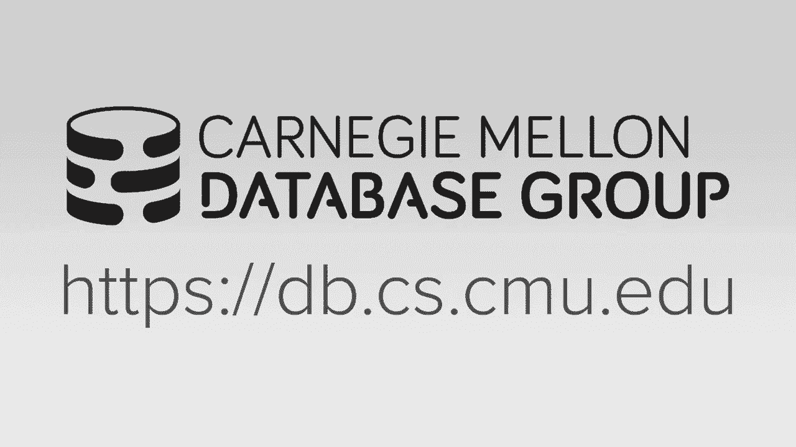
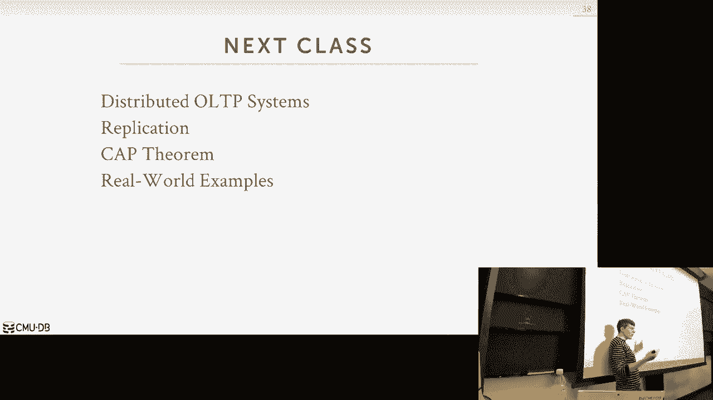

# 【双语字幕+资料下载】CMU 14-455 ｜ 数据库系统导论(2019·完整版) - P22：L22- 分布式数据库简介 - ShowMeAI - BV1qf4y1J7mX

alright let's get started alright you，need to drop tables as back thank you。

did you solve all your problems，yeah okay you know you don't want to be。

in that boat it's awful yeah everything，else okay I mean you still gonna have。

three girlfriends or you try to come，back one and a half what's the half okay。

alright alright alright，so we have a lot I think a lot of things，to talk about today so real quickly。

before we get into the course the the，topic for the lecture today so this is。

the final docket for everyone this，semester this is everything that that。

you have to finish up project 3，obviously was due last night homework 5。

should go out today ish and that'll be，due in two weeks on December 3rd perfect。

for will go out went out this weekend，and that'll be due on December 10th the。

extra credit is due on December 10th as，well and then we'll have the checkpoint。

which I'll talk about next slide and，then the final exam is on Monday，December 9th at 5：30 p。m。

 not in this，room I don't know what room they'll put，us in，but it's sort of a suti time so maybe。

we'll do is that new candy maybe a new，pizza or something like that something。

better okay so any question about any of，these things all right and then some。

other things that are floating around we，have three more sort of I'm Convio。

lectures but like course topic lectures，on material that's this week and then。

one one class next week and then when we，come back from effort the Thanksgiving。

break on Monday December 2nd our friends，at Oracle will be coming giving a talk。

about the the stuff that they're working，on and again this is not like a it's not。

like a lecture where there，you know instead of me talking about the。

material they're gonna talk about the，same material they're actually gonna。

talk about what they're been building in，in their group and you'll see how it。

ties in together all the things various，things we talked about through the。

entire semester the other thing that for，the second class in the last week I do。

two things one we'll do a final system，review and the second one will be what。

I'll call systems potpourri where if，there's any system you want me to talk。

about for like 10 or 15 minutes to teach，you about what it is how it works and。

why it's interesting you know and using，the vernacular that we talked about。

through the entire semester we'll have a，vote online at this URL it's just a。

Google form and you go select whatever，system that you want me to cover for 10。

or 15 minutes okay so we usually have，time to do three or four of them so the。

list that I'm showing here is the when，you go to the Google Form it's the it's。

the systems on the DVD DVD video website，that have had the most views for the。

last two months so that they're in that，order but you don't necessarily have to。

you know follow that but and also，there's another one that's on DVD that I。

oh that we want to cover that that's not，on that list just you know that you can。

even type it in okay and you can go back，last year and see what I cover but I。

encourage you not to do that before you，vote you don't want to sort of take your。

your your bias to you just do whatever，people did last year because I'm always。

curious see what you guys are just about，like yeah we've covered post miss a。

little bit we covered my single Oracle，and sequel light a little bit easier to。

see what you guys are seeing on the，internet or what you want to do it in。

your job or on a hobby project we know，what system you've been thing about。

maybe using and I can come teach you，about what it is and how it works okay。

all right and then the extra credit，feedback again you can submit your extra。

credit article next this Sunday on，November 24th and then the myself and。

the TAS will give you feedback and say，what you're doing correctly what you're。

not doing correctly and that way you can，fix it up in time for the this mission。

so they did get full credit okay and the，questions about any of these things so。

I'll put a deadline for when you should，go vote right if like you obviously。

can't vote the day before the lecture，because then I don't have time that you。

prepare it certainly or maybe the the，week of Thanksgiving，we did in London for this okay and the。

last thing is that in addition to giving，an in-class lecture on on the ii that。

should be December third on the Tuesday，December third book will also be giving。

a graduate level research talk over in，the PTO in the CIC building I think。

they're also giving an undergrad talk，Monday and Monday afternoon as well so。

there's me three Oracle talks in two，days and you know one of them you'll。

require to come to or not required but，you'll get extra credit for for the。

final if you come to that and then these，tuition ones are optional okay any。

questions we're almost done all right so，today's class is now the beginning for。

our discussion on distributed databases，and as I said last class we can't。

actually you know before we just you，know jump in neatly into distributing。

databases we had to spend however weeks，we've gone and so far in this semester。

to understand how a single node database，system works because when now we start。

going distributed you know just because，we have more machines or more hardware。

doesn't magically make our system easier，to build or better are you all the。

things that we had to talk about for a，single node system we have to still。

solve them in a tribute ax system and，actually they're even harder because now。

you have to account for the network so，we've already talked about this before。

when we talked about query executes this，this contrast between a parallel。

database and a distributed database，system and when I talk about parallel。

database system we were just assuming，that the the database system was running。

on a single box that could have multiple，cores and multiple CPUs and then we。

assumed that the the workers that were，executing the queries could communicate。

very quickly with each other and that，communication was reliable because if。

you're running on the same physical，machine you're sending things over the。

interconnect between CPU sockets that's，super fast but now under strip in a。

database system we still have to you，know there's still the things we care。

about how to do parallel execution but，now we're doing this potentially across。

multiple machines and so now we actually，need to be mindful on what it what the。

cost is and the reliability of，one worker communicating with another。

worker because it's going over the，network that you know that other worker。

might not be in the same data center，right mining meet you on the same。

continent and so now we can't assume，that you know we send a message there。

guillotine to get that and that's gonna，come from problematic when we start。

talking about transactions and other，things so as I said the for the Shiva。

DNA stuff we could talk about starting，today it's it's building on all the。

things we've already talked about so we，still have to do logging we stuff to do。

a concur to toe hoodoo query，optimization we have to do query，execution to do joins potentially all。

those things we still have to do in，attribute database and now they're just。

everything is more expensive everything，is harder so for today's lecture as I。

said today's sort of introduction to，distribute databases just to understand。

you know what what they actually look，like the different designs of them one。

of the implications of those designs and，then we'll talk about how to do。

partitioning which is the the key way，we're gonna divide up our database。

across multiple resources to get the，parallelism we want in a distribute。

environment and then we'll finish up，briefly touching on how how hard。

distribute concurrency control is and，then that'll segue into Wednesday's。

class where we'll spend the entire day，talking about how we actually do this。

and again like we're still going to do，face blocking potentially we're still。

gonna do timestamp ordering all those，things we did on a single row system。

still apply here just now it's，distribute it so it's even harder okay。

and again stop and ask questions as we，go along so the first thing we need to。

discuss is what is the system，architecture of the database system so。

as I said before when we talk to，parallel systems we talked about there。

being there being these workers that are，typically tied to either a process or a。

thread that are running on the CPU and，they're gonna access shared resources。

like disk and memory and so the design，of our database system in an urban。

environment depending what our，architecture is right the variations of。

these architectures are going to differ，in how you actually can coordinate the。

CPUs and communicate with each，as you're running queries or，transactions in parallel and where are。

where is the memory and where is the，dislocated in contacts to to the CPUs so。

what we talked about so far the entire，semester is what is known as a shared。

everything system assume this is a，single box a single rack unit that has。

CPU and CPU has local memory and memory，and you know there's a local disk that。

you can read and write to right now any，time I want to access something in the。

binomial architecture that we're based，on anyhow I'm gonna get something from。

disk I got to bring it to my buffer pool，into memory and then my worker up above。

running on my CPU can can read and write，two things read write two pages and then。

I let you write them out the disk again，most database minute systems that。

everyday the system that's not，distributed is using this approach as I。

shared everything system so an，alternative in a distribute environment。

is one alternatives called shared memory，and the idea here is that you'll have。

multiple CPU resources that are，potentially running on different，machines but there's there's a。

communication layer that allows them to，have a unified memory view across all。

those machines all right assume this is，some kind of high speed interconnect。

like InfiniBand or tcp/ip it doesn't，matter the high level architecture is。

still the same and then there's still，going to be some some local or started。

some shared disk that everybody's，reading running to I said typically the。

spoiler be this is actually not actually，I don't know of any database of them。

actually that's commercially or open，source that actually uses this this kind。

of architecture is mostly seen in the，HPC or high-performance computing world。

like the people running on，supercomputers at like the big National。

Labs they build software and assuming，this model for databases is there isn't。

that much another approach is do you，share disk and the idea here is that the。

CPU workers are the workers running on，the CPU they have local memory but the。

the disk where we have maintained a，persistent state of the database that's。

some scrum shared architecture shared，device that all these CPUs can can read。

and write in to nice to think of this if，you're running on Amazon this is。

something like s3 or BBS or HDFS and，kind of distributed file system so all。

the the CPUs are still seeing the same，same disk but in order for them to。

communicate with each other they have to，maybe send messages back and forth。

between them right because they you know，this CPU can't read the memory of this。

CPU the last architecture is what most，people think of when they think of it。

attributed database just what is going，to shared-nothing meaning every single。

worker is running on on a sort of island，by itself it has its own local memory。

has its own local disk and the only wave，to coordinate between different workers。

it to go up above and communicate at the，user you know using some kind of。

messages fabric on the top so again this，CPU worker here can't read the memory or。

disk from and any bits animate its，neighbors or friends in the cluster so。

again we'll go through each of these one，by one so again under shared memory as I。

said this is not that common in，databases I'm not aware of any system。

that's actually people are using that's，based on this and the basic idea is that。

the database system service is running，on these different CPUs it's running in。

the same operating system instance and，assumes it has a single global address。

space that maybe just aggregated across，different machines and then there's some。

networking layer that allows them to，pass messages back and forth to make。

make this work right so again this could，be InfiniBand this could be tcp/ip this。

could be intel's omni path alright some，fast interconnect between them so in。

this in in this world the database，instance running on one CPU it like the。

worker is aware of other workers and so，if they want to communicate between each。

other they can just do what you would，normally do in a shared everything。

system you can write something into a，global data structure or send a message。

over over an IPC and you know the other，process of the other worker running on。

on the other another machine would see，that right again clean in the context of。

a shared everything system when we were，doing to base locking with if we wanted。

to tell another worker that hey I hold，the lock for this tuple I add an entry。

to my lock table that's sitting in，memory，so same thing here if I one worker one。

sit-up acquire lock on a tuple just，updates the global lock table and then。

the the messaging fabric is guarantee to，make sure everything's coherent across。

all those all those workers okay as I，said this is not that common I don't。

know if anybody actually does this the，more common one is share disk and again。

the idea here is that we have these，compute nodes that have their own local。

memory they can have a disk up there as，well but that's not the the the final。

storage location of any kind of data in，the database you can just use it for。

caching in case you need to spill the，disk on your local machine but the。

database the final resting lok resting，location is down here so if I say I。

bring a page into my buffer pool in my，local memory say I modify it and then。

I'm gonna write it out because it's，dirty I would write it down here to the。

shared disk and now potentially any，other worker can can see my change how。

you coordinate that will make sure that，they're told about that change will get。

will get to later so as I said this is，the this is the present architecture in。

today's cloud environment because the，disk is going to be you know something。

Amazon provides like s3 EBS so pretty，much every sort of cloud native database。

system that you've heard about is is，gonna be running this environment。

because one big advantage you can get is，that you're able to scale up the compute。

resources and the disk resources，separately because the compute resources。

are stateless the state of the database，is down here so if these all these。

compute resources crash and go away my，you know assuming I you know of log。

things out correctly everything is still，here and then I can bring up another。

instance and and pick up where the other，guys left off we'll see in a second。

that's not so easy to do in a in a，shared nothing environment because every。

node every node hold state so let's look，at a high-level example like this again。

so we have our application server it's，gonna send requests to these front-end。

compute nodes right this is where we，have the workers running on CP us and。

the local memory and then we have some，back-end storage storage device。

that everyone can can read right - so，let's say that the application says I。

want to get record 101 it goes to this，node however it knows the good how it。

how it the application knows to go to，this node will cover in a second but。

assume it does so then this says some，kind of book up that says well record。

101 if I look at my index I see that，it's in page ABC so I go to my shared。

disk storage and I say get me page ABC，and I bring that to my bar full same。

thing this guy wants 200 he doesn't have，it in its buffer pool so it goes out the。

disk and fetches it in so now if I want，to scale up compute resources because。

again the state of the database is，always here on own shared disk I can。

just bring him a new guy here I don't，have to copy anything immediately。

because if I now request say 101 same，thing I just go to disk and bring it。

back to my buffer pool and I could serve，the request tricky sorry yes it's。

question is how does the lock manner，work in the setting like this and then。

we'll cover this yes not yet，to reduce simplicity we're talking about，[Applause]。

yes so this question is in a shared，memory architecture how is that。

different than a Multi multi socket，multiprocessor shared everything system。

they're the same but think of like so，there are there are there are there are。

distributed systems that have a unified，memory cross multiple physical machines。

so each machine has its own motherboard，has its own like physical physical。

memory that it can be right to but，there's a there's a layer that it says。

all the processors think they have this，one giant block of memory。

nobody does that for databases you see，that in HPC world like all those people。

are doing like nuclear bomb or particle，physics simulations they're writing。

those Fortran programs assuming they had，this like no terabytes of memory across。

smoke machines they can do computation，you come mean that companies like this。

question is if you zoom in a shared disk，architecture like this if a database。

vendor davison vendor is using a shared，disk architecture does that mean that。

they either have to have all the the，data for a database in one location no。

well we'll get to that again I mean，think about this there's an abstraction。

between the physical and the physical，location and the logical location of the。

disk these guys don't know anything，about where these things are right so。

like it just says hey here's this file I，can I can read and write to just as you。

would as if it was a local disk when in，case Amazon or Azure you get like a like。

a block base or object based API give me，this bucket give me that bucket that。

Nats sending a restful class to go to，some back-end service you don't know。

where that data's actually is yeah yeah，so we'll get to that as well so his。

question is in my example here when I'm，sending this request in this in this。

example here I this the application says，I'm going to this node to get this。

record you could have something in front，of this that could hide that or this。

thing can maintain to say where to go，get the thing I need we'll come to that。

just the third thing I'm gonna focus on，here is like it's like this guy has no。

state of the database other than within，its buffer pool but that's not。

considered to be that's good not，consider be you know durable or。

persistent its ephemeral so this guy，crashes anything we had in here it goes。

all right so now the tricky things gonna，be if I do an update right so update。

page 101 hour sir an ID record of 101 I，have to update page ABC these guys all。

read that same record they have page ABC，and the buffer pool but they're not。

going to know about the the chains，because these shared disk architectures。

they don't provide a notification say，hey by the way somebody updated this so。

I have to have additional messages in my，knees notes to say hey I think you have。

page EBC by the way I just modified it，and here's the latest version or if。

you're gonna find out what the latest，version is come asking me about it。

so that's all the stuff that we have to，build in our database system right this。

is just reading writing to some desk and，so related his question that it's all。

transparent so right now I'm showing the，database and this in this in this。

diagram is on two discs but I can easily，add a bunch more to now split up the。

data cross more - I'm getting better，parallelism better better replication。

better reliability but none of these，guys in the in the compute layer they。

don't know anything about that，because that's all hidden from me so you。

had this nice separation where you can，scale things out independently but。

you're gonna pay a penalty in terms of，locality of access because I can't for，here。

s3 allows you do some basic filtering，but about anything like a join I have to。

do over here so that means I open pool，the data to my computes yes so yes。

question is this is different in，charting or partitioning we have。

explicit divisions of who has what data，we'll get to there I'm just showing you。

what share disk is and a high/low，you can still partition at this level。

there's nothing about share disk，precludes you from doing partitioning at。

the compute level correct if if you're，any question is in this example here I。

said when I update page ABC in this node，it sent a message to the other guys。

updated and say hey I haven't make a，change is it always like this or what。

all over the alternative yeah yeah so，what I said it in this case here I。

update a page ABC it has to the compute，node at the top is update these compute。

nodes to the bottom an alternative would，be a way to do a push notification and。

say hey I just got an update ABC by the，way everybody needs to update and。

refresh themselves I'm not aware of any，shared disk architecture like EBS s3。

whatever the address up they don't do，that because that would be super。

expensive because if you think about it，it's like a pop sub system I need to。

know who needs to know about my change，because otherwise I'm sending messages。

that are wasteful so as far as they know，nobody actually does this you have to。

coordinate at this layer here and this，is the database system does this the。

distributed file system or the object，store doesn't do that，yes his question is are we assuming here。

that the notification is reliable or，fast enough no I didn't say what this is。

I'm saying how we're doing the same，thing you have to do this his question。

is can't you run an issue still raise，absolutely yes that's that's concurrency。

tool we'll get there yes okay so the the，again the the pilot most people think。

about when they think about distributed，databases is the shared nothing。

architecture where you have each node，has its own local disk and old local。

memory and the only way for me to，coordinate as I run run queries is to。

communicate directly between my nodes so，if I want to get data if I query shows。

up and he's accessed data on another，machine I can't go to disk and get the。

shared disk and get it cuz that doesn't，exist I can't read the memory from up。

from the other guy because I can't do，that I，a message to say hey I think you have。

this data either run this query for me，and give me back the result or send me。

that datum and then now you get the，issue of like who should have what copy。

of what data right we'll get that so，this is gonna be the most hardest。

architecture to increased capacity and，ensure consistency that's the stale read。

issue that he talked about because I，need to be able to run the system and。

move data around in a way to ride I'm，not losing things I'm not having false。

negatives or false positive as I execute，queries right otherwise I shut the whole。

system down then move data around and，add new capacity but I don't want to do。

that because I want my system to always，be online so now you say well that this。

sounds hard why would I want to do this，well the advantage you're gonna get over。

a shared disk system is that you're，gonna get better performance and better。

efficiency if the system is is is，written correctly because I can now be。

mindful of the locality of data and try，to move the least amount of data over。

correct so yeah so his statement is if，you assume that your your your Chiba。

database is partitioned which we'll get，to in a second if now I need to add a。

new partition and I need to reach，potential Erie shuffle data depending on。

how I'm doing partitioning I may have to，move the whole database I'm in a segment。

of it but again I don't want to have to，stop the world while I move that and so。

depending how much data I have a single，node and I'm going with a network to。

some other machine where's that machine，how long does that take right it's if。

I'm doing this if I don't care about，consistency which we haven't talked。

about yet then who cares just move data，around and if you if you if you miss a，running turns。

then I'm gonna be very careful how I do，this and people get burned by this a lot。

so as I said this is just a brief，smattering of or a very limited subset。

of the some of the shared-nothing，distributed database this was a better。

out there look most of the time for the，no single systems that came in around。

maybe ten years ago they're all they're，all considered shared nothing so let's。

look how this works again so no longer，we have a shared disk on every single。

node we have a we have the CPU workers，we have our local memory we have our。

local disk and then now what I'm showing，is we've partitioned the database or。

shard in the database into subsets such，that each node has some portion of of。

the database and so now I have explicit，information about what data I'm having a。

habit each node so now the application，says well if I want to get ID equal to。

hundred it has to know that this node，has has the data that it needs so go。

ahead and get that and again now this is，operating as the same single node shared。

everything data so we had before like，it's it's not my buffer pool I go to。

just bring it in and then do whatever it，is that I want to do to answer the query。

and return results so if all your，queries are accessing a single node this。

this is super fast because again this is，just a single node database system the。

tricky thing is then when you start，touching data that's uncross multiple。

machines so let's say I have a，transaction that says one get ID you ten。

and get ID two equal to hundred like a，single query wants to do this so now I。

need to somehow get that data that this，other guy has up here but what am i。

sending am i sending the request to run，the query or am i just asking this guy。

hey I know you have this piece of data，send it up to me and I'll run the query。

now in terms of the the scale out issue，right on the shared disc architecture I。

just bring up a new compute node every，compute node it's stateless so therefore。

it comes along and start executing，queries and brings things from the back。

end shared disk into a buffer pool as，needed but now and I shared nothing。

architecture if I have to say bring up a，new node it now needs to get some。

portion of the database from these other，nodes here so that I balance things out。

right so let's say that this guy is，gonna send it you know a some some。

number tuples from this guy from this，bottom partition the other guy here is。

it sent up sometime close with another，partition and then once I've new I've。

copied the data now I update some global，state to say all right well this node is。

now responsible for the range 101 to 200，this guy's 201 to 300 a guy up about 1。

to 100 and I was saying to his point，like this is this would be hard to do if。

I care about transactions and I don't，want to lose any data because I don't。

want to have a query show up but maybe，that wants to access ID equal 150 and。

I'll and here and the the data hasn't，been transferred yet so maybe I can。

answer but maybe it has been transferred，yet and I go here and it says I don't。

have that data anymore so it returns，back nothing even though it existed this。

node down here so how did it how to，actually do this in a transactional e。

safe manner is is tricky and not not，his question is his question is how。

often you have to scale capacity can I，shut the database down once a month and。

add new nodes but what if I won't go to，the other way but so what so let's say。

it's singles day or black or Black，Friday or Cyber Monday it's the one day。

of the year where like I have a huge，spike that one I can plan I know it's。

coming so I can prepare ahead of time，but let's say I have like a flash mob。

right everybody wants deejay drop tables，new album all of a sudden so also we。

have a huge spike in traffic that's，unexpected I want to be able to scale up。

without having to shut everything down，and scale up gradually the the the older。

systems will do exactly you're saying，any time you see any kind of financial。

website says we're down you know Sunday，at 3：00 a。m。 there probably may probably。

not running a trivet a system but they，they're moving data around and doing。

maintenance things but if you're an，your question is what's the advantage of。

doing this versus having a single node，with like like you know instead of。

having two nodes run these to hold these，two partitions what have a single node。

and you say well this CPU socket has，this disk in this memory to run this。

partition and then another socket has，this memory in this desk that you're。

asking all right so your question yeah，instead of having two separate machines。

that have you know disk memory and the，CPU what if I had one machine that just。

had the same amount of resources that it，has put across two machines but now in。

you know a single unit so questions what，were the advantages of doing the shiva。

Davis so one is if the you get，diminishing returns as you scale up，Hardware vertically so there's。

horizontal represent scalability as is，adding new machines vertical scale。

voting to take my one machine，and adding more resources to make it。

more powerful going vertically is way，more expensive usually and you get。

diminishing returns and there's，obviously an upper upper bound how how。

big you can make a machine right leave，one example in the early days when I was。

in grad school we visited PayPal because，PayPal was running Oracle and they were。

freaking out that because every，Christmas they were they would hit the。

they were running Oracle on a single，machine they bought the most expensive。

machine you could buy from IBM right and，you had to buy two of them because you。

need a hot standby right so the every，every every holiday season they were。

freaking out because that Oracle machine，was was was hitting the in the limit。

what the harbor can do and they couldn't，buy a more expensive machine right so。

they couldn't scale anyone any more，vertically so they were mainly moving。

portions of the database off that the，humans are moving the portions Davies。

off in like November to these separate，machines on the side just to get to the。

holidays and then they moved it all back，so in that environment if they had a。

distributed database system with cheaper，machines then they'd say oh the holidays。

coming up I'm going to buy or turn on a，bunch of new machines and had the。

systems scale out that way handle my，high demand then when the demand goes。

down I can start turning them off and，your question is a so these is the。

advantage of attributed versus scaling，horizontal versus scaling vertically is。

the advantage that you can scale out，much more cheaply horizontally for quick。

but it is there's trade-offs right like，as we'll see as we talk about how we。

actually manage attributed a data system，communication is now more expensive I。

can definitely run faster if I'm on a，single node because I don't need to。

coordinate between other different nodes，and send messages over the network but。

as I said like you you can start to hit，scale go to bottlenecks right the the。

trend in data systems up into the 90s，was always scale vertically the trend。

now is to scale horizontally because it，just it's it's considered you get better。

performance and for getting the better，performance you pay less you pay less。

is that always true yeah I think that's，that's the convention wasn't that's。

always true yes a statement is like a，isn't it better for disaster because。

well again if you're running like a five，million dollar machine from IBM you're。

not plugging into the wall outlet right，you have you have generators you have。

backup power right but I would say that，the issues really would be the never get。

severed right if you're if the the，network to the Machine even then even。

then you'll still have redundant Knicks，going into it but even then if you can't。

communicate the database but potentially，on how you design your Chuba database。

system you could have the database，spread across different data centers and。

then you can still be available well it，discuss more of this on。

on Wednesday but this is this is this is，one of the trade-offs you get between。

the no single guys versus the，traditional or new sequel or relational。

database systems the no sequel guys were，caring about availability so they no。

matter what they wanted a website to be，online and available and so in exchange。

they would give up transactions to make，that happen because，if you have to have new transactions。

then that the communication is more，expensive you make sure that everybody。

is up in order to make changes and and，and they argue that was that was less。

than ideal for some applications I think，that makes sense for for anything。

financial that doesn't make sense I will，cover the next class okay so distributed。

aliases are old some of the first ones，were built in the late 1970s muffin was。

created by one of my advisers Mike snow，breaker the guy who built post grass and。

ingress and vertical and volt EB he had，a system called，muffin that was a trivet version of of。

ingress sdd one was a I actually thought，it was actually a real system turns out。

it was just a prototype they actually，never actually had anything running but。

there's a lot of seminal papers in the，late 70s written by felt the the great。

Phil Bernstein on on how to build a，tributed database and do transactions。

across them a lot of a transactional，theory that we talked about in this。

class all right all that early work was，done by Phil system R star was a。

research project at of IBM that was the，tribute version of of system or that。

never became a product although there is，a distributor version of db2 today gamma。

was an influential system out of，Wisconsin by Dave DeWitt that was one of。

the first like high-performance Toshiba，Devi systems and then non-stop sequel of。

all these is the only was the only，commercial distributor database system。

and that was that was helped built or，Jim Gray helped build this Jim Gray was。

the guy who was at IBM invented like，two-phase locking and a lot of the early。

stuff that we talked about under system，are so nonstop was an interesting。

company they originally were selling，these like super fault-tolerant machines。

like think of like redundant hardware，like space shuttle level redundancy like。

you have for CPU is running and if one，goes down the other three you can keep。

on running so they would sell a database，system that would sort of build on this。

architecture um it's still round today a，lot of financial systems actually still。

still still use this and it's amazing，how long it still runs，I guess it's nonstop right。

all right so uh all right so now we now，that we understand the the what the。

architecture looks like a lot of you，have these questions that like hey how。

is this thing actually gonna work how to，actually find data how do we actually。

make sure that everything is consistent，so all these things we need to be。

mindful of now when we build and shape a，data system and there's trade-offs。

because we do not be able to do，everything so we're not gonna have a，time。

and make sure that we always support，transactions and and not lose any data。

or have inconsistent results so as we go，along，we'll see what these trade-offs are and。

why you're not gonna achieve everything，the other big question we're gonna have。

is how we actually execute the queries，on this distributed data and so I showed。

two examples so far I showed the example，on shared disk where the compute nodes。

pull the data from the shared disk，system into their local memory and。

compute the compute the result and then，in the case of the share nothing system。

we would send the query to where the，data was located run that locally and，then get back the result。

so there's trade-off between how you，actually want to better doing a pusher。

or a pool so the last thing to talk，about too is what does the architecture。

look like in terms of what are the nodes，doing in the cluster for the Shiva。

database and there's basis you know，there's just two approaches you either。

have a homogeneous cluster or a，heterogeneous cluster so in a。

homogeneous cluster every single node in，the database cluster is can perform。

every single kind of task you'd ever，have so I mean like you could send a。

query to any single node and that node，will figure out how to get the result。

that you're looking for and they're all，gonna give me a potentially background。

tasks and and other things so the，advantage of this approach is that it。

makes provisioning and failover，potentially easier to handle and support。

because now I just add new nodes and，long as I'm you know like I can move。

data around safely I can add new nodes，and there's you know the system gets。

gets stronger it gets better in a up，into a point which we'll see you next。

class another approach to do header，heterogeneous cluster where you can have。

specific nodes or members of the the，database system be responsible for。

separate tasks and so now I can't to，make a decision say if I'm running my。

systems running slower I want to add new，nodes I have to know what I should add a。

node for this type of node or this other，class of node right I have to make a。

decision at that at that level so give，me example what a one of these。

architectures I always like to use，MongoDB because that's the most basic，one to understand。

so MongoDB uses what is known as a，heterogeneous cluster architecture。

so you have you have special-purpose，nodes that are responsible or doing。

specific tasks in the system so in the，application wants to send a request or。

execute a query it always goes to this，router and and so the router looks at。

the request and says you know I want to，look at I want to get record with PID。

equal 101 these guys are stateless they，don't know about what any of the data is。

on the actual shards so goes to this，config server node that it's responsible。

for spending sending is sending out back，the information about where to find data。

on these different partitions or these，shards here so that's all this thing。

does this thing is responsible it is，like a global State for what the。

configuration of the system is so now，the router used gets this routing table。

from the config server and then it can，send the request to the manga D or the。

shard server and then that sort actually，excuse the query and get gets back the，result。

so under this architecture again if I，notice that oh my my router。

infrastructure is my bottleneck that I，can scale this thing out and add more。

new nodes without touching the config，server or the or the the Charlotte，servers。

this question is what sin is able to，test so like garbage question we talk。

about MVCC or building indexes or moving，data around because I'm I'm I'm I'm。

scaling up or scaling down again like，you can't send a query to this guy here。

he can only tell you what the，configuration of the system looks like。

and this guy can't hold any data you can，only tell you how to send your you know。

where to send your query so the other，thing we sort of briefly touched upon is。

about this notion of data transparency，in a distributed system and that's where。

we don't want ideally the application to，know anything about how the data is is。

split up and divided or replicated，across the different nodes in our。

cluster so the same sequel query or，whatever query language I'm using and my。

application for my database system I if，I'm running on one node that same query。

should still work and still produce the，correct sync same result if now I'm。

scared out on a thousand nodes because，otherwise if I have a query says like。

you know a select star statement and，then you have like some special thing。

that says you know we're node equals one，two three if one two three gets now。

split up across multiple Sheen's or not，one two three goes away I don't want to。

go back and rewrite all my out I'm all，all my application code so we're gonna。

hide all the details from the，application where the data is actually。

being stored although we can push some，information to the client level at a。

driver it allowed to figure out what，node he wants to go talk to you but our，application code。

you know the Joe Schmoe programmer，should not know anything about how the。

data is split up ideally it's not always，the case but this is what we want so now。

to talk about how we're gonna split the，data up we've already sort of touched on。

this a little bit we're gonna use we're，going to use partitioning why can't we。

talk about this as well when we did I，think was the this time one of the types。

of boarding protocols talked about this，and we talked about us with with。

parallel execution the idea here is that，we're going to take our database and。

split it up into disjoint subsets that，were then gonna assign to different。

different resources if you're coming，from the no sequel world they're going。

called a sharding but partitions and，shards are essentially the same thing so。

now what's gonna happen as the Davis，system is going to get a query and it's。

gonna look at what data the different，parts of that query plan need to access。

and then it may potentially need to send，fragments of the plan to different nodes。

to go have them exit that part of the，query and then send back the result that。

they generated and we can use that same，exchange operator we talked about before。

under the iterator model when we did a，parallel queries that same exchange。

operator is how we can paralyze things，in attribute environment so let's talk。

about how we actually split our tables，up so the most simplest way to do table。

partitioning is you just take a single，table and you have every single node you。

have each node store one one of those，tables so I have three tables a B and C。

node one gets a no two gets be no 3 gets，C that's the easiest way to do。

partitioning alright for this one，obviously have to assume that the table。

can fit on a single node but for valve，it's fine，so I have two tables one and two I just。

take all again all the tuples in table，one goes to one partition all the tuples。

in table to go to another partition so，the ideal query in this environment is。

any query that obviously touches one，table because now I don't need to。

communicate through between these，different nodes I just send my query to。

this one node it runs and I send back，the result again I'll get parallelism。

assuming that I my workload is easily，divided across these two two tables but。

we obviously know that's not always the，case that's not realistic so the only。

very few systems will let you do this I，know [ __ ] DB can [ __ ] DB you can say。

in their world they called a collection，instead of a table you can tell Bangi to。

be store a table on this one you know on，a single node by itself but this this is。

it this isn't that common in other，systems yes this question is what are。

for simplicity assume is shared nothing，actually yep in assume is shared nothing。

in a shared disk architecture you don't，have you don't necessarily have fine。

grain control like this you could could，you basically you could to say in like。

in like s3 you just have different，buckets for different tables but you you。

don't know any information you don't，have any information where it's actually。

being stored so assume this is shared，nothing what is more common we get most。

people think about in a distributed a，this is to do horizontal partitioning。

Frost again we're assuming we're doing a，roast door system so for this one we're。

gonna split the table up row by row by，looking at one or more columns as as the。

partitioning key and examining the value，of those partitioning keys and then。

deciding what partition to assign it to，so again in in a shared disk system so I。

shared nothing system you do physical，partitioning because every nodes gonna。

have actually store locally on at the，local disk its partition and then in a。

shared disk system you would do a，logical partitioning where you fit you。

assign a compute node to be allowed to，access a particular partition so that。

you know you don't have a copy of the，same page across multiple multiple nodes。

to reduce the amount of coordination you，have to do so let's look symposium it。

like this let's say that we select this，column as the partitioning key and we're。

gonna do hash partitioning which is just，we're gonna scan through and look at the。

value for every single to boil for this，particular column and there's gonna hash。

it mod by the number of partitions we，have and then that will tell us where。

we're to actually want we want to go，send the data so now if a query shows up。

and it's like you know select star from，table where partition key equals some。

value we just take that value running，through our same hash function and now。

so this is hash partitioning you also，you can do range partitioning where。

which I've shown before you basically，say you know this contiguous segments of，the value space。

column goes to this partition then the，next we know 100 keys go to this next。

partition and then same thing the query，shows up you look at the value they're。

trying to do a lookup one and I you know，I know where to route the data that I。

want or go route the query to find the，data where I want yes yes her question。

is the just rephrase your question，selecting what partitioning key to use。

is an actually an np-complete problem，because there's so many different。

combinations I could do how do I know，what to do so this is something I。

actually have done research on there's a，there's like a forty fifty year history。

of people developing different methods，and algorithms to pick the partitioning。

key again my advisers adviser wrote one，in the 70s and he's dead I wrote one。

right it's basically it's like a search，workload，I see how I'm accessing like my queries。

my queries are accessing the table and，I'm seeing this thing you know partition。

key you know something equals something，over and over again then that's。

obviously the one I want to choose for，all TV applications oftentimes you can。

we'll talk about snacks class you can，almost develop like a tree schema and。

identify like brain or passed down to，the tree that you then split everything。

up so for example like say Amazon，divides up its its database based on。

like state where the customer is located，so here's all the customers in。

Pennsylvania and then here's all the，orders for the customers in Pennsylvania。

here's all the items that they bought in，Pennsylvania so I can take all of the。

Pennsylvania customers and put them in，one partition all the the Maryland ones。

going on another partition so it's a lot，of times it's sort of obvious what that。

key should be for OTP for all apps of it，more tricky you definitely have to look。

at the queries what the queries are，because again you want to minimize mount，between diff。

partitions yes question is if we have an，index on the partitioning key will this。

have an impact on the design I mean the，selection of the partitioning key what。

do you my design alright so this，question is will get that this question。

is this is my query my application sends，us how do I know that where to go what。

partition has the data I'm looking for，like how does it know that it uses hash。

function and send the query so if it's a，heterogeneous system you could have a。

front-end query router like a [ __ ] did，it say oh I know the sharding key is。

this thing here so let me go pick that，out of the query hash this value and。

then I say that's where I want to go if，it's a shared nothing system with the。

homogeneous architecture you could say I，land on p1 p1 says oh you won't actually。

this query but I don't have this data p3，has it so there's rot your query for you。

or it sends your query down here runs it，and then sends back the result through。

p1 there's different ways to do this all，right so I'm showing showing hash。

partitioning here right we just take the，hash value mod by the number of。

partitions I have and that tells me，where I need to go what's the problem of。

this is this collision ignoring，collision assume we have a good hash。

so he says well yeah so if you do hash，partitioning if you do its crunch will。

scan like if this is a range predicate，set of a quality predicate hash。

partition is a bad idea because I can't，hash a range just the same time of the。

hash table but not something else so his，question is if I update the partition。

key right if I said a partitioning on，this column I partition this column I。

got to move everything around yes but，that doesn't happen that often right。

like like think about like your your，your Amazon account ID that they're not。

they're not gonna say all right we're，not partitioning on that and what were。

purchasing on his other than your email，address that rarely ever happens bingo。

so he says if I if I had a 5th partition，here I have that same problem I had when。

I we were talking on hash tables and I，see why we have to talk about the single。

node stuff first if I had a 5th，partition here now if I rehash all the。

values and modify five they're not，guaranteed to be the same partitions I。

may end up moving the entire database，everyone might might be swapping and。

moving to another location so that's bad，so we need a way to handle that who here。

has ever heard of consistent hashing，very few good ok perfect so consistent。

hashing was a technique developed in the，early 2000s and the way it basically has。

to do it allowed to do incremental，updates and removals of partitions in。

your cluster without having to move，everything around so the way to think。

about this is that the hashing space is，just a ring 0 to 1 and so I'm gonna have。

say three partitions a B and C so the，way to think about this is like if I。

hash now key and I don't modify the，number of partitions I just hash it and。

say you put it between 0 1 Sally and at，this point in the ring so then I travel。

forward going clockwise motion until I，find the node that has the first node。

that shows up and that's where I know my，data it's gonna be located so I hash it。

I get a value put it between 0 & 1 and I，know that in between this you know。

from doing this and this is a so the，data I want is on that right same thing。

over here I hash to I land here so we're，in the ring space and I jump here to go。

to sea so again the way to the the key，space for all these guys is is from from。

the bueno punchin starts back into the，not so great，what matters now is that when I add new。

nodes against AI my disturb a database，can't keep up with the traffic I'm。

trying to support so I want to add new，machine it's and scale out so let's say。

I had a new partition here deep so if I，was doing the static hashing technique。

that I showed in the last slide then I，add now a fourth fourth partition and I。

got a Reno rehash and mod bye for now，everybody and we had to move potentially。

move all of data around but the way，because system hashing works is that I。

add my guy into the ring here and now，the only thing I need to transfer is。

whatever C used to have weird emails，located so it's just this part here of。

all that all the batteries that are that，are in this partition that would be。

covered by this part of the Ring I send，them down and everybody else in my。

cluster stays where they are at so I can，add new part you know getting new。

partitions and they just update the ring，and add a new space in and likewise if I。

take take a partition away then anything，here just goes up to where C was so it's。

really interesting about this technique，as well is the way to do replication。

okay and we'll cover more this next，class but let's say I want to do a。

replication factor of 3 so for every，single in tape tuple I insert to my。

database I wanted it to be I wanted to，be replicated on three different nodes。

or three different partitions so that，way if one of them goes down I have two。

others available for me that can serve，as a backup and my database doesn't go。

down so now say I'm replicating a and，I'm gonna replicate it on three nodes so。

I have on an a councils one then two and，three so any right to a any key that was。

an a is also going to be on F and B so，now when my query shows up，rain。

and I can get it from either a F or B，and I'm there it's guaranteed to be。

there assume you're doing transactions，we'll talk about next class so this now。

actually gets into the consistency issue，that we that we sort of glossed over and。

we talked about transactions before and，talked about acid right if I do a write。

on a how do I know that it's been，propagated to F and F F F and B well I。

you have to wait until they all，acknowledge that they got the right。

which could be bad cuz one of these guys，could go down one I'm waiting for the。

acknowledgement and I'm stalling or I，say I don't wait but now I have this。

issue where I I may do a write on a and，then merely try to read that thing on B。

and I might not see what I expect to see，again so this will we'll cover this more。

in next class but this is the，consistency this is the C and acid that。

I said we were gonna gloss over for，single node databases but matters in。

distributed databases so consistent，hashing is a really cool technique and。

it's actually used in some distribute，databases so the three most famous ones。

are memcache D which is that caching，service，Cassandra and dynamodb like Dino DD I。

think was that had the first paper，discussed an architecture using this and。

then at Facebook the one of the，cofounders of cloud era he saw the。

DynamoDB Bieber hope that was a good，Facebook，facebook says I don't we actually don't。

need this anymore and they decided not，to use Cassandra so then they just open。

sourced it and put it out there and then，that people picked it up and started。

started making Cassandra actually be you，know a quality system so these probably。

three most most famous systems that use，this consistent hashing technique。

alright so the new ones have briefly，about what the distinction is between。

logical partitioning and physical，partitioning so again this the idea is。

the same that you have this hash，function or range range function that。

allows you to divide up the data base，and two disjoint subsets，but under the shared gist system you。

have to do logical partitioning because，you don't have control over how the data。

is actually being written to the shared，disk thing right Amazon controls this，you don't。

so the basic ways where it works is that，you，have a son you sign some portion of the。

database to these different compute，nodes so that again the application。

server knows that if I want X you to，query here's here's the machine to go。

get the you know go to run it right，likewise from down here he's responsible。

for forth for three shared-nothing，systems are running when you do physical。

partitioning again this is where you，have the the each each node is assigned。

the the the partition a portion of the，data that's managed by partition so。

again same thing I know how to get the，data that I'm looking for from these。

different nodes alright so we have like，ten minutes left so let's finish up and。

then that'll set us up for from，Wednesday's class so when we want to。

start actually transactions this is when，things get hard and this one things get。

expensive this is why I see her question，is her question before was Oh doesn't。

always make sense maybe try to scale，vertically why would you ever want to。

scale horizontally there are gonna be，just as if there's diminishing returns。

if you scale vertically the harbor can't，actually get any better cuz you just you。

you can't buy a machine that gets in you，know there's immediately faster it's。

also assumed your software can actually，scale and it's not gonna be plagued。

plagued by cersei concurrency，bottlenecks and other things if you're。

not scared hosana lee then you're also，gonna have diminishing returns and。

performance gains because now you're，gonna end up with what are called。

distributions actions so if I have，something that has to update data on a。

single node we know how to do that we've，card an entire semester about this and。

that's gonna be the fast，the best-case scenario where my，transaction that I needed mean to touch。

data it's all in a single node I can run，that with ever without having to。

correlate with anybody else if I need to，have state across altima nodes then now。

I need a way to make sure that if I make，a right here and I make a right here。

when my transaction says commit that it，actually does commit because I only make。

sure that all might change their atomic，and durable just as just as I wasn't a。

single node system and that's gonna get，expensive because how do I make sure。

that if I say I commit then everyone，so the way we can do this is through a。

sewer transaction coordinator so you，sort of think of this is like a traffic。

cop for the entire system it allows a，way to determine who's allowed to do。

what and when when it goes time to，commit that everyone agrees that we're。

actually going to go ahead and commit so，the two different approaches are do。

centralized decentralized a centralized，one is where everyone goes to some。

centralized location that has a complete，view of everything going on inside us。

inside the system and then it makes，decisions about whether you're allowed。

to commit and it is decentralized，approach where the nodes try to organize。

themselves and make a decision about yes，we this this transaction made these。

changes and we're allowed to commit and，we can notify whoever else is involved。

in the transaction that they've，committed successfully so the very first。

version of one of these transact our，transaction coordinators was this thing，1980s。

nowadays I think if you look at the，Wikipedia article TP stands for a。

transaction processing monitor back in，the 70s they call these things telecom。

processing monitors because these things，are built for like the early you know。

the phone companies that come back in，the day because they were the ones that。

had most of the traffic I mean you know，most of the data so the way to think。

about this this TP monitor is that it's，the standalone piece of software that。

everybody has to talk to in order to，figure out whether they're a lotta doo。

doo do certain operations on a，distributed database so the database。

system itself could be stored across，different nodes and they don't really。

know that they're actually involved in，the distributed transaction or。

distributed database if you just take my，sequel whatever single node system you。

want run that separately and then up，above you have this to be monitored。

allow you to figure out whether you're，allowed to do certain things so it looks。

like this right so we have application，server we have four partitions so save。

your transaction with such these these，three partitions so we're gonna begin。

our transaction by going to coordinator，and say hey we want we want to modify。

some data at these partitions we need to，acquire the locks for them are we。

allowed to do that and then the，coordinator says well I know it's where。

else is running the system because，everyone has to go through me yes well I。

see these locks are available so I'm，gonna sign them to you，then tell you that you you know you've。

acquired them and then now the，application server can go to the。

different partitions do whatever it is，that wants to do to make the changes and。

wants to make and then when it wants to，go to ahead and commit it goes to the。

coordinator and says hey I want to，commit I made these changes these。

partitions am I allowed to do this and，the coordinator is responsible for going。

and communicating with these guys down，here and say hey I think you know about。

this transaction because it told me it，was gonna touch you did it actually do。

anything and then they come back and say，yes you know these changes were what。

happened and they're okay or safe to，commit and then then once once we。

everybody agrees once the cornea，recognized that everyone agrees that we。

can go and commit we can stand back our，knowledge meant question questions I。

know what scenario would it be not safe，to commit so let's say I violate a you。

know integrity constraint here my，transaction aborts right I try to insert。

a duplicate key the coiner doesn't know，what you did it says hey I want to pry。

the locks on these things and I want to，I want to commit in a distributed。

fashion you have to go ask them whether，that's a lot like they were allowed to。

do that for simplicity his question are，we lucky the whole partition simplicity。

yes right there's a I think it's like，the XA if there's a protocol that allows。

you do more fine-grained locking just，so again there's a bunch of a lot of the。

enterprise software vendors sell you，something that that is a TV monitor。

Oracle has this thing called tuxedo IBM，sells this thing called tranzec。

which actually was a senior startup like，the guy that did the af-s stuff in the。

80s they did a startup called tranzec I，got bought by IBM and IBM still sells us。

there's a project you can't really read，the logo it's called Apache Omid it was。

built by Yahoo it's a it's basically a，teepee monitor for HBase anos ecosystem。

that's actually used by a couple other，systems today so you can build a tribute。

database without worrying about，transactions could you just rely on。

these guys to figure things out for you，and you just do all the single node。

but pi more common is to use a，centralized coordinator as a middleware。

where you had this piece of software，that sits between the application server。

and the database partitions all queries，go through this middleware and the。

middleware is responsible figuring out，oh this data wants this query want to。

touch this data this partition so it，looks at its it's it's you know it's its。

global lock table or information about，partitions are there and it routes the。

queries as needed for you so you look，like you're talking to a single single。

node database system through the，middleware but in the backend its。

distributed and broken across these，different partitions so when the commit。

request shows up by the application，server de moda where does the same thing。

as the TP monitor does it communicate to，these guys and say hey are we allowed to。

commit and only when everyone agrees do，you then send back the acknowledgment so。

this one this this approach is actually，very very common like Facebook is。

probably most famous one Facebook runs，the world's largest my sequel cluster。

and they have a middleware assistant to，do all this routing for you Google used。

to do this for for my sequel in the ads，there's a planet-scale that came out of。

YouTube but this approach is actually，very very common you take us you know。

Postgres my sequel whatever you know，your favorite single node database。

system is and you build this little，wrapper layer in front of it，eBay did this with Oracle it's very。

common the other approach is the last，versions to do centralized coordination。

where you don't have a coordinator you，don't have a centralized view of what's。

going on in the system the application，never communicates with some home。

partition or base partition some some，master node that's been responsible for。

this given transaction all their notes，will be master nodes if you're assume。

you're a homogeneous architecture so you，send all the query requests either to。

directly to the master node or to，individual partitions it doesn't matter。

but it's when you want to go commit you，go to the master node and say hey I made。

these changes I want to go ahead of，commitment transaction and then it's。

responsible for communicating with the，other partitions and deciding whether。

you're allowed to commit and if yes then，all right so the thing that I call。

Stover is that part of a how do we，figure out whether it's safe to commit。

question this question is how do you，take the locks so it would be say again。

assume I'm doing a lot project locking，the whole partition so when the query。

shows up right you you you try to，acquire the lock at that point so the。

masternode would only know information，and potentially about what partitions。

you touched doesn't know what you did at，them right and it's respond to the。

application responsible are saying hey I，couldn't get the lock of this partition。

I have to abort my transaction so you go，back to this guy hey say I aborted。

alternatively you just send all the，requests that this guy and he's。

responsible for farming out to the，different machines at the masternode if。

you touch the data at the masternode，sure yes okay，so we'll cover this in more detail next。

class it's an impress upon you and then，you'll think about it and see on。

Wednesday why you know how hard it，actually is say we're doing two-phase。

locking my last example and say that my，nose or over the white or never one note，Francisco。

so at the same time I have two，applications trying to update the。

database right and the very beginning I，get a lock on my node here for a this。

guy gets the lock on B but now I want to，update this guy wants to update B the。

other guy wants to update a so now I got，to go over the network and send a lock。

request to get the other lock on the，same thing，I'm obviously ending up with the。

deadlock here so how do I actually，figure out who's actually should should。

be allowed to commit this again if I'm，doing a decentralized architecture if I。

don't have that TP monitor but even if I，do I men have not the fine-grained。

information about what exactly it's，doing on each node because you can't。

always know what the queries gonna do，before you actually run it。

someone needs to figure out I have this，weight to a graph of a cycle I need to。

and then so let's say this guy says oh，I'm gonna back off I have a deadlock if。

I'm doing dog prevention I kill myself，this guy could be doing the same thing。

so this is what we're gonna talk about，on on Wednesday how do you actually do。

to ship it control how do you how do you，figure out you take two phase locking。

timestamp ordering and run it in，attribute environment where you don't。

have a complete global view of，everything's going on side the submit a。

and a given time we're also gonna spend，time on when my transaction says go。

ahead and commit how do I guarantee that，I that I commit everywhere because what。

happens if a node goes down while I'm，trying to commit what should I do。

that's actually super hard to get right，so if you're injured in these kind of。

things there's this great is this great，website called the Jepsen project by。

this guy called Kyle Kingsbury so he was，he's basically he he built this torture。

chamber for distributing databases，Britain enclosure which is a bit gnarly。

but he basically has this test suite，where he can take your distributing。

database run through these weird edge，cases and identify that it's not always。

correct and has and has has problems on，a guaranteeing reliability availability。

or correctness of transactions so right，now he he has a consult company people。

pay him money to go actually run this t，v-- build his website he has these。

write-ups which are super super detailed，and take a long time to read to。

understand what he's actually talking，about but he talks about how these。

different data systems he's tried this，against they claim that there may be。

transactions correctly they claim that，they can always support high。

availability or good performance and his，thing shows that that they don't so they。

paying him money to go run his thing on，their database system and then if they。

pass they can announce that they're，certified there's one day to his company。

was aerospike which is a distributed，key-value store they used to claim on。

their website they had you know they had，strong consistency guarantees he ran his。

thing against theirs crushed it showed，how it wasn't and they had to go back。

and change all the marketing crap to，remove it because t humiliated it says。

websites awesome his Twitter feed not so，much you'll see why to go look at it uh。

it's not my thing but he's a he's a，really sharp dude I think there's a。

really good website alright next class，just Roberto to me systems replication。

cat theorem and then real-world examples，again we'll go through。

start worrying about how we're actually，gonna run transactions in a t-shirt。

environment will tell them about no，sequel systems and see why they don't。

want to do transactions because it's，gonna affect performance and。

availability okay all right guys awesome，see you on Wednesday ricochet jelly hit。

