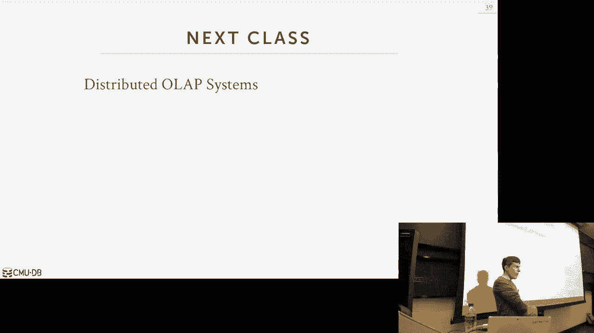

# 【双语字幕+资料下载】CMU 14-455 ｜ 数据库系统导论(2019·完整版) - P23：L23- 分布式OLTP数据库 - ShowMeAI - BV1qf4y1J7mX

去吧。

他们是我在校园里错过的一个事件，还是什么，今天是什么，免费蛋糕，那很弱，所有的权利，DJ拖放表，一直谢谢你，所有的权利，嗯，所有的权利，让我们这些都在这里，让我们一起度过难关，嗯，所以再一次，这只是。

这学期你们要做的很多事情的大纲，嗯再次，这些日期都可以在网站上找到，然后是额外的学分，额外学分的第一次反馈审查将于本周日到期，然后我昨晚也在Piazza上发帖，如果你还没有这样做。

请去投票选出你想让我在最后一天介绍什么数据库系统，是呀，所以在利用这一点之前，我有点担心偏好顺序，那么你能判断出，什么对不起的结果，什么对不起的结果，结果，哦耶，对呀，是啊，是啊，否，我还没有回音。

我会努力的，如果它进来，我会在上课的最后一天宣布，我发送它，把它发出去，星期一，我不知道，不管发生什么，一两个星期什么的，所以我们会看到与这门课有关的其他问题，再说一遍，我不认为它看起来像我，嗯。

这是说我妻子过着某种生活方式，我会有问题的地方，好的，上一节课我们谈到了分布式数据库的介绍，嗯，我们关注的主要三件事是系统是什么，一个系统的体系结构看起来像对的，我们谈到了共享记忆。

共享磁盘不显示任何内容，我说过，大多数分布式数据库实际上是每个分布式数据库，要么是共享磁盘，要么什么都不共享，什么都不共享传统上是人们使用分布式数据库时更流行的方法。

但是共享磁盘在云架构中变得越来越普遍，然后我们讨论了如何对哈希进行分区或分片，分割率，围绕罗宾分区，这是一种将数据库，把它分解成不相交的子集，我们分配给不同的，不同的不同节点，然后我们谈到了最后一点。

关于我们想如何进行交易，协调我们是否有一个集中的方法，它对整个系统正在发生的事情有一个全局的看法，在事务试图做什么的上下文中，或分散办法，节点本身负责计算，你知道，事情是否允许承诺，最后一堂课。

所有这些话题都有点，我们接受我来协调交易，但在很大程度上，我上节课讲的一切都适用于，设计用于运行事务的分布式数据库或试图运行，设计用于运行分析，所以对于这门课来说，然后是下周星期一的课，我们现在要把。

讨论这两类工作负载中每一类的特定问题，因为他们要做不同的权衡，这可能对交易有好处，但对分析不利，反之亦然，再次提醒大家，我的意思是，当我对我们说事务处理和分析处理时，又是OLAP。

我想这学期我们已经讨论过几次了，只是为了重申这一点，二分法使每个人都在同一页上，在所有三个工作负载中，我们担心的是作战行动，试图更新或读取数据库中的少量数据，所以再一次，以Amazon为例。

当你去亚马逊网站时，你把东西加到你的手推车里，你为你的账户购物，您更新您的付款信息，所有这些操作都是只涉及，你知道，如你所知，当您调用这些更改时，他们只碰你的数据，所以亚马逊的数据库相当大。

但是您的事务要更新，你知道的，在你接触的数据量很小的情况下做你的操作，基本上，数据库系统一遍又一遍地做同样的操作，因为你要浏览网站应用程序代码，你知道的，当你点击，你知道的，添加到购物车。

该购物车调用应用程序代码上的函数，然后通过并执行查询来进行大量的更改，工作量，这就是我们现在所处的位置，开始做分析，试图从我们摄入的所有数据中推断出新的信息，在LTB侧，所以再一次。

使用Amazon下一个示例，分析工作量就像试图弄清楚，卡内基梅隆大学的学生在十一月最受欢迎的项目是什么，当温度是，你知道大约30度，所以这不是什么，你在LTP做什么，因为你知道那不是交易的事情。

这是你在OLAP方面做的事情，所以这些工作负载是查询，跑得更长，因为他们接触了更多的数据，他们在做连接，他们在做聚合，通常它们是一次性查询，因为有人想说，你知道的，回答那个问题，哦，对某一特定群体来说。

买得最多的商品是什么，你知道他们正在填写一些仪表板，使用分析工具编写查询，然后开火，也许数据系统可能再也看不到那个查询了，所以再一次，今天的课，我们将重点讨论LP的第一部分，下节课我们将讨论重叠。

所以再一次只是为了走得更高，讨论我们在分布式数据库中所讨论的内容，我们今天要关注的是，我们之前和布景谈过，我们有一些分区数据库，无论是逻辑分区还是物理分区，意思是什么都不共享还是共享磁盘，我们我们。

你知道我不是在解释，还没有，我们今天在这里谈什么并不重要，但我们担心的情况是，我们有一个应用程序服务器想要调用一个事务，它选择一些分区节点作为主节点，所以它告诉那个家伙，嘿，我想执行一个事务。

然后它继续进行，并进行一系列更新，或者在我们的各个分区上读取一堆数据，然后现在当交易完成时，它去找它一开始的大师，说嘿，我想继续承诺，假设这是一个分散的体系结构，这意味着我们没有中间件，我们没有那个。

协调我们所有交易的TP监视器，现在这些节点必须在它们之间弄清楚，他们是否被允许进行这笔交易，所以上一节课我对这一步很模糊，如何确定提交是否安全，说这话是什么意思呢，嘿嘿，我们都要继续进行这笔交易。

这就是我们今天主要要讨论的，这个，这里的最后一步，所以本质上我们要做的是，我们试图在我们的数据库系统中，我们试图让所有节点同意我们应该提交一个事务，如果每个人都同意我们进行这笔交易，我们继续承诺。

我们不希望任何奇怪的异常，奇怪的反转，你知道的，一个要提交的节点，然后突然间，交易没有被回滚，一旦每个人都同意我们要去承诺，那我们就继续承诺，所以现在我们有很多问题要处理，为了让这一切正确安全地发生。

当我们在一个共享一切的系统上，这意味着我们的数据库系统运行在一个盒子上，我们想做我们的，你知道的，OCC并发控制的验证协议，所有的参与者都在决定这件事是否需要承担很多责任，在一台机器里一起运行。

可能都在同一个记忆中，它真的很快，让我们弄清楚我们是否可以继续承诺，然后如果我们说承诺，那它就真的被投入了因为我们知道所有东西都在那个盒子里，但是现在在分布式环境中，我们有一个问题，假设我们继续说承诺。

每个人都回来说我们去承诺，然后也许我，你知道的，在此期间，一个节点宕机，应该发生什么，以及我们之前谈到的所有相同的资产属性，我们不希望任何部分更新持续到我们的数据库，我们必须解释的所有事情。

所以如果一个节点下降了，我们必须处理这个问题，但如果节点不下去怎么办，相反，我们的提交消息更短，晚到对吧，数据包在来的路上不知何故在网络上延迟了，或者哪个可能更常见，说我们的数据库系统是，你知道吗。

使用JVM，就像，它是用Java写的，用Scala编写，它使用JVM，突然之间，JVM决定做一个非常昂贵的垃圾收集套件，现在我们的过程暂停，所以我们看起来好像没空，为什么在这个GCGC通过的时候。

然后突然我们在GC之后回来了，现在我们的信息到了，它是，你知道的，一秒钟过去了，然后会发生什么，如果我们决定我必须确定有多少节点必须同意，我们要进行交易，决定我们提交了交易，应该都是。

应该是他们中的一些人对吗，所以这些是我们要做的事情，我们要担心的是，今天，关于整堂课，我们要做的一个重要假设是，我们将假设运行在手臂上的软件，分布式数据库中的节点是我们的朋友，意思是要好好表现。

他们不会在那里耍我们的，它是我们作为数据库系统的软件，我们编写的开发人员软件，我们已经部署在同一个管理域上，所以我们要求交易，我们要求一个节点提交一个事务，他们回来了，说是的，我们将承诺。

我们假设你知道模港故障，或者你知道，软件缺陷，我们假设，如果一个节点告诉我们他们要提交一个事务，他们将提交该事务，这将在某些方面简化，我们该如何执行提交协议，如果您假设节点可能是坏演员，对呀。

如果他们说，是啊，是啊，我们承诺我们的螺丝钉，你，我们实际上不是那样做的，那么你就不需要我们今天要讲的一些东西了，您实际上需要所谓的拜占庭容错协议，这就是比特币下的区块链，一个区块链就是。

它本质上只是一个分布式数据库，对吧，这只是法律，您可以添加带有事务的内容，但在那种环境下，你会假设，因为这是比特币挖矿权，或者你想做什么，分布式数据库中的参与者不是您的朋友，他们可以骗你。

所以你需要一种方法来处理我们不在那个世界里，大多数数据库系统，分布式数据库系统不在这个世界上，大多数人可以假设每个人都会，会正确地配合，嗯，大多数人不需要区块链，很少有东西需要区块链。

所以如果你认为你在建造什么，你用区块链，你重新思考你的生活，好的，所有的权利，所以我们今天要讨论的事情列在这里，所以是的，最后一堂课我没说，我想再说一遍，我试着用三节课来复习。

通常需要一整年的时间来研究分布式数据库，所以我们显然不能详细地涵盖一切，我觉得我的目标就是让你们了解，问题，分布式数据库建设的难点，即使使用分布式数据库系统，这样你就知道当你离开CMU的时候。

你走到现实世界中，如果你发现自己处于一种情况，您认为需要使用分布式数据库，或者你认为你想建一个，你至少应该知道你应该考虑的问题是什么，所以你可以推理，你知道你做的是否正确，我想说的是。

大多数人可能不需要分布式数据库，你知道很明显一些有用的案例，但我会说我的意思是，我无法证明，但是世界上90%的数据库可以在一个盒子上运行，现在您可能应该有复制，一旦你把它带进来。

它变成了一个分布式数据库，但大多数时候您不需要分区数据库，大多数工作负载可以在一个盒子上处理，所有的权利，所以我们来谈谈提交协议的时间，如何让每个人都同意我们将承诺。

我们如何处理复制以确保我们有多个数据副本，所以我们可以一直在线，然后我们将讨论CAP定理，并讨论一致性问题，我们怎么，你知道的，我可以分配什么样的担保，为我们提供提交协议，然后我们在最后有时间。

我们将很快讨论联邦数据库，将不同的数据库组合在一起以创建单个数据库实例的想法，所有的权利，所以那个例子，我在一开始就表现出来了，当我们去进行并提交交易时，然后那个知道如何与其他节点对话的，说嗨。

提交安全吗这就是所谓的原子提交协议，这里的想法是，我们希望得到参与我们交易的每个人的反馈，来决定是否可以提交该事务，然后如果一个节点或足够的节点，取决于您使用的协议，如果超过阈值的节点数量一定。

我们将在协议中定义，大家都同意我们应该进行这笔交易，然后我们告诉大家我们将提交这笔交易，然后它就承诺了，所以有一堆不同的变体，您可以使用的原子提交协议，所以我们要关注的两个，是两阶段提交和paxos。

两阶段提交可能是最流行的一个对吧，可以追溯到20世纪80年代的帕克索斯，具有两阶段提交不能提供的某些保证，嗯，有些系统可以使用这个，但这是一种堕落的情况，还有一个三阶段提交。

这实际上是由迈克·斯通布雷克开发的，上世纪80年代在Postgres发明的那个人，s，从来没有人真的这么做过，这也太，太多了，你知道的，网络流量太大，实际上也有一个四阶段提交，来自微软。

他们在这个名为Farm的分布式数据库中使用，他们必须这么做，因为他们又在使用RDMA这种特殊的远程内存访问，我们不会再讨论这个问题了，帕克索斯，我们来谈谈，raft是斯坦福大学大约十年前开发的。

作为Paxos更容易理解的变体，但它基本上提供了相同的保证，raft实际上在较新的分布式数据库系统中出现得更频繁，因为有很多现存的，对呀，他们编写了实现筏的库。

然后人们可以将大量不同语言纳入他们的数据库，Zab是为阿帕奇动物园管理员开发的，视图戳复制并不常见，但这实际上是第一个PR正确性原子提交协议，它实际上是在帕克索斯之前出现的。

但人们没有认识到这个东西的性质，直到很久以后帕克索斯出现，所以再一次，对于不是区块链的分布式数据库，你可能会在现实世界中遇到，最有可能看到两阶段提交或Paxos，然后从新的援助中应用木筏，但在这节课中。

我们只讨论这两个，有两个基本的承诺影响，快举手表决谁以前听说过两阶段提交，右不到一半，好的，所以两阶段提交听起来正是这样，你知道这听起来是对的，它是一个两阶段提交协议，有两个阶段，让我们看一个例子。

我们要让每个人都同意进行交易，所以假设在这一点上，应用服务器已经执行了任何查询，它希望对数据库进行更改，或者读取不同节点上的任何数据，它想继续承诺，所以它会向这里的这个人发送一个承诺信息。

假设这是他们两阶段提交白话上的主节点，我们会说这个人将被认为是协调员，所以它负责向参与交易的朋友打听，是否允许提交此事务，然后这里的另外两个节点我们称之为参与者，现在，我不打算展示这方面的例子。

但是参与者的节点，节点本身也可以是参与者，这里的这个节点也可能被这个事务修改了，然后它涉及到这两个阶段的提交过程，但简单，假设这里的事务只修改了另外两个节点上的数据，所以在第一个阶段叫做准备阶段。

我们向参与者发送了一条网络消息，从协调员到参与者，要求他们，嘿嘿，这是一笔交易，我们认为你知道这件事，可以承诺吗，他们会做任何验证，或者他们需要做的任何事情来确定是否允许此事务提交，如果他们确定没事。

然后他们发回一条好的信息，那么现在一旦你从所有参与者那里得到许可，协调员进入第二阶段，称为提交阶段，它告诉所有的参与者，嘿好消息，每个人都说我们可以做这笔交易，去吧，把这个。

然后同样地这些人现在必须发送一个回应说，好的，我们这样做了，交易已经提交，然后在这一点上，当我们回到第二阶段，好的，来自我们所有的参与者，然后我们就可以告诉外界我们的交易已经成功地。

所以有一件事我不在这里展示，我认为教科书上谈到了这一点，在协议的每一步，在其中涉及的每一个节点上，我们正在写日志信息，以跟踪我们收到的信息和什么信息，我们发出了什么回应，所以在这一点上，当我发送，嘿。

我们将继续并承诺这一点，这些家伙会写一条日志信息说嘿，对于此交易，我看到我得到了一个，我进入提交阶段，我说这样做是可以的，所以这样，如果我们撞车回来，我们会说，哦，我们参与了这笔交易。

在两阶段提交过程中走多远，我们能决定是否需要撤销它，或者重做，所以关于这一点的另一个区别，这将不同于帕克索斯，再看几张幻灯片，所有的节点，此事务的提交协议中的所有参与者节点。

他们都不得不说我们必须提交这笔交易，不是所有人就是没有人，所以我们进入下一个例子，在这里，我们有一个中止，又来了，同样的事情我的交易完成，我向我的协调员发送提交请求，协调器进入第一阶段。

将准备消息发送到两个参与者节点，但让我们假设这个底部的家伙不管出于什么原因，你知道它与协议并发，决定我们不能提交此事务，所以它会发回一条中止消息，因此，一旦协调器从任何参与者那里获得第一条中止消息。

它已经不在准备阶段了，现在它立即进入下一个阶段，在这种情况下，为了中止，所以在这一点上，我们真的可以回到我们的客户身上，我们的申请说嘿，这笔交易无法完成，我们要中止，甚至在我们进入第二阶段之前。

甚至在我们收到其他人的回复之前，一条终止消息就会毁掉整个事情，所以现在在中止阶段，我们说嘿，我们要登机了，然后每个人都回来说好吧，我们中止了，此时事务完成。

所以我们的想法是我们需要建立往返网络让每个人都同意，提交此事务的，然后我们继续，或者提交或中止事务，我们继续，然后应用这个变化，是呀，我们真的需要第二次往返的最后一部分吗，在我们修改应用程序之前。

所以这个问题要问董事会委员会，问题是做什么，我需要这第二轮来告诉你，我需要去这里的节点说是，3。在我提出申请之前你已经答应了，或者在我告诉谁之前不，我是说，做，我们真正需要的是反应灵敏的背包。

我们一定要做到，因为有准备的人知道他们肯定会来，所以他的问题是萨姆在这里，我正处于准备阶段，此事务应提交，我把我的，我发送我的请求，这些家伙送回来的，好的就是做，我真的需要等下一次往返再说，哦好吧。

去做吧，在他们之前从他们那里回来，我可以告诉我需要提交的应用程序，因为如果我在这里撞车，其实是我在想，在恢复所需的时间之间有一个权衡，以及发送响应所需的时间，所以如果我把所有东西都记录到磁盘上。

我一回来你就说对了，如果我在这一点上崩溃，我有我的两个案例给我的参与者，我会把它记录到协调员中，所以现在如果我崩溃了，我回来我会说说说协调员倒下了，它会回来看日志，说，哦，我看到这个东西，你知道的。

我收到这些信息，我到底有没有犯，好的，嗯，确保我申请任何交易所，如果这些人中的一个倒下了，他们会回来，但他们会，他们仍然需要知道，你知道它以前是否真的承诺过，他们可以重做一切，所以为了正确，是呀。

性能是，你不必那么做，是呀，那样的话，你有什么问题吗，如果您在发送第二次提交之前，然后你不知道你是否真的发送了一个提交，就像结果回到服务器和服务器，应用服务器的透视图，它可能就像一个幻影提交。

所有的权利，所以这个问题是，如果我在这里，然后我送回去，所以我得到了我得到了这一点，每个人都同意我们要承诺，我们要写在协调器的磁盘上，我们已经承诺，每个人都同意承诺，所以说，因此我们可以进入第二阶段。

去做提交，但后来我崩溃了，然后我回来，我可以重新应用改变，我也没告诉这家伙他犯了，所以那是如此，这实际上并不能保证我们可以在数据库系统中提供，这是真的，无论是单节点还是分布式。

所以如果我们到了你认识的每个人，我们将日志刷新到磁盘，我们每个人都同意我们要承诺，但在我们告诉外界我们承诺，我们坠毁了，那个网络不去，该跟踪事务仍被视为已提交，它是由应用程序代码来。

然后回来弄清楚它问的问题是否真的承诺了，我们不能保证那个权利，因为我们怎么知道，至少在这种情况下，这条消息可以得到，可能会丢失数据库服务器，它不应该负责弄清楚这一点，不在乎，好的留言等待哪个喜欢这个。

为了这个，这是第二阶段，不因为又是你，就像，就像我们在单个节点上加入事务一样，我一知道我流产了，为什么要等着从磁盘上刷新任何CR或任何东西，我只是告诉外面的世界，立刻，你登机了，谁在乎呢，因为那是。

就好像交易从未执行过一样，所以我们马上告诉它，你有问题吗，或者没有，好的，所以我实际上涉及到他早些时候关于评论的问题，就像，我真的需要等批准吗，在我告诉外界我犯了罪之前，这实际上是你可以做的两个优化。

加快协议的速度，作为更长恢复时间的交换，好吧，这是这里的第二个，这就是他的提议，所以你能做的第一个优化叫做早期，准备投票，所以这将是，如果我知道我的，我的，我的申请是，正在发送。

将对其中一个参与者执行的最后一个查询，节点，除了给我发送查询，我还背了另一条信息，上面写着，哦，顺便说一句，我再也不会回来了，你让你做别的事，所以请把你的回应发给我，好像我们正处于两阶段提交的准备阶段。

所以现在执行查询并运行是一条网络消息，运行准备阶段，然后我的回应，我得到，我得到了那个查询的结果，加上准备检查的结果，因此，这显然要求您在应用程序服务器中知道，您永远不会返回并在，在那个节点上。

他的提议是，在准备之后，这被称为早期确认，所以一旦你知道，以及每个人都同意提交此事务的协调器，然后您可以立即告诉外界您的事务已提交，然后你负责提交阶段，所以再一次，只是视觉上，是这样的。

我做提交准备阶段，每个人都投票赞成，然后现在在这一点上，一旦我得到参与者的两个响应，我可以继续告诉我提交的申请，这里的想法是，我崩溃的可能性，这里的往返很低，因此，我可以继续这样做。

如果我在这期间崩溃了，你知道吗，在我收到消息之前，或者在我从这些回来之前，那我就得做额外的工作来弄清楚我是不是真的，实际提交并正确地解决问题，不过没关系，是呀，双方参与者，他们试图承诺，他们已经登录了。

的，这个问题是一个交易，如果我们在这个阶段准备，我得到了我的一双，消息参与者说，好的，我要去做这件事，你的问题是，他们在这一点上记录了什么，所以如果我说你付钱给我的协调员，我被比作是的，我是说是的。

撞车是的，但我已经做了早期的，是呀，所以我在这里，我发回我的同意，我告诉应用程序，好的，你有过，你去承诺，但现在这个参与者在日志中崩溃，上面说我告诉协调员，我本打算承诺，我该怎么办，当我回来的时候。

好吧，你假设协调员会很清楚，这家伙撞车了现在他回来了在我的日志里，我会我会说好吧，嗯，我看到每个人的承诺，此事务应提交，所以你会，您将有一个协调员根据需要填写参与者的缺失信息，参与人，当它回来的时候。

好的，所以协调员看到了，哦节点设置OK，他们已经准备好了，他们从来都不对，所以你你会到这里，提交消息，然后那就永远不会出现了，这样这样它就死了，所以这需要你有，所以我们不谈这个。

这是更多分布式系统的东西，但你在乎的是，我们这里需要它，所以这个你可以像心跳一样使用，只是为了跟踪，喜欢是纸条上有这个东西，确定我是否有一段时间没有他们的回音了。

进入某种恢复模式或故障模式来处理这种情况，是啊，是啊，是呀，那么我们为什么不把成功发送到应用程序中呢，在我们被吃掉之后，在第一个循环之后，所以你的问题是，为什么我们，我们为什么要发送，为什么在，好的。

它来自于这个，这就是我在最初的问题中显示的，为什么我们不在提交阶段之后发送成功信息，是啊，是啊，这就像最初的两阶段提交协议，这就是它的工作原理，但想想在，我不是说也，这些节点所在的位置。

可能在同一个架子上，同一个数据中心可以在世界各地，所以与其让我等这个，下一次往返，可能是一百毫秒，也许更长，我就直接发给你，您提交的事务，因为我想我不会在这段时间撞车，我有一个恢复机制，这是必要的。

然后处理他提到的一个公平的情况来恢复自己，如果我撞车后回来，是的嗯，在它开始接收之间的时间里，就像，呃说明和呃就像一个，在参与者开始接收指令之间的时间内，计时器接收准备，就像。

我能把所有的变化都留在记忆中吗，因为在那之前，它实际上不需要冲洗其他任何东西来磁盘，所以你的问题是，如果如果你在这里，所以你告诉了外面的世界，你已经告诉协调员了，你想，你想承诺什么实际上是。

这个节点实际上在做什么，你能把一切都记在心里吗，是啊，是啊，处理前，就像，基本上，因为在那之前你可以把一切都扔掉，直到它看起来准备好了，所以它需要把所有的东西都拿出来，除了像实际的，喜欢它，是呀。

所以他的问题不是我在这里含糊其辞，但就像在最初的两阶段提交协议中一样，就像我记录了一个磁盘，然后发了我的回复，但没人做对，所以理论上你可以缓冲日志消息，如果它作为一个群体被冲出去，组提交的一部分。

谁在乎，我知道如果我撞车回来，也许一些日志记录告诉我我是什么，我是如何投票支持进行这笔交易的，我可以回来，协调员可以让我，让我跟上速度，我让的地方，你知道，填写缺失的细节，我失去了，是啊，是啊。

你也可以这么做，是啊，是啊，我不认为任何人做的硬核，比如刷新每个节点上的每个日志记录，每一次，没人知道，没人这么做，据我所知，所以只是重申一下我们今天谈到的一切，所以这个，正如我所说，的。

节点可以记录发生的事情、每个阶段以及它们接收到的消息，他们向它发送什么消息到日志，嗯，这让他们可以在你撞车后回来时填补缺失的细节，所以如果我们在进行交易的时候在里面，协调员在我们告诉你知道之前崩溃了。

在我们解决实际发生的事情之前，由参与者决定如何，他们想如何进行，所以最简单的方法就是，如果协调员倒下了，假设事务中止，我们只是，你知道你回滚任何更改，但你可以让参与者认识到，哦，我们的协调员倒下了。

我们的交易仍然开放，所以有人可以成为新的协调员，然后弄清楚每个人是怎么投票的，然后决定是否要提交该事务，所以这是你说的第一个选择，所以如果你穿上时尚搜索CRA是什么，所以她的问题是什么，如果我们在这里。

假设这个家伙发送了一条提交消息，到达了第二个节点，但在它把另一个送到第三个节点之前，它破坏了发生的事情，所以又一次，第一个选项是I，如果我们能识别协调器崩溃，不管是心跳还是超时，什么的，我们就这么说。

我们有公开交易，我们要中止，但在这一点上，我们已经告诉过一次，协调器说一个一个节点，嘿，此事务已提交，这是实际发生的事情的基本真相，所以现在是这个节点的，然后和其他人协调，或者告诉其他人，嘿，这笔交易。

i，协调人说提交的事务，我们应该继续再做一次，这就是我想说的，就像这样，这不管用，如果我们的节点是恶意的，它只在每个人都在的时候起作用，你知道吗，在同一支球队打球。

所以我们听到我们听到一个来自这个家伙的承诺信息，这应该足以验证其他人并告诉他们，是呀，我们应该把这个，好的，那么现在，如果参与者崩溃，对于这个两阶段提交下的，我们只是假设参与者已经走了。

我们用中止来代替他们缺失的反应，我们继续中止交易，这是最简单的做法，这里要指出的关键是，发生的事情是节点有一个块，直到他们发现应该发生什么，你知道的永远避免阻塞的方法，你只是有一个暂停。

但是你设置的时间可能会有所不同，取决于操作环境，你只是有时间说好吧，我有一段时间没有听到任何关于这件事的消息了，所以我们得到了，我们继续订购这笔交易，这样你就可以有一个，你知道的，活块问题或问题。

我们就像没有取得任何进展，因为你的节点坐在那里等待，因此，两阶段提交的替代方案，两个两阶段提交，很可能是20世纪80年代和90年代建立的任何分布式数据库，S将使用两阶段提交。

较新的可以使用方差来基本提交，或者可以用帕克索斯做木筏，嗯，两个基提交是一个，作为Paxos的一个子集或生成案例，希望当我们经历它时，它是有意义的，所以Paxos来自分布式计算世界，因此。

与其称之为原子提交协议，他们会称之为共识协议，但想法是一样的，你试图让一堆节点同意，这是正确的行为，这是对我们状态机的正确更改，所以将要发生的事情是在帕克索斯下面，您可以让协调器建议是否允许提交事务。

然后一群参与者要投票，它是否会成功，该交易是否被允许提交，但在帕克索斯之下，我们只需要大多数节点同意，在两阶段提交中提交到事务的，我们需要他们所有人，所以现在发生的是，只要你有大多数节点，绿色承诺交易。

您不必阻止整个系统或阻止整个协议，你仍然可以前进，同样是两阶段提交，你会有一个1，使一个参与者成为不可用的块，整件事情，所以帕克索斯，背包的故事很有趣，所以Paxos的第一个描述是在本文中。

莱斯利·兰波特写的，他几年前获得了巡回演出奖，称为兼职议会，嗯，所以我想这张纸已经过时了，上面写着一九九八年，但他实际上是在1992年发明的，他想做什么，他想拿出证据，与一个例子相矛盾。

这个例子表明你不可能有一个共识协议，具有这种容错特性，他们最终发明了一个，所以如果你读过这篇论文，这是最疯狂的事，因为上面写的好像他是个考古学家，他发现他去了一个希腊岛屿，帕克索斯，他发现了石碑。

他从这些古代文明中推导出了实际的算法，好像这不是一篇计算机科学论文，都是这样的，这个这个说明性的故事，所以故事是他写了这篇论文，九十二，就像希腊岛的东西，评论家们讨厌这个故事，想让他把，你知道，重写它。

使其成为一个更多的计算机科学，他拒绝了，他没有做任何改变，所以他把纸收回来，把它放在他的文件柜里，它有六七年没碰它了，直到人们开始发表看起来有点像帕克索斯的论文，然后他把它拿出来说，啊哈，你是。

你完全错了，或者你很接近，但我已经解决了这个问题，这就是你得到的故事，当你从莱斯利·兰波特的网站上读到它时，当我在研究生院的时候，我的一个我上了莫里斯的课，赫尔利，他就是那个，然后是线性化，事务性内存。

他是芝加哥大学的教授，他说他实际上是这篇论文的审稿人之一，他说他们是，他们没事，回到1992年希腊岛的故事，他们只是想让他加一个阑尾，只需要一个算法来显示事情到底是什么，就像，你知道吗，对它的简要描述。

莱斯利·兰波特是如此固执，他不想，他觉得这张纸太完美了，他什么都没变，但这是一篇有趣的论文，你一定要去看看，这是一个，如果你读到你，你读过，读这个取乐，你不会从中学到任何东西，至少我没有，嗯。

然后他有一篇后续论文，叫做Paxos，那也无济于事，这是谷歌的，帕克索斯为我活着，这是一个真正点击，现在，我明白协议实际上是什么，让我们看一个简短的例子，因此，我们现在将引入一个额外的节点。

因为我们需要有投票多数，不同的是现在，当我们根据Paxos的说法收到承诺请求时，而不是在我们的两阶段承诺上，我们有一个协调员，帕克索斯称这是反对者，然后一组参与者，他们将称之为受体，所以提议者会说嘿。

我们想继续进行并提交这笔交易会没事吗，现在让我们在这里的例子中，这个中间节点崩溃了，所以现在前两个节点回来了，答应了，我们同意继续并承诺，把那些，我们只需要多数，所以三个节点中有两个，在这个例子中。

同意提交此交易，所以这就够了，这足以让我们继续努力，在我们的两阶段提交上，如果这家伙倒下了，我们得中止整个计划，所以现在我们得到了大多数人的同意，我们继续承诺，他们回来说是的，我们接受作出承诺。

然后现在我们必须把我们的成功信息发回，所以我们实际上是为了这个，我们必须等到第二阶段反应回来，我们不能抄近路，可以分两个阶段提交，因为我们可能会在第二阶段回来被拒绝，所以让我们看一个不同的例子。

让我们从时间线的角度来看，所以让我们说在同一时间，在我们的分布式数据库中有两个不同的提议者，所以第一个人会说嘿，我想保留这笔交易，想想他们在状态机里到底在做什么，他们只是附加了一条日志消息。

说这是我们所做的改变，状态机是数据库，所以他们建议这个交易应该提交，因此，它的更改应该应用于数据库，所以我把这个州向前推进，所以它说我想提交一个时间戳n的更改，所以这一切都属于接受者对吧。

然后他们回来说是的，我们同意继续并承诺这一改变，但现在另一个提议出现了，说，我有另一笔交易做了改变，它的时间戳是m加1，所以这是一个合乎逻辑的时间戳，所以现在会发生的是如果这家伙回来说嘿，我想承诺N。

因为你们都同意，让我们继续承诺吧，他们会拒绝的，因为他们看到n加一，所以即使他们不知道什么，m加1的结果是，仅仅是看到一个新的交易提议，或者将需要它们的数据库状态更改为所有，中止拒绝。

他们之前都同意的那个，所以现在我们发送协议承诺和加一，然后他说我很好，让我们去提交n加一，然后一旦我们都接受了这一点，那么在这一点上，事务实际上已经提交，这就像人们优先考虑的最新的一个吗。

就像如果这是最好的，我看到她的问题是，是啊，是啊，就这样就这样，这是你的问题，基本上这个n是什么，如果我用n减去1，会立即被拒绝吗，是呀，现在你实际上是如何有一个，逻辑上。

你知道一个全球有效的时间戳或日历，每个人都同意去，你知道的，按正确的顺序上升，这样我就能及时前进，简单的方法就是，你假设你的时钟是合理同步的，嗯，而你，你可以，您可以在它后面附加一个逻辑计数器。

也许可以在主机名前缀，这样你就可以打破联系，有标准的技巧来处理这个问题，所有的权利，所以她的问题是，这一切会永远吗，理论上，不能不能，2。这两个提议者真是打得面红耳赤，是呀，嗯，我们会处理下一张幻灯片。

是呀，这没什么区别，如果他们两个只展示其中一台机器，所以理论上大多数人会开始，所以你的问题是，有关系吗，如果有人说有大多数的接受者，或者像你有五台机器，是呀，然后除了一台得到了另一台机器得到了。

那该怎么做，是啊，是啊，所以如果一个人，如果其中一个受体看到n加一，他们不得不拒绝N，我想他们把我们包装在分布式系统类中，对呀，你实际上必须实现它的人，所以我是，我只是简单介绍一下。

只是为了说明两个阶段之间的区别，提交和Paxos喜欢，你知道高层的想法是一样的，除了在Paxos下，你知道你在第二阶段还是会被拒绝，你必须同意大多数人，所以现在她的问题是或者她的观察是，我能永远开始吗。

如果我有两个提议者通过摆姿势互相攻击，你知道的，n+1+2+3，所有的东西都被拒绝了，所以你处理这个的方式被称为多Paxos，所以多Paxos的想法是，您选择一些节点成为您的Paxos组的领导者。

然后它是负责提出更改的唯一节点，提交事务，对呀，是他们想到的那个，它授权或指定为，我就像协调员或中间件，一切，每个人都必须去决定他们是否被允许承诺，你有被指定为领导者的租约，就像你知道的60秒左右。

然后在那之后60秒到了，你做一轮投票，这是另一轮决定谁是下一任领导人的Paxos，一旦这个问题解决了，那你就去吧，你知道吗那个新的指定领导要对一切负责啊，应用所有更改，所以这避免了饥饿，饥饿问题。

然后就，对，所以她就像，不仅仅是移动问题，因为现在你可以开始参加领导人选举了吗，对又来了，我们假设我们的节点是友好的，所以我们只是在我们的，在我们的数据库系统中，你说好吧，我的租约结束后。

我会试着成为唯一一个，你知道吗，我自己投票或提议我成为新的领导人，你怎么处理两个人同时认知，是呀，但是你，你有点后退，所以我试着，我被拒绝了，所以说，而不是我立即试图拒绝，或者立即试图提出。

一些新的东西，也许我会等十毫秒，如果我再次求婚，我被拒绝了，也许我等了二十个，你知道，那样做，然后你想要算法，没有提到限制，在实践中，这就像再次称之为帕克索斯集团I，你通常会有一个在多种税收下。

以避免这个开始饥饿的问题，如果我们在系统属性学期结束时涵盖扳手，每年我们都这样做，我将向你展示如何用这个问题做paxos，这样做的主要收获是，使用两阶段提交和paxos，您可以使用它们来提交事务。

以确定是否每个人都同意，我们想继续提交交易，对于彼此本地的分布式数据库，就像意义，他们运行在同一个数据中心，他们不像，你知道的，或广泛的地理区域，两阶段提交是人们最常用的，因为往返的次数，呃可以少一点。

你假设节点可能会，会经常被撞毁，好的，有很多额外的失败场景代码，你必须处理公平的处理，处理like的代码，你知道吗，协调员下去，参与者倒下，所以它是，你知道吗，尽管它会比Paxos稍微快一点，它还是。

你要做的事情太多了，确保你不会，整个系统不会瘫痪，你不会丢失数据，正如我之前所说的，帕克索斯的发明者，莱斯利·兰波特和吉姆·格雷，两相锁定的家伙，在吉姆失踪之前，他们在2000年初有一份报纸，嗯。

两个基本提交是两个基本锁定权的退化情况，只是有点想，对不起，帕克索斯权利退化案例，协调员，这一轮的投票是一样的，只是每个人都必须同意，而不是大多数，所有的权利，所以现在让我们来谈谈复制。

就像我一开始说的，人们不需要分区分布式数据库来处理工作负载，你可能在现实世界中计算的大多数数据可能会使用，你知道某种复制，我想说这仍然算作一个分布式数据库，所以在分布式数据库中的想法，或者对不起。

用复制复制是我们希望对每个对象进行多个复制，不管是页面、元组还是表，您想要的任何东西，并将它们存储在多个节点上，所以如果其中一个节点倒下了，我们有后援，这样我们就不用等系统重新启动了，并重播日志。

使我们回到正确的状态，我们可以故障转移，用Paxos来决定谁会失败来决定什么会变成那样，您知道写入数据的新位置，所以有一堆设计决策，我们必须考虑何时构建复制方案，所以我们将一个接一个地检查这些。

所以第一个问题是我们实际上要如何配置系统，配置系统中的副本，读和写到哪里去了，所以最常见的方法是使用所谓的主副本复制，有时被称为领导者追随者，以前被称为主奴，但人们试图避免这个术语。

这里的想法是有一个指定的主人，对于数据库中的给定对象，所有的权限都将转到主主节点，然后主节点负责传播这些更改，对其副本的更新，所有的阅读都可以去主人那里，或者一些也可以去复制品的系统。

这样你就可以在主人那里卸下你必须做的工作，因为版权可能会非常昂贵，就像我说的，如果现在主人倒下了，然后我们举起轴心进行稍后的选举以确定谁将成为新的主人，这就是所有权利受到质疑的地方。

那么这个系统会有他的问题吗，就是，系统是否具有风险一致性，否，我们会到达那里，不一定，否，否，否，不是真的，再来几张幻灯片，另一种方法是做多主人，我们把复制品存储在不同的机器里。

和事务允许写入这些副本中的任何一个，有时有时被称为多家，现在是复制品负责确定，如果有两个事务试图更新相同的内容，运行两个不同的副本，你如何协调来决定哪一个应该真正提交，哪一个应该中止。

你实际上是如何处理冲突的，所以让我们再看看这些视觉效果，大师大师复制品，是啊，是啊，您有一个主节点，你所有的权利都归这家伙所有，在某些系统中，所有的读数也都在这里，然后这就在网络上传播，的。

将它的更新信息更新到它的副本，这样就可以应用了，然后对于某些系统，你可以把读数转到复制品上，这样你就减少了你在前端所做的工作量，因此，如果你的阅读不需要有最新的最新信息。

然后你可以把它们卖给这里的其他人，这仍然是潜在的一致的意思，就像我能，如果我有快照隔离，我可以保证我没有看到撕裂的更新，或者从这个家伙身上仍在运行的事务中获得的部分更新，所以我仍然可以保证数据的一致性。

我在看我的复制品，可能是我没有看到，关于主人的最新信息，多主机方法是，我们再次有事务，可以对数据的任何副本进行读写，然后又有一些程序来解决冲突，使用Paxos或两阶段提交来决定你知道。

如果您在这两个副本上有重叠的更改，最新版本应该是什么，所以作为一个快速的轶事，Facebook最初使用这个，这个，呃，他们巨大数据中心的主副本设置，对了，主数据中心是，我想你知道在加利福尼亚。

然后穿越世界各地的不同，他们会有复制品，你知道主人，并获得更新到，你知道传播变化，这样你就能看到东西，他们假装的方式，使您的更改看起来在本地发生得非常快，比如如果你更新了你的时间线。

他们会把它作为cookie信息存储在你的浏览器中，这样如果刷新页面，您将看到您的更新，即使它可能没有传播到副本，你从右边读你的时间线，因为权利出现在这里需要一点延迟，然后被推出复制品。

现在可能是五六年前，现在他们做多多主机设置，所以我们复制中的一个重要概念，是的，提到他们存储保单，将数据放入问题的上限，所以有一个，有一个，几年前就有很多关于这件事的公开信息，所以像这样的方式。

如果我写帖子，就像你知道的在我的时间线上，如果我刷新页面，如果我说我在巴西，我在读巴西，你知道我本地的数据中心是主服务器的复制品，所以现在如果我刷新我的页面并回来，我不会看到我的帖子。

因为它已经从主服务器传播到副本，因为总是有延迟，所以人们会，那么你他们想避免有人在他们的时间线上发帖的问题，点击刷新，然后以为他们是他们的帖子不见了，因为现在你从这个右边读，所以他们处理的方式是。

它们实际上会将您写的内容存储在浏览器中，cookie，然后填写它，就像它来自数据库一样，但其实不是，它不是，如果您如果用户，现在，我是说，在短短一秒钟内，如果他们退出浏览器，假设饼干被吹走了，你切开。

它把更好的场景，我在这台机器上更改了我的时间线，我旁边还有一台机器，我在那台机器上按了刷新，它会进入巴西的复制品数据库，不会看到你的帖子，你知道会有几个，你知道，在它真正传播之前的100毫秒。

但他们会说你知道，有人在两台机器上刷新的可能性有多大，在同一时间，是呀，呃，我是说，和脸书的设备，如果你有点想要什么，但那是在巴西，然后它，正确，所以问题是在我和Facebook的场景中。

如果巴西的复制品，这是在加利福尼亚，当我真正做帖子的时候，这是否意味着应用程序服务器需要与，从巴西回到加利福尼亚的数据库，是呀，所以保存它是，好大一瓶，当然，这就是为什么他们用饼干来隐藏它。

因为这样做很难对吧，他们必须建造那个，要做到这一点并不容易，是呀，你从哪里来的，我永远不会明白这一点，他的问题还是陈述，使用Facebook示例，如果有人在那个帖子上评论，我永远不会看到不，因为再一次。

只是和你的交易，在写帖子的人那里，如果你点击刷新，它会，它会把它从饼干里拉出来，这样你就会认为你是从主人那里得到的，但你真的是从复制品上得到的，它填补了知道它应该为您存在的缺失信息。

最终母版会被传播到副本中，然后现在如果我刷新，而不是冲着饼干来，我会从我的复制品中出来，所以如果发我的评论，1。我会耽搁一会儿，我都能看到，注释也去正确的在旧的在旧的系统中，是的，新系统，是呀。

现在一切都在我们得到了GPDR的世界，我不想卷入其中，比如数据实际上可以生活在哪里，但一般认为是的，就像巴西，美国，在整个数据库中，每个人都有一个完整的副本，Facebook是否真的这么做了。

我又不知道了，想想这个，因为这是一个很好的例子，这有点像Mp3的权利，三秒，利用我们作为人类可以在音频中感知到的东西，他们可以压缩，你知道的，我们看不见的波长被它扔掉了，我们人类永远听不到的数据来压缩。

你知道，实际文件，所以这有点像同样的事情，对吧，他们知道如果我花了一百毫秒才能到达，从对我帖子的评论中站起来，从主人那里得到，谁在乎的复制品，如果，我花了一百毫秒才看到你的评论，关于我那张愚蠢的照片。

对呀，他们试图避免的是有人发帖，然后立即看不到他们发布的内容，所以这就是他们做饼干把戏的原因，但对于其他事情，你只需要等待得到传播，再一次，如果看到朋友的评论是100毫秒，谁在乎，是呀。

大概现在他们在做多大师，就像你的数据被存储一样，但他们可能想让你像，你的数据主机是巴西的，如果您的巴西用户，对呀，如果你在加利福尼亚，你的数据主机在加利福尼亚，尽可能接近，然后在评论里面点赞。

就像在注释用例中一样，加州有人评论，就像，我在巴西什么的发帖，是呀，然后突然之间，必须协调所有的方式，下到巴西，是呀，所以只要重复他的评论，就像这个一样，我给你看第一张照片，分区。

我想每个人都有一份完整的副本，但现在您可以在一个非常大的分布式数据库中考虑一个，有很多数据，我可能要多次复制P1，所以Pone可能有多个副本，我和所以也许如果我所有的数据都在，如果我在巴西。

然后我会在巴西保存更多的数据副本，因为我可以更快地更新它们，如果有人在巴西发布我的评论，如果有人在加州更新了什么，然后必须传播到巴西，这样当我刷新的时候，我能看到，是呀，他们处理所有这些，是啊，是啊。

Facebook的架构实际上意味着，这都是基于我的序列，在最后，就像他们庞大的分布式数据库系统的核心存储引擎是我的SQL，他们摆脱了内部的db，最终用岩石db取代，嗯，但上面的所有层都独立于什么。

实际的底层存储与额外的存储系统，就像所有协调的东西，保持多个主机的同步，这都是Facebook写的，所有的权利，所以我们在复制环境中关心的一个重要属性是K安全的概念，这里的想法是跟踪一个对象的副本数量。

为了让我们的系统保持在线，所以我不知道案件安全是否是一个标准化的术语，这是迈克·斯通布雷克在描述Verticon Voltb时使用的东西，基本上是，这是人类定义的门槛，我需要至少有k个特定对象的副本。

在我的分布式数据库中，如果我低于K，然后我把系统磨到停止，我停下来，直到我能拿出一个新的数据副本，或者你知道人类进来并做出纠正，这里的想法是我们希望避免丢失数据。

所以很明显我希望我的K安全至少是一个正确的，因为如果我有，如果我失去了一个，你知道的，如果我丢失了一个节点，该节点拥有一段数据的唯一副本，那我就完蛋了，对于不同的查询，我可能有假阴性或假阳性。

我的数据库不正确，所以这个阈值实际上取决于，你知道你对网上的事情有多偏执吗，然后你也可以，你知道的，通过说，就像在我的例子中，就像我在巴西有更多的副本一样，也许在上面的一个副本在上面的，你知道在美国。

因为我想让，你知道，我关心的是在巴西保留当地的副本，所有的权利，所以现在我们想要得到它，我们实际上在传播什么，或者我们实际上是如何将我们的变化传播到我们的复制品中的，他问了这件事。

这是否意味着我们正在做一个最终的一致性，我提到的不是，你会明白为什么传播团队，是我们什么时候应该我们要等多久，或者我们应该在什么时候告诉外界我们的交易已经承诺，这在一定程度上独立于两阶段提交的东西。

对呀，这就像我的复制品一样，我应该等吗？直到复制品承认他们收到了我的零钱并有安全保障，存储在磁盘中，在我告诉外界我真的犯了，通常，同步或异步的两种方法，同步会给你所谓的强一致性，这意味着我可以保证。

如果我告诉外部我的交易已经承诺，如果我从任何副本中读取数据，我保证最终一致地看到这笔交易的变化，这个想法是，更改最终会传播到我的副本中，所以如果我去，如果我，如果我收到回音，我的交易已经完成，我立刻去。

试着在复制品上读它，我可能真的看不到，所以再一次，从视觉上看这个，所以用同步，我们有两个节点，假设我们在做一个主复制品设置，我们说我们想对我们的主人承诺，然后我们要去复制品前打个招呼。

我们给你发了一堆日志信息，或随后更新此事务，把它冲掉，然后我们暂停，我们等到听到复制品的回应，说我们的交易已经成功提交，而且在磁盘上很耐用，然后一旦完成，冲洗完了，我们发回确认，在这一点上。

我们可以告诉外界，我们又犯了这样的错误，在这一点上，当我们收到这份确认书，如果我们试图阅读这东西修改的任何东西，我们保证看到改变是正确的，你知道的，看到我们所期望的母版和任何复制品的变化，用异步。

你不要等待那个回应，所以我继续说我想承诺，然后我说嘿，去吧，但去吧，加上零钱，但我可以立即回到应用程序，说我的交易已经提交，然后现在在以后的某个时候，你知道这东西最终会被冲走的。

但我真的不需要被告知主人，很高兴知道，但严格来说，我不必被告知，所以这是分布式数据库之间的一个很好的区别，很抱歉传统的事务性关系数据库管理系统，在事务性数据库系统中没有SQL的家伙。

我们不想丢失任何数据，我们不想有任何不一致的读数，所以我们总是进行同步复制，没有续集的人会在这里做这个，因为这个想法是，最终这个东西会传播到我的复制品中，所以也许在50毫秒的小窗口里。

我也许可以在我的复制品上读到一个陈腐的东西，谁在乎，这是一个愚蠢的猫粮网站，带评论的猫咪照片，谁在乎，如果我去，你知道的，我看不到最后50毫秒的猫猫评论，可能已经足够好了，如果我有钱。

我当然想用这个权利，因为这里可能发生的事情，我告诉我的交易提交我告诉外面，我承诺的地方，但后来这个人崩溃了，这个人崩溃了，说，这家伙没有冲磁盘里的任何东西，这家伙还没有得到消息，或者现在没涂。

当我回来的时候，我的交易消失了，作为旁白，我会这么说，很多没有续集，十年前的无续集系统都说我们是鞋子续集，他们要避免连接，避免交易，他们中的大多数人增加了交易，他们中的大多数都增加了续集和关节，好吧。

所以所有的我的意思是，这并不是说没有续集系统的某些方面是无效的，当然有像网站这样的用例，我们真的不需要，但总的来说，我是说，有足够的应用程序，这个在哪里，这个，这很重要，因为您不想丢失任何数据，你。

所以让我们说像，如果我在这里收到这个提交消息，我马上回来说我承认，我在这里没有记录任何东西，实际看到，即使我确实记录了一些正确的东西，假设我记录了一个磁盘，我们提交了这个交易，但现在这台机器着火了。

这些磁盘融化的权利，所以现在这家伙也崩溃了，但他刚刚撞车了，他回来了，他看了看日志，他没有得到流量测量，因为那没有及时出现，所以我告诉外界我承诺，但这家伙从来没有看到变化，我崩溃了，所以我回来了。

现在交易已经结束了，而且那个，如果那是你的银行账户，用那笔钱转账，你生气了，所以由应用程序来决定他们想要做什么权衡，他们关心什么，你是不是超级保守，不丢失任何数据，那么同步复制是要走的路。

如果你不介意的话，也许失去了最后的十个五个，你知道50毫秒的数据，这就是要走的路，下一个问题是我们什么时候，我们什么时候真正发送，发送我们的更改，这些变化实际上是什么样子的。

所以一种方法是让搅拌器不断地发送，事务所做的所有更新，当它们发生时，这件事就像是，就像一个，它附在右前方的航海日志上，所以每当我创建一个日志记录，我会把，你知道我想把磁盘写出来。

我也在网络上把它发送到我的到我的到我的复制品，当他们进来的时候，他们可以开始应用这些变化，当然，这意味着现在我不仅需要发送提交消息，但我也需要发送中止消息，就像我会一样，如果我重播红发日志。

因为我需要知道我需要回滚什么更改，另一种方法是只发送日志消息，是当事务实际进入提交时，所以我们只需在主节点的内存中缓冲所有日志消息，如果我们流产了，谁在乎呢，我们就把它扔掉，我们不发送它。

通过网络发送任何东西，如果我们继续承诺，然后我们把一切都推给我们的主人，或者对不起我们的复制品，这个的好处是你不浪费时间，发送将被中止的日志消息，从将要中止的事务中，但这当然意味着现在，如果我需要。

如果我在做同步复制，我需要等到这家伙承认知识的复制品，它适用于所有这些变化，那么如果我一次发送这一大堆更新，我得等到他们都脸红了，而在这个中，我可以增量地做，据我所知，大多数系统都能做到。

在这里做第一个，最后一个更细致入微，我，但这是，它是，它决定了我们如何实际应用，或者这些变化实际上会应用于我们复制品上的系统，又是这样，在分布式数据库中，很多时候术语是模糊的，或者人们用不同的东西。

或者描述不同的事情，嗯，但我认为活跃，被动与主动，活动足够标准化，这是有道理的，我不知道，我不知道课本上有没有讲到这一点，所以想想这就像用主动主动，这个想法是，我们的事务将独立地运行在。

我在我们的每一个复制品上，所以说我们有我们有一笔交易，想要更新元组，我们要在主机上运行这笔交易，并在副本上运行该事务，或者如果我们又在做多主人，它运行在每个，节点的每个副本，所以他们会，当他们提交时。

我们所需要做的就是确定我们是否正确提交，我们只需要检查它们是否产生相同的结果，现在这并不容易做到，如果你在做一个非确定性的控制方案，就像两相锁定，你知道点我们之前说过的所有东西的时间，因为现在。

您可以保证事务以相同的顺序运行，在我们的两个复制品上，而不检查每一个查询，所以我们讨论了一些分区时间戳排序方案，当普拉尚说话的时候，教那个讲座的，在这种情况下，这是一个术语，你可以用它来进行确定性控制。

并保证你知道，事务在双方以完全相同的顺序运行其操作，如此活跃，活跃的不是那么常见，因为你必须做更好的额外的东西，以确保它们运行完全相同，更常见的是活跃的，被动的，其中事务可以在一个位置执行，一个主节点。

然后他们会把他们的变化传播到复制品上，这些变化可能就像前面的日志一样，你知道的，我们可以将物理更新发送到实际的元组本身，或者字节，我们更改的低低字节，或者我们也可以流式输出他们所做的续集查询。

只需重播续集查询和我们的副本，嗯，有好处，他们两个，就像我们之前说的，在，你知道的，对于恢复时间，物理复制通常是最常见的，因为你真正要做的只是发送正确的前方日志消息，然后复制品重播它们，这清楚吗，是呀。

发送查询本身，那么它不是活跃的活跃的吗，因为您正在另一边执行事务，对这个问题是如果你发送，是啊，是啊，他的陈述是，是啊，是啊，我实际上同意这一点，他的声明是如果你发送续集查询，这不是和。

作为活跃的活跃的，我在考虑积极的方面，被动的，其中我在主程序上运行续集查询，然后日志消息作为续集查询出现，在存储过程上下文中处于活动状态，想象两个事务在两个副本上独立运行，但在你的例子中，是啊，是啊。

这就是为什么我说的术语是模糊的，我同意那将是积极的积极的，即使它是在主动被动之后完成的，当我在主人身上运行它时，然后只有在我跑上主人之后，然后我把它送到复制品里，但你可以，你可以说好吧。

我可以运行这个查询，然后在你在主控器上运行它之前，你把它送到复制品，那个主动的主动的，我同意，是呀，所有的权利，我们还剩8分钟，这就像是最难的事情之一，让我们掷骰子，让我们看看能不能做到，好的。

有一个叫做猫定理的东西，人们将其应用于分布式数据库，这是一种描述和理解什么是属性或保证的方法，分布式数据库可以为您提供的，嗯，它被分成三部分，一致性是一致的，随时可用，网络分区容限，所以这是。

这最初是由伯克利的一位教授提出的猜想，在20世纪90年代末被命名为埃里克·布鲁尔，然后在麻省理工学院正式证明了这实际上是正确的，这是二十二中的一个真定理，基本思想是这三件事。

如果你要有一个分布式的分布式数据库，你得选两个，你三局两胜，这有点像，如果你想，就像，你知道的，呃，如果你在找丈夫或妻子，你可以挑一个聪明的人，好看不疯狂，但你可以把三样东西中的两样做对。

分布式数据库也是如此，所以让我们一个接一个地再来一次，这个想法是，这是一种维恩图，你有ca p，但你永远不能在中间，你永远得不到一个系统，所有这些都有保证，所以一致性只是意味着线性化。

将此视为更强的序列化版本，可用性是指在任何给定的时间，我们可以访问系统中的任何节点并获取任何数据，然后分区容忍度意味着如果我们开始丢失消息，因为网络瘫痪或机器瘫痪，我们仍然可以处理我们想要的任何反应。

所以NoSQL的家伙他们会是AP，他们会，他们会尝试提供可用性和分区容忍度，以放弃一致性为交换，就像，这就是最终的一致性，我不能保证，如果我告诉你我让你，我告诉你，你的权利继承了。

我保证每个人都会明白的，在新的续集中，或者传统的事务性分布式系统，他们会试着做cp或ca a，然后在那里，如果我不能和节点说话，而不是继续奔跑，我只是把整件事都关掉了，在这种情况下，我放弃了，我放弃。

可用性，所有的权利，所以让我们一个接一个地去，我想我们已经讨论过大部分了，但只是为了直观地展示他们，来理解它们的实际含义，所以再次保持一致，这个想法是，如果我们在一台机器上写一个东西，每个人都应该看到。

就在我们告诉外界是对的之前，成功了，所以我们在这个应用服务器上运行的事务，它想把一个设置成两个，然后我们要把这个变化传播到这个复制品上，然后我们可以告诉外界我们承认他们的权利，在这一点上。

我们是否读到一个，在复制品或母版上会看到一个E等于2对，所以我们可以立即看到另一个应用服务器，你知道的，在这项权利成功后，我可以看到一个等于2，我得到了正确的回应，分区或抱歉可用性表示，如果此副本宕机。

然后要么垫子，的，此应用服务器，或者另一个应用服务器可以读写它想要的任何东西，最后一个是分区容忍度，这里的想法是说网络瘫痪了，我用来在这两台机器之间通信的网络坏了，机器不下去了，但网络瘫痪了。

或者我的留言是，我的数据包在网络中丢失了，那么现在这里会发生什么，嗯，所以在我们有主复制品设置之前，我说用主复制品设置，你运行PAC来决定谁是主人，然后这就是所有更新的地方，所以在这一点上有一个。

有一个网络分区，所以这些家伙不能交流，但他们知道他们还在像，你知道的，你还活着，所以现在你运行Paxos，你会发现，哦，我还活着，现在，我是新主人对吧，所以现在如果我的两个应用服务器同时发送。

更新我的数据库，这家伙说一等于二，这家伙说三分，这两个节点都认为他们的主人，因为他们运行了paxos，那很好，你知道没有人投票超过我们，我们是主人，所以我们说，好的，我可以继续做这个改变。

我们发送确认我们做出了改变，但现在在某个时候，网络又回来了，我需要协调这种变化并同步，现在你完蛋了，因为现在一个人说A等于2另一个人说等于3，我们告诉外界，这些权利成功了。

所以问题是你什么时候能有CP你，你真的不能，现在我收回，是啊，是啊，所以这就是我要说的，这有点像CP会是什么样子，CP皮特说好，如果网络瘫痪，我不能，你知道吗，我无法将这两个节点联系起来，我该怎么做。

如果我在做一个箱子安全的事情，在那里我说，我需要随时有三份数据副本，说我还有一个，我在这里有另一个节点，所以这两个家伙，你会说，嘿嘿，我们至少有两份，我们很好，我们做领导人选举，这家伙说他是大师。

所以现在任何人都可以在这里写作，然后就好了，这里的这个人说我的箱子安全是两个，但我只有一个，所以我不得不关闭，我什么都跑不了，所以说，因此，我放弃可用性，所以在这种情况下，我可以处理。

技术上我在处理分区，网络中的分区在那一边不可用，但是这边还可以，所以这在分布式系统中被称为分裂大脑，就像我有两面，像两个大脑大小，大脑不能交流，他们都认为自己是，他们是世界之王，所以再一次，在一个。

在传统的事务性数据库系统中，当你意识到你不能和每个人交流时，他们基本上停止了系统，对呀，或者如果你占多数，那你说我是新主人，所以在这个例子中，这里，如果这家伙回来了，假设，假设这家伙。

如果这家伙被允许做出改变，因为它有，你知道它的外壳因素已经足够了，然后当我回来的时候，我必须有一个新的人来解决这个变化，我们不能在我们的系统中神奇地做到这一点，在这种情况下，我们再次，我们阻止了世界。

我们离线，直到有人进来修理我们，是呀，一个关键的想法是你认为是，我想说二分之一，比如，正确，所以他的评论是，我如何避免大脑分裂，嗯，如果您的案例安全系数是节点的一半，加上一个，这意味着至少你总是保证有。

是啊，是啊，只有一边可以，可能是主人，另一个人失败了，是呀，就是这样，我知道魔法，嗯，再一次，所以回到没有续集，男人又在他们的世界里了，他们正在处理喜欢它，传统上处理，比如你想在线的网站，二四七。

所以在他们的世界里，他们宁愿有系统，可用并仍然服务于请求，尽管他们可能在那里，他们在获得所有更改方面略有错误或延迟，但这比完全在线要好，如果你在和钱打交道，你不能，你不想喜欢，我不想给一个，你知道吗。

一百万美元给你，我没有，一次又一次，一百万美元从你知道的，因为我在他们的世界里有一个分裂的大脑，他们不能让这种事发生，所以他们宁愿把整个东西都拿下来，所以我不是说一个比另一个好，我是说对于某些应用场景。

一个更好，嗯，但这只是一种很好的理解，就像当你开始设计的时候，你应该是数据系统，你到底在做什么权衡，所以让我们快点结束关于联邦戴维斯的事情，所以盖帽定理，它是，事实证明这是正确的，在两千年末。

有一些如果你去，如果你去谷歌搜索像打败猫定理这样的短语，有一群人疯狂地声称，关于他们的数据库是如何击败CAP定理的，他们被彻底地认为是愚蠢的，就像你不能有一个分布式数据库，你不能有，无所不能的。

你可以做一些额外的事情来减轻，瓶颈是你会遇到的问题，这些各种各样的，这些，你知道的，机器知道下来，通过冗余之类的事情，这样你就可以，你知道吗，减少网络分区的可能性，或者类似的东西，但归根结底。

它们是不可避免的，总有一天你会把钱花光的，否则系统会变得太慢，你会成为，你会感激它的，所有的权利，所以我们快点结束吧，所以我只想简单地提到什么是联邦数据库，所以如果你看到一个或想过，考虑建造一个。

你知道吗，在我们到目前为止讨论过的所有分布式数据库中都是如此，我们假设所有节点都运行着完全相同的数据库系统软件，你知道的，这是我续集的发行版，蟑螂DB的分布式版本，但有时在一些系统和大型组织中。

你有这些一次性的应用程序，你知道这种数据库系统，然后是其他应用程序使用这种其他类型的数据库系统，他们需要一种方法来，在所有这些之间进行交易，对所有这些进行查询，因此它们显示为单个数据库实例。

即使在掩护下，他们运行的是完全不同的软件，这就是联邦数据库的设计目的，旨在解决这个问题的想法是，我们提供一个单一的逻辑数据库实例，我们知道如何接受单个查询，在单个数据库实例上，把它分解成计划的碎片。

然后我们可以在单独的机器上执行，我们有办法把它重新组合起来，所以这在20世纪80年代末是一件大事，九十年代初对吗，随着公司和组织变得更大，有更多的数据库部署，我们认为这将是伟大的。

如果我们所有的数据库都有一个单一的接口，没有成功，因为你最终会交易，你最终设计了一个系统，具有所有系统中最低的公分母，这个系统不做交易，或者这不做这些类型的查询，所以我们不能为我们的其他系统这样做，对。

再来一次，人们尝试这个，人们仍然尝试这个，i，这通常是个坏主意，不会有好下场的，你做简单的事情，但你知道拥有这个美丽的，在一个联邦数据库中的所有都将无法工作，所以再次，像这样的基本思想。

您有您的应用服务器，您有中间件系统和独立的后端数据库，因此，一个查询将转到中间件，然后它认识到所有这些不同的系统实际上可以支持什么，因此，它重写要在其上运行的查询部分，这些不同的机器为他们不同的API。

对呀，所以我的续集做续集，MongoDB确实，json查询，Redis有，嗯，它自己的东西，地铁是什么权利，所以它知道如何把所有这些，这些查询将其分解并在这些独立的机器上运行，然后你得到结果。

所以这些东西通常被称为连接器，就像他们有能力与这些不同的数据库通信，并将它们拉入单一系统，一个数据库可能是，最适合做联邦数据库体系结构的实际上是Postgres，所以Postgres有这个东西。

称为外国数据包装器，把它想象成一个API，在那里您可以插入正常Postgres存储之外的不同数据源，所以有国外的数据包装器，你知道的，为了蒙戈，和所有这些其他系统。

所以我把我所有的续集查询都写到Postgres，那么外部数据包装器就知道如何进入这些单独的系统，吸吮我认为很酷的数据，所以关于这些的任何问题，所有的权利，所以他的问题是。

我可以推荐任何分布式OLAP或OLTP系统吗，olap，让我们把它脱机，因为这是个复杂的问题，这取决于你想做什么，您的数据是什么样子的，你有多少数据，你到底想不想拍续集，没有续集，我是说，就像，我是说。

你看过DVD，有六百个数据库，六百六十，不管是什么，不会有一个神奇的东西，解决了世界上所有的问题，你必须看看你的申请要求，最终对你所知道的做出妥协，您需要哪些功能，你不需要什么功能，你愿意花多少钱。

所以让我们讨论下一节课，比如说一个流行的分布式OLAP系统，我们下节课再讲，一些流行的分布式OTP系统，嗯，所以所有的主要供应商，续集服务器，db 2和一个甲骨文，他们都有自己的分布式系统。

有像蟑螂这样的新创业公司，tidb，yugabyte，对他们都做，你知道吗，他们都有不同的权衡，我来掩护，我将列出我们旁边的一些olap系统，实际上让我们谈谈，让我们离线谈谈。

也许我们可以在上一堂课上讨论一些东西，好吧再来一次，我从一开始看到的主要外卖，我们假设系统中的所有数据库节点都是友好的，这使得我们如何进行提交、事务和复制变得更加容易，如果他们不友好，区块链就是这样。

然后你要做的一堆额外的工作来证明，当我们说提交事务时，我们想提交一个交易，每个人实际上都提交了一个交易，万一比特币，这就是他们对默克尔树做的所有哈希事情，好的好的。

所以下周星期一的课将是关于分布式数据库的最后一堂课，我们将讨论分布式OLAP系统，我想这学期的材料就到此结束了，期末考试会涉及到的，当我们感恩节后回来的时候，那将是甲骨文的客座演讲。

然后在最后的审查中系统瞳孔，好的。

有什么问题吗？嗨，伙计们，周末愉快，再见，哦亲爱的。

和米歇尔一起度过，感谢我身上的箱子，说不是在破碎的瓶子和压碎的混合中，孩子们，但是健身房里的牛，他和，发送我的系统破解另一个，我很幸运，我们去拿下一个，那就过去，目的是保持清醒，所以躺在沙发上。

我们不要压力太大，永远做不到，我可以说，果冻为了一艘船去了熟食店，一个天生受祝福的人，是呀，我的说唱就像激光束，屁股里的球，连国王都没有裂开，一瓶同样的，i，你不想喝酒，它，只是为了喝醉，你不能掉下去。

但还活着的人，如果同样，不知道你的痛苦。