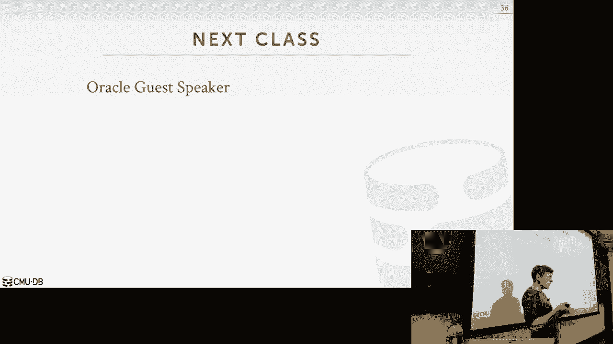

# 【双语字幕+资料下载】CMU 14-455 ｜ 数据库系统导论(2019·完整版) - P24：L24- 分布式OLAP数据库 - ShowMeAI - BV1qf4y1J7mX

去吧。

让我们开始吧，嗯，所以DJ投递桌今天不在这里，2。他下周应该会在这里，他有点崩溃，所以他的，这星期是他女朋友的生日，他上周在拉斯维加斯把钱都挥霍光了，他骗她说他要去他家过感恩节。

所以这就是他这周不在的原因，但那只是出于给他买礼物的诡计，所以嗯，他下周回来，所有的权利，所以再一次，只是提醒一下，你们的日程表上有什么，家庭作业5下周交，项目四，我们在那之后做。

反馈提交的额外学分是昨晚，嗯，有些人就一个错误发了电子邮件，因为一些时髦的Unicode问题，但其他人应该提交，3。期末考试将在12月9日举行，实际上他们宣布了房间，但我没看过，它在哪里，已经。

有人看了，没关系，我们会想出办法的，然后呢，嗯下周再次，甲骨文讲座将在星期一举行，援助方案，最后的审查将在周三进行，所以我们一开始会做最后的审查，然后我们会做。

我们将讨论你们投票的三四个不同的数据库系统，我就给你，你知道，十分钟概述一下它的有趣之处，为什么好，为什么不好等等，所以如果你还没有投票，拜托了，请进这里投票，2。这个数字与前几年大致相同。啊又是这样。

你可以去看看去年的视频，看看我们要讨论什么，但先去投票，那就去查查，就像我在下周二说的，我们的朋友，我们的神谕来了，会有三个不同的谈话，所以星期一的课在这里，他们会，会让沙尚克来谈谈。

你知道他的团队正在建造的东西，这不是招聘谈话，这就像一个，你知道关于他们正在建造的东西的科学或系统讨论，和，基本上，他会使用所有相同的关键词和流行语，我整个学期都在用，所以你意识到，我不只是和好。

所以他会来谈论他们的系统，有一个更面向招聘的系统，会谈将于星期一四点半在盖茨举行，那个会有披萨，然后一个纯粹的研究讲座将在周二，十二月三日，第二天十二点，M和铜地板，所以木村日烧是，我觉得。

就像我在广场上提到的，我和他一起读研究生，i，他可能是我一生中见过的最铁杆的系统程序员之一，他也是我一生中遇到的最固执的人，当我们建造第一个，我们建H店的第一个夏天，他想要，我们必须建立我们的表达树。

喜欢where子句，我有我的方式做这件事，他一意孤行，我们在我的办公室里进行了四个小时的辩论，只是互相大喊大叫该怎么办，他让我崩溃了，说就这么做吧，他错了，我们后来删除了他的所作所为。

我外套上的东西还在，所以我是对的，但总的来说他很棒，所以他会来谈谈，他只是来和，他们一直在为系统开发的非易失性内存，因为他是沙尚克斯集团的一员，所以再一次，如果你有兴趣在他们那里实习或全职工作。

你知道他会来告诉你你可以做的事情，好的，我在广场上会有一些关于这些事情的提醒，对这些有什么问题吗，好的，然后我也做安排，如果你想认识这些人，一对一地谈论实习和全职职位，好吧，我会发邮件的，好的。

上一堂课是我们关于分布式数据库的第二堂课，第一类只是定义分布式数据库系统的样子，从体系结构的角度来看，什么是，你知道的，数据在哪里，相对于计算机实际运行的位置，上一节课讲的是把这些分布式数据库。

当您想进行事务处理时，并确保我们提供所有的资产担保，我们希望在单节点系统上，但是现在在分发环境中这样做，我们花了大部分时间讨论原子提交协议和复制，因为再一次，当事情被分割时。

这是真正拥有问题数据库的困难部分，现在你有交易，同时在一堆不同的节点上执行权限，你如何保持这一切的同步，如何避免丢失数据，你怎么读的，不查看陈旧数据，如果你关心今天课堂上的那些事情，现在我们要离开了。

或者你知道把我们之前说过的交易都留下，现在我在谈论如何进行分析，我们没有写很多东西，我们不做交易，我们主要是做阅读，但是我们将要读取的数据量比，上一堂课的旧事务在做什么，所以我只想展示什么。

一种典型的设置是在分析数据库中，这不一定是分布式数据库，但这是一个常见的安排，所以在前端你有你的旧数据库，这是你从外部世界摄取新信息的地方，这可以分发，可以是单节点，没关系。

然后你想从这些前端获得所有的数据，数据筒仓进入后端，分析数据库，有时称为数据仓库，所以有一个叫做ETL或提取的过程，转换加载，所以有工具，你可以你可以买那个，这样做。

或者我们只是写Python脚本或者手动做任何你做的事情，但这个想法是从这些不同的前端OTP数据库中获取所有数据，并将其放入数据仓库中的通用模式中，例如，假设你有你的前端数据库，一个应用程序有一个。

你知道他们都有不同的顾客名字，对呀，但这个名字有F名，这个有第一个下划线名，所以你不能把这些都扔进一个数据库，因为数据库不知道f名等于名，这就是你在ETL世界中进行清理过程的地方。

所以这是一个非常常见的设置，好吧，如果你要建立一个初创公司，您通常从这个开始，因为您需要首先获取数据，然后一旦你有了很多数据，然后将其放入后端数据仓库，这个想法是我们，我们不想在前端做分析。

因为这会减慢我们的速度或减慢我们的交易，所以我们可以把它放进后端数据仓库，这就是我们今天要关注的，我们实际上如何做到这一点，所以我用了OLAP这个词，在线分析处理。

有时您会看到这些类型的系统被称为数据仓库或，更传统的是，有时他们称之为决策支持系统，dss，一次又一次，我们的想法是，这些是我们将要编写的应用程序，在我们的后端数据仓库上，它将分析我们拥有的数据。

我们从另一边收集的，推断新的信息，然后指导我们的决策过程，为了生意，为该组织，或用于OTP应用程序，对呀，所以一个很常见的设置，一个是他们一直喜欢用。

就像Zynga Zinka在这里有他们所有愚蠢的农场游戏，对呀，这些都是旧的数据库，游戏中的每一次点击，那是另一个事务或数据库的另一个更新，但他们会把所有的点击，进入后端数据仓库，对此做一些分析。

你是否知道决策支持系统或机器学习，试图找出一些，如何让你在前端买更多的东西，对呀，就像，的，我经常听到的一个例子是，呃，这是糖果粉碎游戏，如果你玩糖果粉碎游戏，所以你可以在所有TB端获得所有这些更新。

然后你就会得到一个很难的谜题，你不能把它打对，所以你放下游戏，所以他们会收集所有这些点击流，看看你是怎么玩游戏的，然后他们就会知道，哦，如果你在一天没玩游戏后回来。

他们确保你他们给你一个简单的谜题你可以马上解决，所以你又上瘾了对吧，然后继续播放，因为他们知道如果他们给你一个难题，对呀，因此推断这些信息，哦，这就是我给予的方式，你认识那个人。

你知道一个他们能打败的游戏，你在这边弄清楚，然后将更新推送到OTP端，所以总的来说在一个高水平上，有两种不同的方法可以在后端建模数据库应用程序，数据仓库或分析数据库。

这样您就可以采用您知道您的应用程序将具有的标准模式，通常情况下，它通常是一个树模式，因为你有这个等级制度，我有顾客，客户有订单，订单，有物品，嗯，但这些模式可能相当混乱，它们对分析查询不会很有效，因此。

您将使用以下任何一种方法来建模数据库，所谓的星形模式或雪花模式，有时你看到分析数据库，他们会说嘿，我们只支持星型模式，你不能做雪花模式，你会看到这基本上是这个的子集，但你会明白为什么。

让我们讨论一下为什么这实际上可能对一些分析更好，所以一个非常常见的安排是这样的，这是一个星型模式，星型模式中有两种类型的表，你有事实表和维度表，所以星星的中间是事实表，想想这就像每一个。

无论你试图模拟的事件是什么，这是你储存的地方，你知道他们的所有发生，所以如果你像沃尔玛，你的你的，你的数据仓库记录了我没有记录的每一个项目，任何人在任何特定时间在任何沃尔玛商店购买过。

所有这些在现金支票或收银台被扫描的物品，这是我们放在事实表中的另一个事件，所以这东西会很大，就像数千亿的记录，同样的事情亚马逊，任何人买过的每一件东西，亚马逊进入你的事实表。

但我们实际上不会存储任何关于，有人买的这些东西是什么，相反，我们将对外部维度表进行外键引用，他们将在哪里维护额外的信息，对呀，因为这是一件大事，我们希望它尽可能修剪，因为我们会有数十亿行。

所以我们把所有实际的元数据放在维度表中，但在星型模式中的稀缺，你只能有一个一级，从恒星的中心向外的尺寸表，对呀，所以这里没有额外的桌子可以让这些人加入，对呀，在这种情况下，这里我有一个类别名称。

类别描述，所以我可以把它提取出来，并将其规范化，存储为另一个维度表，另一个外键从这个到这个，但是在星型模式下，你是，你不能那样做，我们猜猜为什么，是呀，正是你说的。

遍历或连接这些不同的表所需的时间将是昂贵的，因为我们又一次做得不好，安迪的所有物品，我们在说，查找，你知道的，宾夕法尼亚州已经购买了，在此日期范围内可以是数亿行，所以我们想避免做，尽可能多的连接。

所以雪花模式是允许在外部有多个维度，好吧，又来了，回到这里，对呀，我现在可以爆发我的类别信息，我在产品尺寸表中有一个外键，然后我有一个现在被称为查找表的东西，也就是维度表之外的东西。

其中我有规范化的信息作为输出，正如我所说，某数据库系统，一些OLAP系统会明确地说，你不能有查询表，您可以在第一个维度表之外有多个级别，所以这个世界上主要的两个问题，就像她说的，其中之一就是性能。

另一个实际上是数据的完整性，我们又在储存，所以回到这里，如果我把我的查找表折叠成一个单维表，嗯，我会一遍又一遍地重复类别名称，所以现在如果类别名称更改，我需要在我的应用程序代码中确保。

我去更新所有有相同类别名称的记录，这样一切都同步了，如果我在雪花模式中这样规范化，我没有那个问题，因为我只有一个类别的条目，对呀，所以如果你做一个星型模式，然后在应用程序中必须做的额外工作，以确保您的。

您的非规范化表是一致的，您现在实际上潜在地存储了更多不必要的信息，所以你的数据的大小可能会更大，没什么大不了的，因为事实表是主要的，是这款车的主要动力，我们会有办法压缩它，因此。

去标识表的存储开销并不是什么大问题，更重要的是正直的东西，然后就像她说的，的，星型模式查询的复杂性，会明显少于，雪花模式中查询的复杂性，因为只有这么多连接，我能做的，我只需要深入一层，就像我们说的。

当我们谈论查询优化时，有更多的桌子可以加入只会让一切变得超级困难，当我们必须弄清楚联合订购时，因此，通过将我们自己限制在星型模式中，我们最终可能会找到一个最优的计划，而雪花模式，我们可能不能再这样了。

当你走到现实世界，如果您遇到数据仓库，您可能会看到这两种方法中的任何一种，因为它们更适合分析，两者之间的区别，当我们开始讨论连接时，会出现维度表和事实表，因为我们需要决定如何在节点之间移动数据。

如果我们的，如果我们不能在机器上做任何本地连接，所有的权利，那么让我们来谈谈我们今天要解决的问题，我刚才已经简短地提到了，所以我们的查询显示在一个主节点中，想做什么来加入R和S，假设这两张桌子。

r和s只是在这些不同的分区上拆分，均匀地在这些不同的节点上，那么对我来说，执行这个查询最愚蠢的方法是什么，在这个设置中，是呀，这是完全正确的，我能做的最愚蠢的事，它会起作用的，它仍然是正确的。

我知道我需要两个分区的触摸数据，三和四，所以我只是完整地复制它们，直至，分区一现在所在的节点，我所有的数据都是本地的，我做了我的关节，吐出结果，为什么那个愚蠢的，是呀，我们可能不需要所有的数据。

他说你可能不需要所有的数据，可能是的，但团队更愚蠢，是呀，你不喜欢在其他任何一个上做任何计算，绝对是的是的，您没有在其他节点上进行任何计算，这样就破坏了分布式数据库的全部目的，我想着我所做的。

我买了一堆机器，我把我桌子上的约会对象划分在这些机器上，但后来我的查询出现了，我只是把东西复制回唱歌机，所以我最好买一台机器在那里做连接，对呀，这就是我们今天要解决的问题，我们想说好吧，如果出现查询。

并且它想要执行联接，我们需要跨多个资源的访问数据，我们实际上是如何，我们如何有效地做到这一点，我们该怎么办，我们需要注意什么，当我们决定是移动数据还是复制数据，还是推送查询或拉出，你知道的，把结果拉对。

这些都是我们今天要做的设计选择，在本例中，这也假设我的数据库可以，它可以容纳在单个节点上，又对了，想想沃尔玛的数据库，它是任何数百拍字节的东西，一台机器装不下，所以我们要有一个运行边缘，如果一个环境。

为了得到任何，已完成的工作，OTP，这不是问题，因为在OLTP中，我只是碰碰安迪的数据，安迪的数据是，可能是几百千字节或兆字节，对呀，它不是，我可以很容易地把它放在一个盒子上。

在分析中的一个盒子上做我所有的交易，我试图触摸整个桌子或桌子的大部分，我不可能在一个节点上做所有的事情，所以今天我们的重点是首先讨论执行模型，我们在一个分布式分析数据库系统中。

我们在第一节课中已经简单地谈到了这一点，但现在我们将更具体地谈论它，你明白为什么这很重要了，然后我们将简要地讨论执行查询规划的问题，然后我们将讨论如何实现分布式连接，这个扰流板呢，那个。

我们在本学期早些时候讨论过的所有算法仍然是密切相关的，我们还在做，没有一个神奇的分布式连接不存在于单个节点上，只是问题又来了，我们把数据移到哪里，或者我们在哪里，我们把计算移到哪里。

然后我会很快地完成一些什么，当今世界云数据库的现状，嗯，只是，你知道的，再来一次，你会看到如何，仅仅因为它在云中，并不意味着我们不在乎我们谈论过的所有事情，整个学期，所有的权利，就像我说的，i。

我们简要地讨论了执行模型的第一个问题，或者当我们谈到介绍分布式数据库时，但是我们必须执行查询的两种方法，要么是推，要么是池，所以一推，我们的想法是要发送查询，或查询的部分。

将计划片段与数据所在的位置相似，然后在该本地数据上运行查询的该部分，然后现在把结果发回给要求的人，比如主节点或基节点，那是协调查询，这里的想法是我们想，就像我们做投影一样，下推或谓语。

在单节点系统上向下推，我们想尽早过滤掉和删除尽可能多的无用数据，在我们通过网络发送任何东西之前，所以如果我们可以发送查询的一部分，到数据所在的位置，嘎吱嘎吱，做一些早期过滤。

然后当我们把数据传回另一个节点时，我们不仅仅是盲目地复制节点拥有的所有数据，我们只是把它限制在那个子集上，我们实际上需要这个特定的查询，我们马上就能看到，在共享磁盘系统中，线条变得模糊。

不管你是在做其中一个还是另一个，因为在与系统的共享距离中，你不能做任何过滤，因为这只是一个，你知道，读写单页，你不能做什么特别的事，但为了再次共享这些系统，线条模糊，另一种方法是提取查询的数据。

这就是我通常分享这个系统的，我们会在那里获取我们需要的任何数据，实际上这个查询，我们认识到，基于查询计划，你知道吗，这些是我想访问的页面，我们把数据拉出来，复制一份通过网络传输的。

将其带到查询所在的节点，然后我们可以处理它并嘎吱嘎吱地吃它，当然还有，这里的问题是在一个分析系统中，数据量，数据的大小，相对于查询的大小，这将是相当严峻的，完全不同，像查询，说这只是一个续集查询。

我听过的最多的，像谷歌或脸书，有时他们的查询就像续集一样，文本本身就像十兆字节，对呀，那是一个很大的查询，但与读取太字节的数据相比，这没什么我们必须注意的事情，你想做一个还是另一个，你知道的。

数据在哪里，我如何访问它，我的查询的大小是大还是小，通过网络传输，那么我试图访问的数据，和分析，总是这样，您试图处理的数据更大，所以让我们在一个无共享系统的上下文中看看这一点。

所以无共享系统通常是推送数据将查询推送到节点，所以我的查询显示到这个节点，这里，它负责与其他节点协调，处理连接的过程，所以我们要做我们的查询计划器，我会说在这个节点上，我们认识到，哦。

我们需要访问ns表的id字段，我知道下面的这个节点有一个我想访问的分区，所以我只会发送信息，我会把查询计划片段发给这个人，然后说嘿，我知道你有从1点到2点的数据，这个连接，然后把结果发回给我。

上面的节点负责获取这个人发送的结果，加上它的局部结果，将它们结合在一起，然后向应用程序生成单个结果，所以我们又有了透明度问题或透明度保证，应用程序不知道，不在乎，查询实际执行的位置，只要拿回一个结果。

所以在一个什么都不共享的系统中，很明显你想做，将查询推送到数据右侧，因为这对我们来说毫无意义，实际上必须复制这些数据并在那里处理，最好只是发送查询，在本地做嘎吱嘎吱，对于本例，我们会看到一些场景。

也许你确实想做一些复制，是呀，你的问题是如果s也是分布的，那什么好，在这种情况下，它是分布的，我只是说，就像它的分区只是，但它的分区，我们以后再回答你的问题，就像。

因为您可能需要将它与其他分区正确地连接在一起，我们以后再谈这个，在这个简单的例子中，假设r和s都在id上分区，此分区上的值范围完全相同，所以我知道什么时候我在这个节点上做连接。

我不需要查看集群中的任何其他分区，我需要的一切，R中单个元组的计算机节点位于此处，如果您正在分区上加入，但是是的，完全正确，我在加入分区键，我们马上就会看到这些场景，是呀，不经常，所以这不是这里的问题。

或者你可以实现你有联合技术，在我的例子中，在这里，我的桌子是在我的联合钥匙上分区的，哪种情况最好，这种情况多久发生一次，通常用于事实表，很多时候是对的，就像，我想说这很常见，我是说你考虑一下。

就像在真实的系统中，像这样，我想分区，你知道事实表可以说，这个人买了这个东西，我说了一个不好的例子，所以说我想在，就像这里，这里是用户ID，这是他们买的所有东西，然后是他们如何访问网页的会议。

只是为了弄清楚我在买东西之前看了什么东西，任何想学习的人，哦，如果他们去看这些东西，那么他们更有可能买东西，因此，在这种情况下，用户ID将是分区键，这会很好地解决，所以并不总是这样，但我想说这很常见。

但我们马上就会看到，我们如何处理这个案子，不是这样的地方，我在这里强调的主要事情是，在那里我们可以将查询推送到数据，这对我们更好，因为这个数据比这里的这个要大，另外，我们还得到了额外的好处。

我们瘫痪了计算，因为现在顶部节点不必做所有的连接，这家伙可以做连接，你知道部分，连接，这个人可以做另外一部分，连接，我们只是把它组合在一起，而且组合的部分更便宜，相对于联合成本来说，它是便宜的。

所以另一种方法是游泳池，查询的数据，再说一遍，这就是我要说的，在共享磁盘系统中，线条模糊，所以我们把查询发送到这里的这个节点，这个节点将识别出我们已经对数据进行了逻辑分区。

这样下面的这个节点负责这个范围，该节点负责该范围，然后他们去共享磁盘，去访问那些页面，把结果拉回来，所以把他们需要的页面拉回来，然后计算本地连接，然后这个家伙出现了，向另一个显示结果，因此。

这里的这一步将是将测试版拉到查询中，因为我只是盲目地要求它在这里的页面，我得把它复制到这里，但这里的这部分肯定是将查询推送到数据，因为这家伙能够，你知道的，在本地计算连接并向上发送结果。

所以你会说这是一个游泳池还是一个推，两者都是，我们会看到的，我想我没有关于这件事的幻灯片，但是，云供应商认识到拥有一个哑磁盘，如果你想称之为共享磁盘数据库是个坏主意，因为再一次，我只是总是复制这一页。

而不检查是否真的需要页面上的任何数据，我只知道我想我需要看看，所以我只是说去给我这一页，就像亚马逊的三个，它们现在有一个筛选器命令，在那里你实际上可以做谓词，向下推，你可以，当你说，去拿这一页。

你也可以说像，哦，但你也要帮我检查这个过滤器看看页面中的所有内容是否都匹配，如果是，然后发给我，如果没有，那就不要对，所以再一次，这将查询推送到数据，所以再一次，线条模糊，所以我们谈过的一件事，虽然。

我说过上一堂课我们做了一个很大的交易，如果我们有事务提交，它触及多个节点，我想确保每个人都同意所有的节点都必须同意，在我们告诉外界它是正确的之前，这笔交易是允许提交的，因为我们正在修改数据库。

我们不想失去任何变化，但是在OLAP数据库中，我们只是做只读查询，嗯，所以说，我们不是真的担心，在多个位置更新数据库的状态并保持这些位置的同步，但现在我们必须处理节点可能崩溃的情况，当我们处理查询时。

我们必须想出如何处理，重要的是要理解当我们从另一台机器请求数据时，或共享磁盘，我们得到了数据的副本，当我们收到消息时，它将被存储在缓冲池中，就像我们从磁盘上读取的任何其他数据一样。

但它存储在一个临时的缓冲空间中，这意味着它可以被传呼到磁盘上，因为我们没有空间了，但如果我们崩溃或重新启动系统回来，所有的临时磁盘空间都被吹走了，因为查询或事务很抱歉，正在运行的查询，需要。

数据现在不见了，因为我撞车了，所以我不需要坚持任何事情，因此，这些针对大型数据库的OLAP查询可能需要很长时间，有可能需要几个小时的查询并不是闻所未闻的，我也听说过需要几天时间的查询。

对于专栏商店来说已经变得更好了，但在过去，查询需要几天时间是很常见的，就像你想要的那样，你每月运行一次报告，运行它需要一个星期，所以如果我们有一个长时间运行的查询，我们的节点崩溃了，我们该怎么办。

这不是正确性的问题，因为我们没有更新任何东西，但理想情况下是友好的，也许我们不必从头开始，如果要花几天时间，所以大多数分享的设计决策，分布式数据库做不到，它们实际上不支持查询容错，意思是。

如果长时间运行的查询崩溃，如果节点在查询运行期间崩溃，除非有一个复制品有你需要的数据，这可能，你知道的，填补一些缺失的部分，取决于您在查询计划中的位置，他们只会中止查询并返回错误，并告诉你重新启动它。

我们正在猜测他们为什么做出这个决定，它很贵，对呀，我正在运行一个长时间的查询，它开始产生一堆结果，现在我要确保我冲洗他们所有的权利，来挂载磁盘，并确保副本之间的耐久性，以防撞车，这会使查询运行得慢得多。

因为磁盘超慢，所以在这种传统的数据仓库世界里，他们会说，哦，你刚付我一千万美元买这个非常昂贵的数据库系统软件，我想你不是在用你在慈善机构找到的机器，我假设你买的是高端硬件，所以心脏很可能。

高端硬件将会出现灾难性的故障，在你知道的地方，它会在查询过程中崩溃，会很低，所以说，因此，我宁愿不付拍快照的罚款，或者写敌人，磁盘的结果，因为我跑得最多，哦，系统会，如果查询。

如果我知道在查询执行期间崩溃，假设它不仅仅是从磁盘上读取，在那里你有，就像它是查询的中间部分，我们有你说查询失败的结果，就在Hadoop在中间出现的时候，两千秒，他们实际上是在拍快照，他们实际上是在。

你知道吗，在查询计划的每一步都写入，把它写在磁盘上，但这让它变得超级慢，对，因为它在过去回馈，当即使现在，但就像谷歌在制造产品的时候，他们谈论继续奔跑，你知道，廉价硬件，如果您正在运行一个千节点群集。

您的查询运行在一千个节点上，在此期间，任何节点崩溃的可能性都很高，所以在他们的世界里，他们宁愿拍快照来避免这种情况，是呀，同样的一个，没有失败，它的意思是不，不再回应，或一笔交易，否，我们不是在谈交易。

只读查询，分析查询，对呀，所以如果它说，如果从上一堂课开始，我去交易了，用于事务的分布式分布式数据库，如果节点失败，当我们执行交易时，我们只要中止交易，因为谁在乎这样的交易，什么跑了50毫秒，谁在乎。

如果现在我有一个分析，在那里，这将需要几天的运行，如果它需要，运行需要五天，我在第四天崩溃了，然后我就在工作上浪费了四天，有些人会为此生气，因为现在你得，你知道，启动它并运行，再跑一遍。

所以你可以拍一张快照，有些系统允许您拍摄快照，当您在like处运行查询时，作为一个查询计划的输出，当它被输入下一个操作员时，我把这些也写到磁盘上，所以如果我在那一点上崩溃了，我可以把它带回来。

有办法打开它，但默认情况下，大多数系统不，因为他们不想支付额外的性能罚款，在共享系统上也是如此，很容易想象，我们在做同样的连接，我们把计划框架送到这里，然后在计算连接结果时，它将把它写到共享磁盘上。

有一些通知给协调员说嘿，如果您正在查找此联接结果，这里是去哪里，把它放到共享磁盘上，这样这家伙就撞车走了，这家伙知道他可以把它从那里拉出来，而不用担心，你知道的，不得不重新计算任何东西，如此如此。

这是分布式戴维斯将要做出的重要设计决策，他们是，他们不会给你提供，有时被称为查询弹性或容错性，查询执行的位置，他们可能会为您重新启动查询，但他们不会试图获取节点运行的位置，在坠机的那一刻，所有的权利。

所以现在要担心的另一件事也是要做查询计划，所以我们有所有与加入订单之前相同的问题，如何做谓词，推倒，或者预测，我们必须在单个节点系统上做的所有相同的决定，我们仍然要在分布式系统中做。

但现在我们有了一种额外的计划，我们需要推理的地方，我们的数据所在的位置，如何分区或复制，现在计算网络通信成本，呃，对于我们的算法，又对了，这在一秒钟内就更有意义了，当我们谈论不同的场景时。

但就像联合订购一样，仍然很重要，但现在也好像没事了，嗯，我需要它，3。我该不该先把这两张桌子连接起来，因为它们在同一个节点上，分区方式相同，因此，这可能非常快，即使我在一个节点上。

我可能不想先加入那两张桌子，所以现在可以包括在你的成本模型中，让你帮我再做一次决定，有什么权利，此查询计划，系统的最优查询计划，就像我说的，在对单个便笺进行查询优化之前是很难的，这就更难了，好吧。

就像我们一样，你知道的，有时您可以在单个节点和集中位置上做出决定，有时您可以在所有节点上进行分发，但现在你又有了这个，你要确保，您的所有统计数据和所有节点都尽可能地更新，帮助您决定什么是最好的计划。

只是当它被分发时，一切都变得困难得多，但是现在假设我们现在有一个查询计划，我们实际上想向不同的节点发送什么，将参与执行联接查询的，所以有两种方法，一个是我们实际上可以发送物理计划或计划片段，呃，到节点。

以便它执行，嗯，通过使用我们生成的查询计划，你知道的，在基节点或主节点上，然后把它切开说，嗯，我知道，查询计划的这一部分需要在此节点上执行，查询计划的另一部分需要在该节点上执行。

您只需将这些物理运算符显示给其他节点，他们只是拿走他们，立即处决他们，而不考虑这是否是对本地数据最好的做法，然后发回结果，1。据我所知，大多数进行分析的分布式数据库，做第一个方法，嗯，生成。

通过优化器运行查询计划，一旦为查询生成整个群集的全局计划，然后把它切碎，计划碎片，把它分割开来，另一种方法是实际接受进来的续集查询，然后重写它，使其基于每个分区，对每个单独的分区进行查询。

然后把它发出去，那么当分区所在的节点，获取续集查询，然后它通过自己的查询优化器运行它，生成它想要执行的物理计划，这里的想法是，如果我们可以假设，如果我们在单个节点上做一个全局计划。

关于每个分区中什么是最好的统计数据和信息，不会是最新的，或者你知道的或者新鲜的，因此，而不是我试图在我的家庭节点上推理，在另一个节点上做什么最好，我只对另一个节点说，嘿嘿，我认为您需要执行此查询。

我需要你帮我查询一下，然后那个节点可以做所有的局部优化和所有的局部规划，当续集查询到达时，再看看这里的例子，所以这是我这样的查询，所以我可以，在这种情况下，有你知道的，没有连接顺序，啊好吧。

不是R就是SR，但我只是说好吧，嗯，我需要实际执行这个查询，我需要这样的数据，这三个隔板，所以我会重写我的续集声明，现在包括一个where子句，上面写着，这是，这是数据的一部分，但是你需要看的数据。

它与分区键匹配，或者分区范围，然后节点得到这个，每个节点都得到这些单独的查询计划，通过自己的优化器运行，然后他们可以决定，哦，根据我这里的数据，加入我们的比S或S好吗，那么我应该做一个哈希连接吗。

所以执行排序合并连接，我可以在这里做当地的决定，因为我对我实际存储的日期有最好的看法，而主节点可能再次过时，所以唯一真正的数据库系统，我知道实际上做这样的事情是memsql，各位，呃。

其他人发送物理计划，嗯，我不我指的是我，你能做到这一点似乎很有说服力，我认为你仍然必须对可能的加入订单做出更高级别的决定，你知道，如果你有多个表，超过两个。

比如如果I R S和T我应该加入RNS还是TNS，先点个赞，我想有些信息你可能需要在高层进行推理，但是当到了本地A节点做出这个决定的时候，你知道它不担心与其他人交流，我不是说一个比另一个好。

我认为这有一些有趣的含义，在研究中没有探索过，所以现在我们想再谈谈联接，连接是最贵的，在单个节点数据库中必须做的最重要的事情，只是你知道，也在一个分布式数据库中用于分析工作负载。

系统将要花费的大部分时间，执行查询，在那里我从磁盘读取数据或进行连接，正如我们所说的，从磁盘读取数据，有，你知道有一些方法可以加快速度，但到一天结束时，你通常会被束缚在。

你能多快把东西从物理设备上拿下来，但对于连接，我们可以更聪明一点，正如我在第一个例子中所展示的，进行连接的最简单方法是获取所有数据，我们需要做我们的加入，把它们放在一个节点上，运行我们的联合算法。

但正如我所说，你失去了所有额外的并行性和额外的资源，通过将数据划分到多个节点，你失去了所有这些好处，你也，你知道的，您可能无法将所有内容都存储在内存中以快速运行，所以会有四种不同的方法。

实际上我们实际上是如何，或者您需要处理的四个不同的场景，当我们要分发联接时，一次又一次，分布式连接是，可能与我们在单个节点系统上进行连接的方式完全相同，但我们的想法是，我们需要弄清楚如何获得数据。

我们想联合在一起，在一个节点上，可能是一个节点，可以是多个节点，这样我们就可以在本地进行连接，而不必与任何其他节点协调，当我们做连接的时候，所以当我们做局部关节时，都是同样的算法，排序合并连接。

嵌套循环，加入，我们在应用所有相同的优化之前谈到的哈希连接，这是你在做那个连接之前必须处理的步骤，如何将数据发送到节点，那将需要它，所以我们将再次讨论四种不同的情况，这些已经在我们前面的例子中出现了。

我们会，我们将看看我们实际上想如何处理它们，一次又一次，主要的收获是这里没有魔法，我们真的可以做到，又没有魔法了，分布式联合算法，它的性能比单节点算法好得多，这一切都是关于如何将数据发送到它需要的地方。

所以最好的情况是桌子，我们要联接的其中一个表是在联接键上分区的，然后在每个节点上完整地复制另一个表，所以在这种情况下，我们的表是在ID上分区的，它是连接子句中的ID字段，然后再次在每个节点复制s表。

这可能是事实表，这可能是维度表，这个要足够小，我们可以把它分开，或者足够小，我们可以在每台机器上复制它，所以在这种情况下，这里再次，我们所需要做的就是让每一个节点，执行本地连接。

为其拥有的数据生成连接结果，你知道的，存储在本地存储中，然后我们只需要把，将一个节点连接到某个集中位置的输出，这样我们就可以组合结果，为我们的应用程序产生一个单一的答案，好吧，又来了，这是最好的情况。

因为这次转移得到了联合结果，从这个节点到那个节点是不可避免的，我们必须这么做，但当我们真正做连接的时候，我们不需要与任何其他节点协调或通信，因为我们需要的一切都是本地的。

所以这给了我们分布式数据库的好处，因为现在我们可以在每个节点上并行运行这个连接，而无需任何协调，然后每个人都把结果发回头节点，下一个最好的情况是两个键都被分区，呃，两个表再次在连接键上分区。

在这种情况下，这里，最后一张幻灯片上的再次ID，它被分割在，嗯，它被复制了，这个在ID字段上分区，这个范围，在此分区中与对不起的范围相同，s的分区范围与r上位置的范围相同，所以再一次。

就像我们计算之前一样，我们的本地连接可以是哈希连接可以是排序合并，没关系，然后这个家伙把结果传送到另一个节点，我们把它组合在一起，所以在这个分区中，r和s根据分区键均匀分布不是必要的吗，它可能会发生。

上面写着他的一切，所以他的问题，他的问题是关于数据立方体的，在本例中，在这里，我向你展示的范围是相同的，从一到一百，一对一到两百，但它不一定告诉你在这个范围内存在多少元组，或者这个分区。

比如这个id是r的主键，所以R正好有一百个元组，但是说这是id不是i和s的主键，我可能有十亿个条目在这个范围内，然后这个范围的10亿个条目，我该怎么处理，那样的话，你没有。

您不希望具有与ID字段相同的范围，所以在这种情况下，你必须洗牌一些数据，我们一会儿再谈，这个最好的情况，这些都是均匀分布的，完全相同的范围，我不需要协调，当然不会，我同意你，不会有一个真实的世界。

我是说最好的情况或最坏的情况，当情况变得更糟时，我们将看看如何处理，所有的权利，所以说，和他有这么大的关系，所以下一期是，假设我们的一个表没有分区，我们要加入的相同属性，所以在本例中。

这里是值字段上的这个分区，所以在这种情况下，我们不能计算本地连接，因为对于我们ID的每一个值，我不知道是不是，您知道我的本地分区上将存在一个匹配的元组，这里可能有一个ID相同，所以在这种情况下。

这被称为广播连接，基本思想是复制，表的每个分区到其他分区之间缺少的部分，这样现在这个节点就有了表的完整副本，然后现在只需计算本地联接，然后再把结果发给另一个人，这假设它足够小，可以驻留在内存中。

或者不要压倒这台机器或这里的这个节点，如果你试图复制这里的一切，广播意味着你基本上在产生，每个节点都将得到表的复制副本，有时您会看到您将其称为广播哈希连接或广播广播，所以加入。

这只是意味着他们在做最初的一步，他们将数据传输到不同的节点每个节点都有一个完整的副本，然后你做连接，最后一种情况是绝对最坏的情况，两个表在联接键上根本没有分区，现在我们需要我们需要重组，数据的布局。

以便我们更有效地计算连接，所以这将被称为洗牌连接，或者洗牌哈希连接，所以基本上我们认识到，哦好吧，我们真的希望在ID字段上对事物进行分区，让我开始从这两个表中复制我需要的数据，在这两个不同的节点之间。

如果这必须溢出到磁盘，空间不足是不可避免的，所以我们就去做吧，一旦我知道我已经按照我想要的方式划分了一切，然后我可以计算我的本地连接并生成结果，是呀，我拿到了，我是说，我的意思是，所以他的问题是。

当空间有限时，你能做什么，所以我在这里想说的是，想想你在这里做什么，对呀，所以我现在得再做一份我们的，你知道在这个节点上，所以如果它不适合记忆，就像我说的，就像它是它是，它作为暂时的结果洒了出来。

因为查询可能会泄露，不可避免的磁盘，对呀，但更重要的是，现在当我计算连接时，我希望越快越好，因为那是最贵的东西，所以通过复制周围的数据，当我做连接的时候，一切都按照我想要的方式分割得很好，而且效率更高。

我们总是假设这个，问题是做，我们总是假设磁盘就足够了，为了我们班，是呀，在现实世界中，否，会发生什么，数据库识别出，如果我听到，我不能复制更多的数据到这个节点在这里，查询将失败，你只要说。

我十个空间的交换空间用完了，抛出错误，查询失败，实际上与他关于数据分布的问题有关，如果说它在ID字段上被分区，但分发是高度原谅的，因为大部分数据都在这个节点上，对于s而不是那个节点。

也许把R的一些数据移到这里，这样事情就平衡了，它是怎么，在实践中如何不起作用，对不起，是呀，你只是举个例子，你有，所以它不是，呃不，而且是的，对一些类似的人来说是什么，你怎么不做问题的计算数据。

你怎么管理，什么对不起，嗯超级可行，如果一些债务人是创建的，你不想两个都发，嗯，很对数据的权利，那么你是怎么管理的，就像在开始的速度，你所做的，她的问题是，我如何决定发送什么数据，因为如果事情被复制。

我不想浪费，你知道发送数据的浪费网络传输，那是那是我不需要送的，你提前知道一切，右续集是说明性的，我们知道查询是什么，我们知道你试图访问什么数据，然后我们在系统目录中查找。

我们的系统callow将告诉我们这些数据实际上是如何分区的，我们提前知道这一点，因此查询计划器可以做出决定，哦好吧，这样的数据分区，就这么大，它在这个节点上，所以所以，要么动，要么不动。

移动它或复制这里，别抄袭那里，我可以提前做所有这些，这不像我，当我前进的时候，我说，哦好吧，是啊，是啊，也许我应该复制这个，你提前把一切都搞清楚了，除了他提出的问题，或者我的磁盘空间用完了。

你知道你只是失败了，你什么也做不了，然后是，数据库系统在决定复制什么时的效率如何，或者不复制，取决于查询优化器有多好，也就是，为什么人们花很多钱让人在查询优化器上工作。

你的问题是如果数据在分区ID上排序怎么办，预先分区ID，或联名身份证，所以如果它按我在这里显示的排序，谁在乎对吧，因为我关心的是数据的位置，我需要在SID上加入我们的ID，所以我想确保当我这样做的时候。

加入本地，我有我需要的所有数据，你知道为了，你知道加入外面的桌子，在内部表的本地节点上，它不可能在我不知道的其他节点上，这可能会导致假阴性或假阳性，所以排序并不重要，排序很重要，什么时候我们可以决定。

我想做一个证书合并作为哈希连接吗，我们就像这上面的一步，我们在决定如何移动数据，是呀，实际上是什么样的，喜欢交换，它就像那个，就像与之相关的唱片什么的，好的，所以问题是什么，我到底在传输什么。

而且要明确的是，我不交换这个，我应该有个分隔线，所以这是这个节点上的永久数据，它哪儿也去不了，我只是临时多复印几份。执行我的联接的临时数据，然后我把它扔掉，当我的疑问结束时，所以即使我在这里洗牌。

我还是会在一天结束的时候，在这里对名称和值进行分区，这个这个留下，但你的另一个问题是我实际上在传递什么，我在传输整个元组吗，还是我在传递一些，一些标识符下一张幻灯片，好的，我们会讨论的，是呀，在本地。

数据没有显示，你如何确保它们不是由于，问题在本地节点上，如果数据未排序，我如何确保没有重复，什么的副本，是一个分区，id，主键，或者唯一的ID，我的问题是你如何确保主键，是啊，是啊，如此如此如此对。

你有两个问题，所以我想你的要求实际上是，如果我有主键，那么我需要保证它是独一无二的，但是我的分区键不是主键，我如何确保我强制执行，所以这是一个交易，对呀，那不是我们，我们只是在做分析查询。

我们假设我们不喜欢，我们假设别人已经为我们解决了这个问题，当他们将数据存储为事务的一部分时，所以在你的例子中，如果我有分区密钥，这和主键不一样，然后我插入一张新唱片，我如何确保这是独一无二的。

同时我需要维护一个集中的索引，我可以抬头看看这把钥匙是否已经存在，或在广播中，对每个节点的查询说嘿，我要把这把钥匙插进去，你有没有，你已经有一份了，我是说你可以，怎么，怎么可能，这里有一个节点。

这里有一个索引，我们正在搭建讲台，我们为所欲为，对呀，我们可以做到这一点，不是，再一次，就像我在这个世界上不在乎这些查询一样，我没有强制完整性约束，我只是运行这个读查询是分析查询，去弄清楚。

你知道如何有效地计算大型，大数据语料库，事务性方面，它关心完整性约束，因为你，您正在修改数据库的状态，封面阅读的东西，没有通知，所以说，所以说，回到我的，这里的一个初始示例，就像L的事情，所以这个东西。

就像你的批量加载一堆数据，就像这是一种流媒体，不会发生的，又不是一下子，这里有一堆数据，但您正在逐步更新，从前端到后端数据仓库，和后端数据仓库，可以选择或不选择在它进来的时候强制执行这些完整性压力。

但它不会在关键的道路上，当我们执行查询时，因为我在运行一个选择语句，我不是在检查我的主键是否唯一，那么现在如何强制执行完整性约束，当您将数据摄取到后端数据仓库时，嗯，这和我们上一堂课讲的是一样的。

如何进行交易，因为这是一种交易类型，你知道的，插入一些东西，确保它是独一无二的，我需要跨多个节点协调，如果我不是所有的东西都不在一个节点上，做那个检查，每个人都同意我们可以继续做这个改变吗。

所以很多时候在这些分析数据仓库里，他们会有一个，他们会有一个单独的引擎，或者设计用于进行高效或更高效更新的存储区域，比什么，你知道的，传统的列存储数据库系统可以做到，如果你上高级班，我们会报道的。

我们没有涵盖这一点，这里，好吧，又来了，为了我们的目的，今天在这里，我们不关心执行诚信培训，我们假设它已经为我们处理好了，一些数据库系统，我是说一些数据仓库，他们只是把所有的废话关掉，他们关掉外键。

他们关闭唯一的键，你的数据有点脏，谁关心分析，所以即使前端层，我是说RTP数据库来处理复制，如果他们想更新值和，你有你的银行账户，或者任何你的你的游戏信息，你，您在前端更新您的用户帐户，ltb数据库。

因为这就是用户触摸这个部分的原因，他们不接触后端数据仓库，他们在这里更新，更新被传播，你想在这里更新记录吗，一般高级班，我要说的是，你用一种对的方式缓冲了一堆变化，这些数据仓库中优化的存储层或执行引擎。

然后它们周期性地将更改合并到数据仓库中，比如主列存储表，分析学，不同的系统，做不同的事情，所以说，关于这些东西还有什么问题吗，去吧，你失去了它，呃，如果你接受这个是的，那台机器或其他东西在运行任何东西。

因为制作视频，他们得到了多少，菊花，她的问题是，我在这里说过，如果我们去复制这个东西，对于此特定查询，我们运行一个磁盘库，查询崩溃，不能，查询优化器提前计算并说，哦，我没有磁盘空间，让我让我来确定一下。

也许不是以某种方式运行在这里，查询优化器通常不会推理什么，我们同时运行的其他查询，假设查询是独立运行的，它可以对某些事情进行推理，像一些，您可以指定的一些系统。

允许使用多少临时缓冲区空间或临时磁盘空间查询，然后如果你超过了这个，那么您的查询失败，它把你扔回来，嘿嘿，你知道折痕参数，如果你想继续奔跑，所以它可能会在计划时发现，哦，我要复制更多的数据超过我的空间。

并抛出错误，但是如果你的磁盘空间用完了，即使你不在其中，你知道你，在每个查询的基础上，您还没有超过这个限制，查询优化器通常不会考虑，或者无法推断同时运行的查询是什么，因为那只会让你的生活变得更难。

因为像这样的查询首先出现，我计划好了，我说好吧，现在什么都没有运行，让我继续选择一种计划，因为我一个人在奔跑，开始奔跑，然后出现另一个查询，我不想回去修改其他查询，计划说，嘿嘿。

现在您还在同时运行另一个查询，那太难了，呃，所以你说数据库的顺序不支持，我的评论是，有时你会在数据仓库中看到，因此数据库系统本身可以支持强制完整性约束，外键，主键，参考完整性之类的东西，它可以支持那些。

但是应用程序开发人员，构建数据仓库的人，可能会说我不想付罚款去检查外键，我把它关掉，你现在不能打开，您说它不支持电源查询，支持电源，他的问题是，我在上一张幻灯片中说过，嗯，一般来说，大多数人都没有。

其实，你分享这个最多，分布式olap数据库不支持查询容错，或查询查询弹性，其中如果查询，如果节点崩溃，这是在查询执行中途执行查询的响应，无法恢复该查询的敌方结果，它是有的或计算的。

然后从查询停止的地方继续查询，一般来说，他们只是把整件事都杀了，向您抛出错误，或者默默地为你重启，与日志记录和恢复无关，我们绝对还需要登录恢复，我们仍然这样做，这是这是这更多的是关于，当查询运行时，做。

我可以边走边拍快照吗，这样我就可以拿起，我可以在查询运行的中途提取，如果一个节点宕机，我在，据我所知，我所做的声明是，大多数分布式OLAP系统，不支持该查询弹性，因为在检查站。

即时结果的快照对您来说是昂贵的，用腰部全部放进去，占用了很大的空间，记录什么，那么什么记录什么，数据库的查询，我们仍然是所有的过错，在我们还在做那个之前，我们还在确保。

如果我们从外部世界摄取数据到我们的数据库，我们不想失去它，所以它们都将再次提供耐久性保证，我有一百拍字节的沃尔玛，他们不想丢失数据，数据系统将保证他们不会，但是你说，嗯，有很多只读数据。

所以有可能我们到今天还没有失去任何业务，你说操作的时候，你什么意思，喜欢它的更新，或者查询，喜欢喜欢选择查询，我们拿着这个，我们走吧，之后我们坐下来吧，好的，我们会经历这一切，我想你漏掉了什么，好的。

所以对于他的问题，我实际上是在发送什么，当我做这些分布式连接时，我是不是把整个元组，或者我发送发送一个标识符，我想说答案是你至少送了，你发送的是你需要的最低数量的信息，为了计算连接。

然后最坏的情况是发送整个元组，总的来说，高端的，正在进行分析的优秀分布式数据库，将最小化您实际需要的数据量，因此，这种特殊类型的查询将使用所谓的半连接来调用，半接头就像正接头，但我们的想法是。

我们不是真的要做一个连接，在右边的桌子上或里面的桌子上，我们只是去看看我们敢不敢加入，元组匹配，因此查询优化器可以识别它可能不需要所有，所有的任何，它可能不需要任何值或属性来自内部表的列。

因此它可以重写查询，就像检查存在一样来回发送最少数量的信息，如果他知道做那个半连接，而不是再次复制整个元组，像一个自然的连接，你就会，你会做连接，然后输出将是所有的所有组合。

或者在半连接中从右表和左表连接的元组，它只是您需要计算的属性，从外表连接，在这种情况下，假设我有一个这样的查询，从R中选择我们的ID，在S上进行外连接，我们只是在身份证上匹配，然后。

这是一个写得很差的查询，因为他们基本上是在说我们的ID不是空的，然后和S上的什么匹配，所以如果我们不做半连接，我们要么在这里复制s，要么在这里复制r，嗯再次，我们正在复制整个元组，这将是昂贵的。

但是我们可以将此查询重写为如下所示，我们只是看看，s中是否存在一个与我们的id具有相同id的元组，如果那是真的，然后我们就把所有匹配的身份证都吐出来，所以在这种情况下，我唯一需要送过去的是。

也许只是身份证，因为这是我计算这个连接所需的最起码的信息，所以这个，一些系统，如Cloudera的Impala，实际上有一个显式的半连接关键字，你可以给它，否则你可以试着用它的存在来伪造它。

高端系统实际上可以尝试将查询重写为半连接，再次，作为找出哪些数据的一部分，我需要在不同的节点之间传输，并将其纳入成本计算，在优化器成本模型中，来决定我在不同的节点之间传输多少数据。

作为一个计划比另一个好，你说的什么意思，您可以用出口创建它，就像我可以，我可以说从我们的半连接中选择我们的ID，显性续集，那是在说嘿，你在做半连接，或者我可以把它重写成这样，大多数系统都必须这样做。

因为它们没有，我不认为Semi会加入续集的标准，问题是谁做，谁做这项工作？这里的这个例子，这是应用程序程序员，高，具有良好查询优化器的终端企业系统，可以想出如何潜在地为您重写这个，他们可以。

他们可以为你做那件事，你的问题是查询优化器，另一个节点，另一个喜欢，你说的另一个节点是什么意思，我知道，这就像一个分区，你可以，没关系，重新优化器是否运行此并不重要，这里的这个节点或另一个节点。

我们在这里谈什么并不重要，这有点像半关节的语义，所以从关系代数的角度来看，只是看起来是这样的，我加入R和S，然后输出，这是萨米联合操作员，输出将是扫描A和B，我用来计算连接的，从内部表中没有任何东西。

这清楚吗，上面有一道作业题，所以我们有十分钟，就像我说的，这是一种速成班在速成班上，我们正在做一个分析数据库中的主要设计决策和问题，如果你不打算建造一个，你知道的，分析数据库管理系统。

实际上在系统的内部工作，你只是想成为他们的用户，您要处理的主要问题是分区密钥，如何选择这样一种方式，即大多数连接可以在本地节点上操作，不用做广播或洗牌，以及外面的各种系统。

大多数企业的人都有工具来帮助你，试着帮你弄清楚这些事情，所有权利，让我们谈谈云数据库，所以云数据库的定义有点模糊，没有双关语的意思，通常它的意思是一些供应商提供给你所谓的数据库，作为DB A S的服务。

这个想法是你给亚马逊，不管是谁你的信用卡，他们会说这是你的JDBC或ODBC，连接端口号和主机名，您应该开始将查询推入其中，您不必担心如何管理节点，你不用担心如何做备份，他们为你处理所有这些。

所以我之前已经提到过了，但是在这些主要的云供应商中，控制整个堆栈的人，比如亚马逊，就像谷歌，就像微软，什么是共享磁盘系统之间的行，相对于一个共享的无系统开始变得非常模糊，因为它们可以将数据库逻辑向下推。

在系统堆栈的不同层之间，以一种你通常做不到的方式，除非你自己控制硬件，例如，亚马逊有一种叫做极光的东西，Aurora是我的续集和Postgres的共享磁盘版本。

但它们实际上将事务管理的逻辑推到EBS中的存储层，再次在共享磁盘级别，所以现在它不再是纯粹的共享磁盘系统了，它开始看起来更像一个共享的无系统，嗯所以好吧，所以我想在接下来的十年里，我认为云系统是。

你看这个，你可以看到云系统中最大的创新，我认为这会很有趣，他们能做什么，所以我想我真的总的来说谈到了这个，i云系统可以是托管数据库，也可以是云原生数据库，因此，托管数据库将只是从现成的数据库中删除。

这个系统是在专用硬件上运行的，现在你只是把这个作为一项服务来为你运行，拍我的续集，拿波斯特雷斯，然后把它放在一个E C2实例中，然后让人们连接到它，他们不知道也不在乎你在管理，给他们两个。

他们本可以自己做的，但你只是在为，为他们做所有的备份和其他管理工作，所以大多数时候，当你看到当你得到一个云数据库时，这将是，这将是第一个，现在有一些系统，尽管他们会把自己称为云原生数据单元系统。

它们被设计成在云环境中运行，通常它们将是一个共享磁盘体系结构，因为他们不想建造，你知道的，复制EV或S 3，所以说，它们将构建在这些云供应商为您提供的现有存储基础设施之上，他们在上面提供计算层。

您知道您必须进行查询规划，你仍然要做我们之前谈到的所有容错的事情，但他们并不担心如何，你知道的，将东西持久保存到磁盘，他们只是让云供应商为您提供，所以现在也有一类新的系统将自己标记为无服务器，是呀，嗯。

我有一个很难管理的，我需要学习，它是针对上下文优化的，是啊，是啊，问题是它是什么样子的，这里真正的区别是什么，所以这将是一个管理数据，这将只是使用我的序列示例，我拍我的续集，我只是运行它。

没有对它做任何更改，我把它放在一个容器里，或者我在VM中运行它，这是我在本地机器上运行的相同软件，但刚才我在一个，你知道在云中为你，然后所有的然后服务提供商也会做备份和恢复，和所有其他的东西给你。

这就像，我正在从头开始建立一个新的数据库系统，或者我拿一个现有的，我对它做了很大的改变，设计成在云环境中工作，所以我在这里运行我的续集，我的续集根本不知道，It’三点钟，对演出一无所知，的影响，你知道。

阅读PBS之类的东西，我只有一张磁盘，它有这些特性，这就像，哦，我设计了这个系统，明确地在第三个方面工作，It’三点钟，为我提供了这些保证，提供这些属性，信息现在渗透到整个系统，就像我的查询，优化器。

成本模型，然后才能推理写作的速度是多少，或者你所知道的，你在三秒内能做什么，你不能这样做，EBS那样的东西，所以有一个流行语在流传，现在是无服务器的，所以当然有无服务器数据库，所以是一样的。

一切都和我们之前说的一样，只是这个想法是，当你的机器闲置时，数据库连接空闲，因为您的应用程序不再发送查询，他们会试图剥夺你的财产或让你，你知道不用为你实际上没有使用的硬件付费。

假设我又有了一个托管数据库系统，我有一个单一的节点，它正在播放我的续集，所以我付钱，我为这个例子付钱，我付储藏室的钱，你知道我必须让它一直运行，所以我的应用程序向这个家伙发送查询，你知道，结果回来了。

但现在如果我的，如果我的应用程序进入睡眠状态或走开，它去洗手间，做我和我为这些资源付出的一切，我其实不是在用，对呀，因为我必须提供艰难的，对呀，该规定，E C两个实例，我提供EBS存储。

所以我付钱让这些东西运行，实际上什么都不做，所以无服务器数据库的想法是，它几乎总是一个共享磁盘体系结构，我可以做我以前所有的查询，但现在当我入睡，我关掉了电脑这东西就没了，但在我做之前。

我基本上对哪些页面是我的缓冲池进行了快照，我走一个检查站，然后记录所有的页面ID或我的缓冲池中的内容，把它写出来共享磁盘，然后杀死我的计算节点，所以现在我唯一付钱的就是存储。

只是支付我的数据库在磁盘上闲置的费用，然后如果我醒来，回来，在你旁边询问，我要做的第一件事，就是说好吧，在我最后一次关闭之前，我的缓冲池里有什么，试着把它带进来，好像我还在一直跑，所以这是一种方法。

如果您假设只有一个客户在单个节点上运行，另一个常见的设置是在一个节点上运行多个客户或多个租户，然后你就会发现这个客户已经有一段时间没有让我去查询了，然后我写出这个缓冲区，缓冲池页内容之前从磁盘中取出。

写游泳池的好处是什么，而不是像重建一样，所以他的问题是，我为什么要做这个额外的步骤，为什么我之前要把缓冲页的内容从磁盘上写出来，你知道的，我为什么在乎这个，因为你想让它。

好像最昂贵的事情是从磁盘上修补东西，所以理想情况下我想有，你知道我的问题，一分钟后出现下一个查询，我不想现在所有的东西都被赶出我的缓冲池，我得先付一大笔钱，加热我所有的数据并将其带入内存的成本。

所以你记录下所有这些信息，所以当你一分钟后再回来的时候，看起来那东西还在运转，你不喜欢你还在付罚款，你得把它拿进来，但你不必等着把所有东西都拿进来，你试着预取一些东西，你只是用预热缓存来预热，是啊。

是啊，每个数据库系统都这样做，当你叫关机，做一个正确的关机，他们已经在这么做了，所以这意味着我们不写布巴，呃，页表在存储中，仍然正常工作，一台新机器，正确如此如此，他的问题是，如果我不做这一步。

这还能用吗，是啊，是啊，它将是正确的，如果会很慢，对呀，这只是一个优化，可以加热缓存，第一个呃，的映射的页表，你知道，就像我们只是在储存，我们只是在页面上，IDS，我们当时在缓冲池里，此刻。

我们做了一个关闭，然后出现第一个查询，然后说第一个问题说去给我，第一页二三，上面写着，哦，我也有四五六七八九也在里面，我去把它们全拿来好的，这与学校有什么关系，这个问题，她的问题是，无国籍是什么感觉。

就像在无服务器中一样，这通常是人们所说的无服务器，它是无状态的，但它是，它是不对的，是啊，是啊，所以它是无服务器的，从最终用户的角度来看，意思是像，我不必说，提供我，这台机器。

所以很多云供应商他们没有做无服务器架构，你基本上说我想成为，我想，你知道，我想为这个专用资源付费，随时为我服务，如果你不用它们，他们还在收你钱，他们很高兴吧，但如果我的意思是，我一分钟有一个问题。

我不想，你知道吗，我不想提供一整台机器，每小时执行60个查询，而在这个体系结构中，我仍然可以拥有我的数据库，好像它一直在运行，但我不会付那一分钱，所以我付钱，我按每次查询付费。

这个领域的主要供应商将是亚马逊，有我续集的无服务器版，然后Animals DB是一个独立的数据库初创公司，亚马逊就是这样做的，会尝试所有这些人都在做不完全是这样的，在那里你杀死机器，他们只是认识到。

此客户在，然后他们把所有的东西都写到磁盘上，所以蔚蓝可以做到这一点，然后谷歌，我想是，这些图标太没用了，因为这就像，没说名字，我不知道这是什么，我想是谷歌Fire商店，所以不是扳手或不是大查询的东西。

这只是消防商店好吧，所以另一个有趣的事情是，你可以潜在地构建一个数据库系统，而不必自己编写系统的每一个部分，所以现在有足够多的开源软件，或者外面的服务，你可以把这些东西放在一起，做一个新的云数据库。

而不必从头开始写一切，所以我们已经讨论过了，正如我所说，她的问题是什么是云原生数据库，嗯，这是一个你假设你可以写的地方，你知道软件的编写是为了假设你在给三号写信，你拿着那些，它的保证或性能影响到设计中。

所以这将是一个例子，你不必这么写，你知道的，磁盘管理器，你就让我们三个人处理吧，你可能不必写你的目录，对呀，您可以获得元数据服务，通过这些不同类型的软件将元数据作为一种服务，您可能不必管理群集。

你可以依靠Kubernetes或纱线，或者供应商必须为你处理所有这些的其他工具，然后您甚至可能不必构建自己的查询优化器，所以实际上有一些开源的优化器，作为在单独节点上运行的服务。

您只需输入一堆XML或JSON元数据，以下是我的数据，下面是我的查询计划，然后分离的机器会在上面嘎吱作响，吐出一个，你知道，为您提供潜在的优化计划，我不知道这些东西到底有多好。

实际上还没有任何研究来评估它们，然而，当我们建立我们的系统时，我们观察了逆戟鲸，我们传递了它，因为当时的文件很糟糕，嗯，钙化是用Java写的，所以这对我们来说也是不可能的，我想简短地说的最后一件事是。

文件格式，直到最近，每个数据库管理系统都有自己专有的二进制文件格式，就像我的续集写了一堆文件，磁盘，你不能把那些文件读到甲骨文里，或者因为Oracle有自己的文件格式，你能在建造的时候做同样的事情吗。

你把你的项目建在公共汽车浴缸上，Bus Top B有自己的页面格式，其他人无法阅读，所以现在这是有问题的，如果你是，如果你在云环境中，在那里你有一堆不同的服务，可能想要共享数据，就像我有一堆数据。

我想生成我的旧数据库，也许我想通过Spark运行这些数据，或者通过Vertica或其他分布式数据库运行数据，所以现在如果一切都是基于祭司的格式，从一个系统中获取数据的唯一方法。

并把它放在另一个系统上是复制，并将其放入这些人类可读的文本可读格式中的一种，所以现在取而代之的是这些开源二进制格式，那个，一群云供应商，或分布式数据库或数据科学，生态系统工具现在支持这一点。

我可以写出来，It’s three或ebs或我的分布式文件系统，这种格式的一堆文件，我的数据库系统生成的，然后我可以把它们吸进去读进另一个数据库，而不必做任何破坏稳定或皈依，所以其中一些你可能听说过。

但这些只是这些是主要的，拼花地板和兽人可能是最常见的两种，镶木地板从克劳德拉和推特出来，兽人从蜂巢里出来，再想想这些就像二进制列存储格式，不绑定到任何一个，特定的数据库系统是一个开放的规范。

任何人都可以修改他们的数据库系统，或修改其应用程序以本地读取此数据，碳数据是一个较新的数据，实际上是二十六岁左右，我觉得就像夏威夷的半兽人和镶木地板，在中国，冰山是网飞的另一个新产品，最近有人通知我。

我还没有看太多，但他们声称他们可以支持模式进化，就像我可以改变列一样，你知道改名，更改列类型的方式，其他人可以，这些其他人只读像我创建的文件，然后我冻结它，我不能回去改变它。

HDFive通常不用于云系统，或者在传统的硅谷数据库或科技公司，这主要见于HPC中，在科学界，这适用于类似的数组数据，就像你可以让你的粒子对撞机，可以很好地吐出一堆这种类型的文件。

然后箭头是内存中的列格式，从熊猫和Geo身上出来的，我一想到这就像镶木地板和兽人，但它是用于内存数据的，所以我们在卡内基梅隆大学建造的数据系统，我们的本地存储格式实际上是箭头。

所以你可以把我们的数据系统生成的数据，倒出来喂熊猫，或者任何Scikit学习你想要的任何读取箭头格式的东西，所以我认为这是正确的道路，这是你得到的最低公分母，就像你知道的压缩方案，所有这些不同的。

这些格式可能并不适合所有可能的应用程序，当然，如果你写一个自定义的，你可能会得到更好的压缩或更好的性能，但这为您提供了互操作性，所有的权利，所以只是为了完成，olap，意思是如果你。

如果您需要需要伸缩的分析数据库，那你就有钱了，因为你得到的数据是正确的，人们实际上在使用你拥有的任何应用程序，你实际上能够处理它，但是你得到的数据越多，你的问题就越多，因为这些分布式数据库是，你知道的。

分布式系统中所有额外的管理关注点和问题，你必须解释对，所以他上次的问题可以，我可以，我的名字，有什么有趣的或者，我不用好这个词，但主要是什么，哦，你可以在云中很好地看到的系统。

红移和雪花是两个玩家的关键，甲骨文、微软和谷歌也有自己的太平洋服务，我想这两个可能是最大的，所以如果你在云上运行，这是运行，如果你想在前提下运行。

我实际上非常感兴趣的是内存列中分布的Clickhouse，从Yandex的家伙那里得到俄罗斯的商店系统，当你阅读他们的网页时，他们支持的事情清单，其实很神奇就像，它也是开源的，嗯。

普雷斯托是在上面运行的，我想火花和哈杜普，拼接机是HBase加火花，绿李子是一个分叉版的Postgres，有人把它分发，这是一个初创企业，回到2000年，他们被，emc。

EMC说我们不想成为一家数据库公司，所以他们和VMware合并变得至关重要，但是他们把它开源了，Vertica是由我的顾问创建的，当我在新英格兰的时候，他们被惠普收购了，几周前那个人来做了一个演讲。

上学期，所以思考这个问题的方式是，如果你没钱，就从这里开始，如果你有钱，你可以从这里开始，像甲骨文数据和撕裂数据都是超级的，超级贵，比如退出数据，你知道两百万美元，因为你买的是定制硬件。

如果你不想走这条路，它正在建立一个完整的分布式数据库，有一个更新的系统也非常兴奋，叫做鸭子DB，它在欧洲以外，把这个鸭子DB想象成分析的续集，因此您可以将其作为嵌入式数据库运行。

实际上你可以通过续集Lite终端连接到它，但它是一个专栏商店，它可以做，你可以用和这里一样的方法对它进行分析，因此，如果您的数据可以适合单个节点，PD可能是正确的，而且是开源的，所有的权利，所以这就是。

主要材料，在这学期里，假期后的下一节课，我们将有一位甲骨文的特邀演讲者，我们将再次进行最后的审查，和周三的花香会议，所以在这一点上，你应该有足够的信心去现实世界，管理数据库或使用数据库。

并知道足够多的意见，不管你知不知道，你正在使用的系统正在提出好主意，我们已经讨论了很多，我想你们有希望，你知道跟着，所以我很有信心，你们可以在现实世界中讨论数据库。

好吧，如果下课后不和我说话，好的，看不不。

我们和更多的班级交谈，哦亲爱的，和米歇尔一起通过并改进以适应我的情况，说不是在破碎的螺栓和压碎的孩子的混合中，让健身房里的奶牛或九头蛇，他在我的系统里有胜算，敲开另一个，我很幸运，我们去拿下一个。

然后克服的对象是呆在沙发上玩，现在更好的是，我们不要压力太大，就会有阳光，我可以说果冻为了一艘船去了熟食店，一个天生受祝福的人，是呀，说唱就像激光束，灌木丛中的球说不是，裂纹，一瓶同样的，不想喝的人。

只对你说话，你不能掉下去，但还活着的人，同时，不知道你为一种痛苦。