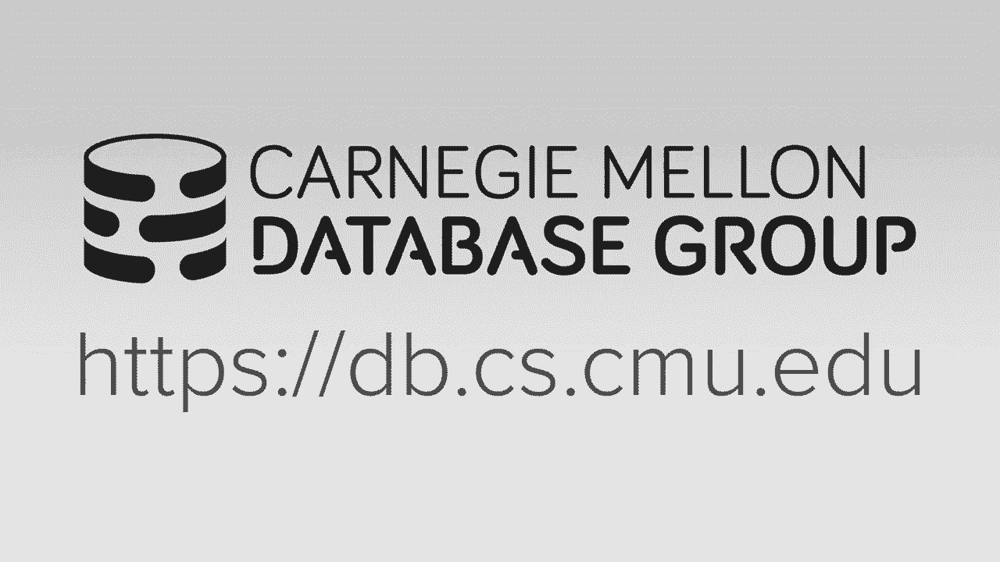
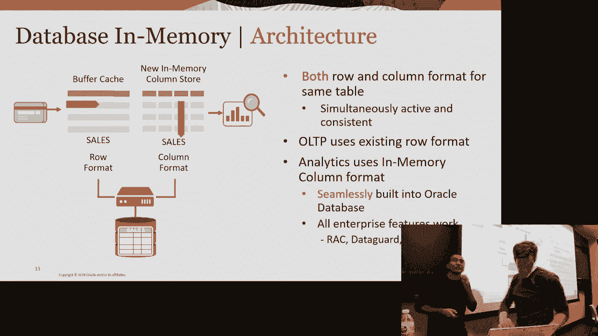
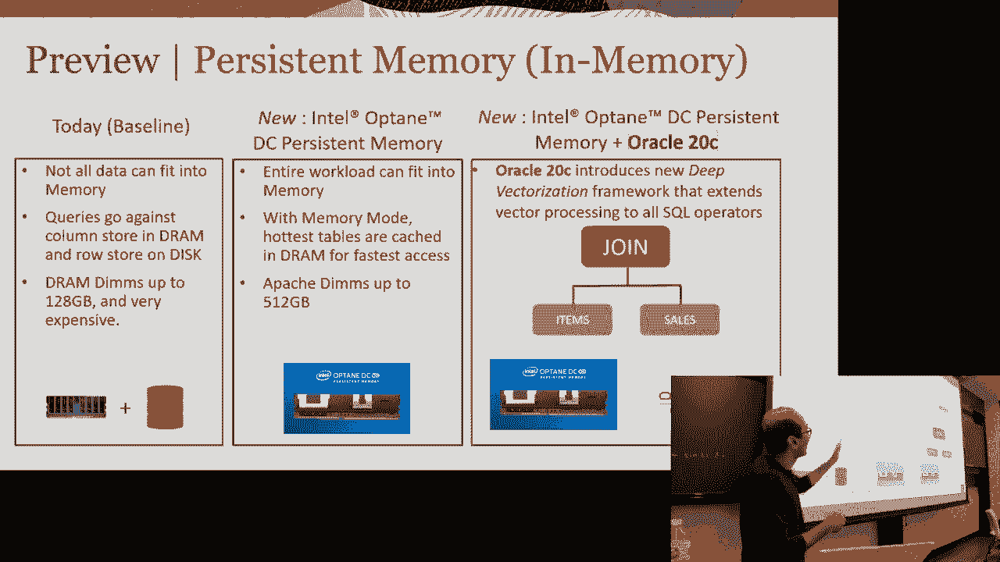
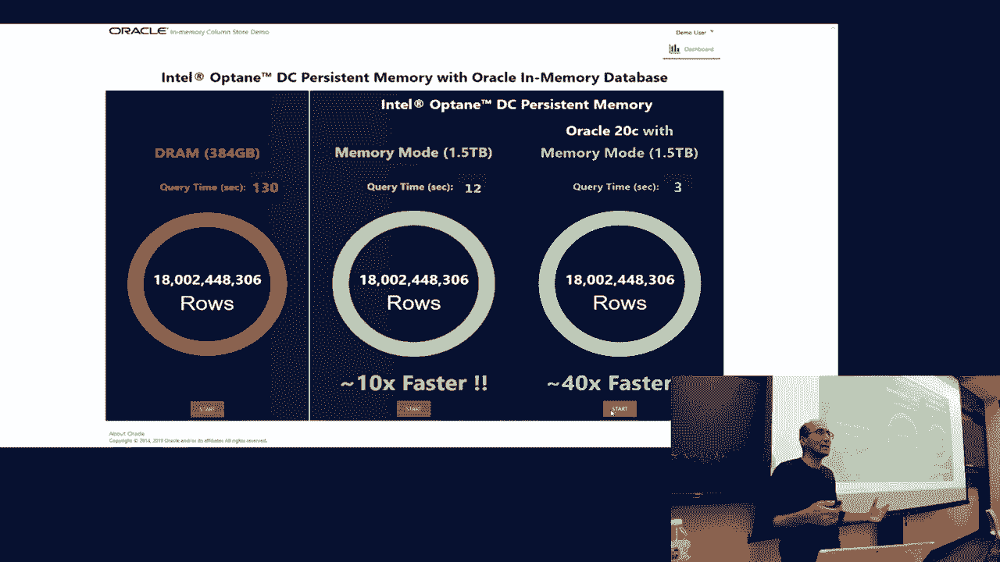

# 【双语字幕+资料下载】CMU 14-455 ｜ 数据库系统导论(2019·完整版) - P25：L25- Shasank Chavan（Oracle内存数据库） - ShowMeAI - BV1qf4y1J7mX

去吧。

所有的权利，呃，欢迎回到谈判桌前，谢谢。你没有给你女朋友买生日问题，我听说，哦是的，是啊，是啊，仅此而已，我们去一个星期吧，好的，所以这就是给一些人圣诞节过节，好的，不要，她是个好女人，好的。

嗯所以好吧，你们有什么事，所有的权利，所以上周的课，项目四还在做功课，五个到期，然后在周三的课上，我们将有系统，和最后审查，我还将宣布兄弟会演员阵容的结果，呃关于我的孩子，这是不是我的权利，所以我不会。

在下课时，星期三也是，好吧，在我们切换到扬声器之前，关于什么是进步的，有什么问题吗，你们这个学期，是呀，我应该在同一天做项目，它应该在网站上，我们会发出额外学分的反馈，可能明天或周三，任何其他问题。

嗨伙计们，所以我们今天非常兴奋能有甲骨文的沙尚克，呃，来做客座讲座，一次又一次，就像我说的，我喜欢他在这里的原因，是因为这会让我看起来不疯狂，我没有告诉你所有关于数据库的事情，只是没有胡编乱造，他会说。

哦耶，这里有一个真正的系统，他们赚了很多钱，它做了我们本学期讨论过的所有事情，但他会在记忆数据库中谈论这件事，这不是我们说的，但它将在不同的环境中应用相同的概念，如果你对他今天谈论的事情感兴趣。

这就是下学期15721高级班的全部内容，好的，所以她是内存数据库的副总裁，技术是正确的，这是正确的，所以他有加州大学的本科和硕士学位，圣地亚哥，他当了六年的神谕，九年，九年，九年，好吧，再来一次，就像。

这是一个真正的家伙在系统上工作，这是一些营销，这是真的，所以无论如何停下来问一些棘手的技术问题，推他，看看他是否真的知道自己在说什么，好的，该死的，是啊，是啊，我把灯也修好，太厉害了，所有的权利。

嘿伙计们，谢谢你能来，嗯所以呃再次，我叫钱沙山，呃，我偶尔来这里。我想有一个pdl实验室，他们来这里静修，我想这就像冬天和春天，我觉得，他很好心地邀请我，再次感谢你邀请我来这里。

所以今天的演讲将是关于前五名，甲骨文内存数据库的创新，所以这个演讲最初是给人们的，实际了解内存产品中的数据库，我稍微改变了一下，让你们了解内存中的数据库是什么，嗯喜欢，安迪说，请随时阻止我。

任何时候你有一个没有问题的问题，正如我所说的，安迪，我通常有更多的幻灯片，我有时间和你谈谈，所以有时我说得太快了，所以只要你想打断，好的，嗯好吧。

所以让我看看，我只想确定我在看幻灯片，适当地，好的很好，这是我的下一张幻灯片，所有的权利，所以我想从这张动机幻灯片开始，这是在谈论实时企业现在在内存创新方面的需求，好的这就是我现在要展示的幻灯片。

这张幻灯片是我们的总统早上发推特吗，叫做手臂，实时企业现在需要内存创新，但有人告诉我这太政治化了，所以我选择了这个，但我其实更喜欢这个，因为它是真实的，这其实是非常真实的，他真的是说，他真的说今天不。

否，我没说这实际上是弹劾审判开始的时候，我想是当我们把这张幻灯片放在一起的时候，但现实是以下实时企业，我们现在需要访问数据的企业，他们是数据驱动的，他们很敏捷，他们很有效率。

他们希望能够对数据做出即时反应，所以你可以想象有很多企业符合这一类，对呀，比如保险公司，零售是制造过程，金融服务，人们需要实时进行欺诈检测，其实，这事昨天才发生的，我在百思买买一些扬声器。

因为它们在打折，在我买了那个东西之后，我收到一条短信说，你确定你要买这个吗，这是你买的吗，废话废话，因为他们马上就知道，我不是那种花五百元买东西的人，你知道一时冲动，那不是我，嗯，所以不管怎样。

那是实时的，所以为了实现这一点，我们需要很多东西到位，所以我们看到来自企业公司的需求，对呀，那么到底是什么使这一切成为可能呢，所以如果你看看硬件趋势，好的，你开始有更大的，更便宜的内存，如此沉闷。

每个人都熟悉记忆，帕曼，我不知道你们中有多少人熟悉持久记忆，我说过了还有最后一颗子弹，所以我会说的，然后您有更大的CPU缓存，所以现在我们谈论的是三个两兆字节的共享，英特尔最新处理器上的三个缓存。

你有更大的多核处理器，所以两个四核在英特尔级联湖更大的SIMD矢量处理年，举手表决，知道什么是SIMD的人，你听说过在单一指令之前，多重数据，非常好，好的，现在你有512位SIMD寄存器。

会使你的行动瘫痪，基本上在一个循环中的水槽中，更快的网络，所以你有每秒100千兆位，洛基对每秒40千兆位，无限波段气动架构，这样你就有了，现在您必须专注于本地内存和远程内存，有很多因素。

持久的记忆真的是我心目中最大的，在甲骨文和我们的团队，我们认为是一个巨大的时代游戏规则改变者，嗯，在内存技术领域，所以持久记忆基本上就像DRAM，就像记忆一样，除了它大得多，大约是，呃，DRAM的大小。

嗯，它有可用性，因为它是持久的，你拔掉插头，你是，你把插头插回数据还在，坐在这些持续的记忆模糊中，而且它很快，它不比DRAM快，但它比闪光灯快得多，所以它有很多很酷的品质。

所有这些结合在一起帮助我们朝着满足实时企业的要求前进，所以最后一个项目是关于日志恢复的，厄运天使，所以想想这个，就像你在写你的能力，在你自己的游泳池里写出肮脏的页面，你不想为之做项目的持久内存。

如果它存在，我们今天的记忆在哪里，以防我们有不同的层，所以这里的顶层是应用层，这是您关心即时响应时间的地方，所以想象一下你有一个应用程序，您将把这个数据库直接链接到您的应用程序中，共享相同的流程基础。

内存空间，一切都是共享的，所以你会得到立即的响应时间，这是极其重要的，如果你对油敏感，您希望快速插入或快速读取，你只是得到了这个特定键的值，所以那是十年前的十倍，是记忆中第一个做到的人之一。

我想这是记忆数据库中的第一个，我想这是我所知道的，也许二十年前，所以第一个是九十六，好的，足够长的时间，所以那是呃乘以十，这是在应用层，这里的数据库是我要谈的，那就是我们内存中甲骨文数据库的地方。

这就是我们真正关心分析的地方，但我们也混合了工作负载性能，它直接嵌入到一个实际工作的企业数据库中，然后你以每秒数十亿行的速度处理事情，当你看分析的时候，嗯，然后还有存储层，所以我也会谈谈这个。

在这里的储藏室旁边，我是说，它是数据实际驻留的地方，不管是在磁盘上，在一些持久的存储和闪存或接近，基本上是持续的风暴，所以是的，数据库层的应用程序，存储层，我将主要讨论这里的数据库层和存储，好的，好的。

所以我要从记忆中的甲骨文数据库的背景开始，就是，让我们从一些基本知识开始，好的，所以在我们有柱状数据库之前，这是下一张幻灯片，我们基本上有行数据库，行智能数据库非常棒，如果你关心交易，好的。

所以作为一个例子，你是自动取款机，你有提款卡吗？你要扣25，从您的帐户中提取20美元，那是您正在申请的交易，你要快速搜索这个巨大的数据库，你知道的，数百万或数十亿用户，不是数十亿，但肯定是数百万。

并搜索您的特定帐户，找到你的余额，从中扣除20，所以这就像寻找一个特定的行和潜在的顶部，可能访问该行中的多个列，那对它很好，那是事务处理，所以行基对于访问特定的行非常好，然后触摸该领域中的多个列。

这里举个例子，如果您正在运行此查询，就像，从我的表中选择第四列，你要做的就是，你基本上必须处理每一行，然后跳到第四列才能正确地处理它，所以问题是当涉及到分析时，你基本上访问了每一排，但最重要的是。

你要通过调用column来访问column，触摸多个缓存行以到达您关心的列，所以如果你想去特定的一排，这也是很棒的，并访问特定的列行格式，现在列行格式对于分析来说是快速的，好的，分析是你说。

我其实很在乎参观所有的行，但我只对某些，所以在这种情况下，如果我想说，从表中选择第四列，我所需要做的就是访问第四栏，好的，数据存储在连续内存中的列中，这里的每一列都在一个连续的内存中。

到目前为止还有什么问题吗？行格式和列格式的区别，我们就这么做吧，好的，太棒了太棒了，好的，所以艺术上的创新和甲骨文为我们的内存产品开发的是，我们决定你不能只拥有其中一个，只是不可行，真正适合企业公司。

企业基本上对混合工作负载更感兴趣，有时他们在运行分析，有时他们在进行交易，它可能会非常混合，有时它们运行临时查询，这些巨大的查询，有时它们是非常非常简单的查询，所以这是一个混合。

所以我们基本上决定你不是，你不能只选择一种格式，我们基本上希望两种格式都有，所以这就是为什么我们有这个东西叫做双格式架构，所以采用双格式架构，我们基本上维护了缓冲区缓存中的传统行存储。

以及内存中的柱状表示，好的，我们保持两者，两者同时活跃，相互一致，所有的大脑都进入优化器，优化器决定何时看到查询，它应该走哪条路，所以说，比如说，如果它看到一个查询，说我真的想到达这个特定的行。

这个键并提取该值，我有一个旧的TP索引在上面，优化器会说，转到缓冲区缓存，获取它的索引块并读取该行，这就是它得到那一排的速度，如果查询是分析查询，你在做某种疯狂的聚合或分组，通过一些或一些连接。

或者不管是什么，它将使用列存储，好的，嗯，所以当我们在内存中开发这个数据库时，它是为我们准备的，我们将其本地构建到数据库中，所以它不是一个单独的存储引擎，它是现有存储引擎的一部分。

基本上只是想想柱状表示，好像是一个索引，驻留在内存中的索引，有什么快速的问题吗？就像你刚才说的，呃就像呃，你两者都用得很好，当你做得对的时候，所以如果你有一口老井，你认为你做错了。

如果你必须扫描整个专栏，但说你做得对，那将是你最糟糕的事情，所以如果要看情况，这取决于写操作占工作负载的百分比，所以我会在我们如何处理权利的第二个术语中讨论这一点，或更新，或任何东西或一般的DML。

如果你在做，假设你工作量的1%是权利，好的，那没问题，这基本上是一个混合的工作量，百分之十甚至百分之五到百分之十都可以当你开始得到更高的百分比时，或者二三十四成。

也许让我们假设这不是适合你的正确解决方案，因为现在你会看到，你基本上起来了，对不起，我不知道那是怎么先进的啊，你知道吗，我想你可能在用计时器，你得到了它，好的，嗯，所以你所做的是。

你基本上保持了两者的权利，您正在维护此列存储区和行存储区，这可能会成为问题，好的，所以我将描述我们如何非常有效地处理这一点，任何其他问题。

你是这一个还是下一个，下一个，确保它仍然是好的，所有的权利，酷，我们相信这一切太棒了，所有的权利，让我们来讨论一些细节，好的，就我们如何存储这些数据而言，所以你在这里看到的是一张桌子。

我们将数据存储在一个非常不纯的内存柱状表示中，嗯，所以销售表继续坐在磁盘上，不会改变对，就像你们知道的那样，它可以被拉到缓冲区缓存中，如果它被访问，这不会改变，但你所做的是。

如果你说把这张桌子放在记忆中，我们基本上会把它带进记忆中，我们将采取行，把它们转换成列，然后将列存储到连续的内存块中，好的，磁盘格式没有变化，我们是先知，所以我们支持所有平台。

您可以在内存中的任何级别启用，好的，在表空间级别的表在列级的表，甚至您可以在任何级别上指定它，你唯一需要做的就是，您需要告诉我们您想为您的列存储保留多少内存，这就是我要谈论的。

我们正在研究的一些未来的东西，但那是一个，你唯一要做的就是告诉我们现在有多少内存，如果你深入我们，好的，我们基本上在内存压缩单元中的IMC用户中屏蔽这些行，好的，我在内存压缩单元。

一个IMU基本上有大约50万行，50万到100万行，在每个IMU中，您有该表的所有列，在这张销售表里有员工的名字部门的工资，好的，我们现在也有这个行ID列，这真的很重要，这是一种，我们让行ID列。

这些行在磁盘上的实际位置，就是这个底部，所以在磁盘上，我们基本上把数据存储在帐篷里，基本上是毗连的，一块块的，这个区域显示13号区域有20到120块，范围十四号有八十二到一百八十二块，在每个街区你都有。

你知道的，有些，你知道的，数百人，数百或数千行，因此，这个IMU直接映射到磁盘上的物理位置，为什么这很重要是因为当你对一行进行修改时，很容易说出哪个IMC做了那个地图，我会看另一张幻灯片。

谈谈我们如何利用这一点，当我们谈论DML时，所以这里唯一要说的另一点是，您可以指定压缩此列的方式，所以你知道，我想你们还没有谈到压缩，或不同的数据格式，你们之前听到过字典编码或前缀代码，好的。

所以我想我有几张幻灯片，但您可以指定所需的压缩级别，你只限于记忆，所以你可以把它放在记忆中并压缩它，不管你想走哪条路，我们就是这样储存东西的，我敢肯定这是关于压缩的幻灯片。

那么我们实际上如何存储这些数据，好的，想象一下这是你的专栏，好的，这是您的未压缩数据，我有猫、猫、鱼、鱼、马、马、马、狗、狗、猫等，它实际上并没有排序，我这里有狗，这里有猫，但这只是我的例子。

所以我们要做的第一件事是在字典里对它进行编码，那么字典编码是什么意思，就是，它标识该列中的不同符号，把那些明显的符号，然后对这些不同的符号进行排序，然后给他们分配一个代码，所以你有猫狗鱼马。

这就是你在本专栏中的全部内容，我把它们分类，给它们分配0-1的代码，二和三，然后你只需要替换cat的值，猫咪，鱼、鱼等，用代码本身，我们更进一步，我们实际上把这些代码打包，因为那里只有四个不同的符号。

我只需要两个比特来表示这些符号中的每一个，所以零零零一零等，好吧，到目前为止，一切都好，这就是字典编码，接下来我们要做的是应用拉力赛或运行长度编码，运行长度编码基本上是说。

让我看看能不能识别出相同的符号和次数，并将所有n个副本替换为一个副本，连同运行正确帐户，所以在这里你注意到我们是如何有猫的，猫和鱼，鱼，或者更确切地说，零，零，零和一，零，一，零。

我可以把它换成0 0和1 0，然后我被碾过，有一个小按钮，是的，是的，就这样完美，所以你可以看到你基本上保持了一些运行，它只是识别这些符号有多少次运行，到目前为止一切都好，好吧那我们更进一步。

我们应用一种叫做OZIP或Oracle ZIP的东西，甲骨文拉链非常，它几乎是一个花哨的字典编码算法，但这太棒了，因为它很简单，这是呃，它的硬件友好解压，我就不讲太多细节了，我在描述这里发生的事情。

所以它所做的是，它现在正在寻找模式，现在编码的值，所以这里你有零零一，零一零一，你看到同样的零零一模式，零一零一，所以你现在用一个零的代码代替八位的集合，或者一个零位，你就会把零一换成一。

现在你把它压缩得更远了，所以您在编码流之上构建了另一个字典，到目前为止一切都好，好的，所以这就是我们所做的，我们把它发挥到了极致，然后你可以拿着这个，你把Z lib放在上面。

或者B zip或其他更高级别的压缩机在上面，所有的权利，我想说的另一种压缩形式是前缀编码，所以我们谈到了那本字典，猫的权利，狗子，马，等，注意它们是如何被很好地分类的，所以一旦它被分类。

您实际上可以从相邻的符号中删除公共前缀并单独存储它们，所以我在这本词典中的例子被有用地使用了，有用性，等权利，他们都用过，但有些符号实际上可以从更有用的东西中受益，所以我们要做的是。

我们基本上会去掉一个由八个符号组成的块，然后从这八个符号中我们会找到共同的前缀，在这个例子中的这八个符号，我想我用了两个符号，所以用，然后D是使用的后缀，所以我只是保持前缀，加上一个空的后缀，这里。

对于第一个符号，第二个是d，然后下一个会用有用的，因为这里的第三个符号很有用，同样的事情，你知道它抓住了后缀，所以这只会给你更多的压缩，到目前为止，这个东西的好问题是以下几点，对吧，你得给它减压。

这可能需要一些时间，你不能只用手指，和d，因为你必须在某个时候把它们缝合起来，并把它还给任何操作员想要的实际符号，所以压缩是有成本的，然后作为结果减压，但就像执行引擎一样。

就像烤肉或甲骨文一样不知道压缩，当你把它交给它的时候，你必须给它减压，你有你，它就像一个为专栏商店，我们有专门的格式，我们知道格式是什么，你不必给它减压，我们有一些技巧可以喜欢，例如字典编码。

对于前缀编码，我们有使用SIMD的技巧，让你不必把东西缝合在一起，当你做扫描的时候，在做投影单元的时候，花名册没有花名册有压缩机，很像字典编码，但它跨多行操作，而且要复杂得多。

所以当你实际上必须投射回来的时候，你是对的，要把它重新拼在一起是一个复杂的拼接算法，好吧，到目前为止，一切都好，好的，所有的权利，所以我们讨论了如何将数据带入内存，我们讨论了如何格式化和压缩它。

现在我们要谈谈，我们怎么扫描，我们如何使用这些数据并快速扫描，我们如何达到每秒数十亿行，相对于每秒数百万行，当您在行存储中查看缓冲区缓存时，这就是SIMD出现的地方，所以又是SIMD。

对于那些不知道的人，代表单一指令，多重数据，它所做的是现在许多最现代的过程，现在是最后一次，我不知道，十五二十年，也许我知道从96年开始，我想处理器里有一个，有一个矢量，矢量化单元。

他们有非常胖的寄存器，他们不仅有那些脂肪登记册，它们有一系列，它们有一个指令集，可以应用于那些寄存器寄存器，允许您并行化数据操作，所以让我们通过一个例子来说明事情，这里，你又有了，您的专栏存储。

您有一个名为State Right的列，你的查询很好，在加利福尼亚州的销售，所以您要做的是将状态列放入寄存器中，现在，你们这些家伙，我们刚刚谈到了字典编码，对呀。

所以这些状态列都可以被打包成多少位你们认为，思维敏捷，随便什么随便什么六十四，完全没问题，那是个好答案，这是正确的，所以你有，呃是5比特还是6比特，谢谢。六个比特，所以六个比特在这里，但你有一个登记簿。

五、十二比特，所以我可以带64个这样的，假设它们都是八位，我们就这么说吧，我可以用5位和12位的寄存器带来64，一次可以加载64个状态，这是一条指令，一些数周期，取决于它是否在您的CPU缓存中。

但让我们假设它在您的CPU缓存中，好的，所以是一个循环，我已经把它们装到这里了，下一步是把加州，任何位表示，加州是在另一个登记册上分裂的，加利福尼亚，加利福尼亚，加利福尼亚加利福尼亚，等，然后i。

这是一个循环，好的，这就是我在这里使用向量寄存器的向量指令集的地方，在那里我可以做一个向量，比较一个周期中的所有值，所以这个州将被比作加利福尼亚，这个州将被比作加利福尼亚等，在一个周期内。

它将应用64次比较，产生64位的位掩码，这就告诉了我这64个州中哪一个与加利福尼亚相等，所以想想项目三项目三，你必须做一个火山风格的迭代器，对呀，您一次调用下一个元组，但您不能这样做，在一个循环中。

右边去做六十四个元组，会是，你知道的，下一个电话六十四次，超级贵的，这就是为什么您使用向量化处理模型，这就是他们在这里做的，一次拿一堆废话，然后进行筛选器审查，谓词求值非常快，所以说。

这就是为什么他们比你们写的快一百倍，在项目三，让你对你的工作感觉很好，这就是为什么你慢了一百倍，但是但是但是但是但是安迪是对的，我们实际上将矢量化技术应用于我们所有的运算符，好的，因为这里面有魔力，嗯。

它是它是复杂的，当我有一个幻灯片，我想但是嗯，所以让我们继续这里，好了，这就把我带到了这张幻灯片上，所以我们真的在寻求改进分析的各个方面，所以我们刚才谈到了矢量化扫描，我们也看向量化连接。

有各种各样漂亮的技术，当您处理一个列存储时，你在处理字典编码，您可以利用格式，再次利用硬件，以每秒数十亿行的速度处理，在这里，我们通过简单地制造一种叫做布卢姆过滤器的东西来使关节更快。

了解Bloom滤镜的人举手，太棒了，优秀优秀的绽放污秽是一种魔法，我爱，嗯，所以说，所以这就是我们如何让关节更快，最初是我们五年前的第一个版本，然后报告聚合组，是啊，是啊，当我们讨论哈希节点时。

我提到过气球过滤器优化，这就是为什么，这是十X就在那里，对是的，好的，我是说，这是在上面使用SIMD，好的，我们继续吧，好的，所以现在我们终于进入了前五名，这就是我想要的，所以前五名，我只想列出我们在。

在过去五年里，我想我认为在内存数据库方面很突出，对我们来说有点酷，至少好吧，顺便说一句，很多这样的，其中大多数都产生了学术论文，我们提交给各种不同的会议，所以我给你指出来，当我们前进的时候。

所以第一件事是双格式架构，快速混合工作负载和更快的分析，为什么我们认为这是相当创新的，所以让我们解释一下它是如何工作的，好的，因此，双格式架构支持快速混合工作负载和更快的分析，所以如果你看你的右边。

那是我们的嗯，我上次给你看的一幅画，你可以在记忆中获得非常快的速度，dml，因为从逻辑上从列存储区中删除了无效行，所以我将通过这个例子，让我们假设一行被修改，好的，因此，无论出于什么原因。

该行都被修改了，可能有一列或者一些列，但已更新或删除，不管是什么，在正常路径上发生的，好的，就像它通常做的那样，甲骨文在过去的三四十年里一直在做，当这种情况发生时，它告诉我们立即使用该行。

我记得我告诉过你我们是怎么从磁盘映射到列存储的，我们可以立即设置一点，说明该行无效，那不会花那么长时间，你们都有固定的部分，如果你做了，如果创建Bloom过滤器，不会花很长时间，你一定要找到那个IMU。

这是一个小小的查找，但没那么久，然后用来设置一点，这就是DML的工作原理超级简单，你就说这一排，并且该列存储区无效，那么当你想做扫描时会发生什么，您只需忽略无效行，这是我的例子，假设我在做全表扫描。

我只是走了，我只是避开了无效的争吵，我现在继续前进，发生了什么，我避开了那一排，但这并没有给我一个一致的结果，现在我必须实际处理这一行，所以就为了那一排，我会去磁盘或缓冲区缓存取那一行，好吧。

现在很可能在缓冲区缓存中，因为我已经更新了，或者我做了一些更新，它将该块带入缓冲区缓存，所以从技术上来说，我仍然在以内存速度处理，因为缓冲区缓存在内存中，但我反对排商店，不覆盖无效行不受影响。

这就是您将数据分解成块的时候，它有很大的价值，不受影响的块，他们仍然会经历一个美好的，你知道吗，真矢量扫描，我们刚才谈到的辛迪扫描，这一点很重要，混合工作负载性能可能会受到影响。

如果无效行数在ISO中累积，这就像你之前说的那样，如果行开始变得很脏，那我就一直去缓冲区缓存，我没有利用柱状表示，这就是快速重新繁殖技术拯救世界的地方，所以让我们通过，让我们解释一下。

所以我们做一些叫做连续智能的事情，好的，这实际上是一个分析师术语，持续的情报只是意味着我们会跟踪你的IMU有多脏，以及扫描的频率，我们把它结合起来，我会解释为什么我们两者都关心，有多脏，扫描频率有多高。

如果你的IMU超级脏，很多更新正在发生，但你从来没有扫描过它，我不一定要刷新它或重新填充它，实际上没有人访问它，所以它是它的某种组合，我们有一个算法来决定，当我们应该刷新它的时候。

所以我们有的第一个技术是所谓的双缓冲，所以有了双重缓冲，这里的想法是当你有一个肮脏的IMC，你需要刷新一下，所以我们把脏的留在身边，在背景中，我们将创建一个新的，把那些肮脏的排进来，重新填充它。

现在有了一个很好的IMU的新副本，一旦准备好了，我们做那个切换，旧的出去了，新的进来了，我们想做这件事的主要原因，是因为我们不希望您的查询因脱机而受到影响，每次手术，如果你，如果你学到一些东西。

我想在数据库课程中，你真的想试着让所有东西都在线，你永远不想把什么东西打倒，然后在刷新索引时遭受较慢的性能，或者在本例中刷新IMU，有没有人明白那个双重朋友，好的，第二件事是增加人口。

我们所说的增量人口，这里的想法是你可以构造一个新的列，利用旧列中的信息，例如，当你做一个趋势，当您实际上从行存储到列存储时，这是非常昂贵的人口，我们打电话给那个人口，让它进入记忆。

识别不同的符号是非常昂贵的，你基本上要用，哈希表或艺术，你们听说过艺术，自适应基数树和非常好，好的，带x的索引或其他东西，是啊，是啊，茜草树，你需要一些东西来识别，给我不同的符号，那样做很贵。

所以你要做的是利用这样一个事实，我以前已经编过一本字典了，我只是在这里有一些肮脏的争吵，所以你利用这一点来构建，新的铜，新的专栏专栏CU OK，所以这是增量人口，我们做的最后一个小技巧是。

通常当您使行无效时，无效表示您正在更新和删除，什么的，你真的只是触摸一列或一些列，你实际上并没有接触到所有的柱子，因此，如果您运行一个不受列影响的查询，因为您只访问那些未受影响的列。

然后你还是可以向右圆柱形，您不必担心访问无效行，好的，所以这三种技术允许我们更快地运行混合工作负载，它给了我们两全其美的机会，是这样的，嗯喜欢，当你说我想那样，我在柱子上或桌子上看到你，是啊，是啊。

就像要么全有要么全无，但你没有，但没有传呼，这就像它的尾巴要么适合或不适合，否，从一开始就是这样，甲骨文，我们一直说，你不能假设一切都会在记忆中，只是不现实，所以发生的事情是，如果你有一个有限的。

不管你有什么记忆，你会带来它，记住任何不合适的东西，将留在磁盘上，好的，现在你喜欢，我说你有最终的控制权，你可以说你想要哪些列，您可以说您想要哪个分区，随便啦，它不像缓冲区缓存，就像你有一个不。

不喜欢很烂，因为它可以所有的权利，我完全做完了，这是一个，这是一家商店，这是一个专栏商店，所以它现在不是缓存，嗯，我会和你谈谈我们是如何过渡的，实际上使它成为一个缓存，当我们做存储的时候，分层之类的。

好的，到目前为止一切都好，这么好，准时做得很好，这是一个非常快的幻灯片，我只想跳过这里的动画，这只是告诉你如何，哦问题，对不起，在，两个工作负载，低基数和列是因为最终你是，呃，使用列故事处理列。

所以你所做的就像在挖，呃，记忆，低底和绳索，效率不是很高吗，是呀，是啊，是啊，所以让我让我，好的，所以我想问题是如果你把，听起来你既带来了RO行格式，调用一个数据及其数据的列到内存中，听起来这很低效。

基本上在内存中有两个版本的数据，你需要让它们保持同步和最新，对呀，好的，所以说，好的，所以说，让我看看，如果我能恰当地回答这个问题，如果你依赖你的工作量，你可能是一个分析工作量很大的人。

如果你是一个分析工作量很大的人，您永远不会将行格式化的数据带入缓冲区缓存，有道理，你只能利用，专栏商店里有什么，如果你是个老酒鬼，你就完蛋了，你所做的一切，交易，插入件，更新，删除。

您没有进行联接或聚合，什么的，你甚至永远不会把它带到专栏商店，这是有意义的，所以这就是现在的两个极端，中间立场是当你有一定比例的DML，现在扫描的百分比，记忆中有益的地方是，当然啦。

如果你现在对扫描比对DML更感兴趣，DML将把块带入缓冲区缓存，但它不会将整个表带入缓冲区缓存，这有道理吗，所以你偶尔会去排店，因为你只是在找争吵，您将使用索引来实现这一点，或者你要做分析。

然后经历所有这些，所以这就是区别明白了，好的问题，所以你说你只把桌子上适合记忆的那部分带进来，对较长的列进行扫描以进行查询，你喜欢什么，当你想要今天剩下的时间，好问题，所以问题是，既然我们不带来。

我们不必把一切都记在记忆中，当你做全表扫描时会发生什么，你实际上要访问一些不在内存中的东西，那是你的问题，所以这和什么没有什么不同，我提到了无效的行，如果有无效行，你得去磁盘去拿，所以这是同一个概念。

想象你有，所以你在内存中填满了50%的数据，你在IMS中使用这些，想象一下你有另外的50%是空的或脏的，我只是你知道如果你能想象，然后你总是要去磁盘取那50%的井，这就是你会有的行为。

这样您就可以从列存储中的内存中获得所能获得的一切，您将从磁盘或缓冲区缓存中获得其余的内容，记住，你可以压缩这些东西，所以你可以装你说的那么多，所以我不是那个意思，但你可以你可以，让我们说出我想要的。

好的，我不得不相信，因为这个角色让我相信，没关系的，炸弹，我不在乎好了就是这样，但你可以你可以压缩它，把它带给你，想要它把你能记住的一切都记住，如果可以的话，好的继续好的，所以这是，我就把它烧了。

但对我来说，这是一个非常明显的观点，因为我一直在解释，但对别人来说可能不那么明显，我们如何让混合工作负载在不做太多工作的情况下运行得更快，但只是有一个平静的商店，所以正常情况下，当您有混合的工作量时。

这里有张桌子，您有一到三个OLTP索引，好的，旧的又是索引，像键列这样的列上的索引，主键列，您非常快速地试图获得，然后你有十到二十个分析指数，因为对于要在其上运行分析的所有列，你会有一个单独的索引。

现在你基本上可以把这些分析指数都扔掉，只需维护列存储，正如我提到的，任何时候都有更新，你可以很快地标记一点，说这家伙已经更新了，这家伙被删除了，因为它在记忆中，的，更新非常快，以表明发生了DML，好的。

这就是为什么，所以现在，你不支付更新的费用，每次更新的所有这些分析索引，你必须到你的桌子上，所有的权利，第二项矢量化分析，所以我们简单地谈到了这一点，就在SID扫描中，我要更详细地介绍一下。

就如何工作而言，所以瘫痪谓词求值，加载evalu存储，消耗结果，以下是要计算谓词时采取的步骤，所以让我们来看看一个快速的例子，假设您有一个表T中的选择计数星，其中a大于十，b小于二十，对呀。

所以你要做的第一件事是加载一个，你要把四个值放入SIMD寄存器，就在那时，正如我提到的，你会在那个SIMD寄存器上溅十个，然后你要做一个大于，在一个周期中大于大于全部，你得到了，你知道有点矢量。

上面写着一零一，然后你对b做同样的事情，你加载b，你把它比作二十个，这就是它的位向量，现在你只需要，这两个位向量在一起，现在你有了最后一套，零一零一，现在这实际上还没有完全完成。

因为它存储在SIMD寄存器中，四位存储在128位寄存器中，我不想浪费128个比特来存储4个比特，所以你基本上把它们打包，这是SIM卡指令集支持的另一条指令，把它们分成四个部分，字面意思是四位。

然后你把它储存起来，你知道什么，或者利用它，然后对于下一个谓词，这就是你对SID操作如何工作的更多细节的了解，好的，所以不仅仅是扫描，但我们也在更快地进行连接，所以开花过滤器，大家对滤光片很熟悉吧。

我们制造BLOW过滤器的方式甚至更快，这是多种因素的结合，我们先在字典上应用Bloom过滤器，这是第一件事，因为你只需要在不同的符号上运行它，您不需要在所有的值上运行它，一旦你在不同的符号上运行它。

你需要把它们映射回那些符号，映射到那些代码，第二件事，我们使Bloom过滤器更快，是我们向量化操作，我们使用SIMD基本上进行集合成员查找，这意味着在位向量内，查找确定此值是否在此位向量中设置。

这张幻灯片没有谈到布卢姆过滤器，这让它更上一层楼，这是说如果你能告诉我两张桌子上的哪两列，你打算加入反对，好的，这就是我们所说的加入组，如果你说嘿，你现在要在这个名字栏上加入车辆和销售之间的联系。

一旦你告诉我，或者告诉我们，我们将使用相同的字典对这两列进行编码，如果没有这个，我们将，我们不知道这两者有关系，所以我们基本上会有一个单独的字典给这个人，给这家伙一个单独的字典，它们可以有不同的代码。

取决于智商是如何分解的，所以一旦他们有不同的代码，他们不再有联系了，这里的代码5和这里的代码8不匹配，尽管五号和八号都出局了，宝马什么的，这是车辆，叫宝马什么的，所以一旦你告诉我们这些。

我们将使用相同的字典来映射代码，现在你只是在做代码对代码的匹配，你不是在做正常的连接，你们实现了一个连接，是呀，好的，所以你知道你有一个哈希连接，你得到一个哈希连接，哈希连接涉及构建哈希表。

你得把钥匙弄乱，你必须插入哈希表，当你做探针的时候，又是你们，对键进行哈希，你要做一个关键的比较，你有跟随链，所有这些都在这里，它只是一个好的代码10索引到一个数组不是空，有一个匹配，就是这样。

整个事情都可以矢量化，做一个有意义的查找是一个非常简单的操作，如果销售名称是车辆名称的外键，你会自动这么做吗，是呀，是啊，是啊，好问题，所以有一些情况下，我们自动地做事情，然后当我谈到未来的时候。

我们要在这一点上走到极端，所以那是呃，呃，连接聚合，我们做同样的事情，幻灯片非常详细，所以只要按照我的话去做，不一定要看得太多，但是嗯，我们有两种形式的聚合，呃，这是单人桌，聚合向下推。

这就是所谓的向量变换，在联接之上进行聚合，这是一种，你知道，这很复杂，对了，你光看这张图是没有多大意义的，但让我们先谈谈这个，我们在这里做的是想象你有一个从这个表中选择的和，带有谓词，又正常了。

用火山模型，对呀，您正在将经过的每一行发回给另一个运算符，然后这个运算符每次添加一行，也许一次有一批行，对呀，但它需要，它在做一些事情，一个是它在做，它正在将符号复制到缓冲区中。

另一个运算符正在读取缓冲区，然后它向上看并聚合，它正在添加它，它很贵，嗯，我们在这里做的是，我们在说，你知道吗，让我们利用这种形式，这是字典编码的，如果是字典编码的，我们可以使用字典代码。

并对字典代码和不同的符号进行聚合，然后我们可以在扫描层完成这一切，然后只将部分聚合结果投射回更高级别的运算符，好的，这就是我们要做的技术，我有一个例子，这个矢量变换，我不打算详述这一切，我再说一遍。

这是我们在ICD 218的一篇论文，我想嗯，这是一种非常新颖的技术，基本上将聚合向下推，并向下连接到扫描层，所以基本上不是将所有这些行通过运算符向上发送，联营公司，导航操作员，我们在扫描操作员中做一切。

这就是我再次，我不打算谈那个，但我要谈谈这个，这有点酷，一些你可能不会想到的事情，但我们必须在工业上考虑，嗯，非常大的数字，有人知道非常大的数字是如何编码的吗，有多种不同的格式，从很大程度上来说。

我说的是，假设有三十多个数字，你知道这是不适合的东西，六十四位，呃，在64位寄存器中，数字类型，你可能认为数字只是一个寄存器，一个六，int或其他什么，我们把它看作一个字节序列，好的。

当每个字节的每一组表示最多100的数字时，所以它是，它是，这是底座，一百，所以你有第一个字节指示，像一个指数，还有一个，符号加减优点，右数字，好的，所以这就是它的实现方式，我不知道，你们怎么样，好的。

所以我们基本上在每个操作中都有一个数字，类型就像数百个循环，从字面上看，数百个循环，与做a a a a寄存器操作的一个周期相反，所以让我们来看看我们如何支持非常大的数字的例子。

假设你有一个从表T中选择的a和，其中按j逗号k分组，好的，所以你在做一个，按j逗号k分组，假设这是你的桌子，好的，这些是您的分组列，j和k，这是你的测量列，a，我们所做的是创建这个频率表。

x轴上的频率表是字典代码，这些是想象这些是字典代码，好的，它们映射到实际的符号，只是为了在这里说明这个例子，所以你会得到0 1 2 3这是一万零1，一直到五十岁，一千零十九，等，好的，那是y轴上的x轴。

你有小组，不同的群体，所以组的可能组合是零零零一零和一一，如果你看看这里的所有这些值，我们所做的是遍历每一行，并添加一个计数，所以如果我去零一，映射到这个组，我索引成50，一千，八百一十九。

我提高了一个计数，这里写着，我见过一次，我对这些值做同样的事情，又是五一八或九，对于另一组，我把它撞起来，我做这个，我把它撞起来，最后，我基本上有一张桌子，上面写着，我见过多少次这些不同群体的字典代码。

到目前为止，每个人都和我在一起，现在我们要做的是，我们将通过乘以频率在每个组中聚合，乘以字典符号，所以它会说代码零出现零次，所以我不需要乘以它，但这家伙出现了一次，所以我需要获取它的代码，查字典乘法。

所以这基本上是操作，0乘以符号加上0乘以下一个符号，以此类推，我们为什么要这样做，我想知道你们是否有很多，我想没有那么多的匹配像这样具体，你就不会，嗯，同一本词典，或者会有一个更大的字典。

因为这与分组有什么关系，或者如果有这样，如果你在映射，就像字典里的一组数字，如果你在映射，你是说，如果组数太多，或者如果字典的数量可能有很多不同的，啊，好的，然后你就有了这些数字的字典代码，并得到了它。

所以它可能没有绝对正确的帮助，所以你已经发现了其中的一些弱点，所以问题是，我觉得，如果我明白你的问题，为什么你可能在这里到处都有一个，比如说，因为它是如此的多样化，我想这是正确的词。

所以你知道这些代码中的每一个都只显示一个特定的组，或者他们出现在所有的小组中，或者不管是什么，所以你基本上最终会把所有的东西都乘以，这是一个弱点，看情况而定，所以它是它是一个，这是一个。

这取决于数据以及数据在案例中是如何组织的，也取决于你有多少组，如果你有很多组，这张桌子开始变得很大，因为你有许多不同的符号和许多群体，这将是一个非常昂贵的操作，为每一个小组进行这样的操作。

但为了结束这里的想法，我们基本上是在取代，每一版的，如果我必须把这些值都加起来，并得出相同的值，如果我能取代它，假设是10乘以5，我宁愿做10乘以5，而不愿做5乘以10，这就像一个显而易见的事情。

你会考虑在保理方面，但对于软件实现的类型来说，这是非常重要的，因为这些操作中的每一个都是如此之多--如此之多的循环，八十个循环，就像你说的，这确实取决于工作量，就这什么时候真正起作用而言，这有道理吗。

如果我再明白一个问题，这个群体，所以这些组可以通过什么来分析，通过遍历j和k的列，所以当你遍历j时，你会识别出j中有多少不同的符号，你走过，k有多少个不同的符号，你把两者相乘，就像一个多维数组。

以获得最大可能的代码，这就是你创建的表，然后当你想索引到它的时候，你拿这个和这个把它们相乘，这就是你如何索引到表中，好的，好的，所有的权利，我在这里跳过几张幻灯片，为了节省时间，所以数字。

嗯连接做得更快，在内存表达式中，我跳过这里，动态扫描，我跳过，我会直接进入这个叫做记忆的东西，加上额外的数据，所以这是第三个，我们将内存带入存储层，所以用甲骨文。

我们有一个叫做出口数据的东西数据是我们从零开始构建的数据库机器，基本上利用最好的读取硬件，所以最快的网络，最好的SSD驱动大量内存，很多闪光，对呀，我们从零开始建造。

我们构建它是为了尽可能快地运行Oracle，所以最后一次滑动那个架子，一个好的润滑脂要多少钱，那个盒子多少钱？这是个好问题，肯定有几百万，我们有各种不同的款式出售，但肯定有数百万。

但令人惊讶的是有多少人买它们，这就像惊人的，这是一个，对甲骨文来说，这是一项十亿美元的业务，在数据上，你有计算节点和存储节点，好的，计算节点是所有高级续集运算符处理发生的地方，连接、聚合和排序。

所有的爵士乐都发生在那里，存储节点上是最接近数据的地方，它在SSD驱动器中的位置，所以这就是你可以在这里做一些快速过滤的地方，然后只发回通过网络的行，到计算节点，对呀，我们上周讨论的背景是什么。

这是一个分布式共享磁盘，正确，所以你在记忆中没有的是，我们在这些存储节点上也有一些闪存，我们如何使用闪光灯是我们把它作为缓存，这就是安迪之前说的，我们实际上把它作为缓存，从某种意义上说。

您正在访问的最热门的数据，将从SSD驱动器移动到闪存缓存中，现在你会，它还将存储在柱状表示形式中，它的美妙之处在于在计算节点上，你被限制在你有多少DRAM，就像1。5 TB的内存，你可能会觉得很多。

但在真正的企业中，这算不了什么，就像杯水车薪，你真的需要Flash给你的数百TB，一旦你有了所有的记忆，你基本上可以做一些非常漂亮的存储分层，现在，您可以将一些最热门的数据放在您的计算节点上。

如果内存不足，没问题，它将自动填充到闪存缓存中，现在坐在存储节点上，查询如何工作，好的，想象一下你在做扫描，全表扫描是，你知道，选择um，从我的电话簿上，我地址里所有住在加利福尼亚的人。

不管它会在这里经历什么，它会说，好的，我把这里的东西都用完了，我桌子的其余部分都在我的储藏室里，它会说所有东西都缓存到我的闪存缓存中，它将利用我们所说的相同的矢量化技术，我们对联接和聚合所做的相同改进。

等等，它利用了所有这些，它只是从闪光灯上做的，所以你必须把它从闪光灯带到DRAM，它是该存储节点的本地，但之后你做同样的技术，然后你把它送回去，但这是有道理的，这只是存储调优的形式。

给你一个更大的列存储，它允许您将数据放置在属于它的地方，最昂贵内存中的热数据，那是最快的，闪存缓存中的暖数据，和冷数据坐在您的持久存储中，就在你的磁盘上，这些只是一些性能数字，我想我们可以跳过那个。

跳过这个，任何对容错感兴趣的人，好的，好的好的，所以让我告诉你我们是如何实现容错的，好的，嗯在，我们基本上维护一个节点集群，我们叫它架子，好的，在机架上，您可以有许多不同的节点。

假设在这个例子中有四个节点，在每个节点上都有一个列存储，这些节点中的每一个都有内存，你可以把一个单独的，你可以在里面放一个列存储，你能做的就是，您可以将数据带入此列存储区。

您可以在这些其他节点中的任何一个上复制它，例如，这个红色IMU在这个节点上是重复的，这个蓝色和那个是重复的，黑色在那里复制，您可以至少有两个节点可以再次复制，所以如果这个节点出了什么事。

查询只需要重定向到具有该IMU权限的节点，真的很简单，就这么简单，嗯，你可以做得更好，通过完全复制，红色的欧盟到处都储存着，这既为您提供了可用性，也为您提供了性能，因为现在每一个访问，当你去。

它将是本地的，您没有对另一个节点进行远程访问，获取其内容并运行该查询，一切都是本地的，这就是我们实现光子的方法，它是，这是相当简单明了的，每一个在IMU级别，每一个IMU，即50万行中的50万行被复制。

我将跳过数据保护，直接进入智能自动化，安迪，我们准时到了吗？好的，好的，所有的权利，所有的权利，第四是智能自动化，这是我们试图变得更聪明的地方，到目前为止，我告诉你的一切，在很大程度上是，还是你。

你知道吗，你有没有，用户必须以某种方式指导我们，说嘿把这张桌子放在记忆中，或者嘿创建这个联接组，对嗯，我们想变得更聪明，嗯，你们都是一起工作的，安迪，安迪是自动驾驶数据库的创造者。

拉里·埃里森偷了这个名字，我说那是对的，帮我省钱，我们从中赚了钱，嗯，所以无论如何，呃，那就是我们要向右移动的地方，自动驾驶数据库，2。今天晚些时候我有一个单独的谈话。

这更多的是在谈论我们如何实现这一点，嗯，但这里的想法是，这是一张DBA的照片，可怜的DBA，DBA说，我必须手动管理在这个专栏商店里放什么，什么要挡在外面，我不知道，我不知道什么桌子是热的。

我不知道什么是冷的，我知道很温暖，我不知道有什么问题，你要往右跑，但正如我前面提到的，这是一个专栏商店，所以一旦店里摆满了桌子，就是这样，DBA必须决定驱逐什么，带什么进来是对的，这里想要的结果是。

您希望将热对象保留在内存中，并删除较冷的对象，所以这就是我们所拥有的，好的，我们现在拥有的是更聪明的东西，在这里我们将观察访问模式，我们有一个所谓的热图，热图基本上说在最小的粒度，对我们来说是一个街区。

并且块在块级别上有一定数量的行，我们会说它被访问的频率，天气有多热，以及它是如何被很好地访问的，访问因为扫描一个DML怎么对了，所以我们观察访问模式，一旦我们观察到模式，我们将对数据进行分类。

我们会说热的中间的冷的冷的数据，一旦我们对数据进行分类，然后我们采取行动，我们会把热门数据带进来，会把冰冷的数据，非常简单，非常直接，我们把它带到一个更复杂的水平，我们在哪里做。

我们将不仅仅在表级或分区级进行，但即使在列级别，所以我们会说，像这个列这样的东西被用来聚合到它的一个度量列上，并且此列用于谓词on now，如果我知道此列用于谓词或谓词求值，此列用于聚合。

我可以用不同的方式格式化它们，我可能会使用字典编码，另一个可能是另一种压缩格式，因为字典编码的顺序涉及到在字典中查找代码，获取符号，这是几个层次的间接，这是昂贵的，但是扫描速度很快。

因为我只需要看看位代码，我从来没有，我从来不用减压，而聚合，我需要从字典中得到那个符号，然后我需要添加它，那么我为什么要在字典里编码呢，也许我应该保持它不压缩，所以我有符号就在那里。

所以这是你可以开始变得更聪明的地方，如何访问您的数据，如何访问列，它们应该如何格式化，也许很多这样的，也许这四个专栏从来没有被访问过，把他们赶走，把它们压紧，或者如果你想安全，把它们压紧。

或者把它们完全赶出控制台，好的，所以无论如何，所以说，这就是我们试图消除图片中猜测的方法，开始变得聪明得多，这变得很复杂，因为你们都在处理缓冲区缓存，想象你有一个混合的工作量，有时你要把油输送到P。

有时你要运行分析，您为列存储贡献了多少内存，与您为缓冲区缓存投入多少相比，对呀，你怎么确定，你怎么知道今天会有什么行为，对明天，与第二天，等等，所以所有这些因素都必须发挥作用。

你必须非常有弹性能够从一个切换到另一个，你必须非常非常快和准确，没有客户愿意转移到甲骨文的自主数据库，突然之间，一次经历，性能更差，经验，比如不一致的性能，像那样的是两件可怕的事情，至少你想一直变坏。

那是我的建议，如果你要变坏，始终如一的坏，这样用户就知道，好的，至少我知道今天和明天会发生什么等等，所有的权利，所以嗯，我要跳过一些更多的事情，我将简短地谈谈，哦问题，是啊，是啊，有一个参数要控制。

喜欢是，值，所以这是一个更细的纹理，这是在说，嗯，比如说，当列存储已满时，我们可以采取的行动是驱逐寒冷的柱子，就是这样，我们永远不会决定用什么来代替它，那只是基于你的查询，无论你碰什么，你带来的。

那是一种模式，另一种模式现在是，我们会更聪明，会驱逐并告诉你带什么进来，另一种模式是极端模式，那就是手把手的地方，会做一切，1。我们从一开始就决定，列存储中应该有什么，从一开始，里面应该有哪些列。

或者怎么压缩等等，你对数据中的实际内容做出任何决定，看看这些值，然后说，哦好吧，它的订单日期超过了，你知道的，三个月你没有选择你的问题，我们只是看看，嗯，我们只看频率ndv，对呀，这就是我们真正看到的。

你，我们能不能看看，如果是日期列，比如说，让我们给出一个日期列，如果是日期列，我们可以在编码方面更聪明，我们可以把月份与年份和日期分开编码，我们可以得到更好的压缩，如果是数字列。

我们可以用二进制表示来压缩它们，JSON我们可以这样做，我们确实查看数据类型，以更有效的表示形式压缩它们，但我们看它并不是为了从中获得意义，这是另一个层次，一旦我们把查询放在一个存储库中。

我们有数据和访问模式，我们可以做那样的事情，如果你要离开，我不知道我们是不是，我说我们能做到，所以说，我们实际上还没有做过那样的事，嗯，因为我们会看到事情是这样的，数据可能会被加密。

所以你知道我们什么也做不了，即使是困难的，你可以查字典，但除此之外，你不能再问其他问题了，有问题吗，任何一种喜欢，我想我博弈论喜欢类型喜欢考虑，就像你就像，好的，我把这个移到这里要多少钱，你知道。

然后一旦它就像，一旦你达到那个时间，然后像这样拔出来，是啊，是啊，大问题，所以这就是，嗯，所以这是我们的专家系统，我不知道，这不是机器学习，但它就像是一个专家系统，它又考虑到了。

让我们把最简单的度量标准，多久扫描一次，它消耗了多少空间，它是如何被扫描的，这有点像三个非常简单的指标，从中你可以划分，设计一个符合阈值的方程，你优化它的另一部分，少的是时间，我想什么时候被访问过。

你把所有这些都考虑在内，你有一个相当聪明的系统，没有比这更复杂的事情，你可以走得更远，您可以查看多列之间的相关性，跨多个表的相关性，等，后面的问题你决定什么时候喜欢，实际上很明显一旦你说像，好的。

我希望这个数据是热数据，我需要转换成列格式或类似的格式，是的嗯，你怎么决定什么时候做那件事？因为很明显就像，就是这样，那相当贵，如果你在转换，你知道，大约一半的表格是列格式的，是的，或者类似的好问题。

所以问题是，如何确定何时将其自动带入列存储，对呀，温迪的选择，好的，问得好问得好，所以我会回答第一个问题，什么时候把它带进记忆又是，这和我说的那些属性很相似，如果我知道的话，假设有一张表不在内存中。

柱存储已满，这张桌子多久扫描一次？不是经常，这些表在内存中被扫描的频率，替换它们往往是没有意义的，一旦此表的扫描次数增加到上面，这些都是什么，桌子上有，那么从列存储中清除一些东西是有意义的。

带点东西进来，但这很棘手，对呀，因为你必须知道，只是在很短的一段时间内，然后就不会再被访问了，嗯，我付了所有这些，我花了很多CPU周期来转置它，把它铭记在心，现在我就像，现在是午夜。

我不需要再写这些报告了，所以在我们采取行动之前，我们会试着聪明地识别访问模式，我们实际上是一个相当保守的系统，我们会慢慢地进行修改，它是，它是，就像其他任何系统一样，您设计的专家系统。

你会在这里有反馈机制，对呀，你会说，我刚刚做了正确的决定吗，如果我不喜欢，我从中学到了，我记得，下次这种情况再来，我会更聪明，我带来了什么，我对你说实话，这不是一个完美的系统，这里有很多工作需要做。

我们就在那里，我们在想办法，什么是，我们如何用20%的工作获得80%的好处，这样我们就可以很快地得到它，它的那个问题，所以如果是零一模式，都是零，0号桌和1号桌都坐满了，的，你必须是第一个。

如果你想带隔壁的桌子来，是的，他们都像首先我在零上做一个查询，那我就做一个，什么是，然后耶，那么是什么能做到这一点呢，所以我们做的第一件事，假设0和1都是热的，你说的对吗，他们都很兴奋，你没有空间。

0和1，你是做什么的，我们要做的第一件事是我们说这些列中哪些还没有被访问，好的，通常你有一张桌子，那是一张很胖的桌子还是一张很胖的桌子，好的，让我们看看谁，tpc，好的，TPCH是一个基准。

数据仓库基准测试，好的，所以基准，好的，tp ch有一个名为line item的表，行项有一个名为l注释的列，L注释从未使用过，好的，在那个特定基准测试中的查询中。

我的评论是Oracle占用了内存中大约20%的空间，巨大的风险值，不是巨大的巴雷，但它是一个很大的ar char字符串，甲骨文很有攻击性，我们会在字典里对它进行编码，这真的说不通。

因为它们都是不同的符号，我到底为什么要给字典编码，我不打算利用它，但我们这样做是因为我们假设你可能会扫描它，如果你能对照字典扫描编码是最聪明的事情，所以回到你的例子，这里是L注释从未使用过。

行项目是热的，那是张很热的桌子，但是L评论从来没有用过那栏，所以会把它驱逐出去或压缩它只是为了安全，只是压缩它或驱逐它的行为，可能会让你把另一张桌子放在有意义的地方，所以我们会试着先非常保守。

试着把这两张桌子都弄到，通过压缩列到列存储中，好的，如果那不起作用，我们采取下一个更大的行动，这不是哪里，我们先采取下一个更大的行动，例如，表通常是右分区的，可以按日期分区，也许不需要旧的日期分区。

你只关心最辣的约会，所以你要记住，当你驱逐，旧的日期出来了，现在有意义了，如果你在一个情况下，这两个都很热，那我们就保守点，我们不会不断地繁殖，我们驱逐居民，这只会增加更多的周期来做人口。

所以我们会选一个活下来，承担后果，所有的权利，我知道，我就像呃，时间不多了，所以我要，哎呀，对不起，对不起，所有的权利，持久记忆，好的，让我们快速谈谈持久记忆。

UM新硅技术的容量、性能和价格介于DRAM和Flash之间，这是一张很好的小照片，上面写着，嗯，当你从磁盘到闪存再到持久内存时，你开得越来越快越来越快，但同时你会付出更高的代价，每千兆字节较高的成本。

好的，最终PM现在真的很贵，真的很贵，最终，这会降低一些价格，但闪光灯也会更便宜，所以很有趣，我们如何将系统与所有这些技术结合在一起以获得最佳性能，英特尔称这个为辛烷值直流，持久内存DCS，数据中心。

我相信他们现在是镇上唯一的游戏，好的，有一个，还有其他人，但现在镇上唯一的游戏读取内存速度比Flash快得多，对呀，在停电后幸存下来，不像DRAM，好的，你可以想象建造，正如安迪所说。

在持久内存的基础上构建一个全新的存储引擎，和秀树一样狡猾，这里，你们这些家伙，他明天要做一个报告，嗯，而是如何利用持久内存，这可能很棘手，因为它涉及到利用一些新的指令来确保数据被正确刷新。

一路回到记忆中，我就不细说了，我把这张幻灯片调到这里，关于我们今天计划如何在内存列存储中使用持久内存，作为基线，您不一定要在内存中容纳所有数据，这就是我们一直在谈论的一些人的例子，所以假设它不适合记忆。

所以你会有磁盘，对不起磁盘加内存，然后，查询必须与DRAM中的列存储相对应，以及磁盘上的行存储，对了，DRAM调光可以达到28G，1。没人买它，它很贵，这就是今天的基线，带PM M。

你可以想象把所有东西都装进PM一个昏暗的，好的，密度增加了三倍，一种叫做记忆模式的东西，这是非常酷的内存模式英特尔支持它，让你有一个你持久的记忆模糊，坐在上面的一个昏暗的人，好的，所以当您访问数据时。

DRAM DIM用作缓存，因此，您最热门的数据位于DRAM中的内存中，如果它不在缓存中，那我们就把它从持久的记忆中带出来，进入昏暗的DRAM，所以DRAM DIMD只是作为缓存，这是浪费空间。

从某种意义上说，这是一个缓存，这不是你有额外的记忆，但好处是你访问PM M的速度几乎和DRAM一样快，好的，所以这叫做记忆模式，最热门的表缓存在DRAM中，以便以最快的速度访问，这些暗淡可以很大。

512千兆字节，然后这只是说使用我们最新的甲骨文。

20C和一些技术，我提到这个的原因是我们运行了这个，我们使用的这个基准，ssbis，ssb是另一个基准，称为星型模式基准，这是一种基于T pch，嗯和啊，在那里我们展示了DRAM。

大约三百八十四千兆字节，这张桌子不完全适合记忆，这是进度条，但那已经完成了，我们处理了180亿行，花了130秒，好的，当它不完全适合记忆时，然后我们使用持久内存的内存模式，它就会以十倍的速度下降。

花了12秒去180亿行，然后我们加了甲骨文20C，它有一些很酷的技术可以让关节更快，我们刚刚展示了他们可以额外，你知道的，比那快4倍，我想说的重点是这对我们来说真的是一个游戏规则的改变者。

我们更多地关注持久记忆，所以现在你可以把所有的东西都放进记忆中，你需要把所有东西都放在磁盘上的日子已经一去不复返了，好的，你有太字节、太字节、太字节的内存。

好的，嗯，我就不说综合分析了，我只是要打开它的问题，但主要的是，我只想在这里谈谈这张幻灯片，甲骨文最主要的一点，我们试图为甲骨文推动的事情之一，您不需要为文档存储提供单独的存储引擎，或者空间存储。

近四j或图形，或者人工智能或者物联网，或者你知道，将数据库视为文件系统，甲骨文正试图将自己定位为一站式商店，您可以在单个数据库上完成所有操作，它有很多好处，一个是安全，您不想将关系数据迁移出去。

将其纳入图形数据库，这样你就可以在上面运行图形查询，就在那里有一个顾客上帝，第二天在哪里，他们在欧洲有一个客户，他们建立了一个图形数据库，他们用一个图表来表示不同人之间的交易，在他们的贝宝或系统上。

他们图节点上的每一条边都是一个事务，但他们必须将数据从关系存储中取出，把它带到图形商店，然后他们运行查询，这需要一个人一段时间和一秒钟，现在总是有这种违反安全规定的行为。

因为你要把这些未加密的数据从数据库中取出，对于带有mongo的文档存储来说，同样的事情是mongo db，但您也可以将JSON很好地存储在您的，您的关系数据库，好的，所以我不打算多谈这个。

我只是跳过这个，嗯，就这样吧，好的，最后一件事是，这是创新总结，我想说得很清楚，你知道我们出来的时候是2014年，这里所有的这些小子弹就像，一种大规模的项目，甲骨文在记忆中致力于，然后嗯。

你知道我们的路线图，哎呀，我把它画得更高了，从两个C到两个，一个C，以此类推，我们超级投入，因为我们觉得现在是时候了，记忆变得很容易获得，越来越便宜了，它变大了，嗯，硬件技术都在那里，再次要求，从实时。

企业在那里，所以，结果，我们的特征需要在那里，对我们来说，主要的驱动因素是内存数据库中的自我管理，一切都需要自主，嗯，真的看着一切，不仅仅是关系，但是空间文本图，等，嗯。

并向量化我们所有的操作员不仅仅是我们简单的扫描等等，好的，我想就这样了。

我就跳过那个，我就跳过那个，我将跳过这个，开放给你任何问题，如果你有，有什么问题吗？我在想那二十五个，我们已经能够支持多种类型的数据库，是啊，是啊，我在想，嗯，你真的有不同的信息吗，就像图和现在的关系。

还是以一种方式存储，然后你就可以努力了，大问题，所以问题是，你怎么，我们如何表示这一点，它是您数据的单一表示形式吗，当您想将其用于图形查询和关系查询时，还是像一个，你知道的，多重表示，我有这个权利。

好的，所以我很快就看完了那些幻灯片，但让我解释一下，所以我们对图形所做的，或者假设我现在一开始会说json作为文本，所以我们为文本所做的技术，空间JSON，不管它是什么，都是以更有效的方式表示数据。

在列存储中的内存中，所以这有点像，想想字典编码，做一些这样的把戏，以更有效地表示数据，我有一个小问题，是啊，是啊，所以除了有一个数据库系统，背景和知识，我们正在上这样的课程，如果你想雇人，他会有背景。

可能是测试数据库系统或查询优化，哦耶，大问题，好的，所以当我想雇人的时候，好的，所以第一件事是这个，我总是寻找有热情的人，聪明，对技术感到兴奋，这是首先也是最重要的，因为我们有我们有数学家。

我们有一个机械工程师，我们有一个化学家，我们有各种各样的人在数据库系统上工作，嗯，实际上在数据库系统方面有扎实背景的人，但是他们呃，这就像，我不知道，怎么说来着，圣杯，所以在某些方面，因为我们与。

我们是，我们是核心存储引擎团队，但是我接口我们与优化器团队接口，我们与退出的团队接口，我们与硬件团队接口，我有编译器和计算机体系结构的背景，所以我没有背景，所有数据库系统，容易做，你让它变得更简单。

好的，2。你们有两个背景相同的候选人，呃，选项一是JavaScript程序员，好的，一个是查询优化器人员，你雇谁我第一次问对不起。

哦亲爱的，带着米歇尔和阿宝，谁派我来拿箱子，说不是在破碎的瓶子和被压碎的孩子的混合中，健身房里的牛在奔跑，他和谢宁在一起，我的系统，敲开另一个，我很幸运，我们去拿下一个，然后越过物体。

就是这样躺在沙发上，最好下来，什么，我们不跟随，被压得喘不过气来，永远不可能是太阳，我可以说果冻为了一艘船去了熟食店，一个天生受祝福的人，是呀，我的说唱就像激光束，灌木丛中的球，开一瓶同样的，i。

你不想喝，只是为了喝醉，你不能掉下去，还活着的人，如果同样，不知道你的痛苦。