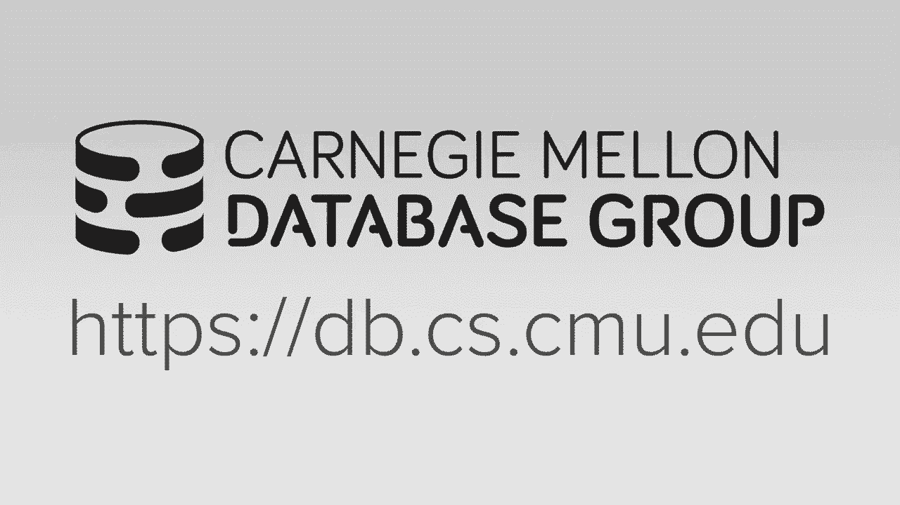
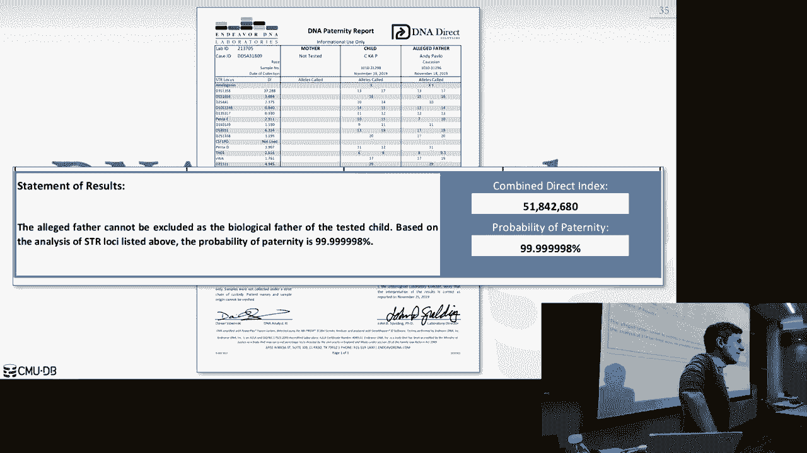

# 【双语字幕+资料下载】CMU 14-455 ｜ 数据库系统导论(2019·完整版) - P26：L26- 更多数据库系统杂烩（Facebook Scuba、MongoDB、CockroachDB） - ShowMeAI - BV1qf4y1J7mX

去吧。

所有的权利，上一节课，下雪了，呃，你把桌子掉了吗，谢谢。所以我注意到你今天没有你的甲板，发生了什么事，我记得，我怎么忘了给我的女朋友和礼物，是呀，你现在就得给她买礼物，是啊，是啊，但是我没有钱，是啊。

是啊，那么你是做什么的，我得翻转我的木板，你卖了你的甲板，是啊，是啊，但是呃，你要怎么，你现在怎么能放下节拍，呃，我得，我得做一些面包直到我能做，呃买一个新的，但这会干扰你的专辑，对呀，呃，是啊，是啊。

可能会延迟回来，就像你知道的，我是说，你什么都没有多久了，是啊，是啊，呃，在这里，所有的权利，所有的权利，嗯，他有他的问题，我们的数据库有问题，但这是最后一堂课，正如我所说，呃，这只是最后的审查。

然后是一个系统，你们投票的结果，为了你想谈的东西，嗯，所以只是真正的快，这个学期剩下的作业下周要交，十号，离得很远，什么时候，十号是什么时候，就是那个星期一，星期三，还差得远呢，对呀，所以星期二。

12月10日最后的项目和额外的学分都将到期，我们答应过你反馈，我们发现有人抄袭，所以我们得先解决这个问题，然后我们希望能够发布评论以获得反馈，为了里面的其他人，就像第二天左右，好的，所以我为延误道歉。

总体，他们很不错，有些比其他的好，很明显，嗯，但反馈会帮助你完成它，是呀，所以把我们的功劳，然后抄袭，所以你记得当你填写表格的时候，您必须单击复选框，是呀，我同意，我不会抄袭，他们，他们还在抄袭，是呀。

别得零分，嗯，最小的零，我去哪里和教务长说话，那是另一回事了，是啊，是啊，他们又看到我了，他们很认真地对待这件事，事实上，它让你检查，单击该复选框，它在视频中，说我说，不要抄袭，你没有任何证据，你不是。

你明白，不管是谁干的，是啊，是啊，是啊，是啊，然后期末考试就要到了，嗯，星期一，十二月之夜，实际上回到信贷，这就是为什么我们有，就像维基风格，我们有一个愿景，这样这个人就可以回去试着删除剽窃的文本。

但它还在数据库里，我们可以去看看，不管怎样，总是去看，再次，不是你，但是，一般来说，期末考试是在星期一下午5点30分，在波斯纳大厅，i，我想就在那边，旧的商学院，嗯是的，所以所以，我们先讨论这个，好的。

所以有什么关于额外学分或项目的问题吗，然后是家庭作业五，我们会在周五之前给它打分并发布，不管你知道什么，我想是昨天到期的，所以四天后，除非每个人都已经上交了，我们会把它发出去，好的，期末考试好吧。

所以你必须接受，或者你不必，但你应该，嗯，这还不是现场直播，但我下课后会把这个贴出来，这基本上是我所谈论的一切的总结，就像，和我期中考试时做的一样，就像所有东西的床单，你需要知道，书中的哪些章节。

什么家庭作业很重要，又是这样的事情，下午五点半波斯纳大厅，别到这个房间来，然后如果你好奇的话，你为什么要拿这个，除了你想通过这门课，你可以看那个视频好吧，那么你需要带什么，你应该带上你的CMU ID。

因为这是一个由95人和96人组成的班级，我不知道，我不认识每个人，所以我需要检查你的身份证，就像期中考试一样，一页手写的笔记，双面，不要缩小幻灯片，没有复制和粘贴文本，如果你在iPad上手写。

就不会打印出来，没关系，但又一次，没有像文字处理器上的文本那样的文本，如果你周一昨晚在班上，带上你额外的信用券，当你，呃，当你交卷的时候，所以你可选的东西，如果你中途想换衣服，两年前有人这么做了。

我没意见，因为现在是五点半，你可以带食物，我想他们会放弃糖果的，我会试着做些更好的事，但你不知道吗，我不能保证任何事，考试前不会有四道菜的大餐，什么不能再带了，我想我们在期中讨论了所有的问题。

两年前大家都带了奇怪的东西，再次，带室友来只是为了闲逛的人，别那样做，好吧，好吧，在我们进入，考试的课程材料，嗯是的，对不起，去吧，这就是PH的意思吗好吧，然后是的，不管那是什么，是呀，门房在哪儿，哦。

就是那边那个，是啊，是啊，如果不是盖茨，我不知道它在哪里，我实话实说，如果这是我第七年，嗯好吧，所以呃对，所以宣布，还有一些广场，我需要每个人填写课程评估，我不在乎，不管你说我是个糟糕的人，我卫生不好。

或者你讨厌对我有用的课，我你知道我真的读过这些东西，我在反馈中提到的是一个特别的家庭作业，你认为是不必要的或愚蠢的，以及关于项目，我是说，你已经看到我宣布的广场。

我们正在寻找能帮助进一步扩大公共汽车枢纽的人，你知道修复了所有的东西，也许这学期出了问题，但如果这个项目又有什么你认为太难的地方，节奏不对，您想要更多的文档，减少文件，你觉得这太容易了，又太用力了。

反馈对我来说真的很有用，所以本科生在填写课程评估方面很棒，就像如果你很臭，他们会告诉你，硕士生，你们这些家伙，你们在所有东西上点击五五五五五，他是最伟大的教授，我不想要这些，对呀。

就像我真的读到这个一样，大学显然读给，我不在乎他们，但我实际上让课程变得更好，根据你的反馈，对一年，一个孩子对我进行精神分析，反馈中的迈尔布里格斯测试很有用，嗯，所以再次，拜托你去想办法。

我会在广场上提醒你的，所有的权利，所以我星期一没有办公时间，但我有办公时间，额外的办公时间星期五下午三点半在我的办公室，然后我会有我正常的办公时间，考试那天一点半，如果你做不到这两个中的任何一个。

你很想和我说话，请给我发电子邮件，我会尽量安排，我可能得通过Skype或Hangouts来做，因为因为孩子的事，嗯，然后所有助教的正常办公时间将持续到9月14日，包括12月14日，对呀。

所以项目4的到期日是10号，但你又一次迟到了，所以它会走到14号，好的，对办公时间有什么问题吗？东西，所有的权利，所以这个每年都会出现，期中考试前你需要知道什么，所以考试不是累积的意义。

我不会特别问你关于缓冲池的问题，对呀，你知道吗，这项驱逐政策是如何运作的，但你显然需要知道，你知道这是数据库系统的一部分，我们已经把整个堆栈都盖完了，你需要知道所有这些不同的部分是如何协同工作的。

所以你必须从以前知道的事情，哈希表，b加上树木，短模型，然后输入查询并行性，它再次同时运行多个查询，你显然需要知道这是如何工作的，因为你要做交易，可以同时更新数据库，所以很明显我们不是在问你具体的问题。

就像期中考试前的家庭作业一样，但这是背景知识，你只是，你知道如果你已经忘了这个，你还有其他问题，好的好的，所以我们花时间谈论的主要事情是交易，对呀，你应该知道酸的基本概念是什么。

缩写中组合的不同属性是什么，以及数据系统应该提供什么，然后我们做了一个，我们谈到了冲突之间的区别，他们的生活是和视图的序列化，视图序列化数，没有人能真正做到这一点，所以没有办法真正检查这一点。

这只是一个更高层次的概念，但为了冲突，他们的生活能力，你想知道怎么检查这个吗，以及数据系统如何确保它生成一个时间表，因为你知道这肯定是冲突是可实现的，有一个可恢复的时间表意味着什么。

基本上意味着没有级联，中止，然后隔离水平，和异常对，肮脏的阅读，不可重复的读取和幻影，然后我们讨论并发协议，这些协议实际上是动态生成时间表的，对于冲突的任意事务是可实现的。

所以我们花了一整节课讨论两相锁定，所以你知道基本协议是什么，但是非严格和严格的区别是，有什么区别，什么是严格的两相锁定，在后面，是呀，谢谢马特，是啊，是啊，你在最后释放所有的锁是如此严格，没有收缩阶段。

一旦释放一个锁，就会有常规的两相锁定，那么你现在处于收缩阶段，你不能获得任何新锁，然后我们谈到了多个花岗岩，锁定右的多重多粒度，最重要的是意图锁，我如何通知，或，如何发布有关。

我要在锁层次结构的较低层做什么，在上层，所以我不必把我的锁所有的权利，如果我必须锁定，如果我想拿很多，我想更新十亿个元组，我的桌子有十亿个元组，我最好在桌子上拿一把锁，而不是锁定每一个单独的元组。

然后知道如何释放这些锁是很重要的，就像，按什么顺序是自上而下还是自下而上？然后我们花了一个讲座来讨论时间戳排序并发控制，所有的权利，所以你知道托马斯·赖特规则，是我们讨论过的基本协议。

然后我们花时间谈论乐观控制巨魔，什么是三个阶段阅读阶段，验证阶段和写入阶段，我们什么时候才能在这些不同的协议中获得事务的时间戳，在基本时间戳排序中，当你得到一个时间戳，当事务在乐观并发控制中启动时。

当你得到一个时间戳，当你验证的时候，是呀，当您完成阅读阶段时，然后我们讨论多版本并发巨魔，我不会再那么担心了，您将在NBCC中使用的并发协议，就像你正在做的，你知道吗，b两个pl或nb occ。

我更关心储藏室，和三角洲记录的顺序，只做钢笔，或者你在做时间旅行表，然后你想怎么做垃圾收集，然后我们花了很多时间讨论崩溃恢复问题，是呀，我只是想让你谈谈隔离级别，对呀，所以隔离水平又一次。

它是它是它是一种，最上面有可序列化的隔离，然后在下面你有可重复的阅读，下面您已阅读提交，下面是您未提交的阅读，所以基本上当你沿着等级制度往下走的时候，数据库系统没有强制。

或者保护你免受不同的和某些类型的异常，所以如果您是可序列化隔离的，那你就没有幻影了，你没有肮脏的阅读，你没有不可重复的读数，但如果你下到可重复读取，那你就不要做幻影检查了，如果你下去被承诺。

现在你没有在做什么，现在你在做什么，你不是在做不可重复的读取，然后读取未提交读取或读取未提交是没有保护的，是呀，所以这是一个快照隔离，其中一个，所以这个问题是快照这些级别中的一个。

快照隔离是一个奇怪的问题，它是，它几乎正交于，所以答案是否定的，它不在那个主要的等级制度中，如果你上高级班，我们将进一步讨论，但基本上是在1992年，当他们发明，当他们提出这些隔离水平的ANSI标准时。

那个应该仔细检查的人，另一个人没有仔细检查他们错过了快照隔离，所以在我们的Sasa隔离中可能会发生异常，不能发生的其他的，但是反标准不支持，你不用担心那个，配合反标准，如此可序列化，重复或阅读，改为。

承诺，未提交读取，改为未提交，是啊，是啊，快照隔离是一个，这不是一个直截了当的等级制度，这棵树实际上要复杂得多，但我们会在高级班讨论这个问题，如果你拿着那个，对于期末考试来说，反的都很好，对呀。

所以我们讨论了崩溃恢复，我们谈到了不同的河豚洞政策，钢与无钢，钢铁是什么意思，所以她说，所以钢铁政策意味着，允许数据系统写入脏记录，或者在没有窃取的情况下从未提交的事务中脏页取出磁盘，你不能那样做。

然后力与无力，所以除了宝琳娜，正确，所以她说，你得把所有的，你得把所有的记录都写出来，在交易被允许说它已经承诺之前，然后在没有力量的情况下，你不必那么做，所以在前方伐木，是用钢还是不用钢，不用钢。

不抱歉，这是用错了钢，对呀，因为就在前面记录，我必须确保与数据变化相对应的日志记录，数据页，日志记录了他们写了一个磁盘，在我的事务允许提交之前，但我被允许在以后的某个时候写下肮脏的记录，你知道的。

在已作出的交易之后，这意味着它也不是力，我们讨论了不同的伐木方案，我关心的主要区别是逻辑和物理，正确的物理是你实际上写出的，日志记录中更改到数据库系统的低级或字节，然后是逻辑日志记录。

您只是在编写一个高级命令来进行更改，所以喜欢续集查询，所以这些事情是有权衡的，所以如果我的查询要用逻辑日志更新十亿个元组，我所需要的只是在单个日志记录中的更新查询，那就是那就是。

这些信息足以让我记录在物理测井下所发生的变化，我必须有十亿个日志记录，对应于所有，我对每一个元组所做的更改，然后我们讨论了如何做检查站，所以你应该知道模糊和非模糊的区别。

模糊的意思是允许我写出不一致的数据，当我接受检查点时，到数据库系统或磁盘，但我需要知道当时在我的系统里发生了什么，当我通过检查站的时候，这样我康复后就可以和解了，在检查点期间可能或可能写了哪些页。

或者可能已经修改，为什么我要走检查站，就在非模糊检查点的情况下，他们基本上在短时间内停止了世界，当你把一切都写出来的时候，这样，您就可以保证有一个一致的检查点，然后我们讨论了如何在讲座中恢复区域，对呀。

这三个阶段是什么，就像分析一样，重做和撤消，所以你知道在日志里有多远，你需要查看这些阶段中的每一个，可能是对的，如果你知道补偿日志记录，你什么时候写的，你什么时候看的？如果我的日志中有一个补偿日志记录。

我应用它，但我在我之前崩溃了，你知道的，完成我的康复，当我第二次回来的时候，我需要为第一个做另一个CR吗，没有权利，因为你已经做了，COR有信息告诉你如何，如何撤消原始更新。

然后我们简要地讨论了分布式数据库，你知道我们显然不能深入到这一点，家庭作业涉及的内容是什么，这样您就可以了解我们讨论过的不同的系统体系结构，分享一切，分享这个共享记忆什么都不分享，这些有什么权衡。

什么时候一个会比另一个好，我们实际上要如何进行复制，在这些不同的环境中，分布式环境，我们如何确保数据库系统是容错的，如何确保进行更新的数据库系统是一致的，在所有数据副本中，我们如何再次进行分区。

高级的东西，你知道我们谈论哈希分区，它们有什么好处，如何实际找到所需的数据，然后两阶段提交，你知道吗，你知道在什么情况下你知道，在协议的不同阶段，你会做什么步骤，别担心帕克索斯。

对数据库的期末考试来说太难了，好的，那么关于期末考试有什么问题吗，为了增加交易的甜头，我忘了早点宣布这件事，如果你参加期末考试，当你上交的时候，我会给你一个胸围浴缸贴纸。

或者你可以把它放在你的笔记本电脑上，好的，1。我们有足够的食物，是呀，呃，的持续时间是多少，这个问题是，考试的持续时间是多少，就和期中考试一样了，但你有三个小时，总有人要花三个小时，是呀，你会答应的。

你的问题是会通过，是呀，当我发布评论指南时，我会以同样的方式发布一个，我在期中考试时做了，我会发一份练习考试，是呀，我们将能够谈论这些问题，将是我的选择，是呀，更容易打分，是呀，倒回去一张幻灯片。

我们为什么要区分力和钢呢？就像有没有一种情况，你没有力量，没有稳定的钢铁人好吧，所以他的问题是，我区分了力量和没有力量或者转向和没有钢铁，会有这样的情况吗，你想什么时候用一个左右不，我想你必须是一个。

你得像偷一样，没有力或没有钢力，对呀，我们谈到了影子寻呼，影子寻呼是一个没有钢铁力量的例子，因为我不被允许覆盖肮脏的页面，未提交交易，因为我在边上有这个影子副本，我在那里做所有的更新。

所以那是那是不偷的部分，然后第四部分是当我的交易去，使用影子分页提交，我得确保所有那些脏页都被刷新到磁盘上，然后我翻转指针，现在的根指针，你知道的，指向，老人，新的，影子变成了新主人，当我这么做的时候。

我必须确保所有的东西都已经冲洗过了，所以再一次，就在前面，伐木是钢的，没有力量，阴影寻呼是没有钢力的，然后主要的收获是红头伐木几乎总是，我想不出，也许有些情况下，我还没想过，几乎总是更好。

这是每个系统都使用的，是呀，中期，计算器，是呀，所以他的问题不像期中考试，我不需要计算器吗，我忘了强调是的，你不要，你不需要它，但又一次，想想我们在家庭作业中所做的，我们没有估计连接，我们没有，是啊。

是啊，我不认为它是那样的，不会有任何问题，像查询优化之类的东西，这是我唯一能想到的，你可能需要一个计算器，对呀，所以别担心，任何其他问题，是呀，都是，还有更多的问题，你知道，你知道。

像两个相位锁定的东西或层次结构，是呀，所以她的问题是，还有更多关于喜欢的问题吗，呃，多粒度锁定，所以在课本上，所有奇怪的问题，解决方案在线，我没看过，我还没看更新的版本，但可能会有一些问题，你可以看看。

然后你做奇怪的，你去数据库，像分贝，网上的链接，在课程网站上，就像DB图书公司，他们会有解决问题的办法，你可以跟着那些，我会在，最终审查网页，是的，有问题，你能把期中考试的笔记带来吗，一个骗子。

一本便宜的，无论你需要什么，好吧，这是我的，这可能是我最喜欢的讲座之一，嗯，他们都很好，但是嗯，因为你可以谈论更多的数据库，所有权利，所以再一次，我让班上的每个人投票选出他们最感兴趣的系统。

这是去年前十名的记录，蟑螂，分贝扳手和蒙戈德，这是我们今年的结局，这是非常令人惊讶的，先上来的是水肺，然后是芒果，然后是蟑螂，令人惊讶的是，这是我的，我想是五六年的教学，像这个教皇扳手一直是前三名。

所以我唯一能想到的是，为什么人们没有投票支持这个是因为名字变了，云扳手，对，也许人们不认为这是一回事，所以没关系，但是独家新闻是一个非常有趣的系统，所以我们先开始，好的，所有的权利，所以脸书的古巴。

我还注意到人们投票给，或者前面有公司的名字，比如亚马逊，极光，百度，海洋基地，那大家就多投那些东西啊，所以无论如何，所有的权利，脸书的水肺，所以说，你知道我们在系统里想做什么吗。

Potpourri是为了向你展示我们现在可以看到现实世界的系统，开始使用我们整个学期都在讨论的白话，有点，开始理解这件事到底做对了什么，所以现在我可以说这件事，哦，这是一个共享的。

没有什么可以用系统拍摄的，你知道这意味着什么，你知道这意味着什么，你知道表演角色，在这样的系统中遇到的性能挑战，所以水肺是一个内部数据库系统，Facebook已经努力了几年。

Now于2013年在BLDB首次宣布，他们还在努力，它是它不是开源的权利，实际上只是最近，现在有一些关于更新版本的公开信息吗，事实证明，因为真正领导这个项目的人是CMU，数据库明矾。

就像在我出现之前他在这里得到了他的PG，他现在经营着整个，本系统的运行开发，然后他的老板其实是一个，他的老板是另一个CS学生的母亲，在CS部门，他整个夏天都在公共汽车枢纽工作，所有的权利，所以这一切。

都是一个巨大的西米家族，所以水肺是一个，这是一个，它的意思是，它是为低延迟而设计的，内部公制数据的查询和摄取，从Facebook的不同服务中生成，对呀，所以这不是在运行OTP应用程序，这不是在运行。

它不像一个巨大的仓库，想想每次你在Facebook上点击一些东西，就在网站上，这导致服务器上调用一堆函数，你可以，他们可以让他们的开发人员仪器，这些函数调用来跟踪整个堆栈的性能指标。

然后所有的数据都被推到水肺上，现在他们可以使用这些数据，然后对这些数据进行查询，试图找出，你知道吗，为什么这个函数，你知道吗，跑慢点，有什么问题，我看到了，我庞大的舰队。

所以更新版本的水肺现在是一个专栏商店，嗯，它是一个分布式共享的无系统，它使用分层存储，只是意味着这只是意味着你可以有一个，你知道你可以有一个内存缓存，闪存缓存，然后可能是下面较慢的光盘，嗯。

然后它将使用异构，分层分布式体系结构，所以这个系统的一个有趣的地方是，因为他们试图拥有这个东西，非常快，您希望在大量数据上快速运行查询，他们不是他们会支持SQL，他们不会支持联接，我不支持全局排序。

因此只能编写访问单个表的查询，你有一个where条款，你知道一个简单的过滤，然后可以聚合聚合，它的另一个有趣的地方，这将不同于我们之前谈论的一切，他们会有，他们会有复制，对整个潜水集群进行冗余部署。

所以你会想，就像你有一堆机器，我把我所有的数据都发送到这个，这个这个集群，但我也要把它发送到其他集群，运行在不同的数据中心或不同的区域，但他们会考虑到这种环境中的损失和容错性。

因为他们收集的数据很有价值，但不像银行账户有价值，对呀，就像说，你知道你去点击你的时间线中的一些东西，在Facebook上生成了一堆性能度量数据，如果数据丢失，是啊，是啊，对呀，不是世界末日。

你知道我不想失去一切，但他们会允许，他们会容忍查询最终，你知道可能有假阴性或假阳性，因为他们最终会失踪，最终丢失的数据，所以他们试图避免的方式，即通过运行多个部署，他们会同时在不同的区域运行查询。

然后当他们得到结果时，它们查看哪个查询实际读取，已经，数量越少，丢失数据最少，然后用它作为正确的结果，但是如果他们丢失了一些数据，这没什么大不了的，实际上会，他们将实行留任政策。

其中您可以说存储在此表中的任何数据，你知道七天后就把它扔掉，和谁，因为谁在乎好吧，所以这里有，这是他们试图做的高层管道，所以您有不同的应用服务器，对呀，这些都在运行你知道的，运行网站。

运行所有的后端东西，你需要支持网站，所以这些人将生成结构化调试日志，所以把它想象成一个JSON文档，应用服务器吐出来说，你知道的，这是我在CPU上为这个功能和那个功能花了多少时间。

然后他们会把这个加载到他们开发的内部工具中，叫做抄写员，把这看作是卡夫卡式的东西，在那里你有一堆日志记录进来，然后你可以有一个酒吧子系统说，以下是如何对我收集的数据进行分类，这里是在其他系统中得到通知。

当新的信息到达它时，所以这是一个更古老的东西，因为它已经有十多年的历史了，GitHub上有一个开源版本，但那就像是十年前被遗弃的，所以据说这口井，内部版本比现在网上的要好得多，抄写员现在要把结构化日志。

看一些标签说，你知道它是为，你知道的，此特定应用程序类型或此服务，它会把它们结合起来，根据那个类别聚集在一起，然后它会把它们发送到这个流媒体平台，或者他们称之为泰勒服务，因为他们只是在跟踪日志。

这将把这些日志记录拼凑在一起，他们从抄写员那里得到的，然后当他们有足够大的一批，他们会把它转换成一个柱状数据文件，像拼花地板或兽人一样思考，我们上周谈到了，对呀，这东西就像一个独立的文件，几乎像CSV。

但它实际上是一个二进制列存储，所以如果他们有一大批，他们将生成这些列存储文件，然后现在他们要把这个喂进叶节点，在水肺中，所以我们将讨论聚合节点和叶节点，但这基本上是存储节点，把这看作是共享磁盘体系结构。

但你实际上可以有，你知道的，在这里运行查询或，但他们在底部有存储节点，实际上可以在下面进行过滤和谓词求值，这里有同样的想法，所以现在有一个，他们要做的另一件事是。

这些叶节点中的每一个都将更新这个验证服务，有关他们为每个表插入的元组数的信息，我们马上就能看到，这就是他们如何决定哪个，当他们在多个部署或多个群集上运行查询时，你会检查那个东西。

说有多少数据实际上丢失了，所以我知道我整理了一百万个元组，但我只读了大约五十万，所以我的一半数据又不见了，他们不是，他们不会抓狂的，在他们的环境中没问题，但他们一直在跟踪这个。

然后他们知道哪个查询产生的结果最准确，所以现在又是，这是一个续集系统，所以他们有一个，你知道这个，这个续集界面，或者这些人们可以在Facebook内部使用的仪表板，它将续集查询发送到此执行层。

然后将其发送到这些聚合器，然后他们会把它农场到这些叶节点上，所以我将在更多的幻灯片中讨论这个层次结构，但这是我们谈到的所有分布式数据库之间的一个重要区别，因为这是一个异构的环境。

所以叶节点在做独立或不同的事情，比聚合器节点正在做的事情，你显然有更多的这些，因为你有更多的数据，是呀，分类与问题相同，是类别，与属性相同，是呀，想到，就像，它是一些内部标签。

Facebook将其归因于一类特殊的日志记录，好吧，所以再说一遍，就像，我不知道Facebook的收件箱或信使对吧，所以你会说这是一个类别，所以信使应用程序的所有日志记录都会被组合在一起，好的。

所以再一次，这是一个头部使用架构，我们有叶节点，聚合器节点，所以叶节点将存储柱状，我们从，以柱状格式记录批处理，以及每个查询的，每个查询都将转到每个叶节点，因此，在该叶节点上可能没有查询所需的数据。

但它们不会存储任何额外的元数据，或维护这些叶节点上的任何索引，能够弄清楚我是否需要接触他们的数据，所以他们试图让这件事尽可能快，他们想让这个，就查询执行的速度而言，还包括摄取新数据的速度。

所以如果我不必维护任何元数据或目录信息，关于哪个数据是哪个叶节点，然后我可以很快地摄取新数据，然后每个查询都显示出来，扫描所有内容，然后这决定了你是否知道你有你真正需要的数据，这有道理吗。

就像我们谈论分区时，在我们谈论如何，我们会看到这个，蒙哥和蟑螂，他们会维持这个，这个状态表说，如果需要此范围或此哈希值范围内的数据，转到这些节点，他们不会有这些的，他们只是把一切都炸了。

每个查询都无处不在，所以聚合器节点，当他们得到一个查询，他们会把计划的碎片送到叶子上，它以叶节点显示，然后他们要在叶节点上做什么，他们要做扫描和一些基本的计算，但我会把结果发送到聚合器节点。

然后我们将组合来自多个叶节点的结果，产生一个单一的结果，然后将其发送到根节点，谁把最后的结果，所以这将允许他们很容易地扩展系统，因为我现在如果我的聚合器运行缓慢，我可以添加这些节点。

因为它们没有任何状态，那不是数据实际存储的地方，或者如果我需要缩放我的叶节点，我只是添加更多的这些，并保持我的聚合节点，但同样的，这是一个非常有趣的架构，出现在许多其他Facebook系统中，设计。

当他们开始MEM续集之前，他们把时间花在Facebook上，他们看到了这种建筑，然后他们复制了它或受到了它的启发，当他们离开MEM续集的时候，MEM续集也是这样，好的，所以再一次，我们谈过这个。

这种容忍丢失的数据是丢失的数据，因此，如果叶节点没有数据，或者它倒下了，它不能在超时内产生任何结果，然后他们就不理了，这没关系，他们使用验证服务来很好地计算，它做了多少数据，这个东西其实有。

这将决定查询的质量，查询结果，所以让我们看看结局是什么，整个管道看起来像，所以再一次，这是这是被认为是一勺簇，他们会，他们会，在不同的数据中心运行同类集群的多个实例，不同地区，他们将调用一个查询。

所有人同时，他们都得到同样的结果，你挑出哪一个是最好的，所以我的查询出现了，我想对崩溃的事件数量进行汇总，星期一又发生了撞车事故，所以我只能做单表查询，我可以做聚合，我可以做小组，我可以做过滤器。

我可以做扫描，但我不能做全球，全局排序，我不会做连接，所以根将获得查询，这将把它分解为查询计划片段，然后可以分发到聚合器，聚合将把它们分配到它们的叶节点，所有的叶节点现在都要进行扫描。

然后将结果发送回来，但让我们说，当我们执行这个查询时，这个节点向下，这是正确的，如果你，如果您有一个很大很大的集群，所以其他人还可以跑，其他人仍然能够为这个查询进行计算，然后他们将结果发送回聚合器。

再把它组合在一起，所以我在做会计，我想知道发生的事件的数量，这家伙说我有十个活动吗，他有二十个项目，所以这家伙只需要10加20，生了三十个，然后把它送到根部，根也做同样的事情。

只需添加来自不同聚合器的所有结果，然后产生最终的结果，所以这很清楚，是呀，所以查询的中断意味着将相同的查询发送到任何地方，所以我们不能使用任何信息来优化再说一遍的例子，如果查询只是获取所有内容，是呀。

那么房间对他们每个人的设置是正确的，所以这个查询是扫描所有正确的东西，所以没有再，没有元数据，没有目录可以告诉我任何关于，这些叶节点是否在我的，我有我的爪子，对呀，所以我不知道，但我不知道类型在哪里。

我不知道时间在哪里，所以我把它发给大家，所以每个人基本上都在这个例子中，每个人都会对它做完全相同的查询，在叶节点上好的，所以他在做计数明星的工作类型，它进入崩溃时间，他星期一去，他有十个。

他只是把它推了起来，这家伙很清楚，我在数数，所以我只需要把这些数字加起来，产生结果，是啊，是啊，所以你之前提到我们不保留任何元数据，是呀，对呀，那么对于任何查询，根总是将相同的查询复制到此问题。

对于每一个查询，你总是，将相同的查询复制到叶节点，否，因为平均来说，你做的方式，那是指望一笔钱，然后你把平均值放在顶部，这样就不一样了，所以真的没有一个喜欢的，因为没有连接，这里没有真正的查询优化器。

我只是想知道，我只是把续集转换成一个查询计划来推倒它，他们可能会做一些基本的启发式来弄清楚，就像，你知道如何把它拆散并送下来，跳跃节点，这就是为什么它既有根又有集合体，就像要连接的客户端一样。

或者在所有节点上随机聚合器和聚合器聚合，他的问题是为什么，为什么它决定在这里有一个根节点，让所有的客户都去这个，而不是让每个人都有可能去任何聚合器，然后任何聚合器都可以和其他人交谈。

我的理解是实际上有一个，上面有一层，以及他们进行任务控制的路线，所以他们可以做一些事情，比如，哦，如果一个查询，如果节点发送太多查询，如果客户端发送太多查询，也许想节流他们，或者喜欢。

如果我知道我从一些人那里得到了不好的数据，这些节点的一些集合，然后我可以让人决定排除什么，或者不将它们包括在我的查询执行中，所以它允许他们有一个单一的位置，对集群中发生的事情有一个全局的看法。

不知道数据库里有什么，对呀，因为这将是太昂贵的维护和保持新鲜的所有时间，它只知道这些节点表现得好或不好，是呀，呃，在这种情况下，我更喜欢九十，但如果在那个深根音符中有事件，我的结果不对，我也应该更多。

所以他的问题是假设这个节点有很多结果，很多都符合我的谓词，对我来说不是更好吗，只需中止此查询，因为我得到了我的计数，我很远，你怎么知道这个节点有所有的日期，有很多对您的查询很重要的数据。

我不知道你不知道，是啊，是啊，但在这种情况下，又是这样，所以想想这个设计是为了什么，这是为机器生成的日志而设计的，对呀，它不喜欢嘿，这是我的银行帐户，我希望那是，你知道的，你知道一分钱。

所以如果你得到露西，鹅的结果，那可能还是可以的，然后克服这一点的方法是通过验证服务，他们可以确定他们实际上没有读取多少数据，所以然后又一次，然后他们有一堆系统运行的冗余副本，同时。

他们都会产生相同的查询，所以每一个，每一个集群，那是水肺，对于单个查询，这个节点将完全失败，你确切地知道这个节点有这个数据失败是相当低的，所以这些集群中至少有一个会有更准确的结果，那是我们用的。

这和我们整个学期讲的完全不一样，这就是为什么我喜欢这个系统，因为就像我们现在说的永远不要丢失数据一样，我是说丢失数据是可以的，因为这就像如果树倒在树林里，周围没有人听，谁管这个节点下去了，也没有。

你知道吗，没有人知道，它关心上面到底有什么数据，有关系吗，因为他们不在，你知道吗，每次都跑木筏或帕克索斯，或者他们在更新数据，这东西跑得可真快，所有的权利，所以这只是我之前说过的总结，对呀。

所以对于每一次潜水部署，我有多重，在不同的地区有多个潜水部署，我们将在所有区域同时运行查询，然后他们回来，结果是，然后用来自验证服务的信息对结果进行注释，该信息表明有多少，有多少，有多少数据。

我最终读对了吗，你选择一个有，他们读取的数据最多，好的，所以我们知道经营这个的人是斯塔夫罗斯，他在2007年获得芝加哥商品交易所的博士学位。二千八，现在他负责这个，所以有什么问题吗，所有的权利，好东西。

所有的权利，所以让我问你们，我每年都问这个，你们为什么选了蒙哥，我想你选择了Facebook，因为你们中的一些人想在Facebook找到工作，你看你的想法就像我去面试，我可以聪明地谈论潜水，蒙戈也一样。

你想在蒙戈工作吗，还是要用芒果，有些人已经实习过了，有些人要去那里实习，1。我想跟他说的不太一样，这和我们平时做的很不一样，好的，所以我认识Mongodb的人很久了，联合创始人之一以前去了布朗大学。

我做了他，所以他喜欢，我们认识埃利奥特，自从，像两千九，当他刚开始这个系统的时候，他总是来那里的政务司做演讲，我八月份就在那里了，他们有一座新的办公大楼。他们以前就在时代广场的拐角处，太可怕了。

他们还在市中心，但他们有一栋漂亮的办公楼，所以你知道他们很重要，如果你在大楼外面有你公司的标志就在上面，上面写着，华纳音乐集团，他们有钱，蒙哥做得很好，都是为了数据库，这是他们的大厅，大堂不错。

看起来很眼熟，对呀，是啊，是啊，景色很美，这是厨房里的，我是说那是个阴天，呃，景色绝对是一流的，一次又一次，全部由数据库支付，太神奇了，所有的权利，那么什么是芒戈。

Mongo是一个分布式文档模型数据管理系统，所以当我说文件的时候，把JSON想象成一个JSON对象，嗯，在蒙戈布的世界里，我们整个学期讲的语言，所以再说一遍，不是说元组，他们说文件，而不是说桌子。

他们或亲戚，他们说收藏，但高层的概念还是一样的，这是我们最早的原作之一，没有续集系统，它是开源的，以前是GPL，但现在他们切换到服务器端公共许可证，这基本上是为了保护他们免受，亚马逊。

就像MongoDB变得如此受欢迎，他们担心亚马逊，在托管环境中运行MongoDB，并以比MongoDB更便宜的价格出售，所以他们现在换了驾照，亚马逊确实推出了一个克隆系统。

称为文档DB的MongoDB协议，但我对它工作原理的理解是，在被子下面只是Postgres，所以电线协议看起来和闻起来像，看起来像，看起来像MongoDB，但在它的下面只是Postgres。

所以要做一个集中的，与异构体系结构不共享任何内容，最初的配置，他们你知道，作为这个新的续集系统，他们不做交易，他们需要新的连接，他们没有拍续集，所以现在，在最新版本的Mongo中，他们会做交易吗。

他们带来了交易，他们也做连接，他们唯一没有带来的是续集，现在有一些黑客工具可以将续集转换为MongoDB查询，据我所知，我从来没有遇到过，任何在生产中运行这个和那些东西的人。

所以他们是如此的MongoDB会有自己的API，我马上就会显示出来，基本上就是编写JSON查询来读取JSON数据，所以关于文档数据模型的一个重要概念，这与我们整个学期都在谈论的完全不同。

关系模型中的这个去名化概念，我们会定义我们的表或定义我们的关系，我们会用外键说，从这个表到另一个表有一个引用，对所以如果再来一次，如果我的建模亚马逊是我的商店信息，所以我有顾客，顾客，命令和命令。

有订单项目，所以在关系数据库系统中，我会把这些定义为独立的关系，然后如果我想说对于一个给定的客户，把他们买的东西都给我，我得做三人行，把这三张桌子连接起来，没有续集，人们认为做这些连接会很贵，你知道。

因为现在你要运行你的哈希，加入嵌套循环，连接权，所以他们会争论什么，您希望在文档数据模型中执行的操作，就是将基本上所说的，将应用程序中单个实体的相关信息组合在一起，转换为单个JSON文档。

而不是在这种环境中，而不是有三张不同的桌子，你会有一张桌子叫顾客，然后在每个客户记录中嵌入他们的订单，然后在每个订单中嵌入他们的订单项，所以现在如果我想去拿安迪买的所有订单。

我去数据库系统拿我的客户记录，然后我现在就在JSON文档中遍历以获得我想要的，现在，MongoDB没有发明这个想法，那是个老主意，从70年代的XML数据库，在2000年初做的，九十年代末。

面向对象的人在20世纪80年代就这样做了，所以Mongodb并没有发明莫尼出名的东西，有一个你知道的快速分布式JSON数据库系统，就在网络账单和JavaScript变得突出的时候，所以它看起来就像这样。

在您的JSON文档中，将有一个名为Orders的数组，在里面，每个订单都有额外的JSON文档，决定每一个订单，您有一个订单项数组，然后他们买的所有东西，所以我们又一次和我们说话了，从性能的角度来看。

它们实际上是一流的，这是我真的很快，因为再一次，这是一个阅读去得到，你知道安迪的所有订单，坏事显然会是现在，我们将复制一系列关于这些不同定单项目的信息，一遍又一遍，我和现在我需要写我的应用程序代码。

以确保一切都是，是是是，我维护所有这些信息的完整性，所以如果我更改项目名称，我得写代码来检查我所有的内部，我所有的客户记录，并确保我更新一切，因此，您获取查询的方式是通过仅限JSON的查询API I。

他们没有查询优化器，至少不是在调用空间中，我们之前说过的一个，我想简短地谈到了这一点，当我们谈论查询优化时，所以他们基本上做的是你的查询显示，他们会为给定的查询生成各种可能的组合，然后每个节点都会爆炸。

该查询的不同组合，然后不管谁先回来，然后他们知道那是更好的使用，因为它回来得更快，因此，下次实际执行相同查询或类似查询时，他们只会重用他们以前生成的查询计划，他们可能会这样做一千次。

然后就在千次查询调用之后，他们会先把他们都炸出来，或者把他们都轰出去，看哪一个第一个回来，所以你可能会觉得这有点古怪，对呀，我花了两次时间讲课，谈谈基于查询成本的查询优化有多难，这个问题到底有多难。

他们选择这个是因为以前他们不做联合，所以你不用担心，联合订货，只是基本上是选择使用什么索引，所以随机漫步的方法实际上是有效的，我不认为他们为接头做任何复杂的事情，现在他们可能只是使用基本的启发式。

这个表或这个集合比这个小，所以是一个对一个，诗句是外在的，他们支持JavaScript，Uwe实际上没有谈论Uds，或者这个学期，嗯，它基本上就像一个函数，您可以写入在服务器端调用的查询。

他们现在支持联接，它们现在还支持多文档事务，尽管MongoDB的早期基准数据令人惊讶，就像你可以很快地把数据写进去一样，因为他们所做的是一个，他们没有做交易，他们并不保证任何东西都是写在磁盘上的。

当你得到回应的时候，你是对的，成功了，实际上更糟糕的是，如果数据库服务器得到了您的数据包，他们会立刻回来，当技术会说是的，我们得到了它，然后在以后的某个时候，它实际上会在记录的磁盘中执行。

所以如果你想看看你是不是对的，实际上是在磁盘上，但当你得到回应时，你不得不再次回去说嘿，做了我的权利，让它，你必须做两次来回的旅行来看看你的权利是否真的成功了，这在很长一段时间里都是默认的。

所以如果你看看MongoDB的早期基准数据，他们是惊人的，呃，然后两千一十三或者两千一十二，他们真的把它关掉了，它现在不再是默认的，他们实际上在做右头日志，我们一会儿再谈。

它们支持跨多台机器的多文档事务，令人印象深刻，做得很好并不容易，所以系统架构，我想我们以前已经谈过了，这是一个头球天才，分布式组件不共享任何内容，集中式查询路由器，他们在做主从复制。

您可以从一个主节点或主分区获得权限，或者碎片会变成其他碎片，所以我认为MongoDB在早期非常成功的部分原因，他们真的支持自动分片吗，所以想法就在这里，就像你开始把数据塞进数据库一样。

我和你知道它会分布在多个节点上，但如果其中一个节点太满，MongoDB会自动移动您的数据来平衡事情，它并不总是这样工作的，人们认为这会奏效，但你知道，回到2010年我去硅谷的时候，你问像这样的人。

你知道的，哦，他们正在创业，他们是基于MongoDB的，你问他为什么，也许会说，哦，因为自动切分对他们来说是件大事，因为你知道，在最开始的时候，大多数人没有太多的数据，因为你是，你知道你是个创业公司。

你有一个愚蠢的推特应用程序，没人用它，你可以在一台机器上运行，但当然没有人创业，以为他们会失败，每件事都是每个人都认为他们会成为大人物，所以我当然需要，你知道将来有二十台机器。

所以我想确保MongoDB能和我一起扩大规模，当时使用MySQL和Postgres以及其他关系数据库，你不能那样做，所以我认为这是一件大事，但是有一个著名的Foursquare中断。

如果你知道四平方是怎么想的，就像嗯，怎么形容这个，这是一个应用程序，你可以查看你在哪个位置，它还在附近，但这不是那种，不是每个人都用的手机应用程序，但是他们用的是MongoDB，有一个著名的像。

你知道多天停电，因为自动分片的东西卡住了，这又是建筑，我们之前谈过这个，我们有不同类型的节点类型，我们有路由器，我们有配置服务器，我们有一个碎片，所以来自应用程序的每个查询都会转到路由器，路由器说，哦。

我知道，我想查一下ID一，零一，但我不知道那在哪里，所以我去配置服务器，到配置服务器告诉我，它在碎片表中看起来，它说你想要的数据是它定位了这个节点，所以现在路由器知道如何将查询发送到正确的位置。

或者它可以把它炸给他们所有人，所以再一次，这是潜水材料之间的一个重要区别，我们在这里谈论的是，水肺没有这个分区或分片表，它向MongoDB中的每个人发送查询，因为你不想浪费资源。

因为您正试图运行更新查询，对于你的网站，你很快，您维护这些信息以准确地确定查询需要去哪里，所以你只接触数据，你只是碰了一个节点，它有你需要的确切数据，所以一个问题是在路由器上缓存，是呀。

这样你就不必总是这么做了，但这将是，这被认为是无国籍的，所以如果我撞车了，我回来了，我刚刚又从这里得到了我的缓存版本，但是任何更新都要喜欢，如果我说我在做自动分片的事情，我添加了一个新节点。

或者我把一些数据移到另一个东西上，我更新这个东西，这是作为交易完成的，的起源，这是什么来历，你什么意思，就像弄清楚，哦，命名，哦，我想漫画的意思是巨大的，仅此而已，这是对的，某某这就像，实际上S。

我不知道那是什么，但像我倒过来，我不知道不，是啊，是啊，是这个恶魔还是数据，可能只是恶魔和蒙哥问，我不知道那是什么意思，我不知道S的意思，所以我在这学期说的另一件事是，永远不要在你的数据库中使用MF。

嗯，蒙哥刚出来的时候，他们用MF作为数据库，我们实际上对地图数据库系统做了一点研究，在我看来，我们还没有出版这本书，使用mmap的MongoDB实现，可能是我们见过的最复杂的，这可能是最好的一个。

但还是很烂，还是不好对吧，所以基本上发生的是他们使用地图的方式，就是，他们会有一个，他们基本上会在内存中维护数据库的多个副本，你对这个进行更新，就像私人副本一样，然后读取磁盘。

然后你必须重播日志来更新主副本的类型，所以操作系统可以随时交换东西，对他们来说，这是一个很大的步伐，他们的另一个大问题是数据库只有一个锁，现在，这并不完全是因为他们使用了M地图。

但我想这可能有助于让事情变得更容易，使用M映射，这意味着在整个数据库系统中，即使您可能在多台机器上拆分，在MongoDB的早期版本中，您一次只能在整个集群中使用一个写入器，所以如果我有20台机器。

我有一个查询，我基本上锁定了所有20台机器，对其中一台进行更新，然后在较新版本的Mongo中，从第三版开始，他们把这个处理掉了，所以他们最终做的是，他们买了这个。

这个名为Wire Tiger的存储引擎启动，它是由一个家伙创建的，发明伯克利DB的人之一，伯克利数据库是一个嵌入式数据库，为什么目标是嵌入式数据库，我们真的没有谈论太多这一点，但是嗯波斯特雷斯。

我的续集，这些都是像，作为独立恶魔或独立系统运行，您有多个客户端连接它们，sequel lite通常用作嵌入式数据库，您将其嵌入到应用程序中，它为您提供数据库功能，但是当您的应用程序关闭时，数据库关闭。

所以有线老虎有点像续集灯，但它不支持续集，它支持键值存储API，可能是很长时间以来最好的收购之一，他们买了铁丝虎，他们用铁丝老虎引擎取代了结束地图的东西，所以当你跑的时候当你跑的时候。

现在默认情况下你得到了电线老虎引擎，它是它是惊人的，问题是肯定的，这个问题是，如果使用地图如此复杂，你为什么要用这个，我又不能，我想从科学上证明这一点，我还不能，所以把一切都拿走，我这样说是我的观点。

M地图就像一个诱惑者，对呀，就像，是看起来很性感的东西，为您提供缓冲池管理器所需的内容，不用做就对了，因为操作系统为你做了，你不需要驱逐政策，操作系统就是这么做的，你不需要担心传呼，你知道的。

跟踪肮脏的页面和像OS这样的东西，所以这个东西看起来像，它会给你你想要的一切，但就像你实际上需要额外的5%，实际上使它耐用和安全，那时所有的问题都来了，就像它有点像查询优化器，而不是轴承和查询优化器。

让我们做一些真正简单的事情，把所有东西都炸掉，看看有什么先回来，所以不是缓冲池管理器，我将使用操作系统的缓冲池缓存，或者mmap缓存可能没有意识到这很重要，让我们把那个离线，他们我是说埃利奥特。

我是说我是个很聪明的人，我是联合创始人，我取得了巨大的成功，对呀，就像它是一家上市公司，对呀，呃，我想你知道，使用M映射，虽然它在，嗯，你会造成问题，当你真正开始尝试扩大规模，扩大规模，锤打系统。

它允许您快速构建一个系统，所以与其花六个月的时间开发缓冲管理器，那是，你知道吗，安全和事务性，诸如此类的东西只需使用这些操作系统，你知道吗，和地图，然后当他们有足够的顾客，他们有足够的钱。

他们买了铁丝虎，做对了，我的续集也是这样，好吧，麦克，我们没有用地图，因为我不认为我喜欢我的续集与NDB是惊人的，DB太棒了，它是，它是一个坚实的数据库引擎，存储引擎，他们原来用的引擎是我的iam。

那东西一直丢失数据，对呀，你有腐败，所以，但它让我的续集很快就开始运行了，很多人都在用它，最终它出现了我的续集买下了它们并开始使用它，对于数据库来说，这并不是一个非常罕见的策略，商务，所有的权利。

让我们做一个演示，所以我要告诉你的是半非法的，关于Mongo有什么问题吗，是呀，为什么你可能，为什么你想用Mongo，相反，这个问题是，你为什么要用Mongo而不是其他人。

所以我认为作为一个分布式架构很重要，文档模型实际上更适合应用程序开发，对呀，当你写Python代码时想着你，你写Java代码，你在写一个对象，是一种面向对象的编程语言，所以它有点。

如果您现在可以将对象写成JSON文档，然后把它放进戴维斯，然后把它拿回来，重新实例化您的应用程序代码，这可能会更快，但我要强调的是，虽然没有关于MongoDB在做什么，因为它是文档数据库系统。

这和我们整个学期讲的都不一样钢丝轮胎，不知道它实际上被用于文档数据库系统，它就在前面，伐木，它在做我们正在做的所有崩溃恢复的事情，它在暗地里做交易，就像我们说的那样。

所以文档模型中没有关于无效或更改的内容，我们今天在这里谈论的任何事情，都在应用层面，对呀，这都是客户级别的，查询是什么样子的，查询实际上要做什么，下面的内容是我们整个学期讨论的内容，一个问题是做。

他们使用特殊的压缩技术，所以这将是在有线老虎，我想这只是爽快，是啊，是啊，是呀，那么这是否意味着，如果我能再次表达我的数据，的，旧版本的，用户名，默认用户名，密码测试测试，已经不是那样了，好的。

所有的权利，所以我们最后一个，我们还剩十分钟，是公鸡，其实，夏天我也在那里，所以当我去蒙戈分贝和蟑螂分贝，他们的总部设在纽约市。所以当我出去看蟑螂的时候，或者我同时拜访他们两个的任何东西。

这是他们以前的办公室，他们给蟑螂做了一个很好的像素艺术，我其实这又是，这是他们的新办公室，虽然，我很惊讶它到底有多大，我给了一个游戏，我在那里做了一次演讲，他们刚刚筹集了500万美元作为C轮。

这对一家数据库公司来说是一大笔钱，所以这实际上是非常令人印象深刻的，你怎么知道，我想这意味着他们做得很好，所以这很好，所有的权利，所以Cocrodb在2015年由一些前谷歌员工发起，他们是。

我认为错误地描述为扳手的开源版本，来自谷歌扳手，我想他们从来没有说过人们把这归因于他们，我不会说那是真的，蟑螂数据库是核心架构，与扳手和扳手有根本的不同，有一个神奇的东西，别人没有，蟑螂没有。

没有其他人这样做是一个分散的共享，无同构系统架构，他们将进行范围划分，他们将要使用的内部存储引擎是RockSDB，所以同样的问题是为什么会有人想很好地使用m映射，我的回答是，因为你不必自己建造那件作品。

所以蟑螂，他们想花时间写一个存储管理器，就像你知道MongoDB的铁丝老虎片一样，所以很多新的数据库系统初创公司，他们用的是rocksdb或level db，这些嵌入式存储引擎。

这样他们就不用担心从磁盘读写数据了，他们担心更高层次的部分，比如，你知道的，在分布式环境中管理事务，所以他们将用乐观的方式进行多虚拟控制，你知道乐观并发控制协议，我知道这仍然是真的。

但它们只支持可序列化的快照隔离，所以我不认为他们支持，其他隔离级别，他们也说Postgres电线协议，这意味着如果您有一个现有的Postgres应用程序，你可以在理论上把它指向蟑螂分贝。

它指向波斯特雷斯，现在您将数据迁移到蟑螂DB，你不必潜在地改变任何续集，并不是所有的事情都是如此，就像有些事情是不同的，像自动增量键，但总的来说，它正在迁移到蟑螂分贝。

从Postgres是一个不应该是业主的东西，所以在它的核心，蟑螂GB是我们事务性属性的分布式键值，键值存储，这意味着系统的下存储引擎，而RockSDB是一个关键的价值体系，但他们进行交易的方式。

或者他们管理，跨多台机器的数据库本质上只是一个键值存储，所以用它，现在他们可以在上面构建层，以提供完整的续集兼容性，你想要的权利，所以一旦你过去了，就像续集查询显示的那样，然后他们可以转换续集查询。

查询计划本质上是一堆键值API调用，然后可以从不同的节点读写数据，所以他们协调更新的方式，整个系统都在使用筏子，筏子基本上是在一个很高的水平上，和帕克索斯一样，这是一个共识协议，允许我说。

当我进行更新并且我想跨多台机器提交事务时，每个人都会同意，或者法定人数必须同意，允许进行或发生的更新，为了进行这笔交易，能够承诺，所以他们要做的事情，OCC是通过使用时间戳，正在使用所谓的混合时钟。

所以我想我谈了一点，或者当我们谈论并发控制时间时讨论这个，我们需要一种方法来拥有一个时钟，我们可以识别每笔交易，时钟需要一直在增加，所以我们知道什么事务以可序列化的顺序作为执行，什么交易先于另一笔交易。

所以你可以用物理时钟，这是从实际的CPU中知道的，就像机器本身，系统时间是多少，但那个的问题是，那是不能保证的，跨多台机器高度同步，每台电脑都有一个时钟，那个钟不是超级超级精确，它不像原子钟，对。

那将是，你知道的，计数从原子发出的电子，会是某种石英晶体的东西，它必须近似，所以现在你可以有一堆歪斜和你的时钟，所以现在可能发生的是，你知道的，一个节点上的事务上升，它认为这是一个又一个的时间戳。

节点上的事务上升，它认为它的时间戳一，现在我有一个冲突，我有我有一个是的，必须解决的冲突，所以他们处理的方式，那是通过混合时钟，您仍然可以使用系统时钟来获取当前时间，但你也使用逻辑时钟。

它允许您进行全局有序的事务，而不必每次都同步，所以基本上它就像一个小日历，上面写着，你知道这是我当前的时间戳，我只是我的机器会在逻辑计数器中添加一个来增加它，那么会发生什么，又在OCC下。

交易将上演他所有的权利，系统说这些是修改，我想问是的问题，怎么样，他的问题是，混合时钟和谷歌旋转时钟有什么不同，谷歌扳手钟不是谷歌，所以真相，我怎么会在扳手里得到太多，谷歌扳手依赖于，呃，类似海港钟。

在所有机器上同步超级精确的时间，真正的时间API给你一个多长时间的界限，你得等着有人带着更低的时间戳出现，这是一种方式，基本上这就像，这就像真正的时间，但只使用软件，所以如果你有很糟糕的时钟漂移。

像这台机器比另一台机器晚一个小时，任何事务都不可能有完整的，因为你每笔交易都会想到过去的团队，在未来被搞砸，所以你，你必须确保你的时钟保持同步，像NTP扳手，不是扳手做的，你知道GPS吗。

卫星加上原子钟，他们有超级细粒度的欢闹，所有的权利，所以呃又不同于水肺，关于数据存在位置的所有元数据，事务状态是什么，那将会，这也存在于我们自己的键值存储中，这都被认为是事务性的。

让我们看一个简单的例子，所以我们的申请来了，什么可能更新这个集群中的数据，所以又不同于水肺，我们维护一个分区表，就像一个怪物，跟踪哪个节点负责什么范围的数据，嗯，所以当我的查询出现时。

我首先要咨询的是我的是这个分区表，它实际上会在每台机器上复制，并说，我想访问密钥或ID等于50，什么机器，什么节点是那个的领导者，然后在这种情况下，是这个家伙，所以现在我的右边要到这里来做我的更新。

然后更新必须传播到其他节点，然后我们用筏子让每个人都同意，我们将继续进行这笔交易，所以他们不使用两阶段提交，而是使用筏子，所以现在如果我现在想做，我读过这个，这个ID等于150，嗯。

我总是去找这家伙所在的领导，尽管我在不同的节点上有多个数据副本，理论上我可以在其他节点读取，但我总是想在LIT上阅读，以确保我读得最多，你知道它最一致或最新的版本。

因为可能这些其他节点还没有看到最新更新，因为你在木筏上，你只需要法定人数，你不需要有一个不同的每个节点度，你知道两个阶段让每个人，这个你总是需要法定人数，所以某个节点可能在后面，但您仍然被允许提交事务。

所以为了处理所有的阅读总是会去任何，并避免每次查询，转到此到一个节点，这就是为什么我们有这个桌子在这里，告诉我们谁是老大，我们将把它分布在多个节点上，所以客人，这样读数就可以分散在多台机器上，再次。

它只是在做共识协议，复制的，我们在本学期谈到的复制权利，硬的，所以核心概念不是任何，不会让你心潮澎湃吧，与我们已经讨论过的没有显著的不同，困难的部分是让它真正工作的工程，这就是你所知道的。

这就是他们花所有时间来实现的，这样你就没有，你知道的，丢失权限或丢失更新，诸如此类的事情，所有的权利，所以让我们完成，所以呃，希望我在整个学期都传达了我喜欢数据库，他们太棒了，你要打他。

你会在你的余生中打击他们，所以希望这门课为你们提供了什么，是说的能力，你知道的，我们的应用程序中有些东西运行缓慢，因为这是数据库，我运行的是什么样的数据库系统，我的数据是什么样子的，我的查询是什么。

看起来它可以让你对这些系统的工作方式做出明智的决定，你是否知道，您正在为给定的应用程序或工作负载环境选择正确的数据库系统，因为不是每个人都会去建立一个数据库系统，但我向你保证，无论你做什么。

尤其是如果你不呆在科技领域，你会遇到数据库，就像Excel是一个数据库，如果您使用Excel，您使用的是数据库，所以，我还想说的另一件事，我也是，那非常重要的是。

我将避免在决定使用什么数据系统时过早进行优化，总是从一些，就是，也许它正好满足你现在的需要，也不用担心，你知道的，可能扩展到，你知道的，未来数百万用户，但这是我的MongoDB例子，大家都说，哦。

我的创业将是巨大的，我没有一百万顾客，当然，我想分发一个可以很好地扩展的数据库，否，一开始你可能只需要在一个盒子上使用Postgres或我的续集，那会让你，你知道的，也许在接下来的两年里，这就足够了。

也许你会买一些更好的硬件，并随着您的域的增加而扩展更多，但不要担心带来分布式系统，因为这会带来更多的复杂性，你现在可能需要，你应该专注于是什么让你的应用程序，你知道你的申请成功需要什么。

所以人们经常问我应该从什么数据库系统开始，如果我正在构建新的应用程序，我的兴趣，Postgres或我的续集，你知道的，99%的应用程序都足够好，因为会发生的是，如果您的应用程序确实崩溃了。

并且您确实有很多客户，你要吃什么，现在你可以付钱让我来告诉你如何扩展你的数据库，对还是我的一个学生对，所以避免引入新的复杂性，你知道的，过度使用数据库系统，也许你不需要喜欢。

也许从亚马逊RDS开始是个不错的选择，然后你就扩大规模，买一个更大的即时尺寸，您可以根据您的数据大小添加，或者你的需求增长，好的，有什么问题吗？是呀，嘣，好的，所有的权利，所以说，所以呃。

我确实得到了一个得到了一个，上周我的测试结果出来了，嗯，就是这里了，所以呃，我是孩子父亲的概率是九十九，点，九九九，九，九，九，百分之八，所以有一点，零，零，零，零，百分之二，可能不是我的。

但在这一点上，我接受了我的脚，这绝对是我的孩子，好的，呃，是啊不，它是耶。

所有的权利，是啊，它是我的，所有的权利，所有的权利，好了伙计们，全部，所以星期一期末考试时见，然后我周五有办公时间，然后又是，这是最后一个带有DJ拖放表的类，所以再一次，为他鼓掌，和轮胎在一起，恩瑟。

好的，嗨伙计们，保重，祝我们好运，你的课，哦亲爱的，和米歇尔在一起。

并感谢这个案子，给我，说不是在破碎的螺栓和压碎的混合中，孩子们，让健身房里的奶牛，或者在我的系统中，敲开另一个，我很幸运，我们去拿下一个，然后克服的对象是停留，所以在沙发上玩，最好下来什么。

我们不要压力太大，我们永远做不到，瑞奇，说果冻，去熟食店买船，一个天生受祝福的人，是呀，我的说唱就像激光束，灌木丛中的子弹，不是在食堂，开一瓶同样的，i，那些不喜欢喝它的人只对你说话，你不能开车。

但还活着的人，如果同样，不知道你的全部痛苦。