# 【双语字幕+资料下载】CMU 14-455 ｜ 数据库系统导论(2019·完整版) - P2：L2- 高级SQL - ShowMeAI - BV1qf4y1J7mX

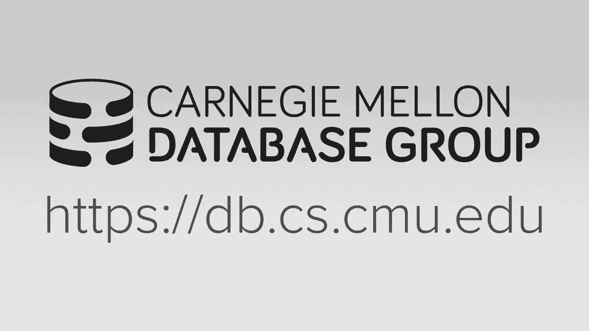

so it's Wednesday night fights over Mack，banged Oakland so is the other guy I。

decided that rather than me filming the，second lecture all over again in a motel。

room I just that it would be better just，to show you guys what I did in 2018。

because that was front of a live，audience and I felt that I did it I，myself。

so with that that's why I'm just really，showing the 2018 lecture here for the。

second lecture and then when then we'll，be heading back to CMU and then starting。

Wednesday next week we'll have live。

lectures again so take care today's，lecture is on advance sequel and by。

advance I mean going beyond what you may，or may not already know about basic。

sequel right it's it's 2018 sequel was，invented in 1973 I imagine most you have。

seen some sequel throughout your life so，I don't feel it's necessary to teach you。

the basics of it so I'm gonna spend time，actually talking about the more。

complicated or interesting things you，can do with sequel Hey so just to pick。

up where we left last class we were，discussing the relational model and。

relational algebra and we sort of，mentioned that the with relational，algebra。

Cerreta the goal was sort of at a high，level to describe what the answer we。

wanted that the theater system would，compute rather than the exact steps of。

actually how to do it all right so the，way to think about this is like say we。

want to sort our data if we have to tell，the day system exactly what to do we。

have to provide it you know with the，quick sort of bubble sort algorithm but。

with a high level language or，declarative language would you say hey。

we want you to sort this we don't care，how you actually do it but this is the。

answer that we want and we'll see this，throughout today's lecture and then。

going forward throughout later in the，semester this is one of the advantages。

of using something like Secord or，declarative languages we don't have to，things。

it can figure it out on its own and that，frees it up to figure out what the most。

optimal way it is to actually execute，the query that you want to execute based。

on the data that you have and and it's a，harbor that's available to you so we'll。

see this later when we talk about the，query optimizer but the query optimizer。

is this complicated piece of machinery，inside of a database system that's gonna。

take our sequel query and convert it to，the most efficient plan and we'll cover。

how they actually do this later on but I，will say is that if you if you you know。

if you get involved in doing research on，query optimization or just help you know。

working on Cori optimizers you can get a，job yesterday because this is the one。

thing that all my friends at Davis，company companies email me about open。

over again do I have any students a new，query optimization but has some and they。

all get off go off and do awesome jobs，this is the one thing that everybody。

wants because it's really hard to do so，that's not the focus here right just in。

the back your mind will see examples as，we go along where a query optimizer。

could try out different things to try to，come up with different plans well we'll。

discuss how you actually do query，optimization later on so the the history。

of sequel as I said goes back into the，early 1970s so you may notice that I say，sequel。

some people say SQL write the part of，the reason I say sequel is because in。

not that I was alive in 1970s but the，original name of the language was。

actually spelled out as EQ UAL sequel，and this was invented by IBM as part of。

the system our project right so it stood，for the structured English query。

language so if you remember from the TED，Cod paper I said that tena Ted Cobb was。

a mathematician right he devised that，relational algebra and relational model。

but he didn't actually define the，programming language you would use to。

write queries on it right you can't，write queries using relational algebra。

right it's sort of you know there's，there's no it's very difficult to write。

that in the keyboard to do that he did，later define or come up with his own。

query language called alpha but that was，much later in 1970s so back then when。

people said hey there's a relational，model idea we should actually try to。

build a system to do this people had to，come up with their own language that。

could implement relational calculus or，relational algebra so at IBM they came，out with sequel。

this is part of the system our project，which is a sort of one of the first。

relational database systems that people，were trying to build in the 1970s the。

other major one was ingress that came，out of Berkeley so you've ever heard of，Postgres right。

Postgres was invented by the same guy，that did ingress so it's called Postgres。

as in post ingress the thing that came，after ingress so the ingress guys had。

their own language called quell and this，Stormbreaker，he claims it was much better than sequel。

and the IBM guys didn't know what they，were doing of course most people have。

never heard a quell right I said it，didn't actually win IBM won so back then。

again it was spelled out as eqtl IBM，later got sued for I think you know。

copyright infringement trademark，infringement there was some guy in。

England that had the the term sequel，spelt out in the full English word for。

his programming language so it is，shortened it to be sq SQL so what。

happened was the reason why we use，sequel today because IBM it's not back。

then iBM is and what it is now right，everyone thinks the bate the big tech。

companies like Microsoft Amazon and，Google back in the 1970s 1980s IBM was。

was the juggernaut so essentially，whatever IBM did or said this is the way。

we're gonna do it that ended up being，the standard so when IBM first released。

their first commercial relational，database system db2 so they never。

actually released system or was just，sort of a research prototype but then。

then finally made db2 or at least that，db2 supported sequel so that essentially。

became the standard and the reason why，Oracle sort of took off and got as big。

as it is today is they were sort of，copying what IBM was doing in the 1970s。

in more ways than one we could talk to，her that later and they did they had。

sequel so when IBM came out with db2 and，had sequel Oracle was right at the right。

place at the right time said we now，supports we know we support sequel - so。

it became an ANSI standard in 1986 and，became an international standard in 1987。

and now the short burden just means the，structured query language so sequel even。

though it's from 1970s it's not a dead，language it's not certainly static it's，keep。

new specifications every so often it's，the same thing in sequel every so often。

there's a new specification where they，add in new features and new。

functionalities to to the basic language，so the the latest standard is defined in。

sequel 2016 and you can see over the，years at the add new versions they add。

new features right so 2016 they added，JSON polymorphic tables they add XML。

stuff and then 2003 1999 added regex and，triggers typically what happens is。

there's a standards body that the，members are all from the major database。

companies and the major database，companies come up with their own。

proprietary features and extensions and，then they go in the standards body and。

push to try to get their version of，certain functionality as part of the。

standard right so this is although there，is a sequel standard nobody actually。

follows it to the T right because，everyone sort of has their own。

proprietary things that got invented，before the standard came out said this。

is how you should do things so if you're，gonna claim that your database system。

supports sequel the bare minimum you，need to have is actually what is defined。

in the sequel 92 standard so this is，what the basic sequel that we know about。

today select insert update delete create，tables transactions things like that all。

that's defined in sequel 92 so again if，someone someone says their data system。

supports equal chances are they that，really mean this and then the more。

advanced databases both an open source，and and the commercial ones they add。

they have a bunch of more features from，from from the newer standards and then。

there's this great website here it's a，bit dated now but it's going at its some。

random dude who basically looked at sort，of the top four top five database。

systems and just look to see how they，differ on various sequel features it。

compares sequel functionalities and，we'll see this as we go through today。

there'll be some examples where the，standard says one thing different。

database systems do other things it's，usually my sequel and this is just an。

even though there's a standard nobody，actually follows it exactly right。

there's no database system that I'm，aware of that would claim that they're。

you know certify for sequel 2016 right，they have bits and pieces of things。

so sequel itself technically is not a，single language it's sort of a。

collection of things in a particular，it's a collection of a DML DDL and DCL。

commands so DML will be would be the，datum innovation language would be the。

commands like insert update delete，selects like the things that actually。

manipulate the data that you can store，in your database the DDL is the way you。

create tables actually define schemas to，actually store things and then the DCL。

is the way you sort of do security，authorization to grant you know who's。

allowed to read what you put what data，there's a bunch of other things like how。

to define views how to define integrity，to be strange referential constraints as。

well as transactions these are all part，of the umbrella of sequel right and。

within that there's these different，categories of commands so the one。

important thing that I want to point out，here and we'll see this throughout。

today's lecture is unlike in relational，algebra which is based on set theory or。

sets sequel is actually based on bag，algebra so the way it sort of thing。

about this you could have like lists，sets or bags so a list can have。

duplicates but there's there's a defined，orders if I push something to my list。

that's its position in that list a set，is unordered meaning the elements don't。

have a position but you can't have，duplicates if I try to insert the same。

thing into a set it just gets over the，old run gets overwritten a bag has。

neither a set position or ordering but，it also allows for duplicates right and。

we'll see why we've got to do this as we，go along because if we want to actually。

define order on our elements or if you，want to make sure that we don't have。

duplicates essentially the database，system has to do extra work to to。

provide that for you and so the idea is，that only if you explicitly ask the。

database system to provide you ordering，and provide you to remove duplicates it。

won't actually do it and this actually，make things be a be more efficient all。

right so the outline for today is we're，going to cover aggregations group bys a。

bunch of operations on strings dates and，times then we had to do output control。

and then the more complicated things，have been nested queries common table。

expressions and window functions so for，homework one you'll need to use all of。

these except for the window functions，like it's gonna be doing homework one on。

sequel light and only actually the，latest version of sequel light as of。

last week just added support for window，functions but everything else sequel。

light should be able to support okay all，right so for this we're needs a sample。

database comprised of three tables so，sort of it's a mock University so we're。

gonna have a student table where，students have student IDs names logs and。

GPS will have a course table with course，IDs a name and then we'll have an enroll。

table where we have a certain foreign，key reference from the student table and。

the course table and along with the，grade that the student got in the class。

all right we'll use this as our running，example as we go along all right so the。

first thing we talk about our，aggregations right and these are pretty。

simple to understand it's basically a，function that you define in the output。

list of your select statement that's，going to take as input multiple tuples a。

set of tuples and it's gonna compute，some kind of aggregation on top of that。

and produced a single result right so，the sequel 92 standard defines average。

min max sum and count and again think of，this is like in case of count you're。

gonna take a bag of tuples as the input，and you're gonna count the number of。

tuples there are and that you're a，produces a single output that has that。

that count right it's again so this is，what's in the basic standard the the。

later version of the standard and in，other database systems they'll have。

other things like median mode standard，deviation right in the github different。

aggregates and some of them actually，that allow you to find your own。

aggregations as well so let's look an，example like this right so say we want。

to discount the number of students in，this student table where the login ends。

with at CS I'll cover what like is means，later on but essentially it's just。

looking for a wild card here right so，the first thing the most important thing。

to remember about aggregations is that，the aggregation can only appear in the。

output list of the select statement，right so I have it here in the in this。

it's saying this is I want to produce at，the output I can't have it in these in。

these other parts here right cuz it，doesn't really make sense right because。

you're computing aggregation after，you've sort of applied a filter to。

figure out what tuples actually match，your where clause but the same point out。

here is that in case of count again we，just want to count the number of tuples。

the login field here doesn't actually，mean anything right because we're just。

counting the number of tuples it doesn't，matter whether you know what the login。

actually is at the point after we do the，filtering so we can rewrite this just to。

have a star right the star is a special，you know special keyword in sequel the。

basically says all attributes for the，tuple begin go even further and say we。

can actually replace the star with a one，right count the number of tuples by just。

adding one every single time right so，this is a good example where we have。

three different queries that all produce，or semantically the same to produce the。

same result but the data besom could，could choose different flavours or。

different variations of this in order to，derive that answer and some of them may。

have different performance differences，this one's pretty simple so the most。

differences would be smart to realize I，don't need a copy around the login here。

I can just replace that with a one right，most of them will do that but from what。

complicating things it may not always，work we actually can combine the。

aggregate multiple a grits together in a，single query so say for this one we want。

to get the number of students and their，average GPA where their login ends with。

at CS right so now you see I've combined，it average GPA and count in my output。

output list for my select statement and，then it'll produce my my result like。

that right pretty straightforward I can，also add the distinct keyword to tell it。

to only count the distinct elements or，values of attributes for for my tuples。

so this is saying count the number of，unique students with unique logins from。

the student table where the login ends，with at CS right and so I had the。

distinct side of account now this one's，sort of nonsensical to some way。

because presumably no two students can，have the same login you know login。

account otherwise you'd have problems，but in other cases you know you can。

apply the same kind of thing for other，scenarios and it would work the way you。

wanted to work in this case here we，produce the same result so the one thing。

that now you want to may want to try to，start doing is now that I'm start doing。

aggregations I want to get additional，information about my data outside of。

just what I'm computing in my aggregate，right so say that I want to I want to。

get the average GPA of the students that，are rolled in the course and I want to。

know what that course ID was right so in，this case here I've now added the course。

ID to my output list outside of my，aggregation right didn't take a guess。

what would happen here would this work，or not raise your hand you think would。

work raise your hand if you think it，wouldn't work see of you why correct yes。

so Judy said is there's not a single，course ID for all my tuples that are。

competing my average align right it's，all the students are taking all the。

different classes what course ID to，actually put is the output right it's。

the sequel standard say this is actually，undefined and in most systems you。

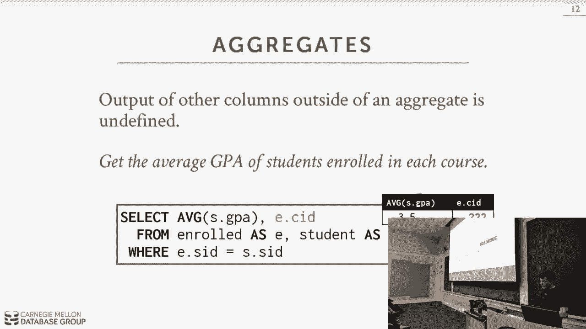

actually will get an error with this we，can actually test this right so in this。

there we go I have three three terminal，setup all right so this is running a。

machine back in my office I have three，panels the top one is Postgres the。

bottom one or the middle one is my，seagull and the bottom one is seagull。

it's as much easier for you to type from，right okay so the query was we wanted to。

select where was it，just get the average GPA of students，enrolled in each course。

right so select average sgpa eCourse ID，from enrolled as a student as s where。

eise to deny d equals a student ID right，so Postgres says you can't do this。

because as he said the course ID and I'm，highlighting here so you can't see it so。

the course ID is not defined it's not，part of the aggregation right so it。

doesn't know which course ID you，actually want so now if we go down and。

try this in my sequel my seagull gave us，an answer right but is that correct no。

right because because what course ID do，the pick I picked a random one right and。

then now we can try in sequel Lite same，thing sequel Lite gave us a different。

course ID so you see they both competed，the correct average but they chose。

different course ID all right and just，because I know that my seagull guys。

watch these videos and complain I will，say that so this is running my sequel in。

and so my sequel traditionally allowed，you to do loosey goosey things like this。

right so this would be running it what，they would call it traditional mode but。

you can set the sequel mode to be more，strict so now if I run that same query。

it throws the same air that Postgres did，so by default the least my sequel 5。7。

when now throw errors in older versions。

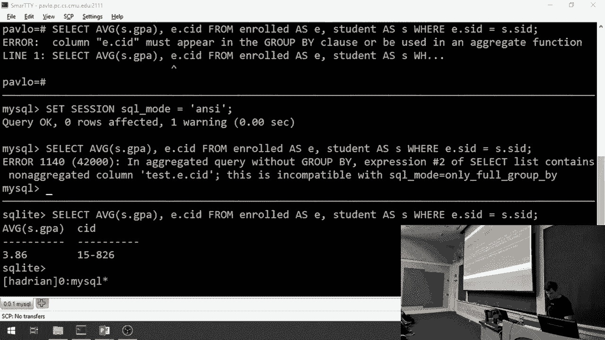

they didn't do that right okay，so a way to fix this is to do goodbye。

so with group I what's gonna happen is，now we're gonna define how we want to。

essentially buck it together the tuples，in our output based on one attribute and。

then now we can then compute the，aggregation，on the tuples in each bucket right so。

again what I wanted to do was get the，average GPA per course if I add now in。

my group by clause I add the the course，ID what will happen is when I first。

execute the query this is essentially，what I would see after the join but now。

with the group by clause I'll combine，together the the two posts based on the。

course ID and then for each of these now，I'll compute my aggregate right and now。

I can group them by course ID and that，corresponds to the buckets are generated。

from before right so we have to use，group I if we want to extract。

information about the aggregations we're，computing right and so just like before。

any time we have a attribute that we，won't appear in our output select clause。

it has to appear in the group ID，so here the student name we're trying to。

throw that in in our output Clause it，won't work because it has to be in our，group I'd calls。

now this one is sorted to get，nonsensical it's technically correct。

sequel it produced a result but from a，human standpoint we know doesn't mean。

anything good well like what does it，mean to group by course ID and then the。

student name to compute the average GPA，right the student's GPA is gonna be。

their GPA okay so now you may think，alright well maybe I want to do them。

with some more some additional filtering，all my aggregations so that I don't look。

at you know I don't produce every single，result as part of the output so you may。

think that you out want to put it，use the aggregations in your where。

clause so here now I'm now I'm computing，every GPA but I'm added in my where。

clause something that says filter out，anything where the GPA is is not you，know greater than 3。

9 this is look only，trying to look at the courses with，average GPA is greater than 3。9 right so。

this doesn't work because in our，can't access anything in our。

aggregations in our where clause because，we don't have them yet in our where。

clause right so again the way to think，about this is the where clause is。

filtering tuples as we go along and，after we do our filtering then we can。

actually then computer aggregation so we，can't compute we can't use an。

aggregation to filter tuples because we，haven't computed the aggregation yet。

right so the way to get around this is，to use the having clause it's。

essentially like a where clause but now，you can reference anything in your。

output list so I've taken my average GPA，and I've aliased it to AVG GPA and I can。

publish that down on here and this will，produce the answer that I want right。

computes the aggregation is just like，before and then it applies additional。

filtering on it so now not in this，example but there's other examples where。

you can do sort of certain optimizations，in the system based on what you know is。

in your having clause again this is the，great thing about declarative language。

you know everything all ahead of time，what the you know what the programmer。

the person wants in their answer so you，can use hints about what you knows could。

come later in the query plan to help you，do certain refinements or reduce the。

amount of work you have to do as you run，the query so instead of using average。

GPA say I wanted to do account where the，number of tuples are less than some you。

know first each group less than some，value so as I'm going along as I'm。

computing my aggregate if I then，recognize that oh my having Clause says。

filter anything less than ten two pools，if not if I now hit tuple number eleven。

for a group I know that I never need to，count anything else for that for that。

tuples that come later because it'll，never pass that having falls so I can。

just throw away those tuples as I go，along because it's wasted work right if。

you're writing this in a procedural，language like Python all right well you。

had to write these steps but it's you，know by by yourself the you know the。

Davidson is not going to know what's，gonna come later on because it can't。

peek ahead right but in a declarative，language like C code we can do that so。

the next thing we want to talk about is，how to handle strings，so this is a table that sort of。

summarizes the the different variations，of how strings are handled in different。

database systems so the the sequel，standard specced says that all strings。

like some varchars chars text fields，they have to be case sensitive and the。

way you declare them is with single，quotes and most systems follow this。

right the red herrings of the oddballs，are both my sequel and sequel light so。

in sigil light the strings are sensitive，but you can have both single and double。

double quotes - to mark them in my，sequel it's case insensitive and you can。

use either single or double quotes now，my problem is that when I started using。

database systems back in like 2000 I was，using my single three and it's like it's。

like you know ingrained in my memory to，just use double quotes because that's。

what we use back then so I'm always had，to correct myself every time I switch。

over another native system to go always，go back and use single quotes my Seco。

again has the mode you can say to follow，the stand it'll get better and they then。

enforce the single quote requirement but，I think by default you don't get that。

right so in the siegel standards say you，want to take the name you want to take。

the name of kanye and have it matched，with kanye with you know mixed case in。

in in the single standard you had the，upper case using the upper you know the。

upper function to make this match work，and my sequel you don't have to do that。

right because all all the strings are，matching or case insensitive now I。

showed this before how to do light，clause but I think it's a lies you do。

the first string matching alright so，like is basically doing you know trying。

to match some wild card in your string，with with with another string so for。

whatever reason instead of using star，like most other things they use the。

print a % so % means any one or more，strings and then the underscore means。

exactly match one character alright so，say I want to get all the course or the。

all the course IDs from the role table，that start with，tene 215 445 721 I would use the the。

amperes the % like that and say if I，want to get all the students where the。

the login ends with at C and then some，wild card I will use a single underscore。

for that so the seagull standard also，defines a bunch of string functions。

there's a again the standard things you，would expect like substring upper lower。

trim or these are all part of the sequel，9q standards and move systems will have。

this but of course there will be a bunch，of other stuff that are proprietary in。

each different database system so the，thing to point out unlike aggregation。

functions with string functions and you，know mathematical functions and date。

functions they can appear anywhere in，the in your in your queries so they can。

be in the Select output list it can be，in your predicate s-- alright they don't。

always have to be in the in the select，portion they can mean you're having。

clauses so here we have you know the，first guy first query is gonna take the。

name and take a substring and just get，just get the first five characters and。

then the second one we did is to show，before of doing matching where the the。

uppercase version of the student name is，begins with Kay kan so again string。

functions are for the most part the，basic ones will be pretty much。

standardized across all systems where，things get weird as when you want to。

start doing a concatenation so the Seco，standard says that you use two double。

bars to concatenate two strings together，and most systems follow this in my。

opinion I would say Postgres in Oracle，probably followed the sequel standard。

the best out of all the systems sequel，server and db2 are probably next single。

light then probably my sequel is the，worst so you want to say to concatenate。

the student name and add es to it do use，double bar in the sequel standard in。

sequel server from Microsoft you use the，plus sign in my sequel they don't have a。

plus sign they don't have the double bar，they only have this concat function were。

you basically defined as the input，parameters the things you want to。

concatenate together they have something，else that's kind of weird to where you，can actually。

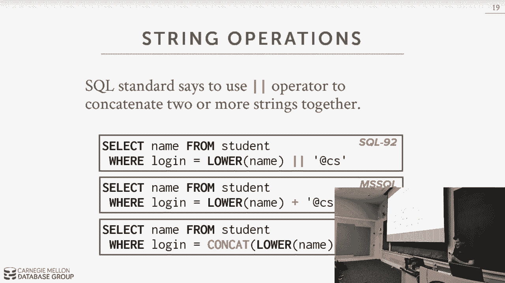

if you don't put anything between two，string literals that'll concatenate them。

together so to show you what I mean by，that so here we have my Siegel so I can。

do something like this a n dy space PA，VLO right nobody else does this as far。

as I know let me double check that，before I lie to you，let's try it in huh yeah toka first。

Chris doesn't like it，sequel server doesn't like it either。

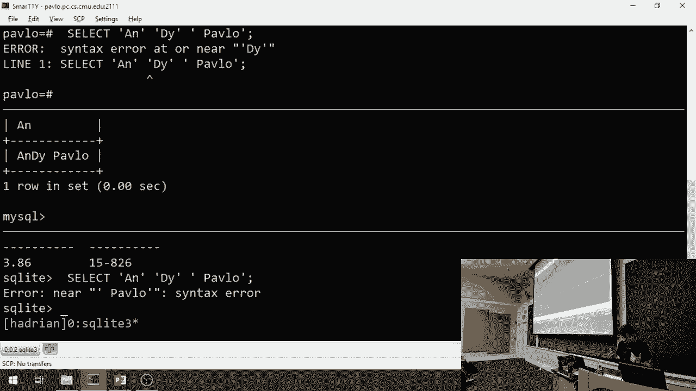

right only my sequel does that all right，so now we're things get really really。

bad is when you have date and time，functions right so a date basically you。

can just records the timestamp without，the time timestamp is is the time now。

they vary on the granularity of the time，they may be tracking sometimes in。

seconds sometimes it's in milliseconds，or something even more fine-grain than，that。

but where things get get wonky is how，you actually start manipulating them and。

extracting them extracting information，from them right and so the syntax for。

all these different systems can can can，vary wildly so for this example we want。

to do is I want to show you how to do，what I consider a seemingly easy。

function or easy operation get the，number of days from today to since the。

beginning of the year and we'll see how，to try to do this and on these three。

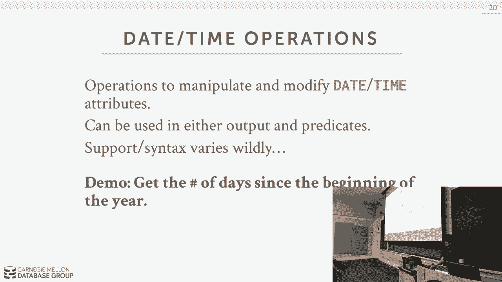

different systems okay so the first，thing is that we want to get maybe what。

I just kill my wife I okay back okay all，right so the seco standard defines a now。

function can everyone see that or now in，the back guys can you see it okay cool。

so you call now and it gives you the，current timestamp so we can do that in。

in my sequel and we can do this in，sequel light what you can't do in a。

single vibe all right all right so，there's another way to do this。

they have another function called a，current timestamp right except Postgres。

doesn't have it but they had the keyword，current time Stan my sequel has the。

function and it has the keyword all，right single lane who says it has the。

function raise your hand so who says it，says it has the keyword all right it's。

mixed all right they don't have the，function they have a keyword all right。

again simple thing like what's the，current time，it varies all right so now again what we。

want to do is we want to count the，number of days since the since the。

beginning of the year all right so as a，building block what we can try to do is。

maybe just get what the number of days，is from from today so in this query what。

I'm doing is I'm taking a date listed，here's a string right so I'm taking the。

string for today's date and converting，it into a date and then I have the。

extract function which will extract out，the the day field of the date right so。

as expected you get you get 29 all right，we can try that in the and the other。

guys it gives you 29 they don't have it，all right，so but now we can see that like alright。

well if I can if I can cast a string for，the date into a date what happens if I。

just subtract them right I said I'll，take today's date and subtract the it。

from the date from the beginning of the，year and in Postgres we get it 240 days。

all right my sequel 728 I don't know，what that means right like it's not like。

240 times 2 or some you know some，multiple there right it's it's a number。

right it ran but it's not what we want，right so now let's try it in in sequel。

light sequel like give us 0 okay so it，works in Postgres and now we gotta。

figure how to do this in my sequel well，so what we can do is we we try to。

extract the the day from so maybe we，take what we'd bet 728 we had before。

right and we extract the day from and，see what that means all right it came。

back with 28 so that's not really what，we want so the way to do it actually is。

a bit complicated what we're gonna do is，we're going to convert the dates into。

UNIX timestamp which is the number of，seconds since the unit's to epoch which。

is like some Jan refers 1970 right and，now we're gonna have the number of。

seconds from from the current date，number seconds since beginning the day。

we subtract them right and that gives us，the number of seconds between now and。

the beginning of the year and then we're，gonna divide that by 60 seconds times 60。

minutes times 24 days right we got 240，all right，turns out though after I did this the。

first time there's actually even easier，way in my sequel they have a simple。

function called date div and that，produces you know the same answer all，right。

sico light uh-huh for Brianna I think，let me try make this a little bigger。

there go in single light they don't have，date if you can't subtract age with each。

other the the way I figured out to do it，was convert the current timestamp into。

the to the Julian calendar which is the，number of days since 437 be sore for。

4370 BC and so you subtract the more，days since that time it's the number。

days beginning the year and you get，roughly 240 right all right and we can。

cast it to an int and we get 240 right，so these are three super super widely。

used database systems that all differ on，some basic functionality of doing date。

and time right actually a quick show of，hands who think of these three ones。

which one you think is the most popular，miss widely deployed database system。

raise your hand you think my sequel，about a quarter raise your hand think。

Postgres even less Radian think seagull，light even less the answer sequel light。

so a few years ago we had Richard hippie，invent our sequel light so see the light。

is amazing it's written by three dudes，right there they is he approximate that。

it's been deployed on 10 billion devices，everyone here who has a cell phone right。

that isn't a flip phone or an old person，phone is running sequel light on it。

right now right a lot of desktop，applications like Photoshop and。

illustrator they run sequel light on the，inside right sequel light is everywhere。

he said that also to every single AOL CD，if you know what that is all right back。

in the early 2000s when the internet was，sort of new in the u。s。 there was。

company called America Online and they，would every mail everyone CDs for ten。

hours free on the internet right every，CD that they mailed out you know。

hundreds of millions of them had sequel，light running on it right sequel a is。

most widely deployed David，everywhere and here's the most crazy。

part it's public domain he gives it away，for free right I mean Postgres and my。

Segal are open-source but like Haytham，oh my sequel Oracle owns it all Co owns。

the copyright there's no copyright on。

sequel Lite right it's an amazing piece，of software okay alright so again the。

main takeaway here was that simple，things are hard to do because there's no。

stamp you know there's no standard way，to do things even though there is a。

standard Tessa fication all right so now，maybe what you want to do is instead of。

having the you know in my examples I had，the terminal open every time I ran a。

query that the output got printed back，to me and my terminal but maybe what you。

want to do is keep all the data you you，you generate from a query keep that。

inside the database system so you can，use it in subsequent queries right this。

is way more efficient if your if your if，your queries generating a lot of output。

you don't have everything sitting down，to your laptop and then push it back up。

to do more queries on it so you can do，output redirection to tell it to say hey。

don't print it out to me write it out to，this location，so one thing you do is you can take the。

output or query and you can write it，into another table right and so you in。

the sequel standard you can use into and，this will actually will create the table。

for you on the fly so whatever is，produces the output of the query right。

again this is declarative the data，system already knows what the schema is。

of the table so it knows in this case，here what the type is that this output。

is going to be so he knows how to define，a table that has that it can handle。

those types right so into basically，takes the output to select and writes it。

into a table and in my sequel you have，to use the create table and then inside。

of it you define your Select statement，you can also have it output data into an。

existing table and for this you use，insert into which looks a lot like we。

created into the create table from from，before and then instead of having the。

value Clause you actually just have a，select statement just to tell it hey get。

this data aren't right into here so the，important thing about this example。

versus the previous slide this is about，writing tables in two tuples in two。

tables that already exist so that means，that whatever the whatever。

to type the number attributes and their，types that are produced by the Select。

statement whatever table you're writing，it into has to match that right if the。

the Select statement has 44 columns and，your table you're writing into as three。

the days and we'll throw in air it says，I can't write into that because it the。

Astros don't match up now where things，get weird is when you start having。

constraints that are on the table you're，trying to write into and the Select。

statement actually violates those，constraints so let's say that I have a。

primary key on my table it says I can't，have any duplicate student IDs and then。

my insert query here tries to start and，start inserting duplicates some database。

system will throw an error immediately，as soon as it sees a duplicate and no。

tuples get written some of them will，just keep going and ignore the ones that。

that failed other ones will will insert，the ones that succeeded and just ignore。

the ones that failed or maybe just crash，right away right so again the seco。

standard says this is the syntax it to，use but how all the systems actually。

addition to output redirection we can，also do output control remember I said。

the beginning Seco is based on bag，algebra I mean it's unordered but。

there's many times where you want the，ordering in your output Clause and so to。

do this you add the order by clause I，have seen is basically specifying how to。

sort the results that are being，generated by by this query so in this。

example here I'm gonna sort the tuple，started sort of the tuple main role。

table based on their grade and by，default even though I don't specify。

whether I wanted ascending and or，descending the default and sequel is。

that you get ascending now you get，output like this but I also can add。

additional attributes to my order by，clause do more complicated things so in。

this case here I want to do my order by，by grade in descending order and then。

after that I sort them based on the，student ID in ascending order right and。

I would get output like this now the，important thing to point out here also。

too is that unlike there in the group by，clause，where any attribute that I wanted my。

output list had to appear in the group，by clause in order by you don't have。

that restriction right it actually goes，both ways in this case here I'm sorting。

by the grade but the grade isn't part of，the output right it doesn't matter right。

and it knows how to how to how to find，the data that it needs as its processing。

the query and do whatever sorting，operation that you want to do on it I。

can also do more complicated things I，can put any arbitrary expression in my。

order by Clause as well so I can do，order by 1 plus 1 right and that's still。

another common thing you want to do is，is limit the number of tuples that are。

produced in your output right and of，course there's a there's a limit clause。

for this he basically specifies says I，for all the results that you of Mike my。

query only provide me back some number，of them like 10 right and this is very。

common for things like you know say like，search results you'll see it show just。

10 and then you click the next button to，go see the next 10 all right this is。

being controlled by it by limit and，actually all set so limit just says。

limit the number of tuples all set is，going to tell you that and what all set。

of the number of the tuples you're，producing as your output should you skip。

before you start figuring out how many，you should limit right again if you。

think of a webpage to show you ten，results you click Next to see the next。

10 they're using a limit with an all set，to make that work now because it's。

unsorted again is no guarantee that when，you click Next if you're using offset。

you're going to see you definitely gonna，see different tuples because that's。

another invocation of the query and the，results may be different in different。

order the second time so in this case，here you would combine that with an。

order by Clause so that you're，guaranteed to go you know see the first。

10 followed by the second 10 and so，forth right，and there's optimizations you can apply。

whether you're not you have an order by，Clause if you have a limit Clause so if。

I don't have an order by clause and I，have a limit I know that as soon as I。

see sent 10 to polls I'm done I don't，need to go look at anything else if you。

have an order by then you have to sort，you have to see everything ahead of time，and your。

set ice again I considered that somewhat，basic sequel in previous years I。

actually skipped all this but I I think，it's a portent maybe to go go over it a。

little bit cuz you have to understand，this for the homework but now we want to。

talk about more complicated things this，is what I would consider advance sequel。

so the first thing I want to talk about，is is nested queries so the way anything。

about nested query it's basically，allowing you to specify queries inside。

of queries right and you can take the，output of one query and use that as the。

input of another query all right so a，simple example like this I'm doing a。

select I want to get all the names of，the students that are enrolled in least。

one course so I have my outer query is，defined based on the student table and。

then the side of that I have inner query，that's and it's gonna get the student。

IDs from the role table right so we，could write this as a join this is sort。

of sudden another way to actually do，this and in actuality when it comes time。

to actually implement this inside the，system most query optimizer will try to。

rewrite this as a join right because it，the worst way to actually execute this。

is to essentially have two for loops，where you loop over every single tuple。

in the student table and for every，single two but you then reimpose the。

same query over and over and over again，my sequel used to do this the more。

primitive Davian systems you should do，this but the the right way to do is。

actually just rewrite this as a join，alright so you can sort of think of this。

inner query as like a function that's，can produce some set of tuples as your。

output and then you can apply whatever，predicate you want on that in the outer。

query so we'll walk through a bunch of，examples of this and see how it works。

so the alright so the first example I，want to if maybe I want to get the names。

of all the students exist in that，enrolled in 15 for 45 so the way to。

construct a nested query is I think it's，always important to start maybe with the。

outer query and think about what's the，actual answer you want to produce like。

what are the actual attributes you what，you want to see and then you worry about。

how you're actually going to filter them，and get what you want so the outer query。

we know that we want the name from the，student table and then where we get。

those values we'll figure it out，so in the inner query we can write it in。

as English as the student ID，and the set of people about take 4：15，4：

45 right so for that part we know how，to write that query pretty easily right。

we just feel throw out all the tuples，some enroll table or the course IDE goes。

15 for 45 so now the question is how do，we combine them with the the outer query。

with the inner query again we can，rewrite this as very easily with the。

join but for our purposes here we want，to see how to do it as a nested function。

so for this we can use the in operator，and we do a matching on the student。

student ID so a way to now read this is，that the for every single student in the，student table。

so this first student ID is matching up，with a student table I want to see。

whether there's a match of that student，ID in the set of all student IDs that。

are in the role table that take the，course 15 for 45 so we exit the inner。

query we produce the set of all student，IDs and then for every single tuple in。

the outer query we check to see whether，it exists in that set right now this。

visit shows you why I was saying before，the stupid way to execute this is for。

every single tuple in the outer query we，execute the inner query over and over。

again like that's stupid because we only，need to produce the inner query once and。

then we can reuse it for every single，tuple and in the outer query so I show。

it how to in the Attic see if I used in，those other operators you can use so all。

basically says that every single tuple，that's in my inner query must must。

satisfy my predicate any means at least，one of them needs to alright so in is。

essentially the same thing as equals any，is there any tuple that it equals what。

my predicate or about my tuple attribute，is checking and then exists says at。

least one rows returned and actually I，don't care where that matches I just。

care what to see whether to ball got，produces as a result so we can rewrite。

our example for getting all the students，in 15 for 45 like this right instead of。

using in we say equals ending so now you，read this as the student ID from the。

student table check to see，whether it equals any tuple that exists。

in the set of student IDs that are，produced by from from the enroll table。

right now the inner key the nested，queries don't have to only appear in the。

where clause they actually can appear，anywhere right so I can rewrite the same。

query like this where now I have my，nested query in the output of the Select。

statement so this is a good example this，is essentially reversing what I did。

before in terms of what tables are going，to access so now the way to read this is。

that for every single tuple in the，enroll table where the course ID equals。

15 45 15 4 45 I'm gonna then do a，matchup in this student table where the。

student IDs are the same right there's，essentially doing a join inside my。

output of my select statement right，because now this d'un ID is being。

referenced here from the student table，and that student ID is being referenced。

in there okay there's another good，example again I essentially reversing。

the order of how I process my tables，right and they produce the exact same。

result but they may have different，performance characteristics based on。

what my data actually looks like it may，be the case that this is actually faster。

to go through the enroll table first，instead of the student table and。

therefore we could rewrite it if we，wanted to to choose one versus the other。

and a good optimizer could do this for，you okay all right let's look at。

something any more complicated now，alright say we want to find the student。

record with the highest ID that enrolled，in least one course right seems pretty。

simple but let's think we actually do，this so the first approximation would be。

something like this select the max，student ID along with the student name。

from from the join and rolled and，student table where the student ID in。

the role table equals the student ID in，the student table will this work why why。

what's that yeah there's an aggregation，function without a group I and we're。

referencing a column that's not in the，aggregation right。

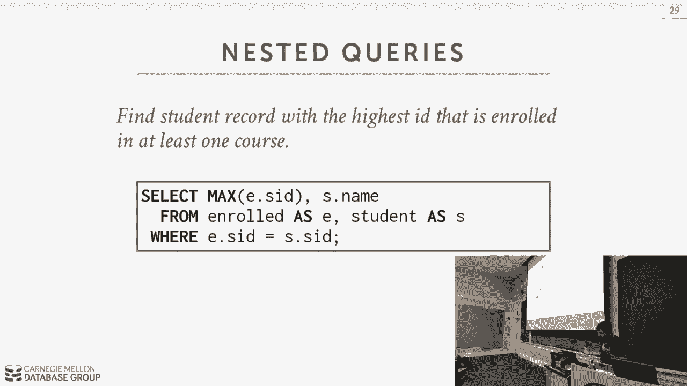

so again sequel standard says that this，shouldn't work let's find out alright so。

again we have I gotta disconnect first，cuss at the top so we've run our query。

here again Postgres and here's the，standard it says get as exactly as he。

said so you have student ID student name，appears but it's not a part of a group I。

same thing it produces that error but if，we now run it in what they call。

traditional mode right so older versions，of my sequel would do this now we run。

this query and we get an answer right，we had the Mac student ID and then we。

say that the name best student is Tupac，all right let's try it in sequel Lite。

run one it produced an answer it also，produces 53 688 as the next to 90 but it。

says the that student belongs to Justin，Bieber right and actually I don't know。

yeah so justin bieber is the right one，right whereas my sequel make sure i'm。

giving you the same data right Tupac is。

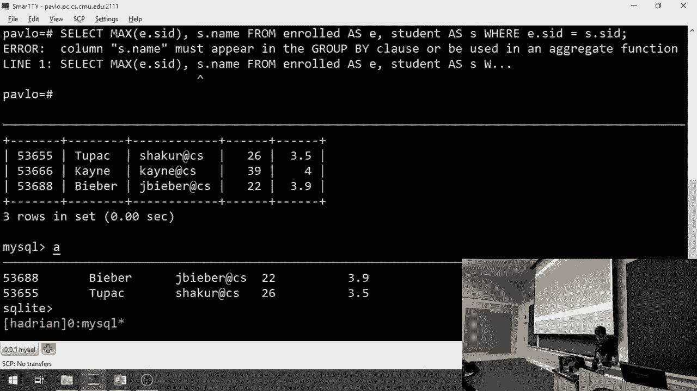

actually the lowest alright so it got it，completely wrong alright so the right so。

this doesn't work in the sequel standard，it runs a single byte and and and my。

SIBO if we turn off that strict mode，thing so way we can do this is a nested。

function as again let's build it，constructively so we know do you want。

the student ID and the name as the，output but it's the where clause that。

think we have to figure out and this one，basically says that we want to get a。

matching tuple that is greater than，every other student ID that that's。

that's in our table right so we know the，inner query shall should be basically。

the student ID from the enroll table we，can be more more sophisticated maybe put。

a distinct there but it's all the same，but now we need to figure out how to。

match the student ID from the student，and an outer query the student ID from。

from the inner query and for this we can，use greater than equal to all right it。

has to be greater than equal to because，we make sure that we match ourselves the。

student that actually is that does，actually have that the highest one right。

we can rewrite this in other ways as，expected right we can rewrite it with。

the in clause like that and actually，compute the max student ID and the inner。

query right now basically this is saying，match the student ID that is the max。

student ID produced from from the enroll，table right we can go even further we。

can rewrite the inner guy to be like，this right we do an order by and the。

student ID and just rank them in，descending order and then do a limit one。

so some systems will actually just，rewrite this one to be a max anyway just。

scan everything keep track of which，one's the max and it produces the final。

output don't even bother to do them，sorting right again same query rewritten。

in different ways one more example we're，gonna find all the courses that have no。

students enrolled in them so we take our，outer query as a Select on the courses。

and then we know our inner query，basically says when a find note would。

have no tuples in the enroll table，so for this one we want to use not。

exists basically says we don't want to，match anything in our inner query and。

all we need to do that for the inner，queries is just just grab every single。

tuple and here now we're actually，matching up the the course ID in the。

inner query with the course ID from the，outer query so you can only do this in。

one direction so if you're the inner，query you can represent the outer query。

if you're in the outer query you can't，reference the inner query right unless。

you pipe it out or redirect it to a，table so any questions about nested。

queries again they're very powerful many，tens you cannot write what you want to。

write in in in a single query without，using nested queries yes her question is。

can you think of an inner query as a，for loop it has a notion of like。

ordering it's it's really a set right so，all those operators like in X exists any。

those are just trying to say for the，entire set of tuples that are in the。

inner query check to see whether any of，em matches you're not you're not really。

iterating over every single one if you，think of the outer query sort of as a。

four because you're iterating every，single tuple but then the set portion。

the evaluation of the inner query is，always at server and a bag or set set。

level makes sense okay window functions，so window functions are I would say。

they're new but they're like fifteen ten，years old now so they're not like not。

brand new a lot of systems don't support，them but the major ones do so a window。

function is sort of like an aggregation，where you're going to compute some some。

function on on tuples but rather than，doing it on you know a subset of the。

tuples and collapsing them down into a，single result you sort of do this in a。

incremental fashion or on a moving，two，as the output but along with the value。

that it produced from the window，function right so the basic syntax is。

like this you have the function name and，then you have an over clause。

so the function name will be our，aggregation functions and other special。

window functions we have which I'll show，the next slide and then the over the。

over Clause defines how we actually want，to slice up the data right this is sort。

of like combining together the，aggregation and the group by but in a。

single clause so the function is like，the aggregation function the over is。

like the group I so the aggregation，function should be all the things in the。

sequel standard that we talked before，min max average count some the special。

wind functions to do things like，introduce a row number to the current。

row so to keep track as the tuples，that's being output and it marks them。

with what order they're they're coming，out and then rank would be the order of。

the position of a tuple if we're doing，sorting alright so say what I want to do。

is I want to go do a select over the，enroll table and I want to produce all。

the tuples as my output but I want to，just mark them with the row number of。

the output alright so I have my row，number row number function and then for。

my over Clause I just leave that blank，and then what I end up with is a result，that looks like this。

all right I have all the data that I had，before but now I had this special column。

here row num that's just again the order，of the tuple that that that it was。

produced in the output so sort of like I，compute my entire query and then I do my。

window function to go over the results，and I and then I add in whatever the。

computation that I want to generate so，just like a group aggregations we can we。

can combine things together or group，them together this is what the over。

keyword does for us so for this we would，use partition by to specify how we want。

to group things all right so in this，query here I'm doing the same thing as。

before where I want to combine them，together based on the generate the row。

number and for how they produced in，their output but then I'm gonna group。

them together based on the course ID，right so my output would look like this。

right and so now again it looks just，like the aviation where now I'm grouped，together。

based on the order right pretty simple，so let's look at something more。

complicated so I can also order by these，I can order them instead of partitioning。

them and this is essentially defining，how we want to do our ordering produce。

to produce our outputs if we do this，ordering then we compute whatever this。

the window function is that we want to，compute on that so in this case here。

this is a sense you can do the same，thing I did in previous slide where it's，going to more of us。

group them based on the course ID but，this is doing this by using ordering。

rather than partitioning all right so，let's say we want to compute want to。

find the student with the highest grade，for each course so what we have here is。

now we have nested query so in the outer，query we're just going to well on the。

outer query is server in the inner query，we're going to produce some table result。

but now this is a good example we're，having a nested query inside of the from。

clause so I have from here and then I'm，taking the output of this inner query。

and I'm gonna map that into a sort of a，temporary virtual table called ranking。

that only exists for this tuple right so，instead of writing it to a table that。

are exist we're writing into a temporary，table I don't stay in memory because it。

may actually go out the disk but a，temporary tuple table for this this。

query that then gets discarded when the，query is over so in the inner query what。

we're gonna do is we're going to go over，the enrolled table and for every single。

tuple we're gonna split them up based on，the course ID that's the partition。

clause and then we're gonna sort them by，their grade in ascending order and then。

what we produce the window function we，invoke is rank which is the order that。

they exist in the in the sort of ranking，and then we take that output write it。

out to the ranking table and then in the，outer query we can then do additional。

filtering based on the their rank so，this is only produce the tuples that are，that。

ranked first right so this is finding，the students the highest grade for each。

course right so the thing to point out，here is I have I'm referencing in my。

outer query this ranked attribute here，which actually doesn't really exist in。

the database again it only exists within。

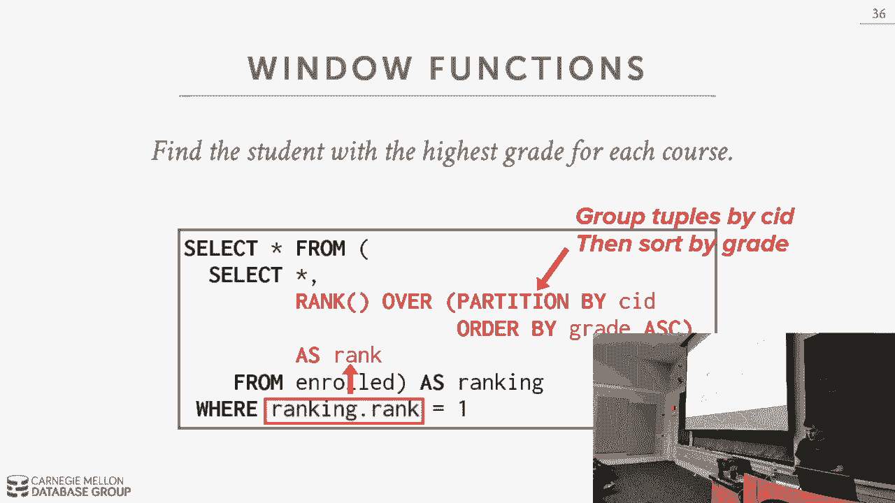

this query I'm seeing a lot of blank，faces so let's maybe pop up in the。

database and see we can do all right so，for this so Postgres is the only one。

that actually supports this my sequel，eight supports window functions and the。

newer version sequel Lite support window，functions but for simplicity what does。

do my and Postgres alright so this is，the query that we had before right let's。

break it up and make it and just do the，inner query first and that way it'll be。

sort of easy to understand right so，we'll just go back and run this so again。

what this is gonna do is going to go，over the enroll table it's going to。

partition each record based on the，course ID so you see that here where for。

15 for 45 appears first then 7 21 then 8，26 and then now within each of these，partitions。

it's the N going to sort the tuples，based on their grade in descending order。

or sorry in in ascending order so be，pump comes for see Abe you'll come from。

C and then there's nobody else taking a，26 so the B's by itself right so that's。

how we got that output in the form that，we redefined so now the rank function is。

gonna be computed based on where each，tuple appears in the sorted output list。

so in this case here this first tuple，and within this partition this guy came。

first so he gets Rank 1 this，I came second so he gets ranked too，right if I change this now to be in。

it doesn't still does the same thing but，I could do an order by again and now I。

want to go in descending order right，well this is this this is doing the。

order by this did the order by after I，did my window function so it doesn't。

make sense but the the the main thing in，the the rank is different rotoma because。

the row number two says where do you，appear in the output the rank is where。

do you appear in the sorted order okay，yes say it again sorry he says if you。

have a rank without an order by will，just return a random order well you'll。

still get it ordered by what you have，until get them probably split by。

partitions it doesn't have to be because，it's unsorted but that's what you'll get。

but now here yeah so there in this case，here there is no sort ordering anymore。

so everyone has the rank of one right，but it still group them up together。

based on what I'd find it as my，partition and that's more of an artifact。

of how the database system actually，executed the query rather than the。

semantics of the query itself his，question is what is the rank function do。

the rank is the rank of the rank，function produces the rank of the sort。

order right so if I change my window，function to be row number okay I have my。

partition but but it's one two one two，one right because within each partition。

that's what I read peer so I've removed，actually the partition by then it should。

go through one through five right like，that if I change this now to rank。

everything should be one one one right，because there is no soil order。

yes our question is a pointless view of，rank without an order by yes because。

there's no there's no sort order so。

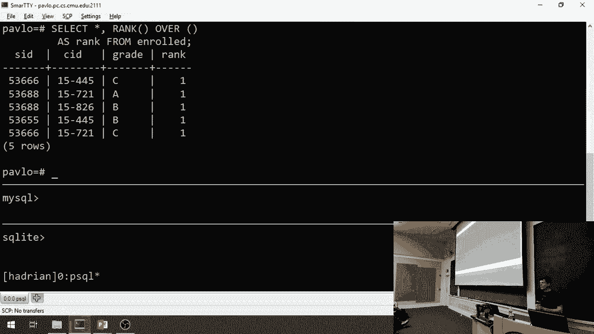

there's no ranking all right cool all，right so the last thing we want talk。

about is si si es complex table，expressions so this is Polly again Mike。

this is I find this very interesting，this is probably one more complicated。

things that you can do in sequel and，it's gonna look a lot like nested。

queries in that you're taking the output，of a query I'm using as the input for。

another query but we'll see in a second，what you can do with CT ease that you。

can't do in Annessa queries yes so her，question is in the case of this is it。

this particular query or it is in，general so a question is is there a。

particular advantage of using rank with，a window function over using a group by。

so again if you use a group by that's，not going to generate the same you're。

not going to get the tuples as part of。

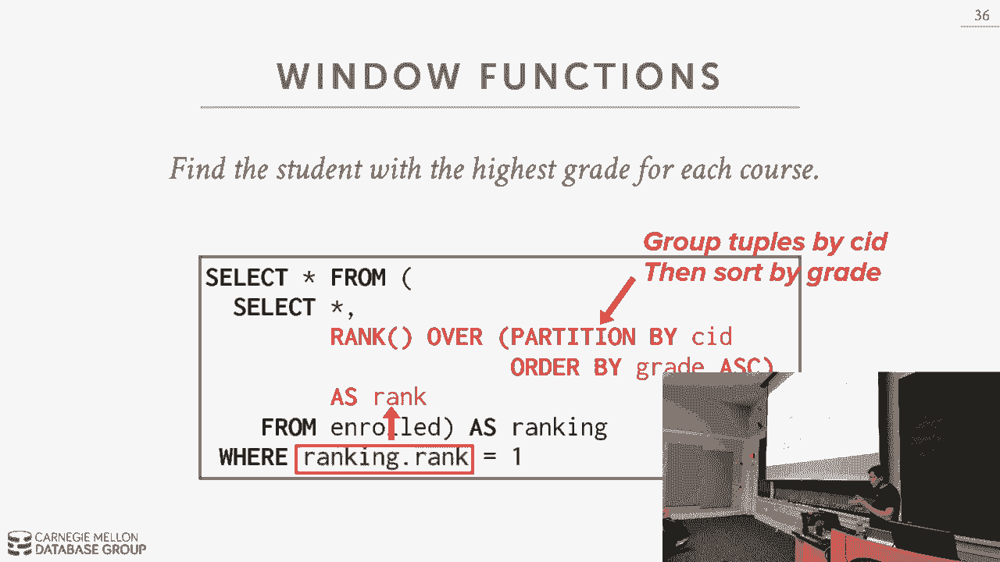

so say I do this one here right row，number by partition by so if I go back。

and I say I want to compute now like the，the max grade some enrolled group by。

course ID like I no longer see what the，original tuples were could they get。

collapsed together in the aggregate，function the window function still。

produces all the tuples that word in，your output but I can now see them as I。

can still see them as the output so if I，go back here and if I this may or may。

not work but let's see so maybe I try，max grade petition my course ID yeah so。

what's that sticking oh you know why it，there's the rank oh yeah because I'm an。

idiot sorry yes it did work I was what I，wanted min yeah so the highest grade at。

15 for 45 is was was a B right so I，still see my original two bows I still。

see one student got a C one student got，a B but the max for that group was B so。

I didn't lose the original tuples now，you and your application code have to。

derive meanings from this output you，know get the one field that you won but。

this has allows you to get and still，keep the tuples in a way you can't with。

this question is can you use row number，after use an order by so something like。

yeah there yeah sorry that's why there's，the as rank so let's do this row num oh。

I'm a idiot sorry no one can see this，how can you yeah sorry my screen shows。

one thing this shows another that shows，now if we if we remove the partition by。

and now we can maybe put descending，the plate replace the rank with the row。

number what do you mean let's do this，online because I want to get to see two。

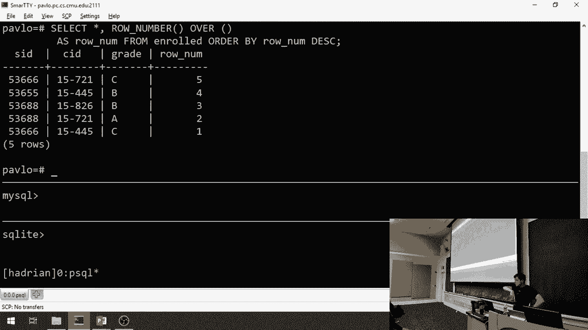

E's cuz he knew it for the homework，before we keep going okay we can try it。

afterwards okay all right so she sees，the way basically is gonna work is that。

you have introduced to this whiffed，clause there's whiffed clause it's like。

a query that's gonna actually before，your your regular query so we have width。

and we're defining the name or a CTE and，then we have our ask clause and whatever。

is inside of the parentheses after the，as the output of that query would then。

get sort of maps to the this are the，name of our CTE and then in the Select。

query that comes below it can reference，it does it just as if it was a an。

existing table right so in this case，here what will happen is I see te that。

invokes the query select one all right，so let's don't have to have a from。

Clause this just out pollutes this，produces a single tuple with a single。

attribute with the value one and then，this other we're at the bottom to select。

star on it and there's outputs that，single tuple so I can start doing more。

complicated things I can now bind the，the name or the output columns from the。

queries inside of the CTE to given names，and then I can reference them by that。

name down below in my in my statement at，the bottom so this this CTE produces a。

single tuple with two attributes with，the values one and two and then these。

get mapped to the name column 1 column 2，and then in the Select statement below I。

can just add them together right pretty，straightforward，so let's go back and try to do that。

example we did before where we want to，find the name of the student with the。

highest I student ID that's enrolled in，least one course so for this I have my。

CTE and the side of that I'll do my max，on the student ID on the enroll table。

again that produces one tuple with that，max student ID and then down below I can。

do a join where I'm gonna reference the，the CTE that was generated above me and。

I just combined together the max ID that，came out of this which is defined here。

with my student ID and then that，produces that produces the one tuple。

that I want right again this is another，example of how to do the same query the。

same at a high level semantically the，same query just written in different。

ways so now you may be saying well how，is this any different than a nested。

query right the answer is you can do，recursion in a common table expression。

that you can't do in a nested query so，bear with me here but this query is。

going to produce a sequence of numbers，from from 1 to 10 like a for loop right。

so now we have with recursive we have，the keyword and then inside of our CTE。

definition we're gonna do a union，between a single query that produces the。

value 1 all right a single tuple with a，single attribute 1 and then we're gonna。

then Union that with another query that，actually references ourselves so that。

seeing here we're gonna vote on our own，CTE and then we're gonna take whatever。

the counter is that's produced by this，and add 1 to it and produce that as the。

output all right and we keep running，this until our where Clause actually。

gets tripped up where we try to go above，10 and then now we stop producing 2。

pools so now we have the answer that we，want that we can then reference below in。

our CTE yes you know it's basically，Union right it's Union with you know。

you mean by default sorry you need to，start a union without duplicates Union。

with duplicates Union without all strips，keeps duplicates Union with with out all。

removes them might be that way we can。

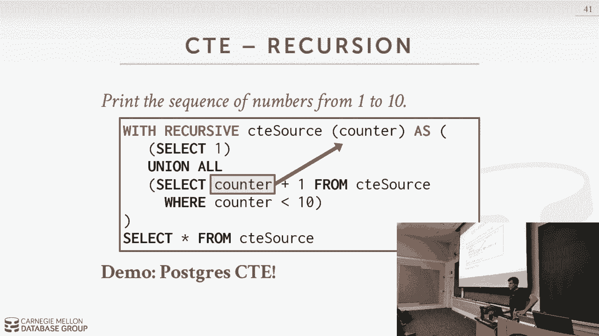

test that though okay so let's do this，in Postgres so for the alright so this。

is this is the one query that this is，the query that I showed you right and we。

produce the list of tuples right with a，let me try to kill this alright that。

better alright but it be careful about，CTE s with recursive because again net。

because you can essentially have，infinite loose so in this query here I。

no longer have that counter where it's，greater than ten or produce check any。

tuples where they're less than ten this，will run actually forever but what I did。

first was I define a toll Postgres to，again I'm highlighting here and you。

can't see it at all post past that any，query that runs longer than 10 seconds。

automatically kill it so when I ran this，query now it no longer has the where。

clause to prevent it from going you know，looking at tuples beyond ten and so。

essentially runs forever，Postgres recognizes that we're stuck it。

and a query that's taking too long and，go that goes head and automatically。

kills it yes so suits all right so，select one just does this right so now。

if I do select one Union all select one，so if I think I remove the all yeah you。

get it's a without it removes duplicates，right so you know will give me。

everything so essentially what's，happening now is I'm calling my CTE say。

whatever the whatever tools you have in，the current value take take the output。

and then add one to it here right the，the plus one there so this is invoking。

on on our our our source CTE called，source for every single tip one their。

take its output add one to it so in，order to get that tuple it has to go。

then invoke that CTE which then produces，back one yeah it won't let you in bogey。

because it knows you're trying to，reference yourself those questions what。

happens if you if you try to remove the，recursive calls again its sequel its。

declarative we know everything you're，trying to do so you're trying to access。

a CTE table that's defined by yourself，and it doesn't let you do that for。

cursive let you do that so let's try it，now also with let's try it by removing。

the Union all and see what happens the，call apartment and still produces the。

correct answer yes you don't you don't，need the Union all right so in this。

example here again I'm synthetically，generating a two table that has a single。

value of one and then I invoke a query，to get that tuple and add one to it but。

then generates a new tuple which and，that can then invoke again and add one。

to that and I keep doing that until I，don't produce any more matches right。

because any the current ends because，this question is why why are there not。

duplicates because the first time you，devoted you had one six second time you。

invoke you would have one and two let's，do this offline let's walk through it。

because again we am Braddock we're out，of time，all right yes quick this question is do。

people use for courtesy teas is that，very common yes absolutely yes so this。

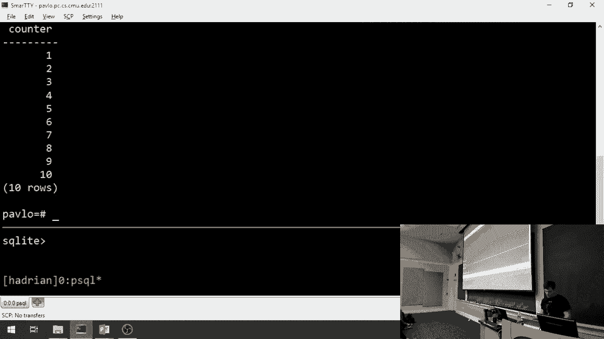

is actually finished up very nicely so，the the second point I'm trying to make。

here is that in an ideal scenario you，always want to have do to be able to。

compute an entire query without having，to bring any data locally or not having。

to go back and forth right so in a it，query，although the complexity that makes it。

harder to new query optimization but if，you tell the gaming system everything。

you want to do with this sort of piece，of data then they can do a global。

optimization on that so by having a CTE，you're not having to have additional。

logic be somewhere salicin outside the，David system it will go back and forth。

you're saying here's everything I want，to do so CTE are actually very common。

especially in newer applications，recursive CDs maybe less so but。

definitely cetys but it's another way to，write a nested query alright the other。

major thing that I want to point out is，that again the language is from 1973 or。

1974 but it's still widely common you're，commonly used it's being updated all the。

time and learning sequel is important，because you're gonna see this again。

throughout your entire life pretty much，every single system database system that。

you know it with some minor exceptions，is going to support some variant of。

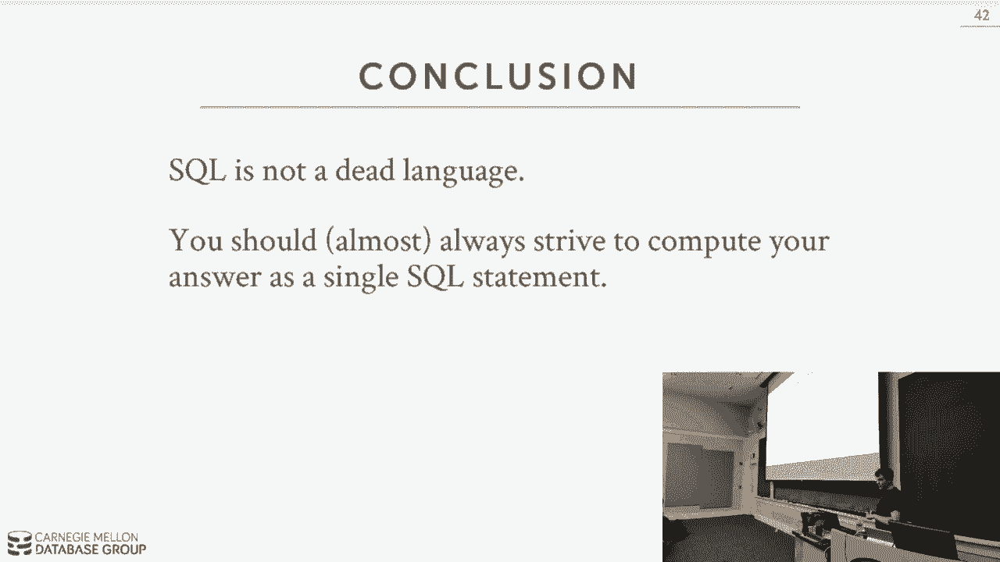

I shouted to settle the case a machine，on little bits of broken bar goes in，crushed up kids。

let the cows in the demo I'll try he's，witzy nines in my system I'm blessed。

let's go get the next one good never be，son ricochet jelly hit the deli food。

report one naturally bless ya what，rappers like the laser beam the balls in。

the bush say nothing like a king wrap，the bottle of us a nice sympathy goes。

don't feel like drinking that quality，you drunk you can't drop cross he was。

alive and at the stake don't know your。