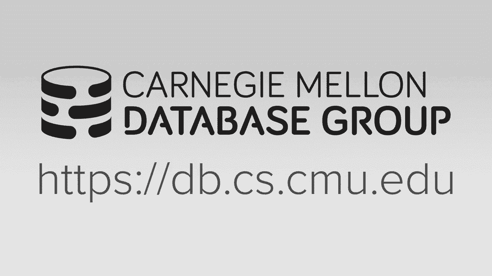
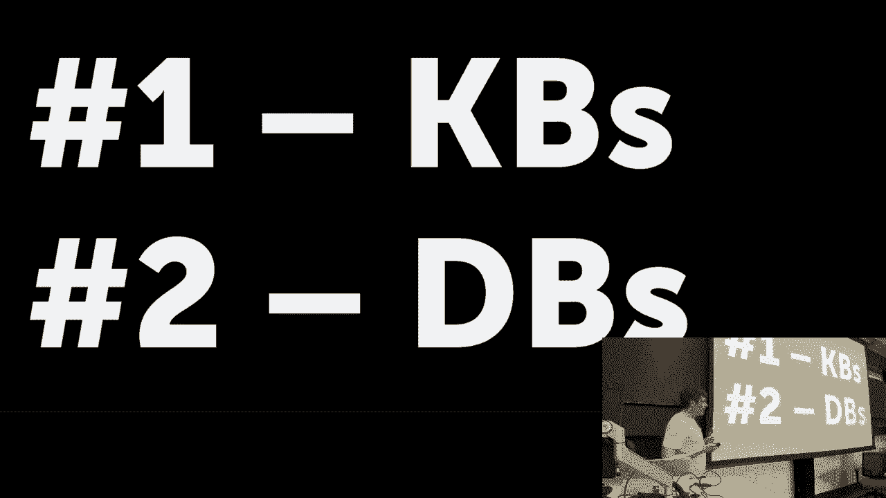
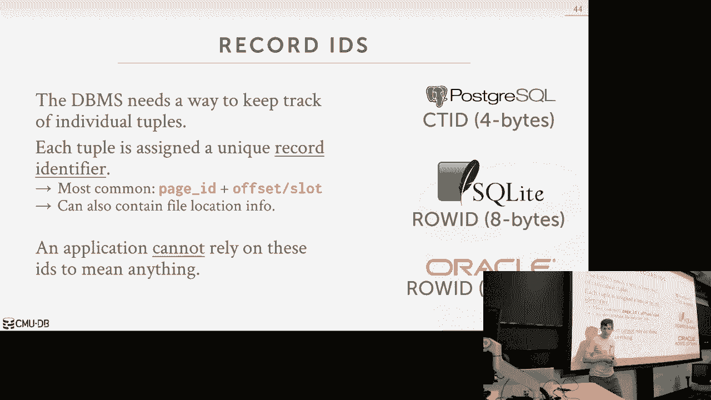
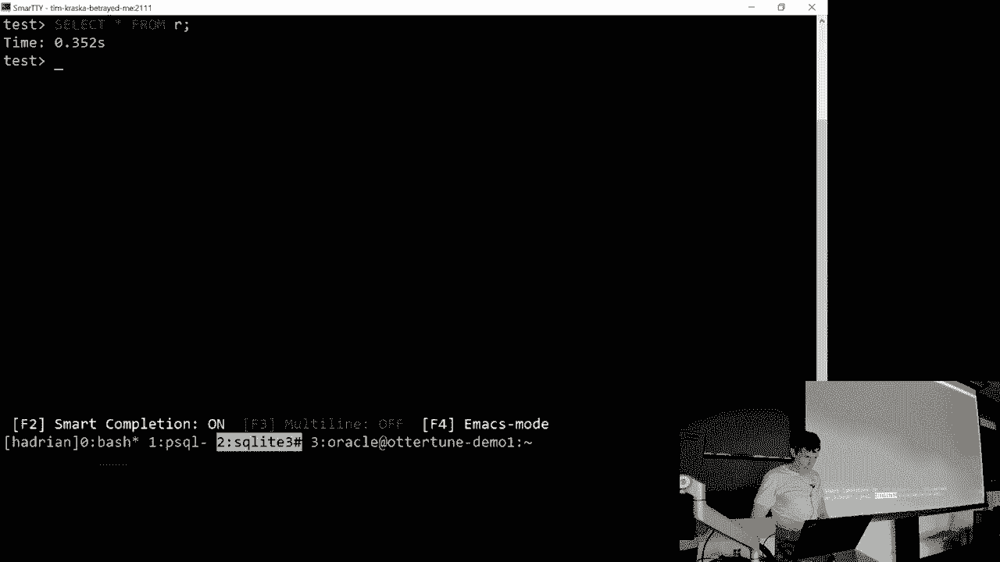
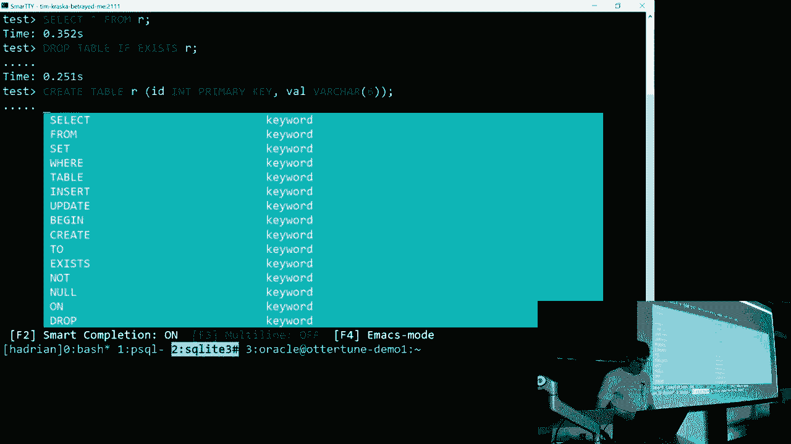
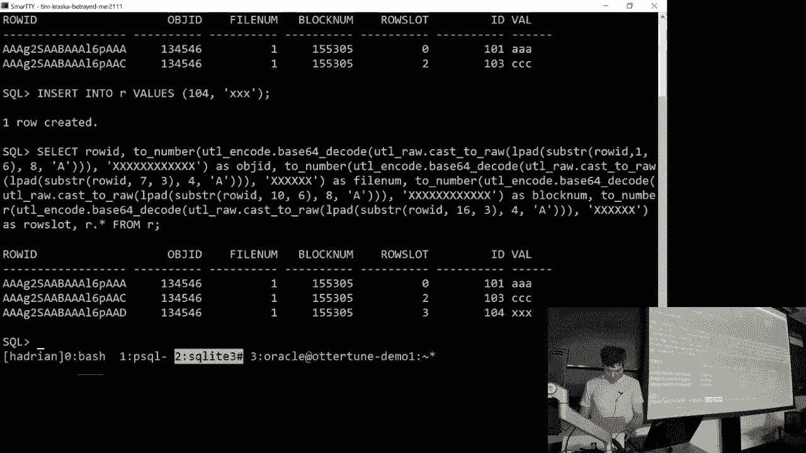
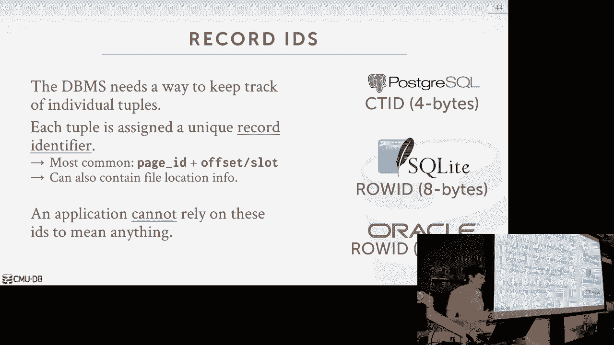
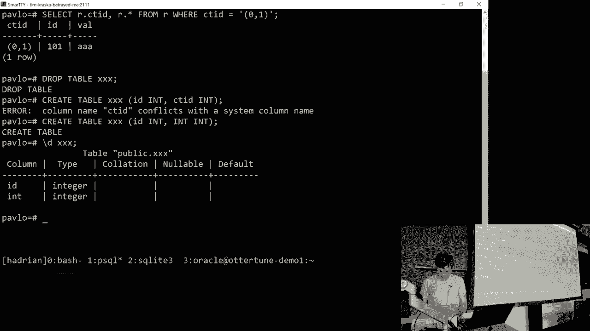
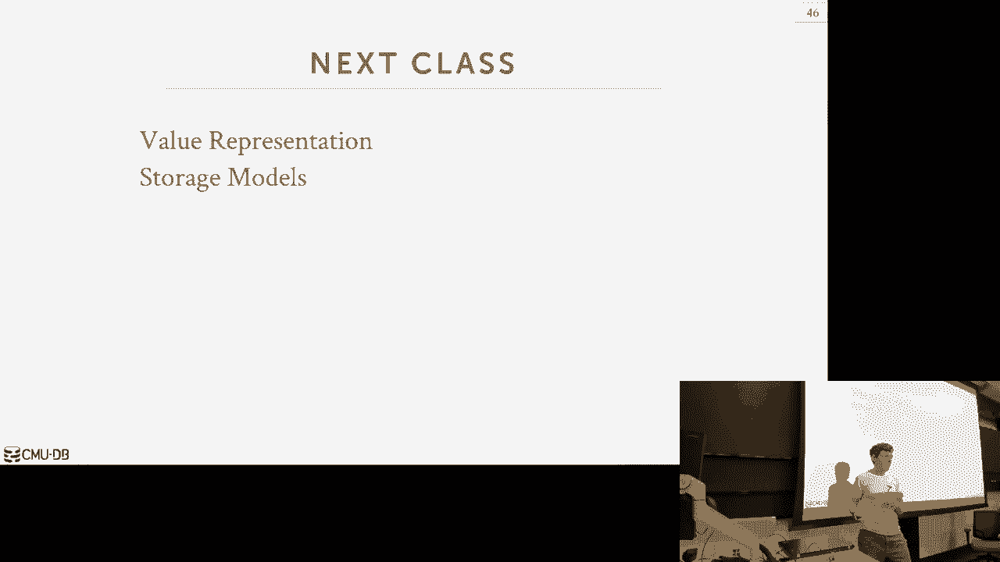

# 【双语字幕+资料下载】CMU 14-455 ｜ 数据库系统导论(2019·完整版) - P3：L3- 数据库存储 1 - ShowMeAI - BV1qf4y1J7mX

好的，让我们开始吧，再次欢迎，很抱歉上周不在，但我是说现在在镇上，这么快，暂停一下我们的DJ DJ，放置表，所以我不认为人们知道你有多糟糕是对的，所以一旦你向人们展示了一些东西，你能做什么好吗。

让她撕裂卡斯珀没有屁股，去屁股移动我的一切，这是真的，是呀，我们确实有一个课程，DJ右，我现在总是赢一个，我有一个，你的夏天过得怎么样，这很好，你会在那里，你知道，只是切来切去，是啊，只是做你的事。

好的，太厉害了，是啊，所有的权利，还有什么新的，你知道，是啊，被雇来做，是啊，有那个，是啊，是啊，所有的权利，是啊，我是说，所以我们仍然是卡内基梅隆大学的数据库系统，所以我们还在努力。

那只是占用了我所有的时间，对呀，你知道这没关系，所以我让一些人怀孕了，是呀，那倒是真的，我确实让某人怀孕了，好吧，嗯，让我们让我们通过这个真正的快速，所有的权利，所以我一生只关心两件事。

我每学期都这么说，第一个是我老婆，第二个是数据库，我才不管呢，还有什么对吗，我的家人投票给特朗普，我不和他们说话，我你知道，我有狗，那很好，但就像，我没有其他爱好，只是数据库，一次又一次。

所以人们认为我说了疯狂的话。

所以如果我开始快速说话，我想让你，请打断我，让我慢下来，好吧，告诉我，重复我自己，我说你听起来很蠢，你开得太快了，减速，当你不明白我在说什么的时候，你也可以打断我，我实际上鼓励你，我想让你这么做。

因为我知道这就像，我不知道你们知不知道，所以说，请阻止我，如果你不明白我在说什么，或者您有服务器数据库相关的问题，你阻止不了我的事都是愚蠢的，比如你有一个关于区块链的问题，像往年一样，我不在乎区块链。

好的，这门课不是关于区块链的，我们不是在说这个，如果你身上也有奇怪的皮疹，不要在课堂上和全班同学分享，这发生在第一年，很奇怪，别那样做，好的，所以好吧，这是什么意思，所以这意味着我希望你尽可能地打断我。

对呀，别不好意思，没有愚蠢的问题，所以如果你有问题，虽然关于讲座，下课后不要在我面前冷静，就像，哦，第三张幻灯片怎么样？你这是什么意思，我不会回答这些问题，因为如果你有问题，当我说话的时候。

那么其他人可能有问题，我宁愿在大家面前讨论，而不是一排人说，向前滑怎么样，第六张幻灯片怎么样？一遍又一遍，好的，所以再一次，我不会被冒犯的，我不在乎，打断我，如果你有问题，好的，所以有什么问题，好的。

所以我也在广场上发帖说家庭作业一出来了，它将于下周十一号交，下周我们还将在GitHub上发布项目一，只要记住这一点，这只是你接下来的日程安排，这里谁已经完成了第一个作业，我想有人已经做到了。

得到了一个完美的得分手，他们不在这里太棒了，甚至更好，好的，所以再一次，我们给你一个续集，精简文件，我们让你写一些简单的查询，这有点像强迫你做我们谈过的一些事情，在第二讲。

这实际上是您唯一一次编写续集查询，在这学期剩下的时间里，你将要做的所有项目，它将是C加+，所有的家庭作业都是铅笔和纸，好的，所以我想要这个，至少你上过数据库课程，至少你知道在你的一生中写一些续集。

好的好的，所以让我们直接进入这个，所以上一节课，至少在我们花时间讨论数据库是什么样子的最后两节课上，在高级别，在逻辑层面，你做什么，应用程序程序员看到了什么，他们看到关系表，他们看到续集。

所以现在我们想说的是，我们实际上要如何构建软件，那将管理这个数据库系统，对呀，这就是课程的本质，对吧，我们实际上如何存储数据库并允许查询执行，你从中得到新的数据，课程的整体大纲。

我们已经讨论了数据库顶部的逻辑部分，现在我们开始研究数据库系统的不同部分，一个一个，好像他们就像，好像不同的层次，所以我们将开始讨论存储，查询，执行，urrecovery。

然后我们会在最后讨论分布式数据库和其他主题，再一次思考这个问题的方式，这是数据库的大致近似值，它只是一堆层层叠叠的层，好了，我们要集中在这节课上，下一节课是关于磁盘管理器的，我们实际上如何存储数据。

你知道在磁盘上的文件上，然后在上面，一旦我们知道什么API，我们要暴露在系统的上层，我们开始添加这些额外的水平，最后，我们有一个功能齐全的数据库管理系统，所以这就是思考的方式，我们要在这一点上谈谈。

所以我们不再是续集的东西，不再有关系模型的东西，它的各个方面对于我们如何在系统中做出不同的设计决策都很重要，但你知道我们必须弄清楚如何实际运行续集查询，但我们不会担心如何写作。

你知道你知道复杂的续集查询，因为我们已经做过了，好的，所以我们再次关注系统的不同层次，不同的层一个接一个，然后你知道，有点上升的堆栈，正如我在第一节课上所说的，本课程是关于构建面向磁盘的数据库管理系统。

所以只是重申一下我的意思，因为那个，磁盘，面向数据库系统是一种，其中软件假设数据库的主要搜索位置在磁盘上，所以这意味着任何时候我们必须执行一个查询，它可能真的想跑，你知道的，想要访问不在内存中的数据。

我们得从磁盘里出去拿，有一堆组件，以及我们如何设计基于这个假设的软件，保护我们自己不丢失数据，有你知道，无效或不正确的数据，对呀，所以这个假设将渗透到整个系统中，我们需要在任何给定的时间意识到。

我们要读的东西，不在记忆中进一步理解这一点，我们希望区分易失性存储和非易失性存储，所以本质上我们要做的是，我们正试图让数据系统，管理数据从非易失性存储到易失性存储的移动，那么我是什么意思，因此。

思考计算机存储层次结构的方法是这样的，对呀，你从最底层开始，或者从最上面开始，你会有非常快的东西，非常昂贵和非常小，所以考虑这个的方法就像顶部的光谱，你有像CPU寄存器或CPU缓存这样的东西，一二零三。

这些东西很快，对呀，但它们的容量会很小，因为它们就像坐在CPU上一样，那我们就喝DRAM，然后在下面，我们将有SSD在网络存储中旋转这些硬盘驱动器，再次，在底部它们很大，但它们要慢得多，而且便宜得多。

所以再一次，我们关心的二分法是这里的分界线，所以这条线以上的任何东西都是不稳定的，那是什么意思，是呀，是呀，她说，它不是，当你失去动力时，它就不持续了，绝对如此，所有这些存储设备。

就像电力一样来维持他们储存的东西，对呀，你从电脑上拔下电源，DRAM里的一切都被抹去了，CPU缓存上的一切，把下面的东西都擦掉，这是不易挥发的，这意味着它不需要恒定的能量来保存储存在里面的任何东西。

所以这是高水平的，这是我们最关心的事情，我们必须把数据从这里移到这里，这还有其他方面，所以那些是要去，这将影响我们如何设计我们的软件，然后我必须做我们如何真正访问这些数据，所以如果它在易失性存储中。

它将支持快速随机访问，也许我们可以很快跳转到存储设备中的任何地址位置，我们会得到大致相同的性能，无论什么顺序，我们访问访问的东西，如果我跳到这个位置，这个位置，也许回到另一个位置。

我将得到大致相同的潜伏期，以同样的速度，现在涉及到对不起，非易失性存储，他们会有，而不是具有字节可寻址访问和块可寻址访问，所以在字节可寻址访问中，这意味着我想在这个商店的位置读64位。

我可以去读那六十四段然后得到我想要的，我太简单化了，但从程序员的角度来看，这就是我们的本质，作为数据库系统开发人员，这就是我们在非易失性存储中看到的，我们不能得到我们想要的64位。

我们必须去获取包含我们想要的数据的块或页面，我们必须得到与那一页有关的一切，所以我只想读六十四段，它是一个非易失性存储，我得去拿它存储在里面的四千字节的页面，然后去挑选我想要的那一块，另一个方面是。

这些系统通常也有更快的顺序访问，这意味着如果我在存储设备中读取一堆相邻的块，我可以比读取随机位置更有效地做到这一点，最简单的可视化方法，这就像一个旋转的硬盘，对呀，大多数笔记本电脑。

或者几乎每台笔记本电脑都没有旋转磁盘硬盘，但在一个炎热的，你知道的，基本上它的工作方式是你有这只手臂，在盘子上移动，就像黑胶唱片上的转盘，所以每次你要跳到一个地方，你必须把手臂拿起来。

把它移到另一个地方，那是一种身体运动，而且又贵又慢，SSD没有这个问题，因为它是固态的，但还有其他问题，所以在这些存储设备中，我们想最大限度地增加我们可以读取的数据量，那是连续的，对。

这些和易失性存储我们不太关心，所以就本课程而言，我们只是想说任何在DRAM中的东西，我们就叫这个记忆对吧，这才是我们最关心的，我们是如何把东西放进记忆中的，然后下面的任何东西，这条线，我们就说这是磁盘。

对于所有的算法，我们在本课程中将要讨论的大多数方法，我们不在乎，不管是，它是，它是，你知道是哪一个，嗯，这并不完全正确，当我们谈论连接时，顺序访问很重要，但我们以后再谈这个。

所以我不认为教科书上谈到了网络存储，当你看到这种等级制度时，他们总是在底部有磁带机，但没有人再运行这些数据库了，那些只用于灾难恢复，所以网络存储就像亚马逊上的EBS或S3一样。

所以我们不打算在高层谈论这些事情的原因，当你在春季的高级课程中专注于这些事情时，为了我们在这门课上的目的，这个，这个学期的这门课实在是太慢了。不管怎样，谁在乎我们能有多快，呃你知道。

在高级班把东西放在CP寄存器里，我们假设数据库总是在DRAM中，因此，这些事情实际上很重要，但在这整个学期里，我们不会真正谈论担心事情，坐在CPU缓存中，因为这并不重要，因为去磁盘太慢了，现在。

我每年都谈论这个，这实际上是一种新的存储设备，这跨越了非易失性内存的界限，在座的谁以前听说过这件事，谁听到她的英特尔辛烷值记忆，一二三好的，是啊，是啊，所以英特尔实际上是第一个发布这款产品的制造商。

每个人都在这方面工作了15-20年，英特尔实际上把第一个，让我们拿出第一批设备，所以就像DRAM，它坐在昏暗的槽里，它是字节可寻址的，但它就像一个SSD，意思是，如果你拉机器上的电源。

它保留了您的所有数据，所以这超级酷，这就像是计算机的未来，最终我们将不得不重写这个类来考虑到这一点，但我们不在那里，然而，它现在又不广泛可用了，这是我已经工作了一段时间的事情。

这是我和我的第一个PC学生写的一本书，基本上是他的论文，他们写成了书，我想这就是未来，我们只是不在那里，但它并不广泛可用，但你还不能上亚马逊，但最终很多人都在谈论什么会消失，如果你有非易失性内存好吧。

所以让我们谈谈这些东西有多慢，所以又有，互联网上有不同的表格有不同的数字，但这些大致相同，你知道的，大致相同，最重要的是数量级，这些存储设备之间的区别，假设我需要从不同的存储设备读取64位。

如果我在一个缓存中，然后就像半纳秒，如果它在l l 2，它是七纳秒，以此类推，才能得到真正长的，长时间延误，所以再一次，这就是为什么我们要在这个班上花这么多时间，担心怎么。

如何将从磁盘读取数据的影响降至最低，因为100纳秒和，在十五万纳秒内，对于每一个查询，如果我们总是要走出磁盘，那我们就完蛋了，事情基本上会停下来，我们不会完成任何工作。

我意识到用纳秒来衡量这一点对我们来说很难，像人类一样把我们的头缠在一起，所以如果你用秒代替纳秒，然后你开始意识到这些数字实际上是正确的多久，所以思考这个问题的方式就像另一个隐喻，我喜欢用吉姆·格雷的。

一个著名的数据库研究员说我想读一本书，我想读一本书中的一页，所以如果它在L一个，那就像在这张桌子上读我面前的书一样，如果是一二，那么也许它会穿过房间去读它，如果它是一个，如果是在DRAM中。

我得走去图书馆，然后现在你开始这些，你知道吗，越来越大的数量级，如果你必须从磁带驱动器上读它，就像飞到冥王星去读一本书中的一页，只是又花了很长时间，这就是为什么人们不想在上面存储数据，但在过去。

他们必须，所以我们在系统中试图做的事情的目标，我们希望为应用程序提供错觉，我们有足够的内存将他们的整个数据库存储在内存中，所以本质上，就像你知道的那样，我们的机器上有大量的内存，我们想说。

我们想存储一个数据库，这超过了我们可用的内存量，但不必，你知道吗，磨到停止，每次我们读到一些东西或写对了一些东西，这就是本课程的重点所在，接下来的三堂课实际上是关于，我们怎么能小心，在任何一个时间。

我们得从磁盘上读点东西，或者运行一个查询，以最小化这种影响，我们要做一堆不同的把戏，通过允许不同的线程来缓解此问题，或者通过缓存同时运行的不同查询，通过预先计算一些数据，有一大堆把戏。

我们将在我们的数据库系统中拥有的，避免这么长，长，长问题，所以让我们来看看磁盘的高级图，面向数据库系统的外观，从我们关心的角度来看，在学期的这一点上，然后我们会在剩下的课程中看到。

我们如何填充和设计这些东西，所以再一次，在最低层，我们有磁盘和数据库文件，没关系，然后我们将通过不同的块或页面来表示这些，对呀，页面是您用来描述这一点的规范术语，有时滑倒说挡，但在高水平上。

我们的意思是一样的，所以现在在内存中，我们将有一个所谓的缓冲池，这将在下周的讲座中重点讨论，这就是你将在第一个作业中实现的，第一个项目，所以在系统和执行引擎中有一些更高级别的层，查询引擎。

我们不在乎是什么，但它会向我们的缓冲池发出请求，说嗨，我想读第二页，第二页不在内存中，所以我们得去看看磁盘上的页面目录，然后说，这是我有的页面列表，在这里可以找到他们，所以我现在可以去找第二页是什么。

我把它铭记在心，现在我把我的执行引擎，这是内存中第二页的指针，然后它可以解释它，立刻做任何事，我们不在乎对吧，这就是我们在这里关注的，接下来的三堂课，这就是我们在这里建造这个部分的方式。

所以今天和下周我们，我们将讨论磁盘上的文件是什么样子的，下周将是缓冲池，然后后来等等，我们将讨论如何实际表示目录，好的，那么这看起来像什么，如果你上操作系统课程，听起来像什么。

我试图让它看起来我有更多的记忆，我实际上是做虚拟内存的，所以现在我可能在想好吧，我在这里上了一门课，为什么我要让我的数据库这样管理内存，这似乎是在浪费时间，他们已经可以做到这一点了，嗯，这不是个好主意。

是这样的，所以用操作系统的说法，我们称之为内存映射文件，或者在posix中有一个名为mmap的系统调用，本质上，它的作用是，它在磁盘上获取一个文件，你告诉操作系统将文件页映射到我的进程的地址空间。

现在我可以给那些人读书写字了，那些记忆位置，如果不是记忆，操作系统把它带进来，我可以我可以给它写信，然后最终如果我能告诉操作系统为我写出来，我可以做一个m同步，并把它写回磁盘。

所以我们基本上放弃了对记忆来回运动的控制，在磁盘和内存之间来回的数据，让操作系统为我们管理它，再次在高水平上，它看起来是这样的，我们有，我们在磁盘文件上有一堆页面，然后在内存中。

操作系统有它的虚拟内存页表，我们有物理记忆，所以发生的事情是，应用程序说嘿，我想读第一页，它在虚拟内存中查找，我们明白了，我们得到一个页面库，说这东西没有物理内存支持，它不是，它还在磁盘上，我们去拿。

将其返回到物理物理内存页，然后更新我们的页表到现在，指向该内存位置，所以如果我来了，我想读第三页，我也经历同样的过程，我把它记在记忆中，然后应用程序可以为所欲为，但现在假设我读了第二页，有什么问题？

对呀，没有，没有免费的物理内存页面来放置这个，把这一页放进去，所以我需要决定删除这些页面中的哪一页，当我这么做的时候，我提到过你必须停止数据库系统，安装请求此页的线程，因为现在光盘，的，你知道的。

操作系统的磁盘调度器会出去支付磁盘，把它拿出来，带进记忆中，你有诡计，从应用程序的角度来看，有办法弄清楚，可能不得不读一些不在记忆中的东西，所以也许可以把它交给另一个线程，所以它就熄火了，而不是我。

因为我一直想努力继续做有用的工作，因为我想减轻摊位，当我不得不走出磁盘，对呀，但本质上操作系统不知道我们到底在做什么，不知道数据系统在做什么，它只是看到一堆读和写页面，它不理解任何高级语义。

或者查询是什么，要读取什么数据，对呀，所以我们想，我们想要，通过使用虚拟内存，通过使用内存映射文件，我们放弃了，控件正在放弃我们数据库系统中的知识，到美国去，那是盲目的，什么都不知道。

所以如果我们只读取数据，有一堆系统调用，我们可以减轻其中的一些问题，但如果我们开始写东西，然后就有问题了，因为现在操作系统不知道某些页面必须被刷新，其他页之前的磁盘再做一次，我们稍后会讨论这个。

当我们谈论日志记录和并发时，控制OSSA，我需要写信，我需要把一些数据写出来，意思是继续把它写出来，它不知道这是否是一件可以做的事情，所以你可以通过给它提示来解决这个问题，比如用。

我建议你告诉它你将如何访问某些页面，不管是顺序的还是随机的，如何防止页面开始分页，虽然你可以解锁，并不妨碍它被写出来，这仍然是一个问题，这是你可以告诉它同花顺的时候。

所以我想说虚拟内存的内存映射文件听起来像是一件诱人的事情，我们想在我们的数据库系统中使用，每年都有学生说，为什么，我们为什么要做这些缓冲池的事情，为什么我们不能让操作系统为我们做这件事，相信我。

你不会想这么做的，因为您可能有性能瓶颈，你会有正确的问题，所以真正使用mmap的系统并不多，最著名的两个可能是mona b和lm db级别的db，你听说过吗，来自谷歌是另一个。

ElasticSearch是一个搜索引擎或文档存储，那么乌鸦DB是一个，作为一个以色列的JSON数据库，所以这些家伙都用mmap，但你有一堆额外的事情要做，防止操作系统做不正确的事情。

或者你必须做出的某些限制或假设，操作系统被允许做什么，不是很好，这就像，我是说，还有一些，但是没有很多，那么这里缺少什么，我们缺少了所有主要的数据库系统，Postgres，我的续集。

Oracle DB两个续集服务器，那些家伙都不用mmap，因为这是个坏主意，因为你放弃了控制权，数据系统总是能做得比操作系统所能做的更好，所以有一些系统在非常有限的情况下仍然使用mmap。

这其实已经过时了，我是说我上周和那家伙谈过了，他们的续集完全摆脱了M地图续集Lite有一个特殊的引擎，你必须告诉，我想用M地图做一些，你知道嵌入式设备，这就是你真正想用的，但是默认，你不会得到这种涌入。

DB只在类似的情况下使用此，只读缓存，但我总是喜欢给它讲的例子是Mongodb，这里的每个人都听说过MongoDB，那是一个著名的json数据库系统，所以当他们第一次开始他们的。

他们的默认存储引擎或存储管理器使用M Map，有一堆废话，他们必须做什么才能让那东西真正工作，但它是一个它是一个超级按钮，对他们来说是一个很大的瓶颈，然后他们筹集了很多钱。

然后他们做的第一件事就是摆脱M地图并得到它，你知道吗，我买了一个叫钢丝轮胎的东西，这是一个非MMap存储引擎，所以如果这是个好主意，这些家伙拥有世界上所有的钱，有一些顶级工程师，他们本可以想通的。

但它只是变得站不住脚，所以如果我死在这个班上，你想有一个纪念，就说安迪讨厌我的地图，你可以，你可以公开说这些话，我们实际上是在报社写论文，让我们今年证明，那是个坏主意，所有的权利。

我想让你从中得到的主要收获是，数据库系统是，哦，它总能做得更好，它总是确切地知道查询试图做什么，它知道工作量是什么样子的，因此它可以做出最好的决定，操作系统什么都不知道，它只是又看到了一堆，读写。

读写呼叫，所以我们将要谈论的一些事情，也许在这学期的晚些时候，我们可以做，如果我们不用地图，就像预取一样，更好的替代政策，更好的调度，OS是一种通用皮卡，而我们可以调整我们的系统。

看起来像保时捷或法拉利，正是我们想要为应用程序做的，另一个主要的结论是操作系统不是你的朋友，我们不想依赖它，我们想尽可能地避免它，因为它会做出可能损害我们数据库系统的决定，所以它就像一个敌人。

你需要它才能生存，但理想情况下，你不想和它说话，所有的权利，所以对于数据库存储，这是我们今天要重点讨论的，所以我们必须解决两个主要问题，首先是我们将如何表示磁盘上文件上的数据，第二个是如何。

我们实际上要管理记忆的来回移动，就在磁盘文件和缓冲池之间，所以今天的课，我们要集中精力解决这个问题，下节课我们也将集中讨论这个问题，然后从我们周三谈论缓冲池开始，下周我们将集中讨论第二个问题，好的。

所有的权利，所以今天的课又是，我们要问第一个问题，我们实际上如何在磁盘上的文件上表示数据库，所以我们首先要讨论的是，我们将跨一系列页面组织数据库，然后我们将讨论如何存储页面，在那些文件里。

然后我们会谈论实际上是什么，这些页面中的元组是什么样子的，所有的权利，所以我们要在宏观层面和深度上进行，你知道的，你知道的，在我们实际储存的数据中，所以在一天结束的时候，数据库只是磁盘上的一堆文件。

有些系统存储的数据库是一个文件，就像续集灯一样，第一次家庭作业是这样做的，您下载该DB文件，这是封装在单个文件中的整个数据库，大多数其他系统，但是，跨多个文件还原内容。

如果你看过我续集Postgres的数据目录，你会看到一堆不同的目录，一堆不同的文件对吧，您这样做是因为您知道数据库可能非常，非常大，像拍字节，你不想，你知道吗，您不想打开文件系统，和限制文件的大小。

所以再一次，操作系统根本不知道这些文件里有什么，只是操作系统有一堆二进制数据，他们并不特别，但是，这些数据库文件的格式通常是数据库管理系统专有的或特定的，所以你不能拍续集，精简文件。

把它放在我续集的目录里，我想我的续集会读对的，他们总是，他们总是专门，不管软件是什么，所以这些文件，这些文件用于数据，通常只是将它们存储在常规文件系统的顶部，操作系统为我们提供了，e x t 3。

e x t 4，不管Windows Net有什么，现在，我忘了对，这些是正义的，一堆文件，我们将依靠文件系统，为我们提供基本的重写，apis，在二十世纪八十年代。

有些人确实尝试在原始存储设备上建立使用自定义文件系统的数据库系统，比如说，你扑通一声打开一个新的硬盘，而不是格式化它，你知道，为NTFS或NFS设置它，或者x t x t 4，你说，螺丝。

所有这些都是给我卷存储设备，我会，我会咆哮，我会处理的，它实际上储存了什么，我自己，像这样的一些企业系统，就像一个企业的意思，像甲骨文这样的高端，db2和续集服务器仍然会这样做。

但大多数新的数据库初创企业都是，在过去十年或十五年里出现的新数据系统，做得不对，因为这是工程上的努力，使您自己的自定义文件系统，对于您的数据库系统是不值得的，你可能会有10%的进步，但现在你。

您知道您在管理自己的文件系统，这是一个很大的，它让你的东西不那么便携，因为现在你不能轻易地在亚马逊上运行它，及其他港口供应商，所以我们现在建造的本质又是，所谓的存储管理器，有时也称为存储引擎。

然后这是软件的一部分，数据库系统中负责维护磁盘上数据库文件的组件，现在我们可以读和写，让操作系统安排事情，一些更高端的数据库系统实际上会有一个垫片层，对呀，对呀，在文件系统上方。

这允许戴维森进行一些磁盘调度，你这样做就像，如果我知道，如果我有一堆线程写到块上，彼此靠近的，我也许可以把它们组合在一起，做一个单独的写请求，操作系统可以做这些事情，但它又不知道上面到底是什么。

它只是不知道上面查询的语义是什么，大多数系统不这样做，然后我们要在这里做的项目，我们不这样做，通常是为较高的人准备的，是呀，这么做是对的，他说，呃，这很难，因为你可以打右边，是呀，房间里还有其他人吗。

问题是，我说那些数据分散了文件，将数据库文件转换为多个文件，因为你不想影响文件大小，操作系统的限制，有没有，把东西放在内存中的任何优化，在是的，只要文件，哦，你的问题，文件对大小的数量有限制吗。

它可以在内存中与所以与虚拟内存，否，让我和这个谈谈，无论操作系统允许您存储的交换大小，但如果是，它本质上仅限于您可用的物理内存，是啊，是啊，如果是这样的话，如果把这个脱掉更好。

因为你知道人们一直在切割三重BOM，她的问题是，有一个单一的文件会更好吗，因为这样你就可以结束了，您摆脱了拥有多个文件的开销，你喜欢什么，间接费用，就像你的i节点，你必须找到它，去打开一个文件。

或者我的意思是，我是，我猜当你不得不把故事讲回来的时候，就像嗯，喜欢你的名字，喜欢好的，所以你说的就像元数据，所以她的陈述是，如果我有一个文件，然后我有一个文件名，我的文件系统中有一个i节点指向它。

如果我有多个文件，我有多个i节点条目，每个都有自己的文件名，和很多元数据，你知道参考它，但就像那样，可能是千字节的元数据，一点都不对，如果您的数据库是一拍字节，谁在乎你有一堆文件名，对呀。

我想真的很大规模，这没什么区别，对呀，我喜欢，我想现在对于现代文件系统来说，这不再是真正的问题了，就像你可以有像埃字节，你知道单个文件是艾字节，但像在90年代或2000年初一样思考，什么时候。

就像人们像脂肪一样奔跑，三二，你只能有一个4G的文件对吧，所以那是在过去的日子里，现在更重要的不是那么重要了，但即使这样，元数据也无关紧要，是呀，我在做操作系统，比如，极限。

一个进程可以创建多少类似的文件，除非你有确定的，2。他的话不能全信，可以打开的文件数通常是打开的，file处理可以创建的东西的数量，因此，您必须具有这样做的权限，绝对是的。

所以如果你去看调优指南或设置指南，对于一堆不同的数据系统，他们会谈论，比如调整这个内核参数，让您有一堆，你知道这个数字I节点或文件句柄打开，绝对是的，好的，太厉害了，又好了。

所以我们正试图建立一个存储管理器，存储管理器负责维护磁盘上的这些文件，是一个文件还是多个文件，没关系，所以现在在这些文件中，我们将把它们组织成一个页面集合，所以我们的存储管理器将跟踪所有的读写操作。

我们要对这些页面做什么，就像我们跟踪有什么可用的空间，我们有什么空间可以在页面中存储新数据，所以页面本质上只是一个固定大小的数据块或数据块，那只是我们要整理我们的文件，你知道，变成这些块。

所以页面可以包含任何正确的内容，它包含实际的元组，数据库本身包含元数据索引，从存储管理器的角度记录记录，这并不重要对吧，但是我们总是要把东西存储在一个页面里，因此，现在一些数据库系统将要求您拥有。

页面是自包含的，我的意思是你需要知道的所有信息，如何解释和理解，页面的内容必须存储在页面本身中，所以让我举一个例子，假设我有一张桌子，这张桌子有十列，它们有不同的类型，但我调用创建表。

我用不同的属性创建表，这样我就可以把关于表中内容的元数据存储在一个页面中，然后该页的所有元组存储在另一页中，所以现在的问题是，如果我有磁盘故障，就像我的数据中心着火了，我的磁盘融化。

我失去了那一页告诉我什么，架构现在的布局是什么，我不知道如何简单地解释，我的元组页的内容是什么，所以一些系统，如甲骨文，比如说，需要所有关于如何说的元数据，这就是页面中的内容必须在页面本身中，这样的话。

如果您丢失了任何其他页面，它不影响，你知道的，你丢了一页，它不影响任何其他页面，你觉得这有点过头了这似乎很疯狂，嗯，他们又为了灾难恢复而这样做了，所以现在机器又着火了，你丢失了一堆页面，你可以，你可以。

你可以打开一个十六进制编辑器，并试图重建数据库，一次看一页，以及您需要的所有元数据，里面有什么，那个页面存储在它自己里面，所以说，另一件重要的事情是要明白，我们不会在一个页面中混合不同类型的数据。

有一些研究系统可以做到这一点，我们可以有，你知道的，一个页面有元组数据和日志记录数据，用于我们的目的，大多数系统都不这样做，就像这里有一个页面，只有源元组，这里有一个只存储索引信息的页面。

所以现在每个页面都将被赋予一个唯一的内部标识符，数据库系统将为我们生成，页面ID右，我们会有，然后现在有一个间接层，当我们谈论存储时，这将是一个反复出现的主题，我们有一个间接层。

这将允许我们将页面ID映射到文件中的某个位置，在一定的偏移量，对，我们想这么做，因为现在在封面下面我们可以开始移动页面，你知道如果我们开始压缩磁盘，或，或者你知道，由另一个磁盘设置。

它不会改变我们的页面ID，因为我们有这个，此页目录，你说你想要第一页，第二页，第三页，在这里可以找到它，所以有一堆页面页面概念，我们需要谈谈把它放在真正的计算机是如何工作的背景下，所以在最低层。

我们将有一个所谓的硬件页面，这是页面API或页面访问级别，您从实际存储设备本身获得，这是SSD或旋转磁盘驱动器暴露的内容，这通常是4千字节，然后在上面有一个操作系统页面，一次又一次，就像你一样。

当你从存储设备中取出东西并将其放入内存时，对呀，它们也将其表示为内部页面，在Linux和Windows中，默认情况下通常是四个字节，有像大页面这样的东西，你可以把它翻过来，你可以接一场演出。

一个千兆字节的页面可以拆分成小的四千字节的硬件页面，但为了我们的目的，我们不关心我们在数据库页面上关心的事情，对呀，这在不同的系统之间会有所不同，所以在512字节的低端，就像续集一样，光。

就像嵌入式系统，但在高端，你会有16千字节，就像我的续集一样，所以不同的数据库系统做不同的事情，所有这些权利都有不同的权衡，我们要关心的主要事情，虽然，恐怖页面是最低级的，我们对存储设备进行原子写入。

通常是4千字节，所以我的意思是，也就是说，我需要修改一堆数据，硬件只能保证，如果我对磁盘进行写入和刷新，它只能保证一次4千字节，它将是原子的，所以我要澄清我的意思，就像，如果我说我需要写16KB。

我可以试着写，我说我告诉磁盘，嘿，为我写16千字节，它可能会在你知道之前崩溃，它写入前8千字节，然后在写入下一个8千字节之前崩溃，然后你回来，现在你有一个撕裂的右边，你只看到前半部分，看不到后半部分。

因为硬件一次只能保证四千字节，所有的权利，这会出现的，这个，我们以后再谈这个，当我们谈论伐木和商业，但这是我们需要的，我们需要注意的是，再说一遍，有不同的系统，做不同的事情，高端系统。

如Oracle续集服务器和DB Two，你实际上可以调整它，所以你说，我想开始，想想四千字节，8千字节或16千字节，你甚至可以改变，例如索引页，暴风雨更大，页面大小，然后数据页更小。

你可以疯狂地做一堆不同的事情，所有的权利，所以现在我们想谈谈如何，我们将表示页面存储架构，所以再一次，有不同的方法来做这件事，对此有不同的权衡，最常见的是热文件组织，所以我们会专注于此，但要明白的是。

在这一点上，在存储管理器中的最低级别，我们不在乎页面上到底有什么，我们不在乎这是否索引，数据或元组数据，我们不在乎，你向我们要一页，我们会把那一页给你的，或者你得到是，删除页面，我们会删除它，因此。

数据库堆文件是无序的页面集合，其中数据元组可以按随机顺序存储，所以再一次，关系模型没有任何顺序，如果我一个接一个地插入元组，我不能保证它们会那样存放，在磁盘上，因为这并不重要，因为我写续集查询。

没有秩序的概念，所以我们需要再次拥有的API，能够一次读写和访问页面，并且能够迭代我们拥有的每一页，以防我们需要对整个表进行顺序扫描，我们将有一些额外的元数据来跟踪我们有哪些页面，哪些有自由空间。

以便如果我们需要插入新数据，我们知道在哪里可以找到一个页面，在内部做正确的事情，我们可以用很多不同的方法来表示这个热文件，同样，在de lo大多数级别上，我们可以组织这些和页面，然后在这些页面中。

我们可以用不同的数据结构来表示它们，所以让我们首先谈谈做链表，因为这样做有点愚蠢，或者没有人真的这么做，但如果它存在，然后我们会看到页面目录的方式，这是一个更好的方法，所以我们再做一次的方式。

目标是我们，我们要做的，这是我们试图在我的文件中找出的，我有一堆页面，你知道哪些页面这些页面存在于哪里，你知道什么样的，不管他们有没有数据，或者他们是否有空闲的空间让我存放东西，所以在这个标题中。

此链表的堆文件，我们只有两个指针，我们有一点，它说这是我文件中的免费页面列表，这是一个页面列表，实际上你已经完全满了或被占用了，好吧，那么这只是一个链表，所以这些页面存储在哪里并不重要。

它们是否毗连并不重要，我只是我现在只是指点说嘿，这里是，你知道，这是数据，你知道，这里是，这是我链接列表的第一页，他们被占领的地方，这里有一个指向下一个的指针，所以现在如果我想说，给我找一页，免费页面。

我可以储存东西，我可以跟着免费页面列表，看这里，你知道在穿越长，直到我找到有足够空间存放我想储存的东西，因为我们需要去，可能并以相反的顺序迭代，我们在回来的路上也需要指针，是呀。

问题是为什么有序思维的堆文件处于高水平，就像，我们存储的数据不需要订购，当我们把它插进去的时候，所以如果我插入三个元组，我可以插入，我可以在我的页面布局中，页面内部的实际，我可以有两个，三个元组。

二二一，我没被要求把它们按给它们的顺序排列，但是如果你必须看一个特定的页面，然后你必须用这个右键遍历整个数据，所以这个问题是，如果您必须使用这些链接列表查找特定的页面，我必须逆转的事情，可能是整个链表。

如果我可以有一个，绝对是的，这是个坏主意，我说是的，如果你点了，那么你总是可以更快地搜索对吧，他的问题是，你总是可以搜索得更快对吧，所以有不同的权衡，所以我没有元数据要说，在那里我有免费的页面。

所以我现在需要插入一些东西，我现在要把它插在哪里，我基本上要做一个顺序扫描，看看每一页，直到我找到一个有空闲空间的，或者在这里的这种方法中，我不是说这是，我不是说这是对的，我不是随便说说。

这是正确的做法，我是说事情就是这样的，如果我需要，如果我这里有这个，然后我可以按照这个指针去找到第一个空闲页面，看看它是否有足够的空间放我想储存的东西，这是一种权衡，对呀，我可以去做，你知道。

几乎是二分搜索来找到我想要的页面，或者我可以做，我可以像上次一样做这件事，维护三个页面和数据库的有序集，语句是您可以使用空闲页和和填充页来维护有序集，只是在页面编辑上订购，而不是链表，就用它来看看。

保存它，相反，就像现在一样，使用链表，用一棵树，链表仍然可以被正确地排序，所以你可以说好吧，假设我删除此页中的所有元组，它是，它是第二页，这是第一页，这是第三页，这样我就可以把它插在这两个家伙之间。

当然呃，那么为什么，我们为什么不点菜呢？就像我们做两个不同的三页和一页，两个都留着，页面ID上的全部或一个，是啊，是啊，比如如果你想搜索，但我又一次，我想你的页面ID就像一个，就像它的偏移量，对呀。

它不是，这是构建在堆文件之上的一个合乎逻辑的东西，我们可以把这个离线，如果你不明白，这里的这个问题，还是让我们继续前进，如果你有问题，我们进一步讨论，好的，这个最主要的一点，这是个坏主意，没人这么做。

这是如此，我不想在这件事上想得太多，人们通常做的是有一个页面目录，对于这个来说，它是一个，我们现在又有一页了，在我们文件的标题中，这将保持，从页面ID到它们的偏移量的映射。

然后我们还可以在这个目录中维护一些额外的元数据，说嘿，这是我在特定页面中可用的可用空间的数量，所以现在当我想去说，我想插入一些数据，我不必去，你知道的，扫描那个列表，我可以看看我的页面目录。

找到我需要的一切，所以再一次，我的页面只是像这样顺序排序，然后这只是到它们所在位置的映射，所以重要的是，回到我们讨论过的硬件的原子权利，所以现在我有一堆元数据，那是，这是对我实际页面内容的总结。

我必须保持同步，但我不能保证，因为港口，我不能保证我能同时写两页，假设我删除了这里的一堆数据和我的页面，然后我更新，我想更新我的页面记录，并说，哦，我有这么多的自由空间，我可能会删除一堆数据。

把它写下来，然后在我更新我的页面目录并将其写出来之前，我撞车了，所以现在我回到网上说，哦这个，我想这一页已经满了，因此我不能向它读取数据，但我知道这实际上是不对的，在现实中并非如此，你可以说好吧。

当我重新启动，我会浏览我所有的页面，弄清楚到底有什么，但现在再想想想想极端，如果我有1GB的数据，那要花很长时间，或者对不起，一拍字节的数据，这将需要永远真正做到这一点，所以有一堆额外的机制。

我们稍后会讨论，或者我们如何在特殊的特殊文件中维护日志和初始元数据，所以如果我们撞车回来，我们知道如何重建，这些东西里面是什么，我想这只是一个哈希表说，我想要第一页，第二页，第三页，这里是去哪里。

在我的磁盘里找到它，可以得到它，是呀，每页都有相同的大小，是呀，每页都有相同的大小，是呀，就像指定不同的系统一样，你什么意思，所以再说一遍，是什么类型的，这个问题是，这个世界上的页面有多大对吧。

所以这回到这个图表，这里，他们做不同的系统，正确地做不同的事情，故障安全是决定故障安全是像，你知道吗，我们可以在硬件中写入4千字节，保证那是原子的，但现在我需要写作，你知道，比如说。

我的页面本身是四千字节，但我需要更新一页，他们清理干净，清除一堆数据，更新页面目录，并说该页面已被清除，我不能保证把这两页都写好，我以前可以写一个崩溃，我写第二个，对又来了，这就是书页里面的样子，是呀。

文件中对不起，为什么有些系统使用更大的页面，为了那个，所以他说，为什么有些页面你，为什么有些数据系统使用更大的页面，我内部有权衡，在我的数据库系统中，我必须在内存中保存这个页面目录，将页面映射到某些。

某地，内存或磁盘上，但是如果现在，如果我可以用一个页面ID表示更多的数据，那么桌子的大小就会下降，把这想象成在TLB，翻译看一边，CPU内部的缓冲区，我正试图映射到一堆页面，但我的页表会变得很大。

现在我会有缓存失误，所以通过，中表示更多数据，你知道，用很少的页面ID，此外，回去谈谈随机访问和顺序访问之间的区别，所以现在如果我能连续地写出来，你说四个4千字节的页面来表示一个16千字节的数据库页面。

当我读的时候，我只是按顺序读了一遍，然后把它带进来，现在我得到了我需要的潜在的更有用的数据，但它又一次制造了更多，它使写作变得更加昂贵，因为现在我得提前上演一堆废话，为了防止自己被撕裂，写道。

所以两者都有利有弊，这就是为什么，商业系统允许你以不同的方式调整它们，基于应用程序想要做的事情，这是个好问题，是呀，他的问题是，用于，嗯，对于自包含的页面，这会解决这个特殊的问题吗，否，你还是会遇到。

所以独立的页面意味着，喜欢页面内部的内容，我有我需要的所有元数据，我还得有一页，导演告诉我在哪里可以找到那个页面，如果我想要第一页，第二页，第三页或第四页，五六，因此，在系统的更高层面上。

它并不完全是自成一体的，在底层是不可避免的，我们在这里的位置，对呀，我们又一次没有谈论这里面到底是什么，页面，但是在页面目录中，我们不能保证自给自足，好的，这说不通对吧，是的。

你有什么办法可以像这样验证吗，但就像你说的你有部分权利，就像你试图写16千字节，你写名字故事，你能证实那次坠机发生了吗，像重试之类的，是啊，是啊，所以他的问题是有没有办法保证，如果你回来的时候撞车了。

你可以确定坠机发生了，是呀，所以你知道校验和是对的，假设我的数据库第三页，这里有三页，在第一页的标题中，我会放一个校验和，下次说好吧，从我这里的起点，接下来的三页，校验和应该像CRC。

或者5美元应该是这个数额，所以我回到网上，我在撞车后，我会看着说，哦，最后一页，当我计算校验和不匹配时，因为这件事没有写出来，所以我会这么做，我有个错误，然后我们会讨论登录的问题。

但就像你可以记录你修改页面所做的操作一样，这本质上是数据库系统所担心的，主要是，所有权利，酷，这就是我将谈论的这些页面中的实际情况，所以每一页都有一个标题，这是他问的，我们会得到一些信息，这一页有多大。

校验和，写出这些数据的数据库版本或软件版本，对你，会发生的是人们你能知道，数据是公司，发布新版本，Postgres，每次都发布新版本，你知道页面布局可能会改变，所以当你想升级的时候，你想知道。

我是在看由新软件和旧软件创建的页面吗，我可以有不同的代码路径来解释它们，如果你在做压缩，比如字典压缩，或者像gzip的lz，您可以存储有关的信息，我们不会在学期的这个时候讨论这个问题。

但它也是关于你知道的信息，什么事务或什么查询修改此数据，以及是否允许其他查询再次看到它，然后我们已经讨论过它们需要自给自足的问题，所以现在在一个页面中，我们可以用两种不同的方式表示数据。

所以我们可以把它作为一种面向元组的方法来做，我将在下一张幻灯片中解释这意味着什么，或者我们可以做一个日志结构化的方法，所以再一次，它现在在一页内，假设我们有一个页面目录，告诉我们如何到达那个页面。

如果我们想，你知道我们现在谈论的是一二三的一个特定页面，它看起来像什么，当你在页面里看的时候，你到底是什么，数据系统实际上会看到什么，那么这个呢，让我们假设我们在存储元组。

让我们在这里假设一个非常简单的案例，一个非常简单的，你知道的，稻草，主要思想是在我们的页面中，我们要做的就是一个接一个地插入元组，从头开始，我们有一点头部空间，然后说这是我们有的元组数。

所以我们知道我们要跳转到什么偏移量，如果我们想插入一个新的，但你知道这超级简单，我们一次只插一个，对呀，所以让我们说三个元组，假设它们都是固定长度的，每次我插入一个，我只是跳到下一个，自由偏移查找。

然后更新计数器，所以这是个坏主意，为什么，你删除一切完美，所以他说，如果你，如果删除元组，你得把所有的东西都搬好，不一定是对的，我可以做得很好，腾出空间，他说外部碎片，嗯，为什么，为什么我不能插入那里。

所以我假设它们是固定长度大小的，但他是绝对正确的，所以这个效果很好，它固定住了，如果一切都有固定的长度，因为我只是推它，旧的那个新的，但它不是固定的长度，那么这个槽实际上可能，你知道吗。

这个位置可能不够大，我将插入什么，现在我得把它放在这里，所以这是一个问题，我是说，另一个问题也是每次，我得去说，我把这东西删了，我要么需要在顶部维护元数据，对我说嘿，这是，这里有一个。

在这个页面中有一个位置，您可以在那里写入一些数据，或者我做了一个顺序扫描，看看每一个元组，想知道我能去哪里，所以这很糟糕，没有人这样做，你所做的就是所谓的插槽页，因此。

这是每个面向磁盘的数据库系统将使用的最常见的方案，它们将如何代表的确切细节，这些页面会略有不同，但在高水平上，这是这是每个人都做的，所以说，它的工作方式，我们总是会有我们的头，又是标题。

存储关于校验和的基本元数据，或者你知道访问时间之类的，然后我们将有两种数据区域，我们想储存在顶部，我们将有所谓的插槽阵列，在底部，我们实际上会有我们想要存储的实际数据，我们再一次假设我们在这里做元组。

所以在这个中，它可以是固定长度的可变长度元组，没关系，那么屠宰率是多少，基本上是一个映射层，从一个特定的槽到页面中的某个偏移量，其中是您想要的特定元组的起始位置，我们想要这个间接层的原因是因为。

现在我们可以开始在页面中移动这些，我们可以再次以任何方式移动这些元组，系统的上层不在乎对吧，他们总是可以你知道记录ID是页面ID，和槽号，你所需要做的就是把这些东西搬来搬去更新屠宰率。

说这里是你实际上指的地方，我们要填满这一页的方式，插槽数组将从开始到结束增长，数据会从末尾增长到开头，在某个时候，中间的伸展，在那里我们不能存储任何新的信息，然后我们就说我们的页面满了，所以是的。

这意味着中间可能会有一个小空隙，我们不能储存任何东西的地方，但这是你知道的，因为我们想支持可变长度的元组，我们必须我们必须把这件事做好，我们可以做所谓的真空或压实，我们可以扫描并重组。

或旧文件系统中的碎片整理，我们可以在后台做，我们可以为我们的目的做的数据，对呀，这是，这就是我们最终的结果，假设它们有来自不同表的元组，这么好的观点，所以他的问题是，我们在这里假设一页内。

我们可以有来自不同表的元组，在实践中，没有人这样做，因为您必须维护一些元数据，说这是元组一表一，这是二号桌的，我们最后会看到有办法，有一些系统可以做到这一点，但总的来说，没有人喜欢这样做，如果你打开。

续集，轻或波斯格雷斯，或者随便你叫什么，创建表，它会创建页面，只有这些表中的元组才会进入这些页面，这是个好问题，但我们一会儿就会说到这一点，所以这些是面向元组的页面，在一天结束时。

我们试图在这些页面中存储元组，所以你知道，当我做插入时，我做更新，我想找到，你知道的，我把这个元组的内容全部写出来，在这一页里，我们下节课就会看到，我们将讨论真正的大数据，比如如果你有属性，这就像你。

你想像一个，你知道数据库中的一个视频文件，别那样做，我们稍后会解释原因，但就像这里的那个案子，你不能储存这个，因为它放不下一页，所以你有些，您有一些额外的元数据，一些指针要说。

以下是您要查找的其余数据的页面，但一般来说，我们希望我们把整个元组打包在一个页面中，因为现在当我们去访问，您需要访问元组，它是一页阅读去得到它，而不是一堆不同的，我们会打破这个假设，下一节课。

但为了我们在这里的目的，没事的，所以另一种存储数据和页面的方法是，是否有一个问题，哦，就像在最后一张幻灯片上，比如说你喜欢第三个元组，你喜欢把一切都往后推，所有的权利，所以他的问题是说。

我去掉这里的第三个元组，发生了什么好事，看情况，下课时我会做一个演示，一些系统实际上会在它写出磁盘之前对它进行压缩，有些系统会在这里留下缺口，然后如果它如果它满了，你说，哦，我有一些空闲的空间。

也许我试着做压实，这张幻灯片是的，嗯，所以插槽指向起始位置，是的，所以秋千，所以这个问题是，插槽指向元组的起始位置，问题是一个点从高到低或高的顺序是什么，所以这个问题是什么，什么是。

插槽内存储地址的排序，否，呃是的，所以就像分配这么多，从低到高，或者这是从高到低，我不太确定，我不明白你的意思，就像，我说，这是四千字节，我想存储一个1KB，元组换元组一，所以从偏移量开始。

我跳到了1千字节，然后我的Slatterray指出，所有的权利，可以解决任何一个问题，在中间你还需要移动插槽区域吗，问题是，如果我再删除中间的一个元组，我看到元组三，我做什么我做什么，洛特丽小姐。

保持关闭翻转，是啊，是啊，所以再一次，头部可以不同的系统，做不同的事情，标题可以有一个小地图，说，你知道，这是，这是空位，你可以指出一些东西，或者我只是切换扫描并正确读取，关键的事情并不重要，虽然。

我认为系统的其他部分，我不知道也不在乎我实际储存在哪里，先点个赞，所以对于元组一，对呀，这个从这个槽里出来，对呀，所以在系统的上部，它会说，哦元组一，如果你有第一页二三插槽零插槽一，你可以找到它。

取决于你的起始偏移量，所以现在，不管我如何重组我的页面并移动到周围的一个，我知道我总是想去第一个槽，找到它的实际位置，现在如果我重组，我不必更新我的索引，我得更新任何东西，这也是页面目录试图做的事情。

所以无论我把书页移到哪里，在文件上，在磁盘上或，你知道的，不同的外观，你知道在网络上，系统的其他部分，我不在乎它到底被搬到哪里去了，因为我有第一页，二三，你知道我有页面ID。

我只能使用页面目录来查找它实际上存储在哪里，对呀，这些间接层，避免必须进行更新，在系统的所有部分传播，是呀，呃，你能解释一下，你很清楚，就像两个，一个储存在哪个，嗯。

所以问题是我怎么知道元组一存储在第一个插槽中，所以我不会跳得太多，但我们会继续这样做，所以这总是最后一张幻灯片，但我现在就谈，所以我们识别元组的方法是通过这些记录ID或元组ID。

它本质上是一个唯一的标识符，这是一个合乎逻辑的位置，或者元组A的逻辑地址，嗯，它是逻辑和物理的结合，但通常是页面ID，比如偏移量或插槽，所以系统的其他部分，我们想解决元组一的权利。

他们不知道什么是元组一，他们只知道我有页面ID，我是一个插槽号码，所以我转到页面目录，说我想要第一页，第二页，第三页，页面目录上说，哦，它在这个文件中的这个偏移量，跳到那个，然后我现在到了那一页，我说。

哦，我想要一号槽，我看我的插槽数组，这告诉我你在页面的哪里可以找到我想要的数据，所以系统的其他部分，比如索引，日志记录和其他东西，他们将通过这些记录ID来处理元组，所以就像分开一样，你把什么和页面分开。

就像你刚才说的，你基本上要经历它，它告诉你它在哪一页，是啊，是啊，或者像它在什么槽里，是呀，以便此记录与，我是认真的，它就像，我来演示一下，希望更有意义，喜欢说我想找，发现工资，找到学生记录或教授记录。

名字，安迪，我看了看名字上的索引，它会说，哦，有个叫安迪的教授，他有前科，第一页的ID，二，三，偏移量插槽一，这就是索引给我的，然后我说，转到页面目录，好的，我在哪里可以找到第一页，第二页，第三页。

去给我拿来，它现在就去拿，我有指向页面的指针，说，哦，我想要一号槽，我看我的插槽数组，这告诉我跳到那个页面要找到我需要的偏移量，所以不同的数据系统做不同的事情，最常见的方法是页面ID和插槽号或偏移量。

这样做的好处是，如果我开始移动数据，移动页面或在页面本身内移动数据，索引和所有其他废话不必更新，因为他们还在看第一页，两个，三个，都准备好了，好的，现在让我，我来演示一下，解释了更多的细节。

所以在不同的系统中做不同的事情，就像在Postgres，会是四个，四个字节，甲骨文十字节，他们存储了一堆额外的元数据，续集精简是8字节。

所以让我们来演示一下，呃，因为那总是很有趣，因为我讨厌在表面上打字，用我的另一台笔记本电脑，我能看得更清楚，所有的权利，所以我再举个例子，我们实际上可以看到，这些页面是什么样子的，因为再一次。

数据将其存储在内部，你不应该看到它，但是有不同的命令要做，实际上是为了得到它，我可以在后面看到，还是太暗了还是太亮了，这样更好吗，好的，所有的权利，所以我们要做一个，我们要做一个简单的桌子，它有两列。

ID和值，我们要在里面插入一些元组，所以这是波斯特雷斯，对，所以你在值中看到ID，所以Postgres有一个叫做CT ID的东西，即表示数据的数据的物理位置，所以我可以在这里添加这个虚拟列。

一个CT ID，我把它放在我的输出中，所以这是一个元组或一对，它将有页面ID和偏移量，再说一遍，这是数据，我断言三个元组，所以现在它说在第0页插槽1是第一个元组，页零插槽二是第二个元组。

第0页插槽3是第三个元组，所以又是这个，所以它实际上并没有存储这些数据，只是当它运行查询时，它可以派生这个，因为它说，哦，我看着我的页面，我看到插槽了，这里是实际上找到的元组。

所以让我们继续删除这些元组中的一个，假设我删除了第二个，所以我回去看看我的元组，看看我的数据，您可以看到它删除了第二个元组，但它没有正确地重新组织页面，第三个元组仍然在，你知道，页零偏移量三或插槽三。

所以让我们说，现在我去插入一个新的元组，你觉得它会做什么，用那个什么又来了，我删除了第二个元组，现在我有两个插槽，一个插槽和三个插槽，我插入一个新的元组，是2号还是4号，也举手说槽，插槽三还是对不起。

少四槽，四号地块右，这没有错，对，因为为了我们的目的，关系模型，它没有说明我们如何插入元组的顺序，Postgres重量，但我决定把它放在最后，所以Postgres有一个叫做真空的东西，再想想这个。

就像我的垃圾收集器一样，用于数据库，所以它会浏览并重组所有的页面，嗯，实际上可能需要一段时间，所以我们会回到那个，但当它这样做的时候，它会说，哦好吧，我知道我有一个，呃，我有两个空闲空间。

所以我要压缩书页，把它们写出来，按顺序，这将需要一段时间，让我们看看其他的，所以我们可以做续集服务器，同样的事情，我有嗯，我有三个元组，让我把桌子放下，重新开始。

所以现在我有三个元组，从R中选择恒星，一二三，所以Postgres确实启动了续集服务器没有CT ID，它像其他内置功能一样，它告诉你这是文件ID，这是页码，这是插槽零，一二，好的。

所以让我们做同样的事情，让我们删除一个元组，插入一个新的，是啊，是啊，我们可以看看旧的质疑，它没有，它没有压实，它还说，你知道，呃，零一，其实没有，我确实压缩了它，对不起，把那个拿回去，让我们重新开始。

我想念那个，对不起，2。我经常忘记自己是做对了还是不对，或者不再，这是不正确的，哪一个，2。哪一个是那样做的？所以我们插入三个元组，做一个选择右零一二现在我删除第二个元组，做同样的选择。

我做了0或0 2，我没有回来，对不起，所以这是，第二个，这是两个，现在是一个，做了这个两个，因为它的所作所为表明，当它更新页面时，页面上说，哦，我有一个空闲的空间，让我把它压紧，再写出来。

从系统的高层部分，我们不知道，我们不关心内部，可以为所欲为，所以回到波斯特雷斯，嗯，是一个Postgres，当我们插入新元组时，我把它放在最后，但后来我运行吸尘器，现在基本上是压实的。

它重组了零一三一二一二三，那是一三四对吧，所以我想展示的最后一个是甲骨文，虽然甲骨文在课堂上赞助，我只想说，他们的终点站，你喜欢，你不能打起来，没有办法回去，嗯，你不能，你不能，所以这是一条很好的捷径。

就像每个数据系统都允许你做插入一样，就像一个插入查询，然后用逗号把它分开，全部插进去，一旦甲骨文不让你这么做，所以我得去做，所以甲骨文又有一个叫做行ID的东西，所以这是甲骨文维护的一个内部东西。

你知道如果你通常运行查询，你看不到这个，但是如果您只添加行ID列，那就像一个，你知道内部虚拟列，它公开此信息，所以这是一些10字节的胡言乱语，我们不知道如何解释这一点，所以有一个命令，一堆函数。

你可以再跑一次，我在网上找到的，我写这个不是为了，基本上破译这个，现在你就像，这是文件号，块号和行槽，就像我们在续集服务器上看到的那样，好的，所以我们就这么做吧，让我们，让我们删除第二个家伙。

当时是零一，两个插槽，现在还在零二，让我们去插入我们的新元组，那么谁说它会在第一个插槽，两个好的，谁说会是第四档还是第三档，更不用说，没人知道好吧，第三槽向右，再来一次。

主的两个续集服务器在写回页面之前压缩了页面，甲骨文和波斯格雷斯就把空槽留在那里，再次，对系统的其他部分并不重要，这只是一些东西，系统如何在页面内部组织元组或插槽。

这回答了你的问题吗？我意识到那是一个很长的，好的，是啊，是啊，所以我们现在来谈谈，我们在坐牢吗，是呀，为什么要揭露这个问题，为什么要向用户公开这个API。

数据库系统非常复杂，软件件，人们得到钱来维护它们，因此，通过向最终用户公开所有元数据，喜欢管理员它，只是，它可能会帮助他们破译为什么它会做某些事情，这就是我要说的，但是您不想使用这些来编写应用程序。

它不可靠，对嗯，让我们用Postgres，因为我知道怎么做Postgres，所以回到这个，所以又是波斯特雷斯，我们已经用真空吸尘器压实过了，但Postgres实际上会让你这么做，你可以说在哪里。

让我把它放在最上面，对不起，对呀，这样我就可以准确地基于，就像存储位置，我不想在我的申请中这样做，因为在任何时候，数据系统都被允许重新组织它，我可能会得到一个不同的CIT ID，所以它是独一无二的。

你知道我可以唯一地识别一个元组，但我不想那样做，因为它会，我可以再搞砸一次，我想答案在，它只是将内部暴露在系统中，允许管理员了解发生了什么，发生了什么，比如列或类似主的东西，砰，他的问题是会发生什么。

如果你有一个啊，如果你，如果尝试用它命名列，我可能会试着用它来命名一张桌子，让我们看看这张桌子，xxx，谁说允许这样做，是或否，举起你的手，是呀，举起你的手，不，是的，你不能那样做，不，不喜欢。

所以是的，这是一个保留的名字，还有很多你不喜欢的东西，我说不出名字，其实，看看我能不能命名一列，只有一盏灯，对不起，续集服务器Postgres右，所以让我们尝试一个创建表，就像你不能命名列int一样。

我不认为，别那样做，那是个坏主意好吧，我们准时到了吗？

所以我们的时间很短，所以让我快速谈谈大号布局，嗯，然后就会建立起来，为我们安排下节课讨论的内容，嗯，所以我们世界里的一个元组，它只是一个字节序列，对呀，我们只是我们，我们得到了一个插槽都设置好了。

我们只是写一堆字节序列，我们就大功告成了，所以这是数据系统的工作，能够再次解释这些字节的实际含义，这就是模式的用武之地，所以方案会说，我有一个int，三十二位，我有一个64位的int数。

所以当我看我的字节序列时，我知道如何跳转到不同的偏移量来找到我想要的列，所以在我们的元组中，它看起来是这样的，这就像我们页面中偏移量内的起始位置，我们会有一个头部，跟踪不同的事情，比如什么，你知不知道。

什么事务或查询，修改这个，然后我们就有了真正的，你知道关于像这样的元数据，当我们有空值时，然后实际上是元组，所以我们通常不需要存储元数据，关于元组本身中的元组，所以当我们储存两个，但我们不说，嘿。

我有四列，有这种类型的，我们将其存储在更高级别的元数据信息中，在页内或目录页本身内，你必须在，在，像JSON数据库或模式，数据库减少，就像蒙戈德b，因为每一个元组，每一张唱片都可能不同。

每个文档都可能不同，所以你必须存储关于，它里面到底是什么，所以元组数据本身内部，嗯，您通常按照创建表的顺序存储它们，所以如果我说你知道，创建表a b c d e。

我通常会把大多数系统扭曲成它们发生正确的顺序，他们被创造出来，你不必做模特，说你不必这么做，但通常大多数系统都这样做，如果你能谈谈，有点，你知道，在试图提高缓存效率的存储系统中，您是否可以重新排序。

以便您的单词与缓存行对齐，但为了我们的目的，我们不在乎，所以我最后想说的是他之前的问题，关于在同一页中存储来自不同表的数据，我说过大多数系统不会这样做，你不想这么做的原因，是因为我又一次。

如果你想让事情自给自足，您不想要关于这些不同表的一堆额外元数据，当您对表进行反规范化或预联接表时，它就会出现，所以我们在这个类中不讨论正规形式或函数依赖关系，你还不知道，但你长大了会感谢我的。

因为他们是可怕的人，每次都哭，你试着教他们，大多数数据库课程都教他们，我认为它们不重要，没人这么做，在现实中，在实践中，也许有些DBA会，但几乎没有人这样做，因为这个原因，当我第一次教这门课的时候。

我们做了，我们在正常的论坛上做了整整两节课，我们不需要那样做，你只需要知道它们的存在，他们知道它的存在，这意味着什么，所以这就是这张幻灯片，所以我们要把两节课封装在一张幻灯片里。

规范化基本上是我们如何在不同的表中拆分数据库，当你有外键时，这种情况很自然地发生了，就像我有艺术家和专辑，我本可以，你知道外键把它们拆散了，所以我们这样做这是在我们设计应用程序时自然发生的。

现在有一些情况，我们实际上想把一个表嵌入另一个表中，如果我们想避免做连接的开销，我们可以说这是艺术家发行的所有专辑，它将它们内联在自己的元组中，在这种情况下，在一页内。

我们可以把来自两个不同表格的数据打包在同一页里，让我们看一个非常简单的例子，我有两张桌子，food and bar bar具有对food table的外键依赖引用，所以通常我会像这样存储我的元组。

我会把它们储存起来，它是完全分开的，存储在其页面中的条形表的所有数据，以及本页存储的食物表的所有数据，但如果大多数时候我试图把这两张桌子连接在一起，对于每个查询，3。我想把这两张桌子连接起来，对呀。

把所有的食物都给我，给我所有的酒吧，因为我给了福，那么也许我想做的，只是将条形元组直接嵌入到食物元组中，所以现在如果你回到这里，就像我，我是，我在复制，嗯，每个条形元组的A属性。

但现在如果我把它包在里面，我不需要重复，我只是有，其他表唯一的列，对呀，所以这被称为去正常化，另一种方式，想想这就像预加入，我把一个元组包装在一起。

我可以通过重写我的应用程序并以这种方式创建表来逻辑地做到这一点，或者我可以用身体来做，这就是我们在这里关心的，在封面下面，我们像这样存储页面，应用程序仍然可以告诉我们，嘿，我有两张分开的桌子。

但在封面下面我们的页面实际上会把它们组合在一起，所以这是唯一一次，我认为系统实际上试图将来自两个不同表的数据存储在同一个元组中，好的，这不是一个新想法，它超旧的，可以追溯到二十世纪七十年代。

IBM首先发明了这个，当时他们发明了第一个数据库系统系统，或者第一个关系数据库系统，但事实证明，在软件中维护是一个巨大的痛苦，然后当他们离开时，他们放弃了它，做了db 2。

所以System R是最早出现的关系数据库之一，但他们从来没有商业化过，他们把它卖了，但他们在20世纪80年代采用了一些代码，并创建了DB 2，今天仍然存在，所以它实际上出现在今天更现代的系统中。

所以如果你从谷歌得到云扳手，如果你有的话，当您定义Proto Buffs API时，你实际上可以打包，它将把两个不同的表放在同一个元组中，很久以前十年前有一家初创公司，叫做Acaban。

它基本上为我的续集卖了一个存储引擎，自动进行这种概括，他们被DB基金会买下了，基金会DB被苹果收购了，嗯，所以阿卡班已经不存在了，然后一堆文档数据库或JSON数据库，本质上是在做同样的事情。

当您定义JSON文档时，您可以在JSON文档本身中以相关属性预联接一个包，这本质上是在做同样的事情，好的，所以再一次，这是人们唯一一次在同一个页面中存储来自不同表的元组，我们讨论了这个，我们做得很好。

所以又一次，我们今天谈什么，数据库按页面组织，它们是跟踪我们文件中页面的不同方法，然后在那些书页里，我们可以以不同的方式存储，也可以以不同的方式在页面中存储元组，所以对于第一个任务，第一个编程项目。

我们已经为你处理好页面布局了，我们已经为您编写了磁盘管理器，当我们进入第二个项目时，您实际上必须为您的页面布局定义什么，为您的索引，你要建造的，所以下节课我们将讨论如何在元组中实际表示值。

那我们现在就去吃饭，元组的字节序列内部，你谈论单个属性是什么样子的，然后我们将讨论存储模型，我们实际上将如何表示，我们如何在，在表本身内，所有的权利，有什么问题吗？发展如，你怎么知道你得到了所有的信息。

或者她的正确问题是，这是一个很棒的问题，什么是测试驱动开发，数据库的外观，我如何知道我正确地运行了查询，巨大的话题，以后再说吧，那是，我对此非常感兴趣，我实际上想雇一个全职的人为我们做这件事，这很难。

如果你能为数据库系统做测试，我昨天就能给你找份工作，好的，不仅仅是像在硅谷一样，任何其他问题。

嗨伙计们，享受你的周末，星期一见，哦亲爱的，和米歇尔一起证明了这一点。

感谢这个案子，给我，不要说在破碎的瓶子和压碎的，可以让健身房里的牛，或者哦，哦，哦，在我的系统中，敲开另一个，我很幸运，让我们去拿下一个，并得到了，目的是在沙发上保持清醒，更好，趴下，我们不跟着我。

压力很大，儿子里克是个果冻，去熟食店买船，一个自然祝福的人，是呀，但是说唱歌手喜欢激光束，巴林，这个布，食堂，裂开一瓶一样啊，你不想喝，只是为了喝醉，你不能掉下去，但还活着的人，如果同样。

不知道你为一种痛苦。