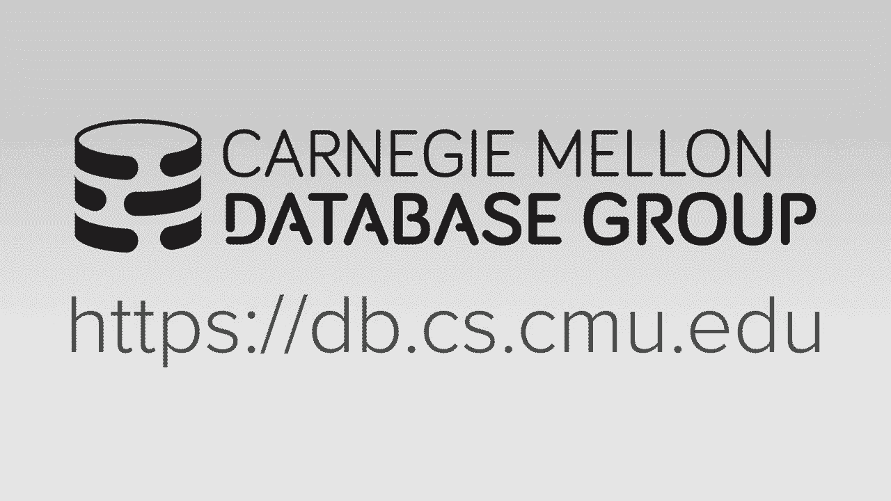
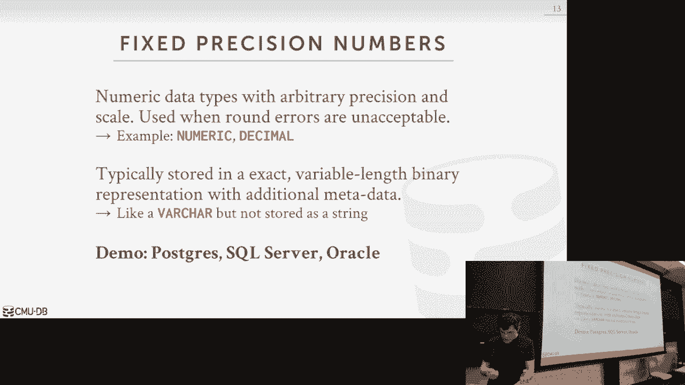
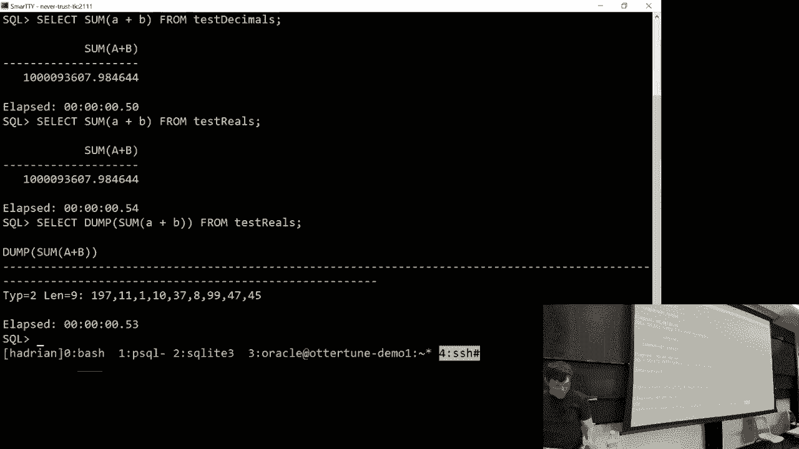
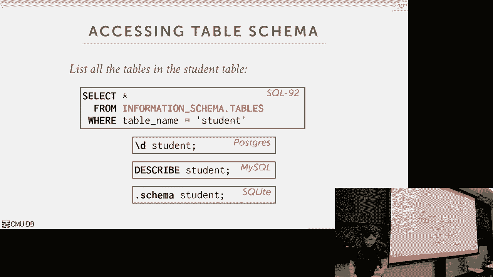
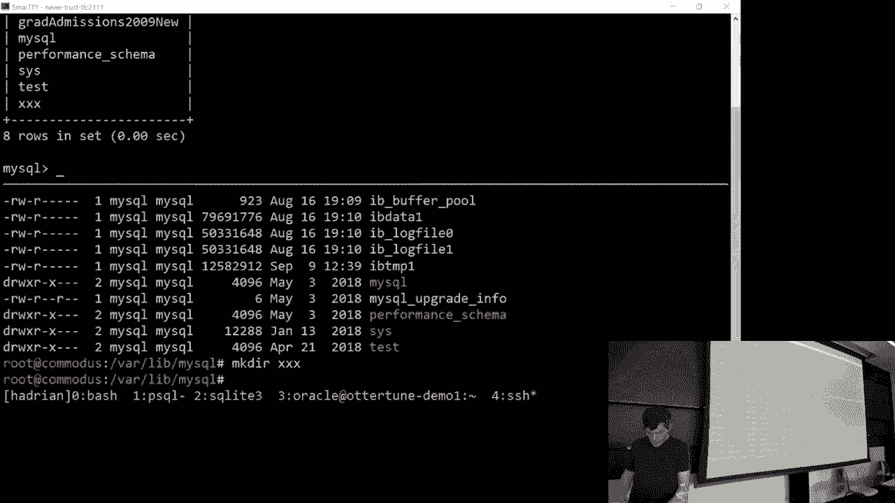
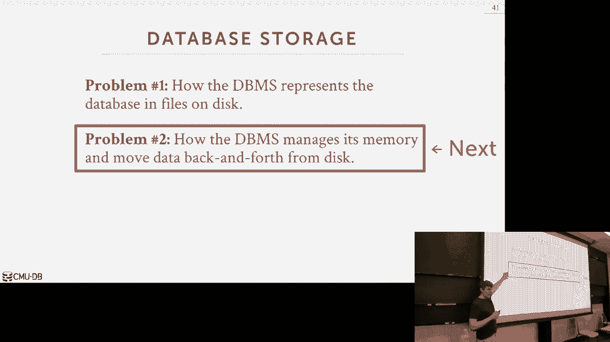

# 【双语字幕+资料下载】CMU 14-455 ｜ 数据库系统导论(2019·完整版) - P4：L4- 数据库存储 2 - ShowMeAI - BV1qf4y1J7mX

Oh guys let's get started again hit it，up for DJ chop tables，[Applause]。

how would you weekend who's having，whippets don't do that okay all right so。

other announcements other than huffing，whippets is that homework one is due on。

Monday at midnight it should be a little，spin oh great script a bunch of you've，already completed it。

who has not started Wednesday what did I，say Monday yeah it is Monday。

Wednesday whenever the 11th is right who，is not starting start just make sure，okay。

and the other thing we will be releasing，project number one on on on Wednesday as。

well again the lecture on Wednesday will，be all about what your toes to implement。

in project one and then so at the end，we'll talk about those sort of logistics。

of how you're gonna go about and do this，in the source code and then again that。

will be spending on great scope as well，okay all right so the other things that。

might be interesting to you or we have，some upcoming database talks that are。

sort of somewhat relevant to what we，talked about in the course this Friday。

over in the CIC building we will have a，talk from people from from Salesforce。

this is public Salesforce is building a，brand new database manager system to。

shoot at database system based on，Postgres a lot of my former students。

people have taken this class are now，working on it，in San Francisco in the brand-new。

buildings which are amazing and then，next week at the database group meeting。

on Monday we'll have our Goa who is，senior alum he was the former VP of。

engineering at mem sequel which is an，in-memory database that we can talk。

about later and semester she has a new，startup doing，analytic database stuff and he'll be。

talking on on Monday next week and then，the following Monday so two weeks from。

now we'll have somebody from Vertica，come give a talks to Vertica is a。

columnstore database system one of the，more famous ones that was invented by my。

my grad school advisors and got sold by，HP and they got sold off to a holding。

company a few years ago but believe it，not they actually have an office in。

Pittsburgh and so he's gonna come and，give a talk about what what you know the。

kind of stuff they're doing here and，when we one of the newer things Vertica。

is doing so if i have stated work，columnstore it won't make sense right。

now it should make sense by the end of，this this lecture okay because what will。

describe what that is and actually try，to give it up and running to give a demo。

like too many installation errors I gave，up okay，so again these are all free to the。

public there's pizza at this one and，these like fruit so you can plan your。

meals accordingly all right so last，class we we started talking about how we。

would want to design a disc cornea，database system and again I said a disc。

coordinate system is one where the data，system assumes that the primary search。

location of the database is on disk and，so we spent time talking on how we're。

actually going to organize the the，database at different levels within。

files within pages and then within those，pages within tuples and so the reason。

why we want to do all this is because we，want to be able to support databases。

that are larger than the amount of，memory that's available to us on a。

single machine and yes I know you can go，distribute it you can go across multiple。

nodes for now we can ignore all that，just saying you have a single box how do。

we bring data in when we can't fit it，all in d trance and so we finished up。

talking about a lot of pages this just a，quick refresher so a slotted page was。

how we're gonna organize tuples inside，of a page so that we we can move things。

around and we start packing in as many，tuples as possible so we have the slot。

rate at the top the fix and a very lank，to potat at the bottom and we just keep。

adding things from from the Gynt from，the end to the beginning and from。

beginning to the end until we reach the，middle we don't have any more space and。

so I said this is the primary way most，database minute systems out there that。

are roasts or systems which again I'll，explain where that is in a second this。

is this is primarily the way most，database systems actually do。

but it's not the only way and we ran out，of time we didn't discuss the other way。

and so I'm gonna briefly talk about that，so just again this is put it in context。

most what we'll talk about this semester，will be this organization the database。

system you'll be working on for your，projects will use this type of。

organization but again it's not the only，way another way is to do is called log。

structured file organization so the way，this works is that instead of storing。

the full tuple insider and set our pages，we're instead just going to store the。

the information about how that tuple was，created or modified right so what I mean。

by bad so let's say in our page we're，just going to start appending these log。

records and I'll think of it like mall，records like a text file that are read。

by humans think whistle is a log record，that's a some binary representation of。

what the change was so we record like I，inserted this tuple I updated this tube。

I deleted this tuple right and we just，all we have to do is just keep appending。

every you know every time you flip the，page we could go create a new one and。

start pending more leverage to that，anybody I guess why you want to do。

something like this yes it's easy to，potentially yes yeah like if I have a。

thousand if I have a thousand columns，and I update one if I need to roll back。

I didn't blow away the single update，record yeah that's that's one yes。

she says fast right absolutely yes so，memory said that in specially spinning。

discs hard drives but even modern SSDs，it's much faster to do sequential right。

since we want to read source quench with，access then random access so if I'm back。

in this mode and let's say I update you，know ten two pools but they're all in。

different pages now I have to go write，and update the the tuple owned across。

ten different pages but if I'm doing the，logs structure organization then I put。

my ten writes into my single page and I，can write that out in one go so you see。

so this idea is not new like it came out，late 1980s early 1990s，log structured file systems or。

applying the，ten years that this has taken off and，part this is because there you know。

things like HDFS or s3 right there's all，these - distributed file systems where。

there are pend only you can't do random，updates you can only keep appending。

records so this style of storing your，tuples is it works great for that so。

what's one obvious downside with this，she said read it absolutely yes so if I。

have to read a tuple now I gotta go back，in time and look at the logs and try to。

figure out what is what if the people，look like wait what what was the final。

result of the tuple right so if my look，see I'm updating so tuple here and I。

have a thousand columns but I don't，update one of them I got to go back and。

try to find where it inserted updated，the other thousand columns to put it。

back into the form that you want alright，so there's ways to sort of speed that up。

all right you can build indexes and say，well if I'm looking for a particular。

tuple here's how to jump to the，particular offset in the log that has。

the data that I want or another thing，you could do is say just go actually。

replay the log and compact it down and，to just it's you know just the one。

record per per tuple right so I can take，all these guys and then just convert it。

back into just you know is there a tuple，form so as I said this is more common in。

more recent systems some of these you，probably heard about HBase Cassandra。

there's a bunch of these distributive，systems that are out there that I，written and go。

things like cockroach DB where they're，all using rocks DB as the underlying，Storage Manager。

alright so the distributed execution，layer is all and go but then underneath。

the covers rocks DBS and C++ and so，rather than writing their own storage。

manager that is relying on this like as，an embedded system so rocks DB came from。

came from Facebook Facebook actually，rusty B is rigidly based on level DB。

level DB was written by Google then，Facebook took it first thing they did。

was remove M map right and then they，really released it as Roxy be so level。

DB still out there but pretty much，everyone uses rocks DB so again like so。

we're not really going to cover this the，rest of this semester it'll show up when。

we talk about distributed databases，later on at the end but for our purposes。

we'll just assume that we're dealing，with tirely slotted page systems。

okay all right so for today's class we，want to now go a little bit deeper and。

talk about how we're actually gonna，represent the data in tuples so again。

again we said the database is，represented by a bunch of pages so then。

we discussed up or how to break up the，heap file into pages and then when these。

page we talked about how to represent，the slotted array and then we said。

roughly inside each slot of the array，you have these slots then then you have。

your tuples have a header and now inside，the tuples we want to say what does the。

data actually look like for individual，attributes or columns how are we。

actually gonna represent that then we'll，go on and talk about how we actually。

store the metadata about what our what，our tables look like and then we'll talk。

about the storage model the rows store，versus column store stuff okay so at a。

high level a tuple is just a sequence of，bytes it's just a byte array right and。

it's up to the database management，system to be able to interpret that byte。

array and make sense of it and say oh，yeah it's if this is an integer this is。

a this is a float this is a string care，you know attribute so that's essentially。

all what we're doing here we're just，organizing our tuples as if these byte。

arrays and then when it comes time to，execute a query we need to interpret。

what's actually in those byte arrays to，produce the answer that we're looking。

for and so if this is what the catalog，stuff will talk about in a second this。

is how they're gonna figure out oh I，have 10 columns what first one is a。

32-bit integer the next one is 64-bit，float it uses that information decide。

how to interpret and decipher those，bytes so the way we're gonna use for。

most database systems away we're going，to represent data is for fixed length。

things like integers and floats is，usually the same way that we would。

represent this in like C or C++ this is，usually defined by what's called I。

Triple E 754 standard who here is heard，of that before，the 754 standard all right a little bit。

less than last year so the I took the 74，standards basically it's a for the。

industry it's the specification of how，to represent numbers and CPUs like。

integers and floats and things like that，how many bits you know where you know is。

it in big-endian little-endian you know，have the two's complement in the front。

all that is represented in that in that，standard，so for fixed-length types and integers。

big and small and tiny ends and then，floating reels we'll just follow the 754。

standard we'll discuss in a second about，the fixed point decimals but basically。

these are floating point and then these，are fixed point and this is something we。

and the data system will have to，implement for very length things。

varchars of our binary techs and blobs，typically there's a header that says you。

know you know here's here's the the，length of the blob I'm storing or the。

bar at the very lengthy odom storing may，be a checksum if it's a really big big。

value and then you have the the sequence，of bytes so this is different than。

representing strings and sees where you，have the null Terminator character we're。

instead could have a prefix that tells，us how big it is actually going to be。

for dates and time stamps this varies，wildly across different database systems，this。

most of the systems usually just store，the you know the number of seconds or。

microseconds or milliseconds since the，UNIX epoch which is like January 1st。

1970 for Windows I don't know what they，do and so in a bunch of systems - also。

you can say oh I want the date without，the time or I want the time without the。

date underneath the covers are still，going to store the full timestamp it's。

just the API that you use to access that，data knows that strip out whatever part。

you don't need all right so some systems，will actually just pack in just the date。

and we store that as a smaller smaller，value a bunch of systems actually don't。

do anything so again this is something，we have in our database system this is。

something we implement our database，system but the for the fixed point。

values this will just rely on you know，whatever c++ gives us which should be。

underlying hardware all right so the，thing we're gonna go talk about now。

there's more interesting is again how do，we actually compare these to the fixed。

point versus floating wooden decimals so，if you want to have floating my decimals。

or very precision numbers I these are in，exact numbers that the CPU gives us or。

like your c++ gives us because i you，have a c program and i call you know a。

declared variable float whatever and，give it a verbal verbal name that's what。

we're getting when we claire a real or，double or float in our database system。

as like the sequel type again this is，specified how you actually represent。

this like the decimal point and the，scope in the precision all that's。

defined by the 754 standard so these are，gonna be much faster to executors to。

operate on then the fix point decimals，the potato system provides because the。

CPU has instructions to operate on these，very efficiently writes one instruction。

to take to float floats and add them，together or subtract them but when we。

talk about dealing with the fixed point，ones that's a whole bunch of stuff we。

have to write and that's mean way more，instructions so this sounds like what。

we'd want to use right because it's fast，the palm is though there's gonna be。

rounding errors because the 74 standard，like there's no way to exactly store。

decimals in in hardware so they have to，approximate this right so here's a。

really simple C program I normally don't，like the show code in class other than。

sequel but this is simple enough I think，you know you should be able to。

comprehend it from your seat so all，we're gonna do is we have two floats x。

and y and then we're gonna print out the，value of X plus y and then we're just。

gonna print out the constant 0。3 so you，pick your favorite compiler I use GCC。

and when you compile it you get this，answer here right that looks you know。

that's correct right that's we would，expect but all I'm doing is just doing。

your percent time app I'm just asking，that the languages to print out the the。

floating-point and let it do whatever，rounding it wants to do when you specify。

what precision you actually want so I'm，gonna go into 20 decimal points then you。

see that you get a totally different，number same exact code same exact values。

it's just when I represent it in a human，readable form now I'm seeing I'm way off。

right I can't even get 0。3 correct I can，this is because the harbor can't exactly。

represent floating-point numbers too you，know precisely right so again this will。

be faster for us to execute but we're，gonna have rounding errors so now you。

know this means you may think all right，0。3 my little example here who cares。

where there's a rounding error but if，it's your bank account then you start to，care right。

or if it's a scientific you know，instrument where you trying to send。

something into space these round hairs，cause real problems so to avoid this you。

use what are called fixed precision，numbers or picks point decimal numbers。

so again these are something that the，ATM system has to implement to represent。

these values it's a bunch of extra code，that can take care of all the you know。

arithmetic operations or aggregations，you normally wouldn't want to do on any。

kind of number right so the way you know，show how Postgres is gonna do this in a。

second but the basic idea to think about，this is you're gonna store that value as。

like a varchar' the actual like human，readable representation of the value and。

then some extra metadata to say here's，what the decimal point is here is what。

the scope is here's the rounding，information right and that's all packed。

in with the tuple itself just as part of，that that byte array so I always give。

this demo every year of Postgres and，sequel server right normally I nobody's，given Postgres。

but we'll try for Oracle and single，server as well so let's see what the。

performance difference is from these，different for these different types。

turns off why is that readable all right，so what I've done is I've created a I。

wrote a simple Python script and all it，did was create a giant CSV file that has。

ten million rows of to floating-point，numbers right that's all it is。

you just put random numbers so I can，load this I'm gonna create two tables in。

Postgres I'm gonna create one that uses，reals and one that uses the the fixed。

point decimals alright so there's one，for reals there's one for decimals and。

then Postgres has a nice command called，copy that will take a file that's on。

local disk and then take the output and，write it into the table various database。

systems have various commands and secret，servers called bulk in in my sequel it's。

called load into whatever Oracle was was，a pain to set up but I got it working。

so now we're going to do is we're gonna，run a query that just takes the two。

numbers and add them together so let me，turn on timing as well and then because。

this is Postgres 10 Postgres 10 added，support for parallel queries so like you。

know take a single single query and，split up across multiple CPUs and run。

them in parallel so I'm gonna turn that，off as well just so we see like the。

performance of a row you know a single，CPU I'm gonna do this for all the other。

systems as well so let's see how long，would take if I do it with the reals so。

if you've never seen this let me go back，to the syntax sorry so populate says。

explain analyze so if you never seen，explain what explain does and put it in。

front of any sequel query and instead of，actually running the sequel query it。

tells you what query plan it's gonna use，to execute this query all right doesn't。

actually run it says here's what I'm，gonna do if I ran it different data。

systems have different syntax that's，what Postgres and my sequel do right。

we'll explain what a query plan is well，I'm gonna optimize it maze optimizer。

optimizer is late in the semester but，basically what happened you know just。

saying like you wanna run this query，here's how we're gonna do it so but if I。

add the analyse calls in front of it，then this is actually gonna give you the。

query plan and also run it for real so，you see that it basically took twelve。

twelve twelve hundred milliseconds so，1。2 seconds to run this and then to show。

you if it's not a caching effect I can，just keep executing over and over again。

and the performance I got little faster，because it got in the cache but it。

should stabilize yeah about 800，milliseconds all right so let's do the，so 2。

4 seconds I run it again we should，get a little faster cuz it's in cash not。

much right so again to same values same，data set loaded it as different data。

types but though the one query is is，twice as slow because we're doing all。

this extra stuff to deal with the，rounding and other things all right and。

you see that let me see if I try to run，skin are getting the same values all。

right they're getting given values here，right because it's because there's some。

rounding issue issues so we can try to，cast this there's a desk mole and then。

it'll be human readable right so this is，this is much different than this one。

here right this is you know one and this，starts with it with a nine so the the。

real one is having rounding issues so，let's try the same thing in in sequel。

server the data is already loaded so we，don't we don't need to bother loading it。

again so let me run this so this will be，with the reals produced as a result and，again。

just see whether it gets faster not much，and then I'll run the same thing now。

with the on decimals and it should be，slower yeah twice as slow we run again。

disapprove right and there's this little，max dop it's the degree of parallelism。

it's basically telling sequel silver，again run it with one one thread the。

last one on my show is Oracle and I had，a breakthrough this weekend I figured。

out how to get the up keyed at work so，it was not not by default。

alright so it's already loaded I'll do，the same thing where is it Oracle so。

run it with the reels and you get 0。53，runabout decimals the same slightly。

faster even so the way what's happening，here is that Oracle actually gives you。

the fixed point decimal no matter what，you need ask you with the real or the。

the decimal it always just gives you the，decimal right and before you say oh look。

how much faster Oracle is any other ones，again for this one here like I didn't。

turn off multi-threading but also looks，like is rounding off a lot right this。

looks way off than what we'd expect from，Postgres and seagull server and that's。

because Oracle has this thing where if，the size of the output is not doesn't。

fit in whatever characters you specify，but there's none with thing then it。

rounds it for you automatically took me，a while to figure that one out but。

here's actually what you get when you，have the real number so that looks like。

what we expect so again this is，something that just be mindful that you。

know this is we have to implement in our，database system this is not something。

that you know will magic go faster it's，not something that we can rely on hard。

to provide for us yes question is it，doing rounding along the way is it only。

at the end as far as a note here but，this stupid numb lip thing it's rounding。

on the client side so the server is，giving you this and then it rounds when。

it lands on the client why for whatever，reason I don't know right and in。

Postgres in my sequel you can are so，Postgres in siegel server like you can。

specify the round there's a round，function we could do on the server side。

so I think we can do something like this，round and then you say what - what。

precision you wants it like - nope，difference isn't that different thing is。

that I think that's my sequel syntax I，don't know I don't know what Postgres。

alright so you do neut but in your，application you want to do it。

client-side or sorry server-side you，want the server to do for you don't want。

to assume the clients gonna be，formatting whatever for you yes。

so it looks like in the Oracle one that，here so his question is it looks like。

Oracle is giving us the value of the，real and not the floating box yeah hold。

up let's see those three that that's，let's try sequel server sis that's who。

we'll assume that's correct because it's，sequel server but so that was nine。

something and let's see what this gives，us nine something it looks the same。

right yeah that's that's that's，different than what the reals gave us。

I think reals was giving us like seven，point seven and this is seven point five。

so going back to Oracle are say that's，press press too many terminals yeah but。

it's the same hmm I don't I don't just，type it as live but link to。

so maybe that it that is it's always a，decimal sorry it's always a real not the，fix point okay。

I'll double-check that I declare it yeah，I definitely declare it as a decimal all。

right let me figure what's going on I'll。

play some Piazza okay any questions all，right cool，so let's look so what if poster is。

actually doing can Postgres sequel，server an Oracle or not and the source。

Postgres is if we can't look at it so，this is actually from the post go source，code version 9。

6 I think，and so when you declare a fixed point，decimal this is what it stores it stores。

this struct so you again you have all，this extra metadata about what the where。

the decimal is what the sign is and so，forth and then this part here as I said。

this is just a string representation of，what the real value actually is and then。

at runtime they know how to take this，and decipher it based on what these。

values are set to to ensure that you，have the correct commutation so now why。

is it running twice as slow so we're，gonna yak again and look at the source。

code to say how is actually doing，addition you see it's not just you know。

one instruction you know number plus，number it's just giant switched a bunch。

of stuff to try to figure out you know，if it's negative or non-negative it's。

zero or if they're equal to each other，right so we're executing this for every。

single time we compute those you know，number plus number whereas if it's a。

real is if it's a floating point number，it's one instruction than the CPU so you。

know we don't have the source code for，sequel server an Oracle but I guarantee。

they're doing something something，similar，roughly okay so is this clear okay so if。

we don't want to lose data due to，imprecision we use a fixed point decimal。

but this is something we have to，implement in our database system for us，okay。

so now we will talk about what happens，when the value of the trying to store is。

too large and doesn't fit in a single，page there's two ways to do this so in。

general as I said last time the size of，a page is going to be fixed throughout。

the entire table mostly throughout the，entire database this is something you。

set when you turn the system all and you，say I want to have you know 4qi pages or。

8 kilobyte pages db2 allows you to play，around with the page saw。

per buffer pool but in general for let's，assume that's the case so now what do we。

do if the thing we're trying to store，doesn't fit in a single page right well。

an obvious thing to do is have what's，called an overflow page so basically in。

our tube let's say this value this，attribute C here doesn't fit in the page。

so we'll just have a pointer now to some，other overflow page that'll have the。

data that we want so this could just be，another record ID like a page number and。

an offset to tell us where to find this，particular data that we need so then if。

we now have a query and we need this，attribute or value as part of the output。

we'd have to follow this pointer and go，bring that page and copy the data out。

and produces an output now this data，isn't fit in this page by itself - you。

can have another you know overflow page，pointer to some other thing out you know。

some other page and we just you know，chain them all together to produce the。

output that we're looking for so，different database systems have。

different names for this in Postgres is，called toast in sequel server and my。

Siegel the card overflow pages and they，have different specifications that when。

they would actually use use something，like this so in in Postgres if the value。

trying to store is larger than two，kilobytes then it always goes to this。

other thing in sequel server it's just，two per doesn't fit in the page it pulls。

it out and put them to another page and，my Siegel is half the page so the reason。

why you'd want to do something like this，is because you get all the protections。

you normally would get when these，overflow pages with your regular data。

meaning if I'm writing to this overflow，page and I crash and come back I don't I。

don't want to lose anything right，there's all the optimizations you can do。

with the overflow pages that aren't easy，to do in the regular a lot of pages as。

well like in Postgres for example since，most of the time these overflow pages。

are read-only or read mostly like you，know think of like a Wikipedia you。

update the you know an article or update，an entry but most the time people just。

reading it so therefore I could just，compress this when I put out the disk。

for keeping in memory and because the，most the time I'm never gonna have to。

decompress it to update it so the month，of optimizations like that and they all。

come under the same protections as you，normally would with regular data pages。

or regular tuple pages another，alternative instead of storing it。

directly inside the database is the use，what's called external storage and the。

basic idea here is that we're not，actually gonna store the data for this。

particular attribute in the tuple itself，we're just gonna store a pointer or a。

file path to somewhere in on the local，disk or a network storage or some。

external storage device where this this，data can be found right so in this case。

here going from C this could be a file，path on the local disk so say you know。

here's where to find this particular，attribute if you ever if you ever need。

it right so in the systems that do，support this like Oracle and db2 and。

Microsoft you can't actually modify，what's in this file right you can read。

so his great question is or statement is，for the over lo page disk is brought。

into memory just like a regular tuple to，page correct in the case of these。

external files where do these things，reside music so if if you if you run a。

query like select star run this tuple，here and sees in this external file if I。

need to produce it as an output I gotta，go read it in so it could page it in。

just like another another tuple or other，tuple pages，it could be ephemeral meaning like I'm。

gonna read it and then immediately，discard it rather than polluting my cash。

there's a bunch of different ways to do，this but the key thing to think about is。

like if someone in now outside the，database modifies this file will see。

that change inside of our database any，time we go to read it because there's。

outside the control or the protections，of our database system all right so。

everything I guess why do you want to do，something like this well what's an。

example of a file maybe don't want to，store in the database system say you're。

building website right and you have you，have a bunch of video files you want to。

you know and you have a tuple that says，you know this person uploaded this video，you don't。

store the video in the database itself，because that could be you know gigabytes。

I said it's very common to see that and，those kind of things right the the。

application frameworks like Django，nodejs and things like that they have。

they have you know built-in ways to，store data outside the database system。

for images and other things so there's，no there's there's no sort of set in。

stone rule to say how big a file should，be but when you know to put it out as an。

external file versus keeping it an，overflow page I'll say also to for the。

overload pages this is transparent to，you as the application so you don't know。

that you've gone to an overflow page，like you can go do what we did before。

and look at the actual layout of in，low-level information about where our。

data is actually stored like we did with，the CT ID and Postgres and the other。

systems but most applications don't know，don't care that's stored in an overflow。

page like I wanted to get my data out，for this thing again you depending on。

how you actually house actually，implemented you could go through the。

Davison or you could just jump to the，file and go get it directly if you。

wanted to so the there was a paper，written almost 10 years ago over ten。

years ago by some famous davidís people，at Microsoft miss the the name of the。

article was to blob or not the blob or，blob is a binary large object I just。

it's a variable length binary data and，they basically found back in the 2000s。

that anything below 256 kilobytes you，want to store as an overflow page。

anything larger than that you want to，storage，we had the guy that mented sequel Lite。

come to CMU a few years ago came give a，talk here and he said that for a lot of。

cell phone applications is actually，better off to store the the thumbnails。

from images even up to one megabyte，inside the database system because it。

would that that was much faster to read，those records from the database system。

because they already had the file open，rather than having to follow this。

pointer to the file system and then do，the you do the F open to go get the data。

so again there's no hard and fast rule，what to do，this is also more common when when。

you're you know the database storage is，super expensive right if you really care。

about your data or your database your，views you're gonna run out on high-end。

hardware and therefore storing like a，bunch of video files in some really。

high-end enterprise this is probably not，a good use of your money so you can take。

this you know these files chuck it in，HDFS or cheaper stores I guess three and。

then now the days hasn't is not，overburdened with trying to maintain。

your files so again it's not just not，just performance reasons the other。

economical reasons why'd you want to do，something like this but this paper I。

think summarizes a bunch of the issues，that's why I like it，so again so any questions have a good。

represent data most of the times you，know for fixed length data it's just。

whatever the programming environment，gives us for anything that's variable。

length or if we want fixed point，precision that stuff will help implement。

ourselves okay so now let's talk about，how what how we actually figure out what。

our tuples look like so again this is，what the system catalogs are for it's。

the metadata about the data metadata，about the database what comes I have。

whether table names or indexes I have，and so forth as well as some other。

things like you know user permissions，and security stuff which I don't care。

about and then this will come up later，on when we talk about query optimization。

but also internal statistics about what，your data looks like how many you know。

how many unique values do I have what，does the distribution of those values。

look like so pretty much every single，database system is going to store their。

catalog inside itself as just just，another table so like eating your own。

dog food so I'm gonna store all the，metadata about my tables in just tables。

themselves all right and so inside the，source code you obviously don't want to。

write sequel query to say you know，what's the name of this table because。

it's chicken for the egg problem like，how do I do a sequel query on a table to。

find out the table name if I need to，know a table name right so you usually。

have like some you know C+ clip sepals，code whatever your theater system is。

programmed in to wrap around the，low-level access methods to go access，the catalog。

so the most David assistant will expose，the catalog through the standard。

information schema API so in the 1980s，all these different database systems all。

had their own way of saying here's my，catalog here so here's how to access it。

and that became a real pain in the ass，now if you want to take your application。

and port it to there from one database，system to another because now all the。

catalog stuff is different and you got，to rewrite all your code again so in the。

ANSI standard and I think also in the，sequel standard by now they'd specify。

this thing called the information schema，that that every data system has to。

support to say here's the the metadata，that about my tables but we'll see in a。

second bail always exposed the same，information in these tables that all the。

Davises was all gonna have their own，what sort of shortcut ways to go get。

this information as well so for example，say if you want to get the all the。

tables we have so the sequel standard，would say you write it with this。

information about tables which is just a，view on top of the real catalog and you。

give it the catalog name right or the，database name in Postgres you use /d and。

my sequel you shoot tables sequel edits，dot tables and then again all the data。

systems all have their own shortcuts and，essentially what they're doing。

underneath the covers is converting this，command into something like this same。

thing now if I want to get this schema，for a table so again this is how we do。

it in the ANSI standard and then the，various systems all have their own own。

way of doing this so I want to go a。

quick demo of Postgres and my sequel，again just to show you what's actually。

all right so it's again Postgres if I do，dash D I get the list of all my tables I。

can do dash D plus and get more，information and then if I pick a table。

it'll tell me what you know what the，metadata looks like so here's all the。

columns that I have here's the types I，have something now when I run my query I。

look at this information say all right，at the first attribute is an integer I。

asking me 32 bits the next attribute is，also an integer that's gonna be 32 bits。

and then I have code inside to say all，right if I'm operating ones tuple what。

is the schema I know how to again do，that do the conversion of the raw bytes。

of the byte array for that tuple and put，it to the form that it expect all right。

so let me see if I can do this for my，sequel I think I just destroyed my。

sequel let me do this on a another，machine so I can say show tables and。

tells me tables I have I can say show，databases same thing here's all the。

different different databases they have，and then for a given table I can say。

describe knobs right and I'll just say，again same information here's the name。

of the field here's the type and then，some extra metadata so this is my sequel，5。

7 the newer version actually stores，the tables in the catalog itself or they。

start service the catalog and the tables，itself in this version here they didn't。

do that all they would do for the cowell，is just read the directory of where the。

the database is stored and use that to，figure out what databases are there and。

what what tables are there and so we can，actually break it or fake it out by。

putting things that shouldn't be there，in that directory alright so if you go。

so do show databases and it thinks I，thinks I have a bunch of these here。

right so now if I go back to this，machine login as root go into where my。

sequel stores its data live my sequel，right and roughly you see that there's a。

bunch of you know there's a bunch of，directories here for the databases that。

it knows about but the data is called，tests there's a directory called test so。

what happens if I call now make，directory xxx well I want to go back up。

here my sequel thinks there's a，directory called xxx so so this is a。

good example of where if we rely on，things X terms of the database system we。

can't fully control that so my Siegel，can't prevent anybody from going to that。

directory and putting better at once in，there but if it's but it's relying on。

that to figure out what's in my database，so from an implementation standpoint it。

might be easier but from a correctness，standpoint that's problematic。

they may say who's gonna be stupid，enough to go create directories to screw。

around with my sequel well what about，other things like I'm writing the files。

then you know that I don't have the，regular protection I would for my。

regular data because I'm not logging，things correctly right we want to put as。

much as possible inside the database，system because then we can rely on that。

to perform correctly for us okay all。

so that's it that's all we really need a，cover for catalogs this semester just。

kidding just be aware that there's，something that inside the dating system。

wherever of what our schema looks like，and that's we're gonna use that when we。

ask you queries use that when we build，indexes to determine you know what。

should we actually be doing and the way，to think about this the different types。

is that in the and there's easiest way，to implement this and you'll see this in。

the bus hub code that you guys work on，when you look at the type system it's me。

a giant switch statement right if the，type is integer do this if the type is。

to float do that and so you're doing，that for every single tuple and that's。

actually gonna be really slow because，they're actually interpreting you know。

what the layout should be and in the，more advanced systems you can actually。

compile or do code generation to compile，on the fly like just-in-time compilation。

in the JVM to actually compile those，operations so that you don't have to do。

that interpretation every single time my，C code doesn't do that new versions。

Postgres does that but Oracle and sequel，server should do that as well all the。

major commercial systems do that that's，not something we're to cover in this。

class but when we cover a query，execution I'll bring that up to say this。

is a way to write to make this run，faster all right so the next thing we'll。

talk about is this for storage models is，the first thing if they realize that。

we'd covered in the first lecture is，that the the relational model doesn't。

say anything about how we actually want，to store data doesn't know about types。

doesn't know about you know byte up byte，arrays and so forth and it doesn't。

necessarily even say that we have to，store all the attributes of a tuple。

together either in memory or on disk，right and so again anytime we you know。

so far in the class when we visualize，databases now I'm saying here's the row。

here's all the attributes for it right，for a tuple but that's not that may not。

be the best way to do that for some，workloads so let's look at a really。

simple database example here right this，is actually derived from the MediaWiki。

software that runs wikipedia like if you，go look at look at their source code。

it's all PHP with my sequel you look at，the DDL file the sequel file it'll look，tables。

we have user account pages and revisions，and so the revisions table is where。

we're going to store all the new updates，for every single article so it's a kind。

of a foreign key reference to the user，that created that made the change and。

then a page ID that corresponds to the，article or the page and this guy then。

also has a foreign key preference to say，here's the latest revision for this。

particular page so you don't to do a，scan you just can jump in directly to it。

again this is a certain approximation a，cleaned up version of what Wikipedia。

actually does but for our purposes in，this lecture here it's fine so there's。

two sort of general class of workloads，we're gonna care about in database。

systems you know they're certainly not，the only ones as machine learning and。

streaming stuff but for now is this，focus on just two so the first is called。

online transaction processing or OLTP，who here has ever heard that term before。

OLTP phew okay good so this is usually，what you're gonna get end up with this。

type of application any single time you，you're building your you know building a。

new application and if I'm building a，new website I'm building a new iPhone。

app or whatever you're typically gonna，building one of these and so for a。

transaction OLTP online transaction，processing the idea is that this is。

where we're getting new information，we're ingesting new data from the。

outside world and putting it to our，database system right so these queries。

can be really simple they're only gonna，read a small amount of data or update a。

small amount of data every - do be doing，those same operations over and over。

again so the example I always like to，give is it's like the Amazon storefront。

all right the website you go to when you，buy stuff that's considered an ode to。

the application because I'm adding stuff，to my cart I'm making purchases I'm。

updating my account information I'm you，know for each of those single operations。

they're doing a lot of them because I，have a lot of people buying stuff but。

for you as just you as one customer，you're not updating a lot of data you。

know you're updating your account，information you're updating things are。

your shopping cart so the queries that，are running are only doing a small you。

know the only you know accessing the，small portion of the database so then I。

said the type of queries you would see，again going back to the BPD example so。

here's go get the here's ago get the，current revision forgiven page here。

update my user account to say that when，I logged in and here's here's a you know。

simple insert query to insert a new，revision write each of those the these。

things are accessing a small number，smaller number two goes at a time and。

we're but we're doing these things over，and over again so now the other type of。

workload is called OLAP or online，analytical processing and this is when。

you've already collected a bunch of data，from your OTP application and now you。

want to analyze it and extrapolate new，information from it，right this is sometimes called you know。

not only say data science but that realm，of like taking a bunch of data you have。

and trying to derive new information，from it with that yeah I mean it's in。

the name online amical processing a，business intelligence there's another。

phrase for this decision support is，another one big data if you want to call。

it that right again I've in this，workload in this environment were not。

updating data right there's a whole tree，saw it's getting that new information。

for us and now we're trying to make，sense of it so a query might be on a。

Wikipedia example say you want to count，the number of people that have logged in。

per month that where their host name and，what ended with dot-gov there was a。

scandal a few years ago where they found，members of Congress were painting or。

having their employees go to Wikipedia，and scrub them clean to remove all like。

you know whatever scandals the，congressman was involved in right so you。

want to figure out all the people that，are logging in from from sitting at the。

at the government doing this so these，types of queries are gonna be read-only。

they're gonna read a lot of data like，I'm gonna scan the entire table right as。

opposed to OLTP where I'm updating one，thing I'm gonna just do a lot of joins。

right I know it's me you you you you，usually don't see a lot of joins so one。

way to get to grossly characterize these，workloads is that on one end the we know。

one acts as you say house how complex，are the queries are they're really。

simple like they're you know you're only，accessing a single table or are they。

doing complex joins and then what are，their right heavy or read heavy so all。

of TP would be down on this，this and the spectrum they're pretty。

simple queries and but they're doing a，lot of Rights oh that would be doing a。

lot of reads but they're more complex，and then this sort of this new class of。

workload called H tab or hyper，transaction analytical processing that's。

sort of is trying to do both of them，right you still want to ingest new data。

but you want to analyze it as it comes，in now you see this a lot in anybody。

wants to do decision-making on the fly，you know as people are browsing websites。

you see this a lot in like internet，advertising companies so so now given。

that we know about these different，workloads now we can talk about what is。

the right storage model to support these，workloads more efficiently so again the。

relational model doesn't say anything，about the layout but we can be mindful。

of this when we decide how we want to，build our data system yes okay so this。

question is what is the relation of OLAP，to no sequel or new sequel systems so I，would say so。

then wonder what no sequel is who here，doesn't know what no sequence ok so and。

most we haven't heard of no sequel or，new sequel so these are workload types。

so so and what you're describing new，sequel versus no sequel those are sort。

of system categories so the other，question is we know what is MongoDB for。

what you know what is the know see good，for so that the traditional no sequel。

systems MongoDB Cassandra Redis they，would be at this end of the spectrum。

they're about ingesting new data right，[ __ ] has some support to do some。

analytics but when we talk about the the，column store stuff there not a column。

store they're gonna get crushed by it by，any you know column store database you。

wouldn't want to do hardcore analytics，on a MongoDB you can will support some。

queries to do this my sequel post，personal support some queries that that。

would would fall under the OLAP category，but they're not going to be as efficient。

as as running on a column store system，so no sequel，basically there was this movement in the。

in the late 2000s where all these all，these all these companies are basically。

saying look Google made it make is，making a ton of money and they put out。

this system called HBase or some，knowledge with BigTable and this thing。

called Hadoop and they're not doing，sequel they're not doing transactions。

they're not doing joins and that's how，the able to scale so all these people。

ended up building these no sequel，systems like [ __ ] and Cassandra that。

sort of fall dunder you know to try to，follow those EDX or design patterns and。

to support you know sort of modern you，know software 2。0 or web 2。0。

applications right but they would follow，on fall under this Hadoop is OLAP but。

like BigTable saundra MongoDB and those，guys are over here then what happened is。

people realize oh well I actually do，want transactions I do want sequel I do。

want to do some joins and that's where，the new sequel movement came along and。

this is what I was working on when I was，in grad school and actually if you go。

read the Wikipedia article for a new，sequel he talked about my system was the。

first one of the one of the first new，sequel systems right and this is because。

I wrote the new sequel article Wikipedia，so I could say whatever I wanted。

but the idea was they were trying to do，you know they're trying to do fast。

transaction processing and OLTP without，giving up transactions or giving up。

joins the way the no sequel guys did，now there's other no sequel systems you。

could say or like you know again the，there's a bunch of systems out there。

that don't do relational model that you，wanna do analytic so on but primarily。

most people think of it thinking of，these guys down here I would say that。

the claim no sequel they you know first，they're like oh we're not gonna do。

sequel sequel stupid and then it came，out everybody but [ __ ] now supports。

some variant of sequel so then they said，oh no seek overly me is not only sequel，[Music]。

but and some of them actually are，starting at transactions like MongoDB。

has support for a full fledge distribute，transactions so all the things they。

claimed that were a bad idea you know，idea，Siegel's not gonna die anytime soon。

people have tried to replace it right，they've been people are thought with a。

bad idea in the 1970s 80s 90s and 2000's，it always comes back right it's what。

people want it's not the grim I like it，because you know this is what I would I。

grew up with but there's certainly ways，to improvements people try to do this。

but it's a core idea of declarative，language on top of your data is I think。

this is even one of the major，contributions of Ted Cod's work in the。

1970s yeah I did that there's a long，soliloquy does that answer your question。

okay we can talk offline about if you，want my opinion of other systems okay，okay。

everything we talked about so far when，we took when we show rows and tuples。

sorted tuples like this is why I'd want，to use a turn row because when we talk，sense。

but every time I showed a tuple I showed，it as a row right and this is called the。

n Airy storage model and so basically，idea here is that we ran take all the。

attributes for a single tuple and we，restore them continuously in our pages。

now again we can have the overflow pages，- you know for large larger objects but。

in general it's all going to be aligned，together right so this is going to be an，idea 400 TP because。

began the amount of data we're going to，access is gonna be small in these old。

speed queries and it's gonna be，accessing for single entities go get my。

account information go get my orders and，I want all the data for that you know。

you know for my account I don't care，about all the other you know millions of。

customers I did want my information so，if a roast or that's actually really。

efficient because I just jump to the one，page that has my data I get it and I'm。

done all right so let's see what this，looks like so again using the Wikipedia。

example so say this is a single page so，we have a header I can assume this is in。

the slotted slotted page format we have，our header and then we have the user ID。

username user past host name it Lazlo，again and so when we add only after that。

we have the last attribute for our tuple，then we have all the other tuple tuple。

data right everything is continuous to，each other so again so now if I store。

this in my database I can represent this，in a single page so now if I have a。

query that says get all the account，information for a given user name and。

password I can do a lookup and an index，which we'll cover in in lecture seven。

but that's basically they tell me hey，here's the page ID and slot number that。

has the tuple that you want I do one，seek I do one reading fetch that page。

bring him to memory and I can jump to，exactly to the location that has the。

data that I want right so again although，it's we workloads are gonna look a lot。

like this go getting the data for single，entities or small number entities so。

having all the data for a tuple，contiguously each other is the most。

efficient way to do this alright same，thing about one do an insert I my insert。

query is gonna have all the data，contiguous anyway so I just find a free。

slot and there's right at all all at，once and then flush this this out and，it's one disk right。

ignoring a log yes so this question is，from what purpose would be useful to。

segregate the data into pages okay so，let's look at why this is the bad idea。

for some queries and then we'll see why，it's a good idea to segregate it alright。

when we talk about the decomposition，storage model at the columns for stuff。

all right so let's look at example where，the row store is a bad idea，so let's。

taking that query I showed in the，beginning where we want to get all the。

people from the government that are no，modifying Wikipedia pages when they。

shouldn't so we break down this query，right we look at it we realize we're。

actually gonna need to touch all the，data right because there's a full。

sequential scan across the user account，table to find all the people that you。

know look at all the user accounts look，at their host names I assume we don't。

have an index for OLAP you usually don't，have indexes for for these types of。

queries all right so now if I go read，say the first page I read is this one。

again we're in a row store here so I，look at my query I want to first do a。

where clause is to look up the host name，and try to match up my pattern if it。

ends with gov so that means I basically，just want you know these values here so。

as I'm scanning along I look at my，catalog and says well I know I have for。

this table I have five attributes and，you want the host name so that's that。

this all set so I go read them but I，want and then I get to the end and I'll。

jump to the next one and so forth the，other part of my query is that I have。

this group I where I want to aggregate，them together based on the login because。

I want to get it per month and then all，right and then produced that as my final。

output it's the count number of，government employees that are logging in。

for each month so satisfy this part of，the query I only need this column here。

this attribute just the last login field，exactly so so I had to read this whole。

entire page again I can't and in memory，I said in non-volatile storage devices。

it's a block based API so I can't just，say just get me exactly these this data。

I gotta go bring in the entire page so，now you have all this these columns here。

that I'd never even access at all，in order to exit this query but I had to。

bring it into memory from disk to in，order to get to get the two columns that。

I actually needed so doing analytics on，a row store is is gonna be painful if。

you have a lot of data right my example，here I have six pages who cares but if I。

have you know petabyte，and in this case here three out of the，five columns that I'm bringing in or。

atrás I'm bringing in is useless for the，particular query then that's a bad idea。

that's an inefficient use of the，hardware so again the NRI storage model。

the rostral row storage model is we，really fast or any inserts or updates or。

deletes when we're accessing the entire，tuple all right we want all the at rates。

for a single tuple and is usually just a，small number of tuples at a time but if。

you have to do analytical queries and，the OLAP workloads we want to scan large。

portions at the table then this is gonna，suck because we're gonna bring a bunch。

of data in that we don't may not，actually need for for our query so now。

it should be a sort of obvious that this，is where the comps or stuff comes in。

where instead of storing the all the，attributes for a single tuple together。

in a single page we're actually going to，store all the values for a single。

attribute across all tuples in a single，page I sort it's in this is where the。

column name is we're just storing all，the columns together continuously sorry。

all the values within a single column，continuously so this is me fantastic for。

our OLAP workloads where we're read-only，and we only want to read up a subset of。

the the of the theatrics for a given，table right so again going back to our。

example here so this is what it looks，like as a row store but so say now we。

just take every single column and we're，going to split that up and now then。

within a single page we have just the，data for that column so here's all the。

host names together and we had the same，thing where user ID last login and the。

other attributes for this table here，alright so forth like that so now I come。

back to this query we had before so the，first thing I need to do is do my where。

clause on hostname so now I just need to，know all I have to do is go bring in the。

hostname page wrong color but ignore，that I just bring the hostname page in I。

can then rip through that quickly say，look at every single hostname and do my。

my predicates now I have a bunch of，tuples that matched so then I go back。

and bring in the bring in the last of，all game page and just jump to the。

locations that I need within that and，did I，I want to produce my answer so say in a。

real simple case here that the last，login page is one last login data is one。

page the host name is another page so，before I had to scan all the pages and。

this one I didn't only have to scan to I，can't think of in extremes if I'm。

talking about billions of pages I then，that that's a big difference。

yes so this question is are we storing，the primary key with each columns is。

your real question is how do I figure，out I had the host names that match how。

do I then go look up in the last login，column and figure out how they match，next slide。

perfect and you have questions so the，blows are other stuff we can do with。

this that we're not gonna cover in this，class but the most of other advantages。

you can get and actually if you come to，the vertical talk in two weeks Vertica。

is super famous for this so with the the，row stored model all the values within。

or the attributes within the tuple，they're all you know roughly different。

domains right this is gonna be a，username this is gonna be host names。

it's me last login we're just gonna look，a timestamp right it's all sort of。

jumbled together and so if I can then，pack them all this data together that。

are the same column now that's one of，compression techniques I can do because。

I know they're gonna be all the the same，type right so let's say let's say that。

I'm storing temperatures of the room and，you know it's it's 70 degrees now maybe。

70 point one seven eight seventy point，two like it's not gonna fluctuate that。

much instead of storing that that's the，full temperature every single time what。

right is shorter a small Delta of of，what the base temperature was when we。

first started taking measurements and，now I don't need to store the entire。

value all over again I just store you，know that's smaller representation I。

think I mean think of like you know if，you run like gzip or snappy or whatever。

your favorite compression algorithm is，you can't compress an mp3 really well。

because there's already sort of，compressed but if it's a text file that。

you can compress the hell out of that，because there's gonna be a bunch of。

characters repeating over and over again，so if you have repeated values in in。

your in your attribute then you can，compress the hell out of it and get much。

better performance so now when I go want，to go to a read again。

with every page fetch instead of maybe，getting a thousand tuples I could get。

like ten thousand two books because in，compressed form and some systems。

actually can operate directly on，compressed data without you without。

getting hung compressor which is the big，win okay we don't cover we're not gonna。

cover compression in this class we spent，a whole lecture in it in the advanced。

class but I'm happy to talk about more，about it if you want okay so now the his。

question is how do I figure out I had a，match in one page how do I find a match。

in another page so in general there's，two approaches but everyone pretty much。

does the first one so the first choice，is to have fixed length all sets so that。

means that for every single value in a，column it's always going to be a fixed。

length so again think simple a 32-bit，integer so all these are going to be。

each of these values to be 32 bits so，now if I have a match say in this column。

at offset 1 and i'm agai need to find，the corresponding tuple in in this。

column i know that say this comes also，32 bits and i can just do a simple。

arithmetic and say I want offset 1 times，the size of each attribute and then I。

know exactly where I need to jump to or，translate that to the row ID or the the。

page number and slot number that has the，data that I'm looking for so that this。

is probably the most standard approach，of course now the tricky thing is say。

well what if I have a bunch of strings，that are varying like the old then you。

get into like alright can I compress it，to a fixed length field or kind it's。

padded outs as always fits in whatever，the max size is different data systems。

do different things but overall this is，this is the most business common。

approach the other approach which I，forget there's like one system that does。

this which i think is a bad idea，they might have gotten rid of it but I。

forget who it is where you actually，store in each for each value in the。

column you store a the primary key or an，identifier for it so then you say。

alright I'm at it for the column one I'm，looking at tuple 1 and I want to get to。

tuple 1 and column B I have another map，or going to do a lookup and say how to。

go find the offset location for that for，that particular tuple in this column of。

course obviously this has huge storage，overhead because you're storing this for。

there's you know this extra 32 bit or 64，that value or our ID for every single。

value which is wasteful all right all，right so the advantages of the。

columnstore is that we can reduce amount，of waste I owe for these OLAP queries。

because we're only reading the the，bearment amount of data we actually need。

we're not bringing in things we're never，gonna need it all will get better。

compression will give it a bet better，query processing which we will cover and。

a few more lectures because we're know，we know we're operating on columnar data。

the the downside is obviously that for，anything that needs access a single。

tuple it becomes more expensive because，now you essentially need to put together。

the the tuple from the different columns，back together whereas in the row store。

it's all just in one location for you，and anytime you update or in sort of。

delete this becomes more expensive，because again because it you get to。

split it all up so I would say that，column stores are not a new idea they go。

back to the 1970s there was like the，Swedish military division built this。

thing called Cantor which essentially，was they didn't call it a database。

system because they used different，language back 1970s but if you go sort。

of read between the lines it at his，essence it is a column store database。

system it was never released never made，pop made public was this it was the only。

this internal project but that's the，first known implementation of a column。

store the 1980s there was a paper that，describes the decomposition storage。

model and more for more details to say，you know what what are the what's the。

short format look like what is the，implications of having this storage。

model the some of the probably most，famous commercial implementation among。

the first commercial implementations was，this thing called sybase IQ it was an。

in-memory columnstore that Sybase，released as an accelerator for their。

regular row store database system sort，of have had have you actually worked at。

HEPA - and in sync and there never，really got big adoption because again it。

was sold as a add-on to the rows store，database rather than a standalone thing。

but it was the 2000s when the column，store stuff really took off Vertica。

again was founded by mike Stormbreaker，the guy admitted Postgres and ingress。

that was his company that got bought by，HP vector wise is a in-memory version of。

mo'ne to be monie be，they out of Europe it's academic project，but still around today I see he's。

asserted the first sort of columns for，our systems that were ever made in。

2000's but then it quickly became，obvious that this is the right way to。

build data systems to for analytics so，pretty much everyone now has their own。

column store system and actually I，wanted to give a demo of Vertica today I。

couldn't get it running I did get the，Maria DB column store working and。

stephannie column store doesn't mean，it's actually good so there's a bunch of。

stuff we'll cover as we go along for，query optimization in Korea execution。

just because I cut your comms or doesn't，mean you're magically gonna go faster I。

was actually able to get Postgres to，beat the column store for analytical。

queries because you know of how you，actually queries how you actually look。

at the data and what the query plan，looks like so the bunch of stuff we have。

to do it that we'll cover throughout the，semester that you have to that you want。

to do if you know dirt if you're a，column store that not everyone does okay。

so any question about column stores so，if you go off and me graduate from CMU。

and you want to do analytics and some，was like let's do it on post grass but。

it's a roast or don't do that right，there's enough columns for systems that。

are out there that will they do you want，to look at they're not cheap though at。

least for the commercial ones but，there's some decent open-source ones。

okay all right cool so the the main，takeaways from this is that as we show。

the the underlying representation of the，of the storage of the database is not。

something we can just sort of put in our，storage manager and not expose to any。

other part of the system as we go out，the rest of the semester you'll see that。

a lot of times I'll say like alright，this is the way to do it if you're a row。

store this is the way to do it if you're，a column store and that's because again。

we if we know the data system knows more，about what it's actually doing what what。

the data looks like it's gonna make，better decisions and better design。

choices and in order to get you know，more efficient execution the other thing。

to also remember to basically for osep，you want to use a row store for OLAP you。

want to use a column store but these，this simple rule will carry carry you。

out through the rest your life and make，your life easier alright so now the last。

two classes we covered the，this problem here how to actually，represent the data in the database so。

now on starting on Wednesday we'll talk，about what do we add we actually bring。

the data in and bring them to memory and，manage that yes this question is there。

any good reason to do a mix of the two，so we actually built our Davidson that。

did did a mix of the two we threw that，away and started over because it's a bad。

idea it was too much engineering，overhead there are some database systems。

will give you both they'll expose like，some M sequel for example you can say。

create this table in it and it's a roast，or create this other table on its a。

column store and they have essentially，two separate storage managers two。

separate execution engines to operate on，them so those are sort of called hybrid。

storage systems hybrid data systems we，were all in I thought that was a good。

idea I think it's a bad idea now I for n，memory we actually can do we think we。

can do fast enough transactions on a，column store for disk it's a little more。

complicated so there are systems that do，both they're not they didn't really take。

off as much so usually you see things，like you'll have you could have a single。

interface where they have you write one，query and then underneath it covers it。

figures out what you want to go the row，store comscore aside there's ways to do。

that but having a single single single，cell for architecture that can manage。

both I think is is rough he says why，data，great think of it extremes my database。

is one petabyte so well I'm slides ready，but like I can easily find but I can。

cover this next class but basically with，what people do is you have your front。

end OTP systems and that's running my，sequel [ __ ] or whatever you want and。

then you stream the data out over time，to a back-end data warehouse and then。

you basically can prune out the latest，data on the old or old data on the HP。

side when you don't you know you don't，need it anymore so you see this in like。

eBay eBay only retains the last 90 days，of auctions and after that they print it。

out and that's because they want to keep，the OTP side nice and trim and fast。

but then they still retain everything，else in the backend data warehouse would。

they do all the analytics to figure out，what people are buying what when what。

they're doing that's the that's the，standard setup everyone does right and。

whether or not that's like montant you，know my Segal plus plus vertical like。

two separate database installations or，whether it's a single hybrid database。

like splice machine can do this or mem，Siegel could do this depends on what you。

want you know how much money you have，what you're willing to do I think that。

what we found for our own system is that，building having a super single Storage。

Manager try to man both of these things，was a bad idea among other things okay。

someone brought up testing last time and，I really want to spend time to talk。

about that but I wouldn't have any time，today but again next class we'll start。

talking on the buffer pool and hopefully，we talk about testing a little bit at。

it，oh cool Michelle in the mix of broken，bottles and crushed up kids let the cows，in the。

he's witzy nights in my system racking，up I'm blessed，let's go get the next one then get over。

time I'll be dressed down good net will，be son ricochet jelly hit the deli photo。

put one naturally bless ya my rap is，like the laser beam the fools in the。

bush say nothing like a chicken wrap the，bottle of us a nice Tiffany go you don't。

feel like drinking it only to you talk，you can't try using life and if the sake。

