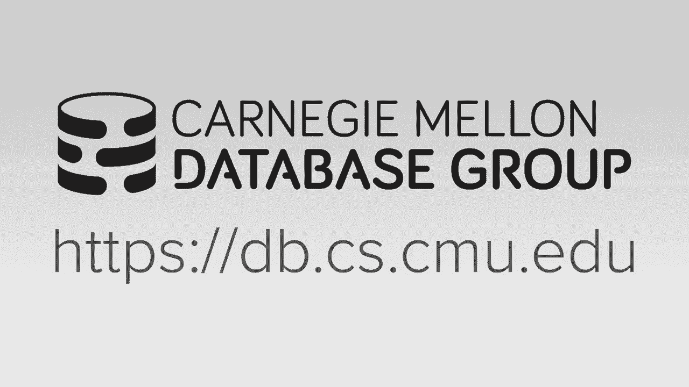
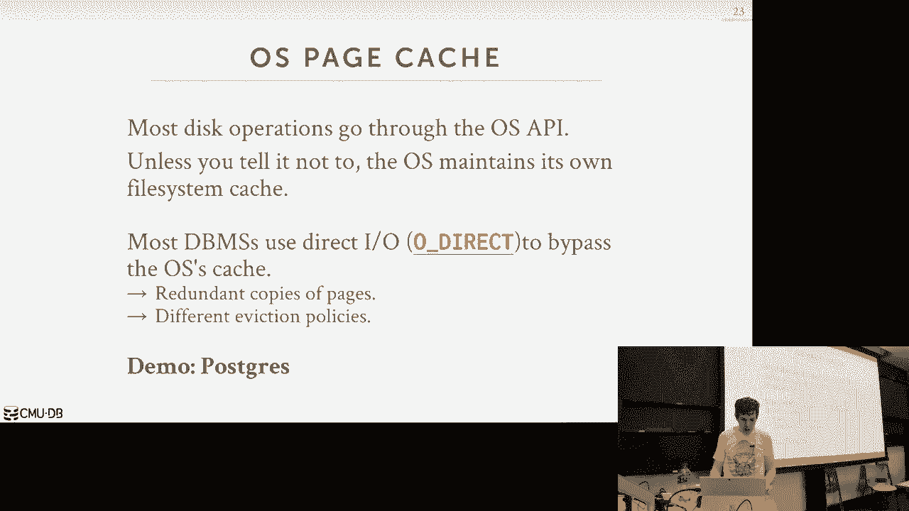
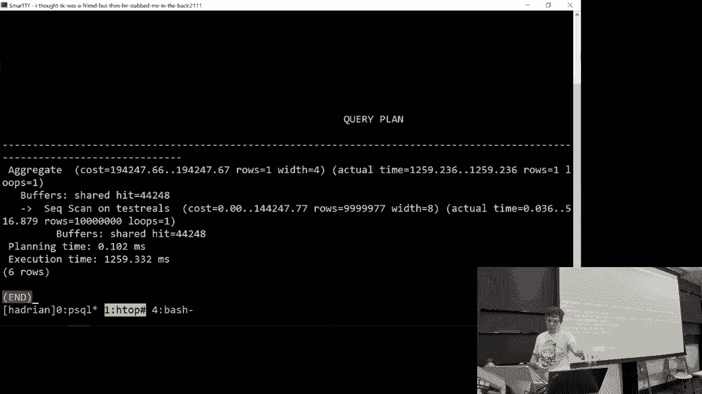
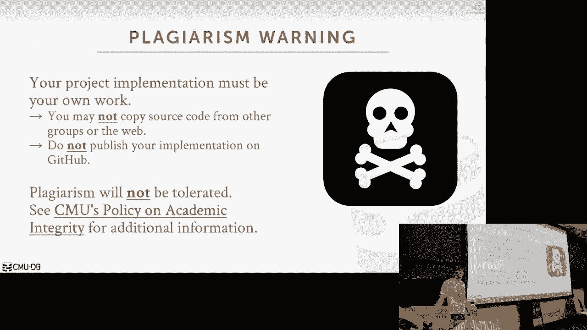

# 【双语字幕+资料下载】CMU 14-455 ｜ 数据库系统导论(2019·完整版) - P5：L5- 缓冲池+内存管理 - ShowMeAI - BV1qf4y1J7mX

祝我好运，我们开始吧好的，呃，你好吗？呃，挺粗糙的，你起来，你放下什么是错的，有一些女人的问题，所以女人是女人的问题，你说呢，有些问题，呃，还有一些问题和问题，你有什么问题，他们一直说我的节拍太新鲜了。

否，它们太颤音了，他们就是处理不了，大家都说你的节拍太零碎了，他们处理不了，是啊，是啊，我一天接一天，我没有资格帮忙，对不起，好的，让我们来谈谈数据库，那么好吧，所以再一次快速提醒，家庭作业1今晚要交。

然后项目一今天要出去，我会在课程结束时宣布它实际上是在网站上，现在源代码在线，但我会讨论它是什么，你今天被要求做的，然后就像你在年级范围上提交这个之前一样，你知道一切都会自动分级，所有的权利。

我确实想花点时间谈谈工作量，在你收集了一堆数据后，现在你想开始分析它，推断新的信息，就像匹兹堡市的人一样，更有可能购买这种产品，我说你可以利用这些信息，然后你知道把信息推送到OTB端。

让人们做你想让他们做的事情，然后混合事务分析处理H型工作负载，这是Gartner几年前发明的一个新流行语，基本上描述了这些试图同时完成这两个任务的数据库系统，典型的设置，你会经常看到是这样的。

你会有你的前端OTP数据库，然后你有了巨大的后端数据仓库，所以这些有时被称为数据筒仓，因为您可以对一个数据库实例进行一系列更新，不管是单个节点，还是应该无关紧要，它是一个单一的逻辑数据库。

然后在这里应用您的更改，但他们并不真正相互交流，每一个都是一个孤岛，然后你要做所谓的提取，转换和加载或ETL，这是你用的术语，从这些前端获取数据，把它清理干净，处理它，然后将其放到后端数据仓库。

所以我喜欢举的例子，这就像Zynga，法姆维尔人，他们收购了很多游戏初创公司，然后当他们买的时候，他们都运行自己的前端数据库，但当他们想把它放在他们的后端巨型数据仓库中时，所以他们可以分析东西。

让你更好地在法姆维尔买垃圾，是的，因为在一个数据库中，客户的名字将是另一个数据库的名字，我们你知道f第一个下划线名字，对呀，所以它是相同的概念或相同的实体，只是有不同的语法和术语。

所以这个ETL过程清理了所有这些，你把它推到你的数据仓库，你在这里做你所有的分析，然后你有什么新的信息，你把它推到前面，然后当你看到购买这件商品的人，也买了这个东西，那是他们在olap那边做的。

然后他们把它推到前端，通过LGP应用程序公开这一点，所以H tabasic说，让我们也做一些我们通常只能做的模拟查询，在OLAP一侧，我们可以在前端数据筒仓上做到这一点，你还想要这个巨大的东西。

你的巨型数据仓库，因为你希望能够看到你所有的数据筒仓放在一起，但现在不是等待事情传播到后端，你可以在前端做一些事情，所以基本上每一步都是这样的，这可能就像你的我的续集，你的Postgres。

mongodb，你想要什么都可以，然后您的后端数据仓库将是Hadoop的东西，火花，青梅，垂直，你知道的，有大型企业数据仓库系统，红移或雪花或其他云，好的，所以这很清楚，好的。

所以今天我们要讲的主要话题是现在，考虑到，我们已经花了前两节课来决定，我们实际上将如何在磁盘上表示数据库，现在，我们想谈谈我们实际上是怎么从磁盘上的这些文件中提取数据库的，磁盘上的页面并将其存入内存。

这样我们就可以给他们做手术了，所以请记住我们，数据库系统不能直接在磁盘上操作，我们不能在没有进入内存的情况下进行读写，那是冯·诺依曼的建筑，现在有一些新的硬件出来了，您可以将执行逻辑下推到磁盘上。

但我们现在可以忽略这一点，所以我们想弄清楚，我们要如何把磁盘中的那些页带回来，我们想这样做，并且能够支持一个超过我们现有内存大小的数据库，我们希望将经济放缓的影响降至最低。

或者让查询点击触摸磁盘上的数据的问题，我们想让它看起来好像一切都在记忆中，所以另一种思考问题的方式也是从空间和时间控制的角度来看，所以空间控制是，你知道的，我们要在哪里把这些数据写在磁盘上。

意思是我们想要的，我们知道这些页面是可以一起使用的，经常可能一个接一个，所以当我们把那些页写出来的时候，我们想按顺序写它们，这样当我们再去读的时候，他们会，他们会，你知道，身体上彼此靠近。

我们不必做很长时间，寻找磁盘上的不同点，我们也关心时间控制，这是我们做出决定的地方，我们什么时候把书页读到记忆中，我们什么时候做这个？然后在某个时候我们必须把它写回来，如果已经写好了，如果它被修改过。

我们会决定什么时候开始做一次又一次，这是试图最小化的总体目标，我们的摊位数量，因为我们的查询试图读取内存中没有的数据，我们不得不写出，你知道那是在磁盘上，我们得去拿。

这是我一开始展示的下层商店经理的整体架构，所以我们已经讨论过这一部分了，所以现在我们知道如何在磁盘上有一个或多个数据库文件，我们知道如何表示页面目录来查找我们需要的数据，然后我们有一堆页面，插槽页。

日志结构页，没关系，我们在磁盘上有一堆页面，我们知道如何跳到他们身边找到他们，所以我们现在讨论的是这部分，在上面，缓冲池，就在系统中的其他东西，就像执行引擎，执行查询的东西出现了，说我想读第二页。

我们知道如何将页面目录提取到内存中，弄清楚里面有什么，然后找到我们想要的页面并将其保存到内存中，然后棘手的是，如果我们现在没有足够的空间，释放内存来带来我们需要的页面，我们必须做出决定，写什么页。

所以你知道，这就是我们今天要解决的问题，对，然后系统的其他部分不需要知道，或者真的关心你知道什么，记忆中有什么，什么不在记忆中，他们只会等到你得到你需要的东西，然后给你一个指针让你做任何事情。

是你想做的，好的，我们今天谈论的事情本质上是如何建立，或者缓冲池管理器在一些，我将使用缓冲池管理器这个术语，有些系统会称之为缓冲区缓存，这是一回事对吧，它的内存由数据库系统管理。

然后我们将讨论我们实际上如何制定不同的政策来决定，你知道的，我们要写出磁盘的哪些页，什么页，如果你需要腾出空间，我们可以做的额外优化来最大限度地减少这种影响，然后我们将结束讨论数据系统的另外两个部分。

可能需要记忆的，好的，所以再一次，缓冲池本质上只是一个大的内存区域，我们将在数据库系统中分配，我们要打电话给马洛克，我要去拿点东西，内存块，这就是我们要把我们所有的页面，我们从磁盘中获取，所以这又是。

这完全是由内存管理的，通过数据库系统，除了去操作系统请求内存权利，我们必须用malloc，我们不能就这样，自己分配内存，所以我们可以提供给我们这个。

但是接下来我们要把这个内存区域分成固定的大小或页面大小，称为框架的块，然后这个是，你知道的，框架看起来有点不寻常，为什么不，我只是说，页面或块或其他什么。

数据库系统中有这么多不同的术语来大致描述同样的事情，所以帧对应于，或者看我使用术语槽，使用时，帧对应于缓冲池中的区域或块，我们可以把页面放入正确的内存区域，我们插槽是我们把东西放进页面的东西，对于元组。

所以对于缓冲池，它是页面上的框架，会是老虎机，发生的事情是当数据库系统调用，提出请求并说我想要一个页面，对呀，我们要看看它是否已经在我们的，在我们的缓冲池里，如果没有，然后我们在磁盘里出去，复制一份。

获取应该把它放入内存中的，所以这是一个直接的一对一的副本，我们没有做任何反序列化，对呀，我们暂时可以忽略压缩，但不管怎样，然而，它在磁盘上表示，正是它在内存中的表现方式，我们没有对数据进行任何编组。

我们只需要，从磁盘中取出并直接放入内存，所有的权利，我们对所有其他页面都这样做，我们可能需要的，所以在我前面的例子中，当我展示执行引擎如何说嘿，我想要第二页，神奇地纠正它，你知道吗。

缓冲池管理器神奇地弄清楚了第二页是什么，所以在我们的，如果我们只是把这些东西组织成框架，页面可以在他们想要的框架中以任何顺序进行，在这种情况下，这里，即使它是第一页，在我的缓冲池里，第一页第三页。

它在磁盘上的顺序不一样，所以我们需要一个额外的间接层在上面来弄清楚，如果我想要一个特定的页面，我想要的那个有什么框架，因为它不会完全匹配，与磁盘上的顺序相同，这就是页表，页表只是一个哈希表。

这将跟踪我们记忆中的页面，如果您要求特定的页面ID，它会告诉你位于哪个框架中，所以数据库系统必须维护一些，一些额外的元数据来跟踪什么，它当前缓冲池中的页面是怎么回事，所以我们首先要注意的是脏旗。

这只是一面旗帜，告诉我们页面是否已被修改的单个位，因为它是从磁盘上读取的，做了一些查询，某些事务对其进行更改，我跟踪的另一件事是所谓的针数，或参考计数器，这只是跟踪，当前正在运行的线程或查询的数量。

希望此页面保留在内存中，意思是我们不，我们不想把它写在磁盘上，对呀，可能是因为我想我要更新它，所以我做我的取物，我去拿那一页，我需要把我的缓冲池，然后我要继续，继续修改，我不想那个页面被驱逐。

或者在磁盘后面交换，在它被带进来的时间之间，在我真正更新它之前，也将防止我们驱逐页面，尚未安全地写回磁盘的，对又来了，所以就像我钉了一页说，我不想每个人都知道这件事，暂时从缓冲池中删除。

然后说我在这里读一页，对不起，我想读一个当前没有内存的页面，我想在这上面安个门闩，哈希表中的这个条目，这样我就可以去取页面，然后将页表更新到现在，对着它，我必须这么做因为多个威胁同时运行。

我不能假设我是唯一一个看页表的人，所以我想防止别人拿走这个，我页表中的这个条目，当我拿我需要的页面时，他们来从我这里偷走它，然后放点别的东西进去，我们会在本学期晚些时候再来讨论这个问题。

但我们还有一堆额外的事情要做，跟踪哪些页面被修改，所以脏的部分只是其中的一部分，我们还需要跟踪到底是谁进行了修改，所以因为我们想，如果我们想写一个日志记录，说明这里是所做的更改。

我们要确保在写我们的页面之前先写日志记录，这是另一个例子，为什么MMap是个坏主意，因为我不能保证，操作系统不会把我的页面从磁盘上写出来，在我想让它正确之前，因为那并不妨碍你那样做。

至少在Linux上FreeBSD可以让你这样做，但是Windows和Linux不希望你阻止这种情况，这清楚我们在这里要做什么吗，基本上管理我们自己的记忆，但我们正在跟踪如何，事务或查询正在修改页面。

我们必须在页表中保护自己，防止其他人，在我们完成我们想做的事情之前驱逐东西或写东西，有什么问题吗？我现在需要做一个非常重要的区分，关于锁和闩锁的区别，所以这将在稍后出现，你必须在第一个项目中也这样做。

如果你来自他们世界的操作系统背景，锁就是我们所说的门闩，所以在在，让我在数据库的上下文中尝试这两种方法，我会看到我们描述他们是如何映射到操作系统世界的，因此，在数据库世界中锁定数据是更高层次的。

逻辑原语，这将保护数据库的内容，像元组这样的逻辑内容，桌子，数据库权限，交易将在其持续时间内保持这把锁，当它运行的时候，这意味着可以是多个查询，这可能是，你知道多毫秒或多秒，甚至在几分钟或几小时内。

如果它是一个运行时间很长的查询，所以在那个世界里，这是数据库系统可以提供给我们并公开给您的东西，就像应用程序程序员一样，你可以看到锁是为了什么，当您运行查询时，锁存器是我们使用的原语的低级保护。

数据库系统内部的关键部分，比如完善保护数据结构，保护内存区域，所以对于这些，这些门闩，我们要保持，只是我们正在进行的手术的持续时间，如果我去更新我的页表，我在入口上取了一个门闩，我要修改的位置。

做出改变，然后我松开门闩，我们不是，我们不需要担心回滚任何更改，就像我们做锁一样，因为它是，你知道的，它是，这是一个内部的事情，就像更新数据库系统的物理数据结构一样，我做改变。

如果我不能真正得到我想要的门闩，然后我就中止了，不要担心回滚，什么在回滚，好的，所以他说，回滚更改，这将在以后发生，我们谈论礼貌巨魔，但基本上说，就像嗯，我想把我银行账户里的钱存到你的账户里。

所以我们从我的银行账户里拿钱，但后来系统崩溃了，3。我把钱存入你的户头上，我想回滚我对帐户所做的更改，因为我不想失去那笔钱，这就是我的意思，这将讨论关于并发控制的整个讲座，这是真棒，相信我。

但目前我们主要关注的是这件事，对呀，所以在操作系统世界里，这将是一个闩锁将是一个类似于互斥锁的东西，我们实际上要在数据库系统中使用互斥体，保护事物的关键部分，所以我会尽量小心，总是说闩锁。

当我说门闩的时候，偶尔我说错了，我们就用锁，但我说这是内部的事情，我们是说门闩，这也很令人困惑，我也是，因为您将用于保护您的互斥体实现，因为他的门闩叫做旋转锁好吧，但真的是你知道这件事而不是这件事。

所以我们想做的另一个区别是，页目录和页表之间的区别，所以要记住，页面目录是我们要使用的，找出在哪里可以找到文件中的页面，所以我们想要第一页，第二页，第三页，它会告诉我们什么文件在什么偏移量。

或者你知道什么是什么一组文件有什么我们要找的，所以我们要做的所有改变，页面目录必须是持久的，他们必须写到磁盘上，因为如果我们崩溃了，然后回来，我们想知道在哪里可以找到我们拥有的页面。

页表是内存中的一个内部映射，它只是将页ID映射到，它们在缓冲池中的帧，所以这件事可以完全短暂，我们不需要用光盘备份，因为如果我们撞车回来，反正我们的缓冲池也被吹走了，所以谁在乎所以这个。

页面目录必须是持久的，页表不一定是，这意味着我们可以使用你最喜欢的哈希图或哈希表实现，你想要的项目一的权利，你只要用CD CD地图，那很好，因为我们再一次不用担心这个东西的耐用性。

我们必须确保它是线程安全的，当然，但不耐用，所以现在当我们开始讨论如何在数据库中分配内存时，对于缓冲池，我们可以从两种不同的方式来思考这个问题，首先，我们可以选择所谓的全球政策。

我们试图做出有利于整个工作量的决定，我们试图执行的权利，我们查看所有的查询，系统中正在进行的所有事务，我们试图在这个时间点上说，对于选择，我应该做什么是正确的，什么应该在内存中，什么不应该在内存中。

另一种选择是使用本地策略，在哪里，对于我们运行的每个查询或每个事务，我们试着说什么是最好的方法来提出我的一个问题，一笔交易走得更快，即使为了为了，全球系统实际上可能是一个糟糕的，糟糕的选择。

所以没有一种方法比另一种方法更好，显然你可以做优化，如果您有全局视图而不是本地视图，但对于每个单独的查询，你可能会更适合他们想要做的事情来让它跑得更快，所以我们看到，这些例子中的许多，当我们进行优化时。

大多数系统可能会尝试将两者结合起来，您将为第一个项目实现的内容被认为是一个全局策略，因为它只是看着，你知道的，最近使用最少的页面是什么，并删除它，即使这可能对一个特定的查询不利好的。

所以这基本上就是你真正需要知道的，如何建立一个合适的游泳池，对，只是你有一个页表，绘制了地图，页ID到框架，然后在分配的内存中查找偏移量，这告诉你，这是你要找的页面，看起来很简单，对呀。

所以现在我们想谈谈如何让这东西变得超级棒，或者为我们试图运行的应用程序超级定制，但是我们试图在数据库系统中运行的工作负载，这将允许我们做某些事情，操作系统做不到的，因为它不知道你在运行什么样的查询。

它不知道他们接触的是什么数据，他们下一步要碰什么，所以现在我们可以谈谈我们能做些什么，让这件事做得更好，而不是那种天真的计划会这样做，讨论如何处理多个缓冲池，预取，扫描共享，然后最后一个是缓冲区将旁路。

所以在我展示的示例中，我将缓冲池称为单个实体，对呀，数据系统有一个缓冲池，实际上，您可以有多个缓冲池，因此，您可以分配多个区域的内存，他们每个人都有自己的页表，他们每个人都有自己的。

然后映射到从页面ID到帧ID或帧，对呀，你想这么做的原因是现在，您可以为每个缓冲池，你实际上可以拥有，您知道缓冲池的本地策略，那是为，不管你把什么数据放进去，你知道所以，比如说。

我可以为每个桌子有一个单一的缓冲池，因为也许有些桌子，我正在做一系列的顺序扫描和一些表格，我在做点查询，或者我一次跳到单页，我可以有不同的缓存策略或不同的替换策略来决定，基于两种工作负载类型。

但我不能轻易做到，如果是巨人的话，只是一个巨人，缓冲池，嗯，假设我有，我可以有一个索引缓冲池，表的缓冲池，然后它们有不同的访问模式，然后我可以为每个人制定不同的政策，你还得到的另一大优势。

它最终将减少闩锁争用，对于试图正确访问它的不同线程，所以当我这样做的时候，查页表，我得在我正在看的入口上取一个门闩，当我去找有我想要的数据的框架时，我不确定有没有人把它换掉，但你知道吗，从我查找的时候。

从我去拿我想要的页面的时候，这意味着我可以有一堆线程，所有人都在同一个门闩上竞争，因为他们都在访问同一个页表，所以不管我的新机器上有多少核心，我没有得到很好的可伸缩性，因为一切都在这些上竞争。

这些关键的部分，但现在如果我只有多个页表，每个线程，你知道他们可能在访问不同的页面，同时使用不同的页表，因此他们没有在那些门闩上竞争，现在我得到了更好的可伸缩性，现在仍然可能是磁盘提要上的瓶颈。

这一直是个大问题，至少在内部，现在我不担心他们了，你知道，试图获得同样的门闩，这是你看到的东西，主要在企业或昂贵的数据库系统中，所以Oracle DB两侧基础和续集服务器，都支持拥有多个缓冲池的能力。

DBT你可以做各种各样疯狂的事情，您可以创建多个多个缓冲池，你可以把它们签到不同的桌子上，您可以为所有人提供不同的缓存策略，您可以将它们设置为不同的页面大小，嗯我的海鸥，尽管它是开源的，其实也有这个。

它没那么复杂，您只需说出您想要多少缓冲池实例，然后他们进行循环赛来决定你知道什么，如果你给了E页，我要找的数据在哪里，什么缓冲池有它，有两种方法可以正确地使用这些东西，绘制你要找的东西的地图。

到具有所需页面的缓冲池，我说通常情况下，如果有多个缓冲池，你不能有一页在一个，你知道吗，这次在缓冲池一号，然后当你把它拿回来的时候，后来的迪斯科舞厅，它在另一个，它总是想在同一个位置。

所以你知道如何快速找到它，所以第一种方法是，您实际上可以将记录ID扩展到现在，包括有关此缓冲池管理的数据库对象的附加元数据，所以如果你还记得，当我们看到甲骨文和续集服务器的记录想法时，他们有额外的专栏。

Postgres没有回来的额外信息，邮政编码有页面和插槽号，甲骨文就像，对象号，页码，然后是插槽号，所以我们可以利用额外的对象号，他们没有另一张地图上写着物体可以，你知道的，你可以在这里面。

它在这个缓冲池或那个缓冲池中，所以现在来自系统上层的请求说，给我，你知道的，给我一张唱片，一个，两个，三个，我知道如何，如何把它分开，找出它对应的对象，什么缓冲池将维护这些数据，对于哈希方法。

我想这就是我的续集所做的很简单，你只要拿着唱片，id，根据缓冲池的数量对其进行哈希和mod n，它只是告诉你去哪里，获取所需数据，你可以很快地做到这一点，真的很快，这不是一个昂贵的手术，其实。

对于其中任何一个，手术并不昂贵，所有的权利，我们可以做的下一个优化是做预取，所以这里的想法是，我们希望最大限度地减少摊位和数据系统，由于必须转到磁盘或读取数据，所以如果我们开始做扫描。

我们的缓冲池是空的，此查询要读取内存中没有的页零页，不在我们的缓冲池中，所以我们必须停止线程直到我们走出磁盘，把它拿来，然后放入我们的缓冲池中，那么一旦它在我们的缓冲池中。

然后我们把指针交还给系统的上层，说你想要的那一页现在在我们的记忆中，去做你想做的事，所以思考这个问题的方式就像它是一个，你可以把这个箭头想象成一个光标，因此，在内部，数据库系统将跟踪这一点。

叫做光标的东西，就像，当您遍历每一页时，您的查询需要，你只知道你上次停在哪里，所以当你回去说，给我下一页吧，你知道这不是从一开始就开始的，它跳到你的地方，你停下来的地方，在这种情况下，我得到零报酬。

我现在不做了，我开始阅读页面，同样的事情我必须拖延，因为它不在记忆中，磁盘去拿它，我们已经放入了缓冲池，一旦我有了，现在我可以了现在我可以继续了，假设这个查询想要扫描整个表，对呀，这些是给我们这桌的。

这是所有的页面，所以在这一点上，数据可能会识别出，哦，我知道你最后会扫描整个桌子，所以与其和我一起等着你一个接一个地问，让我跳到前面说，哦，我想你还需要第二页和第三页，我去把它预存到缓冲池里。

所以当你处理完第一页的时候，现在你问我要第二页或第三页，它现在已经在那里了，你没有摊位，一次又一次，根据我在磁盘上布局这些页面的方式，这可能是一个顺序读取，超级快，所以通过提前预取东西，i，你知道。

我在最小化随机的数量，我正在做的事，好吧，让我们继续往下走，预取，一切又是那样，将这些排档的影响降至最低，所以这个例子很简单，对了，操作系统实际上你现在也可以解决这个问题了，地图会为你做到这一点，对了。

所以一张M图，你可以把旗子递过来说，我要在磁盘上对这些页面进行大量阅读，它会提前预取一堆，因此，这将最大限度地减少摊位，因为你必须从磁盘上读取一些东西，所以MF可以解决这个问题。

甚至不知道查询试图做什么，数据系统知道查询想要做什么，它可以提前预取，但现在会有一些查询，操作系统不知道该做什么，但我们在数据库系统中这样做，因为我们知道查询想要什么，所以你这样一个例子就像一个索引罐。

假设我想在这张桌子上做一个扫描，我想得到所有的值，我想找到所有的元组，价值在一百五十到二百五十之间的，现在让我们假设我有一个关于该值的索引，我解释什么是索引，把它想象成教科书中的词汇表。

它允许您跳转到一个特定的页面，该页面包含您想要的数据，所以它不仅仅是做顺序扫描，我可以在索引中跳转，找到我要找的东西，假设我们在索引页中，对呀，我们提前知道，范围是什么，所以说。

当我的查询开始进行扫描时，我总是读索引的第一页，因为那是根，对呀，所以你知道我得跳到那里，但现在我要做一个查找，并说，我在找我的查询是在一百到二百五十之间，所以我知道我需要的所有页面，或者我想要的值。

大于等于一百或一个开始，在树的这一边，所以现在我要跳到第一页，把它读对，在这一点上仍然是连续的，所以操作系统可能会解决这个问题，但现在我要分枝到这里，我要扫描叶子节点，但这是索引第三页，索引第五页。

它们在磁盘上不相邻，所以操作系统可能会试图预取第二页和第三页，但我不需要第二页，那是浪费，我需要第五页，它没有预取，所以说，因为我们知道查询要做什么，我们可以继续预取我们想要的页面。

并将它们带入我们的缓冲池，因为我们可以理解，实际的上下文是什么，查询的上下文是什么，这些页面实际上代表了什么，因为操作系统看到页面，它不知道里面有什么，但我们知道，因为我们写了这个代码。

我们知道这些是索引页，它们以某种方式联系在一起，所以我们知道如何进行遍历，所以这不是免费的，对了，有一些额外的元数据，我们必须在这些页面上跟踪说，就像这里是兄弟姐妹，这是我的起点或终点，这是他的起点。

所以我知道我是否要扫描这里，实际上我不知道我之前是否需要五个，我看三个，所以你知道这个，我不是说这很容易做到，但你可以重新看到，我们可能没有完全按顺序跳过页面，以一种操作系统无法找到的方式，又是这个。

这对我来说就是这样，这是我们在数据库系统中可以做什么的经典例子，系统做不到的，因为它没有，不知道数据里有什么，它只是看到一堆重写，所有的权利，我们可以做的下一个优化叫做扫描共享，所以这里的想法是。

我们可以让查询相互搭载，重用那里的数据，一个查询正在从磁盘读取，并将其用于其查询，所以这与结果缓存不同，结果缓存是说我运行完全相同的查询，我计算了一些答案，我缓存了结果，因此相同的查询再次出现。

我可以不重新运行查询，我只是给你答案，我以前有过，这是在一个较低的水平，在存储层的缓冲区管理器上，我们现在所处的位置，只需让光标访问页面，然后我们可以重用这些页面，我们从一个线程出来换另一个线程，所以。

它的方式要去工作，我们要，允许多个查询附加到单个光标，那就是扫描我们的页面并将它们放入缓冲池，这几乎就像一个酒吧代课老师的事情，我们说我想知道你是否得到了一个新的页面。

然后您可以通知任何可能正在等待它的线程，即使他们不是真正读的人，所以取决于实现，查询不需要完全相同，通常在结果缓存中，他们在我们和我们的世界里，他们不必是，只是我想知道我是否遇到了同样的页面。

然后在某些情况下，如果他们计算的是类似的结果，我们可以分享这些立竿见影的结果，跨越不同的线程，几乎像一个，它被称为物化视图，我们将在本学期晚些时候讨论这个问题，但为了我们的目的，我们只是得到。

我们只是在看页面访问，所以再一次，它的工作方式是，如果查询启动扫描，然后它识别出另一个查询也在做同样的扫描，它只是附着在第一个人的光标上，然后当它得到页面。

我们得到通知那个页面进来了我们可以我们也可以访问它，所以重要的是我们必须跟踪，第二个查询出现的地方，为了光标上了火车，以便我们知道第一个查询的光标是否结束，可能还有其他数据，我们得回去读。

这样我们就可以，如果我们想看看一切，我们中途开始，我们想我们想知道我们从哪里开始，这样我们就可以回来看看剩下的，1。据我所知，此技术仅在DB Two和续集服务器中完全支持，很难得到正确的答案。

好像有点琐碎，但它可能会变得相当粗糙，基于Oracle支持的查询有一个基本的恐慌，Shanthey调用光标共享，然后呢，但只有当你有两个完全相同的查询同时运行时，它才会起作用，而这些家伙可以推断。

根据我需要的查询，我知道你在看这张桌子，我需要读同样的东西并跳上它，这个东西必须说我有两个查询在做完全相同的事情，所以让我们看一个例子，假设我们在这里有第一个查询，它在计算一个，所以查询。

查询光标将启动，它就会开始扫描桌子，看每一页，现在让我们假设在这一点上，它想读第三页，我们的缓冲池没有空闲的框架，所以我们运行替换策略算法来决定我们要删除这些页面中的哪些，在这种情况下。

我们会做一些简单的事情，说好，零页是最后一页，的，最古老的一页，自从我访问了它，所以让我继续，用第三页代替它，然后现在我继续扫描，但现在让我们假设在这发生之后，在我们交换零页之后，第三页。

出现第二个查询，也想对这张桌子进行顺序扫描，所以没有扫描共享，一切从头开始，就像第一个人一样，一路向下扫描，但这对我们来说实际上是最糟糕的事情，因为首先要读的是第0页，但我们只是把它扔在磁盘上。

所以现在我们可以结束痛击，因为这家伙在零页出现之前不能继续，所以这是要去，你知道它必须熄火然后把它拿回来，但我只是在记忆中，但我把它处理掉了，所以这很糟糕，所以通过扫描共享，这家伙只是跳来跳去看书。

Qone读到的同样的东西，你知道生产和计算，它需要什么中间结果，对于这部分数据，所以现在在这一点上，q一个就做好了，所以说，它的光标消失了，然后Q2从头开始，他们知道我是从你读第三页的时候开始的。

所以这就是我需要向下扫描的时间，直到我得到我的最终结果，是呀，内存的一部分，比如这些查询存储数据的地方，比如哪里，他们还必须需要一些内存来存储他们的数据，所以它和气泡是分开的，这个问题是，嗯。

每个查询都在计算，我会说中间结果，当它读到这个数据时，所以他们现在还需要一个内存区域来把这些数据放进去，与此缓冲池分开的，是呀，所以我们马上就会在Postgres上看到这个示例。

但是通常内存也会由缓冲池支持，是的，因为如果我最终计算了一些东西，你知道，说我在计算一个连接，该连接运算符的输出不适合内存，我需要能够开始驱逐那些页面到磁盘，所以像这样的短暂内存仍然由缓冲池支持。

但它是否在全局缓冲池中，它是否是用于查询的私人查询，这取决于实现，但我们不需要从磁盘上翻页他的问题陈述是，我不需要，我不需要为查询结果从磁盘中带来页面，缓冲池，我还在这个故事里，因为它会是的，就像。

是啊，是啊，所以当我写数据的时候，就像这样，这个家伙，这是一个琐碎的表，因为平均值是，这是一个标量，对呀，但假设这是，你知道，一些非常复杂的计算，当我产生，当我扫描这些数据时，我在更新我的伴侣结果。

我可能会溢出记忆，那些从磁盘上交换出来，所以我在为记忆而写，然后它们会根据需要被写入磁盘，但我不会为我的查询而阅读，是啊，是啊，这说不通，因为你需要阅读的任何东西，像低级数据库页面，你要放入缓冲池。

每个人都能再次看到，这是另一个很好的观点，这是一个共享数据结构，对呀，所以它就像q one在阅读页面并将其放入缓冲池，任何其他需要这些页面的线程都可以继续正确地阅读它，销钉闩，只是告诉你嘿的别针。

别把这个换了，磁盘并不妨碍其他人阅读，同时，你在那里有更高的水平，像跟踪的锁，根据你所知道的，你可以读什么页和写什么页，数据库对象，这是别针，只是基本上说嘿，我在给这个做手术，别换了。

这样就回答了你的问题，好的，所以这是另一个很好的例子，说明了关系模型的优点，因为关系模型是无序的，意思是它不喜欢，我实际上可以有Q在任何地方开始一些查询，我要给出的答案可能与，根据我执行的时间。

但它仍然被认为是正确的，所以如果我把这个查询更改为计算平均值，我把它限制在一百，意思是，我只想计算一百个元组的平均值，没有具体说明，我只能我得看看前一百个元组，所以我可以从第三页开始。

在这个光标上分享我的扫描，看看前三页的前一百个元组，这就足够让我计算出结果了，如果我现在从头开始，我可能会得到不同的结果，但根据关系模型，这仍然是好的，因为数据库无序，是呀。

我们只是通读了任何连续的页面，是啊，是啊，所以很完美，所以他说，它也仍然有效吗，如果我们，而不是光标，说，所有的权利，嗯，让我们去看看我的磁盘页，开始把它们拿出来，我去哪里。

检查缓冲池并找出内存中的实际内容，并计算聚合，或者这个特定的查询，带着记忆中的东西，绝对，是呀，更智能的系统可以做到这一点，再次，没关系吧，在记忆中，只要我看到一百个元组，那么这个查询仍然是正确的。

现在，这是他们不喜欢的，你不会想写这个的，但是，你知道它仍然有效，所有的权利，我们要讨论的最后一个优化是缓冲池旁路，所以这和他之前的问题有点关系，大约像中间结果记忆，假设我有一些疑问。

我们在那里做光谱扫描，和，我不想付出非去不可的代价，在页表中查找并查看我的缓冲池，去弄清楚我要找的页面是否在内存中，而且我也不想污染缓存，也许阅读一些我在不久的将来不需要的数据。

因此缓冲池旁路或缓冲缓存旁路，取决于什么系统，它的想法是你分配少量的内存给你的，您的查询，到运行它的线程，然后当它从磁盘读取页面时，对呀，如果它不在缓冲池中，它必须去磁盘才能得到它。

而不是把它放在缓冲池里，它只是把它放在本地记忆中，然后当查询完成时，所有这些都被扔掉了，你再这样做，因为您希望避免转到页表的开销，就是你知道的，这是一个哈希表，它有门闩，它不是，它不是，不是超级贵。

但不是免费的，不便宜，所以在X的形式中，这些被称为光扫描，但几乎每一次，主要数据库系统支持，像这样的东西，我不知道，我不知道我的续集8，我不认为五点七可以，嗯，然后再一次，如果你认识到你知道。

你只想这么做，如果你知道亲密的结果或他们的事情，你的扫描不是很大，如果你在做一个排序，你知道吗，太字节内存，那么您希望得到缓冲池的支持，因为那东西可以根据需要支付到磁盘上，最后一件要理解的事情也是。

也是数据库系统下面实际发生的事情，当我们从操作系统中读取页面时发生了什么，操作系统实际上是怎么做的，我们所有的磁盘操作都要经过最低层的API，f的f读向右，我你知道，我们不会自己访问原始磁盘。

因为我们现在正在研究操作系统，默认情况下，操作系统将为文件系统维护自己单独的缓存，这被称为OS页面缓存，所以这又意味着，当我从磁盘上读取一页时，操作系统会在他的文件系统缓存中保留一份副本。

或OS页面缓存，然后我会在我的缓冲池中有另一个副本，大多数数据库系统不希望您这样做，不要让操作系统做这件事，所以当你打开一个文件，你通过POSIX标志，哦，直接或直接IO，在你有操作系统的地方。

不做任何缓存本身，你自己管理内存中的内容，所以当你去阅读手册时，几乎每一个数据库系统，他们会告诉你确保你能真正打开这个，唯一这样做的数据库系统，是波斯特雷斯吗，据我所知。

唯一依赖OS页面缓存的主要系统是Postgres，所以他们这么做的原因，因为他们声称从工程的角度来看，这是少了一个额外的缓存他们必须管理的事情，他们仍然有自己的缓冲池，但不会那么大。

我可以使用系统上的所有内存，就像MySQL或Oracle会使用的那样，他们会让操作系统自己做一些额外的管理，所以从工程的角度来看，他们实际维护系统的那一部分所需的开销更少。

依赖这一点是一个轻微的性能惩罚，你马上就会看到，好的，所以我喜欢用Postgres做演示。

嗯，因为它几乎就像一个数据库系统的教科书实现，你实际上暴露了很多，你知道的，我们很容易谈论的重要概念，好的，好吧，这又运行了，实验室里的一台机器，我来开灯，我输入这台笔记本电脑，因为在表面上打字很痛苦。

我讨厌键盘，所以这是运行，这只是运行H顶部，这是Top的更好版本，我想专注的是，你应该把记忆塞在这里，所以绿条告诉你，常驻设置是什么，在这台机器上运行的进程的大小，这是他们的记忆，这里的橙色条。

那是文件系统页缓存，那是操作系统页缓存，同样，当这台机器上运行的任何进程，当他们去阅读，如果他们不直接使用，如果他们从文件中读出一页，操作系统也会缓存它，所以我们可以把这一切都吹走。

所以这是在Linux上运行的，所以在Linux中，我们可以做一个，嗯，所以我们可以运行这个命令，嗯，我们基本上忽略了，我们我们臭操作系统文件系统缓存，我们将这个标志三传递到Proc文件系统中。

允许我们强制操作系统刷新页面缓存，所以现在如果我们回去看看H top，现在我们看到正在使用的内存总量，但机器减少到三个G，对呀，它以前有三场两场演出，但现在只剩下三场演出了。

所以我们完全摧毁了文件系统缓存，好的，所以现在我们走吧，呃，我们去拿波斯特雷斯，我想做的第一件事，虽然是重启它，所以通过重新启动它，我们将被风吹走，它是，嗯，把这个拿起来重新连接，定时回报。

然后我们把平行的线，所以我们要用同一张桌子，我在上一堂课上展示了一千万个小数条目，所以我们可以运行这个查询，现在我要做的是，我要用，再解释一遍，但我要通过并分析两个标志，分析和缓冲，所以再分析一下。

将实际运行查询，并向您展示查询计划，发生了什么事，缓冲区标志将告诉您它从磁盘读取了多少数据，它正在读取的页面中有多大比例在缓冲池中，与磁盘上的比较，所以因为我们吹走了文件系统缓存，我们吹走了缓冲池。

因为我们重新启动了数据库系统，命中应该是零对吧，你看它说对于缓冲池，它必须读到四百四十四四二四八页，您必须从磁盘读取表，它花了1300毫秒，一点三秒，所以如果我再次运行相同的查询，现在你看。

上面说命中是三二，所以它能够阅读已经在河豚池里的三页两页，然后它又从磁盘上读取了其余的内容，为什么不是所有的页面，是因为Postgres维护一个缓冲池，一个小的缓冲池，每个查询的环，一共三页两页。

所以对于这一个，它被允许阅读上一次运行的三页，如果我再运行一次，它应该去想六十四，是呀，所以它的大小一直在增长，当我一遍又一遍地执行查询时，因为它认识到，哦，我需要的数据是，这不是我的缓冲碗。

让我增加它缓存的大小，所以现在我们能做的就是，我们可以强制数据库系统将所有内容放入内存，所以他们默认有Postgres的扩展，当你安装它的时候，称为PG暖，而这一切所做的就是。

它是我们在数据系统上调用的一个函数，嘿，把这张桌子的所有页面带到我们的缓冲池，对，告诉你我跑了，我做到了我读了44万4千2百48页，还记得我运行查询时吗，第一次，它说必须从磁盘上读取四千四百二十八页。

因为它变得完全，你知道吗，那是，这个表的页数，六十四，他说已经有六页了，所以这就像强迫，把所有的东西都读了，实际上，我认为这64页可能是，是啊，是啊，我想它只是不想看到记忆中的东西。

它只是说我会得到一切，如果我再做一次，它应该会给我同样的号码，是啊，是啊，只是阅读一切，所以现在，如果我再次运行该查询，我好多了，我的命中是16，一万六千，我需要的一万六千页在记忆中，所以我打了打了。

在缓冲池里被击中了，但我还是得读一堆磁盘，我们猜一下，为什么，是呀，它仍在将所有内容加载到缓冲区中，为什么还把所有东西都加载到缓冲池中，取决于缓冲池的大小，对呀，所以我们可以在Postgres中这样做。

所以Postgres有一个名为共享缓冲区的标志，它告诉我它目前被设置为120，8兆字节，对呀，但尺寸是四四二八，所以选择，你可以再次使用，我喜欢数据库，你可以把它们当计算器用，所以四二八乘以八，嗯。

我是，除以十二十四，可以是兆字节，所以我正在看的桌子的大小是345，兆字节，所以再一次，共享缓冲区是一百二十八，但我桌子的尺寸是三四五，所以我可以去Postgres配置，然后去找那个特定的参数，看哪。

看哪，它有一百二十八兆字节，所以让我把它设置为，让我们慷慨一点，比如说360兆字节对吧，所以现在我们将重新启动Postgres，我们将从操作系统中破坏一个文件系统缓存，因为再一次，当我们读到那一页时。

实际上我们回到H顶部，嗯，它得到了，我是说，很难看出，它变大了一点，就像你可以看到的，那里有一个酒吧，因为就是这样，那是，那是我们读书的桌子，所以让我去吹走文件系统缓存，现在我回到波斯特雷斯。

我需要重新连接，嗯，打开定时，将其设置为这个以打开平行线程，检查共享缓冲区现在是否，哦，我是个白痴，对呀，对不起，服务器十，客户十一，安装太多Postgres，对不起，所以回到这里，这就是，那个呢。

二八，我说，什么三百六十，现在我们开始Postgres，三百六十好，良好的时机，打开平行线程，呃，预热，我们有四个，四，两个，八，四，两个，四，八页，现在我再次运行该查询。

现在我的打击率是4 4 2 4 8，所以我给了日系统适量的内存，我把所有东西都预先拿好了，现在一切都在冲击缓冲池，我有，我根本没碰磁盘，对于此特定查询，我做每一个查找，每一页我都需要访问。

我要在页表里找到那一页，框架中的页面引用，但一切都在记忆中，那么我们如何证明Postgres正在使用的数据库系统，依赖于文件系统缓存，所以让我们关掉，把一切都解释清楚，让我们看看它实际上需要多长时间。

其实是这样的，第一次是十二点五十，它变得比，现在是七点三十三分，所以大约需要700毫秒，所以我们能做的就是重新启动Postgres，然后吹走缓冲池，现在如果我回来重新连接到Postgres。

我想我需要是的，所以现在我重新连接，我对时机有很好的把握，打开平行线程，我以前运行过同样的查询，当一切都在磁盘上的时候，我想它花了一分，三秒，所以这个，然后一切都在缓冲池中，它花了700毫秒。

所以这个大概要稍微，哦，我们的时机很抱歉，嗯，那毁了演示，所以回去吧，我回到这个，回到这个重新连接，计时开始，就是这个，是啊，是啊，我拿到了，平行线又断了，所以我要运行这个查询，我吹了。

我重新启动了数据库系统，吹走了缓冲池，但是操作系统仍然有它的文件系统缓存，所以现在，如果我运行此查询，我们会有一堆缓冲池，错过了，因为记忆中什么都没有，但这仍然不会花全部时间，用了800毫秒而不是1。

3秒，因为它需要的数据在文件系统缓存中，如果我再运行一次，我现在应该得到700毫秒，开始了，让我们去弄清楚发生了什么事，仍从磁盘读取日期，为什么呢，它还跑得很快，尽管尽管那次我想是因为，时间变慢了。

因为我想它在转弯，解释，分析，嗯，随着缓存大小的增加，它会慢慢变得更快，对于那个查询，所以我想我认为这是一个查询缓存的事情，而不是全球性的东西，但又一次，我们展示的主要收获是我们必须给它一个数据系统。

足够的内存，把所有东西都放进我们的缓冲池，然后我们就能得到，全速性能，有什么问题吗？是呀，你预热两次，第二次预热，快了30%，就像预热两次是什么，你什么意思，如果你在预热时跑步，哦，那是文件系统缓存。

那是，这是操作系统缓存的问题，是呀，所以呃，我第一次把整张桌子放在游泳池里，是呀，它显示整个四万四千人，呃，那些被放在是的，但当我们试着读它的时候，就像击中了一万六千，呃，就像所有东西都在缓冲池里一样。

所以我第一次这么做的时候，缓冲池的大小是128兆字节，桌子的大小是345兆字节，那么它是怎么把所有的东西都放进去的呢，没有，这就是为什么我有，我还在查，从磁盘读取，但上面已经写着四万四千了，就在一开始。

是啊，是啊，这不是我们花所有时间的地方，但这是这是走过，所有的权利，所以让我们这样做，回去，我们要炸掉文件系统缓存，重新启动Postgres，现在我们去看看，在我们的嗯。

我的意思是那个酒吧不是一个微不足道的，可能为A为Postgres，就像系统上有其他东西在运行一样，但我把文件系统缓存吹走了，我重新启动了Postgres，现在记忆中什么都没有了，所以我回到波斯特雷斯。

需要重新连接，关闭平行线程，所以如果我现在运行查询，第一次，对呀，记忆中什么都没有，我得读四万四千页，好的，所以这是意料之中的，pre-warm告诉数据库系统去读取该表磁盘上的所有内容。

把它带到我的缓冲池里，完全是整个，四万四千页，是呀，我可以再做一次，对呀，它现在读了四万四千页，我运行相同的查询，现在我的点击率正好是四四千，命中的意思是喜欢，它被击中了。

我要找的东西在缓冲池里被发现了，所以我强迫数据把一切都带回记忆，在第一个例子中，我只有128兆字节，所以我不能把所有的东西都放进去是的，然后用西方来集中注意力，是呀，从你的，那么这样做有什么好处呢。

这就解释了我伟大的，所以她的问题是，所以我一开始就说Postgres是唯一的系统，这对你有好处，唯一依赖OS页面缓存的主要系统，为什么其他人都做不好呢？因为现在我每一页都要复印两份。

可能这样我就可以在OS页面缓存中有一个页面，然后我会在我的缓冲池里有一份那一页的副本，因为现在如果我修改那个页面，现在它不再是完全的复制品了，所以OS有旧的，我有一个新的，所以这是多余的数据。

所以如果你自己管理一切，你在内存使用方面会更有效率，在不同的数据库系统中，我是说现在大多数数据系统都支持Linux，对呀，但就像主要的，他们得支撑窗户，bsd，所有这些不同的操作系统。

其中OS页面缓存可能有不同的性能影响或不同的策略，从而保证在不同的情况下性能一致或行为一致，你只是自己管理一切，这是个好问题，是呀，这个数字是，这是数字页，但又一次，就像我一样。

它是Postgres八千字节的页面，我记下这个号码，乘以八，除以十二十四，它告诉我有兆字节的我的东西，我将缓冲池大小设置为该大小，我可以保证一切都符合Postgres的互动，课程问题是。

缓冲池如何与OS页面缓存交互，再一次就像，就像不同的选择，你可以把那个放进接住那些然后把它放进，呃问题就像，如何使用它有不同的选择吗，不，像这样，它对程序是透明的。

就像我调用read f read去从从磁盘中读取一页，如果OS在页面缓存中有它，为我服务的那一页，否则它会出去磁盘并得到它，那对我来说都是透明的，如果我通过那面旗子，直接，告诉系统，不要缓存任何东西。

它总是会去磁盘并得到它，所以最后一种是在磁盘之间，这是非常好的，保存它，因为OS页缓存介于磁盘的类型之间，和数据库中的数据，绝对是的，这对很多人来说也很重要，当我们开始写的时候，如果你这么叫你。

你写一个C程序，你说对了，操作系统会马上写出来，否，它把它放在页面缓存中，在稍后的某个时候，磁盘调度程序说好的，我去把这个写下来，只有当我调用f同步时，当它真正被写出来的时候。

但如果我想完全控制我如何准备磁盘上的一切，我想直接用，大多数数据库系统都这样做，是呀，当你有一个二十八的紫色游泳池，然后是对的。

是啊，是啊，3。你把所有的钱都放进桶里了，会发生什么，第一个二十八，我们现在会被覆盖，当您执行查询时，你被击中了，但是当您开始查询时，你已经从头开始了，所以你不应该得到它。

因为记忆的存在是后来的一个C存在，让我们，让我们，我是说，2。我想尽快完成这个项目，我们以后再谈吧，好的，所以我们现在要快速讨论的是缓冲区替换策略，所以再一次，我们谈到了如何正确，我们如何找到页面。

我们希望基于页面和页表，但现在你知道了，在我所有的例子中，我们大多有足够的内存，所以现在我们想谈谈发生了什么，如果我需要带一页进来，而我没有空间放它，我该怎么做，你关心的事情和替代政策显然是正确的。

对呀，我们不想写出数据或驱逐，某人在真正完成之前钉在上面的数据，我们要关心准确性，因为我们想确保我们，我们驱逐将来不太可能使用的页面，所以我们最小化磁盘的数量，我们希望我们的更换政策快，因为我们不。

你知道的，当我们在页表中查找或拿着闩锁时，我们不想运行一些NP完全算法来计算，要驱逐哪个页面，对呀，因为这可能比实际阅读页面需要更长的时间，当然还有，很明显，我们不希望有很多元数据开销来跟踪。

所有这些额外的数据，就像我们不想让页面的元数据跟踪，它被用来比页面本身大的可能性有多大，所以这些替换政策又是一个很好的例子，说明了什么是高端，非常昂贵的企业数据库和开源的家伙。

因为高端的有非常复杂的更换政策，它们跟踪页面使用情况的统计数据，他们试图从查询实际在做什么中推断出来，并试图做出最好的决定，而在开源的人或，的，较新的系统，不是说他们不好，但他们没有，你知道的。

几十年来花费了数百万美元试图让它尽可能快地运行，所以你知道，他们会做一些更简单的事情，这就是我们要在这里讨论的，这就像是CS中最古老的问题之一，就像每个人和他们的叔叔都有一份报纸。

多年来关于如何做缓存之类的事情，我有一个权利，这是计算机科学中最古老的问题之一，有很长的历史，所以最简单的技术，几乎每个人第一次都用LRU或者至少最近用的，所以我们在这里所做的就是跟踪一个时间戳。

当一个，上次访问页面的时间，然后当我们要想出你要驱逐哪个页面的时候，我们只是看看哪个页面有最古老的时间戳，我们要把它取出来这样可以加快速度，而只是跟踪一个，你知道的，每页的时间戳。

因为我们必须对所有页面进行Runter扫描，在缓冲池中找出哪一个的时间戳最少，我们可以保持一个单独的数据结构，就像一个按时间戳排序的队列，所以每当有人读和写一页，我们只是把它从队列中拉出来，放回末尾。

因为这是第一次也是第一次，你们在项目中必须实现的，是LRU的近似值，称为时钟，实际上快速举手，这里谁以前听过钟，无人可畏，好的，在座的各位，所以我的意思是，lru，我想知道对吧，好的。

很好所以LRU是一个最近使用最少的时钟，是这个的近似值，这样你就不必精确地跟踪每一页的时间戳，所以我们都，我们唯一需要跟踪的信息，是每页一个参考位，它告诉您自上次检查以来该页面是否被访问。

这样您就可以在圆形缓冲区中组织页面，像时钟一样，然后你有一个钟，四处奔走扫地的手，并检查该参考位是设置为1还是零，如果它被设置为零，那你就知道自从你上次检查它以来，它就没有被访问过，因此它可以被驱逐。

比如说我翻了1页2页3页4页每个页都有自己的参考位，在一开始，参考位被设置为零，假设一些查询访问了第一页，所以我要继续把它的参考位翻转到一个，不管有人访问这个多少次，这个页面总是设置为一个。

这不是计数器，所以现在我需要驱逐一个页面，因为我没有更多的空间，所以我的钟针将从第一个开始，我看到它的参考位被设置为，因此它被访问了，所以我不应该驱逐它，但现在我将其参考位重置为零，然后继续到下一个。

我将四处扫荡，如果我回来设置零点，然后我知道我可以驱逐它，所以这个家伙他的位被设置为零，所以我们可以继续，驱逐它，删除它并替换为新页面，然后我们不将它的引用设置为一个，我们只是把它设置为零。

然后继续下一个，所以我们现在就说，第三页和第四页已经访问过，所以我们检查重置为零，检查复位为零，现在我们回到第一页，第一页是我们检查的第一页，它的参考位为零，自从上次我们检查，所以它可以再次被驱逐。

这是一个近似的原因是因为当我驱逐页面时，我不会驱逐最近使用最少的一个，这是一种，你知道的，都一样，在某个时间窗口内，这些页面尚未被使用，因此，如果有，我可以继续驱逐他们，这里的直觉是。

如果页面已经使用了一段时间，那么它可能不会再被使用了，在不久的将来，因此，这是我可以继续驱逐的东西，所以这个假设很有效，适用于简单的事情，比如做点查询来访问单个东西。

时钟和lru都容易受到所谓的顺序洪水的影响，这意味着当我们进行顺序扫描时，它会阅读每一页，这会污染我们的页面缓存，最终会有一个，我们最终可能会驱逐页面，也许我们真的想，在不久的将来使用率很高。

但因为扫描读了一堆页面，所有这些页面都会有更新的时间戳，比我真正想要的页面，对呀，在这种情况下，这里，最近使用的页面实际上是我想驱逐的页面，不是最近使用的，所以这是另一个很好的例子。

如果您可以有不同的缓冲池，不同的缓冲池或不同的表，基于查询访问它们的方式，也许我想用一个最近用过的，还有一个我想用的最近用得最少的，所以让我们看一个例子，假设我有一个查询正在进行点查找，其中a等于。

其中id等于1，它读到零页，所以去把它拿到我的缓冲池里，我很好，那么现在有另一个查询，会做顺序扫描，所以它会撕碎我所有的页面，然后当它想为第三页腾出空间时，如果我们使用的是最近使用最少的。

然后它就会发现，哦，零页是最近使用最少的，让我把它赶走，放在第三页，但在我的工作量中，我在一遍又一遍地执行看起来像第一个的查询，所以现在如果我再次执行这个查询，现在我读到零页，我刚把它赶走了。

现在我完蛋了，因为现在我得出去把它弄好，所以我真正应该做的，被驱逐一两个，因为这个剪刀要通过，通过读取更多数据，不太可能有其他人会进来读这本书，这里，所以有三种方法可以解决这个问题，到目前为止。

我们已经讨论了其中的一些，所以首先是做所谓的英国，其中k是你跟踪这个数字，时间次数，多重时间戳，每次访问此页面时，所以现在当你想说我应该删除哪一个时，你不会去看哪一个的时间戳最低。

你去看看这些时间戳之间的间隔，你说哪一个在一次访问到下一次访问之间的时间最长，他们可以利用这一点来找出哪一个最不可能被使用，所以这是因为我们用历史来估计，当它可以再次访问时。

帮助我们更好地决定哪些页面应该被驱逐，所以lru k是用来，呃在，如果更复杂的数据系统会做这样的事情，我不知道，我想我的续集可能会用这个，我不知道，我不记得了，我们可以做的下一个优化，我们已经谈过了。

具有多个缓冲池，就是每个查询都有本地化，所以与其那样，你知道的，当我扫描表并将其放入全局缓冲池时，如果我有一点积蓄，缓冲池中特定于我的查询的一些页，任何人仍然可以阅读它们，但它是它是。

我在跟踪我是如何使用页面的，所以当我想做决定的时候，从我的查询中删除什么，我驱逐那些最近最不适合我的，不是全局观，所以我们在Postgres看到了这个，Postgres击中了，我们显示击中就像三二。

然后用六十四，对呀，这是一个小环形缓冲器，他们在跟踪哪些页面，查询访问，他们做决定，预测什么，最后一个是应有的优先级提示，这就是我们之前说过的地方，当我们有索引时，我们知道他们是如何扫描数据的。

现在知道什么页面是不同的访问，所以我们可以利用这些信息来决定驱逐什么，假设我们有B+树或任何我们想要的树数据结构，他们有一堆查询会插入数据，其中有这个表的全局计数器，或者只是增加一个，一遍又一遍地插入。

像串行键或自动增量键，所以如果我们现在排序，此索引在ID上从最小到最大排序，我们知道每次我们插入，ID值总是比我们刚刚插入的最后一个值多一个，所以这意味着我们总是要从树的右边下去，触摸这些书页，因此。

我们应该向缓冲池管理器提供提示，并说这些页面应该试着留在记忆中，我不在乎这些，关于这里的其他，或类似，如果我有一个查询，在不同的ID上查找，或者实际上在这个索引上查找的任何查询。

我知道我会一直浏览根页面，因为我就是这样输入这个索引的，我必须经历这一切，所以说，因此，我想确保它永远被钉在记忆中，总是停留在那里，因为否则，如果我，如果我能通过，到底部，我需要空间，我发现了这个东西。

那是个坏主意，因为你知道这是最近用得最少的，但我知道下一个查询会通过它，然后转到那个页面，所以再一次，这就是商业系统能做的，在上面提供这些额外的信息，最后要讨论的是我们如何处理肮脏的页面，所以请记住。

页面上有一个肮脏的部分，上面写着，查询自上次以来是否修改了该页的内容，自从它被带入缓冲池，所以当我们现在决定驱逐哪个页面时，带来新的一页，我们能做的最快的事情就是找到一个页面，那不是脏的。

然后马上把它扔掉，而你，你知道的，将其框架用于新的缓冲池，我们要做的较慢的事情是如果页面很脏，我们必须安全地把它写回磁盘，在我们可以为新页面重用该空间之前，所以现在我们必须在替换政策中做出权衡。

好好决定，有一堆页面都是干净的，我可以很容易地把它们扔下来，但它们实际上可能在不久的将来被需要，所以我不想把它们扔掉，我想付出惩罚来写一页肮脏的纸，把它冲掉，将其从我的缓冲池中删除并重用其空间。

所以你如何平衡它们是超级难的，因为在这种情况下，我在这里做一个磁盘读取，如果我必须写出肮脏的一页，这是磁盘，我要写下肮脏的一页，然后将其从缓冲池中移除，然后另一个IO阅读我想要的页面，在这种情况下。

这里，这是一个IO只是去读我想要的页面，因为，我可以放下，该页已在缓冲池中，所以你怎么再弄清楚，超级硬，在我看来，这就是商业系统比开源系统做得更好的地方，所以解决这个问题的方法。

为了避免必须写出一页的问题，一旦我需要一个空闲的空间在我的缓冲池，我可以做背景写作，所以周期性地，数据系统会有一个线程，他们会检查我的缓冲池，找出哪些页面被标记为脏，然后把它们写在磁盘上。

这样我就可以把它们翻转成干净的，现在当我从我的替换政策中这样做的时候，决定删除哪个页面，我有一堆干净的页面，我可以我可以马上下降，所以你做这个的时候要小心，因为你不想写脏页，在与，把它们修改得很脏。

你知道的，确保他们是法律工作者，先把他们写到磁盘上，在你写出肮脏的页面之前，我们将有一个完整的讲座为什么，这就是本学期晚些时候的情况，但你要知道这不仅仅是，我可以盲目地写任何一页。

我想我得做一些额外的步骤，保护，以确保我写的东西在正确的顺序，这是地图做不到的好吧，所以我要跳过这个去其他记忆池，只是我们已经讨论过了，它不仅仅是来自表或索引的页面，当我们运行查询时。

我们还需要生成一些信息，所以再一次，的，这节课的重点是讨论如何更好地管理记忆，比操作系统，因为我们知道曲线在做什么，我们知道书页里有什么，我们知道东西是如何被访问的，我们可以做出更好的决定，本质上。

我们将使用查询中的信息来，你知道的，对于我们谈论的所有这些不同的事情，有一堆优化，我们可以申请帮助我们使这项工作更好，所有的权利，所以有什么关于缓冲池的问题吗，所有的权利，这才是你真正关心的，一权工程。

所以第一个项目，你要建立自己的缓冲区，池管理器和替换策略，所以这一切都将在我们的新数据库系统中完成，称为半身像集线器I，它是一个开源系统，它是磁盘基本的，你会看到这个。

它们将是您从GitHub下载的代码中的存根文件，这将清楚地表明，以下是您需要编写的函数，下面是如何，其实，你知道的，执行那个，我们要求你做什么，所以说，该项目是书面的，可以在网上获得，1。

大望远镜还没有架好，我们今天晚些时候再做，但如果你能在一天内完成这个项目，来和我谈谈，因为我们想，我们想做其他的事情，所以我们已经为你提供了光盘管理器和页面布局，所以你不用担心，你只要给你一页，方块。

一块书页，由您决定如何将它们存储在内存中，然后调用磁盘管理器根据需要将它们写出来，所以第一个你要，我们有一个单独的类叫做时钟替换器，你将再次执行我今天在这里谈到的时钟政策，它是lru的近似值。

我们只需扫手，翻转这些参考位，这意味着您需要跟踪页面被访问的情况，因为您将在缓冲池API中看到这一点，你要知道当我说，读一页或写一页，您可以更新LRU替换器中的参考位，或者对不起，你的时钟替代品。

所以有一件事很重要，如果你做一个扫描，所有页面都被修改了，然后你只要挑一个帧ID最低的，或者如果所有的页面都被钉住了，你不能释放一个，然后你在最低的页面ID上选择它们，因为否则你就会永远旋转。

这将是正确的，主要的努力将在缓冲经理上，所以你实现了时钟，先替换你的算法，然后将其连接到缓冲池管理器中，这次又是，由你来决定你到底想如何保持你的记忆，如何决定哪些内部数据结构，你想跟踪，哪些页面可用。

什么页是脏的，哪些页面被钉对了，你可以为所欲为，只是你必须实现我们向你公开的API，所以它是超级的，总是搞砸的事情，学生每年都是为了确保你得到手术的命令，如何正确定位页面，对呀。

所以我们要做多线程分级测试，会试着同时阅读一页和别针，你必须确保一切都按正确的顺序进行，这样会更清楚，当你看到写的东西，看看我们需要做什么，所以说，如何开始，所以再一次，一切都可以在GitHub上获得。

你想去你的，如果你没有给它，GitHub帐户，报名一个，免费的，还有就是，我认为这是一个有教育意义的，你得到额外的东西，嗯，但基本上你会去GitHub页面，为了，数据库系统，会有一个小叉子按钮。

你把它分到你的私人回购中，因为你自己的回购市场是私人的，所以没有什么是公开的，然后在里面做你所有的改变，是啊，是啊，如果您注册了GitHub帐户，你可以免费得到一个，私人分叉回购，对。

因为如果你把一切都公之于众，这样其他学生就能看到你在做什么，然后可能从您那里复制，嗯，你今天或明天应该做的第一件事，尽快，超级乐于助人，试着让软件建立在你的任何机器上，你要在。

所以它在Ubuntu上工作，它在OSX上工作，它在窗户上工作，用窗户，服务器或服务器，像Linux，不管这个包裹，您可以下载安装，嗯，那个东西，虽然，因为OSX不会支持。

我稍后会讲到的Clang格式的东西，所以学校会为你运行这个，你可以在Docker中运行它，如果你这是个问题，我们也可以给你一个VM映像，但你必须，你得自己想办法，我们会得到指示来帮助解决这个问题。

它不编译安卓机器，我们试过了，它不工作，他们身上的软件，太慢了，这是个问题，你没有自己的笔记本电脑，请发邮件给我，我们会想出办法的，好的，所以要注意的事情不应该改变任何文件，除了你必须上交的东西。

因为我们基本上要把一切都吹走，有四个文件，你得上交，我们把其他一切都吹走了，把你的代码放在，最新版本的，系统并运行所有测试，项目是累积的，意思是如果你炸了这个，你以后会有麻烦的。

因为你知道下一个项目实际上是，我们使用您今天构建或现在构建的缓冲池管理器，我们也不会在一开始就提供解决方案，然后我们不会帮你在Piazza上调试代码，我们今年新做的另一件事，我们要求你写漂亮的代码。

正常情况下，喜欢FIT代码的人，所以现在我们有一堆支票，以确保它实际上符合一个好的样式指南，所以我们遵循了谷歌C Plus样式指南，我们还遵循了Doin Java文档样式指南。

所以我们已经准备好了支票可以为你检查所有这些东西，如果您调用make format，它将确保您的代码在C Plus样式指南中看起来很漂亮，但是还有很多其他的事情，比如你如何分配内存，如何设置for循环。

等等，我们使用clang整洁和clang格式来加强更多的细节，因此，您将运行这些命令，如check clang整洁，收集支票审查，检查皮棉，它会抛出错误，他们不会帮你纠正的，或抛出错误。

说你的代码看起来很糟糕，以下是如何修复它，好的，我们要在等级范围内运行这些，所以当你上交的时候，如果你写了蹩脚的代码，你会得到，你会得零分，因为你会，你不会通过这些测试的，所以这就是我要说的，所以说。

Linux和Windows，我想这对OSX有效，我想这行不通，但又一次，我们可以为您提供一个VM，你可以在里面做你所有的发展，好的，最后一件事，不要抄袭，我们将通过Moss运行您的代码。

在中国有一些人接受代码，我已经实现了一些东西，他们的都是垃圾，我们已经运行它不工作，别再做你的东西了，不要把你的东西放在公共回购上，因为如果我，我们运行你的东西，有人从你那里复制，因为你的帐户是公开的。

我们运行苔藓，你们两个都是对方的复制品，我不知道谁偷了谁的东西，所以你们两个都会失败，好的，所以不要把你的任何代码公之于众，你可以在学期里做到这一点，因为我知道你想去找工作，哦，这是我在这门课上所做的。

说实话，没人会在乎，因为每个人都在实施同样的事情，这不像一个独立的研究，你取得了一些突破，所以雇主，他们没那么在乎，您的项目在线，但如果你想在学期里做，我们没意见。

好的。

哦亲爱的，和米歇尔一起度过，派人去找我的案子，说不是在破碎的瓶子和压碎的混合中，可以让健身房里的牛，或者他和C在我的系统里破坏另一个，我很幸运，我们去拿下一个，然后克服的对象是呆在沙发上玩。

最好放下你的，我压力太大了，永远不可能是儿子瑞奇，说果冻为了一艘船去了熟食店，一个天生受祝福的人，是呀，我的说唱就像激光束，子弹和屁股，连食堂都没有，裂纹，一瓶同样的，i，你不想喝，只是为了喝醉。

你不能掉下去，但他还活着，同时，不知道你的痛苦。