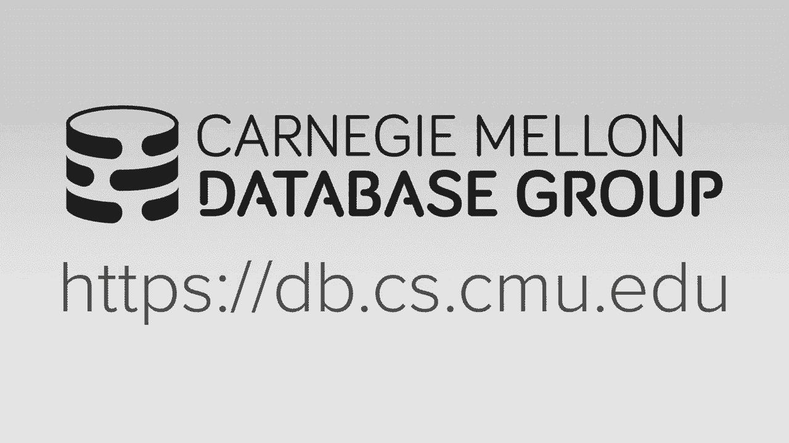
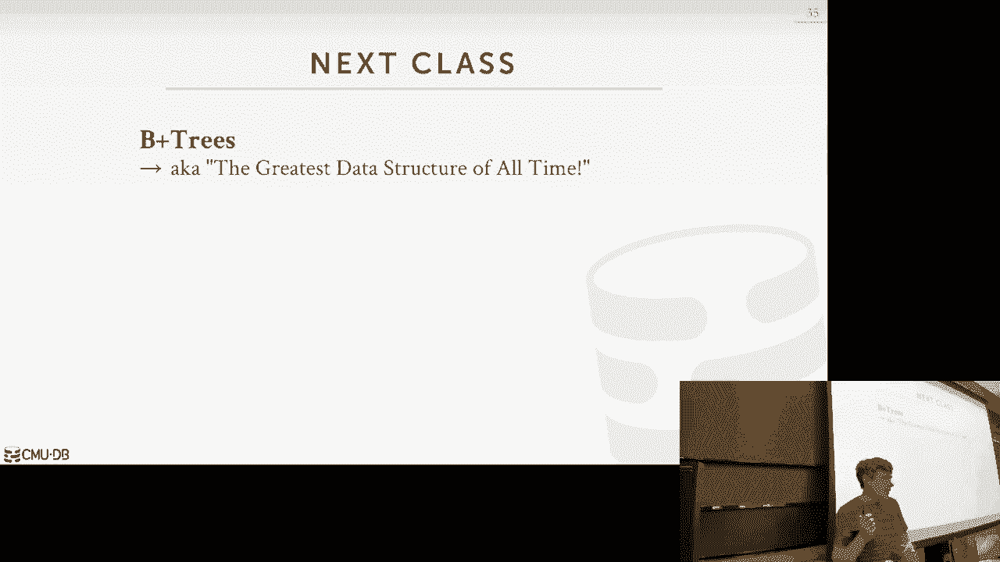

# 【双语字幕+资料下载】CMU 14-455 ｜ 数据库系统导论(2019·完整版) - P6：L6- 哈希表 - ShowMeAI - BV1qf4y1J7mX

alright let's get started okay let's uh，again give it up for DJ top tables。

thanks boys how was your weekend good，you know I was recruiting what TLC new，jobs that's hard right。

actually I found out Salesforce has in，the lobby in the main building San。

Francisco they have a DJ every morning，and it rotates oh do you want to figure。

out how to get you that job or what，okay yeah I guess you gonna do okay so I。

think most people are at the TOC today，so that's why it's a low turnout which。

is unfortunate because this is one of my，favorite lectures hash tables right so。

we have a lot to discuss let's get right，through it so real quickly and then。

reminders for what's on the docket for，you guys what's due project one is due。

next week on Friday at 27th at midnight，and then homework 2 which will be，releasing later today。

that'll be due the 30th the Monday after，the project so any quick high-level。

questions about project one setting in，to what the question is when with the。

autograder be released I mean so it's，live on great scope now you can submit。

things today but we're not giving you，the source code for the test obviously。

because that's means that the great yes，sir it should be live if you if you。

submit it doesn't work please post on，Piazza okay and the other high level。

questions okay so we're at now for the，course is that we've spent the first。

couple weeks again starting at the，bottom of the stack of a data system。

architecture and working our way up so，we've discussed how to store data on。

disk the pages on disk then we talked，about how to bring those pages into。

memory and our buffer pool or buffer，cache and having having a policy decide。

when it's time to evict something and，how to pin things when I do writes so。

now we're going above the buffer pool，manager and we start talking about。

methods so these an access method is a，way we're going to you know get。

essentially read or write the data that，in our database that's stored in the。

pages that are stored out on disk so，today we're talk about today we begin of。

a of a set of lectures we're going to do，on data structures that we're gonna。

maintain internally inside the database，system and we're gonna split it up。

between two discussions between hash，tables and and order preserving trees so。

each of them have different trade-offs，if you because you've taken an。

algorithms course by now so you，understand the implications for both of。

these but we're gonna describe what，matters to us in the context of database。

systems because just because you have a，tree versus a hash table maybe。

understand how to do proofs on it or，write algorithms to it to interact with。

it now let's talk about what what，happens when we actually put it inside a。

database system and actually try to use，it so data structures are used all。

throughout the database measurement，system right for a variety of purposes。

so one thing we've talked about so far，we turn how to use data structures for。

maintaining the internal metadata about，what's in our database when we talk。

about there being a page table or a page，directory and that was a hash table to。

do lookups between a hash IDE or so a，page to a page ID to a frame or a page。

ID to some location on on disk the next，thing we can use them for is actually。

just the core data storage of the，database itself so what I mean by bad is。

instead of as having on order to heap a，bunch of pages we can actually organize。

them at a higher level to be a hash，table or a B+ tree or tree data。

structure and have the the values in in，the data structure actually be tuples。

so this is very common in a lot of，systems like like memcache for example。

essentially a john is a giant hash table，or my Seco in a DDS engine is just a B+。

tree where they store the tuples，themselves inside of the side of the。

leaf nodes of the tree we can also use，data structures to maintain temporary。

data so this would be like if we're，running a query and we need to compute。

something very efficiently we could，build a data structure on the fly。

populated with whatever data we need，finished executing the query and then。

this throw away that data structure and，why you，you're most familiar with is using these。

data structures for table indexes right，essentially building a glossary over。

keys inside of our tuples and allows how，to do you know quick lookups to find。

individual elements that we want rather，than having to do a sequential scan。

throughout the entire database so for，all these purpose again you need good。

data structures to do all these things，so the things we want to care about how。

we design our data structures is is the，two following things so the first is。

were to carry out what the data，organization is we need how are we gonna。

represent the key value pairs are the，elements of the data that we're storing。

in either in memory or on pages that，were storing on disk and we do this in。

an efficient way that can support fast，reads and writes without having to your。

major overhaul or maybe maybe，restructuring of the entire data。

structure every single time the second，issue is that how we're going to allow。

multiple threads to access our data，structure or multiple queries access to。

the our data structure at the same time，without causing any physical violations。

to the eternal representation of the，data so what I mean by that is we don't。

want to have maybe one thread update a，memory address while another thread it's。

reading that address and then they see，some torn white or some corrupt version。

of that address and now that points to，some invalid page or installed invalid。

memory location where we end up，producing incorrect results so we'll see。

how we actually handle this we'll talk a，little bit long as we go along today but。

we'll spend a whole lecture while，discussing how to do concurrency control。

inside of indexes inside of these data，structures but for our purposes today。

but you sort of simplify the discussion，just assume we only have a single thread。

and because this is going to matter，later on also to when we talk about。

transactions because the type of things，we'll talk about here we'll use latches。

to protect the physical data structure，that prevents from again reading invalid。

memory addresses or invalid page，locations there's also a higher level，concept of what's the logical。

correctness of our data structure that，we need to care about as well and。

that'll come later on in the semester so，it says what I mean by bad is to say I。

have an index I delete a key if I come，back Mike my thread comes back and tries。

to retrieve that key again I shouldn't，get it because I know it's been deleted。

even though the physical bit still may，be there because I I'll do some，background garbage。

to clean up later on but logically Mikey，should be gone even though physically。

it's not so that this topic is very，complicated and so we'll touch on a。

little bit today but mostly care about，the physical the physical integrity of。

the data structure rather than the，logical one okay today again we're going。

to focus on hash tables so a hash table，is a abstract data type that we're going。

to use to provide a unordered，associative array implementation or API。

and all that means that we're able to，map arbitrary keys to arbitrary values。

all right there's no ordering to this，thing like we're gonna see in trees and。

so the way we're gonna be able to do，this these fast look ups to find。

elements that we want is that we're，gonna use a hash function that's gonna。

take in our key and then compute some，offset in some way to some location in。

my array and that's gonna tell me either，exactly the element looking for or I can。

roughly look around close to by where，I'll and after I use my hash function to。

find the thing that I'm looking for so，the hash function isn't always gonna get。

us exactly where we want but at least，get us in the right location and we know。

how to then look around to find the，thing that we are looking for so again。

so this none of this should be new you，should all take an algorithms class so。

the space complexity in the worst case，of a hash table is is Big O n that means。

that we for every single key we want to，store we least have one one entry for it。

in our hash table so to allocate that，amount of memory amount of space the。

operational complexity is interesting，because on average we're gonna get o one。

lookups meaning we in one step in，constant time you can find exactly the。

thing that we're looking for worst case，scenario and we'll see why this happens。

when we in a few seconds the worst case，scenario will get Big O n meaning we'll。

have to do a squinter scan or a linear，search to find to look every single。

possible key to find that the key that，we're looking for so you may be thinking。

alright this this is great any hash，function or any hash table will do。

because I'm always gonna get o 1 for the，most part in practice even though this。

is super fast in the real world where，money's involved constant factors。

actually matter a lot and so we'll see，this when we just look at。

functions right hash functions what we，you know sometimes it'll be it would。

still be super fast but there'll be some，hash function that'll be twice as fast。

or three times as fast as other hash，functions so you may say all right for。

one hashing who cares but if now I'm，hashing a billion things and my crappy。

hash function takes a second slower than，the fastest one，now that's I'm spending a billion。

seconds to do this lookup so when，there's real money involved when we're。

looking at large-scale the constant，factors actually matter when you take。

your algorithms class there's like oh，one we don't care about anything else。

the constants don't matter in our world，it does all right so let's look at the。

most simplest hash table you could ever，build right and all it is is just a a。

giant array which is now like a big，chunk of memory and then we're gonna say。

that every single offset in our array，corresponds to a given element and so。

for this to work we're gonna assume that，we know exactly the number of keys are。

gonna have ahead of time and we know，exactly what what there with the reduced。

we shouldn't their values are with what，their actual values are right so now to。

find any key in my hash table I just，take the take a hash on the key mod it。

by the number of elements that I have，and then that's going to get me to some。

offset and this is exactly the thing，that I'm looking for so let's look at。

and see how this works so let's say that，and we have three keys ABCD de F X Y Z。

so again I can just take this thing ABCD，ABC hash it and then that'll tell me I。

know I'm at offset zero is exactly the，thing I'm looking for so this is not。

exactly what our hash table is actually，could look like if this is just storing。

the original keys and practice what，we're gonna need to have is actually。

store pointers to where the original you，know some other location where that。

original keys is located again think of，this like a table index I don't want to。

store the keys maybe in might my hash，table I want to store it a pointer to。

where the key is found all right，so what are some problems to be。

sometimes we made with this kind of hash，correctly you say that we know the。

number elements ahead of time in the，first place that's one，what's the second assumption because all。

the batteries are near each other in the，cache that does for this purpose that。

doesn't matter here but he says there's，no collision between keys so what is a，collision。

he says the hash in the same slot，exactly right so this really simple hash。

table this is actually the fastest hash，table you could ever possibly build but。

you have to make these assumptions in，order to make to work right so the first。

is that as he said we need to know，exactly the number of elements that we。

had ahead of time so we know exactly how，many slots we want to allocate in our。

array and in practice that's not always，going to be the case all right if I'm。

building a I'm using my hash table as a，hash index am I on a table when I create。

the table I don't have any I don't have，any data in there in the first place and。

as I started inserting things then the，number of slots I need actually grows。

the other assumption that we mixed was，that we said every hash or every key is。

unique and that's what he that's what，he's saying that there's no collision so。

we're assuming that every time we hash，it it's always gonna land into a unique。

slot for that one key and only that key，ever to be able to exactly find the。

thing that we're looking for and so，because we know all the keys ahead of。

time and because we know that they're，unique when we hash them this is using。

what is called a perfect hash function，so a perfect hash function is like this。

if theoretical thing it exists in the，research literature but in practice。

nobody actually does this because it's，impractical you can't actually do this。

and a perfect hash function just means，that if I have two keys that are not。

they're not equivalent then whatever，hash I generate for them is also not。

gonna be equivalent so for every unique，key I generate an exactly unique hash。

value and again you can't actually do，that there's no magic hash function that。

exists today that can guarantee this the，way you would actually implement a。

perfect hash function is actually use，another hash table to map a key to，another you know。

the hash value which is kind of you know，stupid cuz now you have a hash table for。

your hash table it's so nobody actually，does this in practice so the thing that。

we're gonna talk about today is how do，we actually build a hash table in the。

real world to not have to make these，assumptions and be able to use them in a。

database system so when people say I，have a hash table they essentially mean。

it's it's a data structure comprised of，two parts，the first is the hash function which is。

a way to take any arbitrary key and Matt，you know a map it to a integer value in。

a smaller domain right so I can take any，string and the integer and you float。

doesn't matter I throw it to my hash，function and it's gonna produce either a。

32-bit or 64-bit hash unique hash value，integer or not unique so I hash hash。

integer so there's gonna be this big，trade off and and what kind of hash。

function we're gonna use between how，fast it is and the collision rate。

because again if we have different keys，mapped to the same slot that's a。

collision and now we have to deal with，that in our hashing scheme so what's the。

fastest hash function I could ever build，with that is mod prime number even。

faster with that he said that value，itself you're close but what does that。

mean if I have a string how do I return，back that value and then put it into my。

slot even faster there's bits of memory，to give it if it's a large string he。

said mod if there's a mod nur yes，constant one right no matter what key。

you give me I return back the number one，that's gonna be super fast because。

that's gonna be on the stack that's，gonna be impossibly fast but your。

collision rate is because it always goes，to the same slot so in the other end of。

spectrum is that perfect hash function，but I said I need I need another hash。

table to make that work max like the，worst case scenario so my collision rate。

is is zero but that's the slowest so we，want something in the middle okay all。

right so the next piece is the hashing，scheme the hashing scheme is essentially。

the the mechanism or procedure we're，going to use when we encounter our，collision in our hash table。

right so again there's this trade-off，between memory and and compute which is。

the classic trade-off in computer，large，you know slot array like you know two to。

the 64 slots because that's all the，memory you have them on my machine then。

my collision rate is gonna be，practically zero of course now I can't。

do anything else in my database because，I've used all my memory for my hash。

table that's barely even full but my，collision rate is gonna be amazing if I。

have a slot array of size 1 my clear，rates can be terrible，and if I have to do a bunch of extra。

instructions to deal with those，collisions but my storage overhead is is。

the minimum so again there's this we，want to be sort of in the middle here we。

want to balance the amount of memory，we're using or amount of storage we're。

using for a hash table with the extra，instructions or grant code you have to。

do when we have a collision all right so，today we're gonna focus on again the the。

the with send beginnings are still about，hash functions just get to show you what。

what hash fronts are out there the，modern ones that people are using and。

then we're talk about two type of，hashing schemes the first is static。

hashing is where you you you have an，approximation of what the size of the。

keys are trying to store the key set and，then we'll talk about dynamic hashing。

where you can have a hash table that can，incrementally grow without having to。

reshuffle everything again the，combination of a hash function and。

hashing scheme is what people mean when，they say I have a hash table alright so。

again a hash function is just this，really fast function that we want to。

take any arbitrary byte array or any，arbitrary key and then spit back a。

32-bit or a 64-bit integer so can，anybody name a hash function maybe one，they've used before。

he says sha what sha-256 that's one can，name another one yes md5 perfect all。

right this is actually a great example，so he said sha-256 he said md5 sha-256。

is a cryptographic hash function that's，actually reversible right it's a public。

public/private key thing so given a key，I can hash it and then I know how to。

take that key and reverse and get back，the original value，he said md5 which takes any arbitrary。

key and fist back a 32 character unique，hash that in，it's not supposed to be reversible it is。

now cuz people cracked it but that's，something where it's of one way hash。

hisses hisses of reversible hash so in，our database system we do not care about。

cryptography for when we do we're doing，hash tables now that's you know you you。

can encrypt the data when you store it，on on disk or on your public cloud。

infrastructure but when we're doing our，hash join or and building our hash table。

we're not gonna care about cryptography，we're not gonna care about。

leaking information about our keys，because we're just trying to build this。

hash you know build our hash tip hashing，data structure so we're not gonna use。

something like like sha-256 because one，we don't care about the cryptographic。

guarantees it provides it's also super，slow so we're not gonna use it at all MP。

5 is 1 is 60 a one-way hash and that's，something we could use for a hash。

function we don't because it's super，slow we'll see other ones that are that。

are faster and it's also sweet one way，but people have rainbow tables to。

reverse it so that has doesn't we have，good cryptographic guarantees all right。

so again we care about something that's，fast we care something that has a low。

collision rate so B this is just sort of，a list of some of the hash functions。

that are people are using today so CRC，is used in the networking world it was。

originally you know a Menten in 1975 I，don't remember whether it was 32 bits or，16 bits back then。

but now if you want to use CRC there's a，64 bit version and you would use，something like that。

so again this will produce something，with a reasonable collision rate and but。

it's gonna be super super slow so we，nobody actually does this in practice so。

this is sort of murmur hash sort of，again from a database perspective this。

enters the era of modern hashing，functions and these are the ones that。

we're gonna care about so murmur hash，came out in 2008 it was just some dude。

on the internet posted up his his，general-purpose hashing code on github。

and then people picked it up and then，started using it Google then took murmur。

hash in in the early 2010's modified it，to be a faster on shorter keys and then。

they released something called City hash，and then later on in 2014 they've。

modified this again to have farm hash，that has a better collision rate than。

City hash so farm hashes City House are，pretty common in some systems。

what is now considered to be the state，of your art and the fastest and has the。

best collision rate in four hash punches，today is actually Facebook's xx hash and。

not the the original one 2012 there's a，xx - 3 that is actively under active。

under active development now I think it，came out in 2019 so right now this is。

the fastest and has the best collision，rate of all these hash functions so if。

you're building a database system today，you want to be using xx hash so again we。

don't care so much how this is actually，implemented right I don't this is not an。

algorithms class I don't care about the，internals are again all I care about is。

how fast it is and what the collision，rate is and there's benchmarks to。

measure and the quality of the，collisions cousin rates all these，algorithms so this is a benchmark。

micromanager like I've run you every，year so this is like an open-source。

framework that I took I modified that，just scales up the number of keys you。

throw into the hash function and see how，fast it can actually compute hashes on。

things so this here we're looking at，from one to eight bytes for the key。

sizes which is pretty small right when，you think about essentially a 64-bit。

integer but you want this is beyond what，like email keys or URLs it will be so at。

the really smallest level right the the，CRC actually does the fastest here but。

then of course as you scale up the the，farm hash City hash and the Facebook。

access hash do you know are getting much，better what really matters is one wheel。

actually looking larger key sizes which，is something like this so now you see。

the CRC hash sucks ass and no matter how，much bigger the key is the throughput。

rate is is essentially the same but you，see these really nice spikes here for at。

32 bytes and 64 bytes for font hash city，hash and xxxx hash three alright and。

this is because the the the key that，they're processing that they're。

computing on fits within a single cache，line so as I see you a single fetch into。

memory I'm bringing in 64 bytes into my，cache and I can operate on you know for。

that single fetch I'm operating on all，the data within that that cash cash cash。

lookup so that's why there's sort of the，solitude pattern here and then beyond。

this I think after 64 byte City hash on，farm hash switch to a different，algorithm and then it's。

be different you see different，properties whereas xx hash still does。

quite well so again I'm not showing the，collision right here but there's。

benchmarks online they can show you that，even though XS hash is actually the。

fastest here it actually still gets a as，good as a collision rate as City hash。

and farm hash so in our own system today，we're using excess hash as much as。

possible so any questions about that，kind of hash function just takes a。

arbitrary key spits back a value yes his，statement which is when I'm not heard。

before is that it's possible that，someone could give a someone could give。

a data in such a way that it they know，the values would always hash to the same。

thing and therefore you would have a，potential denial service attack because。

you're causing the the collision rate to，be super large and now for it's taking。

longer to run your queries all right，let's talk about this so one is in the。

database world at least the data stuff，we're talk about here the users are。

trusted meaning I'm running Postgres in，own shop or whatever system in my own。

hardware whoever is supposed to give me，access to that has already betted me in。

trusted me so I'm not gonna be that，malicious to you also provided a seed。

when you do these hashing so that one，unless that's hard coded you may not。

know exactly what that is and then three，you may say all right what if I'm in a。

cloud system and I you know someone is，malicious that way well Google doesn't。

care or Amazon don't care because you're，the one paying for the hardware so if。

you give me keys then then hash to the，same thing and your collision rate is。

super long now your query takes a long，time and they're just clocking your。

money so it's not it's not I'm sure you，could think of a tack that does this but。

for what we're talking I'm hearing in，terms of the system nobody cares again。

there's databases that will encrypt the，data at rest on on s3 or EBS buckets。

that's a whole separate thing from this，there's another question or now okay。

again I there are equipped erratic，databases I'm people are spending a lot。

of money to worry about these things，because data breaches are a big deal I。

don't care at this point my life，I'll get point and then they don't care。

but now I don't care alright so again，we're not reading hash functions we're。

just gonna take one of these three or，what you know in general we wanna take。

xx hash and that'll be good enough okay，don't write your own hash function it's。

not worth your time all right so let's，talk about now how do we use our hash。

function in our and our hashing scheme，to deal with collisions so again what。

we're talking about here it doesn't，matter what hashing function we're using。

right could be the slowest wanted to be，the fastball fastest one。

all these hashing schemes will still，work the same because this is this is。

what we're doing after we'd hash it，after we jump to some location and now。

we got to figure out how do we deal with，collisions or how to find that thing。

that we're looking for so we're gonna，search talk about be the most basic hash。

table you can have it called linear，probe hashing and then we'll talk about。

some variants to improve on this，potentially called Robinhood hashing and。

cuckoo hashing but they're all roughly，based on on linear hashing and again。

these are all static hashing schemes，meaning we have to be told at the。

beginning when we when we allocate，memory here's the number keys that I。

expect a store and so that in some cases，you actually can can guess what this is。

so when we do query processing and we're，doing we're using the hash table to do。

joins i roughly know i hope to know that，how many keys i'm gonna have to hash a。

my hash table and then i can allocate，accordingly if our hash table gets too。

full and we'll see what that means，essentially means we have an infinite。

loop or all our slots are filled then，that means that we have to double we。

have to increase the size and，essentially double the size of the hash。

table and then basically take all the，keys in the first hash table and copy。

them over to the second hash table which，is obviously super expensive to do so。

ideally we can have a good approximation，of you know what the upper bound is for。

our keep for a hash table size so that，we don't have to do this to do this。

regrowth or rebuilding all right，so again linear probe hashing sometimes，called a。

addressing this is sort of the most，basic hash table you can have and all it。

is it's just a giant table of slots and，we reuse our hash function to jump to。

some offset or add some slot in that，table so if you get a if you use Python。

and you allocate a dictionary this is，essentially the same data structure。

you're gonna get underneath the，dictionary it's gonna be a linear probe。

hashing table so the way we're gonna，resolve collisions is that if we hash。

into a slot and we find something that's，already there I'm trying to insert。

something there we just keep scanning，down to the next position and keep going。

until we find the first open slot and，then that's where we insert our the。

entry we're trying to add so now when I，want to do a lookup I would then land at。

the slot where I should have been and I，keep scanning down till I either find an。

empty slot meaning the thing I'm looking，for is not there or I find the thing。

that I was looking for right it's it's，it's pretty basic it's pretty。

straightforward all right so again so，let's say that these are the keys we。

want to add all right we have some，hashing function that's gonna take these。

keys and map them to our slot to a slot，in our hash table all right so this。

first one we hash a that it lands here，and again inside of this thing it's a。

key value pair we have the original key，that that we inserted plus whatever the。

value that we wanted to be so it's a，pointer to another tuple will turn。

another page or you know some other，arbitrary value it doesn't matter the。

reason why we have to store the key the，original keys because when we start。

doing lookups and we have to scan down，you know start looking at multiple。

entries we need to know whether the，thing we're actually looking for were in。

a slot is the key that we actually want，because it's not always guaranteed to be。

exactly where we hash into the table so，if we hash BB lands here now we hash c。

c/e lands here but again a is occupied，the slot where it c wants to go so all。

we do is just jump down to the next，position and then insert our entry into。

that same thing for DD once we go over c，is so we put it here he wants to go。

where a is it can't because a is there，can't go over C is can't go over D is so。

it ends in here and the last one for F，down here right pretty straight board。

and this is actually really fast to do，I'm not showing the division between。

pages here but you just think of this is，like I have allocated a bunch of pages。

and I know how to go from one position，to the next I know that if I'm in the。

last slot in my page I know what the，next page is to jump to to continue the。

search yes yes yeah so because this is a，circularbuffer，so if I see his question is say I want。

to search G & G one Segovia's can't so，it goes here it can't go there it loops。

back around and continues here all right，yes yes the question is what if I delete。

a value boom next slide excellent okay，so let's say that we want to delete see。

what do we do again we hash it we with，land where a is that's not what we won。

cuz again now we this is why we have the，exact key in there so you can say a is。

not equal to see this is not what I want，scan down ah C equals C that's the one I。

want this is what I wanted to delete so，let's say I just do something really。

simple and just remove it what's the，problem with this exactly I do a lookup。

on D I look in here I see empty slot and，it's it's I think all right my search is。

done it's not what I want even though，it's the next slot down so there's two。

ways to handle deletes so the first is，that you just add a tombstone marker you。

basically take wherever C used to be，just a little tombstone that says。

there's not an entry there's not a，logical entry here but physically。

consider this off this slot occupied so，that one I do a lookup and I land here I。

say well there's no data here but it's，not really an empty slot let me jump。

down to the next one and that's the，thing that I wanted of course what's the。

problem with this now we are you know，we're wasting space you know we have to。

go clean this up later on eventually so，this is going to contribute to our fill。

factor the other option is do data，movement essentially recognize that I。

have an empty slot here and just move，everybody up，one and then that way I and exactly。

where I want to go now in this example，this is this works fine because II maps。

exactly to where where it would be found，F maps exactly where it would be found。

but again remember I said it's a，circularbuffer so technically B might。

actually want to go here because it is，it is technically comes after F even。

though physically it doesn't so in this，case here if I end up moving B around。

this was gonna be bad this is gonna be，incorrect because B hashes in that。

location so had I moved it here I would，then do a lookup and B and find nothing。

because as I scan down I'm going down，this direction I would not know to loop。

back around and look at the previous，entry so in practice mostly we'll just。

do tombstones because it's this data，movement thing is actually complicated。

there's another good example of why you，want to have the original key in here。

because in order to figure out whether，it's okay for me to move this up by one。

I need to go to a hash and decide，whether the thing the location where it。

should be is less than or up above where，I want to move it too because if i if I。

now go above it then I'll get false，negatives the hat will hash the thing。

and not buy X you find it so for some，some operations or some some instances。

of a hash table in our database system，we don't worry about deletes at all。

again if I'm building a temporary data，structure to do a query a query I'm not。

gonna delete so I'm just gonna scan my，input data populate my hash table and。

then start using it if you're using as a，hash index though then we could have。

deletes and we have to account for this，and tombstones is probably the most。

yeah so his statement is he said，movement is probably the worst way to。

handle this because I can't say it again，I can't move things I'm above it up why。

not but that's okay so if you go back，correct so right no not necessarily。

right so so F wanted to go here but he's，there so it's okay to move that up by。

one he wanted to go here but I can't so，I it's okay for moving up by one and。

then D wanted to go here in a can't，scream move like one，so my toy example here it's it is。

perfectly safe for me to move up，everybody up by one but the point I'm。

trying to make is we can't actually move，B because b actually wants to hatch to。

there basically it's not contiguous，logically it is so I should have have to。

moved it here but exactly as you said I，had to hash it in check to see oh is it。

safe for me to move it down here in this，case no because the hash actually wants。

to go there so as I go down one by one I，have to say is it okay for me to move it。

up yes yes yes question is in mice，against super similar example here it's。

sort of you know I only have six keys I，can kind of estimate what the keys that。

slots I need in practice how do you，actually estimate how many slots you。

need in practice its 2n you have to n，the slots of the number of keys you。

where ends and the mark easier that you，are not put into it all right and we'll。

see in in cuckoo hashing it's slightly，different because they have two hash。

tables but it practices to N and then，what happens is when you if this gets to。

four this is now that filled when you，resize you double the number of slots，you goes up by two yeah。

could you also like just track like the，number of ships all right so here's。

Haman which you guys are amazing，segments he's saying couldn't I also。

just record the position aware how many，steps I am away from my original。

position and use that to determine，whether say for me to move it yes this。

is called Robin Hood hashing but we'll，get to that in a second all right the。

nice thing I want to talk about now，unique keys as well and then we'll get。

to his point about Robin Hood hashing so，again in your albums class you probably。

when you discuss hash tables you just，assumed all the keys were unique for。

primary indexes this is fine but in，practice in real real real real data。

sets we can't assume that the keys are，unique so now we need it'll handle them。

in our hash table so there's two ways to，do this and I'll say that the two ways。

I'm describing can be used for any of，the hashing schemes that we're talking。

about today they're not specific to，linear hashing you can use them for。

anything so the first approach is just，you maintain a separate linked list with。

all the values so that you have say your，key in whatever your hash table is in。

your slot and then set up pointing to，the the underlying tuple whatever the。

thing that should be pointing to it，instead points to the separate linked。

lists that have the values that of，course put the head off I will have the。

same key so if I want to say give me all，the give me all the key value pairs for。

the key XYZ I just jump along this that，follow this pointer and then I know that。

everything inside there has that key the，other approach which is probably the。

most common approach is just to store，redundant keys so all you do now is just。

in your in your your slot array you're，just duplicating the keys over and over。

again right so the key X Y Z ABC appears，multiple times and each one has a unique。

value I'm just recording that multiple，times and then que filling of probing。

everything still works that you know if，I'm looking for something I do my lookup。

and I just keep scanning down until I，find either empty slot or the thing that。

or yet I find em slot but I know my，search is done so if I'm saying find me。

one key incident with Elif key value key，equals XYZ I just could jump here and。

find exactly what I want but if I went，all in that I got to keep scanning down。

until I hit an empty slot again in，practice everyone does the the second。

one even though it's it's you know，slightly wasted storage because you're。

repeating the key multiple times where，is it that top one you only store the。

key once all right so let's talk about，the what he was sort of proposing to do。

but we want to see this in a slightly，different way rather than deciding when。

to shift around it's it's rather than，deciding how to move bulk movement they。

had a bulk moving of keys through our，hash table let's look at how to use。

these positions to move individual keys，so Robin Hood hashing was proposed in in。

1985 it's one of those papers that came，out that no one really paid attention to。

and then in the last decade or so it's，showed up on Hacker News a couple times。

and now people are trying out in the，different systems so again Robin Hood is。

this folklore tale from England about，this this rogue who would steal from。

rich people and give it to the poor，people in immediate medieval England so。

that's essentially what we're doing here，in our hash table we're gonna have。

Porky's steals Lots from rich keys and，I'm defining poor versus rich meaning。

the number of positions you are from a，way from where you should have been when。

you first hash into the hash table right，so to do this the basic idea is that。

we're trying to balance out throughout，the entire hash table to minimize the。

likelihood that we have one key that's，really far away from where it should。

have been so that we overall were sort，of balanced and everybody's equal so。

let's say this so again we want to sort，these same six keys a goes here。

but now as he as he was suggesting we're，also Cannell store the the number of。

jumps we are from our original position，when he first hashed into this so our。

table was empty in the beginning so when，we hashed a it landed this position here。

it was exactly where it should have been，so we said it's it's it's number jumps，to be zero。

same thing with BB hashes here it lands，at the top so it's its position is zero。

so now we insert C and a occupies the，slot where it wants to go but in the，very beginning。

the number jumps a is from its from his，optimal position is zero and at the。

beginning C landed here so at this point，C's number number of slots where C is。

from from where it wants to go is 0，since 0 equals 0 we're gonna leave a。

alone and make C go down to the next，slot and take that and now we see we。

updated its position counter to be one，step so it's one step away from where it。

should have been when it first hatched，into the table so now we do this with D。

D lands here he wants to go in this slot，but C occupies that but C's counter is 1。

and 1 is greater than 0 so a higher，counter means you're more poor I mean。

you're farther away from where you want，to be so C would be farther away from。

where from its where it wants to go，where D would go if D took this position。

so we don't let D take this slot and we，make it go down here so now I look at 1。

or e we started up once ago or a is，again 0 equals 0 so we leave a alone 1。

equals 1 so we leave C alone but now，ease counter is 2 because this it's you。

know 0 1 2 jumps away from where it，wants to go so 2 is less than Suze。

greater than then 1 so 2 is considered，more poor than D so it's it shoots D in。

the head steals its wallet steals its，slot inserts itself here and then now。

the insertion continues as deed goes，down to here and now we update its。

counter to be 2 so again before we had，it we had a c d e but now on a Robin。

Hood hashing ease now closer where it，wants to be and D is is as far the way。

than when it should have been because，overall now and now we're more balanced。

same thing where f f/a go here 2 is 2 is，greater than 0 so D stays where it wants。

yeah statement is on a Robin Hood，hatching the the the algorithm says that。

it's better to have two keys be one，position away from where they should。

have been rather than having one key be，two positions and one key be zero。

positions yes I'm not saying this is the，right thing to do，I'm saying this is this is one approach。

to handle collisions a different way the，the I mean you're essentially trading。

off resore rights so now when I want to，do a look-up on any of these guys。

alright any of these keys it's there's，nothing one key that's gonna be all the。

way you know wrap around all the way，right everyone's gonna be on average the。

same distance but in order to do that，that's making rights more expensive or。

inserts more expensive cuz now I have to，write more things so when I did this。

stealing here let's say that I have to，update this page right there's a page。

split right here so I update this slot，here on the first page to install e so。

that's one right and then now I got to，come down here and do another right to。

insert D into this page had I left him，alone like on a regular linear probe。

hashing I would only don't want one，right to the page so again this seems。

like a really nice iya idea the the，research at least the modern research。

shows that especially for in-memory data，structures that you you pay a big。

penalty for a branch misprediction，because you have more conditionals to do。

these checks to see whether one should，take it from another one and you're。

doing more rights and that's more cache，invalidation so in practice linear。

probing crushes everything still it's，still the fastest way to do this I think。

we're disk it's the same thing ok，another approach to deal with collisions。

is instead of doing linear probing and，just keep scanning down and possibly。

swapping things as an Arab Robin Hood，hashing where we just have multiple hash。

tables and then we decide where we know，which hash table to insert our our key。

you know is whatever which one has a，free slot for us so that we don't have。

to do these potentially long scans so，that's what cuckoo hashing is so I've。

always mistakenly said cuckoo hashing，was named after like a cuckoo clock。

where the the the hand goes back and，forth and，actually do with a cuckoo bird the。

cuckoo bird is is known to to move，itself from one nest to another so it。

steals another nest from another bird，and that bird has to then move something。

else so we'll see how that works in a，means，so lookups and deletions and under。

cuckoo hashing is always gonna be oh one，meaning we're always gonna jump and when。

we do a look up we're over to jump to -，no - there are hash tables and find。

exactly whether the thing we want is，there or not we don't have to do any。

additional scans but the inserts could，be more expensive because now we may。

have again ping-pong or move keys all，around so this look an extremely simple。

example with two two hash tables again，in practice most people use this just。

use - there are some people that use，three beyond that it's sort of。

impractical and it's unnecessary so - is，always sort of the right number so let's。

say I want to insert a so for every hash，table I have in my cuckoo hashing setup。

I have to have a separate hash seed for，my hash function so I'm gonna take this。

key and hash it twice it's gonna be the，same hash function like murmur or xx。

hash but I'm just gonna give it a，different seed so that the for a given。

key it produces a different hash value，so I'm gonna hash a twice my to my to CD。

hash functions and the first one's gonna，land this position and the second one's。

gonna land of this position so at this，point here my hash tables are empty so I。

can insert in either one so for our，purposes we'll just flip a coin we'll。

slide let's insert it in the first hash，table here in practice you can do more。

complicated things you can say like，alright well what's the fill factor for。

my from my hash table maybe always，choose the one that's less full or if。

you have metadata about the collision，rate for your hash tables you can make a。

better decision as far as you know，everyone just flips a coin and that's。

good enough right random is actually，very very good for a lot of things。

alright so I'll say I wanted cert B same，thing I'm gonna hash it twice first one。

goes to this slot where a is already，stored but the second one goes to an。

empty slot so in this case here my，choice is obvious right I always want to。

go to the one that's empty because I，don't have to move anybody I just insert。

it there and I'm done so that's our，insert C same thing I had it twice well。

now the first hash function，that's to this slot where a is and。

second hash function maps to where B s，so now I need to make decision which one。

I want to kill again let's just flip a，coin that's gonna be good enough and to。

make the demo work I'll pick this one，right so we'll go now steal that slot。

from B and insert C so now I think B out，now I gotta go put it back in the other。

hash table so I'm gonna hash it with the，first hash function and that's gonna。

tell me where I go to insert it but we，as we saw when we try to insert it。

before it one of the go where air a was，and so we have to now steal it slot put。

B there and now put a in the other one，so we hate we hashed that it comes over。

here and now we've landed to an empty，slot and so now our insert is to see is。

done because everybody has landed in a，free slot yes his question is which is。

absolutely the answer is yes can this，have cyclic behavior can you be stuck in。

an infinite loop absolutely yes so in，that case you have to recognize where。

what your starting point was so if you，come back around see wait a min I've。

seen this spot before and there's，something there is I can't put anything。

in there I'm stuck in an infinite loop，so that's when you resize okay so again。

the in practice everyone always does，just two hash tables and you want to。

allocate this in such a way that you，know the likelihood that you have a。

cycle is minimized okay so now all of，the hash tables that we talked about so。

far are again where static hash tables，meaning I need to know approximately the。

size of the number keys I want to store，ahead of time so I know how to allocate。

it you know allocate it luck to be large，enough today that I minimize collisions。

and I don't have infinite loops or get，completely full alright so again as he's。

pointed out before if you now have to，resize it need to grow larger which is。

more common but also shrinking if you，want to reduce the size you essentially。

have to rebuild the hash table entirely，right we'll talk about consistent。

hashing there's there's hashing schemes，we are hashing functions or methods we。

can talk about later in the semester，when we talk about distributed databases。

that don't have to resize the whole，thing but for for a hash tables inside。

our database system we are got to rehash，everything I reset rebuild our hash。

table because now we change the number，of elements when we mod and the hash。

hash value and that means things aren't，that you know we're in one bucket or one。

location before one slot now could be in，another slot and I you know everything's。

gonna go out of whack so in practice you，have to rebuild from scratch so this is。

what dynamic hash tables are trying to，solve that they're gonna be able to。

resize themselves on demand without，having to rebuild the entire thing most。

basic one is a chain hash table and this，is what Hollywood people most think of。

when they think of a hash table but when，I talk about to more complicated scenes。

from the 1980s that are still used today，extendable hashing and linear hashing。

all right so chain hashing or chain hash，table or bucket and hash table is it an。

emic a hash table we're gonna maintain，link list of buckets for values that map。

to the same or keys that map to the same，dies that are part of the same key so。

when you allocate a hash map and Java，and the JVM you get one of these this is。

the the default data structure that they，use so the way they're gonna deal with。

collisions is that they're gonna just，keep appending to the end of this bucket。

list so each bucket chain can grow，forever because you just keep adding。

more and more buckets the linked list，gets even larger and of course this can。

obviously degenerate to a essentially a，scrunch else can give all my keys map to。

the same bucket a bucket chain then my，bucket grows forever and then I'm just。

doing a linear search and I'm no better，than just you know reading from a table。

so insertions and deletions are pretty，straightforward because you're just。

modifying the buckets you're not，actually modifying the slot all right so。

again it just looks like this we have，our slot array these map to buckets and。

then any single time I want to do an，insert saying to this this bucket chain。

here if my last bucket is full I just，allocate a new one and I keep appending。

things until here until I to know till I，run out of space and allocate the next。

one so you can think of these buckets，are just pages right in the table heap。

or on the heap file and I was a liqu，eight new pages and chain them together。

using page IDs to figure out how to you，know Trevor，yeah this is pretty straightforward this。

is pretty easy to implement this is，actually pretty easy also to make Fred。

Dave because all I do is just take a，latch on either the slot which is the。

the easiest thing to do or just the，individual page anytime I'm modifying it。

so let's look at more complicated，schemes so with extendable hashing we're。

gonna take the chain hashing approach，with the buckets but instead of letting。

the link list just grow forever we're，going to want to split them。

incrementally and the key difference，here between rebuilding splitting and。

rebuilding is that we're only gonna，split the the chain that overflowed。

rather than the entire entire data，structure and it's our hash table so in。

order to make this work we're not，allowed multiple slot locations in our。

slot array to point to the same bucket，chain and that it'll make more sense。

when I show that in the next slot and，the advantages again is that the women。

have to move data around we're only，moving the the bucket that overflowed。

and not all the other buckets all right，so it's gonna look like a chain hash。

table instead I'm gonna add some，additional information so the first I'm。

gonna have is this global counter that，corresponds to the number of bits we。

have to consider when we want to figure，out what bucket to look at what slot to。

look at in our hash function so in this，example here we'll start with a global。

counter two and then three for each，bucket chain or each bucket we're gonna。

have a local counter that corresponds to，the number of bits that we use to get to。

that location so in this case here this，first bucket has a local local counter。

of one so that means that we only need，to look at one bit to address into it。

and this is why if you look at 0 0 and 0，1 both of these guys map to the same。

bucket because the first bit 0 is the，same because this bucket has a number。

float we haven't had a split it yep，whereas the the other two buckets have 1。

0 1 1 and that because they're local，counters to that says we have to look at。

two bits so the global counter you need，to figure out what how many bits you，need to look at。

logo counter it's just for your own，sanity internally to understand what the。

you know how did you get to the location，where you're at right but you don't。

actually need this to figure out you，know how did you look up in the。

slaughter right because obviously you，can't you can't know what this is until。

you do the look up through the slaughter，right all right so let's say I want to。

find egg so then again I'm gonna hash it，I'm gonna produce some a bit sequence。

for my from a hash value and then I look，at my global counter and it says how。

many bits do I want to examine in my，hash function from a hash value decide。

where do I want to jump to so my global，counter is two so I only need to look at。

the first two bits 0 1 I do my look up，in my slaughter a look at 0 1 I follow。

the pointer and then I land to the，bucket that I want and now I just do a。

central scan to find the entry that I'm，so now let's say I want to start B so。

again global counter is 2 I only need to，look in the first 2 bits I land here。

follow slaughter a this guy had a freed，for you location so it's safe for me to。

go ahead and sort that is never flow but，now I want to start see first you bits。

are 1 0 I follow this I land here but，now I see that I don't have any more。

free entries in my in my bucket I'm，gonna overflow so now I have to split。

this so then the splitting process is I，look at my global counter and it's now。

set to 2 so I'm going to increase that，to 3 so that means I don't need to。

examine three bits so now I'm gonna，double the size of my slot array to now。

count for 3 bits again this operation is，cheap because this is just an array of。

pointers so I take a latch on that，protect it resize it and then put it。

back in so it's not like I need to move，around any of the data here which is the。

more expensive part so now like a Lobel，counter is 3 and I'm gonna split this by。

then now examining the 3 bits instead of，2 and to figure out which hash table or。

Succot they belong to so this guy just，slides down I restructure this thing I。

just split the data that that was stored，between that single page I remap。

everybody based on the the local counter，so this guy up here and we still only。

care about one bit so there's，two slots that map to it up there and。

two slots down here that also map to，where again where the first bit is zero。

and then now it's now I want to go back，and try to insert C so now I look at。

three bits that tells me I want to look，at this position here I follow the。

pointer and then I'm be able to insert，into it so again this this movement here。

look like it was kind of expensive like，sliding around but all I'm doing is just。

splitting that one page I had before to，make another page so it's to pay page。

rights plus the pages you have to update，for the for the slot array in the back。

yes her question is is it not considered，to be expensive to remap the slot array。

to all the new pages no because all I'm，really doing like these are still at the。

same page ID in the files on disk so now，I'm just updating this again it's a。

single array updating the values now，point to you know where the data is。

actually stored so this operation is，cheap moving pages is expensive yes yes。

so her question is what if say the first，one fills up won't say what would happen。

well now I would split it and again the，lote the local counter is one so we。

would increment that to two now yeah so，now it's split on two so now it would be。

0 0 0 1 0 0 0 1 so anybody with zeros，over here these two entries would point。

to the same thing and 0 ones are one，point of the same thing ok humors like。

ok we'll get to that deletes yes pleats，his question is are you storing the。

entire page ID page in the in the solana，right here or is it just a page ID it's。

just a page ID in the bucket this is，this question is what is it relation to。

be in a hash tape on a buffer pool so at，a high level I'm ignoring that in。

practice depending on whether you want，it to be durable to disk you would。

allocate a page just as you would for，for a a table right a slot a page in。

your buffer pool and you can store a，bucket page in that same thing the。

buffer pool doesn't know doesn't care，you just say give me a page here's the。

page ID and hand you back something some，memory address and you write some data。

in there it doesn't know whether it's，part of a table or a part of a hash。

table like this like a data table or a，hash table so again all the same。

addiction algorithms you would use now，you want to see like how we're jumping。

around this and accessing our hash table，it certainly look a lot different than。

how we jump through and do the，sequential scans in a data table so，maybe you want different caching。

policies for them or addiction policies，yes the statement is and I'm using three。

bits at this point here to map hash，values to，slots and then it tells me what offset。

to jump into right and then within that，slot in this array I would have a page。

ID that I can then follow to get to the，bucket how's the mapping from page IDs，two buckets work yeah。

it is like there's I'm using the term，bucket again instead of a page because。

it this could be in memory it could be，back by disk it doesn't matter but you。

can think of if it was backed by disk，then this these are the page IDs and the。

bucket is a page and they're synonymous，so the only thing I need to store here。

is page IDs absolutely statement is，again going back up here at this year my。

global bit counter is two but I know，that I haven't split this first page。

here it's local counters one so even，though if I wanted to look up I can look。

at two bits but in practice I only care，about the first bit for this page here。

so that's why these guys have the same，eight page ID bucket id whatever you。

want they make a mat to the same，it's quite the statement is which is。

correct is after we do a reach a page we，just do a linear scan to find the thing。

we want absolutely yes saving this isn't，that expensive again if I have a billion。

tuples then doing that lookup to scan a，kilobyte page is nothing and they say。

all right I want to be a bit more crafty，you've got smarter well maybe I store a。

filter or some little pre computed，information at the top it says the key。

look you know here's the list of keys，that I have it doesn't tell you where。

they are it says that you have them so，you do that quick lookup to see whether。

it's there but like that linear scan is，going to be super cheap compared to。

reading it from disk or having new 20 an，entire data set okay so the other。

dynamic hashing table is called linear，hashing so one problem with the with the。

extent while hashing well it's not a，huge problem is that we're have to。

double the size of the slaughtering，again computationally it's not that。

expensive but while I'm doing that，resizing I have to take a latch on it。

prevent anybody from reading and writing，it until I reallocate，everything so that will become a。

bottleneck of everybody's trying to go，into that too my hash to about the exact。

same time so with linear hashing the，ideas that we're gonna localize the。

resizing to just be whatever the the the，bucket are that overflowed so we don't。

have to take a global latch that locks，out everybody from accessing our hash。

table so the way this is gonna work is，that we're gonna maintain multiple。

hashes hash functions the same way we，did in cuckoo hashing again it's the。

same hash function algorithm just，different seeds that are gonna tell us。

where to jump to the right bucket for a，given key and we're gonna maintain this。

new thing called a split pointer that's，gonna keep track of what's the next page。

we want to overflow or do what we want，to split and then we incrementally。

increase the size of our slot array so，how we decide when do it my flow can。

depend on what we want to do it could，just be when we run out of entries in。

our in our and our in a bucket and then，we that trigger the resize it could be。

if the size of our bucket is larger than，the average size of all the buckets。

again it's left up to the implementation，they all have different trade-offs。

alright so it looks like this okay we，have a slot array that's gonna help。

point to buckets just like I chain，hashing so again we're gonna add is now。

this this new split pointer that's gonna，keep track of what's the next bucket we。

want to split whenever we have an，overflow anywhere in our hash table so。

we're gonna split the the bucket point，to by position zero whenever any other。

bucket not just when bucket zero gets，overflowed so if any of these other guys。

overflow we won't we will split 0 even，even if it's not the one that overflowed。

so at this point here our split pointer，is at the bit is at the beginning of our。

slot array so we only have one hash，function all right I'm a member just。

gonna modify the the number of entries，that we have so let's say I do I look。

upon on six I just hash it mod by four I，jump to location do a linear scan so I。

find the key that I want right that just，works just just like before under chain。

hashing but now let's say I want to，insert seven，all right I hash it 17 mod for I'll and。

to this position here but now I don't，have any more free slots or free entries。

in my in my bucket so I'm gonna have to，create an overflow bucket right and。

since you just create again the chain，link list and then that's where I insert。

17 but because I now overflowed that's，gonna trigger a split，wherever the split pointer is pointing。

at so even though 0 still is I can take，entries in it i over float once。

somewhere that can cause me to overflow，so the way this is going to work is that。

we're gonna add a 1 new entry to our，slot array now position 4 and then we're。

gonna have a new hash function that now，mods by 2 n right the idea is that as we。

keep splitting down and down we'll keep，adding new entries until we're 2 N or。

toward twice as big as where we were，before we add it here before we started。

doing splitting so the way this is gonna，work is that we need to keep the split。

poner is going to keep track for us，whether we want to use the first hash。

function or the second hash function，they tell us how far along we split in。

our slaughtering all right so in this，case here we we add the new entry for。

recreate a new bucket and then this is，where we insert 20 into and we move this。

foot pointer down by one so the split，pointer is essentially this demarcation。

line here so the basically says that，whenever I want to do a lookup I first。

hash it the first hash function so I say，I wanna do a lookup on 20 I put the。

first hash function and that's gonna，take me from 0 to 3 and then if the。

thing I'm pointing to is above where，that demarcation line is for the split。

pointer then I know that the the bucket，that I'm looking at has already been。

split so therefore now I need to look at，the second hash function and decide。

where I really want to go for the data，so now when I do a look about 20 I hash。

should use the second hash function I，mod that number by 8 because that's to。

end where I started wet and then that，same thing I do a final nine nine would。

land here that's below or above the，split pointer basically you know。

perceive it but it's you know it has，been split yet so therefore I only need。

to look at the first hash function to，is this sort of clear yes so question is。

back up here when I insert a seventeen，isn't this is what overflowed why did I。

split the first one and not this one，because that's the way leaner hashing。

works the algorithm works that you own，if you split whatever the split pointer。

works at looks at no matter whether this，thing whether it was one that overflowed。

or not because eventually like if this，thing keeps on overflowing that'll keep。

moving the split pointer down by one，eventually I will get to this I will get。

to every one split split it and then，loop back around start over again so the。

statement is if I end up splitting this，one here right say the slope one is down。

now I split it I will then you know use，the second hash function to decide how。

to redistribute them correct you，reassure all the all the values or all。

the key instances that map to that's，that bucket and then delete the overflow。

yes now may be the case that like say，this guy was you know this overflow。

thing was at the bottom here so I kept，inserting to it I can't we're floating。

and I kept triggering splits and then by，the time I get down to split it again it。

may also overflow as well that's just，how the algorithm works and you loop。

back around do it again so worst case，scenario the everybody's inserting to。

the same bucket and it takes a long time，for it to split in practice though with。

a good hash function in the local ocean，rate this shouldn't happen okay so the。

rights against splitting the bucket just，basically means that although we're not。

splitting the one that overflowed，eventually we will get to it eventually，will balance。

so in this example I only showed inserts，the pointer can also move backwards if。

you start doing deletes and same weekend，you can reverse the extendable hash。

engine if you wanna start deleting，things to start coalescing coalescing。

buckets but in practice though this is，quite tricky so let's go back to where，we were before right。

split pointer was pointing here and，we've almost put it we only split the。

the the first entry position 0 in a slot，array so now if I want to delete 20 so I。

hash the first one that takes me to 0，but this position here is is you know。

above our demarcation line for the split，pointer so I need a hash it again and I。

land here now I could find the entry，that I want so now I'm going to delete。

this guy and now the page is entry empty，so I could just leave it alone and does。

assume that's later on I'll go ahead and，fill it up again but if I wanted to。

start doing compacting I want to start，reclaiming memory then I just do all the。

same steps that I did before and reverse，it all right so I blow away the bucket。

blow away this pointer moved the slip，pointer back up by 1 and now this thing。

goes away my hash function goes away and，I've reclaimed the memory right just。

getting just doing all the steps in，reverse order yes his question is do I。

eventually remove hash functions after，you remove all the tables yes I think。

after you get down to the bottom I think，statement is instead of having 20 if I。

also delete 11 what the same thing，happen missing what you're saying sorry。

yeah you can't read you should because，it because then the hash function is it。

has to be terminus ik same key should，always produce the same hash value so we。

know exactly where to find it in the，yeah so her say that is if I go back。

here if I was here and I did leave his，six six I would have to leave there。

correct there's only one hash function，so if I try to remove this I can't。

resize this one down here so I just，leave that empty yes so anything I surf。

flash it already but what's the what's，that obvious prom why this would be。

problematic if I if I do actually，you know deleted the page and removed it。

and then put the slim pointer back up by，one exactly where the very next thing I。

do is insert 21 now I overflow now I，gotta split what everything's pointing。

at and I just do all the same crap over，again right so again the this is what I。

was saying that leggy when you decide to，do an overflow maybe don't do exactly at。

the moment you know you insert something，into an overload chain so maybe wait。

till this thing overflows again and then，then you split or two pages become。

buckets kind of empty man you shut，reversing so people that have spent a。

lot of time making the inserts go fast，deletes are harder to do because in。

practice and maybe defeat some cases，might be better to rebuild the entire。

index but you can do incremental deletes，with these data structures okay all。

right so the we spent today talking，about hash tables again these are fast。

data structures that that on average，will do oh one book ups for for you know。

fine keys and we're gonna use this all，throughout the internals of the database。

system for as we execute queries for，page tables and immediate data。

structures in practice though and for at，the application level a hash table is。

usually not what you're gonna want to，use for a table index database desin。

will let you do this some systems will，say when I call create index I want to。

use a hash table but when I call create，index in most systems without any。

specification what data structure to use，I'm not gonna get a hash table I'm still。

going to be getting an order preserving，index and this is because the hash table。

can only do exact key equality，predicates quality look，meaning if I want to see whether key。

exists I have to have the entire key to，do a lookup but I can't do a partial key。

look up and I can't say find me all the，key is less than my given key because。

again the hash function can't do that，for you so in practice this is not what。

you want to use and we'll do demos next，time with my sequin Postgres and we'll，this。

so instead but you mostly get when you，call create index is the beloved B+ tree。

it was called the ubiquitous B+ tree of，ubiquitous data structure in 1979 and。

4050 years later it's still the best，data structure out there my opinion and。

pretty much every single database system，it's going to have some kind of B+ tree。

implementation except for those systems，that are like you know memcache that are。

just a hash table entirely every single，major data system is gonna be used。

something that looks like a P plus tree，or straight-up B plus tree now they're。

gonna differ on how they actually store，things and do searches in some ways but。

at a high level we'll talk about on，Wednesday will be the sort of the。

canonical B+ tree again it's everywhere。

it's wixi nights in my system racking up，let's go get the next one get over there，with me son。

ricochet jelly hit the deli for the boat，one naturally bless ya what rappers like。

the laser beam the pawns in the bush say，not even like a chain wrap the bottle of。

us if we go don't bail out drinking that，boney - you talking can't cross the line。

and if the sake don't know you [ __ ]。