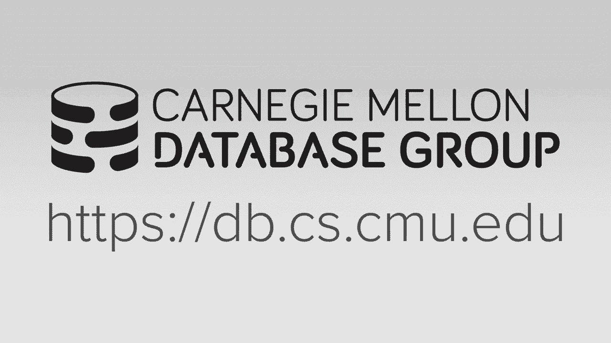
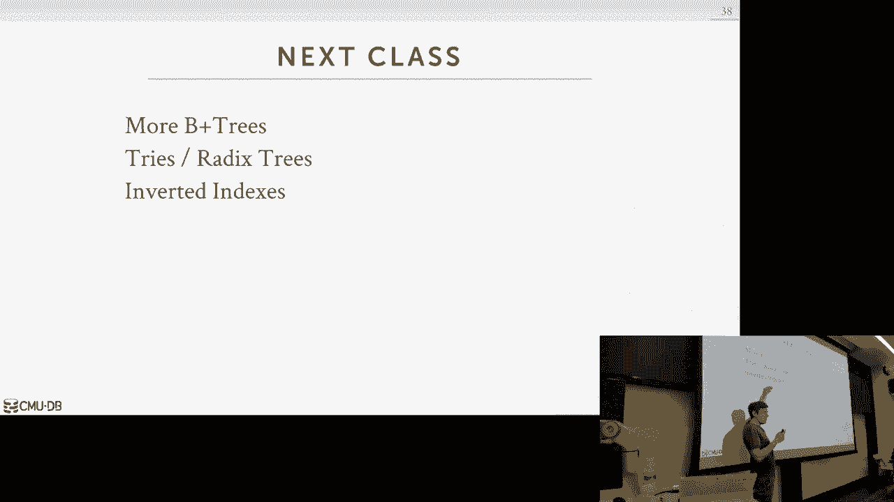

# 【双语字幕+资料下载】CMU 14-455 ｜ 数据库系统导论(2019·完整版) - P7：L7- 树索引 1 - ShowMeAI - BV1qf4y1J7mX

嗨伙计们，呃，让我们重新开始，为你鼓掌，把桌子放下，嗯，怎么样，你好吗，谢谢，好的，是啊，是啊，好的，太厉害了，好吧，在我们开始之前，我想看看一些评论和反馈，我们在球场上有，在所有最温文尔雅的地方。

我们可以得到关于课程的反馈，那是YouTube，以下是我们到目前为止在YouTube上得到的一些评论，这是一种标准的东西，对，他是最差的教授，我对数据库一无所知，没关系，他希望，我得了癌症，很快。

这家伙说他，我所有的朋友都去CMU，他们说，这个教授的卫生状况最差，学校里的任何人，他闻起来像油煮鸡蛋，所以这是真的，我做了，我以前确实有卫生问题，现在你用一种特殊的洗发水，但如果它是压倒性的。

这仍然是个问题，让我知道，我们得到了关于你的反馈，YO DJ下降表，节拍太新鲜了，我不得不脱掉衬衫，不知道这意味着什么，他们想让我们更多地展示你，所以通常是这种废话，但其实有一个错误，我上了最后一节课。

人们正确地指出，当我们谈论哈希函数时，我问他叫沙二五六，我想他叫了5号医学博士，我错误地说拍摄256不是一个，这不是一个对称的意思，你不能逆转它，然后这个人说把整个视频拿下来，但不管怎样，嗯。

但我的观点仍然正确，苏沙阿，二六具有我们不关心的密码属性，当我们在哈希表中做我们的，所以我们永远不会真正使用它，x有x哈希，或者城市里有我们以前说过的农场杂碎的东西，这是我们不使用的哈希函数，所以说。

理论上你仍然可以用六个镜头，它是不可逆的，但没人这么做，因为它太慢了，所有的权利，所以其他可以提醒大家的事情，日程表上有什么，所以下周周五的项目，应该做一件午夜到期的事，这么多，我们已经完成了。

但又一次，广场上的帖子，如果你有问题，当你走的时候，我们一直在稍微更新，有，你知道，在广场上提供澄清的固定柱子，帮助引导你前进，我也是，如果你对它的不同方面有疑问，然后做作业，我也是。

我们在本周周一发布了，下星期一到期，在嗯之后，第一个项目到期了，好的，关于一号项目的任何高级问题，他们没有尝试让它在本地机器或他们的开发环境中运行，我至少试过了，好的，好厉害，好的，所有的权利。

所以回忆一下，从上一堂课开始，我们开始讨论我们可以在数据库系统中拥有的不同类型的数据结构，我们整个讲座都在谈论哈希表，我们讨论了哈希表的一般情况，但是特别是哈希表可以在数据库系统中的各种地方使用。

比如将其用于内部元数据，实际上将基础表存储在我们的数据库中，以及临时数据结构，就像你知道的，构建哈希表以执行联接，所以对于数据结构的前三种用途，对于很多这样的案件，哈希表就足够好了就像内部的，系统。

不是经常，您需要能够在大多数时候进行范围查询，去吧，给我一把钥匙给我钥匙，给我价值，您正在进行点查询查找，所以我们现在想说的是，虽然是表索引，这就是我们可能想要实际运行查询的地方，想做范围扫描的人。

因此哈希表对我们来说是不够的，因为你知道，因为您只能进行单键查找，这里的每个人都应该大致了解什么是表索引，但我只是想提供一个更正式的定义，这样我们在剩下的课程中就有了一个基本的理解，我们在谈论什么。

因此表索引是，本质上是我们表中某些属性子集的副本，我们正在以更有效的方式储存，它允许我们进行有效的查找来找到我们要找的东西，所以你知道，在最坏的情况下，如果我们想在表中找到一个特定的键。

我们只是做一个顺序扫描，但是把它放在表索引中的想法，我们将有一个辅助数据结构，我们可以遍历或查找，更快地找到我们想要的东西，比必须做顺序扫描，所以这里要指出的关键是，索引将是表的副本。

这意味着它必须与表同步，这意味着如果我们修改表中的元组，我们希望这一变化反映在我们的索引中，因为我们不希望任何假阴性或假阳性，我们不想在我们的桌子上加东西，不把它放在我们的索引里，然后我们进行查找。

发现那个元组，这不是我们的索引，带着否定的结果回来，所以数据库系统是负责维护这些索引的，并使它们与底层表完全同步，这对你来说是完全透明的，作为应用程序程序员，我不知道，当我插入时，我不必说，哦。

插入此表，顺便更新这些其他索引，数据库系统至少有一个续集，数据库系统将看到插入查询，我知道我不仅需要更新表格，也更新我在桌子上的任何索引，所以在我们的系统中，有很多索引和，使查询更快。

然后是维护它们的成本，我们将在今天的过程中看到这一点，我们上次在哈希表中看到了这个，对吧，将某物插入索引中，有时会很快，有时会很贵，取决于您是否知道我们要插入给定密钥的内容，有什么东西已经在那里或没有。

当我们有查询时，出现了，数据库系统负责计算，对我来说最有效的访问方法是什么，用于回答查询结果的系统，同样，对于使用应用程序程序员来说，这是透明的，我只是写我的精选声明，我通常不具体说明。

在某些情况下你可以，我通常不具体说明，到底是什么索引，我想用数据库系统可以为我配置，再回到第一节课，这是其中一个，关系模型和像sequel这样的声明性语言的好处或优点，如果我现在在我的桌子上。

我的应用程序中有很多查询，然后我决定添加到索引中，我不必回去重写我的续集，我用那个索引，数据库系统自动为我配置，理论上它并不总是正确的，所以实际进行查询并找出哪些索引的这一特殊步骤。

使用它属于查询优化的范畴，这是一个超级难的问题，我们会在期中考试后讨论这个问题，嗯，但是这种事情，这就像一个优化问题来决定，你知道的，执行给定查询的最佳方式是什么，在所有这些不同的选择中，我有。

所以我们将在本学期晚些时候讨论，但现在假设我们知道要选择什么索引，当我们查找时，当然，它现在是计算机科学和数据库中的一个始终，在经常做一件事和做一件事之间有一个权衡，一点也不，所以如果你有很多索引。

这将使您的查询更快地进行查找，但现在你有了额外的成本来存储这些索引并实际维护它们，对呀，所以索引会占用页面，我们要把它存储在缓冲池中，我们得把它写在磁盘上，所以这占用了空间，但现在就像我说的。

当我对表进行更新时，我得去更新我所有的索引以反映这些变化，所以如果我的表有一千个索引，你会知道，在实践中，人们会做那种事，如果我现在做一个插入，我得对所有这些索引做一千次更新。

我的更新操作或插入操作被认为没有完成，直到我修改了所有的索引，因为它们必须总是同步的，所以我们不会讨论你如何决定选择什么索引，但这也是数据库中的另一个难题，他们有工具为你做推荐，来决定下一步你要选什么。

或者你花很多钱买人类DBA，为你做这件事，对呀，所以我们今天谈论的只是一个概述，a b加树是，嗯，然后我们会做，我们会花点时间讨论，你知道吗，我们必须关注的实施细节是什么，当我们建立索引时。

然后我们就谈完，实际系统实际做的一些额外优化，让这个东西在实践中有用，首先我们需要解决的是这个这是什么b+树，这与B树有什么关系，这是数据库的缺点，很多时候同一个词被用来反映不同的事情。

对于一个试图开始理解的人来说，这可能会很困惑，和这些东西有什么实际的区别，所以首先，有一种叫做B树的数据结构，然后在其中有一个特定的数据结构，它是一个B树，所以人们经常互换使用B树和B树。

但如果你回到20世纪70年代的文学，这些实际上是不同的数据结构，维基百科今天把它们作为不同的数据结构，所以第一棵b树是在1971年出现的，嗯那个，然后B树B树两年后在1973年出现了。

没有论文描述B树是什么，有一份1979年的调查报告说，你知道的，B B B树或B树在那里，哦，顺便说一句，ibm在1973年发明了b树，据说有一份技术报告描述了这一点，但你很难在网上找到它。

然后在70年代和80年代有一堆这样的，其他的变体，B星形树是B树上的这个变体，然后实际上B链接树是在1981年出现的，实际上这是在CMU发明的，这是描述它的论文，这是菲尔·雷曼写的，那家伙还在这里工作。

他在教务长办公室，所以你，如果你喜欢这个讲座，你可以去和他谈谈，他喜欢每一次，我看见他了，我总是说喜欢，哦，我们在课堂上讨论了豆树，他就像，哦，那张纸，就这样四十年后。

这仍然是我给这些人看其他东西的原因，这些树是因为我们要关注b+树，但我们不会在现代系统中，我们不会确切地使用它，它在书中描述的方式，就像二十世纪七十年代，我们实际上要从所有其他树那里借零碎的东西。

以前存在过的，但现在我们把它叫做b加树，很多时候，你会在数据库系统中看到，他们会说我们用的是B树，我几乎可以向你保证，或者至少我还没有见过一个助手，他们说他们用B树，它实际上不是一棵B树。

如果你去看Postgres的源代码，a Postgres文档，他们谈论使用B树，但就我所知，在看什么，它实际上在做，它真的又是一棵B加的树了，这些词可以互换使用，我会试着说总是B加树。

我稍后会简单地提到什么是B树，但在实践中，这才是我们关心的，这就是我们想在系统中使用的，好的，所以B加树是一种自平衡树数据结构，所以b树中的b in in或b树中的b in表示平衡。

这个想法是它将保存数据，我们按排序的顺序插入到我们的数据结构中，这将使我们能够进行有效的搜索，沿叶节点的顺序扫描，断言和删除，我们可以再次在log n中完成这一切，将此与哈希表进行对比，在最好的情况下。

哈希表是一个，最坏的情况是在B+树中，因为它是平衡的，它总是log n，这基本上意味着，不管从根到任何，叶节点中的任何键总是log n，不管我们删除、插入和改变周围的东西多少次。

B+树是在二十世纪七十年代出现的，因为他们试图建立一个数据结构，使它变得高效，你知道的，磁盘超慢且内存容量有限的喇叭硬件上的索引查找，所以B树有一个很好的优势，与B树相比。

你可以在遍历到底部后沿着叶节点扫描，你会按顺序阅读所有内容，或者沿着它们做顺序扫描，你永远不必回去，尽管这是在20世纪70年代设计的，它今天仍然被广泛使用，甚至对于更快的光盘和在没有磁盘的内存数据库中。

B树实际上在很多方面都优于，它仍然非常非常有用，所以这是原纸，这是一个每个人都引用的，从1979年开始无处不在的B树，在这篇论文中，他们描述了，或者他们提到，哦耶，IBM有一个叫做P+树的东西。

它于1973年问世，当你想引用一篇论文时，这是正常人引用的，为了树，那么我们要有一个b+树的性质是什么，所以它被认为是一个m路搜索树，这意味着我们可以在每个节点内，在我们的在我们的在我们的树上。

它可以有M个不同的路径到其他节点，或最多n条路径，不一定又是我，它是完美的平衡，我们要把这个数据结构，随着时间的推移保持平衡，就像你修改树一样，所以通过平衡，我的意思是到一个叶节点的距离。

或者任何到根的叶节点总是log n，总是一样的，另一件事我必须做的是我们必须保持这一点，这保证每个节点至少是半满的，所以再一次，如果i是节点中可以有的键的数量，我必须有一半以上减去一。

一半的数字在我的树上通过，然后我必须有小于n-1的，n减去1将是一个完全满的节点，所以我总是要至少吃一半，当我们开始删除时，我们会看到这一点，如果我不是，然后我得开始移动数据，所以我的节点是半满的。

这就是他们要保证的，第一个距离总是相同的，然后简单的一个是每个内部节点，我将在下一张幻灯片中描述，如果您有k个键并存储在节点中，你最多可以有n-1，如果你有K键，你会有k加一个非空的孩子。

下面有K个传递或指向K的指针加上一个传递或指向孩子的指针，实际上快速举手，这里的人以前见过一棵B加的树，很少好的，好的，又好了，这是数据库的最佳数据结构，所以这就是你在这里的原因，这是基本的b+树。

布局又是这样的，沿着底部我们有我们的叶节点，然后任何不是叶节点的节点都被认为是内部节点，现在这棵树有两高，意思是它有两个层次，所以内部节点也是根节点，行了行了，顶部总是有一个节点。

因为你就是这样进入树的，然后在叶子节点的下面，我们实际上会有兄弟姐妹的指针，所以这是来自B链接树的东西，所以在任何节点间都不会有兄弟指针，但是任何叶节点都会，所以现在我可以遍历到底部并沿着扫描。

你知道在任何方向上我都想继续找到我的邻居，获取更多获取更多数据，所以在内部节点中，它将是这样的，键和指针的组合，对于内部节点也是如此，指针总是指向另一个节点或NULL，如果那里什么都没有，然后关键就是。

不管我们是什么属性，我们正在建立我们的索引，我们想储存的东西，然后这些键被用来确定你应该走哪条路，当您开始搜索给定的密钥时，所以在这种情况下，这里是第一个关键五，所以它左边的路径。

往这个方向将是任何价值，任何少于五的键，然后是后面的那个，它将含蓄地是小于九或大于五的任何东西，所以如果我在找有价值的东西，少于五的钥匙，我会看着这个说好，我在找钥匙，一个小于五个，所以我沿着这条路走。

现在我找到了我的叶节点，我试着，你知道吗，找到我要找的东西叶节点，键值对又是，只要钥匙，就像它们在上面的内部节点一样，但价值可能不同，我们马上就会看到这个，它可以是元组的记录ID。

它可能是实际的元组本身，没关系，只是内部节点有指针，叶节点有数据，所以再一次，这只是重复我说过的话，但是在每个节点中思考它的方式，这是一个，它是一个键值对数组，您正在使用密钥来确定它是否是。

如果您在叶节点中，不管是你想要的东西，或者如果你是内部节点，不管你是向左还是向右，所以总的来说，但并不总是，键总是在每个节点中，总是按照任何排序顺序排序，你想要，您希望该节点的相关性，对呀。

所以我的例子，在这里我们只是有点，你知道我们按数字顺序，所以这将允许我们，当我们跳入一个节点时，如果取决于它的实现方式，则可能，我们可以在每个节点进行二分搜索，试着找到我们要找的东西。

而不仅仅是做线性搜索，但有时线性搜索是好的，我也是，因此，叶节点中这些值的内容可能会有所不同，取决于数据库系统，再次可能是创纪录的ID，可能是，它可能是实际的元组本身，我们一会儿会看到一些例子。

所有的权利，所以让我们看看这个叶节点实际上是如何实现的，所以再一次，逻辑上，你只是这样想，你有这个，这个，这个这个数组，用键值对交替，这就是很多教科书展示B树节点的典型方式，所以首先要指出的是这个。

因为这是叶子节点，我们在数组开头的末尾有指针，对我们的兄弟姐妹来说，这将是一个节点ID或页面ID，允许我们在任何一个方向上，或者如果我们在树的右边，或者树的左边，它只是空的，但又一次，没有人真正储存。

否，真正的数据库系统会存储他们的内部内部，像这样的B树叶节点的键值射线，这些是键值对，这些是指针，通常是分开存放的，所以就像在我们的页面槽里，我们会有一个标题，告诉我们一些元数据，关于我们页面中的内容。

所以在这种情况下，我们可以说树的哪个级别，我们基本上离，从根部，我们的节点中还有多少空闲插槽，然后是上一个和下一个，现在你可以看到我们把键和值分开了，我想我猜到你为什么要做这样的事了，是的。

整个是加三个下一个可以修复适合在一页，然后像这个值可以在其他页面中，他说，以便对于B树节点上的给定页，所有的键都能放在一页里，然后这些值可以适合另一页，不，键和值通常总是存储在同一个页面中，是呀。

因为它们的大小不完全一样，因为它们的大小不一样，而且也是对的，如果你在做二分搜索，您希望所有内容都适合您的CPU缓存，所以如果你有，如果你带着这些混杂的东西回来，为了进行二分搜索，在这一点上。

我实际上不需要这些值，因为我只是想找到我想要的钥匙，所以说，如果你把它拆散对了，取决于它是固定长度还是可变长度，你可以更有效地跳过这些键，值通常总是固定长度，对呀。

因为它们要么是32位的64位的记录ID，如果他们是元组，那就有点复杂了，但总的来说，你总是想把它们分开，一次又一次，它的工作方式就是你在键数组中的任何偏移量，对应于值数组中的某个报价。

所以我找到了我要找的钥匙，我要补偿，然后我知道跳转到偏移量4和值射线，找到了我想要的东西，正如我已经说过的，的，值可以变化，取决于系统，有些系统会破坏记录ID，这可能是人们使用的最常见的实现。

这就是Postgres所做的，这是所有其他商业数据库系统所做的，什么更复杂，我们可以谈谈下一节课，是什么样子的，当您实际将元组存储在数据中时，所以想想这个，而不是用我的元组堆成一堆。

然后是存储我的主键的B树，所以如果我必须保持同步，如果它们合并在一起，叶节点实际上是元组的表，你知道对应于主键，所以现在当我想遍历找到一个特定的键或特定的元组时，而不是在第一种情况下必须做，我遍历索引。

获得记录，然后查一下页表，找到那个然后他们去扫描那个块里面，找到我想要的元组，如果我做遍历，当我降落在叶节点时，已经有我想要的数据了，所以我的续集和续集可能是最著名的两个这样做的。

在甲骨文和续集服务器这样的情况下，我想默认情况下你会得到顶部的那个，但你可以在底部告诉它这样做，你必须带着特殊的旗帜通过，所以现在我想区分，因为我们了解了b+树的基础，让我们把它和原来的B树区分开来。

所以主要的区别是在原始的B树中，存储在索引中的值可以在树中的任何位置，这意味着任何内部节点也可以有一个值，比如记录ID或B+树中的实际元组本身，值只在叶节点中，那么这口井的含义是什么，B树中的一个。

我没有备用钥匙，因为我可以保证每把钥匙只会在我的，在我的，在我的树上，在B加树中，因为我在内部节点上面有所有这些路标，我基本上是在复制钥匙，此外，如果我删除B加树中的一个键。

我会把它从叶子节点的跳跃中移除，但我可能不会从内部节点中删除，取决于我是否在那里重新平衡，我可能没有一条通往它的路，对不起，如果我从叶子节点中删除它，我可能会把它放在内部节点。

因为这样我才知道该走哪条路，如果我在找其他钥匙，所以B树会更经济，以及它占用了多少存储空间，因为它不是复制钥匙，但不利的一面是，这就是为什么没有人最终在真正的系统中使用这个，它使更新变得更加昂贵。

当您有多个线程时，因为现在你可以在树上上下移动东西，你知道我有一个内部节点，我修改了一些东西，我让它在我下面和上面传播变化，因此，我必须在两个方向上都带门闩，这导致，我们将在下节课或下周看到。

这会在B+树中导致很多问题，我只对叶节点进行更改，我可能在上面有传播变化，但我只往一个方向走，是呀，我刚说两点左右，是的，是的，所以她的问题是，我可以重复我说过的关于B加树中的重复吗，所以回到。

给这个家伙，所以这是一棵B加的树，所以我想索引的钥匙，是一三六七九十三，但是如果你在根节点中查看，我有一个五五，不出现在叶节点的任何位置，意味着它可能进入了这个病例区域，但被插入了，然后就被删除了。

但我没有洗牌，重组我的树，所以我把它留在了里面的节点里，在一棵永远不会发生的B树上，每个键只出现一次，如果它出现在树上，然后它出现在我们的密钥集中，这有道理吗，所以说，如果你把它留在那里是为了。

但它仍然像，这不仅仅是一个问题或陈述，我们留在这里是为了搜查，它仍然物理地存储在我们的节点中，但如果我问如果我问这棵树，你有五号钥匙吗？我会说不，因为我总是要去叶节点，然后我试着找五个，我不会找到它。

所以还在那里，但它实际上不是一把真正的钥匙，是的，是呀，我们怎么处理这里的插入物，就像我们把其中一片叶子填满，好的，所以问题是，我们如何处理插入，当我们在树叶上摸来摸去，我们马上就好，是呀。

那是下一个话题，不会有任何重复，他的问题是叶节点中是否会有任何重复，是和不是，我们一会儿就知道了，所以这将被认为是唯一树的唯一索引，你可以拥有的唯一钥匙，具有非唯一值的键，我们必须处理这个问题。

我们也会在几秒钟内讨论这个问题，好的，所以我想下一个话题是他是什么，他问的是，我们实际上是如何，我们如何实际修改这个，绝对是插入，好的，所以我们要做插入的方式。

我们想要找到我们想要向下遍历并找出哪个叶节点，我们想把我们的新钥匙插入，所以我们再次使用内部节点上的路标，决定我们是向左走还是向右走，取决于键是小于还是大于，那些键数组中存储了什么。

然后当我们向下穿越时，最终我们会得到一个叶节点，然后叶节点是我们要启动键的地方，因此，如果叶节点有空间，然后我们插入来保持钥匙的有序，也许我们我们把它们分类，但有足够的空间，我们只要把它。

如果没有足够的空间，然后我们要把节点拆分，我们要把叶子节点，我们会把它插入，所以我们要做的是，我们只是要采取一个中间点在我们的关键空间，将所有小于中间点的键放在一个节点中。

在另一个节点中位于该节点之上的所有键，然后我们更新我们的父节点，现在包括那个中键，然后我们有一个额外的指针指向我们的，我们刚刚添加的新节点，现在我很高兴地说，这实际上是一个递归的东西。

因为如果现在我的父母，当我试图将新密钥插入父密钥时，如果它没有空间，然后我们要把它分成，然后将更改向上传播到上面，所以对于一个插入，我们可能要重新组织整个树中的，这就是我之前说的，就像在哈希表中一样。

如果我插入索引或通过哈希表，然后什么都没有，真的很快，但如果我必须扫描很长很长时间才能找到槽，我可以进去，那可能更贵，所以有时我们会插入我们的树，这将是一个昂贵的手术，因为我们正在重组整个数据结构。

其他时候会超快，我们不必担心，所有的权利，所以让我们做一个，让我们做一个演示，所以这是用，呃，这是一个，你知道吗，宁愿我用PowerPoint做动画，这是旧金山大学的一位教授写的，它有一个很好的。

你知道吗，一个基于Web的可视化，我们可以用来，呃，理论上，是呀，好的，对我不紧张好吗，所以我们将做一个最大度三，这意味着我们可以拥有的最大节点数是两个，或启动键在我们的每个节点是两个。

最多可以有三条路，所以我们把，可以看到插入两个，有一个可视化，是呀，所以度表示从它出来的路径数，所以三度意味着我有三条路，如果我是一个内部节点，所以我得把它储存起来，我最多只能存两把钥匙，因为再一次。

这么好，我是说，回到我们一开始展示的，我是说一个问题，我为什么把它设置为三，或者为什么是这样，为什么只有，所以再一次，所以这个，所以这个说，这是一个，这个是四级的，所以总是号码过去，是键的数量，加一个。

所以我看到一二三把钥匙，这个人必须有一个i右指针和一个左指针，对，他有一个右手指针，但那是共享的，最后有一个，所以这里有四条路出来，三个人，他，所有的权利，那么有没有办法让这个看起来更好看呢，嗯。

我们继续去看瑜伽吧，就在那边，所以我只插入了，然后去演示，对不起，我只插了两把或一把钥匙，一把钥匙，所以现在它只有一个条目，所以现在我将插入一个鼠标，我们把6个，是的，所以它在那个节点上有空间。

所以我可以插入它，现在我插入四个，在这一点上，它必须分裂，因为它只能你只能储存，它只能储存两把钥匙，所以它被一分为二，在这里放两个，四和六，六个在自己的节点上，然后他们拿了中间的钥匙。

并将其作为新根向上移动，再一次，我有指针指向他们两个，所以现在这样做，插入五个，对呀，可以放在那边，适应得很好，所以现在我插入五个，应该发生什么对吧，它会说很好，五大于四，大于等于四。

所以我知道需要往这个方向走，但我只能排序，我总是我只能在这个节点中存储两个键，所以我不会把这家伙的，然后重新平衡一切，四个在下面，它在那里放了五个，对呀，它分裂了，节点在中间放了四个，五六在这里。

然后放五个，因为那是中间的键，现在我们有指向这个节点的指针，这里的中间节点有四个，那一五，所以再一次，这是递归的，因为我不断地插入更多的东西，我一直在分裂，我一直把零钱分开，是呀，所以他说。

如果我们有重复的钥匙怎么办，所以其实，我不知道这是否重要，所以我确定，但是两个小时，是啊，是啊，那样做了吗，嗯，所以有不同的方法，对不起，我怎么做，它是，分辨率被顶了，嗯，我们开始了，好的，对不起。

所以说，这只是一个真实系统中的玩具图，您可以将四个存储在一起，只需维护多个条目，对于所有独特的值，你有相同的密钥，是啊，是啊，在这种情况下，我的意思是最坏的情况不能再登录了，因为我们有所有的，我是说。

所有的孩子和研究，呃成为，所以你的陈述是，如果我所有的钥匙都一样，是四四四四，然后呢，如果我在寻找一个精确的键值对，那就是法律，这不是，因为我做了一个顺序扫描，是呀，所以是的。

我们可以弹出Postgres，我们可以做一个有十亿行的桌子，对于一列，我们将值设置为1，我们可以调用Create，你知道的，每隔10亿行都有相同的值，对于这一列。

Postgres将让我们在此基础上建立一个索引，在那根柱子上，这是一个要建立的索引，因为就像你说的，他们都是一样的，所以输入它，所以怎么说这些人通常会做傻事，别傻了。

不要在不应该正确使用的东西上建立索引，我们会看到其他类型的索引，所以哈希表，还有其他东西，比如倒置索引，我们可以使用，如果你有很多重复的值，那可能会更好，但想想电子邮件地址，或者想想电话号码之类的东西。

这将是巨大的多样性，那么我们就不会真的有那个问题或主键，对呀，主键必须是唯一的，对这个权利来说太好了，所以再一次，所以这是如此清楚，所以让我们回去，所以新的删除现在我们有相反的问题，罐头插入物。

如果我们吃饱了，我们没有空间了，我们必须分开，如果我们删除，那么可能是这样，我们最后还不到半满，这将违反我们在B+树中必须有的保证，因此，我们必须做与分裂相反的事情，这是一个合并，所以再删除一些东西。

我只是做我的遍历，我走到树下，试着找到我要删除的密钥，我着陆，我总是要降落在叶子节点上，如果删除该键后我的叶节点仍然至少有一半满，那我就完了，我只是把它移除，也许重组我的钥匙射线，但就这样了。

但如果我还没吃饱，那么现在我得想出如何重新平衡，所以我们可以做的一个简单的技巧，看看我们在其他叶节点中的兄弟姐妹，这就是为什么我们有那些兄弟姐妹指针，我们可以看着他们，试着偷他们的一把钥匙。

让自己保持平衡，只要我们的兄弟姐妹和我们有同一个父母，那我们就可以偷这个，因为这不需要在上面进行任何再平衡，所以如果我们不能从我们的兄弟姐妹那里偷东西，那我们就必须合并，所以我们得去拿我们的。

带我们的一个兄弟姐妹，把我们所有的钥匙组合在一起，最终可能会太饱，但我们可以我们可以平分，把那个也分了，这和复制这个是一回事，但我们会合并删除它，删除上面的一个键，然后现在一切又平衡了，就像劈叉一样。

我们就像，合并时我可能要到处传播变化，通过删除密钥，我们的父密钥现在可能会变得不到一半满，它必须合并，因为我们可能必须重组整棵树，所有的权利，所以让我们回到我们的例子，做我们的演示，当然啦。

现在我得弄清楚怎么去右上角，所以我们只是在叶节点中维护兄弟姐妹，唯一正确的问题是，我们是否只在叶节点中维护兄弟姐妹，是呀，对呀，所以让我们做，让我们做，删去四，我得删掉五个，让我向下滚动，然后按回车键。

所以我们可以看到这个权利，插入的遍历也是如此，对不起，是啊，是啊，那是插入的，又是三个，很抱歉分辨率低，所有的权利，所以在这种情况下，让我们五个人，它应该会发现他们两个只找到了他们中的一个。

所以让我们删除另一个，往下走，又好了，在这一点上，这两个节点都还满了一半以上，所以那很好，所以现在，让我们删除四个，和，我怀疑它会试图删除那边更远的那个，往右下去，发现删除，再一次，该节点现在是半空的。

我是说它至少得有一个，因为它是空的，它合并了一切，降低了树的高度，是呀，低沉的音符，简单的玩家，以及我们如何形成大，这个问题是，如果只有叶节点有兄弟指针，那么实际上如何进行合并。

所以它的工作方式基本上是想象一根线往下走，当它下降时，它可以维护访问的节点的堆栈，我们实际上需要这样做，当我们做所谓的闩锁或耦合，当我们往下走的时候，我们把门闩，以防我们需要重组一切。

所以我必须知道我必须拿着门闩，你知道，当我去某个地方的时候，我得抓住门闩，我的父母，以防我需要重组我在下面做的任何事情，所以我不会释放它，直到我知道我是安全的，所以我知道我是怎么到那里的，是呀。

有两个兄弟姐妹，所以如果有两个兄弟姐妹，这样我就有权利，是啊，是啊，他的问题是，如果左边有两个兄弟姐妹，权利，你选哪一个，看情况吧，通常你会选择一个和你父母相同的，我觉得你应该，但如果你喜欢。

如果你在中间，是啊，是啊，这些家伙有同一个父母，所以你说你想重组这个，你可以选择向左或向右，没关系，让我们看看这个是做什么的，所以我们，如果我们为此删除，应该把它从中间拿出来，然后现在我删除两个。

它会选择左或右，它只有，它只能有一两个或者一两个，所以它就空了，很明显我们可以，我们可以增加树的度，但好像这并不重要，它仍然是正确的，所以这个也是这个，这张图显示了兄弟指针以一种方式运行。

你可以在两个方向上试一试，你必须做额外的工作来实现这一点，但就像你可以再做很多次一样，为了简单起见，你可以让它朝一个方向走，但你不能这样做，你知道的，按降序排序，然后往另一个方向走，如果你想做扫描。

对很简单，当然啦，获取删除和插入的详细信息，在实践中，进行拆分合并实际上是非常困难的，我们将在下周看到如何确保，确保当我们重组的时候，受到威胁的树，我们没有任何诚信问题，所有的权利，所以在实践中。

研究中的信息表明，真正的树的典型感觉因素，在真实数据上大约是67%到69%，意思是，实际存储在节点中的数据量最多，你知道的，六十七实际上是有用的数据，所以你可以有典型的能力，你知道的，当当。

对于8千字节的页面，这个页面数有四个级别，你基本上可以存储30万个键值对，对呀，这样你就可以索引并进入log n时间到三个中的任何一个，三亿个钥匙非常非常快，大部分数据将再次存储在叶页上，正如你所料。

因为当你添加更多的键，你开始散开，大部分数据将存储在这些叶节点中，所有的权利，所以让我们来谈谈你可以用这些索引做的其他事情，有一个概念，这个概念，我称之为聚集索引，所以我说，在开始时。

数据库的表堆是无序的，这意味着我们可以以任何顺序将元组插入任何页面，我们不必跟着，你知道时间顺序会让事情如何插入，但可能有些时候，我们实际上希望以某种方式对数据进行排序，比如，比如主键，因此。

这些将被称为聚集索引，所以你可以定义一个索引，当您创建表时，您可以定义一个所谓的聚集索引，而数据系统将保证，页面上元组的物理布局将与顺序匹配，他们在索引中排序，所以这对某些事情很有用，就像，你知道的。

如果我在主键的确切范围内进行大量查找，如果我知道我的元组以相同的顺序存储在上面，现在的主键，当我当我你知道，在少量页面内遍历叶节点，我可以找到我需要的所有数据，如果我没有在我的，我在钥匙上，我正在查。

然后每一个记录的想法，我本可以指向另一页，我可以做一堆不同的随机iOS，去读我想要的数据，所以并不是所有的数据库系统都支持这一点，有些数据系统默认情况下是这样的，就像我的续集，通过将元组存储在。

叶节点本身，它是一个聚集索引，所以它保证在磁盘上的页面上，元组按主键顺序排序，万一我的续集，如果不定义主键，他们会给你做一个的，他们会有一个合成的类似行ID，记录ID，那对你来说是透明的。

但这就是他们过去如何弄清楚，你知道你的元组实际上在哪里，波斯格雷斯病例，我们下次可以做一个演示，但他们有聚集索引，你可以定义一个，你说把我的表聚集在这个索引上，但它实际上不会保持它的顺序。

这意味着一旦存储在磁盘上，它就会进行排序，但随着时间的推移，它可能会坏掉，因为它不会自动为你做这件事，当我们谈论多版本并发控制时，就会很清楚为什么他们会这样，所以让我们谈谈如何在，呃，在我们的B+树上。

所以再一次，因为事情是有序的，你知道我们可以快速遍历找到我们要找的东西，但我们做了一个好处，你可以用B加树做，你不能用哈希表做的，你不需要有确切的钥匙，为了进行查找，你实际上可以有钥匙的一部分。

所以让我们说一个真正简单的例子，我在属性abc上有一个索引，所以我可以这样查找，其中a等于五，b等于三，我有的地方，我没有C，但我有A和B，我不需要有C，我仍然可以找到我要找的东西。

你不能在哈希索引中做到这一点，因为想想会发生什么，我要五加三，试着把它们拼凑在一起，没有C，它会跳到某个随机的位置，那不是我要找的，您还可以在只有，也许中间的那个人是对的，你没有前缀，你没有后缀。

你只有中间，又是中键，你不能在哈希表中这样做，所以并不是所有的数据都支持这一点，大家都支持前缀1，在那里你至少有顺序中的钥匙，因为它们是为索引定义的，中间这个不是每个人都能做的。

实际上我想也许只有甲骨文和续集服务器才能做到这一点，所以让我们看一个更具体的例子，假设我们有一个定义在两到两列上的索引，或者两个属性，所以这将被称为复合密钥，所以不是在一个专栏里。

它实际上是两列结合在一起的，我们定义索引的顺序将决定什么样的查询，我们可以在他们身上做一次，如果我想找一个，说它正试图找到关键的a b井，在这种情况下，我有我在密钥中定义的两个属性。

所以现在我可以直接比较一下，看第一把钥匙，然后看第二把钥匙，然后决定我是要左还是要右，所以在这种情况下，a小于等于，b小于c，所以我知道找到我要找的钥匙，我沿着这条路走下去，在节点中做我想做的任何搜索。

然后我可以找到我想要的条目，让我们说，虽然现在我想做一个前缀搜索，其中我只有合成键的第一个元素，但不是第二个，所以我可以再看看第一个键或第一个属性，键A小于等于，所以我知道我要找的起点。

它必须在这个方向向下，所以我走到这里，但现在我要在我的节点上做一个顺序扫描，穿过树叶找到所有我想要的入口，直到我到达一个小于或等于，你知道我的钥匙，所以在这种情况下，一旦我找到一个以B开头的。

我知道我的搜索已经完成了，不会再有其他东西了，在叶节点中，它将满足我的谓词，所以又是这个，这个很容易还是不容易，但是很多数据系统都可以支持这个，困难的是你只有一个，你只有最后一个元素，也不是第一个。

所以你最终实现这个的方式，你试着弄清楚，至少在顶部和根节点中，树的哪些部分，我需要看看，可能有什么东西可能有什么东西，所以在这种情况下，我知道，不管我有什么第一个值，它总是要小于c，对于第二个属性。

这是第二个值，所以我不需要看那边的这个家伙，我只需要看看其他的，所以本质上，你所做的是你最终做多个索引探测，也是穿越，用不同的值代替你没有看到的东西，我们看着顶部说，嗯，我知道我有一个A。

我有一个B和一个C，我在这里找不到C的东西，所以我可以跳过那个，现在让我来看看这些家伙，我用A代替星星，每一个都是一个单独的查找，然后你把它们组合在一起，产生最终的结果，所以甲骨文称之为跳过扫描。

我不知道其他系统怎么称呼它们，是呀，右边的一个可能是分贝，所以在那场比赛中，就像，你怎么知道，你不是，我想这正是，你知道，但提前，你觉得很棒，是啊，是啊，是啊，是啊，是啊，是啊，是呀，是呀，你说的对。

那是不对的，但是是的，所以你会包括，但每一个都是，这是一次单独的遍历，你只是在填写值，而就像这里的这个，我想说的要点是这样的，就像这个一样，第一个我必须做一个遍历，然后我发现我在找的东西这个是。

你必须多次向下探测，并填写值，谢谢。我会解决的，所以让我们去找好东西，所以我们现在知道什么是B树了，让我们来谈谈你想如何建造它，它使它这个东西实际上很有用，所以有一本很棒的书，我认为是免费的。

至少如果你谷歌一下，它免费出现，我不知道那是不是真的，这是加思·格拉菲几年前写的一本很棒的书，他是一位著名的数据库研究员，他要，我们会谈论他为之做的很多事情，稍后的查询优化，但他基本上他写这本书是。

就像你可以做的所有现代技术、调整和优化一样，在A在B树，在一个真实的系统中，所以我们将讨论其中的一些事情，事实上，这是一个非常轻松的阅读，它涵盖了所有真正重要的话题，以一种易于阅读的方式。

所以我们将讨论如何处理不同的节点大小，如何进行合并，如何处理每个长度的键，非唯一键，他们问了什么，然后节点间搜索，如何在节点内进行更好的搜索，你可以在我们的B加树中想到一个节点。

就像我们桌子上的一页对吧，因此节点的大小实际上可以与页面大小相同，虽然不一定要，这取决于我们存储数据库的硬件类型，我们实际上可能想要更大的页面大小更小，页节点大小是较小的节点大小。

所以研究表明你的磁盘越慢，您将索引存储在，所需的节点大小越大，你知道，应该是很明显的，为每个磁盘右键，我有我有，我带来了，我可以按顺序读取节点，所有的页面，这将比做一堆随机的，i o到不同的不同节点。

如果我的节点是较小的大小，所以如果你在旋转这个硬盘，您可以没有高达一兆字节的大小，那通常是个好数字，ssds大约是10千字节，它大致对应于节点大小或页面大小，真正的数据库系统使用的。

但如果您是内存数据库，你实际上想要低到512字节，所以这是另一个很好的例子，我们在缓冲池中讨论了如何，我们可以在系统中为索引页设置一个缓冲池，和一个用于四个数据页的缓冲池集。

我们可以把它们设置成不同的大小，这样我就可以设置，如果我要慢慢旋转这个硬盘，我可以有一个缓冲池，为我的B加三页，让它们是一兆字节，而我的数据页面，我会把它们保持在8千字节或16千字节。

最佳尺寸也可以变化，取决于您对其进行的操作或查询类型，所以叶节点扫描，我们正在进行长的顺序读取，这些通常更好地具有更大的节点大小，因为我可以做更多的顺序，我不，而如果我做了很多查找，大量的遍历。

那是很多随机的，所以我想有更小的节点大小，所以我们接下来能做的就是违反，我一开始就说过我们随时都要合并，任何时候我们还没吃饱，我做的演示很简单，它会做到这一点，但实际上，您可能不想立即这样做。

当你还不到半饱的时候，因为就像我们在哈希表中看到的那样，当我们用线性散列进行删除时，在最后，我可能会压点东西，我可能会合并一些东西，因为我吃了不到一半，但是下一个操作插入到该节点，现在我不得不再次分开。

所以合并操作是昂贵的，劈开劈开也很贵，但是它分裂了，我们必须这样做，因为我们的节点空间用完了，合并是我们实际上放松了这个要求，而不是马上合并东西，所以随着时间的推移，它会变得有点不平衡。

然后在后台我们可以有一个垃圾收集器，或者经历一些事情，做再平衡，或者经常是这样，人们只是从零开始重建整棵树，这解决了所有这些问题，所以很多时候你会在，你知道吗，高端商业企业系统，你知道吗。

虽然他们会在周末关闭数据库，因为他们会重建他们所有的索引，这就是他们正在做的事情，他们正在重新平衡一切，因为它并不总是正确地合并，像银行一样，说他们在星期天凌晨三点下来，这可能是他们正在做的事情之一。

所有的权利，所以现在我们想谈谈我们实际上想如何处理光纤长度键，所以再一次，到目前为止我所展示的一切，我们假设键是固定长度，值总是固定长度，在实践中，这些值将始终是固定的长度。

所以我们有四种不同的方法来处理这件事，所以第一种方法是，而不是将密钥本身存储在节点中，我们只存储一个指向实际属性或元组的指针，我们可以在那里进行查找，以找到钥匙实际上是什么，所以再一次，如果我有一个。

你知道的，如果我有一个非常非常像条形图的属性，而不是将条形图存储在节点中，我有它的记录ID，然后当我想弄清楚钥匙是否，我在查火柴，存储在B树中的密钥，我按照记录ID，去拿页面，看看真正的价值是什么。

所以这显然是超级慢的，这很好，因为如果我们存储的数据更少，因为现在我们只存储指针，而不是节点中的实际键，但查找很贵，你知道的，当我们穿越，人们在20世纪80年代尝试过在内存数据库中使用这种方法。

因为内存真的很贵，再也没有人这样做了，每个人都储存钥匙，总是在节点上打洞，接下来你可以有可变长度的节点，这基本上是允许的，节点的大小可以根据存储在其中的内容而变化，但我们说这是个坏主意。

因为我们希望我们的页面大小总是相同的，在我们的缓冲池和磁盘上，这样我们就不用担心做薄背衬的问题了，来决定如何，你知道的，放，你知道很好，自由空间放我们想储存的东西，所以没有人也做这个，下一个方法是填充。

基本上我们说你看看属性是什么，你试图索引，我们说无论它的最大尺寸是多少，不管你给我们什么钥匙，我们会用空位或零拍打它，让它永远合身，我们的节点大小，所以一切都很好，很好地对齐。

所以有些系统实际上是这样做的，我想Postgres会这么做，我们下次可以看看，嗯，但又一次，这是一种权衡，我在浪费空间存放东西，所以这个y也太，确保正确定义模式是非常重要的，就像如果我存储电子邮件地址。

它们是，你知道的，可能是三个两个字，也可能是五十个字，但我将VAR字符大小设置为1024，如果我把它加到1024，尽管我的大多数电子邮件都没有那么大，那我浪费了很多空间，你是做什么的。

如果你只是把弦放在这里，因为你没有，定义字符串的最大大小，总是喜欢找到模式，而不是像这样，伤害我，再说一遍，先生，总的来说，因为这些不是这样的，像c弦，或者他们必须L和纠正，就像你总是定义长度一样。

是啊，是啊，就像当您调用Create Table时，您可以定义VAR字符，你在里面定义长度，你不必把它放进去，我和我没有不同的系统默认不同的事情，但实际上你总是想说，这是我能储存的最大尺寸。

所以var r应该是非常长的，所以即使我们说最大尺寸可以是三二，如果你给它十六分，你知道字符串，理论上，它可以更紧凑地存储，有些系统做不同的事情，我有些系统实际上，你说它是它是一个字符，它总是那么大。

它总是被填平，他们实际上还是那家店，作为条形图，所以逻辑上你不知道，你不在乎被窝里，他们可以做不同的事情，我的续集总是最糟糕的罪犯，所以如果你说字符串的最大大小是16，你给它一个三，两个。

三个两个字符串，它会储存它，只是默默地为你截断它对吧，所以Postgres和其他系统会抛出错误，但是数据库系统应该对索引正确地执行同样的操作，我们喜欢建立一个索引，我们必须被告知，你知道，这是。

这是属性和我们的表，您的索引，所以我们知道他们是什么类型的，我们知道他们的最大尺寸是多少，我们可以根据需要垫上，更常见的可能是在间接地图中使用，在这里，我们将在类似的键数组中存储键的指针。

但我们仍然是指针，实际上只是节点中的两个偏移量，而不是到某个任意的页面，所以它看起来是这样的，所以我们有一个关键的地图，所以这又是排序的，这些只是指向这里的指针，但这些是根据键的值排序的。

所以说得很清楚，钥匙本身，不是键对应值，但我们试图存储的实际字符串，就像元组的插槽页面布局一样，我们将从结束到开始成长，这边是从，你知道从头到尾，然后在某个时候我们太饱了，实际上我想这必须是固定的尺寸。

所以我们要提前定一个度，所以，但如果我，如果我没有用完空间来存放我想在这里存储的东西，然后我可以有一个溢出页面，那是与此相连的，所以再一次，这只是一个抵消，不管关键是什么，所以现在，如果我在做二分搜索。

当我在这个数组中跳跃时，我跳到这里看看实际的键值是多少，那么我们可以做什么简单的优化来让它跑得更快呢，所以可以作为备份存储的东西，这是一个声明，就是，是陈述还是问题，我们是将其存储为数组还是链表。

它总是存储为数组，你如何做一些指令应用程序使用，我将其存储为数组或向量，向量作为数组中的包装器，如果我现在做插入或删除，那将需要，是的，但又是这样的，这只是在节点本身，所以尺寸没有那么大，对呀。

所以你知道，扇出喜欢，也许三二，所以我有三个二元素，我需要，我需要保持分类，我可以付现金，那非常快，如此如此，呃，当你向下移动的时候，当你用不同的键比较时，你总是像你一样比较。

你喜欢先比较那个键到指针的地方，然后比较正确，好的，所以说我在做二分搜索，在这种情况下二分搜索就是线性搜索，所以我只是扫视一下，我想看看，有钥匙吗？我在找一个匹配的，我所拥有的，所以我必须按照这个指针。

但同样，这只是一个抵消，在同一页上，所以这将是，你知道的，也许16位，我沿着这个偏移量跳转到这里，然后我做比较，如果不匹配，然后我跳回去，做同样的事情，跳到这里，就像插槽页一样，其中元组不必按顺序排序。

就像它们在页面上的布局一样，就像它们在插槽数组中排序一样，这很像下面的数据，可以意味着任何命令，我马上就知道如何，你知道的，我知道怎么跳，基于此，对于非叶节点将做同样的事情，他的问题是针对非叶节点的。

你也做同样的事情吗，是呀，这是，这是非常好的，像数据和任何节点，这是一种微观优化，而去磁盘总是最昂贵的事情，但我们可以做的一件很简单的事情就是认识到，因为这一般只有十六位，我上面有很大的空间。

所以也许我只是取每个字符串的第一个字符，把它嵌入到这里，所以现在当我扫描的时候，试图找到我要找的东西，如果我的钥匙不完全匹配，你知道的，我知道的第一个字符，我不需要向下遍历并再次找到它。

这就像这就像这一切都将留在记忆中，这就像避免缓存丢失，进行二分搜索，并使搜索速度再次加快，这是一个微观优化，避免磁盘一直是我们在这门课程中关心的主要事情，但这是一个非常简单的技巧。

你可以做这个来加快速度，是呀，再说一遍名字以同一个字母开头的两个人是什么，所以就像什么，如果有两个人的名字和开头相同的字母，你必须取决于你在找什么，如果你想找到一个，你找到第一个你就完了。

如果你需要找任何人，你得去找他们两个，这里也一样，对这里的这个，我必须，我不得不，如果我想找到这里每个人的不同，但如果有保罗和普拉尚，谁是我的PG学生，我会扫描这里，好枪法，然后实际上去下一个。

只要确保那个没有同样的，你知道它没有同样的东西，但只有当您的排序基于名称时，这才会起作用，就像你可以定义排序函数一样，也对，比如将字符串映射到特定的数字，这些数字被使用，好的，所以他的他仍然联盟。

所以有蘸料，所以我展示了Lexa的图形顺序，按字母顺序排序，他们是高端的，数据库系统，您实际上可以定义任意排序顺序，一切都还是一样，然后呢，你会怎么做，你不是，你说的是字典代码，我们不谈这个。

我可以有不同的，你知道，基于它是否是Unicode进行排序，或者我用什么语言，你必须开始，数据系统，会知道排序顺序是这样的，所以你所知道的，它会知道什么，什么前缀，如果它想再在这里储存，高层。

高水平的想法是，还是老样子，是呀，我想再检查一下，就像，如果我们有k加一度，这意味着我们有一个最正确的K，我们想探索，所以他说，所以他说，如果你有K键，你最多有k加1个指针指向其他东西。

然后你探索所有的K键，找出潜在的一个，你想经历，不一定是为了简单，是呀，你只要沿着键扫描，做线性搜索，所以他们完成了时间，络合，所以他的说法是，复杂度应该是k乘以log n，是呀，那是一个常数。

我们可以把，因为log n是最大页数，iOS，我必须做穿越，那总是数量级的，比在这里查找缓存行更快，1。记得我一开始就说过，这是存储层次结构，任何超出记忆的东西，我们不在乎，我们可以扔掉，是磁盘。

i os才是真正的颜色，我们得避免，那个，我们做的二分搜索，我们一会儿就会讲到这一点，好的好的，所以现在开始，人们问的另一件事是我们如何处理非唯一索引，嗯，这和我们在哈希表中讨论的是一样的。

有两种基本方法，你可以复制键I并注意，就像，在我们的示例中，这里，重复的密钥分裂到另一个，另一个节点，我们必须注意，这可能会发生，确保我们阅读我们需要阅读的一切，或者我们毁掉一个价值清单。

我们存放钥匙一次的地方，我们复制值，或者在节点中有一个单独的空间来存储给定键的所有值，对呀，所以它看起来是这样的，所以如果我复制了钥匙，我只是多次拥有钥匙，同样，就像偏移量向下指向，无论价值在哪里。

你知道如果我插入一个新的，然后我你知道我把它插在这里，和某些新的K，我把它插在这里，把所有东西都移过去，所有东西都仍然在价值列表中工作，因为你就是这个样子，我把钥匙毁掉一次，但现在我也有一个指针。

到节点中其他地方的偏移量，其中我有与给定键相对应的所有值，第一种方法更常见，我不知道到底是谁在这里做这个，是的，假设键总是相同的，你喜欢枪，可能所以她的问题是。

我可以假设重复的密钥现在总是在同一个节点上吗，所以在我从演示中展示的示例中，它实际上把它作为兄弟键移过来了，这是做这件事的一种方法，其他系统实际上会有一个溢出链，这将意味着对于给定的叶节点，哦。

顺便说一句，下面是你下面的一些其他页面或其他节点，对应于，你知道你实际上在上面储存了什么，所以工作，你想要吗，就像，问题是，如果我在搜索给定的密钥，我怎么知道该按什么键，所以回到那个例子，我会。

如果我在找一个大于等于四的，我得从这边下去，找到四个人的第一个入口点，然后我继续沿着叶子节点扫描，直到我找到不等于四的东西，然后我知道我又看到了一切，数据系统知道密钥在哪里是唯一的或不是唯一的。

所以它知道它是否必须这么做，所以它知道，哦，这是主键，或者这是一个唯一的索引，所以我要找的东西应该只出现一次，因此，我只得到一个叶子节点，它有我想要的，如果它不是唯一的，那你得解释这一点，你要么再一次。

如果它只是在叶节点上复制，我沿着兄弟姐妹扫描，如果是溢出，我刚发现第一个叶节点，然后向下扫描它的链条，是呀，所以p的边并不总是相同的，值呢，声明，问题是钥匙的大小总是一样的。

或者钥匙的大小并不总是相同的，或者值总是相同的，下一节课我会给你看这个，如果，如果该值只是一个记录，元组的ID总是相同的，不是三十二位就是六十四位，取决于系统，如果它是实际的元组本身，就像我的续集。

然后你必须这样处理溢出，那就更复杂了，我们下节课再讨论这个问题，我们已经简单地讨论过了，但我会证明这一点，在节点内有不同的搜索方法，再一次，当我遍历节点或唱树时，我遍历，我得在钥匙上搜索一下。

找到我要找的东西的键数组，来决定你是否知道我想要的匹配，或者我需要向左还是向右，所以最基本的方法就是线性搜索，所以我在找八号钥匙，我只是从我的键数组扫描开始，我找到我想要的了吗，我做得很好，最坏的情况。

我得看所有K键二进制搜索，如果排序好了，然后我就找到中间点跳到那个数字，这个教训是小于还是大于我要找的钥匙，或者我要找的人，它告诉我是向左还是向右，在这种情况下，我在找八个，我在七楼着陆。

我知道八大于七，所以我跳到这里，然后我取中间点，我得到九，然后我走到这个方向，我得到八个，我找到了我想要的一件事，虽然这有点酷，如果您知道密钥的值实际上是什么样子的，您就可以这样做。

实际上键的样子是你可以使用插值技术，在那里您可以近似地确定密钥的位置，通过做一些简单的数学计算来计算出线性搜索的起点应该是什么，所以在线性搜索的情况下，你从头开始，一直走到最后，如果我知道我的钥匙。

或者在本例中是整数，我对他们的分布有所了解，然后我可以做一个非常简单的，你懂简单的数学，说得很好，我知道我的数组中有七个键，最大键是十个，我在找八个，所以如果我拿10减去8得到2，7个键减去2得到5。

我知道我可以跳到第五个位置，这至少是我正在寻找的东西的一个起点，所以这一个这显然是有效的因为它们总是以单调的顺序增加，如果有浮子，这是很难做到的，如果他们的弦，我认为你做不到。

但这是你可以做的另一个技术，使搜索进行得更快，这个我不知道怎么冷静，有多普遍，二分搜索是，我想每个人所做的，但又一次，现在有一个交易，为了进行二分搜索，我得确保我的钥匙井井有条，如果我在做线性搜索。

我没必要那么做，因此，当我更新节点时，我不付维持排序秩序的罚款，所有的权利，所以让我们快点结束，那么我们可以做一些优化来使它变得更好，所以这些事情就像，再次，一个真正的数据系统实际上会让b+树走得更快。

所以第一种，首先，我们讨论的两件事是压缩数据的不同方法，所以我们可以做的第一种压缩方案叫做前缀压缩，这是基于观察，因为我们把钥匙按顺序放好，很可能在很多数据集中，存储在单个节点中的键，实际上会非常相似。

对呀，因为那是因为我们最终对它们进行了正确的分类，所以在这个例子中，我有一个节点，有三个键，罗布，抢劫和机器人井，它们三个都有相同的前缀，因此，与其让我复制或存储多余的罗布，一遍又一遍，对于每一把钥匙。

如果我把它提取出来呢，存储前缀一旦抢劫，然后是房间的钥匙，我储存，剩下的部分，那其实是不同的，所以这是非常非常常见的，这就是这些有时被称为以前的压缩前缀树，这就是为什么他们在很多高端产品中使用。

或者很多大型数据数据库系统，因为你知道，因为有太多重复的数据，所以Facebook把它用于他们所有的内部，我的续集，这对他们来说有很大的不同，它们节省了很多空间，所以这只是一种方法，你可以做的其他优化。

如果再一次，如果我在做一个聚集索引，在那里我知道我所有的元组，元组在磁盘上或页上，就像它们在我的索引中排序一样，那么很可能同一节点中的元组，他们的记录ID将具有相同的页面ID。

因为他们都会在同一页上着陆，因此，与其一遍又一遍地存储页面ID，为每一个，对于节点中的每个元组，我只存储一次页面ID，然后分别存储它们的偏移量或插槽，对是的，对不起，对不起，我是说，如果你在做这样的事。

然后关于系统如何选择使用什么修复，因为比如这里你有两件事要从罗布开始，我怎么知道在这种情况下，就像三件事，所以很明显，是呀，问题是，我们如何真正决定做什么是正确的，所以你基本上可以说每次我插入。

我知道常见的前缀是什么了，这就是我要储存的，你可以说任何时候我都喜欢压实，或者做一个重新优化，然后我决定什么是最好的，对，你知道为了我的钥匙，在实践中，也可以把它想象成在许多数据库系统中。

新的键可能会被插入，总是在树的一边，像这样的价值总是在增加，所以很多，另一边的树的很大一部分将是静态的，这将是，你知道大多数时候只读，所以在这一点上，我可以做出一个艰难的决定，就像我想做的压缩和压实。

不同的权衡，您可以在线或离线进行，是呀，你如何处理，就像，如果有人断言，就像悲伤这个词，或者类似的东西，所以问题是会发生什么，如果有人插入悲伤这个词，对呀，它最终在这个节点上，然后是的。

你必须你必须对此负责，你必须在飞行中维护它，正确，是啊，是啊，或者你可以说来源，网格和附加元数据，这个前缀只用于前三个键，不是其他的好吧，你可以做很多把戏，与前缀压缩相反的是后缀截断，这里的基本思想是。

我们可以认识到我们没有，可能需要将整个密钥存储在我们的内部节点中，弄清楚我们是要左还是要右，所以在这种情况下，我们有abcd到k作为一个键，另一个键的最大为V的元素。

但如果我只是想看看我是想向左还是向右，我可能只看第一个，你知道，在这种情况下，第一个字符，因此，不是将整个密钥存储在节点中，如何存储，它的前缀，然后扔掉剩下的后缀，所以在这种情况下，我可以扭曲。

我和A和我，这就足够了，但我在下面显示abc l m和n，我还得储存整个钥匙，因为我需要去，并且能够说，你知道是关键，我在找这里，但在我内心的路标里，我不需要这个，拥有全钥匙，当然。

你必须再次保持这一点，如果有人插入了违反这些的东西，我们要你知道，重新排序或重新组织，但实际上你知道如果数据没有太大变化，那么这可能是另一个大胜利，1。据我所知，前缀压缩比后缀截断更常见好吧。

我想说的最后几件事是如何处理，批量插入和指针吹哨，所以在我到目前为止展示的所有例子中，我们假设我们正在逐步建立我们的索引，我们正在一个接一个地插入钥匙，但在很多情况下，你提前拿到了所有的钥匙。

所以这是一个非常常见的模式，人们在数据库中说，我想批量加载一个新的数据集，我从其他来源收集了数据，我想把它放进我的数据库很多次，人们所做的是，他们把所有的索引，批量加载数据，把它插到桌子里。

然后他们回去添加索引，对呀，这样，当你插入新数据时，你就像你一样，你不是想维护索引，比较贵的那种，所以在这种情况下，如果你提前拿到所有的钥匙，一个非常简单的优化来构建索引，而不是自上而下地建造。

就像我们到目前为止所做的那样，你实际上是自下而上建造的，假设这些是钥匙，我想插入我做的第一件事就是把它们分类，我们将在几周后看到，我们有一个有效的算法，我们可以使用技术。

以最大是我的最大值的方式对数据进行排序，顺序的数量，伊奥，我们必须这样做，这样我们才能分类，这比一个接一个地建立索引要高效得多，然后我们把它沿着叶节点布局，把所有的东西都填好了吗？然后从底部到顶部。

我们只需填充内部节点并生成指针，所以再一次，这是一个非常标准的技术，我们能够支持的任何主要数据系统，调用已存在的大型数据集上的创建索引时，一旦它已经建成，一旦建成，然后我可以你知道维护它或做任何改变。

我想和以前一样，没有什么真正的区别，数据库系统不知道您是否进行了批量插入，与增量构建相对应，以构建索引，后面的一切都还是一样，是呀，呃，如果我们想了解更多，所以问题是会发生什么。

如果你想把一条小人街合并成一条大人街，让我们把它离线，我们有一篇论文做这样的事情，但我想说在一般的建筑索引中，非常快速地使用大容量插入构建索引，是一个非常非常难的问题，至少在学术界它被低估了。

这是非常非常常见的，所以让数据系统尽快完成这项工作是非常重要的，那我们以后再谈吧，所有权利，最后一件事，我要说的是指针旋转，所以再一次，我谈到了我们如何找出。

如何遍历索引是通过让这些指针从一个节点到下一个节点，在现实中，我们储存的不是，你知道吗，原始内存指针，我们在存储页面ID，每当我们要进行遍历时，当我发现键大于三时也是如此，我们从这里开始。

我们说我想去这个，下面这个节点，我们如何才能很好地到达那里，在根节点中，我正在存储此索引的页面ID，现在我得去缓冲池说嘿，我有第二页，如果它在记忆中，如果不在记忆中，帮我拿过来然后给我一个指针。

然后我去拿我的指针，现在我可以做我的遍历，就像我在这里扫描一样，我想去找我的兄弟姐妹，这是我的兄弟姐妹是第三页，因为那是存放在我半成品里的东西，我的节点，我得去缓冲池，说把第三页的指针给我。

所以当我穿越，我一直回到缓冲池经理那里说，执行从页ID到指针的转换，这真的很贵，因为我得到了它，你知道，我得保护我的杂凑表，在我和我喜欢的带门闩的游泳池里，因此你知道我正在经历一系列的步骤。

只是为了得到这个指针，所以随着指针的旋转，这个想法是，如果我知道我所有的页面都钉在内存中，意思是我知道这不会是，会被驱逐的，而不是存储页面ID，我把它换成页面指针，因为我知道如果它被钉住了。

它永远不会移动到另一个内存地址，所以现在当我做遍历的时候，而不是查找缓冲池，我有确切的页面ID，我想要的页面指针，我可以去得到我想要的数据，我也不必去，询问缓冲池，当然现在我要确保当我驱逐这东西的时候。

我把它写在磁盘上，我不存储页面指针，因为当它回来的时候，那将是完全不同的，这样你就不会完全吹走页面ID，只是你有一点额外的元数据要说，这是指针，你真的想要的不是页码，所以你可能会说好吧。

我们什么时候真正付钱，我们什么时候才能把这些书页钉在记忆中，也许不是为了叶节点，但至少对根部的上层来说是这样，也许第二层，那些东西会超级热，因为我总是要经历这些，深入到叶节点。

所以也许对我来说钉那些书页没什么大不了的，与整棵树的大小相比，它们会相对较小，然后我可以用这个优化，因为我知道我的建议总是有效的，所以这个其实很常见，指针旋转在几乎所有主要的系统中都有使用，所有的权利。

所以完成B是很棒的，希望，我已经说服你用这个做你的，为了你为了你，你知道的，如果你在下一堂课上建立一个数据库系统，我们将看到一些额外的优化，也许用Postgres和我的续集做一些演示。

但是我们还将讨论另外两种类型的基于树的索引，我们可能想使用try或基数树，看起来像B树，但略有不同，因为我们不是存储整个钥匙。

然后倒置索引将允许我们进行全键搜索，有什么问题吗？哦亲爱的，带着米歇尔和坡。

我也是，派人去找我的案子，说不是在破碎的瓶子和压碎的混合中，可以让奶牛陷入困境，或，哦，哦，哦，在我的系统里，敲开另一个，我很幸运，我们去拿下一个，然后越过物体，是说在沙发上玩，更好。

但现在我们不要太紧张，永远不可能是太阳，瑞奇，说果冻为了一艘船去了熟食店，一个天生受祝福的人，是呀，我的说唱就像激光束，巴林，灌木丛，不要说，开一瓶同样的，我只是说，你不只是喝醉了，你不能掉下去。

但人们还活着。