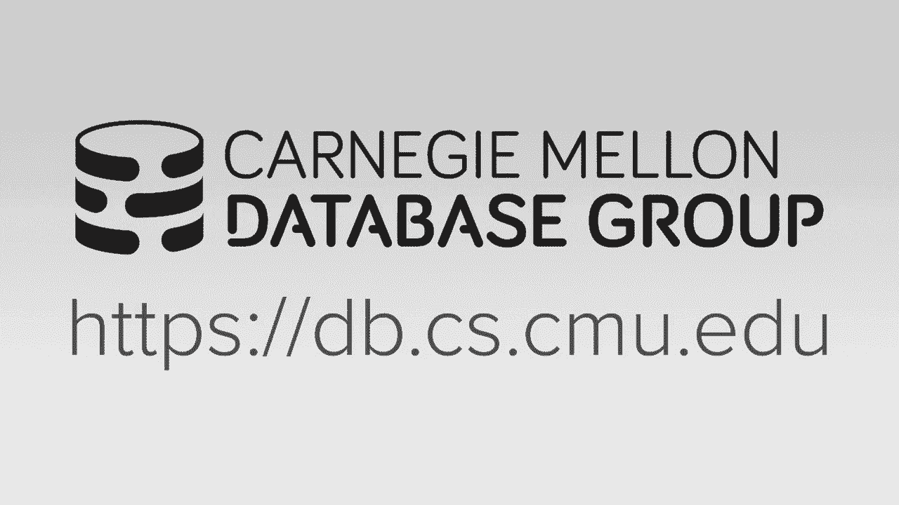
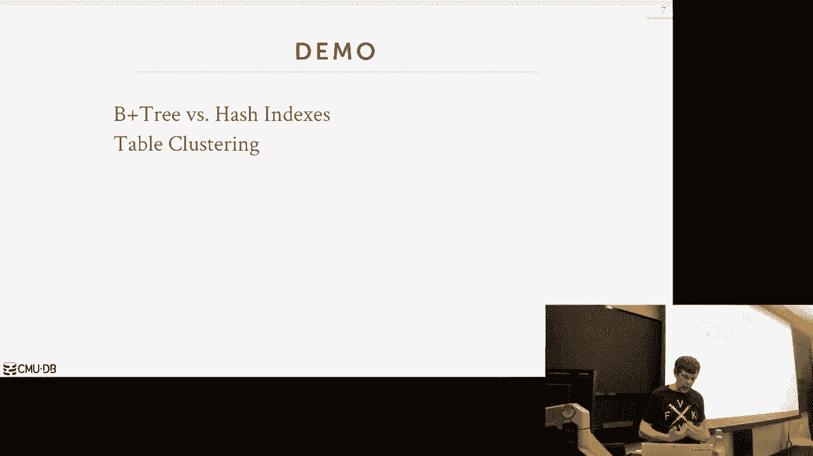
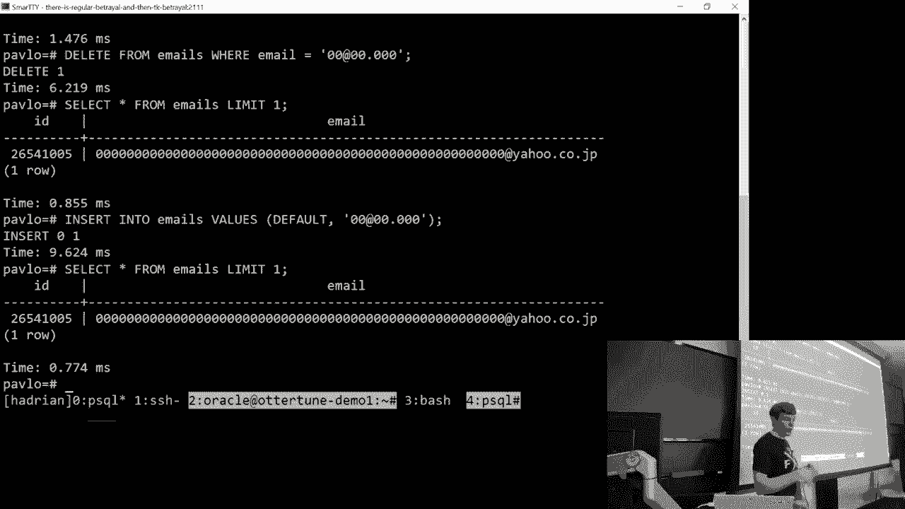
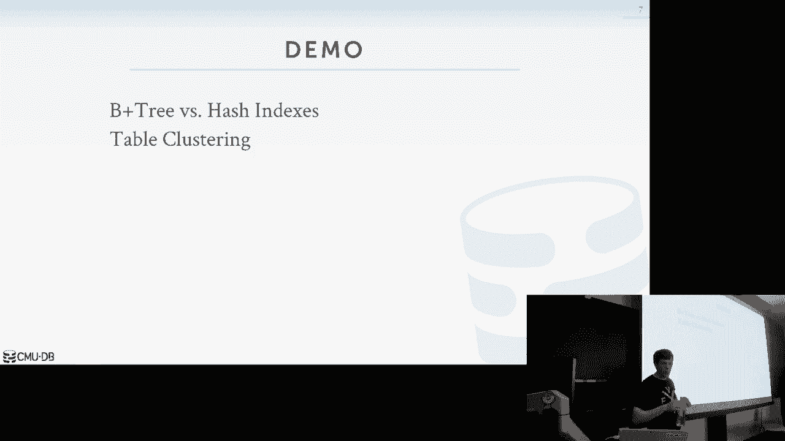
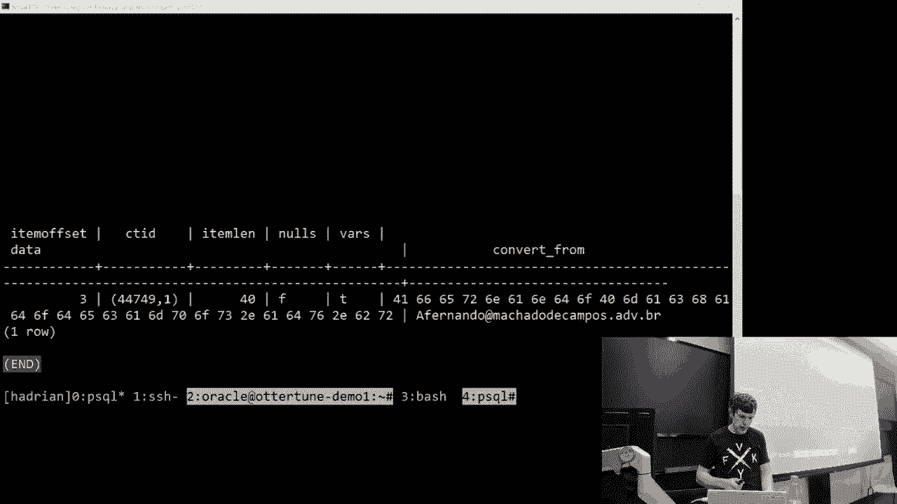
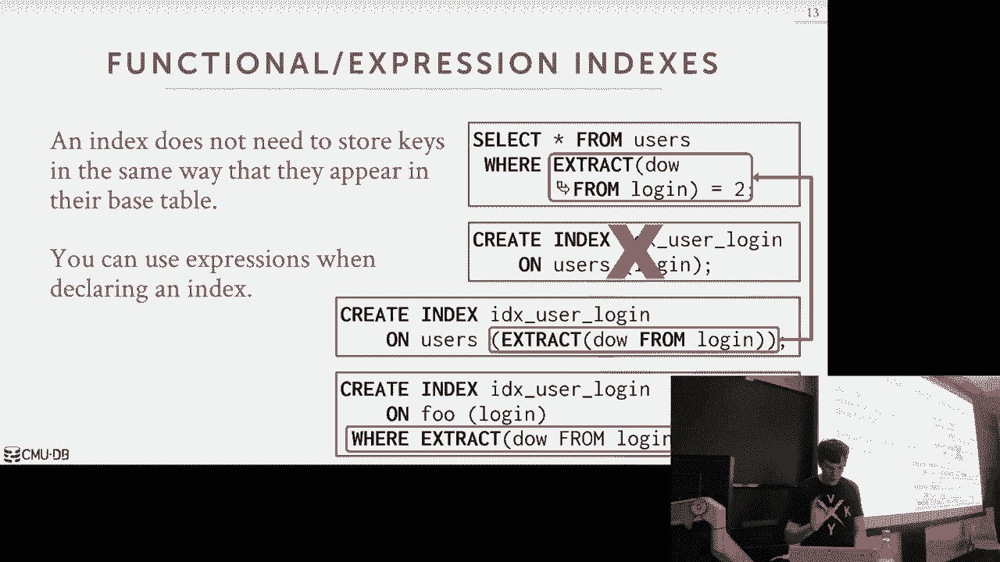
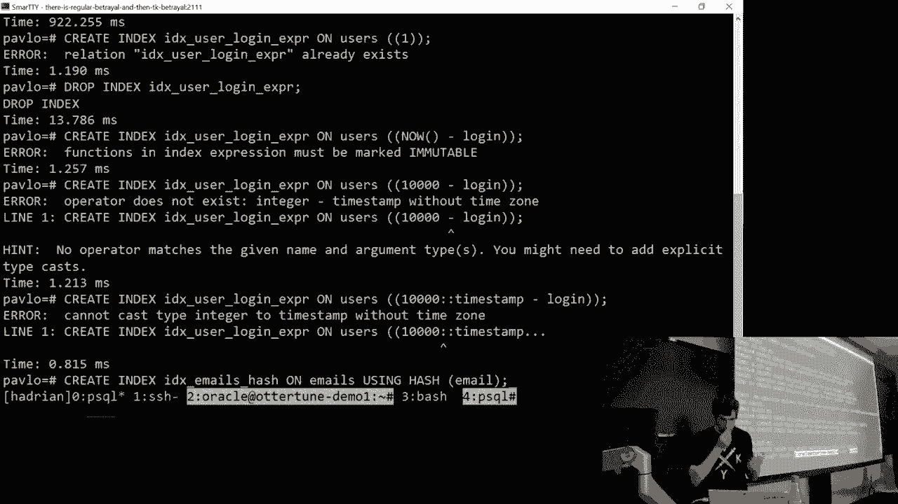

# 【双语字幕+资料下载】CMU 14-455 ｜ 数据库系统导论(2019·完整版) - P8：L8- 树索引 2 - ShowMeAI - BV1qf4y1J7mX

倾斜的，倾斜的，我喜欢它，让我们开始吧，我们想谈谈，让我们，让我们再次进入正题，谢谢DG下降表，按住它，哇太棒了，谢谢。谢谢。你好吗，哦，挺好的，你还有警察的问题吗，好的，越来越好越来越好。

你在城里需要一个好律师吗，因为我有一个，因为就在那时，我的电脑学生因为腿而遇到了麻烦，就像任何小调，所以我们有人可以帮你，好吧不，你一点都不好，好，所有的权利，所以让我们来谈谈，呃，数据库这么快，的。

我们今天5月4日下午4点30分在盖茨举行会谈，这是Vertica的一位首席工程师来做一个演讲，所以Vertica信不信由你，在匹兹堡有一个小型开发分支机构，所以史蒂夫会来谈谈，他们一直在做的一些事情。

vertica是一个基于磁盘的分布式列存储数据库，你，这是一堆字，我们整个学期都被扔来扔去，但这意味着它运行多个节点，这是一个专栏商店，并且它假定数据库的主要搜索位置在磁盘上，所以这是其中一个，这不是。

它是2000年中期出现的第一批专栏商店之一，那种开始，专栏存储数据库的浪潮，所以Comstore数据库现在并不罕见，但回到2006年伯杰出道的时候，那被认为是一个，这是一个重大的技术突破。

史蒂文是个好人，如果你想，他会谈论他们正在做的事情，那个会是水果，不是披萨，所以再一次，相应地计划好吗，所以今天我们想继续讨论树索引，所以我想在开始的时候花一点时间，做一些演示。

讨论更多关于B加树的信息，把我们上一堂课漏掉的东西补完，然后我们会谈论不同的方法，我们会讨论更多的方法，您可以在，你知道的，直键映射到我们到目前为止一直在讨论的数据结构中。

然后我们将讨论b+树或基数树的替代方法，我们会再次，我们来看看是什么让这些独特，是什么让他们与众不同，它们比B加树好还是差，然后我们会很快完成，用一种倒置索引的大脑倾倒，我不会教你它们是如何工作的。

我们在CMU有课程可以做到这一点，这只是为了让你知道这些东西真的存在，所以当你在现实世界中，你意识到，你要索引的东西不能在B加树中索引，你想使用这些倒置索引中的一个好的，所以上一堂课我们有几个问题。

我们实际上如何处理B树索引中的重复键，我向你展示了如何处理节点内的重复密钥，我们可以复制节点中的值，然后或者只是有一个从键到节点内的值列表的映射，所以现在我想在一个，我意识到我错过了什么。

在更高的层次上讨论，实际上在树本身，我们如何维护这些重复的索引或重复的键，所以有两种方法可以做到这一点，首先，我们将自动使每个密钥唯一，通过添加相应的元组，将ID记录到我们插入索引的键。

所以不仅仅是储存钥匙，你知道吗，表中属性的副本，我也要前缀或抱歉，放在末尾作为后缀，该元组的记录ID，所以现在这使得每一个，所以我们能做到这一点的原因，这仍然有效，因为我们使用的是B树。

记得我用b加树说的吗，我们可以进行部分密钥查找，仍然可以找到我们想要的东西，所以说，如果我如果我有一个属性，关于属性A和B的索引，如果我想在一个，我没有B也能做到，所以在我们的例子中，在b+树中。

因为我们不会有记录ID，我们可以做常规的查找，我们就像我们用钥匙一样，但我们只是沿着叶节点扫描，我们找到给定密钥的所有匹配项吗，你不能在哈希表中这样做，对哈希表，你必须有整个钥匙，所以为了做到这一点。

当你查找时，你必须有，你想要的钥匙，然后记录，它们对应的记录ID，但这似乎很愚蠢，因为如果你有记录的身份证，为什么要使用索引来查找记录ID，是呀，那么你将如何整合这种独特的，记录ID为。

您将使用某种哈希函数，所以他的问题是什么是什么这个记录ID是什么，这是我们一开始谈到的页面ID和偏移量，对呀，这是元组每个物理位置的唯一标识符，现在它可能会改变，因此，我们必须处理这个问题。

Postgres是最著名的一个，这是行不通的，因为它们可以移动东西，但是当我们谈论多版本控制时，我们将看到为什么这对Postgres有效的不同例子，对Postgres不起作用，但是弧线或其他系统。

但只要假设它是页面ID和偏移量，或者在续集的情况下，服务器和甲骨文，就像文件号对象号，页面ID，一切就绪，就像一个更复杂的东西，另一种方法是在某种程度上侵犯神圣性，如果你愿意，B树的设计。

并将重复的键存储为溢出叶节点，因此，与其水平扩展叶节点以容纳新条目，不如，我们实际上要垂直扩展它们，然后为了什么，给定的叶节点将添加这些溢出页，就像我们之前说过的链哈希表，把下面的两个键都加起来。

我们一会儿就会看到，我会再次提供过度使用，这看起来像什么，这种方法会更加复杂，因为，现在我们要处理，在那里我沿着我的叶节点扫描，我得知道怎么跟着那些，你知道，按照溢出页，如果我在反向扫描，你知道的。

当我跳回另一个方向时，我从哪里开始扫描，所以大多数人都实施这个，我这又有一个好处，我们不必对数据结构进行任何重大更改，它是唯一的还是不唯一的索引，一切照旧，缺点是。

现在我们实际上将这个记录ID作为附加密钥存储，你知道的，我们钥匙的元素，这增加了我们索引的大小，你知道的，实际存储索引所需的数据量，在这种情况下，这里，我们没有存储任何不必要的冗余信息，让事情变得独特。

但现在我们有这个管理问题，所以让我们把他们两个都过一遍，这是我们之前讨论过的简单的B树，所以第一种方法又是，依赖于记录ID，所以要么我显示的就像键值一样，假设有一个属性a，这是他们的所有价值，在现实中。

数据库系统实际上存储的是密钥的组合，然后那个记录ID，所以现在当我查找并说我想断言六号键，我会在这一点上，我可以在我的B树中做前缀搜索，因为我没有记录ID，当我插入这个，实际上我收回，你确实有记录ID。

但我找不到完全匹配的，所以我会穿过这里，我会落在这一页上，嗯真正的，我是说，我真正要开始的是页面偏移量，但我降落在这里，现在我知道我想进入这一页，所以因为现在我没有溢出页，我必须完全按顺序排列。

所以假设这最初的六个是它的记录，ID小于我要插入的ID，所以它需要在6到7之间，所以我只是做了我们之前说过的正常的分裂过程，我把每个人都滑过7和8，搬到这里来，现在我可以更新指针6号房就在这里。

它只是工作完全，就像我们之前说的那样，如果我想再查查六号，我只是做前缀搜索，我做，只看密钥的第一个元素，只有六个，我现在可以在下面找到，我沿着我的叶节点扫描，我找到我想要的了吗，另一种方法是溢出页。

所以现在我想再次开始六，我知道我想进入这个家伙，我不能，我不想分开，对呀，我想我不想做我以前做过的事，我有七八让开，我想进入这一页，但我不能，因为它是满的，所以我现在只添加了一个溢出页面。

在那里我插入我的新六，现在我把我的指针指向它，现在，记得我之前说过，在大多数教科书上对b+树的定义中，您假设键总是在节点内排序，在这种情况下，我们可以这样做，我们可以把它们分类，但这实际上并没有错。

只是为了让它不分类，我们只需要知道什么时候我们在寻找元素，我们正在寻找，我们不能用二分搜索来跳来跳去，我们必须做线性搜索来找到我们想要的，所以现在，假设我想断言七个同样的事情，七号在下面。

我插入六个相同的东西，六在这里，它是无序的，没关系，所以现在需要做的是，它存储在多个页面上，从索引的角度来看，这看起来就像一个巨大的叶节点，所以现在如果我扫描，我也做同样的事，我按照这个指针。

我在这里着陆，现在如果我扫描，而不是跳转到这个节点，我不需要关注我的溢出页面，你一直往那里看，最终如果我找到了我要找的东西，我受够了，如果没有，我需要转到下一页，然后我就跟着那个指针走。

所以现在我可能在想，为什么不让这个家伙，这家伙不应该指着那个吗，因为这实际上是正确的，但现在的问题是每一次，我添加了一个新的溢出页，现在我只需要更新，你知道我内部对这两个音符的指针，这里的这些节点。

我现在也需要去更新这个，但如果我不管那个指针，让它指向我页面的开头，然后我就会降落在那里说，哦好吧，我要反向搜索，我真的需要跳到我的溢出页面的末尾，向后工作，我们必须做许多额外的逻辑来适应这一点，是呀。

对不起，说出你的第一个字，对不起，对不起，你还没复习什么，对不起，所以我现在有一个琐碎的问题，哦，我们怀疑，好的，是啊，是啊，所以如果是每当我们得到这样的东西，呃，第六页。

所以系统实际上要求安装与密钥对应的所有页面，所以我们留了六个，所以我们需要把这三页都拿回来，所以他的问题是，如果有人，如果数据系统正在使用索引，我们试图找到值为6的元组，对于这个特殊的钥匙。

那么什么指数回报好，如果我们把记录ID，所以你你会，你会说你基本上有一个迭代器，我向下遍历，到达我的叶节点，现在我在这个迭代器上看下一个下一个，我在看每一个元素，直到我找到我想要的。

我知道迭代器知道阻止它，上面写着我在寻找所有关键等于六的东西，我一看到，也许这里有9，我需要停下来，但这就是我要说的，如果你知道，如果这是未排序的，然后我知道我需要扫描到我所有溢出页面的末尾。

因为我这最后六个可能在这里，如果我想把它们整理好，然后你知道现在我在这里插入这个6，现在我得去更新这家伙和这家伙，而之前如果我只是把它，只更新一页，所以这是一个很好的例子，为什么你知道。

为什么试图在一个真正的完整系统的上下文中理解这些数据结构是很重要的，如果你上算法课，一个算法课会教你是的，这是启动B加树的方法，但现在因为我们在一个数据库系统里，我们知道我们有这些叫做记录ID的东西。

我们可以利用它们来制造，促进不同操作的不同方面，否则这些操作是不容易做到的，是呀，大概像溢出一样溢出，继续另一个溢出，正确的陈述是，如果这个东西溢出来了，我们只是继续是的，作为某一点。

当你真的想重新平衡正确的时候，然后他说到了一定程度，你实际上想重新平衡，所以是的，所以这可能是一个标准，上面写着好吧，如果我超过这个溢出页面的数量，然后做一个劈开，但如果这些都是6，就在一页里。

那你就不能，你不能完全，你知道很容易做到这一点，而不附加记录ID，所有的权利，酷，所以让我们做一个演示，因为我们上次没有做到这一点，所以我们要做Postgres，他们想显示B树和哈希索引之间的区别。

所有的权利，酷，让我在这里登录，所以我要找张桌子，这个直播，是啊，是啊，好的，所以这是波斯特雷斯，我会有一个电子邮件地址表，所以这将是一个简单的，带有自动递增键的ID的简单表，然后一堆电子邮件地址。

所以这是一个你可以在互联网上找到的文件，这是一个700万个电子邮件地址的列表，如果你不知道那是什么，这是一个像火绒之前的火绒的想法，这是加拿大的一个成人勾搭网站，他们被黑了。

然后最终人们公布了电子邮件地址，所以这是真的，嗯，加载应该不会花那么长时间，但是呃，我应该比你先做的，不过没关系，嗯，所以我们要做的是，我们将创建两个索引，我们要创建一个哈希索引，所以在波斯特雷斯。

你其实可以说，当我想创建索引时，我希望它是一个哈希索引，然后你可以说我想创建一个索引，我想成为一个B加树索引，当然啦，是啊，是啊，嗯，这是一个很好的演示，对呀，好的，所以也许我会回来。

让我们去看我的续集，很抱歉，好的，所以同样的事情，这是我的续集，所以我可以从电子邮件中选择计数星，行了行了，波斯特雷斯完成，其实，让我们回到波斯特雷斯，因为它已经完成了，我花了一分钟，所以我告诉你。

我插入了两个七个电子邮件地址，所以首先我要做的是，我要创建一个哈希索引，所以在续集和大多数系统中默认情况下，如果您只创建一个索引，你会得到一棵B树，你知道，或者Postgres中的一些树数据结构。

我可以用哈希说，我强制它使用哈希索引，所以现在我们可以看到这样的事情，当然不会装这个，我应该把它加热的，对不起，这应该不会花太长时间，嗯，但是，我们可以看到如果我们尝试执行某些查询。

我们将无法找到我们想要的东西，让我把这些都装进去对不起，这是我上次用的相同的函数，只是为了加热缓存，然后现在当我调用创建索引时，理论上这应该更快，因为一切都刚刚加载，但我们要运行查询。

我们将看到查询计划器如何不，能够为某些查询选择索引，但能够为其他查询选择索引，对，因为哈希索引，你必须有整个钥匙或钥匙的塔元素，你不能做部分查找，你不能做范围扫描，好吧，这很糟糕，好吧，当这进行的时候。

然后我会在后台创建b+树索引，我把一切都做好了，然后在上课前我倒在桌子上，我忘了重建它，所有的权利，我们回来了，好的，所以花了五十秒，所有的权利，所以现在，我可以说像选择星这样的查询。

让我们先找到一个用户，所以让我们从，让我们找到，最小使用电子邮件地址，从电子邮件，是啊，是啊，我们开始了，不管那是什么，有人正确使用了假电子邮件地址，所以如果我想从电子邮件中选择明星。

电子邮件等于这个东西，再次，如果我添加解释的关键字，Postgres会告诉我它要做什么，波斯特雷斯会告诉我嘿，我有一个帽子的东西叫哈希索引，我可以做一个查找，因为我知道我可以做我想要的事情，对吧。

我们会忽略一点，位图扫描或堆扫描是稍后会出现的，但我们知道这会很快，因为它会找到我们要找的人，对呀，但现在让我们假设如果我想做一些事情，比如电子邮件，然后这个东西，在最后放一个通配符。

你能用这个哈希索引，没有权利，因为你必须有整个钥匙，我不打算运行它，因为它可能需要整个时间，但是当你问的时候他们会告诉你，解释它告诉你这是顺序扫描的默认值。

记住顺序扫描始终是数据库系统的默认操作或访问方法，他们用索引找不到它想要的东西，它总是默认为压缩扫描，所以当这一切发生的时候，让我们，让我们建立树索引，但我们也可以看到其他一些事情，所以假设我们想找到。

我们想计算所有大于此的电子邮件地址，对呀，我能那样做吗，又不行了，对呀，因为我们必须有部分钥匙，我们什么也做不了，这不在质量谓词中，它总是要完全匹配，它可以做一些事情，虽然，对呀，假设我们找到了。

据说这个也是别人做的，我也是，是不是没有发现，但实际上对于一个特殊的扫描来说，这是相当快的，不，等等，对不起，那是索引扫描，我们再找一个，我们再找一个，让我们找一个以A开头的人，就像明星一样。

然后我们会限制一个，这基本上是说，只要不停地给我找到第一个匹配的，对呀，所以有某人的电子邮件地址，不过没关系，嗯，但如果我们可以做其他事情，像这样或电子邮件等于，像这样，它实际上能够进行两次索引扫描。

所以注意有一个或爪子，你可以看到我会在索引中做一个探测，试着找到我想要的，在索引中再做一次调查，试着找到我想要的，然后把它们组合在一起，这就是位图的意思，基本上发生了什么，这里是位图索引。

意味着它试图找到所有匹配的，然后不是存储记录，id维护一个巨大的位图，然后它就储存了，你知道的，它设置了那个偏移量，说那个记录匹配，然后把它们组合在一起，然后它产生输出，所以这就是为什么它必须这样做。

然后在这里再查一次，所有的权利，现在我们的b+树就完成了，所以现在我们回到我们最初的查询，是呀，上次你解释说它只会做一次搜索，它将以某种方式组织起来，使两者一起完成，2。你的证词没有说服力，我说。

它会做一次搜索的最后一个类，然后组织它将通过三个，这是一个哈希索引，这是一个B，这不是那个，这是B加对不起，这是一个哈希表，这不是B加树，好吧就像回到井里，现在我刚刚添加了b+树，但是是的，就在那里。

这是解释，解释是告诉您查询计划将是什么，所以它告诉你我要做索引扫描，使用IDX电子邮件，哈希，这是我创建的哈希表索引的名称，好的，所以现在我的帽子我的我有我的嗯我有我的B树索引。

所以如果我做了这样的事情，在这封假邮件之前查一下，它告诉我它想要你，使用哈希索引的哈希哈希，但我一加上这个，我添加范围，谓词在这里，它会使用哈希表吗，否，它将使用，实际上做扫描好吧。

这是另一个很好的例子，所以这家伙是我们索引中最小的键，所以它知道如果我想使用索引，而我真正做的是跳到，最左边的点和沿叶节点的扫描，因此，遍历索引是浪费时间，所以我最好做一个顺序扫描，但如果我把它改成Z。

一堆这样的，现在它说，好吧，好吧，我知道如果我用我的索引，我要扔掉很多数据，所以现在我可以用这棵树跳到树的右边，得到一个起点，然后沿着叶节点扫描，对呀，这是Postgres正在进行的内部成本模型。

我们以后再谈，让它可以决定，什么时候做这些事情合适，这清楚吗，所以对于一个质量谓词，哈希索引会很好，但是对于这些范围谓词，如果它又在正确的位置，我们对价值的分布有所了解，然后它会选择做索引叶扫描。

所以现在如果我们再回到这里，这家伙在做，索引扫描，执行精确点查询查找，如果我掉下那个指数，电子邮件哈希马上回来，现在我做那个谓词，现在，它很聪明，知道，哦，我不再有哈希索引了，我有。

但我确实有这个树索引，所以我可以用它来表示这个质量谓词，这清楚吗，所有的权利，我们上节课简短地讨论过的另一件事是表聚类，所以表聚类是我们要使用索引的地方，强制表本身的排序，元组本身。

所以请记住Postgres是未排序的，或者某种关系模型是无序的，所以当我们把东西插入Postgres时，只是把他们，本质上的顺序是，它被告知把它们放进去，当我们做插入时，我们看到了我可以更新东西的例子。

取决于我怎么知道的，你所知道的，页面中有哪些可用的空闲插槽，所以如果我去说，在这里执行选择查询，从电子邮件中选择明星，我只是说给我第一个权利，我们得到一些随机的Gmail账户，但现在如果我说。

如果我调用这个群集命令，这大约需要一分钟，但这是干什么的，这就是这个命令迫使Postgres潜在地诉诸整个表，基于此索引定义的排序顺序，但这是一次性操作，所以当我修改表格时，也许事情出了问题，它不是。

你知道它不会匹配它是什么，当我第一次在这里设置它的时候，一些系统，比如在我的续集和续集中，服务器和甲骨文，您可以说我想要一个索引群集表，或在索引上聚类的索引表，因此，它确保无论您如何向表中插入值。

按什么顺序插入它们，底层物理存储将被排序，所以在某些情况下这允许我们直接在表格上进行二分搜索，它仍然是log n，而不必遍历索引本身，所以这需要很长时间，所以我们就顺其自然吧，但我很快就想回到我的续集。

所以再一次，相同的电子邮件地址，加载到我的续集里，我可以做同样的查询，选择星，从假邮件所在的电子邮件中，电子邮件等于，所以我的续集解释得没有那么好，但基本上不是树状结构，在这里阅读，上面说这是。

这是我可能使用的索引，所以它知道我有一个哈希索引，我可以利用这一点，然后如果我真的把它改变得比这更伟大，还在用，呃不，但这里说，很难看到，它很小，嗯，它是，它滚到这里了，但看到，这里有一个专栏叫玫瑰。

这是我的续集，告诉你会有多少行，我想我可能得读，所以这里有两千七百万，所以它可以使用这个哈希索引，但它会后退，做一个简单的顺序扫描，而上面的那个可以在指数指数中做到这一点，探针找到它想要的东西对吧。

所有的权利，所以Postgres现在完成了，我们回到这里，所以现在，如果我限制了一个权利，我得到了我以前的第一个男人，对吧，所以这又是在说，给我你找到的第一个元组，这是我们之前找到的最小的一个。

因为这保证了这是插入订单所以，如果我现在这么做，如果我说我删除那个电子邮件地址，删去，电子邮件等于这个东西的电子邮件，我去要第一个，现在我得到了一个不同的假电子邮件地址，但现在让我开始另一个回到。

在电子邮件中插入值，默认，因为它是一个，这是一个自动递增键，把我的人插回去，对呀，它仍然没有排序，因为它只做了一次操作，强制排序顺序，我得一遍又一遍地运行集群，对于Postgres，是呀，对于其他系统。

您不必这样做，你可以说我希望它通过索引自动聚集，列需要在，这个问题是，在我们群集之前，列需要索引吗，所以在我的续集中，它是按主键排序的，所以在我的续集中，叶节点实际上是元组本身，当我移动东西的时候。

的拆分和合并，叶节点总是按照这种顺序，所以如果我想在桌子上做一个顺序扫描，我基本上总是跟着叶子节点走，在其他系统中，如Oracle和续集服务器DB Two。

您可以说创建这个表，并按这些列对其进行排序，我会为你做的。

对不起，是，重复，你说我们又有后缀的页面了吗，对呀，是呀，所以取而代之的是，我们为什么不用时间戳呢？在检查召回时，这个问题是，嗯，我说我们可以用物理ID，对不起，物理位置，页ID和槽号作为记录ID。

确定使元组唯一，相反，为什么不使用，插入元组时，因为物理位置可以改变，因为它，所以在波斯特雷斯，这是我续集的一个问题，这不是问题，时间戳有什么问题，分布式设定时间，他说在分布式环境中，时间不会同步。

是呀，更简单，这是个问题，闰秒，闰年，对呀，所以现在又来了，他们重复第二个，现在，发生了什么，我插入一些东西，现在，它们有相同的时间戳，或者时钟可以像，时钟非常不准，所以你知道我经常跑NP，现在慢慢地。

只有钟，但偶尔它也要迈出一大步，你可能会重复一秒钟，我想如果你愿意，有什么区别，一直在用，像一毫秒，像一头雄鹿，或者类似的东西，就像从上到下，他的问题是介于两者之间的是什么，做记录，a与毫秒，对统一。

所以如果你是的，就像数百万，或者类似的东西，那你就不是独一无二的照顾好闰秒，因为它只是去掉了第二个，不错嘛，是啊，是啊，所以他是对的，从北卡罗来纳大学闰年开始，它不会帮助漂移，对呀，如果时钟必须后退。

你重复几秒钟，没有人用那种方式使用时间戳，可以使用逻辑时间戳，我们以后会讨论的，你几乎从来不想使用硬物理时钟，你和其他东西一起用的，是呀，您想使用，如果你已经有问题了，就是，何时使用群集索引。

如果您已经有索引，所以再一次，就像我的续集一样，我应该在我的续集里展示一个例子，它总是一个聚类索引，当我调用创建表时，它总是聚集在那上面，有些情况下，对于某些查询，对于某些查询，你可以聪明地处理，好吧。

如果我聚集在逻辑时间戳上，当它插入时，就像应用程序告诉我时间戳一样，现在，也许我可以说，我们会把最近几天的数据放在快速磁盘上，旧的东西放在较慢的磁盘上，有办法这样做，比如磁盘分区。

数据表明我们可以强制执行，都是为了我，在被子下面，我在想呃，在我的SQL中，你说过呃，所有的东西都是按主排序的，是呀，假设我们有电子邮件，我们在电子邮件上做X，是的，我们在是的上做集群，我们试图通过。

所以这不是个问题吗，因为现在一切都根据，所以你的陈述是，如果我有，如果我是，如果我聚集在电子邮件上，我在电子邮件上有一个索引，那是我的主键，然后主键ID，所以如果你有主键，我们马上就会看到这个。

你总是有一个索引在那个在那个在那个ID上，或者所有的属性，切，是啊，是啊，所以你必须更新索引，是呀，取决于如何存储索引，我们以后再谈这个，就像在，如果我们能得到那个叫转移注意力的，所以指针可能是主键。

也可能是记录位置，记录ID，你可以做不同的事情，Postgres确实记录ID，所以我们要一直更新，我的续集做主键，所有权利，所以我们可以很快地四处看看，看看看到了什么，你知道什么，这棵树大致是什么样子。

所以这只是Postgres的一个扩展，允许你获得关于，树上有什么，所以我可以说我有这个索引，你知道在B+树上，我可以说你知道给我关于它的信息，告诉你它有多少个级别，告诉我它存储了多少元素，和根块大小。

这样我们就可以走得更远，我们可以用这个命令检查树的内容，你知道实际的细节并不重要，但有一堆十六进制的东西，对呀，所以这是根节点，所以我们现在可以深入一点，向你展示，你知道对于单个节点。

这里有一些关于它的信息，但那都是十六进制，但我们可以解码，然后这里是你知道的，这证明它实际上存储了这些电子邮件，所以这是说这里有一个记录在偏移量三在我的根，节点，在树中的这个特定节点中，这里是你知道的。

页码和偏移量，这是存储内容的十六进制形式，然后是实际的电子邮件地址，好吧，又来了，数据集将在内部存储这些密钥的全部副本，所有的权利，我们现在要停下来，继续做一堆事情，我们想通过，嗯。

但这只会向你展示你可以，默认情况下，你总是会得到一个。

a b加树，但你可以强迫一些系统告诉你，我想要一个哈希索引，这样做有不同的权衡，好啦好啦，所以现在和这一点有关，他说关于，主键，你知道，与集群索引相比，所以如果您创建主键，数据库系统将自动为您创建索引。

实际上，对于声明完整性约束的任何时候，它会自动为您创建索引，你想它必须，因为否则强制执行的唯一方法是，做顺序扫描，所以在我的一个，我的自动增量键，如果我必须强制执行主键，它的独特性，每次我插入你知道。

唯一元组，如果我没有索引，我不得不扫描每一个元组，只要确保没有人有相同的钥匙，所以再一次，每日系统将自动为主键和唯一约束做到这一点，所以基本上又是，当我创建表时，如果我有主键唯一。

这和运行这些命令是一样的，我将创建表，然后它去头部，为外键创建这些索引，它实际上不会这样做，所以如果我在这里创建一个新表，调用bar，并在此处对此值有外键引用，我试过的每个数据库系统都会抛出错误，因为。

它说它没有办法，在没有索引的情况下强制此引用完整性约束，对呀，你认为它可以自动创建一个，但它不会那样做，因为它不知道，因为这必须是独一无二的，所以它实际上不会这么做，相反。

你只要把它替换为你作为这里的唯一条款，它自动为您构建索引，然后我可以用来执行这项权利，因为想想外键的工作方式，每次我在bar中启动一个新的元组，我得有这个身份证的东西。

所以为了确保它与这个表中的元组匹配，然后我在索引中查找，看看是否有一个你知道的父引用匹配，所以现在我想谈谈使用索引的不同方法，你知道的，复制我们今天在这里谈到的整个密钥。

所以我们能做的第一件事是所谓的部分索引，因此，当您通常调用表上的创建索引时，它对整个表进行顺序扫描，查看每一个元组，但在许多情况下，对于许多应用程序，也许你不需要在整个桌子上有索引，相反，你总是想。

也许你几乎知道数据的一些子集，这就是部分索引，您基本上修改了create index命令，你把这个加在，结尾处的子句，它告诉您应该匹配的元组是什么，为了放入这个索引中，所以现在如果我想这样查一下。

从foo中选择b，其中a等于一二三，c等于五汤，所以我在a和b上建立了索引，我的where子句有引用a，所以我还可以用这个索引，但我也可以看着这个东西说，哦，其中c等于五汤。

但我知道这正是我想使用的索引，所以这让我可以做更多，指数更瘦，因为我没有存储所有可能元组的所有信息，我只把它匹配的东西储存在我的哪里爪子里，所以如果是其他查询，没有C等于武当，我不能用那个索引。

所以这是很常见的当人们做他们想分开的事情时，我对不同的日期范围有不同的索引，就像你知道的每个月，我要索引一下，所以我很快就查了所有我想要的订单，你知道在那个月里，一次又一次，我尽量不污染我的缓冲池缓存。

用一堆我不需要的数据，通过一个部分索引，现在高度会更低，我很快找到了我要找的数据，所以在这个特殊的例子中，在这里，对于这个查询，我们正在查找一个使用C的，我们想返回B，实际上对于这个特定的查询。

我们需要的所有数据都在索引本身，所以请记住，我说过，通常索引会为给定的键产生一个记录，我想你可以，然后按照它在表中，堆并获取您要查找的元组，但是对于这里的这个特殊查询，我们实际上甚至不需要看元组。

因为我们需要一个来查找，这是在那里，我们需要B在那里，而c已经由部分索引处理，where从句，所以要回答这个问题，我们只需要实际查看索引，我们实际上从来不需要查看表中的底层元组。

所以这就是所谓的覆盖指数，覆盖索引意味着回答，生成查询所需的结果，你知道可以在索引本身找到，所以你不把索引声明为覆盖索引，这是数据库系统自动为您计算的，我知道知道你的查询是，它知道一个新的索引。

上面写着我需要的一切都在这里，所以再一次，就用这个例子，简单示例，我可以从那里得到B字段，A和B字段可以从这里找到，索引和我从来不需要看实际的元组，我可以为一堆不同的查询做这项工作，我可以为聚合这样做。

我可以为联接做这件事，这里的优势是少了一个，你知道页表中的页ID查找，也许少一个，磁盘IO不必去查看底层元组，所以一堆不同的数据系统支持这一点，所有的商业家伙都做，蒙戈做的，我不认为我的续集。

Postgres do，我可能错了，嗯，但这是一个巨大的胜利，对呀，如果你能做到这一点，这其实是件大事，我不认为Postgres能做到这一点是有原因的，我们以后再谈，对于这个简单的示例，这太棒了，对呀。

我需要A和B，a和b，你可以在索引中找到，但如果我现在有了另一个呢，我有另一个属性，我想能够做一个查找，或者获取我的查询，但我实际上不想在这个属性上建立索引，对呀，所以我的表有A列，b和c。

也许我不想在C上索引，但有一个覆盖索引还是很好的，不用去看元组，这就是include列允许您做的事情，基本上包括列，允许你说我存储在我的，为了我的叶子页，我的叶节点还包括这些附加属性，所以在这种情况下。

我在a和b上建立索引，所有内部节点只有键A和B，当我查找的时候，我只检查A和B，但当我落在叶子节点上时，我还可以得到每个条目的c属性值，所以现在再来一次，如果我回到我的另一个查询，从foo中选择b。

其中a等于1，二三武堂，我在一个，顺着它往下走，然后当我沿着叶子节点扫描时，我可以看c处的值，它被包装在叶节点中，也值我的谓词，它产生了我的输出，这一个也是这一个比覆盖指数更难得的支撑。

所以很多系统都支持部分索引，支持覆盖索引的系统略少，这个就更难得了，我想这是Postgres 11已经开始了，是啊，是啊，Postgres 11将添加这个，或者现在已经有了，续集服务器有。

但我的续集不支持这一点，甲骨文不支持这一点，所以再次，最关键的是虽然我们现在可以向上看，where从句，它不在笔记里或者我们不在，你知道的，大幅增加整体指数的规模。

最后一种索引--一种是关于我们的函数表达式索引，所以再一次，到目前为止我们所展示的一切，任何时候我们声明索引，我们总是创建密钥的精确副本，它在元组中，并把它放在我们的索引中，但可能会有一些查询。

我们实际上不想做查找，关于密钥的确切值，我们想查找从密钥中导出的一些值，假设我有一个简单的例子，这里，我有这个用户的表，我想查查，并找到所有在周二登录的用户，所以这个提取函数需要一个时间戳，你传入。

日期或时间戳，你想要这么斗，W表示星期几，所以这是说，从时间戳中的日志字段中提取一周的某一天，找到它等于的，两个星期二，两个星期天零星期一，一个星期二两个，所以如果我创建这样的索引。

正如我们到目前为止所显示的那样，这行不通，为什么，是呀，你必须知道哪些日期会散列，哪个商店的日期，你的故事实际上会有正确的，所以这个是说，他说，你必须知道如何提取或提取准确的范围，A将对应于星期二。

所以你可以聪明地说，哦好吧，我的查询如下所示，我可以说好，这是，以下是星期二的时间戳范围，但据我所知，没有系统真正做到这一点，所以取而代之的是，您所能做的就是不使用它，创建一个函数索引或表达式索引。

其中实际的属性，您的索引，可以是任何任意表达式，任何你可以有一个意识条款，你可以，您可以在，所以现在当我想做一个查找，对于这个对于这个谓词，我知道如何通过，你知道，你知道，看看这里的每一个饲料。

找到所有符合我们想要的两个，我们还有什么别的办法，我们可以将这个查询加快到我们以前已经展示过的速度，部分索引方式右，因此，而不是为，以这种方式精确地计算一周提取的一天，相反。

我只是用它作为我的where从句说，只把元素，其中提取值产生两个，对呀，所以让我们在Postgres中做一个演示，所以Postgres有部分索引，它没有覆盖索引，然后我这里的版本是十个。

所以它没有包含条款，但是我们可以玩部分索引和功能索引。

为此，我们将创建一个表，确保我们关闭平行工人，时机很好，所以我们要创建一个有ID字段的表，和登录时间戳，然后这将是一个简单的A，这个插入查询将插入一堆记录，一堆独特的时间戳。

从20点15分到现在每隔一分钟，这将产生大约20亿条记录，所以为了节省时间，我们要快点，所以我们现在就把所有的东西都加热，一切都在我们的缓冲池里，假设这是我们要运行的查询，我们想得到用户的平均ID。

他们在星期二登录，对呀，所以在这种情况下，当我们运行时，解释，它必须做一个顺序扫描，没有索引，所以我们可以建立的第一个索引是，这应该不会花很长时间，所以现在当我们运行的时候解释。

我们可以看到它能够挑出并使用表达式索引，我们刚刚建造了，一次又一次，它这样做的方式，上面说，哦，我知道你在查这个，你知道提取函数何时何地，输出是两个，所以现在我只需要做一个查找，并说，找到我所有的。

等于的值，然后我们可以添加部分索引，同样，这现在创建了一个更小的索引，只包含，它只包含，提取函数等于，所以现在如果我回到我的函数，我现在看到它实际上想选择那个索引，因为那将是一个，它会变小，这是一个。

树的高度较低，我马上就找到了我想要的，所以再一次，数据库系统可以自己计算，对于所有这些不同的选择，哪一种是最佳的访问方法，所以关于这个有什么问题吗，是的，用我的专业索引是类似于当前日期的一天的差异。

现在日期改变了，好的，所以他说，所以让我们来试试，对呀，所以下降指数，所以他的陈述是，发生了什么，如果我的表情是一个，它是基于一些，有些区别，或使用当前时间戳，这不是每次都会改变吗，我经营它，所以说。

我想Postgres要做的是，所以说，让我们，让我们做，让我们做表达式索引，那是哪里，是啊，是啊，所以他说，这样做，请登录，然后再登录，我可以把我想要的任何东西放在这里，长有效表达式。

所以我可以说现在就把我的登录减去，当前时间戳，不让你这么做，我忘了怎么做这件事，是啊，是啊，我忘了，忘记如何在Postgres中做减法，你能做到吗，那很好用，哦耶，因为你必须这么做，好的，现在。

我们就这么做吧，让我们做一些更简单的事情，让我们登录一下，减去一百，基本上，当我们调用创建索引时会发生什么，它就会出一次故障，不管那个时间戳现在是什么，现在，现在，以后，它不会改变，它不是动态的。

它是在建立索引的时候，所以现在如果我再插入一些东西，理论上它现在应该使用正确的电流，如果它聪明的话，它可以说很好，当我建立索引时，现在是什么情况，我不知道它是否那样做，但又一次。

所以你不能做一些你不能做的蠢事，一个在一个上建立索引，但我应该能做ID加一个等待，我是什么，我错过了什么，哦，是这样吗？我们走吧，就是这样，写下来，双圆括号，所以耶，所以现在我不能，它不会让我这么做的。

登录经验，让我们作为另一个例子来尝试，表达式中的函数必须更加不可变，所以你去那里，是啊，是啊，但我应该能做好这件事，就像，没有没有超时，所有的权利，无论如何，明白我的意思，是啊，是啊，有一种东西叫。

我们稍后会讨论快照，但就像有一样，现在查询运行时，必须保证在，索引本身的快照，是呀，呃，使用了一些概念，我是说当我们创建索引时，哪种，你知道，我们创造了一条像一条小路或一条，所以这个问题是。

当我们创建索引时，要创建什么样的索引，所以我默认，它将创建一个B加树，如果我加上前面的从句，所以这是一个Postgres成语，这不在续集标准中，所以如果我用哈希添加这个，这告诉波斯特雷斯。

默认情况下为我创建哈希索引，每个人通常都会得到B+树，当我们有索引时，我们可以提高性能，但原因是我们不需要搜查这对夫妇，您的问题是当您添加索引时，你可以让人变得更好，对呀，是呀，我的意思是，原因是。

我会有理由的，原因是搜索速度快，或者证人是，您不需要再查看列表节点了，因为我们有索引中的所有信息，对不起，所以所以当你说你不，您不需要查看它们索引的叶节点，我们说过，所以我想你的问题是，如果我有索引。

如果我查找一些查询，我不必看实际的元组，我可以看索引，是啊，是啊，你打电话就像元组一样，你知道在桌子堆里，不要，它们不是叶子节点，叶节点在索引中，对呀，所以我总是我总是要看索引，因为我在B树上。

我总是要走到谷底，好的，所以对于一些查询，如果您可以进行覆盖索引查找，我从来不用看桌子，这个元组，我可以得到所有的信息，我需要从索引本身计算答案，并非所有数据库系统都支持，尽管到目前为止。

除了涵盖索引之外，我们已经讨论过了，这个想法是我们可以很快找到，有我们要查找的键的元组，而不必做顺序扫描，所以所以特殊扫描是n，如果是一个，如果是哈希索引，我可以做一个，如果是B加树，是对的。

所以这个想法是尽可能多地减少数据，不要看不要太浪费工作，所以我们在那里创建表格，无索引中的一些数据，那么我们必须做这些正确的陈述是，如果我们创建一个表，而没有索引，我们总是要做一个特殊的扫描，是呀。

我们一开始就告诉过，是呀，然后呃，如果创建索引，呃，它是否创建了整个数据中心，嗯，在记忆问题是，如果我创建一个索引，它在哪里生活得很好，如果它有磁盘支持，它走了，你知道它被写出来，你知道吗。

如果它由缓冲池支持，它出去磁盘，我想这样做，因为它是，我的索引可能大于我可用的内存量，所以再一次，我可以有一个短暂的数据结构，在内存中，我必须把它吹走，我的续集为他们的哈希表做了这件事。

因为它必须在记忆中，但是B柱树是由磁盘支持的，所以它太大了，我把东西翻了出来，好的，所以我们会有一些，呃，我们有，呃，表分开和索引分开，所以你做什么，我单独的，在记忆中分离，分离存储器。

它们可能是同一个缓冲池，它可以是不同的缓冲池实例，这又取决于实现，缓冲池管理器不知道页面里有什么，上面说你要第一页，两个，三个，在这里，它是，然后不管是谁都在访问，知道如何解释这些字节是有责任的。

缓冲经理不知道，在高端系统中不在乎，你可以说这里是缓冲池，索引管理，而且它有一定的更换政策，这是一张桌子，他们有另一个替换政策，但对于Postgres和我的续集，都一样。

现在让我们跳回来，以尝试结束，好的，所以到目前为止，在我为B树展示的所有示例中，内部节点和叶节点总是有密钥的精确副本，是呀，可以进行前缀压缩或后缀截断，就像我们上次说的。

但通常我们会在整个过程中多次复制密钥的整个副本，整个树结构，所以另一个问题也在b+树中，为了确定键是否存在于表中，我总是要到达叶节点，我总是要一直遍历到右下角，因为再一次。

内部节点可能有已不存在的密钥副本，因为当我从叶子节点中删除它们时，取决于我如何拆分和合并，我可能把路标忘在上面了，所以为了确定我是否确切地知道这把钥匙存在，我总是要去叶节点，所以这个，你又知道了。

它是log n而不是on，必须做顺序扫描，但还是不太好，我可能让你知道，这取决于我有多少内存以及如何使用缓冲池管理器，我可能有一个页面错过了对，他们在磁盘上查找每个节点，当我向下穿越。

所以对于某些应用程序来说，这可能是很好的，如果我们真的能在树的顶部弄清楚，我们的钥匙是否存在，而不必一直到底部，所以这就是一个部落为我们所做的，这么快举手，这里的人以前听过一次尝试，好的完美。

这里有谁听说过茜草树，优秀少，好的，所以基数树只是一个尝试T的专门化，没有人使用尝试，每个人都使用基数树和数据库，所以我们要经历的是，所以一个尝试是一个树数据结构，其中。

而不是在节点中存储密钥的整个副本，在树上，相反，我们将存储密钥的数字，并按数字存储，我不一定是指阿拉伯数字，我是说一些子集，我们密钥的原子子集，就像一个字节，一些或一些一点点，所以发生的事情是。

我们基本上要分解我们所有的钥匙并把它们储存起来，向下的数字，你知道在不同的层次上一个接一个，然后现在因为我们可以有重复的键或重复的数字，我们只需要在每个级别存储一次，所以一个非常简单的例子。

这里会有这样的尝试，我有三把钥匙，Hello Hat，并在根节点的第一级中，三把钥匙，开始写这封信，所以我对每一个都排序一次，有一条通往第二层的路，我现在看到的地方，我区分你好和帽子，有你好。

有一个E帽，第二个数字有一个A，所以我有单独的条目，然后现在我有单独的路径要处理，你知道钥匙中的每一条唯一路径，所以现在如果我想做一个查找，说我想查一个你好，我只是把它分解，把钥匙变成它的数字。

我看着H，我这里有一个匹配的我找到了E，然后我穿过厕所，底部就像我们的B+树，这可能是一个记录ID，它指向我们要查找的实际元组，所以尝试是旧的尝试是比B加上树更老的，和B+树嵌入。

比如1973年在IBM的尝试实际上是在，像1959年由这个法国家伙，他没有给它起名字，然后是另一个CS研究员，大名鼎鼎的，爱德华·芬顿，一两年后，他提出了这个名字，是检索树的简称。

他用它来区别于常规的树数据结构，所以这就是为什么他们被称为尝试，如果你去看看，你知道CS网站吗，他在那里列出的目录，他就像超级老，我从没在任何学院见过，意思是，我不知道他是谁，我不知道他是否还在这里。

但就是他发明了尝试这个词，他实际上在CMU，有时你也会看到这些东西被列为数字搜索树或前缀树，据我所知，这些都是这些都是一回事，所以尝试在数据库的上下文中真的很有趣，对呀，尤其是现在我们知道了b加上树。

所以关于它们的第一件事非常有趣，它们的形状只取决于键空间的键分布和它们的长度，所以我的意思是它是一个确定性的数据结构，所以不管什么顺序，我们把这个键，我们最终总是会得到相同形状的物理数据结构，对。

这和在b+树中是不一样的，因为B加树，如果我插入一个键是单向的，然后我把它们拖来拖去，然后我把它们分类到另一棵树上，取决于我如何拆分合并，我可能会得到不同的节点布局，键可能在一个节点中。

而不是在另一个节点中，在尝试中，它总是它总是同样的事情对，它们的另一个特点是，它们实际上不需要任何再平衡，就像我们在p+树中一样，所以我们拭目以待，你知道有一些再平衡，我们可以在垂直水平上这样做。

但在水平上，我们永远不会真正重新平衡，所以，不像B加树，其中所有操作在一次尝试中都是log n，操作复杂度为k，其中k是键的长度，这与B+树完全不同，所以回到这里，所以如果我想抬头，你好。

当我到这里的时候，我知道没有，你知道，我一直在走下坡路，但我要做的步骤数，取决于我正在寻找的钥匙，但说我想抬头，安迪A和D Y，第一个字母是，我在根节点中查找，我看到它只有一个H，我立刻停下来。

我知道我在寻找什么，不可能在树上的其他地方，我不必总是在底部遍历，E的是，难道你不需要遍历整个块吗？你的问题是针对E的，这里，我必须遍历整个块吗，你知道，就像一个巴西人，就像，不是字母，但这就像一些。

不像真的很大的东西，就像你必须，你有无数，就像一个非常宽的街区，你必须弄清楚你想做什么，他的陈述是，如果这个东西是超宽的，那是不是意味着，我得在整个过程中切换扫描，你对它们进行预排序，你。

你做二分搜索来找到你要找的东西，当我们看到，其实，我们实际上是如何做到这一点的，喜欢的字节，你，你可以准确地跳到这个位置，你想要，要么在那里，要么不在那里，是啊，是啊，这不是一个真正的，你知道的。

物理图，实际是如何存储的，这只是一个高级概述，所以这又一次非常有趣，因为事实上，就像，复杂性是基于关键，我们试图向上看长度，嗯，这也很有趣，因为现在，我们没有储存钥匙的确切副本，你知道吗。

直接在任何单个节点中，它由路径隐式存储，所以如果我们想重建Hello，我们会向下穿越，跟踪我们在堆栈上的路径，这就是我们如何把钥匙重新组合在一起，然而现在这使得顺序扫描变得更加困难。

因为虽然我可以按顺序排列，我有回溯，你知道，往上走往下走，不像在B加树中，在那里我可以沿着叶节点扫描，所以对于点查询，尝试会更快，然后是一棵B加树，但它们会比扫描慢，所有权利。

所以现在我们有了更正式的关于尝试的定义，但是我们在节点的B加树中也会以同样的方式使用术语span，只是说跨度是发出的分支的数量，本质上是我们要在一个in中表示的位数，你知道在每个级别的每个节点。

所以如果一个数字要存在于语料库中，然后在每个数字的水平上，我们现在必须有一个指向另一个分支的指针，如果它不存在于我们的语料库中，然后我们只存储空，像一条运河，它什么的，所以现在这个跨度将用来确定扇出。

就像在B加树中一样，这将与尝试的物理高度相对应，所以你会说我有办法尝试，你会说你的风扇坏了n又一次，号码传出来了，这将决定数字的大小，您在每个级别存储，所以你能储存的最简单的尝试是一个位，试着吃每一关。

我要区分一个位的位数，假设我想储存这三把钥匙，十，二，五，三，一，所以这是一个有点尝试，我是说在每一个级别我们都要，我们要看一点，所以我带他们进来，你知道这是这两个数字的二进制形式，或者又是三个数字。

通常是3个2位或64位，但为了简单起见，我把他们分成16位，所以在尝试的时候会是这样的，我会经历，呃，在每个级别，所以在根节点，我们将检查第一个数字的位置，第一次，一次又一次，这是一个，这是一种方式。

这是一个位，所以不是零就是一，所以在这个第一个位置，三个键都将位设置为零，所以在零位，我在第1位有一条路径是空的，因为没有匹配的钥匙，然后我下到第二层，为了简单起见，我们将重复此操作。

想想这个重复十次对吧，但这是同样的事情，我得了零分，我所有的元组都是钥匙，在每个位置都有一个零，并有一条向下的路径，一个人什么都没有，但现在当我到达这个位置时，我看到了不同，所以对于十键，它咬这个。

在这个位置是零，所以有一条小路一直延伸到这一边，另外两个，这是一个，上面写着从这里下去的路，所以现在如果我再看一次，说这把钥匙剩下的部分，这是一条单行道，你知道这是一个零一个零，同样的事情。

如果它是空的，我有有没有，钻头没有设置在那个位置，它是它是空的，否则就会是一条下坡路，然后再把叶子节点，这只是指向相应元组的记录ID，另一边也一样，就在这一点上，他们是一样的，但后来他们在这里分裂了。

然后现在我有了不同的道路，其他部分，这就是你所知道的吗，你知道，所以我们可以在一点内做到这一点，两位，八位，十六位，我们可以在不同的层次上做到这一点，不同梯度，负债，那么我们可以为此做什么简单的优化呢。

实际上有两个优化，我们怎样才能缩小这个部落的规模，是呀，我们绝对不需要用空格来标记这些零，准确地说，所以他说，我们不需要空格来标记0和1，因为这句话是对的，所以再一次，这是这个数字的值，这个位置。

然后这里是它的指针，所以这是多余的，所以我真正需要做的就是存储指针，对呀，因为如果它在测试版设置为零，我想要偏移量零，测试版设置为1，我去抵消一个，所以这是水平压缩，这是在缩小部落的规模。

每个try节点，还有什么压缩方式，我可以在后面压一下，他说，你实际上必须有，所以一旦我来到这里，这里的这些部分，没有其他钥匙匹配这个，他就是这么说的，但是但是但是在这里我们必须保留这个的原因是。

因为我们要在这里分开，所以我们需要知道我们是怎么到这里的，所以在这之后我们不需要储存任何东西，我们叠起来是为了储存好，如果你从这个位置下去，在这一级，如果出价为零，我只有一把钥匙。

所以让我只存储指向该键的元组指针，然后在这里做同样的事情，所以这是垂直压缩，是呀，你必须按顺序储存吗，你就不能，说像放入水平，就像一个小小的婚姻，你要找的东西是什么数字。

你只要检查你必须去你更平衡的地方，所以问题不是故事，所以说，而不是储存，抱歉是什么感觉，你知道，就像第一个，顶部，右上角，是呀，零，它做到了是的，第一个位，你不能。

你只需要在每一关放一个数字说明你在哪一关，你可以按照不同的顺序去，他们只是从左到右，去第二次和第五次，或者类似的东西来得到这个就像一个小杯子优化，就像CPU指令一样，您可以在单个指令中运行。

就像一个有点地图，位序列，找到我找到，单条指令中此偏移量处的值，所以你不必迭代，或者像你找到我一样，算我一个，我在这个位字段中的数，对呀，有一个CPU指令可以让它跑得很快，所以你不只是在做一个循环。

依次扫描，1。事情没你想的那么糟，它是，好的，所以再一次，这就像是低级位信息，但它向你展示了极端的情况，你不会真的想用，你知道吗，一次痛苦的尝试，通常您希望将它们存储为8位或单个字节，嗯，但对我来说。

这是最简单的理解方法，所以即使是现在也是八位，每个位置都是一样的，我只是有没有指针，我可以很快跳到，你知道我想要的偏移量，所以这很好，如果一切都是静止的，但实际上，我们怎么，我们怎么修改这个东西。

如果我们做插入、更新和删除，所以没有标准的方法来保持尝试，就像B加树一样，不同的实现，做不同的事情，所以我要给你看，先生，一个简短的例子，我不是说，这是唯一的办法，但有些事情你必须注意。

如果你真的想建造一个，所以让我们再说一遍，这是你好帽和钥匙套装，我们以前有，所以我又插了头发，我向下穿越，我会在这里找到这个槽，现在我把这个插入右边，所以现在假设我想删除帽子，嗯，就在这里。

我去把它删掉，也许我可以在这里留个空的地方，对呀，因为那样我就不做任何压实，但现在假设我删除了，现在我把这个移除，我说，好吧，现在我有了这个，这个节点本身，所以如果我想，你知道，实际上找到头发。

我不得不，你知道做一个额外的，跳下去到IR，但我知道我不会有任何其他的比赛，所以你可以决定把所有东西卷起来放在这里，不同的实现，做不同的事情，如果你上高级班，我们会掩盖一堆这些东西，是呀。

所以一旦我们做了呃，按压尝试，我们就得到了红流，是啊，是啊，所以耶，也许我们很清楚，基数树是垂直压缩的，是啊，是啊，3。我应该更仔细地考虑一下，我没有幻灯片，是啊，是啊，基数树是一个移除所有路径的树。

是啊，是啊，我不知道是什么，我不知道它曾经是一个幻灯片这里是定义的，什么基数树，我不知道它怎么了，对不起，哦不，就是这里对不起，这是半径树，对不起，当您进行垂直压缩以删除任何节点时。

在它下面没有其他明显的区分路径，有时它被称为帕特里夏树，但通常调用基数树，这也是一次尝试的子集，好的，所以我们讨论了修改，我想简短地说的最后一件事是我们如何比较，实际上是为了时间，我就不说了。

让我们最后谈论的是倒置，再次索引，尝试是超级有趣的，据我所知，没有商业数据系统，支持他们开箱即用，Hyper是一个来自德国的系统，买的那个画面，你知道的，画面它的帖子在那里兼容，他们都在尝试。

我们在这里做了一些关于尝试的研究，他们超级有趣，但现在B树仍然是每个人使用的主要数据结构，但人们对它们很感兴趣，这么快，到目前为止，我们为这些索引所讨论的一切都令人满意，或处理索引或点查询和范围查询。

所以如果我想找到一个住在邮政编码区的人的记录，一一五二一七好的，我只是在一个质量谓词，找到我要找的东西，或者如果我试图在日期范围内找到东西，对吗，这是一个范围扫描，又好了，我可以用人树。

其中B树和哈希索引，哈希表不利于，就是当我们要做关键字搜索的时候，例如，说我有维基百科的全部语料库，我要找到维基百科上所有的文章，包含关键字Pablo的，我不能用哈希表索引，我不能用B树索引。

因为我试图找到一个值的子元素，对于属性，右和B加树的候选，我必须有确切的钥匙，我不会做部分钥匙，你知道我可以做一个部分密钥查找，但是，如果密钥由多个属性组成，但在单个属性中，我必须拥有它的全部价值。

我不能像前16位那样，这就是我们试图在这里迅速解决的问题，再来一次，提醒大家维基百科是什么样子的，我们关心的主要事情是有这个修订表，有一个有一个文本，那是我的庄家，对不起，它有文本字段。

我们想要我们想要被提炼，巴勃罗的所有匹配，因此，如果我试图在内容字段上创建索引，这将是一个非常糟糕的主意，因为再一次，这将需要整个，这个的全部内容，我们表中的这个属性，试着在右边建一棵B树。

在维基百科的情况下，这将是非常愚蠢的，因为有些文章可能是千字节，现在我把整个密钥存储在我的索引中，是啊，是啊，我唯一能做的就是，你知道的，如果有人把整篇文章还给我，这是愚蠢的，所以为了像这样向上看。

我想做一套，你知道的，某物等于某物，我想做一个关键字搜索，就像一个带有通配符的轻条款，说找到我所有的比赛，你知道的，关键词巴勃罗实际上就在里面，这其实不是在正确的续集里，我们想要任何一种方式。

因为这将匹配以Pablo为前缀的东西，就像巴甫洛夫，就像著名的俄罗斯科学家，我要找出我的名字到底在哪里被使用，所以这个谓词本身对我们没有用，这就是倒置指数告诉我们的，所以倒置索引会映射单词。

我们在你知道的，英语或自然语言，不像处理器中的字节序列，这将把单词映射到包含它们的记录，然后它将允许我们对这个索引进行查找，并说找到所有包含此关键字的记录，或者有这个关键字。

所以这些有时被称为全文搜索索引，就像我创建索引时一样，我告诉波斯特雷斯，我希望这个东西是一个哈希表索引，您可以在一些数据库中做同样的事情，你可以说我想创建一个索引，我想成为。

我想成为一个倒置索引或全文搜索索引，有时在理论文献中，这些被称为绳索，这是因为在18世纪有一位老太太，他坐了16年，建立了一个倒置索引，映射了每一个单词，莎士比亚和他的整个作品中使用的对吧。

但没人这么叫他们，每个人都说先打电话给他们，全文搜索索引是垂直索引，因此，所有主要的数据库系统都将在内部支持这种变体，正如我所说，调用创建索引时，你可以说我想有一个全文搜索和搜索索引。

它们在索引的复杂程度上都有所不同，以及可以在它们上运行什么样的查询，有一堆专门的数据库系统，作为全文搜索数据库出售或营销的，所以最著名的可能是弹性搜索，这是建立在Lucene之上的。

Lucine就像一个图书馆，作者发明了，Hadoop确实像一个，你知道做搜索，说它做索引，然后弹性搜索提供了一个，就像服务器接口到索引灵魂也使用场景，我想狮身人面像也一样，我用赞，它就像一个独立的C库。

进行全文搜索索引，因为这比MySQL全文搜索索引要好，但理想情况下你知道这些都是内部的或抱歉，外部喜欢我续集的Postgres，而其他这些家伙有点像，它建在里面，系统本身，所以我们没有时间讨论实现。

但基本上我们到目前为止讨论过的所有哈希表索引，在B加树中，这就是你要用的，构建这些全文搜索索引之一，所以做查找并找到我所有的东西，你知道的，包含这个词的记录，我可以把它建立成一个哈希表。

我可以把它作为一个，作为B加树，但我会增强它，使用额外的元数据，这些元数据提供了该单词如何使用的上下文，在元组中，所以你可以做的查询，你不能在一个B加树上做一个全文，全索引或倒置索引，你可以做短语搜索。

所以我可以再做一次，查找所有包含Pavlo一词的记录，啊，我可以做近距离搜索，所以帮我找到巴勃罗这个词的所有记录，你知道在五个字或三个字之内，你知道的，罪犯或酗酒者，或者类似的东西对吧。

因为维护关于这个词如何使用的上下文信息，然后我也可以做疯狂的原因搜索，比类似的东西要复杂得多，我可以做正则表达式或复杂的模式匹配来找到我要找的东西，所以我们稍微关心的事情。

这就是我们要建造这个东西的方式吗，不同的系统会做不同的事情，他们要埋葬最多的东西，他们实际上又储存了什么，这是关于如何在属性中找到单词的上下文信息，所以以最简单的形式，你知道这个词本身。

然后映射到记录ID，但我也可以包括，你知道它周围还有什么词吗，离其他词还有多少步，这将决定我在这方面能支持多复杂的查询，另一个棘手的事情实际上是，你什么时候更新这些东西，所以如果它是建立在系统内部的。

理论上，你可以在每次更新时，确保更新搜索索引或倒置索引，如果是外部的，然后您需要将其作为cron作业运行或向其推送更新，嗯，很多时候人们会分批进行更新，然后时不时地应用它们。

因为潜在的更新倒置索引是超级昂贵的，而且，我意识到我在超快地做这件事，我只想让你知道，除了B加上树和哈希表，我们在这里讨论过，它是一大堆其他可用的数据库索引。

它可以做我们已经研究过的点查询和范围查询之外的事情，实际上，我们没有谈到的另一类索引，是地理空间树索引，所以像动脉这样的东西，四分树，凯蒂·树木，这些允许您进行多维查找，就像在你的几何空间里。

像这样的事情现在在，像视频数据库和图像数据库，所以有一整节课克里斯托斯·法勒图伊斯，另一位戴维斯教授教158226，他现在在秋天和春天教它，所以如果你对这种东西感兴趣，我将在春天教它。

所以这一切的主要收获是在我们的大部分时间里，B树要去，我们想要的，这是索引，那是，那非常，它具有弹性，解决了人们在数据库中遇到的许多问题，倒指数，我们可以去，你想去更多的细节，有一个完全不同的类。

我想在lti四个，四二或六，四二，我想这叫搜索引擎，对呀，但在搜索引擎中，封面下基本上是一个倒置的索引，所以都是一样的，同样的技术，同样的方法，好的，所有的权利，所以下周三，我们现在要去看看。

我们实际上使我们的B+树线安全，所以我们把这个都洗了，或者我们没有讨论过，以避免实际上，如何允许多个线程同时更新索引，所以现在我们花更多的时间谈论这个。

好的，有什么问题吗？哦亲爱的。

和米歇尔一起通过，也提高了，派人去找我的案子，说不是在破碎的瓶子和被压碎的孩子的混合中，健身房里的牛，他和谢宁在一起，我的系统，打碎另一个，我很幸运，我们去拿下一个，那就过去，目的是保持清醒。

所以最好躺在沙发上，但现在我们没有太大的压力，永远做不到，瑞奇，说果冻为了一艘船去了熟食店，一个天生受祝福的人，是呀，但说唱就像激光束，灌木丛中的子弹，他们闻到了食堂的裂缝，一瓶同样的。

你不想做它只是为了喝醉，你不能掉下来，仍然活着的人，不知道你的痛苦。