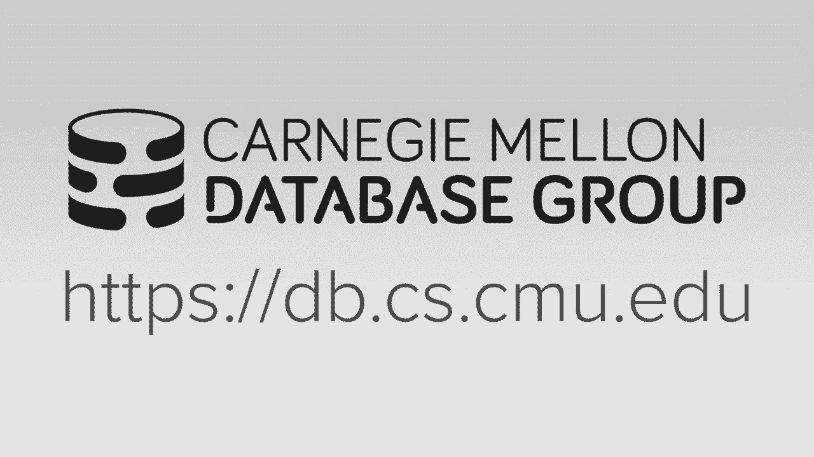
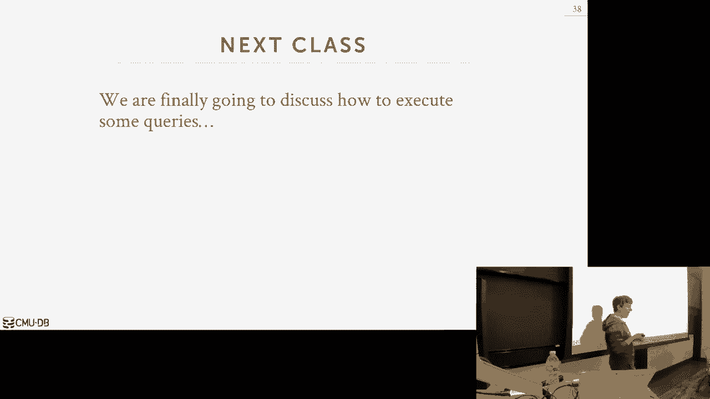

# 【双语字幕+资料下载】CMU 14-455 ｜ 数据库系统导论(2019·完整版) - P9：L9- 多线程索引并发控制 - ShowMeAI - BV1qf4y1J7mX

okay guys let's get started again Thank，You DJ drop tables always always always，keep it down。

how's your mixtape going oh it's going，we'll release it at the end of okay and，beats。

oh nothing but you and like your own，stuff okay alright so let's get started。

it's a beautiful day out and I think，that's why the turnout here so low which。

sucks cuz my every lecture is all so，much here but this one I like a lot to。

be before we get into the course，material just to discuss real quickly。

what's on the schedule for you guys，project one is due this Friday at。

midnight and again you should submit，that on great scope homework 2 is due on。

Monday at midnight also spindle grade，scope so we'll send an announcement out。

on Piazza but we've updated the PDF so，that you could drop the pictures in。

right into the the PDF so you spitting，that know so we give you a template for。

draw IO so it's an online tool to go，quickly edit and modify the templates，for your answers。

so should we know handwritten drawings，and no photographs of like drawings that。

everything should be done digitally and，then we'll be releasing project two on。

on this Monday as well and that'll II do，think two or three weeks in October okay。

so any high-level questions about the，project or homework - okay so let's get。

into so the thing we need to talk about，now is that we spent the last three。

classes talking about data structures，we'd spend down hash tables and spent。

two days on B plus trees radix trees and，other tree data structures so for the。

most part during this entire，conversation when we talk about these。

data structures we've assumed that the，that they were only being accessed by a。

single thread but there was only one，thread that could be reading and writing。

data to the data structure at a time and，that simplified this part of the。

discussion and so that you just underst，what's the core essence of how these。

data structures work but in a real，system we obviously don't want to just。

have a single thread be you know only，accessing the data structure at a time。

we would allow multiple threads because，a modern CPUs there's a lot of CPU cores。

so therefore we can have multiple，threads running queries and all updating。

our data structures but also don't allow，this the high disk stalls due to you。

know or stalls due to having to go read，read things from disk because now if one。

thread is doing something and it reads a，page that's not in memory it has to get。

stalled while the buffer pool manager，brings that in and then we can let other。

threads keep running at the same time so，we're have a lot of threads running in。

our system and we do this because that，maximizes parallelism or maximizes the。

reduces the latency for the queries you，want to execute so for today we're now。

talked about up now we bring back，multiple threads and want to update and。

access our data structure what do we，need to do to protect ourselves so let's。

say is it a quick aside so everything，that we'll talk about today is what how。

most database systems actually work most，database systems that support multiple。

threads will do the things that we're，talking about today doing this latching。

stuff there are some particular systems，that actually don't do any of this and。

only the owl single threads has to，access the data structures and they。

still get really good performance so，volte B and Redis applied two miscreants。

one set dips so in case the Redis Redis，only runs in one thread it's a one。

threaded engine in both DB it's a，multi-threaded engine but they partition。

the database in such a way that every B+，tree can only be accessed by a single。

thread so you avoid all this latching，stuff that we talked about today and you。

get really great performance but，obviously this means that it complicates。

scaling up to multiple cores or multiple，machines but again we'll talk I'll just。

talk about these things later on in the，semester but the main idea now is that。

everybody pretty much does this thing，things that we're talking about so the。

way we're going to protect our data，structures is through a control protocol。

a control scheme and this is just the，the method in which the database system。

guarantees the correctness of the of the，data structure by enforcing all the。

threads to access the data structures，and using a certain protocol or sort of。

certain way and so I'm putting the the，word correct in quotes because that can。

mean about mean different things，and the kind of things were talking。

about they're accessing although we've，been focused on data structures but it。

really could be for any sugared shared，object in the system right it could be。

for two-pole could be for an index could，be for the page table and in the buffer。

pool it doesn't matter so the two types，of correctness we care about in converge。

hole are logical correctness and，physical correctness so logical。

correctness would be like a high level，thing that says if I'm accessing the。

data structure am i seeing the values or，am I seeing the things that I expect to。

see so if I have a B+ tree index I，insert the key five my thread that。

thread comes back and reads key five，right away it should see it where I。

should not get a should not get a false，negative but that's a logical。

correctness thing that I'm seeing the，things I that I expect to see the thing。

that we're gonna care about this class，is physical correctness but how do we。

protect the internal representation of，the data structure of how it maintains。

pointers and references to other pages，and keys and values how do we make sure。

that as threads are reading writing this，data that the integrity of the data。

structure is sound so it's able to be we，don't want the case where we're falling。

down traversing into the B+ tree and，when we jump to the next node we have a。

pointer to that and then by the time we，read the pointer figure out where we。

need to go and then then try to jump，there somebody else modifies the data。

structure well now that pointer is，pointing to a an invalid memory location。

and we would get a seg fault so this is，what we're trying to do today we're。

trying to protect the internal data，structure to allow multiple threads read。

and write to it and that they still that，the data structure is is behaving。

correctly for the logical correctness，we'll worry about this more when we talk。

about transactions and current reach all，right this is a whole another engine。

super interesting topic but for today we，say you know happy make sure that the。

data structures are thread safe so we'll，begin by talking about what is actually。

a latch they're a bit more detailed than，we then we talked about so far and how。

it's actually implemented and then we'll，start off with an easy case of actually。

doing thread safe hash tables using，latches for those because that they're。

actually really simple to do but then，we'll spend most time talking about how。

to handle sin B plus trees and what's，talking how do leaf node scans and other。

optimizations again when we have，multiple threads accessing things。

same time yeah all right so I showed，this slide last time and I don't think。

everyone you know we only talked about，very briefly and I don't think everyone。

absorbed its on it I want to send more，time talking about the difference。

between locks and latches so in the，database world where I live a lock is a。

higher level concept that protects the，logical contents of the database so a。

logical content would be like a tuple or，a set of tuples or a table a database。

and we're having using these locks to，protect these logical objects from other。

transactions that are running at the，same time like if I'm modifying。

something in a transaction and so I，don't want anybody else to modify that。

that tuple at the same time that I am，right you may for other reasons but for。

our purposes assume that we don't want，that to happen so for these locks we're。

gonna hold them for the entire duration，of the transaction again that's not。

entirely true but again for our purposes，just assume that's the case and then we。

need to be able to roll back any changes，we make to our to the objects we modify。

if we hold the locks for them so if I'm，trying to transfer money from my account。

to her account if I take the money out，of my account and then I crash before I。

put the money in her account when I come，back I want to reverse that change I。

made to my tuple so these so in that，means the daily system is responsible。

for knowing how to roll back these，changes so notice up here I didn't say。

anything about threads or I'm talking my，transactions so a single transaction。

could be could be broken across multiple，threads and they could all be updating。

the same tuple that's okay that's，allowed because the transaction holds。

the lock it doesn't matter what thread，that that's actually doing the。

modification where we get down to the，low level constructs that we care about。

protecting the physical the physical，integrity of our data structures or the。

objects is latches so in the operating，system world they this is what they call。

locks of mutexes in our world there's，latches because we need to distinguish。

them from locks so latches are going to，protect the critical sections of the。

database systems internal data，structures from other threads that are。

reading right into that data structure，or that object at the same time so we're，only hole。

latch for a short period just for the，duration that were in the critical。

section to do whatever operation that we，need to do I want to update a page I。

hold the latch on that page make the，change then release the latch we don't。

need to be able to roll back any changes，here because the opposite of the。

operations we're trying to do are，essentially meant to be atomic so I hope。

I grabbed a latch from something I make，whatever change I want and then when I。

when I release the latch then the，operations considered done so all the。

changes are there if I can't acquire the，latch then I'm not gonna do the。

operation anyway so there's nothing to，rollback so another way to think about。

this is this great table from the that，that B+ tree book I recommended a few。

lectures ago from Gert scrappy we has，this nice table that lays out again the。

distinction between locks and latches so，four locks we're gonna separate user。

transactions from each other and they're，gonna be protecting the bidets contents。

tuples tables things like that and we're，gonna hold them for the entire duration。

of the transaction there's gonna be a，can help，hold on these objects again we'll cover。

this in a few more lectures and then，when it comes time to actually dealing，with dead locks。

we're gonna rely on some external，coordinator a lock manager or。

transaction manager to resolve any dud，locks that that could occur and the。

methods we can use are waits for timeout，sub or some other things and what we'll。

focus on these later what we care about，is over here we have these latches。

they're gonna protect threads from each，other for our in-memory data structures。

we're gonna protect the critical，sections inside these data structures。

there's only going to be two lock modes，read and write and the way we're going。

to avoid deadlocks is to us being good，good programmers which is nice for。

databases good equals expensive right so，it's up for us to make sure that we。

write high-quality code in our data，structures to avoid deadlocks because。

there is no external thing like a，transaction manager or lock manager。

that's going to rescue us if we have a，deadlock it's all for us to design and。

implement our data structure in such a，way that deadlocks cannot occur and。

we'll see what that looks like later on，so again our focus is on here we'll。

discuss all this lock stuff in lecture 7，after the midterm again I find all the。

super pass men but this this is this is，like this is like one but the the black。

arts of database systems if you can you，know actually make this stuff work all。

right so let's talk about the latch，modes work for that we can have again。

there's only two modes read and write so，a latch the latch is being held in read。

mode then multiple threads are allowed，to share that read latch right because。

again it's a read-only operation so I，can have multiple threads read the data。

structure at the same time there's no，conflict there's no integrity issues。

that could occur so they can all share，share that if I take out the latch and。

write mode then I can only that's an，exclusive latch only one thread can hold。

that latch in that mode at a time so if，I hold it right latch I'm making changes。

nobody else can read that object that，I'm protecting until I finish all right。

the only two modes we care about think，of this is like again multiple threats。

we share this one this is this is an，exclusive latch all right so let's talk。

actually how you implement a latch in a，Braille system so the first approach is。

PI the one you're most familiar with you，know when you take any kind of systems。

course or operating system course is a，blocking operating system mutex and。

blocking OS mutex so this is the，simplest thing to use because it's sort。

of built into the language like it like，in C++ the standard template library has。

this thing STD mutex and it's really，simple to use you just declare it then。

you call lock do something what you know，on your the object you're protecting。

with it and then you call unlock and，you're done right so does anybody know。

how this actually works in the operating，system in least some Linux how did the。

mutex like this work yes，he says few texts what is a few texts。

what's that he said well so he said few，texts he's correct in Linux few tech。

stands for fast user space mutex the way，it works is that there is the in user。

space meaning in the address space of，your process there'll be a memory。

location that has you know a like a bit，usually a byte or so but I'll have a。

memory location that you can then try to，do a compare and swap on to to acquire，that that。

latch but then what happens is if you，don't acquire it then you fall back to。

the the slower default mutex where that，goes down into the operating system so。

the idea is you do a quick compare and，swap and in userspace，if you acquire it you're done if you。

vos，which is gonna be slower because what，happens is if you go down vos and sit on。

a mutex inside side the kernel then the，OSS aha well I know you're blocked on。

this mutex and you can't get it so let，me tell the scheduler to D schedule so。

you don't actually run and the reason，why this is expensive because now the OS。

has its own internal data structures，that is protecting with latches so。

you've got to go update now the，discussion table to say this this。

process of this thread can't run yet so，he's correct fast user-space mutex is。

will be fast cuz that's just a spin-spin，latch we'll talk about the next slide。

but he fall down to us then then then，you're screwed so this is another great。

example were like we were trying to，avoid the OS much as possible for the。

first project you guys use this because，it's fine but if you have a high。

contention system then everybody is，going down to the OS and that's that's。

gonna be a problematic so the，alternative is to implement ourselves。

using a spin latch or test and set spin，latch so this is extremely an extremely。

efficient it's super fast because on，modern CPUs there's a single instruction。

there's an instruction to do a single，compare and swap on a memory dress I。

think it just like I check to see，whether the value of this memory address。

is what I think it is and if it is then，I'm allowed to change it to my new value。

so think of like the latch is set to 0 I，check to see whether it's 0 and if it is。

then I said at the 1 and that means I've，acquired a latch and you can do that a。

modern CPUs and interesting single，instruction right you don't have to have。

you don't the write C code like if this，then that it does it all for you so the。

way even implement this is in C++ is，that you had this atomic keyword which。

is templated you can put whatever you，want there but they have a shortcut for。

you called atomic flag which is just an，alias for atomic pool and so inside this。

now it will when we want to acquire this，latch we have to have this while loop。

that says test and set the latch if I，acquire it then I jump out of the the。

wild they're gonna because I hold the，latch if I don't fall into the wild loop，and now。

it has some logic to figure out what，should we do the simplest thing is just。

say all right let me just retry again，loop back around and keep trying it。

right the problem with that is though，that's just me burning out your seat。

you're not burning out literally but you，just burning cycles and your CPU because。

you just keep trying to test that set，test and set test the set and it's。

always gonna fail and you keep spinning，around and in this infinite loop so this。

to the OS thinks you're actually doing，useful work because it doesn't know what。

instructions you're executing so it says，you keep executing instructions let me。

keep scheduling you and you're to spike，the CPU so this this test and set thing。

is the same thing he said before about，the fast user mutex this is the same。

thing the OS provides you in the Linux，standard or the STD mutex on Linux but。

maybe I don't want to burn my cycles but，he's keep me trying maybe I want to。

yield back to the OS get D schedule and，let it schedule some other thread or。

maybe I try a thousand times and I'm，saying I'm not gonna get this and I just。

up work so this is a good example of，where we as the database systems。

developers we can be smart or we can we，come to the our implementation however。

using latches and our data structures to，be mindful or try to accommodate what we。

think the workloads gonna look like if I，think that this latch has to be like。

whatever the operation I'm doing the，latches to be super fast then it's PI。

faster for me to just keep retrying，because whoever holds the latch will。

give it up real quickly but if I think，the operation is going to be super long。

then maybe I want to yield or for some，amount of time or eventually abort we。

can't do this in the blocking us mutex，soon as we try to get it we can't get it。

the questions what is this this oh this，yeah like the primers would be like it's。

compare-and-swap it says at this memory，address check to see whether the value。

is this like passing a zero if it if it，equals zero then set it to one right and。

then there's different there's different，API sometimes you'll get back the old。

value you'll get back a true whether，it's exceeded there's a bunch different。

things and then they have they have，tested sets for you know for all the。

different types you could you could be，based on，so again the main takeaway here is that。

again we we in the data system can do a，better job than the OS because we would。

know in what context we be using this，latch so for these two examples though。

the latch has just been you know do I，hold it or not as I said before we have。

we have different modes so we need a，reader writer latch that can support we。

have these different notes the way we，basically do this and we build on top of。

whatever our basic latching primitive we，have either the spin latch or the POS。

mutex and then we manage different，queues to keep track of how many threads。

are waiting acquired to different types，of latches right so it may be just。

mentioned some counters to say here's，the number of threads that help hold the。

latch in this mode here's the number of，threads that are waiting for it so if a。

rethread shows up and says I want to get，the read latch well I look over here and。

say nobody nobody holds the right latch，and nobody is waiting for it so I go。

ahead and and hand it out and I update，my counter to say I have one one thread。

that that's uh that holds this latch，another threat comes along and once also。

quite a real a CH again Reed latches are，compatible or making me shared so we。

just recognize that this guy already，holds the reed latch so this guy can。

also acquire it and we just update our，counter so now the writer writer thread。

comes along what's the right latch it，has to stall because the because the。

read latch is being held by other，threads and so we just add our counter。

here to say that we're waiting for this，so now if a read thread comes along and。

right so you guys depends on what policy，were using we could just immediately let。

the say uh read latches already is，already being held go ahead and also。

acquire it but that could lead to，starvation because the right on the。

right thread will never get to it so in，this example here we could just stall it。

add it to the counter say we're waiting，for this and then eventually when the。

first two guys at least the latches the，writer thread will get the latch again。

this depends what policy we want to use，depends on in what context we the the，latch is is being used。

right if it's a if it's a if it's a data，structure where there's not many rights。

but the rights are really important then，we want to give higher priority to the。

right of threads okay and again we just，build on top of our the data structures。

that are that the latching primitives，that I showed before to implement。

something like this and you can still do，this you still depending on how you，this。

most of the operations on this，atomically okay all right so let's now。

see how we take these latches and，actually do something with them so the。

first thing is as I said well first talk，about do hash tables because this is。

actually super easy to do and the reason，why it's super easy to do is because the。

ways in which threads can interact with，our hash table is is limited meaning we。

probe into a for this one assuming we're，doing like the static hashing table the。

extendable linear stuff that dynamic，ones they're a bit more complicated but。

the the same principles apply here but，today in a linear probing hashing table。

Mikey shows up I just hash it I jump to，some slot and then I just scan down in。

sequential order on the hash table try，find a thing I'm looking what I'm。

looking for and everybody every other，thread is doing the same thing they're。

always scanning top to bottom eventually，reach the bottom and loop back around。

but you think of that is just a circular，buffer where you're essentially always。

scanning down so in this case here，deadlocks aren't possible because。

everybody is going in the same direction，nobody's coming up in the other way and。

they hold a latch it up that I want and，it holds a latch that I want like you。

can't you can't have a deadlock so this，makes it super super simple so for an。

out it's a resize that pay the table，this one we just take a global latch on。

the usually in the header page that just，prevents anybody else from from reading。

and writing the table until I complete，the the resizing but again that's if we。

size our table a large enough to in the，very beginning like this is a rare。

occurrence most of the time we're doing，you know probes or insertions and。

that'll be fast deletions also，complicate this too if you want to do。

compaction or move data around but for，that we can just ignore，so the two approaches to do this will。

differ on the granularity of the latches，so the first approach you just have at a。

on each page you just have a single，reader/writer latch and so when a thread。

wants to do something you know do a，lookup before it can read the page or。

access it it has to acquire the right，latch for that page the other approach。

is be more fine-grain latching where you，have a latch for every single slot so。

that means as you're scanning down you，can you acquire the next slots latch and。

then you go into it and then do it look，for whatever whatever you're looking for。

so there's this trade-off between the，computation the storage overhead between。

these two approaches because the the，page latch we have to store less latches。

there's only one per page but now this，can potentially reduce our parallelism。

because I can't have two you know even，though two threads might be operating on。

different slots because it's in the same，page they can't run at the same time in。

the case of having a latch per slot it's，gonna lob for more parallelism because。

the latches are more fine-grain but now，I'm storing more latches in every single。

slot and now it's also more expensive to，you know - keep quiet ease latches as。

I'm scanning through because I'm doing，it for every single slot that I'm。

looking at so let's let's look at some，high-level example so first one would be。

page latches so again say we have a，simple three to three page table that。

has two slots per page and so the first，thread wants to find D and say D hashes。

to this this position here this slot so，before I can go look inside of it to see。

whether the thing I want is there I，first have to get the read latch on it。

and then once I have that now my cursor，can start looking at it now let's say。

another thread comes along and they want，to insert E and E wants to hash to where。

C is can it do that can actually start，looking at it no right because because。

it wants to take a write latch on this，page because it doesn't know that C is。

is full it doesn't know it's gonna have，at it，it needs the right latch the right latch。

is not compatible to read latch so it，has to stall and wait so the first guy。

scans down he looks at C and now he，needs to go look at this next page here。

and again the way we figure out what，page you look at，is we just look you know we look in our。

the header for the hash table and the，headers gonna say here's all the pages。

that you're looking for but logically，they're order sequentially right so like。

page zero page 1 page 2 so you look in，the header and say where do I find page。

2 for my hash table and so in order to，do this traversal when I want to go from。

from page 1 to page 2 I actually don't，need to hold the latch on one in order。

for me to jump down to 2 because my hash，tables static I'm not resizing so this。

location is always gonna be the same so，I can immediately release the latch。

before I jump to this and allow anybody，else to keep running and then I can go。

ahead and quire the latch for this this，is gonna be different when we talk about。

B plus trees B plus trees you have to，hold a latch on whatever node you're。

coming from before you jump to the next，node and it's only when you get to the。

next row do you then release the one，behind you yes yeah so he's so he。

proposed an optimization where in this，case here for thread thread 2 instead of。

trying to acquire require a write latch，could I just require a read latch figure。

out whether the thing I actually want，would be there or not and then if it is。

then I go back and try to acquire the，write latch or I just jump down here and。

say you know do the same thing because I，know it's the thing I'm look for is not。

here if there's no delete to know，movement yes we'll talk the same。

technique when we apply for B plus trees，I'm doing it that sort of the the naive。

way but yes you can actually do that in，general you don't do you you don't。

really do latch upgrades you can't say，I'm in read mode now put me in write。

mode you release the latch and then in，one mode and put and get acquired again。

another another another mode all right，so this guy Gavriel at she can start。

reading this now this guy gets the right，latch it sees that sees not what a once。

so wants to scan down here and this time，t1 has gone away so can go ahead and be。

the right latch see that the thing，there's this slots occupied come down。

here and do the insert again it's more，coarse-grained because only one thread。

can be inside if they're doing if the，the latch mode conflict was only one，thread at a time to be。

side the the table but it makes it more，simple to actually choir these latches I。

don't not acquiring latches every single，one so let's let's see how to do it in。

which slot latches so again t1 starts it，wants to do find D it hashes to where a。

is so it acquires the read latch on a，and then t t2 starts it wants to do a。

right so acquires the right latch on C，and at this point when t1 starts up。

again and tries to look at this it can't，run because you can't get that latch。

whereas so he has to stall whereas this，other thread can keep going down here。

and then now this guy can then pick up，me and keep going behind it alright so。

then eventually it has to stall too，because they can't go here this guy。

moves on does his insert and then this，guy can then proceed right so we can do。

the exact same optimization that he said，and we'll see this in content sippy +。

tree I could escape T key real a chance，try find the spot that I want and then I。

try to acquire the real s what I want，but I do have to handle the case or I do。

take the read latch see this is the spot，I want to go then I release the real a。

CH then come back and try to take the，right latch and in between that time。

somebody might have inserted something，in my slot and then I need then I need。

to be able to handle that and keep，scanning down below so just that。

technique works with blue sector stuff，you have to do so again the main。

takeaway I want to get from all this，there can't be a deadlock because。

everyone's scanning from the top to the，bottom that makes our life easier。

there's nobody else coming in the other，direction so that's why also - we can。

just release the latches before we jump，to the next one because we're not。

worried about the location of the page，we're W changing okay alright so let's。

talk about more complicated things let's，talk we had to do this in a B+ tree so。

again we want to have multiple threads，running at the same time and then we。

allow them to redo reads and writes，without having to lock the or latch the。

entire tree or during that duration of，the operation so the two things we need。

to handle in our B+ tree to make them，thread safe is that we need to handle。

the case where two threads are trying to，modify the same node at the same time。

and then we need to handle the case，where one thread might be traversing the。

tree and then down below it before it，gets to the leaf node，another thread does a modification that。

causes a split and emerge and now the，location of a page may end up a node may。

end up getting moved around and the data，I'm looking for is not there or in worst。

case scenario I have a pointer to now，and in memory an invalid memory location。

so let's look at high-level example here，so we're gonna focus on this side of the。

tree I'm just labeled in ABCDE and then，so forth on the leaf nodes so say we。

want to do a delete on on 44 down to the，bottom so the first threads going to。

start at the top again we just do the，traversal we talked about so far we look。

at the separator keys we figure out，whether or you want to go left and right。

and we move down to the child node based，on that so then we may get down to this。

leaf node here and we can go ahead and，delete our entry but now we see that our。

node is less than half-full in this case，it's entirely empty so therefore we have。

to rebalance and so we're gonna want to，in this case here instead of doing a。

merge we'll just copy over a key from，one of our siblings but let's say before。

we can do that rebalancing the OS swaps，out our thread I and we get stall it and。

now another thread start running and，that other thread wants to do a lookup。

to try to find key 41 right down here at，the bottom so that does the same thing。

it starts traversing the tree and then，it gets down to this point here and it。

looks at the separator keys and figures，out oh I want to go to this node but。

then it get it Bo stalls this switches，back to our first thread and the first。

rad moves 41 over and then now when my，other thread starts up running again I。

get down here and the thing that I，thought was there is no longer there。

right so that so best-case scenario this，is just you know we got a false negative。

here we thought key 41 does exist but，the index told us it didn't exist that。

all the anomalies or issues were talked，about today at the best-case scenario。

worst-case scenario was this node got，moved around and then now this pointer。

pointed to nothing and we went and we，would get a seg fault in a program a。

crash so the way we're gonna handle this，is the classic technique called latch。

crabbing or latch coupling when I you，know when I was a young lad when I was，taught databases。

I would be game I was told the term was，called lat crabbing，I don't know what the textbook actually。

uses but the Wikipedia I think calls a，lot latch coupling it's all the same。

concept same thing so lats crabbing is a，technique that allows multiple threads。

to access the the B plus tree at the，same time and we're to protect things。

using latches so the basic idea the way，this works is that anytime we're at a。

node we have to have a latch on that，node being in right mode or read mode。

and then before we can jump to our child，we got to get the latch on our child the。

next the next node we're gonna we're，gonna go to and then when we land on。

that on that child we can then examine，its contents and if we determine that。

the child node we just moved to is safe，then it's okay for us to release the。

latch on our parent and so the term let，crabbing sort of has to do with the way。

like crabs walk like moving one leg past，another that's how we're going to。

acquire latches as we go down so our，definition of safe is one where if we're。

doing a modification the the node we're，sitting at will not have to do a split。

or merge no matter what happens below it，in the tree so that means that it's。

either not completely full if we're，trying to insert we have room to。

accommodate any key that may come up to，us or any key that we're inserting and。

then if we were doing a delete we know，that it's more it's more than half-full。

meaning we have to delete a key we're，not gonna have to do a merge all right。

so again the basic protocol worked like，this at the very root you acquire the。

right latch you need so in the case，we're doing a fine it's all read latches。

all the way down again every single time，we we get to the next node we release。

the latch on that parent hood where we，came from okay again we're not making。

any modifications so every every node is，deemed safe for inserts and deletes we。

start off with getting right latches all，the way down and then please we。

recognize that the node we're at is，considered safe we can release any right。

latch we have up above in the tree，because again no matter what has below。

us they would not be affected they would，not have to get changed so let's look at。

some signals so again find is super，simple I want to find key 38 at the。

bottom so my thread starts off the，beginning I get the real a on a I come，down to now B and now this。

point here again because it's read-only，operation it's a fine it's safe for me。

to release the latch on a so as soon as，I get down to B I can release the latch。

na and I'm good to go and now I keep，scanning down and do the same thing get。

to D release on B get to H release on D，and now I do my read and and I'm done。

right pretty straightforward so let's，see now if we want to do a delete so I。

start off with the right latch on the，root I come down to B after i acquire。

the right latch now this point here is，it is it safe for me to release the，latch on a No。

why because I only have one key and B，and so I don't know what's below me yet。

I'm going down and going I'm doing 38 so，I'm going down here I don't know what。

these other notes look like yet so if I，do a delete and I have to merge and I。

have to remove this key now I do like，them you know make a change up to egg so。

in this case here we have to hold the，latch on B I'm sorry I hold the latch on。

egg so then we get the latch on D get，down here and now we recognize that no。

matter what happens below D we know that，we have room to accommodate or we can。

lease to meet one key and I'll have to，merge so we can at this point here we。

can release the latches on on a and B so，essentially the threads are sort of。

keeping a stack of like here's all the，latches on I'm holding as I go down so。

it knows at some point when I when I am，at a safe node I just release everything。

up a bumping alright so now I get down，to H I can release the latch on D。

because H is is one Humberts at full，then I go ahead and do my delete and。

then when I'm done then I release the，latch and go home let's see now an，insert same thing。

start with the right latch on a and the，roof go down to be at this point here I。

recognize that B can accommodate any new，insertion so it's safe for me to release。

the latch on a so I'll go ahead and do，that and then I go down to D D is。

considered full so I don't know what's，gonna happen below me and so I had to。

hold the latch on B so then I get down，to I and now I recognize that I can。

never split because as enough room so，before I do the update I release the。

latch on B and B and D and the night，then I can do my insert，so for this the the order in which you。

release the latches doesn't matter from，a correctness standpoint right so back。

going back here I have to release the，latch on D and B if I release latch on D。

before bead that doesn't matter because，no one's gonna get to D anyway because。

they can't get to B so from a，correctness standpoint it doesn't matter。

but from a before my standpoint we，obviously want to release this one first。

because this this covers no more more，leaf nodes so you want to release the。

okay let's look at one more example，where there could be a split so I wanted。

to cert 25 same thing right latched on，on a right latching be be won't won't。

get over a full I can release the latch，on a I come down to see see he's not。

gonna go get over a fool so I can at，least latch on B and then now I come。

down to F and now I see I need I need to，do a split so in this case here I need。

need to hold the latch on my parent node，on C while I make the change so I first。

start 25 here take the spillover page，over here put 31 there and then update。

my my parent node do I need to have a，latch on this new guy down here what。

that says no why he says no we can，access it because you could have you。

have a latch on the parent that assumes，that there's no sibling pointers which。

we'll talk about in a second so in this，example here for simplicity reasons I'm。

not going to acquire the latch because，everyone's going top of the bottom if。

I'm scanning along the leaf nodes then，yeah someone can get to this and I have。

to protect it but we'll get to that okay，yes，yes Damon is I said that the threads。

have a stack of the of the latches，they're acquiring us to go down，shouldn't be a queue yes first-in。

okay yes yes say - I said come back to，this table here I said that you want to。

release the latches in the from the top，to the bottom and you're saying it in。

the OS world you-you-you release them in，reverse order so again think about what。

we're doing in the data structure here，at this point here like no one can get。

to D unless they go through B so me，releasing the latch on D doesn't do。

anything because nobody's waiting to get，that latch up somebody up above could be。

waiting to get required B so I want to，release that latch as soon as possible。

so it's because we know what the data，structure how it's being used we。

understand the context of how of your，latches are being used you want to。

so now I want to ask you guys what was，the very first step I did for all those。

modifications and examples for the，inserts and deletes what's the very。

first step you do exactly you latch the，root in exclusive mode or right-right。

mode that's problematic right because，again the right law right latch is。

exclusive no other thread can can，acquire any other lasha，during that on that node so this becomes。

a single point of contention a single，structure，everyone has acquired this right latch。

and only one thread can hold that right，latch at a time so this is a big problem。

this is gonna prevent us from getting，too high parallelism to high concurrency。

so we need something better than just，everyone decline the right latch and。

soon as they go in and so what we're，gonna actually give them to do is。

exactly what he proposed before from the，hash table is make an optimistic。

assumption that most threads are not，gonna need to do splits or merges at the。

leaf nodes so rather than taking right，latches all the way down。

I take read latches all the way down and，then I take a right latch on the leaf。

node if I determine that I don't have to，split then great I got down with just。

read latches and I can make whatever，change I want if I if I get it wrong and。

I do what this do a split or merge then，I just abort restart the operation in。

the beginning and take right latches，down so this is this is a standard。

technique we do in systems where you，optimistic versus pessimistic I'm。

optimistically gonna assume that I'm not，gonna have to do a split so therefore I。

take the fast path and do do read，latches well see this in context of。

other things like for transactions later，on and for most data structures remote B。

plus trees in the real world this is，actually a pretty safe assumption right。

in my example some shown nodes would，have two keys in them in a real database。

system your node is gonna be you know，eight kilobytes or 16 kilobytes that's。

gonna have a lot of keys so most of the，operations you're doing are not gonna。

have to do a split in the merge in the，rare case that you do have to do a split。

merge and then again you just fall back，to the standard latch crabbing technique。

that I showed before so this is from a，paper from 1977 from these German guys。

Baron schlock Nick this so there's no，name for the algorithm that people，usually refer。

- as the bearish logic algorithm we're，optimistic a lot / grabbing all right so。

let's say we wanna do that delete on 38，so again I don't take a right latch in。

the root I take a read latch all the way，down and then when I get down to 2 D。

here I acquire the real at the right，latch on on on H I recognize that I'm。

doing a delete therefore I'm not gonna，do a split and merge so therefore my my，gamble paid off。

and I don't need to to restart right I，can do my delete without having to take。

same thing for insert so insert 25 I，sorry，I take a real a CH and do crabbing all。

the way down and then I eventually get，to see here where I take the right latch。

on F this one I recognize that I'm gonna，have to do a split so I abort the。

operation and just restart it start from，beginning and take take right latches。

all the way down so he said shouldn't，you start at the point where you last。

released the latches on the way down so，that would be in this case here at C。

right so question is so it'd be a -，sorry we need my two nodes like -，sibling - keys yes correct。

yes but how do you get how do you get，CNF again you can't he said I said you。

can maintain a stack of the punters that，way you got down here I can't do that。

because I can't say page IDs again these，ABCDE these are the logical identifiers。

for these nodes but they may end up，being put into different pages so。

because I didn't I don't hold any，anything，and therefore the location of the page。

ID for these these nodes may now be，something different so now you see page。

1 2 3 announce 4 5 6 in my stack I go，look for page 1 2 3 and now it's。

something completely different because I，can't we can't assume that the location。

of these pic nodes will always be the，same unless I hold a latch on them the。

read latch prevents anybody from writing，them and doing the splits the right。

latch prevents anybody from ah else I，also modifying them you always have to。

restart yes thank you sorry your，statement is yes say forgetting so if I。

so your question is if we're have if say，we're like maybe like here so I hold the。

read latch on this and I hold the right，latch on this and then because I at this。

point I need to modify it but also I，don't know whether someone's gonna。

change the change something that would，cause this thing to get modified as well。

but again everyone's going in the same，direction so they can't do that like。

they can't get to they can't make any，change here because I hold the real ash。

on that so they can't modify this node，yes yes yeah yes yeah question is in。

this example here when I got down here，and took the right lateral F to do the。

insert and when I recognized oh I got a，split therefore I need the right latch。

on this and there and I don't have it so，at the restart，yes yes yes yes yes。

she said so say I'd had this example，here I went to cert 25 I got to the leaf。

node and recognized oh I got a split let，me restart and take right latches down。

but he needs between the time I，restarted somebody else came along and。

wants to insert 24 and they're gonna，have the same issue they also have to。

split this so they come back as well and，take take right latches on the way down。

but now because both of them are taking，right latches only one of them is gonna。

proceed at a time so now 25 say the guy，that wants her 25 he gets there first。

he inserts this and splits then 24 is，allowed to run it gets down here。

it doesn't care that it already got，split again this is a good example。

between the logical correctness and the，logical view and the physical view I。

don't care my index where my key，actually exists so I don't care that，like oh I try to put it here。

so make sure I put it in this here the，next time because I couldn't hear the。

first time I want to go exactly this，page you don't care every single time。

you come into it you're doing this，traversal from scratch you don't care。

how you got there before so it doesn't，matter that 25 inserts here at splits or。

maybe 24 came first and splits it，doesn't matter it's still balanced and。

still correct yes correct so he said the，second reversal for 24。

it doesn't need a right latch because 25，already split it correct that so that。

that's more expensive but what's the，alternative right the alternative is to。

take right junk latches every single，time so optimistic is not perfect we're。

not guaranteed to always do the least，amount of work we need to do because。

certainly if I'm again in this case here，my nodes are really small so I'm。

splitting a lot if I'm inserting a lot，so I'd be wasting a lot of lot of cycles。

a lot doing wasted work should reverse，just to find out I need to come back and。

take right latches so in practice if the，contention rate is high and therefore。

the optimistic assumption is incorrect，you're going to actually be slower than。

this doing the pessimistic thing but for，these data structures in general。

probably talking right here at the，optimistic one actually works the best。

the for the the hash table stuff I，actually haven't seen numbers in that。

case the it's often times the the the，pessimistic approach of taking latches。

on the page is this is actually pretty，good cuz it's so simple for this won't。

make more fine-grain and and and we get，a big grin but it depends on a lot of。

things depends on what the workload is，are we insert heavy lookup heavy。

delete heavy it depends on you know the，distribution our values depends on how。

many cores we have right it varies a lot，in practice though most data systems。

just pick one approach they don't try to，be adaptive because this is with from。

engineering standpoint it's way more，so he says for people she knows you。

can't use the low-level slot latches，like you can in a page table no because。

you could be modifying the you could be，modifying the in the physical structure。

of the index itself so therefore I'm，updating pointers so like if I have like。

like if I need to have split merge and I，need to have latches for all the keys in。

this in this node in order to move them，around so so in general you just take a。

latch entire page I think that's true I，could double check that though it makes。

things more complicated okay so again，this is just reiterate what we're trying。

to talk about again for the this for the，search with the better the better lock。

latch latching algorithm same as before，insert delete it's it's giving you you。

take relapses all the way down if it，fails then you just come back and。

restart so again this is what I was，saying before about how we're assuming。

that most of the time taking the real，edges on the way down is going to be。

good enough but we're not gonna have to，restart right and therefore if we if we。

if we choose correctly with predict，incorrectly then you need that first。

time we went down is just wasted work，we're just burning cycles and so we're。

not gonna get the the better scalability，or concurrency we may actually want but。

I'll say in practice this is this is，this usually worked out nicely alright。

so the next thing to talk about is how，we actually support leaf no scans so in。

the example I've shown so far with the，B+ tree just like in the hash table all。

the traversals were in one direction，they always top to the bottom so there。

can never be any dead locks because I，never had a thread trying to come up。

from the bottom to the top in reverse，direction and try to hold latches that。

holds latches that another thread once，right，so if though now we want to start。

scanning on leaf nodes things become，more complicated because now we have。

things coming from top to bottom and and，also from left to right so in this case。

deadlocks could occur，so let's see how we handle this so the，first thing I'll say is the original。

this is before the original B+ tree did，not have these sibling pointers on the。

leaf nodes this is what how most people，streets have this now and this comes。

from the be link tree that was invented，here at CMU so let's say I had this。

really simple tree like this and I have，thread one wants to find all keys less。

than four so we take a reed latch on the，root come down here I forget the。

relation on C we can release the real a，on a and now we want to start scanning。

scanning across all right so say we，reverse order on all the keys in this。

node but now we recognize that we got to，keep going over here right so just like。

before in case of crabbing when we want，to go horizontally we don't release the。

latch that we hold until we acquire the，latch that we want so in this case here。

in order to get the latch on B I hold，the latch on C once i acquire it then I。

can swing around and then release the，latch on C so in this case here for all。

keys less than four is basically keys，from less than forward to that negative。

infinity so we know that we're gonna，have to hit the we want to get to this。

end of the the the tree there's other，tricks you can do like having like fence。

keys or hint keys basically to tell you，for this node here what's the keys over。

on this side here and to tell you，whether you even even need to jump there。

or not but for this example we don't be，worried about that all right so let's。

make it more complicated say now we have，another another thread that wants to。

find all keys greater than one well okay，that's fine so the both of them start。

they both want acquire the Reed latch on，a that can happen because that can be。

shared amongst them and then they this，guy gets to relapse on B this guy gets a。

relapse on see that's fine then they，scan all the raqi's and they start going。

across and for this point here B wants，to latch on CC wants to latch on B that。

could be shared right because the Reed，latches so at this point here they both。

acquire alternating one so the different，ones that's good then they slide over。

and now they release the latch of it it，just came from so because the Reed latch，can be shared。

there's no dead locks right so this，so let's talk about now when we haven't。

we're rights so Fred one what's that，leap for and threat to wants to find all。

keys greater than one so at the very，beginning they start off they can both。

get the reed latch on a because we're，doing that the optimistic latch coupling。

technique of last crabbing where I at my，root I always choir the reed latch and。

only get the right latch only on the the，child node so the very beginning they。

both have a reed latch that's fine and，then they both go down here begets the。

real a on on sorry thread one gets，thread two gets the real a Jumby thread。

one gets the right latch on see because，that's the entry that it wants to delete。

so now let's say that t2 wants to scan，across because it's flying all cream。

cheese greater than one so before it can，jump into into C it has to get the right。

latch on C we're sorry to read lachen C，but it can't do that because the first。

thread has the right latch on this node，so what should happen what's that he。

says sure wait what else could we do，there's three choices right we can wait。

all right again think of that while that，we just spin in that we could kill。

ourselves and just restart the operation，or it could be like a gangster and try。

to steal its you know take go over here，shoot it in the head take his wallet。

alright so raise your hand if you think，we should wait 25% raise your hand if。

even less raise your hand if you think，we should be a gangster and steal it。

nobody so what's the issue here what，what is this thread know about this。

nothing right because all the latches is，just a little some bits in the data。

structure this and then something，someone requires it and either read mode。

or write mode so there's no global view，in the system to tell you what this。

other thread is doing the database is at，a high level sure it says no I'm doing。

I'm doing delete on for but at this，lowest level inside the data structure。

as our threads are traversing through we，don't have access to that information。

because that would be too expensive for，us to go look up again we want these。

operations to be really fast because，we're holding this latch on this guy。

here you know while we're trying to get，that other latch so we could wait but。

that could be a bad idea too because we，don't know what this guy's doing。

right we don't know whether you know in，this case here on our example it's just。

deleting this one record there's one key，and it meant then it's done but we don't。

know that it could also be trying to，acquire the latch on B and therefore I。

have a deadlock so the simplest thing，turns out to be the best thing is this。

we say we don't want to live anymore and，we use abort and kill ourselves and just。

restart the operation right this is the，fastest thing to do because there's。

again these latches are super dumb like，there's no information about who's。

holding them and what they're doing so，rather than try to reason about anything。

we just want to mediately stop what，we're doing and restart and assume they。

have time to come back then the last we，want is now there yes since how is it。

better than waiting so yeah you can wait，a little bit with a timeout and then。

eventually that the latch you want is，not available then you just kill。

yourself that's a you could do that as，well but like I'm talking like maybe。

wait microseconds so his statement is，back up here he said if we're down here。

on c4 thread one doesn't thread one have，people that he was like that person cool。

game from the table and so his statement，is that if if C really wanted to go in。

this direction and do some modification，wouldn't have to have a right latch up。

AB up and therefore I this threat would，not been able to get down here to go。

across well know right so say the blue，thread starts first it gets the real a。

CH comes down here and gets the red，latch that it wants on B then t1 starts。

gets the right latch on on on a right，any man gets the right latch on this so。

it doesn't know you don't know this like，it can come in any order yes so this。

damn it is which is true we could have，starvation here where this thing here it。

says I don't you know I can't get what I，want I'm gonna kill myself。

tries it again same as you yes and，there's different ways to handle that。

that adds additional overhead in，practice I don't think my sequent post。

guys do anything I don't know what the，commercial guys but you can do it you。

imagine how to do it it's just it's，extra work and it may not be worth it。

the simple thing might be doing the best，thing yes what do you like the whole。

program I think the process oh no no no，no like it's like so it's like an。

operation so this like find all keys，greater than one we restart that。

actually um actually perfect next the，next slide so the the way think about。

this is that we have this database，system we have this execution engine。

that's invoking queries and it says oh，in order to get the two boys I need for，go。

to the index and do final keys greater，than one so then it invokes that on the。

index and there's basically a retry loop，that's inside the index where I keep。

retrying that to do that operation on，that index until it succeeds for four。

inserts or things that could potentially，violate an integrity constraint yeah you。

have a check to say you know I try to，insert and I couldn't because it would。

violate the integrity strain not because，I couldn't get the latch I wanted and in。

that case you you abort that up you，board that operation but in general you。

just keep you trying this irreverent cuz，eventually it'll go through but to his。

point you could lead to starvation or，just burning a lot of cycles trying to。

you know torch the bottom and then try，to acquire the latch that you never can。

acquire but the main thing i main，takeaway when you get at get out of this。

is that because there's a potential for，deadlock here but we don't know there。

what the other thread is doing rat we，wouldn't be super conservative and just。

kill ourselves immediately we can wait a，little bit sure but we don't want to。

reason about what they're trying to do，we just say we can't get in those latch。

and really retry because there's nothing，else up above that's gonna say oh。

there's a deadlock when we break break，it by killing one of you yes the same is。

it wouldn't matter what that what kind，of latch the other thread is having sure。

yes in this case here it's this guy has，a right latch I can't I can't get the。

real a that fails right so that was the，gangster one right so that was saying。

like this guy has the real latch maybe I，prefer read reads or writes and。

therefore I want to kill this guy sure，you can do that but how do you actually。

implement that in your code，now you need to way to interrupt this。

guy in whatever it's doing did then go，steal the latch that's super hard。

because again we're doing this these，small critical sections I don't want to。

check a global variable says did，somebody hate me and I and I should die，right。

so it's kinda corny that is just it's，not worth it in the back yes huh okay so。

I think you said here if if this thing，actually when I do the delete I had the。

I submerged in the fraud to modify the，route how would that work well again。

like I would have to hell out the right，so when I landed here using optimistic。

lash crabbing I would recognize oh I'm，gonna have to merge and modify my。

parents I got to go back and take its，clue so blacks all the way to exclude。

latches all the way down so that Beckett，am yes I say if we're in this situation。

here yes we're gonna do some operations，requires to modify a head so we just。

obtained blocks on all of the children，we know that as a parent leaves and then。

we never actually get it started to read，operation starts than we ever have to。

worry about this yes he's actually，what you're saying so if I if I know any。

views button here and therefore I may，have to spill over here。

I want to acquire a right latch on this，and then I'm and then a right latch from。

all my all its children and then that，would allow me to do any modifications。

that I want to do which includes，updating the sibling pointers which is，tricky。

and then you're saying that could cause，a deadlock because someone could be。

yes right so you kill yourself there's，no point of acquiring walks。

yeah so if this guy had a split I have，to update this sibling pointer too so。

you do need to acquire a latch on this，guy as well but again the simplest thing。

is like I another thing you can do -，like say two threads exactly same time。

to enterprise exact same latches in，practice there's you know there's。

nothing there not me in absolute，lockstep meaning like if you bought them。

the same time to really come back and，hit the same conflict they're gonna be。

slightly different each other but even，then you could say oh I've tried this。

before and I wasn't able to do it let me，back off a little bit and that way at。

least come in staggered then I avoid，that issue again the simplest thing to。

say I didn't get the last I wanted to，kill myself immediately and that avoids。

all deadlocks and that's gonna be，different when we talk about today's。

locking later on for transactions，because we will have something else can。

come and resolve deadlocks for us but we，don't have that here。

okay so the last thing I want to finish，up discussing is a is an additional。

optimization for handing overflows and，this is this comes from the B link again。

the peeling trees want what went first，invented the the sibling pointers and。

then everybody does that now in a B+，tree for the most part at least in one。

direction so normally every time you，have to do an overflow you have to do a。

split in a node we have to update three，notes we have to update the the node。

being split we have to create a new node，to overflow into and then we have to。

update at least one parent or one our，ancestry - now accommodate that new。

separator key for the new node that we，added so the B link tree guys came with，leaf node。

of flows you actually hold off on on，updating the parent node so that you。

don't want the restart and this restart，the traversal and do the pessimistic。

right latches all the way down you just，update a little global information。

global information table for the for the，tree and says any time somebody comes。

through that part of the tree again，here's how it want you to update it so。

let's look at example so say I want to，search key 25 again I do the optimistic。

latch crabbing on the way down I get，real a ch's I get to here on C again I'm。

when I get the right latch on on F I，hear that I would recognize that I'm。

gonna have to split but then rather than，restarting and taking right latches I。

just give up the read Lacan see I still，do my insert and add the new the new the。

new node but then rather than having to，update this thing I just have a little。

global global table for the tree that，says if you if you ever take the right。

latch on this node see here's the change，I want you I want you to add in right。

and that way the next time somebody，comes through and takes the right latch。

they'll do some extra work and finish，updating what we wanted and this is。

still correct this is still valid，because if I come along and now do a。

look-up on 31 well I follow the the the，pointers down and my pointer for for all。

keys greater than 23 will put me here，and now I have to know all right well I。

should have this overflow thing if I'm，looking for 31 scan on longleaf note and。

right so basically so now there's now，there's a in this global thing that。

anybody can see when they first start，says oh by the way if you you're doing a。

modification and you go um I see take a，right latch work so this guy wants to。

now insert 33 I can do real a chah's all，the way down to get to B and then but。

now for C I would know oh why I was told，that I should take a right latch on this。

let me go ahead and do that now I do，I finished the property，applying that change there and then now。

the tree is considered considered valid，right I take the right latching and。

complete my operation so it's just it's，like rather than having to do the。

restart you update this thing to say all，right the next time you go through。

somebody else will take care of it for，me yes how would you identify see and -。

what you mean like that like it's a page，ID right logical nudity if you're going。

to see you know page 1 2 3 by the way，apply this change for me yes do you。

obtain what sorry so back here yeah so，yeah yes and for simplicity reasons。

there's different ways to do this in，this case here if we don't have the same。

parent then we may not have a sibling，pointer to go in the reverse direction。

there's different implementations but if，you want to have bi-directional sibling。

pointers yeah so you'd have to update，that that makes things way more。

complicated then what I could show in a，class would like this thing that's just。

a sibling pointer oh yeah you need you，have the update and say yes the 7 corner。

the overflow thing is not there anymore，actually，you actually can keep it right because。

because up above if I'm looking for，things greater than equal to 31 I'm。

never gonna get this known anyway I'd，always get to this one so you don't you，[Music]。

correct his David is the first person，for this for this position the first。

person that will update see applies this，change and because they hold the right。

correct yes otherwise could be changed，yes all right awesome，all right so let's finish up so。

hopefully I've convinced you that uh you，know you want to do the latching stuff。

but it Centauri hard to do right I lost，over sibling pointers how to keep those。

in in sync that's a whole nother bag of，we don't talk about that's super tricky。

but again as I said the good news is，that because it's super hard and if you。

can do this people pay you a lot of，money to do this in practice I would say。

that you know there's there are those，actually surprisingly I mean there's。

there's a bunch of current data，structure libraries that are out there。

the Intel thread building blocks is one，of them Facebook's folly so in general。

for low-level things like you know，internal hash tables and things like。

that that aren't being used as part of，you in query processing and storing data。

as an index off-the-shelf stuff is，probably good enough all the commercial。

systems roll all the high-end systems，roll their own data structures for these。

things but for table indexes I think，that having to having building a data。

structure that's specific to your，database system is super important。

because then you can tailor it towards，whatever whatever your target operating。

environment is so the other thing I'll，point out to you is all that we talked a。

little bit about hash tables we spent，most or time and talked about B plus。

trees but the core ideas that I've，talked about like making sure threads。

are always going in one direction to，avoid deadlocks killing yourself right。

away if you do encounter a deadlock，maybe optimistically assuming that。

you're not going to have have to do，modifications to to the structure and。

therefore taking a fast path first all，these techniques are reused all。

throughout computer science and in，systems in general so it's not just B。

plus trees Abad these techniques are，applicable everywhere，ok all right so any questions about that。

Moke we talked about so far today，alright so the good news is that next。

class we we can finally start about how，to actually query we know how to store。

them we now to index them and now let's。

talk about actually how do you you know，run queries on top of them and produce。

