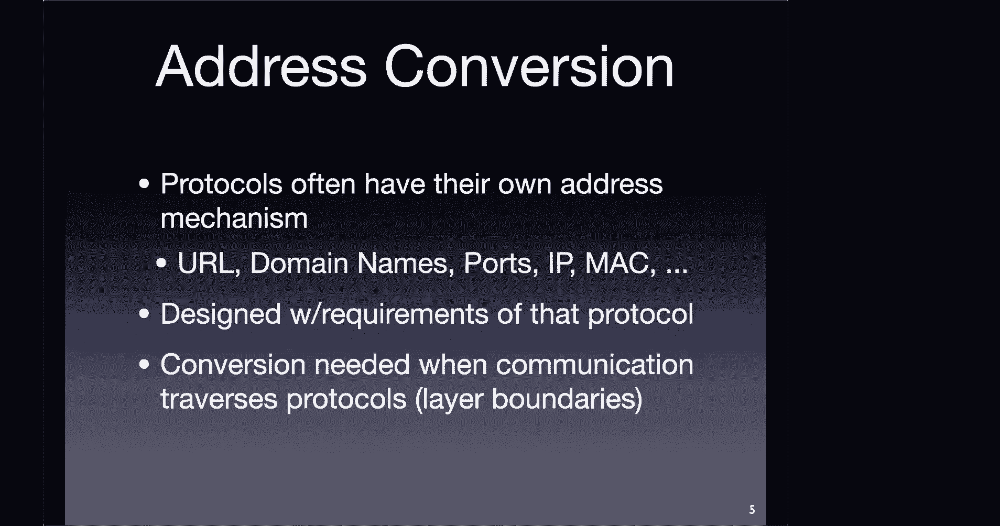
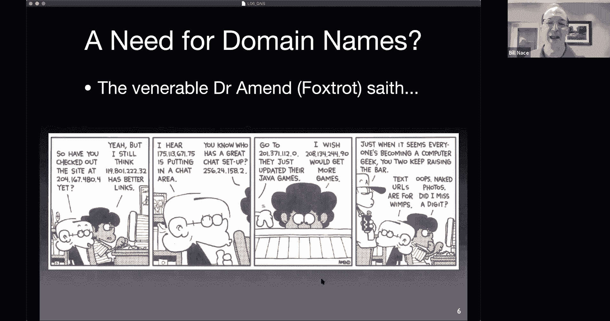

# 6：域名系统 (DNS) 🏷️

在本节课中，我们将学习域名系统 (DNS)。DNS 是互联网的关键组成部分，它负责将人类可读的域名（如 `www.cmu.edu`）转换为计算机使用的 IP 地址（如 `128.2.42.52`）。我们将探讨 DNS 的服务、数据结构和协议，理解它如何作为一个分布式数据库系统工作，并了解其核心功能。

上一节我们介绍了应用层及其协议 HTTP，它利用对传输层的理解来优化性能。本节中我们来看看另一个至关重要的应用层协议——DNS，它是让应用程序能够顺利运行的“粘合剂”之一。

## DNS 概述与背景

DNS 是一个地址转换协议。我们需要认识到，网络协议栈的每一层都有自己的地址格式。例如，应用层有 URL 和域名，传输层有端口号，网络层有 IP 地址，数据链路层有 MAC 地址。这些地址的设计都是为了满足其所在协议层的特定需求，因此不存在一个通用的“万能地址”。这意味着数据在不同层之间传递时，经常需要进行地址转换，DNS 就是完成这种转换的关键服务。

对于人类用户而言，使用名称（如域名）比使用数字（如 IP 地址）更加直观和方便。名称是人类可读的字符串，但计算机更倾向于处理数字标识符。因此，DNS 的核心任务就是在域名和 IP 地址之间进行映射。

DNS 这个术语在不同语境下可以指代三件事物：
1.  **服务**：提供域名到地址映射的目录服务。
2.  **数据**：一个庞大的、分布式的数据库系统，存储着全球的域名信息。
3.  **协议**：用于查询和响应这些信息的通信规则。

DNS 历史悠久，早在万维网出现之前就已存在，用于支持早期的互联网服务（如电子邮件、文件传输）。其设计规范最初由 RFC 1034 和 RFC 1035 定义，至今已扩展出数百个相关 RFC，以应对新的需求和安全挑战。

## DNS 的核心功能

DNS 的核心使命是将域名映射为 IP 地址。例如，查询 `www.ini.cmu.edu` 会返回对应的 IP 地址。

此外，DNS 还提供其他重要功能：

以下是 DNS 的主要功能列表：
*   **别名**：允许为一个实体设置多个名称。正式名称称为**规范名**，其他名称称为**别名**。例如，CMU 官网的真实服务器名可能很长，但我们可以通过别名 `www.cmu.edu` 轻松访问。
*   **邮件服务器定位**：DNS 可以查询组织的邮件交换服务器地址。当发送电子邮件到 `someone@andrew.cmu.edu` 时，邮件系统会通过 DNS 查找负责处理 `andrew.cmu.edu` 邮件的服务器列表。
*   **负载分发**：DNS 协议内置了简单的负载均衡机制。当为一个服务（如 Web 或邮件服务器）配置多个后端服务器地址时，DNS 服务器在响应查询时会轮转这些地址的顺序，从而将用户请求分散到不同的服务器上。

## DNS 协议机制

DNS 采用简单的查询-应答机制。客户端发送一个查询问题，服务器返回一个应答。

DNS 消息通常通过 **UDP** 协议在 **53 号端口** 发送。这是一个关键的设计决策。虽然 TCP 提供可靠性，但 DNS 选择 UDP 主要出于对**低延迟**的考虑。DNS 查询通常是短暂的、一次性的交互，如果使用 TCP 需要经历三次握手建立连接，会引入额外的延迟。对于全球性的基础服务，降低每次查询的延迟至关重要。当然，当传输的数据量很大（如区域传输）或响应报文超过 UDP 承载能力时，DNS 也会使用 TCP。

DNS 查询和应答报文共享基本相同的格式。报文中包含一个标识字段、一些标志位（其中一位指明是查询还是应答）、问题部分、应答部分、权威部分和附加信息部分。

## 总结

本节课中我们一起学习了域名系统。我们了解到 DNS 不仅仅是一个简单的“电话簿”，它是一个复杂的分布式数据库系统，提供域名到 IP 地址的映射、别名支持、邮件服务器定位和负载分发等功能。其协议基于高效的查询-应答模型，并主要使用 UDP 传输以追求低延迟。理解 DNS 的工作原理对于理解互联网如何将人类友好的名称转换为机器可路由的地址至关重要。