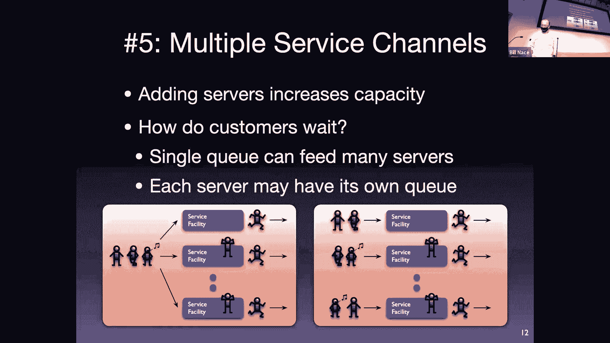
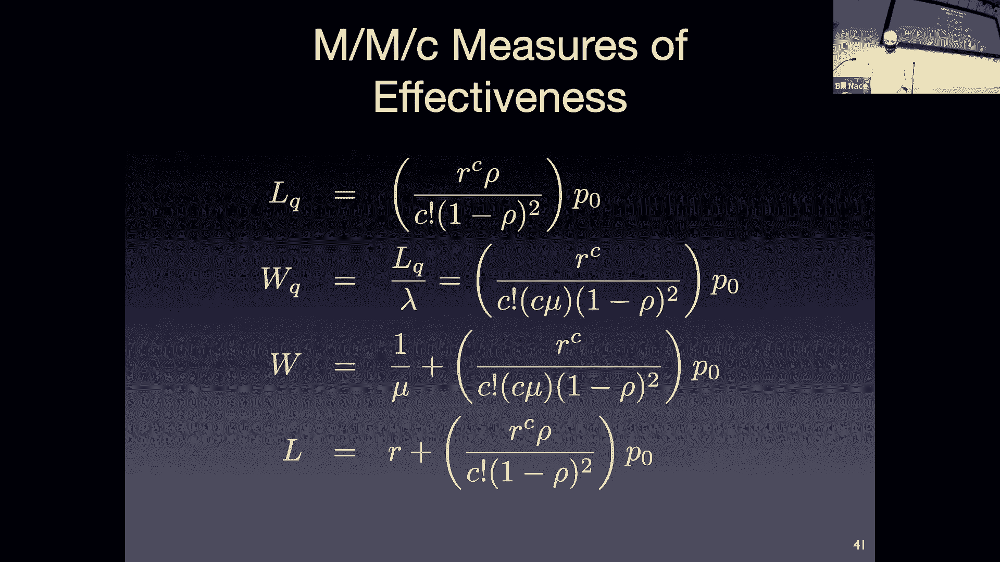

# 8：排队论

在本节课中，我们将要学习一个相当有趣且具有一定挑战性的主题——排队论。这是本学期数学内容最密集的部分之一。不过请不要担心，这里的数学并不困难，我们主要会涉及一些求和、乘积符号以及概率概念。我们的目标不是将大家培养成排队论专家，而是向大家介绍这个在网络工程师工具箱中非常重要的工具。排队论不仅用于分析和构建网络系统，预测其性能，也适用于操作系统负载分析等其他场景。

在开始之前，有几个管理事项需要说明。下一节课将是测验，测验将通过Canvas平台进行。网站上现已发布学习指南，它汇总了每节课的学习目标，是测验内容的参考范围。测验将涵盖包括今天排队论在内的所有已学内容。测验为闭卷，但会提供包含今天所有公式的参考表。测验中无需使用计算器，数字会经过精心选择以便计算。此外，还有一份作业在测验后一天截止，实验一也已发布。

## 排队论概述 🧑‍💼

排队论研究的是这样一种过程：顾客（或数据包）以某种随机方式到达一个服务能力有限的服务设施。如果服务设施已被占用，新到的顾客就需要排队等待。这个过程在现实生活中随处可见，如超市收银台、银行柜台等。在网络中，这通常对应数据包到达路由器，路由器处理能力有限，数据包需要排队等待处理。

排队系统通常有六个关键特征需要考虑，这些特征决定了适用于该系统的数学模型。

## 排队系统的六个特征 📋

以下是描述一个排队系统时需要明确的六个方面：

1.  **到达模式**：顾客如何到达系统。通常是随机的（随机的），我们无法预知具体到达时间，但可以描述其概率分布。平均到达率（λ）是一个可测量的参数。到达模式可以是平稳的（不随时间变化），也可以是成批到达的。
2.  **服务模式**：服务设施如何为顾客服务。服务时间通常也是随机的，平均服务率（μ）是可测量的。服务模式可以是状态相关的（服务速度取决于系统中顾客数量），也可以是平稳的。
3.  **排队规则**：顾客从队列中被选出来服务的顺序。最常见的是先进先出（FIFO），但也可能是后进先出（LIFO）、随机选择或基于优先级的规则。
4.  **系统容量**：系统能容纳的顾客总数（包括正在服务的和排队的）。在实际系统和网络路由器中，队列长度（缓冲区大小）总是有限的，但为了简化分析，有时会假设容量无限。
5.  **服务通道数量**：并行工作的服务设施数量。例如，银行有多个柜员，路由器有多个处理核心。这用参数 **C** 表示。
6.  **顾客源数量**：潜在顾客的总数。通常假设为无限。

## 肯德尔记号 📝

为了简洁地描述排队系统的类型，我们使用肯德尔记号。其通用格式为：**A/B/C[/D/E]**。
*   **A** 表示到达间隔时间的分布（如 M 表示马尔可夫/指数分布，D 表示确定型）。
*   **B** 表示服务时间的分布（同样，M、D 等）。
*   **C** 表示服务通道的数量。
*   **D** （可选）表示系统容量。
*   **E** （可选）表示顾客源数量或排队规则（如 FIFO、LIFO）。

例如，**M/M/1** 表示到达间隔时间和服务时间都服从指数分布、只有一个服务通道的系统。**G/G/1** 则表示对到达和服务分布没有特定假设的单通道通用系统。

## 关键参数与利特尔定律 ⚖️

上一节我们介绍了描述排队系统的特征和记号。本节中，我们来看看用于量化分析的关键参数和一条基本原理。

首先定义几个核心参数：
*   **λ**：平均到达率（顾客/秒）。
*   **μ**：单个服务通道的平均服务率（顾客/秒）。
*   **C**：服务通道数量。
*   **ρ**：流量强度，计算公式为 **ρ = λ / (C * μ)**。这是衡量系统繁忙程度的关键指标。为保证系统稳定，必须满足 **ρ < 1**。

我们关心系统的性能指标，例如：
*   **L**：系统中顾客的平均数量（包括排队和正在服务的）。
*   **L_q**：队列中顾客的平均数量（仅排队）。
*   **W**：顾客在系统中的平均逗留时间（排队时间 + 服务时间）。
*   **W_q**：顾客在队列中的平均等待时间。

这些指标之间通过**利特尔定律**联系起来，这是一个非常强大且通用的定律：
*   对于整个系统：**L = λ * W**
*   仅对于队列：**L_q = λ * W_q**

此外，平均逗留时间等于平均等待时间加上平均服务时间：**W = W_q + (1/μ)**。

## M/M/1 排队模型 📊

利特尔定律适用于任何排队系统。为了得到更具体的性能指标公式，我们需要对系统做出更多假设。本节我们来看一个最经典且分析简便的模型：M/M/1 模型。

M/M/1 模型假设：
1.  到达过程是泊松过程（即到达间隔时间服从指数分布），平均到达率为 **λ**。
2.  服务时间服从指数分布，平均服务率为 **μ**。
3.  只有一个服务通道（C=1）。
4.  系统容量无限，顾客源无限，排队规则为 FIFO。

在这些假设下，我们可以推导出系统状态（有 n 个顾客）的概率：
*   **P_n = (1 - ρ) * ρ^n**，其中 **ρ = λ / μ**。

进而，我们可以得到一系列简洁的性能指标公式（也称为“效能度量”）：
*   系统中平均顾客数：**L = ρ / (1 - ρ) = λ / (μ - λ)**
*   队列中平均顾客数：**L_q = ρ^2 / (1 - ρ) = λ^2 / [μ(μ - λ)]**
*   系统中平均逗留时间：**W = 1 / (μ - λ)**
*   队列中平均等待时间：**W_q = ρ / (μ - λ) = λ / [μ(μ - λ)]**

这些公式非常优雅，只需测量 **λ** 和 **μ**，就能轻松估算系统性能。

## M/M/c 排队模型 🏦

上一节我们分析了单服务通道的 M/M/1 模型。在实际中，像银行或有多核处理器的路由器，往往有多个并行服务通道。本节中我们来看看 M/M/c 模型。

M/M/c 模型扩展了 M/M/1，它拥有 **c** 个相同的服务通道。到达过程和服务时间分布的假设与 M/M/1 相同。其状态转移图与 M/M/1 类似，但服务率在状态小于 c 时是变化的（例如，状态2时有2个通道工作，服务率为 2μ），直到状态达到或超过 c 时，服务率稳定为 **cμ**。

M/M/c 模型的公式比 M/M/1 复杂一些，但核心思想相同。例如，系统中顾客数为零的概率 **P_0** 的计算公式更复杂：
*   **P_0 = [ Σ_{k=0}^{c-1} ( (cρ)^k / k! ) + ( (cρ)^c / (c! (1-ρ)) ) ]^{-1}**，其中 **ρ = λ / (cμ)**。

系统中平均顾客数 **L** 的公式也更为复杂，但一旦计算出 **P_0**，其他指标如 **L_q**、**W**、**W_q** 都可以通过利特尔定律等关系推导出来。尽管公式复杂，但它们允许我们分析多通道系统的性能，并帮助决定需要配置多少个服务通道。

## 总结与测验准备 ✅

本节课我们一起学习了排队论的基础知识。我们首先了解了排队系统的六个特征和用于分类的肯德尔记号。然后，我们学习了关键参数（λ， μ， ρ）和适用于所有排队系统的利特尔定律。接着，我们深入分析了两种具体模型：单通道的 M/M/1 模型和多通道的 M/M/c 模型，并得到了计算平均队列长度、等待时间等性能指标的公式。

对于即将到来的测验，重点在于理解概念、参数含义以及不同公式的适用场景（例如，知道利特尔定律是通用的，而 M/M/1 的公式仅适用于特定模型）。测验中会提供公式表，大家需要能够根据问题描述选择合适的公式并应用。请利用复习课程和 Piazza 论坛解决疑问。

祝大家周末愉快，测验顺利！

