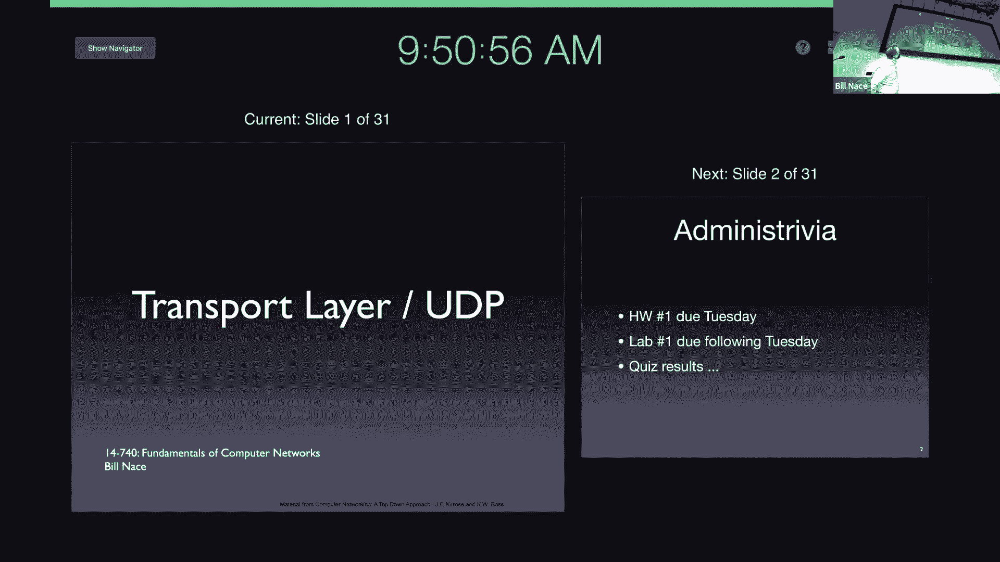
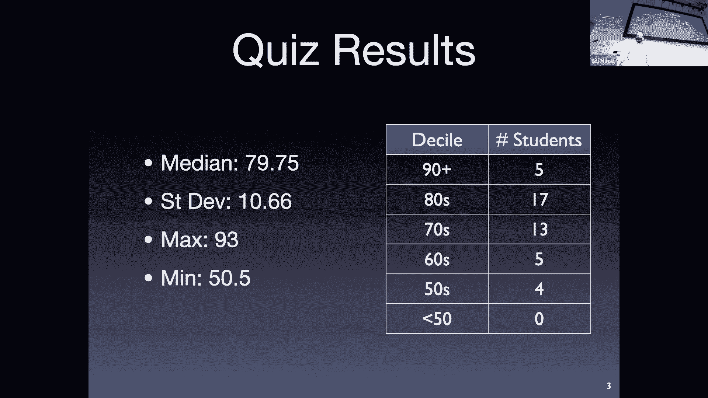
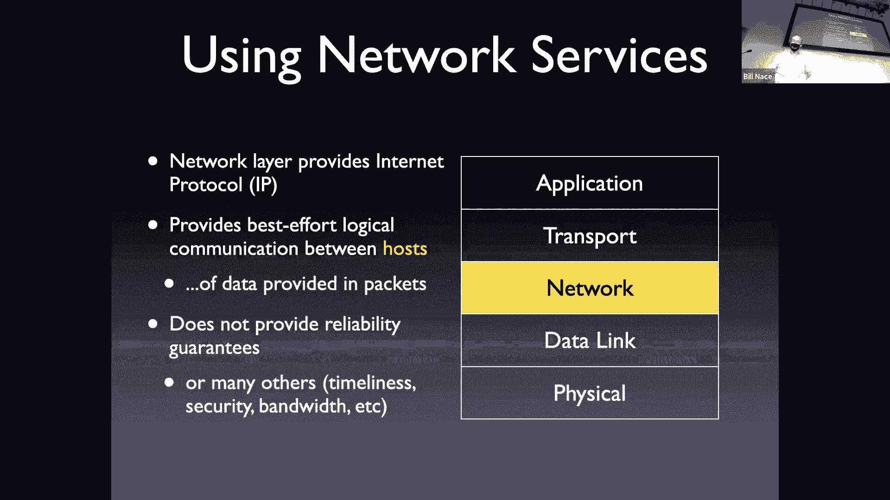
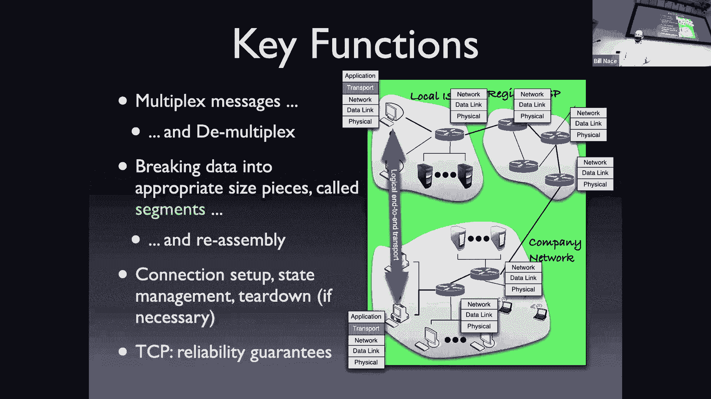
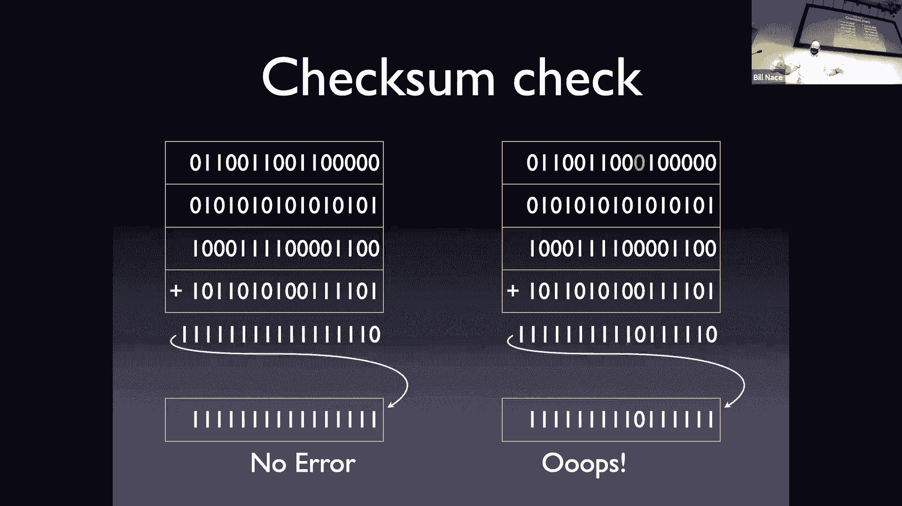

# 9：传输层与UDP

在本节课中，我们将要学习计算机网络体系结构中的传输层。传输层负责在运行于不同主机上的应用程序之间建立逻辑连接。我们将首先了解传输层的通用功能和职责，然后深入探讨一个具体的、简单的传输层协议：用户数据报协议（UDP）。

## 课程概述与回顾

上一节我们完成了应用层的学习和一次测验。现在，是时候向下进入传输层了，这将是今天的目标。

在开始之前，需要提醒几件即将到来的事项：周二有作业截止，并且下周四没有课，实验报告将在再下一个周二截止。这意味着接下来两次课，大家都会有刚提交的任务。

关于上次的测验，整体进行得比预期顺利。测验的中位数是79%，最低分是50.5%，这是第一次在图表底部看到0分，这是个好现象。但请不要仅仅满足于自己的分数。请务必回顾测验，查看做错的题目，思考错误原因。这是学习过程中至关重要的反馈环节，有助于巩固网络知识并改进未来的应试技巧。在14740课程中，成绩复核请求是无风险的。如果发现评分有误，请通过Piazza私信告知，我们很乐意核查。根据课程政策，你有一周的时间提出复核请求。

## 传输层的使命与核心功能

现在，我们深入下一层。我们已经完成了应用层，是时候看看应用层所依赖的服务是如何在传输层实现的。

传输层的使命是建立连接。应用层要求将消息从一个计算机上运行的应用程序传送到另一个计算机上运行的应用程序，传输层就负责完成这个任务，即在这两个应用程序之间建立逻辑连接。之所以称为“逻辑”连接，是因为通常在这些应用程序之间并没有直接的物理线路。

当然，传输层并非独立完成所有工作，它会利用其下一层——网络层——提供的服务。网络层负责连接主机，确保数据能从一台计算机传送到另一台计算机。传输层代码运行在发送方和接收方计算机上。当应用程序说“我有一个HTTP消息要发送给那个应用程序”时，本机的传输层软件会接收这些数据，交给网络层并说“请把它送到那台计算机”（而不是直接送到应用程序）。网络层确保数据到达目标计算机，然后交给那台计算机上的传输层代码，由传输层代码负责将数据传递给正确的应用程序。

那么，传输层需要完成哪些关键功能来实现其职责、建立逻辑连接呢？以下是任何传输层协议几乎都必须完成的两大关键功能。

### 功能一：复用与解复用

我们需要能够复用和解复用消息。这意味着我的笔记本电脑上会运行许多应用程序，它们都想要发送数据。这些数据都会汇入传输层的同一段代码。同样，作为接收方，网络层会给我们送来给笔记本电脑上许多应用程序的数据，我们需要解复用这些数据，以便将它们安排给正确的应用程序。

传输层还需要一种机制来标记或编号这些应用程序，即需要一个应用程序的寻址机制。在大多数传输协议中（尤其是TCP和UDP），使用的寻址机制是**端口号**的概念。端口号是一个16位的无符号整数，范围从0到65535。其中一些号码被预留用于众所周知的服务，例如Web服务器通常使用端口80（HTTP）或443（HTTPS）。这些端口号由互联网号码分配机构管理，以确保不会冲突。

需要理解的是，TCP和UDP是两种独立的协议，它们有各自独立的端口号空间。网络层在收到数据包时，会根据协议类型（如TCP或UDP）将其交给相应的传输层软件处理。因此，TCP的端口80和UDP的端口80不会冲突，因为处理它们的是两套不同的代码。

以下是关于端口号的一些关键点：
*   **绑定**：应用程序需要通过一个称为“绑定”的过程，将自己与一个特定的端口号关联起来，这样传输层才知道该将数据发送给哪个应用程序。
*   **临时端口**：客户端应用程序通常使用临时端口，由传输层动态分配，用于发送数据。每次运行时可能获得不同的端口号。
*   **唯一性**：在运行时，端口号在单台主机上对于特定协议必须是唯一的，以确保数据能准确送达。

### 功能二：分段

传输层负责处理来自应用层的、任意大小的消息。例如，一个要观看的视频文件可能非常庞大。传输层需要将这个单一的大消息分割成适合在网络中传输的小块，这个过程称为**分段**。每个小块称为一个**段**，会被独立处理。

虽然分段会增加一些头部开销，但回想我们在早期课程中讨论过的存储转发网络，将大消息分割成小段进行流水线传输，实际上能带来更高的网络性能。

## 用户数据报协议详解

以上是传输层的通用概念。现在，让我们来看一个具体的传输层协议。今天我们先学习简单的一个，因为TCP需要花费四到五节课来详细讲解。

UDP，即用户数据报协议。首先，“数据报”是一个基本等同于“分组”的术语。UDP是一个极其简单、无额外功能的传输层协议。它本质上只是提供了对网络层数据包的直接访问。UDP段几乎就直接成为网络层的分组。

### UDP的设计目标与特点

UDP是一个古老的协议（RFC 768），其设计目标非常明确：提供最基础的服务。它不提供网络层本身所没有的任何额外保证。具体特点如下：
*   **无连接**：无需建立连接即可发送数据。
*   **不可靠**：除了基础的校验和外，不提供数据丢失、重复或顺序错乱的保证。网络层尽力而为，UDP也如此。
*   **无拥塞控制**：发送方可以任意速率发送数据，没有TCP那样的拥塞控制机制。
*   **头部开销小**：UDP头部非常简单，只有8个字节。

### 为何使用UDP？

既然UDP如此“简陋”，为何还要使用它？主要原因在于，TCP提供的可靠性保证（如丢包重传）并不适合所有应用场景。
*   **实时应用**：如语音通话（Zoom）、视频流。对这些应用而言，**延迟比丢包更糟糕**。TCP的重传机制会引入额外延迟，而UDP允许应用直接处理丢包（如重复上一帧画面）。
*   **自定义可靠性**：如DNS。DNS希望查询失败时能重试另一个冗余的服务器，而不是TCP那样重传给同一个服务器。使用UDP可以让应用层自己实现更灵活的重传逻辑。

因此，选择UDP通常不是因为它的“简单”或“无连接”，而是因为应用有**不同于TCP的可靠性或时序需求**。

### UDP数据段格式

每个协议都需要定义其消息格式。UDP采用固定格式，其头部包含四个字段，每个16位（2字节）：
1.  **源端口号**：发送方应用程序的端口。
2.  **目的端口号**：接收方应用程序的端口。
3.  **长度**：指整个UDP数据段（头部+数据载荷）的长度，单位为**字节**。
4.  **校验和**：用于检测数据在传输过程中是否出现比特差错。

### 校验和算法详解

校验和是UDP提供的唯一差错检测机制。其目标是让接收方能够发现传输过程中发生的比特错误。

**发送方计算步骤：**
1.  **求和**：将整个UDP段（在计算时校验和字段先置为0）视为一系列16位的字（word）。将所有16位字相加（二进制加法）。
2.  **处理进位**：如果加法过程中产生超出16位的进位（即第17位），将这个进位“回卷”到最低位并继续相加。重复此过程直到没有进位。
3.  **取反**：对最终得到的16位和值进行按位取反（0变1，1变0）。结果即为**校验和**，填入UDP头部的校验和字段。

**接收方验证步骤：**
1.  **求和**：接收方将收到的整个UDP段（包括校验和字段）的所有16位字相加。
2.  **处理进位**：同样处理所有进位回卷。
3.  **检查结果**：如果最终结果的所有16位**全为1**（即二进制`1111111111111111`），则认为数据在传输过程中没有出错。否则，数据段有误，应被丢弃。

**算法示例：**
假设有一个极短的UDP段，包含三个16位字（例如，来自源端口、目的端口和长度字段的某些值）。发送方计算这三个字的和，取反后得到校验和。接收方收到四个16位字（原始三个字加上校验和），将它们全部相加。如果计算正确，最终结果将是全1。

**校验和的能力与局限：**
*   **能力**：可以检测**任何单个比特的错误**，以及**部分多个比特的错误**。
*   **局限**：无法检测所有错误模式。例如，如果两个不同16位字中相同位置的比特同时发生翻转，校验和可能无法发现。
*   **设计权衡**：校验和算法在差错检测能力、计算开销（简单的加法）和额外数据开销（仅16位）之间取得了平衡。对于大多数情况，它被认为是“足够好”的。如果应用需要更强的可靠性，可以在UDP的数据载荷中实现自己的差错控制机制。

### 关于UDP的常见问题澄清

*   **错误处理**：如果校验和检测到错误，UDP唯一能做的就是丢弃该数据段。不会重传，也不会影响其他数据段。
*   **数据完整性**：UDP不保证数据顺序、不防止丢包、不防止重复。应用必须能容忍这些情况，或自行在应用层处理。
*   **长度字段错误**：如果长度字段在传输中出错，校验和计算也会将其捕获，从而导致数据段被丢弃。

## 本节总结

本节课我们一起学习了传输层的基础知识和UDP协议。

首先，我们明确了传输层的核心使命是在不同主机的应用程序间建立逻辑连接，并依赖于网络层的服务。传输层必须完成两个通用功能：**复用/解复用**（通过端口号寻址应用程序）和**分段**（将大应用消息分割成适合网络传输的段）。

接着，我们深入研究了**用户数据报协议**。UDP是一个极其简单的无连接传输协议。我们了解了它的特点：不可靠、无拥塞控制、头部开销小。选择UDP的关键原因通常是应用需要避开TCP的可靠性保证（如重传带来的延迟），例如在实时流媒体或DNS中。

我们详细剖析了UDP数据段格式，特别是其**校验和**算法。你应当理解校验和的计算与验证过程，以及它在端到端差错检测中的作用和局限性。

最后，我们讨论了使用UDP时应用需要面对的问题：数据可能丢失、重复、失序。如果应用无法容忍这些，则不应使用UDP，或者需要在应用层实现额外的控制逻辑。

通过本课，你应该能够解释传输层的基本职责，说明UDP的用途与优缺点，并理解其校验和机制的原理。