# 10：可靠传输原理 🛠️

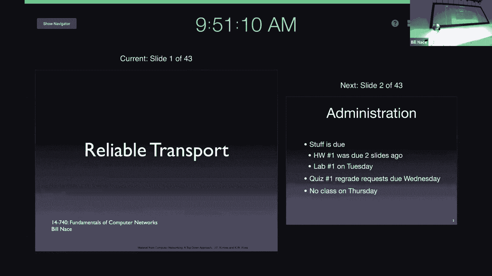

在本节课中，我们将学习构建可靠数据传输协议所需的核心工具和概念。我们将从最简单的协议开始，逐步引入更复杂的机制，为后续学习TCP协议打下坚实基础。

## 概述

可靠数据传输的目标是让网络表现得像一个可靠的通道。我们希望数据能够无差错、不丢失、不重复且按序地从发送方传递到接收方。然而，底层网络存在比特错误、丢包、重复和乱序等问题。本节课将介绍一系列工具（如确认、定时器、重传、序列号和滑动窗口），并通过几个学术协议（如停等协议、回退N步协议和选择重传协议）来演示这些工具如何协同工作，以克服网络中的故障。

## 故障模型与核心工具

上一节我们介绍了可靠传输的目标。为了达成这些目标，我们首先需要明确要防范哪些网络故障，并了解可用的工具。

我们关注的网络故障模型包括：
*   **比特错误**：数据在传输过程中某些比特位发生改变。
*   **丢包**：数据包或确认包在传输过程中完全丢失。
*   **重复交付**：接收方收到同一个数据包的多个副本。
*   **乱序交付**：数据包到达接收方的顺序与发送顺序不一致。

为了应对这些故障，我们拥有以下核心工具：
*   **接收方反馈**：接收方发送确认（ACK）或否定确认（NAK）消息，告知发送方数据接收状态。
*   **差错检测**：使用**校验和**等数学方法，验证接收到的数据是否与发送时一致。
*   **定时器**：发送方设置软件定时器，用于检测数据包或确认包是否丢失。
*   **重传**：当怀疑数据包未成功送达时，发送方从缓冲区中取出副本再次发送。
*   **序列号**：为每个数据包分配一个唯一编号，用于识别数据包是新数据还是重复数据。
*   **窗口与流水线**：允许发送方在收到确认前连续发送多个数据包，以提高网络利用率。

## 停等协议：版本演进

本节中，我们通过停等协议的三个版本来具体看看这些工具是如何被引入和使用的。停等协议是最简单的可靠传输协议，其核心思想是发送方每发送一个数据包后，必须等待确认，才能发送下一个。

### 版本1：基础反馈

第一个版本引入了接收方反馈和差错检测。

以下是发送方和接收方需要遵循的规则：
*   **发送方规则**：
    1.  从应用层获取数据，封装成段。
    2.  发送该数据段。
    3.  等待接收方反馈。
    4.  若收到ACK，则发送下一个数据段。
    5.  若收到NAK，则重传当前数据段。
*   **接收方规则**：
    1.  等待数据段到达。
    2.  计算校验和。
    3.  若校验和正确，则向发送方发送ACK，并将数据交付给应用层。
    4.  若校验和错误，则向发送方发送NAK。

**问题**：此版本无法处理ACK或NAK消息本身在传输中损坏的情况。

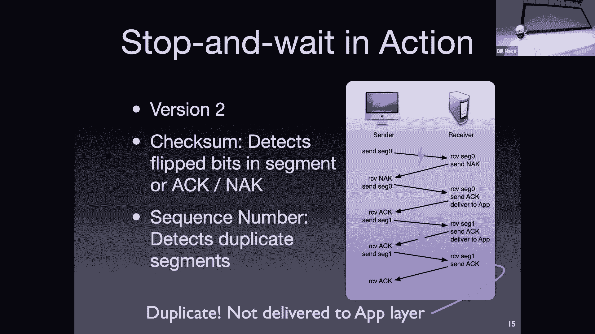

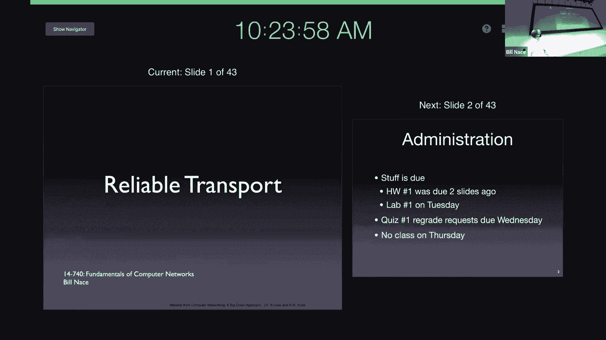

### 版本2：处理损坏的反馈

为了解决反馈消息损坏的问题，我们为反馈消息也添加校验和，并引入序列号来区分数据包。

规则更新如下：
*   **发送方规则**：
    1.  发送数据段时，为其分配一个序列号（例如，0或1）。
    2.  发送数据段，并保留副本。
    3.  等待反馈。
    4.  若收到**校验和正确**的ACK，且ACK中的序列号匹配，则发送下一个数据段。
    5.  若收到损坏的反馈（校验和错误）或NAK，则重传当前数据段。
*   **接收方规则**：
    1.  接收数据段并检查校验和。
    2.  若校验和正确，则发送带有对应序列号的ACK，并将数据交付应用层（如果是新数据）。
    3.  若校验和错误，则发送NAK。

**关键点**：序列号使得接收方能够识别重传的数据包是重复的，从而避免将相同数据重复交付给应用层。

**问题**：此版本仍无法处理数据包或确认包完全丢失的情况。

### 版本3：处理丢包——引入定时器

为了检测丢包，我们引入定时器工具。

规则进一步更新：
*   **发送方规则**：
    1.  发送数据段（带序列号）后，**启动一个定时器**。
    2.  若在定时器超时前收到正确的ACK，则**取消定时器**，发送下一个数据段。
    3.  若收到NAK或损坏的反馈，则**重启定时器并重传**当前数据段。
    4.  若**定时器超时**，则重传当前数据段（并重启定时器）。
*   **接收方规则**：与版本2相同。

**关键点**：定时器超时是发送方推断数据包可能丢失的唯一方式。发送方无法区分是数据包丢失还是ACK丢失。

**效率问题**：停等协议在等待ACK期间链路空闲，利用率很低。利用率公式为：
`利用率 = (L/R) / (RTT + L/R)`
其中 `L` 是数据包长度，`R` 是链路速率，`RTT` 是往返时间。在长延迟或高速链路上，效率极低。

## 提升效率：滑动窗口协议

上一节我们看到停等协议效率低下。为了提高效率，我们需要允许发送方在不等待确认的情况下连续发送多个数据包，即采用**流水线**技术。这通过**滑动窗口**协议来实现。

滑动窗口的核心是**带宽时延积（BDP）**，它决定了为了填满管道，最多可以有多少数据“在飞”。公式为：
`BDP = 带宽 * 往返时延`
例如，带宽为1.5 Mbps，RTT为45ms，则BDP约为67.5 Kb。若每个数据段为1KB（8Kb），则窗口大小应约为8个数据段。

### 回退N步协议

GBN协议使用累积确认和单个重传定时器。

以下是GBN协议的工作方式：
*   **发送方**：
    *   维护一个发送窗口，窗口大小 `N`。
    *   可以连续发送窗口内的所有数据包。
    *   为每个发送的数据包启动定时器（但通常只维护一个基于最早未确认包的定时器）。
    *   接收**累积ACK**：收到ACK(n)表示所有序列号小于等于n的数据包都已被正确接收。
    *   如果超时，则**重传所有已发送但未确认的数据包**（即从超时的数据包开始，到窗口内的所有数据包）。
*   **接收方**：
    *   只按序接收数据包。
    *   如果收到乱序的数据包，则将其丢弃，并**重新发送最近按序接收的数据包的ACK**（即累积ACK）。
    *   接收方缓冲区需求小。

**优点**：实现简单，接收方状态少。
**缺点**：单个数据包出错或丢失会导致大量不必要的重传，效率低下。

### 选择重传协议

SR协议通过为每个数据包单独确认和缓存，解决了GBN的缺点。

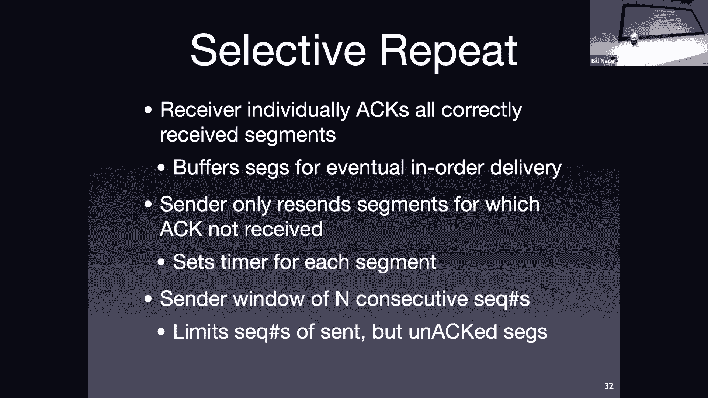

以下是SR协议的工作方式：
*   **发送方**：
    *   维护发送窗口。
    *   为**每个数据包单独设置定时器**。
    *   只重传超时的那个数据包。
    *   收到ACK后，标记该数据包已接收。如果该数据包是窗口最左侧的，则滑动窗口。
*   **接收方**：
    *   维护接收窗口。
    *   **单独确认每个正确接收的数据包**（无论是否按序）。
    *   缓存乱序但正确的数据包。
    *   当按序的数据包到达时，将一批按序数据交付给应用层，并滑动接收窗口。
    *   对于窗口外但序列号在 `[rcv_base - N, rcv_base - 1]` 范围内的数据包（很可能是之前丢失的ACK导致的重传），也必须发送ACK，以防止发送方窗口停滞。

**关键挑战——序列号空间大小**：窗口大小 `N` 和序列号位数必须满足：`序列号空间大小 >= 2 * N`。这是为了避免新旧数据包序列号重叠造成的歧义。例如，如果 `N=4`，则至少需要3位序列号（0-7），因为发送方和接收方的窗口可能完全不重叠，需要区分开所有“在飞”的数据包。

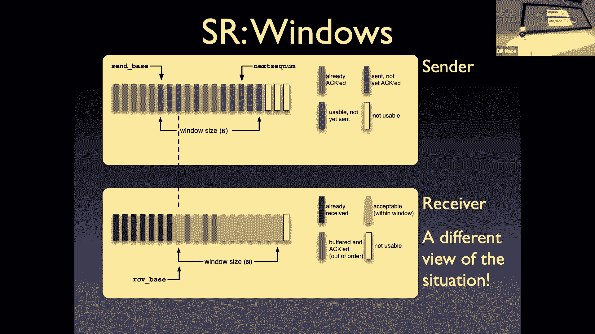

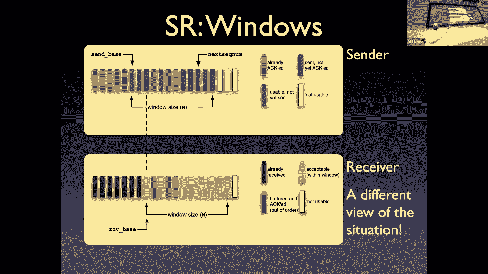

## 总结

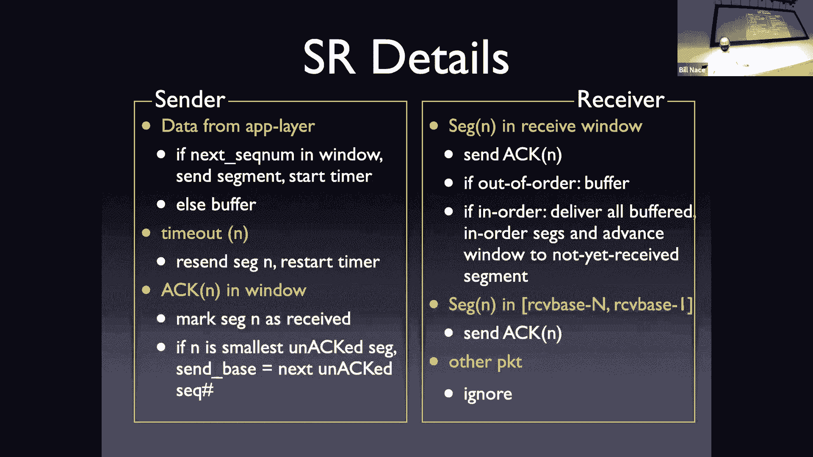

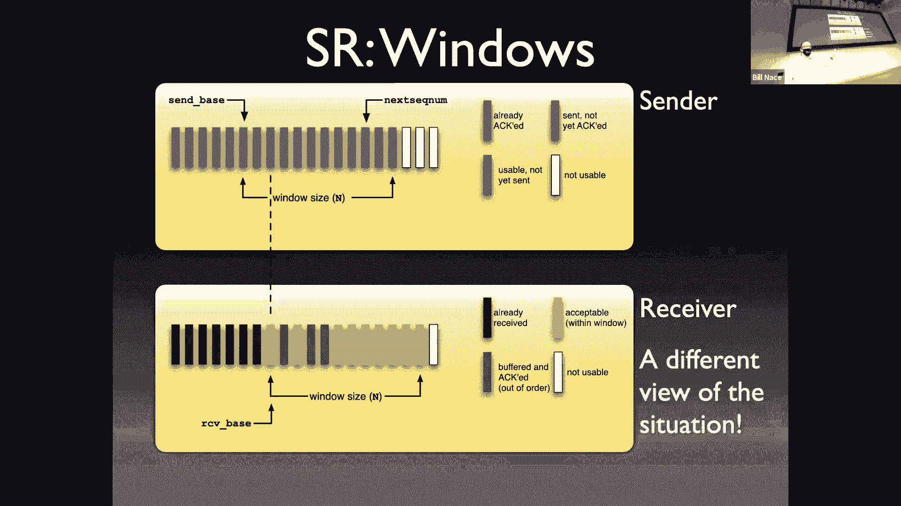

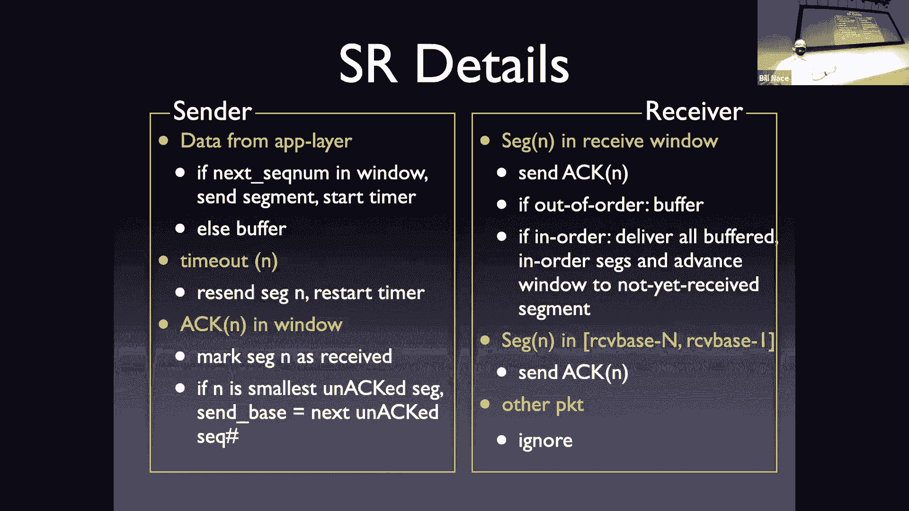

本节课中我们一起学习了可靠数据传输的基本原理和构建模块。

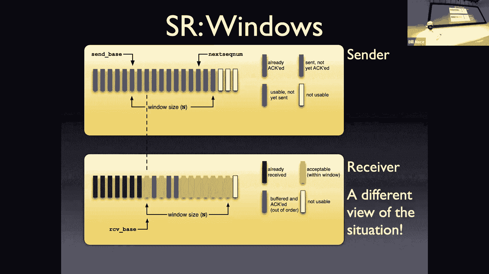

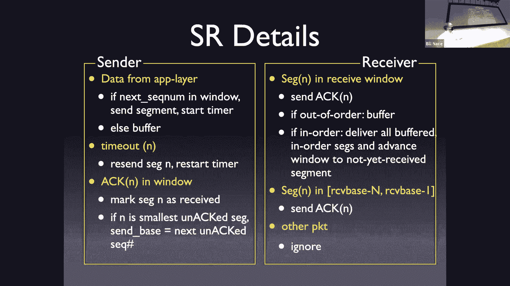

我们首先明确了可靠传输的目标和网络故障模型。然后，我们系统地学习了实现可靠传输的六大工具：**接收方反馈（ACK/NAK）**、**差错检测（校验和）**、**定时器**、**重传**、**序列号**和**滑动窗口**。

通过停等协议（Stop-and-Wait）的三个版本演进，我们看到了如何逐步引入这些工具来处理比特错误、反馈损坏和丢包问题，同时也暴露了其效率低下的根本缺陷。

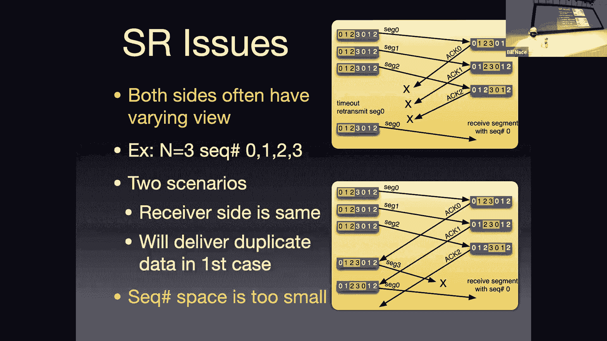

为了提升效率，我们引入了滑动窗口协议，允许流水线发送数据。我们深入分析了两种经典的滑动窗口协议：
1.  **回退N步（Go-Back-N）**：使用累积确认，实现简单，但错误时重传开销大。
2.  **选择重传（Selective Repeat）**：使用单独确认和接收方缓存，效率更高，但实现更复杂，需要仔细设计序列号空间（`序列号空间 >= 2 * 窗口大小`）。

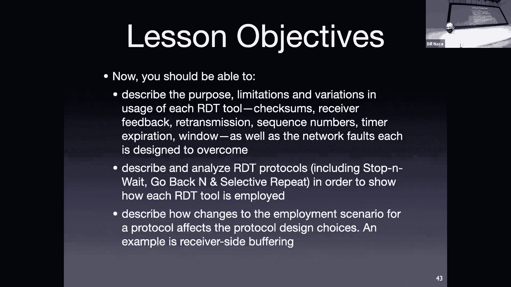

这些学术协议虽然本身不用于实际网络，但它们清晰地展示了核心工具的工作原理和交互方式，为我们理解接下来要学习的、高度优化的工业标准协议——TCP——奠定了坚实的基础。