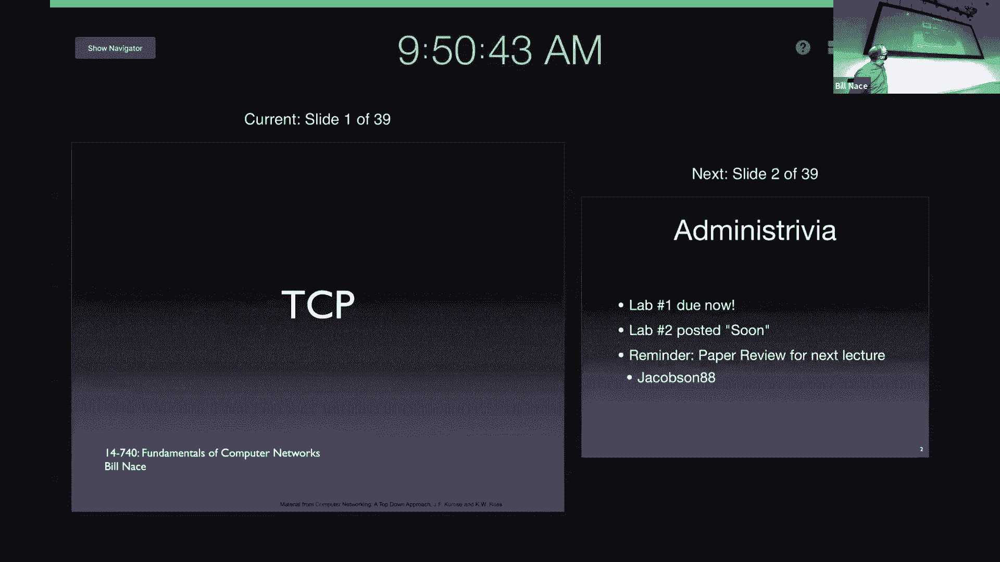
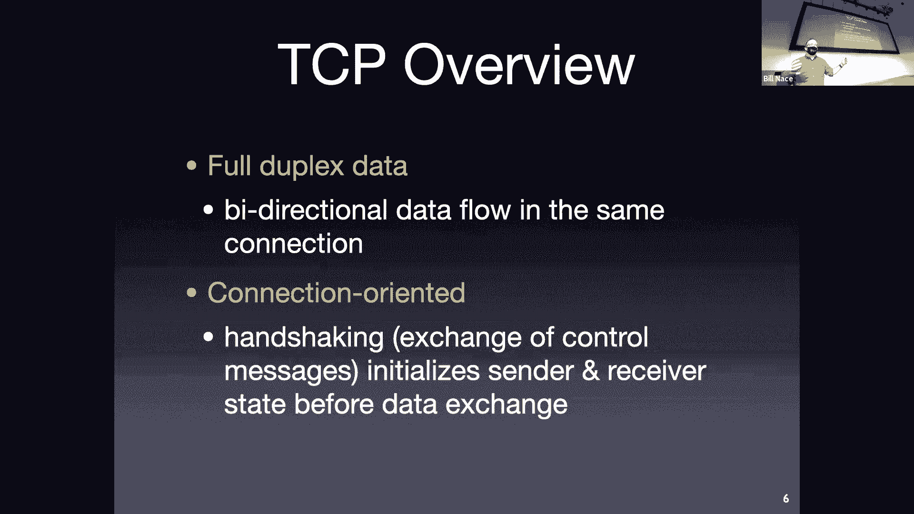
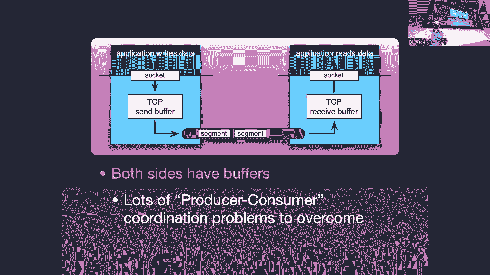
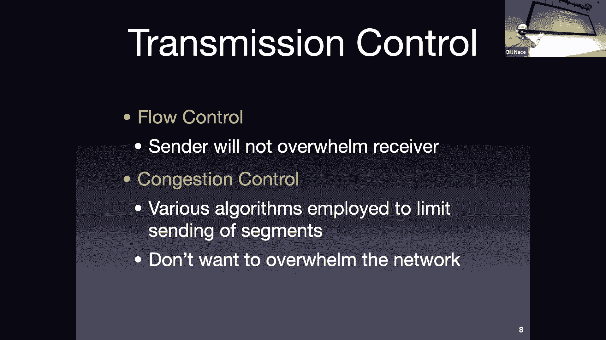
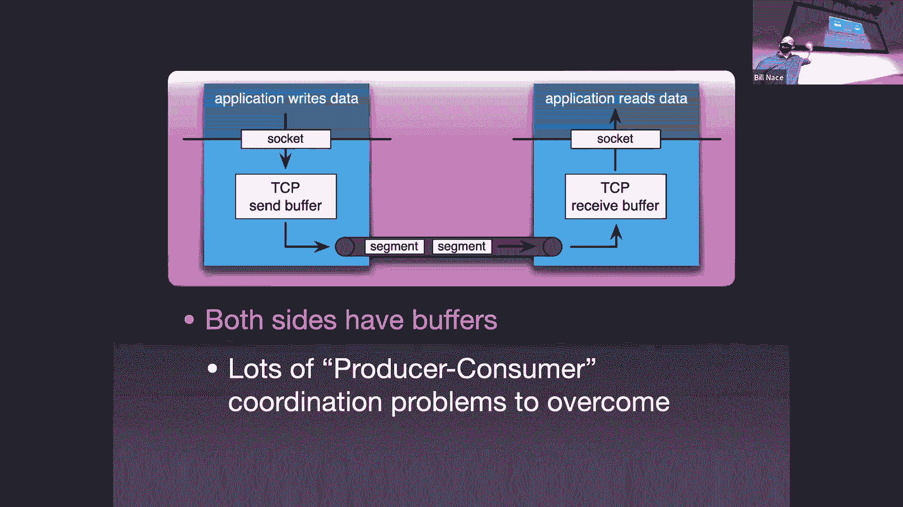
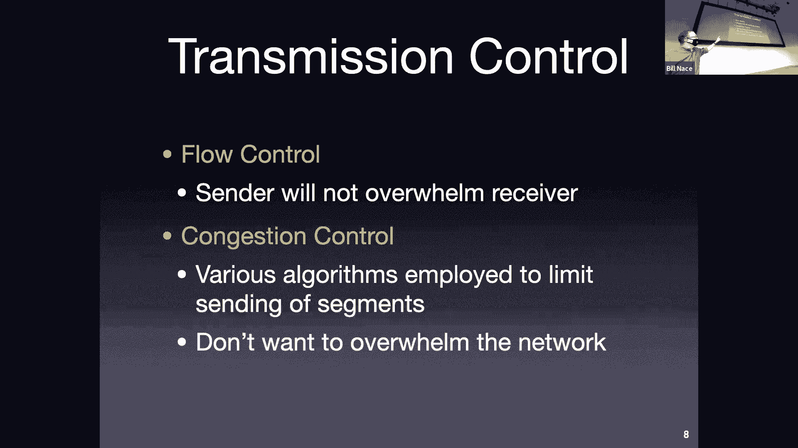
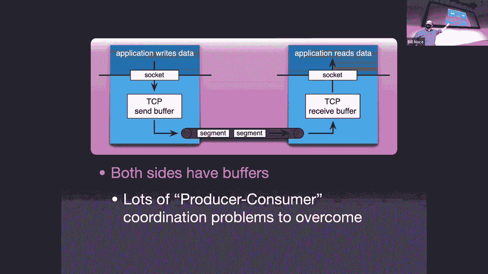
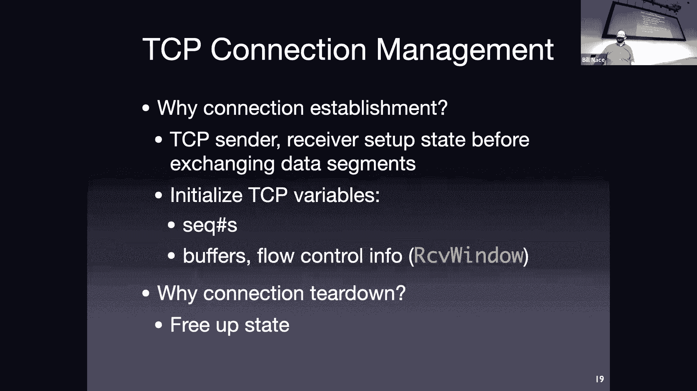
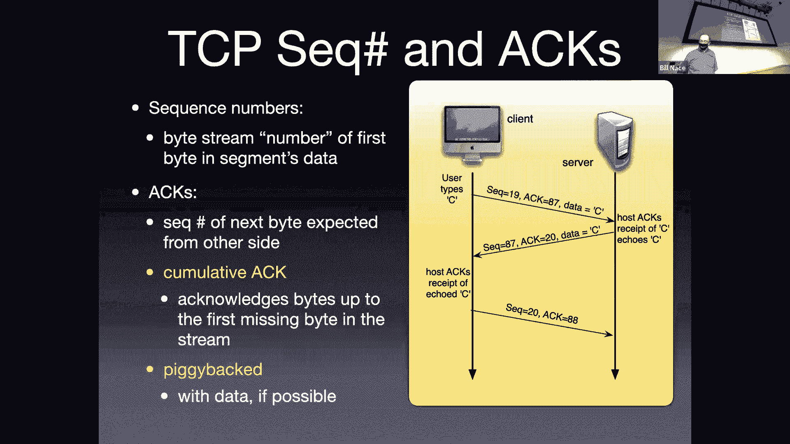
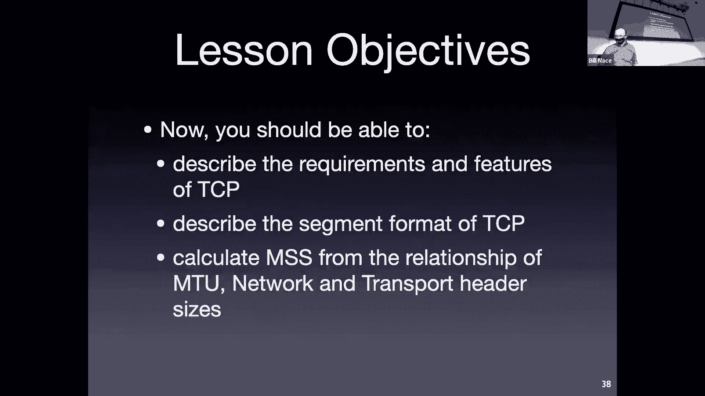

# 11：TCP 协议基础 🚀

在本节课中，我们将要学习传输控制协议（TCP）的基础知识。TCP是互联网中最重要的协议之一，负责在两个端点之间提供可靠、有序的字节流传输。我们将从TCP的核心特性、数据格式、连接管理以及可靠数据传输机制等方面进行详细讲解。

---

## TCP 协议概述 📖

上一节我们介绍了可靠数据传输的基本工具。本节中，我们来看看这些工具如何在一个复杂且广泛使用的协议——TCP中得以应用。

TCP是一个点对点的协议，连接单个发送方和单个接收方。它的核心目标是提供**可靠的数据传输**，确保数据按序、无重复、无丢失地送达。为了实现这一点，TCP使用了我们之前讨论过的多种工具，如序列号、确认、定时器和滑动窗口。

TCP将数据视为一个**有序的字节流**，这意味着应用程序发送的数据没有预定义的结构或记录边界，所有字节都按顺序编号。它也是一个**全双工**的协议，允许连接的两端同时发送和接收数据。此外，TCP是**面向连接**的，在数据传输开始前，通信双方需要通过“握手”过程来同步状态信息。

在传输层，TCP需要管理多个缓冲区来处理发送方、接收方以及网络本身速度不匹配的问题。这引出了两个关键的控制机制：
*   **流量控制**：防止发送方发送数据过快，导致接收方的缓冲区溢出。
*   **拥塞控制**：防止发送方发送数据过快，导致网络中的路由器缓冲区溢出。我们将在后续课程中详细讨论拥塞控制。

---

## TCP 数据段格式 📦

了解了TCP的基本角色后，我们来看看TCP数据段的具体格式。每个TCP数据段都包含一个头部，其中承载了实现协议功能所需的各种信息。

以下是TCP头部各字段的详细说明：

*   **源端口号 (16位) 和 目的端口号 (16位)**：用于标识发送和接收应用程序。这是TCP的寻址方案。
*   **序列号 (32位)**：表示该数据段中**第一个数据字节**在整个字节流中的编号。例如，如果序列号是100，且数据段包含500字节数据，则该数据段包含字节100到599。
*   **确认号 (32位)**：这是一个累积确认。当`ACK`标志置位时，此字段有效。它表示接收方**期望收到的下一个字节的编号**。例如，确认号为600意味着接收方已正确收到字节0-599。
*   **头部长度 (4位)**：指示TCP头部的长度，单位为**32位字**。由于头部最小为20字节（5个字），所以此字段值至少为5。它用于定位可变长的选项字段和数据部分的起始位置。
*   **保留字段 (6位)**：目前未使用。
*   **标志位 (6位)**：
    *   `URG`：紧急指针有效（不常用）。
    *   `ACK`：确认号字段有效。
    *   `PSH`：提示接收方应尽快将数据交付给应用层（不常用）。
    *   `RST`：重置连接（通常表示错误）。
    *   `SYN`：在连接建立时用于同步序列号。
    *   `FIN`：用于释放连接，表示发送方没有更多数据要发送。
*   **接收窗口 (16位)**：用于**流量控制**。接收方通过此字段告知发送方自己当前可用的缓冲区空间大小（单位：字节），发送方不应发送超过此窗口大小的未确认数据。
*   **校验和 (16位)**：用于检测头部和数据在传输过程中的错误。计算方法与UDP相同。
*   **紧急指针 (16位)**：与`URG`标志配合使用，指向数据段中紧急数据的末尾（不常用）。
*   **选项字段 (可变长)**：最多40字节，用于一些扩展功能，例如：
    *   协商最大报文段长度。
    *   窗口缩放因子（用于支持大于64KB的窗口）。
    *   时间戳。

一个重要的概念是**最大报文段长度**。它定义了TCP数据段中**应用层数据的最大长度**，其值由下层网络的**最大传输单元**决定。计算公式为：
`MSS = MTU - IP头部长度 - TCP头部长度`
例如，在标准以太网中，MTU为1500字节，典型的MSS为1460字节。

---

## TCP 连接管理 🤝

TCP是面向连接的协议，这意味着在数据传输前后，需要进行连接的建立和释放。这个过程确保了通信双方状态的同步。

### 连接建立：三次握手

TCP使用“三次握手”来建立连接。这个过程交换三个数据段来同步双方的初始序列号。

以下是三次握手的步骤：

1.  **客户端发送 SYN**：客户端发送一个数据段，将`SYN`标志置为1，并选择一个**随机初始序列号**（例如，`seq = x`）。此数据段不携带应用数据。
2.  **服务器发送 SYN-ACK**：服务器收到SYN后，如果同意建立连接，则回复一个数据段。该数据段将`SYN`和`ACK`标志均置为1。`ACK`号字段设置为`x+1`，同时服务器也选择一个**自己的随机初始序列号**（例如，`seq = y`）。
3.  **客户端发送 ACK**：客户端收到SYN-ACK后，发送最后一个确认数据段。将`ACK`标志置为1，确认号设置为`y+1`（`ack = y+1`）。此时，连接建立完成。**这个数据段可以开始携带应用数据**。

> **为什么使用随机初始序列号？**
> 主要是为了防止“旧连接的重复数据段”干扰新连接。如果序列号总是从0开始，一个在网络中滞留的旧数据段可能在新连接建立后到达，并被错误地接受。随机化序列号极大地降低了这种风险。

如果客户端尝试连接一个未监听的端口，服务器会回复一个`RST`标志置位的数据段来拒绝连接。

### 连接释放：四次挥手

TCP连接是全双工的，因此每个方向必须单独关闭。连接释放通常需要四个数据段，称为“四次挥手”。

以下是连接释放的典型步骤：

1.  **主动关闭方发送 FIN**：当一方（如客户端）完成数据发送后，发送一个`FIN`标志置位的数据段，表示它没有更多数据要发送了。
2.  **被动关闭方发送 ACK**：另一方（如服务器）收到FIN后，发送一个ACK进行确认。
3.  **被动关闭方发送 FIN**：当服务器也准备好关闭时，它发送自己的FIN数据段。
4.  **主动关闭方发送 ACK**：客户端收到服务器的FIN后，发送最终的ACK进行确认。

此时，连接并未立即完全关闭。主动关闭方（客户端）会进入 **`TIME_WAIT`状态**，持续**2倍的最大报文段生存时间**（通常为2分钟）。在此状态下，如果最后一个ACK丢失，被动关闭方重传的FIN仍然能被响应。这确保了连接能可靠地关闭，并防止旧连接的报文干扰可能立即建立的新连接。

---

## TCP 可靠数据传输机制 ⚙️

连接建立后，TCP的核心任务就是可靠地传输数据流。它综合运用了之前学过的多种工具。

TCP可靠数据传输机制基于以下关键设计：

*   **累积确认与按字节编号**：确认号`ACK`是对已按序接收的所有字节的确认。序列号`seq`标识数据段中第一个字节的编号。
*   **管道化与滑动窗口**：允许发送方在未收到确认前连续发送多个数据段，以充分利用网络带宽。
*   **超时重传**：为每个已发送但未确认的数据段启动一个重传定时器。如果定时器超时仍未收到确认，则重传该数据段。
*   **快速重传**：如果发送方连续收到**3个重复的ACK**，则推断某个数据段可能丢失（而非严重延迟），并立即重传该数据段，而不必等待超时。这提高了对丢包的反应速度。

### 发送方事件与动作

以下是TCP发送方在主要事件触发时的动作：

*   **从应用层接收数据**：
    1.  根据MSS将数据封装成TCP段。
    2.  分配下一个序列号。
    3.  检查流量控制和拥塞控制窗口是否允许发送。
    4.  如果允许，则启动该数据段的定时器并发送。
*   **定时器超时**：重传导致超时的数据段，并重启其定时器。
*   **收到ACK**：
    *   如果ACK确认了新的数据，则更新发送窗口，并可能发送新的已就绪数据。
    *   如果收到重复ACK，则计数。当收到第3个重复ACK时，触发**快速重传**。

### 接收方事件与动作

以下是TCP接收方在主要事件触发时的动作：

*   **按序到达的数据段**：期望序列号与到达数据段的序列号匹配。接收方发送累积ACK，并将数据交付给应用层。
*   **乱序到达的数据段**：序列号大于期望值。TCP会缓存这个数据段，并立即发送一个**重复ACK**，其确认号为当前期望的序列号。这个重复ACK有两个作用：1）告知发送方数据已收到但存在间隔；2）作为可能丢包的早期信号。
*   **部分或完全填充间隔的数据段到达**：当之前缺失的数据段到达，填补了接收缓存中的间隔时，接收方立即发送一个ACK，确认所有已按序接收的字节。

### 示例：快速重传

考虑一个场景：发送方发送了序列号为92、100、120的三个数据段。数据段100在网络中丢失。

1.  接收方收到92，回复`ACK=100`。
2.  接收方收到120（乱序），由于期望的是100，它回复一个**重复ACK**：`ACK=100`。
3.  接收方可能继续收到后续数据（如140），对于每一个乱序到达，它都回复`ACK=100`。
4.  当发送方收到**第3个重复的`ACK=100`**时，它推断数据段100很可能丢失，于是立即重传数据段100（快速重传），而不等待其超时。
5.  当接收方最终收到重传的100后，它已经有了120，于是可以回复一个累积`ACK`，确认所有已接收的数据（例如`ACK=180`）。

---

## 总结 📝

本节课中我们一起学习了TCP协议的基础知识。我们了解到TCP是一个面向连接的、可靠的、全双工的字节流协议。我们详细分析了TCP数据段的格式，理解了序列号、确认号、标志位和窗口等关键字段的作用。我们探讨了通过“三次握手”建立连接和通过“四次挥手”释放连接的过程及其重要性。最后，我们深入研究了TCP实现可靠数据传输的核心机制，包括累积确认、超时重传以及快速重传算法。

掌握这些基础是理解TCP更高级特性（如流量控制和拥塞控制）的关键。在接下来的课程中，我们将继续探索TCP如何智能地管理网络资源以避免拥塞。