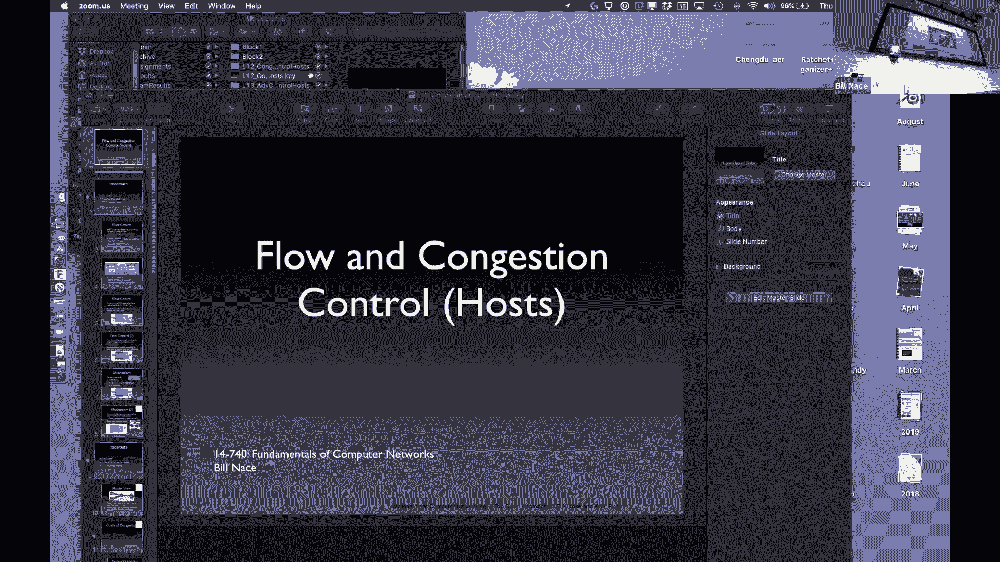
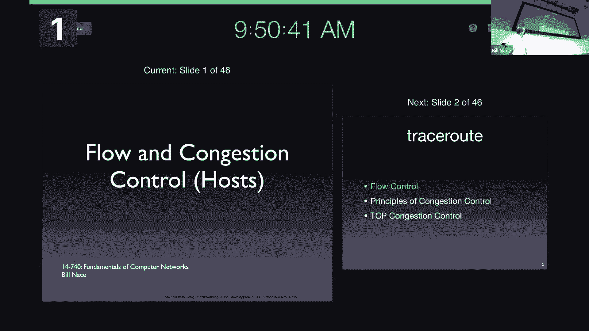
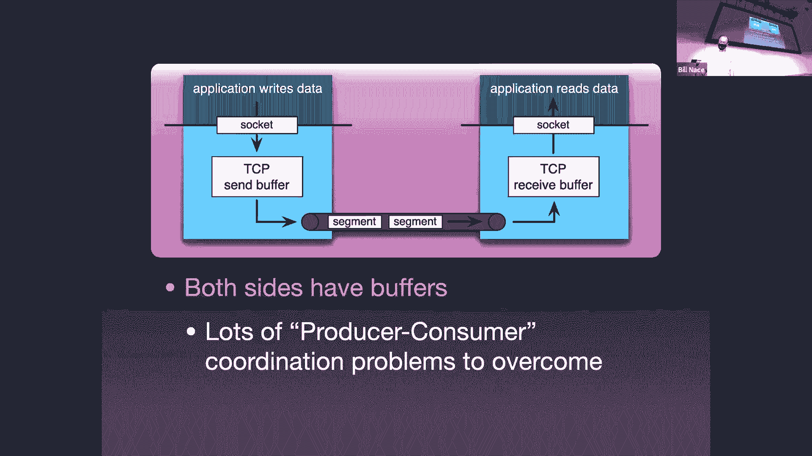
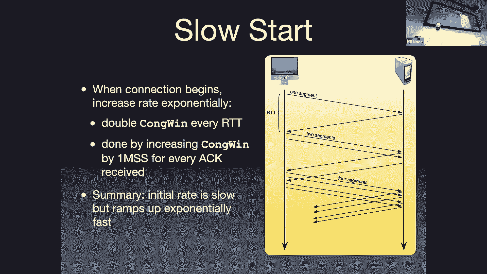
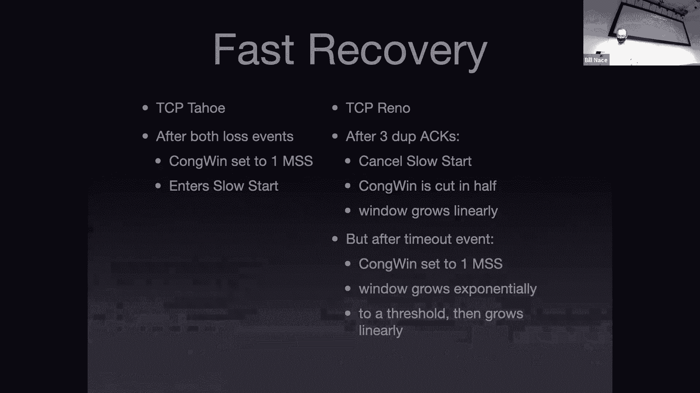

# 12：主机端的拥塞控制

在本节课中，我们将要学习TCP协议中的两个核心控制机制：流量控制和拥塞控制。我们将了解它们如何协同工作，以确保数据在网络中高效、可靠地传输，同时避免网络过载。

## 概述

TCP协议通过两个独立的窗口机制来控制发送方的行为：流量控制窗口和拥塞控制窗口。发送方在发送任何数据段之前，必须确保该数据段同时位于这两个窗口允许的范围内。这两个窗口分别解决了不同的问题：流量控制保护接收方，而拥塞控制保护网络本身。

## 流量控制：保护接收方

上一节我们介绍了TCP的基本工作原理，本节中我们来看看流量控制。流量控制旨在管理接收方作为数据段消费者的能力，确保发送方不会以超过接收方处理能力的速度发送数据，从而避免接收方缓冲区溢出。

接收方会分配一块固定大小的内存作为接收缓冲区（RCV Buffer），用于临时存储从网络到达但尚未被应用程序取走的数据。接收窗口（RCV Window）的大小等于接收缓冲区中的剩余空闲空间。

接收方通过TCP报文段首部中的“接收窗口”字段，将其当前的接收窗口大小告知发送方。发送方根据收到的确认号（ACK number）和接收窗口值，计算出自己可以发送的数据字节范围。

以下是流量控制的关键点：
*   **目的**：防止发送方淹没接收方。
*   **控制依据**：接收方缓冲区的剩余空间。
*   **通信机制**：通过TCP首部的`RCV Window`字段由接收方告知发送方。
*   **计算**：`接收窗口 = 接收缓冲区总大小 - 已占用缓冲区大小`。

## 拥塞控制：保护网络

流量控制解决了端到端的问题，但数据在网络中传输时，还可能遇到另一个问题：网络拥塞。本节我们将探讨拥塞控制，这是一个更为复杂的分布式问题。

网络拥塞发生在当网络中的路由器或链路负载过重，导致数据包经历长时延甚至被丢弃时。拥塞的代价很高。

以下是网络拥塞可能导致的一些问题：
*   **数据包经历排队时延**：在路由器缓冲区中等待。
*   **数据包被丢弃**：当路由器缓冲区满时。
*   **发送方不必要的重传**：可能由于时延过长导致超时，即使数据包并未丢失。
*   **浪费网络资源**：重传加剧了网络负载。
*   **可能导致拥塞崩溃**：重传的数据包进一步加剧拥塞，形成恶性循环，有效吞吐量急剧下降。

我们的目标是使网络运行在吞吐量高而时延低的“最佳点”（knee point），避免进入吞吐量低而时延高的“拥塞崩溃区”（cliff region）。为此，发送方需要一个反馈机制来感知网络状态。TCP采用端到端的拥塞控制方法，即通过观察数据包丢失（超时或收到三个重复ACK）来推断网络发生了拥塞，而不是依赖网络设备（如路由器）发送显式的拥塞信号。

## TCP拥塞控制基础

TCP通过维护一个**拥塞窗口**变量来实现拥塞控制。拥塞窗口限制了发送方在收到确认之前可以注入网络的数据量。发送方的实际发送速率大约等于拥塞窗口大小除以往返时间。

**公式**：`发送速率 ≈ 拥塞窗口大小 / 往返时间`

这源于带宽时延积的概念：`带宽 × 往返时间 = 网络中可容纳的最大数据量`。因此，`速率 = (带宽 × 往返时间) / 往返时间 = 拥塞窗口 / 往返时间`。

TCP拥塞控制算法主要由几个部分组成：慢启动、拥塞避免，以及用于设置重传超时时间的RTT估计算法。TCP是一个**自时钟系统**，其发送速率由确认（ACK）的返回速率驱动，而不是依赖外部计时器。

## 慢启动算法

当一个TCP连接刚建立或检测到严重丢包后，它对网络的可用带宽一无所知。慢启动算法的目的是快速但不过分激进地探测出网络的可用容量。

慢启动算法过程如下：
1.  初始时，设置拥塞窗口为一个最大报文段长度。
2.  每收到一个对新数据的确认，拥塞窗口就增加一个MSS大小。
3.  这使得拥塞窗口在每个往返时间内大约翻倍，实现指数级增长。

慢启动会持续到发生以下情况之一：
*   发生数据包丢失（由超时或三个重复ACK指示）。
*   拥塞窗口增长到一个预设的**慢启动阈值**。
*   接收方的流量控制窗口成为限制因素。

当遇到丢包或达到阈值时，慢启动阶段结束，进入拥塞避免阶段。

## 拥塞避免与AIMD

进入拥塞避免阶段后，TCP认为它已经接近网络的可用带宽。此时，目标从快速探测转变为谨慎地避免引发拥塞，同时尝试利用可能出现的额外带宽。

这通过**加性增、乘性减**算法实现：
*   **加性增**：在每个往返时间内，拥塞窗口增加一个MSS，而不是每个ACK增加一个MSS。这是线性增长。
*   **乘性减**：当检测到丢包时（无论是超时还是三个重复ACK），将拥塞窗口减半（乘以0.5）。对于超时，通常还会将慢启动阈值设置为当前拥塞窗口的一半，并重新进入慢启动；对于三个重复ACK（快速重传），则执行快速恢复，将拥塞窗口减半后直接进入拥塞避免阶段。

这种机制导致拥塞窗口呈锯齿状变化，不断试探带宽上限并在拥塞时快速后退。

## 往返时间估计与超时设置

准确估计往返时间对于设置合理的重传超时至关重要。超时设置过短会导致不必要的重传；设置过长则对丢包反应迟钝。

TCP通过以下步骤动态计算超时值：
1.  **采样RTT**：测量从发送一个数据段到收到其确认的时间（忽略重传数据段的采样）。
2.  **计算估计RTT**：使用指数加权移动平均来平滑RTT采样值，公式为：`EstimatedRTT = (1 - α) * EstimatedRTT + α * SampleRTT`，通常α取1/8。
3.  **计算RTT偏差**：衡量RTT的变化程度，公式为：`DevRTT = (1 - β) * DevRTT + β * |SampleRTT - EstimatedRTT|`，通常β取1/4。
4.  **设置超时时间**：`TimeoutInterval = EstimatedRTT + 4 * DevRTT`。这个公式使得在网络波动大时，超时值会设置得更大以提供更多余量。

## 总结

本节课中我们一起学习了TCP中两个关键的发送方控制机制。流量控制是一种端到端机制，通过接收窗口保护接收方免于缓冲区溢出。拥塞控制则是一个复杂的分布式问题解决方案，它通过拥塞窗口来保护网络本身免于过载。我们详细探讨了慢启动如何帮助连接快速找到合适的发送速率，以及拥塞避免阶段的AIMD算法如何帮助维持网络在高吞吐量、低时延的状态下运行。最后，我们了解了如何通过动态估计RTT及其偏差来设置合理的重传超时，这是TCP可靠传输和拥塞控制的基础。理解这些机制是掌握现代网络传输性能的关键。