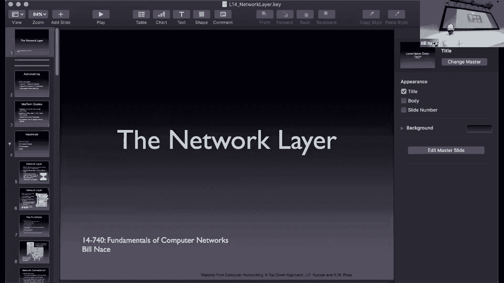
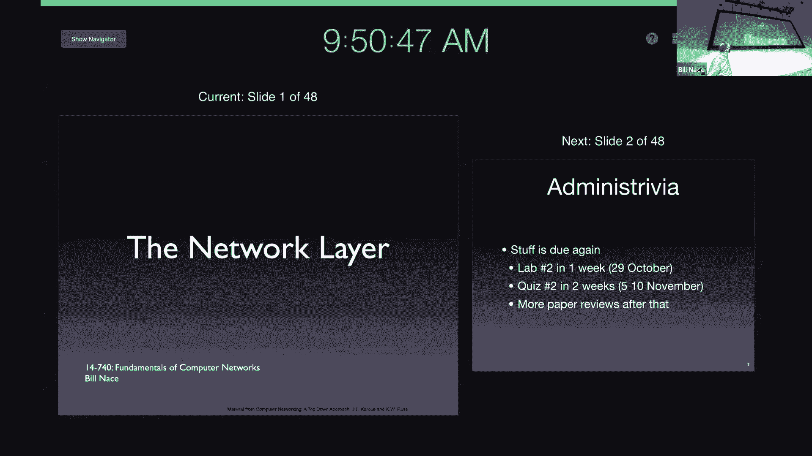
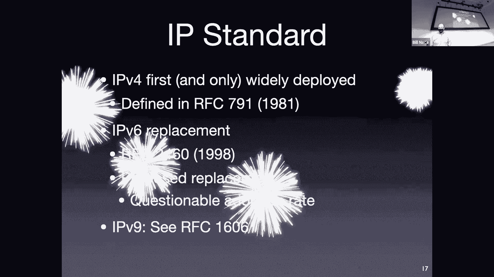
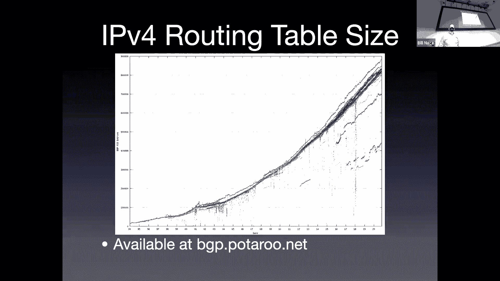
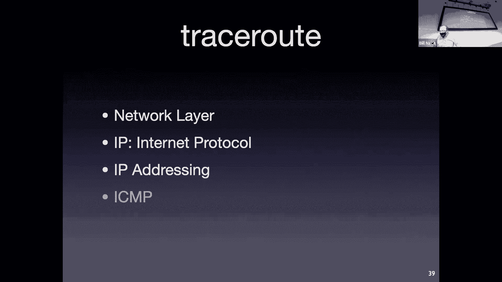
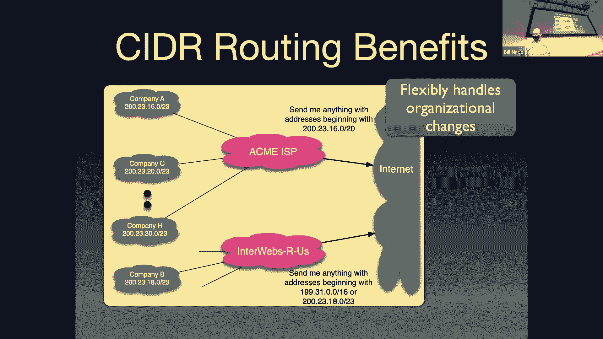

# 14：网络层






## 概述

在本节课中，我们将学习计算机网络体系结构中的网络层。网络层负责在主机之间提供逻辑连接，其核心任务是将数据包从源主机发送到目标主机。我们将探讨网络层的核心功能、两种主要的网络类型（数据报网络和电路交换网络），并深入分析互联网协议（IP）的细节，包括其数据包格式、分片机制和寻址方案。

## 网络层简介

上一节我们完成了传输层的学习。本节中，我们来看看网络层。网络层在网络体系结构中处于核心位置，它利用下层（数据链路层）提供的服务，在主机之间建立逻辑连接。其核心任务是传输数据包。

网络层与传输层的区别在于：传输层在应用程序之间建立连接，而网络层则在主机之间建立连接。网络层通过封装传输层传递下来的**段**，形成**数据包**，并将其通过路由器逐跳转发至目的地。

网络层有两个关键功能：
*   **控制平面（路由）**：这是一个分布式算法过程，用于确定数据包从源到目的地的最佳路径。所有路由器通过交换信息来构建**转发表**。
*   **数据平面（转发）**：这是每个路由器对到达的每个数据包执行的操作。路由器查看数据包头部的信息，查询转发表，以决定从哪个出站链路发送该数据包。

## 网络层服务模型：数据报与虚电路

网络层可以分为两种服务模型：无连接的数据报网络和面向连接的虚电路网络。这是一个在网络构建时就确定的基础架构选择，而非应用程序可选的。

### 数据报（分组交换）网络

在数据报网络中，没有连接的概念，每个数据包都被独立处理。数据包头包含目标主机的**全局唯一地址**。每个路由器根据该地址和自身的转发表，独立决定每个数据包的转发路径。这意味着同一数据流的不同数据包可能通过不同路径到达目的地。



以下是数据报网络转发表的一个简化示例：
```
目标地址范围         -> 出站链路
11001000 00010111 0001**** ******** -> 接口 0
11001000 00010111 0001100* ******** -> 接口 1
200.23.16.0/20      -> 接口 2
```
（其中 `*` 表示“任意”比特）

### 虚电路网络

在虚电路网络中，数据传输前需要先建立一条端到端的路径（虚电路）。建立过程中，沿途路由器会记录连接状态。数据包头部携带的不是目标主机地址，而是**虚电路标识符**。每个路由器根据数据包到达的链路和其VCI，查找转发表，决定转发链路并更新VCI。

以下是虚电路网络转发表的一个示例：
```
入站链路 | 入站VCI -> 出站链路 | 出站VCI
   1    |   12   ->     2     |   22
   2    |   63   ->     1     |   18
   1    |   58   ->     3     |   17
```
使用每段链路独立的VCI，而非全局唯一标识符，简化了协调工作。

## 互联网协议（IP）

互联网是一个数据报网络，其网络层协议是**互联网协议**。目前广泛使用的是IPv4，我们正在向IPv6过渡。

### IPv4数据包格式

IPv4头部具有固定格式，包含多个字段。以下是关键字段的说明：

*   **版本**：4比特，对于IPv4，此值为 `4`。
*   **头部长度**：4比特，以**32比特字**为单位指示IP头部的长度。因为头部可能包含可变长的选项字段。
*   **服务类型**：8比特，原用于区分服务（如优先级），但未广泛使用。
*   **数据报总长度**：16比特，定义整个数据包（头部+数据）的长度，单位是**字节**。最大理论值为65535字节。
*   **标识、标志、片偏移**：这三个字段用于管理**分片**，我们稍后详细讨论。
*   **生存时间**：8比特，数据包每经过一个路由器，此值减1。当TTL为0时，数据包被丢弃。这用于防止因路由环路导致数据包无限循环。
*   **上层协议**：8比特，指示数据部分应交给哪个上层协议（如TCP=6，UDP=17）。
*   **头部校验和**：16比特，仅针对IP头部计算校验和，用于检测头部传输错误。每个路由器在修改头部（如递减TTL）后都必须重新计算。
*   **源IP地址和目标IP地址**：各32比特，数据包的发送方和接收方的逻辑地址。
*   **选项**：可变长，很少使用，因为对高速路由器处理不友好。
*   **数据**：承载传输层段（如TCP段、UDP数据报）或其他数据。

### IP分片

数据链路层有**最大传输单元**的限制。当路由器收到的IP数据包大于其出站链路的MTU时，就需要进行**分片**。

分片涉及以下头部字段：
*   **标识**：发送主机或分片路由器为原始数据包分配的唯一ID，所有属于该数据包的片段都携带相同的ID。
*   **标志**：
    *   **DF**：不分片。如果设置，路由器不能分片，只能丢弃并返回错误。
    *   **MF**：更多分片。除最后一个片段外，其他所有片段都设置此位为1。
*   **片偏移**：13比特，指示本片段的数据在原始数据包数据部分中的起始位置，单位是**8字节**。

**分片示例**：
假设一个1500字节的数据包（20字节头部 + 1480字节数据）到达一个路由器，需要从MTU为536字节的链路发出。
1.  每个片段需要自己的20字节IP头部。
2.  每个片段的数据部分最大为 `536 - 20 = 516` 字节。但片偏移以8字节为单位，因此实际取 `512` 字节（512是8的倍数）。
3.  因此，生成三个片段：
    *   片段1：偏移=0，MF=1，数据长度=512
    *   片段2：偏移=64（512/8），MF=1，数据长度=512
    *   片段3：偏移=128（1024/8），MF=0，数据长度=456（1480-512-512）
4.  所有片段共享相同的标识符。

**重要说明**：
*   分片重组在**目的主机**进行，而非中间路由器。
*   网络层不提供可靠性。如果任何一个片段丢失，整个原始数据包都将被丢弃。
*   分片被认为效率低下且存在安全隐患，因此**IPv6已取消分片功能**。在IPv6中，如果数据包太大，路由器会丢弃它并向源主机发送错误消息，由源主机调整数据包大小。

### IP寻址与子网

IP地址是**分层**的32比特标识符，通常写作点分十进制形式（如 `192.168.1.1`）。它分为两部分：
*   **网络部分（前缀）**：标识主机所属的网络。
*   **主机部分**：标识该网络内的特定主机。

这种结构有助于路由聚合，减少转发表大小。

我们使用**无类别域间路由**表示法来指定地址范围：
`200.23.16.0/20`
这表示前20比特是网络前缀，剩下的12比特用于主机，总共可以容纳 2^12 = 4096 个地址（实际可用略少）。

**最长前缀匹配**：
路由器转发表由许多此类前缀条目组成。当一个数据包到达时，其目标地址可能与多个前缀条目匹配。路由器遵循**最长前缀匹配**规则：选择前缀长度最长（即最具体）的条目进行转发。

**示例转发表**：
```
目标网络         -> 出站接口
200.23.16.0/20  -> 接口0
200.23.16.0/23  -> 接口1
```
对于目标地址 `200.23.17.1`，它同时匹配 `/20` 和 `/23` 两个条目。根据最长前缀匹配规则，路由器会选择 `/23` 的条目，通过接口1转发。

CIDR和最长前缀匹配支持强大的**路由聚合**，允许将多个连续的小网络地址块合并为一个大的网络前缀进行通告，从而显著减少全球路由表的规模。

## 总结





本节课我们一起学习了计算机网络中的网络层。我们了解了网络层在主机间提供逻辑连接的核心使命，区分了控制平面的**路由**和数据平面的**转发**。我们深入探讨了两种网络服务模型：无连接的**数据报网络**（如互联网）和面向连接的**虚电路网络**，并分析了它们的工作原理和寻址差异。




我们重点研究了**互联网协议**，详细解析了IPv4数据包的格式、各字段功能，特别是**分片**机制的原理与过程。最后，我们学习了IP的**分层寻址**方案、**CIDR表示法**以及路由器转发时使用的**最长前缀匹配**规则，这些是互联网能够高效、可扩展运行的基础。在下一讲中，我们将继续学习与IP配套的**网际控制报文协议**。