# 15：路由算法


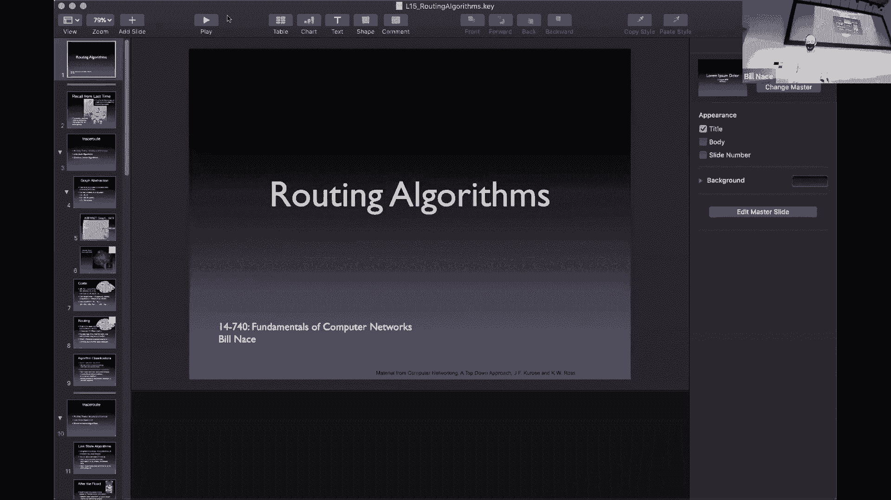

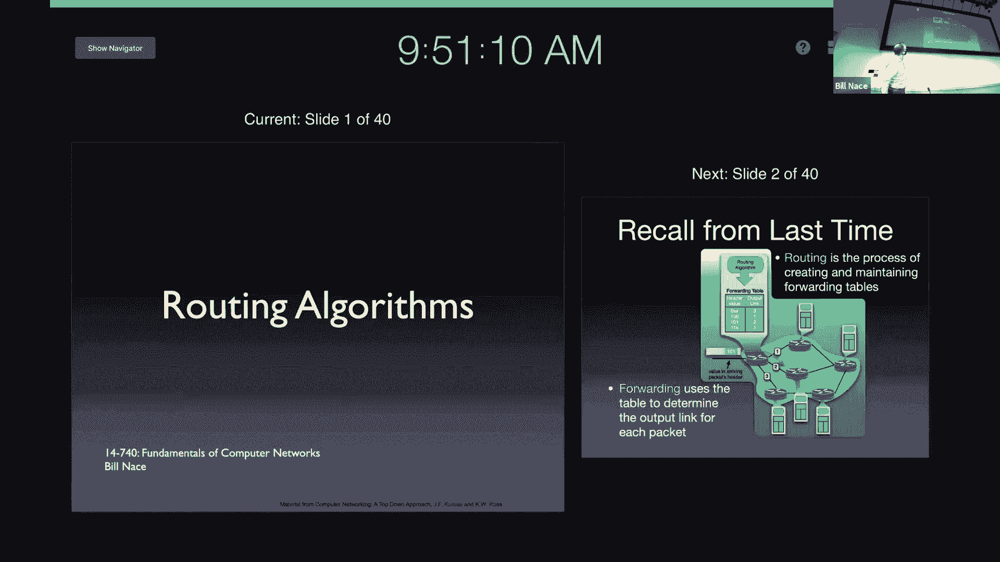

在本节课中，我们将学习网络层的核心功能之一：路由。我们将探讨路由器如何决定数据包从源到目的地的路径，并学习两种主要的路由算法类别：链路状态算法和距离向量算法。

---

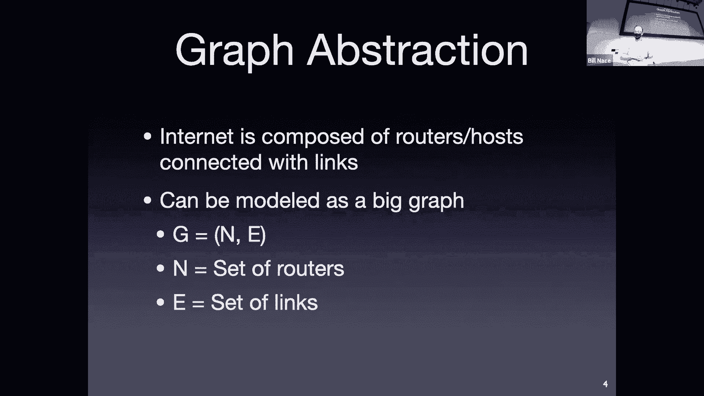

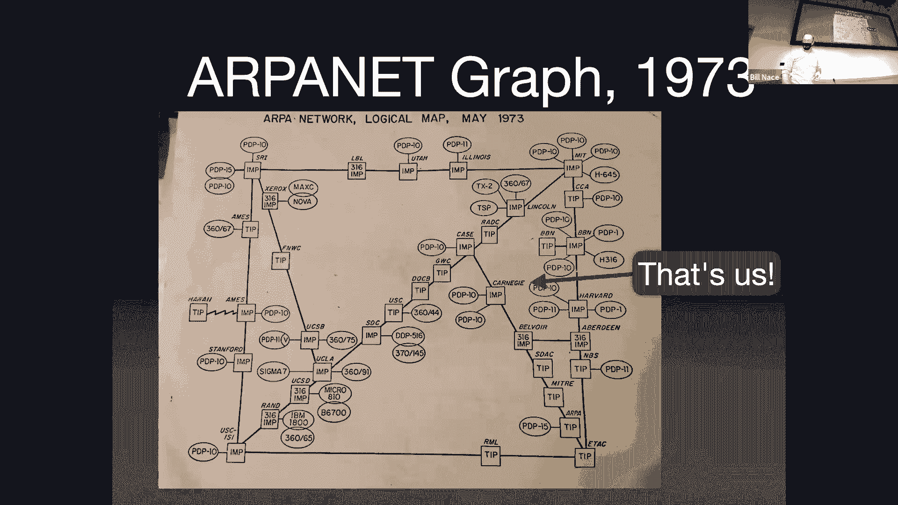


## 概述：网络层与路由

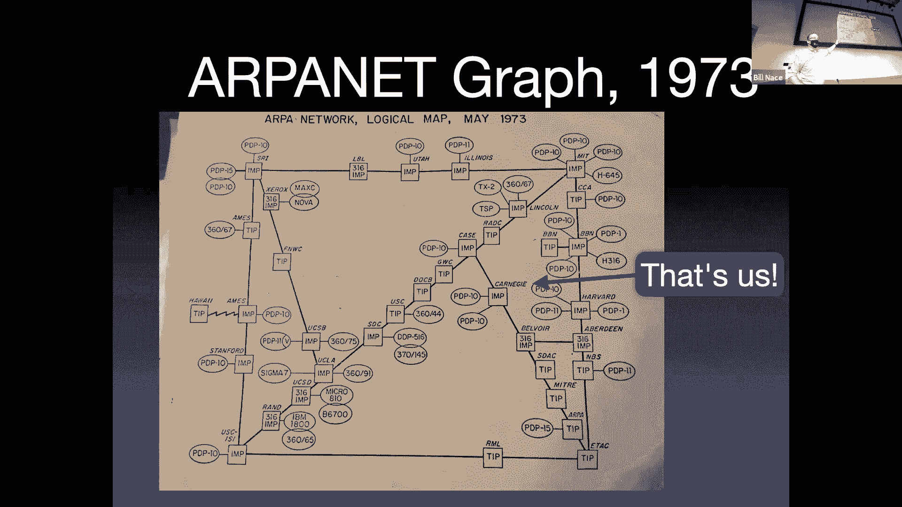

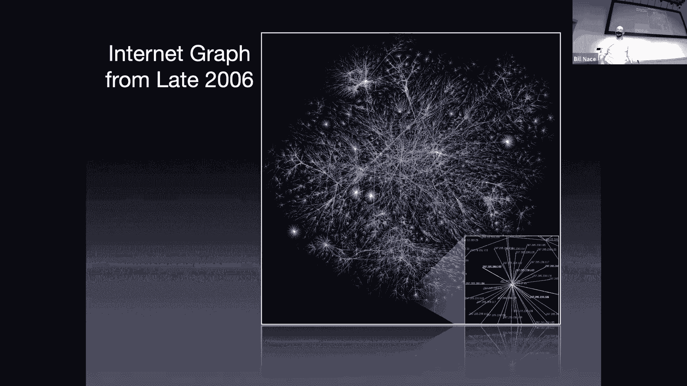

上一节我们介绍了网络层的转发功能。本节中，我们来看看驱动转发决策的另一个关键过程：路由。

路由过程负责构建和维护路由器的**转发表**。它需要解决一个核心问题：在由众多路由器（节点）和连接（边）构成的网络图中，如何找到从源节点到目的节点的**最低成本路径**？这里的“成本”可以抽象为延迟、带宽开销或实际费用。

为了理解路由，我们将网络抽象为一个图 **G = (N, E)**，其中：
*   **N** 是节点（路由器）的集合。
*   **E** 是边（链路）的集合。
*   每条边 **(u, v)** 都有一个关联的成本 **c(u, v)**。如果两个节点间没有直接连接，则成本为 **∞**。

一条路径的成本是其所有链路成本之和。路由算法的目标就是为每个源节点找到到达所有其他目的节点的最低成本路径，并确定转发表中的“下一跳”。

---

## 链路状态路由算法

链路状态算法要求每个路由器都拥有整个网络的**全局信息**，即完整的网络拓扑图和所有链路的成本。路由器通过一种称为**泛洪**的机制来交换和同步这些信息。一旦所有路由器都拥有了相同的全局视图，它们就可以独立地运行相同的确定性算法来计算最短路径。

最著名的链路状态算法是**迪杰斯特拉算法**。这是一个迭代算法，从一个源节点开始，逐步确定到达所有其他节点的最短路径。

以下是算法步骤的简要介绍：

1.  **初始化**：
    *   设 **N‘** 为已知最短路径的节点集合。初始时，**N‘ = {u}**，其中 u 是源节点。
    *   对于每个节点 v，记录当前已知的从 u 到 v 的最低成本估计 **D(v)** 和路径上的前驱节点 **p(v)**。
        *   对于 u 的直接邻居 v：**D(v) = c(u, v)**, **p(v) = u**
        *   对于其他节点：**D(v) = ∞**, **p(v) = null**

2.  **迭代循环**：
    *   在**未**加入 **N‘** 的节点中，找出 **D(w)** 值最小的节点 w。
    *   将 w 加入 **N‘**。此时，**D(w)** 就是从 u 到 w 的最终最低成本。
    *   检查 w 的每个邻居 v。
        *   如果 **D(w) + c(w, v) < D(v)**，则更新：**D(v) = D(w) + c(w, v)**，并设置 **p(v) = w**。
    *   重复此循环，直到 **N‘** 包含所有节点。

算法结束后，通过回溯每个节点的前驱节点 **p(v)**，可以构建出一棵以源节点 u 为根的**最短路径树**。转发表则通过这棵树来确定：要到达目的节点 v，数据包应发送给哪个下一跳邻居（即路径上 u 的第一个邻居）。

**复杂度**：使用最小堆等数据结构优化查找最小 **D(w)** 的过程后，算法复杂度为 **O(n log n)**，其中 n 是网络中的节点数。

链路状态算法对网络变化反应较慢，因为任何链路成本的变化都需要重新泛洪拓扑信息，然后所有路由器重新运行迪杰斯特拉算法。

---

## 距离向量路由算法

与需要全局知识的链路状态算法不同，距离向量算法是**分布式**和**迭代式**的。每个路由器开始时只了解直接相连的邻居及其链路成本。

其核心思想是**邻居间交换路由信息**。每个路由器维护一个**距离向量**，即一个列表，记录它自己计算出的、到达网络中所有已知目的节点的最低成本估计。路由器会定期或当成本变化时，将自己的距离向量发送给所有直接邻居。

当路由器从邻居收到一个新的距离向量时，它会使用**贝尔曼-福特方程**来更新自己的路由表：
```
D_x(y) = min_v { c(x, v) + D_v(y) }
```
其中：
*   **D_x(y)**：节点 x 计算出的到达节点 y 的最低成本。
*   **c(x, v)**：节点 x 到其邻居 v 的直接链路成本。
*   **D_v(y)**：邻居 v 告知的、它自己到达节点 y 的成本。
*   **min_v**：遍历 x 的所有邻居 v，取最小值。

这个方程的含义是：“如果我要去 y，我可以先到邻居 v，成本是 c(x, v)，然后按照 v 说的路线去 y，成本是 D_v(y)。我对所有邻居 v 都这么算一遍，选总成本最小的那条路。”

### 算法动态性与问题

距离向量算法是持续运行的。好消息（如成本降低）会快速传播。然而，它存在“**坏消息传播慢**”的问题，也称为“**计数到无穷大**”。

考虑一个简单网络：X—Y—Z。假设 X-Y 链路成本从 4 剧增到 60。Y 无法立刻感知到直达 X 的路径变差，因为它还记录着 Z 曾告诉它“我到 X 的成本是 5”。Y 会错误地认为通过 Z 到 X 的成本是 1+5=6（假设 Y-Z 成本为1），这比 60 好，于是 Y 更新自己的成本为 6 并告知 Z。Z 收到 Y 的 6 后，会更新自己到 X 的成本为 1+6=7，并再告知 Y…… 如此循环，成本会缓慢递增（6, 7, 8, …），直到最终超过直接链路的成本（60），过程缓慢且期间可能形成**路由环路**。

### 稳定性增强技术

为了缓解上述问题，有两种常用的技术：

*   **水平分割**：如果节点 A 到达目的节点 X 的最短路径经过了邻居 B，那么 A 在发送距离向量给 B 时，**不包含**关于 X 的路由信息。这样 B 就不会用 A 的信息来更新到 X 的路由，从而避免环路。
*   **带毒性逆转的水平分割**：是水平分割的增强版。A 在发给 B 的距离向量中，**仍然包含**目的 X 的信息，但将其成本设置为 **∞**（或一个非常大的数）。这相当于明确告诉 B：“你不要试图通过我去 X”。这能更快地消除环路。

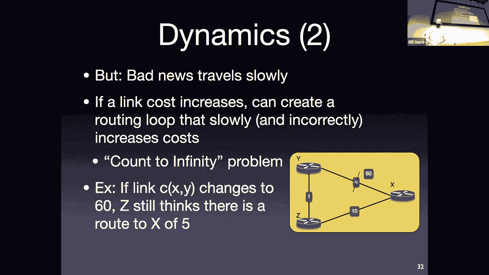

尽管有这些技术，在复杂的网络拓扑中，距离向量算法仍可能收敛缓慢或产生临时环路。

---

## 算法比较

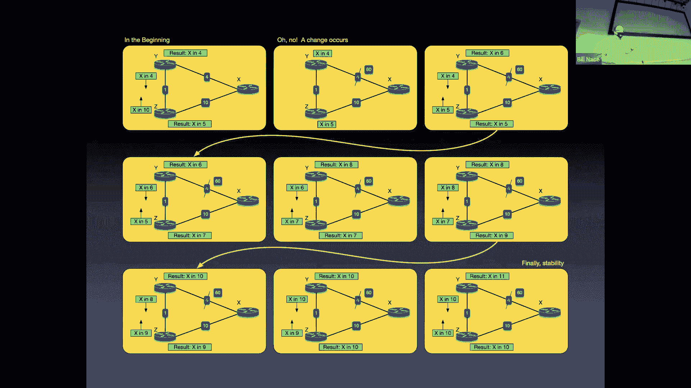


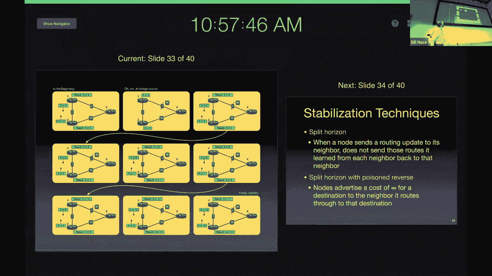

上一节我们分别介绍了链路状态和距离向量算法。本节我们来总结和比较它们的特性：

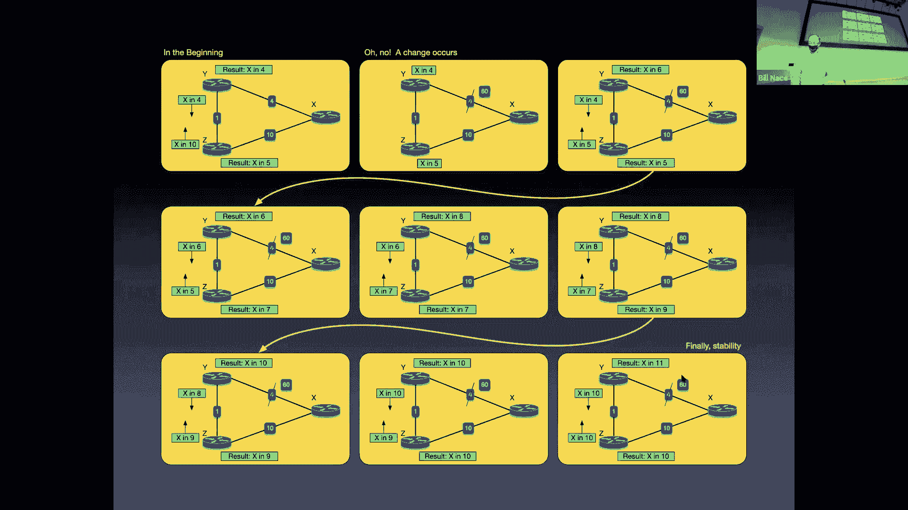

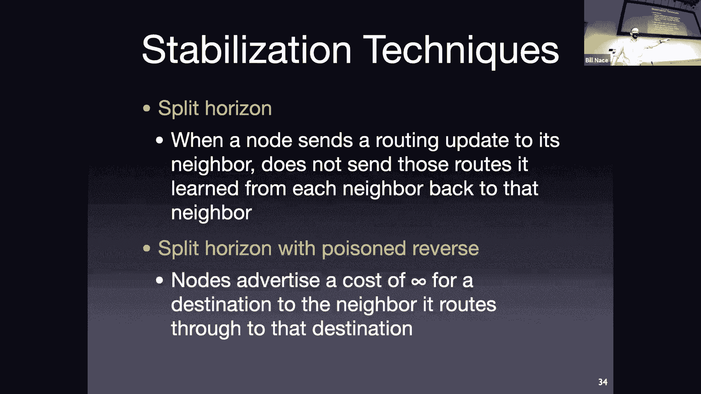

*   **消息复杂度**：
    *   链路状态：需要 **O(n * e)** 条消息进行泛洪（n 节点数，e 边数），可能较多。
    *   距离向量：只在邻居间交换消息，每次交换的信息量较小，但在迭代过程中消息总数可能也不少。
*   **收敛速度**：
    *   链路状态：**O(n log n)** 算法，一旦拥有全局信息，计算速度快。
    *   距离向量：收敛时间与网络直径相关，遇到坏消息时可能很慢，存在计数到无穷大问题。
*   **健壮性**：
    *   链路状态：每个路由器基于全局信息独立计算，一个路由器的计算错误通常不会扩散。
    *   距离向量：一个路由器的错误信息（如过低的成本）会传播给邻居，并可能扩散到整个网络，影响范围广。

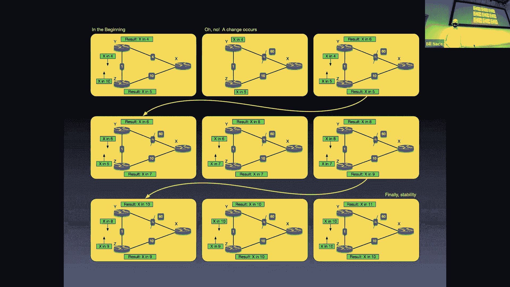

在实际的互联网中，这两种思想都有应用。通常，在一个自治系统内部（如一个大学或公司的网络），常使用基于链路状态算法的协议（如 OSPF）。而在不同自治系统之间进行路由时，则使用基于距离向量思想增强后的路径向量协议（如 BGP）。

---

## 总结

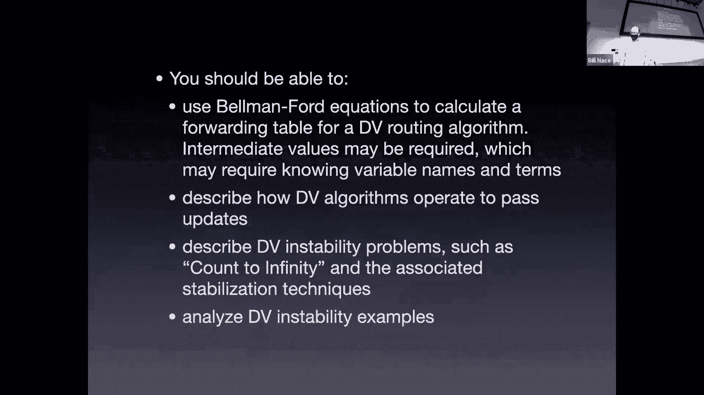

本节课中我们一起学习了网络层路由的核心算法。我们首先将网络抽象为图，并定义了最低成本路径的路由问题。接着，我们深入探讨了两种主要的解决方案：**链路状态算法**（以迪杰斯特拉算法为例），它依赖全局拓扑信息；以及**距离向量算法**，它通过邻居间迭代交换距离向量来分布式地求解。我们分析了它们的工作原理、动态特性以及各自的优缺点（如收敛速度、健壮性和对网络变化的反应）。理解这些基础算法，是学习实际互联网路由协议（如 RIP、OSPF、BGP）的关键前提。下一节课，我们将看到这些理论如何应用于真实的网络协议之中。