# 16：互联网路由 🌐

在本节课中，我们将学习如何将理论上的路由算法应用于真实的互联网。我们将探讨分层路由的概念，了解不同的内部网关协议，并深入研究连接整个互联网的外部网关协议——边界网关协议。

---

## 概述

上一节我们学习了链路状态（Dijkstra算法）和距离向量（Bellman-Ford方程）等理论路由算法。本节中，我们来看看这些算法如何被实现为实际运行在互联网中的真实协议。核心挑战在于互联网的**规模**和**组织自治性**。为了解决这些问题，我们引入了**分层路由**的概念。

---

## 分层路由与自治系统

互联网规模庞大，包含近70,000个不同的网络组织和约850,000台核心路由器。直接运行Dijkstra算法（复杂度为 `O(N log N)`）是不现实的。此外，每个组织都希望自主管理自己的网络，不受单一中央机构控制。

计算机工程中解决此类问题的常用方法是引入**层次结构**。在互联网路由中，我们采用两层结构：
1.  **自治系统**：每个组织在其网络内部自主运行，称为一个自治系统。
2.  **系统间路由**：使用统一的协议将各个AS连接起来。

**自治系统** 是指运行大型网络并需要做出路由决策的组织，例如互联网服务提供商、大公司或大学校园。每个AS会被分配一个唯一的**AS编号**。例如，卡内基梅隆大学的AS编号是9。

并非所有网络都是AS。如果一个网络只有单一的上游连接（例如家庭网络），它就不需要成为AS，其IP地址范围会被包含在其上游ISP的AS中。

---

## 内部网关协议

在AS内部，用于决定如何路由数据包的协议称为**内部网关协议**。以下是几种常见的IGP：

### 链路状态协议

这类协议基于Dijkstra算法。

**开放最短路径优先**
OSPF将Dijkstra算法封装成一个协议。它是开放标准，消息直接封装在IP包中（使用独立的协议号），并内置了可靠性和错误纠正机制。网络管理员可以自主设置链路权重。OSPF还通过划分**区域**来解决大规模网络的管理问题，各个区域通过一个骨干区域连接，只在区域内进行链路状态泛洪和计算。

**中间系统到中间系统**
IS-IS是另一种链路状态协议，在大型电信ISP中更常见。它同样是标准协议，并针对大规模网络进行了优化，旨在减少消息开销。

### 距离向量协议

这类协议基于Bellman-Ford算法。

**路由信息协议**
RIP是一个简单、历史悠久的距离向量协议。它假设所有链路成本为1（即跳数），并且路径最大成本不能超过15（4位字段限制），因此只适用于小型网络。RIP路由器每30秒向邻居发送一次更新，这些更新也充当故障检测的“心跳”信号。RIP消息通过**UDP**端口520发送，这意味着路由守护进程运行在应用层，计算完成后将路由条目写入网络层的转发表。

**增强型内部网关路由协议**
EIGRP是思科开发的专有协议，后来也被标准化。它同样是距离向量算法，但宣传其收敛速度更快，占用路由器资源更少。

---

## 外部网关协议：边界网关协议

AS之间用于交换网络可达性信息的协议称为**外部网关协议**。互联网上实际运行的唯一EGP是**边界网关协议**。

BGP的核心任务是让网络能够**通告**其IP前缀，并使这些通告能在AS之间传播，从而让整个互联网知道如何到达某个网络。由于一个AS可能从多个邻居收到通往同一目的地的通告，因此BGP通告中包含了丰富的**属性**，用于基于策略（而不仅仅是性能）做出路由选择。

BGP被称为**路径向量协议**。它不通告成本，而是通告完整的**AS路径**列表，这有助于检测和防止路由环路。

### BGP工作原理

1.  **BGP会话**：两个AS的边界路由器通过直接连接建立**BGP会话**，使用**TCP**（端口179）来可靠地交换BGP消息。
2.  **BGP消息类型**：
    *   `OPEN`：建立会话。
    *   `UPDATE`：最重要的消息，用于**通告**或**撤销**路由。
    *   `KEEPALIVE`：维持会话，兼作故障检测。
    *   `NOTIFICATION`：优雅地关闭会话或报告错误。
3.  **内部BGP**：为了将从一个邻居学到的路由传递给其他邻居，一个AS内部的所有边界路由器之间也需要运行BGP，这称为**iBGP**。它与eBGP在细节上略有不同，主要用于区分信息来自内部还是外部。

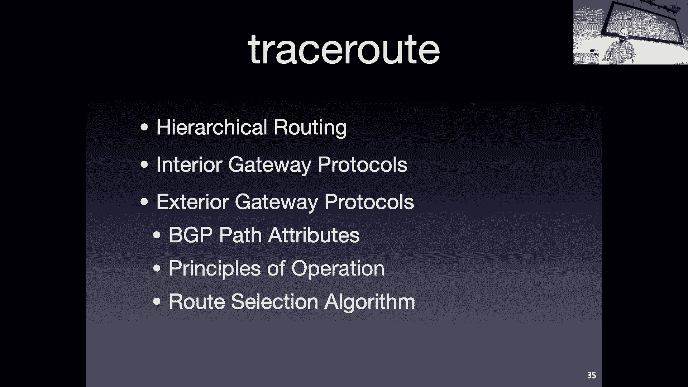

### 关键BGP属性

UPDATE消息中，前缀会附带多个属性，用于决策：

1.  **AS_PATH** 🛣️：列出到达该前缀需要经过的AS编号序列。这是路径向量的核心，用于避免环路和进行路由选择。
2.  **NEXT_HOP** ➡️：指明发送往该前缀的流量应转发到的**下一跳IP地址**。这是分层路由能工作的关键，AS内部的路由器依靠IGP来学习如何到达这个NEXT_HOP地址。
3.  **MULTI_EXIT_DISC** ⚖️：仅在两个AS之间存在多条连接时使用。用于向邻居“礼貌地”建议优先使用哪条入口链路，而不是默认的“热土豆路由”（尽快将流量送出本AS）。
4.  **LOCAL_PREF** ⭐：由本地网络管理员设置的一个优先级数值，用于明确指示本AS内的路由器优先选择哪条路由。这是非常强力的策略控制工具。

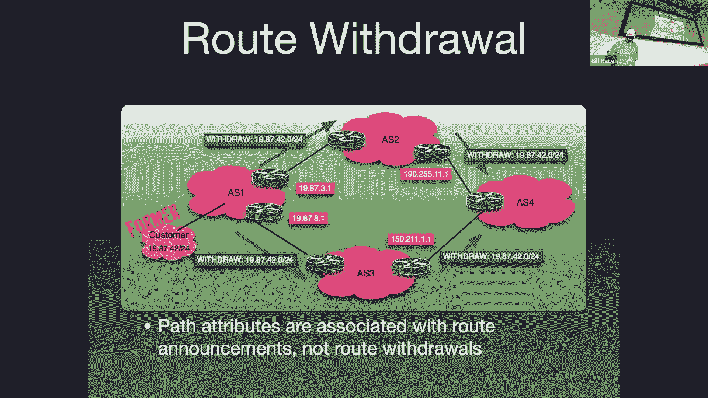

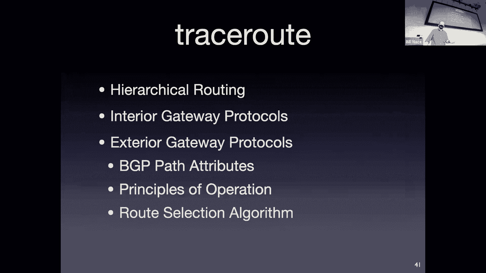

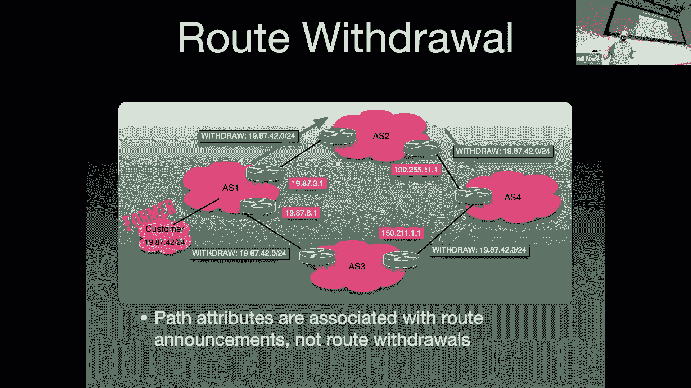

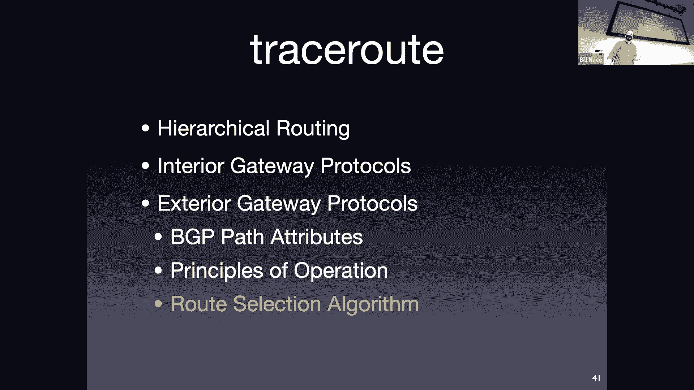

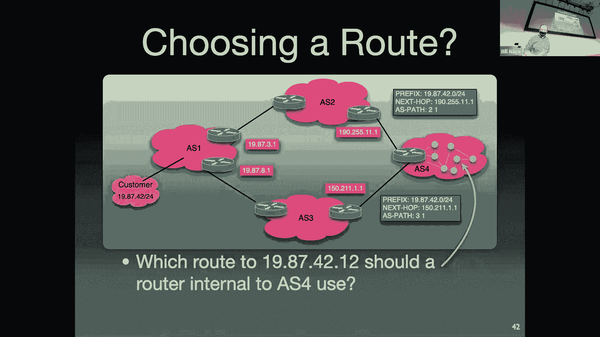

### 路由选择过程

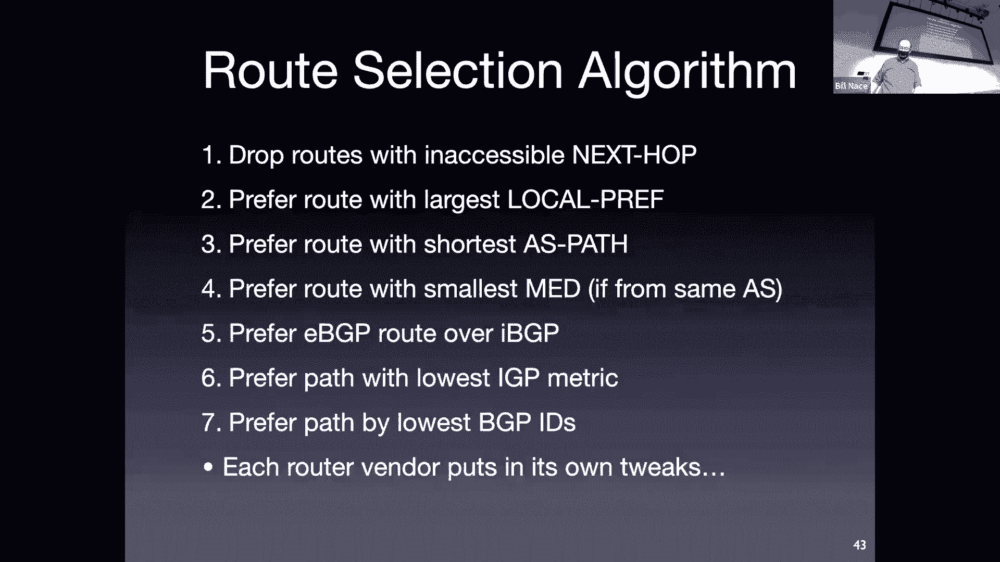

当一个AS的边界路由器从不同邻居收到通往同一前缀的多个BGP通告时，它会按照一个固定的顺序比较属性来选择最佳路径。一个简化的决策顺序如下：
1.  丢弃下一跳不可达的路由。
2.  选择 **LOCAL_PREF** 值最高的路由。
3.  选择 **AS_PATH** 最短的路由。
4.  选择 **MULTI_EXIT_DISC** 值最低的路由。
5.  优先选择通过eBGP学到的路由（而非iBGP）。
6.  选择到**NEXT_HOP**成本最低的路由（即“热土豆路由”）。
7.  如果仍持平，则使用BGP路由器ID等附加条件打破平局。

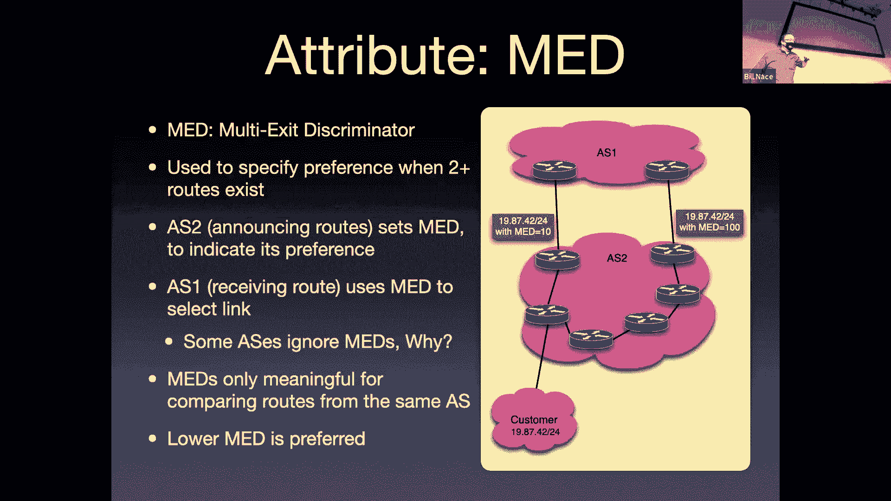

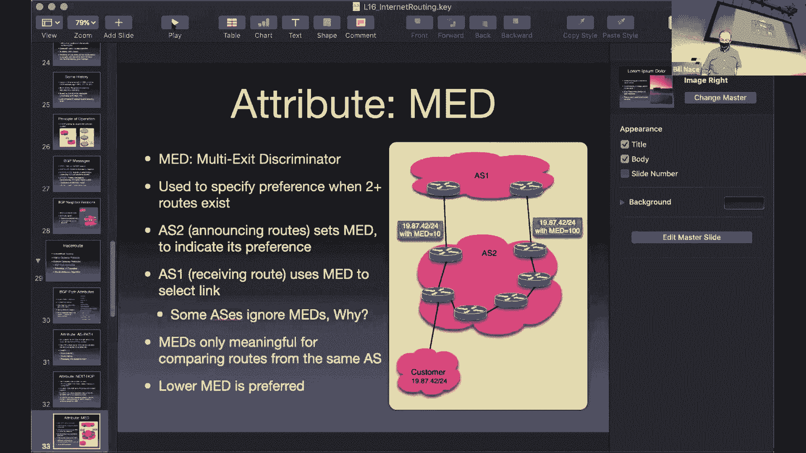

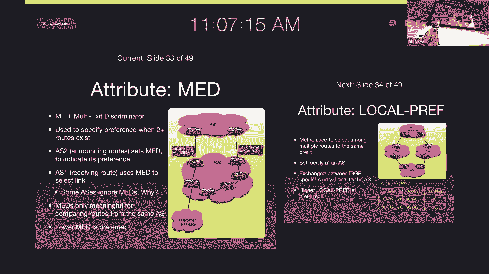

### BGP的安全与挑战

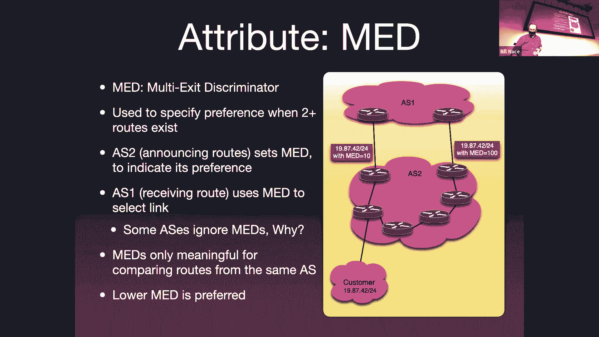

BGP的复杂性使其容易因配置错误或恶意攻击而出错，例如**路由劫持**，即错误地通告不属于自己的IP前缀，从而将流量引向他处。历史上发生过多次此类事件，导致大型互联网服务中断。

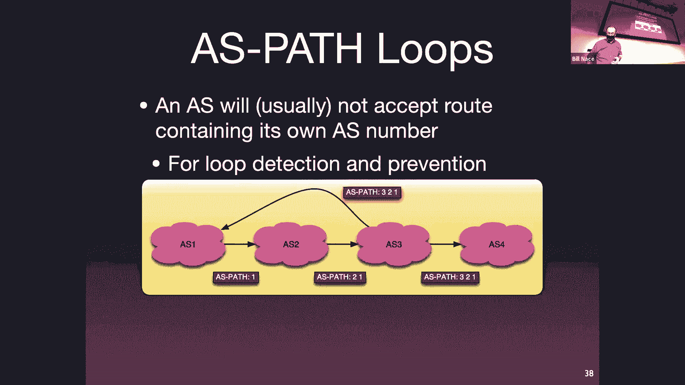

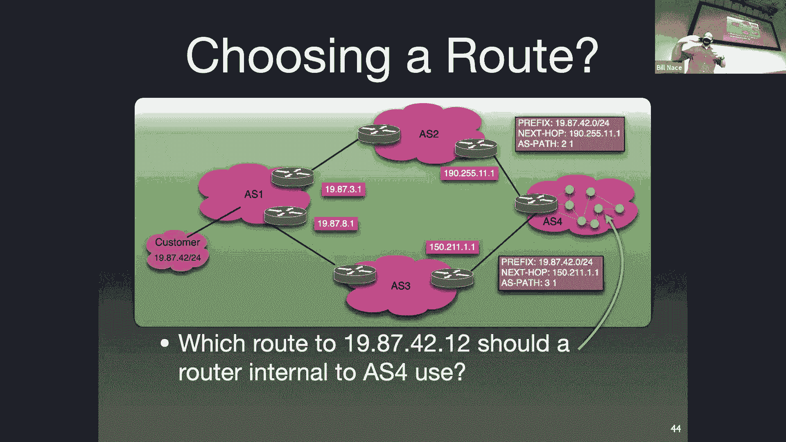

防御措施包括：
*   **资源公钥基础设施**：为BGP通告提供加密验证。
*   **TTL安全机制**：一种巧妙的“黑客”方法，检查BGP消息IP包的TTL值，确保它来自直接邻居，而非被转发多次的伪造源。

---

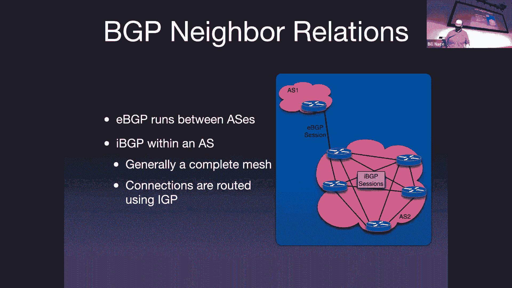

## 总结

本节课中，我们一起学习了互联网路由的实际实现。我们从**分层路由**和**自治系统**的概念出发，理解了互联网如何通过划分管理域来应对规模和自治性挑战。我们探讨了多种**内部网关协议**，如OSPF、IS-IS、RIP和EIGRP，它们允许每个AS内部自主决定路由。最后，我们深入研究了**边界网关协议**，这个复杂但至关重要的**外部网关协议**，它通过交换包含丰富属性（如AS_PATH、NEXT_HOP）的通告，将全球数以万计的AS连接起来，并在很大程度上依赖于商业策略来进行路由决策。理解BGP是理解互联网核心运作机制的关键。