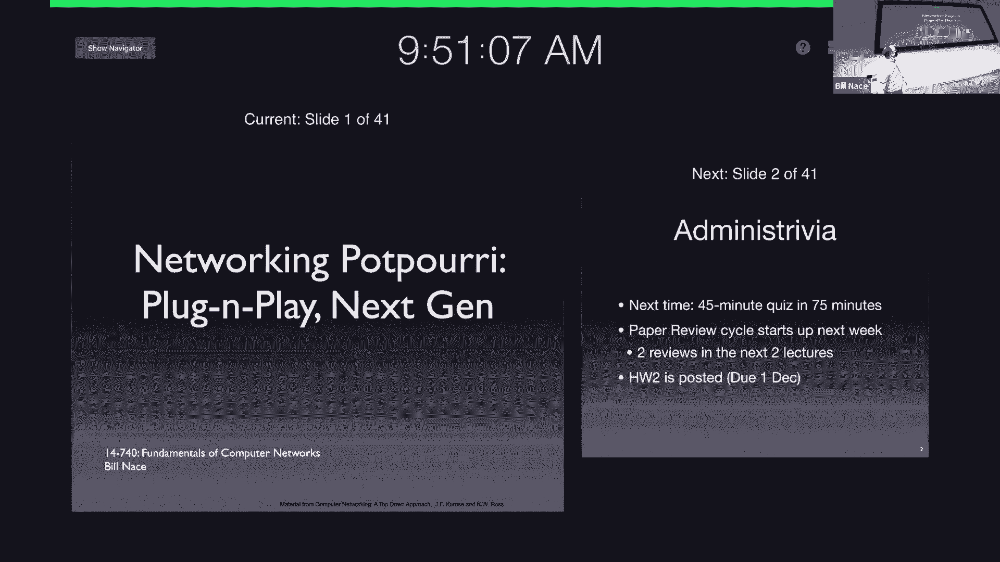
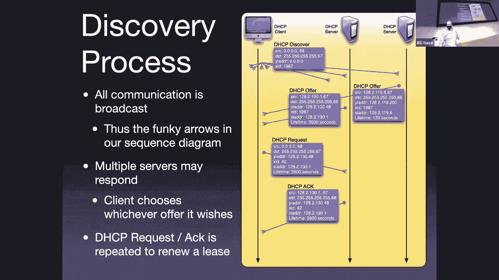
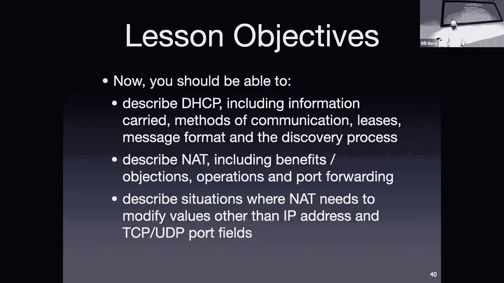

# 17：即插即用网络与IPv6

在本节课中，我们将完成网络层剩余的几个重要主题。这些技术虽然相对独立，但共同构成了现代网络“即插即用”能力的基础，极大地简化了用户接入网络的复杂度。我们将主要探讨三个关键技术：动态主机配置协议、网络地址转换以及下一代互联网协议IPv6。

## 课程管理与复习

在深入技术内容之前，有几个管理事项需要说明。

首先，下周将进行第二次测验。测验将在下周二进行，形式与上次相同，为闭卷考试，时长为75分钟。测验题目将严格基于每节课幻灯片末尾列出的“课程目标”。我建议各位以此为指导进行复习。

本周末将安排一次复习课，具体时间和地点已在Piazza上公布。此外，在测验前我们仍会安排答疑时间。如果大家有任何问题，可以通过Piazza提问或邮件预约时间。

其次，请注意课程日程。测验之后将有几篇论文阅读任务需要提交。同时，第二次作业已经发布，截止日期在一个月后。这次作业涉及使用软件工具分析大型数据集，建议尽早开始准备。

## 动态主机配置协议

上一节我们回顾了网络层的基本路由机制。本节中，我们来看看如何让一台新设备自动、便捷地加入网络，这正是DHCP的核心使命。

DHCP旨在使加入网络的过程变得简单、自然且自动化。它为新加入网络的计算机提供必要的配置数据包。

以下是设备加入网络时通常需要的关键信息：
*   **IP地址**：设备在特定子网中使用的唯一地址。由于路由的层次性，设备不能随意使用IP地址，必须使用本地子网认可的地址。
*   **默认网关**：数据包离开本地子网时需要经过的路由器地址。
*   **子网掩码**：用于确定本地网络的IP地址前缀长度。
*   **DNS服务器**：用于域名解析的本地DNS服务器地址。

DHCP的工作过程是一个典型的“引导”过程。新启动的客户端对网络一无所知，因此它通过广播发送`DHCP Discover`消息来寻找DHCP服务器。网络中的DHCP服务器收到请求后，会以`DHCP Offer`消息进行响应，提供一个可用的IP地址及其他配置信息。客户端选择一个`Offer`后，发送`DHCP Request`消息进行确认，服务器最终回复`DHCP Ack`完成分配。

为了高效管理有限的IP地址资源，DHCP采用了**租约**机制。服务器分配给客户端的IP地址具有一个有效期（例如30分钟）。租约到期前，客户端可以请求续租；到期后，服务器会回收该地址并可能分配给其他设备。

关于DHCP，有几点需要注意：
*   **安全性**：DHCP协议本身缺乏强大的安全机制，理论上可能存在恶意服务器响应或客户端耗尽地址池的攻击。
*   **重要性**：尽管存在限制，DHCP极大地简化了网络配置，是使互联网对普通用户变得友好的关键技术之一。

## 网络地址转换

我们了解了DHCP如何为设备分配内部地址。接下来，我们看看NAT如何让使用私有地址的多个设备共享一个公有IP地址与外部互联网通信。

NAT通常部署在家庭或企业网络的边界路由器上。其核心思想是：内部网络使用私有（不可路由）的IP地址范围（如`192.168.x.x`），而对外则呈现为一个或多个公有IP地址。

NAT的工作机制涉及地址和端口的重写。当内部主机发送数据包到外部网络时，NAT设备会进行以下操作：
1.  将数据包源IP地址从私有地址（如`192.168.1.2`）替换为NAT设备的公有IP地址（如`128.2.0.250`）。
2.  同时，通常会重写源端口号，并将其映射关系记录在一个内部状态表中。
3.  当外部服务器返回响应数据包时，NAT设备根据目的端口号查询状态表，确定应将数据包转发给哪个内部主机，并重写目的IP和端口。

NAT的优点包括：
*   **缓解地址耗尽**：允许多个设备共享一个公有IP地址。
*   **简化地址管理**：用户无需为每台新设备向ISP申请新的公有IP。

然而，NAT也带来了诸多问题和争议：
*   **违背端到端原则**：网络中间设备（NAT）需要维护连接状态并解析高层协议（如端口号），破坏了网络层的简单性。
*   **破坏协议兼容性**：某些协议（如FTP、SIP）在应用层数据中嵌入IP地址，NAT设备需要识别并修改这些内容，处理复杂且可能失败（尤其是数据加密时）。
*   **阻碍端到端连接**：外部主机难以主动发起与NAT内部主机的连接，通常需要借助端口转发或第三方中继服务。

尽管存在这些缺陷，由于其实用性，NAT在IPv4网络中被广泛部署。

## 互联网协议第6版

既然NAT主要用于解决IPv4地址不足的问题，那么最根本的解决方案是什么呢？这就是我们最后要探讨的IPv6。

IPv6的设计主要为了解决IPv4地址耗尽问题，同时也对协议头部进行了简化和改进。

最显著的变化是**地址空间**的极大扩展。IPv6地址长度为128位，其数量极其庞大。地址书写采用十六进制，以冒号分隔，例如`2001:0db8:85a3:0000:0000:8a2e:0370:7334`。为了简洁，可以省略前导零，并用`::`表示连续的多组零。

IPv6的**协议头部**也更加精简高效：
*   **固定长度**：基本头部长度为40字节，处理更快速。
*   **字段简化**：移除了IPv4中的首部校验和、分片相关字段（鼓励在端系统进行分片）等。
*   **改进的选项处理**：通过“下一个首部”字段链式组织扩展选项，更加灵活。

IPv6的一个实用特性是**无状态地址自动配置**。设备可以利用其唯一的标识符（如MAC地址）和固定的本地链路前缀（`fe80::/10`），自动生成一个本地链路IPv6地址，无需DHCP服务器即可在本地网络通信。这进一步体现了“即插即用”的理念。

## 总结

本节课中，我们一起学习了三项关键的“即插即用”网络技术。
1.  **DHCP**：自动为网络设备分配IP地址等配置信息，极大简化了网络接入。
2.  **NAT**：通过地址转换，让多个设备共享一个公有IP地址，缓解了IPv4地址压力，但引入了复杂性和兼容性问题。
3.  **IPv6**：通过庞大的128位地址空间从根本上解决地址耗尽问题，并提供了更简洁高效的协议头部和自动配置能力。

这些技术共同塑造了我们今天所体验的便捷、易用的互联网环境。尽管IPv6的全面普及仍在进行中，但理解这些基础协议的工作原理对于深入理解计算机网络至关重要。