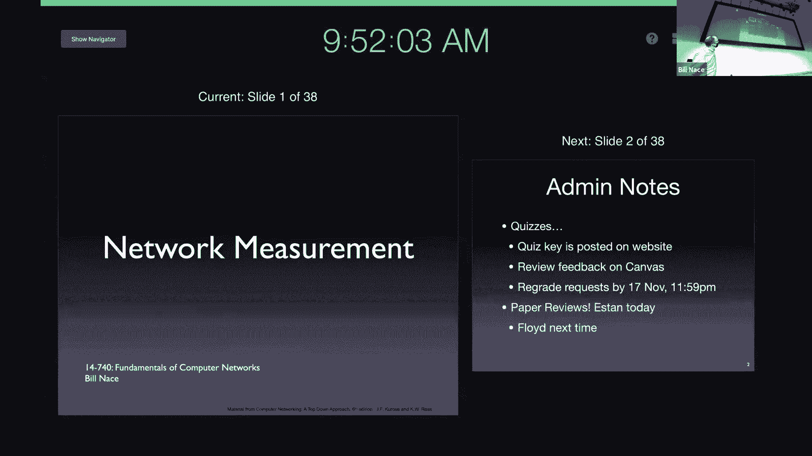
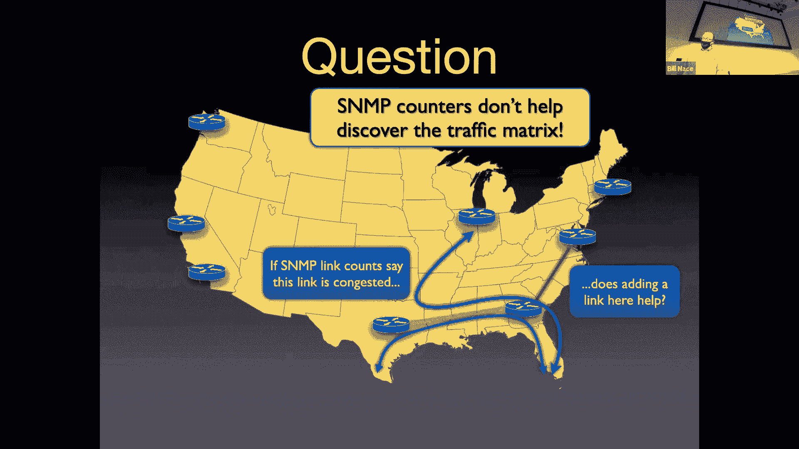
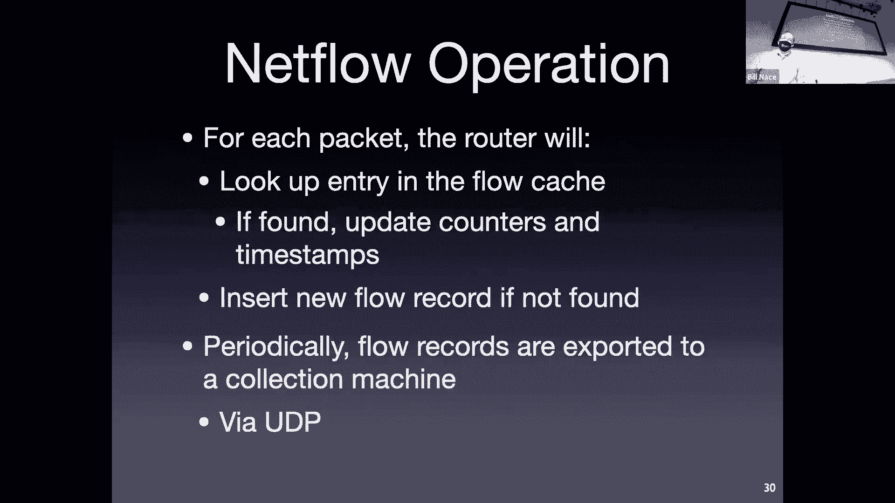
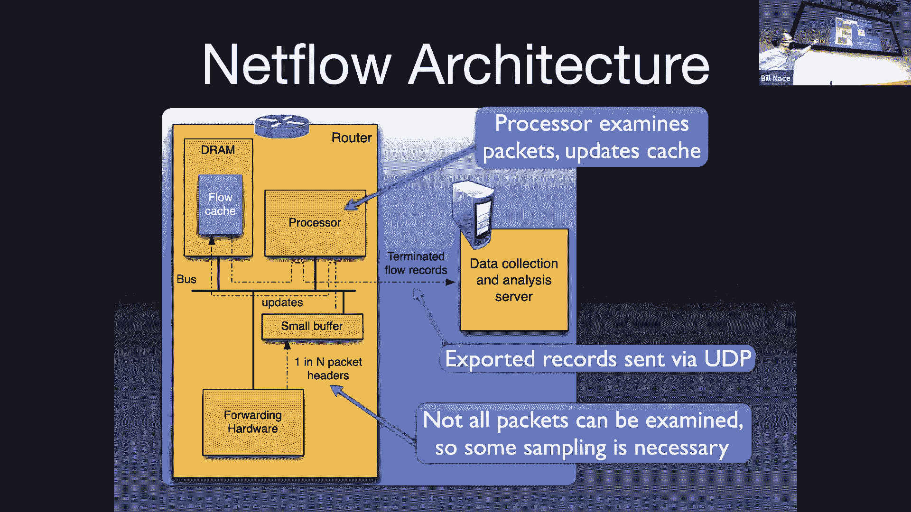
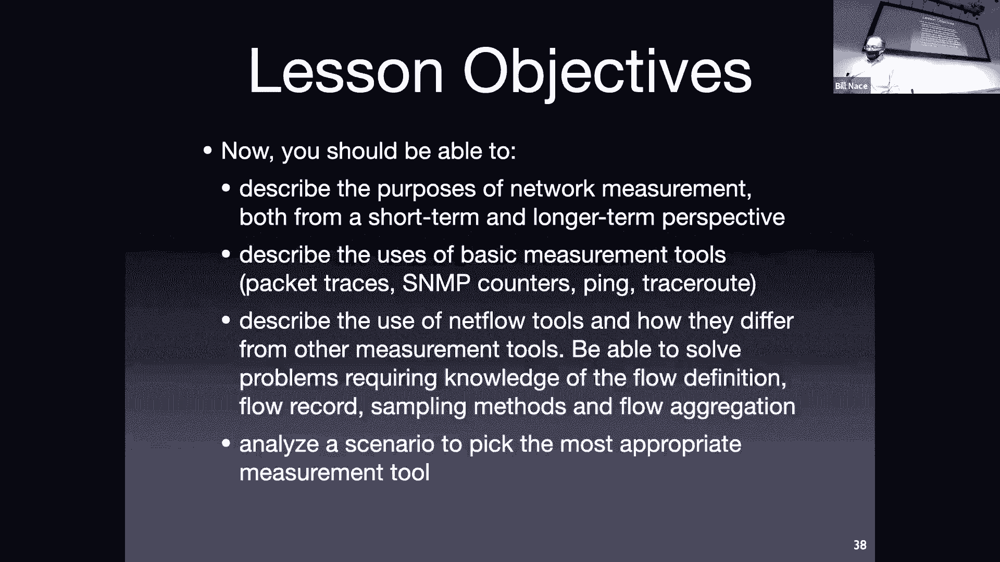

# 19：网络测量

## 概述

在本节课中，我们将学习网络测量的基本概念、目的以及常用的工具。网络测量帮助我们理解网络的动态行为，进行短期监控和长期规划，是网络管理和研究的基础。

## 为什么需要网络测量

网络是一个动态变化的系统。为了理解网络状态并做出决策，我们需要进行测量。网络测量主要有两个目的：短期监控和长期规划。

短期监控帮助我们了解网络的实时状态，例如是否存在拥塞或异常事件。这些异常事件可能是正常的流量激增，也可能是恶意的安全攻击，如拒绝服务攻击。

长期规划，也称为流量工程，涉及根据历史数据调整网络。这可能包括修改路由规则、升级链路或建立新的对等连接。这些决策都需要基于准确的测量数据。

## 网络测量的两种方法

网络测量主要分为被动测量和主动测量。

被动测量通过观察网络中已有的流量来进行，不改变流量本身。这种方法通常部署在路由器上，用于收集生产网络的流量特征。

主动测量则需要向网络注入探测流量，通过分析这些流量的变化来推断网络特性。例如，`traceroute` 工具就是通过发送探测包来测量路径和延迟。

## 常用测量工具介绍

以下是几种常见的网络测量工具及其特点。

### 数据包捕获

数据包捕获工具，如 Wireshark，会复制流经某一点的所有网络数据包并存储下来，形成数据包追踪文件。这种方法可以查看所有细节，但也存在隐私问题、数据量巨大以及硬件性能限制等挑战。

### 简单网络管理协议

简单网络管理协议 是一种用于网络管理的协议族。它允许管理员查询网络设备（如路由器）的统计信息，例如字节计数和包计数。SNMP 定义了一个管理信息库，用于标准化不同设备的信息访问。这些数据常用于计费和网络状态监控，并可通过多路由器流量图示器 等工具进行可视化。

### NetFlow 与流量分析

NetFlow 是一种用于分析网络流量流的工具。它将具有相同特征（如源/目的IP、协议、端口等）的数据包归类为一个“流”，并为每个流记录统计信息。

一个流可以通过以下七元组定义：
`(源IP, 目的IP, 协议类型, 服务类型, 源端口, 目的端口, 输入接口)`

路由器收集流记录后，可以将其导出到收集器进行分析。这有助于构建流量矩阵，了解网络中不同源和目的地之间的流量模式，对于流量工程和业务决策至关重要。NetFlow 最初是 Cisco 为提高路由器转发性能而设计的缓存机制，后来演变为流量分析工具。

## 工具的选择与限制

选择测量工具时，需要考虑网络规模和需求。大型服务提供商需要 NetFlow 等工具进行精细的流量工程和计费。而像大学校园网这样的边缘网络，由于结构相对简单、业务决策需求不同，可能不会广泛部署此类复杂工具。

所有工具都受到硬件性能（CPU、内存、带宽）的限制，因此在处理高速链路时可能需要进行数据包采样或流聚合。

## 总结

本节课我们一起学习了网络测量的重要性，区分了被动测量与主动测量，并介绍了数据包捕获、SNMP 和 NetFlow 等核心工具及其应用场景。理解这些工具的原理和用途，将帮助你在进行网络分析、故障排查和规划时，选择合适的方法并解读测量数据。