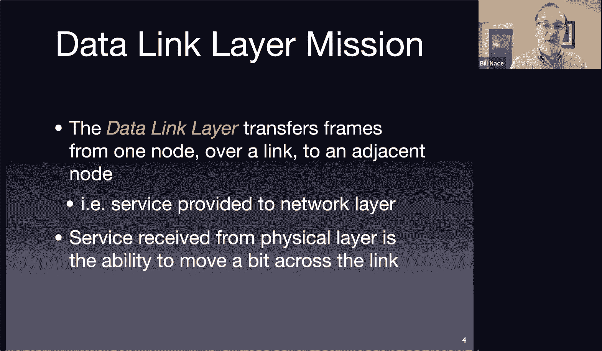
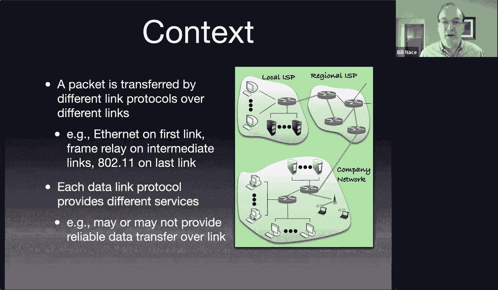
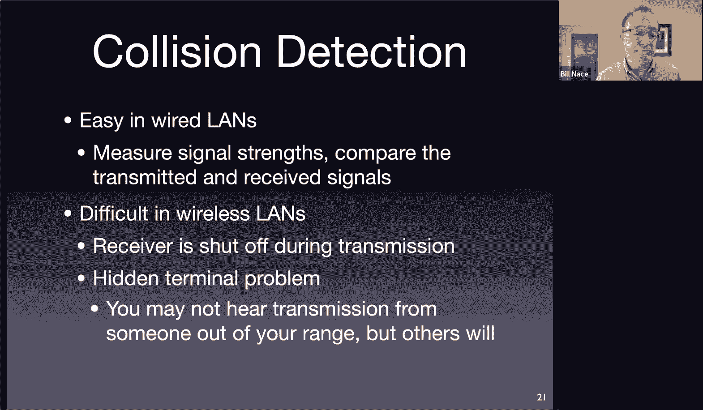
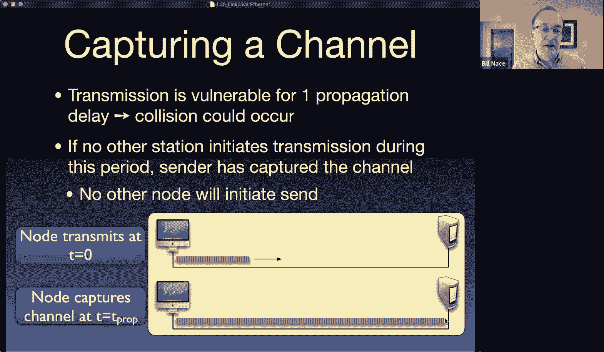
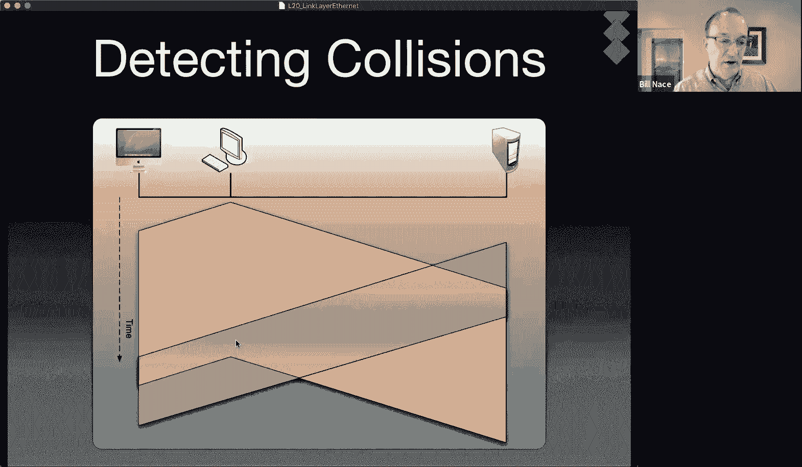
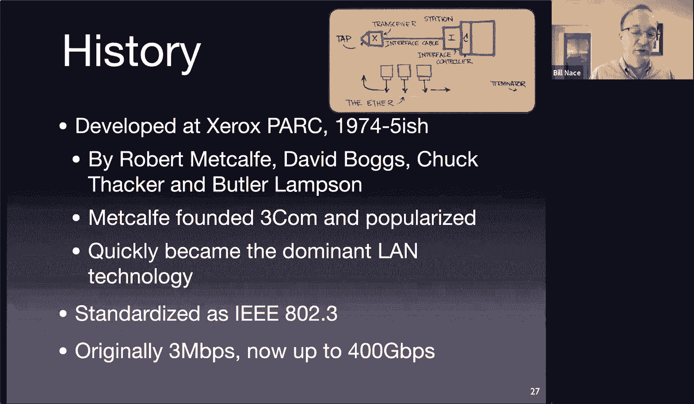
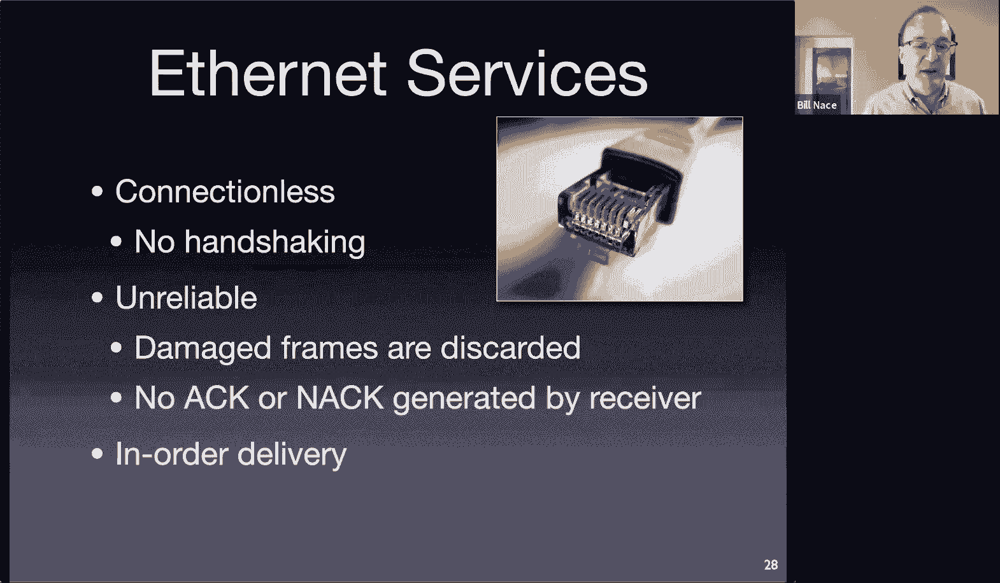
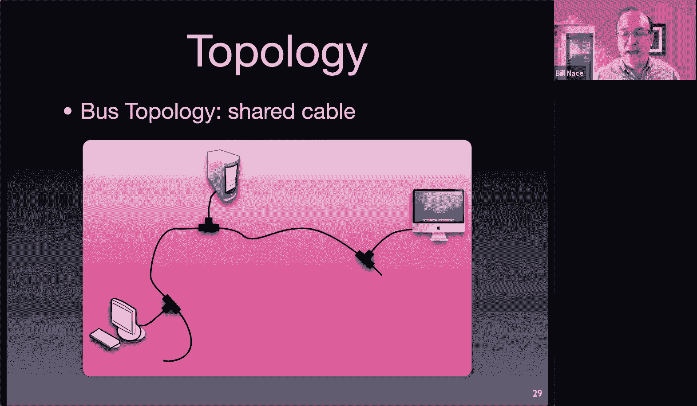
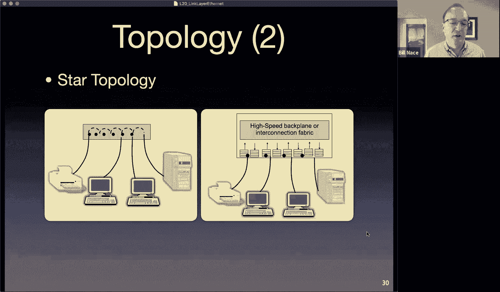
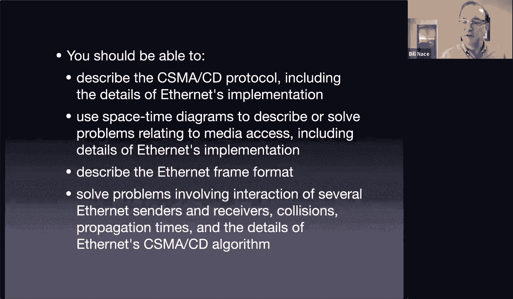

# 21：链路层与以太网

在本节课中，我们将要学习计算机网络体系结构中的链路层。我们将探讨链路层的基本职责、不同类型的链路，并深入了解以太网这一核心链路层技术的工作原理。

## 链路层概述

上一节我们完成了对网络层的讨论，本节中我们来看看网络栈的下一层——链路层。链路层负责在相邻节点（例如，主机到路由器、路由器到路由器）之间传输数据。这是数据在跨越整个网络的旅程中，每一跳所经历的步骤。

链路层建立在物理层之上，物理层负责传输单个比特。链路层将网络层传来的数据包封装成**帧**，并添加必要的头部和尾部信息，以确保帧能正确地从发送方传递到接收方。

## 链路类型与挑战

网络中的链路主要有两种类型：
*   **点对点链路**：连接单一的发送方和接收方。
*   **广播链路**：多个节点共享同一传输介质（如同一根电缆或同一无线频谱）。

广播链路带来了一个核心挑战：如何协调多个节点对共享介质的访问，以避免**冲突**（即两个帧同时发送导致信号叠加，接收方无法解析）。解决这个问题的协议称为**媒体访问控制**协议。

## 链路层的关键职责

链路层需要完成以下几项关键任务：

以下是链路层的主要职责列表：
1.  **成帧**：将数据打包成帧，并添加源/目的地址等头部信息。
2.  **链路接入**：通过媒体访问控制协议管理节点何时可以发送帧。
3.  **差错检测**：使用如**循环冗余校验**等技术，检测传输过程中是否出现比特错误。CRC的计算公式通常涉及多项式除法，例如：`CRC = data % generator_polynomial`。
4.  **差错纠正**（部分协议）：在错误率较高的链路上（如无线网络），发送额外冗余数据，使接收方能纠正少量错误。
5.  **可靠交付**（部分协议）：在易出错的链路上，实现基于确认和重传的可靠帧传输。
6.  **定义最大传输单元**：每种链路技术都规定了其帧能承载的最大数据量，即**MTU**。例如，以太网的MTU通常是1500字节。

## 媒体访问控制协议

对于广播链路，需要MAC协议来协调访问。主要有三类方法：

以下是主要的MAC协议分类：
*   **信道划分协议**：将信道资源（时间或频率）静态划分为若干份，每份专供一个节点使用。例如时分多路复用或频分多路复用。优点是避免冲突，缺点是当节点无数据发送时会造成资源浪费。
*   **轮流协议**：节点依次获得发送机会。如果某个节点无数据发送，则机会传递给下一个节点，提高了利用率。具体实现方式包括**轮询**（由主节点协调）和**令牌传递**（一个特殊令牌帧在节点间依次传递）。
*   **随机接入协议**：节点有数据要发送时，直接使用全部信道带宽进行发送。核心问题是解决随之而来的冲突。主要机制是**载波侦听多路访问/冲突检测**。

## CSMA/CD 详解

**CSMA/CD** 是以太网等有线广播网络中使用的经典随机接入协议。其工作原理如下：

以下是CSMA/CD的工作步骤：
1.  **载波侦听**：发送前，先监听信道是否空闲。若忙，则等待直至空闲。
2.  **发送与冲突检测**：若信道空闲，则开始发送帧，并在发送过程中持续监听信道。如果检测到自身发送的信号与在信道上监听到的信号不一致，则表明发生**冲突**。
3.  **冲突处理**：一旦检测到冲突，立即停止发送，并发送一个**阻塞信号**以强化冲突，确保所有节点都知道发生了冲突。
4.  **指数退避**：冲突后，节点等待一段随机时间再重试。等待时间从 `{0, 1, ..., (2^k - 1)}` 个时间槽中随机选择，其中 `k` 是冲突次数（不超过10）。这使各节点的重试时间分散开，避免再次碰撞。

在无线环境中，由于设备无法在发送的同时监听（会损坏灵敏的接收电路），因此CSMA/CD不适用，需采用CSMA/CA等协议。

## 以太网深度解析

以太网是占主导地位的有线链路层技术。它采用无连接、不可靠的交付方式（依赖上层协议处理丢包），但保证帧按序到达。

### 以太网帧结构

一个以太网帧包含以下字段：

以下是以太网帧的字段构成：
*   **前导码**：7字节的 `10101010` 模式，用于接收方时钟同步。
*   **帧起始定界符**：1字节的 `10101011`，标志帧开始。
*   **目的MAC地址**：6字节，目标设备的物理地址。
*   **源MAC地址**：6字节，发送设备的物理地址。
*   **类型**：2字节，指示帧内数据所属的上层协议（如IP或ARP）。
*   **数据**：46到1500字节，承载网络层数据包。这就是**MTU=1500**的由来。
*   **CRC**：4字节，用于差错检测的循环冗余校验码。

最小帧长（64字节，不含前导码）的设计是为了确保发送方能检测到冲突：即使帧发送即将结束，来自网络最远端的冲突信号也能在发送完成前被侦听到。

### 以太网运行流程

结合CSMA/CD，以太网发送一帧的完整流程如下：

以下是发送一帧的步骤：
1.  **准备帧**：从网络层获取数据包，通过**ARP协议**将目标IP地址解析为目标MAC地址，组装帧。
2.  **监听信道**：持续监听96比特时间。若信道忙，则等待直至空闲再加96比特时间。
3.  **发送帧**：若信道空闲，开始发送，并同时进行冲突检测。
4.  **处理结果**：
    *   若成功发送完整个帧且未检测到冲突，则完成。
    *   若检测到冲突，立即停止发送，发出阻塞信号，然后执行指数退避算法，等待随机时间后回到步骤2重试。
    *   如果连续冲突16次，则放弃发送并向网络层报告错误。

## 总结

本节课中我们一起学习了计算机网络中的链路层。我们了解了链路层在相邻节点间传输数据的基本角色，区分了点对点和广播链路。我们重点探讨了广播链路中的核心挑战——多路访问，并介绍了信道划分、轮流和随机接入三类MAC协议。随后，我们深入学习了以太网技术，包括其CSMA/CD访问机制、详细的帧结构以及从发送到冲突处理的完整工作流程。以太网以其简单、高效和可扩展的特性，成为了现代有线局域网不可或缺的基石。