# 24：虚拟链路层

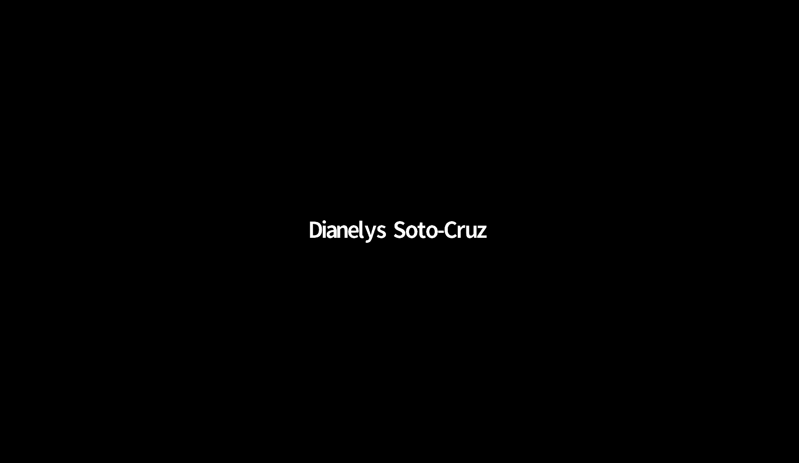

在本节课中，我们将探讨链路层中“虚拟”的概念。我们将学习如何超越简单的物理电缆或天线连接，通过虚拟局域网和链路虚拟化等技术，实现更灵活、更强大的网络管理。

## 课程概述与安排

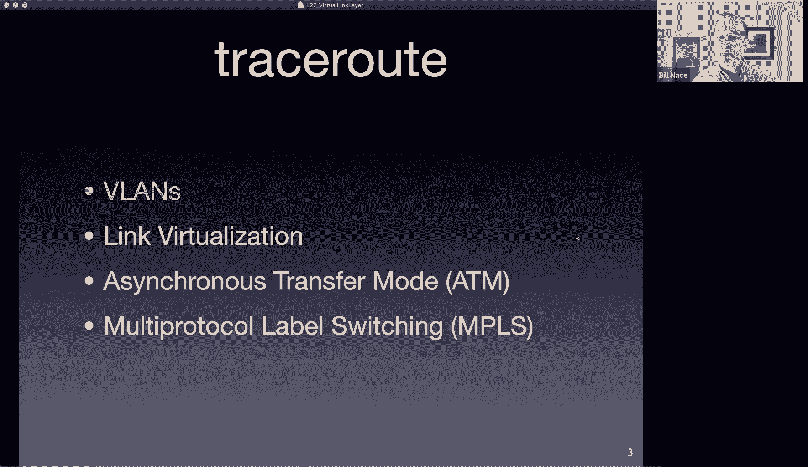

首先是一些课程管理事项。这是第24讲，还有两讲课程。总共只剩三次课。还剩一项作业，即实验三，大约一周后截止。该实验使用Wireshark分析链路层数据，任务量不大，但请不要拖延。

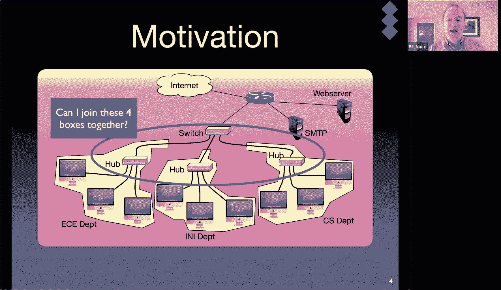

期末考试安排在12月15日上午。题型可能包括判断题、简答题、选择题和一些需要详细解释或分析场景的长题目。如果对期末考试有任何疑问，请及时提出。会有期末复习课，但不会有模拟试卷。

关于练习题，教材每章末尾有一些问题。最好的方法是组建学习小组，根据课程学习目标互相出题。

## 虚拟局域网

上一节我们介绍了交换机、集线器等设备如何连接不同的网络域。本节中，我们来看看如何将多个物理上独立的局域网逻辑上整合在一起，同时保持管理上的分离。

### 什么是虚拟局域网？

一个局域网通常指由单一链路连接形成的网络。虚拟局域网的目标是让这个网络能够超越单条电线或类似物理连接的范围。

考虑一个场景：我们有多个部门，每个部门有自己的集线器，这些集线器通过一个交换机连接。这个交换机再连接到路由器，进而接入互联网。网络管理员可能会问：我是否必须使用这四个独立的盒子？能否只用一个大的交换机？

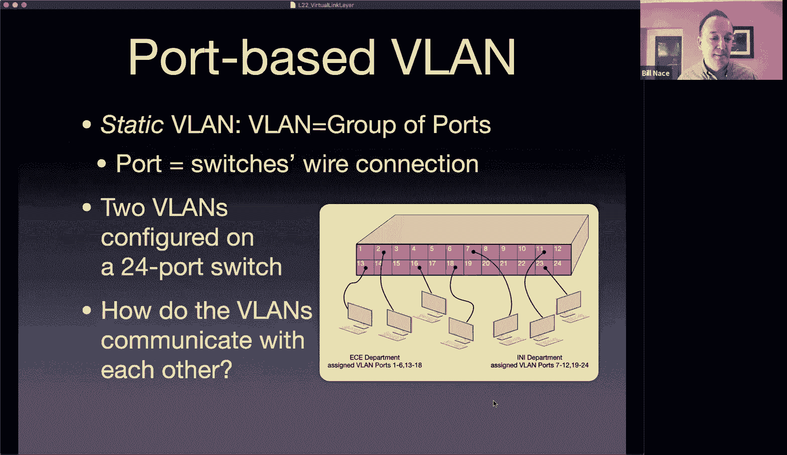

将所有设备直接连接到一台大型交换机在物理上可能可行，因为链路层本身就有地理范围限制。然而，原有的多设备架构在流量管理、访问控制和网络管理方面有其优势。

虚拟局域网就是一种技术，它允许我们将这些物理上连接到同一台交换机的链路层连接，逻辑上划分为多个独立的“虚拟”局域网。这样，我们既保持了物理连接的简洁性，又维护了不同部门网络之间的逻辑隔离。

### 基于端口的VLAN

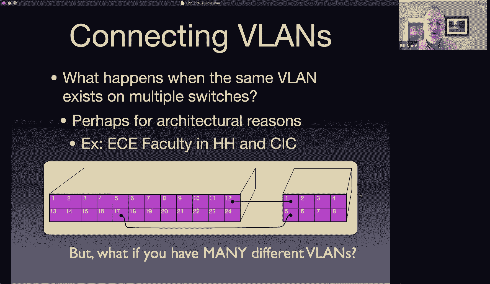

以下是创建VLAN的一种常见方法：基于端口的VLAN。

*   **工作原理**：网络管理员可以登录交换机，通过命令行界面指定哪些端口属于哪个VLAN。例如，可以指定端口1-8属于“ECE部门”VLAN，端口9-16属于“INI部门”VLAN。
*   **通信行为**：在同一VLAN内的计算机之间通信，就像它们直接连接在同一台交换机上一样。例如，VLAN A内的计算机发送帧给同VLAN内的另一台计算机，交换机会正常转发。
*   **隔离效果**：不同VLAN之间的计算机，即使物理连接到同一台交换机，也无法直接通信。从网络层面看，它们就像在不同的网络上。这可以防止流量泄露，实现管理隔离。

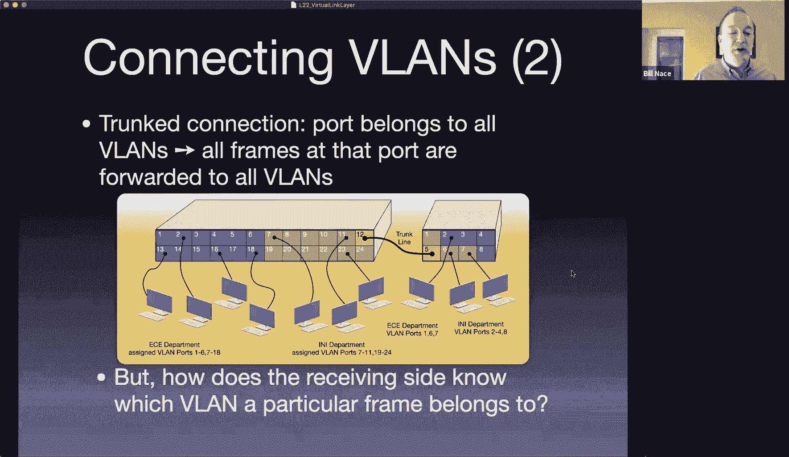

那么，为什么需要VLAN，而不是直接使用两台物理交换机呢？主要优势在于管理的灵活性。例如，当需要将一台计算机从一个部门调整到另一个部门时，管理员只需在交换机配置中将该计算机连接的端口重新分配到另一个VLAN即可，无需物理上移动线缆。

### VLAN间的通信与中继

既然VLAN之间是隔离的，如果一台计算机需要与另一个VLAN中的计算机通信，该怎么办？这需要网络层（第三层）设备的介入，即路由器。因此，要实现VLAN间通信，需要在网络中部署路由器。许多现代交换机集成了路由功能，被称为“三层交换机”。

接下来，我们看看如何连接多台交换机来扩展VLAN。我们可以将两台支持VLAN的交换机上属于同一VLAN的端口用线缆连接起来。但如果交换机有很多VLAN，为每个VLAN都拉一条线会非常低效。

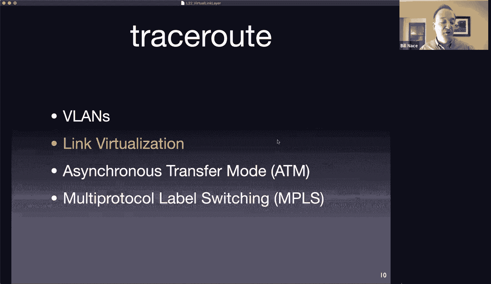

为了解决这个问题，我们引入了**中继**端口。中继线允许在单条物理链路上承载多个VLAN的流量。管理员只需将两台交换机上的各一个端口配置为中继端口，并用一条线缆连接它们即可。

但是，当帧通过中继线到达接收端交换机时，接收交换机如何知道这个帧属于哪个VLAN呢？它无法仅从标准以太网帧中判断。

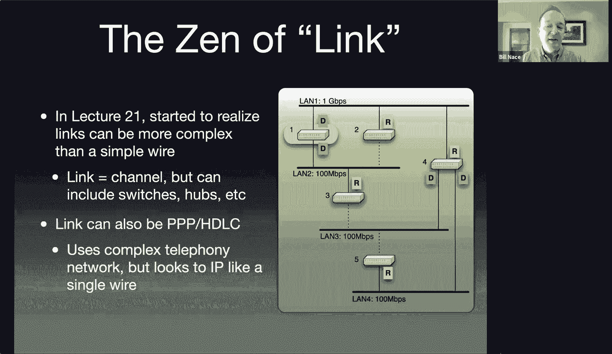

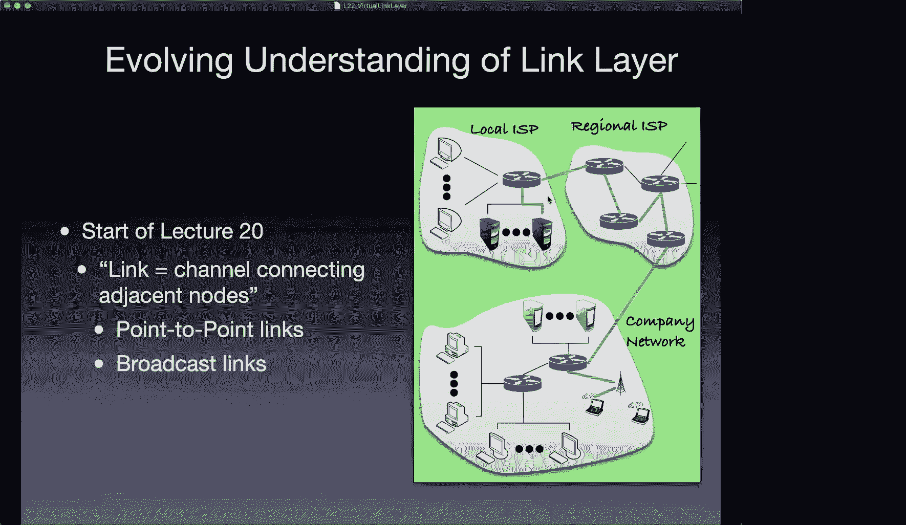

### 802.1Q标签以太网

为了让接收端能识别VLAN，我们需要修改协议。这就是**802.1Q标准**，也称为标签以太网。

*   **工作原理**：它在标准以太网帧的源地址和类型字段之间，插入一个4字节的**VLAN标签**。
*   **标签结构**：前2个字节是固定的`0x8100`，标识这是一个带标签的帧。后2个字节包含实际的VLAN ID等信息。
*   **处理流程**：发送端交换机（如连接中继线的交换机）在发送帧前插入VLAN标签。接收端交换机看到`0x8100`就知道这是带标签的帧，读取VLAN ID，确定帧属于哪个VLAN，然后通常会将标签移除，再将原始帧转发给该VLAN内的相应端口。

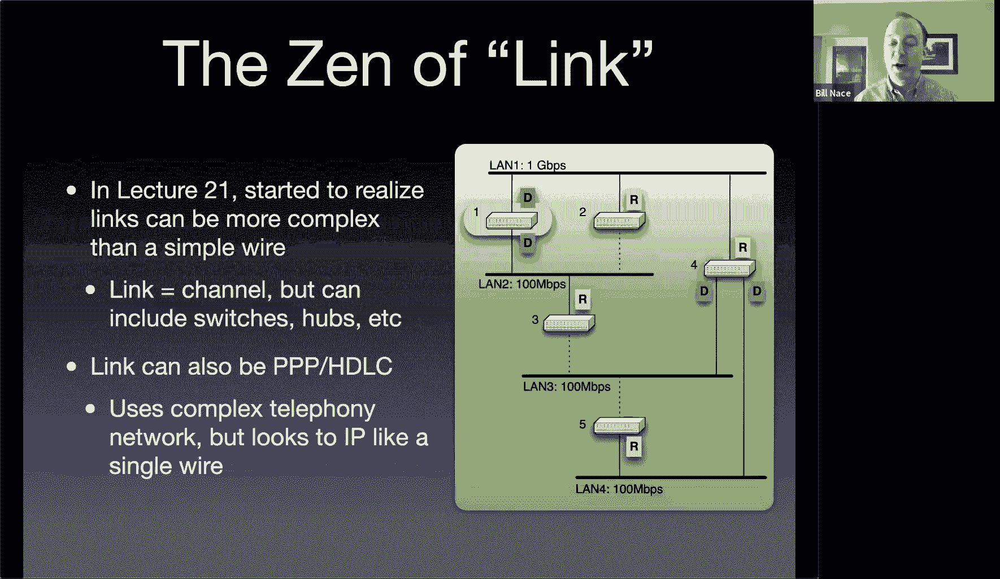

这样，通过中继和标签技术，我们就可以高效地构建和管理跨越多个交换机的复杂VLAN网络。

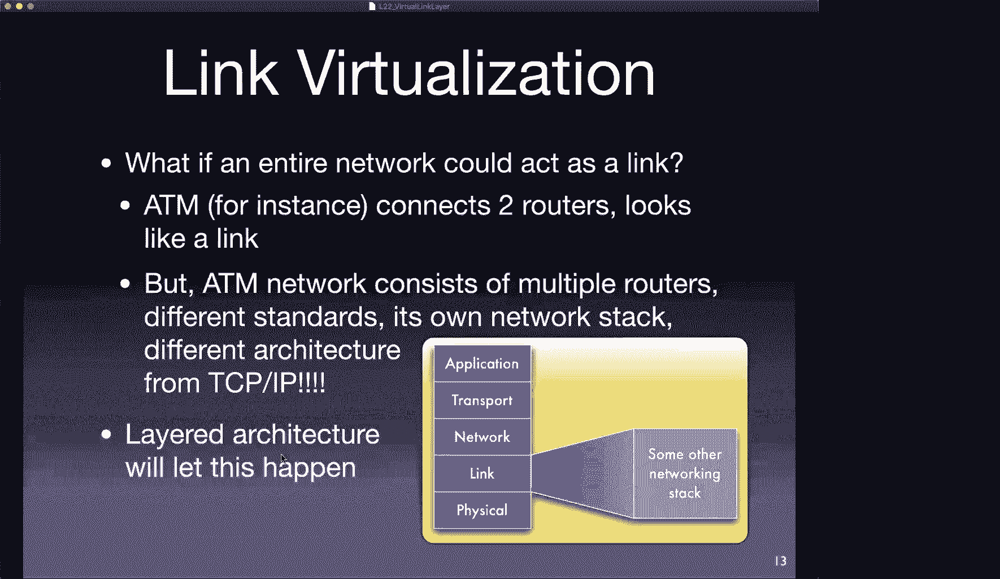

## 链路虚拟化

我们已经看到如何虚拟化局域网。现在，让我们从更广义的角度理解“链路虚拟化”——即一个链路层连接，其底层可能并非只是一条简单的电线。

### 链路概念的扩展

回顾数据链路层最初的模型，我们以为那些紫色的连接就是简单的点对点或广播链路。但随着引入交换机，整个由多个局域网和交换机构成的复杂网络，在上层看来就像一个单一的链路。这就是链路虚拟化的核心思想：**将一个网络（可能是非常复杂的网络）呈现为一条简单的链路**。

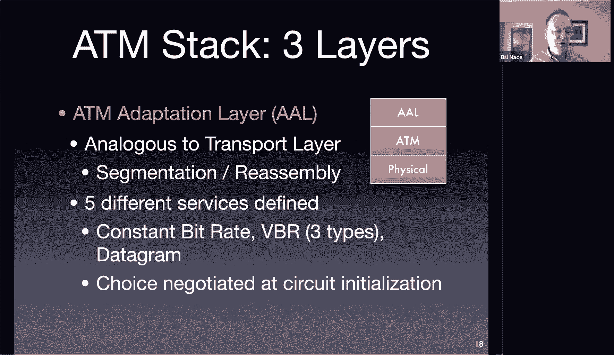

一个历史例子是拨号上网。用户的计算机通过调制解调器和电话网络，连接到互联网服务提供商。对于用户和ISP来说，这就像有一条直接的链路。但实际上，数据穿越了整个庞大的电话交换网络。我们将整个电话网络虚拟化成了一条数据链路。

### 在另一种网络技术上运行IP（以ATM为例）

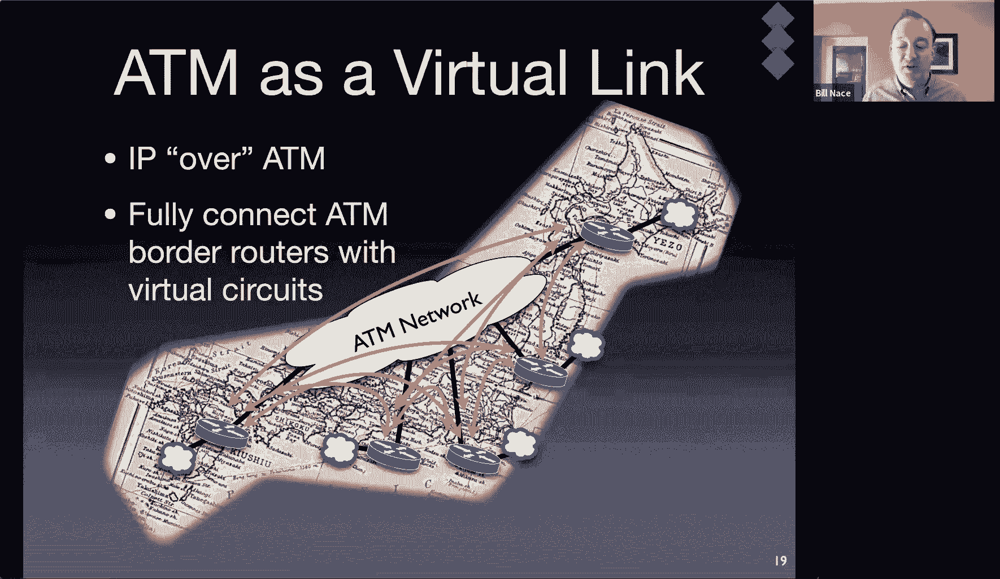

这种虚拟化思想可以解决实际问题。假设一个国家投资建设了庞大的ATM网络，后来互联网（基于IP）成为主流。他们不想废弃现有设施，就可以利用链路虚拟化，让IP网络运行在ATM网络之上。

**异步传输模式**（ATM）是另一种网络技术体系，它有自己的网络层（ATM层）、适配层（AAL）和物理层。ATM使用固定长度的小数据单元（53字节的信元，其中48字节为载荷），旨在为音视频等实时业务提供有保障的服务。

**如何实现IP over ATM？**
1.  在ATM网络的边界部署支持IP和ATM的“边界路由器”。
2.  当IP数据包到达边界路由器时，路由器通过类似ARP的协议，将目标IP地址映射为ATM的虚电路标识符。
3.  ATM适配层（AAL）将整个IP数据包分割成多个48字节的片段，封装进ATM信元。
4.  这些信元通过ATM网络内部的虚电路传输到目标边界路由器。
5.  目标边界路由器的AAL层将信元重组为原始的IP数据包，然后将其送入IP网络继续转发。

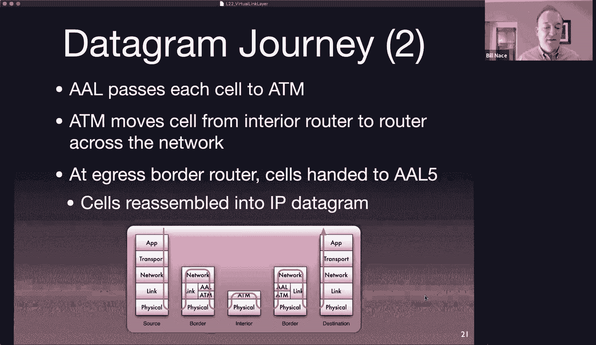

从IP层的视角看，两个边界路由器之间就像有一条直接的链路传输了数据包。而ATM网络则在底层完成了所有复杂的传输工作。这就是**链路虚拟化**的典型应用。实际上，RFC文档中定义了“IP over Everything”，包括IP over IP（用于隧道和加密）、甚至一些幽默的提案如IP over Avian Carriers（信鸽传输IP）。

## 多协议标签交换

另一个现代网络中广泛使用的虚拟化/标签技术是**多协议标签交换**。要理解MPLS，我们需要回顾数据封装的过程。

### 数据封装回顾

数据在网络中传输时被层层封装：
*   **应用层消息**（如HTTP请求）作为载荷，被封装在...
*   **传输层段**（如TCP段）中，其头部包含端口号等信息；TCP段作为载荷，被封装在...
*   **网络层数据包**（如IP数据包）中，其头部包含IP地址等信息；IP数据包作为载荷，被封装在...
*   **链路层帧**（如以太网帧）中，其头部包含MAC地址等信息，尾部有CRC校验。

MPLS的思想是，在以太网帧头和IP数据包头之间，插入一个**MPLS标签头**。这样，我们就相当于在数据链路层和网络层之间增加了一个“垫片”层。

### MPLS头部结构

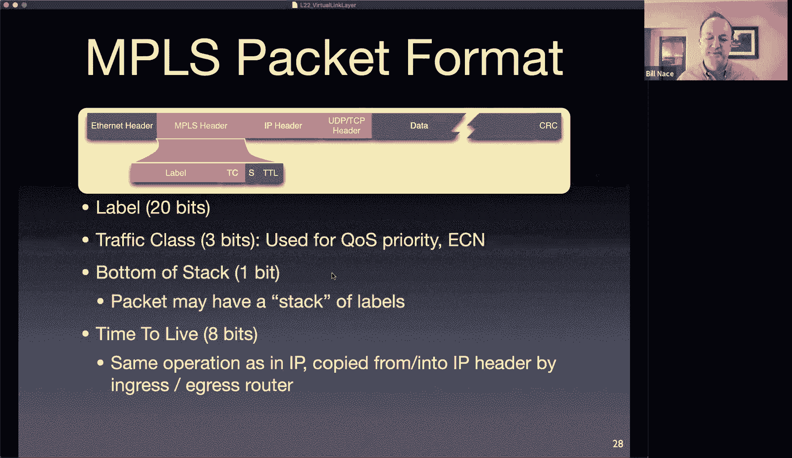

MPLS标签头包含以下字段：
*   **标签**：20位，用于转发的关键标识。
*   **流量类别**：3位，用于服务质量优先级。
*   **栈底标志**：1位，指示这是否是最后一个MPLS标签（可以嵌套多个标签）。
*   **生存时间**：8位，类似IP的TTL，每经过一个MPLS路由器减1，最终会复制回IP头的TTL字段。

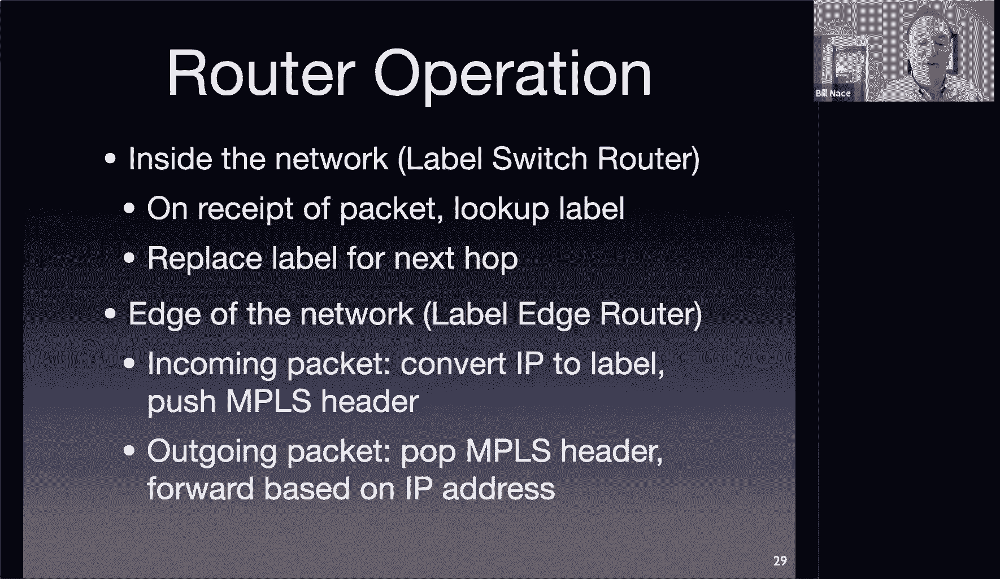

### MPLS网络架构与转发

MPLS网络中有两种路由器：
*   **标签边缘路由器**：位于MPLS网络边界，负责在入方向为IP包添加MPLS标签，在出方向移除标签并恢复IP包。
*   **标签交换路由器**：位于MPLS网络内部，仅根据MPLS标签进行转发，不查看IP头。

MPLS的转发类似于虚电路网络：
1.  转发表示例：`入标签 -> 出标签，出接口`。
2.  数据包进入LSR时，路由器查看其入标签，查询转发表，将标签**替换**为新的出标签，并从指定接口转发出去。
3.  这个新标签是下一跳路由器预期接收的标签。因此，标签只在相邻路由器间局部有效，沿途会被不断交换。

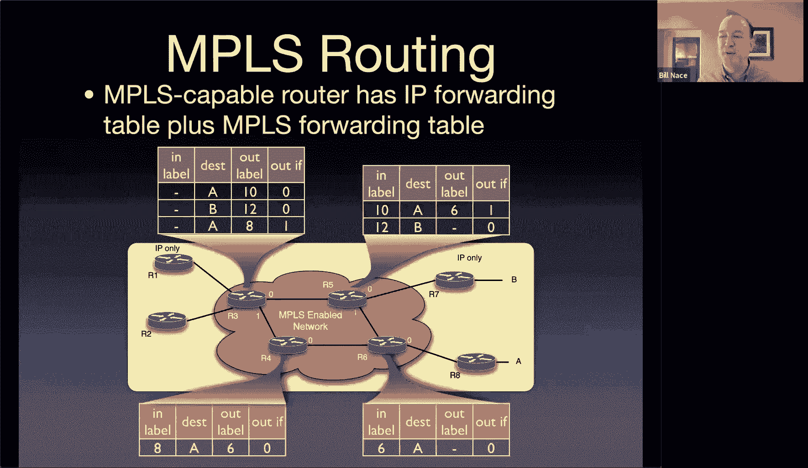

### MPLS的优势

*   **转发效率**：在网络内部，转发决策基于固定长度的短标签，查表速度比IP的最长前缀匹配更快。
*   **流量工程**：MPLS打破了IP“单一路由”的限制。网络管理员可以显式指定数据流经过的路径，实现负载均衡、备份路径快速切换等。
*   **灵活性**：MPLS标签本身不规定用途，这带来了巨大灵活性。除了流量工程，还可用于构建**虚拟专用网络**，在公网上创建加密的私有通道，或者为特定类型的流量（如实验数据）打上标签以便跟踪和管理。

## 总结

本节课中我们一起学习了链路层的“虚拟”概念。
*   我们首先探讨了**虚拟局域网**，它允许在单一物理网络基础设施上创建多个逻辑隔离的网络，并通过802.1Q标签和中继技术实现跨交换机的扩展。
*   接着，我们了解了**链路虚拟化**的广义概念，即一个复杂的底层网络（如ATM网络）可以被上层协议（如IP）视为一条简单的链路，并通过IP over ATM的例子说明了其应用。
*   最后，我们深入研究了**多协议标签交换**，这是一种通过在数据包中插入标签来实现高效、灵活转发的技术，它支持流量工程、VPN等高级网络功能，是现代运营商网络中的关键技术。

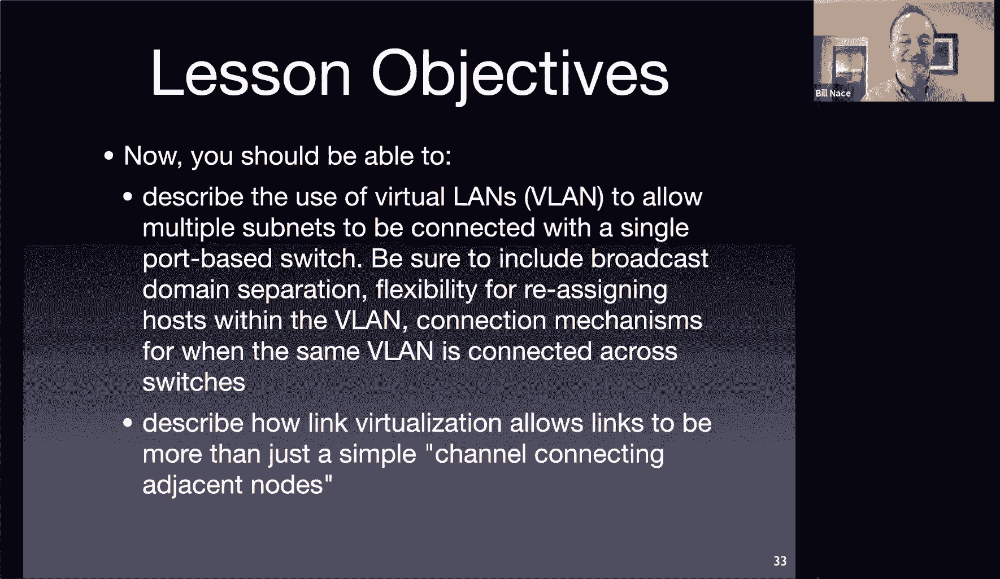

通过这些技术，我们认识到数据链路层远不止是物理电缆的连接，而是一个可以通过虚拟化提供强大管理能力和灵活性的层次。