# 25：无线网络

## 概述
在本节课中，我们将要学习无线网络，特别是Wi-Fi的工作原理。我们将探讨无线网络在数据链路层面临的独特挑战，以及用于克服这些挑战的关键协议，如CSMA/CA。课程内容将涵盖无线通信的基本原理、隐藏终端问题、冲突避免机制以及Wi-Fi帧结构。

---

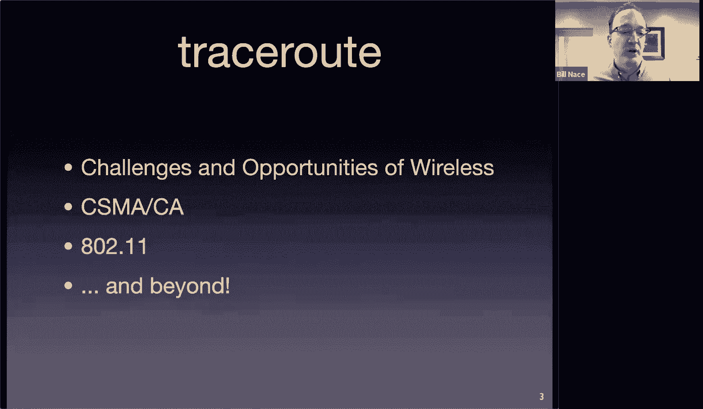

## 无线网络简介与挑战
无线网络使我们能够摆脱线缆的束缚，实现移动设备间的通信。然而，无线网络比有线网络更复杂，因为它需要模拟物理上不存在的线缆连接。

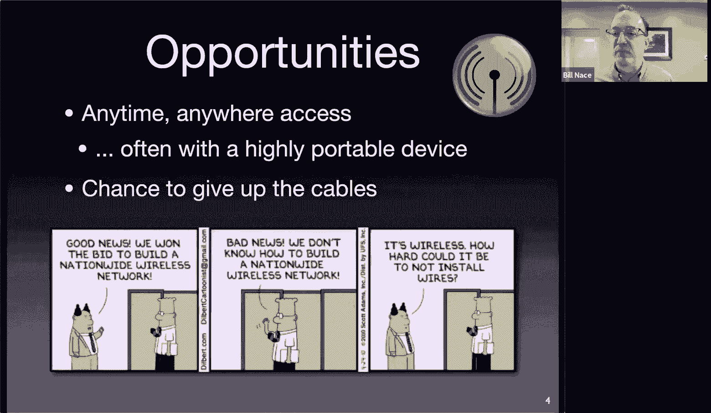

无线网络通常以基础设施模式运行，其中设备通过接入点进行通信。接入点及其覆盖范围内的设备共同构成一个基本服务集。

无线网络面临两大主要挑战：
1.  **移动性问题**：设备在不同子网间移动时，IP地址会改变，这会中断现有的TCP连接。
2.  **无线链路特性带来的问题**：这是本节课的重点，包括信号衰减、高误码率、多径效应以及隐藏终端问题。

---

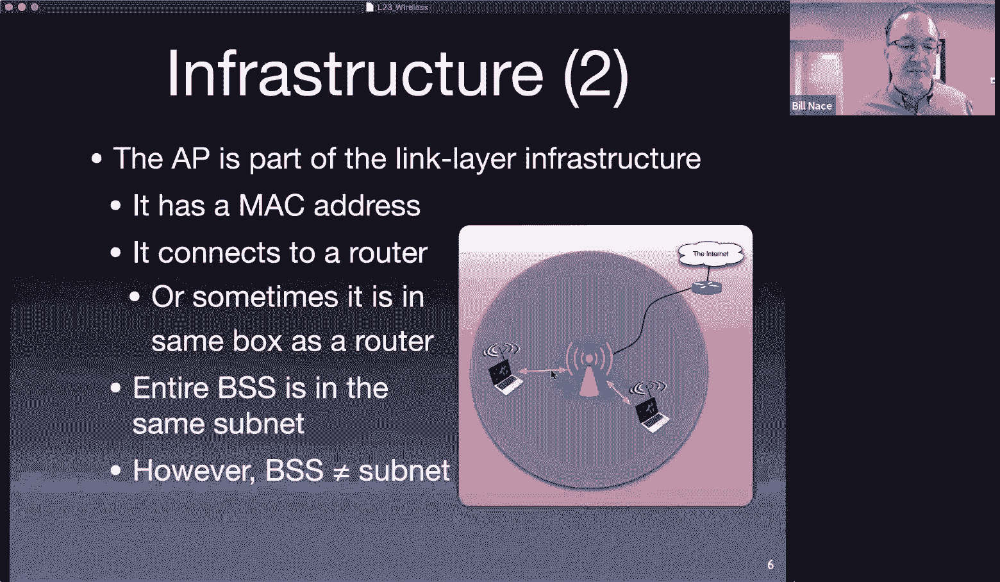

## 无线通信的物理层挑战
无线通信使用无线电波，其特性带来了独特的挑战。

**信号衰减**
接收天线接收到的功率遵循**弗里斯传输公式**：
`Pr = Pt * Gt * Gr * (λ² / (4πR)²)`
其中，`Pr`是接收功率，`Pt`是发射功率，`Gt`和`Gr`是天线增益，`λ`是波长，`R`是距离。公式中的`4πR²`表明，信号功率随距离平方衰减，这限制了通信范围。

**高误码率**
无线环境中的噪声（如宇宙背景噪声、其他设备干扰）远高于有线环境，导致比特错误率显著升高。例如，误码率为`10⁻⁴`意味着每传输10,000比特就可能有一个错误，这对于包含数千比特的帧来说是严重问题。

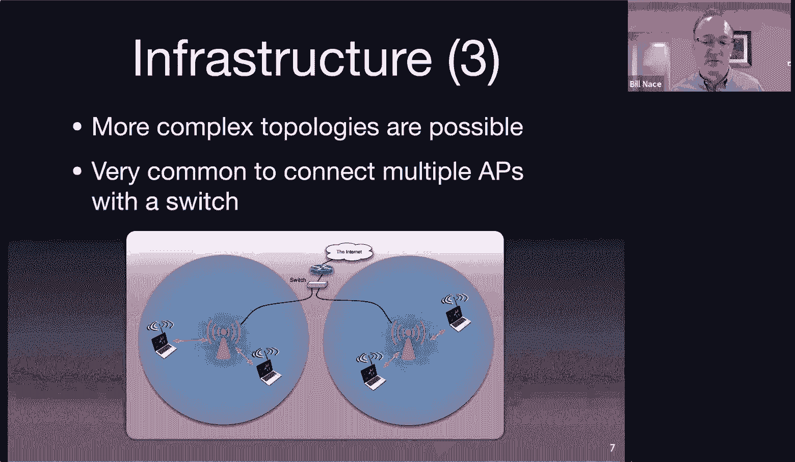

**多径效应**
无线电波会通过直射、反射等多种路径到达接收端。这些不同路径的信号叠加可能造成干扰，虽然信号处理技术可以部分消除这种影响，但在城市等多反射环境中仍是一个挑战。

**隐藏终端问题**
这是无线网络中的一个关键问题。如下图所示，两个终端设备（A和B）都在接入点的覆盖范围内，可以分别与接入点通信，但它们彼此在通信范围之外，无法直接侦听到对方。

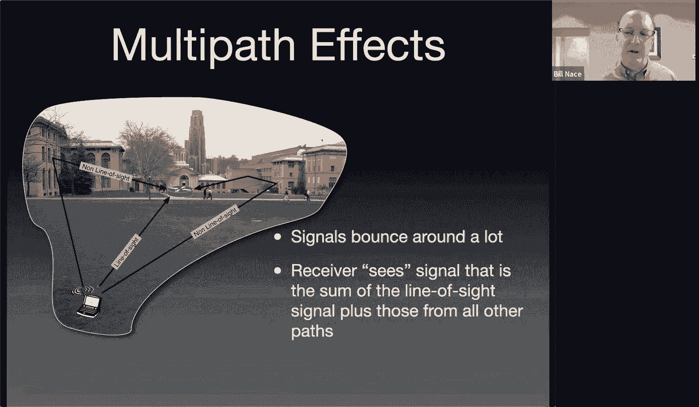

因此，当A和B同时向接入点发送数据时，它们的信号会在接入点处发生碰撞，而A和B自身却无法检测到这个碰撞，因为它们听不到对方。

**暴露终端问题**
这个问题在无基础设施的Ad-hoc或网状网络中更为常见。如下图所示，A和B可以互相听到，但它们的接收方A‘和B’却听不到对方的发送方。

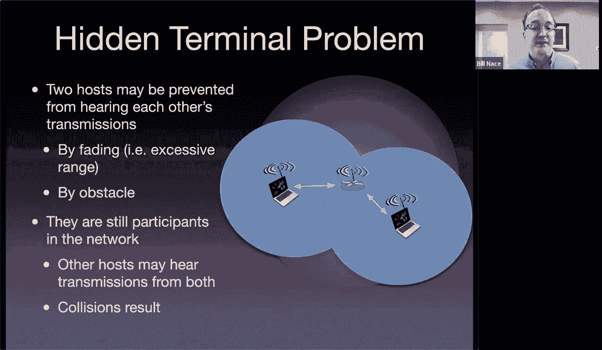

这导致A和B会因为听到对方发送而推迟自己的传输，即使它们同时发送也不会在接收端产生碰撞，从而造成了信道资源的浪费。

---

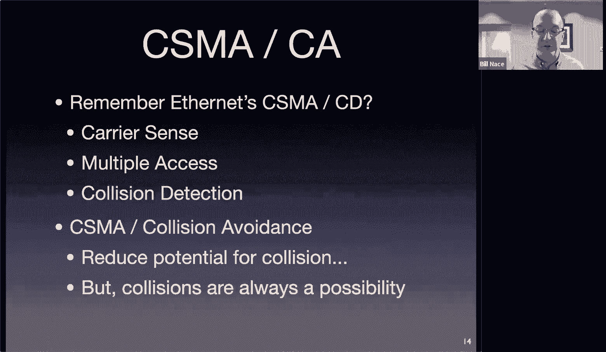

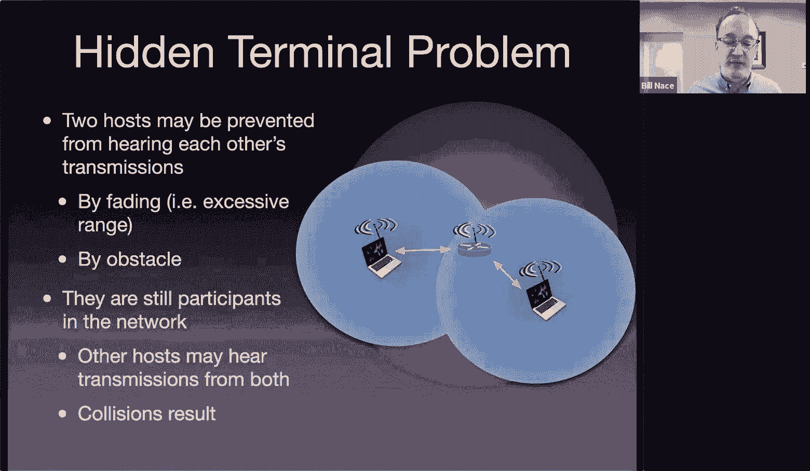

## CSMA/CA：载波侦听多路访问/冲突避免
为了解决无线网络的媒体访问和冲突问题，Wi-Fi采用了CSMA/CA协议。它与以太网的CSMA/CD类似，但用“冲突避免”取代了“冲突检测”，因为无线设备无法在发送的同时侦听信道。

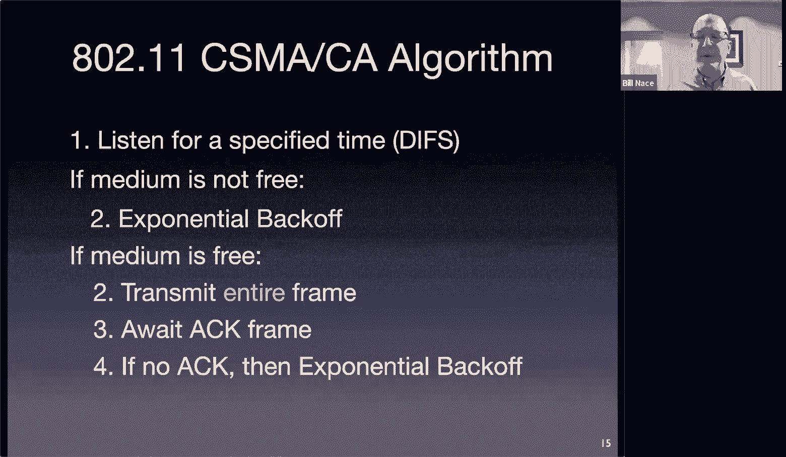

以下是CSMA/CA的基本步骤：

1.  **载波侦听**：发送前，设备先侦听信道一段时间（DIFS，分布式帧间间隔，约50微秒）。
2.  **信道空闲**：如果DIFS期间信道一直空闲，设备立即发送数据帧。
3.  **信道忙或发生冲突**：如果侦听到信道忙，或者发送数据帧后未收到确认帧（ACK），设备则启动**指数退避**过程。
    *   从竞争窗口中选择一个随机退避时间。
    *   只有在信道持续空闲时，才递减退避计数器。
    *   如果信道变忙，则暂停递减，直到信道再次空闲一个DIFS时间后继续。
    *   当退避计数器减到零时，设备尝试发送。
4.  **确认机制**：接收方（通常是接入点）成功收到数据帧后，会等待一个较短的时间（SIFS，短帧间间隔），然后发回一个ACK确认帧。发送方收到ACK才认为传输成功。

这个退避过程中“只在信道空闲时计数”的规则，有助于避免多个等待设备在同一个繁忙帧结束后立即同时发送，从而减少连续碰撞的概率。

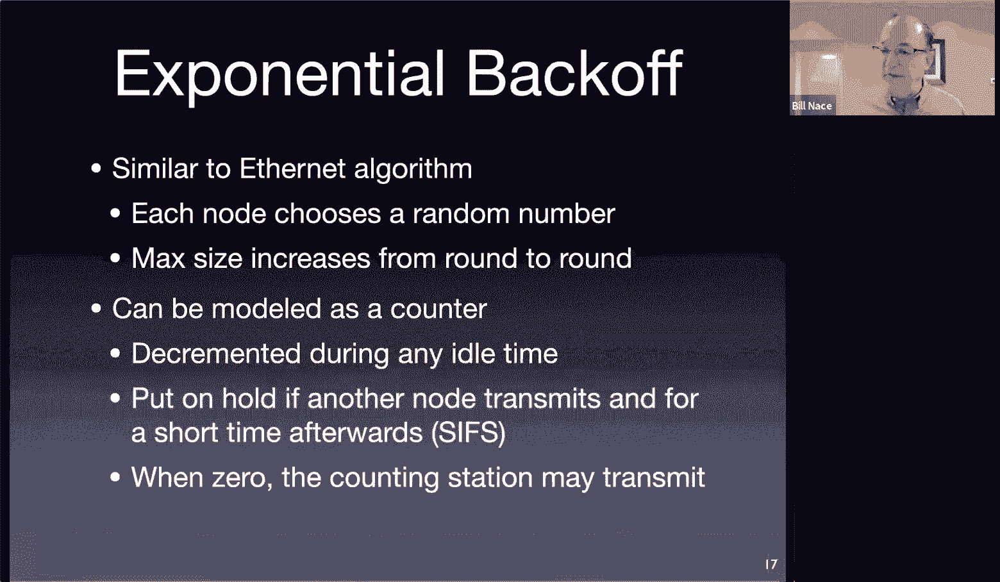

---

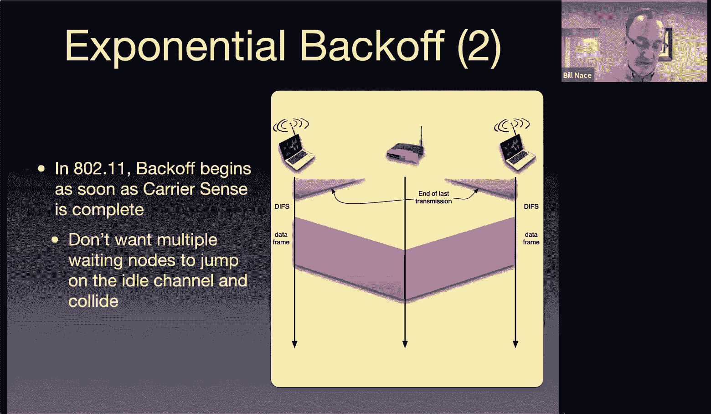

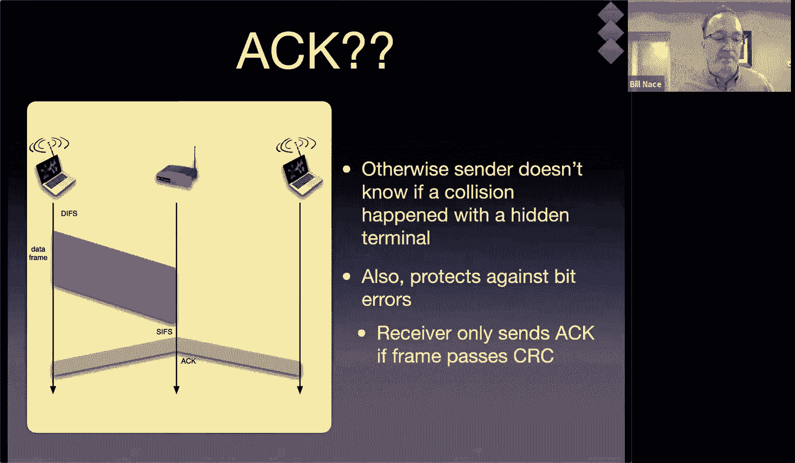

## RTS/CTS：请求发送/清除发送
为了进一步解决隐藏终端问题，Wi-Fi引入了可选的RTS/CTS握手机制，用于在发送大数据帧前预约信道。

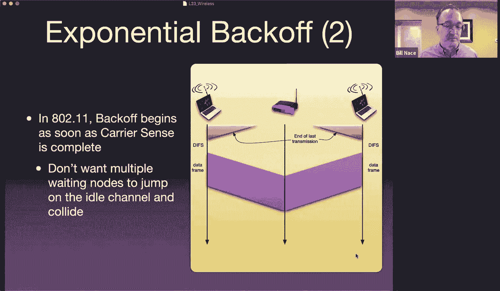

以下是RTS/CTS的工作流程：

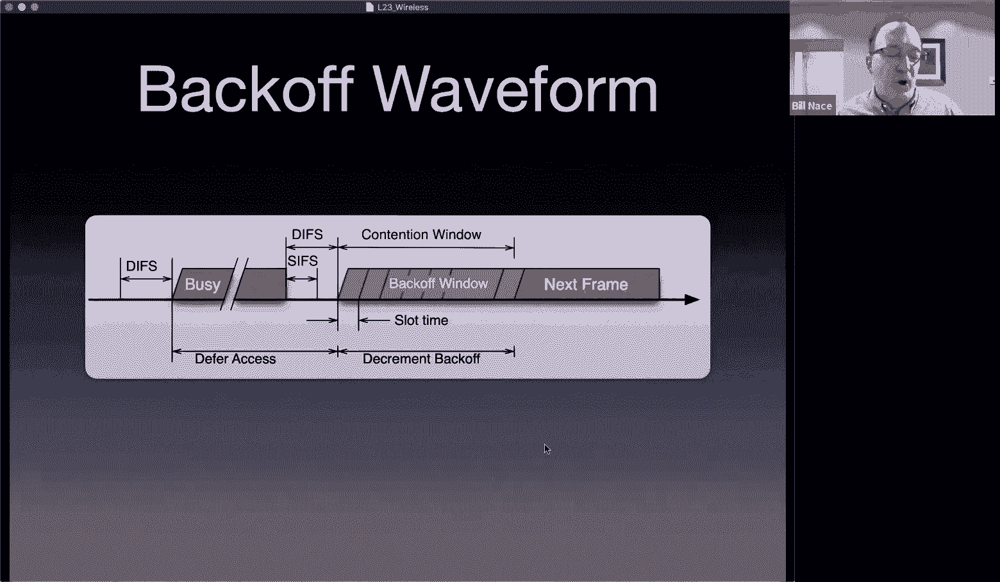

1.  **发送RTS**：发送方在竞争到信道后，不直接发送数据帧，而是先发送一个短小的**请求发送**帧。RTS帧中包含希望预约的信道占用时间。
2.  **回复CTS**：接入点收到RTS后，回复一个**清除发送**帧。CTS帧同样包含信道预约时间。
3.  **信道预约生效**：由于接入点能被BSS内所有设备听到，CTS帧相当于一个广播通告，告知所有设备：“在接下来的X时间内，信道已被预约，请保持静默。”
4.  **发送数据**：发送方收到CTS后，知道信道已预留，便可以在SIFS后发送数据帧。
5.  **确认**：接收方成功接收数据后，回复ACK。

这个过程虽然增加了RTS和CTS两个小帧的开销，但能有效避免在传输长数据帧期间因隐藏终端导致的碰撞，特别在传输大文件时是值得的。

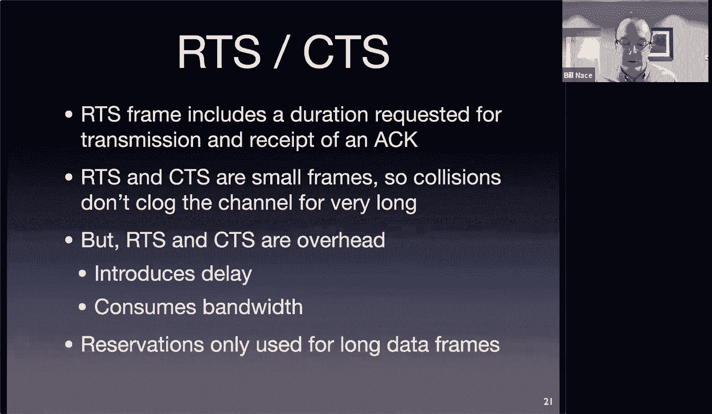

---

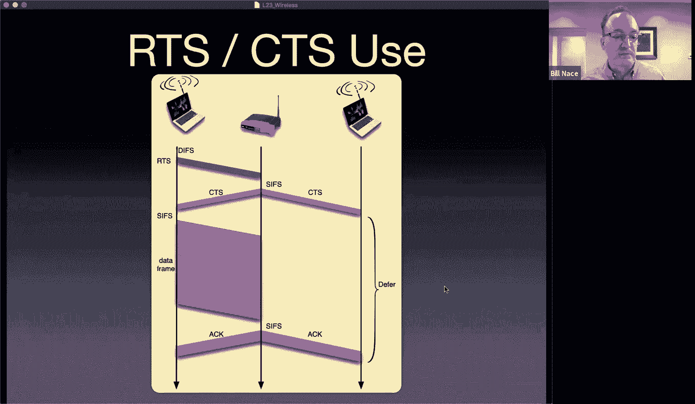

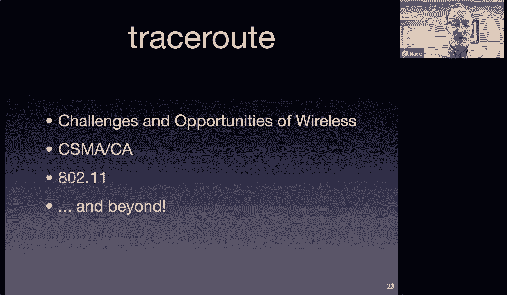

## Wi-Fi标准与帧结构
Wi-Fi标准（IEEE 802.11系列）自1997年诞生以来不断演进，速度、频率和特性持续提升，从802.11a/b/g/n到现在的Wi-Fi 6/7。

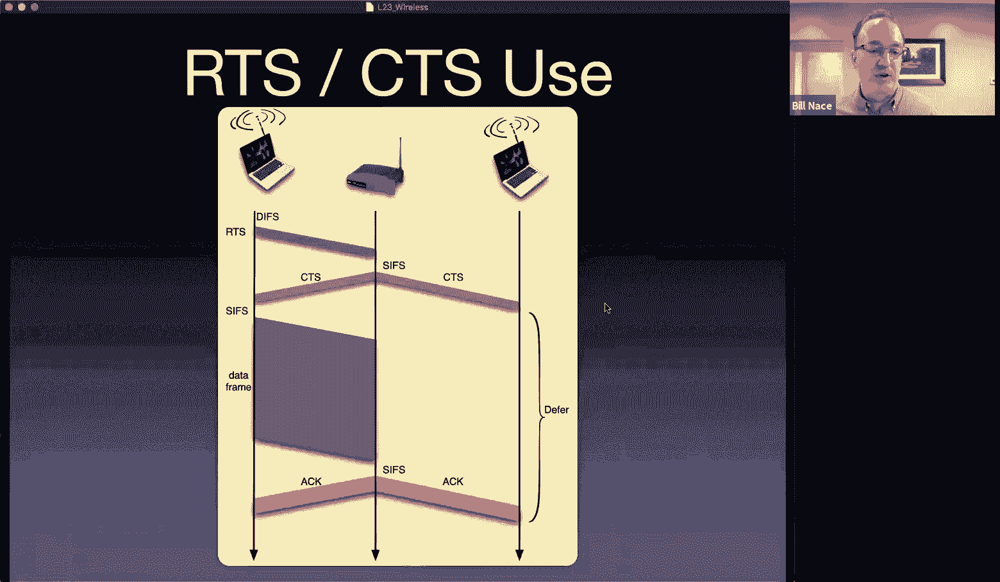

**Wi-Fi帧结构**
Wi-Fi帧的头部比以太网帧更复杂，最显著的特点是它包含**四个地址字段**：

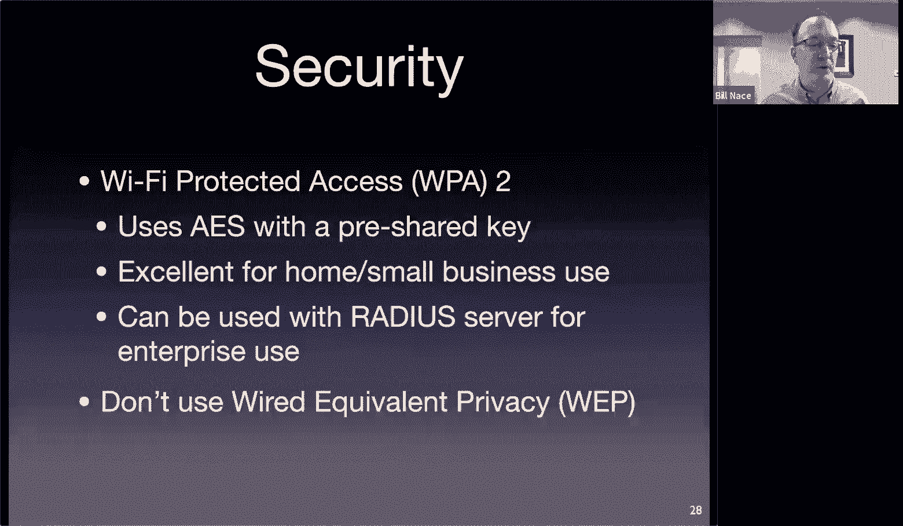

*   **地址1**：接收方地址（直接接收此帧的设备，通常是接入点）。
*   **地址2**：发送方地址（发送此帧的设备）。
*   **地址3**：用于在基础设施模式中，指示数据最终要到达的**路由器接口地址**（即默认网关）。
*   **地址4**：在Ad-hoc网状网络中用于多跳转发。

**地址3的作用示例**：
当你的笔记本电脑向互联网发送数据时，它构造的Wi-Fi帧中：
*   地址1是接入点的MAC地址。
*   地址2是你电脑的MAC地址。
*   地址3是默认网关的MAC地址。
接入点收到帧后，取出数据载荷，将其封装到一个新的以太网帧中，该以太网帧的目的地址就是地址3（网关），从而将数据传递给网络层的路由器。

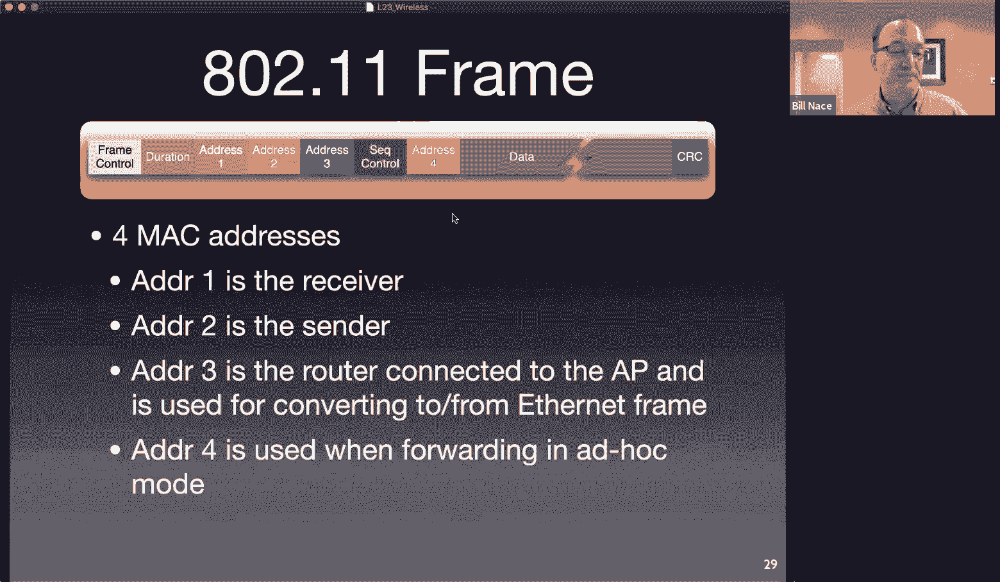

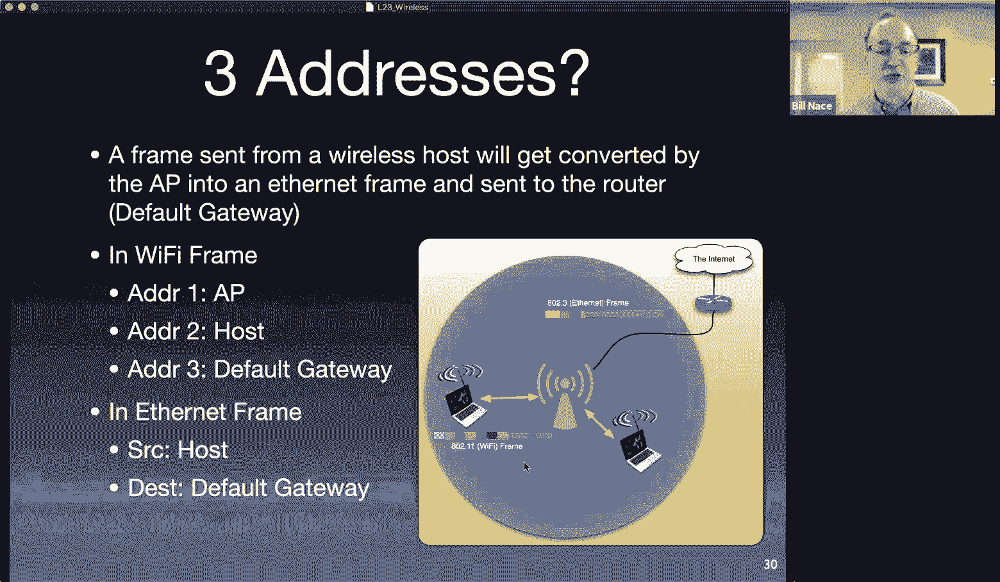

**帧控制字段**
帧头部的控制字段包含许多重要信息：
*   **持续时间**：用于RTS/CTS预约信道的时间值。
*   **序列控制**：提供序列号，结合ACK机制，在数据链路层实现了**可靠的帧传输**。
*   **更多分片**：允许将大帧分片传输，在高误码率环境中，重传小分片比重传整个大帧更高效。
*   **功率管理**：允许设备通知接入点它将进入睡眠模式以省电，接入点会为其暂存数据。
*   **速率控制**：接入点可以指示设备调整发送速率，以更好地适应信道条件。

---

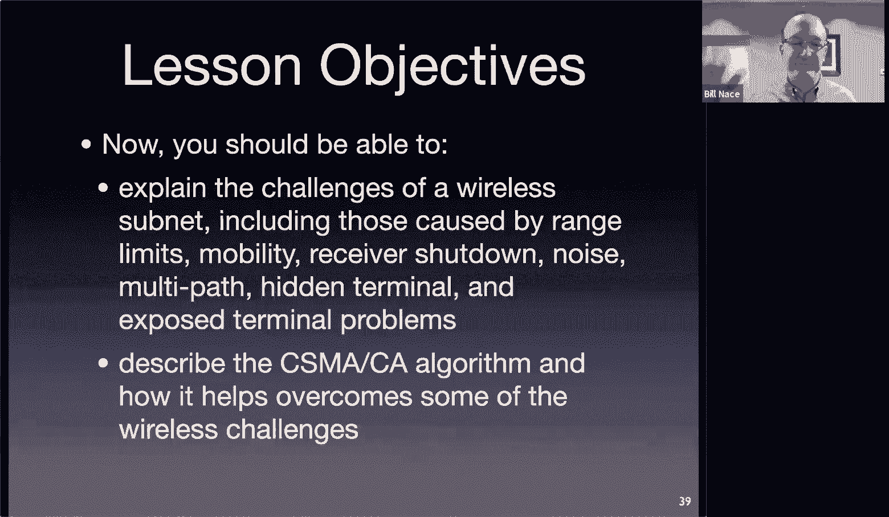

## 总结
本节课中我们一起学习了无线网络的核心知识。我们了解到无线网络因其物理媒介的特性，面临着信号衰减、高误码率和隐藏终端等独特挑战。为了应对这些挑战，Wi-Fi采用了CSMA/CA协议进行信道访问和冲突避免，并可选地使用RTS/CTS握手机制来预约信道、解决隐藏终端问题。我们还探讨了Wi-Fi帧的结构，特别是其四个地址字段的用途，以及帧控制字段如何支持可靠传输、分片、功率管理等高级功能。无线网络是一个广阔且不断发展的领域，除了Wi-Fi，还包括蜂窝网络、无线传感网和个域网等多种技术。