# 26：软件定义网络 (SDN) 🚀

在本节课中，我们将要学习软件定义网络（SDN）的核心概念。SDN是一种创新的网络架构，旨在解决传统网络僵化、难以实验和创新的问题。我们将探讨其工作原理、关键组件以及实际应用。

---

## 课程与考试安排 📅

首先，我们来看一下本学期的剩余安排。Lab 3需要在周日晚上前完成。期末考试将在周二举行，这是一场闭卷考试，在Canvas上进行。考试中不需要计算器，如果涉及排队论问题，会提供与Quiz 1相同的标准公式表。

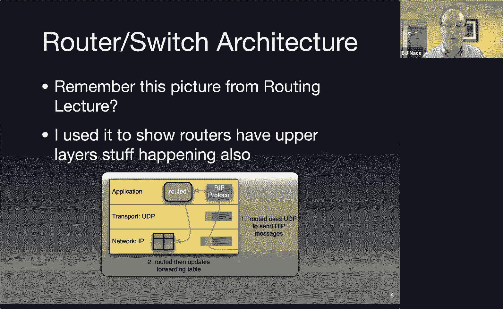

---

## 传统网络的挑战与SDN的诞生

上一节我们介绍了课程安排，本节中我们来看看SDN出现的背景。你阅读了2008年关于SDN的基础性论文。这篇论文针对特定情况，但回应了许多人感受到的网络现状：网络已经变得僵化，成为一个庞大的单体结构。你很难对它进行实质性改变，只能进行微调。进行基础实验和有意义的研究变得非常困难，很多时候研究只能在模拟环境中进行。由于规模问题，模拟无法准确反映真实网络的特性，有时会产生不同的效果。例如，在RED网关的讲座中我们提到，RED算法最初基于研究实验室的模拟，但当人们开始实际部署时，发现网络规模导致计时循环存在偏差等问题。当你无法在真实互联网上模拟互联网时，就会面临这种情况，因为网络中有太多难以改变的组件。

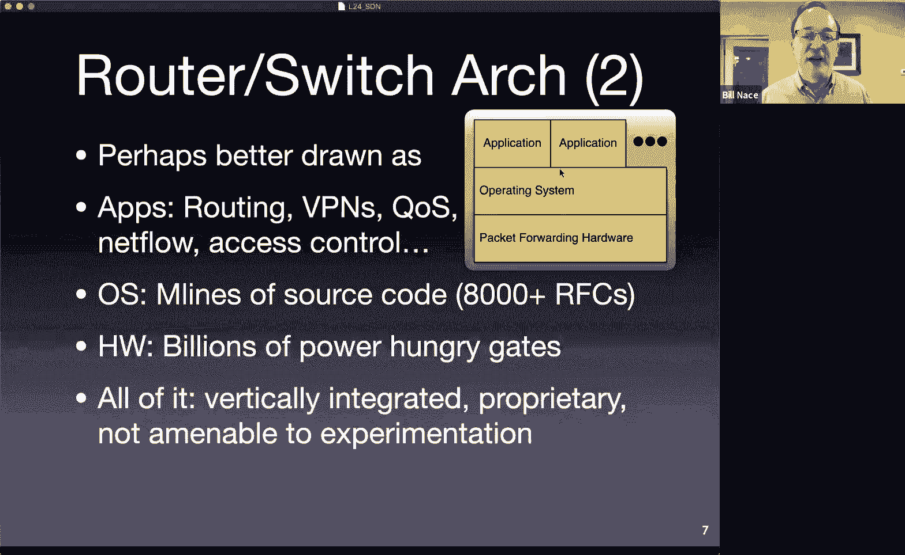

在其他领域，协议和标准的开放允许许多参与者进入系统并进行实验和改进。回顾20世纪80年代末90年代初，你会从当时的操作系统和计算机硬件/软件系统的“开放战争”中认出这一点。问题在于，如果你有一种方式可以与系统交互，这种方式可能不是其内部专有的运行机制，而是一个虚拟化的接口。这允许运行该系统的公司之外的其他实体进行实验和改变。通常，运行系统的公司不喜欢这样，因为这迫使他们改变，并可能迫使他们推出他们不想要或尚未准备好的产品，在这个过程中他们常常会亏损。但这为其他所有人提供了更好的环境，因为每个人都能获得更优质、更便宜的产品。

你可能会说，我们实际上有很多开放标准，网络不就是由一大堆我们可以阅读、可以自己实现、可以构建的RFC组成的吗？这个论点很有道理。如果你想了解HTTP的工作原理，想实现自己的版本，想进行修改，你确实可以做到。问题在于，有一些对网络运行至关重要的组件，尤其是在大规模层面，它们并不开放，那就是路由器和交换机内部本身。

我们知道在这些交换机和路由器上运行什么协议，但我们无法影响这些设备的实际运行，因为它们是专有设备。任何允许你调整其运行的“旋钮”都是由供应商提供的，并且是以专有的方式实现的。你需要支付高昂的许可费用，这尤其不利于论文中所说的、在世界各地大学实验室进行的网络研究。

---

## 路由器的内部视角

还记得我们讨论路由时的这张图吗？我们当时在谈论RIP（一种内部网关协议），我指出RIP通过向其他路由器元素发送UDP消息来运行。我们当时说，等等，UDP是传输层协议，路由不是发生在网络层吗？这就是我所说的内部接口的一个好例子。是的，我们可以理解RIP协议，理解这些消息中包含哪些比特位，因此当UDP消息发送到网络上时，我们理解其工作原理，也理解应用程序如何与其他路由器上的应用程序通信。但这一部分（指路由信息如何进入转发表）完全是专有的。

我可以从路由器本身的角度稍微不同地重绘协议栈。我可以这样说：我们有一个像`routed`这样的应用程序，它运行在一个操作系统上。记住，路由器本质上是大型计算机，它们是专用计算机，以非常特殊的方式工作，但它们运行自己的操作系统。思科、瞻博网络或其他公司负责创建这个操作系统，并以一种所有应用程序都能在该硬件上运行的方式构建它。顺便说一下，我这里说的“应用程序”指的是路由器需要执行的功能，路由是其中之一。你可能还有其他需要在上面运行的功能，这些都会成为应用程序。例如，我们讨论网络监控时，会有一个应用程序响应SNMP请求，以便从实际路由器中提取信息并发送回某处，这就是一个运行在这里的应用程序。根据你想如何控制路由器、希望路由器能做什么，你会有许多这样的应用程序。基本上，任何需要实现的RFC协议都会作为一个应用程序来实现。

这些应用程序运行在操作系统上，如前所述，操作系统当然运行在硬件上。路由器中有CPU，但对我们这里讨论更重要的是与实际转发表、实际执行最长前缀匹配查找的硬件之间的接口。所有这些都不是开放的。例如，我无法决定改变操作系统的工作方式，比如让我在这台设备上加载Linux，你做不到。它与运行在那里的特定硬件紧密绑定，你无法访问任何内部信息。思科或其他大公司也不会让你访问。这是他们的价值主张所在：让这些应用程序能在他们的硬件上运行。

---

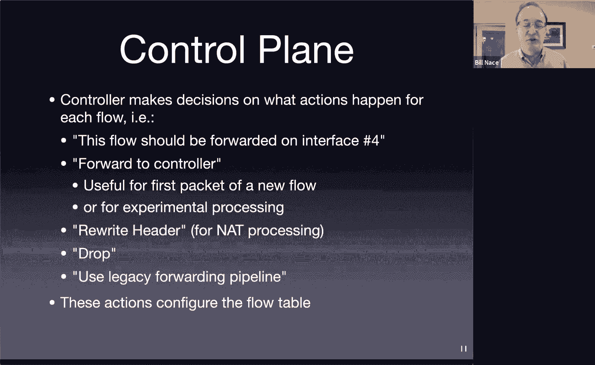

## 控制平面与数据平面的分离

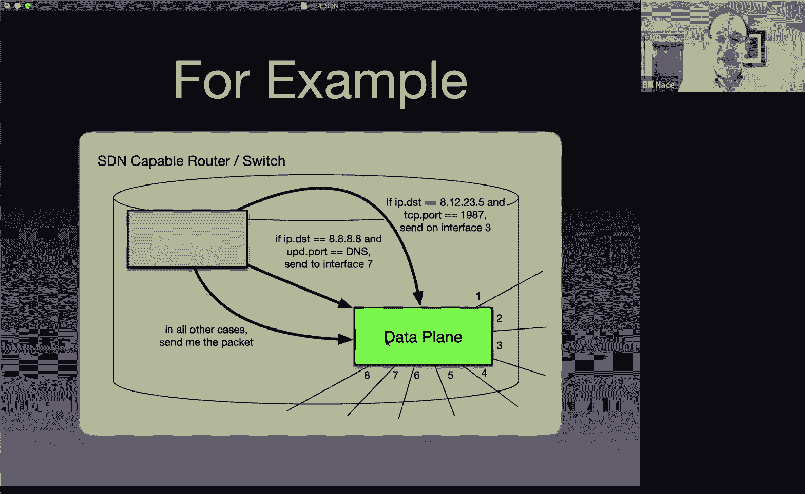

好了，让我们退一步，思考一下我们在路由器网络层看到的那些功能。记得我们将其分为控制平面操作和数据平面操作。我们基本上说过，有路由相关的事情需要发生，有路由算法，比如运行OSPF、BGP等，计算实际路由，这些是控制平面的东西。这是为了确定哪些路由实际传播到转发表中的复杂机制。而转发表是数据平面的一部分，当然，就是当数据包到达时，我们需要确定它该往哪个方向去的处理过程，这就是转发部分。

Stephanos指出路由器有开源操作系统，OpenWRT就是其中之一。我使用过它，它很棒，可以把它装在你家里的路由器上，做其他很酷的事情。但要认识到，这只能运行在你家里100美元的Linksys盒子上，你无法让它运行在价值25万美元、位于互联网核心进行路由的思科路由器上。我考虑的是大规模网络。如果你想用一堆小型Linksys盒子模拟网络进行研究，你同样会遇到小规模模拟的问题。

那么，SDN在做什么？正如你在论文中读到的，SDN试图在网络中的路由器和交换机内部的控制平面和数据平面之间建立一个标准化接口。这样我们就可以用软件来定义数据平面的工作方式。如果这是一个标准化接口，你就可以在不改变硬件的情况下改变软件部分。这将允许你编写不同的软件，添加新功能，实现论文中描述的那种机构性研究。

是的，正如Cardik指出的，我不想让人觉得思科只有封闭的商业垄断，除了收取高额费用什么都不做。他们是一家提供支持并做很多其他事情的公司。人们花25万美元购买思科路由器，通常不仅仅是为了硬件本身。Cardik指出，思科提供了大量官方支持，他们非常擅长追踪网络中任何人可能想使用的任何协议并实现它。

---

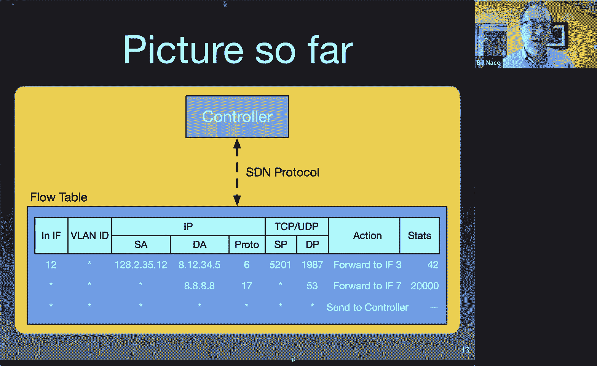

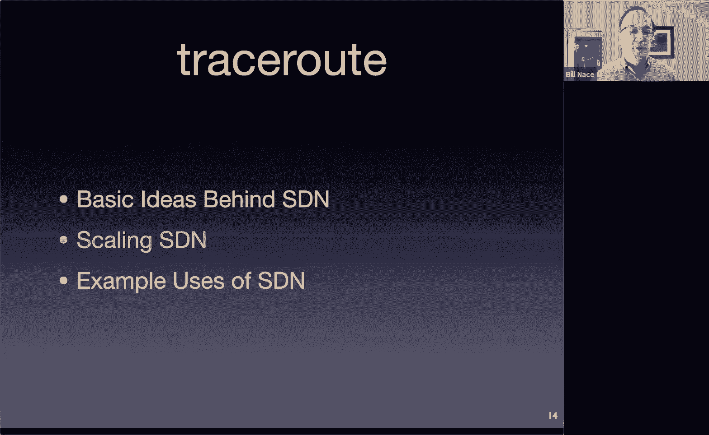

## SDN的工作原理

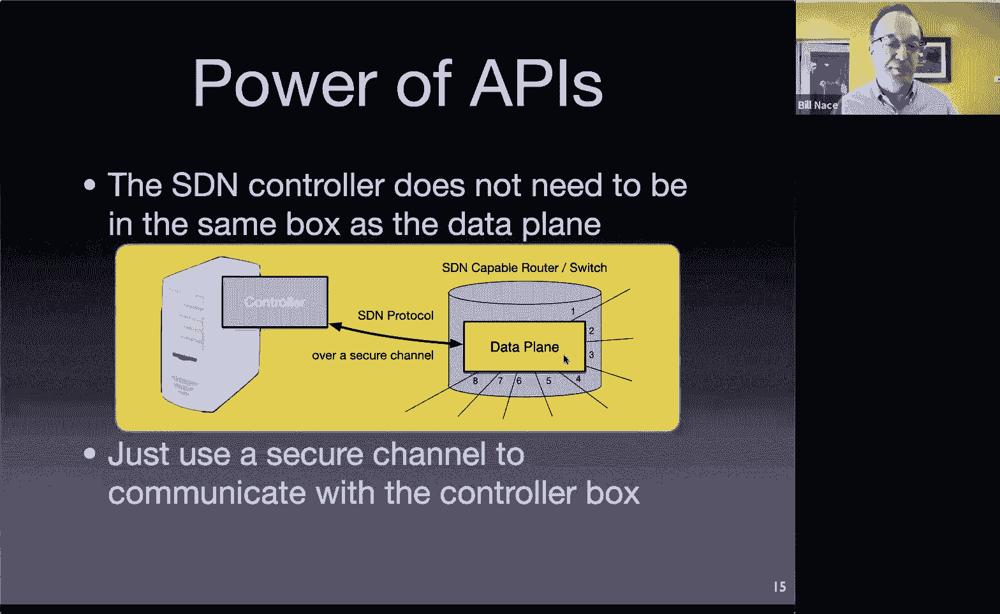

那么，SDN如何工作？我们将有意分离数据平面和控制平面。数据平面将保持专有，并保持以硬件为中心。它不一定是硬件，但我们将其视为执行转发的硬件。有一种叫做TCAM（三态内容可寻址存储器）的东西，它实际上是构成昂贵高速路由器的常见硬件设备。这些部件执行查找和匹配。内容可寻址存储器是一种你可以提供部分数据，它会非常快速地在内存中搜索并找到匹配该数据的行的存储器，这听起来正是我们进行前缀查找所需要的。之所以是三态内容可寻址存储器，是因为你需要查找匹配0、1以及末尾一些不关心位（用于前缀部分）的条目。例如，你只关心一个前缀的前21位是否匹配。许多高速路由器中都有这种非常专业化的存储器。这是因为这些设备位于网络中心，需要全速运行，它们有很多线路接入，每条线路速度都非常快，带宽很高，这意味着你需要能够非常快速地进行转发和管理交换结构，处理任何输入端口到达的数据包或帧，执行这些查找，并将它们快速传递到输出端口。

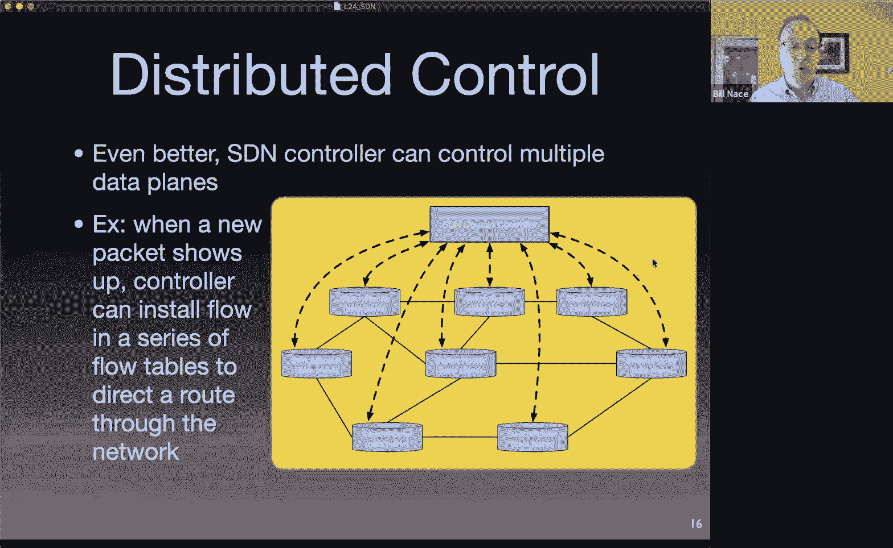

SDN抽象了这一切。SDN说我们不太关心它具体如何工作，我们想要的是一个像流表一样的东西，执行这种转发功能，但可能基于更多字段。到目前为止，我们在路由器和交换机上进行的转发都是查找IP地址。我们想稍微扩展一下，使其变成查找关于流的一些数据，而不仅仅是单个数据包。还记得我们很久以前讨论NetFlow时说过，流基本上是一组头部字段，如果几个数据包或帧的这些字段匹配，我们就说这些数据包或帧都属于同一个流。我们希望将这个想法抽象到数据平面中。

然后，控制平面将能够指导数据平面，并填充流中的值。这些值基本上定义了：这些特定的IP地址值定义了一个流，我们将选择一个动作，当特定的数据包或帧到达并匹配这些值（因此我们相信它是该流的一部分）时，我们希望指定对该数据包执行什么操作。动作可以是几件事：你可以指定数据包需要从特定的线路转发出去，这是路由器或交换机通常做的基本常规操作。它接收到达的数据包或帧，查看地址，然后决定应该从哪个特定输出端口转发出去。所以这个动作很合理，很正常。

控制平面可能想要做的另一个动作是：将该数据包发送给控制器。不要从线路17转发出去，而是将其封装在消息中发送给控制器，基本上是说：嘿，看，这是一个匹配该行的数据包。这通常是你对流中的第一个数据包做的事情。当你第一次看到具有特定特征的数据包到达时，你会把它发送给控制器，在那里一些软件可以查看该数据包并做出一些决定，或者对其进行处理。正如你在论文中看到的，这是进行实验性处理的方式。如果你看到一个数据包具有某些特征，并被标记为“这是Bill Nace的研究流量”，那么你就把它发送给控制器，控制器运行一些软件来决定如何处理它，运行Bill Nace的新算法来找出该怎么做。

你可以做的其他动作包括：重写头部。你可以设置规则，基本上说我们希望该数据包从不同的接口发送出去，但我们希望它以不同的值发送出去，比如我们希望它以不同的IP地址和不同的端口号发送出去，这听起来很像网络地址转换，这正是你在这里设置它的原因。你也可以说，让我们直接丢弃那个数据包。也许这是一种针对我们先前确定为恶意流的防御机制。例如，那是DDoS攻击的一部分，那个数据包不应该再被转发，请立即丢弃它。我们以前没见过这个，我们的路由器从未主动丢弃数据包，它们总是因为空间不足而丢弃，这是最后的手段。这实际上是更主动的，这是在说，哦，我们想立即终止这个。我想RED是稍微主动丢弃数据包的一个例子，但在这里你实际上可以说任何匹配这个流的数据包，直接丢弃。

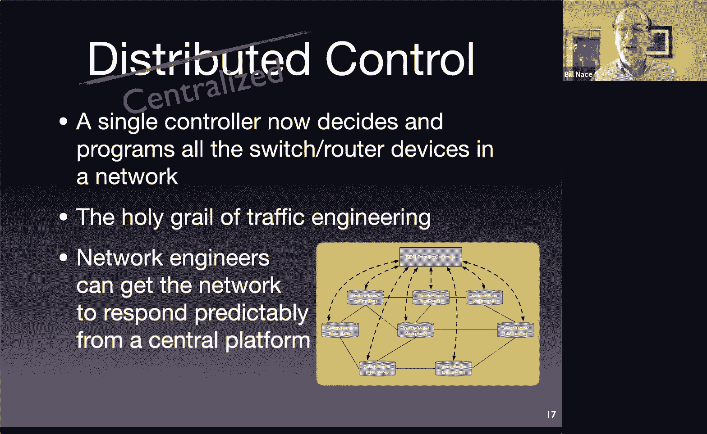

你可以指定的最后一个动作是：你不想对这个数据包做任何奇怪而奇妙的事情，你只想做在SDN时代之前通常会发生的事情，那就是传统的转发流水线。这只是说，对该数据包做旧的处理方式。这是为了让人们更适应SDN的概念，让你可以慢慢地将SDN引入组织，这样你仍然可以拥有SDN路由器和交换机，但不必立即让它们执行SDN功能。你可以说，好吧，我们只是把它放在这里，我们将在其中一些上进行实验，我们可能只将它们用于实验性处理，其他所有流量仍将按照旧的、传统的方式处理。

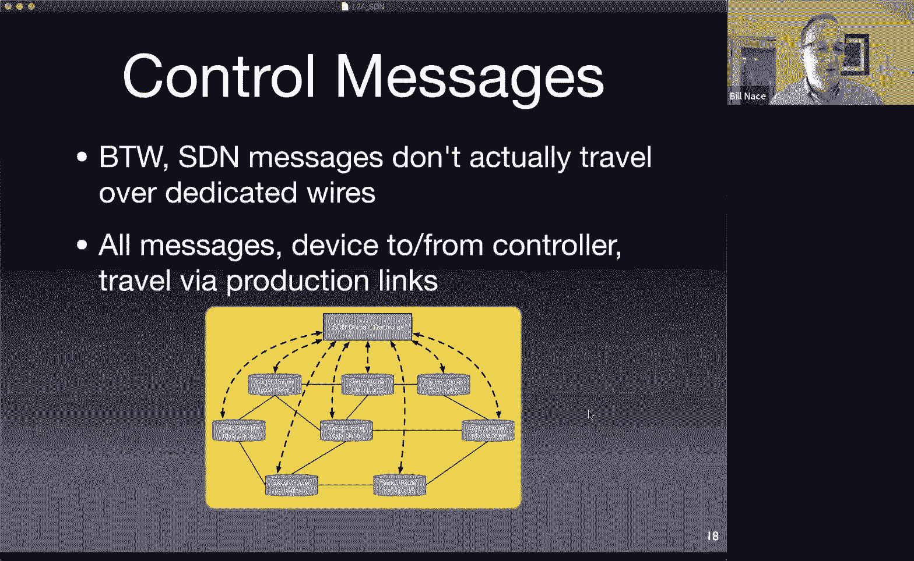

所以，想法是你将拥有这个流表，它将有字段来匹配事物，然后控制平面将为该特定流指定一个动作。这些是一些可能发生的示例动作。

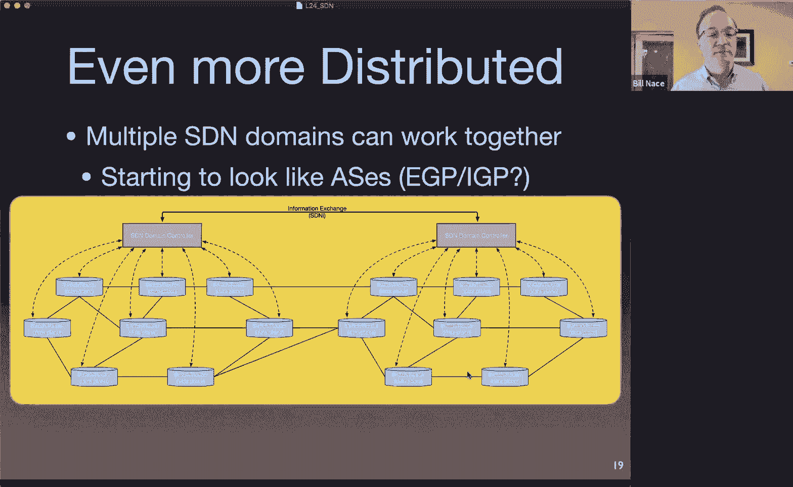

---

## SDN的架构视图

我的设想，我思考这个问题的方式是：我现在有一个路由器或交换机，这里我把它画成一个路由器。它是一个盒子。在它内部，我有这两个部分，这两个组件被分开了。一个是数据平面，数据平面实际上控制着连接，数据包从特定的线路进入，从特定的其他线路出去。然后控制器发送命令，它通过发送命令来控制数据平面，这些命令基本上是说：哦，如果IP头匹配这个，TCP端口匹配那个，那么就从特定的接口发送出去。这听起来完全像转发。这是SDN之前路由器做的事情，除了这个TCP端口号的事情。因为到目前为止，路由器只查看目的IP地址并进行匹配，以确定它属于哪个前缀。现在，因为我们处理的是流而不仅仅是数据包，我们查看更多信息，并尝试在这些数据包之间匹配更多内容。因此，我们将查看封装在IP数据包中的更高层数据，以做出这些决定，找出它们是否属于某个特定的流。

我会发送另一个命令：如果这是去往谷歌的公共IP地址，并且端口是DNS，那么我们知道它应该从wire7出去，请从那里转发它。也许我们想说，任何其他你看到的、不在你转发表中的数据包，请发送给控制器。然后控制器可以运行一些软件来决定应该对它做什么，并在数据平面中实现正确的事情来使其发生。

这是另一种思考方式，可能更详细一些，关于数据平面。控制器仍然是填充数据平面流表的组件，这是一个例子。实际情况通常比这更复杂，通常有多级流表结构，但我们可以将其视为一个简单的单表，允许通配符。想法是：我有一个表，有很多列，比如数据包是从哪个接口进入的？从路由器的哪条线路进入的？是否有VLAN标识符？IP的源地址和目的地址是什么？上层协议是什么？是UDP还是TCP？如果是UDP或TCP，我能否查看端口并决定如何处理它们？这些都是我将查看多个进入路由器的数据包的值，以决定它们是否属于同一个流。

如果它们有这些匹配项，比如它们都从这条线路进入，有这个源地址、这个目的地址等等（顺便说一下，这里的星号是通配符，意思是我不关心，不看VLAN ID），如果所有这些都匹配，那么就从接口3、线路3发送出去。通常还有一些统计列，比如记录有多少数据包进入并匹配了这一特定行，或者匹配该行的数据包总共有多少字节。所以也有一些统计列。你可以想象这个表通常会有很多行，不只是这里指定的三行，我指定了其中的几行。然后在底部，我有默认规则：如果它没有匹配任何已有条目，那么其他任何数据包都发送给控制器，控制器会负责解决这个问题。

---

## 控制器与数据平面的分离

到目前为止，我展示的幻灯片中，控制器和数据平面似乎在一个设备里。但一旦我们有了两者之间的协议，我们就可以将控制器放在别处。我现在可以把那个控制器放在一个不同的盒子里。我需要做的只是有一种方式将携带该协议的消息传递给数据平面设备。是的，我希望它是一个安全通道，因为我们不希望任何人能够随意向我们的设备发送SDN协议消息。但现在我们能够将控制器从实际的交换机中分离出来并放在其他地方。

一旦我能做到这一点，我就可以做到这个，这才是我们真正想要的：一个可以控制我网络中许多交换机的单一控制器。这让我现在可以进行涉及网络中所有设备的计算。想法是：如果我有这个单一的地方运行软件来做出这些流决策，那么当一个新的数据包出现时，如果数据包进入下面这个路由器，这个路由器将遵循“发送给控制器”的动作，并向域控制器发送一条消息说：嘿，我刚看到这个新数据包，我该怎么处理它？然后控制器可以说：哦，我们这里有一些来自这个IP去往那个IP的新流量，查看该特定数据包的所有特征，然后能够实际在我的整个网络中为该流实施动作。因此，不再是由单个交换机决定数据包应该走哪个方向，域控制器可以说：我希望它以特定的方式流经我的网络，现在我可以通过在所有这些流表中安装流条目来响应，以便该数据包将沿着我希望的路径传输。

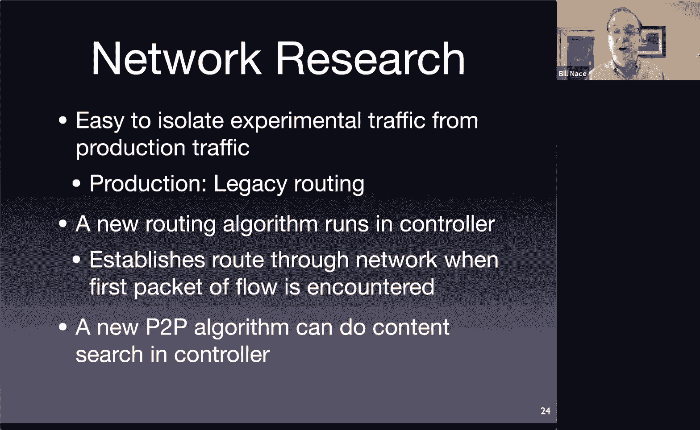

---

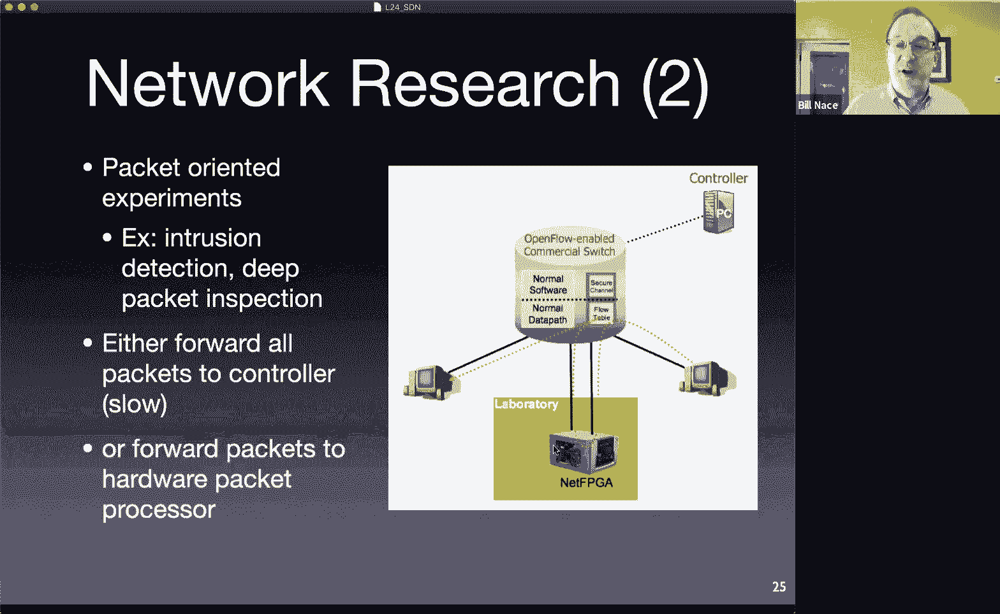

## 集中化控制的优势与挑战

我们通过这样做，将传统上是分布式控制的东西变成了集中式控制。所有的路由算法都是分布式算法，它们决定数据包应如何流经网络，但它们是以分布式方式进行的。这很棒，很神奇，分布式的东西能运行起来，因为解决分布式问题比解决集中式问题要困难得多。然而，问题是分布式控制真的很难处理、调整和管理。因此，如果我们有一个集中式的地方来做决策并控制所有部分，现在我们在做这些决策时就能获得一种整体的网络视图。当然，这些决策可以由运行在该域控制器中的软件做出。这正是流量工程师几十年来想要的：一个运行网络操作的人会查看流经的流量，然后说：哦，我这里有一条特定链路使用不多，那里有一条链路使用过度，我想把一些流量从这里移到那里。这就是集中式视图，我们想要发生的集中式愿景。问题在于，网络工程师现在必须找到一种方法来调整单个路由器的度量值，以便路由器在运行路由算法时，能自行决定一些流量应该走那边。这是一种非常间接的方式来控制路由器做你想让它做的事。现在有了SDN，你有了一个集中式控制机制：你可以直接说，哦，看，这里有太多流量，让我在这里安装一些流表条目，直接把流量移过去。我们不需要猜测。如果我改变那个度量值，比如把本地优先级从300改成310，是否会把足够的流量移到那边？你不必控制你真正想控制的东西的一阶、二阶或三阶操作。

这就是为什么网络控制人员喜欢SDN，他们认为SDN很棒，我们绝对应该这样做。是的，你说得对，任何东西一旦集中化，就会有两个问题：你现在有了一个单点故障，以及一个集中的性能瓶颈。这两点都必须处理。Cartik看到了性能影响，我们稍后会讲到。Sva想知道一个控制器能与多少台交换机通信，这将是一个性能问题，取决于这个特定控制器中的CPU有多强大，以及它实际上能有效管理多少实体。控制器与交换机的连接，我们稍后会讲到，这里的虚线是逻辑上的，运行在实际存在的物理线路上。是的，分析有另一个方面，我说过性能将取决于这里的CPU有多强大，也取决于网络的拓扑结构，你实际试图控制多少流，你试图以何种粒度控制它们，以及其他一些类似的事情。Sriraeder，答案是“小心地”。控制器和网络将非常小心地从故障中恢复。这些都是关于这个目前还只是幻灯片上的想法的很好的工程问题。

---

## 控制消息的传输与网络规模

关于逻辑与物理连接的问题，我想指出，消息实际上并不通过空中虚线传输，消息也必须通过网络传输。这是我们这里面临的一个有趣挑战，我们之前在BGP中也看到过。我们说，这些BGP消息，我们如何决定它们去哪里？哦，它们去的地方是由路由算法本身决定的。我们在这里做同样的事情：我有从交换机和路由器发送的路由控制消息，这些消息中必须包含路由信息才能到达控制器。显然，让一个网络启动并运行不仅仅是插上一堆交换机和路由器然后通电。网络工程师和管理员必须管理这一点，并确保在启动过程中，正确的默认路由被配置到设备中，以使这一切正常工作。

就性能而言，对于这里提出的一些问题，比如我们能控制多少，网络能有多大，答案是：如果你的网络太大，你可以将网络分割成多个部分，我们称之为域，软件定义网络域。一个控制器管理一个域。如果你的网络足够大，需要多个域，实际上有一种方法可以让多个域控制器协同工作，它们之间可以相互传递信息。这张幻灯片没有显示，但这也可以用于备份机制。当然，任何时候你有一个集中式设备在运行，你都会担心如果它宕机了会发生什么。如果它成为关键的单点故障，那将很糟糕。因此，你也会运行一个备份控制器，并且需要能够在控制器之间传递信息。

因此，有一个信息交换机制，称为SDNI。它基本上是域之间的接口。因为它也将是一个标准接口，想法是你可以运行来自不同公司的域控制器，它们实际上运行方式略有不同，但它们可以交换信息。例如，它们可以告诉对方它们的网络拓扑是什么：哦，是的，我通过这三条线路连接到你，你应该知道这一点。你可以发送事件，所以如果你知道某事已经发生或将要发生，你可以与周围的域进行通信。你可能还想要其他东西，比如基础设施状态、带宽需求（如果你正在运行一个有保证带宽机制的东西）等等。

---

## SDN的优缺点

那么，我们是喜欢SDN还是讨厌它？它有好有坏。它当然满足了我们对