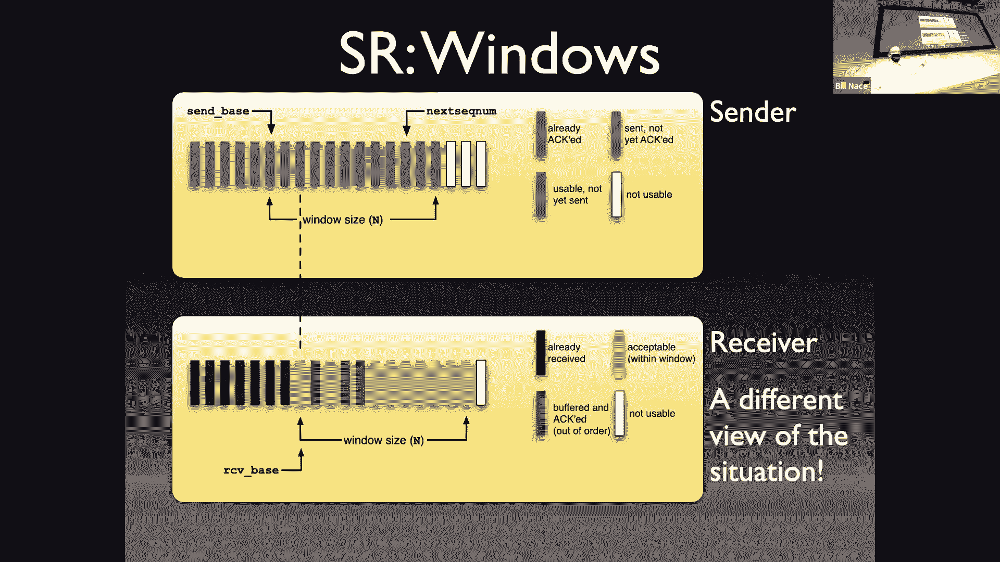

# 卡耐基梅隆大学 14-740 计算机网络 Fundamentals of Computer Networks（Fall 2020） - P10：Lecture 10 Principles of Reliable Transfer - ___main___ - BV1wT4y1A7cd

 This is 14，740。 Welcome everybody。 I noticed today we have a very thin crowd in McConaughey。

 So I'm guessing that a little bit of chill weather is keeping some people snug in their beds as they watch zoom or something like that。

 I don't know。 Hopefully there's some benign reason like that for it。

 Today we are going to dig in a little bit to our to our transport layer。

 We're going to start getting ready to start learning about TCP。

 So this is not a lecture where we're actually learning TCP。

 but one where we're going to learn the tools so that when we do learn TCP。

 Next time we don't have to spend a whole lot of time kind of。

 Futsing around and trying to remember how things are working。

 And so today is a preparatory lesson for that。 Couple administrative things before we get started。

 Yes， stuff is due。 You guys just turned in homework one。 And you've got a week to work on lab one。

 And yeah， if you happen to have any regrader class， please get them in rapidly。

 I also want to point out I will not be available on Thursday morning。

 so we're not going to have class then or just basically skipping it。 And so， I mean。

 you're welcome to come to McConaughey Thursday morning just I won't be here and we won't have zoom。

 Okay， so I will see you next Tuesday for our next class。 Okay。 All right， so last time I was here。

 we started on the transport layer。 We dug in and and so these are some of the things that transport layer has to do。

 So kind of the theoretical knowledge of a chance a protocol at the transport layer。

 And we talked about the mission。 We talked about some of the things that had to happen in the transport layer。

 And then we looked at one of the simplest protocols we're going to look at all semester long。

 which is UDP， which is basically this really thin layer over an IP packet that is effectively nothing more than a couple of addresses and it checks them。

 It gets sent on that packet and that allows us to to do all kinds of cool stuff。

 What it doesn't do is provide any reliability and that's often what we want out of the transport layer。

 And so we're going to spend a significant amount of time in this course learning how to make the transport layer or how to make the network more reliable by using a transport layer protocol to do that and we'll be examining TCP。

 which is a highly optimized protocol to do this exact thing。 As I mentioned before though。

 I don't want to just jump into TCP。 TCP is a very complex beast。

 We're literally going to spend four lectures on TCP and various aspects of it throughout the course。

 It's very commonly used and so it's important that we understand how it's used。

 but there's a lot going on。 And so what I want to do today is make sure we understand the basic tools。

 the building blocks that are used to make TCP。 And so we're going to go through and take a look at that。

 And as a way to understand those tools， I'm going to introduce a bunch of academic protocols。

 I want to point out these protocols I'm going to teach you things like stop and wait， go back in。

 select the repeat。 They're academic protocols。 They're designed to teach you these tools。

 They're very common， if you pretty much any textbook you open about networking。

 we'll have these protocols in them。 And it gives you the impression that this is like a real protocol。

 Wouldn't this be great？ And I've actually had students come to me and say， "Hey。

 I'd like to do a research project where I implement Go Back In or something like that。"。

 And I look at them crazily， like， "Why would you ever want to do that？ What's the point？"。

 This is an academic protocol。 It's here just to learn a few things。

 Nobody would actually ever use this because TCP is going to do this job much better。

 So as we go through this， I keep that in mind because there can be pieces of this。 If you have。

 you know， they're going to raise the hackles at the back of your neck。

 Your engineering Spidey sense is going to go off and you're going to say。

 "Why would you ever do that a couple times today？"， Because we're going to say。

 "This is just the way this protocol happens to work。"。

 So don't get overly open arms about there must be a better way because there is a better way。

 So we're going to first think about this idea that we call reliable data transfer or RDT。

 What is it we actually want？ It's a good place to start when you're doing any engineering task。

 Take a look at your requirements。 What is it that we think is important to do reliable transfer。

 to get my information from a sender to a receiver in the network？

 What we want is we would like it to act like the network is a reliable channel。

 We would very much like for me to be able to send some bits from a sender。

 and have a receiver get those same bits。 We don't want to have them corrupted。

 I don't want to send a one bit and have my receiver get a zero bit。 That wouldn't do me much good。

 I would like it to be reliable。 I like them all to be delivered。 If I send a thousand bits。

 I want my receiver to get a thousand bits。 I don't want them to get 999。

 So I don't want anything missing。 And I certainly don't want them to get a thousand one。

 I don't want any added。 Unfortunately， the base network will do both。

 So then the network we have causes all these troubles。 And so we're overcoming those problems。

 I'd also like the bits I sent to be delivered in the same order I sent them。

 If I send this piece and then that piece of let's say I'm sending a file or a type to command the command line for remote log in。

 I'd very much like those characters to get delivered in the same order I sent them。 Otherwise。

 I'm going to be seeding into some directory and instead it will show up as a DC on the other side。

 I mean， I should also point out that we're going to want this in both directions。

 When I'm sending from my laptop to your laptop， I would like that to be reliable。

 But also you're going to want to send stuff back to me and that should be reliable as well。

 So this should be a bidirectional channel。 But for today。

 I'm mostly going to just pretend it's unidirectional。 I'm going to pretend it's one direction。

 It's trivial to go ahead and just do this twice once each direction。 In fact， if you do it twice。

 there are some opportunities for a couple of optimizations。 We're not going to worry about that。

 We're just today going to have a sender sending data to a receiver。 And of course。

 if you want to be able to reply， I can send my HTTP request over that reliable channel。 Of course。

 that web server is going to want to reply to me using a reliable channel as well。

 Everything we talked about in one direction， that server could do in the other direction to make its own reliable channel。

 So we're just basically going to get rid of some annoying accounting by saying it's unidirectional。

 I've already mentioned that the network has issues。 We call that the fault model。

 These are the things that we are protecting against。

 And anytime you're trying to build something reliable。

 you want to have thought this through ahead of time。 And these are the things in our fault model。

 We say the network has these kind of faults。 It does bit errors。 It is lossy。

 It duplicates delivery so I can have less or more data showing up at the receiver。

 I can get stuff out of order。 Now， there are other problems that could happen in the network。

 You could have an earthquake somewhere that destroys a router。

 You could have your terrorist activity take out a connection somewhere。

 Those are faults that could occur and cause trouble to our data。

 We have decided by not including them in this fault list that we're not going to try to engineer around them。

 And that's just because at some point you decide these are the common things I care about。 And if。

 you know， if an earthquake destroys a data center somewhere。 Yeah。

 maybe I could have engineered around that。 But that's a rare event。

 So I'm not going to worry about it right now。 These are not rare events。

 So these are the sorts of things we want to get around。

 These are the sorts of things that it's fairly easy to get around。 There's one other very。

 very common network fault that is not on this list。 And that is network partition。

 It's very often the case that something happens。 A failure occurs。 A router crashes。

 A network goes down。 And all of a sudden the network is now split into two pieces。 Okay。

 And that's a fault of the network。 And we could put it on this list。

 The problem is if I put it on this list， it's really hard to engineer around that。 Okay。

 It's very hard to actually communicate between two networks that are completely separate。 Okay。

 And so we've decided that yes， that happens and we're just going to live with it。

 And actually we're going to do other things to kind of get around it。 Right。

 CMU for instance has redundant network length。 So if one goes down， there's another path。

 So we're going to address it in those ways instead of putting it into our protocol。 Okay。

 So that's the purpose of this fault model list is to just be able to say this is the stuff。 I mean。

 when I say reliable is I want it to get around all of this stuff。

 And not other troubles that may happen or maybe very， very rare things that would happen。

 I don't want to spend effort on those。 Now we're going to learn how to get around these problems using a couple of tools。

 Okay。 These are parts of the protocol that we can employ。

 That we can basically the building blocks of our protocols。

 And so I'm going to call them tools today and the purpose of today's lecture of course is to learn how these tools work and some of the subtleties around them。

 And so we're going to go through all these in much more detail。

 One of our first tools is receiver feedback。 This is just a message from the other side。

 When I send something to the receiver， the receiver sends me something back to say， yes。

 I got that or no， I didn't。 We call that a acknowledgement or a knack。

 an act or a knack to be able to say， yes， we got that or no， I didn't， you know， I got it。

 but something was wrong or something like that。 Other tools we have are for error detection。

 Go ahead。 I guess I should get a chat up here。 Sorry。 Let's see。 Okay。

 so I see a question about the data link layer doing bit error detection and that is correct。

 The data link layer does generally do bit error detection sometimes correction。

 The problem is that's not an end to end。 Error detection technique， right？

 That only helps across the individual link that it's looking at。

 And as the salt or paper talked about does not cover us if there's a problem in a router somewhere。

 And so we generally want end to end sorts of sorts of checking。 Okay。 So yes。

 we'll use some error detection to let us figure out whether the data that was received was actually the same as the data that was sent。

 So we've already talked about check sums。 We saw that in UDP。 Basically some math。

 some not too complicated math that both sides perform to figure out whether there was a problem or not。

 We also detect some errors through these with timer。 So this is a software timer。

 This is something the sender does when he sends out a segment or take some action。

 The sender can set a timer， which basically says， hey， you know， in 200 milliseconds。

 I'd like to get woken up。 I'd like an interrupt to happen in 200 milliseconds that would then let me know that that amount of time has gone on。

 And usually that's used to detect some sort of loss to figure out whether we lost something。

 If I didn't get it in 200 milliseconds， I'd like to know about it。

 And if I do get feedback before that I'm going to cancel the timer。 So the question is。

 what's the difference between the feedback， the knack that I might have gotten here and the check sum。

 So the check sum is a mathematical check that will tell you there's a problem。

 The feedback is actually the action that is taken by a receiver to tell the sender about it。 Okay。

 so we'll see。 Don't worry。 We'll see how this works in a minute。

 I'm just getting the list of tools in front of you right now。 Other tools， we use retransmission。

 retransmission allows the， or has the sender send a segment again。

 So if I think there was a problem with it。 We just go ahead and retransmit it。 This requires。

 for instance， that we actually kept a copy of the segment so that we have it in a buffer somewhere ready to go ahead and retransmit if we need it。

 And that will， of course， mean we need to manage that buffer and know when to throw things away。

 So when we use sequence numbers， this is going to basically put a number into each of the segments we send。

 And that lets us individually identify each of the segments and know whether they're the same segment we've seen before。

 You cannot just look at the data in a segment and say， Oh， I've seen this data before。 Therefore。

 it must be a duplicate。 So we may send the same data twice。

 If I'm thinking about that remote login scenario。 Yes， I sent the， you know。

 change directory to my home directory command。 But then I wasn't sure it took and I sent it again。

 Right。 That's perfectly valid for a user to do。 And the receiver can't look at that data and say。

 Oh， I've already seen this before。 Let me， let me， you know， throw that away。

 And so we put sequence numbers on things to identify them specifically and say this is the same as this other piece of data or different。

 And then we'll talk about windowing and pipelining。

 This lets us actually manage the transport of multiple segments at once。 Okay。

 so I'm not expecting you to actually the whole point of the lecture is to learn these tools in some detail。

 Right。 And so right now you probably have questions about what these are and how they work。

 And that's okay。 Right。 That's great。 Be curious about them。

 We're going to then look at some protocols now to learn how they work and look at the details and figure out what's going on with them。

 So the first thing I protocol is called stop and wait。 Okay， it is a protocol that is very。

 very simple。 In fact， it's pretty much the simplest we can come up with that will actually do a reliable transfer of data。

 Okay， it will employ all of our tools except windowing。 Okay， but we'll get， we'll get there。

 Don't worry。 It'll also motivate us。 It will learn some of the deficiencies of stop and wait。

 And from that decide， oh， we should actually use windowing to go forward。

 I'm going to build this up in a couple of versions。

 I'm going to start with the very simplest protocol version。 Right。

 This is version one of stop and wait。 And it's going to use to check some and it's going to use some receiver feedback。

 It's going to use an acronym。 And I'm going to describe this protocol。 In fact。

 I'll do this with many protocols we talked about as a sequence of rules of the actions that must be taken by the players。

 Now， of course， the players are the sender and the receiver。

 And so we're going to have rules for what the sender should do in certain situations and what the receiver should do in certain situations。

 And that builds up my protocol， the sum total of all of those rules is a major piece of my protocol。

 And so I'm showing that here with a list of things on the left that the sender has to do。

 And on the right that the receiver has to do。 Okay， so for instance。

 the sender when he sends a segment。 Okay。 After sending that segment out。 Okay。

 so I guess we should back up a second。 When does the sender send a segment？ Well。

 in order for the sender to have sent a segment， he must have data to send。 Right。

 so this is not going to be triggered just the sender saying， Oh。

 I guess I should send a segment now。 That's going to be in response to the application telling the transport layer。

 Hey， here's a message I have， please send it。 And the transport layer that's running this protocol will take that data and do the segmenting。

 It'll do the multiplexing multiplexing。 It'll figure out some addressing mechanism like port numbers to put on it。

 Okay， it will then go ahead and take that segment that it has created and send it on the network。

 How does it do that？ Oh， of course， it hands it to the network layer network layer。

 Please deliver this to that computer over there。 Okay。

 so that's always going to happen in the transport layer。

 For us here in this particular version one of stop and wait， we're also going to have these rules。

 We're going to send a segment and then we're going to wait。 Okay。

 we're going to wait around twiddling our thumbs until we get receiver feedback。 Okay。

 until we get either an act or an act。 The act will tell us that that segment got there correctly。

 Okay， and thus we can be done waiting and go on to either waiting for the application to give us more data or to take the next segment that we have prepared and transmitted。

 However， if I get a nap， I'm going to have to resend the segment。 Okay。

 so this means that I have to have a buffer with the original data from that segment。

 So when I give it to the network layer， I can't throw it out。

 I have to still have it sitting in memory waiting to retransmit if I have to retransmit。

 And when I retransmit， I'm not done， because anything that happened to that first segment could happen to this retransmitted segment。

 And so I'm going to go back to waiting。 All right， now on the receiver side。

 The receiver side also has some rules and the receiver is basically sitting around waiting。

 And when it gets a segment coming in， what's it going to do？ What's it going to do？

 What's going to check the check sum？ It's going to do the math and figure out。

 are there any bit errors with this particular segment。 Okay。

 so we're protecting against one of our fault， so in our fault model of bit errors by checking the check sum。

 And that check sum is basically going to be yes， it's correct or no， it's not。

 And if it yes correct， I send an act。 Okay， if I， if it's not good， then we send a knack。

 So the receiver is always going to transmit feedback back to the sender telling the sender。 Yeah。

 you did a good job。 No， you did a bad job。 One of the two。 Of course， if it's a good segment。

 then yes， we've just done some reliable data transfer。

 We've gotten some data from sender to receiver。 And so we need to remember where we are in the network stack。

 We're in the transport layer。 That data that we received now needs to be given to the application。

 Hey， here's the next chunk of data in that cat video that you wanted to receive or whatever。 Okay。

 so this is a perfectly good protocol for what it does。 It works。 Okay。

 we don't actually duplicate anything。 So when I point out we're dealing with one segment at a time。

 Right， so there's no issue about whether this is a duplicate or anything like that。

 There is a problem though。 We are correctly using the feedback tool that we have。 Okay。

 and we're using check sums to make sure that our data that we transmit that when that segment is sent。

 we're making sure that that's correct。 But we're not doing the same in the other direction。 Right。

 that act or knack that comes from the receiver back to the sender。

 That act is also a segment that is sent across the network。

 And so that act or knack is also liable to any of the faults。

 And so it might get to get a bit erred in it。 Right， so maybe that gets sent as an act。

 but received as a knack。 And our version of the protocol won't detect that。 Right。

 we don't know because you'll notice the sender is not checking the check sum on that feedback that it gets。

 So we should fix that。 Right， let's go ahead and update our protocol to handle a corrupted acknowledgement or not acknowledgement。

 Okay， before we do that， let's just make sure we understand where we are right now。 Right。

 and I'm going to do that。 I'm going to illustrate all these protocols with sequence diagrams。

 which are those pictures with the arrows going back and forth。 Right。

 so I have a sender and I have a receiver。 This one works right if the sender sends a segment。

 but seem a little light and bolt。 That's the symbol that something happened in the middle and it got flipped。

 Okay， and so the receiver。 When he checks the checks。

 I'm just going to look at this and say no good， let's send a knack back。

 The sender when he gets the knack is going to retransmit。 And so， yeah， good enough。

 except that if the lightning bolt occurs on the knack or the act line on any of those arrows going from right to left。

 then we have trouble。 So it's a revise or protocol。 How do we do that？ Well， it's easy。

 Let's just add a check sum to the actual。 To the receiver feedback as well， right。

 so that we can tell if that's good or bad。 The problem now is we're going to read be retransmitting some of these segments and we need a way to tell them apart。

 And so we're also going to employ a sequence number。

 We're basically going to keep track of this is segment zero。 This is segment one。

 There's no reason to keep counting。 We only need a single bit for this。 It turns out。

 So I'm using a one bit sequence number。 It's okay。 You could imagine， you know。

 1000 bit sequence number， it wouldn't be a problem。

 So we have to change the rules a little bit to handle the sequence number as well as this check sum on the feedback。

 So what do we do？ Well， we have more rules， right？

 The sender has to be a little bit more careful when sending the segment。

 We'll see in a minute why we're using the sequence number。 When we send the segment。

 we're going to have to put a sequence number in it。

 This effectively we're writing on the envelope from our demo， right？

 We're putting an extra field in the header for a sequence number。 In this case。

 it's a single bit and I just needed to be different from the last bit。 Okay。

 so I'm going to one minus the last bit will give me the next bit。

 So it's going to be 0101 kind of sequence。 And then we're going to go ahead and send that segment。

 And then over on the receiver side， the receiver is going to get that segment。 And when it comes in。

 it's going to do the check sum， figure out whether it's a good segment or a bad segment。

 It's going to reply with an accurate knack。 That segment that we send back is going to have a sequence number in it。

 So we're going to know。 This is the sequence number for this particular of our segments。

 So I sent segment zero and I'm going to get back an acknowledgment with a zero。

 I'm going to send segment one。 I'm going to get back an acknowledgment with a one。 Okay。

 Now that feedback is going to come back to the sender。

 And the sender now is able to take a look at it and see whether it's good or bad。 Okay。 And if it's。

 you know， if it's bad， we're going to have to retransmit。 Right。

 So we're going to go ahead and resend。 We're going to send the same segment again。 Now。

 if it's the same segment， it's going to have the same segment number on it。 Okay。

 So be a little careful that resend there does not mean go to the top and redo that rule。 Okay。

 It means take the segment that you had sitting in memory， which included the header。

 which includes the sequence number in it。 Let's just go ahead and retransmit that。 Okay。

 If I get an act back and the act is correct。 Okay。 Then great。 Fantastic。 Now。

 maybe now you start to see why we need the sequence numbers because the sender is going to be sending these segments。

 Okay。 And the receivers got to be able to tell whether it's a duplicate or not。 If the。

 if the feedback comes back， the， the receiver doesn't know whether that feedback got damaged or not。

 And so it doesn't know whether the segment it's getting is a duplicate or not。

 In the previous version， there was only one segment being dealt with at a time。

 And so we didn't have to make this distinction。 Now， however。

 the receiver could be in the situation of not knowing whether this segment is a duplicate because the feedback was corrupted or whether it's a new segment。

 And so that's why we need this， the sequence numbers on them。 Okay。

 One rule I haven't covered yet is on the receiver side。 If the sequence number。

 so if the receiver receives a good segment， that's good data。

 And it's different from the last segment we got。 So that means it's new data。

 So if it's good new data， we're going to deliver that to the application。 Okay。

 That's the next piece of the cat video that the application can look at。

 And so this protocol is great。 Right。 It's going to handle the fact that the acknowledgement may be damaged or not。

 It does have a problem because it's still we can't lose the segment yet。

 But we're dealing with retransmission and duplication of segments， which is good。

 So here's our picture of this in action。 And we start off the same way we did on the previous picture。

 Right。 The version one protocol was able to handle the first half of this picture。 Right。

 I send a segment。 It gets damaged。 We reply with a knack。 Therefore we resend。

 The only difference to this is now there's a number on it。 Right。 We're sending segment zero。 Okay。

 It gets damaged。 We get a not acknowledgement。 Then we resend segment zero。

 Other than that's exactly the same as our version one protocol。

 The bottom half of the picture of course is where this。 Is good in the second version。 Right。

 In that case， I'm sending another segment that segment one。 And in this case。

 the feedback gets damaged。 Okay。 So that my light and bolt is now in that acknowledgement。

 The sender when he gets the acknowledgement does it check someone and it fails。

 Can't trust any bit of that segment of that thing coming back。 So you can't look at it and say。

 well， it mostly looks okay。 It says acknowledge， but you know， maybe this other thing was damaged。

 Right。 You don't know which bit it was。 And so it could be the bit that changed it from an act。

 So we have to retransmit。 We'll go ahead and send segment one。 Okay。

 And this is why we have the sequence numbers。 Now on the receiver side。

 the receiver is getting a new segment。 And it needs to know is this a retransmission of what I've seen before？

 Or is this new data？ Because from the receiver side， nothing has gone wrong。

 The receiver sent an acknowledgement and now is getting a new segment。

 It needs to know is this new segment is a segment a new one or not。 And so in this case。

 it's segment one again。 It's going to say， Oh， wait a minute。 I've already got segment one。

 So I'm going to go ahead and not deliver this to the application。 It's not new data。

 I still have to send an acknowledgement though， because we have to tell the sender that we actually got some data。

 And so it doesn't have to retransmit anymore。 So it makes sense。 Let's see。 So in the chat。

 somebody's saying， wait a minute， what if the， I'm showing here an act gets damaged。

 What happens if it was a knack that got damaged？ So let's go back to the beginning of our picture here。

 Right。 And so let's imagine we sent segment zero and segment zero got damaged。

 The receiver sends a knack and the knack gets damaged。 Okay。

 The sender is going to have to retransmit because he will have gotten a feedback that fails the checksum。

 Okay。 So at that point， it doesn't matter that it's a knack that got the failed。 Right。

 Our actual protocol says that when you， the sender will wait to get an act or an act。

 And if it's corrupted or a knack。 Either one of those cases we're going to have to retransmit。

 So if the feedback comes back damaged， I don't know whether it was an act or an act。

 Or if it's a knack saying the original thing was damaged， then we're going to have to retransmit。

 Okay。 So both of those would handle it。 And I'm saying what about spoofed stuff let's not worry about the malicious actors here right malicious actors were not in our fault model。

 Okay， so I know many of you are very security conscious and that's great。

 Let's just remember what these are protocols that were developed in the three digit RFC era before security was a problem。

 And I don't know what just happened。 A projector startup again。 Sorry soon。 If you're hearing me。

 You have projector issues。 Wow。 Yes。

 Sorry， zoom。 Any clips。 Yes。 Okay。 Yes。 Question is it possible to have any feedback that is corrupted so badly that we think it's the other thing。

 We're using check some as a tool。 Okay。 And the assumption there is that the check some is going to detect any of the bit errors。

 Okay。 Now we talk last time that check sums do have limits。

 And so you would want to do things to try to design your， the product。

 the format of the data that's get sent back so that if， you know， if there were two bit errors。

 maybe it wouldn't damage it so much， but there is the problem that it is possible to have checks on failure。

 We assume that that's such a rare case that it's not going to come up。 Okay。 But yeah。

 if it bothers you a lot， then you need to do more。

 You need more redundancy in that checks on or you need to do more in your error detection than the simple checksome algorithm we talked about last time。

 Right。 And you can do that。 It just requires more redundant data and more processing to make it happen。

 So that was that trade off we talked about last time。

 And if you're worried that that trade off is going the wrong way， you just。

 you need to throw more processor and redundant data。 Okay。

 So my apologies for our zoom problems there。 I have no idea what was happening。

 We were finishing up with version two。 And we were saying this is a great protocol。

 It appears to do everything we want。 Except， and we would go back to our fault model， and we'd say。

 Oh， does this cover bits that get。 Munched。 Yes， it does。 Does it cover additional data。 It would。

 So if the network actually delivered segment one twice to the。

 to the receiver because of the sequence number， the receiver would know that it's duplicate。 Right。

 So it looks like we're in great shape until we get down to the， Oh。

 the network occasionally loses segments。 What happens if an entire segment goes missing。

 We're in trouble。 Okay。 And I guess。 Let's just make sure we understand that。 What happens。

 If it goes missing。 So let's imagine that that first segment up there does not get a light involved that flips a bit。

 But instead just goes missing entirely。 Okay。 Well， what happens？ Well， at that point。

 the receiver is sitting around waiting for data to show up and that data will not show up。 Okay。

 And the sender is also waiting around。 Right。 The sender is waiting for feedback that will never come。

 Okay。 So if that instead of just flipping a bit had completely erased an entire segment。

 this protocol is in trouble。 So let's fix that version three。 In order to fix that。

 we're going to bring out another tool and that tool is a timer。 Okay。 Again。

 this is a software timer。 You can think of it as， you know。

 the kitchen timer that you use to tell you that your eggs are ready。 Right。 You say， Hey， you know。

 Alexa set a timer for 200 milliseconds every time you handle this。 And in a software sense。

 you get woken up after 200 milliseconds。 And you'll be able to say， Oh。

 let me respond to that timer going off。 Okay。 So let's see how we use that。 Again。

 we're going to change a few rules。 Right。 Now the sender when he sends a segment。

 he does everything he did before， right， puts a sequence number in it。 Right。

 So it keeps a copy of it in a buffer。 Now， when he sends it， he sets a timer。 Right。 He says， Okay。

 kitchen timer， Alexa， whatever， please start my timer。 I guess I should be careful。

 They're out in zoom land。 There may be a bunch of people who have Amazon devices now going off。

 Sorry if that's happening to you。 Um， we're just we're going to start that timer from from a software perspective。

 Okay。 And then we will have sent the data we handed to the network layer。

 the network layer takes care of it。 Okay。 And then we have the same sort of rules。 Right。

 When an acknowledgement is received， right， I'm going to go ahead and use that feedback。

 I'll look at it and say， Oh， is this a good。 A good piece of feedback or bad piece of feedback。

 right， if it's passes a check some。 And it's an acknowledgement that means my data got through and the。

 Sign acknowledgement for the right segment。 Okay， I sent segment zero。

 I got an acknowledgement for segment zero。 If that's good。

 then that means my data all that delivered properly。 Bit error free， all that sort of stuff。

 And so what we need to do is we need to cancel that timer。 Okay。

 so you just stop that timer from ever going off。 Right。 You set it for 200 milliseconds。

 This happened after 50 milliseconds。 You just go ahead and cancel that timer so it will never go off。

 Okay。 And then you're ready to send the next segment。 You're done having gotten that data through。

 If something happens， okay， if there's a if your feedback comes through and it's a not acknowledged。

 Okay。 Oh， my data was corrupted on the way there。 I need to retransmit it。

 We're going to go ahead and resend it。 We got to be careful， though， we want to reset the timer。

 So we're going to every time we send something， we're going to want to put a timer on it。

 And now since I'm retransmitting that segment， I want to have another 200 milliseconds to go。

 So I'm going to cancel the first timer。 And I'm going to reset a new timer for this new segment going off。

 Okay， we'll go ahead and resend it。 And then there's also the case that possibly the timer goes off。

 If the timer ever goes off， what does that mean？ It means we did not get feedback for this segment of either the positive or the negative source since we set the timer。

 So in my example， in the last 200 milliseconds， I have never gotten feedback。

 And we use that as indication that the segment must have been lost。 And that proof that it was lost。

 But by this point in time， I should have gotten feedback， and I didn't。 So therefore。

 we're going to assume it was lost， and we're going to go ahead and resend。 And when we resend。

 we're going to follow the rules。 We're going to send the same segment with the same sequence number that we sent last time。

 And we're going to set a timer again。 On the receiver side。 Huh。 Actually。

 the receiver side is exactly the same。 If you look at these rules for the receiver and you compare it to a couple of slides ago。

 it's exactly the same stuff。 The receiver does not need to know that you're retransmitting segments or that you have a timer waiting for lost stuff。

 Okay， the receiver will react exactly the same way。

 It's just the sender that we have to make these changes to the sender is the point where we are detecting lost segment and doing all the retransmission。

 If the receiver detects that there was a well， how would it detect？

 How would it know that there was ever anything that was supposed to be sent。

 So it doesn't know that the lack of something showing up is means that a segment got missing。 Right。

 so， so the burden therefore is all on the sender。 And so the sender has to manage this and luckily the timer helps us do that。

 And now。 I'm retransmitting segments， right。 Every time the timer goes off。

 I'm going to retransmit the segment。 That does mean we have more duplicate segments。 Okay。

 that's not a problem though， because we have segment numbers on them。

 And our receiver will be able to tell that they are the same segment if it happens to get it twice。

 Austin's asking if this is still a one bit sequence number。 Yes， at this point， one bit's fine。

 For all of stop and wait， we never need more than one bit because we never had it turns out we never have more than one segment that we're worried about at a time。

 We're stopping and waiting until that one actually gets delivered。 Okay。

 so here are my pictures for version three， right？ If nothing goes wrong， then we send a segment。

 That is segment zero。 We get an acknowledgement for zero。 We then send segment one。

 We get an acknowledgement for one。 We then segment segment zero。

 We get an acknowledging hopefully back and forth。 No problem。 Okay。

 The it is possible if things go wrong。 So I'm going to show that in this case。

 not with a little era， a little lightning bolt because lightning bolts are hitting individual bits。

 Instead， in the second scenario， I have my segment one that gets re transmitted and it goes into the bit bucket。

 Okay， somewhere in the network， it gets lost entirely。 Not sure why it's just gone。 Okay。

 And what happens？ Well， the receiver doesn't know it was ever sent。

 So the receiver can't take any action。 It's okay。 It was non specified and the receiver protocol。

 Instead， the sender had a time out of time。 I'm showing this time out with this braces here。 Right。

 The sender has decided this is the amount of time。 Remember in our sequence diagrams。

 Time is going down the page。 So I can specify this amount of time by showing this amount of space on that diagram。

 That's the amount of time for the timer。 So when I sent segment one。

 I started a timer for that amount of time， whatever that braces amount of time is。

 And when that timer goes off， we say that we've had a timeout event。 When the timer goes off。

 then we say， Oh， wait a minute。 The timer went off。 I have not gotten an acknowledgement since then。

 So I will therefore retransmit the segment。 Hey， here's segment one。 I get。

 I should point out for clarity on my diagrams。 I am not specifying the timeout for every time we send。

 But actually it exists。 Right。 So if you think about segment zero there at the top of。

 Of this particular sequence diagram， when I sent it off， there was also braces below it。

 I set a timer when that went off and I said， you know， I'm waiting around 200 milliseconds。

 But in that case， I got the acknowledgement， you know， at whatever 150 milliseconds later。

 That acknowledgement came in and so we canceled the timer。 Okay， so it's there。

 I'm just not showing it in my diagrams。 Does that make sense？ Look good。 Sure。

 We actually get transmission。 I lost a segment。 We retransmitted it。 Everything good。

 Here's another scenario。 What if it's not the segment， but the feedback that gets lost。 Okay。 My。

 I send segment zero， it comes back fine， or I get acknowledgement for it fine。 I send segment one。

 Okay， segment one goes through correctly。 Segment one is acknowledged and acknowledgement is sent。

 but the acknowledgement goes into the bit pocket。 What happens？

 It turns out exactly the same thing happens。 In fact。

 the same side of this picture is exactly the same as on the previous page for the sender side of the lost segment scenario。

 Right。 Exactly the same。 I'm pretty sure I just copy and pasted it from one picture to the other。

 Okay。 This is interesting。 This tells us that the sender can never tell which segment was lost。

 Right。 When we set that timer， we don't know whether it was， I'm sorry， when the timer goes off。

 we don't know whether it was the segment I sent that got lost。

 or whether it was acknowledgement coming back that got lost。 Can't tell。 Right。

 I don't have that kind of visibility in the network to know。 I just know something got lost。

 so I'm going to go ahead and retransmit。 And this is where the sequence numbers become so important。

 Right。 Because now the receiver， you'll see what the receiver got， right。

 The receiver got segment zero and acknowledged it。 It got segment one and acknowledged it。

 It then got segment one again。 And it needs to be able to look at that number and know that that's a duplicate。

 Right。 It'll still acknowledge it， but that second time it got segment one。

 it knows that that is not new data。 And so it does not give that to the application。

 Those sequence numbers turn out to be very important for exactly this reason。

 There's one other scenario I'd like to mention。 And that is that it's possible I did a bad job of setting the timer。

 Right。 I told my timer device that I wanted to wait around 200 milliseconds。

 But you guys know by now， right？ You saw in homework one， the network is very dynamic。 Right。

 It's possible that things were going fine one second and the next second they don't。 Right。

 You saw in some of your trace routes。 I'm sure that， you know。

 sometimes it goes one path and sometimes it goes another suddenly。 Right。

 Sometimes even in the middle of your trace route process。 And so that can happen to me here。 Right。

 I can set my timer for 200 milliseconds。 And then the network just takes 210 milliseconds to deliver。

 Okay。 It could happen。 We call that a premature timeout， which sort of puts。

 it's almost like saying it's the fault of the sender for not setting the timer correctly。

 When really it's more the fault of the network for not being consistent all the time。 Okay。

 So let's try not to place too much blame and said let's work around it。 So here's what's happened。

 The sender send segment zero goes through fine gets a knowledge report since segment one。

 which goes through fine， which gets acknowledged。 However， my timeout goes off first。 Right。

 Because that acknowledgement just took the long way home。 Okay。 It hasn't gotten here yet。

 And so when the timeout goes off at that point in time， the sender thinks， oh， something was lost。

 Let me retransmit it。 And it will go ahead and retransmit segment one。

 And we talked about how important that sequence number is for the receiver to be able to determine that this is different。

 Well， notice what's also happening on the other side。 Right。 On the other side。

 the acknowledgement then comes through。 That's a good acknowledgement。 Right。 It's just late。 Okay。

 So when it shows up， we're going to go ahead and say， Oh， okay。 Segment one got through。 Okay。

 At that point in time， we actually don't know what which of the two that we transmitted got sent off。

 In fact， the sender is probably going to think that it was the retransmitted segment one。

 It suddenly got acknowledged。 Okay。 From the sender's perspective， I just sent segment one。

 I got an acknowledgement for one。 Okay。 Not a problem。 We're ready to send segment zero。

 We go ahead and send segment zero。 Okay。 On the receiver side， we're going to get the duplicate。

 It's okay。 We have sequence identified to let us know。 Okay。 Look， we have a protocol。

 It seems to work。 Right。 It handles bit errors。 It handles the loss of a segment。

 It handles duplication of segments。 Right。 It handles stuff out of what？ Well。

 nothing ever gets out of order。 Right。 Because we never have a scenario where we're sending segment one before segment zero。

 We know has gotten to the other side。 It handles bit errors。 Good protocol。 Works。 Well， it works。

 but it has this problem。 And the problem is one of efficiency。

 So now I'm trying to zoom in on one of my sequence diagrams。

 And let's look at what happens during the actual transmission of a particular segment。 Right。

 So now my segment is going to have a certain length and take a certain amount of time to transmit instead of just being zero。

 Right。 So in my case， I picked some numbers。 It's a thousand bytes。 Right。

 I've got a certain transmission rate。 Okay。 And so that means L over R。 It's going to take。

 you know， a certain amount of time for my data to get transmitted。

 I have a round trip time that is dependent upon the network there。 This gives 45 milliseconds。 Okay。

 The problem with stop and wait is is not very efficient。 Right。

 If I measure the amount of time I'm using the network。 Right。

 I'm actually transmitting for L over R amount of time， which turns out to be 5。3 milliseconds。 Okay。

 But I then wait an entire round trip time to get the acknowledgement before I transmit anything else。

 That means we are not transmitting stuff for 45 milliseconds。 So out of a 50。3 millisecond period。

 I'm only using the network for 10% of the time。 Okay。 That pretty much sucks。 Okay。

 I'm not going to go over R。 I'm going to say， Hey。

 I'll pay you a hundred bucks a month for a network that I'm only going to use 10% of the time。

 I want my full bandwidth usage。 I want to do better and stop and wait。

 While it does everything correctly has this problem with with efficiency。

 So how do we overcome that？ How can I make my utility be closer to 100%？

 What is known as the fundamental law of networking。 Other， you know。

 physics has equals MC squared or efficacy。 You know。

 other arenas have their own fundamental law in networking。 This is it。 Okay。

 If you want to get a hundred percent efficiency。 It depends on this bandwidth delay product。

 That's the amount of data that you want to be sending。

 It's the product I take the bandwidth and I multiply it by the latency by the round trip delay。

 Okay。 That's the amount of data that it would be possible for me to have in transit at any point in time。

 Okay。 And it comes from， you know， basically this picture， right？

 My bandwidth tells me how much I can transmit and how fast。 And the round trip time。

 the delay is the amount of time before I get acknowledgement that my data has been received properly。

 And so what I want to do is I want to fill in the rest of that graph with more data being transmitted。

 And so I want to increase the amount of data up to my limit of the bandwidth delay product。

 And so for our example， we had a round trip time a delay 45 milliseconds。 We had a bandwidth of 1。

5 megabits per second。 If you multiply those together， bandwidth times delay。 Okay。 Works out to 67。

5 kilobits。 Okay。 And so what that's telling me is I would like to be in that same time that we sent one segment。

 I would like to transmit 67。5 kilobits。 And since my segments were like 1000 bytes。

 that means I could get eight segments and flight at once。 Okay。 Now。

 how do I get eight segments and flight at once？ I can't do that with stop and wait。

 The stop and wait protocol is waiting。 And while it's waiting， I'd like to be transmitting。

 I'd like to be transmitting more data。 I'd like to actually be pipelining。 Okay。

 What that means is I want to instead of sending one segment waiting around for the feedback。

 I'd like to actually have several segments in flight。

 My math just said that I'd like to have eight segments in flight at a time。 Okay。

 And then as I get acknowledgments back， I'd also like to have eight acknowledgments coming back at the same time in flight。

 As those acknowledgments come back， then I want to send more data。 And if I do that。

 then I can actually use the network more efficiently。 I can get my efficiency closer to 100%。 Okay。

 So what I'm trying to do here， I've， I've increased it by factor three。

 What I want to be able to do is I want to transmit multiple segments。 Okay。

 And get acknowledgments for each of those segments。 Right。

 And so I need a protocol that will allow me and be able to control what's going on with those。

 So we have protocols for that we call them sliding window protocols。

 I'm going to show you two different examples of that。

 The sliding window protocols are called that because we say that there is a window。

 which tells me how much data I'm allowed to send or how many segments I'm allowed to send that window is going to be controlled somehow we will come up with that size。

 Hopefully we came up with it because it's equal to the bandwidth delay product。 Right。

 That window will give the sender permission to send some segments or not。

 So you can imagine the application just handed an entire cat video to the transport layer and says。

 please transmit this。 Right。 Here is two gigabytes of data。 The。

 The sender in the transport layer using our protocols is going to chop all that up into segments。

 And then it's going to want to know which segments may allow the send。 Right。

 And if you just dump them all one after the other after the other。

 you're going to now have trouble keeping track of which ones were in flight。

 which ones are acknowledged， which are not。 So we use this window concept to say that there are some number。

 You are allowed to send eight segments at a time。 Let's say。 Right。

 Somehow we come up with that window size。 And the protocol is going to check whether every time the sender wants to send data。

 it's going to check is their space in the window。 And that will give me permission to send that segment or not。

 And then。 As we move on， like in reaction to positive acknowledgement that comes back。

 we're going to slide that window over。 We're going to slide it down。

 The sequence of segments that I can send that will then give me permission to send more segments。

 Once I have proof that some of the segments that I previously sent have been received properly。

 So sliding window。 Yes， ma'am。 We have five。 I love this question。

 This question is the key to these protocols that we're going to talk about。 Right。 The question is。

 what happens if I get my acknowledgments out of order？

 What happens if this sliding window abstraction that I've painted for you。

 Doesn't come out exactly right。 And it's not going to come out exactly right。

 And so the answer to your question depends on what protocol we're using and how and the protocols are going to have to be designed to understand this and take into account the fact that。

 We may not get acknowledgments in order。 Yeah。 All right。

 So our first protocol is we call it go back and。 And I got to warn you。

 there's a couple pieces of this that are going to annoy the engineering you。 Okay。 Remember。

 academic protocol。 Okay。 The go back and protocol on the sender side。

 The sender is now going to have to。 Well， we're going to have more segments in flight than just one。

 which means we're going to have more sequence numbers that we have to assign。

 So one bit sequence numbers， not good enough anymore。

 Because now if I have eight segments in flight， I have to be able to tell them all apart。

 So I'm going to have some number of bits that is a sequence number that I put in the header of。

 Of each of the segments when we create it。 Somehow we know N again。

 We're not going to worry about that right now。 Somehow we know that I have a window of eight segments or however many segments were allowed to send。

 Now we're going to go ahead and send the segments。 Every time we send it。

 we're going to set a timer for each of them。 Okay。 So as we send the segment， here's your。 200 mils。

 whatever somehow we've come up with the amount of time that the timer should be set for。

 And we're going to set a timer for each one of those as they go。 Now the rule is。

 if I get a timeout for a particular segment， so it just sent off segment 87。 Right。

 And then 200 milliseconds later， I get a timer telling me that segment 87 has been lost， presumably。

 somewhere。 Then the rule is we're going to go ahead and retransmit that one。 That makes sense。

 Right。 We're also going to retransmit all the higher sequence numbers that are in the window。 Okay。

 So if my window is currently from， let's say， 85 to 90。 And I have sent segment 85， 86， 87， 88， 89。

 Maybe I haven't sent the last one。 Right。 And then 87 gets lost or we think it's lost because the timer goes off。

 We're going to retransmit 87。 We're also going to retransmit 88 and 89。 Okay。

 So that's how this protocol happens to work to handle loss。 Okay。

 We're also going to get acknowledgments and the acknowledgments are going to have these segment number or the sequence number of the segment that it is acknowledging。

 Okay。 And so when we get that acknowledgement， that acknowledgement actually tells us not only that that segment got here。

 but we call this a cumulative acknowledgement。 And it's going to tell us that all previous segments got here as well。

 Okay。 So let's say the sender again， the sent off segments， 85， 86， 87， 88， and 89。 Okay。

 If instead of a timeout on 87， I get an acknowledgement for 87 under this scenario。

 That tells me 87 got there。 Makes sense。 Is any sequence or any acknowledgement would。

 It tells me 87 got there。 It also told me 86 and 85 got there。

 So that means I can move my window over。 Okay。 So that the window now starts at 88。 Okay。

 Because the window represents all the unack knowledge segments that I'm allowed to have in flight。

 I moved the window over to 88。 Now I may be able to send 90， 90， 90。

 to 93 because that window got moved over。 Okay。 So that's what a cumulative acknowledgement is and really learning how cumulative acknowledgments work is the point of go back in。

 Is the reason some of this looks a little weird。 Okay。 The receiver side。

 This gets easy then on the receiver side。 We're going to be getting segments coming in。 Okay。

 We're going to acknowledge them if they are in order and we'll acknowledge the highest number we've received。

 Okay。 So that's always Senate knowledge。 For the segment that we got correct。 Right。

 If it's got a bit error， we're not going to acknowledge it。 We're not going to send an act for it。

 And we're going to send for that， you know， in order， right？ If they。 If we got segment 85， 87， 88。

 skipping 86， I'm going to send 85。 I'm going to acknowledge 85。 Right。

 Because I'm using cumulative acknowledgments。 If I were to acknowledge 87。

 it would mean that I had also got 86。 So I have to acknowledge them。 The in order aspect。 Okay。

 Now that means that if I get something。 And there's that gap。 So I got 85 and then they got 87。

 I'm going to re-acknowledge 85。 Okay。 I already sent 85。 I'm going to send it again。 Okay。

 That's how that's what I'm acknowledging。 I can't acknowledge 87 because that would be a。

 Don't cue me the late knowledge 86， which is missing。 Okay。 And then I'm going to。

 Discard anything that I get out of order。 If I get 87 and haven't gotten 86 yet。

 I'm going to throw it away。 Okay。 Now the rationalization you'll hear you'll say， Oh。

 this is good for， you know， small devices that don't have memory。

 They don't have to store these out of order segments。 Okay。

 Mostly that's hogwash and we have to remember academic protocol。 Right。

 Memory is cheap enough these days that。 You're not going to probably get in any scenario where you don't have the space to save them。

 And again， academic protocol。 So instead， we're good。 If I get something out of order， if I get 87。

 A third way。 Because I haven't gotten 86 yet。 And then I re-acknowledge 85。

 And here's kind of a picture of how this window may work。 Okay。

 So I'm showing here a bunch of segments from left to right in order。 Okay。 And I'm showing a window。

 Now the window we traditionally specify a couple of variables to just keep track of the state of that。

 Okay。 One is the send base， which is the sequence number of the smallest segment that's in the window。

 Okay。 We know what the window size is。 So based upon send base and the window size。

 we know what segments currently are in the window。 And so all those， you know。

 between the two arrows there， those guys are all in the window。

 Now some of them have been transmitted and some haven't。

 And so that's the difference between the purple and the blue up there。

 which is a little subtle on this projector。 Sorry about that。 Luckily。

 there's that next sequence number。 This is another variable that we traditionally use to keep track of the state。

 Right。 This is telling us the next segment that I transmit， which should be at sequence number。

 And that tells us where we are through the window of this segment we've sent。 Okay。

 So wait a minute。 If I'm allowed to send all the segments in my window。

 Why would I ever have some of them blue and some of them purple？ The purple ones have already sent。

 Why haven't I sent the blue ones yet？ I'm allowed to。 What do you think？

 This is one of those audience participation moments。 Okay。 Dean Yahn says， "Ben with limitations。

 You're on the right track。 Can you specify a little bit more precisely what you mean by that？

 Can I just say it？ It might be easier。 Anybody？ What do you think？ Why would I not have sent the。

 you know， that one there that's pointed out with next sequence number？

 Why haven't that one been sent yet？ So you're saying the receiver might have a limitation。

 If there was any limitations the receiver had would have been worked out in setting the window size。

 Okay。 It's a good thought and we'll dig into that more when we get into TCP。 But yeah。

 for right now I don't have any of that。 Why would I not have sent that blue segment？ Okay。 Yeah。

 who he says not sure about client server。 Actually， we don't care。

 Client server is a concept at the application layer。

 And we actually learned with peer to peer networking it may not exist anyway。 Right。

 Here sender receiver is just anybody who has data to send to a receiver。 Okay。

 And so this could be your browser client sending an HTTP request。 Okay。

 It also could be a web server sending an HTTP response。 We don't know at the transport layer。

 We just know the application gave us some data。 We want to send it。 Okay。 Okay。

 So I'm not seeing many answers here。 What do you think？ Well。

 the window size is the limit for is that limit for how much I can send。 Right。 That is the delay。

 The bandwidth delay product。 Okay。 So in theory， I should have no trouble sending in number of segments。

 but I haven't sent them。 Right。 So why is that？ I mean， you， yeah， you're on the right track。

 It takes time to send these segments， right？ It takes L over R amount of time to send each one。

 And so it could be that I'm actually in the process of sending that one right now。 Okay。

 And after L over R amount of time， I will have sent it and then move on to the next one。

 There's also another possibility。 Okay。 The other possibility is that my application hasn't given me any data。

 Right。 I'm done。 I've up to purple is the amount of data I was asked to send。

 And I've sent it and I'm waiting for acknowledgments on it。 Okay。

 But until the application gives me more data， remember the application is working at its own rate doing whatever it wants to do。

 It's waiting around for you to press a button in your browser so that it can send some more data。

 Okay。 So yeah， two good reasons why my window might not be be full。 Now。

 I'm then waiting on acknowledgments for all of these。 Okay。 And when acknowledgments come in。

 we will go ahead and slide that window over。 And so here we go for a sequence diagram now for go back in。

 All right。 Now， on my center side， I'm going to send some segments。 Hey， here's segment zero。

 Here's one。 Here's two。 Here's three。 For some reason。

 segment two goes missing or gets killed or something。 Right。 Runs into the bit bucket。 Okay。

 But segment zero goes through the receiver will receive segment zero and will retransmit。 I'm sorry。

 Will transmit an acknowledgement coming back。 It'll say， Hey。

 I'm acknowledging that I got segment zero。 Segment one comes through。 Let's acknowledge that。 Okay。

 Segment two does not go through segment three does。 Okay。

 What does the receiver do when it gets an out of order segment？ It discards it。 Okay。

 So it throws that away and it will re-acknowledge what it is already acknowledged。

 It has already acknowledged up to one。 So it's going to re-send the acknowledgement for one。 Okay。

 And then let's see the center， wait around a little bit。 Now， why is it waiting？

 We don't know specifically。 We have two good guesses though。 Okay。 It could be。

 That our window is only four。 Right。 And so I sent off zero， one， two， and three。

 I'm not allowed to send any more data。 So I go ahead and stop here。

 It's also possible that my window is eight， but I only got enough data to send four segments。 Right。

 Same。 Pretty much the same answers as the previous slide。 Okay。

 When we get an acknowledgement for zero， we go ahead and slide the window over。 Okay。 Oh， great。

 We're done with segment zero。 Let's slide the window that now。

 This is more evidence now that my window is of size four。 Right。

 Because as soon as we get that acknowledgement， we're able to actually send another segment the same when I get the acknowledgement for one。

 I slide the window over。 So my send base is now two。

 And my window size allows me to send segment five。 Okay。

 All of which when they get over to the other side are discarded。

 And you can imagine the frustration on the receiver side if we can anthropomorphize them。 Right。

 The receivers like， dude， I told you， give me， you know， here's acknowledging one。 Give me two。

 I'm acknowledging one。 Give me two。 Hey， no， I don't want five。 Give me two。 Okay。

 That happens eventually。 Right。 My timer eventually goes off。

 We go ahead and retransmit segment two。 And all of the segments above it。 Right。

 So if you go back a couple slides to the rules on the sender， when the timer goes off。

 we retransmit to， and then we also recent three， four and five。 Apply to send three。

 four and five again， because I know that the receiver discarded them。 So I have to retransmit。

 Make sense？ Yeah。 All right。 So GBN。 Yeah， has some good parts and bad parts。 Right。

 The good part is， well， this is that rationalization again。 Yep。 Minimum state at the receiver。

 Right。 You're not actually having to keep around segments that can't be delivered。 Right。

 So from the receiver side， you can imagine the receiver needs enough buffer to space to keep track of one segment。

 Again， I think that's a little spurious in this day and age when actually our networks have too much memory in them。

 not， not， not a lack of that。 I mean， that's the part that bothers people usually about this protocol。

 Wait a minute。 I just did all this work to get a segment from one side to the other across the network and you're going to throw it away。

 Okay。 Yes。 That's exactly what's going to happen。 We have this waste。 Anytime there's an error。

 Right。 We saw a single error here that had a problem with segment two。

 and all of a sudden we're throwing away a bunch of stuff retransmitting a bunch of stuff。 Yes。

 The protocol is not perfect。 What did the protocol do？ The protocol showed us how to use a window。

 Okay。 Show us how to use cumulative acknowledgments。 Okay。

 Got us familiar with this idea and frankly， it is a protocol that works。 Right。

 The protocol will transmit data and it will do it better than stop and wait。 Okay。

 Even though there is a lot of wastage。 We're not wasting time。 We're wasting some network usage。

 All right。 So let's fix this up a little bit with perhaps a better version of our sliding window。

 This is the selective repeat protocol。 Okay。 And so this one feels better。

 Now the receiver is going to individually acknowledge each of the segments it receives。

 which means it can keep segments around， even if they are out of order。

 So that means it will buff for them。 It has to have memory for each of those。 Okay。

 The sender therefore knows that the receiver has copies of those segments。

 And so it does not have to retransmit whenever there's a failure。 Okay。

 It'll still go ahead and use a timer to detect loss of each of the segments individually。

 And we'll still have a window， which will do the window and thing。

 And so that's what we're going to do。 And so we're going to keep keep us limited to， you know。

 n number of segments that we actually send off at any point in time。

 n number of unacknowledged segments that have been sent。

 So here's another picture now enhanced for selective repeat up at the top。

 We see what the sender is saying。 Okay。 The sender has sent off a bunch of segments。

 And some of them are purple， some are blue。 This looks a lot like go back in。 Except now we have。

 look at that。 There in the middle of the purple， we have three greens。 What's that mean？ Those。

 those segments have already been acknowledged。 And then go back in。

 we could never have a scenario like this。 Right， we could never have a scenario where some segment has been acknowledged。

 but the segments before it have not。 That's because in go back in。

 we were using cumulative acknowledgement。 Here we do not have a cumulative acknowledgement。

 Here we have an individual acknowledgement。 Each segment is individually acknowledged。 Once again。

 I've got some blue ones there。 I don't know whether it's because we're in the middle of transmitting and just haven't gotten to them yet。

 or whether my application is not giving me data yet。 Okay。

 and then I have some white ones on the side there。 Those are not usable。 Right。 Again。

 I might not have data for them。 But if I do have data， I will not allowed to send it anyway。

 because they're outside the window。 Okay， now the receiver turns out has a different view of what's going on。

 This shouldn't surprise us。 Right， it takes a while for things to happen in the network。 And the。

 so the thing that's happening at the center does not instantaneously occur to the receiver。

 The receiver has to wait for segments to travel across the network before it can see the effects of those segments。

 And so it has a different window。 Right， you'll notice it's received base is different from the send base on the sender。

 That means the receiver has already received and acknowledged some of the segments that are purple in the sender。

 What's that mean？ How can that possibly be？ We've already acknowledged them。

 Why does the sender still think they're unacknowledged？ Yeah， that's exactly correct。 Right。

 And acknowledgement is in flight。 The sender has not gotten that that acknowledgement yet。

 Or the acknowledgement has been lost。 Right。 And we're going to have to deal with that。

 I have you'll see in the。 Well， from in the receiver window。

 I also have some that I have received and so my and acknowledge and so my haven't。 Right。

 how could that be？ How could I have like that one there at receive base？ It is still。

 it's shown as acceptable and willing to take that segment。 But I haven't seen it yet。

 How do I know by the way， other than the color that I have not received that segment yet？

 What happens when I received that segment？ I wish I had a pointer。

 The segment that is at receive base， the very first of those light beige ones。

 What happens when the receiver gets that one？ Assuming it's correct。

 We're going to move the window over。 Right。 And so therefore， because the window is here。

 it means I have not received that one yet。 How could I've not received it？ The sender has sent it。

 Right。 Clearly it's in。 It's one of the purple ones we've already transmitted。

 What might have gone on there？ Yeah， it could have been bad。 Right。 Had a bit error。 Okay。

 so we did not accept it。 Could have been lost entirely。 Right。 Or it could be in flight。

 And the network reordered the segments and managed to get me those dark brown ones before this one。

 Okay。 And if I just waited around a second to draw the picture that one would show up。 Yeah。

 that things can happen out of order。 Okay， so we've got stuff happening。 One sender and receiver。

 It's really important to understand that we're going to have different views of what's going on。

 And that's one of the reasons that the protocol rules are so important to spend time thinking about。

 We as designers look at this picture and we understand what's going on everywhere in the network where we think we do。

 Right。 The sender and receiver do not have that kind of God's eye view of what's going on。

 They only know what's happening locally。

 And so the protocol has to be able to handle what they know。

 Not what we know seeing the whole situation。 So here are the details。 Right。 The sender has rules。

 Right。 Whenever he gets some data from the application， he's going to make segments out of them。

 He's going to put sequence numbers on them。 Right。 He's going to set a timer， send it off。

 All the tools we know。 Right。 When that gets over to the receiver。

 when the receiver receives a segment， going to acknowledge that particular segment。

 assuming it's a good segment。 Right。 If it's out of order， we're going to have to buffer。

 We're going to have to keep a copy of it so that we can eventually put it in order。

 If it is in order， it may be the one that filled in the space。 Right。

 So I may end up getting that one at the very beginning of my window。 And when I do。

 I now will have two segments that are in order。

 I will deliver the data from both of those to the application and slide my window over。

 Okay。 So that's what's happening in that third bullet on the receiver side。 Back on the sender。

 If we get a timeout， that means we lost something。

 We don't know whether it's an acknowledgment or a actual original segment。

 but we're going to retransmit regardless。 We're going to send the exact same segment with the same sequence number。

 And we're going to set the timer again。 Whenever I get an acknowledgment。

 I'm going to mark that segment as received， and that may give me the opportunity to move the window over as well。

 This one I like this one would not have occurred to me on the receiver side that second big yellow bullet。

 If I was just writing this protocol， that's one of the subtleties I might not have noticed。

 And it's one of the reasons that as our protocols get more and more and more complicated。

 we actually do more and more to verify that there are no corner cases。

 Here's what might have been a corner case。 If you get it。

 If the receiver receives a segment that is in the range。

 receive base minus N to receive base minus one。 What do I mean by that？ Well。

 what happens if I receive a segment that is one of those brown ones on the left that's outside the window。

 What？ That doesn't make any sense。 Why would I be getting that？ I'm expecting stuff in the window。

 Right。 I've already acknowledged everything。 And that's how I moved the window over。

 So why would I be getting those segments again？ Something I lost， right？ Something went wrong。 My。

 in this case， almost certainly my， my acknowledgement going back got lost。

 And so the sender sent it again。

 Okay， what should I do about it？ The protocol says I need to acknowledge it。

 Why do I need to acknowledge it？ It's outside my window。 Right。 I've already gotten this。

 Been retransmitted。 I have to acknowledge it so that I can move the sender's window over until the sender gets an acknowledgement for that segment。

 And he hasn't otherwise he wouldn't have sent it to me again。 Until he gets that acknowledgement。

 his window is not going to move over。 And so we could， because an acknowledgement got lost。

 actually get wedged where he's not going to send stuff to me and I'm not acknowledging the stuff he's retransmitting to me。

 Okay。 Anything else we're going to go ahead and just ignore。

 And so we get pictures like this。 Oh， man， I'm out of time。 I'm so sorry。

 I didn't even look at the time。 Yeah， I am very quick。 If you can hang on for two more minutes。

 we'll finish this up。 If not， go off and disappear and watch the video later。 Okay。

 so here's my sequence diagram for our selective repeat going on。 And I have in this case。

 I'm specifying I have a window of 0123。 And you can see I send segment zero， I send segment one。

 I send segment two， I send segment three。 My window stays the same。 Right。

 because I haven't received any acknowledgments。 I can't move that window over。

 Once can segment two gets lost， for some reason， that's always the bad boy。 The receiver。

 when he gets segment zero， goes ahead and acknowledges it。 When he gets segment one acknowledges it。

 And those acknowledgments when they come through， they will move the window over on the sender。

 Okay， segment two is lost。 So it's not till the timeout goes off that we actually resend that。

 And so for a while our window is going to get stuck at two。 We transmit four and five。

 but I can't go beyond that until I get an acknowledgement for two。

 I can't get an acknowledgement for two until I retransmit it。 Okay。

 and so that window gets stuck there。 That's okay， that's that's the point of the window。

 There are some issues。 Okay， so just real quickly to show you a scenario of kind of shortened things up a little bit。

 In this case， I have a three segment window， and you'll see up the top。

 I send segment zero one and two。 They get received。 They get acknowledged。

 but all the acknowledgments get lost。 So after timeout amount of time。

 we're going to retransmit segment zero。 Right， everybody agree that's how a select a repeat works。

 Okay， different scenario down at the bottom。 I send segment zero one， two and three。 Okay， I。

 they all get acknowledged zero one and two get acknowledged。 Okay， we retransmit segment three。

 I'm sorry， we transmit segment three because the window moved over， but that segment gets lost。

 Okay， I also transmit segment zero because the window moved over。 Okay， another scenario。

 You agree that's how select a repeat works。 Here's the problem。

 If you are the receiver on the on this， these two pictures。

 you see the exact same sequence of actions。 Right， if you were the receiver。

 you get segment zero one two and then segment zero again。 Okay。

 and you can't know that these are different scenarios and even worse that the segment zero is a different piece of data。

 Right， up top it's a retransmission down bottom。 It's not a retransmission。 Okay。

 what's this telling us this telling us this is telling us that we're reusing sequence numbers too quickly。

 Okay， and that segment there on the bottom should not be segment zero。 It should be segment four。

 Okay， I have a window of size three。 I need to be able to actually specify more than just three segments。

 There's a relationship there that we have to worry about。

 If you think about this view of the sender and receiver both having their own idea of the window。

 This tells us that worst case I could have the windows that are almost completely not overlapped。

 Right， where the sender has sent a bunch of stuff which has moved the receiver window over。 Okay。

 but because the acknowledgments haven't gone back or something like that。

 the sender's window has not been moved over。 And we need to be able to distinguish between all of the segments in the sender's window and all of the segments in the receiver's window as different segments。

 So they need their own sequence numbers。 So I need enough bits to cover two full windows worth of segments。

 Okay。 All right， that's the end of selective repeat。

 I want to point out that the textbook author has a couple of applets at the textbook's website。

 Where you can watch， you know， you get little segments moving back and forth between a sender or receiver and you can click on them to kill them and you can make them go fast or set timeouts and things like that。

 And so you can explore how these applications actually work。 Today。

 what I've wanted you to do is I want you to learn a couple things about the tools。 Okay。

 we're going to throw away our knowledge of the protocols。 Well。

 I'm not going to throw it away because who knows， make sure I'm going to test someday。

 We're going to recognize that those are academic protocols that taught us how these tools work。

 And next lesson we're going to look into TCP that will start using these tools。

 So we need to recognize we have acts and acts。 Right。 Those are designed to provide feedback。

 When the receiver gets a segment， he sends us one of these to tell us what happened to that original segment。

 It's feedback。 And that's great。 The problem is now I have something else that can get lost。 Okay。

 so there's a good and a bad to this tool。 The retransmission timer。 Right。

 The retransmission timer's job is to detect the loss。 Right。

 It helps us know that something went went awry。 Okay。 No。

 we don't know whether that's the original segment with data in it or the feedback coming back。

 but we know something went wrong。 Okay。 So we should probably retransmit stuff。

 The bad part of that is now I'm retransmitting things。 Now I have duplicate segments。 Okay。

 because I've sent the same data twice。 So therefore I need some sequence numbers to put on them。

 Right。 The sequence numbers。 Allow the receiver to tell that these are the same or different sequence segments。

 Right。 Oh， this is， you know， segment 87。 I've already got 87。

 It's an easy check to know that this is duplicate or not。

 The problem with that is I have to be careful about the number of bits I use to keep track of those。

 I have to be able to distinguish between all of the potential segments that we are actually transmitting。

 Okay。 The sliding window itself。 This idea of a constraint on the sender。 Right。

 That is there to constrain us to keep us from sending more than bandwidth delay amount of data。

 And it allows us to actually send a lot of segments and keep track of them。 And that's fantastic。

 Really， its main use is this one。 It lets us reuse the sequence numbers。 Right。

 It lets us know when we're done so that we can use those again so that they can be detected as new segments。

 Okay。 And with that， we're done。 I'm so sorry that I kept you for extra 10 minutes。 Tell you what。

 let's take Thursday off as a way to make up for that。 Okay。 I'll see you all next week。

 We'll dig into TCP， start learning how it works in real life。 All right。

 Have a great week everybody。 Bye。 Bye。

 Okay。