# 卡耐基梅隆大学 14-740 计算机网络 Fundamentals of Computer Networks（Fall 2020） - P11：Lecture 11 TCP - ___main___ - BV1wT4y1A7cd

 This is 14，740。 Welcome everybody。 Good to see you all back。

 Today we're going to get started on what is definitely the most complex of the protocols we're going to attack in this class。

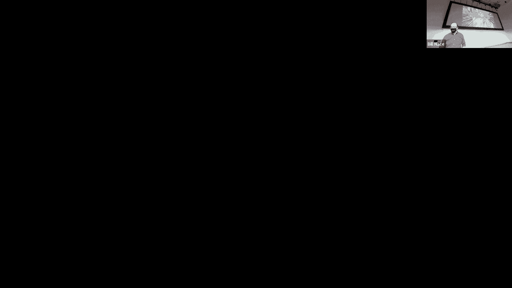

 And that's partially because it is a super popular protocol。

 And also one that does a lot of really good work and it's very optimized。

 And so there's a lot going on with it。

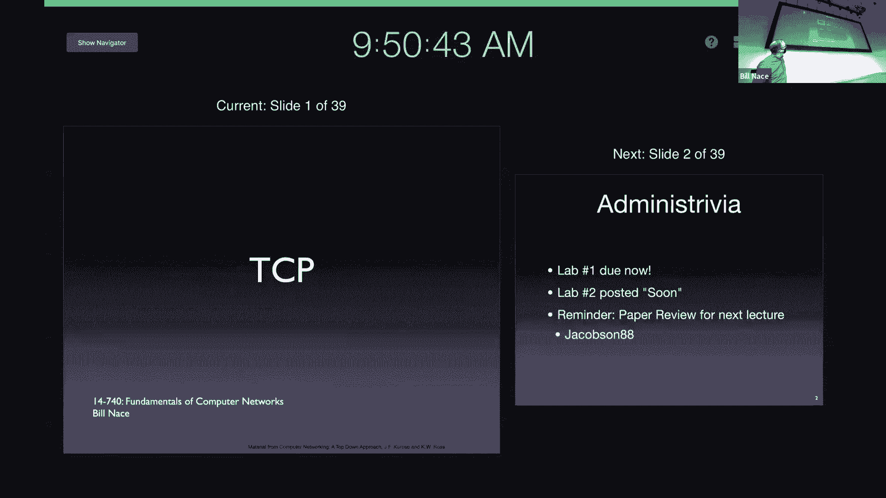

 And it's super important for us to learn about it。

 And so we're going to spend several lectures talking about several different aspects of this particular protocol。

 And so we're going to get started on the last part of the course is the transmission control protocol TCP。

 Before we get started though a few administrative notes。 Hopefully everybody got lab one in on time。

 Lab two is do。 I don't know something like two weeks from now。

 I will get it posted in the next day or so。 Still got a few polishing things to do on that。

 But we had stuff that we had with the lab one and get those fixed。

 And also we have a paper review coming up so be careful about that one after that will help a little lull for a while。

 Before we get into more stuff。 It's been a week since we last talked and so。

 It's helpful maybe to think back and remember what we were doing then。

 We had covered a bunch of these tools in some academic protocols so that we would understand how the tool is used。

 And today we're going to。 Obviously see them in TCP that was kind of the point of all that was so that when I say something like。

 oh there's a retransmission timer on it。 You understand the implications of that because you understand how that tool works and how it is used。

 And so put in the context of a complex protocol like TCP。

 There's less of a learning curve for this particular protocol， even though there's a bunch going on。

 So we'll talk a little bit about what TCP is。 And then it's formats and how you get started and how it does what it's supposed to do。

 which is the reliable data transfer。 So if I were a salesman and I was trying to sell you on a protocol。

 This is kind of the brochure bullet points that I might bring out and say。

 oh you should be using TCP because。 TCP is a point to point protocol。

 That means it connects a single sender and a single receiver。 It may not have occurred to you。

 but there are protocols that do more than that。 There are multi cast and broadcast protocols that would。

 for instance， let you send a single message， but have it received by many people。

 I don't know that zoom is doing something like that。 I think it's straight UDP。

 But you could imagine， for instance， that my computer sending frames， you know。

 to all of you could be done through some sort of multi cast instead of me having to set up a separate connection with each of you。

 The main bullet point， of course， with TCP is it's reliable。

 It's going to do all use all those tools we talked about last time to make sure that you get your data that you get it in order that you get it once。

 That you know， everything that is sent is received。

 That's what's happening with TCP and a lot of the complexity that makes TCP is because it has to use those tools to fulfill that mandate。

 It is an in order byte stream。 Now， that also seems obvious to us today， because we're used to。

 for instance， our file structure doing that。 Right。

 When you write a bunch of bits to a file or to store them in lots of places， you expect， well。

 I just have， you know， 27 bytes here they are。 If you look back in early computing history that's not always been the way we've set things up。

 In many cases， our networks were set up to send records of information。 And so you'd say， Oh。

 this is how big a record is going to be。 Think like a payroll record for an employee。

 And then let me send a bunch of records of those sizes。 TCP has none of that。 Okay。

 you're just sending。 Here's bite number zero， bite number one follows by number two。

 Doesn't matter how many bytes you send at a time or， or what their structure is。

 you manage that at the application layer。 It's also a pipeline protocol。

 It uses sliding window algorithms to optimize the bandwidth to let it use all of the available bandwidth。

 In that kind of， you know， whatever our bandwidth delay product is that we should be getting close to that amount of data in flight at any point in time。

 It is a full duplex data stream。 That means that sender and receiver both can be talking to each other across the TPCP connection both at the same time。

 Again， we're going to attack this as if it was unicast。

 We're going to think mostly about a single sender sending to a receiver。

 but recognize that once that's open， we're going to allow the other end to communicate back to us as well。

 which is often what we want with。 You know， for instance， client server computing。

 let me connect my browser to that web server over there。

 Let me send HTTP requests and let the server respond with HTTP responses。 Yes。

 that could be done over two separate connections， but why go through the troubles of making sure there are two happens if I can connect to him。

 but he can't connect back to me。 Let's just have a single connection。 That's what how TCP works。

 It is also connection oriented。 Again， this is not something you typically are headed towards you're not writing your application and saying。

 Oh， I wish I had a connection oriented protocol。 This is more of a result of the fact that we have a reliable data stream and that both sides are going to have to have synchronization of some data。

 like what the segment number is and how much stuff has been acknowledged。

 And so that means we end up setting up this connection between us。

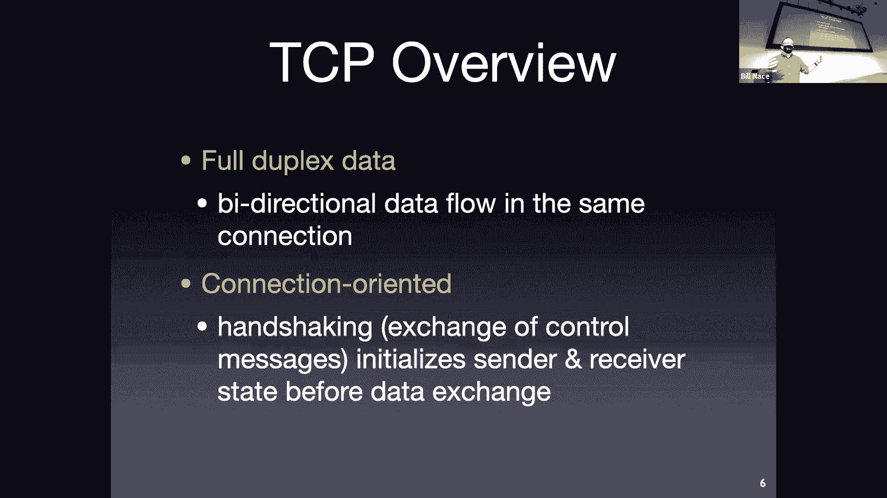

 One thing to keep in mind always with TCP is that there are a lot of buffers going on。

 And a lot of what TCP is doing is managing those。 And so I've shown this picture just to kind of set the stage for where we are in the transport layer。

 We're getting data from an application。 So on the sending side that's on the left side of the of the picture。

 right， the application every once in a while has data to send。 Right at its， you know。

 it's not scheduled。 It's just whenever it feels like it。 In other words。

 whenever you press a button or whenever you do something。

 Perhaps the application has some data that it's computed and it wants to dump it into TCP。

 And there are no bounds on how big that data is or when it shows up。

 And so it may be that TCP just is sitting around and all of a sudden here's this big data dump。

 And it has to have a place to put it。 So it's going to have to have some buffer to manage because it can't just take。

 Oh， you have a gigabyte file。 Now I need to send that out。 Right， it's good。

 It can't send it all in one piece。 It's going to have to buffer it until it can get rid of it all。

 And so it's going to be managing a send buffer with all this data in it。

 Notice also I've included the socket。 We talked a little bit about it。

 I think in response to a question last time。 The socket is an API that is commonly used。

 To do the programming of the transport layer。 It's not the only API and frankly it doesn't。

 I mean it's popular because it was the API that was used in the very first TCP implementations。

 And therefore， through the years it has become the one people use。

 So it's about to say that one people love， but nobody loves sockets。 On the center side。

 we also should recognize that there's kind of a buffer in the network。

 There is a limit to how fast you can send the segments and the bandwidth delay product tells us there's a limit to how many segments we can send。

 And so we can think of that as if the network is a buffer that we have to manage as well。

 And then on the receiving side， the receivers also in this asynchronous situation where it's kind of sitting around and every once in a while the network says。

 "Oh， here's another segment for you。 Here's some more data for you。"。

 And the receiver can't just take that data and force it on the application。

 The application code is running， doing whatever it's doing。

 It's rendering pictures or computing big things or talking to databases。

 And every once in a while that application will come around and say， "Oh， by the way。

 TCP connection， do you have any data for me？" Again， through the socket interface。

 And so that means that the receiver actually has to buffer this data。

 has to have a way to take these segments as they come in and store them someplace。

 so that when the application comes around and scoops it up， it can say， "Okay。

 now this is your responsibility。 I'm done with it。" But it has to hold on to it for a while。

 And this means we have these kind of producer/consumer problems where producers are creating things at different speeds and asynchronously compared to the consumers。

 And so we need to manage those properly so that we don't lose data or think the data is duplicated or anything like that。

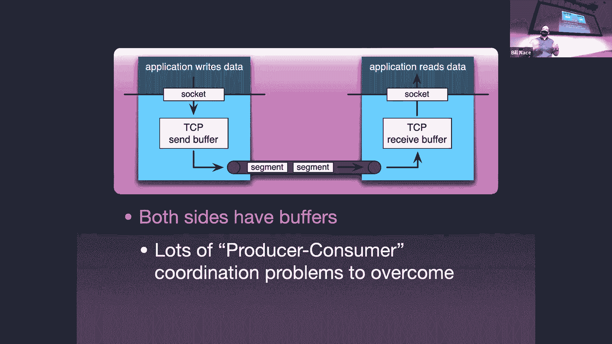

 There is also some transmission control to handle this。

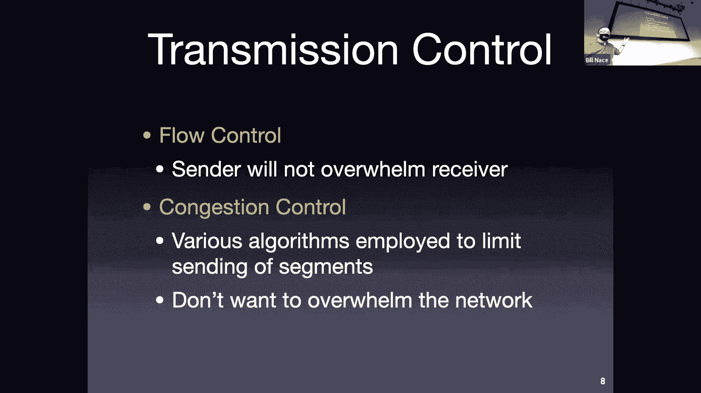

 So these are aspects that are there because of these buffers。 The first one is flow control。

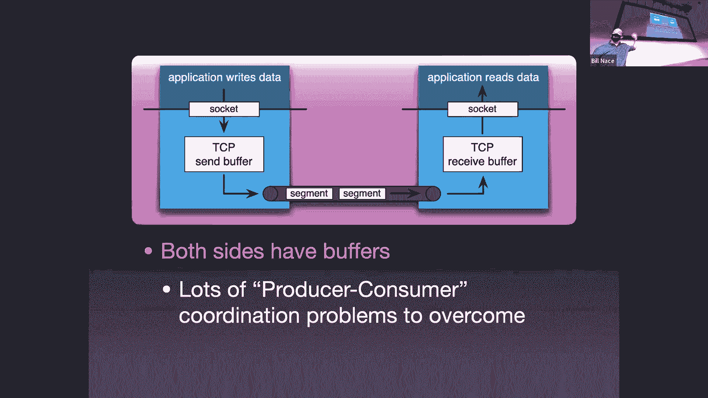

 Flow control is to manage that receive buffer on the receive side。

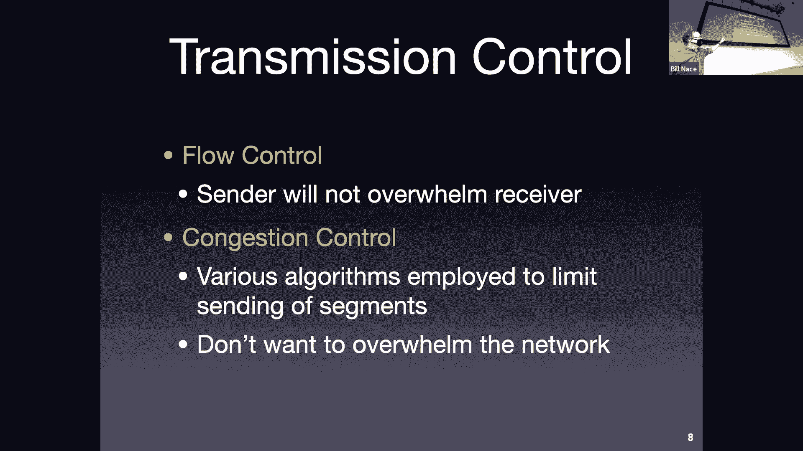

 We want to make sure that the sender doesn't send so much data that that goes over while。

 And so we have to make sure to restrict the sender in a way so that they never give us more data than we can hold on the receive side。

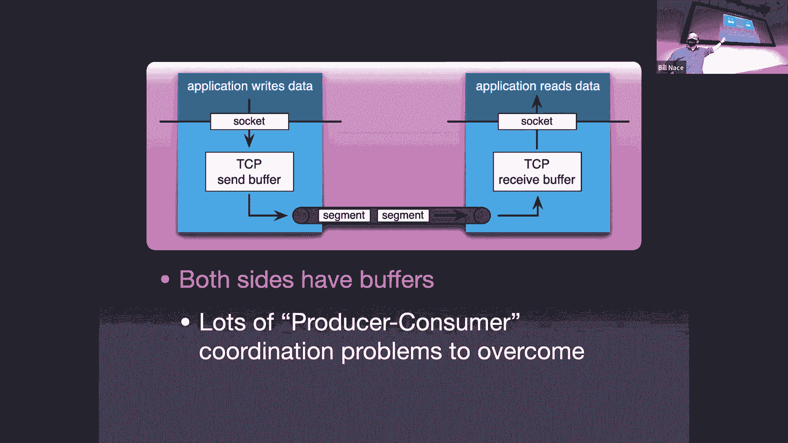

 And then the congestion control is a mechanism because the network has an inherent amount of data it can hold in its kind of buffer。

 which is a distributed buffer across all the routers of the network layer。

 But at the transport layer we don't know that。 We just know there's a network layer underneath us。

 And so we need to be able to control ourselves to keep from overwhelming a buffer that's in some router somewhere。

 And so we use congestion control algorithms to make sure that the sender does not send too fast to overwhelm anybody else。

 We will talk about congestion control next time， as well as a couple other future lectures out there。

 That's a very interesting and very complex topic that deserves its own work。 All right。

 so what's the protocol look like？ As we've seen before。

 every protocol has its own data format to be able to figure out what the bits mean。

 And TCP is no different from that。 We have another fixed size or fixed format to our segments。

 And look at all those boxes we're going to fill the header for a TCP segment has lots of information。

 Because there's a lot of this kind of communication we have to have a lot of places to keep track of some variables and send those to the other side。

 And so that's what all those boxes are all about。 And we're going to fill them in with fixed with things。

 It starts off kind of almost trying to lull us into a sense of complacency， right？

 It starts off with something we know we've got some port numbers。

 a source port number and a destination port number。 Again。

 I'd like to point out this is TCP's addressing scheme。 Okay。

 TCP shows to have 16 bit source and and destination ports。

 It's not that transport layers require you to have this kind of port。

 It's just those numbers happen to work。 For TCP。 And since the same guys who are designing TCP were designing you。

 They ended up with the same place， but they didn't need to， right？

 Those could have been 32 bit values。 They could have been character strings or something like that。

 They happen to be 16 bit values that are handled exactly the same as UDP with some well known port numbers for services。

 you know， our web servers port 80 or 443 things like that。 Next up。

 we have 32 bit sequence and acknowledgement numbers。 Okay。

 these are the numbers that we used for the reliable data transport。 Right。

 We needed sequence numbers。 What was the point of sequence numbers？

 They help us detect duplicate segments。 Right。 If I'm the receiver and I receive a segment with a number in it。

 I can immediately tell whether I've seen this before or not。 Okay。

 because I can look at that number and know something about those with that's what those are for。

 And there's the sequence number is one way and the acknowledgement number comes the other way。 Okay。

 so sequence number is going to tell us， Hey， this is， oh。

 it's going to work a little bit differently than we learned last time。

 We're not going to be numbering the segments。 So I don't send segment zero， then segment one。

 then segment two。 Instead， we're thinking about the data that we send as this byte stream。

 So we have bite number zero that gets sent and bite number one， bite number two。

 The sequence number is actually the number of the first bite in this particular segment。

 So I might send segment with a sequence number of zero。 And if it has 100 bytes in it。

 That means that those bites are numbered zero through 99。

 And that means the next segment I send would have a sequence number 100 on it。 Okay。

 so they're numbered by bites not by segment number。 The acknowledgement number coming back。

 That's a form of receiver feedback。 Right。 The receiver is telling the sender， Hey。

 I've gotten some stuff。 And so that acknowledgement number is a cumulative acknowledgement。 Right。

 You recall from the go back in for the call。 Right。

 We use cumulative acknowledgments to basically say， I've gotten everything up to this number。

 And again， this is invite count， not in segment count。 And there's one other slight difference here。

 And that is the disacknowledgement is not an acknowledgement of the bite that has been received。

 But it's the next number， basically one more than that。 It is the number of the next expected bite。

 So if I got a segment coming back that had an acknowledgement number of 100 in it。

 That would tell me that the receiver has received everything up to bite number 99。

 And is expecting that I send segment with the bite number 100 in it。

 which would be a sequence number of 100 in it。 At some point in the future。 Does that make sense？

 So couple slight differences still performing the same function。

 doing the same job as the sequence numbers we talked about last lecture。 Let's see。

 Next up is a flag field。 That next 16 bits includes a length field。

 What were the two questions I always told you you have to ask if you see a length in a protocol。

 What is it include？ Right。 What's at the length of？ Is it the length of the header。

 the length of the data， or the length of both？ Okay。 And in this case， we've got a header length。

 One of the reasons we put that in the name is to kind of remind us of that。

 We are going to measure just the length of this header。 And you might look at that and say。

 why do I need to do that？ That's the header right there。 Why do I need to know how long it is？ Well。

 it's because that options field at the bottom may not exist。 Okay， or it may have some length to it。

 It could be different sizes。 And so we need to know how big that's going to be。

 Or the receiver needs to know how big that's going to be so they can figure out where the start of the application data is。

 Okay。 What's the other question asked that you need to ask？ What are the units？

 What does the bit value in their represent？ So here I have a four bit value and it represents the number of words in the header。

 the number of 32 bit values in the header。 Okay， and so that means if you look at basically each row of my picture is one word。

 you can see that we have five words plus the options field。

 So that means the header length is never going to be less than five。 Okay。

 and it's a four bit value， which means it could be as big as 15。 Okay。

 so that means I could have 10 words worth of options included and I'll know that because of this header field or header length。

 So， Dean on is asking a very great engineering question。 I don't know the answer to that。 Okay， we。

 yeah， we could have had so we have a restriction on the size of the options field。 Right。

 the options field is either zero through 10 bytes。 We could have gotten a little bit more。

 We could have let it go up to 15。 If instead of using those four bits to count the five words that we always have。

 let's just go ahead and make that a length of the options field instead。

 And we could that could have happened。 I don't know whether there were technical reasons。

 but I'm not sure I understand them if there are， or if nobody just really worried about it at the time。

 So， but that's where we are。 It's a header length， always going to be five or bigger。

 There are a couple of bits there I'm calling not used。 Okay。

 there are RFCs that specify uses for those， but they're commonly not employed。

 or they're employed in only certain circumstances。 And so I'm calling them not used。 Okay。

 but I get with all things network。 There's a little asterisk next to that。 But for our purposes。

 it's good enough to say， yeah， just never use them。 The next thing up are those flags。

 and there are six of those flags。 So a flag is a single bit value that acts like a flag it's either up or down。

 Right， you run a flag up the flag pole to signify something like， Oh， it's day。

 Or you take it down to signify nothing。 Same thing with these bits。

 You have a one or a zero in them， and they tell you something Boolean。 And the things they tell you。

 well， there are a couple of them there。 Okay， first up。 Well。

 I'm not going to talk about the first one first。 I'm going to talk about the most important one first。

 which is the act of flag。 The act flag tells us that this segment includes a good acknowledgement number。

 Okay， so we can't tell by looking at the bits in the acknowledgement field。

 You can't just look at bits and know whether it means anything。 Right。

 there will always be 32 bits in that acknowledgement field。

 And it may be that the segment being sent does not actually acknowledge anything。

 You can imagine the first segment that ever gets sent。 Right， it's going to have that header。

 It's going to have bits in the acknowledgement field。 Okay， the receiver needs to know。

 Pay no attention to those。 Okay， and so this bit tells you whether or not to pay attention to the acknowledgement field。

 There are also three of them that help us do connection management help us set up the connection and tear it down。

 The sin flag， S Y N stands for synchronize。 It's used at the beginning to kind of set up the connection。

 We'll talk about that in a few minutes。 There's also a fin， which is the other end of things。

 It helps us tear down the connection， helps us to signify that this is done。 We're over with this。

 We're not going to send you some more data。 And there's also an RST， which resets the connection。

 That's basically an error message。 Okay， it says， Hey， all that stuff we've done before。

 we got to get restart this connection somehow。 Okay， and so that also may be some error like。

 you know， we'll talk about a couple of things as well。 The two others there。

 the push and the urgent， those are not frequently used。 Okay。

 they're specified in a couple of protocols。 Push basically tells the receiver。

 you need to get this data to the applications as fast as possible。 Okay， now unfortunately。

 the way our applications work， they're all asynchronous。 So there's no good way to tell the。

 you know， how do you tell the browser， Hey， browser code， I've got data for you。 Okay。

 you do that by waiting for the browser to come back and check usually。

 not by having like an interrupt mechanism to say， Oh， you're， you're in the middle of drawing that。

 that beautiful gift on the screen。 Please stop that and come get some data。 Yeah。

 but that's the intention of the push the urgent is kind of the same way。 We're saying， Oh， look。

 some of this data is actually more urgent than others。 You should look at it first。

 And there's actually a way to kind of point into the data of the pack， the payload and say。

 start here。 Again， we typically don't use this。 So I'm not going to worry about too much about explaining。

 Moving on， the receive window 16 bit value。 This helps with the flow control problem I described earlier。

 We want to make sure the sender does not overwhelm the receiver。

 This receive window field is a field sent by， sent by the receiver that effectively gives the sender permission to send this many bytes。

 Basically， the receiver is saying， this is how big my buffer is right now。

 And it would be okay if you sent this many bytes because I have a place to store it。

 But don't send more than this。 Otherwise， I won't have a place to store it。 Next。

 as it as it checks them。 The checksome algorithm works exactly the same way as the UDP checksome algorithm does。

 And in practical use， oftentimes， the checksome here is calculated in combination with an IP packet and often done by hardware。

 But the protocol specifies that you're going to fill in a 16 bit checksome value using the same math that you used in that we learned in UDP。

 There's an urgent data pointer。 That's the pointer that I mentioned with the urgent flag。

 Don't worry too much about how that works。 And then there's an options field。

 You don't have a whole lot of space for that。 You have a potential 10 words 10 by 32。

 So 40 bytes of data can be put in there。 Along with whatever control you would need to specify what option you are using。

 There are a couple options that you'll see out there。 You'll see， for instance， time stamping。

 So you could kind of do something sort of like trace root to tell you。 I sent this at this time。

 What time did you get it sort of information？ There's window scaling factors。

 We discover that the 16 bits for the receive window in some scenarios is not enough。 Okay。

 so that that receive window。 That becomes a limit on how much data can be in flight。 Okay。

 16 bits means two to the 16 64 K of data can be in flight at a time。

 And in many scenarios with been with delay products。 That means for high bandwidth and long delay。

 Think for instance， satellite communication has a very long latency。

 You want to be able to have more data than that in flight。

 And so you can send an option that basically says， oh， yeah， that receive window value。

 Multiply it by four or multiply it by 16。 Okay， so you can get more data in flight。

 And also we can negotiate our MSS as well to discuss how big that should be。

 How much application data we can have。 Okay， now you recall that we。 We would like to send。

 I guess they're competing。 Engineering pushes here， right？

 We would like to send as much data as possible in a segment。

 Because that means that the bites we are sending as the header。 Which are overhead。

 Are used over more data and therefore were more efficient。 Right， if I have。

 if I'm only sending a bite at a time。 Well， I'm sending all this header stuff plus one bite。

 That means I'm not using the bandwidth efficiently。 So we'd like to have bigger segments。 You know。

 however， we talked early on lecture two or three。 Where we talked about segmenting。 Right。

 and we said， oh， it's really good in a store and forward network to chop stuff up into pieces。

 And it turns out that the network is going to have different sizes for the allowable pieces。

 It's not just going to allow you to have as big a segment as you want。

 Those sizes are all determined by the technology of the data link layer。 So an ethernet frame。

 how big can it be？ There's part of that ethernet spec says how big it can be。

 And that has an implication for how much data we can then put into this segment。

 And we call that limit the maximum segment size。 Now， we got to。

 I got to point out that it's not really the maximum segment size。

 even though it says maximum segment size。 What we're actually talking about is the maximum application data size。

 the maximum payload size for my segment。 Because the MSS does not include the header of the segment。

 And when I hear the word segment size， I think of， oh， that must be the size of the whole segment。

 But MSS is not。 MSS is the size of the payload of the segment。 Now。

 I'm going to calculate that based upon the fact that in that application data。 I'm sorry。

 the application data I send plus my header is going to have to fit。

 It's going to have to be encapsulated in a segment， I'm sorry， in a packet at the network layer。

 Which is itself going to have to get put into a frame at the data link layer。

 And the frame at the data link layer is the one that has a size limit。

 We call that the maximum transmission unit or MTU。 And so that MTU， that frame size。

 actually that's the payload of the frame。 That payload has to include my MSS that is my payload size plus a segment header plus a packet header from the network layer。

 And so if I take MTU and I subtract out the packet header size and the segment header size。

 that will tell me my MSS how much data I can fit into this segment。

 >> I think I've just said that how do we know what the length of the application data is from our issues？

 >> Oh， so you don't actually know it from this protocol。

 You're going to be told by the network layer how big is the thing you're getting。

 How big is the segment you're getting？ And you're going to subtract off the header length to figure out how much is left。

 I'm sorry， for zooming people， the question was how do we know how big that is？

 How big the application data is。 And we can't from just the information I've shown here。 All right。

 By the way， there's some numbers。 1460 is a very common MSS that corresponds to Ethernet。

 which has a 1500 byte MTU。 So we've subtracted off the packet header size and the second header size to get that。

 But other values are available。 Now， just to make sure we understand this。

 I got a quick question for you。 Let's imagine that I want to send some file。 Okay。

 And I'd like to know how big that file can be if I'm going to send it over TCP。 And so in this case。

 let's imagine I have an MSS of 1200 bytes。 So 1200 bytes worth of data can fit in each segment。

 The TCP sequence field， as we've seen， is 32 bits。 Okay。 So based on that， how big can this file be？

 Anybody？ I guess I should actually have my chat window open so I can tell。 Sorry to have people。

 Okay。 All right。 So some of you may be doing this math and say， okay， 32 bits， two to 30 seconds。

 big number。 It's what？ 4 billion or so。 And if each of those has 1200 bytes in it。

 that's really big。 Okay。 And you might also be recognizing， oh， wow。

 that means that the guys who made this spec back in the 1970s。

 were imagining that I would today want to be sending a video of this amount of size over， TCP。

 which would be really dramatic。 Okay。 I asked this question mostly just to make you think about these numbers and then tell you。

 that it's wrong。 That the thinking you're doing is incorrect。 Okay。

 This is basically a trick question to point out a couple things。 One is， of course。

 that sequence numbers I mentioned earlier is based on the byte number in the stream。

 not the segment number。 So it doesn't matter how many bytes each segment would be holding。 Okay。

 Each， I'm going to send out， you know， sequence number zero and then sequence number 100。

 if I just sent 100 bytes。 And then you may say， okay， well。

 that means I can only send two to the 32。 4 billion bytes worth of data。 And you might say， okay。

 that seems reasonable， but I'm sure some of you are sitting out there saying， wait a minute。

 I've sent more than that amount of data in the past at some point。 And it is true that that number。

 that sequence number is a module of 32 thing。 So if you happen to count too big。

 it just starts back over at zero。 So there actually is no effective limit to how much data you can send in a single TCP stream。

 which is great。 I think that's a fantastic engineering choice that was made way back when to set this up so that you don't have a limit。

 Right。 It'd be kind of annoying because I'm sure whatever if they had chosen a limit in 1970。

 they would have said， Oh， I can't imagine anybody would ever need to send more than 100。

000 bytes or something like that。 And we would have had to scrap the whole protocol。 All right。

 so let's using this knowledge now of how the format works。

 Let's see how we actually manage our connection。 How do we get a connection started and how do we get it？

 How do we turn it off when we're done？ And what we're doing with this whole process is we are synchronizing information。

 From the sender to the receiver。 We want to know that it's okay to connect to the receiver。

 and we want to make sure this receiver has the same kind of view of the connection knows where the window is。

 for instance。 That we do。 And so that's the whole point of this initial process。

 And we're going to then also want to tear down a connection when we're done。

 because we'd like to free up whatever resources are used to keep track of those things。

 Another point I had not mentioned was the receiver is going to want to set aside a buffer space to store this data when it shows up and the receiver may have a limit on how much memory it has。

 And so， you know， we want to make sure to use that properly。

 We want to make sure to initialize it when we begin a connection and then return that the pool of memory when we're done with the connection。

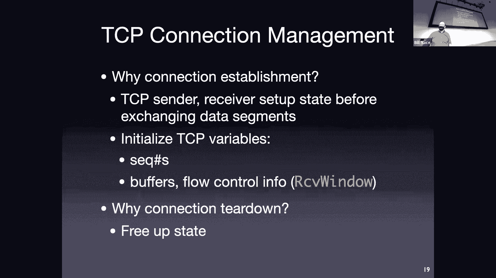

 So we're going to start off opening the connection with what is known as the three way handshake。

 which I think is a terrible name。 I'm picking apart the names today for some reason， right。

 MSS three way handshake。 To me a three way handshake would mean there are three participants。

 because you're hand shaking three ways。 Okay， instead what we call the three way handshake because there are three segments involved。

 Okay， we still only have two participants， we have a sender and a receiver。 Okay。

 and they send back and forth these three segments to get things started。

 And that's why we call it the three way handshake。

 We've seen touches of this before I described it briefly when we talked about HTTP。

 This is the process we go through when we say， Hey。

 pretty please may I connect to you and get a response saying yes， you may。 Remember that with HTTP。

 We're seeing the same thing here now just done。 This is how the actual protocol does that。

 So we start off at the I'm calling client。 This doesn't necessarily the sender the originator of this connection。

 They're going to go ahead and send that connection request。 They're going to send a TCP segment。

 It's not going to have any data in it yet。 It's just going to be a segment header。

 And that header is going to have the sin flag set。 Remember the spin flag was one of the six flags。

 That's why I'm the synchronization flag。 This is exactly why we have that flag。

 I'm going to send a segment with that flag set。 And I'm also going to choose what we call an initial sequence number。

 It turns out I have described sending， you know， here is segment zero as your first one that says this is bite number zero。

 We're actually going to not start at zero or sometimes we'll start at zero。

 but we're going to randomly choose a 32 bit value to start with。

 And that is my initial sequence number。 So I could actually start off saying this。

 I'm going to start off the first segment I send you is you know。

 bite number three thousand and forty two。 I just choose some 32 bit number to make that。

 And that's my， I send my initial sequence number。 So I'm going to send that to the server。

 If the server is cool with me connecting to them， then they will go ahead and do whatever they have to do to set aside data structures。

 set aside some receive buffer space to keep track of this。

 And I'm not going to send a segment coming back。 And that segment coming back we call the sin act segment because it has the sin flag set because it's part of the synchronization sequence。

 That's what that sin flag is for。 It also has the acknowledgement flag set because the acknowledgement number that it sends is good is useful should be looked at。

 And so it's going to send back a segment， sin and acra both set the sequence number is it is going to be the server side initial sequence number。

 Remember， this is a bi directional connection。 And so we're doing the same thing the other way we're choosing a random 32 bit number to start with as our first sequence base。

 So it's so we。 That when coming back is going to have some other random number in the sequence space that will be the sequence number for data flowing from the server to the client。

 And then the knowledge field we're going to go ahead and this feels a little weird if you look at it too closely so don't look at it too closely that acknowledgement numbers just to be one more than the initial sequence number that the client said。

 It's not that they actually sent data and you're asking for the next quite a data。

 It's just we always add one to that and send it back。 So that's one two parts of the handshake。

 The third part of the handshake。 Now is kind of like the client is saying， okay。

 I acknowledge server， I give you permission to respond back to me。

 And so we're going to send another one。 This one we're done with synchronizing。 Okay。

 so the same flag is not set those first two segments are the only segments that the same flag is ever set for。

 It's for those first two。 This one now the sin flag is zero。

 I'm going to go ahead and use a sequence number that is one more than the acknowledgement number we are the sequence number we got last time。

 So the server gave us the server initial sequence number。 We're going to use。

 we're going to acknowledge that with one more than than that。

 And we're going to go ahead and add one to our stream since he was acknowledging client is n plus one we're going to go ahead and number our data starting at client plus one。

 Okay， so what did I say humans go three thousand forty two。

 This would be bite number three thousand forty three is my first bite in the stream。

 And however many bites I have， I just send them out。

 This segment actually can contain data and usually does contain data。

 Because the reason I connected was to send you some data。 It all makes sense。 Yeah， cool。

 So we've got these random sequence numbers。 What's the point of those。 Okay。

 why would I do a random sequence and I got to admit it's not technically random。 Okay。

 because we don't want to randomly choose a value we just used and so we actually control it a little bit more。

 Like counting and adding things and stuff like that but let's pretend it's a random number。

 Why is that random with badness could go on。 I mean。

 why not just always start at zero be a lot easier to read these streams and not have to subtract out that from how much data we're transmitting all the time。

 Anybody。 Why not just use zero。 So you're very close。 Right。

 What happens if I use zero as my sequence number and some other application uses zero as。

 That's a sequence number。 Now I notice you're using application， which is great。 Right。

 because other clients other machines could use zero sequence number。

 And those would be distinguished because they come from different network connect different network addresses。

 Okay， and so we see those the receiver would see those as different anyway。

 But it's possible that there are two applications on my computer that are sending to the same server。

 Okay， and or one application using multiple TCP connections or something like that。

 And then what happens if the receiver gets a zero from both of them。 Okay， in that case， the risk。

 We would end up using different port numbers。 Okay。

 and so this the receiver would still be able to distinguish them apart because the source port number would be different。

 Okay。 Okay。 Okay。 Okay。 Yeah， I love how I and I always goes to the security and the malicious right。

 That is true。 Somebody can predict the number。 Again。

 not completely sure what you could do with that。 Remember also designed in the 1980s。

 that was before， when I say before malicious players on a network。

 or at least before people were all that defensive against them。 There's actually a much more。

 Mundane reason to not do this and that's because what happens if a segment has is taking the long way around to get somewhere with the worried about is actually。

 I have a connection that I shut down and I immediately start another connection with the same server。

 Okay， what would happen if a segment was just lost in a in a router and getting there slowly。 Okay。

 and it showed up， you know， again， it's not going to be too slow。

 but we imagine that the packets in the network can take up to two minutes before they die is kind of the official spec。

 So if I reconnect to the same server using the same port numbers from the same IP address within that two minute window。

 it's possible that an old segment could show up and and mess up some of my data and be accepted as good data。

 And we wouldn't want that to happen。 Okay， so kind of mundane reason for that。 I should point out。

 just because we start this three way handshake doesn't mean it has to be accepted。 Okay。

 it's very common in fact for us to try to open a port， and we do that by sending this first segment。

 right， I send this in segment to a server saying， hey， please may connect to you。

 I'd very much like to， you know， send you to， I'd like to connect to port 80。 I'd like to， you know。

 send stuff to your web server。 And that computer says， wait a minute。

 I don't have a web server running。 There's nobody at port 80。 What do we do。 Okay。 Well。

 this is where we use that kind of error message。 Instead of sending back a synac， which says， yes。

 you can connect to me， we send back a segment with the reset flag set。 And that tells the。

 the sender， you're done， you can't connect to me at that port number。 Okay， by the way。

 we didn't talk about it， but the same thing can happen under UDP。 Okay， but under UDP。

 I have no connection。 Right， I have nothing set up to make that we just sent some data to you。

 The mechanism there is that an ICMP pack， which is a network layer error message will come back to the to the sender。

 If you do that， if you try to open up a port that's not there。 All right。

 that so we use the three way handshake to open a connection。 Then we send a bunch of data。

 At some point， we're going to be done。 And how do we close it up？ We'd like to close it up nicely。

 A， because， you know， our mothers taught us to clean up after ourselves when we're， you know。

 putting up our masses。 We'd also like to release the other side from the obligation to hold any of the data structures or buffers that are associated with our connection。

 Okay， so the way to do this is to go ahead and send a segment with that fin flag set。

 The fin for finish was there， right， is that's this is its purpose。

 If I ever send a segment with the fin flag， I'm basically saying， I'm done。

 I will never send you any more data after this point。 Okay。

 and that will be acknowledged by the other side。 Like to point out。

 we can close one side of it without the other side closing。 Right。

 so it's possible for me to connect to a server。 You know。

 to some application on some server and say， Hey， you know。

 I want the stock market ticker for the day。 Okay， and please send it to me。 And then I close up。

 I'm done。 I finish。 But that server is going to send me stock data for the next eight hours。 Okay。

 and it can use the same TCP connection for that to happen。 It is possible to close up one side。

 but not the other。 From a protocol perspective。 The server when they're done， when they're fin。

 So typically， once I connect it， once I send a fin segment， the other side says， Okay， we're done。

 I will close my side as well。 So we send an acknowledgement。 We send a fin segment。 Okay。

 I believe those two can be in the same segment。 Actually。 And then we acknowledge that。 Okay。

 now it turns out。 When both sides are done， that acknowledgement does not actually close the connection。

 Instead， TCP goes into what's known as a timed wait period。 Okay， and for some amount of time。

 we that connection is technically still open。 Okay， for 240 seconds。 In that timed wait period。

 We will the purpose of that is that we will still respond to fin segments that come in with an acknowledgement。

 Okay， and when that 240 second。 Seconds is up， then we're done the TCP connection is closed。 Okay。

 now why do we do that？ What's the point of having this timed wait？

 This seems like extra complication。 Wouldn't it be nice to just。 Go in， you know。

 be done with this connection， close everything up close up shop。 Go away。

 What do you mean stuff in the， and in which buffer。 Okay， well if that's true。

 then I would not have sent a fin。 Right。 If I have stuff to send， I wouldn't。

 Have closed it up or if I， for some reason did close it up。

 then I'd know that I can never send that data anyway。 I throw it away。 Yeah。 So no， the， the。

 the fact that I have data still sitting in a send buffer is not the reason for the time。

 And then the， the 240 seconds should be a hint。 240 seconds， some small amount of time。

 The issue is during this time period， I will have sent that acknowledgement back。

 but it's possible that that acknowledgement is lost。

 And what's going to happen then on the server side， the server tried to close by sending a fan。

 And then the server did not get an acknowledgement back。 He's going to think， Oh。

 that thing got lost。 A timer is going to go off because he's got a time out on these on these。

 The timer expiration goes off。 He's going to retransmit。 Okay。

 And if we have closed everything up at that point。

 that means what we get is a fin segment coming in to a port。 We。

 or to a connection we never believe was open at that point。 If we throw in all our data， then。

 And even worse， what if I tried to reconnect to that server。 Right。

 And just sent a sin segment to open it up。 And now I get a fin coming back from it。 Okay。 Now I'm。

 you know， that pre fin from a previous connection would be interfering with this reopening that I'm doing。

 And if you don't believe we never reopened， think back to the HTP scenarios we talked about earlier。

 Where we were doing a lot of that， right？ Oh， I just got a HTML file。 I close out the connection。

 I recognize that now I need to get these 10 images to fill in the HTML file。

 And then let me open a connection to the server。 Okay。 So this is not， I mean。

 this is a little bit of good engineering to make sure that's not going to happen。 But it could。

 you know， there's a non zero non negligible probability that you would be reopening a connection to the same server。

 You just close。 Okay。 So that's kind of the how we start a connection， how we finish a connection。

 Now let's go ahead and make sure we understand how the actual data gets transferred so that we know that that's happening reliably。

 So that we use all those tools we talked about last week。

 To get our data from one side to the other properly。

 What's the actual TCP protocol look like in terms of reliable data transfer。 Okay。 Well。

 TCP uses these tools to overcome the problems and faults that happen at the network layer。

 like we talked about last week， right？ We're going to go ahead and。

 And allow ourselves to send as much data as possible。

 That's going to mean we're going to need windowing。 To be able to control。

 keep track of the multiple segments that we are sending。

 We're going to use cumulative acknowledgments as we've already discussed that Actfield。

 Acknowledges stuff cumulative。 Now we saw with go back in。

 We said the reason go back in had that horrendous problem where it threw away all the segments was because it was using cumulative acknowledgments。

 We're going to overcome that by mixing in some of the selective repeat features。

 even though we're still using cumulative acknowledgments。

 We're going to use a retransmission timer to that's going to allow us to detect that something got lost and needs to be retransmitted。

 And that that is TCP's reaction to loss is to go ahead and retransmit something。

 We've mentioned this a few times when we said that this is a problem sometimes we talked about it with UDP。

 for instance。 In many scenarios， we'd rather have some other form of reliability rather lose a segment。

 Then have the delay caused by retransmission or in DNS's case。

 we've got better ideas on how to do reliable transfer。 The retransmissions themselves。

 the timeout of course is going to cause a retransmission。

 We're also going to see something called duplicate acknowledgments。

 If we get the same acknowledgement coming back a couple times。

 that's going to be an indication of loss。 And that will cause a retransmission。

 We'll see in a minute why we would see those multiple acknowledgments in the first place。

 So we're going to start off simple。 In fact， I'm kind of just told you there's a thing called duplicate acknowledgments。

 And the next thing I'm going to do is say let's ignore it for a second。

 We'll add those in later on today。 We will ignore flow control and congestion control entirely。

 So those are questions that we're going to leave for Thursday for how that happens。

 Let's just imagine that the sender would have to check both of these to see whether he's allowed to send the segment before he does。

 For today， we're going to pretend the sender can send a segment whenever they want to。

 And we're going to be using round trip time to calculate the timer expiration。 Again。

 we're just going to assume that gets figured out somehow。

 We'll talk next time about exactly how that happens。

 We've talked a little bit about these sequence numbers。

 but let's make sure we understand them and how they're actually used in the reliable transfer of this data。

 The sequence number is the byte number， the index of the byte that was the first bite of this segment。

 When I think of all of the data I'm sending。 All of that is offset by my initial sequence number。

 I'm going to be using numbers today as if we chose zero as our initial sequence number。

 These are all kind of real。 Values that are relative to each other instead of some absolute value。

 You can imagine however that the sequence numbers and you'll see this when you do wire shark in the lab。

 We can imagine that the sequence numbers since they're randomly selected 32 bit numbers often are these large monstrosity numbers to deal with。

 The acknowledgement that's come so I'm going to send out a sequence a segment with a sequence number in this case。

 I got sequence number 19 is my first segment。 That just means that the first bite in the bytes I'm sending is bite number 19。

 I've seen 18 before。 Here's the 19。 It's all that numbers is sent。

 The other side of course sends an acknowledgement coming back。 That acknowledgement is cumulative。

 When the other side sends me an act 20。 That means we've seen everything before this。

 If we're missing， I just sent a segment with sequence number 19。 Previous to that。

 I must have sent some more data and that acknowledgement means we've gotten all that data。

 We're good up to this point with that acknowledgement。

 Remember that that acknowledgement number tells you we expect this next bite。

 That's the expected next thing to show up not the acknowledgement of what we've actually seen。

 We've sent sequence number 19， acknowledgement number 20 comes back because the next bite we expect would be a 20。

 That means I must have only sent one bite of data in that segment。 That's true。

 We'll talk about that scenario in a second。 It is possible by the way to piggyback data coming the other way。

 If the server in this case has data to send back and also wants to acknowledge a segment。

 it can do both of those in a single segment。 It does not have to send an acknowledgement segment and then send a separate segment with data in it。

 It can go ahead and collapse those into a single segment。

 We call that piggyback in the data with an acknowledgement or piggybacking acknowledgement with some data。

 Here's a scenario。 This is a very simple， just we've got some remote login scenario going on or something。

 I'm one of my client remote logged into the server。

 If you've ever done this with SSH or something like that， this is easy。

 You get a connection and it looks like your command line is actually on that other computer and you type stuff and it happens as if it's over there。

 One thing you may not recognize is normally with those clients， when you type a character。

 when you type in LS minus L something something something。 As you type it。

 those characters appear on your terminal as if you were just typing them in。 Typically though。

 those characters are not printed on your terminal because you type them。

 They're printed because that character you type got sent to the other side and then got acknowledged coming back。

 That way you get a little feedback as you type to know that data is actually being sent。

 Usually in those scenarios， the data is sent character by character or depending on how fast you type。

 maybe you get a couple characters into a single segment of being sent。 That's kind of the scenario。

 At my keyboard， I type the letter C。 A segment goes out with that letter C as the data。

 In this case， that's sequence number 19。 I may be acknowledging something previously happened for the last character。

 My acknowledgment number is 87。 I have the data。 The character C is in this segment。

 That's the only data。 The host gets that segment。 It looks at a C here。

 Let me put that into my remote login server application to keep track of the characters that have been typed。

 Let me echo back the character we got。 The application on the server side is going to want to send the character C back to the client in this case。

 It's going to send a segment that has the C in it。 In this case。

 we see that it's sequence number 87。 How do we know it's 87？ 87 was acknowledgment last time。

 That means for this segment， we were expected to send something with sequence number 87 and we are。

 We need to acknowledge the data we got in the last segment。 That segment had sequence number 19。

 We are going to send back an acknowledgment 20。 I have seen 19。 Please send me 20 next time。

 It's the meaning of that。 The client gets it。 It echoes it。 Types it on your terminal。

 Here is the character C。 Usually that's fast enough that it looks like I typed a C and it just appears。

 The client doesn't have any more data to send。 It does need to acknowledge this message that came in from the other side。

 We will send a segment out that just has an acknowledgment of 88。 But no new data。

 Kind of makes sense。 We go back and forth。 Sequence number， acknowledgment number， sequence number。

 acknowledgment number。

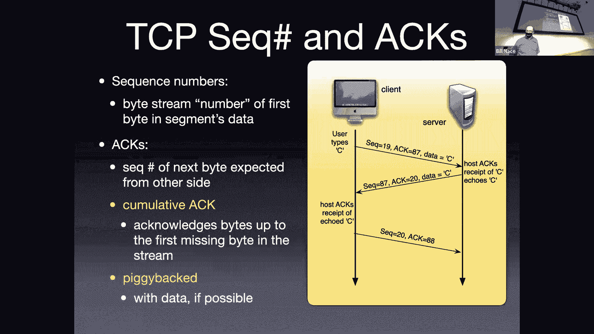

 On the sender side。 What does the protocol look like？ The protocol looks like a C。

 I saw several missed TCP packets。 There is a message sent in that case。

 If there is a missing TCP packet and you can see spurious TCP segments or something like that。

 If that segment， this is the reliable data transfer happening in action。 What happens if。

 let's imagine that second segment gets lost somewhere。 The second segment is carried by the network。

 The network has reliability issues。 It gets lost somewhere。 What is TCP going to do？

 This is what you see in wire sharp。 If that guy is lost， then after some time out of amount of time。

 my client is going to retransmit。 The timer is going to go off and say。

 we think we lost something because we didn't get an acknowledgment back in time。

 Let's go ahead and retransmit this。 We will see more of that in just a second or more slides。

 You recall last time we defined a lot of the protocol things by saying what are the actions that happen on the sender and the receiver based on various events。

 That was basically the definition of the stop and wait。

 Here is a list of sender events and here is a list of receiver events。 For TCP。

 here are several of the things that sender is going to do when certain events happen。 For instance。

 the application hands some data to TCP and says， here is my next tick-tock message。

 Go ahead and send this。 What do we do？ We take that data and create a segment。

 What do we mean by that？ We have to chop it up into the correct sizes。

 We have to figure out what's MSS。 I'm going to take MSS number of bytes of the beginning of that message and put it into a segment。

 I'm going to put a header on it。 I'm going to fill out a bunch of the header fields。

 As I'm doing that， I'm going to put a sequence number on it。 That sequence number is。

 I've got a counter someplace that keeps track of what sequence numbers have used in the past。

 And so I know this is byte number X because I know what my initial sequence number is and I've kept track of all the bytes I've sent so far。

 I will check with congestion control and flow control。 Am I allowed to send this？ If they say yes。

 then I will。 If they say no and we'll talk next time about exactly how that works。 If they say no。

 then I'll wait until they say yes。 I'm going to then， okay， I'm ready to send this thing。

 Let me go ahead and set a timer。 So that I can keep track and know whether this one got lost or not。

 I'm going to start a timer off。 I'm going to go ahead and send it。

 If I don't get a response in some amount of time， we're calling that the timeout interval。

 We'll learn how that's calculated next time。 If I don't get a response in that amount of time。

 then it must have been lost。 Okay， so that's the event when I get data from the application。

 What if a timeout actually occurs？ Okay， if that timeout interval goes by， well。

 that means one of two things。 It means my segment got lost or what's the other thing it could mean？

 The acknowledgment got lost， right？ I don't know which one。 I just know I sent something。

 I'm not cutting a response。 So one of those two things happened。 So I have to retransmit。 Okay。

 and when I do， I'm going to reset the timer because it's possible for my retransmission to get lost as well。

 If on the other hand， I get an acknowledgment back。 That's great。 Right。

 The acknowledgment tells me that some data was received。 Okay。

 and I'm going to have to keep track of。 Of where the acknowledgments are。 So I know， you know。

 where I am of all these segments I have in flight， which ones have been acknowledged。

 That acknowledgment， since it's a cumulative acknowledgement means that that segment and all before it have been received or that bite number and all before it have been received。

 Dingon。 Is it。 Is it。 Or is it starting to。 What do you think you sound like？

 You're saying you can have this one。 The other。 The timer。 Okay， so dingon is basically。

 I think asking， what if I'm sending multiple segments。

 so I have one timer or multiple timers or how do I handle that。 Right。

 And that's going to be implementation dependent。 Okay。 It is possible。 So on some operating systems。

 timers are expensive and you don't have a thousand of them available to you at the operating system level。

 And in that case， TCP has to be smarter about how it manages it。 And so in that case。

 it will keep offset values and it'll know。 Oh， when this one timer goes off。

 that meant that one got lost。 And now I still have six others in flight and I know how much later they got sent out。

 And so I will have to figure out which one to restart a time report。

 You can imagine with a little bit of coding， it's as if you had as many timers as you want。

 So oftentimes， I will think of it and describe it as if there is a single timer per segment。

 Even though technically on some OS is that's not actually what's happening。 Okay。

 so let's draw some pictures， make sure we understand what's going on here。

 So here's the sender sent something。 Okay， so we sent off a segment that has sequence number 92 with eight by today to end it。

 Right， so that means 92 through 99 are in the segment。 Therefore。

 when that gets received the server responds with an acknowledgement。 Right。

 he's going to acknowledge saying， Oh， I've gotten up to 99。

 please send me things starting with 100 and that acknowledgement gets lost。 Okay， well。

 what's going to happen。 Well， according to the rules， you know， from here。

 we're going to get a timeout， we're going to retransmit right so after some amount of time。

 we'll go ahead and retransmit that thing。 Okay， here sequence number 92 eight data bites exactly the same segment gets sent out。

 Okay， and then the acknowledgement 100 comes back。 That's the question is， is the server okay。

 the server got the same segment twice。 Are you going to be cool with it？ Okay。

 we hope that he's going to be cool。 We hope that he's not going to think those are two different pieces of data。

 Right， and he's not because he has the sequence number。

 He's actually keeping track of the acknowledgement number he sent last time is the expected sequence number that he's looking for in the future。

 And if he doesn't get it 92 less than 100。 Therefore， I have not gotten this。 Therefore。

 this must be more duplicate data。 We're still going to acknowledge it。

 but we don't give it to the application。 It's not new stuff。 Okay。

 what happens if the timeout gets in correctly。 So here I have two segments get sent。

 My old friend segment 92 with eight bytes of data。

 The next segment would be sequence number 100 with 20 bytes of data。

 So it would have 100 through 119。 That's the bytes of data in that particular segment。

 The server then will acknowledge。 Presumably he would have sent the acknowledgement as soon as he got the first segment。

 I might have drawn that a little differently。 And then we're going to have a little bit more time。

 And then we're going to have a little bit more time。

 And then we're going to have a little bit more time。

 And then we're going to have a little bit more time。

 And then we're going to have a little bit more time。

 And then we're going to have a little bit more time。

 And then we're going to have a little bit more time。

 And then we're going to have a little bit more time。

 And then we're going to have a little bit more time。

 And then we're going to have a little bit more time。

 And then we're going to have a little bit more time。

 And then we're going to have a little bit more time。

 And then we're going to have a little bit more time。

 And then we're going to have a little bit more time。

 And then we're going to have a little bit more time。

 And then we're going to have a little bit more time。

 And then we're going to have a little bit more time。

 And then we're going to have a little bit more time。

 And then we're going to have a little bit more time。

 And then we're going to have a little bit more time。

 And then we're going to have a little bit more time。

 And then we're going to have a little bit more time。

 And then we're going to have a little bit more time。

 And then we're going to have a little bit more time。

 And then we're going to have a little bit more time。

 And then we're going to have a little bit more time。

 And then we're going to have a little bit more time。

 And then we're going to have a little bit more time。

 And then we're going to have a little bit more time。

 And then we're going to have a little bit more time。

 And then we're going to have a little bit more time。

 And then we're going to have a little bit more time。

 And then we're going to have a little bit more time。

 And then we're going to have a little bit more time。

 And then we're going to have a little bit more time。

 And then we're going to have a little bit more time。

 And then we're going to have a little bit more time。

 And then we're going to have a little bit more time。

 And then we're going to have a little bit more time。

 And then we're going to have a little bit more time。

 And then we're going to have a little bit more time。

 And then we're going to have a little bit more time。

 And then we're going to have a little bit more time。

 And then we're going to have a little bit more time。

 And then we're going to have a little bit more time。

 And then we're going to have a little bit more time。

 And then we're going to have a little bit more time。

 And then we're going to have a little bit more time。

 And then we're going to have a little bit more time。

 And then we're going to have a little bit more time。

 And then we're going to have a little bit more time。

 And then we're going to have a little bit more time。

 And then we're going to have a little bit more time。

 And then we're going to have a little bit more time。

 And then we're going to have a little bit more time。

 And then we're going to have a little bit more time。

 And then we're going to have a little bit more time。

 And then we're going to have a little bit more time。

 And then we're going to have a little bit more time。

 And then we're going to have a little bit more time。

 And then we're going to have a little bit more time。

 And then we're going to have a little bit more time。

 And then we're going to have a little bit more time。

 And then we're going to have a little bit more time。

 And then we're going to have a little bit more time。

 And then we're going to have a little bit more time。

 And then we're going to have a little bit more time。

 And then we're going to have a little bit more time。

 And then we're going to have a little bit more time。

 And then we're going to have a little bit more time。

 And then we're going to have a little bit more time。

 And then we're going to have a little bit more time。

 And then we're going to have a little bit more time。

 And then we're going to have a little bit more time。

 And then we're going to have a little bit more time。

 And then we're going to have a little bit more time。

 And then we're going to have a little bit more time。

 And then we're going to have a little bit more time。

 And then we're going to have a little bit more time。

 And then we're going to have a little bit more time。

 And then we're going to have a little bit more time。

 And then we're going to have a little bit more time。

 And then we're going to have a little bit more time。

 And then we're going to have a little bit more time。

 And then we're going to have a little bit more time。

 And then we're going to have a little bit more time。

 And then we're going to have a little bit more time。

 And then we're going to have a little bit more time。

 And then we're going to have a little bit more time。

 And then we're going to have a little bit more time。

 And then we're going to have a little bit more time。

 And then we're going to have a little bit more time。

 And then we're going to have a little bit more time。

 And then we're going to have a little bit more time。

 And then we're going to have a little bit more time。

 And then we're going to have a little bit more time。

 And then we're going to have a little bit more time。

 And then we're going to have a little bit more time。

 And then we're going to have a little bit more time。

 And then we're going to have a little bit more time。

 And then we're going to have a little bit more time。

 And then we're going to have a little bit more time。

 And then we're going to have a little bit more time。

 And then we're going to have a little bit more time。

 And then we're going to have a little bit more time。

 And then we're going to have a little bit more time。

 And then we're going to have a little bit more time。

 And then we're going to have a little bit more time。

 And then we're going to have a little bit more time。

 And then we're going to have a little bit more time。

 And then we're going to have a little bit more time。

 And then we're going to have a little bit more time。

 And then we're going to have a little bit more time。

 And then we're going to have a little bit more time。

 And then we're going to have a little bit more time。

 And then we're going to have a little bit more time。

 And then we're going to have a little bit more time。

 And then we're going to have a little bit more time。

 And then we're going to have a little bit more time。

 And then we're going to have a little bit more time。

 And then we're going to have a little bit more time。

 And then we're going to have a little bit more time。

 And then we're going to have a little bit more time。

 And then we're going to have a little bit more time。

 And then we're going to have a little bit more time。

 And then we're going to have a little bit more time。

 And then we're going to have a little bit more time。

 And then we're going to have a little bit more time。

 And then we're going to have a little bit more time。

 And then we're going to have a little bit more time。

 And then we're going to have a little bit more time。

 And then we're going to have a little bit more time。

 And then we're going to have a little bit more time。

 And then we're going to have a little bit more time。

 And then we're going to have a little bit more time。

 And then we're going to have a little bit more time。

 And then we're going to have a little bit more time。

 And then we're going to have a little bit more time。

 And then we're going to have a little bit more time。

 And then we're going to have a little bit more time。

 And then we're going to have a little bit more time。

 And then we're going to have a little bit more time。

 And then we're going to have a little bit more time。

 And then we're going to have a little bit more time。

 And then we're going to have a little bit more time。

 And then we're going to have a little bit more time。

 And then we're going to have a little bit more time。

 And then we're going to have a little bit more time。

 And then we're going to have a little bit more time。

 And then we're going to have a little bit more time。

 And then we're going to have a little bit more time。

 And then we're going to have a little bit more time。

 And then we're going to have a little bit more time。

 And then we're going to have a little bit more time。

 And then we're going to have a little bit more time。

 And then we're going to have a little bit more time。

 And then we're going to have a little bit more time。

 And then we're going to have a little bit more time。

 And then we're going to have a little bit more time。

 And then we're going to have a little bit more time。

 And then we're going to have a little bit more time。

 And then we're going to have a little bit more time。

 And then we're going to have a little bit more time。

 And then we're going to have a little bit more time。

 And then we're going to have a little bit more time。

 And then we're going to have a little bit more time。

 And then we're going to have a little bit more time。

 And then we're going to have a little bit more time。

 And then we're going to have a little bit more time。

 And then we're going to have a little bit more time。

 And then we're going to have a little bit more time。

 And then we're going to have a little bit more time。

 And then we're going to have a little bit more time。

 And then we're going to have a little bit more time。

 And then we're going to have a little bit more time。

 And then we're going to have a little bit more time。

 And then we're going to have a little bit more time。

 And then we're going to have a little bit more time。

 And then we're going to have a little bit more time。

 And then we're going to have a little bit more time。

 And then we're going to have a little bit more time。

 And then we're going to have a little bit more time。

 And then we're going to have a little bit more time。

 And then we're going to have a little bit more time。

 And then we're going to have a little bit more time。

 And then we're going to have a little bit more time。

 And then we're going to have a little bit more time。

 And then we're going to have a little bit more time。

 And then we're going to have a little bit more time。

 And then we're going to have a little bit more time。

 And then we're going to have a little bit more time。

 And then we're going to have a little bit more time。

 And then we're going to have a little bit more time。

 And then we're going to have a little bit more time。

 And then we're going to have a little bit more time。

 And then we're going to have a little bit more time。

 And then we're going to have a little bit more time。

 And then we're going to have a little bit more time。

 And then we're going to have a little bit more time。

 And then we're going to have a little bit more time。

 And then we're going to have a little bit more time。

 And then we're going to have a little bit more time。

 And then we're going to have a little bit more time。

 And then we're going to have a little bit more time。

 And then we're going to have a little bit more time。

 And then we're going to have a little bit more time。

 And then we're going to have a little bit more time。

 And then we're going to have a little bit more time。

 And then we're going to have a little bit more time。

 And then we're going to have a little bit more time。

 And then we're going to have a little bit more time。

 And then we're going to have a little bit more time。

 And then we're going to have a little bit more time。

 And then we're going to have a little bit more time。

 And then we're going to have a little bit more time。

 And then we're going to have a little bit more time。

 And then we're going to have a little bit more time。

 And then we're going to have a little bit more time。

 And then we're going to have a little bit more time。

 And then we're going to have a little bit more time。

 And then we're going to have a little bit more time。

 And then we're going to have a little bit more time。

 And then we're going to have a little bit more time。

 And then we're going to have a little bit more time。

 And then we're going to have a little bit more time。

 And then we're going to have a little bit more time。

 And then we're going to have a little bit more time。

 And then we're going to have a little bit more time。

 And then we're going to have a little bit more time。

 And then we're going to have a little bit more time。

 And then we're going to have a little bit more time。 acknowledgment of B。

 I send segment C and D an acknowledgment of D。 And so you'll have。

 a sender that is sending many segments and only getting half the number of， acknowledgments back。

 and that's an indication that things are going well。 That means we're getting them in order。

 there's a slight delay， the next one comes， in and both of them get acknowledged at once。

 Now that's the good scenario， right？ If nothing's going wrong。

 then those first two rows are what's going to happen。 Okay， however stuff goes wrong。

 we got to be able to handle it。 So what happens if we get a segment that comes in that's out of order？

 Right， so you know， segment 92 came in， I think segment 100 should be the next one。

 but instead I got 120。 Well， I can't acknowledge 120。 Can you do a little bit knowledge， right？

 Can't do that because if I did that， I'd be acknowledging some data I haven't gotten yet。 Okay。

 we don't want to do the thing go back ended， right？ Go back end said， well， let's throw this away。

 Okay， and just acknowledge what we have。 We don't like that throwing the way part。

 So what we're going to do is we're going to， keep track of this。

 We're going to keep this segment that came in that is out of order。

 And I'd like to acknowledge that I got some data， but I can't acknowledge this one。

 because the cumulative knowledge runs。 So instead， what I'm going to do is I'm going to acknowledge。

 the segment that I've already gotten that I already acknowledged when it came in。 Right。

 when 92 came in， I acknowledged with a 100。 Okay， now 120 is coming in。 I can't acknowledge it。

 but I'll go ahead and， re-acknowledge with by sending another 100 back。

 We call that a duplicate acknowledgement， because it's the same thing as we've already sent before。

 Okay。 So we're saying a couple things with that acknowledgement。

 The feedback we're giving is we got something。 Okay， but because this is a duplicate。

 there's a gap here。 There's something missing。 And so that may be seen as some an indication。

 of loss by the sender。 Eventually， hopefully， we'll get that segment that fills that gap。 Right。

 so I got the first segment。 I got the third segment。 Now I'm getting the second segment。 Great。

 Right。 That one， we do not consider for a delayed act。 We want to immediately。

 acknowledge this because it fills in that gap， makes everything work out。

 And so we will immediately， acknowledge by acknowledging not it。 Okay。

 because I also have a third segment there as well。

 And so I'm going to acknowledge all the data I've received so far， which will not be the numbers。

 for this particular segment I got in。 So back to the sender side。 The sender is sending stuff。 Okay。

 And if there's ever a delay， we've got this timer period that'll figure this out for us。 Okay。

 And the original version of TCP worked just in the kind of as we've expected so far。

 I send a segment when I get an acknowledgment， timer goes off every transmit。

 Soon after a fast retransmit patch came out and said， oh， we can actually do a little bit better。

 On the sender side， I can use this duplicate acknowledgment to let me know something。 Right。

 If I get a duplicate acknowledgment from the other side， just said a minute ago。

 that's a couple pieces of information that the receiver is telling me。 If I get a duplicate。

 acknowledgment， that means something is getting through。 Okay。 But it also means something is。

 missing。 There's a gap going on。 And now I could wait around。 I could say， well。

 I think there's a gap， there， but you know， I haven't gotten my timer go off for it yet。 Okay。

 That would be regular， retransmission。 The fast retransmission says。

 let's go ahead and use that duplicate acknowledgment。

 as a early indicator that there might be something lost。 And let's go ahead and retransmit it。

 Let's， go ahead and send the thing that we suspect might have been lost。

 even though the timer hasn't gone， off to tell us it definitely has been lost。 Okay。

 And so the rule is， if you get three duplicate， acknowledgments。

 that's the indicator something's lost and we'll go ahead and do a fast retransmit。

 We'll go ahead and resend that segment， even though the timer hasn't gone off yet。

 So here's the scenario， the picture we see for this。 All right。 I send off segment with sequence。

 number 92 with 100 with 120。 You know， I sent a whole bunch of these segments out。 One of them gets。

 lost。 Okay。 So on the receiver side， the receiver gets the first one， acknowledges it。 Okay。 Gets。

 the third one。 Of course it thinks that's the second one。 Right。 And says， wait a minute。 These。

 don't add up。 I've acknowledged 100 and you just sent me 120。 Okay。 Just comparing those numbers。

 the receiver knows something's lost。 I haven't gotten that thing yet。 I'm not going to do a delayed。

 acknowledgement。 I'm going to immediately acknowledge。 But the only thing I can do is send back an。

 act 100。 All right。 I can't actually act 120。 I'm sorry。 Actually that one would be 120 with 15。

 bytes of data。 Right。 I can't actually act act 135， which is the acknowledgement for that segment。

 Instead， I have to act 100 because I can't skip over this data that's missing。 And as， and that's。

 the first duplicate that gets sent as the next couple segments come in， we again send out a second。

 and then a third acknowledgement with 100 in the acknowledgement number。 And that's our second。

 and third duplicate。 And now on the sending side， we start seeing this evidence buildup。 Right。

 I get， acknowledgement 100。 That's great。 I get acknowledgement。 Wait a minute。

 This is acknowledgement 100 again。 You've already sent me this to me。 That's a duplicate。 Oh。

 a second duplicate。 Oh， a third， duplicate。 Okay， great。 At this point in time， we will say。

 I have enough evidence。 I'm following， the fast retransmit rule。 Right。

 Three duplicate acknowledgments。 I'm going to go ahead and retransmit。

 the thing that I think is missing。 The thing that you've been acknowledging over and over again。

 you sent me this act for 100。 Okay， I'll send you 100。 Even though the timer hasn't yet gone off。

 That's true。 Any time I retransmit something， I'm going to set the timer again， because it's。

 possible that gets lost。 Right。 So yes， when I retransmit segment 100， I will go ahead and set。

 the timer again for the same period that I've normally been using。 Okay。 In some sense， this。

 triple duplicate act is a not acknowledgement。 Right。 TCP does not use Macs。 It has no way to。

 knack anything。 Instead， it just acknowledges things。 But by acknowledging the same thing over and。

 over and over again， what we're doing is we're telling the sender， I haven't gotten this gap， thing。

 The segment that's in the gap， please send it to me。 Now it's fair to ask why three。

 Three seems to like a long time。 Why not two？ Right。 Why not one？ What do we do there？ Well。

 it turns out that it's not uncommon for one segment just to go a little slower than others。 Okay。

 So getting them out of order is not uncommon。 And we don't want to be retransmitting too often。

 because that's using bandwidth that we don't need to use。 Right。 A retransmission。

 if there's no loss， is wasted bandwidth。 So don't necessarily want to do this too often。

 And you'll see here in my scenario here， I've sent out three segments and just two of them。

 one of them was late。 I'll get a duplicate acknowledgement in that case。 And I don't want。

 to respond to that because it's just a little out of order。 By requiring there to be three。

 duplicate acknowledgments， we're basically saying this is more evidence that there's loss。 Okay。

 Or in order for this to happen， you have to have one that was seriously late。

 If it's still got through。 Okay。 I call this a voodoo constant。 Why three？ Eh。 It seems to work。

 Okay。 We don't have any。 I can't point to some math to prove that three is the right， number。 Okay。

 Instead， we simulate some stuff。 We try three， we try four， we try two。 Yeah。

 Three seems to work at best。 Sort of that。 Okay。 So makes sense。 All right。 At this point。

 you've got TC， well， you've got the easy part of TCP。 We know how TCP。

 works to transmit data from sender to receiver。 We know how it works to use the tools of reliable。

 data transport that we've talked about。 Still more common。 On Thursday， we'll talk about。

 flow control and congestion control and see other aspects of TCP as well。 Okay。 All right。

 Great seeing you all。 We'll see you on Thursday for more TCP goodness。 Bye-bye everybody。

 [inaudible]， What a great idea。 Let's talk about that on Thursday。 I've got some slides to do that。

 [inaudible]。

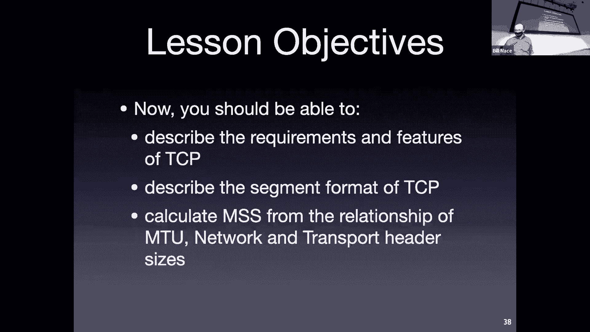

 (silence)， [BLANK_AUDIO]。