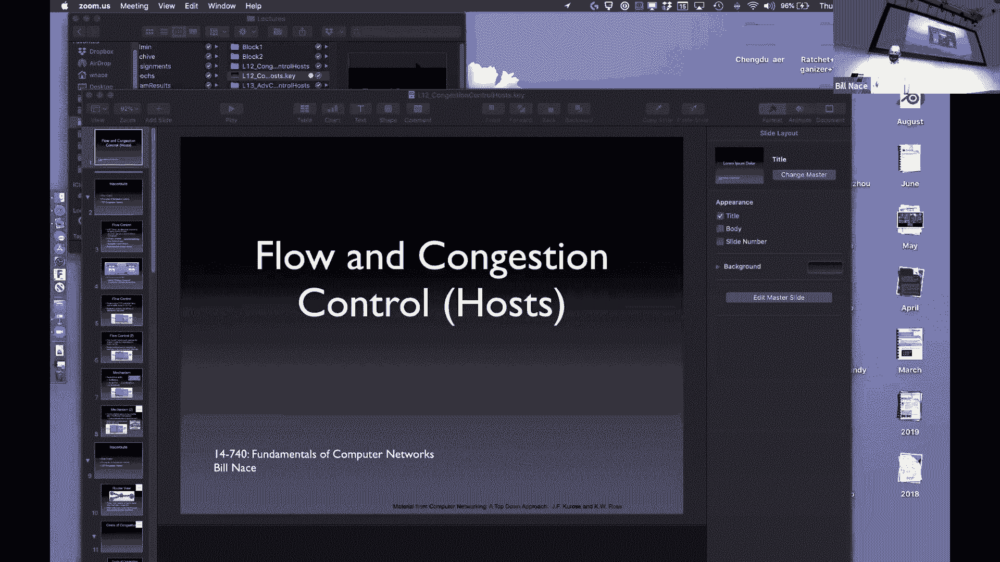
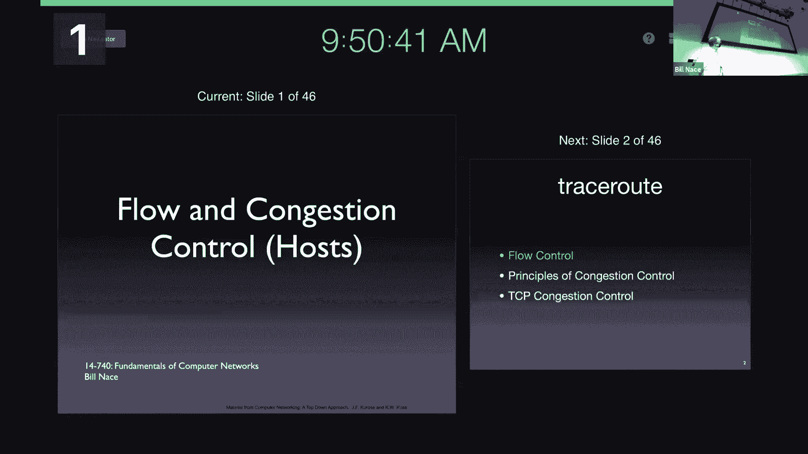
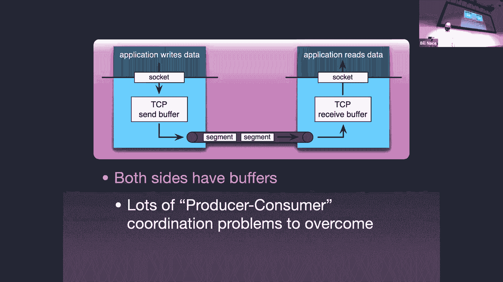
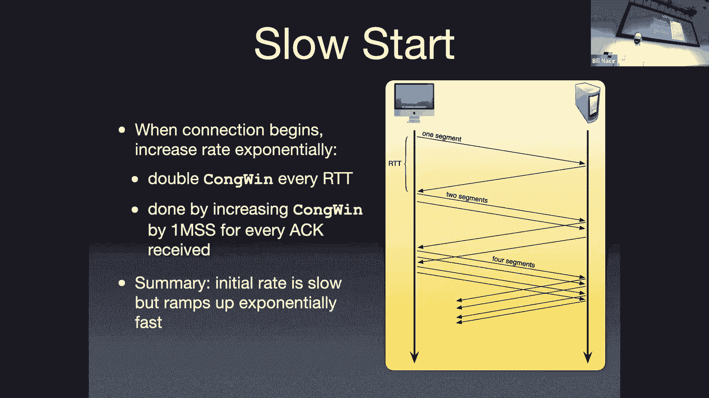
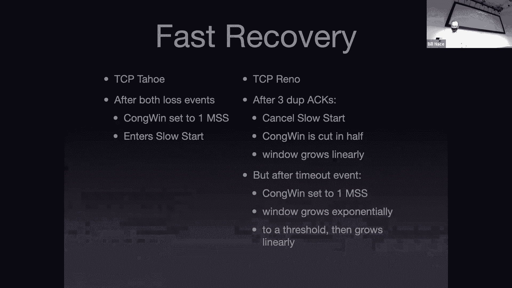

# 卡耐基梅隆大学 14-740 计算机网络 Fundamentals of Computer Networks（Fall 2020） - P12：Lecture 12 Congestion Control at the Host - ___main___ - BV1wT4y1A7cd

 This is 14，740。

 Welcome everybody。 To a beautiful fall day where it's just absolutely lovely。

 And we get to sit inside and talk about networks。 Just the way it should be。 I guess。

 Today we're going to continue our conversation。 About which has happened。

 There it went。 We're going to continue our conversation about TCP。 And we're going to get to。 Sorry。

 We're going to dig in a little bit on one of the other components。

 Now I mentioned this briefly last time， but TCP is this。

 This amalgamation that we can do different things with and has different。

 And we're going to talk about different components， different pieces of it。

 That have been modified throughout time。 And so we're going to talk about a couple of those components today。

 We're going to get into congestion control。 Which is definitely the area that has been modified the most in TCP since the original versions came out。

 First up though， let's talk about flow control。 Well。

 is one of those things that is controlled by window。

 Now we learned about windows in the reliable data transport lecture。

 Where we talked about them as a mechanism to allow us to have multiple segments in flight。

 And to properly control those segments。 And then last lesson when we talked about TCP。

 conspicuously there was no mention of windows。 Even though we did talk about the idea of there being multiple segments in flight。

 Today the windows come back。 There are two windows in TCP。 They are independent windows。

 That is they function independently of each other。

 Yet both of them act as controls on the sender or limits on the sender。

 The sender basically whenever it has a segment to send has to check。 Am I allowed to send this？

 Is this in the flow control window？ Yes， no。 And then also is it in the congestion control window？

 Yes， no。 And if the answer to both those questions is a yes。 Then the sender can send the segment。

 Otherwise， he's limited by one or the other of these two。

 And it's important to recognize that these are two separate things。

 So please do not get them mixed up even though they both have the word control in them。

 They're very different。 Different structures。 And both of these windows are here。

 This is a picture I showed you last time。 Both of the windows are here because of these producer consumer problems。

 Because we have the sender able to produce segments at a different rate than the network is able to accept them or consume them。

 And also because that might be a different rate than the receiver is able to receive them。

 The first that I'm going to talk about the flow control is helping to manage the receiver as the consumer of our segments。

 So you can think of this as the producer or the sender is the production side。

 They're generating segments。 For flow control， the receiver is the consumer who will be getting these and needs to be protected a little bit。

 So what we're trying to do is make sure that the receiver has memory set aside for all of the segments that show up。

 And now you might look at this and say memory that's a quaint notion。

 Clearly in the 80s when we were just developing this memory was a very expensive component of my computer。

 And so it was often the case that the computer would have a limited amount of buffer space to store these segments。

 Through the years， of course， the segments haven't changed in size or anything like that。

 But the memory has gotten a lot cheaper and our computers have a lot more of that memory。

 And so you might say， wait a minute， this is kind of quaint that we're worrying about this。 However。

 recognize that this is on a， this buffer is usually set aside on a per connection basis。

 And we today have computers that have in our handling a lot more TCP connections than previously。

 So just because you have a lot of memory in your computer or on your server doesn't necessarily mean that this problem has gone away。

 You may be dividing a larger chunk of memory into many more pieces。

 And so we have some amount of space to hold the segments when they show up。

 And that is traditionally called the RCB buffer because we're computer people and we like to get rid of vowels。

 And then once we've named a thing that says been done here， then everybody else uses that name。

 And so the received buffer size that's the number of bytes that can be held in the receiver。 Now。

 of course， the reason we have that buffer on the receiver is because we need to store those segments。

 the data that has come from the network。 So I'm showing here on the left side of my diagram that we have data coming in from the network player for my P。

 Right。 And so those segments are showing up at some rate。

 And there's no way for the receiver to interrupt the application to say， Hey。

 I just got you another thousand bytes of data。 Please take it。 Instead。

 the application comes by asynchronously and scoops up the data。

 And so that means we have this buffer whose purpose is to store the segment data until the application can come and get it from us。

 Okay， and so of my entire receive buffer， some of that may already be used。

 Some of that may already have data in it。 That's what I'm showing there on the right side of that rectangle。

 The space left is this spare room。 And we've got to make sure that the sender when he's sending segments doesn't fill up the spare room。

 And so that's this received window amount。 Okay， that lets us ensure that we want to communicate that amount of space back to the sender。

 So the sender never actually sends us too much data。

 So that we always have a place to put it on the receiver。

 So that receive window that spare room space， the rc window。 Right。

 we on the receiver side can fairly easily calculate how big that is。 And if everything is in order。

 then it's fairly easy to be able to say， you know， I know how much my receive buffer is。

 I know what that variable is because I'm managing that memory。

 I'm malachte it a long time ago or whatever。 I know how big that is。

 And I have the bite numbers of the bites I've received。 Right。

 so I know as I'm acknowledging things， I know， you know， I've just sent an act back to the sender。

 And I'll just send an act back to the other side with the bite number of the next bite I expect。

 And that will be the next， you know， that will go into the spare room kind of at the。

 the right side of the spare room。 So I know how where that is。

 I know what the application has has picked up from me。

 So I'm going to calculate how much data I have and how much is left and so I can figure out what that actual receive window value should be。

 Okay， and obviously if you're receiving segments out of order。

 that gets a little bit more complicated， but it's a tiny bit of management math that the receiver has to。

 has to deal with。 That number， a calculator that I have received window number of bites in my spare room。

 That's the amount of space I could accept。 But this is on the receiver side。 Right。

 the receiver can calculate that easily。 I need to control the sender。

 And so TCP allows us to communicate this value back to the sender。

 because in the header of a TCP segment， we have that received window value。 Right。

 that's that 16 bit value。 It's on the fourth row down next to all the flags。 Right。

 that's this RCV window value。 I'm going to send that as a receiver。

 I'm going to send that back to the sender and tell them， here's how much space I have。

 You can send me this many more bites。 Now one thing that you might be thinking about immediately and saying。

 wait a minute。 By the time that gets back to the sender， that value may be out of date。 Right。

 we've got more， more segments may already been in flight coming here。 Right， how do we manage that？

 Well， the sender knows where you were at the point in time when you made this calculation。

 Because you're sending back an acknowledgement number， right， the acknowledgement number is the。

 the， you basically tell us， here's the bite number of everything I've received previously。

 And you can view that receive window as an offset of that。 Right。

 so I've received up to X and I have Y amount of extra space。

 And the receiver sends that back to the sender。 When the sender gets that， the sender can calculate。

 oh， okay， I know this is where the window starts and this is how much， how big the window is。

 At this point。 Okay， and so if the sender has already sent segments out that were in that window。

 The sender knows that。 And so the sender， again， the sender is keeping track of the， the send value。

 the bytes that he's sending。 And so when he puts together a new segment。

 He uses that receive window offset from the acknowledgement number to tell him kind of， okay。

 I can go up to this， this bite number in this string。 Do you know the other question。

 So the question is， is there a way for this value to shrink， or in fact be modified at all。 Yeah。

 so there is a startup problem， right， how do you， how do you begin a connection if you've never got no receive window back from the other side。

 Okay， so that is special case。 So you're allowed to send your first one。

 And then when you get an acknowledgement for that first segment， then you find out， oh。

 this is how much space there is over there。 And then you can start sending them。

 But other than that， this value is only going to be modified based upon segments that the receiver gets from this。

 you know， in this connection from the sender。 So it is a communication just between these two。 Okay。

 so does that make sense。 It's a fairly simple mechanism not too complicated。 I， you know。

 maybe if I were designing TCP again， I'd get rid of that urgent data pointer and use that space to make the receive window 32 bit value。

 and just go ahead and calculate not as a relative offset。 But here's the actual value。

 But other than that， it seems like a very simple mechanism。

 And it does its job very well of managing that control。

 I point that out because the congestion control is not a simple mechanism。 Okay。

 congestion control is a lot messier because it's a distributed problem。 All right。

 so what is going on with congestion control。 What we're trying to do with congestion control is manage the memory that is distributed among all of the routers along the path from sender to receiver。

 Right， we've talked about this way that plan when we talked about the storm forward networks。

 Each of the routers has some memory in it that is used as a queuing space as a buffer。

 For when it has too many segments that need to actually packets at that level too many packets that are trying to go out on a single link and has to be able to store them。

 And so it has this memory to handle that。 Okay， and that means between any sender and receiver。

 There may be many many routers that have these buffers and spaces in them。

 And it gets really complicated because those particular pieces of memory those buffers are also on the routes from other senders to other receivers。

 And so you can imagine maybe I've got between me and some destination we have some number you've done trace routes right you have some feel for you're going to have you know a dozen routers between me and my destination。

 Right。 Other people may be sending TCP streams that intersect with my dozen routers and maybe intersect with only a couple of them。

 Maybe only one of them。 Okay， and they're there their packets will fill up these buffers as well。

 And so this is a distributed problem we have to deal with。 And it's ugly。 There are costs。

 Now in a non COVID world。 At this point， I would set you up in groups of four and ask you to spend two minutes。

 Writing down a list of the bad things that you see happen with congestion。 Okay。

 so what I'd like you to do right now is just kind of sit back。 Give you 30 seconds to think about。

 What happens what what is the cost？ Why is it we don't like congestion。

 We're actually using a word from that most of us associate with traffic。 Right。

 I don't like congestion。 Right。 I don't like the Fort pit tunnel being filled when I want to go through it。

 Okay， so it's a bad thing。 And yes， we're using that word deliberately。 Right。

 It's a bad thing here also。 Well， tell me why。 Tell me what happens when there is congestion。

 So it's take a second。 Take 30 of them。 Sit back and think about maybe make a list。

 Jot down what you think are some of the bad costs of congestion。 You can see the cost of congestion。

 It's a bad thing。 You can see the cost of congestion。 You can see the cost of congestion。 [silence]。

 [silence]， All right。 So now that you had a chance to thank what I'd like you to do is just go ahead and dunk some into those in the chat。

 Go ahead and tell me what you came up with as some of your answers。 Audience participation。

 Let's all go。 Type something。 [silence]， All right。

 So clearly we've got a lot of people saying drop packets。 Right。 Loss packets。 Those are bad。 Right。

 Wait times on the client side， which may， there may be some blocking because of that that your application can't continue。

 Delay。 Right。 Maybe there's not just some sort of loss。

 Maybe there's some delay of those packets as it takes a while to happen。 New connections。

 I love that。 It takes more time for a new connection to get established。 Yeah。 This is great。

 These are all very good answer。 I like we even got some of the security people in here saying denial of service。

 I'm going to say maybe to that one。 Right。 Certainly if my congestion is happening。

 then whatever I want is denied to me， but it's not a traditional security problem where。

 some resources are getting overwhelmed。 It's just kind of natural things that are going on。 And yes。

 Stefanos， I love your description of this。 Right。 This is what we feel。

 And actually this maybe what we feel would have been in traffic in places。 You know。

 have you ever been to Boston before or Beijing？ Yeah。

 The whole network can grind to a halt after a burst of traffic。 Right。 Maybe a little melodramatic。

 but sure。 Here's what I put for some of them。 Right。 So in individual packet。

 if there's congestion is going to experience some queuing delay。 Right。

 It's going to hit some router somewhere and wait around a while。 Sometimes will be dropped。 Right。

 If a router already has its buffer full and another packet comes in。

 there's no place for this packet。 And so it gets tossed over the router shoulder onto the floor where it shatters。

 By the way， one of the problems we'll not talk about in this class。

 but you might look up the idea of buffer bloat。 It turns out that having too much memory can also be a problem。

 So even if we're not losing stuff， we end up with long delays that can happen。 Now。

 when you get long delays or loss， what does a sender do？ Right。 A sender retransmits。 Right。

 It has to resend that segment because it's been lost。 Okay。 Or maybe it wasn't actually lost。

 but it was slowed down enough that the actual acknowledgement took too long to get back to us。

 And so we retransmitted， even though we didn't need to。

 so that time out value we were using turns out to be a premature value。

 All this collapse down means we are wasting network resources。 Right。 There is bandwidth available。

 There is， you know， the resources of all the routers going on， but they're being mismanaged。

 In some sense， they're being wasted because of this congestion。 Okay。 Edrick。 Congestion。

 Do we do a bunch of recams？ Does that mean that， like， congestion， public/port， congestion。

 and that？ You got a lot of further。 Yes。 Yes。 I'm sorry。 I didn't， I didn't show how bleak this was。

 And Edrick has pointed this out entirely。 Right。 Guess what？ If you have some delay and loss。

 what does TCP do？ It retransmits。 Right。 And what happens when you retransmit？ Oh。

 you get more congestion。 Okay。 Not good at all。 Okay。 So， so that actually is the。

 the elevator pitch for congestion control。 Right。 TCP needs to do something to make sure it doesn't make the situation worse when there is congestion。

 Yeah。 So basically， guys， we've got too much data， too many sources。

 or maybe a couple few really fast sources。 They're sending too much data and it's too much data for the network to handle。

 Okay。 I want to be very clear about this。 This is not a flow control thing。 Right。

 This is not whether the receiver can handle it or not。 It's the fact that the network。

 the routers in the network can't handle that。 Okay。 And as the network load， we。

 we kind of think about this distributed problem and we try to put it down into some single concept that we're going to call load。

 Right。 Yes。 You could look into it and find out of the dozen routers between me and the endpoint。

 Maybe there's only one of them that's having trouble。 Okay。

 But I'm going to think about it as the load of the network， especially the transport layer。

 because I'm abstracting the network anyway。 And so as the network load increases。

 as there's more traffic in the network， and more at least along the path I'm using on the network。

 That means I'm going to have longer delays， right。

 because the queues are going to be longer in some router。

 And so to get through one particular router is going to take a longer time。

 And it may end up overwhelming some router buffer space and us actually losing the packets as they travel。

 which isn't good。 Okay。 So what we need to do is what we want。

 we would like to control things so that we aren't adding to the problem。

 And so that we can help manage this load and get our packets traveling well。

 So our goal is a large throughput and a small delay。 By the way， I'm using the word throughput here。

 which is technically different from bandwidth。 Okay， bandwidth is an available resource。

 It's an available amount of transmitting power， whereas throughput is the actual amount of bandwidth I get to use。

 Right。 So if I， this is a measure of the actual bits I'm sending。

 not the ones that I could be sending。 Right。 So what that means is if I want。 So as a sender item。

 particularly care about， I'm a connect band， but I want to use it and that becomes throughput。 Okay。

 so if I want a big throughput， well， I need to be sending packets。 Right。

 And it's not usually that that's my goal to have a big throughput。

 My goal is usually to send a lot of packets。 And that implies that I will increase my throughput as I use the network。

 The problem for the sender is that as I add more packets the network or as there are more packets in the network。

 then these queue lengths increase the delay increases。

 And so I can start off with a very small delay。 Right。 If there are no segments in the network。

 then they go quickly。 But as that throughput increases。

 we're actually adding to the load of the network。 And so I've shown in a few little sketchy graphs here。

 Kind of what would happen in terms of throughput and delay related to the network load。

 And the idea is on the first graph， if I'm not sending anything。

 I'm not inducing any load on the network， but my throughput is very low。

 And so I can send more packets， I can send more segments and increase that throughput。 Okay。

 but as I do， I eventually load up the network and I can no longer keep increasing the throughput。

 In fact， we come to some point where our traffic intensity is equal to one and all of a sudden things just kind of go over the cliff。

 Okay， and we start getting large packet loss。 And then things get retransmitted and you end up with a real mess。

 The graph on the bottom again against network load shows that as you're sending as the load of the network is low。

 then the delay ends up being low。 Right， if you are the only packet in the network。

 then the routers don't have to cue you at all， and you go at the speed of the network。

 But as the load increases， then your packets take longer and longer and longer。 Okay。

 and they aren't identical graphs， right。 Which means that we have a couple of regions here。 Right。

 so I've got a region on the left where things are lightly loaded。 Right。

 I'm not getting a huge amount of throughput， but I'm also not getting much delay。

 And then I've got a center section there where the load is starting to increase。

 And even though I get a large throughput， the delay is increasing and increasing fast。

 And then I have the congestion collapse region on the right， where everything is really bad。 Right。

 The delay is huge。 Packets are being dropped and retransmitted and dropped and retransmitted。

 And I get very little actual throughput when that happens。 Where would we like to be on this graph？

 What load would you like to operate at？ Well， clearly the collapse region is not it。 Right。

 I'd like to stay away from that。 But can you point to a particular x value that you think is the appropriate level to be working at？

 There's a knee point there， right？ Yeah， that knee point right here is a nice place to operate。

 Right。 At that point， you get a large amount of throughput with a small delay。

 And if you increase the load， you only get a little bit more throughput。

 but you get a lot more delay。 Okay， so there is a nice spot to be working at。 Okay。

 so we'd like to get to that。 We'd like to somehow be able to manage that。 Now the problem is。

 as a sender， I know that I'd like to be at that knee。 How do I know I'm there？ Well。

 if you think about control theory， not even just network control theory。

 but control in general control relies upon some feedback mechanism。 Right。

 you do something and you can't control that process unless you are able to understand how well that process has occurred。

 And so for us， for the sender， the process is sending segments。 I need a feedback mechanism。

 I need to know how did this do？ Okay， and to let me know which side of that knee am I on？

 And what we want to do is to react to that feedback。

 If it looks like there's too much load in the network， then I can slow down my sending rate。

 I cannot transmit the packets or the segments as fast as I had been sending them。 Okay。

 so and sometimes this is called being conservation of packets law。

 which kind of sounds like it's a physics， you know， conservation of momentum。

 the way the universe must work。 It's not that kind of law at all。

 This is the more of an engineering law。 You would like to be operating at some equilibrium。

 And once you're there， you'd like to use the feedback of the network to know that you're at that nice knee point。

 and then only add a new segment to the actual transmission or to the network when you know one has been taken out。

 And you only know one who's been taken out when you get some feedback。

 Now where should this feedback come from？ Well， there are two basic choices here。

 One of them seems obvious one a little less so。 I'm using the network。

 So it's possible that the network should be telling me whether there's congestion or not。

 The network knows if there's congestion， right？ There's some router out there who's crying because there's no memory and he's dropping packets。

 And he's definitely under congested load。 Okay， so we could get a signal from the router from the network layer。

 It says， Hey， hey， we're congested， please slow down。 Or we can use a different mechanism。

 One that's kind of tapped into the feedback mechanism we're already using。 Right。

 TCP uses receiver feedback as a reliable data transfer tool， right？

 We send segments we get acknowledgments。 Those acknowledgments are feedback。

 So the other opportunity is to use that end to end feedback that message that comes from the receiver。

 That may give us some hints about whether there is congestion or not。

 So there are these two different approaches。 And the network assisted one seems obvious。

 And in fact， it has been used in every networking technology that's been put together ever。 Right。

 So the idea is the routers are going to tell the sender something。 Right。

 They may send some data directly back to the sender。 Right。 Let's send a message back saying。

 I'm overwhelmed， please slow down。 Right。 Or maybe I go ahead and have the router instead of sending an extra message。

 Let's just go ahead and put some notification into the header of the messages as they flow bot。

 Right。 So it'll say， I'm in trouble。 Let me go ahead and set this bit。

 That will get to a receiver with the idea that the receiver when he sends an acknowledgement would include that bit。

 To tell the sender， hey， there's some congestion somewhere， slow it down。

 Or it could be that the network actually explicitly sets a send rate。 Right。 The network could know。

 hey， here are my capabilities。 I know what this bandwidth is。

 Along this link you're trying to put together。 You should be sending at X number of bits per second。

 Okay。 All those mechanisms would be network assisted that would come from the network。

 And all of them have the same problem。 Even though it seems obvious that the router knows that they're in trouble。

 When the router is in trouble， the last thing you want it to do is extra work。 Right。

 You would like it to do its fundamental job， which is forward packets。

 That's what a router should be doing all the time。 Forwarding packets as fast as possible。 Okay。

 If we tack on these other jobs。 So I'm congested。 I'm too busy。 Things are bad。

 Therefore I need to send a bunch of more messages back to everybody who is transmitting to me。

 That slows down that fundamental job of forwarding packets。

 And that means it's going to be longer until that router gets out of its congested problem。

 And so that's why we end up using an end-to-end approach。 Right。

 We don't want the network to have additional work to do。 Just go ahead。

 Forward packets as fast as you can。 We're going to go ahead and use the end-to-end feedback we already have。

 We're going to use the acknowledgment mechanism。 And we're going to infer from that what the situation is in the network。

 For reliability reasons， I already need to know if there's loss。 Okay。

 And we're going to just make an assumption， which is a fairly decent one。

 that if there is loss in the network， it's because there's congestion。 Okay。 Not 100%。 Right。

 Segments get lost because of BitGuck flipped somewhere and the data link layer through a way of frame。

 Okay。 That happens。 Okay。 But more often segments are going to get lost because there's some congestion。

 Okay。 And so we're going to use that loss or even the delay that we observe as mechanisms to control our own sending。

 That's what happens in TCP。 All right。 So now let's take a look in TCP。

 How does TCP actually manage this？ So TCP has this window thing。 Right。 Again。

 this is our other window。 This is different from the receive window。 This is congestion window。

 And again， we have， you know， we were running out of spaces。 We take things we call it。

 Pong when for the congestion window。 That's a variable。

 That's a value that tells us how big this window is。

 And that lets us compare when I want to send a segment。 Is it in the congestion window or not？ Okay。

 And that congestion window。 We're going to calculate and manipulate that congestion window。

 Basically， what we're doing is making sure that we don't send anything outside of that window value。

 And since we're keeping track of stuff。 By byte sent congestion window is going to be in bytes and we'll always make sure that the last bite we sent。

 If I subtract out the last bite that's been acknowledged that that space is less than my congestion window。

 Now， I assert down here at the bottom that my sending rate then is roughly congestion window divided by the round trip time。

 Where did that come from？ And what's going on there？ Well， take a look at that bullet up there。

 Use this common variable。 How much data is allowed in flight at any time？

 Do we have a formula that lets us know something about the amount of data that we can have in flight at any point in time？

 Do we have maybe a fundamental equation that tells us how much data we can have allowed in flight at any point in time？

 Anybody？ Oh， no。 And we've forgotten the fundamental law of networking so quickly。

 How do I calculate the amount of data I can have in flight at any point in time？

 That is my bandwidth delay product。 Remember in that terms， bandwidth delay。

 if I take the bandwidth， I have multiple by my round trip delay。

 That's equal to the most data I can have in transit at any point in time。

 And so if you look at that formula there， what I've done is I've just solved for the rate。

 The congestion window， the amount of data I can have in flight is equal to the bandwidth times the delay。

 So if I just take the bandwidth times delay and divide by delay or divide by round trip time。

 I end up noting that my rate is equal to my congestion window divided by my round trip time。

 That means bigger congestion window， more data in flight， higher sending rate。 Okay。

 so what we're going to do on the sender side， this is by the congestion control entirely on the sender side。

 The receiver doesn't know how the congestion control is working。

 The receiver works exactly like we talked about last time。 The sender， though。

 is going to be looking for evidence of loss that comes in， well， anytime there's a time out。

 That's how we know there's some loss。 If my timer goes off。

 we lost something or at least we think we lost something and we retransmit it。

 If I'm willing to retransmit something， I'm pretty sure there's some loss。 Okay。

 so we're going to associate that with congestion。 Again， not entirely true， but close enough。

 We also have this triple duplicate AC mechanism。 Remember that if I get the same acknowledge。

 if I get three duplicate acknowledgments， which means a total of four acknowledgments with the same AC number。

 I use that as an indicator， a softer indicator of loss。 Okay。

 even though my timer hasn't gone off yet， fast retransmit says go ahead and retransmit that thing。

 And so what I'm going to do is anytime these happen， I'm going to reduce my congestion window。

 which will keep me from sending anything because， or at least it will reduce the rate at which I send things if the congestion window goes down。

 which will help us get out of congestion faster。 Now there are several algorithms that get put into the congestion control of on the sender。

 and all of them manipulate this congestion window variable。

 And so we can think of this as these different components that are pieces of the make up my entire TCP scenario。

 And so there's some， there's one called slow start that helps us get started， right。

 gets up to some equilibrium point。 And then we have a congestion avoidance phase。

 which we call AMD or additive increase multiplicative decrease。 It is basically， okay。

 I'm sending as fast as I can， but I'm going to be careful to try to avoid any congestion if there is any。

 Okay。 And for this to work， we're going to have to estimate what our around trip time is。

 So we'll figure out today。 I've been promising that I'll show you how we actually calculate the time up value。

 We'll talk about how that happens。 One thing that I think is very interesting is that we are managing this rate。

 Right。 What we want to do is keep track of our sending rate and be able to change the rate。

 raise it and lower it。 But at no time are we actually taking measurements of time。 Right。

 We're not seeing how many segments do we send per second。

 We don't ever actually calculate or count over a second。 Okay。 Instead。

 TCP is known as a self clocking system。 It doesn't have an external time sense at all。

 which is a little bit weird。 But it shows up in various places。

 The best example I have of this comes from my hobby。 You guys may know that I brew my own beer。

 Okay。 And that means that every once in a while， I spend the afternoon making about 100 bottles of beer。

 which I stash in my basement。 Okay。 But of course， I don't like them all just down there。

 I like to drink the beer。 Okay。 So I would like some in my refrigerator so that when I come home after a difficult computer networking lecture。

 I can pop open a beer and have one。 Right。 So how do I manage to make sure that I always have a beer available in that refrigerator？

 I could do some calculation。 Right。 I could say， huh， how many beers do I drink per day or per week。

 Right。 And let's calculate out that number。 And then let me make sure that I bring up beer from the basement at that rate。

 Right。 If I drink X beers per。 Let's be nice and say per week， I drink X beers per week。 Right。

 This is a pre COVID number also。 I drink X beers per week。

 then I would want to put some mechanism in place that would make sure that X beers per week come out of the basement into my refrigerator。

 That would not be a self clocking system because I'd be working with time。 Right。

 I'd say like every Sunday， let's say I'd have to bring up X number of beers。 Right。

 And that would be a clock system。 Instead， I actually self clock。 How do I self clock？ Well。

 one of the things about brewing is that when I drink a beer。

 I have to wash out the bottle and keep it because I'm going to eventually want to put more beer in it。

 And so after I wash the beers out or wash the bottle out。

 I take the bottle and I put it in one of those little six pack holders that I keep up in the kitchen。

 And then every once in a while， that six pack holder gets full。 Right。 And when it does。

 what do I do？ I carry that down to the basement and put it in storage for next time I brew。

 And I bring up six beers to replace it to put in the refrigerator。 This is a self clocked system。

 Right。 If something happens like there's a global pandemic and I suddenly start drinking beer at a higher rate。

 Okay， then that means I don't have to change anything about my system。 Right。

 It just means that as I consume more or less。 Then I create empty bottles faster or slower。

 Those empty bottles get taken down to the basement at the same rate that the bottle。

 the full bottles get brought back up。 That's a self clocking system。 Okay。 And those are less。

 less brittle to changes。 If things change about my consumption。

 the system doesn't have to change at all。 And I don't have to worry about like， oh。

 that week where I had a party and needed more beer up to handle that or something like that。 Right。

 If there's an extraordinary event。 A clock system would have trouble handling。

 Whereas the self clocking just kind of all works itself out。

 So TCP is self clocking to make so there's no external clock on this what's going on。

 It's also important to recognize that there are a couple， there are many algorithmic variants。

 We're going to talk about the first two today Tahoe and Reno。 Okay。

 And I say here that Reno is the most widely used。 It is historically the most widely used。

 It's hard to say today， whether more people are using it or not。

 You're going to have to look at installs of Linux versus Windows and things like that and what is being used on all those。

 Let's just say it is the most widely used in networking classes and textbooks。 Okay。

 We will be talking about many other variations to come as well。

 It's important and kind of cool stuff。 All right。 So here's a picture to get us into this slow start mentality。

 This picture from the paper you read the Jacobson paper about congestion control。

 And this is a graph that's showing what happens when you don't have any slow start mechanism。 Right。

 So what do we mean by that？ Well， let's imagine that some application comes around and says， Hey。

 I'd like to send this file。 I'd like to send this HTTP request to that web server。

 or I'd like to respond to this HTTP request with something。

 where all of a sudden the application says here's a bunch of data to send。 And TCP says， Sure。

 I can do this。 Let me start up when we make segments out of it chop it up in a piece is put headers on each of them。

 And let's just start sending them。 This was the way the original TCP worked。 And that's the result。

 Right， I get this back。 What am I saying here？ Well， time is along the x axis。

 So we're seeing a file gets sent and it takes about 10 seconds to send this file on this network。

 The y axis is the segment number of each of the packets that are sent。

 Each of the segments that are set。 And you'll see， first off， if you do a bit of math。

 you're going to realize that these are fairly small segments。 Okay。

 because that is counted in kilobytes on the side and you can see， you know， the whole thing is。

 let's say 68 kilobytes。 And each of the black dots you see is a separate segment that gets sent with its own sequence number。

 And so you can see at the beginning of time with this TCP do TCP sends a whole bunch of segments。

 Right， is send segment zero one， whatever that that that all way up to like 20 K。

 which is a lot of dots right we've got like two or three dozen dots there to get up to that 20 K on that original peak。

 Okay， now this turns out to be too much for the network。 Right， how do we know？ Well， look。

 about a second and a half later， there's a dot there。 Right。

 what's that thought that's a retransmission of us segment。

 which segment is it a retransmission of one near the end of this bunch no。

 It's like a third of the way through。 Right， we managed to get like the first 10 kilobytes through the network。

 And now we're being said okay 11 kilobytes please send that again。 Okay。

 and then a quarter of a second later we get a look at that。

 That must have been some time not window went off or something。 Right， this all of a sudden。

 Don't come again here's another three dozen segments。 Since， since， since， since， since。

 and this up down， up down， up down。 Behavior that you see of TCP and the network is let's dump very quickly。

 So very fast slope。 What's in a short amount of time send a lot of segments。

 And then we wait around and we get to retransmit a bunch of segments。

 And then we wait around and retransmit and retransmit and retransmit。

 And I've shown there in that little purple bar there。

 I was able to find some segments that got sent five times。 Okay。

 the same sequence number that is the same segment got sent at like time four and time five and a half and time six and a quarter。

 You know。 Those guys got sent five times。 And I love this quote from the paper。

 And Jacob says nothing in this trace resembles desirable behavior。 I agree entirely。 Right。

 Do I want my network to have to retransmit stuff five times？ No， what's going on here？

 What's going on here is we're not giving the。 The network a chance。

 We're not getting to equilibrium。 We're just dumping way more than the network is able to handle on it。

 Okay， here is far more than your bandwidth delay product。

 And the routers in that network can't handle it。 They get into congestion right away。

 And where's the congestion coming from？ Can I blame those？ Oh， the network is bad。

 Everybody must be checking Reddit right now。 No， this is one sender。 This is me。 Okay。

 I am my own worst enemy in this case。 So what do we need to do？ We need to slow things down。

 We need to get to some sense of equilibrium。 And part of it is that I as a sender have no idea at the beginning what that equilibrium is。

 Right。 I can't tell。 Oh， this is how many packets per second。 I should be sending in my network。

 Okay， because I've just started up。 I have no， no。

 no understanding of what's going on in the network。 And so I create segments as fast as I can。

 Therefore， a slow start component was added to TCP。

 The slow start component is entirely intended to slow you down。

 Until you have a chance to understand what the equilibrium of the network is。

 Now we don't want to be too slow。 Right， we want， we'll start off very slow。 In fact。

 we'll start off with our congestion window variable set to one MSS one maximum segment size。

 Basically， I get to send one segment。 Okay， by the way。

 all of the discussion today is going to assume that we have as much application data as I want。 So。

 oh， there's a bunch of data I'm supposed to send。 I'm only allowed to send one segment at first。

 Also， you should notice here what we don't we're manipulating the congestion window variable。

 That's how congestion control works。 All right， so my congestion control window is one MSS that may be way too small。

 Right， that hopefully I can send more than one MSS per round trip time。 Right。

 so what I want to do is I want to ramp it up quickly。 Right， and to ramp up quickly。

 what I'm going to do is I'm going to do it exponentially。

 I'm going to keep doubling my congestion window。 You know。

 double it double it double it double it so I send one， then I want to be able to send two。

 then I want to be able to send four， etc。 So， I'm going to do it。 Yes。

 the initial congestion window。 I guess we should be careful。 Right， this is classic TCP。 Right。

 any particular implementation may be slightly different from this。 Okay， but under classic TCP。

 you always start at one MSS。 Right， in theory， I might have some knowledge。 Right。

 yesterday we used the same network。 And we had this kind of level， maybe I could use that。 Okay。

 but classic TCP doesn't classic TCP considers any connection to be unique。

 And so we're always going to start at one， we're going to send one。 And then two， and then four。

 and then eight。 Now it's an exponential process， right， exponential processes。

 Are designed to use up resources quickly and eventually we're going to get to some limit。

 And slow start has its limits。 Basically that limit is when I get to some loss event。

 I'm going to keep doubling and doubling and doubling until I actually cause a loss or until I have some indicator that there's some congestion。

 Okay， and we'll handle that with our next component。

 The other thing that can happen is there is a threshold， the slow start threshold again， SS Thresh。

 Because we wanted it to fit on the slides， I guess。

 That's some some threshold that's been put in place for when you're starting up a connection。

 This is how big this should be。 Okay， and we will， by the way， modify that one a little bit。

 but at the beginning it would be， you know， some number that that some administrator or some implementer has decided upon。

 So we'll keep doubling， keep doubling until we hit that threshold or until we get some actual bandwidth。

 some actual loss of segment。 So how do we do this？

 We want to double the congestion window every round trip time。 Okay。

 well that almost sounds like I have to be keeping track of round trip time。

 but that wouldn't be a self clocking mechanism。 Instead。

 there's a very nice elegant mechanism that we use。

 And the idea is every time you get an acknowledgement。

 you go ahead and let's see an acknowledgement means that's around trip time。 Right。

 And every round trip time I'd like to double the congestion window。

 So every time I get an acknowledgement， well， I can't double the congestion window for every acknowledgement。

 because that would in cases where I sent out a bunch of segments and I get back a bunch of acknowledgments that would be too fast。

 Right， instead what you do is every time you get an acknowledgement。

 you increase the congestion window by one segment size。 Okay， now why does that work？ Well。

 take a look at the picture。 I send a segment。 At that point in time。

 my congestion window is one MSS one segment size。 Right。

 And then that goes out and it comes back one round trip time later。 At that point in time。

 what am I allowed to do？ At that point in time， my congestion window is one MSS。

 And I have no outstanding， unacknowledged segments。

 All of the segments we've sent have been acknowledged。

 So that means I have a window that is completely empty。

 So we are allowed to send another segment because the window is empty。 And because of this rule。

 we're going to increase the window by one segment size。 That lets me send two segments。 Right。

 One because the window was empty originally and one because I increased the window by one segment。

 And so now we send out two segments。 When the first acknowledgement comes back。

 that means my window size is two， but I have only one unacknowledged segment in it。

 So I'm allowed to resend one plus I increase the window by one segment size。

 So we actually send two。 When that second acknowledgement comes back， the same thing happens。

 Now space to send another segment and we increase the size by one。

 So I know now go ahead and send two。 That's a total of four for this round trip time。 Okay， Etrick。

 This picture shows is assuming good behavior。 Right。 We'll talk about the loss scenario in a second。

 which is， which will be a little bit different。 Where's the preset value come from？

 From some network administrator， maybe the administrator or the implementer。

 So it's not a little bit different。 It's not a little bit different。

 It's not a little bit different。 It's not a little bit different。 It's not a little bit different。

 It's not a little bit different。 It's not a little bit different。 It's not a little bit different。

 It's not a little bit different。 It's not a little bit different。 It's not a little bit different。

 It's not a little bit different。 It's not a little bit different。 It's not a little bit different。

 It's not a little bit different。 It's not a little bit different。 In fact。

 I don't even need multiple systems。 If I only have me sending and I double every time， eventually。

 doubling is a big number。 In fact， not even eventually。 Really quickly。

 keeping doubling gets to be a very big number。 So yes， this is a slow start mechanism。

 It starts us at one。 It quickly gets us moving。 We're quickly moving a lot of data。

 but in the very near future， we're going to run into trouble。 When we do， we'll see it。

 We'll see a loss event。 When that happens， we'll stop doubling。

 We will be done with slow start at that point。

 Here's another picture from the same paper。 This is Van Jakison saying， "Hey， look， slow start。

 Much better。"， This is the same kind of picture over 10 seconds。

 You can actually see one dot and then two dots and the four dots and the eight dots。

 Then it moves off into this nice smooth set of dots。 Our file gets sent at a good rate。

 You might ask yourself the difference between this picture and the previous one in terms of dimensions。

 It still took us 10 seconds to send the file。 The previous picture took 10 seconds to send the file。

 But this one was ugly and this one is good。 What's the difference between the two files？

 So I'm nitpicking on Van Jakison's paper。 The wax is scaled differently because he's actually sending a different file。

 The previous file， he sent 68 kilobytes of data。 This one in 10 seconds。

 he sends almost 160 kilobytes of data。 Yes， it's good that that happens。 But if you're not careful。

 you'll say， "Hey， it's still 10 seconds。"， Slow start works。 Fantastic。 That's great。

 What happens next？ What happens after slow start？ When you get a loss event or you hit the threshold。

 you move out of slow start into， "I want to keep， control going。"。

 I've now discovered a limit of the amount of available bandwidth。

 I'd like to be sending near to this limit。 I've discovered something about the network。

 Let's keep going。 We then move into what we call congestion avoidance phase。

 where I would like to send a lot， but， I really not like to cause congestion。

 I'm going to do what I can to avoid it。 We call this additive increase multiplicative decrease algorithm。

 What's going to happen is I'm going to continually add to my congestion window。

 I'm going to slowly increase that window getting bigger and bigger and bigger because I'd like to。

 use bandwidth if it's there。 If I can send it a higher rate， I'd like to。

 But if I ever have a loss event， if I ever discover that there's some congestion， I want to get。

 out of that situation quickly。 I want to let the router to recover from that congestion。

 I want to lower my rate quickly。 That's why we have a multiplicative decrease。

 I will not just subtract one from my congestion window when I see some congestion。 Instead。

 I will cut it in half。 I will multiply it by a fraction so that I rapidly decrease my congestion window。

 And then I'll go back to additively increasing probing for more bandwidth。

 We end up with a congestion window size that has this kind of behavior， this sawtooth-like。

 behavior。 We're going to increase the congestion window by one every round trip time。

 This is different from slow start。 Slow start increase the congestion window by one for every acknowledgment that came back。

 We are adding one for every round trip time。 And then if I ever have a loss event。

 we cut that congestion window in half。 And so this lets us probe for bandwidth if it's there and get out of the router's way if。

 there's any problem。 [inaudible]， Yes， so Deanna is pointing out that there's some competition going on。

 We'll talk more about this as well。 He's right。 If you have multiple senders that are doing this kind of behavior。

 it might be a little， bit of behavior。 It might get in a situation where the other guy is back off first and I get to keep increasing。

 my bandwidth。 And so I win in this kind of competition for bandwidth。

 And that gets really interesting。 We'll talk much more about the fairness and how this all boils out。

 But yeah， you're right。 That could be one of the -- there are a couple bad behaviors that happen -- emergent behaviors。

 that happen because of this。 But let's keep it back to what does one sender do。

 what's the algorithm asking to do。 This is this additive increase multiplicative decrease behavior that we follow in the congestion。

 avoidance phase。 Now that additive increase multiplicative decrease actually came about as a refinement。

 The original TCP with congestion control， which is called TCP Tahoe， Tahoe didn't really have。

 a multiplicative decrease。 Basically， you see the blue line here as -- and again。

 we have the YX in time， but I've labeled， it as transmission rounds， the number of round trip times。

 You see every round trip time， you can see we have some slow start， but then additive increase。

 We just increase， you know， my window is eight， then it's nine， then it's ten， then it's eleven。

 then it's twelve。 And under the first version， Tahoe， whenever there was a loss event。

 we went back to the， beginning and slow started again。 Okay。

 And that was quickly discovered to be too wimpy， right？ And would give up too much bandwidth。

 And we didn't need to back off that much。 And so， Reno， the second version of congestion control。

 came out。 And it included this multiplicative decrease idea。 So it would still add one， add one。

 add one， but if there's ever a loss event， you divide。

 by half instead of going back to the slow start。 So that's another story we're going to explore more is that you can refine these。

 algorithms and it has been refined quite a bit through the years as we've come up with new ideas。

 This was called faster recovery， right？ So Tahoe， whenever there's a loss event。

 goes back to slow start。 The story with Reno is a little bit more complicated than I showed on that picture previously。

 With Reno， there's this idea that we're able to look at the feedback and see two kinds of different feedback。

 Okay。 One of them is there's a strong loss event。 If a timer goes off， pretty sure there's a loss。

 I'm going to retransmit anyway。 And so that's bad。 And so in those cases。

 we're going to go ahead and follow what Tahoe did。 If there is a loss that causes us to retransmit。

 we're going to start over with slow start。 Okay。 However， if there is not。

 if there is a light indication of loss， which I get from these duplicate acts。

 If I have three duplicate acts show up， I am going to retransmit because that's what fast retransmission required of us。

 Okay。 But as far as congestion control， that's where we do the divide by two。 Okay。

 So now Reno actually kind of has this different philosophy that says， hey， you know， some loss。

 Detection is worse than others。 And so we don't want to back way off if one segment has just gotten delayed a little bit or something like that。

 Okay。 So we'll go ahead and only back off if there's kind of an alarming scenario that we see。

 The other thing I should point out is this threshold value。 All right。

 We had an SS threshold that was just set at some number through slow start。 And when I got to that。

 I moved into congestion control into congestion avoidance， rather。

 We're going to go ahead and manipulate that variable as well， because that's kind of an indicator。

 Now that I have had some understanding of the network。

 I can use that to guide future slow start scenarios。 And so when we do the division by half。

 we're going to set the threshold to that。 That divide by two number。 And so that number will vary。

 It won't just be some number that some implement or decided way back when it actually will have something to do with the network。

 And so we get pictures like this。 Here's a sort of plot time and transmission realms and congestion window size on the。

 the y axis。 Right。 And you can look at this graph and you should hopefully immediately be able to look at this and say。

 Oh， slow start happening。 When is slow start happening？ Can you point to it？ Yeah， I hope you can。

 Right。 It's right there。 Right。 It's this exponential behavior。 Right。

 We are going from one to two to four to eight to 16 to 32 as my 32 segments as my congestion window size。

 Oh， and it's over there as well。 Those are times when the slow start algorithm is working。 Right。

 So we're going to get these。 Right。 Well congestion avoidance is going to happen at the other times。

 right， where I get these nice linear increases。 Right。 32， 33， 34， 35， 36。 Right。

 We're adding one every round trip time。 And so that's an additive increase。 Right。

 And then something happens。 Right。 I got up to like 42 there。 Yeah， we just three duplicate acts。

 Right。 How do you know？ Yes， we， the congestion size in the next round is divided by two。

 And we continue with the additive increase。 So we did not go back in the slow start。

 We stayed in the congestion avoidance phase。 We just backed off to allow some router to to to recover。

 At that point， once I backed off， what's the value of my threshold？

 That threshold variable we keep track of。 What happens to it？ I'm sorry？ Yeah， so。

 so this threshold。 Remember， this is another variable that that's Reno is going to be managing for us。

 Right。 And so when we backed off， when you divide by two。

 we're going to set it to that variable to that value that we set the congestion window to。 Right。

 So at that point in time， we're going to take the 42， which was our congestion window。

 We cut the congestion window in half and we set the threshold to the same value。 Now。

 why is this important？ Well， notice originally with the slow start， we got up to 32。 Right。

 And so I'm going to guess that was what the threshold was was set at 32。 Okay。 Now。

 what we're doing is we're saying， Hey， you know， we now understand something of the network。

 Maybe that threshold should be more like 21 instead。

 And so if you go back into slow start for some reason and grow out of that。

 you should stop when you get to 21。 Okay。 Yeah。 Oh， yeah。 So we're looking over here。 Oops。 So。

 Edrich's looking here at this point saying， wait a minute。 You know。

 the threshold looks like it's half of that， right？ But remember what happened。 We grew here。

 It was 21。 Right。 We grew up to here and then had another loss event。 Okay。

 And so we're going to divide it from， from， from again in half to get us down to here。 Okay。

 And so at this point， if we have a triple， what if I point this up， this is what 16 or so。 Right。

 At that point in time， this threshold again and congestion window going to get cut in half down to eight。

 All right。 So that's great。 Feels like we understand the congestion avoidance mechanism as well。

 We have been relying upon this round trip time to help us manage some of our variables。

 To be able to set our timer， things like that。 And so I wanted to add as another component。

 another piece。 You can kind of imagine there's another piece of the code in the sender code base。

 Another algorithm description。 How do we go ahead and figure out what that round trip time is or what that timeout value should be。

 The round trip time is actually what we observe out of the network。 Right。 And you guys。

 you've seen some network traces by now you should get a feeling that， you know。

 is the round trip time always exactly the same。 Is the network nice and static and everything's just moving along exactly perfectly。

 No， it's a variable quite a bit。 Okay。 And so we're going to set the timeout value。

 But its relationship to the round trip time is important。

 And if we set the timeout value less than the round trip time。

 then we're going to be sending out too many retransmissions。 Right。

 because the round trip time is the first time at which we would be able to get an acknowledgement。

 So we shouldn't set the timer to be less than that。 Okay， however we don't want it to be too long。

 Right。 If it's a 10 second long timer and the round trip time is only a second。

 That means if there is a loss， I won't know about it for an excessive amount of time。

 And that means I will deliberately not be using the bandwidth efficiently。

 I'll not be reacting quickly。 Okay， so we actually want to get this timeout value to somehow link up to be managed buyer to be a reaction to the round trip time that we're actually seeing in the network。

 So what's that imply that we do？ Well， first thing we're going to do is we're going to go ahead and measure what we think the round trip time is。

 And we can do that by actually sampling when I send this segment。

 And how long does it take until I get an acknowledgement？ Okay。

 I can actually measure that at the sender。 And so we're going to do that。

 We're going to call that some sample。 We're going to say this is the sample round trip time。

 We're going to ignore any retransmissions that we get。

 And we're just going to collect these samples。 I'm going to not just collect one because as we mentioned the network varies quite a bit。

 And so somehow I'm going to have these samples and I'm going to want to smooth them out somehow。

 And we'll use that smoothing to come up with a better estimation of what the round trip time actually is。

 Now， first off， why is it that we ignore these retransmissions？

 This kind of gets back to a question。 Dean on it asked earlier， right。

 about our mechanisms and why we're doing them or the fact that we are thinking about them in kind of the clean。

 no loss environment。 Right。 What happens if I do have a retransmission。

 And why should TCP ignore those samples？ Well， this is why。 Right。

 Here I've got a scenario where I send a segment。 Right。

 And the time that goes off early and that's gets retransmitted。 Okay， but nothing actually got lost。

 Right。 And the issue is that I'm going to get an acknowledgment back from the other side。

 I technically won't know whether that's an acknowledgment of the first segment I sent or the retransmitted segment。

 Right。 And so I could measure this very short round trip time。

 That occurred between the sending of the second the retransmitted segment and the receipt of the acknowledgement for the first。

 And I don't want there to be any danger that that might happen。 So anytime I retransmit。

 that particular segment is not eligible for any round trip time measurements。 Okay。

 we're going to ignore that entirely。 All right。 The next question then is。

 I've got all these samples and they are going to vary quite a bit。

 How do we smooth them and how do we create an estimate for around trip time based upon these samples。

 But we're going to use a moving average。 All right， what's a moving average？

 A moving average is where you take a lot of samples and you just detect or you just declare that you're going to use some number of those samples to create an average。

 So you're going to average over them， but you're going to average over only some number of them。

 So classic example is the stock market。 Right。 Every day。

 actually every millisecond bullets imagine every day， you know， stocks have a certain closing price。

 And I may want to calculate a 30 day moving average。 So what do I do？ Well。

 I have to keep track of 30 days worth of that stock data。

 And then I can take the last 30 days and just average amount and come up with an average。 Okay。

 it's a moving average because tomorrow I'm going to do the same thing。

 Right tomorrow I'm going to take， well， I'm going to take these 30 pieces of stock data I have。

 I'm going to kick out the last one。 Okay， and I'm going to move them all down a little bit and add in whatever tomorrow's stock prices。

 And now I'll have 30 pieces of data to average over。

 And 29 of them are the same that I used for today。

 I just have gotten rid of the latest and added the earliest。

 Now we could do this with our samples that we've gathered around trip time。 Right。

 I'm going to collect a bunch of these samples。 I could make a moving average of those。

 The trouble with that is that means I have to keep track of 30 values。

 I have to have this array that I'm managing of 30 or however many values。

 And so one thing that's commonly used is instead of having a moving average of the actual samples。

 use what is known as an exponentially weighted moving average。

 What this does is different from my stock example in my stock example all 30 of my samples were weighted equally when I calculated the average。

 Right， I add up all 30 of them I divide by 30。 Right exponentially weighted means I don't have to keep track of all of them。

 but it also means that the most recent have the most weight。

 So when I'm averaging things it's not actually averaging them all equally weighted。

 On the other hand the formula is really easy and I don't have to keep track of an array and manage all that stuff。

 So what do I do？ Well， I have some number that is my estimate。 Right。

 and when I get a new sample I want to recalculate the estimate。 Right。

 It's kind of like I want to calculate tomorrow's moving average for the stock ticker。 Right。

 So I take that estimated value and I take my sample， my new value。

 and I throw them into this formula。 Right， whereas I take one minus some parameter alpha。

 I multiply by my estimate and then I add in that estimate with that weight of alpha。 Right。

 so I'm discounting everything that's gone before by some parameter value。

 And that's the weight of this new sample that I'm adding to the mix。

 And then that result gets put into becomes my new estimate of the round trip time。 Okay。

 Typically we're going to use one eighth as our value for alpha。

 which implies something about the weight of of how much I'm waiting current values versus past values。

 Okay， so every sample is at some point be multiplied by one eighth and add it in。

 but then it's going to be multiplied by one minus by seven eighths over and over and over and over again。

 Until eventually it's weight is still technically there but only in a very small sense。 You know。

 six year 100 samples later。 It won't have that much of effect on one actual estimate。 Okay。

 so this is now how I estimate this is now a number I think the round trip time is about this value。

 I've smoothed out that I've got around a value for the round trip time。

 How do I use that to set the time out。 Well， certainly I can't use that the time out cannot be my round trip time estimate。

 Right。 If it was， there's going to be a lot of times where my round trip time is more than that estimate and I'm going to retransmit。

 Right， so I need a number bigger than my round trip time to be my timer。

 That bigger part is some safety margin we're adding in。 How much bigger。 That's the real trouble。

 Okay， well， it turns out if you spend some time looking at this。

 what you want is you want a larger safety margin if the actual network is more variable。

 Let's look at the converse of that to help understand it。

 Let's imagine our network was rock solid all the time exactly the same round trip time。

 In that case you could set your time out to be just barely more than that。

 If your round trip time was always， let's say， 500 milliseconds。 Okay。

 my time out could be 500 and one and I'd be pretty safe。 Right。

 But let's imagine now that I have a huge variance in that。 Right。

 My average is still 500 milliseconds， but a lot of times it's 50 milliseconds。 A lot of times it's。

 you know， 1000 milliseconds。 Setting it for 501 is crazy then because I'm going to have like half of my of my seven segments are going to need to be retransmitted。

 So if there's a large variation， then I would like to set my。

 my timer further away from my estimate of the round trip time。 I need more safety margin。

 So what do we do there？ Well， we can calculate how variable is my network。

 How much deviation is there for any particular sample from my estimated average。 Right。

 And so what I'm going to do is I'm going to take， let's go ahead and take the sample that I get each time and see how far away it is from my estimate。

 So it's subtract the estimated round trip time。 Take the absolute value。 Right。

 That tells me how far they are apart。 That's a measure of deviation or variation。 Right。

 So let's go ahead and。 Well， turns out that variation also is all over the place or could be。 Right。

 So I need to smooth that。 That's just one measure of estimation of variation。

 So I'm going to go ahead and smooth those values as well。

 using the exponential way to moving out average algorithm。

 Partially because I've already got the code in the code base to do that。 Right。

 So it seems reasonable。 Typically we set the parameter though to be a quarter instead of an eighth。

 But otherwise I do the same thing。 I go ahead and now I have a。

 and a moving average of what my deviation values are。 Okay。 So that tells me， oh。

 your network is this， this deviant this far away from the average estimated round trip time。 Okay。

 And if that number is big， then I want my time out to be further away from my estimated。

 And if it's small， then I want it to be close。 And so I actually set the time out value to be the estimate plus four times this deviation。

 Okay。 So why for another group of constant seems to work。 Okay。 I would like some safety margin。

 And so since the estimated is something that varies a bit and the deviation is also something that varies a bit。

 Let's go ahead and tack in that safety margin。 That's a good question。

 I think it's a coincidence that I'm multiplying by one fourth。 I'm sorry for some。 The question was。

 hey， for and hey， beta is one over four。 Are those related。 And I think it's a coincidence。

 I think the four is there again because I want some safety margin from this thing that is is moving around a bit。

 Now I want to point out。 This is the place we've gotten to but earlier versions didn't do this earlier versions。

 Just took that estimate and multiplied by two。 I said， Oh， here's my estimate。

 My estimate round trip time is 500。 I'll set my time out to be twice that。 Okay。

 And that meant that our safety margin was always static。

 And it turned out that wasn't adaptive enough。 If the network is nice and steady and solid。

 then that was too much margin。 But if my network varied a bunch it wasn't enough margin。

 And so that's the reason we， you know， we go with this four times。

 And this is something that we do care quite a bit about if this value is set incorrectly。

 Then that means you're going to be re transmitting more than you have to。

 All those slides are it's a premature timeout。 Right。

 That would be because you didn't estimate the round trip time properly and set the time out based upon that properly。

 You had said it too short， which we care quite a bit about。 All right。

 so done with congestion control for today。 We got at least two more lectures talking about some form of congestion control though。

 Congestion control has these different chunks， these different pieces。

 So make sure you understand slow start。 We begin。 We exponentially increase the congestion avoidance。

 Once I am at some level where I hit my threshold and I think I've got the right amount of bandwidth。

 I still want to probe for more。 There might be more bandwidth available。 And if there is。

 I'd like to take it。 But if there ever is not， then I need to get out of the way of the network quick of the router quickly and let the router have a chance to get back when it's feet。

 And so we multiplicatively just decrease our congestion window in those cases。

 And then we talk about how to actually set the timeout value and the difference of what's going on based upon that。

 The losses from a timer versus triple duplicate act as well。 All right。 There any questions。

 I'm sorry。 Is this Reno or Tahoe？ Let's see。 If Reno in Reno， if there are triple duplicate acts。

 then you divide by half。 I think he's asking what if the sender is going to start。 Oh。

 so if they're in slow start phase and you see either loss event。

 then that's an indicator that you've hit the limit of things。 Okay， and you will。 Let's see。 Yeah。

 I think it can't remember what Reno does or Tahoe does。

 I think Reno at that point goes ahead and divides that in half。

 That's the divides the threshold in half and goes into congestion。 I control。 So that is。

 The cancels also thing in your you know， that's not mean that you keep slow。 That's different。 Then。

 Reno does again， I'm not sure I understand the question or got the entire question。

 Reno is different from Tahoe in that it does it looks for the triple duplicate acts。 Right。

 is that and that's a question so when there is a triple duplicate act。 We're going to go。

 We're going to divide by half and we're going to stay in congestion avoidance phase。 Oh。

 so if you're in slow start at that point。 Yeah。 Yeah， so if in Reno if you're in slow start。

 When you see triple duplicate acts， that's an indicator that。 That you know that you're good。

 I mean， you have a loss event， but it's not terrible。 So。 Move into congestion avoidance。

 Go and do that immediately by dropping。 You're still going to drop your congestion window in half。

 In if you're in slow start in Tahoe and you saw a loss event。

 then you go back to one and start over。 If you're in slow start in Reno。

 You don't always go back to ones and start over。 Does that answer the question。

 Does slow start take action when the congestion window drops to zero during the transmission。

 I'm not sure why the congestion window is dropping to zero during the transmission congestion window is a output of slow start。

 And so if you're in slow start， you are controlling the congestion window。

 And so you never put it to zero。 You might put it to one if you have a loss event。 And if Ben。

 maybe they're saying if the trend throughput it goes to zero。

 you're going to get a bunch of loss events and so you're going to kind of get pounded down to。

 Keep trying sending one as your congestion window。 All right。 Any other questions？ All right， then。

 Thank you very much everybody。 Have a great weekend。

 We'll see you next week for a little bit more congestion control。

 [inaudible]， [inaudible]， [inaudible]。

