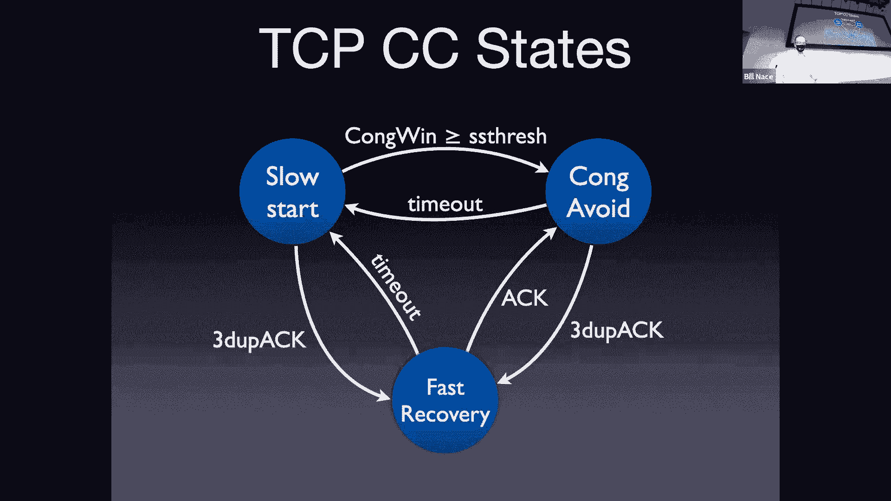

# 卡耐基梅隆大学 14-740 计算机网络 Fundamentals of Computer Networks（Fall 2020） - P13：Lecture 13 Advanced Congestion Control at the Host - ___main___ - BV1wT4y1A7cd

 This again is 14，740。

 Welcome everybody。 We are continuing our conversation about TCP today。

 We've been working on this for a while actually。 We began with some techniques about。

 how to do reliable transfer。 And then last time we got into the congestion control， side of things。

 which we will continue today， because there's more to say on that topic。

 Let me get Zoom all worked out here。 All right， okay now。

 Excellent。 Okay， so we are gonna more congestion control。 You'll notice the title says。

 advanced congestion control at the hosts， right？ And that's what actually last time we talked about。

 was the idea of congestion control at the hosts。 And that's a little bit of foreshadowing。

 that there are things that will come up， in the network layer that also deal。

 with congestion control。 And we will get to them as well。

 So you're gonna have three lectures on congestion control， throughout this entire course。

 This is number two。 Remember where we were last time？

 We said we wanted a way to control the congestion。

 because if we just dump all our traffic onto the network。

 the network has a finite amount of space to handle， all of the packets that are being sent。

 from router to router to router。 And if we pile too many into those routers， then we overwhelm them。

 And if we overwhelm them， when things eventually get really bad。

 we get what's called congestion collapse， where the routers aren't moving much real traffic。

 instead they're mostly delaying things long enough， for the end host or the sender to go ahead。

 and think there's been a loss and to retransmit。 And so most of the things that are happening。

 at a congestion control point are retransmissions， which is not good。 We don't wanna get there。

 And I should point out， this is a very real phenomenon。 Jacobson points that out in his paper。

 where he talks a little historically about what was happening。

 And people were seeing this occur quite commonly， and wondering， gosh。

 what's going on with my connection， between my computers？

 I think I should be able to send more traffic， instead of over there。

 And Jacobson and some others were the ones， who investigated and figured out， oh。

 we should really not be just sending as fast as we can。

 And that led to this whole idea of congestion control， as a way to control the sender。

 That's what I mean by congestion control at the hosts。

 The sender is actually the one doing this control。 We're trying to do control。

 Control theory says we need some feedback。 And so we talked last time about this idea。

 that the feedback necessary for that congestion control， could come from several sources。

 It is possible that the network， could send us some notifications。

 because the network is the entity， that actually knows that it's congested。

 Or it's possible that the receiver feedback mechanism， we already have。

 the acknowledgments that we're using， to know that a segment has been received properly。

 Possible we could use that as well。 And that's what TCP does。 The idea being that， hey。

 we have these signals anyway， we have the acknowledgments， let's just go ahead and use them。

 Instead of requiring the network， to have another mechanism， another thing to do。

 especially when the network is under load。 When the network is under load。

 the last thing you want the router to do is extra work。

 Especially if that extra work means sending more messages。 So instead， let's just go ahead。

 and use this feedback we get from the other sender。 We talked about several components of TCP。

 One of them， it's a critically known component， called Slow Start that gets us from the， oh。

 I'd like to send some data。 Let me open a connection and begin。

 Let's get from that very beginning state， into something where we're actually moving。

 a fair amount of data along， and have some sense of what's going on。

 in the network connection we have。 And during Slow Start， the key was。

 that we're gonna start off with a congestion window， being able to one segment。

 And then we're gonna double that window， every time there's a round trip。

 Every round trip time that window will double in size。

 We do that very simply through a self clocking mechanism。

 where we just add one segment to the window， every time we receive an acknowledgement。

 and that in effect doubles the size。 'Cause every acknowledgement you get removes one segment。

 from the congestion window， because one was delivered successfully。

 And also if we increase it by one， that's adding to the permissions。

 to send two more segments every time we receive one， and acknowledgement for one of them。

 And then at some point we get to usually a threshold， where we say， okay。

 we're now time to move out， of the Slow Start phase， stop that component。

 controlling the congestion window。 And instead move to a congestion avoidance phase。

 where a different component， a different algorithm， is used to manage the congestion window。

 And that algorithm goes through some form， of additive increase， multiplicative decrease。

 Basically that means we're continually probing， for more bandwidth。

 We're gonna continue to push the window open， a little bit more， a little bit more。

 a little bit more。 Every round trip we're going to want to add one MSS。

 to the window that's an additive increase。 And then if there's some loss event。

 if there's some trouble， we say， oh， there's some router， that may be in trouble somewhere。

 let's back off quickly， let's stop sending and let that router have time to recover。

 And that's the multiplicative decrease， where we cut the window in half anytime there is。

 some form of loss event。 And one way to view this is these components work together。

 kind of in a big state machine。 And so we started off with the original congestion control。

 in TCP Tahoe， and that version had a slow start， and a congestion avoidance phase and that was it。

 And they had these two algorithms， these two processes， that I've just discussed that would double。

 the congestion window every round trip， or if you're in congestion avoidance。

 would continually probe。 That originally， the original version Tahoe。

 whenever there was a loss event， whenever there was a timeout。

 would move from congestion avoidance back to slow start。

 So actually did not do a multiplicative decrease， in congestion avoidance。

 it simply moved back to slow start， back to let's send one segment。 Let's send two segments。

 let's send four segments。 Reno then， this was the next version。

 of TCP congestion control to come out， and that the TCP Reno version said， "Hey。

 turns out going back to slow start， "is a overly pessimistic thing to do。

 "We're slowing things down too much。 "Instead， let's just go ahead and do this divide by two thing。

"， But we're only gonna do it when there's， the loss event is not that terrible， right？

 If the loss signal that we're getting， from our acknowledgments is that we're getting three duplicate acts。

 that's a suggestion that something may be wrong， as opposed to the timeout。

 which is a more heavy handed yes， something drawn。 And so in Reno， you go back to fast recovery。

 that is the divide， the window by half idea。 If there is a triple-dip-good-act。

 otherwise if there's a timeout， if you've actually believed you lost a segment。

 then you go back to slow start。

 And so you can imagine something like this happening。

 Here's kind of a picture of what we're trying to accomplish， if we put those， this altogether。

 and look kind of through time， what's happening to the congestion window。 As we start off slow。

 and so you see on the very left side there， we're doing an exponential increase。

 We're starting off with a very small window， double， double， double， double， double。

 And eventually we get to some point where we stop doubling。

 And I like this graph because it points out， it shows this over on the side。

 it has these two arrows there， that are indicating something about what's going on。

 with the network。 It says Q saturation point and Q starts to fill。

 Not that there is a single Q somewhere， what it's saying is the network layer。

 has a certain capacity that to the sender， looks like it's all been abstracted away。

 and looks like there's just some big Q， that when it's full， things are bad， and when it's empty。

 they're not。 Okay， and so those lines are starting to say， hey。

 there's some capacity in the network。 And when you get to that bottom line。

 that's the point where you're kind of operating at the， oh， the network load is starting to get bad。

 So maybe that knee point in our earlier graph。 And then the Q saturation point， that's point， oh。

 there actually is some router somewhere that's full up。 The network is starting to really slow down。

 because there's just so much data in it。 And so what we want to do is kind of oscillate。

 around these points， right？ We discover， oh， we've saturated the network。

 then let's go ahead and multiplicatively decrease， and give the network Q time to pull some stuff。

 out of that head of the Q， and have the capacity of the network recover。 And we will。

 in the meantime， probe and probe and probe， and see if we can get more bandwidth。

 This is a little bit of a static view of the network。

 One of the themes that you probably have picked up one， in this class so far is that the network。

 is a very dynamic thing。 And so there may be this Q and its saturation point。

 but probably it's not a nice steady line like that。 Okay， and you're going to instead see。

 if you were to measure this， and you will do some of this with wire shark。

 you'll see that that's a much more dynamic picture， right？ As the sometimes those。

 the diagonal lines get higher， and sometimes they get chopped off lower。

 just kind of depending on what's going on in the network。 So this is kind of a theoretical view。

 of what we're trying to accomplish。 Now today I want to move into some advanced ideas。

 And it turns out there are a lot of these。 And one of the reasons is it is incredibly easy。

 at least relatively compared to other network topics。 It is relatively easy to do network research。

 in congestion control。 If you have a new idea for how you should， do congestion control。

 where do you have to implement that？ Let's think about this。 If as opposed to other things。

 if you had a new idea for how to disseminate information。

 and wanted to create something called the web， right？ Like Sir Bernard Lee did many years ago。

 right？ He had to at the very least get his code running， where？ In two different places， right？

 He had to build a server， he had to build a client， and show that they could communicate。 Okay。

 so minimum of two。 If you had， let's say， I don't know， a new protocol for the network to use。

 to move packets around the network。 Let's say we'd call it IPV6。

 Where do you have to get your code implemented， to make that work？ The answer。

 every router in the world。 That's incredibly difficult problem to solve。

 And we'll talk about this in the network there。 We haven't solved that in 20 years。

 and we haven't got that working。 Congestion control algorithm。 If you're looking at this and saying。

 oh， I like this thing， but maybe dividing by two is in thread answer。

 Maybe multiplying by two thirds is the right answer。 And you wanted to test that out。

 Where would you have to write your code？ Where would you have to get your code implemented。

 to try it out？ I'm sorry？ At the clock， yes。 So let's call it the sender， right？ Yeah。

 'cause at the transport layer， we don't really have a client sender， or client server relationship。

 At the sender， right？ That's the only place， right？ You'll notice everything we've done。

 is to control a congestion window at the sender。 We haven't even involved the receiver in any of this。

 right？ The receiver for TCP does what the receiver does all the time。

 regardless of whether there's any congestion control， happening or not。

 And that means that it's really easy。 If you have ideas， code them up， put， you know。

 run them on your laptop， and you can be running your very own， TCP congestion control algorithm。

 comparatively with very little work， compared to other network research。

 And it's an important problem， right？ There is a lot of congestion。 Wouldn't it be great？

 Can you imagine your name and lights on Broadway？ If you solve the congestion control problem。

 and all of a sudden nobody had any congestion， in the network， right？

 Everybody'd be happy to have networks， that operate that quickly。

 Except maybe the router manufacturers， who would be selling less routers。

 So there are lots of these algorithmic variants up there。 I'm gonna pick out a couple today。

 and tell you about them， okay？ So these are some variations， and probably in no case。

 are we gonna go deep enough for you， to understand all the bits and pieces？ That's not my goal here。

 And my goal is to show you a few of the things you can do， with congestion control。

 that is different from what we've talked about so far。 So some different ideas will show up。

 So we're gonna pick at each of these variants， and we'll say， okay， let's take a look at。

 and in this case， I'm gonna take a look at these five today， because each of them has some feature。

 that lets us understand congestion control， a little bit better， and understand things one can do。

 to make congestion control a little bit easier。 Do you know？ (indistinct)， I'm sorry。 (indistinct)。

 Oh， actually， I don't know what VNo is。 I've seen it in a list somewhere。

 I've never actually bothered to go learn about it。 So maybe， maybe。

 A quick Google search will handle you with that answer。 All right。

 so I'm just gonna step through pieces， of each of those， showing you the things I like。

 that I think are important to understand about each of them。 So the first is one called new Reno。

 Okay， this is almost as bad as calling it my Reno， right？

 When you come up with a new algorithm or something， right？

 This obviously is not a great name for it。 It's just， oh， it's Reno with a few improvements。

 And so this is kind of the first thing one does， when one sees that there is an algorithm in place。

 but maybe it's not working as well as you'd like。 You go into that algorithm。

 and you try to tweak it a little bit。 You try to see if you can improve it somehow。

 And that's exactly what new Reno does。 So new Reno does not rethink congestion control。

 or anything like that。 Instead it says， huh， Reno added fast recovery。

 and now that it's been deployed， we have some data， we can improve that a little bit。

 And that's exactly what happens。 So there's a couple of RFCs that define this new version。

 of congestion control。 And its job is basically to go ahead and deal。

 with the situation where you might have multiple segments， that have been lost。 Okay。

 so let's say loss and it immediately falls。

 What happened？ In Zoom running？ Sorry， those of you on Zoom， we've had a projector malfunction。

 I think。 Hopefully just a projector tweak， come on。 Okay， we're running。 Okay。 (mumbles)， Great。

 (mumbles)。

 Okay， so sorry about that。 Where were we？ Oh， yes。

 The whole idea of new Reno was to look at this possibility。

 that you're gonna have multiple problems at the same time。

 It turns out to be very common that errors end up being， bursty。 Okay， so when you have one error。

 let's say a segment， is caught somewhere， does something weird， it's common。

 for another one to happen soon thereafter。 And with Reno， every time it's got this triple dup。

 that act coming in， it's dividing the congestion， when you're doing half。

 And so a burst of three or four problems can all of a sudden。

 really decrease your congestion window。 And so new Reno is saying， let's go ahead。

 and think this through a little bit carefully。 And in those situations。

 when there are lots of errors， happening， new Reno will do substantially better， than Reno does。

 So what does it do？ Well， it mingles with the algorithm in fast recovery。

 It messes around with it a little bit。 First thing it does， it wants to know when to leave。

 the fast recovery and get back to congestion avoidance。 And in standard Reno。

 that's just whenever you get， an acknowledgement。 This process is gonna continue on until the acknowledgement。

 you get is for the largest segment you've already sent。 As you're kind of saying， well。

 I have this pipeline， of segments I have already transmitted。

 I'm going to continue managing this in a fast recovery scheme。

 until all of those I know have gotten there， because I get an acknowledgement for the last one。

 So if I have 17 segments outstanding， I'll be done when the 17th of those is delivered。

 And then what it does is every time a duplicate acknowledgement， shows up， well。

 a duplicate acknowledgement is an indication， that there has been some traffic getting through。

 right？ Something got to the other end。 That's why the receiver acknowledged it。

 So if that's the case， then let's go ahead， and try to keep the window a little bit full。

 And so we're gonna go ahead and transmit a new segment， in that case。 Okay。

 So we don't just kind of stop entirely。 We're gonna keep pushing a little bit。

 And then if a good acknowledgement comes in， okay， well that good acknowledgement， might have moved。

 will move the congestion window over， if everything is in order。 I guess it always will be。

 'cause it's been cumulative acknowledgement。 It'll move the window over， but this also。

 in a fast recovery for new Reno says， let's go ahead and we haven't gotten out of fast recovery。

 Let's go ahead and assume there's a hole right after that。

 The reason this one is being acknowledged， and not the one following it， maybe that next one。

 well that next one， definitely hasn't gotten there。 Maybe that's the one that's lost。

 So let's go ahead and retransmit that actual segment。 Okay。 So a couple of tweaks to the algorithm。

 And new Reno's does better than Reno， as you kind of expect。 And this is normal， right？

 We build an algorithm， we test out， we try it out， we find scenarios where there's some corner case。

 and we go ahead and optimize it。 That's exactly what's happening here。

 in this particular network algorithm。 Other people， however， said， wait a minute。

 let me rethink what's going on with congestion control。 And that's what Vegas does。

 Vegas does not try to tweak existing algorithms。 TCP Vegas instead says， hmm。

 we have other signals we should be responding to。 And in this case。

 Vegas is looking at what is known， as the delay behavior of the acknowledgments。

 that are coming back。 So Vegas doesn't care whether segments get lost or not。 I mean， it cares。

 but from a congestion control perspective， it does not respond to that。 Instead。

 what it's doing is it's actually looking， at the round trip time。 Now。

 we're already sampling the round trip time， right？ Why are we sampling the round trip time？

 We need to set the time out， right？ And so we talked last time about， you know。

 that exponentially smoothing the bunch of sample values， to get a moving average， right？

 And deviations from that and setting the time out。 So we already have a mechanism in the code。

 in the sender that's going ahead， and doing this measurements anyway。 And so Vegas says。

 let's go ahead and look at those numbers， right？ And if those samples that we're getting。

 so we're measuring round trip time， if the sample round trip time starts increasing。

 if I get more and more and more， a larger number for that round trip time。

 that means there's more delay。 And the assumption that Vegas is making。

 is that when you see that delay， it's because there's some congestion happening。

 There's some router somewhere， but it's taking a little bit longer to deliver my segment。

 And if that's the case， then that means congestion is coming。

 We should in that case then decrease our congestion window。 Let's go ahead and do some control。

 lower the window， have less segments outstanding。 If on the other hand。

 that sample that I get starts decreasing， if things are coming back quicker。

 that means that there's no congestion。 So that's a signal to go ahead。

 and increase my congestion window to send more stuff。 Okay， and this works pretty well。 This is。

 I would not say this is a congestion avoidance mechanism。 This is actually a prevention strategy。

 We're getting way before the congestion， we're detecting that it's coming。

 and we're reacting in such a way， that the congestion never happens in the first place。

 And so a very different mechanism in Vegas。 And so we're gonna do this sampling of the round trip times。

 We're gonna affect the congestion window， based upon their dynamic behavior。

 whether they're increasing or decreasing。 And turns out this gives us a much smoother flow rate。

 and in fact， a higher throughput。 Now， why do I get a higher throughput？

 If I flip back to this picture we saw a few minutes ago， with Reno， we have this sawtooth wave。

 We have Big Spike and then we're back way off， Big Spike， back way off。

 And you can kind of think about the actual data delivered， as being the integral of that function。

 that line that I've drawn there。 'Cause when I'm backing off and sending less data。

 I'm now probing ahead， I'm sending more data， and that's good。

 What Vegas is doing is instead of having a sawtooth like that。

 it's more like a little sine wave around the saturation point。 It's increasing a little bit。

 in fact， probably a little bit less than that， a little bit before the saturation point。

 We're gonna back off， increase， back off， increase。

 And so we end up kind of filling in those valleys。

 at the expense of chopping off a few of the peaks。

 And that means that overall， the total integral is actually a bigger number。

 We're actually sending more data when this happens。 Now， that sounds great， right？ Fantastic。

 Why isn't Vegas in lights and Broadway， right？ Why aren't those guys knighted。

 for solving congestion control problems？ Well， one of the problems that happens。

 that they realize when they start playing with this is， oh。

 what happens if I on my laptop and running Vegas， and you on your laptop are running Reno or New Reno。

 which is the environment you would move into， what happens in that case？ Well。

 it turns out we're actually in competition， for the bandwidth of the network。

 And the delay based algorithm is kind of like， a very polite person， right？

 You see these people at driving on the road， they're like letting everybody go ahead of them。

 Sort of thing。 Oh yes， go ahead， you know， kind of thing。 It's not because they want them ahead。

 but this algorithm is saying， I think there's some congestion， so I'm gonna slow down。

 I'm gonna be a good citizen。 And the problem is Reno goes ahead， and takes advantage of that， right？

 If Vegas backs off， what does Reno do？ Reno， he's probing， he's probing， he's probing。

 finds the bandwidth that Vegas just gave them and uses it。

 And so you end up when there is some congestion， Reno wins big time over Vegas。

 Which is kind of an interesting idea。 All right， here's another variant。 High blood。

 This is attacking a particular problem。 So this is kind of interesting。

 We have congestion control algorithms， that are tweaked to certain scenarios。 Okay。

 and this is one of them。 High blood is used for a high latency， high error rate length。

 I think satellites or undersea cables， or things like that， high latency。

 meaning there's a long round trip time。 It takes a long time for that segment。

 to get to a satellite and back to Earth， or across the ocean， right？

 And oftentimes those are high error rate things as well。 If I wrap that tends to be low error rate。

 but certainly satellite transmission， anything that's wireless or radio。

 tends to be a higher error rate， than the normal。 Okay， so what's this mean？ Well。

 because it's long distance， because it's high latency。

 that means the round trip time is a bigger number。 In some cases a much bigger number。

 than we're normally expected to see。 It also means that we're gonna end up dropping some segments。

 because they have bit errors in them。 Now， as we'll talk about when we get to Wi-Fi。

 towards the end of the semester， oftentimes the link layer in those cases。

 has to do some error detection and redundancy work， to cover that， right？

 But some of that's inevitably gonna leak through， and you're gonna have some of these errors。

 And to TCP， if a segment is lost， it looks like congestion loss。

 even though in this case it might be a bit error loss。 And so what do we do about this？ Well。

 high blood is trying to solve this particular problem。

 and I'm using this to illustrate this problem。 You may see this problem。

 it's called the elephant problem。 Elephant， the animal， 'cause it sounds like L-F-N。

 long fat network。 Okay， long fat network is one of these highlight and see， right， long。

 it takes a long time to get there back。 But fat， it's got a big pipe， big end width。

 For an L-F-N network， how many segments are we gonna have in flight， at any point in time？

 Big bandwidth， this is gonna be a big number of segments。 Big latencies。

 it can be a big number of segments。 Yeah， how many？ (mumbles)， Fundamental law of networking。

 Anybody got this？ Oh man。 It's the bandwidth delay product， right？ I multiply those two together。

 to figure out how much data I can have in flight， at any point in time。 My bandwidth times my delay。

 For an L-F-N network， you're multiplying a big number by another big number， right？

 You're gonna be able to get a lot of segments in flight， at any point in time。

 Because you're multiplying， product of two big numbers is a big number。 How many？ Here's an example。

 right？ This comes from an RFC that was published in 2003。 At the time these numbers were seen。

 to be pushing the edge of the envelope of what's available。 Okay。

 nowadays we can get 10 gig ethernet easy。 Okay， so if I've got a 10 gigabit per second bandwidth。

 a big number for the time， right？ And I'm working over a 100 millisecond round trip time。 Okay。

 can you remember from your trace route experiments， in homework one， put your milliseconds。

 is that cross country？ Is that global？ Is that from one side of campus to the other？

 What kind of scale are we talking there？ Can we do a trace route to China or something like that？

 You're talking， yeah， definitely cross country。 Cross country tends to be like 40 to 50 millisecond。

 round trip times。 So this may be to Hawaii， Japan， China is probably， 150 milliseconds。 Okay。

 so we're talking large distances， although very real possible distances。 Okay。

 and let's imagine I have a segment size， of 1500 bytes， that's one ethernet frame。 Okay。

 very reasonable numbers。 If you multiply this together， if you do the math， right。

 bandwidth delay product， 10 gigabits per second， time， so 100 milliseconds。 Okay。

 and then that's the number of bits， that you can have in flight， divide it by 1500。

 and convert it to bytes。 Okay， and you'll discover that you can have， 83。

333 segments in flight at one time。 That's a lot of segments。

 Do you remember from the Van Jacobson paper？ What kind of numbers was he talking about。

 about the size of the queues and the number？ How big the windows were， do you remember？

 It was like eight。 Okay， yeah。 Okay， we're definitely solving a problem。

 that was outside of the range， of what Van Jacobson was thinking about。 Here's the problem。

 because this is a high error， or let's take a look， let's go the other way。

 Let's see what the error rate needs to be， to make this work。

 Now this math isn't gonna look intuitive to you。 Okay， and I tried redoing the math this one。

 I've done it before， I know it works。 It's a published example。 Okay， you look at this and you say。

 "Wait a minute， that doesn't look quite right。 If you know anything about exponential。

 I'm multiplying by two。"， But if you wanted to get the congestion window， it'd be 83，333。 That is。

 you wanted to actually be able to control， that many segments in flight at one time。

 You're gonna start by sending how many segments？ How many segments does TCP use when it first starts up？

 Since one， right？ And then two。 And then four。 And then eight。 Okay。

 it turns out if you look at the transmission time， for each of those and add them all up。

 to get to the end of the slow start， will actually take you an hour and 40 minutes。 Okay。

 it takes a long time。 I know this is the part that doesn't look intuitive， right？

 You're probably sitting there saying， "Oh， 82 to the， what power is 83？"， What's the log base of 83。

000？ You're saying it's like 16。 Okay， and so you're saying， "Wait a minute。

 16 round trip times doesn't make sense。"， That's 'cause you're not working。

 in the transmission time as well。 If you fit all that together， I know it works。

 I've done the math before。 Just couldn't remember it this morning。 If you work all that out。

 hour and 40 minutes， to get to slow start out， to be able to send that many segments。 Okay。

 and that means in order for that to happen， you must not have had any bit errors， right？

 'Cause if there's any error that happens， you're gonna go back to one。

 So that means that over an hour and 40 minutes， during which you're gonna end up sending。

 a total of five billion segments， you can't have any errors。 Which means your bit error rate。

 since each segment has 1，500 bytes in it， your bit error rate is a 10 to the minus 14th number。

 which is very unrealistic。 Usually we're talking like 10 to the minus seven。

 10 to the minus eight kind of numbers。 So this is way， way unrealistic for this kind of network。

 So you're gonna have to do some other things， right？

 You're gonna have to get lots of segments in flight quickly。 So you can't do this。

 just doubling is not exponential enough。 You've gotta be able to send more stuff。

 to get out of slow start。 And then when you're in congestion avoidance。

 you also can't just be adding one， right？ Can you imagine， you know， 83，001， 83，000 and two。

 round trip， 83，000 and three， right？ You need to be able to do more than just add one。

 to your congestion window each time。 And so we've got other algorithms that。

 and high blood does that specifically to solve that problem。

 Here's another way of handling congestion control。 The BIC algorithm， binary increase congestion。

 is a binary search。 The idea here， I think is kind of clever。

 Imagine you're searching for a particular number。 What is the correct bandwidth to use。

 for this network at this point in time？ That's the search you're doing with congestion control。

 And instead of trying to control it， you're trying to search for it。 And you get clues， right？

 You occasionally get told， nope， that number is too big。

 When you try sending a bunch of stuff and you get an error， right？ And oh， that worked properly。

 That number's too small。 You've done this before。 You've done binary search。

 That's effectively what the binary search algorithm does。

 I'm searching for a value in this list of things。 Let me look in the middle。

 Is it too big or too small？ Let me look a quarter of the way one way or the other， right？

 You remember doing that。 The binary increase congestion algorithm。

 is doing effectively the same thing。 It's doing a binary search looking for。

 is this too much bandwidth？ Not enough bandwidth， okay？

 And the way it works is it's got some target congestion window， that it's headed towards。

 And it has these two control variables it's gonna manage。 I'm called max and min。

 And it'll move the congestion window， increase， increase， increase， right？

 Every time you get something back， that's basically a signal that your congestion window's too small。

 So let's increase it。 And if it ever gets to this target value。

 then you recalculate the min and the max control variables， that are managing this process。

 And so if you get to the target， then you set the minimum to that target。

 and recalculate the target， the target's gonna be halfway between min and max。

 And then if there's a loss， you set the maximum value to what you currently are at。 That's too big。

 And then cut the minimum to some recovery point。 I don't know how that's actually calculated。

 And then the target will be halfway between min and max。 And so you end up with this kind of graph。

 right？ Where green at the top is the max， blue at the bottom is the min。

 and red is the target that's always halfway between them。

 And your actual congestion window is a purple curve， right？ That is starting trying to grow up。

 So at the very left of the picture， the target is right near min。

 and you keep increasing the target increasingly， I'm sorry， increasing the congestion window。

 increasing the congestion window， until it grows to the point that it is equal to the target。

 And when that happens， you bring the min up to the target， to the point you're at now， okay？

 And put the target halfway between min and max。 And then you start growing towards that。

 And then the next thing we see is there must have been。

 a loss event because we work at the other way， right？

 The max comes down to be equal to the current value， when the event happened。

 And the recovery point is where the min is set， targets halfway between。

 And so it's just a way of controlling this， and keeping it between these two variables。

 Cubic is an extension of this。 Okay， so BIC， binary increased congestion， is the searching process。

 Cubic is trying to be a little bit more aggressive。

 and you'll end up with in the congestion control， or congestion avoidance phase。

 You'll notice we don't have the saw tooth anymore。 All right， instead of being more aggressive。

 to fill that window when we're recovering， we put it in half and then instead of linearly。

 increasing， we end up with these big jumps， at the beginning and then we plateau out at the end。

 So you end up with these curves。 And again， your total transmission data。

 is the integral of that curve。 And so this is gonna be an increase。

 'cause this is a bigger value under the curve， as compared to those straight triangle saw toothways。

 - [inaudible]。

 - Okay。 - [inaudible]， - Well， so first off， the target is always calculated。

 to be halfway between the min and the max。 So anytime you change the min and the max variables。

 you recalculate the target to be halfway between them。 Yeah。

 I'm not entirely sure how the max is set。 I believe it's kind of like the slow start threshold。

 It's a value that you go ahead， and have programmed into the implementation。

 or set by some config file or environment variable。 Just like at the beginning。

 I don't know how the min is set either， same way， I think。 Okay。

 the big algorithm also takes this idea， that we talked about briefly， previously。

 with the delay based Vegas variant。 And there's some work in the algorithm。

 trying to be fair to other flows。 Okay， so if we can sometimes see from the responses。

 that we might be competing with somebody else， and you'd wanna be able to be nice。

 in those cases sort of thing。 BIC actually tries to be fair。

 tries to incorporate this fairness also in its algorithm， by being less aggressive。

 That's kind of why you wanna curve that off， when you're towards the top。

 is you don't wanna be taking bandwidth away， from somebody else who may be giving it to you。

 And so that gets curved off， and hopefully allow others to play fair with us。 All right。

 so so far we've seen， a bunch of different variants， okay？ And some of them just tweaked algorithms。

 Okay， some of them dealt with particular network problems。

 And some of them had different fundamental philosophies。

 about what the congestion was that we were seeing， right？ And we'd say some of these algorithms。

 that are loss based algorithms， that is they used it and depend upon。

 the fact that some segment got lost， and we detect that through the timeout， of course。

 They use that knowledge as a way to understand， that there is some congestion and back off from。

 And then the other version is Vegas， which does not use loss based signals at all。

 Instead is a delay based algorithm， that looks at the actual round trip time and says， "Oh。

 this is slowing down。 "That must mean congestion is coming somehow。"， Okay。

 and so we say some algorithms， by their nature are delay based and some are loss based。 Question。

 do you know？ (mumbling)， So that is， I think a general guiding principle here。

 The delay based is gonna see the congestion coming early， and respond to it。

 And the loss based won't make any response， until it actually sees。

 until there's hard evidence of congestion， until there actually is congestion at that point。

 And so there's a timing difference， of who sees the congestion first。

 And so that's probably gonna lead， to this kind of behavior where delay backs off。

 and loss based grabs it。 And so what could we do？ Could we kind of find some middle ground。

 some fairness thing that would happen？ And that's what comes out of another glass variant。

 I'm gonna talk about today， which is called compound TCP。

 It tries to be both loss based and delay based。 And so the idea is that we'd like to seek bandwidth。

 when we think it's there， okay？ But if we see any evidence of that。

 then it's time to back off a little bit， and be fair if you're competing。

 with another delay based algorithm， you won't be as mean to them。 This is an algorithm that was。

 I believe， developed them， at Microsoft， but it's an algorithm。

 that's firmly known as being implemented there， and it's shown up in Windows for a decade or so。

 It might not surprise you， that seems like how， Microsoft operates in its DNA。

 It's kind of like if you could solve a problem with A or B， Microsoft will say， let's do both， okay？

 And that's kind of what we're doing here。 We have this hybrid that's going on。

 The idea is in this particular congestion variant。

 is that we have instead of a single congestion window variable。

 that we use to calculate how big the window is， now we have two， okay？

 So there's gonna be a congestion window related to loss based， and that's gonna be the C-wind thing。

 Okay， that's just， that's my congestion window。 Okay， but we're also gonna add in。

 a delay based congestion window variable as well。 And that's D-wind。

 And the total congestion window is gonna be the sum of those。 So when you're wondering as a sender。

 am I allowed， to send this segment and I need to check， I check the flow control window。

 and I check the congestion control window。 What I'll actually be checking is the sum。

 of these two numbers。 Okay， is the sum of those， which is my actual window。

 does that allow me to send this segment or not？ And then each of those individual variables。

 becomes a control variable that we use， to respond to the different sorts of congestion。

 And so C-wind is gonna be updated， as if you were a loss based algorithm。

 and D-wind is gonna be updated， as if you are a delay based algorithm。 Okay， so for instance。

 if you were in the congestion avoidance， the additive increase multiplicative decrease phase。

 and you're dealing with congestion window， the C-wind variable， you add one MSS， right？

 That's what you would normally do。 You have to tweak it a little bit。

 because they don't wanna add one MSS just to that half。 They wanna add one MSS to the whole thing。

 There's a little bit of math to make sure， that that's scaled over the total congestion window。

 but that's pretty easy to handle。 And then if there's a loss。

 you divide your congestion window piece in half。 On the delay window side。

 you're gonna update your delay window variable， to get a new value。

 If you look at the round trip times， and you analyze them and you say， "Oh。

 it looks like the round trip time is falling or steady。"， We believe the network is underutilized。

 We would like to have some more bandwidth。 I'm measuring these round trip times。

 It looks like there's more bandwidth。 Yes， please， I'll take it。

 And so what we do is we wanna increase， that delay window variable a little bit。

 And so we have a K-value， that is a responsiveness parameter。 Once again。

 it seems like Microsoft DNA， right？ Let's just go ahead and make some registry variables。

 that people can update to be what they want。 And it's okay as a parameter。

 that will tell you how responsive you're gonna be。 You're gonna take your old delay window。

 and raise it to some power。 Okay。 And then you're gonna multiply it。

 by some alpha of that parameter， another one that is user-setable。 Okay？

 And add that to what you had。 So the point is not what A and K are。

 The point is if we think the delay measurements show， that there's more bandwidth there。

 we would like to increase the D-wind variable。 Okay？ And if we think there's some queuing happening。

 which we see because the round trip time is increasing， ta-da。

 let's bring some queuing theory into play。 You can actually do some queuing theory math。

 to try to figure out what the queue length， of the sum of all the network queues that are there。

 You can kind of measure that and say， oh， I think this many segments are probably in the queue。

 are waiting already。 A little bit of， you can see shades of little slaw here。 Right？

 So let's just go ahead and subtract that out。 If I think there are five segments in the network。

 let's go ahead and subtract five from the delay side。 Okay？ And then if there's an actual loss。

 right？ The timer goes off。 We're gonna wanna cut the delay window down a bunch。

 And so we're gonna multiply it by something less than one。 And there's gonna be some beta parameter。

 that the user can set to scale how big a loss you're gonna have。 Okay， so you know。

 beta is gonna be like one eight， or something like that。 Okay？ And then you take these two window。

 do you windows， do you window， add them together， get your total congestion window。

 You now have an algorithm that responds to loss and delay， both of them to manage what's going on。

 Okay？ And this turns out to be a nice fair algorithm， right？

 It ends up being a little less aggressive， because the loss based thing is only half of what's going on。

 It sees and is a little bit preventative， because it has half of it being a delay based variant as well。

 Okay？ Which is great。 Okay？ And that gives us some of this fairness sense。

 which is gonna be very useful， especially if we're gonna encourage other people。

 to use delay based algorithms。 Okay？ And so that's great。 Compound works nicely and is fair。 Edrick？

 - There's a point in the last slide， of providing additional bandwidth to the instructor。

 So I guess like the experience seems to ideally work， for everyone， it's playing fair。 Yes。

 So this is one of those kind of， let's encourage the world to move away from Reno， and New Reno。

 If it wouldn't be nice， wouldn't， you know， we'd have unicorns and rainbows。

 if everybody was using a delay based variant。 And then I could use my delay based variant。

 I would get more bandwidth， right？ That's the key thing we want out of a delay based variant。

 So I want more overall average bandwidth， but I'd like to not have bandwidth taken away from me by others。

 And so that's why we'd like everybody to be fair， to be using some algorithm that。

 it doesn't compete with us so much。 Which brings us to the next thing I'd like to talk about。 Okay。

 Smoothness。 Meaning this tuning parameter。 So I think alpha is a tuning parameter there。

 that this looks a little bit like the exponential， weighted average thing。

 One plus alpha times my variable is what gets implemented。 And that's so that， if I ignored the K。

 let's imagine K was one in that first equation， then updating my variable with one plus alpha times the thing。

 is the same smoothing function we used， in the exponential weighted moving average algorithm。

 And that's what that alpha is doing。 It's going to tell you kind of how smooth you want。

 your average to be。 Let's see。 So Kyle's asking about， okay。

 so Bill's just gone through a bunch of these algorithms。 What does the real world do？ Okay。

 And mostly the real world， I mean， did you sit down anytime， did you sit down today and say。

 what algorithm am I gonna use to interact with the web today？ Turns out you did。 Okay。

 And you did it by picking up this kind of laptop， versus that kind of laptop with this operating system。

 or something like that。 Usually what happens is our operating system vendors。

 choose for us which algorithms they're gonna use。 And so if you're using Microsoft， guess what？

 It's compound TCP， that's their thing。 Right。 And cubic and big show up in Linux。 Okay。

 I actually don't know for sure what's going on in Mac OS。 Okay。 And frankly， they could change。

 right？ Some versions of Linux were using big， and then they decided to use cubic。

 There are situations where you can override that， right？

 If you are setting up a system that you know， is gonna going to operate over satellite network。

 or something like that， you could replace the algorithm you want。

 and usually there are hooks in the operating system， kernel extensions and things like that。

 to allow you to do that。 But most people aren't gonna do that。

 Most people are just gonna go with whatever， shows up in their operating system， or they may have a。

 you know， I've got my Windows machine， and I just signed up for satellite internet。

 because I happen to live in rural Montana somewhere， and it's the only thing I can get。

 And my vendor is gonna give me an application， and say， "Please run this to set up your network。"。

 And that would do the install stuff， to put in a new algorithm for me。

 One of the benefits for congestion control at the host， is we can do that。

 I just have to change what's going on， on my particular host to get the algorithm I want。 All right。

 so we're talking about fairness， and I wanted to discuss something called， the prisoner's dilemma。

 You may have heard of this。 I'd like to think that you all at some point。

 in your career have come across some form， of the prisoner's dilemma。

 This is a game theory statement dilemma， that was generated back in the 40s and 50s。

 when game theory was getting off its ground。 I mean， it actually was devised as a way。

 of understanding strategic behavior， in a nuclear deterrent world。 Okay， so I mean。

 that's kind of high stakes research， if there's ever been high stakes research。

 And it has some really interesting implications， for us in networking as well。

 So in its classic form， and I should point out game theory is a big area of research。

 There are people who， you know， there are conferences on game theory algorithms。

 and things like that。 And people talk about many different forms， you know。

 repeated prisoner's dilemmas， can be different from this。 You know how many times you're gonna play。

 Oh， there are all kinds of things going on。 In its classic form for today。

 all we need to do is look at the classic form， and understand it。

 And that is set aside in this idea， of there being a couple prisoners。

 So the idea is that these two criminals， two people have committed a crime， okay？

 And the police nabbed them both。 What do the cops do when they grab prisoners？

 That one of the very first things you make sure， to do is separate them。

 'cause you don't want them to talk， and be able to coordinate the defense。

 You don't want them to get their story straight， or anything like that。

 So you separate them and you interrogate them separately。 Okay， now that the interrogator's gonna。

 you know， go into that room that's got nothing but a little table。

 that the prisoners handcuffed to and slapped down a big file。

 on it and drink out of his coffee and say， okay， here's the deal。 All right， you have a choice。

 Basically the choice comes down to this， and it's the choice is given。

 to each of the prisoners independently。 And basically the choice is you as the prisoner。

 you can be silent， you can shut up， or you can rat out your buddy。 Okay， that's your choice。

 And what's gonna happen to you is determined by this matrix。 And the idea is if you're， you know。

 if you rat out your buddy， that's great。 You will not be found guilty of the major crime。

 He will instead。 Okay， and you end up with this matrix， that shows what's happening for each side。

 So you have two prisoners A and B， and they each independently make the choice。

 Are they gonna rat out their buddy， or are they gonna stay silent？ Okay。

 and the way the matrix works， you figure out， okay， if A is silent and B is silent。

 this is what happens。 And so for instance， if both of them shut up， the cops， you know。

 won't have anything to go on， for the major crime， but you know。

 maybe there's some gun related charges or something。 They'll stick something on you。

 and you'll get a minor penalty six months each of you。 Okay。 If A betrays B， if A says， oh yeah。

 he did it。 Okay， well that's great for A， A goes free。 He's rewarded for that。

 He gets immunity from prosecution。 You know， okay， thank you very much。 You've done a good service。

 B， you're screwed。 Right， we now have evidence against you。 You get 10 years。 Okay。

 And that box in the upper right corner， is symmetric to the one in the lower left。 If B betrays A。

 then A gets 10 years and B goes free。 Here's the catch though。

 This offer is given independently to each of them。 And if both of them betray each other。

 then you end up with both of you going down， but maybe not so much。 Maybe it's five years apiece。

 Okay。 And so this is known as the payoff matrix in game theory。 And now here's the key。

 Here is the reason that this is a dilemma。 Okay。 If you are A and you don't know what B is gonna do。

 right？ So you， if you look at this matrix， you are making a choice of whether you want the upper row。

 or the bottom row。 Okay。 And you don't know which column you're gonna end up in。

 You just know you're at the top or the bottom。 And you'll notice in each， for each column。

 things are better for you on that bottom row。 Right？ So if my， if B is gonna be silent。

 if he is silent， it would be better for me to betray him。 Right？ 'Cause I get。

 I go free instead of getting six months。 Okay。 Or if B betrays me， and again， I don't know。

 that it's gonna happen or not， then I'd rather get five years than 10 years。 Right？

 And so the dilemma portion of this is this seems to say。

 that if you are a prisoner given this choice， it's better for you to betray your buddy。

 'Cause no matter what your buddy does， things are better for you。

 And since both sides are gonna make this choice， you end up with that bottom right hand box。

 Both of you are gonna betray each other。 You're always gonna end up with five years' problems。 Okay。

 This seems to be like a bad thing happening， with strategic dilemmas。

 You can imagine when this was first proposed in the 50s， when this was not， let's betray each other。

 but this was， let's push the button and nuke the other guy。 Right？

 It seems to say the best thing to do， is nuke each other first。 Right？ 'Cause you're gonna end up。

 no matter what， things are gonna be better， but you end up driving things to that five year point。

 where actually we've got nuclear winter happening， 'cause both sides are gonna nuke each other。

 All right。 So it's an interesting dilemma。 There's some interesting research。

 interesting stuff you can read about this。 And certainly， you know。

 I know if I'm ever planning a crime with some buddies， before we do it。

 we're gonna have a long talk， about the prisoner's dilemma。

 Make sure we understand why it would actually be better。

 to be silent and trust that the other person be silent。 Okay。

 So why am I bringing this up about networking？ Well， it turns out TCP shows us。

 that this prisoner's dilemma is also happening， in our networks。

 The TCP restrictions we've talked about， are all self-imposed。 Okay。

 We talked about competition between a fair， I'm sorry， between a delay-based。

 and a loss-based algorithm。 In theory， there's nothing other than the algorithm running。

 at your computer， the computer you own， the computer you can control。

 and you can replace components of。 There's nothing other than that keeping you。

 from just sending as much as you want， and taking as much bandwidth as you can have。

 There's no TCP police that are gonna say， wait a minute， you sent a segment。

 that was outside of your congestion window。 Bad boy， go to jail。 There's no TCP police at all。

 Which means that it's possible for us to get in a world。

 where bad behavior can have short-term consequences。 Okay， can you give me some examples？

 What kinds of rules， let's be imaginative。 Put on your slightly gray hat now。

 What kinds of things could you do， if you were writing your own implementation of TCP？

 And your goal was to get as much bandwidth， for me as possible。 (muffled speaking)。

 What sort of rules could you break， anybody？ Do you know？ (muffled speaking)， Okay。

 so if there's a loss， you're like， no way am I dividing in half， I'm gonna。 (muffled speaking)。

 Okay， I can modify my algorithm， so that I don't take as much of a cut。

 when there is some loss detected， right？ Okay， I thought it interesting you said。

 but I gotta make sure not to cause congestion for myself。 So there is some self-serving in there。

 You don't wanna just blow as fast as possible。 But let's go ahead and not be quite as unaggressive。

 on our decreases as we need to be。 Okay， that works， anybody else？ Stefanos says。

 let's just ignore the congestion window。 Send stuff as soon as it's ready。

 There's nobody gonna stop you。 Yes， you could do that。 Okay， sure， definitely。 Okay， that， you know。

 Dean Yahn's saying， that might be a bad thing， 'cause you're gonna cause congestion for yourself。

 but maybe not， okay。 And Stefanos says， hey， if I've got a gigabit link， let me take it。

 let me have it， I love that。 Okay， you guys are not thinking broadly enough。

 Think about TCP as a whole， not just what we've talked about today。

 What things in TCP could we mess with？ Can we send extra act packets。

 to increase the sender's window？ Yes， this is exactly what I'm thinking about， right？

 The receiver can send an acknowledgment。 Hmm， wait a minute， let me think about this。

 If I send another acknowledgment， that's gonna be seen as a duplicate acknowledgment though。 Right。

 and my sender is gonna go in， and cut its bandwidth in half。 That's not what I want。

 The next question is， is it gonna check the sequence numbers and detect it？ This is。

 I love this answer， right？ Let's go ahead and act packets that haven't shown up yet。 Okay。

 guess what？ We saw sequence number zero， we saw sequence number 1500， we saw sequence number 3000。

 right？ Oh， it's obvious this guy's gonna send us 1500 byte， segments。

 Let's go ahead and act 4500 and 6，000。 Yes， I haven't gotten them yet。 Okay。

 so there's a danger there， that I'm gonna actually lose some data。 Okay， but if I have a reason。

 you know， if it looks like it's reasonable， if it looks like we're getting everything through， sure。

 let's act packets we haven't gotten yet。 Okay， I love it。

 Just send massive values on our own act packets then。 So you're just saying， let's not even go to 6。

000， right？ Let's just act 10 million。 Okay， we gotta be a little careful， 'cause you don't。

 what you'd like to do is be， acting things that are in flight already。 Okay。

 if you act something that's not in flight， then your receiver's gonna get。

 or your sender's gonna get confused。 Okay， but yeah， you could make some calculations。

 about what you think is in flight， and act them already。 Okay， and I'll do how do you say。

 wait a minute， that's not gonna work， what if we don't actually get them？ Okay， well， okay， that's。

 you're gonna have to deal with that。 That's right。 Okay， what else？ Anybody？

 Anything around flow windows？ Receive windows？ Any ideas？ (silence)， Oh man。

 you guys normally are so creative around， hey， can we have a security hacker on this？

 Here we don't even need real security breaches， to be messing with our protocols， right？ Oh。

 there we go， Stefanos is stepping in。 Let's， he's breaking out of our own channel。

 Let's go ahead and spoof FinPACK。 It's to everyone else。 Okay。

 so the problem there is we're gonna have， to have figured out what ports they're running。

 so that we can kind of try to fin those off。 And there will be complaints if nobody else。

 can use the network， then some IT guys are gonna show up and do things。

 So you'd have to be a little careful about that， but maybe， I'm not sure。 So I was， as。

 when I was a grad student， this was 1999， I was sitting in a room over in， in， over in Porter。

 I saw a talk by a guy named Stefan Savage， who was。

 he was a new PhD graduate who was going on looking for a job。

 And it was one of the best talks I've ever seen。 And I know CMU offered him a job。

 but he went to a UCSD， 'cause he liked to serve or something， I don't know。 But during this talk。

 he brought up this idea。 He said， "Hey， you know， "you don't have to follow the rules。

 "about using TCP and about making this happen。"， And he demonstrated it for us that day。

 where he downloaded a huge amount of data。 It was a developer CD amount of data。

 which today is minuscule。 But at that time， it was something that we did。

 I was doing it all the time， downloading these developer CDs from Microsoft， that were， you know。

 it would take you like an hour， hour and a half to download this thing。 Okay？

 And he downloaded it in less than a minute。 Okay？ And that was because he was。

 he was actually acting things that hadn't been sent yet， or that were in the pipeline to be sent。

 and messing around with some other rules。 Okay？ And I thought it was fantastic。 It was great。

 I didn't have to break in anybody's system。 Let's just go ahead and do this。 Okay？ Now， why。

 after seeing that， didn't everybody in the auditorium， world computer science people。

 we all have the capability to this？ Why didn't we all run out。

 and code up our own versions of TCP that would do this？ Well， some people do， right？

 You can see some of these， the less prevalent these days。

 but it used to be people were selling download managers， right？

 You'd buy this code that would run on your， your Windows， you know， XP box。

 that would be a download manager。 And what it was doing was messing with the TCP stream。

 to let your data come down faster than others。 It was its own implementation of TCP。

 And it led to an arms race， where servers would detect that that was happening。

 And then your connection would not work， on that particular server。

 And then you'd complain and they'd say， "Oh， give us 10 more bucks。

 and we'll give you an upgraded download manager。"， Kind of thing。 You know。

 why don't we all do this？ Why don't we all go ahead， and run a download manager。

 that will give me twice as much bandwidth， at the expense of everybody else？ This is why not， right？

 This person is dilemma。 Yeah， it'll work now， but if everybody does it。

 we're all in the slammer for five years together。 It only works as long as nobody else betrays。

 Okay？ And if everybody starts doing it， we're all in trouble。

 And that's the way a lot of network is。 We're all kind of， this is the great power。

 comes great responsibility speech， right？ We all want to make sure that we have a good network。

 And really what we like is a good network for everybody。

 not just the few people who are screwing everybody else， 'cause if that gets out。

 then the network goes down for everybody。 Yeah。 All right， so what do we talk about today？

 I introduced you to a couple other variants， of TCP congestion control。

 And I chose the ones to show you some of the differences， show things like yes。

 we can optimize an algorithm， by tweaking it a little bit。 Or we can step back and understand loss。

 in an entirely new way and say， oh， let me then get a better scenario。

 by measuring delay instead of loss for instance。 We saw that sometimes you have algorithms。

 for particular situations， I'm running a long-fat network。

 and it let me point out what that is to you。 As well as see some of the versions。

 that are actually running these days， that are much more complicated， much different。

 from the original Tahoe and Reno versions。 And we see that in Cubic and the compound TCP。

 that's in Windows， okay？ All right， thank you very much everybody。 I will see you on Thursday。

 and we will dive into the next layer down。 We're network layer bound this week as well。

 And we will have finished up with TCP， and congestion control for now。

 We'll hit congestion control to network layer later， okay？ Bye bye everybody， see you later。

 (mumbling)。

 (mumbling)， Yes？

 (mumbling)， (mumbling)， [BLANK_AUDIO]。