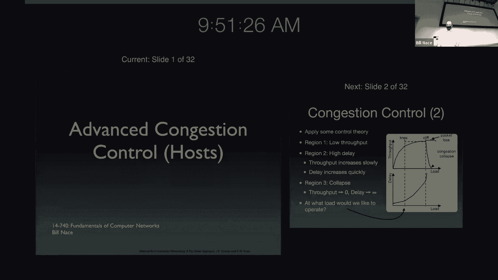
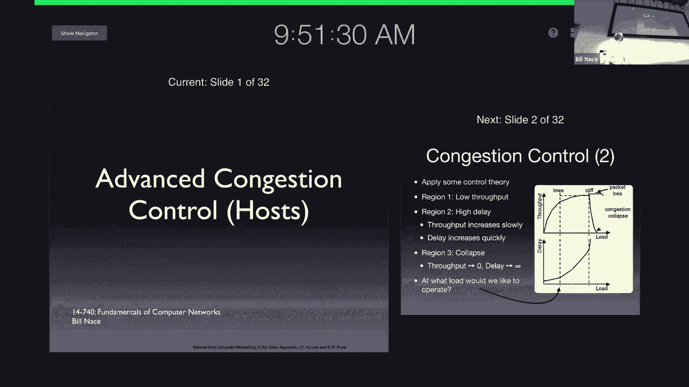
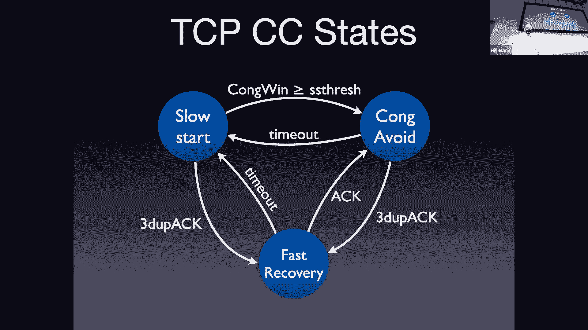
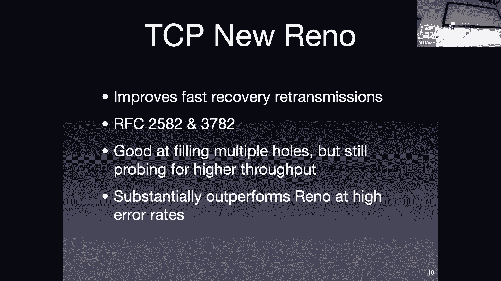
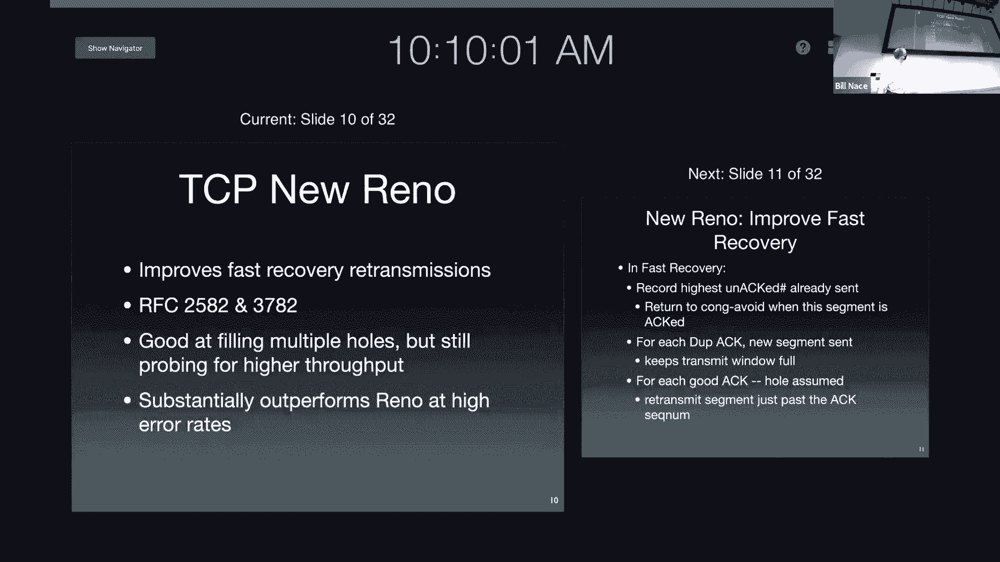
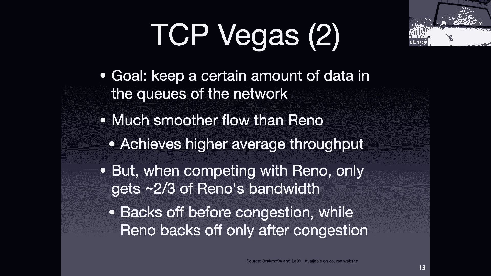
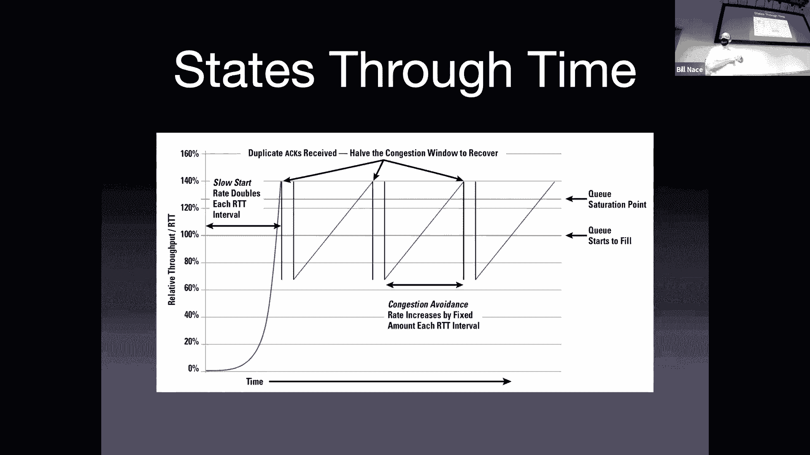
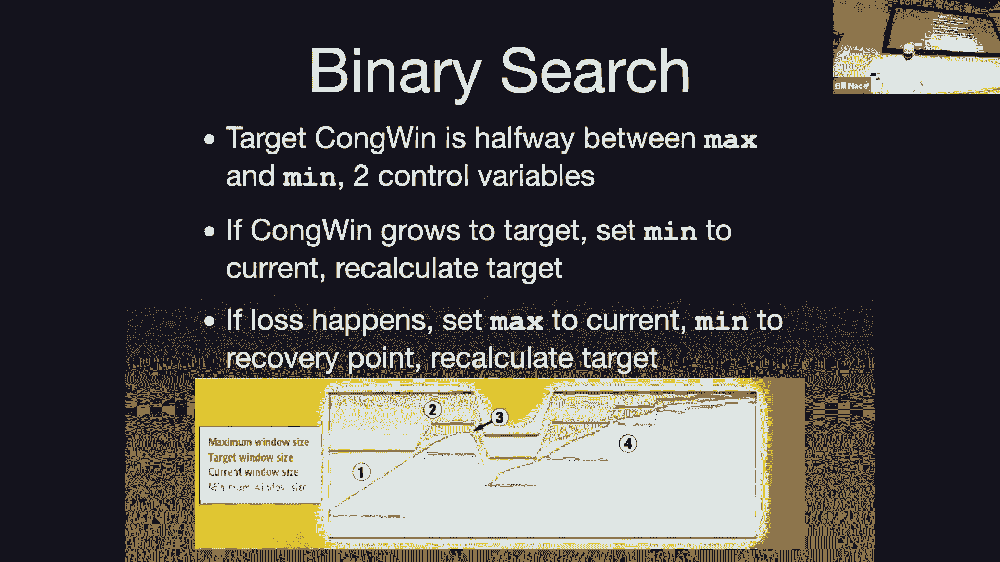
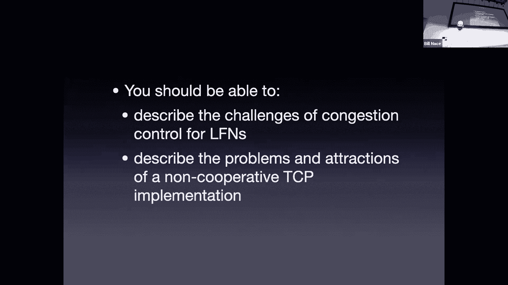

# 计算机网络基础：13：主机端高级拥塞控制 🚦






在本节课中，我们将继续探讨TCP拥塞控制，并深入了解几种高级的拥塞控制算法变体。我们将看到，除了经典的Tahoe和Reno算法外，研究者们还提出了许多改进方案，以应对不同的网络场景和挑战。

上一节我们介绍了TCP拥塞控制的基本原理，包括慢启动和拥塞避免阶段。本节中，我们来看看一些更高级的算法变体，它们通过不同的方式来探测和管理网络带宽。



## 算法变体概述

由于拥塞控制算法主要在发送端实现，相对容易进行研究和修改，因此出现了大量不同的算法变体。以下是几种具有代表性的算法：


*   **TCP New Reno**：在Reno的快速恢复机制基础上进行优化，主要改进在于处理多个数据包同时丢失的情况。
*   **TCP Vegas**：一种基于延迟的算法，通过监测往返时间的变化来预测和预防拥塞，而非等待丢包发生。
*   **High Blood (针对LFN网络)**：专为长肥网络设计，解决在高带宽延迟积网络中，传统慢启动和拥塞避免效率低下的问题。
*   **BIC (Binary Increase Congestion)**：使用二分搜索的思想来寻找合适的拥塞窗口大小，力求快速收敛到公平带宽点。
*   **Compound TCP**：一种混合算法，同时包含基于丢包和基于延迟的拥塞窗口组件，旨在兼顾效率和公平性。

## TCP New Reno：优化快速恢复





New Reno 是对 Reno 算法的一个直接优化，它没有重新设计拥塞控制，而是改进了快速恢复阶段的行为，特别是在处理多个数据包丢失的突发情况时表现更佳。

以下是 New Reno 在快速恢复阶段的主要改进点：

*   **更精确的恢复结束判断**：持续进行快速恢复，直到收到已发送数据中最高序列号的确认。
*   **保持管道活跃**：每收到一个重复确认，就发送一个新数据包，试图保持网络管道中有数据在传输。
*   **及时重传**：当收到一个“好的”新确认时，如果它表明后面可能存在空洞，则立即重传可能丢失的数据包。



## TCP Vegas：基于延迟的拥塞预防



Vegas 采用了一种根本不同的哲学。它不依赖丢包作为拥塞信号，而是通过持续测量往返时间的变化来推断网络状态。

其核心逻辑可以用以下伪代码描述：

```
if (measured_rtt > base_rtt) {
    // 延迟增加，表明可能出现拥塞
    decrease_congestion_window();
} else if (measured_rtt < base_rtt) {
    // 延迟减少，表明网络有可用带宽
    increase_congestion_window();
}
```

Vegas 的目标是在拥塞实际发生之前就采取行动，从而获得更平滑的流量和更高的总体吞吐量。然而，它的一个主要问题是与像 Reno 这样的激进算法竞争时会处于劣势，因为Vegas的“礼貌”退让会被Reno立刻占用空出的带宽。

## 长肥网络与High Blood算法

长肥网络是指具有高带宽和高延迟的网络。在这种网络中，带宽延迟积非常大，意味着可以同时在途传输大量数据包。




例如，对于一个10 Gbps带宽、100 ms RTT的网络，使用1500字节的MSS，其带宽延迟积计算如下：
`窗口容量 = (带宽 * RTT) / MSS = (10e9 bps * 0.1 s) / (1500 bytes * 8 bits/byte) ≈ 83333 个段`

传统TCP的慢启动（每次RTT窗口翻倍）和拥塞避免（每次RTT窗口增加1个MSS）在这种环境下效率极低，需要极低的误码率才能正常工作。High Blood等算法通过修改增长策略来加速慢启动和更积极地探索带宽，以适配LFN网络。

## BIC与Cubic：搜索与平滑

BIC算法将寻找合适拥塞窗口的过程视为一个二分搜索问题。它维护两个控制变量：`min` 和 `max`，并将目标窗口 `target` 设置为两者的中点。拥塞窗口朝 `target` 增长，达到后则调整 `min` 或 `max` 并重新计算 `target`。

Cubic是BIC的后续演进，其拥塞避免阶段的窗口增长使用一个三次函数，在远离最近拥塞点时增长迅速，接近时增长放缓，从而在追求高吞吐量的同时，也考虑了与其他流的公平性。

## Compound TCP：混合方法

Compound TCP 是一种混合型算法，旨在结合基于丢包和基于延迟两种方法的优点。它维护两个独立的拥塞窗口：

*   **Cwnd (基于丢包)**：由传统的AIMD（加性增、乘性减）规则控制。
*   **Dwnd (基于延迟)**：根据测量的RTT变化进行调整。当网络利用率不足时增加，当检测到排队延迟时减少。

**总拥塞窗口 = Cwnd + Dwnd**

这种设计使得Compound TCP既能对丢包做出快速反应，又能根据延迟趋势进行更精细的调整，从而在效率和公平性之间取得更好的平衡。

## 公平性与“囚徒困境”

TCP拥塞控制规则是自我约束的，没有网络警察强制执行。从理论上讲，用户可以修改自己的TCP实现，采用更激进的策略来获取更多带宽（例如，不按规则减小窗口、伪造ACK等）。这引出了网络中的“囚徒困境”。

如果每个人都遵守规则（合作），网络整体运行良好。但如果有人开始作弊（背叛），他能在短期内获得利益。然而，如果每个人都开始作弊，网络将陷入拥塞崩溃，所有人的性能都会下降。因此，长期来看，合作（使用公平的拥塞控制算法）对整体是最优的。这也是为什么主流操作系统都倾向于部署具有公平性考虑的算法。




本节课中我们一起学习了多种TCP拥塞控制的高级变体。我们看到，从简单的算法优化到根本性的设计哲学改变，研究者们不断探索更高效、更公平的带宽管理方式。同时，我们也理解了网络协议中自我约束与协作的重要性，这不仅是技术问题，也涉及到博弈论和社会协作的层面。