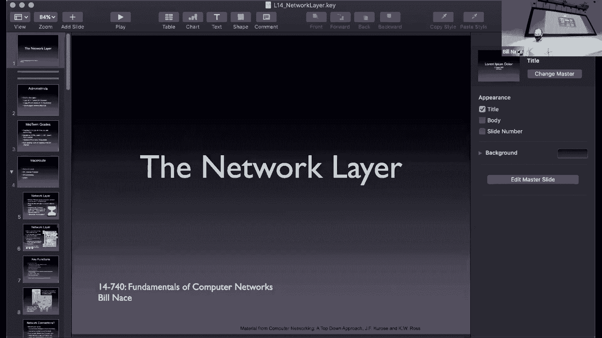
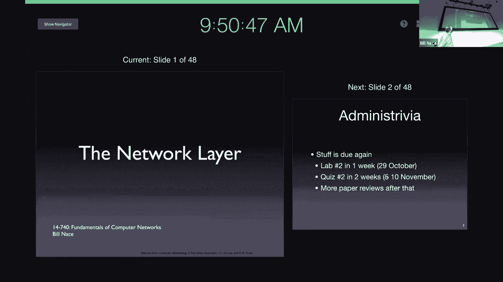
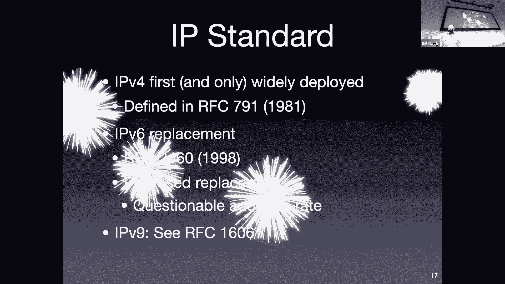
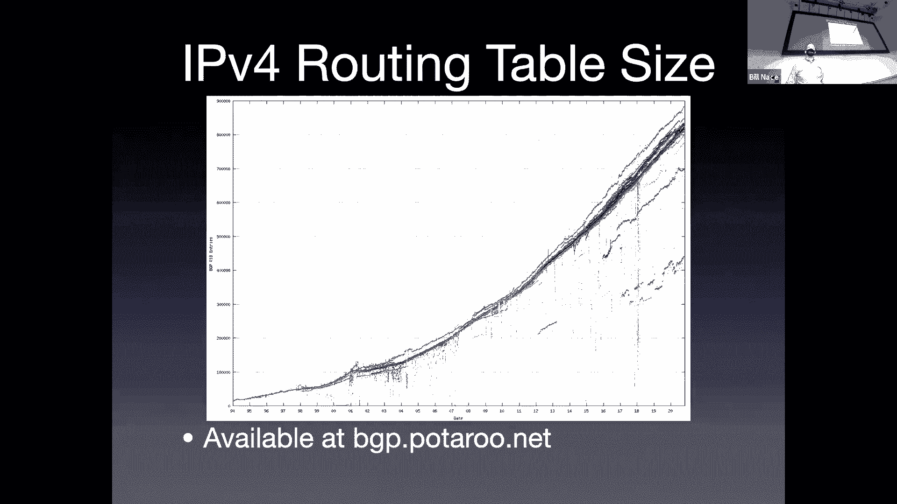
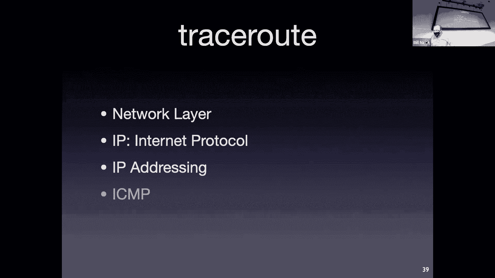
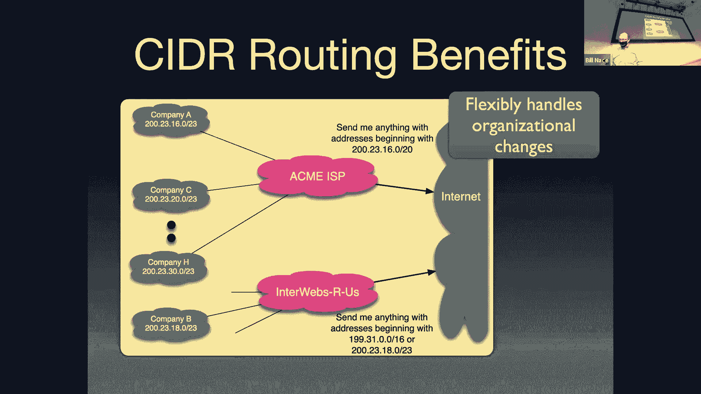

# 卡耐基梅隆大学 14-740 计算机网络 Fundamentals of Computer Networks（Fall 2020） - P14：Lecture 14 The Network Layer - ___main___ - BV1wT4y1A7cd

 This is 14， 740。

 Welcome everybody on another beautiful fall day。 Once again。

 I hope you get a chance to get outside and enjoy it。 And actually。

 and I hope it's a beautiful fall day， wherever you are as well。 Today， kind of exciting。

 we're going to move into our next layer of the stack， which is fantastic。

 So let's get started with that。

 As soon as I get all my zoom buttons pushed properly。

 All right。 So， first couple of administrative points to make。 One is， yes， stuff is coming up。

 So just a warning。 You guys know that hopefully within one week， your lab two is due。

 Are you may or may not have seen the announcement on Piazza that I posted that I'm going to have to cancel next Tuesday's class。

 And as a result， I basically just pushed all of the lectures back one session for the rest of the semester。

 which means you've got a five day， course， but， and your quiz two will actually occur on the 10th of November。

 instead of the 5th of November。 And we basically just pushed one lecture on data center networks off the edge of the course。

 And I apologize for that if you want to learn about it。 There will。

 there is a nice paper in the readings on the website。

 or go take 760 advanced real world networks to learn about data center networks。

 I also normally give this talk after we've done midterm grades but because， you know。

 because of the fact or canceling I didn't want to wait until Thursday。

 I'm going to let you know that this weekend I will be assigning a midterm grade for everybody。 Okay。

 and the point of that， the sole point of that there's no other point is that I want you to have some feedback on how you're doing。

 Okay。 It's based upon some grades， so it's based on some of the things you've done so far。 In fact。

 I think we've got everything you've done so far graded。

 And so it will be calculated based on all those it'll be calculated using the exact same algorithm that I will use at the end of the semester。

 Those grades obviously will go into that same calculation at the end of the semester。

 but other than that， there's no effect of the mid semester grades。 Okay， so don't worry。 Well。

 I guess worry or not worry。 Right。 I like to say it's not destiny because it's only 30% of your grade。

 So if you end up with a mid semester grade， you don't like you've got plenty of room to go ahead and improve。

 Okay。 On the other hand， if you do get a grade you like。

 you need to continue performing at that level。 Okay， you can't say， oh， I got an A for mid semester。

 I can now slack off because that is only based on 30% of your grade。

 But it's some good feedback for how you are doing。 And those I think show up in SIO or wherever。

 I'm not sure whether there is soon as I push the button or whether they're Monday afternoon for everybody。

 So expect to see that over the weekend。 All right， then into this new layer。

 It's kind of cool actually mid semester。 We're halfway through the course and we're halfway through our layers。

 Right。 We have finished the application layer， the transport layer。

 The only two we're going to deal with for the rest of the course are the network layer and the data link layer。

 We're not going to do physical layer in the course。 So time for a new layer。 The network layer。

 What's it all about？ The network layer is going to provide a logical connection between the hosts of the network。

 Now that sounds a lot like the mission of the transport layer。 Right。

 The transport layers mission was to provide a logical connection as well。

 The difference there is that the transport layer is providing that connection between applications。

 Right。 The network layer is just providing it between hosts。

 So it's job is to get a chunk of data from my computer from my hardware to any other hardware in the network。

 Okay。 Whereas the transport layer was to get from zoom running on my computer to zoom running on your computer。

 Okay。 The again， it's a layered architecture。 So it does this。

 It makes this work by using the services of the layer below it。 Right。 And the layer below it。

 the data link layer is going to be able to move data between any two connected hosts。

 So the data link layer is going to be able to get data from my computer to the first router。

 whatever CMU has set up。 The network layer is going to make use of that and ask the data link layer to do that over and over and over for every hop through my network。

 Architecturally， this is the center of things。 In some sense， this is the hardest layer。

 This is the glue that's holding everything together。

 It's some very interesting algorithms go on here。 And we're going to learn a lot of cool stuff here。

 The network layer moves data。 And of course， every layer has its own name for that data。

 So the thing we are sending in the network layer is called a packet。

 And we got to be careful because a lot of people are not as careful about that。

 And you will see people using the word packet for， you know。

 something that TCP sends or something that travels over Ethernet。

 The network layer is sending a packet from those posts to some other host。

 And so that means if I have a sender， my sender is up in the upper left corner of my little cartoon internet here。

 It's sending something which means the transport layer has just given it a segment。

 And the network layer is going to take that segment and encapsulate it。

 which is a fancy word for put it into the packet。 So the segment is going to become the payload of a packet that we send。

 And then that gets sent from router to router to router to router throughout the entire network。

 And so all of the routers are going to be running network software or hardware。

 And that doing some network processing on each of the packets as they flow through。

 Until we get to the final endpoint， where the network layer on that end host will take that packet extract the segment that is in the payload and give that segment to the transport layer。

 So there are a couple key functions， a couple of things that the network layer is going to be forced to do all the time。

 It's going to do routing and it's going to do forwarding and we call this the control plane and the data plane。

 The control is all of the kind of algorithmic questions about where is this going to go and how do I get it to that location。

 How do I control the processes that are happening in the network layer。

 And so this is the end to end path planning。 This is where all of the routers in the entire network communicate enough information to determine what is the best way to get a packet from my laptop to your laptop。

 What particular routers should it get sent throughout the entire network。

 And so that's a kind of interesting very distributed。

 very difficult algorithm and it's kind of fun to learn about。

 Forwarding is a process that happens in each router for each of the packets as they come in。 Okay。

 so routing happens to determine a route forwarding is something that occurs on the data that's being sent so that's why we call it the data plane。

 The packets as they show up。 And so it's processed at the router and the work that's done per packet is known as forwarding。

 I also include here something about connections。 Because in a general sense some network layers do require some connection management。

 Okay， because IP doesn't need the state being initialized about any connections it doesn't have any concept of connections。

 But there are network layers that do。 And so I think it's only fair that I point out that if you were on some other network you might need to do some something else here in the network layer。

 So here's this difference between the two processes the routing and the forwarding and I try to be very pedantic about this is another thing that you will see people using the word routing in a more general context than I do。

 Okay， so I think it's important to note that routing is the thing that happens when we run a routing algorithm and that algorithm produces the data that becomes the forwarding table。

 And it is something that runs it's that you know in my little cartoon picture here it's that blue bubble there。

 That's an algorithm that is running on all of the routers and all of the routers are going to have to communicate between each other to process that so it's a very distributed algorithm。

 It's running。 And in theory if the network were completely static。

 We could run that routing algorithm once and be done with it never have to run it again。

 And it would output a forwarding table that each of the routers would then use。 Okay。

 the forwarding process is what happens when a packet shows up at the particular router。

 And the process is that the router will look in the header and find some information and use that information to look up in the forwarding table what to do。

 Okay， so for instance here I have a packet showing up and in its header it has a one zero one in it。

 And the router will forward that packet by looking up the one oh one in the forwarding table。

 And so it looks up it finds the correct row that matches one oh one。

 And it sees that it should send that particular packet out link number two。 Okay。

 now remember our vision of routers right a router is basically a box with lots of cables out of it。

 In my picture I've only got four， which for many routers is is you know chunk change。

 Many routers will have you know 96 different connections or something like that。 Okay。

 and the output of this forwarding process is figuring out which of those 96 wires that the particular packet should be sent down。

 Okay。 This is processed by the way many people will talk about routers or routing packets。 Okay。

 and I think that works at some scale right but us who know networking should know that routers do not route packets they forward the packets。

 They route as part of the routing algorithm to figure out what's going on there。

 I did mention that some networks have these connections and have to manage them。 Okay。

 and the network layer it is true can be connectionless or connection oriented。 Okay。

 and we have different words for those a connection less network we've called a data gram or a packet switch network。

 And a one that is has connections we sometimes call those connection circuits。

 We call it circuits which network。 This sounds a lot like the TCP UDP choice right we talked about in the transport layer we said oh there are these connection less and connection oriented protocols。

 This is a completely different choice though it doesn't work like that。 Okay。

 this is a choice that is made when the network is constructed。

 If you want to build a connection oriented network you go by different routers。

 Then you would if you were building a connection less network。

 So it's not something that an application can decide。 Oh。

 I'd like to have the connection oriented service happening at the network layer。

 It is something that was decided when the network was constructed。

 And there are going to be different protocols at the network layer for these two different kinds of networks。

 This is not a service choice at all。 In a packet switch data gram connection less network。 Okay。

 there are no connections there's no sense of state every packet is handled individually and independently。

 Okay， and so we're just looking at it at each packet。

 And that meant means that the packets have to have an address in the header that tells where they're bound。

 So it has been address of the destination computer。 In the header。 Okay。

 and those packets as they go through the network router to router each router is going to look at that address。

 And decide which connection to send based on that address。

 And it's possible that those packets get sent down different paths。

 You've seen a little bit of this probably in your trace route work that you've done for a homework one。

 You probably saw， oh， at some point， you know， trace route step 17。

 it shows two different routers on that line。 Okay。

 that's because some router in the middle layer made a different decision on the two different probes that were being sent。

 But because it can。 It's a network that is thinking about each packet independently。

 And the fact that a previous packet went down a different path has no bearing on the forwarding of this particular packet。

 It just means that the forwarding table at some router got updated between probe one and probe two。

 Such that there's a different dust different outbound link at that router。

 In a data gram in a packet switched connection less network。 The addressing is of the end host。

 So that means every computer in the network has to have a unique address。

 And we use that address to specify where the packet is supposed to end up。 This sounds very natural。

 Right。 So we have things like， okay， I don't know， let's imagine I've got a 32 bit address。

 And that means that the forwarding table that each router has to make these decisions has to have ranges for those particular addresses。

 Because that router has to be able to look at any packet coming in with any of those 32 bit addresses possible。

 And to be able to say， oh， this one goes out wire number two， this one goes out wire number 83。

 And so that that forwarding table is going to look something like this。

 where you have a range you say from this particular bit pattern up to that other bit pattern。

 It goes out on wire zero。 And the use of the ranges is just a collapse a bunch of roads。 Right。

 you could imagine just having two to the 32 different rows of my table。 Okay。

 here's the output for each of them。 Nobody does that because that's way too much。

 And so instead we have these ranges that we collapse。

 So are the higher order of this associated with some particular driver。 Yeah， we'll get to that。

 And Edrick is asking， is there some structure to this to the higher order bits tell you something and they do to help us manage these besides of these tables。

 Yeah， we'll get to that in a couple slides。 Does that make sense for dinner network。 Yeah。

 you may actually have some sense that this is how the internet works because that's how the internet works。

 And the internet is a packet switch network。 Now， just for completeness and just so that we understand that these are not fundamental choices about networking but fundamental choices about a packet switch network。

 And I just described briefly， how a circuit switch network is different。 So once again。

 this is a circuit switch network。 This is not the internet。

 This is somebody else built another network。 Okay， which， I mean， was very common。

 The internet is kind of blown all this away。 But these were in fact， up until the 60s。

 This was the only way you did not work。 So the idea is that if I want to send some data from a source to a destination。

 I can't just send packets。 I'm going to have to set up a circuit first。 Okay。

 I'm going to have to in the first stage of this， send a message through the network that will move from router to router to router following some protocol to choose a particular connection through the network。

 Okay， and so that's the purple wire that are aligned that I have done there's bottom。

 It is selecting a bunch of routers。 And those routers all agree that they're going to be part of the circuit。

 And they set up some state in their boarding tables to make sure that happens。

 And then there's an accept message that would come back that kind of reddish arrow going back from right to left is is a confirmation that the circuit has been established。

 And then once the circuit is established， now I can start sending data down this network。 Okay。

 and so the yellow is the data that is flowing from sender to receiver。

 Now one of the reasons people like this idea is once you've done that work to set up the circuit。

 you can have some sense of guarantee bandwidth and you will have a more static。

 more regular experience for each of the packets in your network。 Okay。

 because you've already got all these routers agreeing， oh yeah。

 this is what we're doing we're sending all the packets this way。

 It becomes so much simpler process after the circuit has been established。 Okay， and then of course。

 once you're done sending your data， you would need to tear all this down you would need to tell all the routers。

 Oh， we're done with that circuit。 Please go ahead and release any guarantees you had given us release any state that you had set aside。

 This also means that the actual forwarding process is going to be different。 Okay。

 so the forwarding in a circuit switch network uses something called a circuit address or a virtual circuit address is something very commonly used now。

 And the way a virtual circuit address works is it has a number。

 the number is not associated with the end host， the number is associated with each of the links between router and router。

 So from router A to router B， there is a number， a virtual circuit number。

 that is established for that particular step of the entire connection。

 And that means that a router when it sees a packet coming in will look in the in the header for a number。

 but the thing they're looking for is this virtual circuit number。

 And they use that combined with the link that the packet arrived on to look up in this table。

 which row of the table we're working on so you see that on the left side of the table I have a link number。

 which wire did it show up on。 And a virtual circuit number， oh， 19。 That's the value in the header。

 And that's how I figure out what row of the forwarding table I'm dealing with。

 And then that tells me， okay， which link do I send this out and what number do I replace in the header。

 So I'm going to change the virtual circuit number to a number that is used between this particular router and the router we're sending it to。

 Okay， the virtual circuit number that was agreed on between that pair of routers。

 And so for instance， if I got a packet coming in on like one with a 19 minutes。

 you'll notice there are several 19s in the in the table。 The numbers are not unique。 Overall。

 they're only unique between pairs of routers。 So I would have to say， oh。

 this came in on link three with a 19 in it。 I'm going to change that number in the header to a 99。

 And I'm going to send it out on link number one。 Now， the reason we have， well， let me ask you。

 why would I have these different virtual circuit numbers， it seems a little confusing。

 Seems like a lot of work to manage these。 Why not， for instance。

 just have a single number for the entire path。 Kind of like we do with a packet switch network。

 Could it have a single number for the entire circuit。 So， you're so close。 Yes。 Yes。

 So the edge is saying， hey， it would be difficult then to make sure that all the routers are using the same number。

 That's the thing we would have established during the circuit setup phase。 Okay。

 the real problem though。 Anybody got it。 The real problem is maybe what Stefanos is saying on chat。

 the real problem is I somehow have to make that number globally unique。

 If I was using the same number for that route， right。

 every router involved would have to make sure that that's the only route they use that number on。

 Otherwise， they would get confused about which of the two routes。

 This particular number appeared in。 And so that global coordination turns out to be really difficult。

 And we need really big numbers to be able to manage that。 So instead。

 it's much easier to do coordination just between each pair of routers。

 And actually each pair of routers already knows the numbers that those pair is using so they can pick one without even having to ask the other side。

 which one to use。 Okay。 Back off of circuit switch networks。 Okay。

 go back to packet switch networks。 In fact， then， can it go back to our packet switch network。

 the one we know and love。 And that is IP， the Internet protocol。

 And a bunch of pieces we're going to talk about with with IP， right。

 IP also has many components like other protocols。 Right， we'll talk about the format。

 We'll talk about what we do with packets， how we actually route them。

 And we'll finish up today talking about the error reporting protocol that goes with IP。

 So IP is a standard。 It's so far， the only really widely deployed network， certainly of this scale。

 It was defined way， way back， way back when。 Right in a three digit RFC number 791。 Okay。

 way back when。 Yes， it is。 So you may have heard of a networking standard called ATM。

 This is not the get money out of the machine ATM。 It's a asynchronous transfer mode。 Network。

 and we will actually talk a little bit about it in the data link layer for weird reasons when we get there。

 But actually have a friend who worked for Marconi。

 which is a local company that made networking equipment。 And he's trying to get it killed off。

 But it's still being used for telemetry for Air Force drones and Air Force。 Data。

 because it's able to travel very nicely and smoothly and jitter free over these networks。

 And because the Pentagon can afford to have their own little network going。

 And so they're still building ATM network equipment for that。 I imagine there are other little。

 Places of the world where the similar thing is happening。 Right， and there are other， you know。

 I don't know the details of。 For instance， what NASA is using to talk to some of its satellites。

 And it could very well be using a circuit switch networking technology for some of those for all。

 And they're probably use cases like that where it shows up。 But yeah， IP is overwhelmed in terms of。

 It's overwhelmed everything in terms of number of users。 We will talk about IP version six。 Okay。

 we're now using version four。 We will talk about version six coming up in a week or so。

 It's a replacement that we've been kicking and trying to move everybody。

 The problem with changing the network layer is it's that glue that holds everything together。 Right。

 and there's a lot that depends on it and a lot of moving parts and a lot of things that you didn't think should be depending on it。

 But are， and so to change it you're effectively asking everybody in the world to change their routers。

 And we like to do that at roughly the same time。 So one one way to have changed to version six is just to shut down version four。

 And you know， Monday morning will start back up with version six。

 And of course nobody likes that idea that has way too much risk associated。

 So instead we have been trying for the last two decades to move IPV six along。 And here's a graph。

 This was from a couple of days ago when I was preparing this lecture。

 This is a graph that Google puts out showing the percentage of traffic showing up at its data centers that is IPV six。

 And we're actually doing okay we're over 30%。 I've been showing the same graph since 2009。

 Since before actually it still went on for a couple years before that but it was like， you know。

 very， very small。 So I'm happy to say 30% is good。

 For a couple years there is really excited because it looked like it was growing exponentially。

 And then it looks like it's gone back to being linear。 But yeah。

 so and give you a minus one data point right this is Google。

 It's a big data point because they're in a lot of places。

 But this does not mean that 30% of the network traffic is just what Google is seeing。

 And did you have a question。 So， Dean on is saying， hey， we saw a lot of dual traffic。

 We saw a lot of the same things being sent using IPV six and IPV four in one of the labs or home works right。

 And that's a very common tactic within a lot of cases。 And so he's saying， well。

 couldn't we just shut off IPV four at some point because， you know。

 we're doing this in dual train anyway。 One of the problems with just shutting off IPV four is that decision is not made in one place。

 There's no big switch or we're going to stop IPV four IPV six。 We've got 40。

000 different organizations。 Actually， I think it's more things maybe 60。

000 different networks in the world， each of whom is making their own decision about whether to do that or not。

 And so there's no， no governing body that will say， you know， as of， I don't know。

 let's pick November fourth as the date that we're going to go ahead and all be IPV six。

 You'd have to get 60，000 people to agree to that。 So it'll happen， maybe possibly。

 but it's just been really slow slog。 Okay， in IPV four， what is the actual bits look like。

 We've done this with every protocol so far。 It's one of the most important things about the protocol is figuring out what the bits are and how to interpret them。

 And once again， we have a fixed format header， right。

 which means I've got a lot of boxes to talk about and man， look at all those boxes。

 There are lots of things going on here。 It's， you know， it's TCP level of complexity。

 lots of lots of pieces。 So let's look through some of them。

 First field up is version version numbers of four bit field。 And for IPV four。

 it holds a four for IPV six， it holds a six， right。

 those four bits are how a router looks at the packet and says， oh。

 this is an IPV six or an IPV four packet。 So， in some sense， if you're a far looker， you could say。

 oh， no， we're going to be in trouble because we only can go to IPV 15。 Okay。

 But if it takes us long with each one， that's not a problem。

 I think I'm going to have to worry about。 The next up is header length。 It's a length field。

 What two questions do we ask about every length？ I'm sorry。 What are we counting？ Okay。

 And that's the header length。 So we're asking what's the length of the header of the packet。

 Just true。 That's what we're talking about here。 What's the other question？ What are my units？ Okay。

 And so in this case， I have a four bit field， which is small。

 but it's okay because our units are going to be 32 bit words。

 So we're counting big things with small number of bits。 Okay。 And so our header， you can see each。

 each of these green boxes I've drawn is 32 bits wide。

 And so my header 12345 plus that six field down is options。 That's why we need a header length。

 Because we could have options in there that make the header longer。

 We need to be able to detect that。 Next up is type of service。

 This is another one of those fields that there was a vision that network operators would want to use this to provide called differentiated services。

 We'd want to be able to look at this packet and decide， Oh， has this guy paid extra money？

 Should I route it fast， for instance。 Okay， or should I do something else with it。

 And those are the bits that are supposed to manage that。 This is not a field。

 This is not something that is really taken off partially because kind of back to the previous question。

 I got 60，000 operators， all that would use those bits differently。 And so there's no good。

 No good worldwide global process for using them。 Next up is the data gram length。 Oh。

 look at that two lengths in the same packet header。 So again。

 I'm asking what is it the length of of the data gram。 Okay， so this is the whole， the whole thing。

 So the whole packet that's the header plus the data， not just the payload。 Okay， so in some sense。

 we're counting the length of the header twice。 Because it's in the header length。

 but it's also included in the data gram length。 No big deal。 We have lots of bits there。

 And we mostly don't use them。 Right， because in theory， that means I could have 16 bits。

 I could have two to the 16th。 I could have a 64，000 byte long packet。

 But you and I know that that's a bad idea to some long packets。

 So instead it's going to be more like 1500 or less， which we could do with what 12 bits 11 bits。

 All right， next up， I'm going to come back to the how these exactly work in a few slides。

 but the next row down the identifier flags and offset all are used for a process called fragmentation。

 which we'll talk about in a second。 Next up is a time to live field。

 So the number that gets decremented at each router。

 And now originally it's was supposed to be decremented by the amount of time。

 the number of seconds that the packet took in the router to be forwarded。 Okay。

 that's kind of laughable now because it's never going to take more than a second。

 So now it's kind of become a hot count thing every router is going to subtract one from that number。

 And if that number ever gets to zero， then that packet is just killed it's never it's not actually forwarded on。

 Okay， this is a process that makes sure that we'd never have packets existing in our network for very long。

 And that if we had some routing loop that would send packets back somewhere and back， you know。

 send them around and around and around。 So we want to eventually kill those off。 Yes。

 it would be nice for us not to have the routing loop in the beginning。

 but this is kind of like a safety net to make sure that if we did have a routing loop。

 We're not going to bring down the entire network by having too much data circulate around that loop。

 So that's a protocol， another 8-bit field。 This is used by the receiver to figure out what the upper level protocols what the transport level protocol is that should get this data。

 So there's a number that means UDP。 There's another number that means TCP。

 That's how the receiver figures out。 Oh， I just got this packet。 Let me decapsulate the segment。

 Take the segment out of it。 Who should I give it to？

 And because there could be multiple transport layers running on your computer。 In fact， likely are。

 We have to have a way to distinguish between kind of like port addressing。 Right。

 At the transport layer， the receiver had to know which application to give the segment to。

 And it's kind of the same thing。 There's also a header checksum。 Another 16-bit value。

 It's calculated using the same process， the same algorithm that we've talked about before。

 Add all the things up。 You flip the bits。 That kind of thing。 This one， though。

 it's a header checksum。 It's only checked on the header here。 And I guess I should point out in。

 IP requires it to be calculated just on the header in many implementations。

 The management of the checksum is done using something called a pseudo header where we actually combine the TCP or UDP and the IP checksum and do all the math at once。

 Okay。 That's an implementation mechanism that is not part of the actual standard。

 The IP protocol requires you just to calculate this particular checksum。 Now， interestingly。

 that checksum has to be recalculated at every router。 Okay。

 So as I send my packet through the network， the checksum is actually going to change。

 That seems weird。 Why is that going to change？ Yeah， one of the input bits。

 one of the values that's coming into the calculation at checksum is the time to live。

 and you just decremented the time to live。 Okay， so。

 so that has to therefore mean that the checksum has to change。 Now， one might look at this and say。

 wait a minute， UDP is already doing checksums。 Right。 IP is doing checksums。

 Why do we have to do both？ Why do we have to have separate things going on？

 And that one's a little bit more subtle and a little harder to see from our perspective。

 but IP back in 1981 wasn't sure about what other networks。

 what other transport layers it was going to be。 And neither were those particles。 So UDP。

 for instance， can be run on other networks other than IP。 Okay。

 and so the calculation mechanisms it uses have to be。

 have to be understood in the sense of just UDP as its own thing， for instance。

 or just TCP as its own standard， because they could run on other networks。 If you have。

 and this is why if you have UDP or TCP running on IP。

 you can do that pseudo header thing to do the computation in one place。

 because you know that these two are going together。 But that's in general not true。 Right， it's not。

 there's no forcing function that requires UDP to only run over IP， for instance。

 Now somebody in the， I'm too hot he has asked in chat says this is back with the upper level protocol field asked does this mean that there's a limit on how many upper layer protocols there could be。

 And yes it is right I've got eight bits there。 Right。

 so that means I can only have two to the eighth upper layer protocols running。 Okay， and so。

 I mean we don't typically have that problem。 But， and I got a。

 I haven't looked to know how many of those numbers are actually in use。

 Obviously TCP and IP are the big players there。 But as I've said over and over there are other transport layer protocols so you got to be careful about that。

 That is correct。 Right， and that's one of the reasons that that IP is doing this is they're saying。

 we're just going to check some the header。 Okay， if you want to be running another protocol。

 and you care about the integrity of the data in that protocol。

 then you should check some of yourself in that protocol。

 I guess one other way is looking at is that forced UDP and TCP to include a check some in their own protocol。

 There's an options field here， kind of like we had with TCP， except this one is rarely used。

 Okay TCP had a few that were not uncommon。 Okay， but it turns out doing options here is problematic for some routers and so some people see that as a reason not to do it。

 because who knows which router you're going to be sending your packet through and if that router doesn't handle options。

 then it's going to scope your packet。 Okay， and so， so the。

 and then I guess I should point out the reason that is problematic for router。

 The router you got to remember is doing stuff as high speed as it can and oftentimes has a lot of hardware support for the things that is doing。

 Okay， so it's not a piece of software that is interpreting this header。

 Oftentimes this header gets chopped off of the incoming packet and is delivered to a separate piece of hardware for interpretation。

 and the data is put in memory somewhere。 The actual package is just put somewhere else。 Okay。

 and then the hardware chomps as much as it can on on the header before invoking some software to do some。

 you know， some check up things or stuff like that。 Okay， and。

 but that split is really hard to do if you don't know how hard how big the header is。 Yes。

 you could build into your hardware that it looks at the header length and then knows to take that much into the header but that means then I've got to have。

 my， the hardware， the chunks that hardware is dealing with have to be different sizes and things like that。

 Okay， so it's not impossible to do。 All right， it just at high speed can sometimes be problematic。

 Okay， so we often don't deal with options at all。 And then finally is the reason that we're doing this。

 right， the whole， the whole reason the packet is being sent in the first place is because it has a payload that payload data is going to be a segment。

 Okay， so， you know， some transport layer， TCP UDP or something else。

 it's going to be some of those segments or as we'll see in a few minutes。

 it may also be an ICMP piece of data as well。 Good so far。 All right。

 I mentioned fragmentation earlier。 So there were three fields in this header that I said I'll get to in a couple slides。

 So this is the couple slides where we're doing that。

 The issue is that sometimes when you send a packet。

 it may be too big for the link layer to handle it。

 So some router in the middle of the path somewhere has done the forwarding and said， Oh。

 I have this packet。 Okay， it should go out on link number two。

 and then suddenly discovers that the MTU for link to is too small。 Do you remember what MTU was？

 Sorry， one yet another of the acronyms in the class right MTU is the maximum transmission unit。

 Okay， that is the piece of a number that's specified by the technology in the data link layer。

 Right， Ethernet has decided this is how big the frame is and this is how much data can be held there。

 Okay， and so MTU is the biggest thing that that Ethernet frame or that Wi-Fi frame or whatever data link layer we have has specified for how big it can handle in a frame。

 And depending on the technology， those could be different。 Okay， so a router may discover， Oh。

 this has to go over this microwave link that has a 526 byte MTU， but the packet is too big。 Right。

 the packet is 1200 bytes。 What do I do？ This won't fit in that。 Okay。

 so the router can then fragment the packet into pieces。 Okay。

 and send it instead of as one chunk now it gets sent as two or three chunks， whatever it takes。

 And these fields in the header are used to manage this fragmentation process， the three fields。

 One of them is the identifier field。 The identifier field is a number that the fragmenting router will use。

 And it gets to choose it。 It's got to be something it hasn't used recently。 Okay。

 so it can just add one to the last time it fragmented。

 And it's got to put the same number in each of the fragments so that the receiver who's going to get these separate pieces and try to put them all back together can identify that these pieces all go together。

 because they have the same identifier。 There's a flag field， three bits there。

 And one of them is a flag。 So this again， the flags are single bit things telling me something should be true or not。

 One of them is a don't truck， don't fragment flag。 Please。

 if you get this and need to fragmented don't。 Okay。

 instead drop the packet and send me an error message。 Okay， and so the idea is， hey。

 I've got a whole lot of data to send down this path。

 If you're going to end up fragmenting every one of the next million segments that get put into packets and sent out。

 That's going to slow things down。 Just tell me that there's an error， and I'll go ahead and fix it。

 I'll start making my segments smaller。 Okay。 And so that's that's the purpose of the fragment flag。

 The more fragments flag is used by the by the fragmenting router to specify which one is the last。

 or I guess more fragments means it's not the last。 Right， so the idea is。

 I'm going to be sending several fragments to some end router who has to put them all together。

 It needs to know， Oh， I've gotten all of them。 I got the first， I got the second， I got the third。

 Is there a fourth one coming？ I don't know。 Okay， and they look at that more fragments field to know whether there are more fragments coming or not。

 The third bit is called the evil bit。 I'll leave that to your to your own research to figure out how that is used。

 The offset then is going to specify which fragment is which。

 So if I have this big packet and I got to chop it into three pieces。

 I want to be able to say this one goes where in the stream of bytes that are in that original packet。

 Okay， so this one starts at by zero。 This one starts at bite， X， D， whatever in the packet。

 depending upon how I fragmented them up。 Okay， now this is a little weird。

 because we chopped three bits off for the flag， we only have 13 bits left。 And because in theory。

 all IP packets could be the size of our date， our datagram length， which is 65，000 16 bits。

 We're going to end up using eight bite units for the length or this offset field in my fragments。

 Okay， so we're going to be counting eight bite chunks。

 Let me show you an example and hopefully this will become a little bit clearer。 Here on the left。

 I have a sending a sender who has transmitted a segment that got put in a packet that ends up being 1500 bytes in size。

 Okay， and it gets to some router in the middle of the network there。

 that guy at the top center who's going to fragment it。 Okay， and that's because this is too big。

 Right， the MTU or the numbers I've put in yellow boxes on the links。

 The link coming in was able to handle a 1500 byte packet。 What the link going out is 536。 Okay。

 it can't handle a sync this packet as a single frame at the data link layer。

 So instead we have to chop it in three pieces。 Okay， so how do we do that？ Well。

 we're going to make these three fragments。 Okay， the first， let's see。

 I guess I've got to figure out how big should they be。 Right， they have to be smaller than 536。

 And so we're going to break them into pieces that are。

 It turns out not to be 536 exactly because of our numbering system。

 but they have to be slightly smaller than that。 So we're going to end up with 512 bytes of data from the original segment。

 And 20 bit header on that。 Okay， because it is another IP packet we're putting together。

 So it has a 20 byte header for a total of 532 bytes。

 It turns out 536 is not a 8 or 8 byte unit of count does not divide evenly into 536。

 It does into 532， which is why we choose 532 total bytes to send。 Okay。

 so each of these is going to be 532 532。 And then what's left， what's left over。

 So I have my original 1500 bytes less the 20 byte header that was originally there。

 So actually have 1480 bytes in the payload of the original packet。

 1480 if I've done my math right is 512 plus 512 plus 456。 Okay。

 each of which requires their own 20 byte header。 So that's how my data gets chopped up into these three pieces。

 I then choose some identifier， right， 1987 is good number。

 So we'll use that for all three of them has to be identical。

 So we're identifying all three of these fragments as belonging to the original packet。

 More fragments coming。 Yes， more fragments coming。 Yes， more fragments coming。 No， right。

 So that's the 110 there that lets the end know once they've gotten three of these fragments that there isn't a fourth coming。

 Okay， and then I have to specify what the offset is so that the end guy knows how big these go and which order they go in。

 Okay， actually it's clear that we know that the third one is the last one。

 because it has more fragments being zero， but the other ones we don't know what order they going。

 And so we use the offset to tell you that the offset is the number of bytes， you know， this。

 this packet has 512 bytes， starting at what location in the original packet。 And well。

 the first one's going to be start with the first bites right so it's going to have an offset of zero。

 And it's going to go from bite zero to bite 512， I guess 511 0 to 511。

 which means the second fragment starts at 512 512 is 64 8 byte units。 Okay。

 and so that's why the offset is a 64。 Okay， and then likewise。

 the third segment is going to start at 1024。 Okay， which is 128 8 byte size chance。

 I'm just gonna give a question。 Yeah， we'll talk about that in a minute。 So。

 Edricks asking who's responsible putting these back together the end host will put these back together。

 We'll talk about why in a second。 The other question I guess is。

 is there anything probably in a fire， for example， let's say in that section， the bottom wrapper。

 Just so happens to also split up the， a packet with the same identifier。

 I think that would be an issue。 Right， so if I had， if I happen to have data from the same source。

 going to the same destination。 Okay， those packets would be not be able。 I mean。

 they would be all collected together in post。 And if we had fragmentation in two different places。

 And they happen to use the same identifier， which they could there's no coordination across the routers。

 Then yes， I think we'd be in trouble。 Yep。 So don't do that。 Okay。

 so stuff in addition to that problem， there are other issues we ought to talk about。 So one is。

 as Edricks has pointed out， or is asked about the fragmentation。

 Could be reassembled somewhere else。 Okay， instead they're not that it's an engineering choice was decided that we don't want to have a situation where one router is fragmenting and the next router is putting back together and then fragmenting them again and putting back。

 You know， we don't do that right which routers main job routers main job is to forward packets。

 right， not to be reassembling stuff。 So， yeah， we'll not have more packets to send。 Oh。

 I guess I should point out， it's not clear。 The fragments are all packets。

 The fragments all follow all of the rules of IP packets。

 They have headers that look like IP headers。 They get handled as if they were a standalone。

 They are their own。 They can be fragmented again。 Okay， if you have 1500 to 1200 to 530。

 you could have multiple layers of fragmentation。 Okay， kind of sock。

 but that would have that would be legal， and this process would all work。 Okay。

 But so the fragmenting reas， sorry， the reassembly of all the fragments is done at the end host to make sure that that guy's got spare cycles。

 let him deal with it。 There is no reliability in the network layer。 Okay， so if a fragment is lost。

 there's no way to go back and say， Oh， I'm missing fragment number two out of this。

 Can you please retransmit it。 There's no reliability at all。

 Just like there isn't with any other packet。 Okay， so if a particular fragment is lost。

 then that means you're going to lose all pieces of that packet。

 All of the fragments that belong together will be thrown together。 This is a complicated piece。

 In the 1990s， nobody liked fragmentation。 It was seen as an evil part of the network。

 And so when IPV six was designed， it was actually just thrown out。 They said， we're not doing this。

 This is too much crazy stuff going on。 So IPV six does not include fragmentation at all。 Okay。

 Question。 He said there can be multiple areas where a fragmentation happens to be empty you over the land。

 Along the route changes。 So my question is a rather job also is to fragment the messages or。

 The packets。 The long from。 Does it know the empty or hand or is the right thing happening at the link layer？

 Okay， so the question is kind of。 This fragmentation is a facility of the network layer。

 How does that interact with the other layers around it？ If I can。 Right。

 Because empty you is a link layer aspect of a fact。 Why is it happening at the network？ Right。

 So you're right。 The mission。 The mission of the network layer is to make this logical connection。

 And it's going， but that's a mission that it's providing to the layer above it as a service。 Right。

 Now you're asking the question， I think more like， well。

 shouldn't the right many be something that a link layer does。

 Because the link layer is an it does empty you stuff。 And that's it's own fault。 Right。

 And so maybe it should be done there。 And I guess it's not。 And maybe you're right。

 Maybe it could be done there in the in the link layer that happens to have a small empty you。

 But that would require every link layer to to be able to do that have that as a function。

 And we're one of the reasons that the network works so well is that we don't put too many burdens on which particular kinds of link layers are allowed in the network in which aren't。

 But there are a couple of inter inter layer things going on here that I think are bound up in this question as well。

 For instance， who's choosing the length of the packets。 Right。

 It turns out it's not that the network layer choosing that this should be a 1500 by packet。

 It's the transport layer right the transport layers the where the segmentation actually happens。

 And so。 And this is one of the difficulties of fragmentation is that it deals with these different layers and the information about it doesn't flow particularly well across the layers。

 Right。 There when fragmentation happens the network layer fragments and hides the fact that it did the fragmenting。

 And so a transport layer if it were able to know which path there the segment would travel would make a better choice about how to segment the messages in the first place。

 But it doesn't and that's and that's part of a packet switch network。 Right。

 The packet switch network may choose on different packets to go different ways。

 So it could be that this this packet that is getting fragmented is the only way to get it。

 And it is the only packet out of an entire stream that will be fragmented。

 because it's the only one that happens to go this route。 Okay。

 or it could be you're watching Netflix and every single packet is going through that router and every single one is being fragmented。

 And it wouldn't it be nice if we were able to send a signal back and say， Hey， dude， stop。

 stop doing this， make your segment smaller。 And so there are some difficulties there。 Yeah， no。

 I agree。 It's， it is an ugly part of the from engineering perspective。 This is like， you know。

 Mike gives me the engineering shivers over over fragmentation。 Yes， ma'am。 Yes。

 fragments are IP packets that may be fragmented again。 So the question is then okay if it's。

 but if it's fragment has been fragmented， how do you put it together？

 The answer is that the second fragmenting router has to be careful about how it fragments them。

 And so for instance， the second fragmenting router when it fragments， you know。

 a particular one of these， it has to fragment it and fit it back into the original scheme。

 And so let's say， so this could be difficult right of these three packets that we now have created。

 They get sent maybe only the second one goes a particular route and needs to be fragmented again。

 Okay， when it needs to be fragmented again that router will have to use the same ID for the fragments。

 Okay， we'll have to say， Oh， wait a minute， this is a， are there more fragments coming or not。

 In this case， there would be so both of the fragments would have the， the MF bit set。

 As opposed to if it were zero， then you'd fragment one would be have a one one would have a zero right so you have to think about it in the entire scheme of things。

 And you have to make sure the offsets work out。 Oh， this started at 64。

 So therefore when I fragmented， I know where my second fragment starts and I know how to put its offset there。

 Okay， and then the end host doesn't actually know that they got， I mean， it could inspect and say。

 wow， I have two big fragments and two small fragments that must have gotten fragmented again。

 But in general， it doesn't need to know as it's putting these back together。

 It just needs to know I got all of them the offsets make sense and I got one that has an MF bit zero。

 Let me， let me put them。 Use them all back together。 Okay。

 With the MTU changes during the process so the MTU isn't isn't something that is that flexible that a particular link is going to change。

 Right， so。 I think that's yeah no that's that's I can think of one case like Wi-Fi will actually start changing the size of the frames it sends。

 but it does that on its own it doesn't actually change its MTU。 Okay。

 so that's the only way the MTU is going to change is if you take a different route。 Okay。

 and so that means they would be fragmenting differently for that other route。 Okay。

 what are the questions to you。 No， it the eight bite boundary comes out because of the header。 Okay。

 and the fact that we have a data gram length that is 16 bits long。

 And so in theory you could have a really huge。 Packet that you're fragmenting。

 Even though we never actually do in theory you could have something big。

 but then we own since we use three bits for flag we had 13 bits left。

 For the offset value to fit it in the header。 And so that 13 bits has to still cover the 16 bits of the theoretical size of the data gram。

 And so that so that means we have to use a bit units。 And then there's one about IPV six。

 not including fragmentation。 And saying， well does that mean IPV six cannot send huge data。 No。

 IPV six， we'll talk about this when we talk about it。

 But the short answer is IPV six when it needs to fragment instead sends an error message back to the sender。

 It says， Hey， dude， this would have had to be fragmented。 So I dropped it instead。

 You should segment differently。 Yes， actually， I see MPV six。 Yeah。

 That's how that error messages is returned。 Okay。 It turns out fragmentation is complicated。

 Not everybody's going to get it right。 And so therefore it's a it's a nice place to look around if you're looking for ways to mess with somebody from a security perspective and there are bunch of security issues around this。

 which is another reason people didn't like it。 So for instance。

 the Jolt to attack is a denial of service attack， where you end up sending some fragments。

 which means you don't have to send that much data because you're sending small amount of bandwidth for each of your small fragments。

 You just never give them the first one。 Okay， you just say this one is fragment， you know。

 with offset 64 and the end user then has to buffer that waiting around for fragments。

 zero to show up。 Okay。 Or in many cases you can do stuff like give fragments that overlap。 Okay。

 or aren't aligned properly。 And this has been cleaned up but a lot of early OS is that we're dealing with this would never have imagined that you would end up。

 You know， how would I， how would I get zero。 Zero 64 and you know 60 as my offsets。

 What do I do about that。 Okay， so this security problems was another reason that nobody likes fragmenting and it went away。

 All right， next up， we need to talk a little bit about addressing in IP before and how that works。

 We have a connectionless network that means that when we send a packet we are identifying an end host it needs to go to that end host has to have an address and so we use these these addresses in IP to specify the end host。

 And they need to be globally unique so that when I send a packet we know who it's going to。

 Turns out I just want to buy contrast point out that you also on your computer almost certainly have other addresses and Ethernet address is a good example。

 The Ethernet address is a 48 bit address that is also globally unique。

 So why don't we just use that。 Right。 Why do we need these different schemes。

 It turns out each layer has its own addressing mechanisms that are needed for its own requirements。

 And the fact that the addresses are globally unique is not enough。 The， the。

 the Ethernet addresses are assigned in a flat manner。 Right。

 they're assigned effectively as the device is constructed。 Right。

 so when my Apple laptop was rolling off the assembly line。

 somebody virtually stamped it with an Ethernet Mac number and the one right behind it got the next Mac number。

 Right， but then mine got sent to the US and the one behind got sent to Italy or something like that。

 Right。 And that means that yes， they're globally unique。

 but there are no help in the routing process。 There have no help in figuring out which destination this thing has to be。

 And so IP uses a hierarchical address that will give it some help as it's trying to figure out how these how these work out。

 So the addresses that IP uses are split into two pieces。

 And we will see when we get into routing algorithms， actually even aggregated more。

 So that the upper X number of bits specifies a network。

 And the lower remaining bits specify the hosts in the network。

 So right now there are seven of us in this room， we almost certainly are on the same subnet。 Okay。

 that means that the IP addresses that we have been assigned almost certainly have the first some number of bits that are the same。

 Okay， and then because our computers have to be globally unique。 There has to be some difference。

 So there are some bits at the end that are going to be different。 Okay， so。

 and I don't know how that is actually split up for this particular subnet in this particular network。

 Okay， but there's some distinction that's made the some administrator has chosen。

 This many bits are going to be the host bits and these many bits are going to be the subnet bits。

 So in IP， our addresses are these 32 bit numbers。 Okay。

 and we typically write them in this dotted decimal notation。

 You've seen this before almost certainly right 192。168 dot something that something else。 Right。

 and that's just a commonly used format that lets us look at it and say oh that must be an IP address。

 Right underneath of course it's just 32 bit number。 That's just how we happen to display them。

 There are ranges of those that are usable for different things。 Okay。

 and you probably have seen some of these。 Right there。 In fact， I used 192。

168 as my example here because it's really common。 Right。 That's you。

 It's it's known as a non routable address。 We'll talk more about when we get to network address translation devices。

 Okay， but it's very common for us to see that even though there's supposed to be global unique。

 Don't worry。 We'll get to how that works。 Okay， the range is set aside for virtual private networks from multicast。

 There is a broadcast address。 Don't try it。 It actually doesn't broadcast to the world。

 which is a good thing because otherwise you would be getting messages from， you know。

 some new kid in in Germany who decided， oh， this is cool。

 Let me send broadcast everybody in the world。 Right。 It sends out to the network。 Okay。

 but that usually gets stopped at the first router。 Okay， so the。 When I want to specify a range。

 which I often do。 I just specified， for instance， that the network has the first number of bits that are going to be the same for every address in that network。

 I want to be able to say， oh， from this address to that address。

 And the way we do that is by using a thing called prefix notation。

 And the idea is we're going to write a bunch of bits that we're actually going to write an address where the first number of bits all are the ones that are important。

 And then I'm going to put a slash。 And then I'm going to write a number that tells you how many of the bits。

 how many of the most significant bits of the number will be the same throughout this range。 Okay。

 so smaller numbers there mean smaller numbers are the same。

 which means more bits are available to specify hosts。 So that is actually bigger network。

 If there's a smaller number。 So for instance， 128 that to one on one that 64 that's an IP address。

 And then it specifies 32 bits。 Right， because it， you know。

 something that something that something that something。

 all of them decimal numbers that's a 32 bit number。 And then after I put a slash 26。

 which means only the first 26 bits of that number are going to be the same are in this prefix are in this range。

 And what do you mean is， well， if 26 bits are the same。

 then that means IP addresses are 32 bits in size， minus 26， leave six remaining。 Okay。

 so that means that I'm going to have six bits to specify hosts in the network to the six to 64。

 And the network is of size 64。 Yeah， that prefix specifies 64 different addresses。

 And the addresses all start with 128 that to dot。 Let's see each of those dots。

 each of the number pieces is eight bits。 So if I want the first 26 of them to be the same。

 that means all of them are going to start with 128， all of them are going to start with two。

 all of them are going to start with one on one。 But that's only 24 bits。

 So the next two bits have to be the same for everybody。 And what are those next two bits。 Well。

 the first two bits of the number 64。 If I look at 64 is a binary number。 Okay， zero one。

 zero zero zero zero zero zero zero。 That's a 64。 Okay。

 and so that means the two bits I'm looking for are the zero one。 And x x x x x x。

 that means those are the bits that are changing。 And so my range is actually from 128 to 101。64。

 which would be zero one and all those x is being zeros up to 127， which is zero one。

 all those x is being ones。 So you see how this prefix by having a slash something at the end。

 that gives me a range。 Okay， let's me specify a range of values， and depending on that number。

 it could be a lot of values or a few right a slash 31 means only the last bit can change。 Okay。

 so I could only have two actual values in that in that range。

 Now here's a common question that I've seen for like job interviews and like the network testing。

 which seems really silly that anybody would ask this。 Okay， but you'll see stuff like this。

 which is why I put it here。 Okay， I'm probably not going to ask something like this on an exam because I think it's too silly。

 but you'll commonly see， oh， we've got this this range right to 23。1。17。0 slash 24。 That's a range。

 and we'd like to split it up。 I'd like a subnet that has 125 interfaces that is 125 different addresses to it。

 Okay， what's the next biggest power of two 128。 Right。

 I need to have two ranges with 60 and what's the next biggest power to 64。

 So I'm basically taking a slash 24 chopping it in to one range that has 128。 Seven bits。 Okay。

 so that's going to be a slash 20 25。 Right， and then to slash 26 is which are for 64 bits and so if you understand binary at all。

 you can easily figure out those are the values that you need to create。 Okay。

 so you're doing any network interviews be able to do that。

 You're taking the Cisco tests you need to be able to do that。 Yeah。 All right。

 I showed you this forwarding table earlier， right， in which I said， Oh， look。

 there's these ranges of bit patterns for addresses to specify whether I go out a particular link or not。

 Now that I have prefix matching or prefix values， I can use those to reduce my table now to prefix values。

 So I have a bunch of bits slash 21 tells me how many bits are in that range。

 I was bunch of bit slash 24， etc。 Okay， and I just want to point out this turns out to be a little bit important。

 I'm not responsible to have addresses that fall within multiple of these rows。 Okay。

 it's a lot of bits。 So I'm not surprised that it didn't instantly jump into your head that there's no overlap between the first and the second row of my table between the output links one and two。

 Sorry。 The first 21 bits match in both of those cases。 And so if I had that 32 bit value coming in。

 It turns out to match the slash 24 and should go out on link one。

 it also matches the slash 21 and should go out on link to。 How do we decide which one do we use。

 Well， there's a thing called the longest matching prefix role。 Okay， if you ever have this problem。

 you actually forward it to the one that is most specific。 The one that has the most bits in it。

 That is the longest prefix that's the biggest prefix number。

 And so we would send it out on like one because that's a slash 24。 Instead of out on link two。

 which is the slash 21。 It turns out that here's another historical anomaly that people bring up a lot back in the early 90s。

 Networks were allocated in with prefixes that were known as class A class B class C， et cetera。

 And in those cases， the prefix， the slash value could only be a slash eight or slash 16 or slash 24。

 And so if you went to find it， you know， you were going to start up your own network。

 You'd go to an end and you'd say， Hey， I need a slash， you know， I need。

 I'm going to need a network of this size and then say， Oh， you need a slash 16 here have it。

 And you'd say， wait a minute， that's way too big。 I'm never going to have that many posts and they say。

 well， slash eight or too big， you get a slash 16。 And so in the early 90s。

 they came out with the thing called cider classless inter， inter domain routing。

 the ID are that let you basically put any value there you want。 Okay， so you could。

 and this was an effort to give us more IP addresses available by taking the ones that were not being used in cases where the。

 the assignment of a prefix didn't match the actual numbers they had。

 This also allows for a thing called route aggregation。 This， I'm sorry。

 the longest prefix matching rule allows for us to do route aggregation。

 which means that I can specify a bunch of subnets and aggregate them together as a single sub。

 a single prefix。 I guess I should say I could take a bunch of prefixes a bunch of ranges and specify them by combining them together in a bigger range。

 Okay。 And so for example， I might， you know， if I go off and build my own network。

 I might have gotten 200 dot 23 dot 16 does your gut some IP address。

 whatever I don't know what it is slash 20。 And then I go out。

 and I want to somehow break that up into pieces for different customers。 I could。

 if I was in a perfect world， I go find eight customers， each of whom actually needed a slash 23。

 Okay， and that would， that each 23 is one eighth of the size of a slash 20。

 And so I could take mine， my range that had been assigned to me break it into eight pieces give it to each of the eight customers that I'm serving。

 And， as we will talk about in the routing lecture in a， in a guess it's next week。

 I would then be able to combine all their prefixes together into one prefix。

 which I'm using for routing announcements in the internet。 So basically， short view is my company。

 my internet， my network sends out announcements of all the addresses that you can get to。

 And it does that by saying， here's the prefix， right。

 I can get to 200 dot 23 dot 16 dot zero slash 20。 So send that traffic to me。

 And you can do that with a single announcement now， even though there are eight subnets behind you。

 And even better， this lets whoever we're connected to now aggregate a bunch more together somehow。

 Okay， and that， that， what this means is we can have routers with small routing tables。

 They don't have to have， you know， I can have like one announcement or one prefix one。

 one row of my forwarding table for like all of Europe。 Right。

 because I've aggregated all of their prefixes together。 It probably won't lay out exactly like that。

 but I aggregate them down as small as I can， to be able to send， you know。

 still send the data there still forward the data there。

 but have less rows in my routing table and be able to manage that as one entity instead of eight entities。

 It also could allow for this in real life would rarely happen。

 But I can imagine that one of my customers let's say customer company be there， the second guy down。

 There are a bunch of weasels and they go and find a different company they go to interwebs are us instead of acting。

 Right， and they want to take their IP addresses with them。

 That's the part we never would allow these days。 But if they were to take their addresses with them。

 Right， I don't have to change my announcement。 Right。

 I'm still telling everybody I can get to the slash 20 that covers my entire prefix。

 And interwebs are us now adds to its announcement it previously had been announcing just， you know。

 its own prefix。 Now it says， Oh， in addition to that 16 I can get to 223 18 that zero slash 23。

 And that means the internet is seeing two different announcements for the same address。 One for me。

 where I've aggregated a bunch of them。 And I'm actually announcing that I can get to places that I can't。

 But it's okay because the actual company is sending out announcements that are more specific。

 and thus have a longer prefix。 Okay， and so the internet's not going to be confused and send traffic to me to act me ISP that should go to company be。

 Okay， because they will have seen the more specific announcement coming out of interwebs are us。

 Does that make sense。 This， by the way， does mean one of the things we do have to be careful of is the size of the routing table。

 So this is kind of if you were in the middle of the internet。

 This is how big the routing table is how many places you can get to。

 And through time that is grown quite a bit。 Okay， so we're now at the point where we've got 800。

000 different announced prefixes in the center of the of the internet。

 And that occasion causes trouble a couple years ago when that went across 512 K。

 There were a bunch of Cisco routers that fell over because they never imagined they'd have a table that big。

 All right， I'm out of time so I'm going to deal with ICMP next time， which will be in a week。 Okay。

 I'm sorry to say we will not be here on Tuesday。 So， I mean， you're welcome to show up。

 although the zoom window will not open for you。 But you're welcome to come into the economy if you want。

 Okay。 Okay， with the check question。

 When company B moves again。 So yeah， they could in theory just whoever they move to will go ahead and change their announcement。

 So if they moved off to a third ISP。 Then interwebs are asked would stop announcing that prefix。

 because they no longer would have them as a customer。

 and the new ISP would start announcing them as a prefix。 Okay。 Okay。

 I also see there's a question about IPV sort six versus IPV four。 Yes。

 you're going to have a router that does both is going to have to have two different routing tables。

 because these prefixes。 We're going to learn that the prefixes for IPV six are going to be different from the prefixes for IPV four。

 So yes， routing is going to have to deal with that。 So， it's a public protocol。

 We're going to talk about it in a couple of lessons。 That's BGP。 It's a public protocol。

 Anybody could send it。 Nobody will pay attention to it if you send it。 Because there。

 there's a router on the other end who's going to receive this， and we'll have to act on it。

 And that， that receiving router knows who's sending it to it。

 And there are a couple of hacks they use。 There's a very interesting TTL hack that we use in those cases where the receiving router expects to be directly connected to another router who's sending this。

 You'll never accept a BGP message that has time to live of less than two fifty four。

 So you know that it's only one hop away to get to you。 For instance。

 instead of two hops or three hops。 And so there's a bunch of security there about， you know。

 you can send the message， which is nobody's competitive。 In theoretically you could， in real life。

 it's harder。 In real life， people black hole the ISPs through those BGP messages by making mistakes instead of maliciously doing anything。

 So this only works if like， how can you have most of that fun。

 So let's say instead of just being in the insurance or else we have a。

 So would I select a bunch of them so that interrupts are also has to sit。

 Because you'd have both sides doing slash 20。 Right。 Yeah。 And so in that case。

 you would have to coordinate。 And one or the other would have to send that， you know。

 so you'd send out just for a and just for H has two different announcements。 So。

 instead of the aggregate or something like that。 Yeah， and actually， yeah。

 and in reality these days， nobody's going to give up the IP addresses so。 Oh， yeah。

 So I don't know in Ford Motor Company specifically why they would have a slash eight。 I mean。

 in some sense， it could be that they actually have that many different computers。 And also。

 it's something they own those addresses are actually valuable。 I mean。

 nowadays we actually have a market for IP addresses these days。 So who knows。

 maybe that's how Ford Motor Company is making their quarterly sales figures。

 but selling IP addresses。 I don't know。 But there's a bunch of those in the early days， you know。

 these things happened and I was actually tempted when I was learning about networks back in。

 you know， like， 90， 91。 I was like， oh， all I need to do is send this form in and I can get a slash B。

 Right。 And it was like， I could have done that and then， you know， and had I happened to do that。

 that would have been really valuable five years later when I could have， you know。

 sold it back to somebody。 Oh， well。 We are in fact they're all gone。 There are no more IP addresses。

 Yeah， we will talk about that a lot more when we get to IPV six。 All right， sorry。 Bye everybody。

 I'll prevent zoom is gone。

