# 卡耐基梅隆大学 14-740 计算机网络 Fundamentals of Computer Networks（Fall 2020） - P15：Lecture 15 Routing Algorithms - ___main___ - BV1wT4y1A7cd

 This is 14， 740。 Welcome everybody。

 Today we're joined by the sound of vacuum cleaners in an adjacent room。 So I'm。

 I've been told that our microphone is very sensitive。

 I hope you guys in zoom land aren't being distracted。 However。

 hopefully that's filtered out sort of thing。 Who knows？ We'll find out on the recording， I guess。

 Welcome today。 We are embarking on a kind of the fun part of the network layer。

 We're going to get into how the actual routing works and how the network makes the decisions to get your。

 your information， your packet from one computer to another。 Which I think is， well。

 it's definitely the most complex part of。

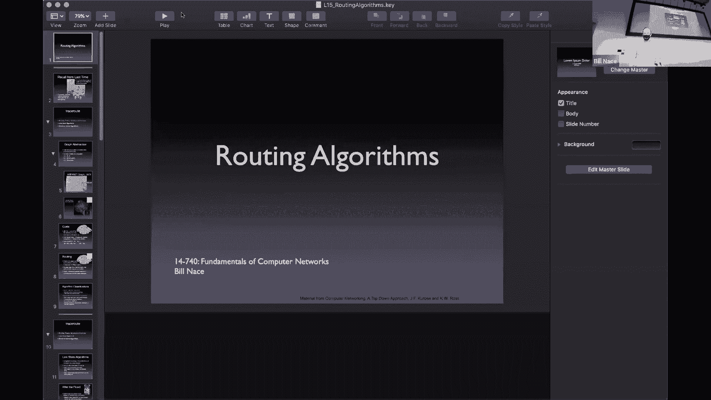

 Computer networking and also part of the funnest。 So let's。 Get my。 Sharing working。

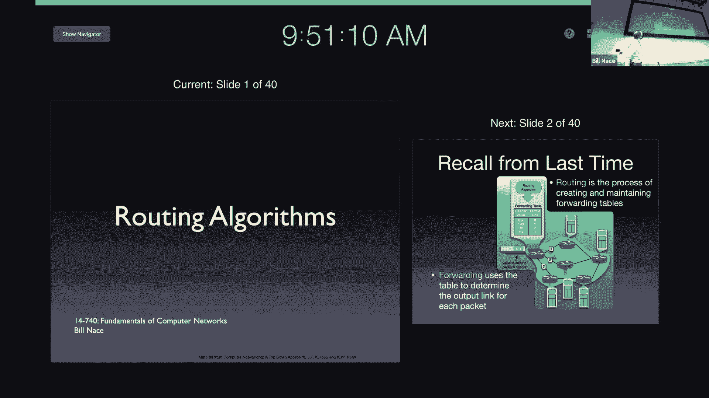

 And let's dig in to the routing algorithms。 I showed you this picture last time to point out that there were two main things that were going on in the network layer。

 There is the forwarding that happens on a packet by packet basis。 A packet comes into a router。

 The router looks at some information and address perhaps in the packet header and then makes a decision based upon a forwarding table of which direction to send that。

 Okay， and that。 That decision that the data that drives that decision comes from a different process。

 It comes from a routing process。 And so today we're going to look at that routing process。

 One of the things to recognize we in fact in this class have used the analogy several times about using it sending data across the internet kind of like the mail service right we did the envelopes in the demo way back when。

 One thing that that we really should drive home here that I hope you understand is that the the way that the routers work to get your information to you is not like the mail service。

 Right， the mail service is very static and it kind of collects all of the mail at the sorting centers that kind of look like routers。

 Right， but the decisions that they that made are made there based upon information about how the network was structured when it was built and that does not happen with our network layer。

 Right， the way we actually delivering the mail， the packets in the network layer。

 It's almost like the the mailman picks up the packet。

 then envelope from your house and carries it down to the corner of the street where there is another。

 Another male guy who and that guy has to figure out to look at the address on the letter and figure out which of the different roads to send the mail down。

 Okay， so it's a decision is made every step of the process so you know that first male guy was oh yeah good on you know main street here with that letter and then that letter would then get traveled down the street to the next street corner。

 where another person would look at that and， figure out where it would go。

 And the big question of course is how would those people get this information。

 That's the routing process how would the， the male guy standing at each corner no。 Oh， if you want。

 if this letter needs to get to Canada， it should go down this road instead of that road。

 And of course our network is even worse because， because we're constantly doing construction right we're constantly putting in new roads。

 And we're using the way the routers work we're making some roads be able to carry more traffic or less traffic。

 And so it's a much more dynamic environment than this analogy of envelopes and our street corners would suggest。

 The big question is how do we， how do the routers communicate how do they come up with the information that will let them put stuff in the forwarding table。

 That's a really interesting question and a very， very fun one to solve。

 So we're going to start off talking about routing theory a little bit understanding what our abstractions are。

 And then we're going to look at several different algorithms that are in two big categories that help us solve the routing problem。

 There are link state algorithms and distance vector algorithms。

 But first a little bit about the abstractions we're going to use。

 We're going to look at the network as if it was a graph in fact the algorithms we're talking about today are basic graph algorithms you may have seen some of them depending upon what other courses you've taken。

 because some of these are incredibly useful graph algorithms。

 And we happen to have a network that acts like a graph。 Right。

 well a graph as you probably know from your data structures class。 A graph is， well it's two sets。

 right， it's a set of vertexes and edges。 And those vertexes those two us are going to be our routers。

 Right， those are the things that connect stuff。 And then the edges are the links between them that allow information to travel from one particular router to another particular router。

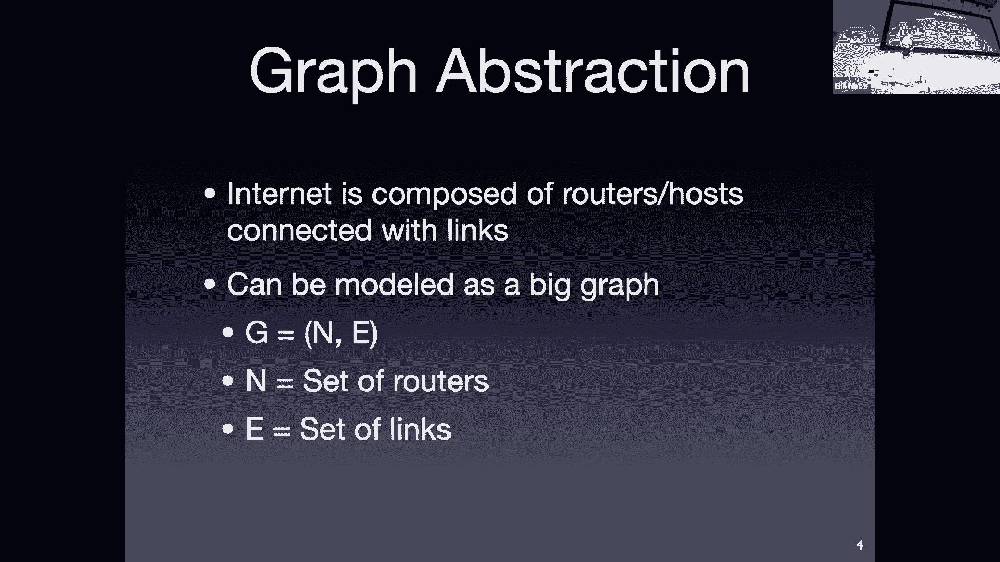

 And this， you know， this graph abstraction works really well here's a picture of what the network looked like in 1973 way back when this is early ARPANET days。

 And I mean fact by the way today is the anniversary of the first linkage in the ARPANET between UCLA and SRI and which happened many many years ago。

 I don't know。 1958 something in 59。 So here we are。 And look， you know。

 we're on the map right of course we are Carnegie Mellon was was where a lot of the， you know。

 a lot of the early network research happened as like we're seeing now with a lot of other interesting network research。

 And so you see here， this is a graph。 So it has vertices those little circles。

 And I guess actually the squares are the vertexes。

 The imps and the tips those were the machines that made the ARPANET work。

 And then there are links connecting them to show where there had been some， some。

 at least line usually that would allow information to travel from one to the other。

 Of course this graph has gotten a touch more complex。

 Here's a picture I like because of its nice beauty。

 And also because it's still a little on the comprehensible side。 This is from 2006。

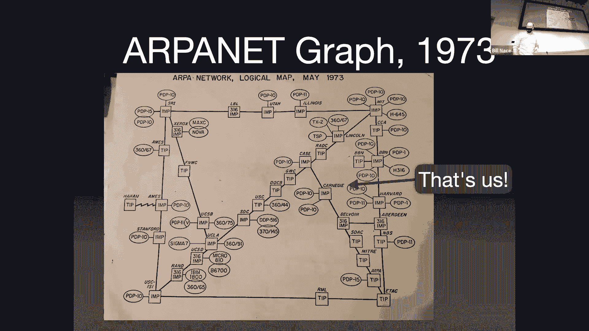

 Okay， and this one。 Well， it shows not quite down to the machine level right this graph actually showed all of the hosts on the network at the time。

 Right， that you look at Carnegie is as amp that's the message processing unit that connected us the gateway that connected us but then next to it there's a PDP 10 and a PDP 10。

 Those are the actual computers that were on the network。 Those are the host machines。

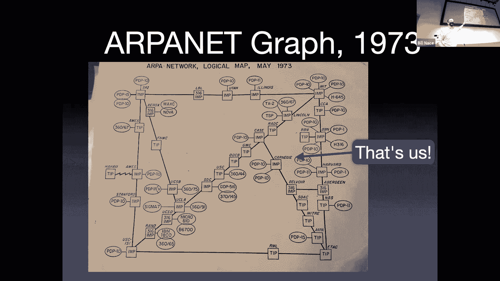

 This isn't quite down to the host machine level。 It's more of the subnet level。 Okay。

 and you'll see of course the graph has gotten a lot more interesting。

 Now I'm not going to show you one from today。 Right。 This is 14 years ago。

 Obviously the network has gotten more complex。 There's been more hosts added to it since then。

 I haven't been able to find one that has any sense of beauty and proportion to it。

 Although there are interesting projects out there trying to have network visualization as as a mechanism。

 My point is our network is a graph。 And so we're going to have to run some algorithms on this graph。

 The algorithms are going to be driven。

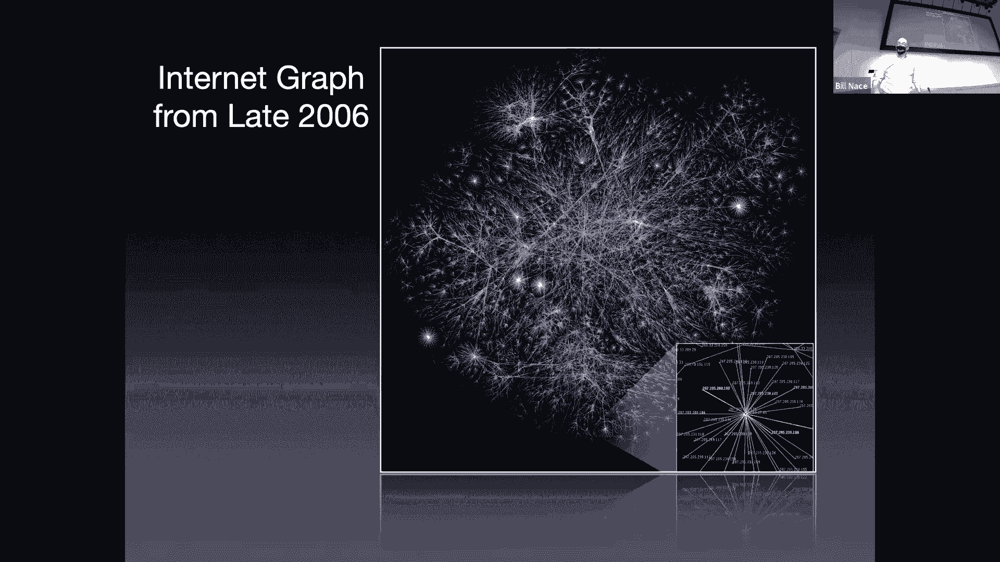

 By the connectivity， the edges that exist， but also by the sense of whether we like a particular connection or not。

 How good that is。 And we're going to abstract this into a cost。

 The goodness of a link may have something to do with the latency or the bandwidth or the cost the actual dollars you use to run it or whatever。

 We're not going to worry about exactly what that is。 Instead。

 we're going to say there is some cost between two of the vertexes in my graph。

 And we're going to say that that is C。 We'll be able to say there's a cost for a particular link。

 So I'm using C w， comma z， meaning between router w and router z。 There is this particular cost。

 And I'm showing it in the graph， you see the little purple。

 you will purple numbers there that specify the actual cost of each particular link。

 And so you could find w which is in the upper right corner and z which is in the very far right。

 And you'll notice there's a line between with a five one of the sets the cost。

 You'll also notice that we specify that there is a cost for everything。

 even if a link doesn't actually exist。 And the way we manage that is we just say that there is a link with an infinite cost。

 So for instance， between x which is in the lower left and z which is on the far right。

 there is no line on my graph。 And so I'm going to represent that as an infinite amount of costs we don't actually use that right it's not really a link。

 And so you would have to pay an infinite amount of money and I don't know about you。

 My paycheck will not allow me to use anything that costs an infinite amount。 Right， again。

 whatever that cost is that's a pure abstraction。 I should point out also that we're going to want to send our packets from router to router that often are larger distances。

 And so it makes sense I'm going to have a path that is constructed about with a bunch of links。

 as that path goes from router to router to router。

 And the cost of that path is just going to be the sum of the cost of all the links we use。

 So the routing question， once I have my graph once I have my costs。

 the routing question comes down to， I have some data at some point in the graph and I'd like to get it to some other point in the graph。

 And I'd like it to be the least cost path。 And we can look at a graph like this we'd say。

 oh that's probably not that big a deal， but even on a graph like this of the scale。

 right with six routers， with， you know， less than a dozen routes。

 It turns out there are 17 different paths between you and Z between the left and the right of my graph。

 And that's perhaps a surprising number， and it gives us a hint as to how complex this problem is。

 because this graph is certainly much much simpler even than the 1973 ARPANET graph。

 And so making these routing decisions clearly are not going to be something we're going to be able to just kind of wing。

 We're going to have to have some nice algorithms that handle it。

 So I need to have an algorithm that will find this least cost path。

 And actually what we want is we want to know， well what's the least cost path between some particular router because we're going to run this algorithm at a router。

 In fact， all of the routers there so let's imagine you're on router w， you would run this algorithm。

 And what you want is to know your least cost path from you。

 So you need to be careful from the router called w to every other router。

 So the end and actually what we don't even need that we really don't care about what the cost is。

 We just want to know what the first step in that path would be。

 If I met router w and I'm trying to figure out how did I get mail。

 How do I get a message to router u。 Okay， I would like it to travel along the least cost path。

 But really all I need to know is what goes in my forwarding table of which link leaving my router is on that least cost path。

 So we're going to run an algorithm that will come up with this least cost path and then we're going to throw away most of the information and keep just the next step in that particular particular route。

 Now， as I mentioned before we have several different kinds of algorithms。

 We're going to talk about two of them today there are many， many。

 you can imagine there have been a lot of grad students in CS chomping on routing on graph algorithms for a long time。

 We're going to talk about two broad classifications of those。

 One of them is called link state algorithms and those work on global information。

 The idea is that if you give me this graph。 If I know all of the costs and all of the edges and all of the routers involved。

 So if I have global information， then I can run this algorithm。

 a link state algorithm to come up with the least cost path。 Okay。

 And presumably every other router in the entire network would also have access to the same information the same graph。

 the same costs。 And so those other routers running their。

 their link state algorithm would come up with the same answer I have。

 which is going to be good we need a consistent view。

 We don't want different routers coming up with different ideas because that leads to routing loops and inefficient route。

 Global information， I don't know about you， my computer science。

 Spidey sense goes off when I went about that night， I asked myself how efficient that's going to be。

 And so there are other algorithms as well， there are distributed algorithms or decentralized algorithms。

 We call these distance vector algorithms。 And the idea with them is they don't actually need global knowledge。

 they just start with the knowledge of what they have around them。 They know， Oh， I am a router。

 and I have these 96 links and they have these costs。

 And then what each router does is it trades this information with its neighbors。

 It sends a message down each of those wires to its neighbor， saying， Oh。

 I have these costs to my neighbors。 I know what the cost is to get to each of them and this is basically a long list。

 If I start up with a router that has 96 wires coming into it。

 I'm going to start with a list of 96 different neighbors that I can get to and their costs。

 And I will send that list。 Let's go back into computer science line。

 let's call it a vector instead of a list。 And I'm going to send that vector to each of my neighbors and say these are the distances。

 the costs to get to each of my destinations。 And by trading this information back and forth。

 I send it to my neighbors。 Those neighbors take this information and incorporate it into what they know。

 Because now they have information about what it would cost to get to some locations that are two hops away from them。

 Going through this original router。 And so they get more information。

 And so they have a longer list of a bigger vector。

 And then they trade that with their neighbors and their neighbors learn about stuff that is three hops away。

 And then they pass that on to their neighbors and learn about things that are four hops away and that trading back and forth of this information of these vectors of distances。

 These these eventually lead to all of the information we have。

 If enough of the routers trade enough of the information enough times。

 They will all the routers will eventually know what the distance vector should be with the least cost path is to get or I'm sorry what the least cost is not they won't actually know the path will know the least cost and they'll know the next step。

 Who to send it to for every location in the entire network。 Okay。

 so that's a much more distributed algorithm that does not require any global knowledge。

 But turns out to have its own issues as well。 So let's take a look at each of these will start with the length state algorithms。

 So we need to。 Edrich。 So。 I'm going to say。 You know， the clocky。 The software。 And then。

 Different。 You sent out。 Yes， in fact， next lesson。 We're going to learn。

 So today we're going to talk about the theory and learn about these particular algorithms。

 Next lesson we're going to discover that the actual network。

 the actual internet uses a combination uses multiple algorithms to get this information around。

 And the reason I'm showing you both is because it's very common to have the link state algorithms used at a local level。

 right， like maybe CMU runs a link state algorithm over all its routers。

 And then the internet as a whole uses a distance vector algorithm or a。

 A version of a distance vector algorithm to actually get information from network to network。 Okay。

 so let's take a look at this link state algorithm。

 I mentioned earlier that the link state algorithm needs global knowledge。 Right。

 so all the routers are going to have to have all the information about。

 What other routers exist and what links there are and what the costs of those links are。

 And the way this information is learned is through a flooding process。 We talked about flooding。

 When we talked about peer to peer networks。 We said this mechanism of like let's。

 Do query flooding to talk to our neighbors about questions we have。

 We're doing kind of the same thing here。 What we will do is we will start off the algorithm by passing the information we have to all of our neighbors will pass that information to all of their neighbors。

 And at some point after this flood。 We will have have discovered what's going on about our network right we're going to start off by saying let me send the information I have。

 Which when a router starts up is very little right a router when it starts up only knows the connections it has to neighbors and what the costs of those connections are which。

 Basically those are things that are programmed into it by whoever's running that particular router。

 So that information is passed on to router to router to router until at some point everybody's got all the information。

 And so that means after the flood is over。 Each router then has the graph。

 And so this is kind of where the link state algorithm starts is with with the graph once I have the graph that shows all of the routers and all of the costs between them。

 Then we run a link state algorithm。 And it's a deterministic algorithm。

 And so that's important because we want to make sure that all of the routers who will all have the same information from this flooding process。

 They all will run the same algorithm they all will run come up with the same answers as to what the least cost that's。

 In a sense it's so the question is is the this flooding that's going on is this like the decentralized thing and in a sense it is right you're going to start off passing information to neighbors or go to pass it to neighbors。

 The difference is the distance vector algorithms actually continue to do that。 And。

 and don't wait until the end of a flood so in some sense we need to know， oh， we flooded we've got。

 you know， at x point in time we know we have all the information now let me run the algorithm。

 The distance vector is kind of constantly running based on this information is coming in you can imagine that you know the router when it starts up with only its local knowledge it doesn't say let me wait a while until I build my boarding table。

 It just builds its boarding table from what it's got。 And， and deals with what it has and so the。

 And we'll see some other differences as we understand the distance vector algorithms as well。

 There are many graph algorithms to solve this problem。 Many。

 There are the most famous is Dijkstra's algorithm。

 And so that's what we're going to learn today it's a fairly simple approach to this it's a fairly optimal version for many。

 versions of the world word optimal。 So it's the one that will pick up here and that many of our algorithms are based on。

 So this is a Dijkstra he was a Dutch computer scientist did a lot of really great stuff in concurrency in distributed systems。

 But this is the algorithm he's known for， which apparently which isn't that complicated。

 But you know it's one of those when you get there early if you're the early guys in the field then you get your algorithms named after you right。

 Newton's laws aren't all that complicated you guys would have picked them up if you happen to have been there in 1600s。

 So Dijkstra is wondering how do we figure out this this least cost path in a graph。

 And it comes up with what's known as an iterative algorithm right he's going to go on the loop through this several times。

 And at each step we're going to add complete knowledge about a route to one of our neighbors。

 I'm sorry to one of the other routers in the network so we're going to start off at step zero not knowing the least cost path anywhere。

 And then we're going to take a step learn the least cost path to one router and we'll take another step learning the least cost path to another router。

 And we'll just continue this until we know the least cost path to every router。

 In the in this algorithm we're going to use well we've got costs right we've talked about this cost idea before and so we're going to use that same notation。

 We're going to， as we run this algorithm we're going to be making guesses or estimates to what the actual distance is from the current look from a location to you know some particular router。

 Right， that may not be the actual costs it's an estimate。

 And so we're going to call that D it's the current value the current cost we know so far of how how what it would cost to get to a particular destination we may discover a shortcut in some coming iteration though。

 We're going to keep track of the predecessor。 So we're going to。

 for each step want to know okay I now know the least cost path to this particular node to this particular router。

 What's the step before that just tell me which router that would have to go through to get there。

 Okay， and we'll discover that if I know that that this is actually what I'm looking for if I know the predecessor nodes。

 then I can build an actual understanding of what the actual path would be to get to。 You know。

 once I'm done if I have this predecessor information about every router。

 And then if I want to know how do I get to that router over there well what's what's the predecessor。

 The predecessor is the router one shorter。 And then I'd ask well how do I get to him well I mean look at his predecessor and you just work the predecessor notes back until you have the whole path。

 So to weigh it's a notation away of keeping track of what the actual path will be。

 And we're going to start off with this set of nodes in prime。

 We need to complicate things with primes but that's commonly done。

 This is the set that we're going to start off。 And beginning not knowing the least cost path anywhere。

 And we're going to every iteration add a new router to this set。

 And eventually this set will be full of everybody。

 And that's how we'll know we're done because everybody。 Everybody's least cost path is known。

 The algorithm itself。 Well there's an initialization step。 Okay。

 so where we get our data structure set up properly。

 And then we have this iterative loop that we run around for each of the of the routers we're dealing with so we're going to start off with。

 Well， that n step set， right， that's the set of all of the routers to whom we know the least cost path。

 Actually， when we start up we know the least cost path to one router， and that is ourself。

 And so we're going to put ourself into that set and so I'm calling ourselves you can put you into the set。

 Okay。 And all the other sets。 Well， I don't know， no， I'm sorry for all the other routers。

 I don't know a whole lot of information about most of them。

 I do know information about my neighbors。 So my neighbor routers。

 I'm going to go ahead and note that their estimate of the least cost path to get to them is the cost。

 it would take just for me to send something straight to my neighbor。

 So I'm directly connected to a neighbor。 I know what that cost is。 That is at least a good start。

 That's my estimate of for that particular neighbor。

 Everybody else I don't know so everybody else gets an estimate of them of infinite amount。

 And so that's just kind of initialization setting stuff up。

 We're then going to go around the inner loop and each time around the loop。

 we're going to add one router to this set， because we will have discovered the least cost path to that particular router。

 So how do we choose which router we're going to go with？ Well。

 we're going to find some router that's not already in the set。 So I don't already know about them。

 And it's going to be the one whose cost is the least。 Think about this。

 If I have estimates for how to get to a bunch of places。

 And the reason an estimate may change is that I would find a cheaper way。 All right， well。

 the only way to find a cheaper way is to go to some other router and then be able to go from that router to this router。

 If I'm choosing the one whose estimate is the smallest。

 then there's no way to go to some other router。 And from that router to this router with a smaller cost。

 because the cost to go that other router would have been more than this one。

 So each step we're going to take the minimum cost router that's not already in my set。

 And I'm going to go ahead and say， okay， this is the one。 I've now discovered the cheapest cost。

 the least cost to get to that particular router。 Let's throw them into the set。

 We know we now know that that is the least cost path。 It's no longer an estimate。

 It's an actual cost to get to them。 And then we're going to update all the neighbors of that guy。

 We're going to look at everybody that that particular router is connected to。

 some of whom we know about， some of whom we don't know about。

 some of whom will already be in our set。 Okay， well。

 if the neighbor of that guy is already in our set， we can't improve on the number we have。 Okay。

 but we're going to look at all his neighbors and say， okay。

 the cost to get to that neighbor through this guy would be the cost to get to this particular router。

 which is now the least cost path。 Plus whatever the cost is to get from that router to to a neighbor。

 And that may be new information， right？ Oh， look， I now know how to get to this。

 this router I didn't know how to get to before。 And I know how the cost should be。

 I should send it to this person and then their costs to get to that person。 Or to that router。 Okay。

 So， it's possible that I already know about this router。

 And the cost to get to this particular neighbor through this， this。

 this w this new router that I now know the real cost to。

 could be more or less from the estimate already have depending upon the costs that are involved。

 If it turns out to be cheaper， we're going to update the estimate for that particular neighbor。

 Okay， and so I'm going to go ahead and say the estimate to that neighbor of w is going to be either the estimate I already have。

 If it's small enough， or it's going to be the cost to get to the w the one we just figured out plus its cost for its particular link。

 which should make sense， right。 And then we'll just continue this around。 Go。

 go find the next router with that I is not in my set that has the minimum cost。

 So Jeremy's wondering what about data structures。 Yeah， priority cues or。

 or men cost hashes or the things that are going to pop to mind because those are the ways we're going to be finding the least cost thing of a bunch。

 And so putting them in a man heap is probably your best bet。 All right， so just an example。

 make sure we understand this let's imagine that we are running on this example graph with our simple six little router set up。

 Okay， let's imagine we're running it at the far left at router you。 Okay。

 and so how would you run Dijkstra's algorithm on this particular graph。 Well。

 you would start off with itself in the set。 And then prime is the set it has you in it。

 And you knows about the estimates to get to each of its neighbors。 Right。

 so you'll see you is connected to W over the top it's connected to V it's connected to X。

 And so it notes those costs as the estimates it doesn't know that that's the cheapest way to get there。

 That's the best it can do at this point though。 And then we don't know how to get to why we don't know how to get the disease so those costs would be infinite。

 Okay， and then we， this is the initialization。 Now let's run the loop right。

 And so the first step of the loop is which is the minimum cost。

 So we're going to look at these and say， okay， of two， five， one， infinity and infinity。

 which is the least number。 And then turns out to be the least number。 Right。

 and so we're going to pick X， we're going to say okay。

 previously I had estimated that my cost to get to X was one。 And now I know that it actually is one。

 There's no other way that I'm going to discover that would get me there any cheaper。 Right。

 so therefore X goes in my set。 It is known。 I， it's part of the group that we actually know the main cost to。

 Okay， and then let's look at X's neighbors， X is connected to VW and why。

 And for each of those I'm going to say， is my estimate that I had the best or should I update it。

 And then the reason why I had previously estimated that I could get there at a cost to infinity。

 I now know about why and I know a path there， I can go through X and pay one more to get to why for a total of two。

 Okay， so now I can actually make an estimate for what it would cost to get to why。

 Let's see other neighbors， W， right， well， W is a cost of three away from acts。

 One to get to X plus three is four。 Okay， four beats the previous five。

 So I'm going to update my estimate and say， Oh， I can get to W and four。

 And notice I now I'm changing the predecessor node。 Right， if I get to W at a cost of four。

 I will have gone through acts to do it。 Okay， because that's who we're dealing with right now。

 So I have to update the predecessor node to acts。 I'm getting to be。

 I have an estimate of two X could get to be， but that would have been one to get to X plus two to get to be for total of three。

 That's not better than I used to have so let's just keep the estimate of two。 All right。

 we're done with that duration next iteration。 Choose the smallest number。 Two， two。

 four and infinity。 Okay， which do I choose？ Well， I can choose either of the twos。 Okay。

 I'm tied at this point。 It turns out not to matter which one I choose。 Okay， yes。

 What I'm basically saying is I can get to both of those in two。

 There's no way that my new information is going to change the estimate for the other one。 Okay。

 so I'm safe picking whichever one I want。 And so I'm going to pick Y in this case。

 plus two going through X。 And so I'll add Y to the set。 Okay。

 and now I'll look through Y as neighbors。 Why is connected to W and to Z and I get new information。

 Look， I can get to Z。 Well， my class to get to Y is two。 Notice that's in my data structure。

 I know that。 D Y is two。 Okay， plus get to Y is two， plus two to get to Z total of four。 Okay。

 and if I do that， I go through why。 Oh， look at this。 Why has a new way to get to W。 Right。

 And so we're actually going to update for the second time， our knowledge of how to get to W。

 We found yet another shortcut to W。 Okay， I used to know， class to four。 Now I can go to Y for two。

 plus one to get to Y for total of three。 Let me update my D Y。 I'm sorry my D W to make it a three。

 And keep track of the fact that to get there， I have to go through through why。 All right。

 that that iteration is done。 Next iteration。 I've choice of two， three， and four。

 Let's choose the two。 Right。 So V gets included in my set。 Who are these neighbors？ These neighbor。

 I'm sorry。 Who are these neighbors who are not already in the set？ All right。

 so these neighbors who are not in the set already is W。

 Turns out getting to be at the cost of two plus three to W is no better。

 So we don't actually change any of our estimates。 Three to four。

 I choose the three W goes into the set。 Okay， I update my knowledge。 Well， W's neighbor is Z。

 but it doesn't really help three to get to W plus five is eight。 But that's no better than the root。

 I already know about four through one。 And finally， I can choose this least of four。

 So I choose that。 Right。 Let's put Z into the set。 And now we're done。 Okay。

 That's Dijkstra's algorithm。 Well， that's the running of Dijkstra's algorithm。 Right。

 Now I have a bunch of data。 What do I do with this data？

 How do I use this in actual operation for my route？ Well， what Dijkstra says。

 let me do is build what's known as a shortest path tree。 So I took a graph。

 what's the difference between a graph and a tree？ Yeah。

 I'm glad to see several people in the small audience。 I have here immediately did this right。

 Graphs can have cycles in them and trees can't。 Right。 So trees are acyclic。 Right。

 And so what we're doing is we're building a shortest path tree。

 We're building a tree out of that graph。 We're basically taking particular links。

 Particular edges and removing them from the graph until we're left with a tree and not just any tree。

 It's the tree of the least cost path to each of the beliefs in the trade。 Okay。

 And so these are kind of cool。 In fact， I found one here， you know， the saying， all leads。

 all roads lead to Rome。 I don't think it's true anymore， but it one day it used to be。

 And this is a shortest path tree for Europe。 Right。

 If you can kind of see the outlines of Europe in there。 If you were in Rome。

 And wanted to know how to get to any place in Europe。 Right。 Oh， I'm going to go on vacation。

 I'm going to go to you throw a dart at that map。 So I want to go there。 Oh。

 I'm going to go to Warsaw。 How do I go to Warsaw？ Okay。 Well， this is the road。

 If you follow the links on the shortest path tree， you'll get to Warsaw at the least cost。 That's。

 that's what we've done。 I built a shortest path tree out of this knowledge。

 What's that look like for our graph？ Well， all I did was I said， okay。

 for each of the nodes in my graph。 The predecessor。

 the link to the predecessor node is the link that has to remain。 Okay， so from my data。

 I knew that the predecessor of Z was why。 And so that link has to remain。 Okay， from W。

 the predecessor was why that link has to remain。 The other links disappear。

 They're not part of the shortest paths。 These are the shortest paths。 Okay。

 so Dijkstra's let's us build this shortest path tree。 Okay。

 and if we follow the predecessor nodes back far enough we actually don't need to build the tree。

 What I do is I say， well， how do I get a packet to Z？ Oh， I send it to Y。 How do I get it to Y？ Oh。

 I send that to X。 Using the predecessor links。 How do I get it to X？ Oh， that's my link。

 So therefore， if I'm going to send to Z， I actually need to set X as the output destination in my forwarding table。

 And so the data that's actually in my forwarding table is that table there that says， Oh。

 if I want to get to Z， I send it to X。 Fairly straightforward。 Not too bad。 Yeah。

 I'm going to share them。 Right。 What's the complexity？

 I like Jeremy's question about like what data structure is that leads to what the computational complexity of this and how to manage it properly。

 So if I have a graph with some number of nodes in it。

 I'm going to be going around this loop and times。 Every time around the loop。

 I'm picking one of the N nodes and putting it into the set。 Okay。 Now the problem is in the。

 in the actual operation of each loop， I actually have to find the minimum。 And if we do that poorly。

 we will look at all of the nodes that are there。 Okay。 So this could be an N squared thing。

 And for each time around the loop and N for looking for the minimum。

 And what I mentioned earlier using a heap though is a more efficient way of finding the minimum that's a log N operation。

 So I end up with an overall。 Overall competition complexity of N log N。 Not bad。

 We should keep in mind though that N is a really big number for our internet。 Sorry。

 I'm paying it all attention with the chat is this obvious question。 Yeah， Robbie here， you are。

 you've gotten to the core of this Robbie is asking with Dijkstra's。

 I just ran all that information what happens if there's a change。 What do I do？ Well。

 in with Dijkstra's information。 Every time there is a change to the network。

 you have to rerun Dijkstra's。 Okay。 And that's one of the challenges we'll talk about next time is that。

 you know， doing something and log N isn't bad。 But if N is really huge， let's say like 800。

000 routers in the world。 Okay。 Then that takes a while。

 And it probably takes longer than as Robbie's pointing out。 We get new information。

 So we're going to have to do something different。 Yeah。 And so Dijkstra's is nice。 Not all that。

 Doesn't handle change while a little fragile。 The next big category of algorithms is distance vector algorithms。

 So distance vector algorithms solve the exact same problem just in a slightly different way。

 And they do it by managing the information differently。 And with the Dijkstra's algorithm。

 we're going to be doing this， this flooding of some sort to get the global information around to all of the routers。

 And then we run the algorithm。 With distance vector algorithms。

 we're going to be passing information from neighbor to neighbor through exchanges of routing messages。

 And that's how the information flows。 And a distance vector algorithm finds a way to update each of the routers as that information comes in。

 And so you're doing step by step more iterative than more than Dijkstra's。

 which is get all this information and then run an algorithm。

 And then we're going to be sending information about the about what it knows in terms of routing。

 And so it will tell me for each of the destinations it knows about what its cost is to get to that destination。

 We call this the distance vector。 It's a list of all of the locations it knows how to get to。

 And I can use and each route when it receives this information can update its own knowledge about how to get to places based upon that and knowing the cost between it and the neighbor who passed them this information。

 And so it's an iterative algorithm。 Anytime there's a change。

 then a neighbor is going to send information to all its neighbors。

 So a particular router can experience a change in its distance vector in the knowledge it has。

 It can experience that change a couple ways。 One is this admin logs in and says， Oh。

 this link is no longer has cost to 10 has a cost of five。 Okay。

 well that's a change that that router has seen that will change its understanding about the costs in the network。

 And so it will then use that information to update its neighbors。 Okay。

 it's its distance vector will change and so it'll tell neighbors， Oh， got new information。

 That new information also is a change that would trigger an iteration。 Okay。

 because the neighbor gets this and says， Oh， I now know cheaper ways to get places。

 So I now I'm going to change what I know about how to get places and I'll tell my neighbors about it。

 And that distribution of knowledge makes it a nice decentralized distributed algorithm。

 Each router is not waiting around for global knowledge to show up instead you're just as you get new information you're working on it。

 I'm passing it around。 And so you end up with this idea that if the network were magically stable and no changes were happening。

 All right， so let's imagine we turned off all the routers。

 Because all the routers in the world needed to install IP version six who knows why we turn off all the routers right and rebooted them at the same time。

 Okay， they would start off only knowing the information about the links that are local to them。

 Which they would pass to the neighbors their neighbors would pass， you know。

 incorporate that pass that to their neighbors。 And after each router has gone around this。

 this loop enough times information would have been distributed at about one hop per per iteration。

 And if all the routers were doing these iterations at the same time you'd see like whatever the diameter of our network is after that many cycles。

 Everybody would come to convergence everybody would have all the information about the network。

 Piled into their own distance vectors， and then there would be no changes after that。

 Unfortunately our network is not， I guess， fortunately our network is not that stable。

 Things are constantly changing。 And so this is， I think。

 more of a theoretical idea that you would ever get to convergence。

 Because by the time you've gone around these little some other router somewhere has crashed or some other router somewhere has been upgraded。

 But this is the way the algorithm works to handle this。 Now。

 I've said a couple times we need to get this information from our neighbors and incorporate it into our own knowledge。

 To the router's own knowledge about distances and build its own distance vector。

 And that incorporation is done using what's known as the Bellman-Hort equations。

 Two very famous computer scientists who simultaneously came up with this also seemingly very simple idea。

 And that is that if I have a cost， at least cost path from x to y。 Well。

 that cost can be computed by this equation which says the cost from x to y is going to be。

 if I look at all my neighbors。 The minimum of the cost to get to that neighbor， right。

 the cost from x to some neighbor v plus the neighbors cost to get to the destination y。

 So if I'm connected to 96 different other routers。 And I knew， you know， I basically。

 I know the cost to get to each of those routers， so I know the cost of each of those lengths。

 I would basically just go through each of the 96 and say， well， what's that guy， you know。

 link number zero。 Right， what's his cost to get to my destination。

 And I add in the cost to get to him。 Okay， and I do that 96 times。 I take the smallest number。

 Right， and that tells me what my cost would be to get to that destination。

 It also tells me which neighbor I would actually do the routing for it。

 Which neighbor goes into the forwarding table to send that packet to。 Okay。 So simple example。

 right。 We look at the router on the left， we look at you。 And we say， okay。

 I know the cost to get to my neighbors。 Right， so distance from。 I'm sorry。

 we're all targeting Z right so I want to know what's the cost to get from you to Z from the left to the right of my graph。

 I ask each of my neighbors what their cost is to get to。 To see。 And then I add in my cost， right。

 so I have a minimum there in big brackets。 Right， minimum of my cost from you to V plus these costs to the destination。

 Or the cost from you to X plus X， X is cost。 I'm going to do all those right， I end up with。

 To get to V plus five from V to Z one to get to X plus three from X， etc。

 And the minimum of those turns out to be four。 And that four comes from using X。

 So X goes in our forwarding table。 And we now know what our distance is to Z。

 we would then go ahead and tell our neighbors about that。 Basically tell our say hey neighbors。

 I can get to Z at a cost of four。 Okay， so each node， each。

 each router is going to tell its distance vector to its neighbors。

 Whenever that information comes in， we're going to incorporate that using the moment for equations。

 We're going to go ahead and say okay I just got a message from my neighboring router who told me this vector。

 Let me go ahead and use that vector plus my costs to that particular router to see if that changes any of the distances I have。

 And if it does， then I'm going to pass this on to my neighbors。 Okay。

 let's work through the example。 To make sure we understand this one。

 Now distance vector and examples around distance vector require a lot more arithmetic and bookkeeping。

 Okay， so we're doing that much math for every number we come up with。 Okay。

 so we have to be a little bit more careful about that。

 One of the other things that we're making an assumption on。

 It's actually a very big assumption that is in general not going to be true。

 And that is that everybody kind of does things at the same time scale。

 So we're going to talk about this as if we had， you know， here we are at time zero。

 Here's the knowledge that happens and then at time one。

 What would have happened by then everybody would have changed all information with everybody else。

 Okay， and everybody would be updating at the same time that of course doesn't actually happen in reality。

 Right， they just， you know， some some routers take longer to calculate another some messages take longer to get there。

 But we're going to assume that we have these these rounds we're going through where everybody updates everybody else。

 Okay。 All right， so here's what would happen at the beginning。 Right， basically every router。 So。

 you know， pick a router router X has this distance vector。 Which basically says， hey。

 I can get to you in one， I can get to V in two， I can get to W and three。 Right。

 those are the costs of the links to its neighbors。 Okay， I can get to myself in zero。

 I don't know how to get to Z right Z is infinite。 Okay， so and every router， of course。

 has different distance vectors because they're different places in the graph。 Okay。

 so they have different neighbors that they're connected to。

 And so if I looked at every router at the beginning， that's what I would have。 Okay。

 so what would happen then， they would each send this message to all the other neighbors。 Okay。

 and then each neighbor would incorporate this so let's look at a particular case of that to make sure we understand the math that goes into updating one router。

 Okay， so let's imagine we're at node you。 Okay， and working at。 We have， we started out。

 so you started here。 Okay， everybody sent information to each other。 Right。

 so you is going to get these distance vectors it's going to get those copies of the things from its neighbors W X and W V and X。

 who are its neighbors。 And now it has to just do math。

 do Bellman Ford equations to figure out if its distance vector changes。 Okay。

 and so I picked that one particular value we're going to update we're going to update our estimate of the cost to get to W。

 From you。 Okay， and we basically say okay， for all of the routers or for all of the neighbors or for all of the information I have。

 All right， let's go through each of them so that what's my cost to get well from me to me is zero。

 Right， plus my costs to get to W because we're going to update the W value in our vector。

 what's my cost to get to W。 Well， I think I can get to W and five。 And I wish I had a nice。

 I guess I do have a nice way away point right I can get to W there's my number and five plus zero。

 Right， or my costs let's look at my next neighbor I'm going to look at V right well V can get there in three。

 Right， and I can get to V in two for a total of five。 Okay， let's look at my neighbor W。 Okay。

 how can how was it cost for W to get to W costs zero because he is W。 Right。

 and my cost to get to W is five。 Okay， or how about x x me into W and three。

 and my cost to get to x is one total four。 That turns out to be the minimum of these numbers。

 So let's go ahead and take that number four， put it into my distance vector I can now get to W and four。

 Okay， oh and by the way， I keep track I get I got to that by going through x。 Right。

 so x now goes into my actual forwarding table。 For when I'm sending anything to W。

 But there's my new distance vector， which I then pass off。 To all of my neighbors。

 And so after one of these exchanges， we're going to get a few things change right so we just did the calculation we saw that this five became a four。

 Right， it also turns out if you do the math， you know。

 shouldn't surprise you a couple of infinities become real numbers。 Okay。

 because there is a neighbor who is connected to that router who we didn't know about before。 Right。

 and so I get a scattering of of these pink boxes these are the ones that got updated。 Okay。

 what would happen Oh look， we have updates。 Right， every router here had a change。

 And so whenever they get a change they pass that new information off to their neighbors。

 So every one of them is going to go ahead and take this new vector and pass it off to their neighbors。

 Okay， so what do we get？ Well， there's a second exchange。 Okay。

 here's what happens after two something still change。 Okay。

 and in fact after three well finally after three we settle down。

 Nobody has any changes so no need to change to send anything anywhere else。

 This should not surprise you if you look at that graph。

 you would realize oh it's got a diameter three。 So by this point information is traveled from neighbor to neighbor to neighbor to neighbor。

 And so all the information in the graph has gotten everywhere in the graph。

 And so everybody has nice distance vectors。 Nobody needs to update。 However。

 some something happens some you know let's let's imagine， you know。

 the whoever's managing router number， while over here comes in and renegotiates this contract and gets a cost of one。

 Right， that would change wise cost to get to Z that would change that two to one。

 And so then they would go ahead and pass this off to neighbors。

 And if pink boxes showed up in other routers， then those neighbors would pass it to neighbors as well。

 Yeah， that's the dynamic stuff happening right as things change。

 The algorithm reacts to those changes。 So this kind of getting back to Robbie's question。

 Robbie was asking about the link state algorithm about Dijkstra's what happens to something changes。

 What happens if something changes in our network is the algorithm keeps going。 Right。

 with the with the distance vector algorithm， it's less like that there's a beginning in an end。

 It's more like the algorithm keeps going and just any change you see you go ahead and tell your neighbors about it。

 Okay。 Well， how does that happen？ Well， if something good happens。 If a cost goes down。

 we say that good news travels fast。 If a cost goes down， like we renegotiated that that contract。

 you know， the cost went from two to one。 We tell our neighbors about it。 Right。

 That now becomes a minimum point in that math that changes their distance vector algorithm。

 And so they tell neighbors about it。 Who tell neighbors about it。 Who tell neighbors about it。

 So usually a good news piece of information will travel the distance it needs to travel in the network at basically one hop per per round of the algorithm to get the information as fast as it can go。

 Yes， ma'am。 Yeah， so what happens if the cost increases instead of decreases that's still a change。

 Okay， one of the problems with these algorithms is that the bad news doesn't update as quickly。

 We say good news travels fast。 Bad news travels slowly。 Okay。

 if a link cost increases that's bad news。 Okay， what happens is you may take a haul to figure out what the right cost is it may take several back and forths。

 And during that time you may have created a routing loop。

 So they're actually forwarding packets back and forth to each other until it gets stable。

 It will eventually get stable。 Okay， ish for some。 You know， until some other bad news happens。

 right。 But it may take a while to settle out。 We call this the count to infinity problem。

 We don't actually count to infinity。 Okay， it's not quite that bad。 We still do some some counting。

 So let's imagine I have a very simple network here。 Okay， I'm thinking about why and see。

 Here over on the left， and their knowledge about how to get to x。 Okay。

 and so bad news is that for become 60。 Does any number greater than 10 this would would be a problem。

 So it's not that it's so big a number。 Okay， it's just that it increased a bunch。

 And so we have this this this problem going on。 Okay， the problem and and the problem is in what。

 Z and Y know about their cost to acts。 Okay， it's going to start off。

 Why thinking it to x and for z think he can get to x in five。 Okay。

 and when that change to 60 happens。 Why doesn't instantly say， oh。

 I should go through z for 11 and z say， oh， I can get there in 10。 Instead。

 they start passing back and forth bad information。

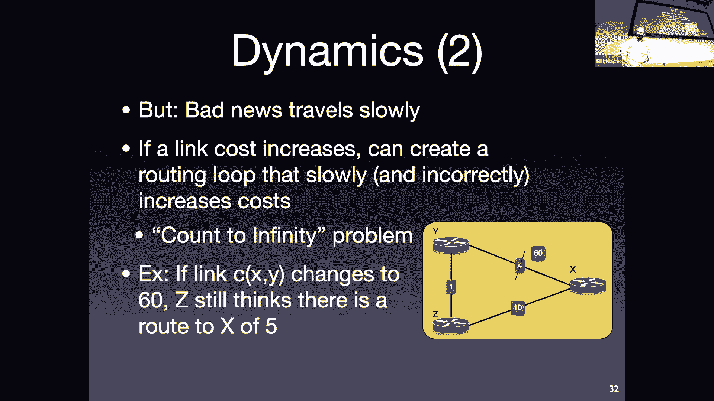

 Okay， and in fact， on the next slide， I've laid out all of the rounds we go through until we get to stability。

 So starting up here in the upper left hand corner。

 That's the picture I showed you from the previous slide。 Before there is a change。 Right。

 Basically why says he can get to x and for z says he can get to x and 10。 Okay。

 they use that information so that why says， huh， my cost is four versus 10 plus one 11。 I like four。

 Okay， and z says， oh， four plus one。 That's better than my cost of 10。 I'll pick the five。 Okay。

 make sense。 Right。 Then if I changed that that cost to 60。

 The problem is they both still have this old knowledge right x is four or five。

 And they use that knowledge so now on the next round they would trade that information right why says。

 oh， I can get there and for。 Okay， z says I can get there and five and they update that knowledge update what's going on with that knowledge。

 Okay， well， z。 You know， picks up the four plus one is five。 Right。

 I think I can get there and five。 Why。 Okay， it's still using the knowledge coming from z says five plus one that six。

 Instead of picking up this this 10 route is the only route there neither of these can get there in that that cost amount。

 Right， but they for this instant believe that。 Okay。

 they have changed their route so they will go ahead and pass information back and forth they will pass back the bad information from the previous slide the five and six。

 Right， which they then will add one to and see and who changes。 Z will change this time。 Right。

 z says， oh， I guess， I thought I could get there and five but actually it's going to take， you know。

 I now have a choice of going down the path for 10 or going through why。

 why says he can get there and six。 I'll add one for that and get seven。 Okay， they're in the middle。

 right， I then pass that seven back to why， who still believes he can get there in five， I'm sorry。

 six， right， so he's adds one to the 70 get to eight。 Notice they're counting up。

 They're passing bad information back and forth to each other， adding one。

 or adding their own count to it happens to have a cost of one。 Eventually， so this， you know。

 step by step by step eventually， X comes to a census and says， wait a minute。

 why says he can get there in 10 but I have a straight link there in 10。 10 is better than 11。

 I'll advertise the 10 going down the straight length。 And why will that add one to that to get 11。

 Because that's still better than the 60。 Okay， so they eventually stabilize。

 The problem is they go through many， many rounds to get there。 Okay。 Yeah。

 so if I remove a router that's also bad news， right， and so I can build cases like that。

 like this that are going to happen where， you know， so imagine。 Imagine X is， you know。

 five hops that way through this whole thing。 And instead of going to 60。

 the router that why was connected to just disappeared。 Okay。

 so that would be effectively the same case and we'd end up with the same kind of conversation about it。

 Yeah。 So I'm sorry， zoom。 The question was what happens to a router is removed instead of just a link cost gets bad。

 And， and the answer is that's still bad news。 Oh， so there's some questions about the timing of all this。

 right。 This looks like， you know， well， I took nine steps is that at the micro second scale of us sending some messages back and forth or is that over longer periods of time。

 Interesting。 Very interesting question。 We're going to get into some of the real world dynamics in a paper we read in a couple of lessons about this。

 The short answer is the algorithm just specifies， you know， when you learn something new。

 go ahead and tell your neighbors about it。 Okay， and so this could be as fast as， you know。

 ethernet frame， ethernet frame frame frame frame frame， you know。

 back to back and forth back and forth。 So it could be relatively quick to happen。

 The way many router manufacturers implement this is。

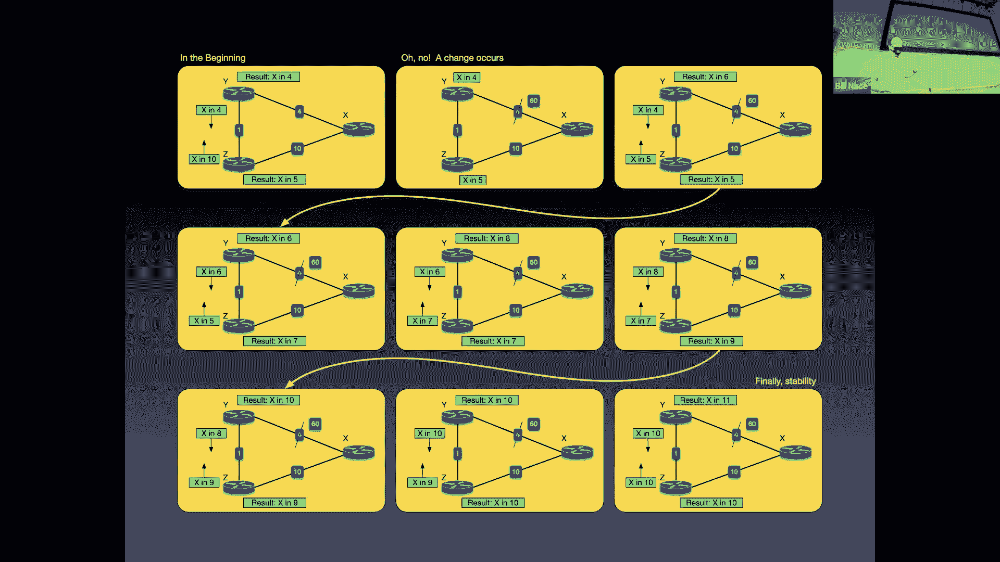

 Sorry， zoom， something is。 Going on with our。

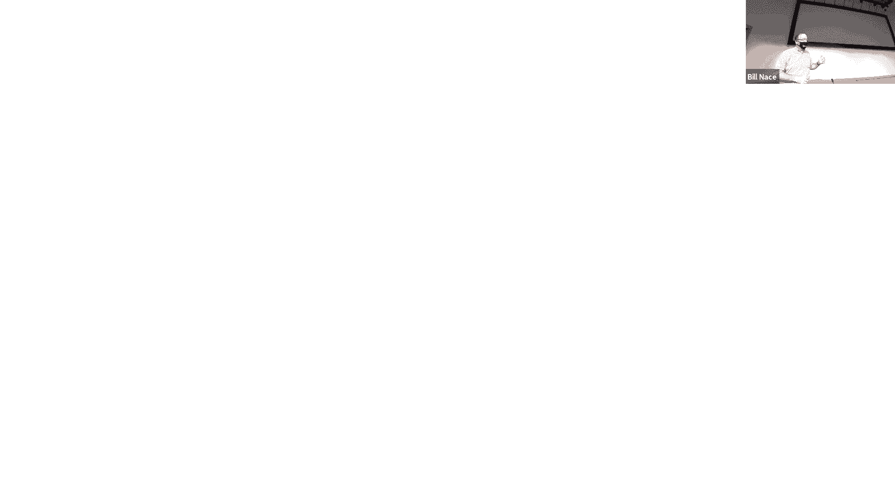

 Connection to our screen。 Okay， so this here。 Sorry， all of you out in zoom land。

 it's almost like I started to say something bad about a router manufacturer。

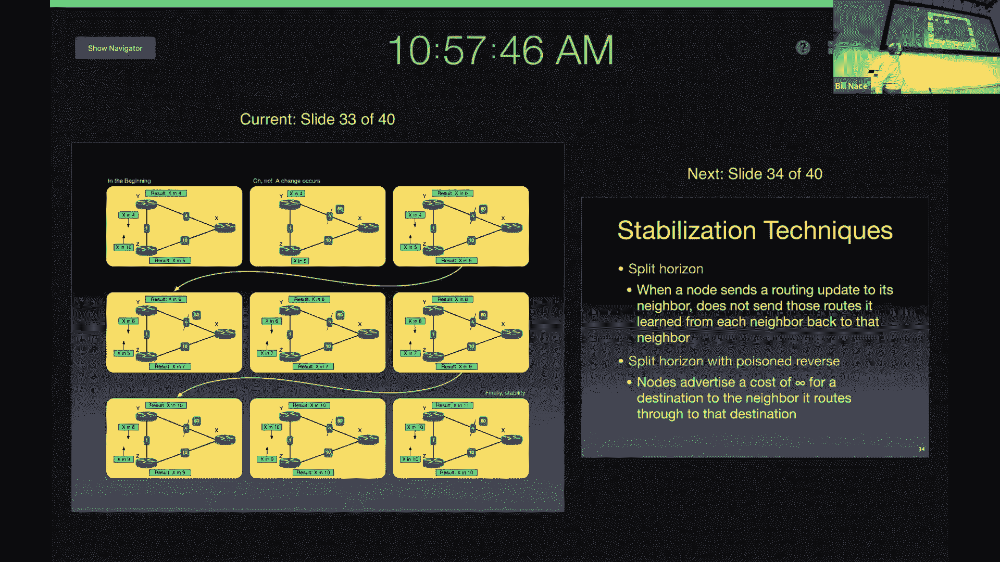

 So the actual implementation happens in the routers oftentimes， for instance。

 doesn't want to send messages too quickly when stuff happens and so they try to bundle it and try to to rate limited and things like that。

 So sometimes these will happen at 30 second intervals。 Right。 And so that could， you know。

 if that was happening in 30 seconds， that's a couple of minutes。 And during the time period。

 by the way， notice what's happening during the time period， if I'm in that screen in the middle。

 right， and some router， and some message comes into router z， headed for x， what happens to it。

 Where does it get forwarded？ Oh， it gets forwarded to why。 What happens at router， why。

 when why gets a packet going to X。 Oh， it gets forwarded to Z。 Okay， and so during this time period。

 we just created a routing loop there， where all traffic going to X will get passed back and forth between Y and Z for the entire period that this is happening。

 Okay， so the router manufacturers know that they don't want this to happen too often。

 They don't want this process to take too long。 Right。

 but they also don't want to spend all the routing resources sending messages back and forth to each other。

 When during the middle of this， what happens if that 60 was just a very temporary 60。 Right。

 And now it's back to four because some， some， you know。

 link just happened to go down for a microsecond and it's now back up。 Right。

 so it's a tough question of what's going on with this and what the， what the right answer for the。

 for the time period should be。 Okay。

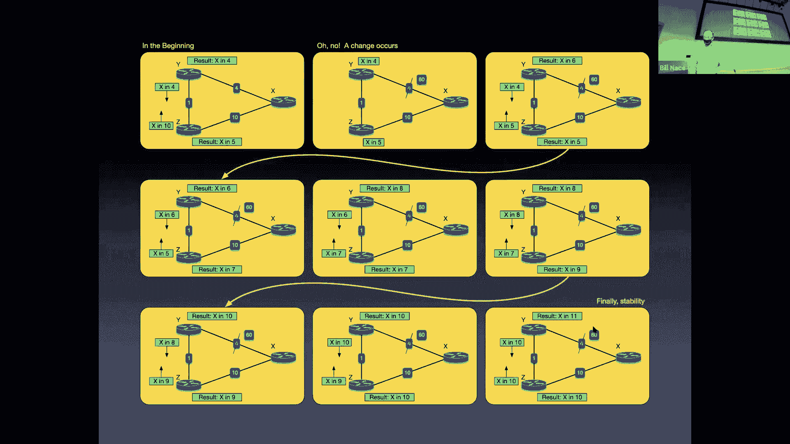

 So， and there are， by the way， a couple of things we can do to make this not take quite so long。

 So these are， we call them stabilization techniques。

 things you can do in the algorithm tweaks you can make to the algorithm that will help out this。

 community problem。 And they both deal with， well， what information do you pass to your neighbors。

 And so we call this split horizon or split horizon with poison reverse a split horizon just means that you keep track of who you're sending the information to。

 Okay， and any route that I learned from a neighbor。

 I'm not going to send that particular distance vector back to that neighbor。

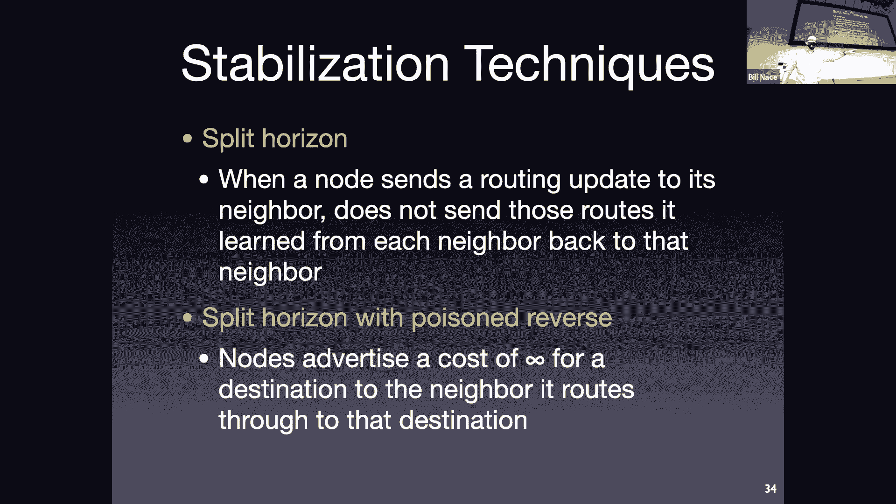

 Right， so the idea is， you know， in the previous slide， we had a Y and Z arguing back and forth。

 because they were passing information that was computed from stuff that they just gotten back to the source of that information。

 Okay， and so split horizon says well， why and Z just don't tell each other about what happens to X。

 Right， once you're on slide， whatever， you know， when some slide here。 Hey， I got that seven。 So。

 on the second middle row on the left， Z has a result。

 It knows it can get to X and five from the previous slide。 Okay。

 and it knows it computed that based on information from why。

 So it doesn't send the X and five message back to why。 Because why told them about that。 Okay。

 and a poison reverse actually tries to kill things faster。 You actually do send the message back。

 but in those cases you make the cost really high。

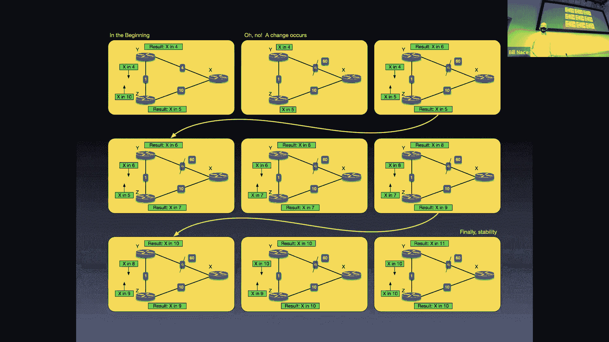

 Okay， you say， you know， I know why computed this data value from you based on information from you。

 So I'm going to tell you the cost is infinite amount to get there。 Okay， and so in that case。

 bouncing back and forth on here。 Right。 Z would tell why the actual cost is infinite instead of the actual costing five。

 Okay， and that way， why immediately would use that and say， okay， should I go 60。

 or should I go one plus infinity。 And one plus infinity is really big。 So 60 is a better choice。

 Okay， and， and so it would go ahead and say， okay， I'll do 60。 It will then tell why， you know， hey。

 I can get there in 60 and Z will say， huh， 60， I can do it in 10。 And so， in pretty much instantly。

 we react to this bad problem。 And yeah， infinite is a big number。 Got a lot of bits to it。

 So oftentimes you'll have some specified big value that you go ahead and send， which is the。

 the poison amount that happens。 And so， at the same time， we actually thought， you know。

 we knew that the counts infinity problem happened。

 We thought that poison reverse and splitter horizon would deal with it。

 And those got built into how things go。 It turns out we're going to read a very interesting paper and a couple of lessons that talks about this。

 It turns out that it's not really a settled problem。 So， on the internet。

 we do have this oscillation that occurs。 We do have situations that are much more complicated than the simple little three node example that I've shown。

 And sometimes if the problem occurs， you know， a couple layers deeper away from you。

 you'll go ahead and bounce a while， figuring out exactly what the shortest route is。

 and there'll be a lot more than just two routers involved in passing that information back and forth。

 You can， you can construct， you certainly can construct pathological cases that are going to be a problem。

 But there are real world non pathological cases that also。

 even with split horizon techniques don't get solved entirely。 Okay。

 and so those that's where bunches of router implementers。

 try to tweak with this or tweak with that to make stuff stuff work。 And then we get to that。

 All right， so the question may be， well， what do I do。 All right， how do I。

 how would I compare these choices that we've been given。

 we've got link state that is Dijkstra's algorithm。 Right。

 what do I have to know to make this happen and how much。

 how many messages would we have to construct to get all that information around。

 So I have n nodes and e links。 I'm going to end up having to pass information to each of the nodes about each of the edges that are passed around。

 And so there's a lot of messages that get sent during that flooding period。 Okay。

 and so obviously if in this big or he is big that's a problem。 Distance vector overall。

 you have as many messages。 In fact， you may have it more messages。

 but those messages only go between neighbors。 Okay。

 and so that from a message complexity perspective distance vector tends to be simpler。

 smaller number， because we're not having， you know。

 every node flood information to every other node sort of thing。

 Link state in some senses law faster， right， you give me a good graph， I run Dijkstra's on it。

 right。 Order and log n amount of time later。 I've got an answer。 And that's a good answer。 It's。

 well， it's good until something changes。 Right， but at least we converge very quickly。

 With distance vector。 In theory， I'm converging at the rate of one message exchange per diameter。

 or one， one round of messages being exchanged per diameter of my network。

 But we may end up with catching and the problems and things like that。 If there's a problem， right。

 if there's some change well。 Link state actually has got got this nice issue that if you have an if you made a mistake。

 In the actual computation somehow and put a wrong value in your forwarding table。

 It's not affecting the rest of the world。 Right。 That's just the router that made the mistake that has to deal with that。

 In theory， every other router has the graph and did the right thing。 Okay， and so it's not that bad。

 Distance vector， though。 You can make a mistake in your computation。

 And that mistake will then get sent out to your neighbors who will then incorporate it in their own corpus of knowledge。

 And compute based on that and that mistake can actually。

 especially if it's a mistake where you set a cost lower than it should be。

 That mistake can travel quickly through the Internet。 And we have many， many examples of cases。

 We'll talk about some of them next time。 Of routers making a mistake。

 advertising the low cost to some place， and that then getting propagated around the entire Internet and everybody using that。

 And everybody using that value to actually forward to the wrong place or through the wrong paths。

 So in some case that's a problem with distance vectors。 Okay。 All right， then。

 Now we've taken a look at the theoretical routing that has to happen in the network layer。

 We know some algorithms and how they work。 Okay。 Next time we will learn how these get deployed in real protocols in the actual Internet。

 Okay。 And so， and obviously those protocols are going to be based upon these ideas。

 That's why I taught them to you。 So you should be able to understand these algorithms。

 You should understand the problem that we're addressing。 Okay。

 as well as being able to actually calculate using dioceteras。

 be able to actually calculate using domain forward equations。 To in an actual scenario。

 Obviously it would not be a full Internet scale scenario。

 but some scenario to show you understand how the algorithms work。 Okay。

 Any other questions how we don't on chat。 All right， it looks like we're caught up then。 Okay。

 And thank you all very much。 I will see you next week。 Go enjoy the rainy day。

 Whatever enjoy your fall day。 Have a great day。 Everybody。 Goodbye。 [BLANK_AUDIO]。

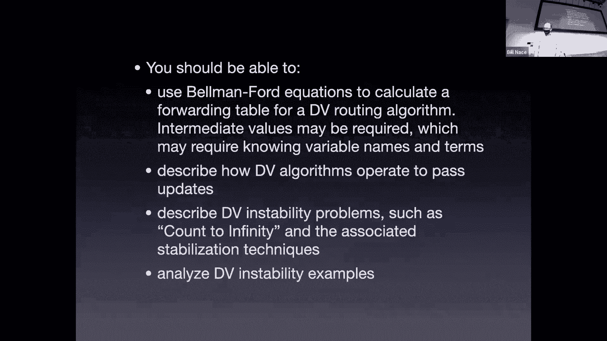

 [BLANK_AUDIO]。