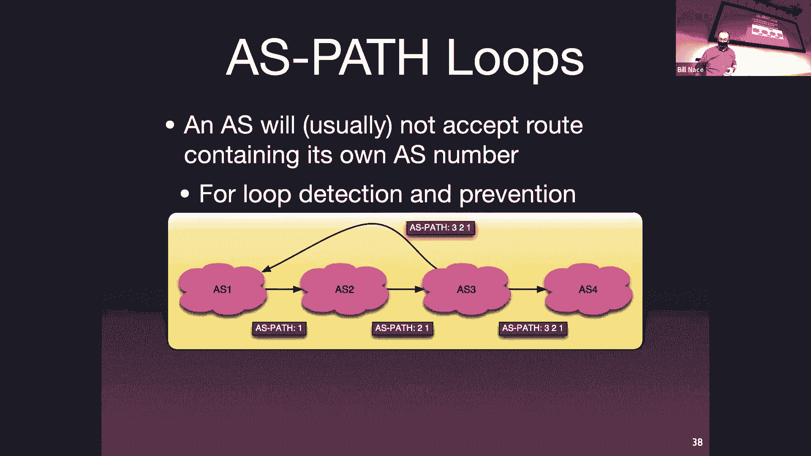

# 卡耐基梅隆大学 14-740 计算机网络 Fundamentals of Computer Networks（Fall 2020） - P16：Lecture 16 Internet Routing - ___main___ - BV1wT4y1A7cd

 [BLANK_AUDIO]。

 [BLANK_AUDIO]， [BLANK_AUDIO]， [BLANK_AUDIO]， [BLANK_AUDIO]， [BLANK_AUDIO]， [BLANK_AUDIO]。

 [BLANK_AUDIO]， [BLANK_AUDIO]， [BLANK_AUDIO]， [BLANK_AUDIO]， [BLANK_AUDIO]， All right。

 so I just ended up giving away all the answers to the quiz， to the people who were here。 No。

 I'm kidding you。 Okay， so what were we saying？ Basically， to start over。

 today we're doing cool stuff， and we're never outing。 Next week， we've got a quiz coming up。

 Please be prep for it。 It will run very much like the quiz did the quiz one。 It'll be on canvas。

 closed book， closed notes。 It's non-comprehensive。

 so it only covers the material since the last quiz。

 That's basically the transport and the network layer。 There will be a review session this weekend。

 We have not finalized the details of the time and whatnot。

 so please pay attention to Piazza for that。 Which I think is， yeah， okay， that's all about the quiz。

 All right， so now you're cut up。 We're going to take the ideas we learned last time。

 which were theoretical how to do routing algorithm ideas。

 And today we're going to talk about how those actually get implemented as real protocols that are really running the Internet that are core。

 in fact， to making the Internet work the way it's supposed to。

 And so we're going to talk a little bit about this idea of hierarchical routing and how you can take different algorithms for different pieces of the network and kind of meld them together。

 which is why we learned about several different algorithms last time。

 And we'll talk a little bit about several different what we call interior gateway protocols。

 Those are protocols that are used inside a network。

 So you think CMU is running some protocol inside its network。

 And then we have exterior gateway protocols that help the different networks get along together。

 So first off， here's the problem。 Last time we learned about link state that's Dijkstra's algorithm。

 right， and distance vector algorithms that was the Bellman Ford equation version。

 And you may be wondering， well， gosh， why don't we just use those right aren't those these great algorithms we talked about？

 Wouldn't they be fantastic。 And the problem is， as of yesterday， there are 70。

000 and 70 different networks， different organizations running networks in the Internet。

 There are close to 400 close to 850，000 routers。 Those， by the way。

 that doesn't count like the router in your apartment。

 These are the big scale routers in the networks。 Okay， and。 Okay。 So let's run Dijkstra's on this。

 Right。 Do you remember Dijkstra's complexity was order and log n， right。

 That's not bad for an algorithm， but that's a big N。 Okay。

 And it's going to be a while before Dijkstra's would work itself out。

 And so that's going to be a problem。 In fact， we have two problems。 This is just one of them。

 This is the scale problem。 And I guess I should point out scale would not be an issue。

 If the network was also not dynamic。 Right。 If we could have run these algorithms back in the 90s and had everything set up and now it's been working ever since。

 That wouldn't be a problem。 Okay。 But you know， you've seen it。 You've。

 you've looked at trace route and other network traffic indicators。

 You know that the network is not static， not dynamic。 Right。 Those numbers， by the way。

 are obsolete。 I'm sure。 You know， I looked them up yesterday。 I'm sure by today they have changed。

 Right。 And so that means that we need something that will converge quickly。

 Or allow us to handle the scale problem we have。 And so。 I'm sorry。 My video is off。 You're right。

 Video is off。 Maybe I should ask zoom。 Is everything correct now？ Wow。 Okay。 Interesting。 Okay。 I'm。

 I hope everybody heard what I was saying。 Here are the slides。 All right。

 So I had this great class intro was not not working out today。 So scale is one of our problems。

 right？ Scale and because it's dynamic scale is a problem。

 And another problem is actually the fact that we have organizational autonomy。 Right。

 We don't have one， you know， king of the network who is telling everybody。

 this is how you will route stuff in your network。 This is how everything will work in your network。

 Every organization wants to be able to make its own choices。 Right。

 Think about Carnegie Mellon as an organization。 Right。

 We have our own network guys who want to be able to buy whatever， routers they want to buy。 Right。

 They don't want some king of the Internet saying they'll must buy this Cisco router。

 They want to be able to choose whatever fits the nature of the traffic here and the way they want to manage it。

 Right。 They want to run without ever algorithms they want to with whatever link weights they want to。

 Whatever makes sense for running their network。 Which， yeah， sure， makes sense。 It sounds great。

 Right。 That allows organizations to be different and flexible。

 And that's going to provide better service for the rest of the Internet， presumably。 Okay。

 So how do we manage then to route stuff around the Internet when I can't have a king telling everybody exactly what to do。

 Every group gets to do what they want and I have a lot of those groups。

 This is where computer engineers pull out one of their superpowers。 Right。

 Computer engineers have a couple of these superpowers that we just whenever we see this kind of problem。

 we say， oh， this is the answer。 Right。 If you ever have a performance problem。

 you pull out concurrency。 Right。 You parallelize stuff。 We do the same thing with scale。

 Anytime I have a lot of things after manage， I throw a higher key at it。 If you have， you know。

 a million files on your hard drive。 Let's put them in folders。

 Let's folders go in folders and that helps us organize this and make it all work out。

 We're going to do the same thing here。 We're going to say， okay， I got a scale problem。

 Let's pull out some hierarchy and allow that to work。

 And so the way hierarchical routing is going to work is we're going to have kind of two layers。

 We're going to allow organizations to autonomously choose what they want to do to run their own network。

 In fact， we're going to call them autonomous systems。 A。S。

 Those are the organizations that are running some network somewhere。 And within the A。S。

 within that organization， they get to do whatever they want to。 Okay。

 they just have to move the packets somehow across their network。

 And then at the higher level of the hierarchy， we're going to use another algorithm that will connect all of the A。

S。s together。 Okay。 And that one is a controlled protocol that everybody has to use。 Okay。

 so what are these autonomous systems？ What goes with those？

 Those are anybody running a large sized network。 I guess I should say anybody running a large sized network that has routing issues。

 And the primary routing issue is going to be can multiple are there multiple ways to get to your network。

 Okay， so you end up with things like internet service providers or autonomous systems。 Companies。

 campuses。 My house is not an autonomous system。 Okay， my house。 Yes， I have a okay。

 I've got a lot of devices in it because I'm that kind of guy， right？ I probably have， you know。

 60 to 70 different IP addresses on my local network in my house。

 But I only have one way to get there。 There's only one ISP。

 The rest of the internet when it needs to send a packet to my house to any machine in my house doesn't have to make routing decisions。

 So I don't have to be an an a s。 I'm just part of the a s that is whichever internet service provider connects to me。

 So my addresses are included in that a s。 Carnegie Mellon is not like that。 All right。

 Carnegie Mellon has several different connections to it。

 And so it has to be an a s because it has to be able to advertise to the rest of the Internet。

 Through those different internet service providers， we won't be able to say to level three。

 here's how you get to Carnegie Mellon and also be able to say through the penren network that we're connected to here's how you get to Carnegie Mellon。

 That's a routing problem。 So that means that Carnegie Mellon has to be its own a s。

 Each is going to get a number。 I call them the s numbers or as and they're just a number。

 It's handed out sequentially。 Okay， and so the fact that Carnegie Mellon's is number nine may tell you a little bit about where we were in the history of networking。

 So each a s is going to have a number and we're going to use that number then to represent。 Oh。

 if I need to get to Carnegie Mellon， I know that I need to somehow get to a s number nine。

 And so the protocols to be able to use this number instead of the words Carnegie Mellon University。

 basically。 It is possible then for a s is， and it makes sense Carnegie Mellon is an a s it has a number。

 There are some other scenarios that work。 It is not uncommon for a particular organization to have multiple a s numbers。

 That's typically just through history and bureaucracy and you know here's my example of one company buying another company。

 And that company had some a s numbers in fact they had four different a s numbers。

 I'm not sure why they had four。 Maybe they had bought some other companies or maybe who knows。

 Right。 And so it's not like a fast rule that you can only have one。

 You'll have several you can use some you can leave some legacies leave them lying around not really used。

 or you may have some interesting weird operation reason to have multiple a s numbers。

 And then it's also possible for organizations not to have an s and that's kind of the same scenario I described as my house。

 Right。 If I'm single home that is there's only one network I'm connected to。

 Then I have no need to have multiple to have an s number。

 I just am included in the s if whoever I'm connected to。 All right。

 And then this hierarchical routing。 I described the idea briefly here's a picture showing some of it。

 I now have a s's。 I have networks that are。 Constructed that are built that are autonomous they're being run entirely within themselves in our case I have four ellipses there。

 Each of those is an a s and they've been given us numbers one， two， three， and four。

 And the hierarchy works by allowing some routing protocol to operate inside each of those s's call is an interior gateway protocol。

 Remember gateway is one of those kind of archaic words for router。

 So an interior gateway protocol allows us to do routing inside of a network。

 And so a s four has a bunch of routers inside it。 It's an organization runs a big network。

 It's got stuff inside it。 It's got to be had ways to figure out how do I move packets from one computer from one router inside my network to another。

 And the interior gateway protocol will handle that。

 And then we all run an exterior gateway protocol。 Outside of our networks that allows us to connect to the others around us。

 Okay， so that lets us between the different a s's figure out how do I get packets around from a s one to a s three。

 for instance。 And so that's at a bigger scale。 That's the larger problem。 So here's， you know。

 if I put some numbers on this and maybe show a slight example of how this might work within a s four。

 I have a whole bunch of different computers of different routers。 I have a range of IP addresses。

 Okay， and if I can look at some of them， I can say， you know。

 when 28 that to 130 that to is down there in the lower portion of a s four。

 If there's a computer that is sending from that place and wants to get the packet to 120 that to 130 dot one。

 which is also within the organization， the interior gateway protocol will have run and will have populated the forwarding tables to make that happen。

 And then all of us for， remember we use prefix notation to specify a range of IP addresses。

 I have a prefix notation， I have a slash 24 for all of us for。

 And we use that to announce to the rest of the world using our exterior gateway protocol。

 The routers on the edge of our network， we call this border routers。

 because they're on our border or border gateways。 Those big black dots。

 those will take our prefix and announce it to neighbors using this exterior gateway protocol。

 So the exterior gateway protocol will be used on those black lines to tell， hey， as one。

 if you'd like to get to someplace in my prefix range in 128 to 130 slash 24。

 If you'd like to get anywhere in there， you can send it to me。

 That's what that exterior gateway protocol is doing it is announcing the reach ability information。

 And of course then， as one is going to tell its neighbors。

 It's possible to get to this prefix by sending stuff to us one。

 And that's done with the exterior gateway protocol。 So this works out pretty well。 It is scalable。

 right， it allows， I mean， we have an extra gateway protocol that will handle 850。

000 routers that will handle all of the as as we have in the internet。 70，000 or so。 And what it。

 it's nice also because it lines with our goals of the autonomous autonomy that we have in each of our autonomous systems。

 Right， so Carnegie Mellon can announce to the world here's how you get to Carnegie Mellon without having to be specific about how you get to Bill's laptop inside Carnegie Mellon's network。

 Right， they can just say， get to Carnegie Mellon this way。

 And that information is also often influenced by policy。 Okay， so what I， what I mean is。

 it may be more than a just technical here's how to reach Bill's laptop that's important to Carnegie Mellon。

 Carnegie Mellon has business relationships with other as it pays money for transit for those。 Right。

 and it may want to guide the traffic in some way。 It may want to， well。

 have a policy about how you get to Bill's laptop。 And the extra gateway protocol is heavily biased towards towards policy and it allows you to communicate that to your neighbors。

 We'll see that very much when we start to look at that。 Inside the network。

 then Carnegie Mellon can worry about which the fastest route to Bill's laptop from that border gateway that the packet comes in。

 How should it go among the routers within the network to get here inside the UC to my laptop。

 And that's a performance question。 Right， that's not a policy question。 No question。 Yeah。

 I'm being a little fuzzy with that number that's actually the number of prefixes that have been announced that are being managed。

 And so， maybe that is related to the number of border gateways that we have running around。 It's。

 it's a fuzzy number just to give you some sense of scale。

 I'm sure Cisco has sold more than this number of routers。 Okay， so in many cases， those will be。

 you know， all of Carnegie Mellon is being announced as a single prefix accounts is one of those。

 Okay， so let's quickly take a look at some interior gateway protocols。 There are several in fact。

 If I want to look at them， I can lay them out and say， Oh。

 I have interior and extra gateway protocols。 Okay， and so you'll notice on the top row。

 I have four different protocols there that do interior gateway management， right。

 And then I have a organization run performance flies and route stuff for the right pack。

 And then on the bottom row， there's one extra gateway protocol to talk about。

 And then I've also divided them with our knowledge of the different types of algorithms into a column for length state and a column for distance vector。

 So we have a variety。 I'm going to touch on several features of each of the top four here。

 Not going to make you an expert in any of them， but I found these are kind of like bullet points about them。

 So you know， a little bit about them。 And also so you get a feel for the differences and what you need to worry about with an extra gateway protocol versus an interior gateway protocol。

 So the first step I want to talk about is OSPF。 Okay， this is a very commonly run protocol。

 It's the open shortest path first。 This is basically Dijkstra's algorithm packaged into a protocol。

 And so we can't just say we're going to run Dijkstra's algorithm because we somehow have to actually have messages to send around to。

 you know， I need to， for instance， you know， we need to flood all of the link state information to everybody。

 So therefore we need to build a protocol that handles that that has messages that say， Oh， here's。

 here's the information that you need in order to run Dijkstra's。

 So OSPF is taking Dijkstra's algorithm and making a protocol about it。 It's open in the name， right？

 That's the idea is it's an open standard anybody could build to this protocol that you want。

 It's not owned by any particular company。 You send。 So it。

 I think it's kind of interesting in a couple ways。

 One is all the messages run like they are their own transport layer。 Okay。

 you'll notice all of the OSPF messages are sent just using IP。 Okay。

 we have our own protocol number。 We're not。 So the point there is it's not a TCP or UDP thing。

 We have routers have got to talk to other routers。

 And so they're going to put values into an IP packet and send them off。

 The IP packet when it gets to the other side is going to look at that protocol number and say， Oh。

 this is no SPF number。 Let me give it to our OSPF code。

 So it's kind of like its own managing its own transport layer。

 And that by the way means that if it wants any of the features that one would have gotten with TCP。

 It's got to build it themselves and OSPF does have reliability and error correction as part of the actual protocol。

 The OSPF protocol allows the system administers and network administrators to go ahead and specify some link weights。

 Right， so you know Dijkstra runs needs to know what the cost to get from router A to B。

 Those are what we mean by link weight。 And OSPF doesn't care what those numbers mean。

 The protocol just has a way to communicate the numbers around。

 And so the network administrator to get to choose for whatever mechanism whatever policy they want in place。

 What numbers should those be。 Right， so they get big numbers become the slow lengths we have to pay a lot of money for or something like that。

 Whatever they want to do。 There is some security in this。

 You can see it would be important that my routing be done securely。 Right。

 because I don't want to be able to send out an OSPF message that a router believes。 And thus。

 we call it hijacking a route。 I don't want to know。 Oh， yeah。

 everything all the traffic that should be going to SIo to report grades instead send it to my laptop。

 We don't want that happening。 So there is some security in it。 And interestingly。

 OSPF also manages its own scale problem。 Okay， what do I mean by that？ Well。

 there's hierarchy in there。 If you have enough routers in your network， you now have。

 when the network administers now have a hard to administer sort of problem running on。

 And so OSPF allows you to build a hierarchy。 Where what you do is you take your whole network and you break it into some pieces。

 They call it areas。 And so you'll see here I have a network with a bunch of routers。

 one of which is my border router。 Because this is all in a single a S。

 We're all running this within my organization。 I could have multiple border routers。 By the way。

 I just happen to have one in this case。 And then we've taken bunches of our network and we split it up into different areas。

 And then why we do this， right？ This is the protocol doesn't care。

 This is a mechanism that is included in the protocol to help network administrators solve problems。

 One， you know， maybe those areas actually are like geographic areas。 We want to， you know。

 allow the guys in some， you know， in a different part of our network to manage things more easily on their own instead of having to coordinate across a large network。

 That's a hierarchy or a scale problem。 So we're dealing with hierarchy to make that happen。

 The different areas get pasted together by another area， a special area called the backbone。

 That the area border routers， which are particular ones in each area。

 then are included in this backbone。 And what this means is you do the flooding of Dijkstra's algorithm and all that calculation only within each area。

 Okay， so those five routers there on the left， they flood。 They do Dijkstra's algorithm。

 They come up with what the appropriate shortest path tree is to allow you to forward to every place within that area。

 And then there's some communication that goes on in the backbone。 People say， Oh。

 you want to get to that particular place？ Yes， send it to this particular area router。 And， Oh。

 we're going to flood and do Dijkstra's within the backbone。

 So everybody knows how to forward packets to each of those border routers。 Okay。

 and that then pays together because in order to get to some place in area one。

 I need to send it to that particular border router。

 And I know how to do that because we've done Dijkstra's in the backbone。 Does that make sense？

 Question。 The area just decided that it's just a administrator。

 So question is who decides on the areas and yeah， it's a network administrator thing。

 This is a tool that's。 Provided to anybody running this protocol。

 the protocol allows for these areas。 If you don't want to use them， if I've only got five routers。

 maybe I don't need areas。 Right， and so I don't need to employ that。

 I don't need to open that chapter of the manual to figure this out。 Okay。

 so that's an interesting feature about a common protocol。

 Another commonly used protocol is called isis。 This is intermediate system to intermediate system。

 It's kind of supposed to be used。 More in telecommunications areas and we see more of the isps。

 especially the large isps running isis。 It's a link state algorithm as well。

 So it's basically running Dijkstra's of some format。

 There are and actually point out it is a standard as well。 So there's an RFC behind that。

 OSPF also is a standard。 It is isis has just been tuned a little bit and optimized so that it's supposed to work well at large scale。

 I actually don't know much about it other than like the marketing points you get about it。 Oh， yeah。

 It's less it sends less messages about stuff because we've optimized a bunch of things。

 And so therefore it's supposed to be work better at sizes of large isps and is very common in large organizations to run isis instead of OSPF。

 On the distance vector side， we also have a very common algorithm。 RIF is an algorithm。

 The routing information protocol is what were you thinking RIF stood for。

 It's a protocol and an algorithm that is actually very commonly used because it was part of Unix from way back when。

 And so a lot of sys admins who kind of grew up and you know。

 who remember what the SD means as part of your Unix。

 We're using RIF as in order to set up the small networks that came when they started building these things。

 It is a fairly simple implementation of distance vector algorithms。

 It makes some some assumptions that mean that it may not be suitable for larger networks。

 One of them is that the link count is always one。 There's no way for you as a system administrator to kind of move the traffic away from an expensive length。

 for instance， or a slow link。 It's always one。 So it's just counting what's the smallest number of hops to get to a destination。

 Also in the protocol when it's describing the cost of a path。

 there's a four bit field to handle that。 Which means you can't ever have a path that has a total cost larger than 15。

 So right there we've limited the diameter of the network。

 You Comcast is not going to run this just because it won't work。

 They have paths that are longer than 15。 In the networks works fine for small networks。 Right。

 and this is one of the reasons it took off is because a lot of people are building small local networks in some organization with a couple of spark stations back in the day running Unix。

 This was fine for when they think they grew up and used it。 So really starts up on the routers。

 And every 30 seconds they do the distance vector thing。 Right。

 Remember what distance vector thing was？ Well， oh。

 I have information about routes about costs to different locations。

 Let me tell my neighbors about that。 And so we're going to send out messages to that effect to our neighbors every 30 seconds。

 And they work as a heartbeat as well。 So one of the things you need to know when you're actually building any distributed system。

 especially something like this。 If a router crashes。

 the router is not going to tell you about it beforehand。

 So if you have a neighbor that's having trouble， you may just all of a sudden not be able to send packets to that neighbor。

 And you kind of like to know that。 Right。 And so what you do is you're sending these messages every 30 seconds。

 If a neighbor isn't sending you stuff， you use that as a failure detector。

 So if you don't get these messages。 Well， there's a hundred eighty second time out。

 So if for some reason， six of these should have come in and they don't。

 then you just go ahead and assume。 Oh， that neighbor must have crashed。 Guess what？

 I now have to remove and recalculate distance vectors and tell my other neighbors that I can't get to the routes that normally would have gone through the guy who just crashed。

 And then the message is themselves sent from router to router to router。 They use UDP。

 particular port to do that communications。 Which brings up an interesting question。

 If we're sending our messages using UDP， that means the actual code is in the application layer。

 Right。 What is， you know， aren't we done with that that was before the last quiz。

 We're in the network layer now， aren't we？ Yes， we are。

 But it turns out the actual running of the routing algorithm can happen elsewhere。

 The issue we have for the network layer is we need our forwarding table filled in。 Okay。

 and so the way this works is there's action application layer process that talks using UDP to other application layer processes at other routers adjacent to it。

 And then it does the distance vector math。 Right。 It runs Bellman forward， all that kind of stuff。

 And it's not going to be a little bit more than that。

 And then it's going to be a little bit more than that。

 And then it's going to be a little bit more than that。

 And then it's going to be a little bit more than that。

 And then it's going to be a little bit more than that。

 And then it's going to be a little bit more than that。

 And then it's going to be a little bit more than that。

 And then it's going to be a little bit more than that。 So， yeah。

 Edgric is bothering because this feels like it's breaking the network layering thing。

 And that's one of the reasons I pointed out to us here is just to show， oh。

 from a communications perspective， stuff is happening。 It's not really network layer。 Right。

 In fact， we had a little tease of this that nobody noticed when I talked about OSPF， right？

 It's an OSPF is its own kind of transport layer to do that communication。 Here。

 all we're really doing is we're saying， I have some code that's got to run and it's got to talk to other code。

 And I'd like to use the capabilities of the transport layer to make that happen。 Okay。

 so I'd like to use UDP because it's already a protocol standard。

 I can go ahead and piggyback on top of that。 And now the part that feels the most like it's breaking the layers to me is now the application layer has to somehow give information to the network layer。

 Right。 That last arrow where somehow that route demon has come up with an entry that needs to go in a forwarding table and has to somehow tell the network layer about that。

 And that part definitely is doing an end around the layered architecture。 Right。

 because otherwise we'd have to have a way to tell the transport layer， hey。

 would you tell the network layer for me？ Here's a forwarding value。 And so that part， yeah。

 maybe that breaks the layered architecture。 Okay。 Another way to think about it might be， well。

 the route is actually in the network layer so that it can talk to the forwarding table。

 but it's going to go ahead and use the transport layer to communicate whenever it needs to communicate。

 That also may feel a little bit weird。 The part that actually feels the weirdest to me is I'm sending a UDP packet。

 You thought about this yet。 I'm sending a UDP packet that needs to get forwarded。 Right。

 It needs to the network layer needs to know how to take the UDP packets going to get handed to the network layer and put in an IP packet。

 I'm sorry， UDP segment into IP packet。 The IP packet needs to get forwarded。 Right。

 So there is a little bit of a bootstrap problem here。 Okay。

 and that's solved by making sure the network administrators set up the forwarding to the neighbors at the beginning。

 Okay， because who you're talking to with that UDP packet that UDP segment in an IP packet is a neighbor。

 Okay， and so it never has to get forwarded far， but you do need to know which wire do I send out this particular packet to。

 When you're doing the routing process。 That'll get a little bit weirder when we talk about PGP in a minute。

 There is another acronym in my little。 Box showing which which things there are in this another that's a net another interior gateway protocol that is a distance vector algorithm。

 This is the enhanced interior gateway routing protocol。 This is one that Cisco developed。 And again。

 I don't know a whole lot about it other than it exists。 It has very recently been standardized。

 So there is an RFC about it。 And I know it's just in factor and if you look at Cisco's webpage about it。

 it talks about all these great things that it does but doesn't tell me much about how it does them。

 Kind of like I SIS。 So they will in bullet points that come straight from the marketing department。

 I'm sure it's a oh it's distance factor， but it converges quicker and doesn't use as much router resources when it's being run。

 I don't know。 I don't have experience with that， but just thought it should be included in your in the list for some completeness sake。

 Okay。 So that gives us four different algorithms， two of them links take two of them distance vector that can be used by any autonomous system to do the routing within its own borders。

 Those are all interior gateway protocols。 So basically， you know， CMU。

 when it starts up its network， gets to choose。 Oh， all of these four， which would we like to use。

 Okay， and they get to choose and nobody has to tell them which one they have to use or anything like that。

 Okay。 Next step， then， is the exterior gateway protocol。

 How does Carnegie Mellon know how to send traffic to other autonomous systems and that gets handled by an exterior gateway protocol。

 So next year gateway protocol， the whole reason is there is to allow a network to advertise and for other networks to get those advertisements that give them what we call network reachability information。

 Basically， the prefix。 How do if I need to send a message to some other place。

 how am I going to do that？ Well， Carnegie Mellon needs to collect those advertisements and to know how do I reach that other network somewhere。

 And the exterior gateway protocol is going to allow that to happen。

 This announcement that every network makes will then get propagated from a s to a s to a s。 Okay。

 so running this protocol， all of the networks cooperate to pass around this reachability information。

 And it also lets the that propagation those announcements have information associated with them that will help the networks make decisions about which way they like to go。

 So the issue is for any， let's say， imagine we're here Carnegie Mellon。

 and now looking out at the rest of the world for a particular network somewhere for a particular prefix somewhere。

 We may get multiple announcements。 Right。 We're connected to three different ISPs。

 All three of them probably have reachability you could send packets to any of the three。

 and they would get to wherever your destination is。 So Carnegie Mellon needs to decide。

 And so there needs to be more information that allows Carnegie Mellon to decide which of these to use。

 And so the announcements are going to allow us to not only say you can connect to this prefix。

 but also tag on some other information。 And that other information then is used to make the decision about which ones。

 Which ones to accept and which ones to propagate to our neighbors。

 That is oftentimes a policy based decision。 Again。

 not based on performance in which way is actually technically best。 But based on things like， oh。

 I'm peering with this neighbor。 Right。 And that means I have different obligations than if I was paying for transit from them。

 Right。 Remember that。 Wow。 That's a kickback to an early lecture。 Right。

 Remember we talked about when peering， we said appearing is a relationship between two networks that are peers。

 They're about the same size and scale and whatever。

 And they connect to each other and they decide to send information only two customers of that other network。

 Right。 You do not pass your traffic for Facebook through this peer。 You only send traffic to that。

 How's that actually happen？ This is how it happens。 Right。 Using our extra gateway protocol。

 we send that announcement out and we tack on enough of other information that the receiving network is able to look at this and then make the business decision。

 Based on the policy and say， Oh， right。 This prefix is in up here。

 I can accept that so that I can send traffic to them。

 But I'm not going to tell anybody else about it。 Okay。 If so。

 then those other places would send traffic to me， which I would then send through this peering connection。

 And I don't care that that guy over there can talk to my peer。

 Let them pay for transit to make that happen。 Right。 I don't want them to go through。

 That's a policy choice。 And so our extra gateway protocols have to be able to handle those policy choices。

 And so we need more information than just the prefix。 All right。 So that's in general。

 what an extra gateway protocol is going to do。 In particular。

 we run an extra gateway protocol called the border gateway protocol。

 It's the one and only it's the de facto version for so you'll see a BGP for oftentimes。

 That's the one that all of the assets have to run。

 It's a little hard to think about how you would have multiple。 Exterior gateway protocols running。

 Because that would mean the information you're passing around was different。

 And you'd have to then figure out how to convert that knowing， you know， oh。

 I got to be able to talk BGP to this guy and something else to that other network。

 So nobody wants that。 There's enough trouble just having BGP around。 So BGP is the one and the only。

 I put it in the distance vector column。 And that's only partially correct。

 The algorithm itself is not a distance vector algorithm。 We call it a path vector algorithm。

 So that means when I send the information to my neighbor and I say， I have a cost。

 This is my cost to get to that particular destination with BGP for we don't pass on a cost。 Instead。

 we send a path。 We actually say these are the ASNs that you would send your traffic through if you accept this one。

 Okay， so if you're going to send traffic to me， it'll go to me and then here's the rest of the path。

 Here's everybody else in how it gets there。 We'll see how that works in a minute。 I mean。

 it's a heavily policy based protocol。 It is heavily policy based because lots of different organizations have different needs for how they communicate to their neighbors and what。

 you know， how to make this all work out。 The protocol itself is。 Relatively simple。 I don't know。

 If you are an expert at BGP， you can make good money because it's not the sort of thing you just pick up a book and read over the weekend。

 To pick it up。 Okay。 So it is a。 It's a lifestyle kind of protocol that you get into。

 But thinking about it and understanding is isn't too hard to figure out。 One of the problems。

 though， is that if you screw up everybody knows about it。 If you screw up。

 that's really that's reflected in the announcements that you're sending out to the world。

 And the world will then use those in their routing。

 And that will talk about a few instances that will cause trouble for the Internet and everybody will know about it。

 So， BGP for spent around a while。 In fact， version four has been around since 1994。

 And that actually was not a big change。 It didn't change how the protocol itself really worked。

 It was mostly the previous BGP three， when it was talking about prefixes used as classes。

 I don't know if you remember when we talked about IP addresses we said back in the day。

 You had slash eight slash sixteen or slash twenty fours。 There were class A， B or C。

 And then in 1990 early 90s we saw that， oh， we're going to run out IP addresses。

 Let's reallocate that and allow you to have prefixes with any number in it。 When that happened。

 BGP four had to， or BGP had to evolve so that it could express those。

 It didn't have a way to say slash nineteen before in the actual protocol that was being passed back and forth。

 Most of the work since then on BGP has been about finding errors when they occur and securing it。

 The protocol itself from 1994 that was the first internet worm was what 1988。 Okay。

 so this was still being generated kind of in the good old days。

 And so there've been a lot of tack on things that have been done to make BGP more secure as it goes。

 Here's how it works。 You have two A S's。 They communicate because they have border routers that are directly connected。

 That's just the way we cook our networks together is I have a router somewhere。

 And if I want to connect to that router then I connect to them。

 I'd have to run a wire to their network。 And I'm in particular going to run to a particular router in that network。

 Now you know from previous conversations that that wire may involve public peering， for instance。

 that an ISP， but somehow we're connected directly to some adjacent network。

 And so that means the two border routers are going to run what's known as a BGP session。

 And they're going to pass BGP messages back and forth to each other。

 And so they basically start up the BGP messages get put in。 In TCP segments。 Again。

 kind of throw back to what happened in RIP right we've got information we're communicating。

 but we'd like them to take advantage of reliability and all that kind of stuff。

 And so we go ahead and use TCP to make that happen。

 And we basically just start up a TCP section between these two that we call BGP and we send BGP messages back and forth to each other。

 And the messages themselves。 There are four basic kinds of BGP messages。

 There's one that opens up says hey I'd like to start a BGP session with you。

 There are part meets that are called people live messages。

 Much like we talked about with RIP you want to know if then if the router next to you is crashed。

 And so if you haven't heard from a minute while， if you haven't heard a keep alive message in a while。

 then you assume that your neighbors crashed。 There is a notification message that if I'm going to shut down。

 Like if the sys admins have come in and said oh we're going to turn this off gracefully。

 then the router can I can send out a notification message to his neighbors to say hey I'm going to go down and take me take my routes out of your。

 forwarding table。 Most of the work， however， comes in this update message。

 So the update message sends information about a route and says this particular prefix。

 I can either announce it or can withdraw it。 I can tell you， you can get to that prefix through me。

 That's an announcement， or I can withdraw on I can say you no longer can get to that prefix through me。

 And so both of those are in this update message。 So another piece of this， by the way。

 we have our connection between our two exterior border routers right the connection between as one and as two that I kind of showed a couple sides go right that's this connection。

 It turns out within a two the information we get we also need to be able to pass around to our neighbors。

 And so BGP allows us to communicate between all of the border routers in my particular as using BGP so that we can pass the policy information about these routes so that they can be passed to neighbors that those other border routers are connected to right so I've got。

 in this case I have five border routers。 Presumably they are all connected to other as's and so anything that comes in from as one I'd like to be able to pass around to those neighbors。

 So I'm going to use I BGP is just an it's effectively BGP but between。

 You know between my friends kind of thing。 So that they can then pass those on to others。

 I want to stress here within as to there are probably many other routers as well。

 I BGP is used to communicate between the border routers in my as not all the routers within my as。

 All right， so what is it I'm sorry。 There are a few bits here and there that are a little different and we'll see a few of them show up when we talk about path selection in a minute。

 knowing that the information is coming from a friendly router can help you make slightly different decisions about what you do with the prefix。

 And so it's one of the reasons to have a different protocol is that and I'm the protocols not hugely different it's basically just couple bits。

 Those bits help you make those decisions。 So， the question Dean on asked was。

 if you haven't figured it out from that is， is there really any need for a different protocol is there a need for something different between I BGP and E BGP。

 And yeah， there is because we want to be talking to friendly。

 We want to know when we're talking to friendly routers。 All right。

 so these messages that come in they are， they announce a prefix。 So let's say， hey。

 here's an IP range that you can get to that range， maybe， you know。

 some other complete a S somewhere it could be a customer of an ISP who knows。

 It is some range of IP addresses that are in this prefix。

 And then we want to add on some extra information we call that attributes。

 And there are lots and lots and lots of different attributes。 And I've listed some of them here。

 we will talk about four of these， not all of them。 Okay。

 The attributes are extra information that we can use to make decisions or to communicate the important stuff to our neighbors。

 And then we send the announcement of a prefix we will include here's the prefix and here are one or more actually technically I think zero or more of these attributes go with it commonly you're going to put a bunch of them。

 And I was saying， hey， couldn't and an AS administrator decide that it doesn't want to have traffic moving through it and so it doesn't pass on this routing information。

 And yes， that's true right that's a policy decision。 Presumably we're doing it for some reason。

 And I want to be able to do that and so BGP lets me decide oh。

 that neighbor I don't want to tell others about because I don't want that traffic moving through me。

 Okay， now if that neighbor wants traffic to move through you then。

 they need to convince the the network administrators in that AS to change their mind about how to handle these BGP messages。

 And that usually involves oh let's have a contract and here's some money and we're going to have a transit relationship with you or whatever。

 And so that becomes part of the relationship already。 And yes。

 that will be that will be reflected in the particular BGP messages that get passed around。

 which is the way it should be。 That's what we want。 Okay。

 so I'm going to talk about four of these as I mentioned。

 as path is really important that is path is an attribute that we put on this prefix。

 And that lists the path。 This is what I was talking about a few minutes ago when I said it's not a distance vector arguments of path vector algorithm。

 This lists the path list the AS numbers that you would go through to get to this prefix if you accept this announcement。

 Okay， and so basically that's what we use these as numbers for the number nine for Carnegie Mellon。

 That number we then use in this BGP message to say oh， this is where you get there。

 And we would announce a prefix so party mail in for instance。

 announces a prefix with a BGP message and says oh the past path is nine。

 That's where this is coming from that announcement gets passed on to our immediate neighbor would say level three。

 who is our ISP level three， which would take that and want to tell the world。 Hey。

 here's how to get to Carnegie Mellon through level three。

 And so they would take that as path and put their own as number at the front of it。

 And the number is let's pretend it's 200。 Right， so the path then has 209。

 And then that gets sent off to all of the neighbors of level three。

 Many of those will put their own as number in front of it and send off 600， 209 to their neighbors。

 Okay， so when you get one of these announcements， you can look at the path and have a sense for how far away things are。

 Okay， it's hierarchical。 It's abstracted。 Right， you don't know exactly how many routers things are going to have to go through。

 but you can look at the number and you can say， oh， this one's got five as numbers in the path。

 And this one has seven。 This one sounds like it's， it's shorter。 Let's go ahead and use that。

 And so we do use this in route selection， basically looking at the numbers that are there。 We。

 I'm going to slide here。 Next attribute I want to talk about this one also incredibly important。

 This would not work hierarchical routing would not work without this attribute。

 Next hop tells whoever I'm communicating with。 If you'd like to actually use this prefix。 Right。

 and it that means that you're going to send traffic into my network。

 Here's the actual IP address that you should be sending that traffic to。 Okay。

 so this allows the receiver to actually use this value and calculate what should go in its forwarding table。

 Okay， because as numbers， you know， we don't know it right。 Now， instead， I have this prefix。

 That I want to get to a neighbor has told me if you want to send traffic to that prefix。

 send it to this IP address， the next top IP address。 And then within my network。

 I can use that because my internal gateway protocol。

 Runs and tells me how do I get to that IP address。 Okay， so some router， you know。

 some machine buried in my network seven steps away from a border router will know how to send traffic to that prefix。

 Because， well， the interior gateway protocol told me how to get to this IP address。

 And now I know that that IP address and that the destination prefix are connected。 Okay。

 so this incredibly important。 And that's basically those are the rules about how you would choose it。

 And this is where Dinyon we see the extra get a protocol and interrogate with protocol make a difference that lets somebody on the inside know。

 And you told me about this， where did you come from。 Next attribute， a multi exit discriminator。

 This one is not a critical one。 I included here because it's one of those that shows how you might communicate information to a neighbor and how you might have that neighbor react to this information。

 The multi exit discriminator only makes sense。 If I have two as's that are connected at more than one place。

 Right， so in my picture I have asked one and two with two connections between them。

 And the multi exit discriminator is used by as to when it sends announcements to as one。

 And what it's doing is it's saying hey， as one。 Here's how you get to some prefix right some customer down there。

 That's what we're announcing is the path to the customer。 And yes。

 there are multiple ways to get to that customer。 But I'd like to ask you to please use this particular one。

 Okay， so， you know， for instance， as to probably wants traffic to this customer to come in the connection on the left。

 because there's only two connection to routers there between it and customer。

 Whereas if it comes in on the right， then we got to travel through a bunch of different routers to get there。

 Okay， and so multi exit discriminator is a way we would still make both announcements。 Right。

 both of those border routers are going to talk to the one borders。

 And they're both going to announce and say you can get to the customer this way。

 And the next top is going to be the IP address on those particular borders。

 So both those announcements would give us one， the impression that they could send traffic to either one。

 Okay， now the normal behavior for for as one is something called hot potato routing。 Okay。

 I don't know if you played this game as a kid hot potato is a game where you like you pick up a rock or something it's supposed to be something hot。

 And then you and a bunch of friends basically just stand around， tossing the rock to each other。

 My mother was very important。 You don't talk through at each other。

 You pass it to them as quickly as possible。 So as soon as you get the hot potato in your hands you want to toss somebody else as fast as possible。

 The same concept applies。 Think about AS one's job。 Let's imagine AS one。

 Maybe it's a national Canadian ISP that is connected to a national United States ISP。

 And that means we have two connections。 One of them is in Vancouver and one of them is in Boston。

 Okay， now if AS one has traffic for this customer。 And that traffic is originating。

 let's say Nova Scotia on the very far eastern side of Canada。 AS one has a choice。

 They can either hot potato this thing， they can get it out of their hands as fast as possible by giving it to Boston。

 Okay， or they could take it and allow it to go all the way across their network to the very western portion of Canada。

 the Vancouver。 Thus they are paying to move that data all the way across their network before they give it to AS two。

 Okay， so the normal behavior is the hot potato scenario。 We would normally just say， oh。

 this is close。 Let's go there。 And the interior gateway protocol allows us to do that。

 The interior gateway protocol we run in AS one knows that if you're moving from Nova Scotia。

 The exit route is at Boston is closer than the exit route at Vancouver。 Okay。

 The multi exit discriminator allows us to to communicate to us one and say， hey。

 please don't do that。 Please send the traffic in a Vancouver instead。 Now。

 why would AS one agree to accept that the MED and use that。

 They would agree because we have a contract with them。 And then that contract is basically says。

 we're going to send you MEDs， please pay attention to them。

 And hopefully some while you're got involved there and was like， oh。

 we're only going to accept that contract if you pay us extra money。

 Because otherwise it's going to cost us money to move our data all the way across the Vancouver。

 Okay， but this lets us communicate。 Right。 BGP now has a way to actually communicate this information to our neighboring ISP to say。

 please do this。 And if something happened， if we suddenly made a lot of those routers go away。

 we could use BGP to automatically just change the MED values。

 And now we're telling our neighbor to do something else with that particular prefix。

 The last attribute I want to talk about is local pref。 This is a local preference。

 So you'd guess this is just a way for me to basically put my thumb on the scale and say。

 this is how I want you to handle this packet。 Right。

 this announcement has higher priority than some other ones。

 And the sys admins basically get to put a local preference number on this。

 So let's go ahead and assign a priority to this particular route， which basically says。

 do this instead of that。 It's kind of blunt acts in terms of moving my traffic where I wanted to move。

 And now that we know a little bit about a BGP message and what's involved。

 How do we actually use them？ How do we actually see them in practice？

 Well， we're going to make these announcements。 Right。 When I have a prefix that comes online。

 So for instance， if I have a customer here， I'm sorry。

 if AS one has a customer here on the left of my picture。 AS one would like to announce to the world。

 you can get to that prefix by sending us that those packets。

 And so it will create BGP messages that it sends out to all its neighbors。 Advertising this prefix。

 Oh， here is my prefix 19 dot 87 to 42 slash 24。 Right。 And I'm going to tell you this。 Hey。

 ask to hey， ask three。 Here are the messages that announced that there's a prefix there。

 If you'd like to send information to them， you have any packets that go in that range。

 Please send them to us。 And here's the attributes of this message。 I have a next top。

 The next top will be the IP address of the interface on the router that as to or as three should already know about。

 because those are in the subnet that the border router knows about。

 And so they get put into the IP process。 And we also have an past number on that we have our own。

 you know， this is a as one。 So put as one there。 Those announcements then get propagated。 Right。

 so much like distance vector algorithms when a is to hear us about new information。

 They pass it on to the neighbors。 And so。 We see now as to got this BGP message。

 they then go ahead and send another BGP message over to us for。

 And you'll notice that the BGP message has changed a little bit。 The attributes have been updated。

 Okay， so for instance， we have a different next top。 I shouldn't surprise you at all。 Right。

 a router in a four， depending on its internal gateway protocol has no idea how to get to 1997 at three。

 One。 Because that's an IP address over an as one。 So the next top to have to get updated and the path gets updated。

 We put our own as number in front of the path before we propagate it on。

 So now we have to one or three one as the actual as paths as our traffic moves through。

 Other stuff could get added as well。 By the way， notice that this path gives us more information than just a distance vector。

 And that is used to for several things。 One of them is to look for loops。 Okay， so I。

 if we're seeing the propagation of messages from as to as to as the as can look at the message。

 And if they see their own as number in it， then they know that there's a loop somewhere and they should not accept that。

 that announcement。 Otherwise， they will be sending traffic。 So in this case。

 if as one accepts this looping prefix， they will send traffic to as three that will get sent to as to that will cause it sent to as one。

 creating a loop。 We don't want that to happen。 So we can detect that with these， the as path。

 In fact， as three can know not to send it in the first place。

 because it can look at the path and say， oh， as one is already in here。

 I don't need to send it to start with。 There's arguments about which to do in BGP。

 whether to pre filter or post filter to lose。 I mentioned earlier that we use BGP to announce a prefix or to withdraw prefix。

 So let's imagine now that I have announced previously about this customer。

 but then something happens and that customer decides to go elsewhere。

 And I no longer can get to 1997 42 through a direct connection with as one as one then has to withdraw the routes it is previously sent。

 And so it will use BGP to send a withdrawal message。

 The withdrawal message does not actually have any attributes。 It just says withdraw this prefix。

 So everything I've told you previously about this。 Please ignore it。 Okay。 So if you wanted to。

 for instance， change values， you withdraw route and then re-announce it。 You can't。

 There's no way to just say， oh， change that MED value to something else。 Okay。

 so we would send these to withdraw messages。 And of course those get propagated as well。

 So that is for eventually knows， oh， if you can't get there that way anymore。

 Hopefully there's some other way to get to that particular prefix。 The next question then。

 once I've got all these messages is from an ISP or from an autonomous systems perspective。

 How do you look at the， the messages that are coming in and make a decision？

 You're going to be getting several of them。 You'll notice is for is getting BGP messages about the same prefix from different destinations。

 Somehow we have to make a choice。 So how do we actually select which one we should。

 we should go with。 And so back to kind of our previous situation， but focusing now on as for。

 As for has these two routes coming in， and that border gateway， gateway。

 it's looking at these has to decide kind of， okay， which one will I tell， which one will I set。

 which one will I think is the correct route to get to that prefix。

 And then that information is going to get mixed in with the interior gateway protocol。

 so that the routers within the network now know how the when they want to get to 1987 42 prefix。

 That they send it to either of the IP addresses that are。

 which based on whichever message that router chose， so you have to make a selection。

 Now that selection there's。 Here's one version of the standard of how you would choose there。

 there are lots of tweaks on this but basically they look at these attributes。 And then they'll say。

 oh， if I can't get to the next top。 Right， so if the next stop does not appear in a forwarding table that the interior gateway protocol has calculated。

 then I should not accept this message right somehow it got to me some weird way and I don't know what to do with it。

 So wouldn't help for me to accept it because I can't get there anyway so throw that out。

 This is mostly an error catching mechanism。 Next， let's look at the large。

 who's got the largest local prep。 The local prep is a preference that my network administrator has specified。

 It's a priority number。 So of course that should be very high in the list of how I choose basically the that's a way for the network administrator say no don't send it that way send it this way instead。

 So we should pay attention to that。 That's going to be second step of the algorithm。

 Then I'm going to look at the as path。 The as path is kind of like the distance vector metric right that tells me。

 Well， like I mentioned earlier， it doesn't tell me exactly which one is closer or further away。

 It's not a hop count metric。 It's an as count metric。

 I can look at that and get some sense of well this is going to take four networks to get there this way it's going to take nine that way I'm going to go with four instead。

 If I have then if I have two routes coming from a neighbor。

 And I'm going to use the multi ex discriminator。 That's my neighbor asking me politely。 Hey。

 would you please send it this way instead of that way。

 And so I'm going to choose the one based on the med。 And then we really get in the weeds。 Right。

 Then we're like， okay， we choose the things that our neighbors tell us。

 We choose things that are closer to us。 Actually， this step six is the basis for the hot potato routing。

 Right， this is my own internal gateway protocol said this way is cheaper than that way。

 So let's go the cheap way。 And then you break ties with ID numbers and things like that。

 So back to my picture。 How would it is for decide which one of these BGP messages to pay attention to。

 Well， we've got the algorithm。 We've got the numbers。 What would we look at。

 It turns out this is a little bit of a trick question。 Okay。

 because I didn't give you enough real information。

 We don't know what the local preface are the as paths right I got to one and a three one。

 So both of them are the same length。 So I don't know based on that which way to go。

 And I don't know most most of the other things to happen。 So in this particular case。

 I don't know which one would get chosen。 Okay， it would be basically the randomness of ties of which BGP ID is bigger than another。

 Presumably in real world situation I have more data。 So beat I'm sorry can you。 So。

 so Dina is saying， hey， could we load balance in a situation like this， could I。

 could I somehow say， hey， half of the traffic I'd like to go one way or half of the other。

 How would I communicate that because that's not really what's being communicated here right。

 Speaking of things that aren't being communicated。

 Hey， wake up。 Sorry， my external display once again get disconnected， not sure why。

 So we will unplug it and plug it back in。 I hate it when I'm glad it works but it's。 You know。

 we should keep in track of this time。 All right。 Okay。

 Sorry， so we're back now。 So the question was。 This MED。

 can I use it to do some form of load balancing。 Okay。

 and I'm going to answer you a bit more generally and say， actually。

 BGP is not really great for load balancing scenarios anywhere。 Right， MED specifically between。

 you know， in a case like this where I have two different routes I could choose。

 BGP is mostly about finding the chosen route to get somewhere。 Okay。

 and we'll talk about other forms of traffic， which is called traffic engineering， which is the。

 the process that lets me kind of look at the traffic in my network and say， Oh。

 I need more over there。 I want less over here and do that kind of load balancing stuff。

 But one of the things to recognize is that the basic mechanisms we have for forwarding really aren't good for any kind of load balancing right a router has a single way to get to some。

 some IP address。 And so we'll always send it that way。

 It doesn't have a well if there's congestion that way let's go some other way sort of scenario。

 Okay， there， there's always just here's the right way。

 The differences you see in the network that are happening are not because， Oh。

 there's some congestion there and a load balance or pushed it some other way。 In many cases。

 But usually they're the oh that router crashed and so therefore， you know。

 this is we moved it this way or that way or some， you know， oh。

 the SIS admins finally brought that new expensive router online。 Right。

 and so now we have a different route somewhere and that's dynamic enough in our network。

 Within networks。 We do have the traffic engineering does allow us to do more of that load balancing and you see that in sophisticated。

 ISP is in sophisticated data center networks and places like that， but at its basis。

 IP really is not a。 A protocol that is designed to be that dynamic and react to load in that way。

 Okay。

 Okay， okay， so we've learned a lot about BGP and about how this works and it's a complicated topic。

 especially because how it works connects with a bunch of other things。

 I'd also like to point out， if you're confused about this， you're not the only people， right？

 There are things that happen。 It in the real world with BGP and we all see them。 Okay。

 so here's just one example that I picked out。 There are tons of these。 This is not like a， oh。

 this is the only time this has ever happened。 Right。

 every year I just go search for BGP stories and I picked like the top one and it turned out not too long ago。

 There was a situation where a BGP route got announced in Nigeria。

 That announcement got accepted by an ISP in China。

 who then passed it on to an ISP in Russia will also accept it。 And as a result。

 much of Google's traffic and， and I think Twitter was part of this as well。 Got routed to Nigeria。

 Okay， but it shouldn't have been there at all。 Okay， but somebody made a mistake。

 And for 72 minutes。 Google's traffic was， you know， your Gmail was going to Nigeria instead。 Okay。

 that's obviously a bad thing。 That's why Google pays engineers to pay attention to this sort of thing and to figure out what's going on。

 And they get on the phone and talk to somebody in Nigeria and say， Hey， you're making a mistake。

 You got to fix this。 And hey， China， you're making a mistake。 You got to not accept that route。

 And so that's， that's what happens in reaction to these。

 Or maybe it was a man in the middle attack and somebody wanted to get something out of that Google traffic and meant wanted to divert it somewhere else。

 Probably the former， but it does happen that there are。

 there are people who've made money by diverting traffic in certain ways and being able to manipulate it。

 Blockchain is one of the obvious targets for this。

 And so knowing how BGP works and what's going on with it is going to be important to understanding how networks work。

 especially if you want to continue on this area。 BGP is one of those things that you could have a fairly good career working on researching BGP and how to fix and how to make it operational how to do different things with it。

 Okay。 Okay。 Eric。 Are there any sort of， I mean， countermeasures or。

 or malicious people trying to program， I'm really interested in looking around。

 but I'm going to be something that。 Edrick is asking。

 are there countermeasures to that kind of route hijacking and there are。 So there。

 there is a security structure that is being put in place。 Unfortunately， not everybody does it。

 but there's a PKI and signed BGP messages and all that sort of crypto stuff。 You know。

 the crypto engineers have basically waived their magic ones over BGP。

 And that's helping to change things。 One of the other very interesting things I think that has been used for many years is is effectively a hack。

 but one that works really nicely。 If you look at the external gateway protocol communication。

 it is directly from one router to another。 Okay。 And so the idea is that any border router。

 when it looks at a BGP message coming in。 You go ahead and you look at the time to live field of the IP packet。

 And if that time to live is not 254， you throw it away。 Why 254？ Well， that's an eight bit field。

 And the biggest number you can put into it is 255。 And so my neighbor puts 255 in his IP packet。

 And then it gets sent to me。 And it should have a 254 for that time to live， right。

 because it would be decremented once。 If it's decremented by more than one。

 then that packet didn't come from my neighbor。 It came from somewhere else that got forward at a couple steps before it got to me。

 Okay， and so clearly a hack that's not what the time to live was intended for。 Okay。

 but it's a really good way of making sure that you're talking to someone who is your direct neighbor with this packet instead of it coming from somewhere else。

 So that's the sort of stuff that we use to try to protect against route hijacking。

 Someday it will all be nice and beautiful and cool over perfectly until then。 All right。

 thank you very much everybody。 I appreciate your time。 Hopefully you had enjoyed this。

 I love this part of the network because this is complicated stuff doing cool things。

 nice algorithms， good engineering， and the real world all intruding at once。

 Have a great day everybody。 [BLANK_AUDIO]， [BLANK_AUDIO]。

 [BLANK_AUDIO]。

 [BLANK_AUDIO]， [BLANK_AUDIO]， Any chance to have a prepare of the last year's quiz？ [BLANK_AUDIO]。

 I don't mind if you use it as an idea generator， please don't just hand it。 Yeah。

 can you send me an email？ Yeah， I don't remember when I'm actually in my office。

 I'd also appreciate if you get a chance to just to quick check on the homework。 All I need is。

 can you actually follow the first couple paragraphs of the directions？ Do they still all work？ Okay。

 that'd be great。 Thank you。 Okay， thank you。 I ran the algorithm as specified in the still list。

 So basically， I took。 So I took grades off of canvas。 Okay， so make sure that if you're looking。

 it's possible that we have grades out of sync with grades， open hands。 So let's know。

 And then I basically average your homework。 You know， multiply by that weight。

 average your pay per views， multiply by that。 If you have everything above 90。

 those average should be above 90。 And then when I come up with a practical， you know。

 the total point nine and above is a point nine， the point nine to minus the。

 So we get ended with outside of that range。 So， I'm glad to take a look at the spreadsheet。

 I did and see what I'm seeing。 Because I definitely don't want to be calculating the data。

 I'll be glad to take a look at it。 But yeah， I won't remember by the time I get home。 So so many。

 Okay。 No， no， no， no。 So what I did was I calculate based on what you've done。 So the， for instance。

 I've done two labs and the homework。 Out of what I expected to be six assignments over the time of the year。

 And so I'm like， okay， that's half of the points for that。 And so many paper views。

 Whatever percentage。 And then it basically so far， I mean。

 you shouldn't have been able to score this many points。 And I divided your score by that number。

 And so you can sort of be out of 100%。 I was saying out of， you know。

 points scored out of points possible。 And then you can see what was your percentage。 And if that。

 again， if that number doesn't match with， you've got to be semi male， be five。

 So looking at my spreadsheet and see what was going on and make sure。 As there are things。

 I mentioned the one minute ago， you heard that we occasionally get grades ago。

 especially if you did a regular request。 Sometimes the three grader class is not too much。

 And I pull all the bridge。 It doesn't seem to make sense， please， let me know。

 And I'll be glad to look in this spreadsheet。 I'm glad that you want to show up at office hours。

 I can walk through the regulations with you if you want。 Sure。 Sure。

