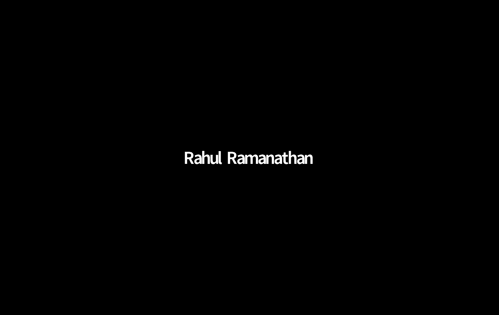
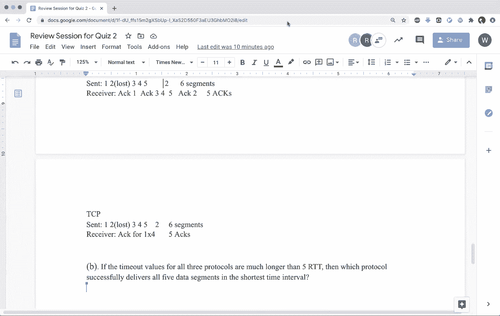
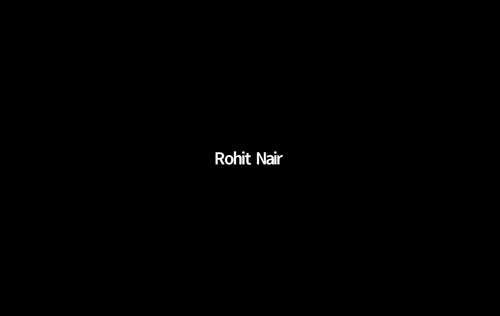

# 卡耐基梅隆大学 14-740 计算机网络 Fundamentals of Computer Networks（Fall 2020） - P18：Lecture 18 Quiz #2 Review Session - ___main___ - BV1wT4y1A7cd

Awesome， hey， everyone。 Welcome to another episode of。

Telecoms review sessions if you've already attended the previous one you know what to expect if this is the first time you're attending we'll just go over sort of the agenda for today the Ts have a couple of sample questions that will help you quickly brush up on topics that are covered。

In this quiz。But this in no way means that these are the only topics。

 if there is something that we haven't covered today， it does not mean that it's not in the syllabus。

 it's just these are generally topics that students face issues with so we'll be covering only these today in the interest of time。

Wendry， do you have the questions up， if so， you can share your screen？

We'll also give you some time in the end to like ask doubts and we'll also be going over them towards the end of the session as well y y。

 yeah， thanks for it so after the questions like the remaining time that we have you can sort of treat it like an open officer。

 you can ask us questions or get stuff clarified。

Okay， awesome。So yeah， let's get started we'll first tackle question P9。

 I think for this one you can just go through the question。Think about it and then maybe vote a yes。

 no， and then we'll sort of take answers from you as to what your justification is。And then。

 we'll discuss this。So it's just P9 for now， we'll be going over P14 after that。Yeah。

 I mean P9 shouldn't take you too long， ideally， you should be able to have an answer up in like one to two minutes。

好。Okay， I mean， I don't see too many votes coming in probably because the participants window is not open for you guys or I don't know。

 but I think this is enough time for this question because the questions had would require a lot more time so let's not spend too much time on this。

😊，So I mean， feel free to unmute yourself and justify your answer if you're up for that。Yeah。

I can justify my answer or try do。So I said that in general， it does solve the counterinf problem。

 but it's not a complete solution for all cases as there's still like education that exist。

 but it does it by advertising like the link links weight as and Fenddi forcing the rest them to react and update the path for it。

Yep， yep。So yeah， I mean， like if you think about the particular scenario that was discussed in class。

 yeah， for a given scenario， you can get。Poison reverse to。

Generally solve your counterinfinity problem， but it's really very special scenario specific I wouldn't say it's like single silver bullet that can sort of solve every single problem that can exist counter to infinity always can occur if I if you solve it for a given scenario of end nodes I can always introduce more nodes and create routing loops that can still result in problems so I think your answer should be sort of in that way that it can generally solve counter infinity but it cannot solve it for all scenarios。

I think yeah， let's move on to the next question。So yeah， this is a BGP based question。

 and you can expect questions。In the quiz that candy from routing in terms of both theoretical as well as scenario based questions。

 so this is one of the scenario based questions where you will be given usually you'll be given like a diagram of sorts and then you'll have questions based。

On that particular network that is given to you。So as you can see over here， we have four ASs。

 each of them have BGP running along with that you also have some internal protocol running for eachAS and yeah as we can see over here。

 depending on what the administrator for that AS has configured it to be。

 you have OSPF or RIP running over there。So in this case。

 you can see that the prefix x in the diagram has been linked at router 4 a within AS4。So you know。

 that's where x is originating from。And now you are asked to comment on。

How this prefix is going to be learned by other routers in different ASs， so A B。

 C and D are dealing with different routers。The first two being in AS3 and the next two being in AS1。

So I would say take a couple of minutes and。Try to visualize how the advertisements are going to travel across the network。

And at any given point of time， if a router is learning of an advertisement。

 think about where it is learning from and what protocol。😊，Is it using。And when you ready。

 type in the answer for part A in the chat， and then we'll go over all the parts from by one。

So we have a couple of answers for E BGP 1 for OPF。OSPF is part B。I mean， like the students。

We'll give you like another two minutes to like send me your answers and then we'll discuss the question。

嗯。Okay， so I guess we can go over the answers for these。So a lot of people I've said for answer A。

 it's EBGP and that is the right answer since 3C is the border router it will learn about that route while the exterior border get protocol。

Let's move on to part B。 So part B， there are some conflicting answers。Some people。

So there's some for OSPF， some for IBGB。Do you guys want to explain your answers， Sta points？Yeah。

 that would be nice。It's in the chat， but I guess like I said IVGP because it's communicating between gateway routers within the same autonomous system。

I think someone else says it's like IGBTP requires a complete mesh， so I guess that's not right。Okay。

 so。Okay， so the person who put the complete mesh point。

 do you want to talk about it or was that all？Okay， because from what I remember。

 I mean you're not wrong over there， ideally thats that is usually what happens。

 but from what I remember IBGP only requires a logical connection I mean it's only a logical connection that is required between border routers。

 the mesh aspect of it is required to prevent routing loops。

This is what if I remember correctly this is what I had learned and what I remember。

 so normally IBGP requires a complete mesh but the reasoning is different its in order to prevent routing loops but you can have IBGP without a complete mesh also。

😊，I do have a question along this lines。That means that every router， like in As S3。

 can communicate with。IBGP because you would have the for like so 3 C would have to send the IB B。

 B or I B GP message through 3 B， and then 2，3 A， right。Right， okay， cool So I mean， your answer。

 the second statement was correct， but not the first one。

 Not every router in AS 3 is actually running IPGP。3 B is not because 3 B is not a border router。

But then how does that get to 3 a if there's no the way that IBGP works is you can think of it as a logical connection between border routers that leverage the internal network in order to pass their messages along。

Okay， gotcha。So yeah， you would be sending your IBGp messages via 3B。

 but 3b will not be able to interpret it because it's actually not running IBGp it's going to use the lower layers in the stack to just simply transfer the messages catchcha so it's not yeah it's not doing anything to it it's just forwarding it to okay yeah thanks。

😡，So in that sense， the color answer for part B would be IBGP。

Do we have answers for Part C has or has not a okay。

 I see a couple of people have gone ahead and solve Part C。Are there any conflicting answers？

There are no， I think everybody seems to be agreeing on it， so you have to go a lot of people。

I think somebody unmuted， yeah， go ahead， go ahead。Okay， looks like。Looks likeOkay。Okay。

 then part C is EBTP that is that is right answer。And part D。

 So let's see what are the answers with part D。 We have some people saying same。 Okay。

 I think a couple of people who answered。佛八啲。Okay， maybe okay。

 maybe given the discussion we had about Part D， maybe you want to think again about part D。

And whether D will actually 1 D is actually running the protocol that you have in mind yeah。

A people changing the answers to rip？😀M。😊，Okay， not a lot， but yeah。

 okay see it looks like we have consensus on party sorry I did have a question about。B。

I have microphone issues I fix that real quick， but okay。So I agree that it's IBGB。But。

Could it also learn it from。OSPF， because it's still in the autonomous system and OSPF would forward that to all their routers。

So嗯。Okay， let's actually put it this way。You okay， how do I？

A simple example would be when I'm sending an HTTP message from my computer to yours。

 when you are receiving it， do you deem the protocol to be HTTP or do you deem it to be TCP？😊。

So I mean， like Htp at the end of the day is traveling over TCp no doubt。

 but is that what the protocol message is？😊，Okay， yeah。

 it don't make sense so it comes over OSPF but it yeah that is exactly message so it interprets it as such Yeah。

 so like I said， you can think of IBGp as a logical connection and you are leveraging the internal network to carry or transport those messages。

系 thank you。If 3 B had to learn about x， yep，3 B is。And internal router。

 so there's not going to be any Bgp involved for 3b yep。I hope that answered your question。

 Abdul Hadi。Cool， so I think everybody has tackled part D so far。And yeah。

 going by the estimation we've given before 1D is an internal router， it has no idea what BGP is。

 it's not running any of the BGP associated protocols。Yeah。

 D will be the internal gateway for whatever running on that is， which I think in this question is。

I o y。Okay。Okay， so question 15 builds on the same scenario。Yeah。

 so let's give you guys a couple of minutes to go through it and then same let follow the same set post to answers in the chat and we'll discuss them。

Yeah， I think yeah， just for this question again， probably will take like a couple of minutes per sub question。

Just to sort of clarify the diagram for people who are having trouble understanding it over here。😊。

We are specifically when looking at router 1 d in AS1。

It actually has two links that are labeled I1 and I2 so you can think of them as two interfaces。

On which the router can learn。Advertisements from。So when you say x comma I。

 I over here can be either interface one or interface two。Reass that all paths are equally weighted。

Yeah， you can assume all the parts of the same per and well Yeah， you。

 you can assume equal costs for the links and you can also assume。Similar BGP attributes。啊。Okay。

 do we have any takers for part A？Okay， we have a question in the chat。

 Should 282 C be lower than 2821 B， So over here， we're not looking at link costs itself。

 So you will only look at the hop count。But doesn't it make sense to also look at the link costs because the can be anything yep in in an ideal scenario it would。

 but just to sort of make this question simpler so that you don't have to think about costs。Okay。

But generally， it should be the case where autonomous systems should have lower link costs between themselves and。

嗯。I mean， it it really depends because。And because having a router outside of your autonomous system does not guarantee that。

You know， it is going to be at a higher cost to reach it than people within your own autonomous system like a very simple example to be given would be。

 let's say I have two college campuses。They are right next to each other。

Ideally each of them are their own ASS like they are ASS 4 and AS5。

 but geographically they are right next to each other so it's possible that in some scenarios that I can envision you can have 2A2 1bB of a lower cost than 2A2 2C。

Okay got it I think I think one thing you should keep in mind is that an autonomous system at the end of the day is just a physical collection of routers that come under the same administrative routing policy and what I mean by that is all of those routers you know the network stack they're running the routing algorithms that they're running all of it has been configured by a single entity。

That's what I mean by coming under the common administrative umbrella。 So that's what an A is。

 So an A can be anything from CMU to。Like a bunch of routers that I have set up at my own home。

 both of them are ASs in their own set。The only difference is CMU has an AS number and I don't。

That's all now， also， is it possible like there's no geographical limitations so。

Systs and N A S can be。Countries apart。 and it shouldn't like there shouldn't be something stopping from that happening。

 exactlyactly， You're right， You're right。 N S can pan a large geographical location。

 It can be distributed across locations， as well。Mmhmm。

So I guess we forgot one update for this P15 question。

 the physical link between 4 and 2 C now exists。It exists for for P for B in part sorry。

 in part A it's not there。 But the dotted line you see part B。

 you're sort of connecting that link now。but if you are doing part A。

 please assume this link does not exist。 my。Okay， so for PA A， we have a lot of people mentioning L1。

一。Anyone who would disagree？I want my。Yeah， anyway， yeah， same thing it yeah。Okay。

 so I guess that's clear to everyone。 Yeah， part B。

Is there anyone who thinks that it should not be I do？Yeah， so I think everybody is agreeing on I2。

 although the reasoning for it， I think well revisit this at a later point because。😊。

I think a couple of people might have chosen I2 due to some wrong reasoning， but yeah。

 we'll explain that。うう。Okay， how about part C？One collaboration replication is that for part C。

 there is no directly in between for and is to。That's assumption for part B。Wait， Wendry， actually。

 I given the question itself， I think maybe that link exists。

Because the sentences router 1 d learns x accessibility via AS 254。So two is are if2，5。Oh wait， wait。

 okay， okay， it's I' realized two， five4， that's good， two，54， yeah， got it。😊，And5 is between2 and4。

 Okay， yeahep。Yeah。Okay， it looks like some people have picked up on that hint， which I just dropped。

😊，That's good。是。Okay， I think that should be enough time。 Okay， just， you know what。

 take a minute more。 That's fine。Yeah， I think that's enough time for this question。So yep。

 I think a couple of people have picked up on the reasoning。That， you know。

 ASPA has to be given priority when you're selecting which route is preferable。Yeah。要不走。Yep。

 I think we're good to go for this particular question though， I think there's one thing， yep， oh。

 looks like whenndy beat me to it。😊，Sorry for low quality。I know that's all like， I mean like。

It's fine like this particular diagram is not something that we've picked up out of the blue。

 this is actually from your own class slides。😊，And I think this is part of the internet routing BGP lecture where it was covered towards the end of the lecture。

 you have this particular route selection algorithm with these steps and for these kind of questions where you're asked。

 okay you know which one would be preferred， you're supposed to follow this particular algorithm in this order。

 this is what BGP describes as the route selection algorithm。And。

You have to look at all of these parameters and see you have to basically work your way from one to seven it's like okay I first check point number one。

Are they am I still not able to resolve it move on to point number two is there still a tie move on point number three and so you will keep working away down the list until you are able to break the tie between the choices that you have for route selection。

So similarly， I think when we can you just scroll up for a little bit in part B。 yeah， so again。

 now if you had answered I1 or I2 whatever， I think you should again now go back revisit part B。

And think about whether your reasoning was correct based on this route selection algorithm that was there。

Because I saw that a couple of you had mentioned。That your choice may depend on how many hops are there。

end to end and that's not actually correct if you actually look at the route selection algorithm your first look is supposed to look at the shortest as path。

😊，And if the AS path matches， then you move down the list and you'll notice point number six is prefer the path with lowest IGP metric。

 so only if you have reached until 06 and you still have a tie only then will you be actually looking at the hop count within that AS until then it's not a factor。

So yeah， that's just something I wanted to highlight like。Cool。

 I think we can move on to the next question， right？Okay， now we're moving on from BGP to。

Distance vector， this question shouldn't take too long in my opinion。So， I think probably。

A combined of five minutes for all three parts should be sufficient。

Or maybe two minutes per part I don't know， you guys let me know in the chat or just vote when you're done。

Because this is not something too difficult， we chose to give you just a subsection of the network as opposed to an entire network graph。

One particular tip for this question that I would have is when you're solving。Part a。

 it would be useful to write out the Belman for equation for。

For all of the three W Y and U nodes when you're calculating。Because。

If you have that equation written out， part B and part C will become real easy because you will already be able to see where the cost of x to W and cost of x to y factor into the equation and on whether depending on just modifying those factors you will be able to see whether you're able to solve part B or part C。

For people who don't remember the I'm talking about the equation in Belman For where when you're trying to calculate the distance vector。

 you find the minimum。Of all the costs to your neighbors and then the distance vector that that particular neighbor has advertised for your destination node。

Yeah， I think people should have the answers to at least part a by now so。

Feel free to type in the chat or。You know， unmute and answer if you think that's easier。

I think at least for W and Y， it should be pretty straightforward。

Because you don't need any knowledge of you。To calculate those。Okay。

 looks like we have any one answer so。Sres， would you want to explain？

Because I think people are tired of listening to my voice。

 so maybe if you want to unmute and explain if you're okay with that。

Since W will advertise the cost till y and that is less than what is actual the gap between like x and y if it will take part from x to W and W to Y。

Awesome， yep。It。Yep， so I think the answers are on your screen， but yeah， for W。The shortest， but。

You have it to be a directly connected neighbor of two for why。Even though your direct link is5。

 you have a shorter path of2 plus2 YRW， so that becomes four。And in case of U。

 you know that the cost from w to U is5 and from y to U is6。And given the。

Cost you calculated previously， which are two and four。You can see that。2 plus5。

 which is 7 is a shorter path to reach Y or W than from y， which would be four and6。Cool yeah。

 so now Paby's basically asking you for one， okay， we have a question in the chat。嗯嗯。

I'm not too sure what we。 Okay， Yeah， do we need to note。Yeah， I mean。

I don't think that actually factors into that。Do this scenario over here。But yeah。

 this given scenario is entirely possible wherein even if one of your directly connected neighbors。

 you know that it's only a one hop count， but that link can be significantly weaker as compared to going。

😊，Through multiple hops and each of those hops having。Like a much stronger link。

 which would mean it's a lower cost to actually send your traffic via that is entirely possible yep。

Okay， yep， I think for part B and C， you should have been able to tackle both of these together。

Using the same equation。I don't see too many answers in the chat has my Zoom stopped working or have people slept？

Anyway， yeah， in the interest of time， we won't spend much any more time on this question。

Reel quickly because the next question is actually， we feel it's pretty important。

 So we don't want to compromise on that for part B and part C。

You should know that basically the Belmonford equation will tell you that in order to reach the destination U。

 you will find the minimum。Between these two values right one the first factor being you will add the cost to reach W and then the distance vector from w to U so that will become your one of your factors and the second factor will be the cost to reach y。

And then the distance vector from y to U。And so now given that you have this particular equation。

 which is minimum of Cxw plus Dw comma Cx Y。And D U。

You can now see that you're allowed to modify only either。

The cost from x to W or the cost from x to y。And depending on those， you need to see。

Whether x will have a link， whether x will have a change in its forwarding table or not。Okay。

 we have an answer that we shared in the chat。😊，bar b。If it becomes one。嗯，诶诶。I'm not sure it's。

Completely correct。Because I do not know if。C， X， Y， exactly one。 Will there be a new。

So does' the plan。I think so yeah， I mean， I think that depends on what the question is asking like。

When they say X will inform neighbors of a new minimum cost path to you。

 do they mean a change in value through the same node。

 is that acceptable or do you need an entirely new node to occur？In the but。

Since you guys said it's Belman For wouldn't it anyway advertise change in path when it drops below two。

一入。Yeah， that's right I mean， I would assume that that's what the question is asking。你 so yeah。Yeah。

 so I think I see two answers and both of the answers seem to cover both the scenarios in the case where。

We already know that the minimum is7 via w so in which case one of the things you can do is you can reduce the cost from x to W in which case the value 7 itself would change and it'll become6 but you still are going through w so that's one answer The other answer is you can actually increase the cost。

Of x to W in a way such that now the route y is preferred。So you can increase the cost to。

 I would say anything greater than six。And for the question。Of Boston。

If C X W is a value greater than 5。 I think it's greater than 6。 Then it definitely goes through y。

 I if it is exactly6。呃。Yeah， if it's exactly six， I don't think that triggers a change。Wait， so。

 oh right， because yeah， okay， I'm because I forgot about those past you are not the same， right。

 There's one that's minus five as Yeah， I wasn't thinking about that for a second。 Yeah， okay。

 that makes sense。 Yeah， I just mentioned them。Well， yeah， for part B， I think we covered both and y。

 for C now you just want to make sure that it will not inform its。你不数。fromci， do we have。Yeah。

 I mean， I could just go and say， which is what Ab you was saying as well。 But yeah。

 you just increase X to Y to， I mean， anything really， because it's not using that already。

 So any increase that link wouldn't make a difference。 Awesome， Yeah。

 I think everybody else also think basically be on the same thing。 And yeah。

 that's like since the minimum。To U is Y I W。 That's the current minimum cost that we have。

 So anything that you increase in the cost from x to y would。Essentially not affect a change。So一。

Even if we decrease C， X， Y by like by one。Yeah， actually。

 even a decrease as long as you hit the limit， yeah。Yeah， that's correct。So yeah。

 increase to any magnitude is acceptable， decreasing by one should also be acceptable， yeah。

The only thing I wanted to keep in mind is yet the decrease is not unbounded， the increases。😡，Cool。

 so I does anybody have any questions up until this point in any of the。

Topics that we've covered so far all the questions that we've solved so far。If not。

 we can move on to the final few， yeah。Okay， so let's go give you five minutes to go over these questions because I don't think they should take too long。

 these should be simple theoretical questions and then supposed to answers in chat and then we'll discuss them quickly as well。

So do you have any answers for part？So we have one answer would you like to unmute and explain？🤧Yeah。

 so。嗯。Because the receiver is expect expecting。The sequence number K。嗯。The， I mean。

It has already sent the x up to k minus-1， but we don't know for sure if the。

Sender has received those acts， so。It it will start from at least k minus4。 I mean。

 that is a possibility。Right， yeah， okay。And I mean， it can't be less than that， right， correct。

 I mean， if you're expecting K that you your inside is right that the last act sent by the receiver will be k minus1 and you are unsure if that has been received。

 correct， So then the window would be from k minus4 to K minus1 on the worst case Yeah。

 and on the best case， it will be from k to k plus3 can't be K plus one， right。嗯。嗯。Yeah， yeah。

 it would do that。So the best case would be that it is expecting k and that was like the first packet that in the sender's window as well that the send just sent and it just didn't receive that act yeah so send's window could be from k to K plus 3 yes。

Is that clear to anyone， everyone， and do they have any doubts？

Would you clarify the worst case scenario again， I don't think I like I'm not sure I follow like why can you have the send window not include cave the receivers expecting it？

Okay， so let me see if I can make this more clear。So the receiver is expecting k。

 so k minus1 was successfully received and an act was sent out。

 but you are unsure if that act was received by I got it you。

Are there any other doubts before we move on to part B？Okay， go ahead， type in answer part B。

 and then we'll look over that as well。Okay， so we have a couple of a lot of answers in k minus4 to k minus1。

 I even want to go over that explanation really quickly before we move ahead。Yeah。

 I see a couple of answers that seem to be agreeing with each other。 So if any one of you。

Wants to justify your answer， feel free to unmute。Well yeah。

 I guess you all caught up onto the right answer so I guess yeah。

 it is k minus4 to k minus1 and yeah that's because then that could be in flight yeah。

 so that is the right answer actually。So I guess we can move on unless anyone has any doubts that you would like to ask before we move ahead。

Okay， so I guess we are good to go ahead。Yeah， I don't see any doubts。Yeah， yeah。

 I think your major takeaway from this should have been that as can be in flight。And。

I don't know if there was anybody， but in case you're wondering what GN is， it's the go back and。

Protoical。That was discussed during reliable data transfer。Cool， yeah， V 23。 then， yeah。

It's a very straightforward answer， I guess it shouldn't be really complicated。

Let's not spend too much time on this。And for people who don't remember go back in。

 one key thing to remember is that there is no receiver side buffering。Yeah。

 I think the answers in the chat seem to have the right idea。个人 an approach。Yeah。

 I I guess that's a really good point if let's say the receiver received the segments out of order。

 then in case it'll also yeah。It would like even though it received all the segments。

 it would basically not acknowledge all of them。So I guess that is like the main insight for this question。

 I guess。Are there any doubt？Like is it not clear well， everyone。Yeah。

 feel free to unmute or if you're not comfortable with that。

 feel free to even send a private message to any of us。We'll address those anonymously。So yeah。

 I think that your only takeaways from this should have major been you can have scenarios where a。

 you are losing one of the intermediate segments。And so any of the few segments that was。

 let's say you lost segment 2。 So 3，4，5， even though we're you know。

 correctly delivered at the receiver， the receiver will just not。

Per them and you will keep getting a duplicate act for whatever was the last correct in order segment that was received and the other scenario is that you know you didn't have a loss event but still due to some reason your segments arrived out of order。

Again， in which case the receiver will only acknowledge the last correctly in order segment that it expected。

And then you would face like a lot of retransmissions。

 so yeah that will be like extra overhead for this。Cool。

 I don't see any questions or doubts or clarifications， so I think we're good to go。

So let's give you like another two minutes。And you can you guys can type answers in chat and then we'll go over it。

嗯你。If no one' is going to share his or her answer。So we can just。S my。So， in go back and。嗯。First。

 the center sends five seconds。And the second one is lost。First呃 send sense1，2。5。

And the second one is lost。It will will wait for the。On the rec side。Well。It will add the first one。

And then it will see the one， see the second one because the second one is last。So if。

 if the receiver receives， for example， the third or the fourth or fifth。

This receiver will keep acknowging one。1 and one。 it will do this for three times。And when。

The second segment， the timer for second segment。这个 your time out。

In go back and send will send everything from the second from the second segment all the way to the fridge。

So it will send everything once again。And as a result， as a result。

 the center will send 9 segments in。If we assume the。TheSecond time， no no7 large。

the receiver will and in order， the receiver will act also in order。So I think is'。8ightX你。Yep。

 any questions on？Go back in。Okay， doesn't look like it， yeah。

I guess this question is actually quite simple。And for SR。The difference is that now。

The the on the on the receiver side， there is buffering。So。

Thecent will do everything the same in the same way in the first。And on the， sorry。

And the哋师 website晒。To at1。And when the receiver receives。And the third。It will actually add。

The third and。It the solar understanding of this。AndWhen the timeout is。

 the send will only need to send the second segment once again。

And the will have to act your second segment once again。So， in total there。There are。6 segments sent。

In the5。好。呃。Do you agree with my answer and。Very confident action。 It is。在。No。

 selective repeat looks right to me。Yeah。And TCP。Is reminder that a reminder that the question assumes that there is no delayed act。

嗯。我 send都晒。To do everything。嗯。On the receiver side。嗯。

I think it's quite similar to thiss at the first line。And seems the second way。

The receiver will receive the third one。It will buffer it， instead of just。Discarding it。But I think。

I think the second acknowledgeknowledment that the the receiver senses should be an acknowment for。

first segment， That was the first segment。Because this receiver is still expecting the second one。

I think it will do this for third time。And。The on the center side， the center will receive。

A lot of duplicate cut packs。Which。Indates the the second segment they source。So to understand。

The second segment once again。Before time up。So it should be at your same match。啊。可。

6 segments are sent on the center side。And five as percent。I the civil side。I have a question please。

So， in the TCP。The as would be for two， right， like because the next expected segment is2。呃 sorry。

So in the TCP， when you act， you， the receiver says which is the next expected segment？

This one should be like。do that this one。So TP is a bit different from GB BN and SR in that the sequence number in TP。

Marks the net expected by。Oh， this reminds me of one more thing that might be worth mentioning。

When you guys did lab too， there was a question asking you to。To calculate some sample R TTs。

And estimate R D Ts， which requires you to match the X with the segments。It seems that。Some of you。

Forgot to add the length to the segment to the sequence number to get the corresponding acknowledgement number。

So in this case， we do not actually know the sequence number and acknowledge numbers because we do not know the length。

我睇 c片。We want the eggs have a sequence number of the next expected， but yes。

What do we have to do this for the question。So I mean， in this question， we can assume that。

Like even though we don't know the length， we can just assume that okay。

 the act is going to be sent for。😊，Whatever next expected is， right， yes。

 we only know that it's an act for this first segment。 It will be the。It will be the number of the。

 the next bite in。Psma for the second segment， but we don't know what the exact number is。 So yeah。

 that's what I'm saying。 like for now， we can just assume that， you know。

 it's going be act act 2 because let's just assume that all the segments are of length one。

 So once you've received one， you'll send an act2。嗯。Oh， there's a second question。

If the turnout values for all three protocols are much longer than5 I。

Which process actuallycal delivers。All fact data settlements in the shortage that time into。Okay。

 actually wait before that， I think we have questions in the chat。

For GBN receiver discuss out of order， should it be act1。Wait till get segment2 and act 2，3，4，5。

I think that's what we showed in GBN right if you can scroll up。

 I think the receiver will still send a。When it receives a segment，3，4，5， but， it won't。

 it won't act for these segments。Yeah， it will just discuss the segments because it's not in order。

Yep yep。So yeah， I mean， I'm just trying to read the students's question。

 I don't completely understand。And。So I think the point raised by the student is valid。

 so in the example given in the slides no aent。The packets are directly discarded No。

 I'm pretty sure the acts are sent。No， go back and。

 go back and does acknowledge the most recent in order segment that you've received with slide deck。

 is this reliable transfer lecture 10 slide 20。 And you can take a look。

 Isn't it sending It's actually， it actually is sending act。 Yeah， it's sending act 1。

So if you actually notice， it sends Act0 a1 and when you're receiving segment three。

 you're discarding segment three and you're sending back act1 again。😊，Oh okay， but it's， yeah。

 I mean， the arrow is outbuing is's just we have not like the professor has not shown it being received on the center side。

 but the receiver does act one again and again okay，Okayright， thanks for the clarification。 Yeah。

 yeah， nobody's nobody's。嗯。Yeah， Ill think I' have seen answers for Yeah I think I think we've caught up everything in the chat。

 Yeah， we can move on。Are there any other outstanding questions。

 anyone else has it out before we move ahead？Okay， then we can move part B， I guess。

I think all answers in the chat are correct。The key idea is here is that TCPement spark the root transmission。

And in this case， we can see the receiver keeps sending X for the first segment。

And Sand will get notified that the second segment might be lo and you will send that again。

While in the first two cases。The send always awaits for the timeout of the second segment。To do the。

Are there any doubts for this？Yeah， so I think one student raised this in the chat and yeah you're right in GBbN and in selected repeat youd have to wait till the timeout in order to retransmit。

 but the questions。Clearlyly specified that the timeout is equal to greater like its greater than equal to 5 RtT so we know for a fact that the timeout is only going to go off after 5 RtT and in this duration TCP would have already seen three duplicate acts。

😊，I do have a question I mean， I agree with TCP being the fastest but。

It would also go back and would also。Start to retransmit the packets once it receives the first duplicate act。

 right， even if a timeout doesn't occur。 So like， let's say。Or sorry， adult order， right。

 So like if it receives let me go to the Oh right， Yeah， no， no， When receives a duplicate actor。

 I kind of like in slide 29。Where it would send act one and then like segment three is out of order with discards and it sends act one so like once it sees a duplicate act。

 even if the timeout has not occurred， it would then start to。Retransmits。I guess segments two。

So I don't think you should be using that particular diagram for reference here because the questions timeout value is different the question has specified that the timeout is going to be。

More than5 R Tt。So。Yep right， but I was just saying how if you look in the diagram it's like it only it only sees that segment two hasn't reached the other side once the timeout actually takes place so if you look it like 29 for example it only re transmitits segment two after it after it times out yeah。

 but that's also because it doesn't receive that act before the timeout so like let's say that very like the third purple box on the right where it says send act you discard segment three。

 you send act one that'd be the first duplicate act that was received before the timeout occurred。A。

Then it would then start to it would then send segmentma to， right？Or does it。Yeah。

 I guess that's my question。I'm not sure if there is a fast street transmission policy and go back and we weren't taught one。

 at least。Okay， so it solely just looks at。The timeout Okay， no， so yeah。

 as far as I know go back in is only timeout driven。That's weird but then， but it also says。

 so GBBN it says receipt of so on slide 27， it says receipt of out of order segment， discard。

 no receiverside buffer。 and you have to。Yeah， but the receiverce's behavior is like right， but then。

It just seems like kind of dumb where like， I feel like if， okay， I don't know。

I feel like this is stupid。 I feel like if they would have gotten a duplicate act。

 they would have realized like， oh， we should not even wait for the timer。

 But I guess I could have done this。 Okay， I mean， I know， I understand this is like a very basic。

 Go back in's just an theoretical。 Yeah， yeah。 I mean。

 I realized that these are real basic and whatever。 But I feel like。

That was extremely basic Yeah whatever Okay cool yeah， yeah。

 I think the concept I think the key to understand here is that obviously these things could have been done in these protocols。

 but these protocols were targeting simplicity of implementation over the guarantees that it's trying to provide the application。

😊，Also， I feel like it is possible that so， for example。

 segment 3 or four might have reached the receiver before segment 2。

 even so segment  two might have been out of order， but it would have actually。

It would have actually been eventually received by the receiver and we might have received duplicate act to the towards the sender。

 but that doesn't mean that segment2 went out of place or it's missing so right， right。

 that's completely possible。But yeah， but if segment2， even if it's received out of order。

 it still screws up the receiver hard。 Like even if it's not lost， if it's just out of order。

 it's still。Yeah， well you get for， you will get duplicate act。

 but you don't necessarily have to retransmit segment to that thing。Oh。

 I she was saying like yeah and I think he reality the timeout won't be very long as the question。嗯。

Okay， so I guess that covers all of the questions that we had to discuss for today。

 we are open to taking any doubts that you guys have value you are preparing for the quiz。

Yeah， and。How much time do we have。Yeah， I mean， like。

You can actually have a couple of either doubts or maybe some slide that you didn't completely understand。

We'd be happy to go over those， as well。I think like the reason I'm putting this is because I think during office a couple of us received questions about certain slides or some concept that didn't make sense。

 like maybe certain DHCP behaviors or maybe what is IPV6 auto configuration， stuff like that。

So feel free to ask questions on that。Okay， I think somebody is already unmuted， go for it。

Question in lecture 14， like towards the end， we didn't really get to ICMP。

 so I was like trying to answer the like ping like the ping duplicate question where it's like sometimes you can get a a duplicate ping back。

And it's like asking why and so like the reasoning I came up with was like。

Like if you somehow have the same ping got like readtransmit to two different routers。

 they could both send the reply back and then you get a duplicateki。

 but I wasn't sure like if that was the correct like answer we were supposed to come up with So the thing is that there actually is no correct answer for that turns out that this was basically just some anomaly that the professor had observed during one of his trips where he just sort of did the ping and he saw something that he'd never seen before and he just wanted to know the students' opinions on why you think that happened we still don't know what the exact correct answer is or why exactly that happened but yeah your your scenario seems to fit the bill。

Okay， cool， cool， cool， thanks。And yeah quick note。

 side notes rather like La2 has been graded and we've published them and for certain questions we made sure that you know the students get some feedback in case you've lost points so make sure that you go through La two before attending the quiz because that will give you a good idea of you know maybe some mistakes that you've been making and you can work on them before you give the quiz so that you don't repeat those。

I have a question on。Slide 25 of lecture 15。Mature 15 yeah， the routing algorithms。

 so it's with disinffeors。And so it has。So you're looking at node U and you're trying to calculate this this distance vector that's going to be stored in you after you take all the distance vectors on VW and X and so my question is so they show just the first calculation。

Of getting w equals four， I mean， they feel like the rest of it on the right too。

 but they just show you how you get w equals four。Oh。But， my question is。

Where it gets confusing and I'm not sure if I understand it's like。

After you would calculate that W equals 4。Z should then turn to9。

 but I'm wondering if like as you calculate these values， like you don't look at these。

These values you just calculated to calculate the remaining。A。

Values so like what I mean by that is like z is equal to 10 So how they got z equals to 10 is from node U initially you know。

 you can get the W and five and then that the only other node that can get this。Z initially is W。

 right？And so you say， okay， so five plus five， I mean obviously there's other math right but five plus five is the math to pretty much do and then you get the 10 right。

 but if you were to take the value of w equals four which you get。From going， u what is it。

 I don't remember what path you go through， but I guess it's going through X， right？Um，Yep。

 then that z value would be nine， right？So like I guess my question is like。

 I guess you don't use the values you just calculated when determining the rest of the distance vectors。

啊。Is that correct or can you like because if you could use that four value， you just calculated。

 then z would be9 and not 10。If that makes sense。So looking at the example。

 the node U never really learns about the path Y W to z。

So I'm still kind of unsure about how would it learn about the path YW either for 10 or9。Well。

 so W gives this distance vector to you。And W's distance vector has。Like the value of Z。

And since node U already knows w to be5 initially， if we if we didn't take u from if we didn't take node x's value W。

 right？Or let's just say， yeah， let's just say we're just talking about nodeU and node U gets W's update。

 right？Then it would say， okay， I know Z is like no W can get the z and5 and I know that I can get to W and5。

 which means that my Z distance vector is 10。Which is great。

 But when you throw in all these other ones， right。

 when I the ones is like node V and Note X when you're updating the distance vector for you。

 you have the case where like， if you were to update W like verse before you even got the Z。

Then you could have it where node X says， oh， I can get the W and3。

And you know that you can get the x of one。And that's why W gets updated to4。

 And then you can be like， oh， well， now my， it's almost like that node you on the far left。

 it would be。Like in the middle of updating。 So that would be a4 and instead of a5。

 And then you would get to calculating the。Z later， and you'd be like， okay， okay， well。

 I know that now it's， I can get W 4 and Z， I can get to it 5。 So Z would be 9 instead set 10。

 So I guess my confused or what I want to make sure I understand。Is。That you can't use the values。

 You just calculate it to calculate the rest of the。Distance vector， you have to。

Calculate them all based on like。Yeah， so so basically in distance vector if you actually notice the Belmanford equation does not use your previous state in order to calculate what your next state is going to be it's based on whatever you hear from your neighbors at that given point of time gotcha which I know in the next like it shows like in the next slide think after the second exchange it gets updated which would make sense because。

There'll just be more updates going to their neighbors and stuff。Yeah， okay。

 I just didn't know if there was like。A way to。Thank so think I think one useful way to actually imagine how the update would be going is at every exchange。

 you can think of the radius increasing by one hop every time。 So like in the first exchange。

 like you sort of only W only knows its immediate neighbor of Z And then on the second exchange。

 you now double that radius。 So now you know the information of everybody who's at a two hop length and then the third exchange。

 you will now know everybody who's at a three hop length and so on and so forth。

 correct So building on that So let's say from the beginning with node U right So at the first iteration of the algorithm you would just know how to reach V and x at the second iteration it would' know how to reach W and y at this point it still doesn't know anything about Z And so at this point after that I guess So know Z because theres yeah U to W So when it actually finds So when it on second it moves from V。

Onwards to W and Y， you can see that y has like a shorter， like a lesser cost path than W。

So the path to ZYW would never be updated in you。DoesWe'll get to you once probably Austin's question is clear。

 Oh yeah， yeah。 sorry。 Yeah， I mean， I think I。I think I understand。 yeah， sorry。

 my mic was still eat it。 but yeah， cool cool cool。 Yeah， we'll go for it。

I just have a real quick question on I understand the relationship between the by stream and like the sequence numbers and TCP。

 but in the diagram on I guess it would be slide I' I guess I't always see the slide numbers but in lecture 11 it has just a acknowledgement number that's going with it out to the server is that initial acknowledgement number。

Random， randomly generated， randomly selected。In拿。Could you repeat which line it was？Oh。

 I think it would be on 29 is what is in the PDF。It goes out with the user types character C and there's sequence number 19 and responds backment 9 with acknowledgement 20。

 which I understand that but also goes out with acknowledgeledment 87， and I was curious。

Is it 87 just randomly selected initially？Okay now so the so when an app is sent out that's basically like that's the next expected byte that you need so when the client sends let's say sequence 19 so that's like the message that it's sending with app 87 means that is the next byte that it receives that it's expecting from the server so that's why the sequence number is 87 on the message from the server。

So yeah， and and the server will reply with add 20。

 So like if you do if you do like one more line yeah， that's like the next line。

 So sequence 20 is what it sends next。Yeah that that makes sense so the 87 that the client is sending to the server comes from the expected bike from the server Yeah that's the next I mean it's it's difficult to say at this point because we actually don't don't know what happened in the conversation prior to this message so like it's difficult to know exactly why we got 87 but that's basically because of the conversation that's been happening between the client and server before this message was seen like we don't know what happened before that right。

Okay， so then the initial acknowledgement number， I guess I'm confused on where the initial acknowledgement number comes from because I know the initial sequence number is somewhat randomly selected。

 but then it goes off the expected byte。I need to acknowledge number acknowledgement acknowledge number。

 do you mean the first？In a sin， in a same segment。

So I guess the handshake is what would actually set that up for you exactly like okay for this page of the slide。

 this is definitely not the first segment that the user sends there must be some going on before that and for this thing segment I don't think that matters because。

It does not have an act on， right。Goashia okay that that clears that up I was just kind of lost being in mid conversation that slide thank you yeah that's fine I mean and to your point that you raised of sequence numbers being selected randomly that actually happens both ways because in doing the handshake it's not just the send but also the other side who picks their initial sequence to be random。

Gotcha， thank you。So yeah， that would be part of the handshake， but we don't see that here。

Are there any other doubts that we can address before we call the session to a close？

I have one more thing just real quick to add kind of about that。 I was sort of do something else。

 I don't think it was addressed， but if it was my bad。 So I know like in the。

And the wirechar captures like so obviously you do the TC handshake。

 which ends up sending both the sequence number and ament number two， a relative sequence number one。

 right？And so。Throughout the trace， we have things that are coming from the server because the server isn't sending data。

 we're sending data to the server， at least in one of the examples in the last lab we were doing。

With the posting， so the sequence number is always one and it always gets acknowledged as one。Uh。

 and so yeah， so whenever you send something with， even though it does end the handshake for whatever reason。

But like it sets the value to from0 to1。 whenever you're sending sequence numbers acledments back and forth with no data。

 that'll never change， which is why sequence number for the server state one throughout Well。

 it went in the sequence or when the packages being sent for the server to the R machine。

 it was sequence number one and then obviously， if it was being sent from like if our machine was sending something to。

啊。The server， then it would be ament one， but like that never changes because the length value has nothing in it。

If that makes sense。 Like， I could， I guess I could show you。 Oh yeah， I mean。

 I'm looking at the capture right now。 And yeah， but in my case， actually。

 I do notice that because some push flags are being sent。 So in that case。

 the sequence number would get updated。Okay， so mind yeah， ideally。

 if you have if you have an ideal client server interaction but the server is not sending anything。

 then most likely your sequence will always be at one because the data that you're receiving。

From the other side。Is， I mean you're not receiving any data like right if it's if it's a one directional thing。

 then yeah， your sequence is most likely constant gotcha。

 but it's just some sort of like whenever you're doing the handshake it's just like the methodology and which they use is not actually sending。

And， yeah， it's a data yeah， yeah， okay， cool。In handshake， I think it's a bit special。

 The noise number is has to be the sequence number plus 1。Yeah， okay。 yeah。

 So it's a specific thing to that， yeah。Okay， cool。Thanks。Oh yeah， in handshakes， it's fixed。

 but yeah， in general， I'm just saying。Yeah， yeah， okay， I got that， thanks guys。Yeah。嗯。So， yeah。

 I think I think。Yeah， I'm going to stop recording then。Yeah。

 well post the recording on Piaz as well so then you guys can access it later as well。

 So I guess best of luck for your quiz。And it' see you are on Tuesday。

