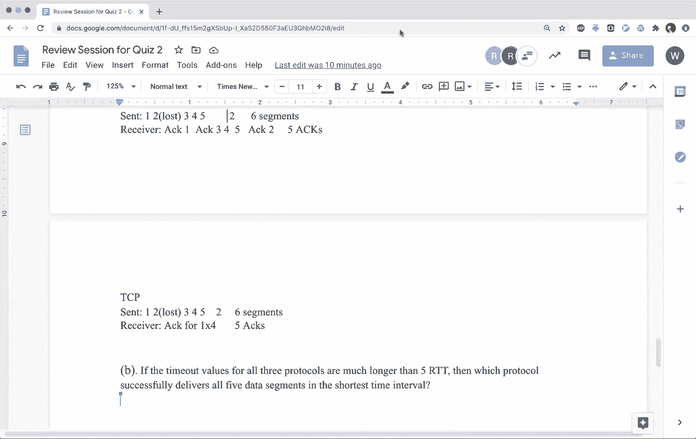

# 计算机网络基础：18：第二次测验复习课

在本节课中，我们将一起回顾第二次测验可能涉及的核心概念。我们将通过分析助教提供的几道样题，来梳理距离向量路由、BGP协议以及可靠数据传输等关键知识点。请注意，本次复习涵盖的题目仅作为示例，测验范围可能更广。

---

## 问题 P9：毒性逆转

上一节我们介绍了复习课的目标，现在让我们来看第一个关于路由协议的问题。

毒性逆转是距离向量路由协议中用于解决计数到无穷问题的一种技术。它的核心思想是：当一个路由器通过某个邻居得知到达目的网络的最佳路径时，它会向该邻居**通告**到达该目的网络的距离为**无穷大**（例如，在RIP中是16），从而阻止该邻居选择通过自己再回到目的地的路径，以此打破路由环路。

以下是关于毒性逆转有效性的一道判断题：
> 毒性逆转通常能解决计数到无穷问题。

**请思考**：这个说法是否正确？请说明你的理由。

**分析与讨论**：
毒性逆转在**特定网络拓扑场景下**能有效防止计数到无穷问题。它通过向产生最佳路径的邻居发送“毒化”更新，切断了环路形成的可能。然而，它**并非适用于所有场景**的通用解决方案。在更复杂的网络拓扑中（例如涉及三个或更多节点的环路），仍然可能产生计数到无穷问题。因此，该说法是**有条件成立的**。

---

## 问题 P14 & P15：BGP 路由传播与选路

在了解了毒性逆转的局限性后，本节我们将深入探讨自治系统间的路由协议——BGP。

以下问题基于一个包含四个自治系统（AS1, AS2, AS3, AS4）的网络。前缀 `x` 起源于 AS4 中的路由器 `4a`。各AS内部运行IGP（OSPF或RIP），AS间运行BGP。

### 问题 P14：路由学习协议

路由器通过何种协议学习到前缀 `x` 的可达性？

1.  **路由器 3c** 学习到 `x` 的协议是：**eBGP**。因为 `3c` 是AS3的边界路由器，它直接从邻居AS（AS4）的边界路由器 `4a` 通过外部BGP学习该路由。
2.  **路由器 3a** 学习到 `x` 的协议是：**iBGP**。`3a` 也是AS3的边界路由器。它从本AS内的另一个边界路由器 `3c` 通过内部BGP（iBGP）学习该路由。iBGP消息通过AS3的内部网络（由 `3b` 转发）传递，但 `3b` 本身不运行BGP。
3.  **路由器 1c** 学习到 `x` 的协议是：**eBGP**。`1c` 是AS1的边界路由器，它从邻居AS（AS2）的边界路由器 `2c` 通过外部BGP学习该路由。
4.  **路由器 1d** 学习到 `x` 的协议是：**RIP**。`1d` 是AS1的内部路由器，不运行BGP。它通过AS1内部运行的IGP（本例中为RIP）从本AS的边界路由器（如 `1c`）学习到该路由。

**关键点**：BGP路由在AS内部通过iBGP在边界路由器间传播，再通过IGP分发给内部路由器。

### 问题 P15：BGP 路由选择

现在，我们聚焦于路由器 `1d` 的路由选择。`1d` 有两个接口（I1, I2）可以学习到前缀 `x` 的BGP通告。假设所有链路开销相同，BGP属性也类似。

BGP使用一个**路由选择算法**来决定最佳路径。该算法按顺序检查以下属性，直到打破平局：
1.  最高本地优先级（Local Pref）
2.  最短AS路径（AS Path）
3.  最低起源类型（Origin）
4.  最低MED值
5.  eBGP路径优于iBGP路径
6.  到达下一跳的IGP开销最低
7.  ...（后续步骤）

**问题**：
-   **A部分**：当 `1d` 仅从 I1（通过 AS2, AS3, AS4）和 I2（通过 AS2, AS4）学习到 `x` 时，它会选择哪个接口？答案是 **I2**，因为其AS路径更短（2跳 vs 3跳）。
-   **B部分**：如果新增一条从 `4a` 直接到 `2c` 的链路（图中虚线），`1d` 现在可以通过 I2 学习到路径 `AS2, AS5, AS4`。此时会选择哪个接口？答案是 **I2**，因为AS路径长度仍为3跳（与I1相同），需要进入下一步判断。根据常见配置和算法，通常eBGP路径（I2）会优于通过iBGP学到的路径（I1，如果AS2内是iBGP传播），或者比较MED等属性。但根据给定信息，最可能的选择仍是I2。
-   **C部分**：要使 `1d` 选择 I1 的路径，需要满足什么条件？需要让通过 I1 的路径在BGP选路规则中优于 I2 的路径。例如，可以**为通过 I1 的路径设置更高的本地优先级（Local Pref）**，这是BGP选路中优先级最高的属性。

**核心概念**：BGP选路不是基于端到端的跳数，而是基于一系列路径属性，其中**AS路径长度是早期且重要的比较因素**。

---

## 距离向量路由计算

从AS间的路由回到AS内部，我们复习一下距离向量算法。这是距离向量路由协议（如RIP）的核心。

考虑一个网络子集，节点 `x` 需要计算到达节点 `u` 的最短路径成本。已知：
-   `x` 到邻居 `w` 的成本 `c(x,w) = 2`
-   `x` 到邻居 `y` 的成本 `c(x,y) = 5`
-   `w` 通告其到 `u` 的距离 `d(w,u) = 5`
-   `y` 通告其到 `u` 的距离 `d(y,u) = 6`

**贝尔曼-福特方程**用于计算最短路径成本：
`d(x,u) = min{ c(x,w) + d(w,u), c(x,y) + d(y,u) }`

**A部分：计算当前成本**
代入数值：`min{2+5, 5+6} = min{7, 11} = 7`
因此，`x` 到 `u` 的当前最短路径成本为 **7**，下一跳是 **w**。

**B部分：何时会触发更新？**
如果 `x` 到 `u` 的成本发生变化，`x` 会通知其邻居。根据方程：
-   若降低 `c(x,w)` 使其小于等于1，则新成本 `≤ 1+5 = 6`，路径仍经 `w`，但成本值变化，触发更新。
-   若增加 `c(x,w)` 使其大于6，则路径将切换至 `y`（成本 `5+6=11`），触发更新。
-   若调整 `c(x,y)`，只要不使 `5 + d(y,u)` 小于7，就不会改变当前最优路径（仍为经 `w` 的7），因此**不会触发更新**。例如，将 `c(x,y)` 增加到任意值，或减少到不低于2（因为 `2+6=8 > 7`），均无影响。

**C部分：何时不会触发更新？**
如B部分所述，**增加 `c(x,y)` 到任何值**，或**减少 `c(x,y)` 但保持 `c(x,y) + 6 ≥ 7`**，都不会改变 `x` 到 `u` 的最优路径选择，因此不会触发更新。

---

## 可靠数据传输协议比较

最后，我们比较三种可靠数据传输协议：回退N步（GBN）、选择重传（SR）和TCP。这是理解可靠通信机制的关键。

考虑一个场景：发送方窗口大小为4，序列号空间足够大。接收方期望收到序列号 `k`。所有数据段长度相同。

### 窗口序列号范围

**发送方窗口可能包含哪些序列号？**
-   **最坏情况**：接收方期望 `k`，意味着 `k-1` 已收到且确认已发出，但确认可能丢失或在途中。因此，发送方可能仍在重传 `k-1` 及之前的段。同时，窗口可能包含新的段。因此，最坏情况下，窗口可能是 `[k-4, k-1]`（即四个未确认的旧段）。
-   **最好情况**：接收方期望 `k`，且发送方刚刚发送了序列号为 `k` 的新段。因此，窗口可能是 `[k, k+3]`（即四个新段）。

### 协议行为与效率分析

假设发送方发送了5个段：`1,2,3,4,5`。其中段 `2` 丢失。各协议的超时时间均远大于5个RTT。

以下是各协议的行为：

1.  **回退N步（GBN）**：
    -   接收方无缓存。收到段 `3`,`4`,`5` 时，由于期望的是 `2`，因此将其丢弃，并重复发送对段 `1` 的确认。
    -   发送方最终因段 `2` 超时而重传段 `2,3,4,5`。
    -   **总发送段数**：5（初始） + 4（重传） = **9个段**。

2.  **选择重传（SR）**：
    -   接收方有缓存。收到段 `3`,`4`,`5` 时，将其缓存，并发送对段 `1` 的确认。
    -   发送方最终因段 `2` 超时而仅重传段 `2`。
    -   **总发送段数**：5（初始） + 1（重传） = **6个段**。

3.  **TCP（启用快速重传）**：
    -   接收方有缓存，行为类似SR。
    -   关键区别：TCP有**快速重传**机制。当发送方收到**3个重复确认**（对段 `1`）时，它会在超时之前就重传段 `2`，而不必等待超时。
    -   因此，在超时发生前，段 `2` 已被重传并送达，后续传输正常。
    -   **总发送段数**：5（初始） + 1（快速重传） = **6个段**。
    -   **交付数据速度**：由于快速重传，**TCP最快**，因为它减少了等待超时的延迟。GBN和SR必须等待超时。

**核心概念**：TCP通过**快速重传**机制，在检测到丢包（通过重复确认）时能更快地恢复，从而比必须依赖超时的GBN和SR协议更高效。

---

## 总结与答疑

本节课中，我们一起学习了以下核心内容：
1.  **毒性逆转**：一种用于缓解计数到无穷问题的技术，但其效果受网络拓扑限制。
2.  **BGP协议**：
    -   路由在AS间通过eBGP传播，在AS内通过iBGP在边界路由器间传播，再通过IGP到达内部路由器。
    -   BGP使用一个多属性的**路由选择算法**，其中AS路径长度是重要的比较指标。
3.  **距离向量路由**：使用**贝尔曼-福特方程**计算最短路径，路径成本的改变是否触发更新取决于是否改变了当前的最优路径选择。
4.  **可靠数据传输协议**：比较了GBN、SR和TCP在丢包场景下的行为。TCP凭借**快速重传**机制，在效率上具有优势。

在最后的答疑环节，讨论还涉及了以下要点：
-   ICMP Ping重复应答的可能原因（如数据包被复制并沿不同路径返回）。
-   距离向量算法中，每轮更新基于当前从邻居接收到的信息，而非部分更新后的中间结果。
-   TCP连接中，初始序列号随机生成，确认号指向期望接收的下一个字节序号。在已建立的连接中，确认号与之前交换的数据长度有关。

希望本次复习课能帮助你巩固这些重要的网络概念。祝大家在测验中取得好成绩！

