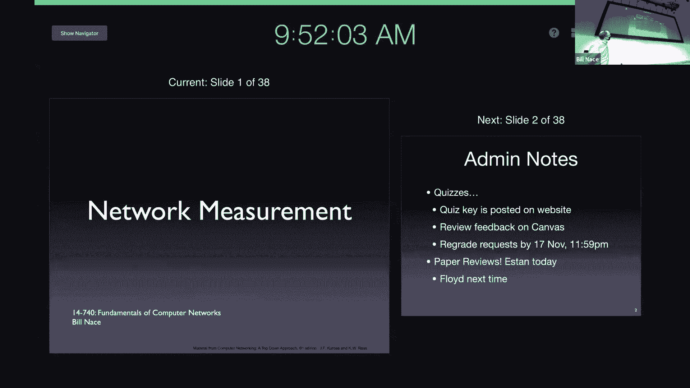
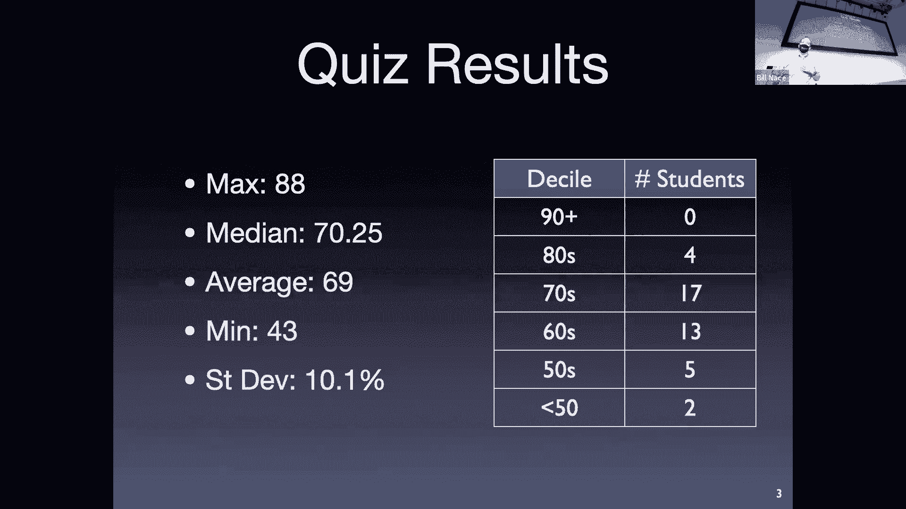
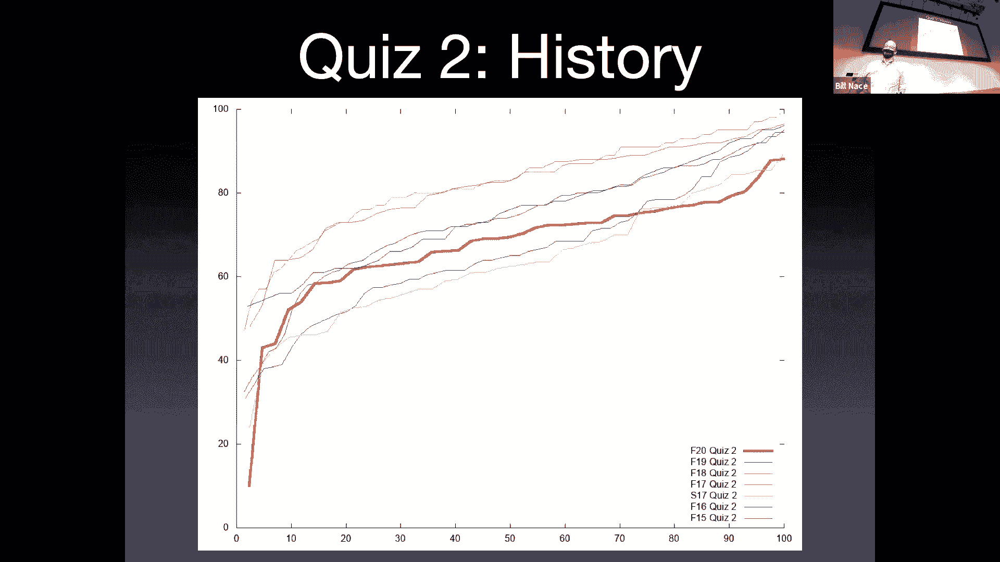
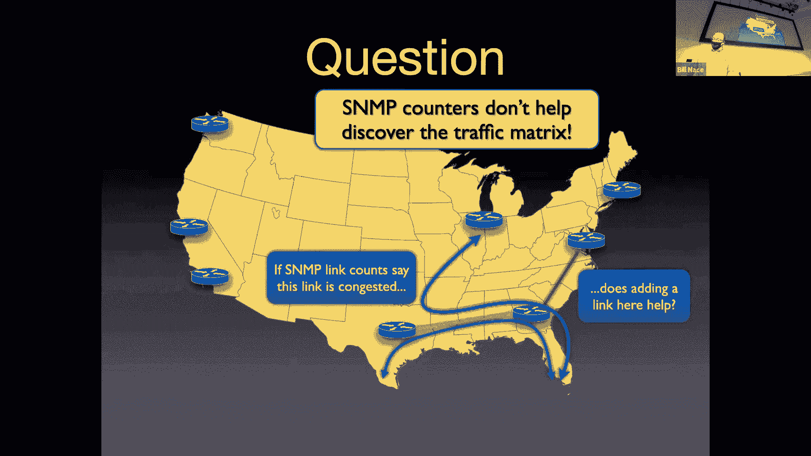
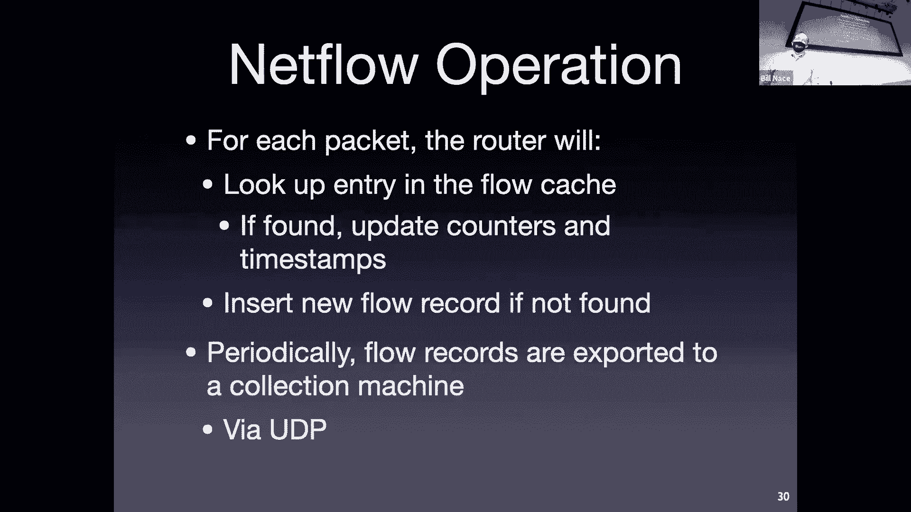
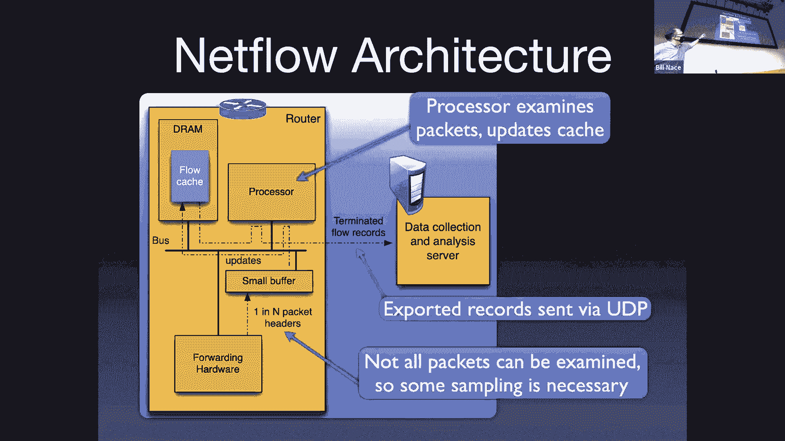
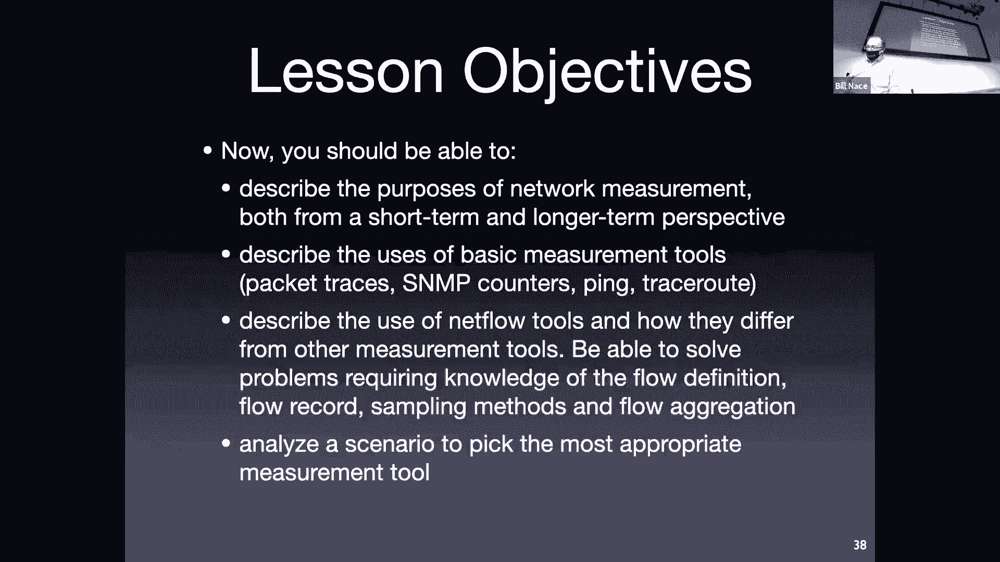

# 卡耐基梅隆大学 14-740 计算机网络 Fundamentals of Computer Networks（Fall 2020） - P19：Lecture 19 Network Measurement - ___main___ - BV1wT4y1A7cd

对。

我要跟。Okay， so the first of those topics is the quiz， which。Has been graded。

 your grades are posted on Canva and hopefully you've had a chance to take a look at those。

We use Canvas to grade the quiz as well， so you can look on canvas to find feedback comments on how you've done or why a particular problem was marked incorrect。

You also should take a look at the answer key， which is posted on the website。So I highly recommend。

 even if you're happy with your score， go take a look。

Find out those areas that you didn't maybe do as well as you could have and that feedback I think is really valuable to help you understand what mistakes you made and why you made them。

 but also if you do it soon， hopefully that will let you examine kind of why you made those mistakes in the environment of the quiz we were taking。

And that is a process that can help you， I think it's very valuable to help you for future exams and quizzes to kind of figure out how you can work all that better。

As I said with the last quiz， we're humans， we do the grading。

 we understand that it's possible we made some mistakes， we don't like to of course。

 but it's a lot of decisions we're making when we're grading。If we made a mistake on your quiz。

 we will be happy to fix it。Okay this is a no risk。

 no punitive action sort of process okay so if you think we've done something wrong。

 please go ahead and file every great request do that by putting a private posting on Piazza and say。

 hey， you know， I thought question 29 was graded incorrectly。

 please tell us why you think we made a mistake and we'll be glad to take a look at it。ok。嗯。

That process， you've got a week to do that， so you've got until midnight of next whatever 17th it is that Tuesday or Wednesday。

 I can't remember。To go ahead and file any any feedback requests。

 that's to encourage you to take a look at this and while stuff is still fresh in your brain。

Please go ahead and do that。Also， you did a paper review for today。

 you read the E done paper and we have that process continues so there's another one coming up next time for the Floyd paper。

I'm sure this is what you really are interested in is the statistics for what's going on with the quiz。

 it was not as good an outcome as we saw on the first quiz in some respects very very interesting differences we had a lower average by a couple of points。

But also the high end certainly tailed off， so our max grade was in 88。

And so we had a lot more kind of clustering in the middle than we saw the first time around。

I also like to show you one of the graphs I use to kind of measure what's going on with the quiz and so you saw this last time let me remind you of what this graph is showing you the score is the y axis and the X axis is assorted。

Indexed list of all of you Okay so all of your scores show up I basically took all the students in the course。

 sorted the scores and then I actually rank them from0 to 100 just so I can if class size is different I can compare semester to semester。

And so this graph shows so you can see up the top end right there's you know it didn't quite get there up at the top。

 a lot of bunchching in the middle so quite a few people did you know。

 in the 70s and 80s kind of kind of scores and then。Then bad things at the end。

And then this lets me of course compare， so this is how you all did on quiz1。

 I apologize that the colors flipped， so the purple one had been quiz 2 on the previous slide。

Purple one is quiz one of how you did， and then quiz two is below it。

 and you can kind of see that performance difference that happened on this quiz。

And then I can also compare through history， obviously this isn't your work。

 but this is what's happened with this particular quiz and it's not。

 I mean it's not the best we've had， it's not the worst I wouldn't say。

 but it is interesting interesting。it is a little bit concerning that we didn't have more good performance up at the top end。

And so。Yeah， I know next thing many people often look at these and say。

 well wait a minute we didn't do so good do we get a curve on this I do not curve individual events okay so I'm not going to look at this and say oh everybody should have a 10 point bomb or something like that。

Instead what I do is at the end of the semester when I've calculated the entire grade。

 I look at the distribution of the final grades for the entire course and I keep this in mind when I'm doing that and so if that distribution doesn't show up as well as it could。

 then I'm going to go back and think about what happened here and say maybe I need to shift a bunch of people's grades。

Okay， so not individually， you won't see me going through Canva and changing grades or anything。

 but it may happen at the end of the semester。哎。

see I can I was going to say any questions on the quiz and I realize I don't even have the chat window up so I can't tell whether you guys are asking questions about the quiz。

All right。Let's move into today's topic then， which is a little bit about。

Traffic measurement about how we can actually look at what's going on in the network and try to get some statistics or some feel for what's happening in the network。

😔，At any point in time or over periods of time。So first we'll talk a little bit about kind of the theory why you want to do traffic measurement and what it means to do traffic measurement。

 and then we'll go through and learn a little bit about some of the different tools。

 not in the heres enough knowledge to actually use them。

 but more in the you now know the bullet points， and you know some of the names and what they do and what they don't do so that you can argue that you should learn more about one or use one in a particular scenario。

So why do you want to measure well you guys already know that the network is a fairly dynamic thing you've seen this happen a lot with tracer Ax you Ron and the other tools for the labs and the homeworks。

 you know that stuff is changing a lot in the network over time and。

Getting a feel for what's going on with that is key to understanding and being able to make decisions about the actual network itself and so many of these measurement tools are going to be used by the people who are running the networks to understand and make decisions about the networks they're running and some of those decisions are short term decisions so short term monitoring sorts of things。

Where you're wondering what's going on right now what's the what's the weather like in my network today。

 right， Is there some storm going on， some big congestion event happening somewhere。

Trying to get a feel for what's going on with that and so that's going to be one of the big kind of instantaneous what's going on kind of questions you're going to ask。

😔，And we're going to be able to use this to maybe detect anomalous events。

 some of those may just be my goodness， you know some website got mentioned on a you know on the front page of Reddit or something and we have a lot more traffic in a different direction than we thought we would and。

Maybe definitely say， okay， well， that's not a big deal because。

You knowTomorrow some other website will be the front page of creditit or maybe it's more concerning right Anomalous events include things like security attacks。

And so maybe there is some denial of service attack going on and there's a lot of traffic flowing through our network to particular points。

 and gosh， since it's all malicious anyway， wouldn't it be nice if we could detect it。

 figure out that that's happening and somehow work on getting rid of that kind of traffic。

So all those decisions are going to。Depend on being able to look at the network and see what's going on at any point in time。

There are also some longer term questions you want to answer。

 so these are kind of the planning things you're not worried about exactly what's happening this morning on your network。

😔，You're instead doing， we call it traffic engineering。

This is a term that tells us we're trying to do things engineers do， right。

 we're trying to solve problems around the traffic in a network。😔。

And that is going to mean we need to understand what the problem is。

 We need to figure out what's happening and then figure out some way to grow the network or respond to。

To these changes， some of that may be let's just put in different routing rules because we you know we' like we've got a bunch of traffic going one way and there's another route that that could could take and maybe if we jiggle a little bit with the the metrics in our internal routing protocol we can get some of that traffic moving through some unused pipes somewhere。

Or maybe some of it is going to inform decisions for things like let's go ahead and upgrade a link right oh there's a bunch more traffic over the last six months we've started to see more traffic on this particular part of the network。

something is happening there making it more popular for that traffic to flow in that direction。

 maybe we should upgrade that， maybe we should put in some bigger lengths。

 maybe we should you know put in a better router， maybe more linkss who knows。

And some of it may inform the ways that the business would like to change。OkaySo for instance。

 this is where those decisions about peering pop up that we talked about way back at the beginning of the course。

 we said peering is this business relationship that these two networks will get into。

Well where did the idea to get that business relationship started come from。

 where did that come from， what could have come from this traffic engineering？

If you notice that there's a lot of traffic。Flowing to any particular other entity。

 Then maybe it makes sense to， send out some business guys and see if you can make a contact with that other entity。

And engage in appearing relationship so that you can stop paying transit on all that traffic。

You can't make those decisions without having some good data behind it and that's what the traffic engineering。

 that's what this network measurement。Is all。These's all bound up with question So what does the OC stand for they Yeah so I'm sorry the OC 1920 that's an optical cable link and so that's a fiber optic those are big big bandwidth kind of fiber links。

I don't remember offhand that's a couple hundred gigabit per second link I think， but yeah。

 so you would。That's a decision you say， oh look， that link is saturated。

 we've got too much traffic on it， one response would be to upgrade the link。

So we've had short term another question， oh I'm sorry， Zoom， the question was。

 what does OC mean in case you didn't pick？Another question hereday we right？そでアピさ。

So those photographs are we able to measure。一分钟。So yes。

 the question is pointing out that there's security protocols over a lot of this traffic that are happening IP sectors example here。

 But there are secure things that are mean that we may not be able to investigate what's going on。

Well， it means we can't investigate what's going on in the data of what's being passed back and forth。

 so I may not be able to look at this and say， oh， this is Bill Na's login to Facebook。Look。

 that's rare we should put that in the museum and that doesn't happen often we can't look at that kind of data Okay。

 but we can still look at all the other network related data right we can still look at the header of an IP packet。

Because that can't be encrypted right， if that was encrypted， then we couldn't deliver it。

And so we're going to be looking at those kind of characteristics of this data。Okay， now。

There are places that well want to do measurement and dig in called deep packet inspection where they'll want to actually kind of at a middleware device。

 look at the higher level layer kind of things that are going on and those guys are screwed if there's encryption in play unless it's they man in the middle attack or something like that。

 but what we're talking about today is all going to be network related characteristics。Yeah。

All right， so we've that's short term ideas short term monitoring long term planning there are a couple other uses here as well。

 one of them is。A very prosaic thing， right， we got to bill some people for some traffic。

And so we're going to need to make measurements to know how much traffic is moving okay so we've talked about transit relationships way back when and we said you pay for transit based on you gigabbits that are traveling you know per month or something like that well how do you figure that out well you got to be able to measure it you got to have tools in place to know how much traffic is actually moving。

And another final thing we often do is we do research。We in the academic community。

 especially see network measurement as the thing that lets us understand what's going on in the network as a whole and be able to think about it and apply different research ideas to it。

Unfortunately this year we're not going to do the there's a very great paper Labuitz's paper that is up on the website。

 if you'd like to take a look and read it， it's a great research paper about that comes from a researcher who spent two years measuring stuff going on in the network and was able to see some interesting things happening with BGP and noticed that it was a lot more unstable than people thought and was able to find out a bunch of stuff。

But he was only able to do that because he had a lot of data to work with and he had done a fairly extraordinary amount of data capture。

OkayWell， how do you do that datac， you need some measurement tools to be able to measure。

 to be able to capture that data and understand it。嗯。Okay。

 so that's the why now let's get to the how there are basically two ways we're going to measure stuff in the network。

Passively or actively。Passive measurements are ones where you don't actually change the actual traffic at all。

 okay you're able to measure the characteristic you're looking at。

Just by observing the traffic that's already in the network。

so these typically are things that are going to be deployed at some router somewhere that has access to the actual flow of data and is able to understand what's actually going on there。

Without having to change the traffic at all， because they can see their little piece of the network and have some visibility to that。

There are also active measurement tools right in fact you've used some of these right can anybody think of an active measurement tool where you've actually created traffic injected some traffic to be able to understand what's going on in the network。

Yeah， that was trace Ro right trace Ro sent out probes， those are active。

Actively changing the network characters， right， you're actually making data， making traffic。

And using that to measure what's going on in the network。Right。

Obviously we're going to try not to change the characteristics of the network right and Tra Ro only sends out a couple probes so it's no big deal if you were sending out 10。

000 probes per second that might have an effect on the thing you're trying to measure so of course you wouldn't want to do that。

没。The passive techniques are going to typically be employed when you're looking to try to figure out something for the production and understanding how the traffic is working and what those characteristics are for your particular network。

so those also you need access to a router to be able to employ them。

 to be able to to watch the traffic moving through that router。

 so those ones tend to be deployed by the traffic engineers in in a particular network consult it's difficult for me to go out and say gosh。

 I wonder what's happening at this router you know just outside of Las Vegas in you know some other companies ISP。

 you know I have no visibility for that because I have no access to that point。

But whoever's running that network in Nevada can。Can deploy those tools on that router and can collect this data and so they're the ones who typically care about it and are going to do that the active tools are。

Are going to be used whenever well， whenever I need a measurement of what's going on right now and when I'm looking for particular network properties I go ahead and use those tools to measure and so I generate some traffic that will go ahead and be affected by the network in the way I'm looking for tracer how long does it take for things to get there that so I'm trying to measure and so we're going to create a probe packet that's going to go out and actually travel that and we'll measure the time it takes to get there。

OkayAnd I've given you some examples of tools that are deployed for each of those and some of them。

 know， pen and trade you understand。There's path characteristic tools as well that we haven't played with。

And then we're going to talk a little bit about some other tools like SNmpP Neflow。

 and then in homework two， of course you're going to use ArGIS to actually understand some traffic。

So let's go ahead and now that we kind of get a feel for what we're trying to accomplish with these tools。

 let's talk about some of the particular tools。😔，And。

The good parts and bad parts and what they can and cannot accomplish。So first off。

 let's talk about one of the basics， which is。I'm trying to understand some traffic let me just grab some traffic let me make a copy of that traffic and go ahead and store offline so that I can go analyze it at some point later we call this a packet trace you'll actually say hey。

 here's here's you know the data that actually shows this packet with this these contents and this data came through some router at some particular time okay and so you go ahead and you just make a copy of everything that's going on。

And store that somehow now there are easy ways and hard ways to do this。

 this is a variety of stuff going on you've had a little feel for this because this is kind of what wire shark is doing。

Wre shark is。Capturing the traffic it sees and making a trace of all that。

And so you've seen some of these， right， One of nice things about the， the packet trace。

You're able to see everything that's going on。OkaySo you're able to actually。

 if you want to know what happened at a particular point in time。

 you can go and look at this point in time， this packet was traveling through the network and here's the data in that packet and here's what's going on with it。

As you get to see everything you need that by the way， can be a trouble。

 so I mentioned that that is a privacy con that's a bad thing from a privacy perspective。

Because you're actually looking at the traffic itself， which is basically other people's data。

 and that may not be something you should be doing。

It also means if you're doing research and whatnot。

 you need to be careful about this and so if you're doing network research。

 you need to design your experiments in ways that will not expose people's personal traffic。

 personal data as part of your experiment。And in some cases。

 you may need to get permission from the ethics review boards and whatnot to perform that experiment。

There are some problems with this， you probably have felt some of this with wire shark before in an instant you can get a lot of data to deal with。

And then you have to go through and wade through that so that capturing process， well。

 it has its own its own limitations， has its own bandwidth limitation， for instance。

What I mean by that is you're making a copy of all of the packets that are flowing through a particular point in the network。

How do you get that copy anywhere？It's going to take some bandwidth to get that for instance。

 just saved to disk that bandwidth I'm talking about is you know the bandwidth。You know。

 on your disk interface， Okay， and that interface may not be fast enough to keep up with the actual network traffic question but you're not referring network referring guess Well。

 it could be， Okay， so I'm referring to the the， I guess。

I'm referring to any case where there's a mismatch between the speed that the packets are taking as they go past you and your attempt to save them。

Okay， so some of that， as I mentioned， going to be just like getting it to disk。

Or being able to have it， as you point out， being able to have a CPU that's fast enough to be able to capture that。

The CPU is probably I guess it's not entirely true if you're deploying this at a router someplace。

 obviously the router has a CPU that's fast enough to manage the traffic。

And now you're putting additional limitations on it。

The other kind of bandwidth limitation here is a collection bandwidth limitation。

I probably need to get this data off of the disk drive it's at and move it somewhere else。Okay。

 and that is oftentime across the network okay and so that means I need to somehow have some bandwidth to be able to move that data around so if I'm at I'm trying to capture the packet traces of a very high bandwidth link。

 I'm going to have be very careful about how I set up that tap and where it goes and how I can get that data off of that particular collection machine。

There are memory processing limitations， the CPU limitations we mentioned a minute ago。

 but all of the computer architecture limitations that make the device that is doing the capturing maybe not be able to keep up with the data it's seeing。

There's also a final limitation， even if I'm able to collect all this data。

You probably felt a little bit of this in some of the labs there's a mental and cognitive limitation as well you have to understand the data now with your brain and you have to understand it and if I give you you know here's 12 terabytes of data that was captured in the last you know 90 minutes on my network。

 please analyze it。That's a difficult task to look through that and understand it and be able to put together the pieces to understand。

 oh， this packet gets's going this place and' happen and this packet getss going someplace else and happen。

And so obviously you're going to use tools to help you understand that。

 to be able to look through your data and be able to parse out。

 oh how many packets were going to a particular prefix or something like that。

 you don't use a notehe and it tally card to make that you run some tool to help you。

 but being able to understand it means you have to somehow analyze it and come up with hypotheses and come up with mental models of what's going on and that can be very difficult if you have too much data。

嗯。There's an actual tool called simpleim network management protocol or I guess tool is the wrong word。

 a family of tools that allow us to do management。Of our network by。Querrying。

The various routers in my network and collecting statistics。Okay now SN MPP is a big field。

 and I'm not going to be able to teach know you could probably teach an entire semester when SNMP。

 There's a lot you can do with it。So this is another one of those areas where I'm going to tell you kind of a。

A theoretical version of what SNmpP can do and if you go spend much time Googling you'll realize that there's a lot more that it can do。

Okay but for purposes of the next couple slides and for the class。

 we're going to look at SNmp kind of at its base level where it first started out。

 which was a way to talk to different routers。From different companies in a nice open fashion。

 it's not proprietary at all， and to be able to collect statistics from them and put those statistics together。

So S&mpP becomes a it's a protocol right it's got a P at the end there。

 it's a protocol that lets you talk to a router and ask you questions like how many bytes？

Have gone through or what's your bike counter right now， What's your packet counter right now。

 The idea being that the router is collecting these statistics as it's sending packets every time it sends out a packet it'll you know oh I just sent another 422 bys let me add that to my bike counter Oh I just sent another packet let me add that to the packet counter。

And then SNmpP becomes a way for a network administrator somewhere to query to send a question to maybe the 300 routers in his network。

Some of which are Cisco and some of which are Juniper and whatever other companies he happens to have there。

We still wants to know what was the bike count？At each of those places。

 what was the packet count for each of the lengths of each of those routers？

Okay and so that's effectively what SNmpP is doing is letting us get some of these statistics from our routers it also does have capability to let the routers themselves report stuff so if a router is in trouble it can send a message and say。

 oh， I'm congested or you know something's going wrong here and so it becomes a very short term monitoring tool to be able to see what's going on with your with your network at any point in time。

One of the interesting things I think it does is it defines it's a very complicated protocol spec part of that is because it defines this thing called a management information base。

 which is。It's kind of like the schema for the big databases of any pieces of information you might want to know and that gets really complicated when you have routers from different companies that are doing different jobs and they're going to。

Be filing some piece of data and you want to be able to take these values and put them together somehow。

And so， that part is。Is a fairly complex part of this process so for us。

 we're just going to say SNmpP is basically a way to ask routers for some of these simple statistics。

What's your count， what's your packet count？And typically。

 what you would do is you then have a network management。

Desktop device or dashboard device that's going to go out and query every couple minutes's going to go send out queries using SNP。

And ask all of the routers in our network and say， hey， what's your bike count。

 what's your packet count， what's your bike count， what's your bike count right and we're going to do that every five minutes or so。

And then we'll be able to do Dltas we' say， well， last time you said you'd sent x number of bytes and now you said Y。

 and so I'm going to do y minus x to be able to say that must mean you sent these many bytes in the last interval。

These do get used for billing right this is a fairly easy way to say oh look that that。

That connection that we have to one of our customers is on a particular link， on a particular router。

 and so I can do byte and packet counts to figure out， okay。

 how many gigabits per second was that particular customer using and then we're going to put that into the billing information database so that at the end of the month we can send them a bill for it。

The other thing that has grown up around this usage is another tool it's a general purpose tool that often goes with SMNMP。

 it's called MRTG， the multi router traffic grapher。

 okay and basically this is just it's a graphling utility right it takes the data collected from SMNMP and draws time series graphs based on those。

And you will see this if you ever see a picture of a network operation center。You'll see around。

 therere big screens around the edges that are showing these graphs of what's going on through time。

And those are collected from SmpP traffic and then thrown into MRTG。

 which will create these graphs and so you'll see stuff like this the default is this green color。

 so you'll see oftentimes these。know graphs that look just like this。

 you if you see these pictures that the various network vendors put up about their network information centers and so you can look at these graphs and these let you kind of get a feel for what's going on。

Obviously， if you're a network administrator who's dealing with the network day in and day out。

 you can just kind of glance at a screen， you know。

 at a field that has 20 of these graphs on it and you can just like take a quick look and say， oh。

 everything is fine in my network right now。So it gives a nice visualization of what's going on。

Or maybe you can look at it and say， oh， something weird is happening。

So sometimes these anomalies show up very easily in these kind of graphs。

 and so I have a couple of them here that show some various things。

 so you'll notice there's a green the green part is really obvious。

There also is another graph at the bottom of each of those。

 which is a blue line sort of graph as well and typically this is。

The inbound and outbound packet counts for or bike counts for the routers and so in this case I don't know which is which。

 but you can see on that top graph there's all of a sudden the green goes away for that little notch there in the middle at know 10 a on this particular router and you can easily quickly look at that and say oh。

 you know something happened at that router question just one router。You the word how many about how？

YeahSo this question is question on scope like this graph is this the whole network is this one router and the answer is you can do either right so there's nothing I mean this is going to be how you set up the tool how you're choosing some particular data to be graphed here this could be a router it could be all the East Coast routers level you Yeah so the question is okay well what scope is interesting right know maybe big stuff is lets me find out what's going on across my network or maybe little stuff lets me find a hotspot at a particular place。

And my answer is going basically to be the network engineer is going to have to configure these to answer the questions he's trying to answer。

OkayAnd so for day to day use on the wall of the network operation center， maybe you know of the。

25 graphs you have showing up there maybe some of them are you know the kind of summed up values of here's what's happening on my whole network and maybe the next one over is here's what's happening on the East Coast and of that are on the West Coast and then maybe you go ahead and you say you know we're having maintenance done in this facility right and that's what's going on this week and so we've put a couple graphs up there that are showing what's happening you know at that particular place with a couple of routers in that location and so it's a flexible tool to let you answer the questions。

You're trying to answer。And so I don't have a good answer for what's best because it'll depend on the question you're trying to。

Try to answer。他现在是快诉讼前。嗯。So yeah the Zoom question is about I'm glad so we remember the Norton paper and we're talking about the way that billing is done is with that 95% calculation where you like every five minutes you this may sound like exactly what SNmpP would be for right SNmpP lets me ask the router hey this particular link going to a customer what was the byte count now and I'm going to ask in five minutes later。

 what was the by count then I do a deelta to figure out how many bytes float you know flew during that time period and I'm going to stick that away in a database somewhere and then at the end of the month。

 yeah， my billing algorithm is going to run through that database and look at all those values and figure out that 95%。

Percentile value to go ahead and chip out a bill for yeah。

 that's exactly one good one very probably the most important use of S&MP。Okay， so， I mean。

 I just have some examples there of， you know， unusual spikes of。Usual spikes。

 So the graph on the bottom， for instance， is showing that's a week a whole week。

 And you'll show there is some spike going on。 right， Spikes aren't necessarily anomalous things。

 right， That might be the backup that happens every week or something like that。 that that is， oh。

 this data center。Every 2 AM should be doing something。And so I look at that and I say， oh， okay。

 that is doing its thing great。Then I don't have to go investigate and if I didn't have a spike。

 that's when I would go investigate。But of course theomal behavior， here's a couple others。

 that was you know these are both security exploits and so on the top graph you see when things get really bad for a particular in this case a particular server was hit by a malicious。

Scriping exploit and go ahead and generated a whole bunch of traffic。Um， you know。

 and and you can see that， you know， for two days， part of me looks at that and wonders like， okay。

 why didn't it get fixed Friday at noon？Okay， so but。

Maybe somebody wasn't really noticing at that point in time。And then on the bottom。

 there's another example of veryomalous behavior going on because there's some denial service attack where a lot of traffic is flowing into a particular location of my network。

And thats these graphs really help you see this and that visualization makes it easy to spot these anomalies because we're using the pattern matching hardware that we have in our brain to be able to visualize what's going on and so that can really help instead of just here's a bunch of numbers in some database somewhere。

Now there are some limitations right SNMP is not going to be able to tell you the whole story right it's going to be able to tell you what's happening at particular routers。

 it can't tell you what caused that traffic。Or at least not our simple version of SMMMP。

 can't tell you what caused that traffic。UmOr what the details of that traffic are or what the types of the traffic were。

Okay。Certainly you could， if you were able to look at individual packets。

 figure out some of these things， right， I could figure out what type of traffic it is。

By looking and seeing is this a TCP segment， what is the port number of this segment？

And that would give me a good feel for what the actual application is， the source of the traffic。

 you know， where's it coming from， what IP prefix is it coming from， What S number is it coming from。

 that sort of thing we're going to。That's not the sort of thing that S andMP。

Designed for SNmpP is designed for these。Simple statistics gatherings。

 if you want this kind of information， you can get it。

Because we've got another tool that will go get it for us。

You can get it through some packet tracing mechanisms that you put on the routers but that's not S&MP。

So for instance， here's a question。Let's say。You and I are running an ISP that covers the bulk of America right and we have a bunch of these routers spread around and we've noticed that between whatever that is Dallas and Atlanta。

 that that link happens to be really overwhelmed。Okay。

And I can know this because I can look at the SMMMP counts and I can see that， oh yeah。

 that link is used at 99% capability 100% of the month。Okay and so okay。

 how how should we grow this this is a typical traffic engineering problem Oh。

 Ive see there's a problem I need to manage my network in a way to go ahead and and come up and overcome this problem Would it help for instance。

 to put to add a link right maybe I don't have a link between my Washington DC data center or data point and my Atlanta router。

And so maybe I should put something there and add it in。

SNMP is going to have a hard time telling you whether that's the right answer。

The link can't tell you that maybe that traffic is actually a whole bunch of people in Chicago talking to some Miami relatives。

Okay， and if that traffic is flown in that direction， then a link to Washington。

 DC isn't going to help or not。All I know is that link is overwhelmed。Right。On the other hand。

 of course， if most of the traffic was from south Texas to South Florida， then yes。Then。

That one's not going to help either。嗯。Oh right I got my got my links backward right this second one won't help the first one it might help right I'm sorry no wonder the people in the room were looking at me strange right adding that green link may assist if most of the traffic is drunk coming from Chicago because presumably I could then split some of the traffic。

Send it Washington to Atlanta instead of Dallas to Atlanta， right。

 but if the traffic is coming South Texas to South Florida then'm it's not going to help。

What this means is these simple counters can't help you discover what's known as the traffic matrix。

This feel for where the traffic is coming from and how much of it is going to each particular place。

 we call that the traffic， well， it's a matrix。

Think about it as a big matrix， right， not Trinity kind of matrix。

 but a big arithmetic matrix right where you have a bunch of columns for destinations and a bunch of rows for destinations and you want to fill in each of the points in this matrix with a number to tell you how much traffic is flowing from this particular source to this particular destination。

That's what we mean by a matrix。And if I had all that data。

 that would help me know because I'd be able to look and see how much traffic is going from Chicago。

To South Florida versus how much traffic is coming from South Texas to South Florida。

 and then I can use that to make these kind of decisions。The traffic matrix， by the way。

 the matrix itself is just sources and destinations。Depending on what I'm trying to do。

 I may construct that just for a view of what's going on within my network。

 so those sources and destinations may be my point of presence locations。😔，I have this much traffic。

coming into my network at place A and all of that traffic， you know。

 some it's going to place B and C and D， all of which are other points in my particular network。

So I can kind of see how much traffic is flowing across the different parts of my network。Sometimes。

 however， you want to build what's known as an external traffic matrix。

Where you actually look a little bit further outside of your network and you want to say not just where it's coming into my network。

 but where it's coming from。What AS number is generating the traffic that is flowing through my network to some other as number。

Now that， of course， is going to be a much bigger traffic matrix。

But that's the one that's going to help me make decisions like。

 should I go talk to a particular other network operator and see if we can put a appearing link in？

Because that's going to let me discover not just that the traffic is coming in。

 got a huge amount of traffic coming in point of presence A。

 I'll actually know of that traffic coming in point of presence A。

 you know 20% of it is being generated in this other network， let's go ahead and peer with them。嗯。

I just said SNMP is not going to help here， so what will。

AndNe flow is the tool of choice for this or actually it's a family of tools that are generated that help me。

Make measurements about the flow of traffic through my network。 thus's the name， net flow。

So we got a first。Make sure we understand what a flow is。We as humans， kind of。

But serially understand， we got this understanding that， oh yeah， a flow of trap， you know。

 there must be these packets that are flowing from place to place。

And we think about that because that's what we generate right when I go to a website I'm generating a flow of a packet to that website and back from that website and when I go to some other place on the lab I generate a different flow。

The question， though， is， how does that flow work at the router。

 How does the router look at the packets，' got， you know， millions of packets coming in per second。

 How does it look at a bunch of those and figure out that they all belong to the same flow。

What's going to look at the values in the header to be able to say if these 17 packets all have the same values in the packet。

 the header of that packet， then they belong together as a flow。And so。

A typical definition is going to look at these particular places。

 so this is the net flow definition of what a flow is。

It's saying that we're going to look at these seven pieces of information。

Source and destination IP addresses。Okay， the protocol type， right TCP UDP。

 the type of service that was a field in the header we' said it's not really used for a whole lot within a network it might be。

OkaySo this would say that some entry router put a value in there for all these packets。

And it thought they all belong together。Port numbers。

so we would actually go ahead and look inside the packet。

We're kind of breaking the layer architecture a little bit。

 we're going to look inside the packet and say， oh， this segment is a UDP segment or a TCP segment。

 let's go ahead and use those port numbers as a way to tag all this together。I mean。

 then we're also going to look at the logical interface so this is。If you think about the router。

 the router has lots and lots of wires。Which wire did it come in on。

 which of those input places did that wire if packets are coming from different wires。

Then they really don't belong to the same flow。And the idea is the router is going to look at these seven values and say。

 oh， these all match。So this packet must be part of that flow。

 it's going from the same place to the same place it's using the same protocols。

 it came in on the same wire， yeah， it sort of belongs with those other packets。😔。

It did the same thing。Net flow is then going to go ahead and construct a flow record for this。

 so once it it has discovered that particular packets belong to a flow。

 then it's going to build a flow record。To keep statistics and be able to talk about what's going on with that flow and so it's going to add up packing and bike counts on a per flow basis now。

 yes sir similar to。诶气水会。Problem and space very encrypt by looking and not be able to package。Compで。

Okay， so the question is again， about encryption right。

 would I have trouble since if there is some encryption going on and the answer couldn't be no。

 right we。We need to be able to be able to look at these things to be able to get the package to the right place anyway。

 so if there's any encryption protocol that you know encrypts the IP address。

 it's not going to be very helpful unless every router knows how to decrypt that part and so most encryption protocols are not going to operate on。

On the header part of a packet。and typically in fact， like SSL， for instance。

 or TLS is a higher level encryption that happens on the data at a higher level that when we encapsulate it in a segment and in a packet。

The payloads can be encrypted， but the things we're adding to it， the headers will not be encrypted。

不 that是 question安。你逼。Okay， so the question on chat is saying basically， hey， look， Bill。

 you've told me all these packets are going to go together if they have these values。

 but it's possible that。The flow that you send to a particular website would take multiple paths。

 You've seen this before， right， You know， the dynamic nature of the network。

 and it's very possible that the flow of packets from， you know。

 from me to the Zoom server right now， may going through multiple。ISP， multiple routers。 and thus。

 net flow at any particular router is not going to be able to capture all of the packets of my flow。

 And that's true。What instead is going to happen is that the router is going to capture all of the packets that happen to go through it and classify it as a flow。

And we're going to be able to， as a network， be able to combine the flow records of different routers。

And so even if it went down different paths within the same network。

 I can put those together as the same flow。Okay， but you're right。

 We're not going to be able to capture all of the data about all of the packets because some of them may have gone through some other ISP somewhere。

But then think about what we're trying to accomplish with this measurement。

 right we're not trying to measure。Everything is happening as you talk to Zoom right we're measuring stuff as a network operator that affects our routers and so we're really only concerned about the packets that happen to flow through our particular network。

 even if that's only a portion of the overall true flow。

Okay so our mission is a little bit different right we're trying to put together the packets we see into categories that are flows。

Instead of somehow being able to capture all packets in a flow together。Another question。は。

There the flow records are kept at the are initiated at a router and it is a thing that we keep track of at the router as we see stuff and then we're going to go ahead and use that as the。

The data point。That will then。We can then do analysis that will combine those flow records from other places。

 but yet。诶十分。そい块。If the first six are in， then maybe we can come。でこして。Exactly。

 so the point here is that if you take the flow records from multiple routers。

But you can look through and see that obviously the last one will be different。

Okay but that's fine because you know you're combining flow records anyway。

 if the top six values are the same， you know those went into the same flow and depending upon what you're trying to analyze。

 you might want to combine them together or you might want to track them。

 you might want to be able to say oh， you know flow A when it hit this router had this quantity but later on in my network。

 I saw the same flow， but it had a different quantity and might want to be able to make decisions about what's going on there。

Yeah， these are individual data points that we then use for analysis that might include。

An amalgamation or it might be some other process。Yep， exactly。So。

 I think I was pointing out in the flow record， I had pointed out that you put statistics in there。

Notice also that you we will keep track of some of the TCP flags in there because that lets us get a good handle on a common flow right TCP flows are not everything。

But if I look at some packets and they have TCP segments in it and the TCP segment has a sin flag or a F flag that tells us something about what's going to happen with。

Packets that will come or will not come right and so we're going to look at those values to figure out this is the beginning or the end of something。

So now we can ask some interesting questions because we have all this data。

That is not just a bunch of bites went by， but a bunch of packets went by that had these values in it。

And we're going to collect those per flow and we're going to be able to say， okay。

 you know I can measure， I can say I can add up all this data。

 I can look through all the flows and say， gosh， you know。

 this percentage of these flows had TCP 480 in them。Okay， and so I can get a feel for， Okay。

 how much my traffic is actually Web traffic and would it help to put in some proxy servers or something。

 in my particular network， I can do some counting， right， How many。

 how many connections are open there or how many of them look like spam zombies。 How。

 how bad a problem might we be having with malicious behavior of our customers。

We can also construct this flow matrix。I'm sorry there traffic matrix we can look at the flow data。

 which has sources and destination IP addresses， we can figure out what prefix is what is associated with which AS number if we're looking at an external graph。

Or we can just figure out where it would have come into our network。

And go ahead and put it in that that particular row， that particular column of my traffic matrix。

Okay so having this data is going to be very， very important for that。So that's what a flow is。

 Net flow is a。Is where this all kind of started。And has grown a lot。 So net flow。Was the。

 I don't want to say the original， but the early tool that really took off to manage these flow records。

And so you would， if you had a Cisco router， you could run Neflow on each of the routers themselves。

 so it was an application that would run at the router to collect these flow records。

 and then you would actually Neflowlow had a tool that would let you move the flow records off of the router to a collection site where you would then use NeF accessible tools that would understand the flow structure to be able to do the analysis you want。

And you're going to actually use tools that are similar to netflow。

 they're called ArGIS it's a different set of tools that's all they still do the same sort of idea。

 you're going to use ArrgGIS in homework two to do this kind of analysis I've giving you a big data set。

With a bunch of traffic， a bunch of flow records， and you're going to use the ArgGIS tools to go through and answer some questions about that and to do a little bit of research on what was going on in that particular data。

嗯。Okay it started out as a Cisco proprietary tool， and I mean Argus is a similar tool elsewhere that can understand the net flow records。

That has become a standardized mechanism that allows for a variety of tools to handle this。Cos。

Pro expensive it。So the question is about the cost right so Guon I think wants to see whether they can run it in his apartment or not yeah so I don't know particularly I don't I get the feeling that it's more of so Argus is a cheap download use of the tool I'm sorry I don't have thousands dollars to help you with homework so that's a cheap version of the tool I think the netflow tool is one of those that is the suite that comes if you buy one of the Cisco Ras。

And so Csco， you're paying a lot of money for that router to start with and one of the reasons you're paying is because you can run that flow on it。

But yeah， I don't know for sure。Interestingly， Cisco did not start out to build an analysis tool okay the idea of flows and how to and collecting them actually came about as a way to increase the performance on their routers。

The idea was。The router is doing this work when it gets a packet in。

 it's going to look at the destination IP。And it's got to match that up in the forwarding table。

 so it's got to search through a forwarding table and for the routers are at the core of the network。

Those forwarding tables can be really big。They can be， hundreds of thousands of records。Large。

 and it's a hardware assisted task， but it still is a big task to look at an IP address and find it in this huge forwarding table。

Anytime a computer engineer has designed something that does a lot of work and comes up with an answer。

Computer engineers going to look at that and say， hm， I wonder if this is useful in the future。

And for many of the packets， it is going to be useful right if you think about it when a packet comes to the network and you do some work on it。

 it is highly likely that you're going to be asked to do the same work on another packet soon。

Right because know I'm sending packets to zoom right now right so many of them are flowing the routers between me and zoom are doing the exact same work over and over and over again looking up zoom's servers IP address in the forwarding cable and so what do we want to do anytime。

We have done a bunch of work and we think we're going to get to do it again， we cache the answer。

And so the net flow actually became a way or the flow record mechanism actually became a way to cash these answers。

It basically said， hey， here's some stuff that probably all belongs together。

 And I'm going to go ahead and say， here， you know， I got a packet in that had these values in it。

 I sent it out wire number 17。 If I see another packet soon with the same values。

It becomes quicker to look it up in this cache than in the big forwarding table with many。

 many many entries and so I'll look at that and say， oh let me send this one out wire 17 as well。

OkayAnd so that flow cash。Was a performance mechanism that then they said， hey。

 if we're going to collect all this data， let's go ahead and allow you to export it and use it。🤧Okay。

 so once the router has collected all this data from a bunch of。These packets and put it in the cash。

 once it's in the cache， it's only a small little extra small matter of programming。

 small little extra incremental work to go ahead and collect statistics on it。

And a little bit more to go ahead and allow for them to be shipped off to some。

Some other collection machines somewhere。

And so this is。This is one picture of how this works and what it goes on this is effectively the picture from Eton。

 the paper you read last night showing that there is some forwarding hardware。

 this is the hardware that assists in looking up an IP address in the forwarding table。Right。

And it's going to give you answers and those answers。

 then we're going to go ahead and stick in a flow cache that turns out to be in memory。

And the CPU that's running in my processor will go ahead and look those up in this flow cache。

It will also manage the sending them off to some other machine somewhere to do data collection of those particular records。

Okay， so the router exports， so this that that step every once in a while。

 the processor is going to want to take。Records from the flow cache and send them to the collection machine。

 that's the export process that I'm talking about here， the idea we're going to， you know。

 I'd like to not just， you know， oh I don't know every once in a while。

 I want to intelligently decide when to do that exporting process。

mean so some of the things that will drive a decision to export a record are also similar decisions to whether or not to evict the record out of a cash。

Right that that cache you know is taking place in memory there's only so much memory there and so every once in a while the routers got to figure out。

Should I keep this record around or not， and it's a similar decision to or so it's doing similar decisions when it's trying to figure out whether to export it or not。

So for instance， if the flow has been idle for too long。

 if you haven't seen a packet that has gone into that in。15 seconds。Okay， then sure。

 let's go ahead and export the record， maybe kick it out of the cash。

We also go ahead and take longlived ones， so even if you've been getting a packet every second you know and it's keeping it live and we're using this flow cache and we're collecting a bunch of statistics on it at some point you want to take that data and move it so that you don't lose it if you know if your machine goes down or if it makes a mistake or something like that and so there is a 30 minute timer on each of them as well so after a 30 minutes we're going go ahead and export that record。

Make sure we get a copy of that。Obviously， if the cash is full。

 we need to kick something out when we kick that record out， when we call that evicting a record。

 when you evict the record from the cash， you should probably go ahead and send a copy off to the collection machine。

 otherwise you'll lose all that data。And also， we were looking into TCP flags。

And if you ever see a fin or a or a reset， you know that that。That TCP connection is done。

So you shouldn't be seeing any more packets in that flow， so go ahead and export that flow as well。

Makes sense。So every time you export。You're puring it from the route。

 it's no longer there no not necessarily when you export it。

 you're taking the statistics and sending them off the collection machine。Okay。

 you would want to then reset the statistics。Okay， but it's a it's a so except for the third one。

 it's a different decision than whether you keep it in the cash or not Okay， actually。

 the first one probably would kick it out of the cash also。But yeah， it's exporting and evicting。

Are related， but actually different decisions。The paper talked a lot about sampling and this idea that。

ThatFrom a flow collection standpoint， we probably cannot keep up with all the traffic and so we have some let's look at every fourth packet or every 16th packet or something like that to do some sampling and。

You know，And then that's going to mean that our cash。

 our flow cash doesn't have all of our flow records aren't。100% true。Okay， but their sample values。

 you in your analysis need to know that you sampled it so that you can renormalize your data because of that and the paper in fact。

 was arguing that this sampling should be done on a not on a strict static one in and all the time。

 but a more。Chaable， automatically changeable mechanism to make that happen。The sampling， of course。

 is because we have limitations。 We have performance limitations on the router itself。

 It can't keep up with stuff。 can't store memory wise。

 all of these records or can't get them off of the machine itself And so these performance in reasons。

 we need to keep in in the back of our head。 that the router is a computer。

 And so the router has the same limitations as as computers do。

 and it's doing these computation things。 And so， for instance。

 it has only so many CPU cycles it can handle there's a certain the bus connecting the processor to the memory has a certain bandwidth as well。

 and we're going to be using that bus when we look stuff up and when we。

When we change the statistics and when we decide to export a record and all that kind of work。

 we're going to be looking stuff up in this flow cache。And so that can mean that。

We're not going to be able to handle all of them and we're going to run into some performance issues。

There's also the bandwidth of the connection out to the data collection machine。That machines。

 you know， it might be a dedicated connection to make that happen。

 that's not unusual for router to have one of its interfaces just as a tap interface that sends all its traffic somewhere else。

Okay， but that that。That connection still has a bandwidth limitation and it is usually one wire out of the router as opposed to the other 95 wires going into the router and so there's definitely a limit there that we're can overcome as well so all of those mean we need to be sampling we need to be looking at only。

One in end of the。May mean I shouldn't mean to say we always sample， right。

 it may be that my router is just not pushed。That much。 And so I'm able to get by with a one and one。

 But if I can't， then I'm going to have to do some sample。

And then you aggregate the data that you collect these are as we've already actually mentioned some of this that you're going to want to take these data points。

And when you're doing your analysis based on the analysis you're trying to do。

 you're going to collect them and put them together in different ways， maybe just add them up。😔，嗯。

You know。I got these different values and we put them together this float flow aggregation I'm sorry kind of got off track there。

 the flow aggregation process that I'm trying to describe on this slide as one where you're actually as part of the sampling process trying to summarize this flow data and so you're still going to use the data you have in the flow cache to make that happen。

 but you're going to go ahead and keep aggregate statistics that collect all these together and so that can help reduce the actual collection bandwidth so you're taking a bunch of flows and instead of reporting on them individually you're putting them all together in one packet so this also will be guided by the kind of analysis you're trying to do。

If you are trying to build an external traffic matrix。

 you might not want to do this because by combining flows。

 you may be combining flows across prefixes。That would you would not want them to be across。

 so it'll be guided by the kinds of analysis you're trying to do。

 but if you can aggregate your flows， then you put these individual data points together。

 you collect them all you say you know all of bill's traffic to Zoom。

 all when really's traffic to zoom， those are different flows because they're coming from two different computers okay but we could aggregate that together for analysis and say。

 oh， let's just take everybody whoseoom economy today and add all their flow data together because we didn't need to know particularly how much data is coming from Bill's computer。

Does that make sense， the idea of flow aggregation？All right。

 so last question before we're done here today。It turns out that E networks。

 it's I don't know for sure， probably a bit unlikely that netflow is used here at assume you all that much。

Certainly， probably not extensively。Okay， oftentimes you know， that's part because we're just。

 we feel like a big enterprise， but network wise， we're not running a big network anywhere or something like that。

So why is that， why wouldn't seems like netflows is this really useful tool。

 why wouldn't we be using it then？If。Even here on small scale at CMU。嗯。

And I don't see anybody raising their hand。 So we'll go ahead and just say。

So most of it is because the circumstances that drive people to do this measurement are not really showing up at the edge so much。

Right。Carnegie Mel is not going to spend a whole lot of time doing traffic engineering。

Because they don't have this huge network with these huge bandwidths that need to be managed so much。

Okay， doesn't say they don't need to manage it， just the scale is different。Okay。

 and so I'm sure the network administrators here at Carnegie Mellon， I'm not trying to say they're。

 you know， sitting on their do doing nothing all day。 They are working with。

An extensive network from their perspective， but it's not the same scale as a you know。

A tier one network somewhere okay and so they don't have to answer the same kinds of questions and manage the same traffic loads that would be happening elsewhere。

Also， in many cases， these networks are simpler right if you have a single or just a couple of providers。

 then you're not really worried about what your traffic matrix is。

You're not trying to answer the same kinds of questions。

And so it's not necessarily to do that sort of analysis。

It's unlikely Carnegie Mellon is going to decide we need to peer with Pi or something like that。

 they're not making those kind of business decisions all day it's easier just to or its not it's not needed so let's just go ahead and keep paying our ISP the amount they're supposed to be。

To paid。makes sense。So today we took a look at a bunch of different network measurement technologies。

Some tools， packet traces， S&mp， we know the difference between active and passive measurement techniques。

And we dove a little bit into netflow and what that means and why you would be collecting these packets into flows and understanding what's going on with each of them and hopefully this will help you have this mindset thinking about what's going on when you're doing homework too you're going to be looking at some data using netflow like tools so kind of put yourself in the mind of oh I'm a big you know internet provider using these tools instead of I'm just working through these problems because Professor Nas asking to okay。

With that， hopefully you've had a good time understood a bunch of things。

 we'll see later if we're done。Oh question and chat， sorry。Yeah。

So the question is about the data collection in the Eston paper and whether the experiment in that paper。

Was a single day， couple of hours， small test and I got to admit， I don't remember。What the。

What the time period was。Yeah。Yeah， I don't know。 Does anybody remember。Going to comments。Okay， yeah。

 I don't know。Yeah， so the SM paper， I mean， that was guide student doing that that became his thesis。

Which just I don't want to say that doesn't mean it matters。

 so that's PhDs are vitally important and we're doing good research there。

 but I don't know that he was trying to build something for industry。

 although I think some the algorithms have shown up in commercial tools。不能。

And Luke is asking about net flow， yes， I believe， so as I mentioned earlier， net flow is kind of。

A family this is a cisco proprietary product， but all other vendors have put something similar together that exports。

TheThere's a standard export format， for instance， to be able to get across those。 And， yes。

 those tools have， if incorporated the。AFM was I forget what his acronym was for。

For the sampling that。The non static sampling mechanisms he was using so those have shown up。Okay。

All right， thanks very much。

Yeah。Yeah。