# 卡耐基梅隆大学 14-740 计算机网络 Fundamentals of Computer Networks（Fall 2020） - P1：Lecture 1 Networking Introduction - ___main___ - BV1wT4y1A7cd

ok。So yeah， please head over Di9 740 rocks to get all that kind of information。😊。

Yeah。If you have a more personal question， something that you don't understand about the content。

 something you're not sure what to do， you know how to hand something in。

 where to get something and if you can't find a solution on the main website。

 please feel free to go to Piazza if Piazza is a question answer place a place for you to ask questions。

 everybody gets to see your question， anybody can respond to it okay so there's a place for student answers。

 feel free to go ahead and fill those in okay。And there's a place for professors and TAs to provide an answer as well okay and oftentimes if there's a good student question。

 we'll just say that one's correct okay do do that thing which is great this is a fantastic platform because it allows everybody to see the answers to all the questions there's no there's no chance of one person asking something and having some sort of advantage because they've asked it and nobody else knows about it or anything like that so allows a much higher bandwidth between us in terms of getting the answers questions answered which I think is fantastic us。

OkayGracope just another website we're going to use we will be using it where you submit your work so when you're done with something learning the lab or assignment of some sort quiz will be uploaded here as well you submit your work to grade scopecope and then the Ts and I grade it there and show you your。

You know， any feedback we have on a question by question basis sort of thing you're able to actually final score for each thing like what your lab three score is you'm able to see that in Can。

But on grade scope， you'd be able to figure out why you've got that score。

OkaySo go take a look at the feedback we provide on grade scope。

We have a textbook it's actually really good textbook， it's very， very readable。

 it's very explanatory， my only concern with it is occasionally examples span two or three pages and if you're not careful if you're not reading critically you can just kind of mose on through that without much of it sticking and so while you're reading oftentimes you'll end up having to you know he's got an example where you know this packet is going to route number four and then this happens and you have to kind of flip back and keep your finger on where that packet is or whatever if you can actively engage with those examples as you describing stuff the material in this book is fantastic so I highly recommend that you get one and keep up with the readings。

😊，readings are posted on the website and tell you what to read for each lesson。

You'll also be reading some papers， I will provide these to you some conference papers。

 as well as some IETF and other engineering articles。

 just as additional reading material on particular topics throughout the course。Okay。

courseourse you want to know how you're going to get graded。

 you're going to be graded numerically basically and the syllabus describes everything that happens there。

 the short version is each category of event has a weight so I'm going to average all of your assignments together to figure out what your assignment average is and I'm going to multiply that by 0。

4。😊，I'm going to do the same thing with all of your paper reviews I'm going to multiply by 。

1 I'm going to add up all those weighted scores and I'll have a value between zero and one or percentage wise between 0 and 100% and then we cut that usually on 908070 cutline to give you your ABC grades with 2% per plus and minuses on either side。

So I want to step through what each of these things is first is some assignments。

 you're going to have some homeworks and labs。There are two homework assignments that have more of a kind of working out and problem flavor to them。

Okay。And then there are four labs where you'll actually use WireSharrk。

 which is a it's a network analysis tool that lets you actually capture packets as they're traveling in the live internet and be able to capture those and analyze them and look at them later。

 so we'll have four lab exercises corresponding to the different layers of our network for each of those labs。

Okay in each case， it will be an individual effort thing you'll write up a report on what you have done and submit that to grade scope。

You'll have some paper reviews as well， I'm going to sign eight or nine papers for you to read throughout the semester。

哎。basically I give you a paper， you read it， Okay， and then you write up。These things。

 you say this is what the contribution of that paper was。OkaySo some sort of contribution statement。

 in fact， you can start off with the contribution of this paper is。

And just tell me why is this paper so important that Professor N would want you to read it？Okay。

 and then I'd like you to find three of the most important things in the paper。

 What are the three things that the author is trying to tell you。Okay， and summarize those。

A sentence or two a piece okay and then I'd like you to list two questions or comments。

 things that you could reasonably raise your hand and ask or comment about in class。Okay。

 put all that together， put it in the PDF， submit it to gradecope。

 creating this should not take you a very long time compared to after you reading the paper。

Okay so what are we doing here， one is we'll talk more about this next time。

 obviously I'm nudging you or actually it' more than a nudge。

 I'm pushing you pretty hard to actually read the papers。Okay， that's a lot of what this is about。

 we'll talk about some of the other goals I have for this next time。There are two quizzes。

 the quizzes will happen roughly a third and two third of the way through the course。

 they are non comprehensive course quizzes。Which means they only are on the material since the beginning of the course or the last quiz。

And we'll have those during the regular class period。

 we will figure out how we're going to handle that。

There's also a final exam that will happen during the final exam period。

 that's a comprehensive exam that means you're going to be asked questions about all of the material of the course in that。

As at all。For out what your trade is， you all do well oh right forgot class participation one last one。

 this one's actually pretty important。This is a bribe。

I'm specifically wanting you to participate in interacting class。Okay。

 and so this part of your grade is there if you do that。Otherwise， as I mentioned earlier。

 if we spend the next couple months with me talking and you listening。

 this is going to be really boring。Okay， so this 5% is there specifically to nudge you and get you all to ask questions and make comments on things。

Okay， note class participation means actually participating does not mean showing up and sitting in your seat。

Okay， I want you to actually ask good questions and say stuff， which is good。Okay嗯。And then with。

Well， we'll handle figuring out who you are as you ask them。

 hopefully we'll get to no use of it that doesn't become a problem。Yes。

With being this course by attitude and competitive level。Okay， so the difference between this course。

 I assume packet switching do you mean 18756？18756， so first off。

 if you have already had a networking class， you should probably not be in 740。

Okay this is a foundations fundamentals course， so if in your undergraduate you had a course that walked you through the stacks of the network。

 if you know what you know transport layer protocols are。

 if you understand how a router handles Nike packet you should not be here。

 do not waste a CMU course in here you already learned even if you've only learned a large fraction of the material do not sit here trying to fill in stuff around the edges okay。

18756 is a more advanced course， it talks about network management mostly， and it's a great class。

 especially a great class if you ever think you might go into research and are wanting to get your PhD。

In networking， that would be a fantastic class to start off in， it's got a project you do。

 great class。Computer networks。Is that the comp site or？With's the other。

So that's the advanced data Network 14。7，6 feet。1476p happens in the spring。

 I'm going to assume that's of course we're talking about。

 that's advanced real world networks or something like that。

That course is also a course you should take， if you have already had a class like this and if you already understand something about the network。

 that one goes into kind of broader scope of a lot of different topics like they look a lot in how data center networks work。

 for instance， or how different fiscal layers make the network work differently。

 so how does Bluetooth operate as a network how there's a couple other embedded networks they look at。

 things like that。Okay。There's also a chat question oh， very exactly， good， thank you。All right。

 I just want to point out you're giving me stuff for a great， okay。

 that means I have to assume it comes from your brain。

And so and that's extremely important that's one of the easiest ways to derail your career as an academic is to give me stuff that is not from your brain。

 we call that cheating。I don't do that。解啊。Now， what do I mean by this？

It's fine for you to work with other people。 I do not want you to read this slide and then get scared and say。

 I must not ever talk to anybody else about 7，60。I've got any of my network class or I'm going to get in trouble and I'm going to get thrown out here do not be scared about that。

Collaboration is fine， the opportunity to talk to other people is great。

 teaching other people how networks work or how a particular homework problem in general might be solved is fine。

OkayIn fact I think that's great， I think you learn a lot when you teach stuff。

 so telling somebody else about it is's great that must mean that asking other people questions is great。

Now， what I don't want is for that to come to the point where you are no longer in a collaborative mood trying to learn something。

 but instead in a mood where you are passing data through your brain to your fingers without actually doing much thought。

So here's a scenario that would be bad， you and three friends get together to work out homework one and you sit down and you say。

 okay， you take homework from one， I'll take two， you do three， I'll do four。

 and then we'll all trade answers。Okay， also bad might be。

 let's work them out on the whiteboard together， okay。

 and then we'll just all write down the answers。Okay， so。Both of those situations。Yes。

 your brain is involved in making your fingers move。

 but the actual information is not the way you figured it out。

Here's a perfectly fine scenario you and four friends get together and say，huh。

 I'm having trouble understanding a couple of questions on homework one and since we're all going out to Chipotle anyway。

 let's talk about it。Okay， how did you figure that out， oh， I was working on this assumption。

 I think this is important for the the。Oh I hadn't thought about that。

 I will now have to rework my work and then you go back and you sit down by yourself and you say let me actually work out this problem for myself using the thing Ive just learned from my friend。

 perfectly fine collaboration。Okay。😊，Yeah。Here's how to succeed at 740， I may be biased。

 but I think professors actually add value to the course。

And so coming to class I think is a good thing right yes。

 you probably could survive this course by reading the textbook and that's it okay you're all smart people。

 you can learn from from other material I don't think it may be the most efficient way to learn the material okay and I think it might be a little bit more painful even than coming and watching me。

I also think getting regular sleep is important。Okay。

 so highly recommend that even in these crazy times。

 you find a way to make sure you are asleep at the same time every night and you find that makes your brain work well in order to do that。

 that means you have to manage your time well。 That means you have to start。

Having some discipline about what you're doing and you you know pick your friends out of the room at 10 o'clock so you can get to bed at 11 o'clock or whatever your scheduled。

Goods for you also， we're here to help you。I've got a TA staff。Myself。

 we're going to monitor Piaz so， we'll be glad to have。

You talk to us at office hours or other times if you're in trouble。

Please come talk to us okay if you need help， we will help you get out of time。

 we'll help you figure out how to to understand the material you don't understand to get caught up etc cea。

 Okay so please do those things。Okay。

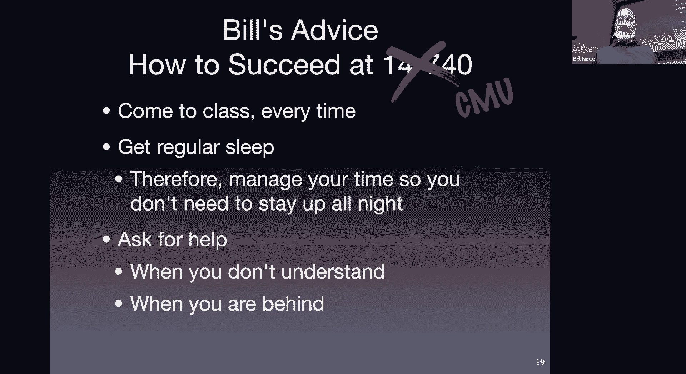

Sorry。Let's move on then。

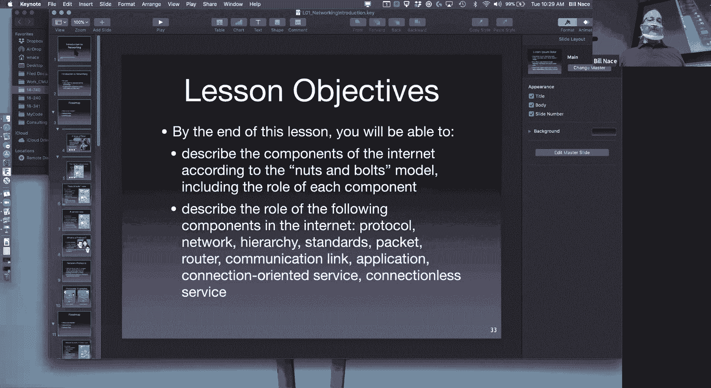

And start actually looking at networking， I guess I should ask any other questions about。

The course and how it's going to operate。Policies and procedures yes。

 great So when we talk about who what's this's your name， what's your name this is Jeremy President。

 hellello， Jeremy。So when it comes to talking to you or the TA， is there a particular。

 should we come to you with these questions and the Ts with those questions in terms of sort of the TA's responsibility versus yours。

 how does that sort of break down？So if you're asking for help， it doesn't matter okay。

 I'm happy to answer questions so are the Ts， one difference is the TAs will actually be doing the grading of the homework and assignments and so if you want to know why did I get three points off on problem seven。

 I can make guesses about it but going to the TA who actually graded it is probably better。Okay。

 but other than that。Happy to chat come by first office hours are posted。

I think I posted UTA off on the web， if not， I will soon。Okay， I will， I will get this posted。

 Ill have pictures to post also。 So I'll get this posted rapidly。Okay。

 let's get on to actual question。Late stuff， what's late？We don't do late， no。Yeah。

 it's due when it's due。Getting in that point， okay。没。

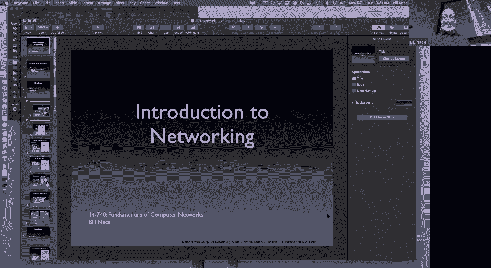

All right。嗯。Let's take a look at some real technical material then。 Okay， so our first real lecture。

My goal for this talk is to just kind of let's skim through what networks are and what a lot of the topics are and things to think about。

 we're going to go in more detail in the future this gives us just kind of some common vocabulary to talk about and some notion about what we're talking about when we're thinking about the networks。

 plenty of more detail to come， don't worry about that。

So I want to talk about first kind of a fundamental question for a class about the internet。

 which is what is it？And then we're going to look at two of the big components of the network。

 things that are at the edge and things that are the network core。

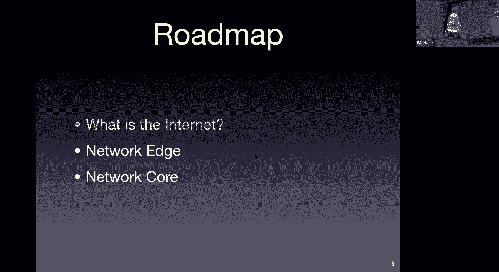

So what is the network anybody recognize this guy， this is Senator Ted Stevens。

 a former senator from Alaska and。Does he。Like many people was a user of the internet。

 but he mental model of what was going on that wasn't quite correct and he in his speech in the Senate said the internet's not something that you just dumped something on。

 it's not a big truck， it's a series of tubes， the mental model he had was that the internet was these tubes that would somehow carry information from place to place。

 it turned out and，It it's a fascinating speech to go read and want to laugh about some stuff because he's wildly mistaken about quite a bit of the technology and you should have known better because he was on the technical committee that was overseeing a lot of this and basically everybody had fun at his expense and he lost his election。

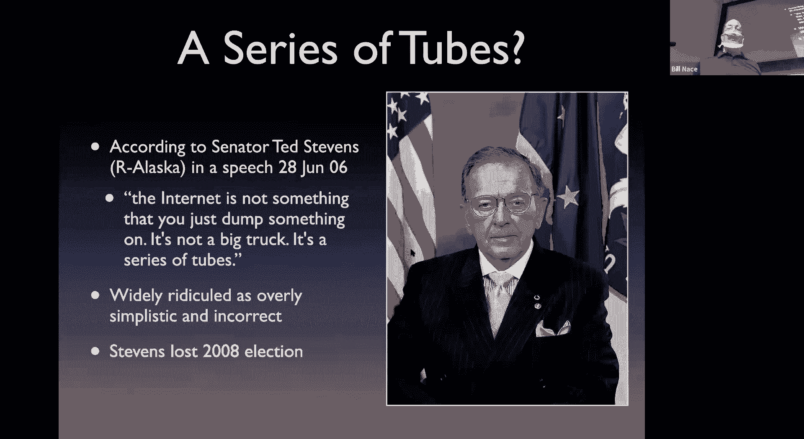

Perhaps because of this controversy Okay， so guess what knowing what the internet is might actually be an important thing for your career So what is the internet？

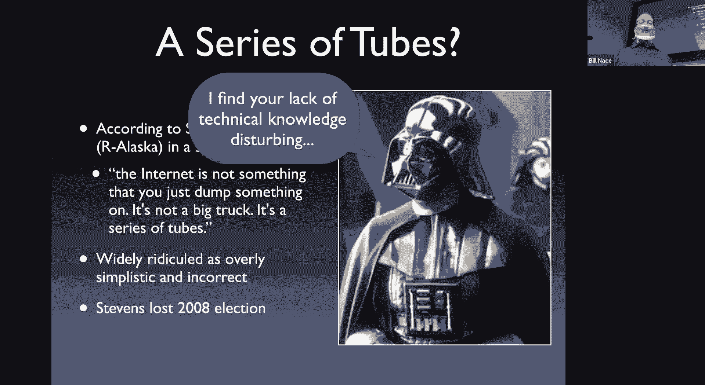

Well a couple different ways to answer that question one of them is the nuts and bolts of you let's just look at the pieces that are in the network and see what makes it up okay well here's a number that I got way back when Cisco every year was putting out a report on like the state of the internet and so for a couple years I tracked and the last time I got interested enough to go look up the number it was 12 and a half billion computing devices were connected on the network that was 2010 a decade ago。

Let's just guess， has that number gone up or down since then？不。

Up up a lot right yet of course it has right everybody since 2010 has's gotten way more devices that they're using corporations have lots more devices that are serving us and our devices that are using it so yeah clearly we have many many many many devices I mean I'm sitting here I have three of them right here that i'm wearinging or have on my pockets as I'm teaching class right in 2010 I'm not sure it has。

Okay， so what it looks well， these are computing devices of some sort that are running some form of a network application that's why they're connected to the internet is because you have email or something that you'd like to be able to use the network with。

Now those computers aren't just sitting there sending messages through a series of tubes okay instead we have all kinds of different communication links that link up do。

 some of them are you know the wfi links you know， maybe internet and other kinds of exotic microwave links or satellite links。

 things like that， each of them operating using their own technical specifications。

 mostly we care about the bandwidth， we care about how fast they go。

 how quickly can they get our information from point to point and they will vary in what their particular bandwidth capabilities are。

Theyre all can data。That data are these packets。That's a term we use for some form of the data in the network。

 we'll get more specific with that term as we go。I mean。

 that data gets sent not just from my watch or my。And post device like my computer get sent through a bunch of routers。

Whi are basically computers。Specialized computers that connect up these links that know how to get information from place to place through the network。

here's kind of the little cartoonoony picture of the internet that I'm going to use a couple times throughout the course right and it's got end host those the guys in flight on the edges those's are computers that look like laptops right they're going to be running their applications there are routers。

 those is the blue things this is kind of the international symbol for router is this blue cylinder with little arrows on top of it。

They look their computers， okay， they just have slightly different format。

And then those lines connecting them， those are all the links we have through the network。

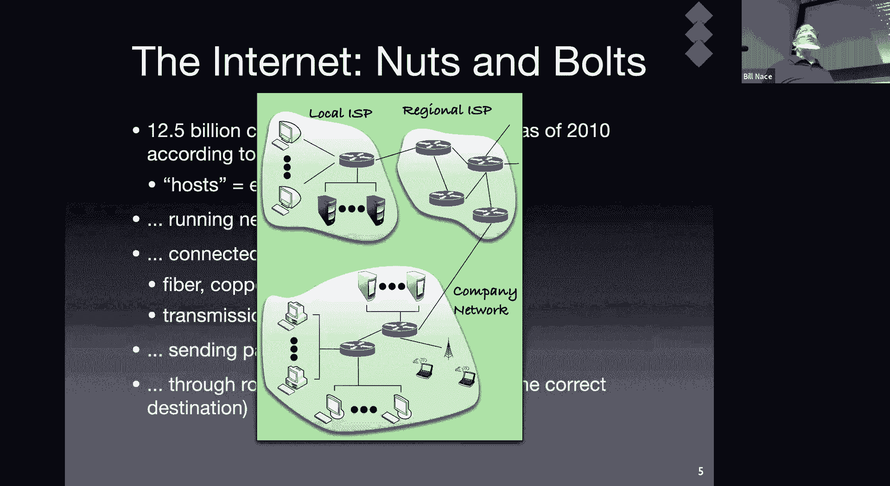

Turns out there's more than just these hardware devices that are involved in getting our network operating。

 however， so if I'm going to look at my network， I'm going to answer the question。

 what is the internet by looking at the pieces。😡，I can't just look at that hardware and say， well。

 it's this pile of computers and links and routes， I also have to include some of the other pieces that make it all work。

So a big part of thats going me protocols， we're going to talk about that' going to talk about lots of protocols in this class。

 okay， lots of them， most of them are acronyms of three or four， sometimes two letters。

I've listed some of them there， the way you can tell it's a protocol。

 the short and easy way is the last letters of P because most of these are something， something。

 something protocol。Okay， from there afternoon。And unfortunately。

 networking is a bunch of these acronyms。Hopefully， we will。

Learn many of them throughout the semester and you get more。With the particular a。

And then internet is also。Something else important we have to think about with the internet as we try to define it is kind of who controls it。

😡，And it turns out the way the network is put together。

 it's actually not one big network that you know， the Department of Internet runs or anything like that。

 instead it's a lot of networks that are connected together。

OkaySo it's kind of decentralized or federated where you have control， for instance。

 in the people who build each of the individual networks。

 so you are here at Carnegie Mellon and you're using Carnegie Mellon's internet。

OkayWhere did our network come from oh Carnegie Mellon paid for， we bought a bunch of routers。

 we bought these internet， these wfi access points that you see around the room that let us connect right and therefore Carnegie Mellon controls this。

Okay。There are a bunch of standards also that help define those parts。

And to find pieces of information needed to get the internet working properly。

 we call these standards RFCs a request for comment。

 it's a really weird name we'll talk about where that came from and there's a group called the Internet Engineering Task Force that generates these requests for comments that is the technical arm of getting all of the standards so that the internet works。

Now， if I'm defining things， sometimes some things。

Have a meaning that goes beyond just the sum of their parts。So if I ask。

 how would you define a human and you said， oh， a human is a bunch of bones and some skin and muscles and blood and there's this gray matter up top。

 we're not sure what that does。That's not really what we are as humans。

 we are more than just the parts put together and so maybe another way of looking at the internet and how it operates。

😡，Is to look not just at the component， not just the nuts and bolts that make up the network。

But think of it in terms of the services it provides。

 what does it do for somebody wishing to use the internet？

we'll call this a service view of the internet。In this case。

 we're going to look at the internet and say what is it， well the internet is this infrastructure。

 it's kind of like you know highways or bridges or something。

 somebody has built all this stuff so we can use them。So highways and bridges， but not teamss。Sorry。

 say it again， highwayways are bridges， but not tos。And that too。 yeah， that tunnel somehow。 Yeah。

 it's just some sort of infrastructure， right that。That lets us communicate。

 lets us get our information from your computer to my computer。

Lets me get my Zoom words and visuals to use somehow。

And so that lets whatever applications we need to use that。

Have the Internet available to make that work。And there are different communication services then that are part of that infrastructure not just。

Here's this thing that lets us get messages around。

But there are these services that the applications can take advantage of and we'll talk about a connection list or a connection oriented service that the internet provides。

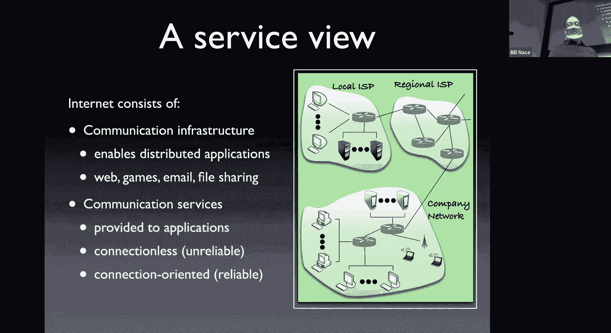

I want to take a short minute to look carefully at this idea of a protocol。Okay。

 because we're going to talk a lot of protocols in this class and I want to point out that。

Protocols are not just a network thing。Right， a protocol。

Its a way of figuring out how the information and actions flowing are regulated。

 what are you supposed to do and say and hear and understand as you go through some interaction and humans do this all the time。

 so we are used to protocols even though we don't typically think about them in terms of protocols。

 but for instance， if you want to know what time it is。

 you do not go up to somebody and grab their risk and look at their watch。

That would perhaps let you get the time you might also get punched in the face。😡，Okay。

 because you're violating what we think of as the protocol about how to find out what the time is if you you want to know what the time is you ask somebody and you say excuse me。

 they say yes， how can I help you， you say， can you tell me the time they say， oh sure it's 1042。

 you say thank you， you've now completed the human protocol on how to figure out what time is。Okay。

 so that protocol involved some exchange of information。weve had to ask well。

 it's excuse me to get somebody's attention and to help you is the reply to that you know those those messages going back and forth between the two people involved in this and usually there is some understanding of the sequence right you don't go up and say excuse me and the person just say 1043 right that would be out of order you got to ask for the time before the time is provided。

so there's not just what the actual messages are， but something about。

The sequencing of them and perhaps the understanding of what the actual message means。

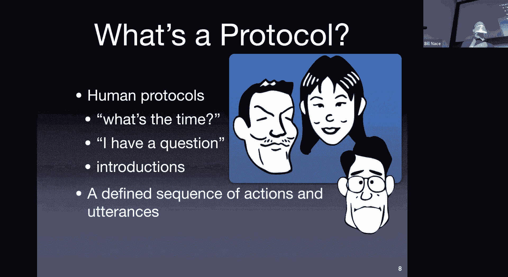

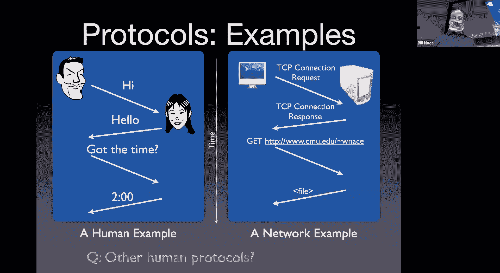

Network protocols act the same way okay， so in the network protocol。

 we always have some sort of format， some way of looking at bits。

And structuring those to end up to take the information we have and create our message somehow。

 or on the other end of things to be able to look at a message and figure out from the bits that are in that message what the meaning of the message is。

😡，Oftentimes there's an order， you're allowed to send this message only after that message has happened or only after you've gotten to some state in some state machine diagram somewhere。

等。And it turns out these protocols， as I mentioned earlier， we're going to have a bunch of them。

 but that's what we do when we try to figure out how computers should communicate on the internet。

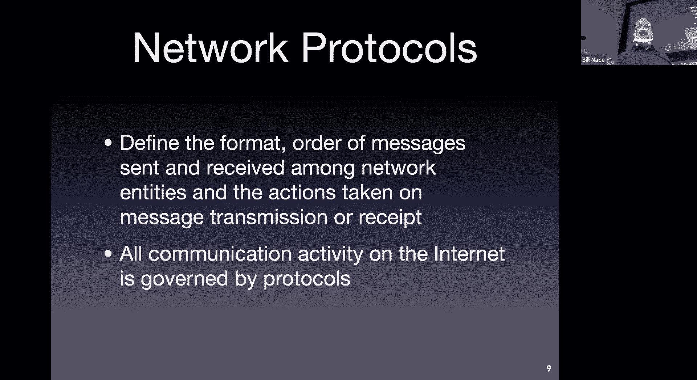

🤧嗯。Oftentimes we draw our protocols with this kind of diagram call this a sequence diagram and this shows the interaction between usually two。

 sometimes more players and each one of the players ends up kind of having a presence in some vertical space so you can kind of think of like that gentleman is at a particular X location he gets the whole vertical space there okay and that vertical space actually specifies time so we're going to start at the top of the sequence diagram and in this case the gentleman is uttering sending a message。

To this lady and the message is high。And I draw that as an arrow to say， oh。

 here's the contents of this message coming from this sender going to this particular receiver。

There's also， by the way， very subtle notation thing。

 our arrows end up always going down so I'm just going back and forth and that's because there's a passage of time and at least in our universe you have to send a message before it is received。

Okay， so the time at which high is sent is before the time at which high is received。

And so we see these arrows kind of going back and forth like this down the page as we go back and forth between the participants in some protocol。

Same happens with our computer protocols。Okay we'll be looking at a lot of sequence diagrams like this。

 this is just a kind of simple one which shows a message being sent in a TCP。

Interaction where we're actually asking we're saying pretty please may I connect to you and then a response comes back from a server saying。

 oh yes， you may connect to me and then a response a request， could I please have this file， Yes。

 here's the file right and that back and forth helps us understand and visualize what goes on with that particular protocol。

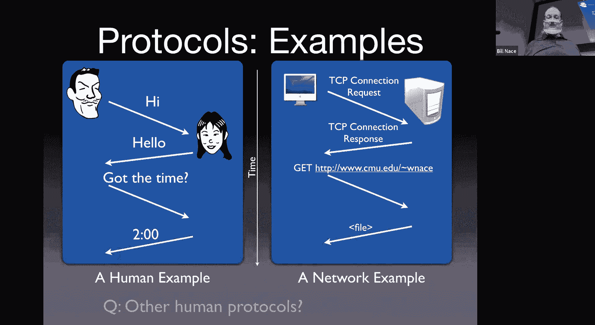

All right， so now we know。Kind of what the internet is。

We know some things about the protocols that govern it， a couple different ways of looking at it。

I like to take the parts of the internet now that's understanding we have and kind of break them into two pieces because it turns out there are two very different categories of the computing devices that make up the network。

 and so we're going to put those in what is known the network edge and the network core。😡。

The network edge are all of the computers that are on， guess what on the edge of the network。

 right these are the computers that are running the applications that are either sending or receiving the actual data of these messages。

😡，These are the clients and servers， your computer that's your laptop that's on your lap right now is at the edge of the network。

The Zoom server that all of our transactions are going through right now。

 I'm sure is another computer。That is on the edge of the network and so when I make an utterance and my zoom application picks it up from the microphone。

And sends it off to be distributed to everybody， it'll send it back to some server somewhere。

 which is also at the edge。😡，And that server will then send messages out to all of you with that particular data。

 because all of you are also at the edge。系。The core is what's left。

 The core is the inside of the network， everything that's not at the edges made up of routers。

In Britain， we call them routeuterrs。And those are， as I mentioned before， they're special computers。

 but they are just computers， they're computing devices。

 and it is their job to figure out how to take the message from an edge computer and get it to the other edge computer that it's destined for。

There are also these communication links I should point out。

Depends on the link as to whether you might think of it as an edge link or a core link and it doesn't much matter。

 we're just going to say there's you know edge and core and not worry too much about precisely how those are fit together。

 but obviously they need to be connected by these communication links between each other to make our full network picture。

嗯。So how's this work， Well， I've got a system at the edge of the network。

It is because is it the E and network， it can be a destination or a source of a message。

 and so the application running on that computer wants to send a message to some other computer somewhere else。

 also at the edge， some server for it。And it will go ahead and be the source of a message that then gets handed off at its destination to that server。

 which is also at the edge of the network。This is， by the way， it this client server model。

 it is one of several good models of computation。Putting together these distributed systems of computers talking to each other。

 not the only one， it was very common to have a client。

Devicice a client application running on an edge device that contacts some server。

 that server isn't always on machine， basically just sitting around waiting to answer questions。

🤧Okay， to be contacted by that server。And so you see this very commonly， for instance。

 with your web browser or your web browser is a client。When you want to load a web page。

 you go talk to a web server， which is some other computer somewhere that will give you the information for your web browser to render。

There is， by the way， a peer to peer model we'll talk about this as well。

 where you actually have computers talking directly to each other。

 I could imagine a world where Zoom was a peer to peer thing。

 where right now my Zoom application on my computer was capturing my image and my words and instead of sending that as a single bunch of information as a single message back to a server somewhere。

 it could send out a bunch of different messages to all of you。

And that would be a peer to peer network when it would connect my peer application to your peer application。

Without any sense of one being you know， the servant or。Anything like that。

 no need for dedicated servers in those cases。

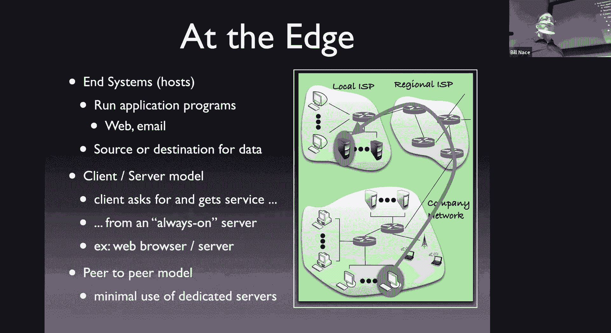

But I'm pretty sure that's not how Zoom works。Okay。These services by the way。

 I mentioned we've got two of them， we have a connection oriented service。

 the network is providing this service for the applications because the applications may want to transfer data from an end host to some other end host and so they're going to ask the network。

 hey， please transfer this data for me。Okay， in this case， with a connection oriented service。

 there's going to be we call it hand sha。We saw a minute ago with that sequence diagram we had some pretty please mad connect to you yes you can that was at handshake at the beginning so that both sides would start off with the same state。

 the same understanding of the connection that they're going to have this provides some sense of reliability is most famously indicated in the N TCP the transmission control protocol that we will talk about extensively in this course。

We also said that the network can provide a connection less service where you don't have to do that handha Okay you just send data because all you want to do is transfer data from sender to。

To destination host。I'm sorry， when you say there's no connection。

 I mean the two machines obviously have to be connected， so in order for them。Yes。

 so it's a good question the question is， what do I mean by connection right because yes。

 there is a physical connection at some point that bits are able to travel down。

What I mean in this case when we have a connection oriented service is that there is some sense of some session of some sort between the sender and the receiver。

 such that the bits all belong to that flow and are put together down that connection。

Okay we'll see more of this when we looked at TCP more detail。and a connection less。

 so we're not looking at individual bits and how they flow。 We're now thinking at a protocol layer。

 a higher layer of how I can get my application to talk to that other application once I connect。My。

 let's say， web browser to a web server through this idea of a connection。

 I can just send my messages down that connection and they will reliably get to the server。

 I can count on them getting there。Yes， in the process。

 they travel from Wifi from my computer to that access point。

 from that access point to the router inre Hall， from Paul know the bits actually do travel down lots of these individual links。

 but the connection I'm talking about here is a higher abstraction layer and。Yeah。

 I hate to kind of kick it down the road， we will talk about this in much more detail later。

If the idea of those abstraction layers is confusing at this point。

The connection list you don't need that connection you just say hey。

 here's a little bit of data please get it to that server over there and it turns out those are not reliable which is the big reason you may or may not want to do this。

Okay， but this is another perfectly good opportunity。

 and we see different applications using different types。

right so many applications are going to go ahead and go through the process and the cost of setting up a connection with that handhaking so that they can get some of the reliability benefits so for instance you web you file transfers and things like that other apps are not going to do that they're just going to use UDP they're going to go ahead and just send the data and if it gets lost oh well they will recover some other way。

啊系。Meant to take a look and see what Zoom was using， I don't know offhand。We lean towards GDPDP。

 but I'm not sure。

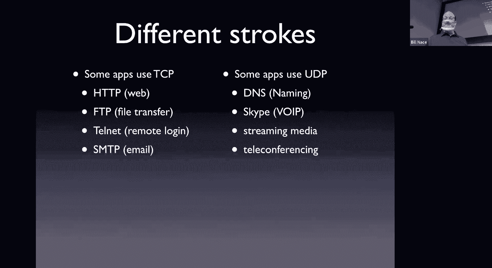

Okay， the network core that's made up of all these routes。

 that's what's left when you take the edge away。These routers are highly interconnected。😡。

Whenever we say router in here I'd like in your mind for you to get this image of a computer that's in some server rack somewhere that has lots and lots of wires connected to it so maybe it has 48 or 96 wires we'd say it has 48 ports or 96 ports on it and so those wires each would connect to some other router somewhere and the job of the router is to figure out as the data comes into it where should it go how should we get this piece of data to its evental destination and all of these routers are going to have to work together to solve this problem this turns out to be kind of the fundamental issue of networking is how do you get the data transferred around and how do you get those guys to communicate well enough and what kind of information do they need to communicate to make that work。

There are kind of two different ways to do this。😡，To make this question。

 we call this circuit switching or packet switching。Before the 1960s。

 every electronic network was a circuit switch network。

 and the idea of a packet switch network was was actually laughed at as unusable and not something you would actually do。

 turns out packet switching one in the long run。 And now almost all electronic networks are packet switch。

 not circuit switch。 So it's a difference。 Well， in a circuit switch network。😊。

What you do is you set up a circuit for the transfer of all your information。

To think of oldtime telephone networks right when you're going to call your grandmother in Des Moines。

 you pick up the phone and it actually makes an electronic circuit。

 it actually connects wire to wire to wire so that the electromagnetic way you send into your telephone gets delivered to your grandmother in Des Moines。

And so there's a dedicated link through all of the routers。That provide some guaranteed performance。

 that's why people loved it， that's why the engineers thought of that being the way to create networks back in the early days。

😡，Because they wanted a network that worked all the time when you were talking to your grandmother in Des Moines。

 all of your signal got there。Okay， so you've got some guaranteed bandwidth that doesn't matter what's happening。

Whether other people are making calls at that time or not。

 you still will be able to send all of your data。

Now how do we do this the idea is you take what available network bandwidth you have and you chop it up into little bits。

😡，That you then can piecemeal out to the different calls that are being made because。

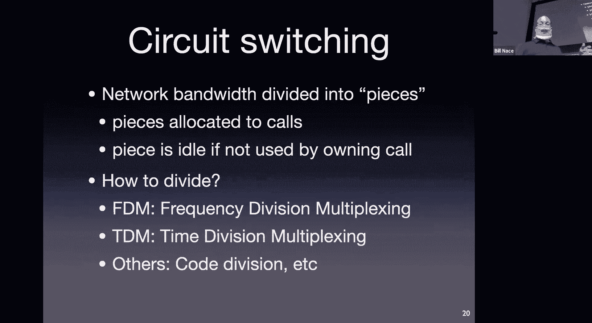

I guess it should be obvious that you know many calls will want to be made through the same length at the same time。

 so when I call my grandmother in Des Moines I'm not the only person using some links there I' got to be able to share it with other people。

 but I get a guarantee I get you know this piece， this fraction is mine for my call and nobody else can take it away from me until I hang up。

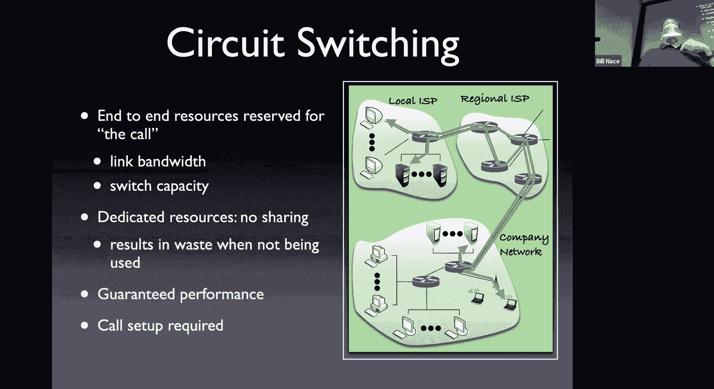

Well， how do we do that， we break it up into chunks。

There are many different ways to break it up in it chunks， frequency division。

 time division multipleing multipleing being a fancy word for breaking it up and being able to put it back together。

 and there are others as well。Here's kind of the quick and brief idea of how to think about frequency division and time division multiplexing。

As your call goes on throughout time。😡，There will be some available frequency。

 some spectrum that is capable of handling of having the electromagnetic signals that make up your particular call and if you need to split up that available frequency。

 you can split it by giving each by dividing into different frequency bands and having different carrier signals in each of those。

 and so in this case I'm breaking it up into four pieces。Would haveve basically done so said。

 you know， there is this amount of bandwidth。There is a relationship between how much frequency you have available and how many bits you can send it at what rate down that to what your bandwidth is so I have this much bandwidth Okay and I'm going to break it up into four pieces and give each of my four users that bandwidth that channel you can kind of think about this like。

TV channels， the entire television spectrum is broken up into pieces and different TV stations get to use different。

Different chunks of that， or maybe Wifi networks also have channels to them。

 They've broken up the available frequency into chunks。

 And then you give a chunk to each of your users and you say， there's your guaranteed bandwidth。

 You get a quarter of the bandwidth and you get it all the time。

The time division of multiplexing starts with the same picture。

 just breaks it up into time chunks instead of frequency chunks。

So now each of my users is going to get the full bandwidth of。That's available。

But they only get it a quarter of the time， they have to take turns。😡，And so again。

 they get a quarter of the bandwidth， it's just a different way of allocating。

 but they' are guaranteed their particular slice of that network bandwidth。

So let's look at an example here for a circuit switch network， I've got a file， it's got 640。

000 bits w that looks like a very particular number you chose Professor Na。

I want to send it over a circuit switch network， and I'm using T1， which is an ancient technology。

 but it was one of the last real time to multiplex circuit switch networks。So that's the bandwidth。

 1。536 megabits per second。I've got 24 slots on that and it takes me half a second to establish the circuit how long will it take before we get there let's look at a couple of quick issues。

One is in networks， when we use kilo mega giga， we mean hours of 10。Okay。

 so when I say megabits per second， I mean millions of bits per second。Okay。

 now many of you may be looking at me like， well， of course that's what M stands for Not always right。

 there are many fields that we're talking about how much disk space you have or how much memory a computer has those things are actually powers of two。

so 1024 is close to 100， we call it a killer， even though it's not exactly a thousand0 for networks。

 it's 1000， okay it's not 1024。The other thing to notice is we're talking about bits per second。

 not bytes per second， okay our networks all send single bits one after another。

And especially since the era they came from there was no good agreement on how big a by was。

 so it's better just to think about how many bits you're sending so all the time when we talk about bandwidth or throughput or transmission rate is always going to be5 percent。

喂。So now we're ready to solve this problem。So what do we do well we take our entire network bandwidth that's available and we chop it into 24 sections right so 1。

536 megabits per second we need to divide that into 24 pieces because that's 24 slots TM slots so we divide it into 24 and we end up with 64 kilobits per second。

Okay you're starting to see where some of these funny numbers will come from， right？Okay。

 if I want to send a file that。It has 640，000 bits in it and I want to send it at 64000 bits per second how long is it going to take you may be saying wait a minute Profesor Nas you haven't given us any equations yet to figure this out and I'll say this is easy enough you don't need one right you can basically do units analysis right if I take the values I have and have a number of bits if I divide that by kilo of bits per second I know to divide because that'll let the bits cancel out then I have a per second on the bottoms that comes up a seconds I'll end up this takes 10 seconds。

Okay， that 10 seconds though is just the transfer rate， so I need to add in my half second。

To set up the circuit。Question。Okay， yeah， 10 and a half seconds to transfer my plot。嗯。All right。

 so that was circuit switching， I have an obolete technology。A question from some yeah。

 so when you like why why do we need those 500 milliseconds。

Oh where does the setup time come from is your question Yeah。

 so the setup time is the time it takes for all of the routers to decide that they can create a circuit between the beginning and the end and allocate the bandwidth to them so you can't instantly start up a circuit。

 you actually have to communicate to the routers because those routers are going to guarantee you some bandwidth。

And you don't know if they have already guaranteed all their bandwidth to some other circuit。

And so there has to be some communication among them all to find a route through the network that has a circuit for you to get to。

That makes sense。Yeah， thank you。Sure。And I'm sorry， what was your name？Abdul Habi。Ala。 All right。

 thanks。 Nice to meet you。Okay， so that's circuit switch I want to emphasize。Obsolete technology。

 We don't do that anymore。 Okay， I'm pointing it out as a way of， by contrast。

 showing what we do do now。 What we do do now is package switching。

And the idea is we're going to take our data and chop it up into some chunks。

 we happen to call these packets。And then we send each packet down each link where it will get the full bandwidth。

 but it has no guarantees， so there's nothing that says you have this bandwidth available to you。

 so it may be that you end up sending your message and there's no bandwidth that at some point in the network to send that and you'll just have to wait until there is bandwidth。

Okay。It's also a stormorn forward network， so there's since there's no circuit connection。

 there's no way for me to have an electromagnetic signal that is， for instance。

 electrically connected somewhere else， and so that means each of the routers is going to have to take the data。

 store it and then send it on。等。This does mean that we end up with resource content。

 this is the reason the packet switching got laughed at for a long time。

The circuit switching engineer said， hey， I've got a network that can guarantee bandwidth。

 why would I ever want to go to this right you may be sending stuff and you don't have a network bandwidth available and therefore your packet is going to get queued up you're going have to wait for something to happen oh that looks really ugly。

We say this leads to a statistically multipleed situation。

Here's what I mean by that you'll notice up at the top I have two senders。

 one guy sending yellow packets and another sending purple packets and they get to this router。

And that router has an output line where both of these packets are intended to go。

 but that line is full right and so it's got to wait it can't when it gets that next yellow packet。

 it can't immediately send it， in fact， it has a queue。

 you'll see there are three of them in the packet。a purple a yellow and a purple that are in line waiting to be sent and so when that yellow packet shows up it's going to go into the back of the queue and have to wait its turn okay we call that congestion。

 none of us like it just like we don't like congestion on the highway。

 we don't like congestion on our networks either， but it's a fact of light。Now， the issue。

 why we call statistical multiplexing is because those packets that are being sent down that wire are in an order that nobody can figure out。

 there's no scheduling that says， oh， packet purple first and then packet it yellow and then purple again。

Okay， it's just whatever order they happen to show up at the router。

 they get sent and so the actual order there。😡，I don't know what it is。

But I can give you some statistical guarantees about， you know， well， if there's this much traffic。

 then you're going to get this percentage of the network on average sort of things。Okay， and for us。

 it turns out to be good enough to get those statistical guarantees。

Also mentioned this was a score and forward network。What that means is your packet gets sent。

So here on the end， I have a end host sending a packet that has L bits in it。

 we always use L it says like length of the number。Length of our packet。

We're sending that with a certain throughput rate or R down that first link。

 And we're going to do the same math we did a minute ago。 bits divided by bandwidth is time。Okay。

 so L over R tells me how much time it will take for that packet to get transferred onto that wire。

 to get to that first router。Now the first router， when it starts seeing bits come in the wire。

What does it do with them Well it has to store them it has to wait and collect and get the entire package before it can do anything that's because it has to do some processing it actually has to do some math on the packet contents to figure out what is this is it a good packet where is it supposed to go let me figure out what to do with it and then it starts transmitting。

😡，And again， it's going to be L over R to get from that first router to the second router where it all gets stored。

Again， before it forwarded enter。Afteron。But there situations where let's say you have a bunch of。

 I guess like messages。They're all incomplete， so it filled up all the started。Receive。

Luckily we live in days where storage is pretty cheap okay so a situation like that is very unlikely to occur and usually actually nowadays the line cards that are on those like infinitether line card is going to collect up the whole message in hardware before it delivers it anyway so。

But we do have to worry about how much memory there should be in and we'll get into some of that we。

Look at somequeing theory behind it。I have a question。 Go ahead， Z， who you Abdul Hay again。Aly， Ha。

 go ahead。So in this case， we're looking at a connection。

 we're looking at connections between links and routers to be R bytes per second， right？Yes。

But what if it's not odd in for some connections like the middle connection。

 what if that wasn't it was something else， Yes， so if it was a Q bit per second。

 then it would be L over Q seconds for that particular length。

SoAnd we do see this where things feels fast。Through particular links and flow through other ones。

Again， that's just fact of life。嗯嗯，对对。All right， I am out of time and it's tempting since you guys now have a more time before your next class for me to get to overrun more than I should。

 but I'm not going to do that。 I will resist that temptation We will go ahead and cease here and we'll pick up on Thursday。

 don't worry I'm a professional I can catch up Okay， and hopefully we'll have。

Some of our Zoom issues resolved by them。Thank you all for showing up today thanks for those who are in the auditorium here with me it's been a kind of surreal experience to have 400 seats and what we got seven people and thank you also for the many of you on Zoom for hanging in there look forward to a full semester with you guys thanks very much。

对。Thank you。Thank you。 Bye bye。 Thank you， bye。professorssor， can I ask a small question， of course。

I'm sorry。 So actually， I'm a little bit confused about the like the the division。

 according to the time， not the frequency。 I'm not sure why you should like divide 24 in that example question。

Okay， so remember that the purpose was we wanted to chop up our bandwidth into some pieces so that we could simultaneously have multiple circuits running down the same wire。

😔，And so time division multiplexing PDM was just a particular technology that allowed that to happen。

And it does that by giving each。Of the circuits， a very small slice of time during which they can use the entire bandwidth。

And so it appears to the application that it's getting 124th of the bandwidth。

TechnicallySo not be transmitted once it to be has to wait if it session expires， is it right？Right。

 so it will actually and so the time slices are usually so it's going to be very， very tiny so that。

The network basically is giving you， you know you've got。You know。

 five milliseconds where you can use the entire bandwidth to send bits and then it's somebody else's turn and so you'll get part of your message then you know because I've got Ive got 1500 bits to 150 you I've got a lot of bits to send I get to send the first。

 you know， 120 of them maybe during my time slice。And then。

You know somebody else gets theirs and you 23 other people get their time places。

 but then I get to startup sending the next tips。Okay， it's not something that there's enough。

And this is all taking care of in the technology of that link so it's not like your computer knows that it got interrupted or anything like that all it really seems is that it's got 1204 of the actual bandwidth。

😔，And my network cards are working to take the bits and send them as fast as they're allowed to within those constraints。

Oh， thank you very much。 Alright， What's your name。My my name is Xu Xian nice to meet you。

Nice to meet you。 Thank you very much。 Yeah。

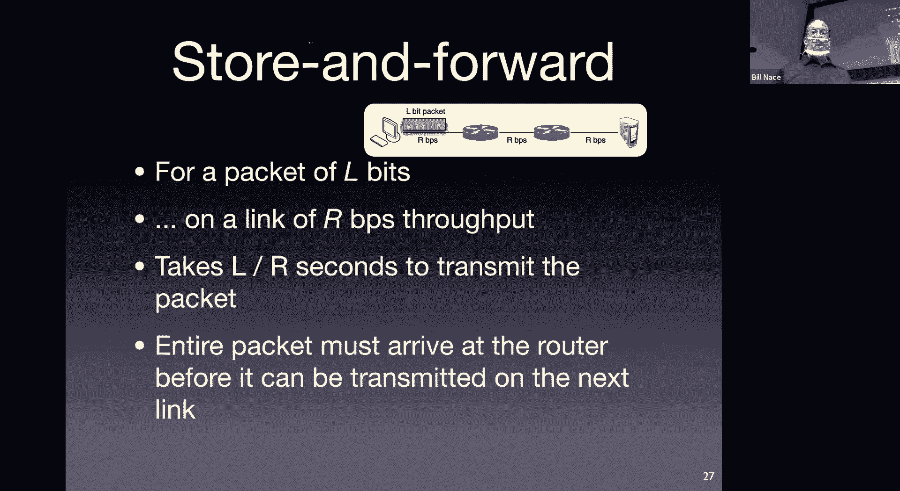

Bye， bye， Prosor。Bye拜e。😔，没有。Right right， sir。 Can I ask you a question about the waiting list。Sure。

So I'm on the top of the waiting list should I like submit the paper review like I'm already enrolled Yes。

 if you are on a waiting list that means you intend to be in the class and so you need to do the work as if you were going to get in the class because if you do。

 then we will have a grade for you。Okay， cool， thanks and。

I don't see any reason that you wouldn't get into the class。😔，Okay。

 so you might as well act like you're going， okay？Nice， thanks， sure。Professor。

 I need to ask something Sure do。Yeah， I'm not yet registered on Piazza。 I mailed you about that。

 So I'm， I'm I'm I don't know if I'm missing any content。

 So I was able to registered within the next hour。 Okay， all right， I got your email last night。

 but I， I got about 100 of them and it was late at night。Actually do anything about them。

 so I'll guess they' taken care of very anyway。Okay， I and just one last thing。

 the paper is due before class。 I will complete it， but just heads up that I mean。

 I will definitely complete it， but I'll be traveling from Mumbai to Pittsburgh tomorrow。 So I。Yeah。

 so yeah， I just wanted to update you。 that said nothing， nothing that okay， yeah。

 so I would recommend you get taking care of it yeah already on it already on。 you next I。

I see the schedule of the class on the site now so it says so it says deadline clip review cl 88 that means the Clark 88 paper is due before the September 3rd class or right at the point of the so that means that's our first assignment all right I'll get on itep。

Anybody else I think would be a point to mention that all the segments towards semester before。

They did， but yeah， anybody else here。Yeah all assignments are due。At9， 50 a before。

Let me find a recording of section。Oh， thanks for invitinging that I should stop the recording。

